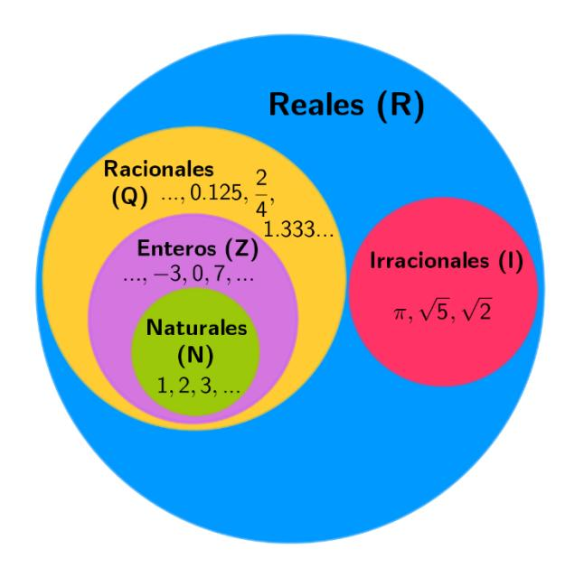
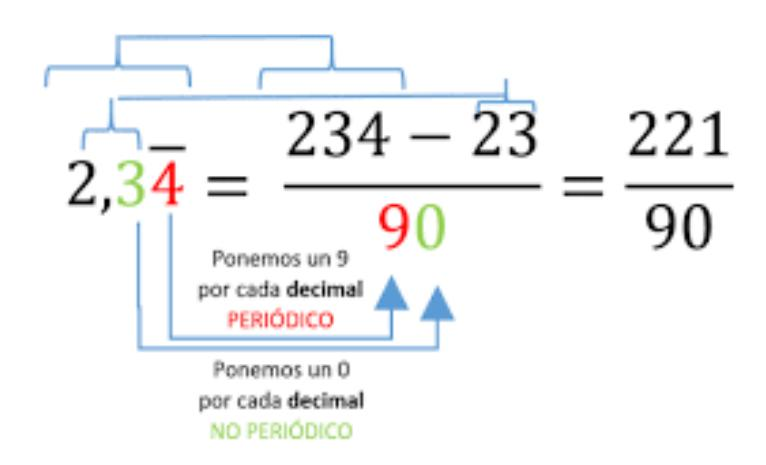

<http://bit.ly/3o8RrCc>

http://bit.ly/2LWs7SN

### **MCM**

Dividir SOLO CON NÚMEROS PRIMOS → Luego multiplicarlos para obtener el MCM

http://bit.ly/39cF4Rn

# **MCD**

# *"Para calcular el Máximo Común Divisor de dos números, debemos descomponerlos en factores primos y multiplicar los facotres comunes de menor exponente"*

https://bit.ly/2LXRsf5

#### **TRUNCAR - REDONDEAR – APROXIMAR**

**Truncar** → "Cortar el Número"

## **Redondear**

- Si la unidad es mayor o igual a 5 → "Avanzamos la unidad"
- Si la unidad es menor a 5 → "Truncamos"

#### **Aproximar**

- Exceso → Siempre se "avanza una unidad"
- Defecto → "Truncamos"

| A LA CENTÉSIMA        | 3.1415 |
|-----------------------|--------|
| Aproximar por exceso  | 3.15   |
| Aproximar por defecto | 3.14   |
| Redondear             | 3.14   |
| Truncar               | 3.14   |