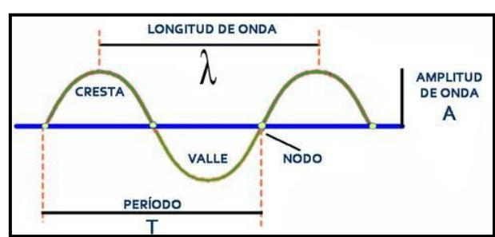

## **DEFINICIÓN ONDA**

*"Perturbación que se repite de manera regular en el espacio y el tiempo, que se transmite sin transporte de materia"* 

## **CARACTERÍSTICAS DE UNA ONDA**

<https://bit.ly/3tX56QD>

**Longitud de onda ():** Distancia recorrida en un ciclo u oscilación.

Consideraremos un **ciclo u oscilación** una **distancia P** si esta pasa por **2 valles**, **2 crestas** o **3 nodos**.

**Frecuencia ():** Número de ciclos en la unidad de tiempo

$$f = \frac{n^{\circ} \ de \ ciclos}{tiempo}$$

**Periodo (T):** Tiempo necesario para completar un ciclo

$$T = \frac{tiempo}{n^{\circ} \ de \ ciclos}$$

**Relación Frecuencia-Período**:

$$f * T = 1 \leftrightarrow T = \frac{1}{f} \leftrightarrow f = \frac{1}{T}$$

**Rapidez de propagación (v):** depende solo del medio por el que se mueve la onda

$$v = \frac{distancia}{tiempo} = \frac{\lambda}{T} = \lambda * f$$