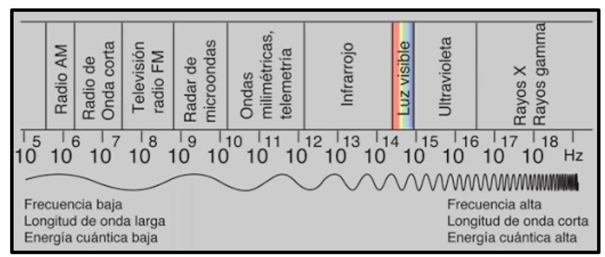
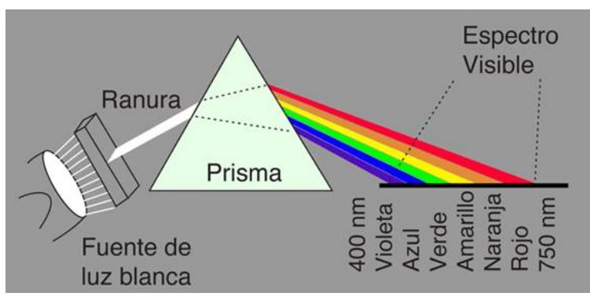

**LUZ:** tipo de energía que nos permite ver los objetos →Tiene un comportamiento dual: partícula y onda (electromagnética y transversal)

En el vacío, independiente de la frecuencia de la onda, todas las ondas electromagnéticas viajan a la misma rapidez de 3 ∗ 108 /

## **FUENTES DE LUZ:**

- Naturales o Artificiales
- Primarias o Secundarias

## **MATERIALES COMPORTAMIENTO CON LUZ**

- Transparentes
- Translúcidos
- Opacos

## **ESPECTRO ELECTROMAGNÉTICO**

https://bit.ly/2Zi2BKU

A mayor frecuencia, menor longitud de onda A menor frecuencia, mayor longitud de onda

## **DISPERSIÓN O DESCOMPOSICIÓN DE LA LUZ**

https://bit.ly/3jW0eHa

La luz blanca se descompone al pasar por un prisma de cristal o una gota de agua