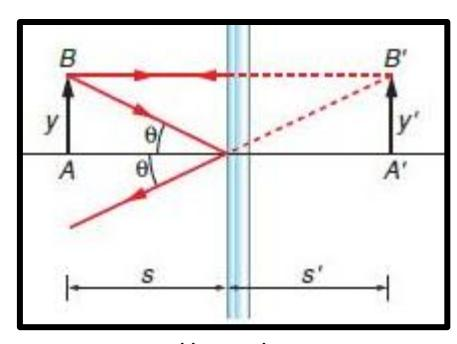
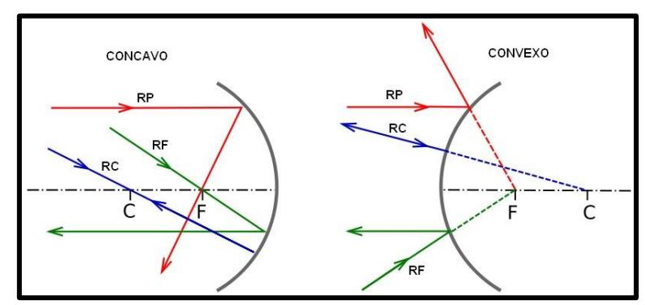

## **ESPEJOS PLANOS** → **REFLEJAN** la luz

IMAGEN: Derecha, virtual y de igual tamaño

https://bit.ly/3tYnoRL *s y s' tienen la misma distancia*

## **RAYOS NOTABLES: ESPEJO CÓNCAVO Y CONVEXO** → **REFLEJAN** la luz

Se necesitan la intersección de 2 rayos notables para formar una imagen <https://bit.ly/2LQD0pf>

## **IMAGEN FORMADA**

| ESPEJO CÓNCAVO            |                                    |
|---------------------------|------------------------------------|
| Si el objeto se encuentra | Su imagen es                       |
| Entre C y el infinito     | Invertida, real y de menor tamaño  |
| En C                      | Invertida, real y de igual tamaño  |
| Entre C y F               | Invertida, real y de mayor tamaño  |
| En F                      | No se produce imagen               |
| Entre F y V               | Derecha, virtual y de mayor tamaño |

| ESPEJO CONVEXO            |                                    |
|---------------------------|------------------------------------|
| Si El objeto se encuentra | Su imagen es                       |
| En cualquier posición     | Derecha, virtual y de menor tamaño |

Las imágenes **virtuales** son siempre **derechas** Las imágenes **reales** son siempre **invertidas**