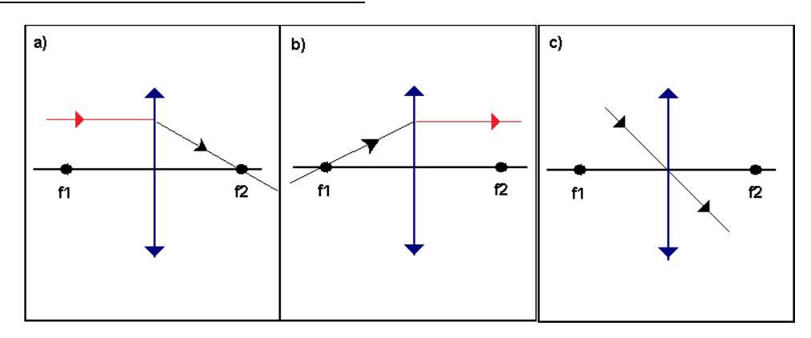
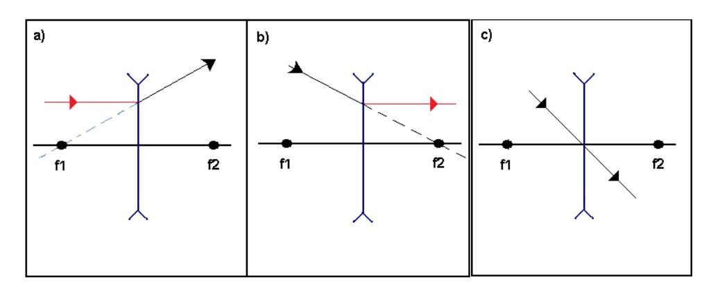
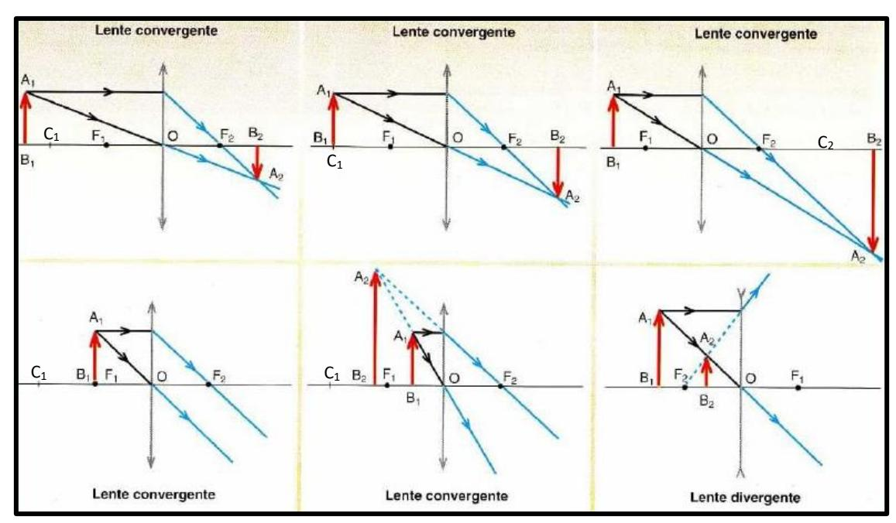

## **LENTES** → **REFRACTAN** la luz

## **RAYOS NOTABLES – LENTE CONVERGENTE**

http://bit.ly/37c4cGw

## **RAYOS NOTABLES – LENTE DIVERGENTE**

http://bit.ly/37c4cGw

## **IMÁGENES FORMADAS** (Los rayos notables

https://bit.ly/3b9vbmW

| LENTE CONVERGENTE         |                                    |
|---------------------------|------------------------------------|
| Si el objeto se encuentra | Su imagen es                       |
| Entre C y el infinito     | Invertida, real y de menor tamaño  |
| En C                      | Invertida, real y de igual tamaño  |
| Entre C y F               | Invertida, real y de mayor tamaño  |
| En F                      | No se produce imagen               |
| Entre F y V               | Derecha, virtual y de menor tamaño |

| LENTE DIVERGENTE          |                                    |
|---------------------------|------------------------------------|
| Si el objeto se encuentra | Su imagen es                       |
| En cualquier posición     | Derecha, virtual y de menor tamaño |