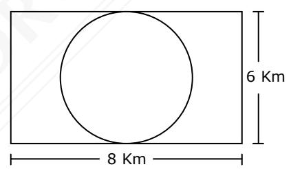

| Nombre: |  |
|---------|--|
| Curso:  |  |

## CUADERNO DE EJERCICIOS Nº 29 PROBABILIDADES DE EVENTOS

1. Se consultó a un grupo de 50 personas acerca de su sabor favorito de cierto tipo de helado. En la tabla adjunta se registran los resultados obtenidos.

| Sabor     | Frecuencia |
|-----------|------------|
| vainilla  | 9          |
| chocolate | 15         |
| frutilla  | 6          |
| manjar    | 20         |

Si se elige a una de estas personas al azar, ¿cuál es la probabilidad de que su sabor favorito sea de vainilla o de frutilla?

- A)  $\frac{3}{10}$
- B)  $\frac{9}{50} \cdot \frac{6}{50}$
- C) 1/54
- D)  $\frac{1}{15}$

(Fuente, DEMRE 2023)

2. En un naipe de 48 cartas (12 copas, 12 oros, 12 bastos, 12 espadas), ¿cuál es la probabilidad de sacar al azar una espada, un oro, un bastos, una copa y nuevamente una espada, en ese orden y sin reposición?

A) 
$$\frac{12}{48} + \frac{12}{48} + \frac{12}{48} + \frac{12}{48} + \frac{11}{47}$$

B) 
$$\frac{12}{48} \cdot \frac{12}{47} \cdot \frac{12}{46} \cdot \frac{12}{45} \cdot \frac{11}{44}$$

C) 
$$\frac{12}{48} \cdot \frac{12}{48} \cdot \frac{12}{48} \cdot \frac{12}{48} \cdot \frac{11}{47}$$

D) 
$$\frac{12}{48} + \frac{12}{47} + \frac{12}{46} + \frac{12}{45} + \frac{11}{44}$$

3. Una compañía de seguros elige una persona para desempeñar cierta función entre 50 aspirantes. Entre los candidatos, hay algunos con título universitario, otros poseen experiencia previa en alguna área de seguros y algunos cumplen con ambos requisitos, como se indica en la tabla adjunta

|                    | Título | Sin título |
|--------------------|--------|------------|
| Experiencia previa | 5      | 10         |
| Sin experiencia    | 15     | 20         |

Si se elige un aspirante al azar entre los 50, entonces ¿cuál es la probabilidad que tenga experiencia previa o que tenga título?

- A) 7 10
- B) 3 5
- C) 1 10
- D) 2 5
- 4. En una bolsa hay en total 22 bolitas del mismo tipo numeradas en forma correlativa del 1 al 22. Si se extrae al azar una bolita de la bolsa, ¿cuál es la probabilidad de que esta tenga un número de un dígito o un número múltiplo de 10?
  - A) 1 9 ∙ 1 2
  - B) 9 22 + 2 21
  - C) 1 9 + 1 2
  - D) 9 22 + 2 22
  - E) 9 22 + 1 22

(Fuente, DEMRE 2017)

- 5. En una sala con 100 alumnos, 30 usan lentes, 40 son hombres y de estos 15 usan lentes. Al seleccionar un alumno al azar, ¿cuál es la probabilidad que sea mujer y no use lentes?
  - A) 0,45
  - B) 0,60
  - C) 0,70
  - D) 0,85
- 6. Se tiene un dado de doce caras (dodecaedro regular), numeradas del 1 al 12. ¿Cuál es la probabilidad de que al lanzarlo una vez, el número obtenido sea un cuadrado perfecto o un múltiplo de 3?
  - A) 7 12
  - B) 5 12
  - C) 1 2
  - D) 1 3
- 7. En una muestra gastronómica la comida está repartida en tres mesas: la primera de comida salada, la segunda de comida dulce y la tercera de comida agridulce. En cada mesa hay 30 porciones de comida fría y 50 de comida caliente. Al elegir un plato al azar, ¿cuál es la probabilidad de que este sea una comida dulce fría o una comida caliente?
  - A) 1 40
  - B) 1 3
  - C) 2 3
  - D) 3 4

8. En un segundo básico se formaron tres grupos mixtos para preparar disertaciones sobre su mascota favorita, como se muestra en la siguiente tabla.

| Grupo | Tema       | niñas | niños |
|-------|------------|-------|-------|
| 1     | El perro   | 5     | 3     |
| 2     | El gato    | 4     | 2     |
| 3     | El hámster | 4     | 4     |

La profesora elige al azar a un solo integrante de cada grupo para que exponga el tema. ¿Cuál es la probabilidad de que en los tres grupos el representante sea una niña?

- A) 5 22
- B) 5 24
- C) 1 22
- D) 1 24
- 9. En una fiesta de cumpleaños a cada invitado se le regala un "raspe", repartiéndose 40 en total, de los cuales el 15% tiene premio. Si se eligen tres invitados al azar, ¿cuál es la probabilidad de que los tres tengan un raspe premiado?
  - A) 1 40
  - B) 15 40
  - C) 1 494
  - D) 2 247
- 10. En una caja hay en total siete bolitas, de las cuales tres son blancas y cuatro son negras, todas del mismo tipo. Si se extraen al azar dos bolitas sin reposición, ¿cuál es la probabilidad de que la primera sea negra y la segunda sea blanca?
  - A) 2 7
  - B) 1 12
  - C) 1 42
  - D) 7 12
  - E) 12 49

(Fuente, DEMRE 2016)

11. Se realizó una encuesta sobre las preferencias de un grupo de personas respecto a su pasatiempo favorito, tal que cada persona eligió solo un pasatiempo. En esta encuesta 30 personas indicaron que su pasatiempo favorito es leer, 48 personas indicaron que es hacer deporte y n personas indicaron que es ver películas.

Al elegir una persona al azar de este grupo, la probabilidad de que su pasatiempo favorito no sea hacer deporte es 0,6.

¿Cuál es la cantidad de personas que indicaron ver películas?

- A) 22
- B) 42
- C) 52
- D) 117

(Fuente, DEMRE 2023)

- 12. Se tienen dos llaveros: P con 4 llaves y Q con 2 llaves. En cada llavero solo hay una llave que abre la puerta de una bodega. Cada llavero tiene la misma probabilidad de ser elegido y cada llave de ese llavero es equiprobable de ser elegida. Si se escoge un llavero al azar y de él se escoge al azar una llave, ¿cuál(es) de las siguientes afirmaciones es (son) verdadera(s)?
  - I) La probabilidad de que la llave abra la bodega es 3 8 .
  - II) La probabilidad de que el llavero escogido sea Q y que la llave no abra la bodega es 1 2 .
  - III) La probabilidad de que el llavero escogido sea P y que la llave abra la bodega es la mitad de la probabilidad de que el llavero escogido sea Q y que la llave abra la bodega.
  - A) Solo I
  - B) Solo II
  - C) Solo I y II
  - D) Solo I y III
  - E) Solo II y III

(Fuente, DEMRE 2018)

- 13. En una tómbola hay 27 bolitas, todas de igual peso y tamaño, donde cada una de ellas está identificada con una de las letras del abecedario. Si se extraen dos bolitas, una tras otra con reposición, de esta tómbola, ¿cuál es la probabilidad de que la primera bolita extraída tenga la misma letra que la segunda bolita extraída?
  - A) 1 27 · 1 26
  - B) 1 27 · 1 27
  - C) 1 27 + 1 27
  - D) 1 27
- 14. En un joyero hay 6 pulseras de plata y 4 de oro, si se sacan dos pulseras al azar, ¿cuál es la probabilidad de que al menos una sea de oro?
  - A) 1
  - B) 1 2
  - C) 2 3
  - D) 5 6
- 15. Un reloj análogo perdió dos de sus punteros, quedando sólo el segundero. ¿Cuál es la probabilidad de obtener un múltiplo de 3 al mirar una vez el reloj?
  - A) 1 2
  - B) 1 3
  - C) 5 9
  - D) 5 18

- 16. Un curso mixto está compuesto por 6 varones y 4 mujeres. Si se escogen dos alumnos sucesivamente a una interrogación, ¿cuál es la probabilidad de que estos sean de distinto sexo?
  - A) 8 10
  - B) 8 15
  - C) 24 90
  - D) 24 100
- 17. Hay 7 fichas azules y 5 fichas verdes en la bolsa A, mientras que en la bolsa B hay 5 fichas azules y 15 fichas verdes. Si todas las fichas son de la misma forma y tamaño, al sacar una ficha de cada bolsa, ¿cuál es la probabilidad que ambas sean verdes?
  - A) 5 48
  - B) 7 48
  - C) 5 16
  - D) 7 16
- 18. Ramiro y Gonzalo están matriculados en un curso de fotografía. Desde que comenzó el curso, la asistencia a clases de Ramiro ha sido de un 80% y la de Gonzalo de un 60%, siendo independientes sus ausencias. Si se elige un día al azar en que se haya impartido el curso, ¿cuál es la probabilidad de que al menos uno de ellos haya asistido a clases?
  - A) 0,70
  - B) 0,75
  - C) 0,82
  - D) 0,92

- 19. La probabilidad de que un alumno universitario apruebe la asignatura A es 0,8 y la probabilidad de que apruebe la asignatura B es 0,9, siendo independiente los resultados que se obtengan en cada una de las asignaturas. ¿Cuál es la probabilidad de que apruebe al menos una de estas asignaturas?
  - A) 0,85
  - B) 0,98
  - C) 0,92
  - D) 0,96
- 20. Se tienen tres cajas, A, B y C. La caja A contiene 3 fichas blancas y 9 rojas, la caja B contiene 4 fichas blancas y 8 rojas y la caja C contiene 8 fichas blancas y 4 rojas. Si se saca al azar una ficha de cada caja, entonces ¿cuál es la probabilidad que las tres fichas sean **del mismo color**?
  - A) 1 18
  - B) 1 6
  - C) 2 9
  - D) 1 108
- 21. En una bolsa hay 6 pelotitas numeradas del 1 al 6. Al sacar 2 pelotitas, una tras otra sin reposición, ¿cuál es la probabilidad que sean 2 números consecutivos?
  - A) 1 15
  - B) 18 5
  - C) 1 3
  - D) 36 5

- 22. Se lanza un dado tres veces, obteniéndose 6 puntos en el primer lanzamiento. ¿Cuál es la probabilidad que la suma de los puntajes obtenidos en el segundo y en el tercer lanzamiento sea 6?
  - A) 1 6
  - B) 5 6
  - C) 1 36
  - D) 5 36
- 23. En una caja hay seis ampolletas, de las cuales, dos son de 25 watts y el resto de 40 watts. Si se extraen dos ampolletas a la vez, ¿cuál es la probabilidad que ambas sean de 40 watts?
  - A) 1 3
  - B) 2 3
  - C) 2 5
  - D) 3 5
- 24. Un proyectil está programado para que caiga en cualquier punto de la zona rectangular de la figura adjunta.

Si se considera = 3, ¿cuál es la probabilidad de que dicho proyectil no caiga en la zona circular?

- A) 1 2
- B) 1 3
- C) 3 16
- D) 21 48

- 25. En una urna con fichas azules, blancas, rojas y verdes, la probabilidad de escoger una ficha azul o blanca es 0,4. Si en la urna hay 15 fichas de las cuales 7 son verdes, entonces ¿cuál es el número de fichas rojas?
  - A) 6
  - B) 5
  - c) 4
  - D) 2
- 26. Cuando se lanza un dado normal y respecto al resultado que se obtenga, ¿cuál de las siguientes afirmaciones es verdadera?
  - A) La probabilidad que sea un primo impar es mayor que la probabilidad que sea par y no sea primo.
  - B) La probabilidad que sea un cuadrado perfecto es menor que la probabilidad que sea un número compuesto.
  - C) La probabilidad que sea un número compuesto es mayor que la probabilidad que sea un primo que no sea par.
  - D) La probabilidad que sea un primo que no sea par, es la misma que sea par y no sea primo.
- 27. En una bolsa hay 11 fichas, de las cuales 6 son rojas y el resto son azules. si se extraen de la bolsa, 2 fichas al azar y no se reponen, ¿cuál de las siguientes operaciones permite determinar la probabilidad que éstas sean de distinto color?
  - A)  $\frac{6}{10} \cdot \frac{5}{10}$
  - B)  $\frac{6}{11} \cdot \frac{5}{10}$
  - C)  $\frac{6}{11} \cdot \frac{5}{10} + \frac{6}{10} \cdot \frac{5}{11}$
  - D)  $\left(\frac{6}{11} + \frac{5}{10}\right) \cdot \left(\frac{6}{10} + \frac{5}{11}\right)$

28. La tabla adjunta muestra los resultados de una encuesta realizada a un grupo de estudiantes de Tecnología Médica, los cuales debieron escoger una de las tres especialidades que se indican en la tabla.

|        | Bioanálisis clínico | Imagenología | Morfofisiopatología |
|--------|------------------------|--------------|---------------------|
| Hombre | 24                     | 36           | 12                  |
| Mujer  | 16                     | 24           | 8                   |

Si se escoge aleatoriamente uno de estos estudiantes, ¿cuál es aproximadamente la probabilidad que sea hombre o que haya escogido la especialidad de Morfofisiopatología?

- A) 66,67%
- B) 68,60%
- C) 72,60%
- D) 76,67%

## **RESPUESTAS**

| 1. | A | 6.  | C | 11. | B | 16. | B | 21. | C | 26. | D |
|----|---|-----|---|-----|---|-----|---|-----|---|-----|---|
| 2. | B | 7.  | D | 12. | D | 17. | C | 22. | D | 27. | C |
| 3. | B | 8.  | B | 13. | D | 18. | D | 23. | C | 28. | A |
| 4. | D | 9.  | C | 14. | C | 19. | B | 24. | D |     |   |
| 5. | A | 10. | A | 15. | B | 20. | C | 25. | D |     |   |

**MA-35**