**Matemática M1 Material : MOD-07**

| Nombre: |  |
|---------|--|
|         |  |

# MÓDULO **N° 7 ESTADÍSTICA Y PROBABILIDADES**

### **EJERCICIOS DE DESARROLLO**

1. ¿Cuál es el promedio (o media aritmética) entre los números 0,025, 0,035, 0,045 y 0,055?

(Fuente, DEMRE 2010)

2. Se hizo una encuesta sobre el tipo de película preferido por los alumnos de un curso, obteniéndose los siguientes resultados

| Tipo de película | N° de alumnos (f) | Frecuencia relativa |  |
|------------------|-------------------|---------------------|--|
| Acción (A)       | 18                | 0,45                |  |
| Drama (D)        | 12                | 0,30                |  |
| Ficción (F)      | 10                | 0,25                |  |

¿Cuál(es) de los siguientes gráficos se pueden construir a partir de la información entregada en la tabla adjunta?

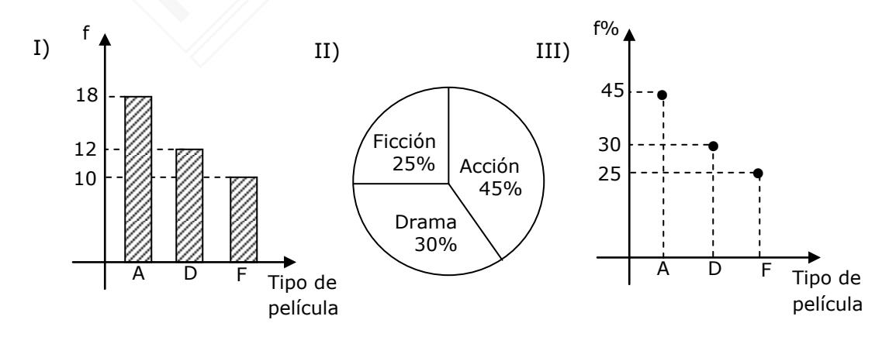

(Fuente, DEMRE 2013)

3. El gráfico de la figura adjunta corresponde a la información recopilada de una encuesta hecha en Santiago acerca de la cantidad de hermanos. De acuerdo a lo que se desprende de él, complete la tabla y luego responda:

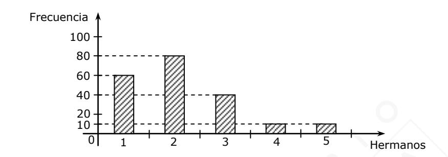

| Variable | Frecuencia absoluta | Frecuencia relativa | Frecuencia relativa % | Frecuencia acumulada |
|----------|------------------------|------------------------|--------------------------|-------------------------|
|          |                        |                        |                          |                         |
|          |                        |                        |                          |                         |
|          |                        |                        |                          |                         |
|          |                        |                        |                          |                         |

- a) ¿Cuánta gente tiene la muestra?
- b) ¿Cuál es la moda de la muestra?
- c) ¿Cuál es la media aritmética?
- d) ¿Cuál es la mediana?
- 4. En la tabla adjunta se muestran algunos datos sobre la cantidad de horas de conexión a internet por el total de los estudiantes de un curso durante una semana. ¿Cuál(es) de las siguientes afirmaciones es (son) verdadera(s)?

| Horas     | Número de estudiantes | Frecuencia relativa porcentual |  |  |
|-----------|--------------------------|-----------------------------------|--|--|
| [0, 6[    | 8                        |                                   |  |  |
| [6, 12[   |                          | 40%                               |  |  |
| [12, 18]  | 12                       | 30%                               |  |  |
| Más de 18 | 4                        |                                   |  |  |

- I) El curso tiene 40 estudiantes.
- II) Más de la mitad de los estudiantes se conectó a internet menos de 12 horas.
- III) Más de la mitad de los estudiantes se conectó a internet entre 6 y 18 horas, ambos valores incluidos.

(Fuente, DEMRE 2018)

- 5. Si la tabulación del peso de 50 niños recién nacidos se muestra en la tabla adjunta, ¿cuál(es) de las siguientes afirmaciones es (son) verdadera(s)?
  - I) La mediana se encuentra en el segundo intervalo.
  - II) Un 20% de los recién nacidos pesó 4 o más kilogramos.
  - III) El intervalo modal es 3,0 3,4.

| Peso (kg)    | N° de niños |
|--------------|-------------|
| 2,5 – 2,9 | 5           |
| 3,0 – 3,4 | 23          |
| 3,5 – 3,9 | 12          |
| 4,0 – 4,4 | 10          |

(Fuente, DEMRE 2015)

6. Un nutricionista que decide someter a una dieta a 10 de sus pacientes, escoge a 5 mujeres y a 5 hombres de condiciones físicas similares. Después de un mes de estar sometidos a la dieta, a cada uno de los pacientes se le realiza mediciones para determinar la variación del índice de masa corporal (IMC) durante este tiempo y los resultados obtenidos se encuentran en la tabla adjunta. Basado en estos datos, ¿cuál(es) de las siguientes afirmaciones es (son) verdadera(s)?

|         | Variación del IMC |      |     |     |     |
|---------|-------------------|------|-----|-----|-----|
| Mujeres | 0,9               | 1,2  | 1   | 0,4 | 0,5 |
| Hombres | 1,2               | -0,5 | 1,3 | 1,5 | 0,5 |

- I) El promedio de las variaciones del IMC de los hombres y de las mujeres es el mismo.
- II) La mediana de las variaciones del IMC de las mujeres está por debajo de la de los hombres.

(Fuente, DEMRE 2017)

- 7. De acuerdo a los datos 18, 27, 34, 52, 54, 59, 61, 68, 78, 82, 85, 87, 91, 93, 100, ¿cuál(es) de las siguientes afirmaciones es (son) verdadera(s)?
  - I) El primer cuartil es 52
  - II) El tercer cuartil es 87
  - III) El rango es 82.

- 8. Dados los siguientes datos: p + q, **p**, **q**, p + 1, q + 1, con **p** y **q** naturales, no consecutivos, tal que p > q > 1, calcule:
  - a) Moda.
  - b) Mediana.
  - c) Media aritmética.
- 9. Si en el cuarto medio A de un colegio hay **r** alumnos y el promedio de la última prueba de matemática fue **t** y en el cuarto B hay **n** alumnos y el promedio de la misma prueba fue **h**, calcule:
  - a) La suma de todas las notas de la última prueba de matemática del cuarto A.
  - b) La suma de todas las notas de la última prueba de matemática del cuarto B.
  - c) El promedio general de la prueba.
- 10. En una urna hay 5 fichas verdes y 8 azules. Si todas las fichas son del mismo tipo, calcule la probabilidad de
  - a) sacar una ficha azul y a continuación una verde, sin devolución.
  - b) sacar una ficha azul y a continuación una verde, con devolución.
  - c) sacar una ficha de cada color, sin devolución.
  - d) sacar una ficha de cada color, con devolución.
- 11. En una sala hay 14 mujeres y 16 hombres. De las mujeres, 2 7 son rubias y de los hombres, 9 no son rubios. Si se escoge una persona al azar, ¿cuál es la probabilidad de que esta persona sea
  - a) hombre?
  - b) mujer y no rubia?
  - c) mujer o no rubio?

- 12. Al lanzar dos dados comunes
  - I) 6 veces, siempre una vez la suma será 4.
  - II) 36 veces, siempre 3 veces la suma será 4.
  - III) 36 mil millones de veces, teóricamente alrededor de 3 mil millones de veces la suma será 4.

Es (son) verdadera(s)

(Fuente, DEMRE 2011)

- 13. Si se lanza una moneda tres veces, ¿cuál(es) de las siguientes afirmaciones es (son) verdadera(s)?
  - I) Es más probable obtener menos de dos caras que exactamente un sello.
  - II) Es más probable obtener exactamente un sello que exactamente dos sellos.
  - III) Es más probable obtener menos de dos caras que exactamente dos sellos.

(Fuente, DEMRE 2012)

14. En la tabla adjunta se muestran los resultados de una encuesta realizada a 60 personas, sobre la preferencia de mermeladas, clasificadas en no dietética y dietética. Al seleccionar a uno de estos encuestados al azar, la probabilidad de que este prefiera una mermelada no dietética, sabiendo que es mujer, es

|        | Mermelada    |           |  |
|--------|--------------|-----------|--|
|        | No dietética | Dietética |  |
| Mujer  | 6            | 24        |  |
| Hombre | 18           | 12        |  |

(Fuente, DEMRE 2017)

## **EJERCICIOS DE SELECCIÓN MÚLTIPLE**

- 1. Si las notas de Esteban en una asignatura son: 3, 4, 6, 3, 5, 5, 6, 3, 4 y de estas notas se cambia un 6 por un 7, ¿cuál(es) de las siguientes medidas de tendencia central cambia(n)?
  - I) La moda.
  - II) La mediana.
  - III) La media aritmética (promedio).
  - A) Solo II
  - B) Solo III
  - C) Solo I y II
  - D) Solo II y III
  - E) Ninguna de ellas

(Fuente, DEMRE 2013)

- 2. El gráfico circular de la figura muestra el resultado de una investigación sobre el color del cabello de 1.200 personas. ¿Cuál(es) de las siguientes afirmaciones es (son) verdadera(s)?
  - I) 360 personas tienen el cabello rubio.
  - II) Más del 50% de las personas tienen el cabello rubio o negro.
  - III) Hay tantas personas con cabello rubio como personas con el cabello castaño.
  - A) Solo III
  - B) Solo I y II
  - C) Solo I y III
  - D) Solo II y III
  - E) I, II y III

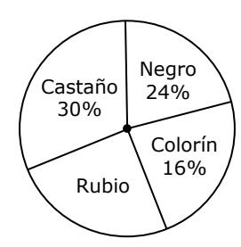

(Fuente, DEMRE 2010)

- 3. A los 45 alumnos de un curso se les consultó acerca de cuál era su deporte favorito. La tabla adjunta muestra los resultados obtenidos. Para estos datos, ¿cuál(es) de las siguientes afirmaciones es (son) verdadera(s)?
  - I) La moda es 19.
  - II) La media aritmética (o promedio) es 11,25.
  - III) La mediana es 11.
  - A) Solo I
  - B) Solo I y II
  - C) Solo II y III
  - D) I, II y III
  - E) Ninguna de ellas

| Deportes   | Nº de alumnos |
|------------|------------------|
| Tenis      | 9                |
| Básquetbol | 13               |
| Fútbol     | 19               |
| Natación   | 4                |

(Fuente, DEMRE 2012)

4. La distribución de los sueldos, en pesos, de los trabajadores de una empresa se muestra en el diagrama de caja de la figura adjunta.

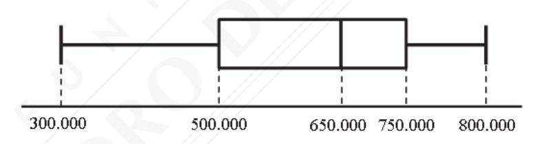

Según este diagrama, ¿cuál de las siguientes afirmaciones es **siempre** verdadera?

- A) El rango intercuartil de los sueldos de los trabajadores es \$ 250.000.
- B) El promedio de los sueldos de los trabajadores es \$ 650.000.
- C) La cantidad de trabajadores que ganan entre \$ 300.000 y \$ 500.000 es mayor que la cantidad de trabajadores que gana entre \$ 650.000 y \$ 750.000.
- D) Exactamente un 50% de los trabajadores gana \$ 650.000.
- E) Un 62,5% de los sueldos de los trabajadores es igual o menor a \$ 700.000.

(Fuente, DEMRE 2020)

5. En el gráfico de la figura adjunta se muestra la frecuencia acumulada de las alturas, en metros, de los edificios construidos el último año en una determinada comuna, donde los intervalos son de la forma [a, b[ y el último de la forma [c, d]. A partir de la información presentada en el gráfico se construye la siguiente tabla de frecuencias.

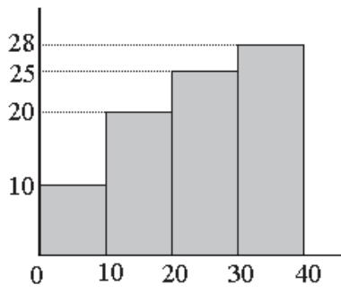

| Altura en | Frecuencia |  |
|-----------|------------|--|
| metros    |            |  |
| [0, 10[   | R          |  |
| [10, 20[  | S          |  |
| [20, 30[  | T          |  |
| [30, 40]  | Q          |  |

¿Cuáles son los valores de R, S, T y Q?

A) 
$$R = 5$$
,

$$S = 15$$
.

A) 
$$R = 5$$
,  $S = 15$ ,  $T = 25$  y  $Q = 35$ 

B) 
$$R = 10$$

$$S = 30,$$

B) 
$$R = 10$$
,  $S = 30$ ,  $T = 60$  y  $Q = 100$ 

C) 
$$R = 10$$
,  $S = 20$ ,  $T = 30$  y  $Q = 40$ 

$$S = 20,$$
  
 $S = 30$ 

D) 
$$R = 10$$
,  $S = 20$ ,  $T = 50$   $Y = 40$ 

E) 
$$R = 10$$
,  $S = 10$ ,  $T = 5$  y  $Q = 3$ 

$$T = 5$$

(Fuente, DEMRE 2020)

6. En la tabla adjunta se agrupan los resultados de haber consultado a un grupo de personas respecto a la cantidad de primos que tiene. Según los datos de la tabla, ¿cuál de las siguientes afirmaciones **NO** se puede deducir?

| N° Primos | Marca de Clase (xi) | Frecuencia (fi) | xi ∙ fi |
|-----------|------------------------|--------------------|------------|
| [0, 3[    | 1,5                    | 5                  | 7,5        |
| [3, 6[    | 4,5                    | 12                 | 54         |
| [6, 9[    | 7,5                    | 16                 | 120        |
| [9, 12[   | 10,5                   | 13                 | 136,5      |
| [12, 15[  | 13,5                   | 9                  | 121,5      |
| [15, 18[  | 16,5                   | 8                  | 132        |
| [18, 21[  | 19,5                   | 5                  | 97,5       |
| [21, 24[  | 22,5                   | 2                  | 45         |

Total: 714

- A) El intervalo modal es [6,9[.
- B) La media de la variable es 10,2 primos.
- C) El intervalo donde se encuentra la mediana de la variable es [9,12[.
- D) Un 10% de los consultados tiene más de 18 primos.
- E) Por lo menos un 40% de los consultados tiene más de 2 primos y menos de 9 primos.

(Fuente, DEMRE 2017)

- 7. En un liceo se realiza un registro de las masas de los estudiantes de cuarto medio. Si los cuartiles de la distribución de los datos son 75 kg, 80 kg y 90 kg, ¿cuál(es) de las siguientes afirmaciones se puede(n) deducir de esta información?
  - I) La mayor cantidad de estudiantes de cuarto medio se concentra entre el cuartil 2 y el cuartil 3.
  - II) Por lo menos un 50% de los estudiantes de cuarto medio tiene una masa de a lo menos 75 kg y a lo más 90 kg.
  - III) La media aritmética de las masas de los estudiantes de cuarto medio es de 81,6 kg, aproximadamente.
  - A) Solo I
  - B) Solo II
  - C) Solo III
  - D) Solo I y II
  - E) I, II y III

(Fuente, DEMRE 2020)

8. En la tabla adjunta se muestran las notas por asignatura obtenidas por Rodrigo y Mariel.

| Asignatura         | Rodrigo | Mariel |
|--------------------|---------|--------|
| Lenguaje           | 5,2     | 5,8    |
| Matemática         | 4,8     | 5,2    |
| Inglés             | 5,0     | 4,0    |
| Ciencias Sociales  | 6,0     | 4,5    |
| Ciencias Naturales | 4,0     | 5,5    |

- Si P y Q representan los promedios de las notas de Rodrigo y Mariel, respectivamente, R y S son las medianas de sus respectivas notas, ¿cuál de las siguientes relaciones es verdadera?
- A) P = Q y R > S
- B) P > Q y R < S
- C) P = Q y R < S
- D) P > Q y R > S
- E) P < Q y R = S

(Fuente, DEMRE 2020)

- 9. En un estudio se registró en una tabla de datos agrupados el tiempo de duración en horas de un lote de ampolletas y con estos datos se construyó la ojiva de la figura adjunta. De acuerdo a este gráfico se puede deducir que
  - I) 97 ampolletas fueron registradas en el estudio.
  - II) la mayor cantidad de ampolletas duró entre 300 y 400 horas.
  - III) la mediana del número de horas de duración de las ampolletas se encuentra en el intervalo [200, 300[.

Es (son) verdadera(s)

- A) solo I.
- B) solo II.
- C) solo III.
- D) solo I y III.
- E) Ninguna de ellas.

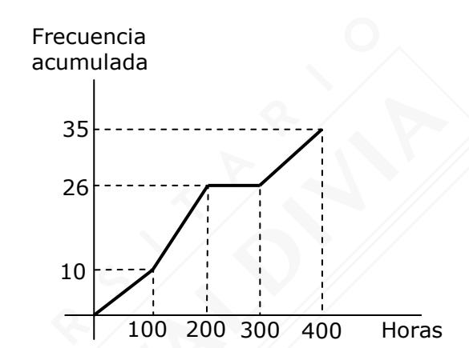

(Fuente, DEMRE 2016)

- 10. El gráfico de la figura adjunta muestra los puntajes, en intervalos, obtenidos en una prueba por los alumnos de un curso. Se desconoce el número de personas que obtuvo puntajes entre 250 y 350 puntos. Si se sabe que el promedio total del curso, obtenido a partir de la marca de clase, es de 360 puntos, ¿cuántos alumnos rindieron la prueba?
  - A) 50 B) 40 C) 30 D) 20 E) 10

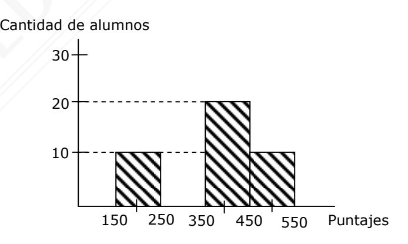

(Fuente, DEMRE 2014)

11. ¿Cuál de los siguientes gráficos representa a un conjunto de datos con media igual a 5 y primer cuartil igual a 2?

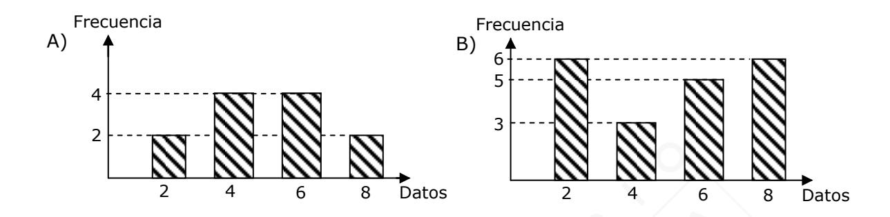

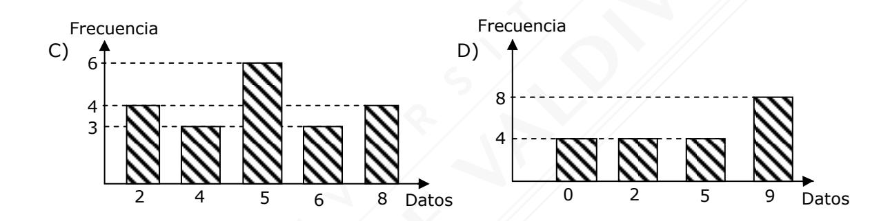

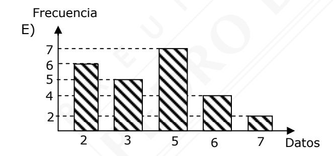

(Fuente, DEMRE 2016)

12. En la tabla adjunta se muestra la distribución de las edades, en años, de un grupo de personas.

| Intervalo | Frecuencia | Frecuencia relativa porcentual |
|-----------|------------|-----------------------------------|
| [12, 18[  | 8          | 16                                |
| [18, 24[  | 14         |                                   |
| [24, 30[  |            |                                   |
| [30, 36[  |            | 18                                |
| [36, 42]  | 3          |                                   |

Según los datos de la tabla, ¿cuál de las siguientes afirmaciones es **FALSA**?

- A) La marca de clase del intervalo de mayor frecuencia es 27 años.
- B) Un 44% de las personas tiene menos de 24 años.
- C) El grupo en total tiene 50 personas.
- D) Exactamente, un 38% de las personas tiene menos de 30 años.
- E) 28 personas tienen a lo menos 24 años.

(Fuente, DEMRE 2020)

13. En las tablas adjuntas se muestran los resultados obtenidos en dos muestras para la variable M, con p < q < r. Si m es la media aritmética de una muestra A y n es la media aritmética de la muestra B y las medianas de las muestras A y B son s y t, respectivamente, ¿cuál de las siguientes relaciones es verdadera?

| Muestra A  |            |  |  |  |  |
|------------|------------|--|--|--|--|
| Variable M | Frecuencia |  |  |  |  |
| p          | 3          |  |  |  |  |
| q          | 5          |  |  |  |  |
| r          | 4          |  |  |  |  |

| Muestra B  |            |  |  |  |  |
|------------|------------|--|--|--|--|
| Variable M | Frecuencia |  |  |  |  |
| p          | 5          |  |  |  |  |
| q          | 3          |  |  |  |  |
| r          | 4          |  |  |  |  |

- A) m > n, s = t
- B) m > n, s < t
- C) m < n, s > t
- D) m < n, s = t
- E) m = n, s = t

(Fuente, DEMRE 2018)

- 14. Un curso está compuesto por 30 hombres, de los cuales 10 utilizan frenillos y 20 mujeres, de las cuales 6 no los usan. Si se selecciona a un estudiante del curso al azar, ¿cuál es la probabilidad de que sea mujer y utilice frenillos?
  - A) 35 50
  - B) 14 50
  - C) 14 24
  - D) 24 125
  - E) 6 20

(Fuente, DEMRE 2017)

- 15. Se tienen tres cajas A, B y C, cada una con fichas del mismo tipo. La caja A contiene 4 fichas blancas y 6 rojas, la caja B contiene 5 fichas blancas y 7 rojas y la caja C contiene 9 fichas blancas y 6 rojas. Si se saca al azar una ficha de cada caja, la probabilidad de que tres fichas sean **rojas** es
  - A) 7 50
  - B) 1 8
  - C) 1 252
  - D) 19 12
  - E) 19 37

(Fuente, DEMRE 2009)

- 16. En una bolsa se tienen fichas del mismo tipo, de colores blanco, verde y rojo. Se sabe que la probabilidad de sacar, al azar, una ficha verde es 1 5 y de sacar al azar una ficha roja o verde es 1 2 . Si se saca una ficha al azar, ¿cuál es la probabilidad de que ésta sea blanca o roja?
  - A) 1 2
  - B) 4 5
  - C) 3 20
  - D) 3 10
  - E) 1

(Fuente, DEMRE 2011)

**Blanco Rojo Total**

14 15 29

Auto 8 5 13 Camioneta 6 10 16

- 17. El cuadro muestra la venta de dos tipos de vehículos en un negocio durante el mes de Junio, separados por color. ¿Cuál es la probabilidad de que si se elige un vehículo al azar, éste sea o bien una camioneta de cualquier color o bien cualquier vehículo de color blanco?
  - A) 24 29
  - B) 6 14
  - C) 6 16
  - D) 6 29
  - E) Ninguna de las probabilidades anteriores.

(Fuente, DEMRE 2007)

- 18. En una habitación se encuentran 20 personas adultas y 12 adolescentes. De los adultos 14 son mujeres y de los adolescentes 4 son hombres. Si se escoge una persona al azar, ¿cuál(es) de las siguientes afirmaciones es (son) verdadera(s)?
  - I) La probabilidad de que esta persona sea un adulto es 5 8 .
  - II) La probabilidad de que esta persona sea un hombre es 5 16 .
  - III) La probabilidad de que esta persona sea una adolescente es 2 3 .
  - A) Solo I
  - B) Solo II
  - C) Solo I y II
  - D) Solo I y III
  - E) I, II y III

(Fuente, DEMRE 2007)

- 19. La tabla adjunta está incompleta y muestra el número de piezas de géneros de distintos tipos A1 a A8, que hay en una tienda. Si se elige una de estas piezas, al azar, ¿cuál es la probabilidad de que ésta sea del tipo A6 o del tipo A8?
  - A) 0,2
  - B) 0,3
  - C) 0,34
  - D) 0,65
  - E) No se puede determinar.

| Ai | Frecuencia absoluta | Frecuencia acumulada | Frecuencia relativa |
|----|------------------------|-------------------------|------------------------|
| A1 | 4                      |                         | 0,08                   |
| A2 | 4                      |                         |                        |
| A3 |                        | 16                      | 0,16                   |
| A4 | 7                      |                         | 0,14                   |
| A5 | 5                      | 28                      |                        |
| A6 |                        | 38                      |                        |
| A7 | 7                      | 45                      |                        |
| A8 |                        |                         |                        |

(Fuente, DEMRE 2013)

- 20. Un colegio ofrece a sus estudiantes varias actividades culturales, entre ellas teatro y danza. El 10% de los estudiantes del colegio participa en danza, el 8% participa en teatro y el 4% de los estudiantes del colegio participa en danza y teatro. Si se escoge al azar un estudiante del colegio, ¿cuál es la probabilidad de que éste participe en teatro si se sabe que participa en danza?
  - A) 2 9
  - B) 2 5
  - C) 4 5
  - D) 2 3
  - E) 1 2

(Fuente, DEMRE 2016)

| 21. |                            | Una moneda está cargada de tal forma que es cuatro veces más probable que se obtenga una cara que un sello. Si la moneda se lanza dos veces, ¿cuál es la probabilidad de obtener dos sellos?          |
|-----|----------------------------|-------------------------------------------------------------------------------------------------------------------------------------------------------------------------------------------------------------|
|     | A) B) C) D) E) | 1 4 1 25 1 16 1 5 Ninguna de las anteriores. (Fuente, DEMRE 2012)                                                                                                                |
| 22. |                            | Si se lanzan 4 monedas, ¿cuál es la probabilidad de obtener a lo más tres caras?                                                                                                                            |
|     | A) B) C) D) E) | 15 16 7 8 11 16 3 4 1 4 (Fuente, DEMRE 2008)                                                                                                                                  |
| 23. |                            | Se lanza una moneda y dos dados comunes, uno a continuación del otro. ¿Cuál es la probabilidad de que en la moneda salga cara y de que el número del primer dado sea menor que el número del segundo? |
|     | A)                         | 1 4                                                                                                                                                                                                      |
|     | B)                         | 33 36                                                                                                                                                                                                    |
|     | C)                         | 21 72                                                                                                                                                                                                    |
|     | D)                         | 15 72                                                                                                                                                                                                    |
|     | E)                         | 1 24                                                                                                                                                                                                     |

(Fuente, DEMRE 2015)

- 24. Se lanzan dos dados comunes consecutivamente. ¿Cuál(es) de las siguientes afirmaciones es (son) verdadera(s)?
  - I) La probabilidad de que la diferencia entre el resultado del primer y el segundo dado sea positiva es la misma de que sea negativa.
  - II) La probabilidad de que la división entre los resultados del primer y el segundo dado sea un número entero es mayor que 6 36 .
  - III) La probabilidad de que la suma de los resultados de ambos dados sea mayor que 1 es 1.
  - A) Solo III
  - B) Solo I y II
  - C) Solo I y III
  - D) Solo II y III
  - E) I, II y III

(Fuente, DEMRE 2020)

- 25. Andrés es el director técnico del equipo de fútbol Los Astros, el cual realiza un estudio estadístico para su próximo encuentro con su rival, el equipo de Los Cometas.
  - El estudio de Andrés se centró en la probabilidad que tiene cada uno de los equipos en anotar una cierta cantidad de goles.
  - Los resultados se los presenta a sus jugadores en uno de los entrenamientos en una pizarra como la de la figura adjunta.

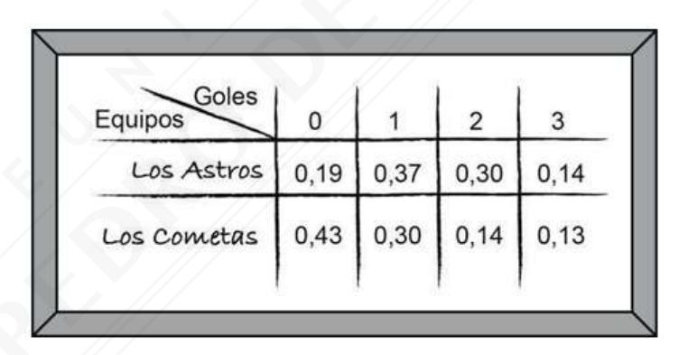

Según estos datos y considerando que convertir goles por parte de ambos equipos es independiente, ¿cuál de las siguientes expresiones es igual a la probabilidad de que el partido entre estos dos equipos termine en empate?

- A) 0,19 ∙ 0,43
- B) (0,19 ∙ 0,43) + (0,37 ∙ 0,30) + (0,30 ∙ 0,14) + (0,14 ∙ 0,13)
- C) (0,19 ∙ 0,43) ∙ (0,37 ∙ 0,30) ∙ (0,14 ∙ 0,13)
- D) (0,37 ∙ 0,30) + (0,30 ∙ 0,14) + (0,14 ∙ 0,13)
- E) (0,19 + 0,43) ∙ (0,37 + 0,30) ∙ (0,30 + 0,14) ∙ (0,14 + 0,13)

(Fuente, DEMRE 2020)

- 26. En cierto experimento, la probabilidad de que ocurra un suceso A es p, mientras que la probabilidad de que ocurra un suceso B es q. Si los sucesos A y B son independientes, ¿cuál de las siguientes expresiones representa **siempre** la probabilidad de que ocurra al menos uno de los dos sucesos?
  - A) p(1 q)
  - B) pq
  - C) p(1 q) + q(1 p)
  - D) (1 p)(1 q)
  - E) p + q pq

(Fuente, DEMRE 2020)

27. El administrador de un blog sorteará un premio entre los usuarios que durante la semana asistieron a los cines que están exhibiendo la película **Mr. M**. Para ello encuestó 500 usuarios en que ninguno de ellos votó en más de una categoría, elaborando el siguiente gráfico sobre cuatro categorías.

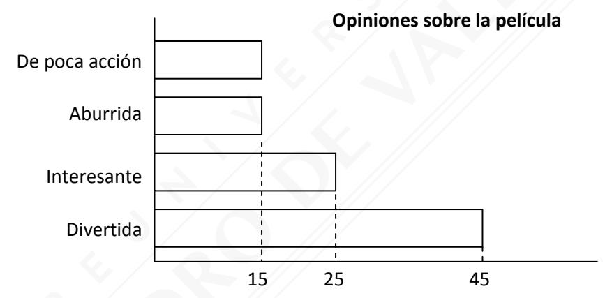

- Tomas es usuario del blog, vio la película y votó que era aburrida, ¿qué probabilidad tiene de ganar el premio, si el administrador lo sorteó entre los que opinaron que la película era aburrida?
- A) 3 500
- B) 3 75
- C) 1 75
- D) 1 500

- 28. En una caja hay 15 tarjetas que tienen dibujado un animal. Cinco tienen un pez, cuatro tienen un ave y 6 tienen un perro. Se introduce la mano en la caja y se extrae al azar una tarjeta que tiene un ave y no se devuelve a la caja, a continuación se vuelve a introducir la mano y la tarjeta extraía resulta tener un pez, la que tampoco se devuelve. ¿Cuál de las siguientes afirmaciones es verdadera, si se extrae al azar una tercera tarjeta?
  - A) Es igualmente probable que tenga un pez o un ave.
  - B) Que tenga un perro es doblemente probable que tenga un ave.
  - C) Que tenga un ave es el 80% de la probabilidad de tener un pez.
  - D) La probabilidad que tenga un perro es igual a  $\frac{2}{5}$ .
- 29. En Enero, 3.000 turistas argentinos llegaron a visitar la región de Valparaíso, 1.700 visitaron Viña del Mar, 1.200 visitaron Concón, 500 Viña del Mar y Concón, y los demás visitaron solo Valparaíso. Si se escoge uno de estos turistas al azar, ¿en cuál de las siguientes opciones se determina correctamente la probabilidad que haya visitado Viña del Mar o Concón?

A) 
$$\frac{1.700}{3.000} + \frac{1.200}{3.000} = \frac{2.900}{3.000} = 0,96$$

B) 
$$\frac{1.700}{3.000} + \frac{1.200}{3.000} = \frac{20.400}{90.000} = 0,22$$

C) 
$$\frac{1.700}{3.000} + \frac{1.200}{3.000} - \frac{500}{3.000} = \frac{2.400}{3.000} = 0.8$$

D) 
$$\frac{1.700}{3.000} \cdot \frac{1.200}{3.000} \cdot \frac{500}{3.000} = \frac{1.020.000}{27.000.000} = 0,037$$

30. ¿En cuál de las siguientes opciones se indica correctamente la probabilidad de **no** obtener números consecutivos cuando se lanzan dos dados normales?

A) 
$$1 - \frac{1}{3} = \frac{2}{3}$$

B) 
$$1 - \frac{1}{6} = \frac{5}{6}$$

C) 
$$1 - \frac{5}{18} = \frac{13}{18}$$

D) 
$$1 - \frac{5}{36} = \frac{29}{36}$$

## **RESPUESTAS EJERCICIOS DE DESARROLLO**

- 1. 0,04
- 2. I, II y III
- 3.

| Variable | Frecuencia absoluta | Frecuencia relativa | Frecuencia relativa % | Frecuencia acumulada |  |
|----------|------------------------|------------------------|--------------------------|-------------------------|--|
| 1        | 60                     | 0,3                    | 30                       | 60                      |  |
| 2        | 80                     | 0,4                    | 40                       | 140                     |  |
| 3        | 40                     | 0,2                    | 20                       | 180                     |  |
| 4        | 10                     | 0,05                   | 5                        | 190                     |  |
| 5        | 10                     | 0,05                   | 5                        | 200                     |  |

- a) 200
- b) 2 hermanos
- c) ≈2
- d) 2

- I, II y III 4.
- 5. I, II y III
- 6. I y II
- I, II y III 7.
- 8. a) Amodal
- b) p

c)  $\frac{3p + 3q + 2}{5}$ 

- 9. a) r · t
- b) n · h
- c)  $\frac{r \cdot t + n \cdot h}{r + n}$

- 10. a)  $\frac{8}{13} \cdot \frac{5}{12}$
- b)  $\frac{8}{13} \cdot \frac{5}{13}$
- c)  $\frac{8}{13} \cdot \frac{5}{12} \cdot 2$  d)  $\frac{8}{13} \cdot \frac{5}{13} \cdot 2$

- 11. a)  $\frac{16}{30}$
- b)  $\frac{10}{30}$
- c)  $\frac{23}{30}$

- 12. Solo III
- 13. Solo I y III
- 14. 0,2

## **RESPUESTAS EJERCICIOS SELECCIÓN MÚLTIPLE**

| 1. | B | 6.  | D | 11. | D | 16. | B | 21. | B | 26. | E |
|----|---|-----|---|-----|---|-----|---|-----|---|-----|---|
| 2. | E | 7.  | B | 12. | D | 17. | A | 22. | A | 27. | C |
| 3. | E | 8.  | C | 13. | A | 18. | C | 23. | D | 28. | B |
| 4. | A | 9.  | E | 14. | B | 19. | B | 24. | E | 29. | C |
| 5. | E | 10. | A | 15. | A | 20. | B | 25. | B | 30. | C |

**MA-M0D07**

**Puedes complementar los contenidos de esta guía visitando nuestra web <https://www.preupdv.cl/>**