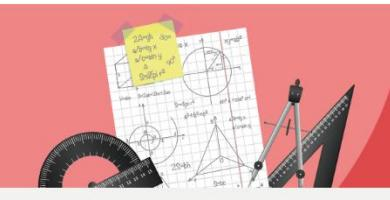
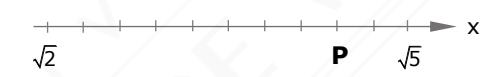

## Taller Ejercitación N°1

Material: TEM-M2-01-Números y Porcentaje Programa Anual

- Si el producto entre 12 y su opuesto se resta del producto entre 3 y su recíproco, resulta
  - A) -143 B) -144

  - C) 145
  - D)  $-\frac{431}{3}$
- Si a = -3 y b = -2, ¿cuál de las siguientes desigualdades es correcta?
  - A)  $\frac{2}{2a+b} > \frac{1}{a-b}$
  - B)  $\frac{a}{a+b} > \frac{b}{a-b}$
  - C)  $\frac{a-2b}{a+2b} > \frac{a-b}{a+b}$
  - D)  $\frac{2b-a}{b} > \frac{2a-b}{a}$
- ¿Cuántos números enteros entre 100 y 500 tienen la propiedad de ser divisibles por 6 y que el dígito de las unidades sea igual al dígito de las decenas?
  - A) 4
  - B) 5
  - C) 8 D) 9

  - E) 6

- En un número de dos cifras, se tiene que la cifra de las unidades es el doble de la cifra de las decenas. Entonces, con respecto al número, ¿cuál de las siguientes afirmaciones es verdadera?
  - A) Es siempre múltiplo de 5.
  - B) Es siempre múltiplo de 4.
  - C) Es siempre múltiplo de 24.
  - D) Es siempre múltiplo de 9.
- Un litro de aceite de auto cuesta \$ 12.000 y un litro de aditivo \$ 9.600. ¿Cuál de las 5. siguientes cantidades, en pesos, permite comprar exactamente solo aceite y también comprar exactamente solo aditivo?
  - A)  $2^7 \cdot 3 \cdot 5^3$
  - B)  $2^7 \cdot 3 \cdot 5^2$
  - C)  $2^5 \cdot 3 \cdot 5^2$ D)  $2^8 \cdot 5 \cdot 7^2$
- En la recta numérica se han marcado los números  $\sqrt{2}$  y  $\sqrt{5}$ . 6.

¿Qué valor le corresponde a P?

- A)  $\frac{\sqrt{5} \sqrt{2}}{10}$
- B)  $\frac{4}{5}(\sqrt{5} \sqrt{2})$
- C)  $\frac{4\sqrt{5} + \sqrt{2}}{5}$
- D)  $\frac{4\sqrt{5} 3\sqrt{2}}{5}$
- E)  $\frac{4\sqrt{5} 4\sqrt{2}}{5}$
- ¿Cuál es la suma de las primeras 60 cifras decimales del desarrollo decimal del número racional  $\frac{107}{33}$ ?
  - A) 180
  - B) 183
  - C) 720
  - D) 723

- 8. La representación del número 132 en base 5 es  $(1012)_5$ , porque  $132 = 1 \cdot 5^3 + 0 \cdot 5^2 + 1 \cdot 5^1 + 2 \cdot 5^0$ , entonces la representación del número 182 en base 4 sería
  - A) (2310)4
  - B) (2312)4
  - C) (3210)4
  - D) (0132)4
- 9. La suma de los cuadrados de los primeros n números naturales se determina según la relación  $1^2+2^2+3^2+\cdots+n^2=\frac{1}{6}n$  (n+1)(2n+1). ¿Cuál es el valor de la suma de todos los cuadrados de los números naturales mayores a 20 y menores a 31?
  - A) 7.546
  - B) 7.946
  - C) 6.585
  - D) 6.985
- 10. Un número perfecto es todo aquel número natural que es igual a la suma de sus divisores positivos distintos de él. ¿Cuál de los siguientes números es perfecto?
  - A) 8
  - B) 10
  - C) 12
  - D) 28
- 11. Si se tiene que  $101^2 = 10201$ ,  $1001^2 = 1002001$ ,  $10001^2 = 100020001$ , siendo ellos una secuencia de números al cuadrado, entonces ¿cuál será el valor de  $1000001^2$ ?
  - A) 10000200001
  - B) 100002000001
  - C) 100000200001
  - D)  $10^{10} + 2 \cdot 10^5 + 1$
  - E)  $10^{12} + 2 \cdot 10^6 + 1$

| 12. | Irene, Juan Carlos y Hernán se ganaron el premio de la Lotería, repartiéndoselo en la |
|-----|---------------------------------------------------------------------------------------|
|     | razón 4 : 1,5 : 2,5 respectivamente. ¿Qué porcentaje del premio le correspondió a  |
|     | Juan Carlos?                                                                          |

- A) 1,5%
- B) 15%
- C) 18,75%
- D) 20%
- E) 31,25%

| 13. | El candidato A obtuvo 25% más que los                                       |  | votos |  | obtenidos por el candidato B. Si B |    |
|-----|-----------------------------------------------------------------------------|--|-------|--|------------------------------------|----|
|     | obtuvo el 16% del total de los votos, entonces ambos candidatos alcanzaron, |  |       |  |                                    | en |
|     | conjunto, el                                                             |  |       |  |                                    |    |

- A) 57%
- B) 54%
- C) 45%
- D) 41%
- E) 36%

14. Si simultáneamente el largo de un rectángulo aumenta en el 20% y su ancho disminuye en un 20%, ¿qué sucede con el área?

- A) Aumenta en un 4%
- B) Disminuye en un 4%
- C) Aumenta en un 96%
- D) Permanece igual

- A) \$ 614.400
- B) \$ 625.200
- C) \$ 625.459
- D) \$ 610.800

15. Francisco arrienda un departamento en el mes de enero en \$ 600.000, las condiciones de arriendo es que este valor se reajustará trimestralmente según IPC acumulado. Si el primer trimestre el IPC acumulado fue de un 2,4% y el IPC acumulado del segundo trimestre es de un 1,8%, ¿qué precio estará pagando aproximadamente, por el arriendo del departamento en el mes de agosto del mismo año?

- 16. El precio de lista de un artículo es de \$16.660. ¿A cuánto asciende el impuesto (IVA) que se paga por la venta de este artículo?
  - A) \$ 14.000
  - B) \$ 13.495
  - C) \$ 2.660
  - D) \$ 3.154
- 17. El precio de costo de un artículo para un comerciante es PC. Si desea ganar un 18% por la venta de este artículo, ¿cuál será la expresión que representa el precio al cual deberá venderlo, si incluye el impuesto al valor agregado?
  - A) 1,18 ∙ 1,19 ∙ Pc
  - B) 1,18 ∙ 0,19 ∙ Pc
  - C) 0,18 ∙ 1,19 ∙ Pc
  - D) 0,18 ∙ 0,19 ∙ Pc
- 18. El producto de **p** con **q** es directamente proporcional con **t**. Si **p** y **q** aumentan en un 12%, entonces **t**
  - A) aumenta en un 12%.
  - B) aumenta en un 24%.
  - C) disminuye en un 24%.
  - D) aumenta en un 25,44%.
- 19. Del curso tercero medio B de un colegio de la ciudad de Santiago, el 60% de las niñas y el 40% de los varones lleva agua en un termo botella. Es posible saber el número de estudiantes que no lleva agua en una termo botella, si:
  - (1) las mujeres son el 60% de los varones del curso.
  - (2) el total de estudiantes del curso es 40.
  - A) (1) por sí sola
  - B) (2) por sí sola
  - C) Ambas juntas, (1) y (2)
  - D) Cada una por sí sola, (1) ó (2)
  - E) Se requiere información adicional

- 20. Se puede determinar qué porcentaje es A de C, si:
  - (1) A es el 60% de B.
  - (2) B es el 40% de C.
  - A) (1) por sí sola
  - B) (2) por sí sola
  - C) Ambas juntas, (1) y (2)
  - D) Cada una por sí sola, (1) ó (2)
  - E) Se requiere información adicional