| Matemática M2    |  |
|------------------|--|
| Material MAEL-40 |  |

| Nombre: |  |
|---------|--|
|         |  |

# **GUIA TEÓRICO PRÁCTICA MODELOS PROBABILÍSTICOS - DISTRIBUCIÓN NORMAL**

## **VARIABLES ALEATORIAS CONTINUAS (VAC)**

Son aquellas que pueden tomar todos los valores posibles dentro de un cierto intervalo en los números reales, por ejemplo, peso de los alumnos de un curso, tiempo de funcionamiento de un dispositivo electrónico, cantidad de agua consumida en un mes por una familia, tiempo que demora un alumno en llegar del colegio a su casa, etc.

# **FUNCIÓN DE DENSIDAD DE PROBABILIDAD**

La función de densidad de probabilidad es una función matemática que describe la distribución de probabilidad de una variable aleatoria continua.

Como la variable aleatoria continua puede tomar una gran cantidad de valores diferentes, la función de densidad no determina la probabilidad que tiene la variable de tomar un valor específico, determina la probabilidad que tiene la variable de encontrarse en un intervalo determinado de los números reales.

La probabilidad que la variable aleatoria se encuentre dentro de un intervalo específico se calcula como el área bajo la curva en ese intervalo.

La probabilidad que la variable x se encuentre en el intervalo [a, b], queda determinada por el área bajo la curva de la función de densidad de probabilidad en ese intervalo.

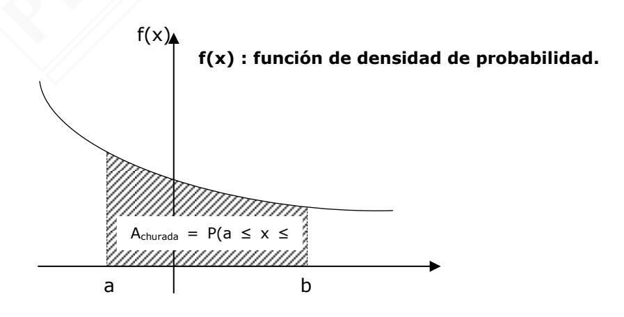

#### **Propiedades de la Función de Densidad de Probabilidad**

#### - **La función de densidad de probabilidad es no negativa:**

Para cualquier valor x dentro del dominio de la variable aleatoria, la función de densidad f(x) debe ser siempre mayor o igual a cero (f(x) ≥ 0). Es decir, la gráfica de la función de densidad de probabilidad siempre estará sobre el eje x.

#### - **Área total bajo la curva es 1**

El área bajo la curva de la función de densidad de probabilidad sobre todo su dominio (desde menos infinito hasta más infinito) debe ser igual a 1. Este valor representa la probabilidad total de que ocurra algún resultado, que será igual es 1 (o 100%).

#### - **La probabilidad en un punto es cero**

En una distribución continua, la probabilidad que la variable tome un valor exacto es cero, la razón de esto es porque la probabilidad se define como el área bajo la curva de la función en un intervalo dado, al ser un punto la amplitud del intervalo es cero.

**Observación:** Cuando la variable es continua P(X ≤ b) = P(X < b)

## **FUNCIÓN DE DISTRIBUCIÓN DE PROBABILIDAD ACUMULADA PARA VARIABLE ALEATORIA CONTINUA**

La **función de distribución de probabilidad acumulada F(x)** asocia a cada valor de x la probabilidad acumulada, es decir **F(x) = P(X x) = P(X < x)**.

#### **Propiedades:**

- 1. Como F(x) es una probabilidad, se cumple que 0 F(x) 1.
- 2. Si a < b, entonces P(a < X b) = F(b) F(a).
- 3. P(X > a) = 1 P(X a) = 1 F(a)
- 4. P(X = a) = 0, es decir la probabilidad que la variable tome exactamente un valor es igual a cero.

**Observación:** En el caso de variable aleatoria **continua** la función distribución de probabilidad acumulada es una función **continua**.

## **DISTRIBUCIÓN NORMAL**

El nombre de distribución normal es debido a que durante muchos años se pensó que todos los fenómenos de las poblaciones se ajustaban a este modelo.

La distribución normal o también llamada campana de Gauss es una distribución de valores que describe la frecuencia de datos, estos datos se agrupan en forma simétrica en torno a un valor central.

Este valor central es el punto más alto de la campana, donde se concentran la mayoría de los datos, es tanto el valor más frecuente (la moda), es también el valor central (la mediana), y el promedio de todos los valores (la media).

El gráfico de la función de densidad de una variable aleatoria con **distribución normal** es similar al mostrado en la figura, es decir tiene una forma conocida como **Campana de Gauss**, y es simétrico con respecto a la media, . Esta distribución queda definida por dos parámetros: la media () y la desviación estándar (), y se denota **X ~ N(, ).**

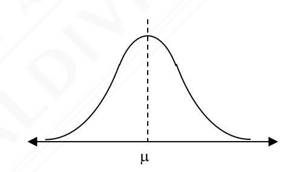

#### **Características:**

- 1. El área total bajo la curva es igual a la unidad.
- 2. Es simétrica con respecto a x = , y deja un área igual a 0,5 a la izquierda y otra de 0,5 a la derecha, es decir, existe una probabilidad del 50% de observar un dato mayor a la media y un 50% de observar un dato menor a la media.
- 3. Es asintótica al eje de las abscisas, es decir, la curva se acerca lo más posible al eje de las X sin llegar a tocarlo.
- 4. La media, moda y mediana coinciden.
- 5. La probabilidad equivale al área encerrada bajo la curva.

# **INTERVALOS DE UNA DISTRIBUCIÓN NORMAL**

Una población tiene media y desviación estándar .

- Si X pertenece al intervalo 
$$[\mu - \sigma, \mu + \sigma]$$
 entonces  $P[\mu - \sigma < X < \mu + \sigma] = 0.6826$ 

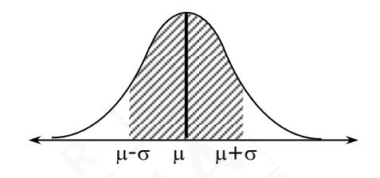

- Si X pertenece al intervalo entonces

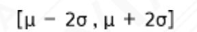

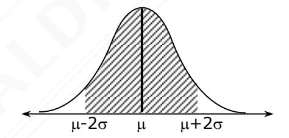

- Si X pertenece al intervalo entonces

$$[\mu - 3\sigma, \mu + 3\sigma]$$

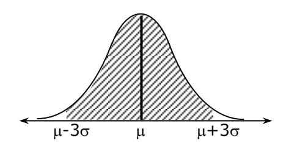

## **DISTRIBUCIÓN NORMAL ESTANDAR**

La distribución normal estándar o tipificada, es aquella que tiene media 0 y desviación estándar 1. Se denota por X ~ N(0, 1)

Por ser la gráfica simétrica respecto = 0, entonces se cumple P(X -x1) = P(X x1)

Gráficamente:

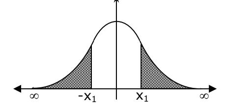

Cuando la distribución es normal estándar se puede utilizar la probabilidad de intervalos estudiada en distribución normal.

Cuando lo pedido no se ajuste a ninguno de los intervalos conocidos, se utilizarán de la tabla normal tipificada, en la primera parte de la prueba PAES se incorpora la tabla de los valores requeridos para solucionar los problemas requeridos.

La tabla será similar a la que se encuentra a continuación.

#### **TABLA RESUMIDA**

Si Z N(0, 1) es una distribución normal estándar, entonces: **Z P(Z z)**

| 0,99 | 0,839 |
|------|-------|
| 1,00 | 0,841 |
| 1,15 | 0,875 |
| 1,24 | 0,893 |
| 1,28 | 0,900 |
| 1,50 | 0.933 |
| 1,64 | 0,950 |
| 1,96 | 0,975 |
| 2,17 | 0,985 |

**OBSERVACIÓN:** Para determinar la probabilidad de una variable aleatoria de distribución normal estándar de un valor que no se encuentre en esta tabla, se utiliza la siguiente tabla de distribución normal tipificada.

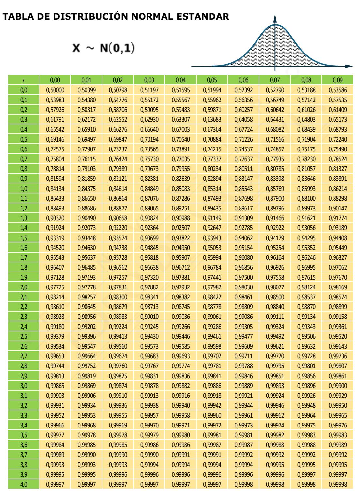

La unidad y décima del valor se busca en la primera columna, mientras que la centésima y milésima en la primera fila.

#### **EJEMPLO**

La variable continua X definida como  $X \sim N(0, 1)$ , entonces P(X < 0.93) =

| ×   | 0,00    | 0,01            | 0,02    | 0,03    | 0,04    |  |
|-----|---------|-----------------|---------|---------|---------|--|
| 0,0 | 0,50000 | 0,50399         | 0,50798 | 0,51197 | 0,51595 |  |
| 0,1 | 0,53983 | 0,54380         | 0,54776 | 0,55172 | 0,55567 |  |
| 0,2 | 0,57926 | 0,58317         | 0,58706 | 0,59095 | 0,59483 |  |
| 0,3 | 0,61791 | 0,62172         | 0,62552 | 0,62930 | 0,63307 |  |
| 0,4 | 0,65542 | 0,65910         | 0,66276 | 0,66640 | 0,67003 |  |
| 0,5 | 0,69146 | 0,69497         | 0,69847 | 0,70194 | 0,70540 |  |
| 0,6 | 0,72575 | 0,72907         | 0,73237 | 0,73565 | 0,73891 |  |
| 0,7 | 0,75804 | 0,76115 0,76424 |         | 0,76730 | 0,77035 |  |
| 0,8 | 0,78814 | 0,79103         | 0,79389 | 0,79673 | 0,79955 |  |
| 0,9 | 0,81594 | 0,81859         | 0,82121 | 0,82381 | 0,82639 |  |
| 1,0 | 0,84134 | 0,84375         | 0,84614 | 0,84849 | 0,85083 |  |

$$P(X < 0.93) = 0.82381$$

# ESTANDARIZACIÓN DE UNA VARIABLE ALEATORIA DE DISTRIBUCIÓN NORMAL

Para poder utilizar la tabla para encontrar la probabilidad  $P(X < x_i)$  en una distribución normal, no estándar, es necesario estandarizar la variable.

Si X es una variable que tiene distribución normal con media  $\mu$  y desviación estándar  $\sigma$ , es decir X ~ N( $\mu$ ,  $\sigma$ ), se define una nueva variable aleatoria Z de la forma: Z =  $\frac{X - \mu}{\sigma}$ , que tiene una distribución normal estándar, es decir Z ~ N(0, 1).

Entonces la probabilidad en términos de la variable X puede calcularse en términos de Z, de la siguiente manera.

$$P(X \le x) = P\left(Z \le \frac{X - \mu}{\sigma}\right)$$

#### **EJEMPLO**

Las notas de 40 alumnos que rindieron examen de admisión en un colegio para ocupar las vacantes en el  $1^{\circ}$  medio tienen una distribución definida por  $X \sim N(5,1; 1,2)$ . ¿Cuál es la probabilidad de que sean aceptados con nota superior a 6?

Solución: 
$$P(X > 6) = 1 - P(X \le 6)$$
  

$$= 1 - P\left(Z \le \frac{6 - 5,1}{1,2}\right)$$

$$= 1 - P(Z \le 0,75)$$

$$= 1 - 0,773$$

$$= 0,227$$

| Z    | <b>P(</b> Z ≤ z) |
|------|------------------|
| 0,75 | 0,773            |
| 1,00 | 0,841            |
| 1,15 | 0,875            |
| 1,24 | 0,893            |
| 1,28 | 0,900            |
| 1,50 | 0,933            |
| 1,64 | 0,950            |
| 1,96 | 0,975            |
| 2,00 | 0,977            |
| 2,17 | 0,985            |

#### **EJERCICIOS**

La función densidad de probabilidad está dada por f(x) =

¿Cuál es el valor para P(X < 0.75)?

- Si X es una variable aleatoria continua con distribución normal estándar, entonces ¿cuál de las siguientes afirmaciones es incorrecta?
  - A)  $P(X > x_1) = P(X < -x_1)$
  - B)  $P(X > X_1) = 1 P(X < X_1)$

  - C)  $P(X = x_1) = 0$ D)  $P(X \le x_1) > P(X < x_1)$
- Los resultados de los estudiantes en un examen final siguen una distribución normal, con una media de 75 puntos y una desviación estándar de 16 puntos. ¿Cuál es la probabilidad de que un estudiante obtenga una calificación superior a 70 puntos?
  - A) 28%
  - B) 31%
  - C) 69%
  - D) 62%
- 4. En una distribución normal estándar si  $P(X \le -a) = m$ , entonces  $P(X \ge a) =$ 
  - A) -m
  - B) m
  - C) m 1
  - D) 1 m
  - E) Falta información.

- 5. Si X ~ N(0,1), entonces ¿cuál de las siguientes afirmaciones es incorreta?
  - A) La probabilidad P(X < 0) es 50%
  - B) P(X > 1,5) = 1 P(X 1,5)
  - C) P(X > -1,5) = 1 P(X < 1,5)
  - D) P(X = 0,5) = 0
- 6. Sean X y Z variables aleatorias, X con distribución normal con media 100 y desviación estándar 16, y Z la tipificada de X con distribución normal estándar. Entonces, ¿cuál es la representación gráfica de la probabilidad de que X sea mayor que 124?

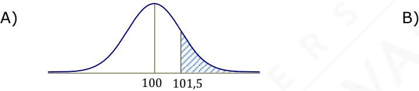

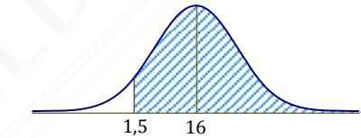

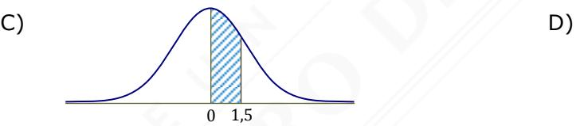

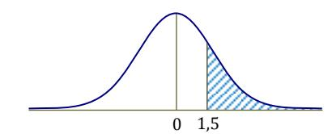

E)

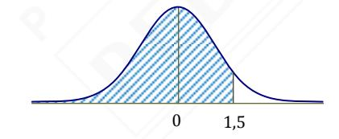

- 7. Sea una distribución normal N(24,3; 4,8), entonces ¿cuál de las siguientes afirmaciones es **incorrecta**?
  - A) P(X < 4,8) = 0,5
  - B) La desviación estándar es igual a 4,8.
  - C) La media es 24,3
  - D) P(X > 24,3) = 0,5
  - E) P(19,5 X 29,1) 68%.

- 8. Los resultados del ensayo de una prueba de matemática aplicada por una universidad privada sigue una distribución normal de media 720 puntos y deviación estándar 50 puntos. Respecto a esta información, ¿cuál de la siguientes afirmaciones es incorrecta, en relación al puntaje obtenido por un estudiante que asiste a rendir el ensayo?
  - A) La probabilidad que haya obtenido más de 670 puntos es 84,13%
  - B) La probabilidad de obtener menos de 820 puntos es 97,72%.
  - C) La probabilidad que el estudiantes obtenga menos de 720 puntos, pero mas de 620 es igual a 47,72%.
  - D) La probabilidad que obtenga menos de 570 puntos es 0,26%.
- 9. Los promedios obtenidos por los alumnos de un colegio, en su último semestre de cuarto medio, tiene una distribución N(5,0; 0,8). ¿Cuál de las siguientes afirmaciones **NO** es correcta?
  - A) Aproximadamente, el 68% de los alumnos tiene promedio entre 4,2 y 5,8.
  - B) Aproximadamente, el 2% de los alumnos tiene promedio menor a 3,4.
  - C) El 0,26 % de los estudiantes tienen un promedio sobre 6,6.
  - D) Un 13,6%, aproximadamente, tiene promedio entre 5,8 y 6,6.
- 10. En una distribución normal N(90, 15), ¿cuál de las siguientes proposiciones es verdadera?
  - A) P(90 < x < 105) 0,3413
  - B) P(60 < x < 90 ) 0,4772
  - C) P(105 < x < 120) 0,1359
  - D) Todas las opciones son verdaderas.
- 11. Sean X, W variables aleatorias con distribución N(80,4) y N(120,10), respectivamente. ¿Cuál de las siguientes proposiciones es verdadera?
  - A) P(W 130 ) > P(X 84)
  - B) P(X 92 ) = P(W 90)
  - C) P(W 120) > P(X 80)
  - D) P(X ≤ 80) > P( W < 130)

- 12. Si una variable aleatoria X tiene una distribución normal con media igual a **m** y varianza igual a **p**, ¿cuál de las siguientes variables aleatoria tiene distribución normal estándar?
  - A) W = X p m
  - B) Y = X p
  - C) Z = X + m p
  - D) Q = X m p
  - E) P = X m p
- 13. Supongamos que la estatura de los varones adultos chilenos es una variable de distribución normal con promedio 1,73 m con desviación estándar 7,3 cm. Al escoger un chileno adulto al azar, ¿cuál es la probabilidad que mide más 1,8 m? (Indicación: los valores de la tabla redondéelos a la centésima).
  - A) 95%
  - B) 5%
  - C) 17%
  - D) 83%
- 14. Si consideramos una población de recién nacidos cuya estatura se distribuye normalmente, con una media (μ) de 50 cm y una desviación estándar (σ) de 4 cm. ¿Cuál es, aproximadamente, la probabilidad de que un niño al nacer mida menos de 45 cm?
  - A) 89%
  - B) 11%
  - C) 25%
  - D) 0,11%

- 15. El tiempo promedio que un mecánico demora en cambiar una pieza de motor de un auto es de 51 minutos, con desviación estándar 15 minutos. Si el tiempo tiene una distribución normal y Z es una variable aleatoria de distribución normal estándar, ¿ cuál de las siguientes afirmaciones **NO** es correcta?
  - A)  $P(X < 39) = P(Z \le \frac{39 51}{15})$
  - B) P(X < 39) = P(Z > 0.8)
  - C) P(X < 39) = 1 P(Z < 0.8)
  - D) P(X < 39) = 0.2
- 16. Los pesos de 300 deportistas de alto rendimiento tienen una distribución normal definida como N(75, 10), ¿cuántos de estos deportistas pesan más de 65 kg?
  - A) 68,26%
  - B) 52,26%
  - C) 95,44%
  - D) 34,13%
  - E) 84,13%
- 17. Las temperaturas máximas en el mes de diciembre en una ciudad nortina, siguen una distribución normal con media 26° y desviación estándar 5°, aproximadamente, ¿en cuántos días del mes de diciembre se esperan que las temperaturas estén entre 23° y 28°? (Indicación: los valores de la tabla redondéelos a la centésima)
  - A) 10
  - B) 9
  - C) 11
  - D) 7
  - E) 12
- 18. Los sueldos mensuales de los recién graduados de un instituto profesional siguen una distribución normal con media ( $\mu$ ) de \$1.300.000 y desviación estándar ( $\sigma$ ) de \$600.000. ¿Cuál es, aproximadamente, el porcentaje de graduados que reciben entre \$1.000.000 y \$1.500.000 mensuales?
  - A) 63%
  - B) 69%
  - C) 32%
  - D) 6%

- 19. Se realizó una prueba de coeficiente intelectual (CI) a un grupo de 1.000 personas. Los resultados obtenidos presentan una distribución normal con una media (μ) de 100 puntos y una desviación estándar (σ) de 20 puntos. ¿Cuánto es la estimación, aproximada, de las personas que rindieron esta prueba, que tienen un CI entre 95 y 110 puntos?
  - A) 290
  - B) 190
  - C) 690
  - D) 600
- 20. Se desea estudiar las características físicas de los habitantes de un pueblo mayores de 30 años. Si la variable a estudiar es el peso de estos individuos que es una variable continua, con distribución normal de media 60,5 kg y desviación estándar 5 kg. Según estos datos, ¿cuál es a lo más el peso del 75% de los individuos mayores de 30 años de esta población?
  - A) 64 kg
  - B) 85 kg
  - C) 69 kg
  - D) 68 kg
- 21. Benjamín asiste a da un ensayo de M2 ofrecido por una universidad privada, los puntajes obtenidos por los estudiantes que asisten obedecen a una distribución normal con media 680 puntos. Es posible determinar la probabilidad que Benjamín hay obtenido más de 800 puntos, si se sabe que:
  - (1) asisten 800 estudiantes a este ensayo.
  - (2) la desviación estándar de los puntajes es 60 puntos.
  - A) (1) por sí sola
  - B) (2) por sí sola
  - C) Ambas juntas, (1) y (2)
  - D) Cada una por sí sola, (1) ó (2)
  - E) Se requiere información adicional

- 22. La variable aleatoria X definida como X N(,), tiene una distribución normal estándar, sí:
  - (1) 2 = 1
  - (2) · = 0
  - A) (1) por sí sola
  - B) (2) por sí sola
  - C) Ambas juntas, (1) y (2)
  - D) Cada una por sí sola, (1) ó (2)
  - E) Se requiere información adicional

#### **RESPUESTA EJERCICIOS**

| 1. | B | 6.  | D | 11. | B | 16. | E | 21. | B |
|----|---|-----|---|-----|---|-----|---|-----|---|
| 2. | D | 7.  | A | 12. | E | 17. | E | 22. | C |
| 3. | D | 8.  | D | 13. | C | 18. | C |     |   |
| 4. | B | 9.  | C | 14. | B | 19. | A |     |   |
| 5. | C | 10. | D | 15. | D | 20. | A |     |   |