- 1. En la circunferencia de radio O de la circunferencia adjunta, AOB =90°, entonces + + =
  - A) 45°
  - B) 135°
  - C) 90°
  - D) 270°

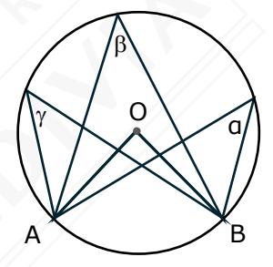

- 2. En la figura, los puntos A, B, C, P y Q pertenecen a la circunferencia, si AP y CQ son diámetros y PAC = 40°, entonces la medida del ángulo ABC es igual a
  - A) 50°
  - B) 80°
  - C) 130°
  - D) 260°
  - E) 200°

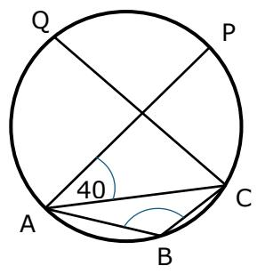

- 3. En la circunferencia de la figura adjunta, P, Q, R y S son puntos pertenecientes a ella, ¿cuál es la medida del SRP?
  - A) 136°
  - B) 26°
  - C) 13°
  - D) 68°
  - E) 34°

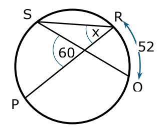

4. En la circunferencia de centro O y diámetro AC de la figura adjunta, ABCD es un cuadrilátero inscrito en ella. ¿Cuál es la medida del BCD?

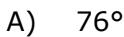

- B) 50°
- C) 66°
- D) 104°
- E) 90°

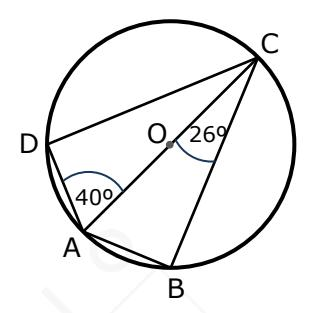

- 5. En la circunferencia de centro O de la figura adjunta, los puntos M, N y P pertenecen a ella, arco NP es igual a 80°, si MP es diámetro de la circunferencia, entonces MPN =
  - A) 80°
  - B) 40°
  - C) 100°
  - D) 50°

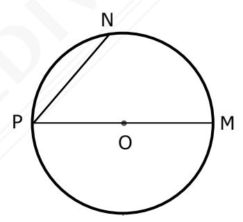

- 6. Los puntos A, B, C, D, E y F dividen a la circunferencia de centro O de la figura adjunta, en seis arcos congruentes, entonces CAB =
  - A) 27°
  - B) 26°
  - C) 72°
  - D) 30°
  - E) 60°

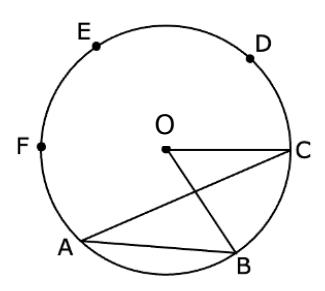

- 7. Los puntos P, Q, R y S pertenecen a la circunferencia de centro O de la figura adjunta. Si PSQ = 30° y ORQ = 40°, ¿cuál es la medida del PSR?
  - A) 80°
  - B) 160°
  - C) 30°
  - D) 40°

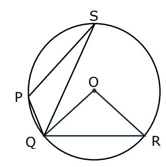

- 8. En la circunferencia de centro O de la figura adjunta, DE es tangente en E, EB es bisectriz del AEC, CED = 50° y BEC = 30°, entonces EBD =
  - A) 30°
  - B) 50°
  - C) 80°
  - D) 40°

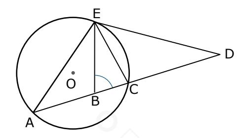

- 9. En la circunferencia de centro O de la figura adjunta, tres de los vértices del cuadrilátero se encuentran sobre la circunferencia, ¿cuál es la medida del ángulo x?
  - A) 100°
  - B) 50°
  - C) 200°
  - D) 20°

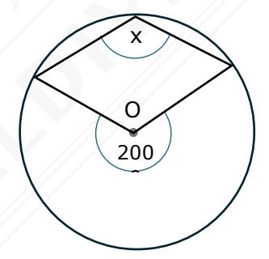

- 10. En la figura adjunta, PD y PB son secantes a la circunferencia, si DPB = 30° y CB ⊥ DA , entonces PDA =
  - A) 15°
  - B) 120°
  - C) 60°
  - D) 30°

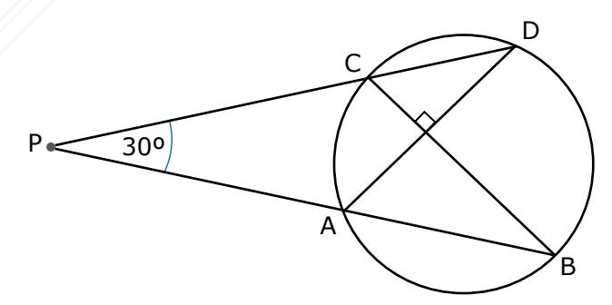

- 11. En la circunferencia de centro O y radio r de la figura adjunta, TQ y TP son dos tangentes trazadas desde T. Si la tangente TQ es igual al diámetro de la circunferencia, entonces ¿cuál es el perímetro del cuadrilátero TPOQ, en función de r?
  - A) 7r
  - B) 6r
  - C) 5r
  - D) 4r
  - E) 8r

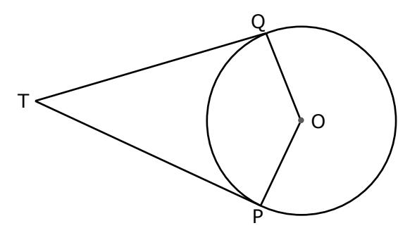

12. En la figura adjunta, el cuadrilátero ABCD es tangente a la circunferencia en los puntos P, Q, R y S. Si AP = 2, BQ = 4, CR = 5 y SD = 1, entonces ¿cuál es el perímetro del cuadrilátero ABCD?

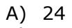

B) 26

C) 25

D) 23

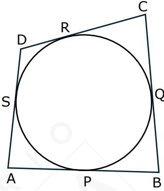

13. En la circunferencia de centro O y radio 25 cm de la figura adjunta, ED = 15 cm, entonces EB =

A) 5 cm

B) 10 cm

C) 20 cm

D) 15 cm

E) 45 cm

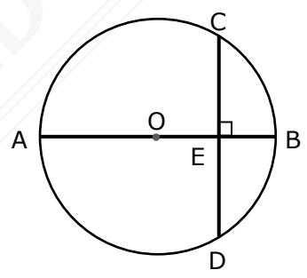

14. En la circunferencia de centro O de la figura adjunta, PT es tangente en T, PD secante que la intersecta en C y D, PB secante que la intersecta en A y B a la circunferencia y que pasa por O. Si PD = 16, PA = 8 y CD = 7, ¿cuál es el perímetro de triángulo PTO?

A) 30

B) 5

C) 10

D) 32 E) 25

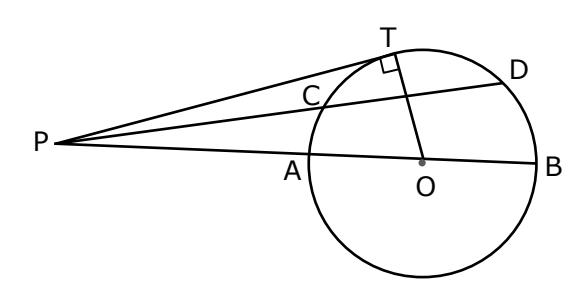

- 15. En la circunferencia de centro O y radio **a** de la figura adjunta, la cuerda AB se encuentra a una distancia igual a a 3 del centro O de la circunferencia. La medida de la cuerda AB en función del radio de la circunferencia es
  - A) a 3 8
  - B) 3a 2 4
  - C) 2a 2 3
  - D) 4a 3 3
  - E) 4a 2 3

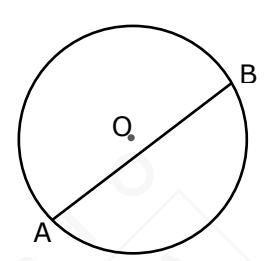

- 16. Sea **P** un punto exterior a una circunferencia de centro **O** y radio **r** y tal que OP = r 3 . Si por **P** se traza una secante a la circunferencia siendo la parte externa de ésta sea igual al radio, entonces ¿cuánto mide la cuerda determinada por esta secante?
  - A) r
  - B) r 2
  - C) r 2
  - D) r 3
  - E) r 3 3
- 17. En la circunferencia de centro O de la figura, PT es tangente en T y PA secante, los puntos A, B y T pertenecen a la circunferencia. Si PT = 10 cm y PB = 5 cm, el radio de la circunferencia es
  - A) 5 3 2 cm
  - B) 5 cm
  - C) 10 cm
  - D) 10 3 cm
  - E) 5 3 cm

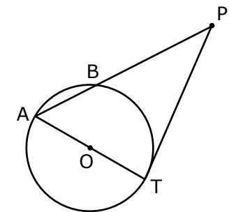

- 18. En la circunferencia de centro O de la figura adjunta, C es punto de tangencia, AD = 5 cm, DB = 4 cm y OB = 10 cm. ¿Cuántos centímetros mide el diámetro de la circunferencia?
  - A) 12
  - B) 16
  - c) 4
  - D) 13
  - E) 8

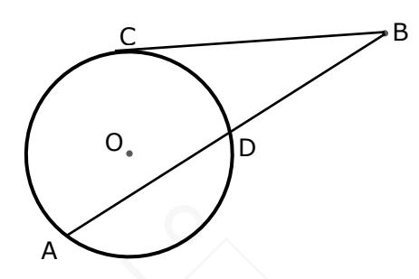

- 19. En la circunferencia de la figura adjunta, PT es tangente en T a la circunferencia, PQ secante a la circunferencia que la intersecta en R y Q. Si en la secante PQ está contenido un diámetro de la circunferencia, entonces es posible determinar su radio, si:
  - (1) PT = 12 cm

(2) PR = 
$$\frac{2}{3}$$
 PT

- A) (1) por sí sola
- B) (2) por sí sola
- C) Ambas juntas, (1) y (2)
- D) Cada una por sí sola, (1) ó (2)
- E) Se requiere información adicional

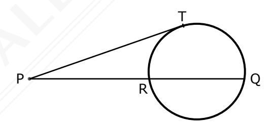

- 20. En la circunferencia de centro O de la figura adjunta, AB es diámetro. Es posible determinar la medida del ∡DBC, si:
  - (1) AD = AC = OC
  - (2) ∡OCA = ∡AOC
  - A) (1) por sí sola
  - B) (2) por sí sola
  - C) Ambas juntas, (1) y (2)
  - D) Cada una por sí sola, (1) ó (2)
  - E) Se requiere información adicional

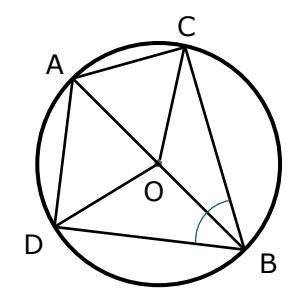