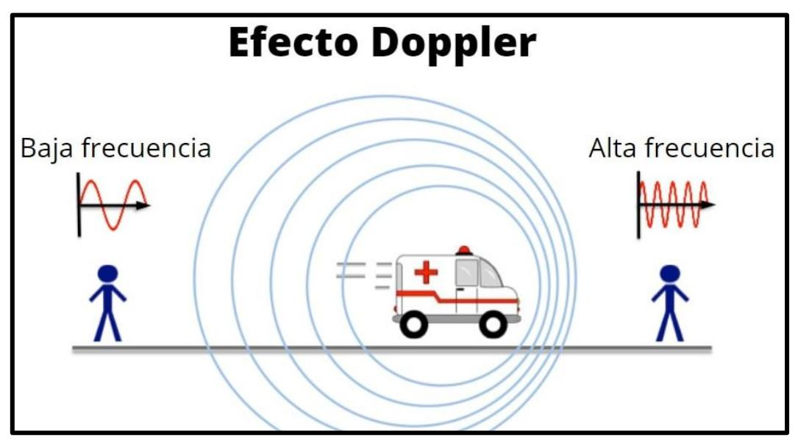

## **SONIDO** → Onda mecánica y longitudinal

## **ESPECTRO DE AUDICIÓN**

INFRASONIDO | 20 – 20.000 [Hz] | ULTRASONIDO { Rango audible }

## **CARACTERÍSTICAS DEL SONIDO**

|             | INTENSIDAD         | TONO o             | TIMBRE               |
|-------------|--------------------|--------------------|----------------------|
|             | (Volumen)          | ALTURA             |                      |
|             | Permite distinguir | Permite distinguir | Permite diferenciar  |
| Descripción | entre un sonido    | entre un sonido    | sonidos de igual     |
|             | fuerte o débil     | agudo o grave      | altura e intensidade |
| Depende de  | Amplitud de Onda   | Frecuencia de onda | Fuente emisora       |

## **EFECTO DOPPLER**

Efecto producido por un **CAMBIO APARENTE** en el **tono** de un sonido ya que la **frecuencia** real **no cambia**, ocasionado por el **movimiento relativo** entre el emisor y el receptor

https://bit.ly/3b7M9lR