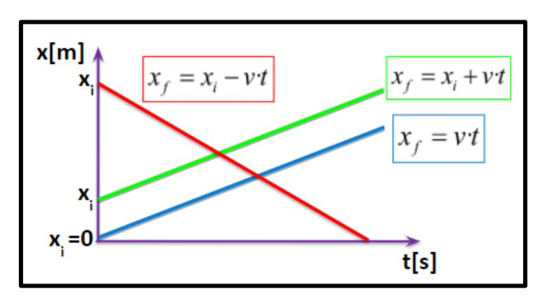
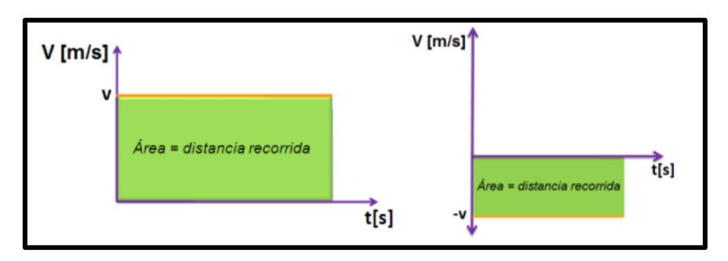

### **RAPIDEZ y VELOCIDAD**

|                | RAPIDEZ                      | VELOCIDAD               |
|----------------|------------------------------|-------------------------|
| Característica | ESCALAR que relaciona        | VECTOR que relaciona el |
|                | distancia recorrida y tiempo | cambio de posición      |
|                | demorado                     | (desplazamiento) y el   |
|                |                              | tiempo demorado         |
| Fórmula        | 𝐷𝑖𝑠𝑡𝑎𝑛𝑐𝑖𝑎 𝑟𝑒𝑐𝑐𝑜𝑟𝑖𝑑𝑎       | 𝐷𝑒𝑠𝑝𝑙𝑎𝑧𝑎𝑚𝑖𝑒𝑛𝑡𝑜          |
|                | 𝑇𝑖𝑒𝑚𝑝𝑜                       | 𝑇𝑖𝑒𝑚𝑝𝑜                  |

# **ECUACIÓN**

$$x_f = x_i + v * t$$

 : ó ; : ó ; : ; :

# **GRÁFICAS**

### **Posición vs tiempo**

### **Velocidad vs tiempo**

### **VELOCIDAD RELATIVA**

$$V_{ab} = V_a - V_b$$

Velocidad del cuerpo "a" con respecto al cuerpo "b"