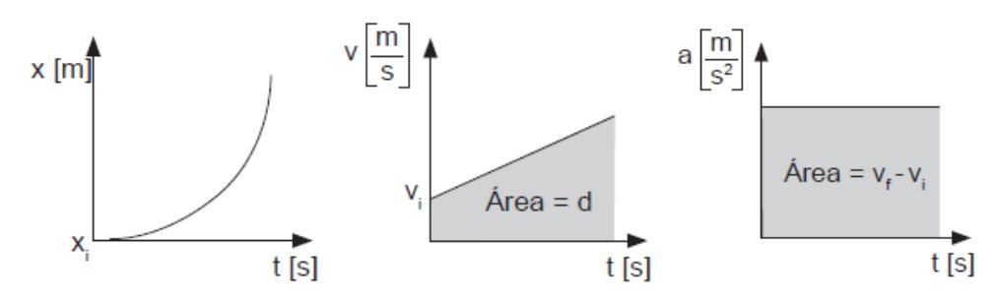
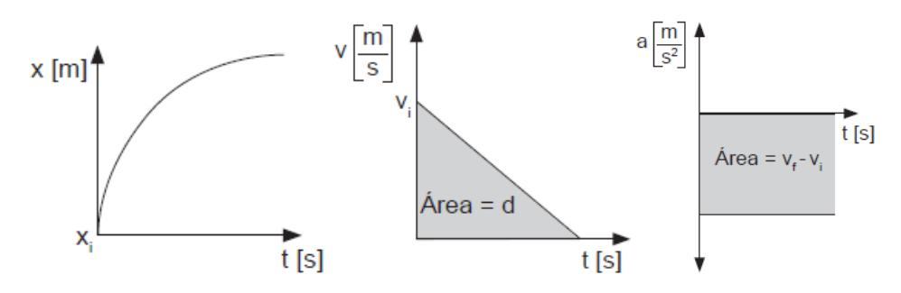

## **ECUACIONES DE ITINERARIO**

$$x_f = x_i + v * t + \frac{a * t^2}{2}$$

$$v_f = v_i + a * t$$

$$v_f^2 = v_i^2 + 2 * a * d$$

 $x_i$ : posición inicial;  $x_f$ : posición finial;  $v_i$ : velocidad inicial;  $v_f$ : velocidad final; a: aceleración d: distancia recorrida; t: tiempo

## **GRÁFICAS MRUA**

## **GRÁFICAS MRUR**

