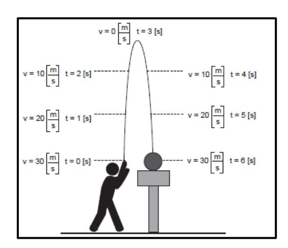
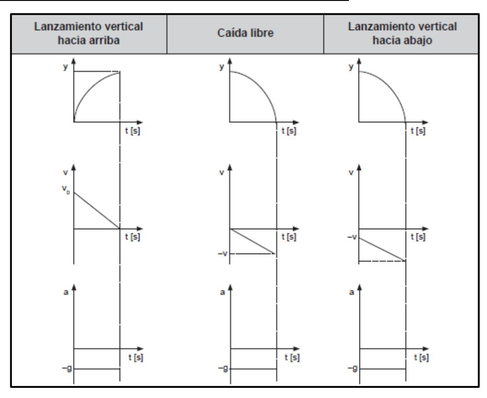

## **MOVIMIENTOS VERTICALES**

La única aceleración que actúa sobre los cuerpos es la **aceleración de gravedad** de valor  $9.8 \text{ m/s}^2$ , aproximado a  $10 \text{ m/s}^2$ .

- Caída libre → Se suelta un objeto desde una cierta altura, o sea tiene velocidad inicial cero
- Lanzamiento vertical hacia abajo → A un objeto, se le da una velocidad inicial distinta de cero apuntando al suelo
- Lanzamiento vertical hacia arriba → A un objeto, se le da una velocidad inicial distinta de cero apuntando hacia arriba

En un **lanzamiento vertical hacia arriba**, el tiempo en subir es igual al de bajada.

Y la rapidez en cada punto de la trayectoria es la misma en la subida y bajada, cambiando solo el signo de la velocidad.

## **GRÁFICAS REPRESENTATIVAS DE LOS MOVIMIENTOS VERTICALES**

