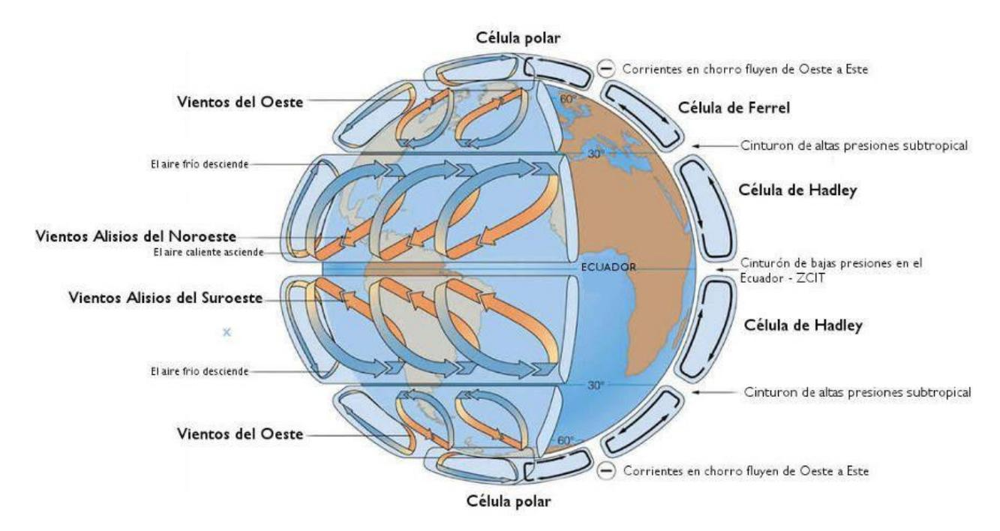
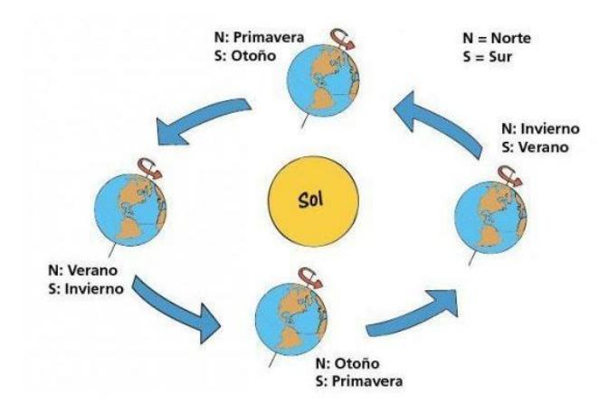
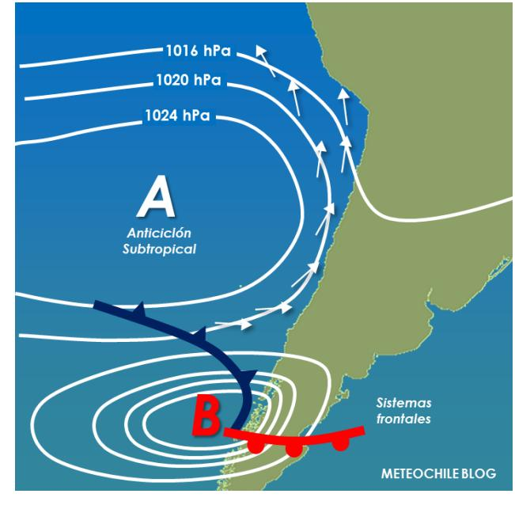
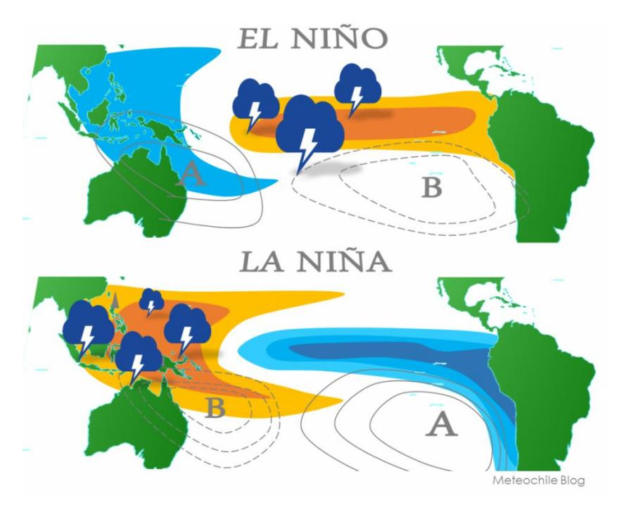
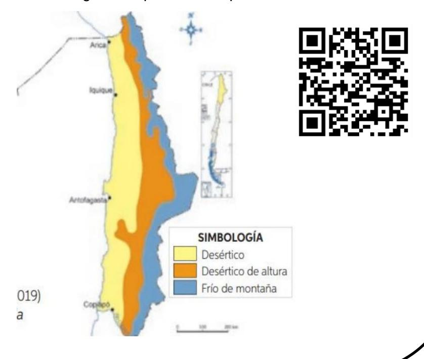
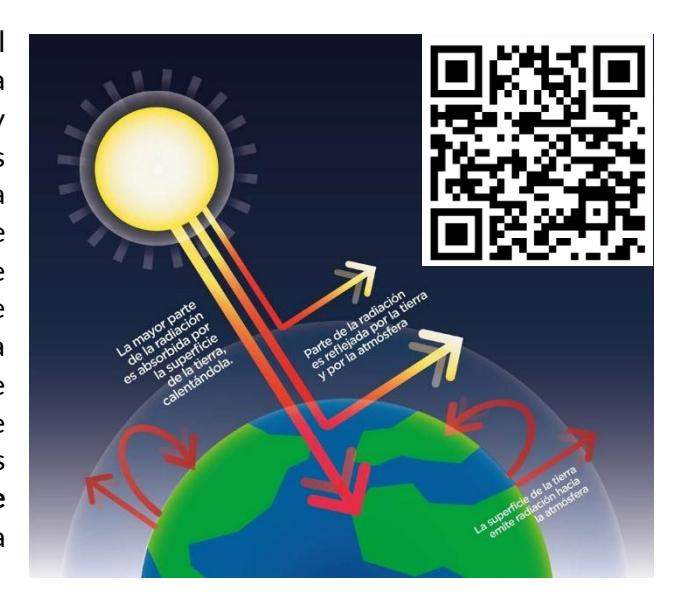
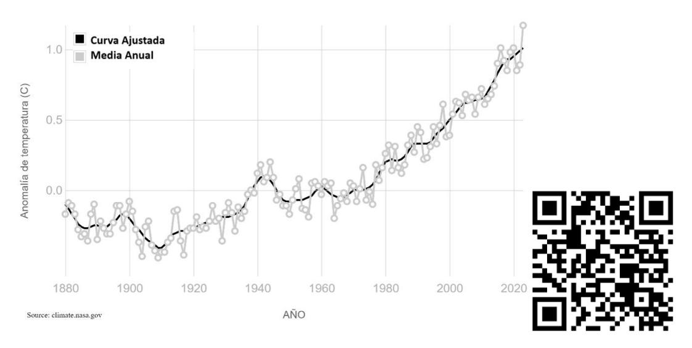
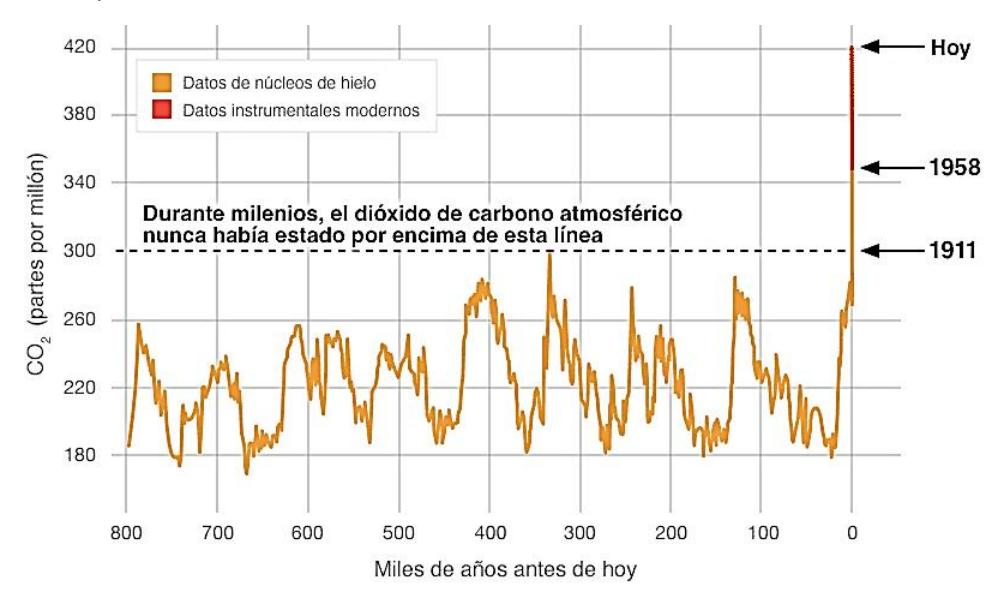
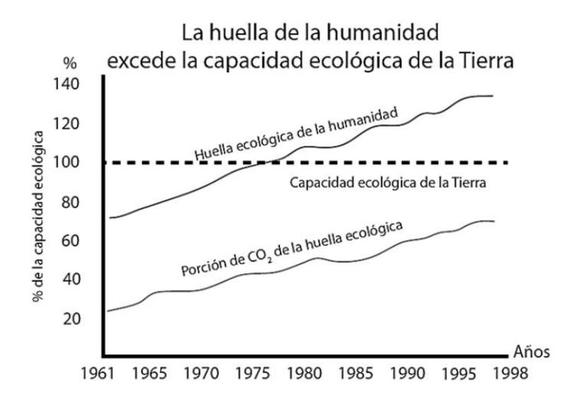
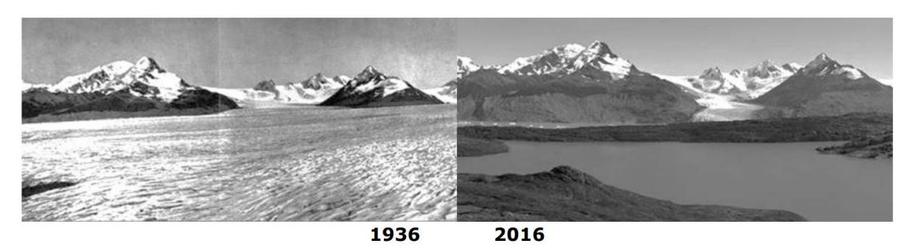

**APARTADO ELEMENTOS Y FACTORES DEL CLIMA**

# **1. Clima.**

## **1.1. Diferencia entre tiempo atmosférico y clima.**

Para comenzar a entender el concepto de clima debemos precisar una distinción. **El tiempo atmosférico** se refiere a las condiciones en un determinado momento, por ejemplo; el pronóstico del tiempo que entregan día a día se refiere a si la temperatura será baja o alta, a la velocidad del viento, si será un día soleado o nublado, o si habrá chubascos o precipitaciones en un determinado día, e incluso a ciertas horas. Por otra parte, **el clima** se refiere al comportamiento de un sector en un periodo de tiempo mucho más extenso, de años o décadas. Para entender el clima se utilizan las medidas promedio de las variables del tiempo atmosférico; temperatura media, precipitación media, etc.

## **1.2. Elementos y factores del clima.**

Existen diferentes elementos que constituyen el clima de una determinada región, los que son condicionados por factores climáticos propios de cada zona geográfica. En general, lo que se modifica es el flujo de energía en un sistema climático, donde la principal entrada de energía corresponde a la radiación solar.

# **1.2.1. Elementos del clima y tiempo atmosférico.**

• Presión atmosférica.

La temperatura del aire afecta directamente la presión atmosférica en una zona geográfica: El aire cuando se calienta asciende por convección, produciendo zonas de baja presión (condiciones meteorológicas inestables), mientras que cuando se enfría, desciende, generando zonas de alta presión (mayor estabilidad atmosférica). Es decir, existe una relación entre la temperatura de una masa de gas y su presión.

#### • Temperatura

La temperatura del aire es un indicador de la energía interna del sistema y se refiere al movimiento de las moléculas de gas. Varía dependiendo de, por ejemplo, la altura a la cual nos encontremos, la latitud, etc. Los factores del clima van a influir en la temperatura alcanzada por una determinada zona.

#### • Viento

Las corrientes de viento se desplazan siguiendo las tendencias de presión y temperatura: siguen rutas desde zonas de alta presión atmosférica hacia zonas de baja presión. El ascenso y descenso de las masas de aire genera que la presión pueda ser alta o baja a niveles cercanos al suelo o en altura.

## • Humedad

La humedad se refiere al desplazamiento de masas de agua a través de la atmósfera y está estrechamente relacionada con la temperatura; en zonas de mayor temperatura habrá mayor humedad, y viceversa. Esto es porque aumenta la evaporación de los cuerpos de agua y la capacidad del aire para retener el vapor de agua al aumentar la temperatura.

#### • Precipitación

Ocurren principalmente por la condensación a gran altitud y posterior caída del agua acumulada en el aire. Puede ser en forma de lluvia, nieve o granizo.

#### • Radiación

Se refiere a la radiación solar que recibe un área particular, es la principal entrada de energía a la Tierra. Depende, entre otras cosas, de la latitud y el momento del año.

## **1.2.2. Factores del clima.**

## • Altitud

A nivel troposférico, sabemos que, a mayor altura, menor es la temperatura del lugar geográfico. Esto se relaciona también con diferencias en la presión, en la parte alta de la troposfera la presión atmosférica es una quinta parte de la presión a nivel del mar.

## • Latitud

Este factor incide directamente en la radiación solar recibida por la Tierra; cuando los rayos de luz provenientes del sol no inciden de forma perpendicular sobre la superficie, el área sobre la cual se distribuye la energía, y la cantidad de energía disipada son mayores. Esto causa que los polos sean más fríos que el ecuador.

#### • Cercanía al mar

El agua presenta una capacidad calorífica grande, por lo tanto, puede absorber grandes cantidades de calor durante largo tiempo. Esto explica que las zonas costeras sean más templadas. Inclusive las zonas desérticas, que presentan gran oscilación térmica durante el día, presentan una menor oscilación si están próximas al mar.

#### • Relieve

La presencia de montañas afecta el movimiento de las masas de aire. Los vientos que chocan con una montaña ascienden, se enfrían y pierden humedad en forma de precipitación (Barlovento). Al llegar al otro lado de la montaña, el aire desciende y absorbe agua, originando ambientes secos (Sotavento).

#### • Circulación oceánica

Es el movimiento de grandes masas de agua a través del planeta, lo que implica también el tránsito de la energía del sistema por los océanos. Esta circulación se produce gracias al movimiento de rotación de la Tierra en conjunto con la influencia de los vientos, y por el ingreso de energía a través de la radiación solar.

## **1.2.3. Factores globales del clima.**

También existen factores que influyen a nivel global y que no son específicos de una zona geográfica particular, pero condicionan los elementos del clima.

#### • **Rotación**

La rotación de la Tierra causa la rotación de las grandes masas de aire en corrientes que avanzan en direcciones contrarias en ambos hemisferios. Causa los llamados vientos alisios, vientos del oeste y los vientos polares. Dicho movimiento afecta, por ejemplo, el sentido de rotación de los vientos ciclónicos en cada hemisferio. Además, influye en la formación del Anticiclón del Pacífico ubicado a los 30° de latitud en el hemisferio sur.

#### • **Traslación.**

El efecto del movimiento de traslación de la Tierra sobre el clima está ligado a la inclinación del eje del planeta, esto afecta la cantidad de radiación solar que recibe cada hemisferio en diferentes momentos del año. Es verano en un hemisferio cuando está expuesto de manera más directa al sol, por el contrario, cuando la radiación llega de forma indirecta es invierno. Además, lo anterior hace que exista una diferencia entre hemisferios; cuando en el hemisferio norte es verano, en el hemisferio sur es invierno, y viceversa. También implica que hay zonas donde no se presentan las cuatro estaciones del año, ya que siempre (o nunca) están expuestas de manera directa a la radiación solar.

## **1.3. Fenómenos climáticos en Chile.**

## **1.3.1. Anticiclón del Pacífico.**

La palabra anticiclón describe el descenso del aire en zonas de alta presión formando una espiral en sentido opuesto a las manecillas del reloj (antihorario). Este tipo de movimiento aparece en latitudes intermedias entre el ecuador y el polo sur, donde interactúan corrientes de viento en direcciones opuestas.

El Anticiclón del Pacífico es relevante para nosotros ya que se ubica en el Océano Pacífico, frente a las costas de Chile, y la intensidad del anticiclón afecta dramáticamente el clima del país. Este anticiclón es un sistema de alta presión y de intensidad variable, que se caracteriza por impedir que se formen las condiciones para que ocurran lluvias. Es decir, si el anticiclón está en una fase de mayor intensidad, habrá menores precipitaciones en el país, y viceversa; a menor intensidad se favorecen las precipitaciones. El Anticiclón del Pacífico es un impulsor de la corriente de Humboldt y es el componente atmosférico del fenómeno de El Niño – Oscilación del Sur.

## **1.3.2. Corriente de Humboldt.**

Las corrientes oceánicas forman sistemas complejos que movilizan energía dependiendo de diversos factores como, por ejemplo, las corrientes de viento y la interacción con otras corrientes oceánicas. En el caso de la costa de Chile, estas corrientes causan que se produzca un fenómeno de surgencia; las aguas profundas y a muy baja temperatura suben a la superficie. Esta es la llamada corriente de Humboldt o corriente del Perú, que impacta en las costas desde la Gran Isla de Chiloé hacia el norte, hasta la costa de Perú. Esta corriente causa climas fríos y favorece que sean más secos, aporta así a la conformación del desierto de Atacama en Chile y el desierto costero en Perú.

A pesar de lo anterior, las costas afectadas por la corriente de Humboldt son de las más productivas del mundo llegando a representar el 20% de la productividad marina total del planeta. Esto es debido a que la surgencia además de traer aguas frías, es muy rica en nutrientes y carbono, condiciones que favorecen la proliferación de la vida en las costas, en particular de fitoplancton.

# **1.3.3. Fenómenos de "El Niño" y "La Niña".**

Los fenómenos de "El Niño" y "La Niña" son parte de la variación en el sistema climático que afecta la temperatura superficial del océano, y está acoplado con la intensidad del Anticiclón del Pacífico. Cuando está en fase "El Niño", la temperatura del océano es más cálida y el Anticiclón del Pacífico es menos intenso. Lo opuesto ocurre durante "La Niña", la temperatura del océano es menor y la intensidad del Anticiclón del Pacífico es mayor. Así, la fase "El Niño" es más lluviosa que la fase "La Niña". A estos fenómenos en conjunto se les conoce como "El Niño – Oscilación del Sur".

La duración promedio de cada fase va de unos 6 meses a unos dos años, pueden existir también fases neutras. Vale la pena destacar que estos fenómenos son parte de la variabilidad climática, siendo parte del complejo sistema de fluctuaciones climáticas, no son consecuencia del Cambio Climático.

**Aplicación:** Para comprender cómo interactúan los fenómenos climáticos analizaremos una zona geográfica de particular interés; el desierto de Atacama.

Este desierto ubicado en el norte de Chile es el más árido del mundo, a pesar de que un poco más al norte, cruzando la cordillera de Los Andes, encontramos la selva del Amazonas. El contraste entre ambos es notable. ¿Qué hace posible esta diferencia?

Las cordilleras juegan un papel importante, tanto la de Los Andes como la cordillera de la Costa. Estos relieves forman un verdadero muro que evita el paso de la humedad y causa el fenómeno de sotavento, es decir, el aire que circula sobre el desierto no trae la humedad de la selva o del océano.

Además, la corriente de Humboldt evita que la parte costera del desierto sea húmeda debido a su baja temperatura, y los vientos fuertes provocados por el Anticiclón del Pacífico tienden a dispersar la humedad del aire en la zona, evitando así la condensación y posterior precipitación en el desierto de Atacama. El índice de precipitación sobre el desierto de Atacama está entre los más bajos a nivel mundial.

¿Por qué es tan relevante? Sus condiciones climáticas únicas lo convierten en un sitio de observación astronómica importante gracias a sus cielos despejados, y su cercanía al ecuador hace que la radiación solar, a pesar de que no llega perpendicular a la superficie, alcance una potencia de 300 W/m^2 que lo posiciona como un lugar ideal para colocar paneles solares.

# **2. Cambio Climático y Calentamiento Global.**

## **2.1.Cambio Climático**

Definimos el clima como el análisis de décadas de datos para obtener el comportamiento promedio de una zona geográfica particular, por lo que cuando hablamos de clima nos referimos a una propiedad relativamente estable. Sin embargo, puede cambiar en el tiempo, y dado que la Tierra es un sistema dinámico, desde su formación está en constante cambio. En general, lo que cambia es el flujo de energía en el sistema, a causa de diversos factores. La climatología ha identificado una sucesión de climas fríos y cálidos en los últimos mil millones de años. Sin embargo, en los últimos años se ha recopilado bastante evidencia científica que permite afirmar que el aumento de la temperatura terrestre actualmente constituye una amenaza medioambiental. A continuación, hablaremos del mecanismo, las causas naturales y antropogénicas, y las consecuencias del cambio climático.

## **2.2. Efecto invernadero**

Como ya se dijo, la radiación solar juega un rol preponderante en el ingreso de energía a la Tierra. Esta radiación pasa por la atmósfera y parte de ella es absorbida, otra parte es reflejada y vuelve al espacio, mientras otra porción llega al suelo y lo calienta. En este proceso, el suelo emite calor en forma de radiación infrarroja. Una fracción importante de este calor disipado es reabsorbido por la atmósfera antes de salir al espacio, gracias a que en la atmósfera hay gases que naturalmente captan esta radiación; este fenómeno es llamado efecto invernadero, y son los **Gases de Efecto Invernadero (GEI)** los que retienen esta radiación en la atmósfera terrestre.

Es importante aclarar que el efecto invernadero no es un fenómeno perjudicial para la vida en la Tierra, e incluso es relevante para mantenerla. Sin embargo, el aumento del efecto invernadero provoca problemas graves en la estabilidad climática. Actualmente, todos los modelos climáticos se centran en el estudio del efecto invernadero para explicar el cambio climático, ya que es el efecto que modula la entrada y salida de energía del sistema Tierra.

## **2.2.1. Efecto invernadero natural**

Los principales gases presentes de forma natural en la atmósfera que participan de este efecto son: el ozono (O3) que absorbe en la banda ultravioleta; el vapor de agua (H2O), el oxígeno (O2), el metano (CH4), y el dióxido de carbono (CO2), que absorben la banda infrarroja. Estos gases son parte de ciclos naturales en los que participan los seres vivos también, incluido el ser humano. Se renuevan constantemente en la atmósfera y fluctúan con el tiempo causando cambios como, por ejemplo, eras de hielo y períodos de calentamiento global, a lo largo de miles o millones de años. Es decir, la velocidad del cambio climático natural es muy lenta.

## **2.2.2. Efecto invernadero antropogénico**

La palabra antropogénico quiere decir que es de origen humano, es causado por la acción humana. La emisión de GEI causada por el ser humano influye en el incremento del efecto invernadero. Algunos están presentes en productos químicos industriales, como los clorofluorocarbonos (CFC), los hidrofluorocarbonos (HFC), perfluorocarbonos (PFC), o el hexafluoruro de azufre (SF6).

Además de esto, la acción humana también influye en como aumenta la emisión de GEI a través de la quema de combustibles fósiles. Se estima que desde la Revolución Industrial la concentración de CO2 en la atmósfera ha aumentado un 45% por acción humana, esto es, aumentó desde 280 partes por millón (ppm) en 1750 a 400 ppm en 2015. De acuerdo al cuarto informe del Grupo Intergubernamental de Expertos sobre el Cambio Climático (IPCC por sus siglas en inglés) la temperatura en la superficie terrestre aumentó en 1 °C durante el siglo XX. La intensificación de este efecto está directamente relacionada con un aumento de la temperatura global. Según algunos modelos este aumento podría ser de entre 1,1 °C a 6,4 °C entre 1990 y 2100, es decir, puede superar el límite de 2 °C señalado por el IPCC como "peligroso" por sus efectos en los ecosistemas, la biodiversidad, y la subsistencia del ser humano en el planeta.

*Gráfico 1. Anomalía de temperatura media anual. Obtenido de la NASA.*

Entre las acciones humanas que influyen en la intensificación del efecto invernadero tenemos la agricultura, los procesos industriales, el mal manejo de residuos, entre otros, que incrementan la emisión de GEI hacia la atmósfera. Por otro lado, acciones como el cambio de uso de suelo y la deforestación impactan negativamente en la capacidad del medioambiente de fijar carbono a través de la fotosíntesis, esto es, absorberlo desde la atmósfera regulando la concentración de CO2 ambiental. Los incendios forestales, tanto aquellos producidos de forma natural como los que se producen por acción humana, hacen las dos cosas; emiten CO2 a la atmósfera y afectan la capacidad del ecosistema de absorber este gas.

## **2.2.3. Efecto invernadero y calentamiento global.**

Con todo esto, es posible afirmar que existe una relación entre el efecto invernadero y el **calentamiento global**. Algunas evidencias que apoyan el calentamiento global son:

- 1. Aumento de la temperatura media de la atmósfera de la Tierra en las últimas décadas.
- 2. Aumento del nivel medio del mar y su temperatura media en las últimas décadas.
- 3. Cambios en los ecosistemas.
- 4. Aumento de las especies animales y vegetales en peligro de extinción.
- 5. Aumento en la periodicidad de las sequías.
- 6. Retroceso de los glaciares.
- 7. Mayor ocurrencia de eventos climáticos extremos.

En particular se reconocen las consecuencias que ha tenido la intensificación del efecto invernadero antropogénico. En el año 2014 el IPCC declaró lo siguiente:

*"Se ha detectado la influencia humana en el calentamiento de la atmósfera y el océano, en alteraciones en el ciclo global del agua, en reducciones de la cantidad de nieve y hielo, y en la elevación del nivel medio global del mar; y es sumamente probable que haya sido la causa dominante del calentamiento observado desde mediados del siglo XX. En los últimos decenios, los cambios del clima han causado impactos en los sistemas naturales y humanos en todos los continentes y en los océanos. Los impactos se deben al cambio climático observado, independientemente de su causa, lo que indica la sensibilidad de los sistemas naturales y humanos al cambio del clima."*

*Gráfico 2. Datos de concentración de CO2 atmosférico. El año 1958 marca el comienzo del uso de instrumental moderno para recoger datos. Obtenido de la NASA*

#### **2.3.Capa de ozono y efecto invernadero.**

Es necesario detenerse en el caso del ozono ya que este gas participa del efecto invernadero de una forma particular. El ozono (O3) es un gas de color azul pálido, irritante y picante. Se genera por acción de la luz ultravioleta sobre la molécula de oxígeno en la estratosfera, mientras que en la troposfera se origina a partir de reacciones fotoquímicas. Es decir, no es producido ni emitido directamente por la acción humana.

El ozono troposférico es un contaminante activo y peligroso, mientras que el ozono estratosférico es imprescindible para la existencia de la vida en la Tierra, ya que absorbe entre un 97 y un 99% de la radiación UV de alta frecuencia, impidiendo que llegue a los seres vivos. La mayor parte del ozono existente en la atmósfera se forma y se encuentra en la estratosfera, a una altura de entre 12 y 40 km sobre la superficie terrestre.

Lamentablemente, en los últimos años se ha constatado una disminución persistente de los niveles de ozono estratosférico desde 1979, sobre todo en la Antártida formando un agujero que es prácticamente del tamaño del continente helado. El agujero en la capa de ozono que se observa en esa zona geográfica no es casual, ocurre porque ahí se reúnen una serie de condiciones climáticas muy particulares: En la Antártida se asienta un anticiclón continental que permite la formación de nubes de hielo estratosféricas (las NEP). Estas nubes, al condensarse generan una desnitrificación de la atmósfera que favorece la destrucción de la capa de ozono.

Algunos productos químicos que los humanos usamos cotidianamente y que dañan la capa de ozono son: los clorofluorocarbonos (CFC), los hidrofluorocarbonos (HFC), el bromuro de metilo, los metilocloroformos (MCF) y el tetracloruro de carbono. Estos productos se encuentran en los frigoríficos, en aerosoles, algunos tipos de espumas plásticas y los sistemas de prevención de incendios. Su larga vida media permite que lleguen a la estratosfera y, al ser irradiados por la luz UV, se descomponen liberando átomos de cloro o bromo, los que comienzan una serie de reacciones químicas que termina con la destrucción de las moléculas de ozono.

Se han realizado diversos esfuerzos para reducir el uso de este tipo de productos químicos, entre los que destaca el Protocolo de Montreal. Este acuerdo, ratificado por todos los países miembros de las Naciones Unidas, promovía la reducción de CFC presentes en aerosoles. Gracias a la implementación rigurosa de esta iniciativa internacional se estima que la capa de ozono se podría recuperar por completo antes del año 2066.

# **2.4. Huella de carbono y huella ecológica. 2.4.1. Huella de carbono.**

A pesar de que son varios los gases que participa del efecto invernadero, es relevante que no todos los GEI tienen la misma capacidad para absorber la radiación solar infrarroja, por lo que se ha definido el término Potencial de Calentamiento Global (PCG). El PCG es una medida estandarizada de la contribución de un gas al cambio climático, donde al CO2 se le asigna un valor igual a 1. A partir de esto, la **huella de carbono** es la medición de las emisiones de GEI hacia la atmósfera por parte de personas y empresas, es un primer paso para tomar conciencia del impacto que producen en el medio ambiente, para luego tomar medidas que busquen reducir estas emisiones.

# **2.4.2. Huella ecológica.**

A diferencia de la huella de carbono, la **huella ecológica** es un análisis de todos los recursos, energía, alimentos y desechos que consumen y producen los seres humanos y que contribuyen a aumentar el cambio climático global. Se utiliza como una medida de la sostenibilidad de nuestro consumo y permite dar cuenta del hecho de que los asentamientos humanos no afectan únicamente el área donde se encuentran. Dicho de otra forma, nuestras acciones locales tienen efectos globales.

En las estimaciones de la huella ecológica interviene el consumo de alimentos, materiales y energía por parte de la población, las que se comparan con las "unidades de superficie" de tierras biológicamente productivas y necesarias para obtener estos recursos, o bien, en caso de la energía, la capacidad para absorber las emisiones de CO2. De este modo, la huella ecológica se puede calcular de forma individual para un país o para todos los habitantes de la tierra.

Este indicador permite poner en evidencia las diferencias entre la demanda y consumo de recursos naturales, tanto en términos absolutos como per cápita. En el gráfico se puede ver la huella ecológica entre los años 1961 y 1998. Podemos ver que ya se sobrepasó la capacidad ecológica de la Tierra para sustentarnos, es decir, la capacidad de recursos de la Tierra no es suficiente para sustentarnos con el actual nivel de consumo de recursos.

*Gráfico 3. Huella Ecológica de la humanidad.* 

## **2.5.Consecuencias del cambio climático.**

El cambio climático ya está afectando a los ecosistemas, las poblaciones humanas y los ciclos naturales a nivel mundial. Un ejemplo de esto es el cambio en el ciclo del agua; la evaporación del agua afecta la cantidad de vapor de agua en la atmósfera que, recordemos, intensifica el efecto invernadero, al ocurrir esto se forman más nubes, con mayor humedad ambiental lo que genera lluvias más intensas.

Los efectos del cambio climático son observables en el aumento de fenómenos climáticos dañinos como la lluvia ácida o el aumento de la frecuencia e intensidad de sequías, huracanes e inundaciones, al mismo tiempo que hay un mayor ritmo de desertización del suelo. También hay cada vez más especies en peligro de extinción a causa de las migraciones o la escasez de agua disponible en el planeta.

#### Preuniversitario UC © Pontificia Universidad Católica de Chile

Por último, el cambio climático impacta directamente la calidad de vida del ser humano, dado que los efectos tienden a intensificar la desigualdad y generar migraciones masivas de personas a través del planeta a causa del daño a las propiedades y los problemas de producción y abastecimiento de alimentos en diversas zonas.

*Retroceso de los glaciares patagónicos.*