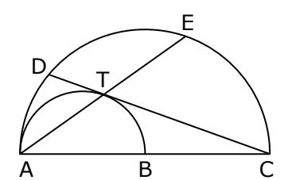

MATERIAL DESAFÍO Nº 05

1. Si se cumple:  $2^{2^2} + 1.024 = 1.024 \cdot a$ , entonces  $2^{2^2} - \left[ (2^2)^4 \right]^{0.5} \cdot a$  es

- A) 0
- B)  $2^{2^2}$
- C)  $2^{12}$
- D) -16
- E) 224

2. Si  $a - b = b - c = \sqrt[7]{7}$ , entonces  $\frac{(a - c)^7 + (b - c)^7 + (a - b)^7}{70}$  es

- A) 16
- B) 13
- C) 12
- D) 10
- E) 2

3. Si  $P(x + 1) = x^2 + 1$  y  $H = (x) = \begin{cases} P(x - 1) + P(x + 1) ; & \text{si } x \ge 1 \\ P(x) + P(-x) & \text{; si } < 1 \end{cases}$ , entonces H(0) + H(1) es

- A) 9
- B) 8
- c) 7
- D) 6
- E) 5

4. En la figura adjunta, se tiene AC semicircunferencia de centro B. Si AB es semicircunferencia donde  $\overline{AB} = \overline{BC} = 2R$ , T es punto de tangencia. Determinar ET

- A) R√6
- B)  $\frac{2}{3}$  R
- C)  $\frac{2}{3} R \sqrt{6}$
- D)  $\frac{R}{3}\sqrt{6}$
- E)  $\frac{3}{2} R \sqrt{6}$

**Respuestas:** 1 **D** 2 **B** 3 **B** 4 **C**