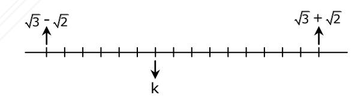

## REUNIVERSITARIO

## EDRO DE VALDIVI

## **MATEMÁTICA** DM-01 / DESAFÍO Nº 1 EJE TEMÁTICO: NÚMEROS

- Los números m y n son enteros positivos pares en que m > n. ¿Cuál de las siguientes afirmaciones es siempre verdadera?
  - A) (m + n)(m n) es par.
  - B) mn es múltiplo de 8.
  - C) m + n es divisible por 4.
  - D) m n no puede ser primo.
- Sean a y b números reales tales que  $\frac{1}{4}$  < a <  $\frac{1}{3}$ ,  $\frac{2}{3}$  < b <  $\frac{3}{4}$  y c = 3a 2b. ¿Cuál 2. de las siguientes relaciones es verdadera?

A) 
$$\frac{4}{3} < c < \frac{5}{2}$$

B) 
$$\frac{3}{4} < c < 1$$

C) 
$$-\frac{4}{3} < c < -\frac{3}{4}$$

D) 
$$-\frac{3}{4} < c < -\frac{1}{3}$$

En el conjunto de los enteros positivos se dan las siguientes razones:  $r_1 = \frac{a-b}{a+b}$  y  $r_2 = \frac{a^2 - b^2}{a^2 + b^2}$  (con a > b). ¿Cuál de las siguientes relaciones es verdadera?

A) 
$$r_1 > r_2$$

B) 
$$r_1 < r_2$$

C) 
$$r_1 = r_2$$

B) 
$$r_1 < r_2$$
  
C)  $r_1 = r_2$   
D)  $r_1 + r_2 = 4$ 

- 4. Si  $A = 18^4 \cdot 27^3$  y  $B = 12^{11} \cdot 24^3$ , entonces ¿cuál es el máximo común divisor (M.C.D) de A y B?

  - A) 24 · 33 B) 24 · 314 C) 24 · 317 D) 231 · 314
- 5.  $0.\overline{6} \cdot 8^{\frac{2}{3}} 0.\overline{6} \cdot 8^{-\frac{2}{3}} =$ 
  - A) -1
- 6. Comparando los números reales racionales:  $a = 10^{-49}$  y  $b = 2 \cdot 10^{-50}$ , ¿cuál de las siguientes proposiciones es verdadera?
  - A) a es igual a 5 veces b
  - B) a excede a b en  $2 \cdot 10^{-1}$
  - C) a excede a b en  $8 \cdot 10^{-49}$
  - D) a excede a b en 5
- En la recta de los números reales adjunta aparecen destacados los números  $\sqrt{3} - \sqrt{2}$ , k y  $\sqrt{3} + \sqrt{2}$ . Si la distancia entre  $\sqrt{3} - \sqrt{2}$  y  $\sqrt{3} + \sqrt{2}$  es igual a 15 unidades, entonces el número k es

- A)  $5\sqrt{3} \sqrt{2}$
- B)  $5\sqrt{3} 5\sqrt{2}$ C)  $\frac{5\sqrt{3} \sqrt{2}}{5}$
- D)  $\frac{\sqrt{3} 5\sqrt{2}}{5}$

- 8. Sabiendo que 5 es aproximadamente igual al decimal 2,236, entonces 106 · 0,00018 es aproximadamente igual al número entero
  - A) 13.416
  - B) 40.248
  - C) 80.496
  - D) 134.160
- 9. Si **s** es un número racional y **t** es un número irracional, entonces ¿cuál(es) de las siguientes afirmaciones es (son) **siempre** verdadera(s)?
  - I) st es irracional.
  - II) s + t es irracional.
  - III) s t es irracional.
  - A) Solo II
  - B) Solo III
  - C) Solo I y II
  - D) Solo II y III
- 10. Si **p** y **q** son dos números irracionales positivos, entonces ¿cuál(es) de las siguientes afirmaciones es (son) **siempre** verdadera(s)?
  - I) **p** · **q** es un irracional positivo.
  - II) **p q** es un irracional positivo.
  - III) **p** + **q** es un irracional positivo.
  - A) Solo I y III
  - B) Solo II y III
  - C) I, II y III
  - D) Ninguna de ellas

- 11. ¿Cuál de las siguientes afirmaciones es **siempre** verdadera?
  - A) El desarrollo de una potencia cuya base es igual al exponente es un número real.
  - B) El producto de un número racional por un número irracional es igual a un número irracional.
  - C) El cuadrado de un número irracional es un número racional.
  - D) Ninguna de las afirmaciones anteriores es siempre verdadera.
- 12. Si T = (2.010)2 · 2.000 – 2.000(1.990)2 , entonces 7 T 10 =
  - A) 8
  - B) 10
  - C) 16
  - D) 20
- 13. Si M = 0,75; P = 9 15 y Q = 18 20 , entonces ¿en cuál de las alternativas se indica un orden decreciente?
  - A) P > Q > M
  - B) Q > P > M
  - C) M > P > Q
  - D) Q > M > P
- 14. ¿Cuál(es) de las siguientes relaciones es (son) **FALSA(S)**?
  - I) -3 2 (4) > 145
  - II) 15,9 = 3,9
  - III) 0,75 < 75 8
  - A) Solo I
  - B) Solo II
  - C) Solo I y II
  - D) Solo II y III

- 15. Una botella tiene agua ocupando el  $66\frac{2}{3}\%$  de su capacidad. A continuación, se sacan 40 cc y el agua ahora queda ocupando el 60%. ¿Cuántos cc se necesitan para terminar de llenar la botella?
  - A) 420
  - B) 350
  - C) 310
  - D) 240
- 16. Un lago tiene una superficie de área 12 km² y 10 metros de profundidad media. Se sabe que el volumen del lago está dado por el producto del área de su superficie por su profundidad media. Cierta sustancia se ha disuelto en este lago de modo que cada metro cúbico de agua contiene 5 gramos de la sustancia. De acuerdo a esta información, ¿cuántos gramos de esta sustancia hay en el lago?
  - A)  $6 \cdot 10^8$
  - B)  $6 \cdot 10^9$
  - C)  $6 \cdot 10^{10}$
  - $D) 6 \cdot 10^{11}$
- 17. En la tabla adjunta, y es inversamente proporcional al cuadrado de x (x > 0). 2Cuál(es) de las siguientes proposiciones es (son) verdadera(s)?

| x | У |
|---|---|
| 1 | 2 |
| 2 | k |
| m | 8 |

- I)  $m^k = k^m$
- II)  $\frac{m^0}{k} > \frac{m}{k}$
- III)  $\frac{1-m}{1+k} > mk$
- A) Solo I y II
- B) Solo I y III
- C) Solo II y III
- D) I, II y III

- 18. El precio de un artículo se aumentó en un 55%. Si se quiere volver al precio original, ¿cuál de los siguientes porcentajes de rebaja al nuevo precio debe hacerse para obtener el valor más cercano al original?
  - A) 25%
  - B) 30%
  - C) 35%
  - D) 40%
- 19. Una tienda comunica a sus clientes que, a partir del próximo lunes se hará un 30% de descuento sobre el precio marcado en vitrina de todos sus productos. El comerciante dueño de la tienda desea que cierto artículo que en vitrina tiene un precio k mantenga este precio, entonces a partir del próximo lunes este artículo deberá aparecer en vitrina con un precio igual a
  - A) 7k 3
  - B) 10k 3
  - C) 17k 3
  - D) 10k 7

## **RESPUESTAS**

| 1. | A | 6.  | A | 11. | D | 16. | A |
|----|---|-----|---|-----|---|-----|---|
| 2. | D | 7.  | C | 12. | C | 17. | D |
| 3. | B | 8.  | A | 13. | B | 18. | C |
| 4. | B | 9.  | A | 14. | A | 19. | D |
| 5. | C | 10. | D | 15. | D |     |   |