## **DESAFÍO N° 3**

EJE TEMÁTICO: **GEOMETRÍA**

- 1. Si en la figura adjunta L1 // L2, entonces m + n =
  - A) 60°
  - B) 80°
  - C) 90°
  - D) 100°

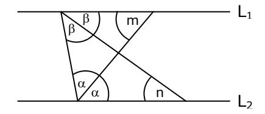

- 2. Con los datos proporcionados en la figura adjunta, se puede determinar que =
  - A) 30°
  - B) 22,5°
  - C) 25°
  - D) 18°

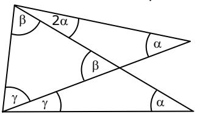

- 3. En la figura adjunta, AC = AB = BD. Entonces, x =
  - A) 60°
  - B) 50°
  - C) 45°
  - D) 30°

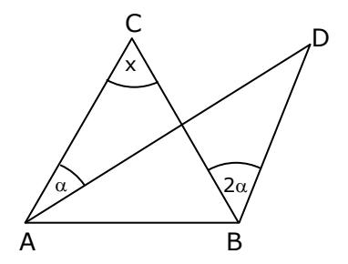

- 4. En la figura adjunta, PS = QM = MR y MPQ = 20°. ¿Cuánto mide el ángulo PQR?
  - A) 20°
  - B) 30°
  - C) 40°
  - D) 50°

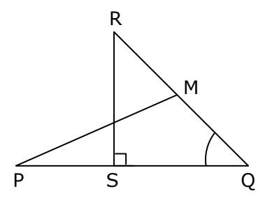

5. En la figura adjunta, los triángulos ABC y EAD son congruentes, AC = BC y BFD = 36°. ¿Cuál es la medida del x?

C

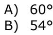

- C) 46°
- D) 36°

- A B D F x
- 6. En la figura ABC DEF. Si CAB = 80°, EDB = 40° y AC // EF , entonces BCA =
  - A) 45°
  - B) 30°
  - C) 60°
  - D) 40°

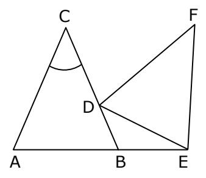

- 7. En el paralelogramo ABCD de la figura adjunta, se tiene que QR // AD , QPR = 60°, PRA = 20° y QP es bisectriz del ángulo DQR. Entonces, x =
  - A) 100°
  - B) 110°
  - C) 120°
  - D) 130°

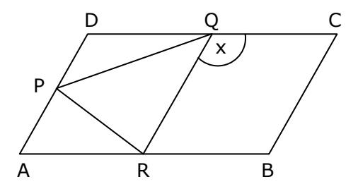

- 8. En la figura adjunta, ABCD es un cuadrado y BEFC es un rombo. Si FBE = 15°, entonces EFD =
  - A) 30°
  - B) 45°
  - C) 60°
  - D) 75°

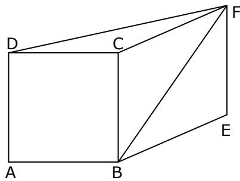

9. El cuadrilátero ABCD de la figura adjunta es un cuadrado y el triángulo ECD es equilátero. ¿Cuánto mide el ángulo CAE?

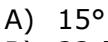

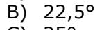

C) 25° D) 30°

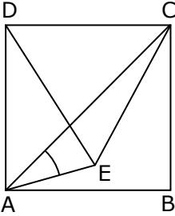

10. En el triángulo ABC rectángulo en C de la figura adjunta, DE // AB y AD FE . Si BEF : DEC = 2 : 3, ¿cuánto mide el ángulo BEF?

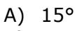

B) 20°

C) 22,5°

D) 36°

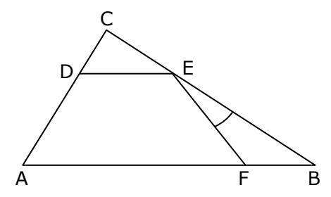

11. En la figura adjunta, ABCD es un trapecio isósceles de bases AB y CD . Si AB = BE, ¿cuánto mide el ángulo CBE?

A) 45°

B) 47°

C) 50°

D) 55°

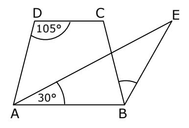

12. En un cuadrilátero convexo, la suma de las medidas de dos ángulos consecutivos es 190°. ¿Cuánto mide el mayor de los ángulos formados por las bisectrices de los otros dos ángulos?

A) 85°

B) 90° C) 95°

13. En el cuadrilátero ABCD de la figura adjunta, BN y CM son bisectrices de los ángulos ABC y BCD, respectivamente. ¿Cuánto suman las medidas de los ángulos BAD y CDA?

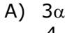

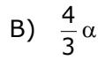

- C) 3 2
- D) 2

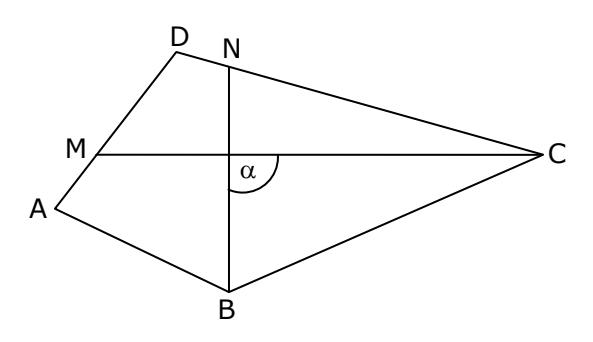

14. En la figura adjunta, CAP = 35° y APD = 50°. ¿Cuál es la medida del ángulo DBP?

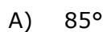

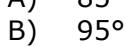

C) 105°

D) 115°

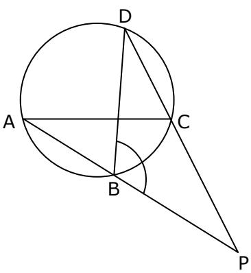

15. En la circunferencia de centro O, M es punto medio de AD y ABM = 35°. Entonces, DAC =

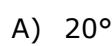

B) 25°

C) 30°

D) 35°

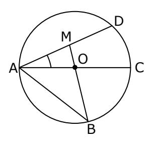

16. En la figura adjunta, PQ es diámetro de la circunferencia circunscrita al triángulo SQR y los ángulos PQR y PTR miden respectivamente, 20° y 85°. ¿Cuánto mide el ángulo SQP?

A) 25°

B) 30°

C) 35°

D) 40°

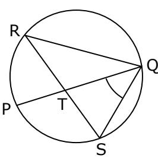

- 17. En la circunferencia de la figura adjunta, CDB = 38°, BCA = 18° y ACD = 45°. ¿Cuánto mide el ángulo DAC?
  - A) 38°
  - B) 45°
  - C) 63°
  - D) 79°

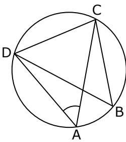

- 18. En la circunferencia de la figura adjunta, ABC = 110° y DEF = 120°. Entonces, AGF =
  - A) 35°
  - B) 40°
  - C) 45°
  - D) 50°

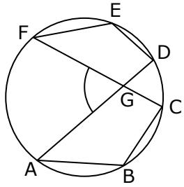

- 19. En la circunferencia de centro O de la figura adjunta, x = 35° e y = 45°. Entonces, z =
  - A) 140°
  - B) 125°
  - C) 110°
  - D) 80°

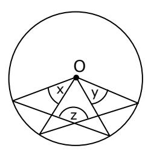

- 20. En la circunferencia de centro O de la figura adjunta, se ha inscrito un pentágono. Si el triángulo PQO es equilátero, entonces + =
  - A) 250°
  - B) 210°
  - C) 190°
  - D) 185°

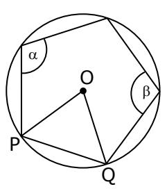

## **RESPUESTAS**

| 1. | C | 6.  | B | 11. | A | 16. | A |
|----|---|-----|---|-----|---|-----|---|
| 2. | B | 7.  | A | 12. | C | 17. | D |
| 3. | A | 8.  | C | 13. | D | 18. | D |
| 4. | C | 9.  | D | 14. | B | 19. | A |
| 5. | B | 10. | C | 15. | A | 20. | B |