## **DESAFÍO N° 4**

EJE TEMÁTICO: **GEOMETRÍA**

1. En la figura adjunta, si la suma de las áreas de los tres cuadrados es 18, ¿cuál es el área del cuadrado mayor?

- A) 6
- B) 8
- C) 9
- D) 10

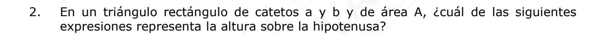

A) 
$$\frac{A}{a^2 + b^2}$$

B) 
$$\frac{A}{\sqrt{a^2 + b^2}}$$

$$C) \quad \frac{A^2}{\sqrt{a^2 + b^2}}$$

$$D) \quad \frac{2A}{\sqrt{a^2 + b^2}}$$

3. En la figura adjunta, si AC = 2AB = 4DB, ¿en qué razón están las medidas de AD y AC , respectivamente?

- A) 2 : 2
- B) 3 : 4
- C) 1 : 2
- D) 1 : 3

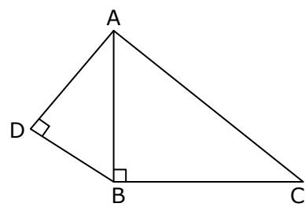

- 4. En el cuadrado ABCD de la figura adjunta, AB = 10 cm, ED = DF y DE : EA = 1 : 4. ¿Cuál es el área del cuadrilátero EBCF?
  - A) 64 cm2
  - B) 70 cm2
  - C) 58 cm2
  - D) 59 cm2

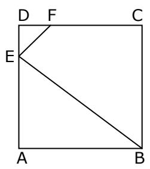

- 5. El trapecio ABCD de la figura adjunta, está formado por el cuadrado AECD y el triángulo EBC. Si AC = 2 6 y AB = 2( 3 + 1), ¿cuánto mide el ángulo BCE?
  - A) 30°
  - B) 45°
  - C) 60°
  - D) No se puede determinar

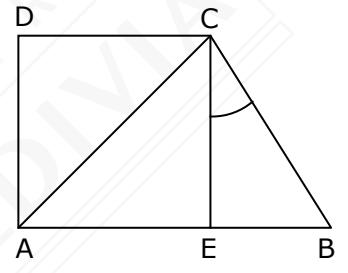

- 6. En la figura adjunta, ABCD es un trapecio rectángulo. Si BC = 2 y BD = 4, ¿cuál es el área del triángulo ACD?
  - A) 3
  - B) 2 2
  - C) 2 5
  - D) 2 3

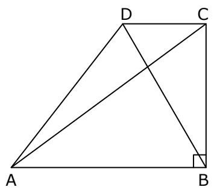

- 7. En la figura adjunta se tienen 4 cuadrados de áreas 16 cm2 , 9 cm2 , 4 cm2 y 1 cm2 , respectivamente, colocados en un rectángulo ABCD. ¿Cuál es el área de la figura achurada?
  - A) 10 cm2 \*
  - B) 15 cm2
  - C) 20 cm2
  - D) 30 cm2

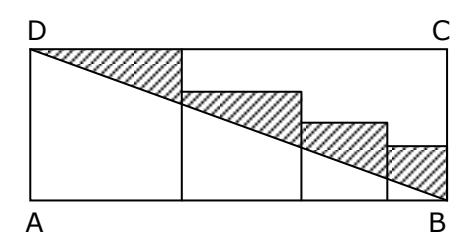

- 8. En el rectángulo ABCD, AB : BC = 4 : 3; BE = EC = 1 : 2 y CF : FD = 1 : 3. Si el área de este rectángulo es 48 cm2 , ¿cuál es el área del cuadrilátero AECF?
  - A) 16 cm2
  - B) 20 cm2
  - C) 22 cm2
  - D) 24 cm2

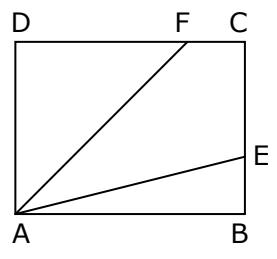

- 9. En la figura adjunta, ABCD es un cuadrado, EBFC es un rombo. ¿En qué razón están los perímetros del cuadrado y del rombo, respectivamente?
  - A) 2 5 : 5
  - B) 5 : 5
  - C) 5 : 10
  - D) 3 : 4

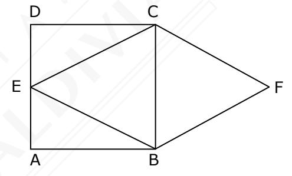

- 10. En la figura adjunta, si C es el centro del cuadrado de menor tamaño, ¿cuál es el área de la figura achurada?
  - A) 27 cm2
  - B) 25 cm2
  - C) 36 cm2
  - D) 30 cm2

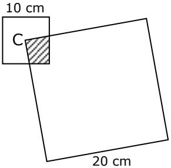

- 11. En el plano cartesiano, los vértices de un cuadrilátero cóncavo ABCD tienen coordenadas A(0, 1); B(4, 0); C(4, 4) y D(3, 2). ¿Cuál es el área de este cuadrilátero?
  - A) 3,5
  - B) 4,5
  - C) 5,5
  - D) 7,5

12. En el cuadrilátero ABCD de la figura adjunta, ABC = 150°, AD = AB = 4 cm, BC = 10 cm, MN = 2 cm, siendo M y N puntos medios de CD y BC , respectivamente. ¿Cuál es el área del triángulo BCD?

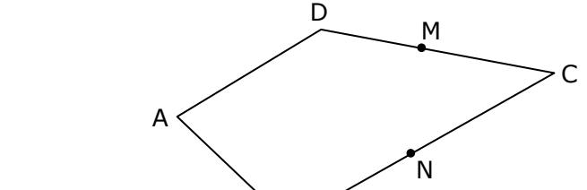

B

- A) 10 cm2
- B) 15 cm2
- C) 20 cm2
- D) 30 cm2
- 13. En el cuadrilátero ADEC de la figura adjunta, los puntos A, B y D son colineales y los triángulos ABC y BDE son equiláteros de perímetro 3 cm y 6 cm, respectivamente. ¿Cuál es el área del triángulo CBE?

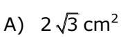

B) 
$$3\sqrt{3} \text{ cm}^2$$

C) 
$$\frac{\sqrt{3}}{2}$$
 cm2

D) 
$$\frac{\sqrt{3}}{3}$$
 cm2

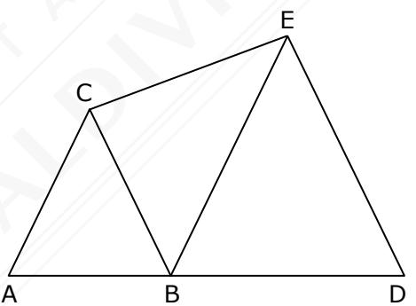

14. En la figura adjunta, ABCDEF es un hexágono regular de lado **a**. Sabiendo que el cuadrilátero FMDE tiene un cuarto del área del hexágono, ¿cuál es la longitud de FM ?

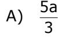

B) 
$$\frac{7a}{4}$$

C) 
$$\frac{9a}{4}$$

D) 
$$\frac{7a}{3}$$

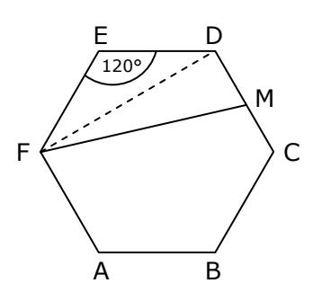

15. En la circunferencia de centro O y radio 12 de la figura adjunta, DE // AB y CO AB . ¿Cuál es la medida de CD , si M es punto medio de OC ?

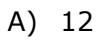

B) 11

C) 10

D) 9

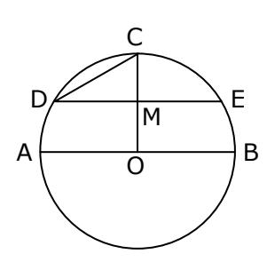

16. En la figura adjunta, O y O' son centros de las circunferencias tangentes en T y los segmentos AB y CD se intersectan en T. Si AB = 44, O'B = 16, AC = 6, entonces la medida de TD es

A) 
$$16\sqrt{3}$$

B) 8 2

C) 6 3

D) 15

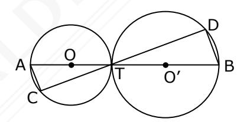

17. En la circunferencia de la figura adjunta, D y C pertenecen a la circunferencia, AB es diámetro, AD AC, BAD = 60° y AC = 12 cm. ¿Cuánto mide el perímetro de la circunferencia?

A) 
$$16\sqrt{3} \pi \text{ cm}$$

B) 
$$8\sqrt{3} \pi \text{ cm}$$

C) 
$$16 \pi cm$$

D) 24 cm

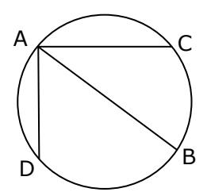

18. En la figura adjunta, L1 es tangente a la circunferencia de centro O en el punto T y L1 // L2. ¿Cuánto es el radio de la circunferencia?

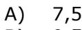

B) 9,5

C) 10,0

D) 12,5

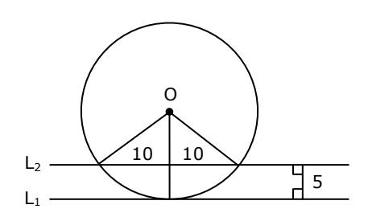

19. En la figura adjunta, M, P y Q son puntos de tangencia. Si OM = 16, ¿cuál es el perímetro del triángulo achurado?

A) 32

B) 36

C) 38

D) No se puede determinar

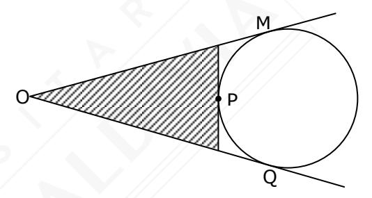

20. En la figura adjunta, las circunferencias son tangentes entre si y tangentes a los lados del triángulo equilátero ABC. Si la suma de las áreas de los tres círculos del mismo radio es 3, ¿cuál es el área del triángulo ABC?

A) 
$$7\sqrt{3} + 12$$

B) 
$$7 + 4\sqrt{3}$$

C) 
$$19\sqrt{3}$$

D) 
$$11\sqrt{3}$$

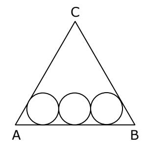

## **RESPUESTAS**

| 1. | C | 6.  | D | 11. | C | 16. | A |
|----|---|-----|---|-----|---|-----|---|
| 2. | D | 7.  | A | 12. | C | 17. | B |
| 3. | B | 8.  | C | 13. | C | 18. | D |
| 4. | C | 9.  | A | 14. | B | 19. | A |
| 5. | A | 10. | B | 15. | A | 20. | A |