## **ESTADÍSTICA Y COMBINATORIA**

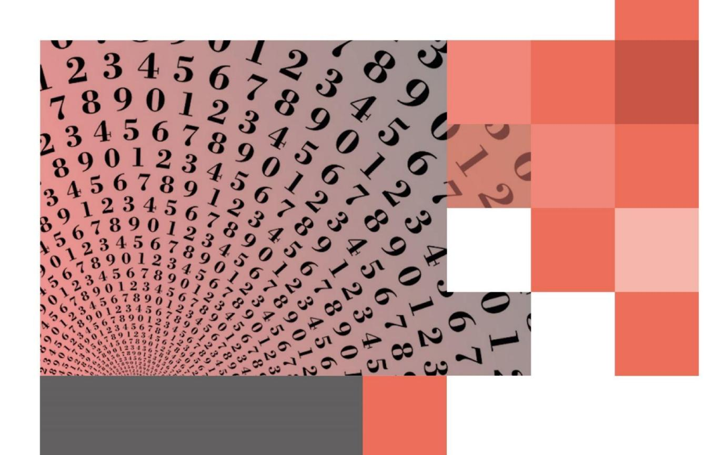

# 5. MEDIDAS DE DISPERSIÓN

Las medidas de dispersión o medidas de variabilidad, generalmente indican la dispersión de los datos de una muestra o población respecto a su valor central, salvo el rango. Mientras menor sea la medida de dispersión, más homogénea será la muestra.

### 5.1 RANGO

Rango o recorrido es la diferencia entre el mayor y el menor de los datos.

## 5.2 DESVIACIÓN ESTÁNDAR O TÍPICA

Es una medida que indica que tan alejados están en promedio, los datos respectos de la media aritmética.

#### **5.2.1 CÁLCULO DE LA DESVIACIÓN ESTÁNDAR PARA DATOS NO AGRUPADOS**

$$\sigma = \sqrt{\frac{\left(x_1 - \overline{x}\right)^2 + \left(x_2 - \overline{x}\right)^2 + \dots + \left(x_n - \overline{x}\right)^2}{n}}$$

Donde: **xi** : Dato **i** = 1 , ... , n

**x** : Media aritmética

**n** : Número total de datos

#### **5.2.2 CÁLCULO DE LA DESVIACIÓN ESTÁNDAR PARA DATOS AGRUPADOS EN TABLAS DE FRECUENCIA**

$$\sigma = \sqrt{\frac{\textbf{f_1} \cdot \left(\textbf{x_1} - \overline{\textbf{x}}\right)^2 + \textbf{f_2} \cdot \left(\textbf{x_2} - \overline{\textbf{x}}\right)^2 + \ldots + \textbf{f_n} \cdot \left(\textbf{x_n} - \overline{\textbf{x}}\right)^2}{\textbf{f_1} + \textbf{f_2} + \textbf{f_3} + \ldots + \textbf{f_n}}} \quad \begin{array}{c} \text{Donde: } \textbf{x_i: Dato} \\ \textbf{f_i: Frecuencia} \\ \overline{\textbf{x}: Media aritmética} \end{array} \quad \begin{array}{c} \textbf{i} = 1, \ldots, n \\ \textbf{i} = 1, \ldots, n \\ \hline \end{array}$$

#### **5.2.3 CÁLCULO DE LA DESVIACIÓN ESTÁNDAR PARA DATOS AGRUPADOS EN INTERVALOS**

$$\sigma = \sqrt{\frac{\mathbf{f_1} \cdot \left(\mathbf{c_1} - \overline{\mathbf{x}}\right)^2 + \mathbf{f_2} \cdot \left(\mathbf{c_2} - \overline{\mathbf{x}}\right)^2 + \ldots + \mathbf{f_n} \cdot \left(\mathbf{c_n} - \overline{\mathbf{x}}\right)^2}{\mathbf{f_1} + \mathbf{f_2} + \mathbf{f_3} + \ldots + \mathbf{f_n}}} \qquad \text{Donde: } \begin{array}{c} \mathbf{c_i} \colon \text{ Marca de clase} & \mathbf{i} = 1, \ldots, n \\ \\ \mathbf{f_i} \colon \text{ Frecuencia} & \mathbf{i} = 1, \ldots, n \\ \\ \overline{\mathbf{x}} \colon \text{ Media aritmética} \end{array}$$

#### 5.3 VARIANZA

Es otra medida de dispersión que corresponde al cuadrado de la desviación estándar.

#### CÁLCULO DE LA VARIANZA PARA DATOS NO AGRUPADOS 5.3.1

$$\sigma^2 = \frac{\left(\mathbf{x}_1 - \overline{\mathbf{x}}\right)^2 + \left(\mathbf{x}_2 - \overline{\mathbf{x}}\right)^2 + \ldots + \left(\mathbf{x}_n - \overline{\mathbf{x}}\right)^2}{n}$$

Donde: x: Dato

 $i = 1 \dots n$ 

 $\overline{\mathbf{x}}$ : Media aritmética

n: Número total de datos

#### 5.3.2 CÁLCULO DE LA VARIANZA PARA DATOS AGRUPADOS EN TABLAS DE FRECUENCIA

$$\sigma^{2} = \frac{\mathbf{f}_{1} \cdot (\mathbf{x}_{1} - \overline{\mathbf{x}})^{2} + \mathbf{f}_{2} \cdot (\mathbf{x}_{2} - \overline{\mathbf{x}})^{2} + \dots + \mathbf{f}_{n} \cdot (\mathbf{x}_{n} - \overline{\mathbf{x}})^{2}}{\mathbf{f}_{1} + \mathbf{f}_{2} + \mathbf{f}_{3} + \dots + \mathbf{f}_{n}}$$

Donde: **x**i: Dato

i = 1, ..., n

 $\mathbf{f}_{\mathbf{i}}$ : Frecuencia  $\mathbf{i} = 1, ..., n$ 

**x** · Media aritmética

#### 5.3.3 CÁLCULO DE LA VARIANZA PARA DATOS AGRUPADOS EN INTERVALOS

$$\sigma^{2} = \frac{\mathbf{f}_{1} \cdot (\mathbf{c}_{1} - \overline{\mathbf{x}})^{2} + \mathbf{f}_{2} \cdot (\mathbf{c}_{2} - \overline{\mathbf{x}})^{2} + \dots + \mathbf{f}_{n} \cdot (\mathbf{c}_{n} - \overline{\mathbf{x}})^{2}}{\mathbf{f}_{1} + \mathbf{f}_{2} + \mathbf{f}_{3} + \dots + \mathbf{f}_{n}}$$

Donde:  $\mathbf{c}_i$ : Marca de clase  $\mathbf{i} = 1, ..., n$ 

 $\mathbf{f}_{\mathbf{i}}$ : Frecuencia  $\mathbf{i} = 1, ..., n$ 

 $\overline{\mathbf{x}}$ : Media aritmética

### 5.4 PROPIEDADES DE LA DESVIACIÓN **ESTÁNDAR Y LA VARIANZA**

- Ambas medidas son siempre un número no negativo.
- La  $\sigma$  y  $\sigma^2$  son cero sólo cuando todos los datos son iguales.
- Si cada dato de una muestra se aumenta o se disminuye en una constante K la desviación estándar y la varianza originales no cambian.
- Si cada dato de una muestra se multiplica por una constante K, entonces las nuevas  $\sigma$  y  $\sigma$ 2, son respectivamente  $|K| \cdot \sigma \vee K^2 \cdot \sigma^2$ .
- $\sigma^2 = \overline{x^2} (\overline{x})^2$ .
- $\sigma^2 = \sigma \iff \sigma = 0$  ó  $\sigma = 1$ .
- $\sigma^2 < \sigma <=> 0 < \sigma < 1$
- $\sigma^2 > \sigma \iff \sigma > 1$

**1.** El rango en el conjunto de datos {3, 7, 8, 11, 1, 10, 15, 20, 21, 22, 24, 23} es

- **2.** Conteste Verdadero (V) o falso (F) a las siguientes afirmaciones
  - a. \_\_\_\_ La desviación estándar es un número real positivo o cero.
  - b. \_\_\_\_ La diferencia entre un dato y el promedio de la muestra puede ser negativa.
  - c. \_\_\_\_ El rango es una medida de dispersión.
  - d. \_\_\_\_ Si la varianza es igual a la desviación estándar, entonces ambas son iguales a 1.
  - e. \_\_\_\_ Al sumar a todos los valores de una variable un valor constante, la varianza no cambia.
  - f. \_\_\_\_ La varianza es la raíz cuadrada de la desviación estándar.
  - g. \_\_\_\_ El rango puede ser negativo.
  - h. \_\_\_\_ La desviación estándar es un indicador de cuanto tienden a alejarse los datos del promedio.
  - i. \_\_\_\_ El rango es menor que la varianza.
  - j. \_\_\_\_ Si todos los datos de una variable son iguales a 1, entonces el rango correspondiente a la variable es 1.
- **3.** De acuerdo a la tabla adjunta, conteste Verdadero (V) o falso (F) a las siguientes afirmaciones
  - a. \_\_\_\_ A = 4.
  - b. \_\_\_\_ B = 1.
  - c. \_\_\_\_ La desviación estándar es 2 .
  - d. \_\_\_\_ La varianza es 2.
  - e. \_\_\_\_ La moda es 8.
  - f. \_\_\_\_ El total de datos es 30.

| fi | $f_i \cdot (x_i - \overline{x})^2$ |
|----|------------------------------------|
| 1  | В                                  |
| 1  | 1                                  |
| 1  | 0                                  |
| 1  | Α                                  |
| 1  | 4                                  |
|    | f i 1  1  1  1  1       |

**4.** Al analizar los puntajes de los 4 controles realizados por Juan y Pedro, se obtuvieron los siguientes resultados:

|                     | Juan  | Pedro  |
|---------------------|-------|--------|
| Promedio            | 613   | 613    |
| Desviación estándar | 54,47 | 168,74 |

De acuerdo con esta información, ¿cuál(es) de las siguientes afirmaciones es (son) siempre verdadera(s)?

- I) Juan tiene puntajes más cercanos a su promedio.
- II) Ambos han obtenido los mismos puntajes en los controles.
- III) Existe un error en el cálculo de las desviaciones estándar de Pedro o de Juan, porque ambos tienen el mismo promedio.
- **5.** Con respecto a la tabla de frecuencias adjunta, ¿cuál(es) de la siguientes proposiciones es (son) verdadera(s)?

| Edad (años) | Nº de niños |
|-------------|-------------|
| [0 - 4[     | 2           |
| [4 - 8[     | 1           |
| [8 - 12[    | 2           |

- I) El promedio es 6.
- II) El total de datos es 5.
- III) La desviación estándar es 12,8 .
- **6.** En una muestra de 20 datos se obtiene una desviación estándar igual a 1,2. Si a cada elemento de la muestra se agregan 5 unidades, entonces la nueva desviación estándar y la nueva varianza son, respectivamente
- **7.** Se tienen cuatro números x, y, z, w cuya varianza es , entonces la varianza de kx, ky, kz, kw, con k un número natural, es

| • 7. k 2 | ,44  | 6. 1,2 y 1 | 5. Todas | 4. Solo I | f. F | e. F | d. V | c. V | b. F    | 3. a. F   |
|----------------|------|------------|----------|-----------|------|------|------|------|---------|-----------|
| j. F           | i. F | h. V       | g. F     | f. F      | e. V | d. F | c. V | b. V | 2. a. V | 1. 23     |
|                |      |            |          |           |      |      |      |      | s       | Respuesta |

# 6. REPRESENTACIÓN GRÁFICA E INTERPRETACIÓN DE GRÁFICOS

A menudo, una representación gráfica de una distribución de frecuencias nos da una mejor idea de un estudio estadístico que un cuadro con números. Existen distintos tipos de gráficos, algunos de los más utilizados son:

### **6.1 GRÁFICO DE BARRAS**

Se utiliza para variables de tipo cualitativas y cuantitativas discretas. Consiste en una serie de barras cuyas alturas representan la frecuencia absoluta de estos.

| X      | f |
|--------|---|
| Dato 1 | Α |
| Dato 2 | В |
| Dato 3 | С |
| Dato 4 | D |
| Dato 5 | Е |

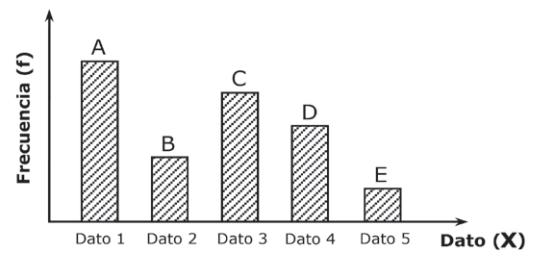

### **6.2 GRÁFICO CIRCULAR**

El gráfico circular es utilizado en variables de tipo cualitativa y cuantitativa discreta. El gráfico consiste en un círculo dividido en sectores circulares cuyo ángulo del centro es proporcional a la frecuencia relativa de cada valor de la variable.

| X      | f | fr     | º                |
|--------|---|--------|------------------|
| Dato 1 | a | a n | a . 360º n |
| Dato 2 | b | b n | b . 360º n |
| Dato 3 | c | c n | c . 360º n |
| Dato 4 | d | d n | d . 360º n |
| Dato 5 | e | e n | e . 360º n |

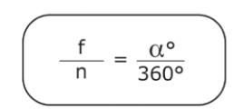

n : número de datos

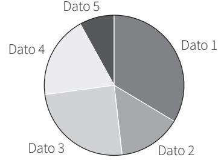

#### **6.3 HISTOGRAMA**

Se utiliza para representar a los datos agrupados en intervalos. El histograma se elabora representando a los datos en el eje horizontal y a las frecuencias en el eje vertical. Se trazan barras cuyas bases equivalen a los intervalos de clase y cuyas alturas corresponden a las frecuencias de clase.

| X           | f |
|-------------|---|
| Intervalo 1 | а |
| Intervalo 2 | b |
| Intervalo 3 | С |
| Intervalo 4 | d |

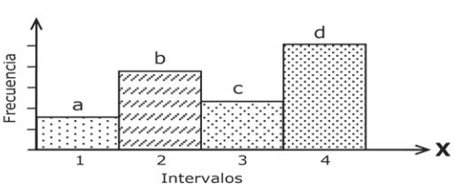

**1.** El gráfico muestra el número de libros que leen anualmente un grupo de personas. Determine si es verdadera (V) o falsa (F) la afirmación planteada.

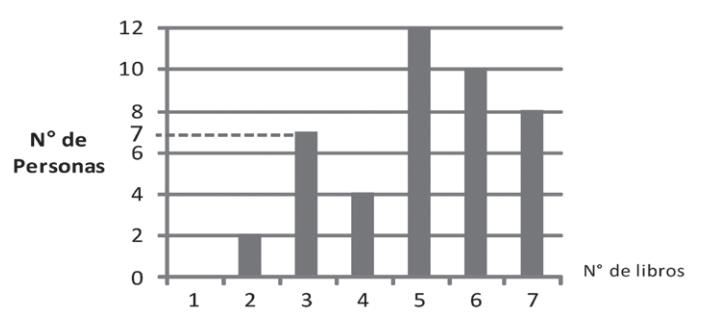

- a. \_\_\_\_ Hay 30 personas que leen mas de 4 libros anualmente.
- b. \_\_\_\_ Hay 7 personas que leen anualmente 3 libros.
- c. \_\_\_\_ La mediana es 5 libros anuales.
- d. \_\_\_\_ Todos leen menos de 7 libros.
- e. \_\_\_\_ La moda es 12 libros al año.
- f. \_\_\_\_ Hay 13 personas que leen al año a lo más 4 libros.
- g. \_\_\_\_ Hay 33 personas que leen al menos 6 libros al año.
- **2.** La tabla adjunta, muestra la distribución de frecuencias de las edades, en años, de los alumnos de un colegio que cursan 4to medio. ¿En cuál(es) de los siguientes gráficos queda representada la distribución de frecuencia de la tabla?

| Edades (años) | Nº de alumnos |
|---------------|---------------|
| 16            | 3             |
| 17            | 9             |
| 18            | 12            |
| 19            | 6             |
| 20            | 0             |

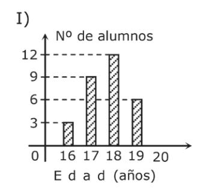

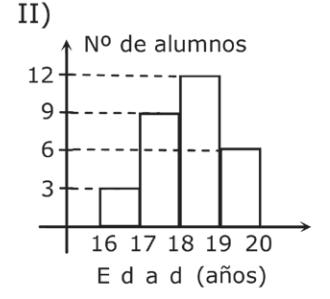

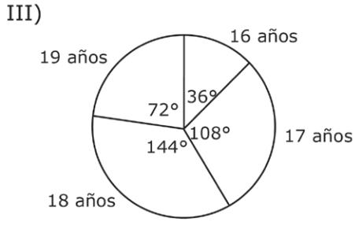

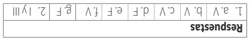

## 6.4 POLÍGONO DE FRECUENCIAS

Al igual que el histograma, este gráfico, se utiliza en datos agrupados en intervalos. Para confeccionarlo, debemos unir con una recta a los puntos donde se intersectan la marca clase y la frecuencia de los intervalos. Para "anclar" el polígono al eje horizontal, debemos agregar un intervalo de frecuencia cero, antes del primer intervalo y después del último intervalo. Esta idea se extiende a polígonos de frecuencia relativa.

| X           | С       | f |
|-------------|---------|---|
| Intervalo 1 | Clase 1 | а |
| Intervalo 2 | Clase 2 | d |
| Intervalo 3 | Clase 3 | b |
| Intervalo 4 | Clase 4 | С |

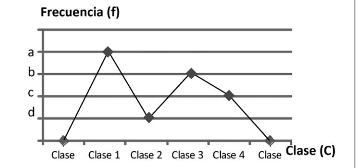

### 6.5 POLÍGONO DE FRECUENCIA ACUMULADA U OJIVA

Este gráfico, se representa uniendo puntos referidos al límite superior y frecuencia acumulada de cada intervalo. Para "anclar" la Ojiva al eje horizontal, se posiciona en el límite inferior del primer intervalo.

| X      | F |
|--------|---|
| [a, b[ | Α |
| [b, c[ | В |
| [c, d[ | С |
| [d, e] | D |

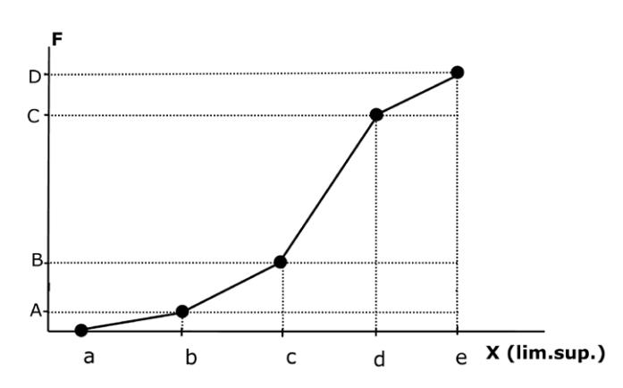

La frecuencia de un intervalo corresponde a todas las observaciones menores que el límite superior de ese intervalo.

**1.** El gráfico poligonal de la figura muestra el consumo (en metros cúbicos) de gas de los departamentos de un conjunto habitacional. ¿Cuál(es) de las siguientes afirmaciones es (son) verdadera(s)?

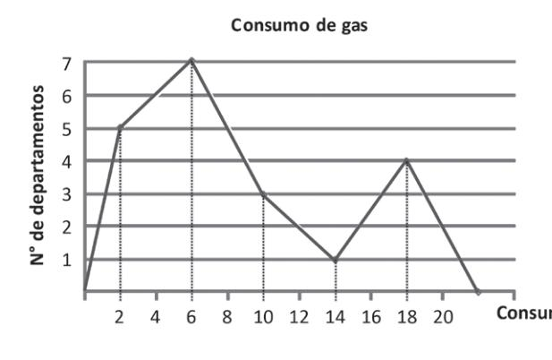

| Consumo m 3 | Frecuencia |
|------------------------|------------|
| [0 - 4[                | 5          |
| [4 - 8[                | 7          |
| [8 - 12[               | 3          |
| [12 - 16[              | 1          |
| [16 - 20[              | 4          |

- I) La moda es 7.
- II) Cuatro departamentos consumen exactamente 18 m3
- III) El menor consumo se registró en el intervalo [12 16[.
- **2.** El gráfico de frecuencias acumuladas (ojiva), de la figura; representa los resultados obtenidos por 100 alumnos en la PSU. ¿Cuál(es) de las siguiente(s) aseveraciones es (son) verdadera(s)?

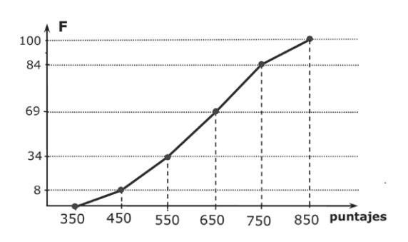

- I) 69 alumnos obtuvieron menos de 650 puntos.
- II) El intervalo modal es [550 650[.
- III) El 8% de los alumnos obtuvieron 450 puntos.

|            | Respuesta s |  |
|------------|----------------|--|
| 2. I, y II | 1. Ningun a |  |

### 6.6 GRÁFICO DE CAJA Y BIGOTE

El diagrama de caja es una representación gráfica basada en los cuartiles, que ayuda a ilustrar una muestra de datos. Para elaborar este gráfico, sólo se necesitan cinco datos: el valor mínimo, el primer cuartil, segundo cuartil (la mediana), el tercer cuartil y el valor máximo de la muestra. El largo de la caja es Q3 - Q1 , que corresponde al recorrido intercuartil.

#### **6.6.1 TIPOS DE MUESTRA**

#### **MUESTRA SIMÉTRICA**

Los valores intercuartílicos están igualmente dispersos.

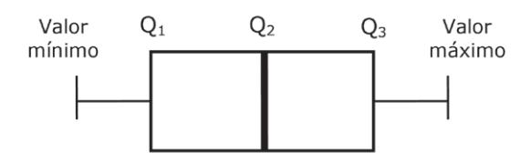

#### **MUESTRA POSITIVAMENTE ASIMÉTRICA**

Los valores más grandes se encuentran más dispersos que los más pequeños.

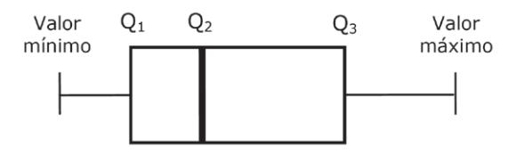

#### **MUESTRA NEGATIVAMENTE ASIMÉTRICA**

Los valores más pequeños se encuentran más dispersos que los más grandes.

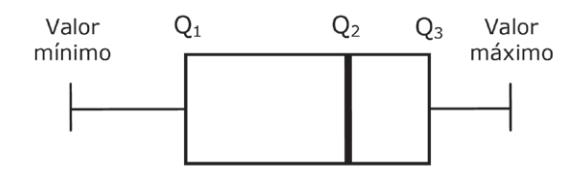

**1.** Conteste verdadero (V) o falso (F) a las afirmaciones respecto del diagrama adjunto

a. \_\_\_\_ La distribución es simétrica.

b. \_\_\_\_ Los valores mayores están más dispersos.

c. \_\_\_\_ La muestra es asimétrica.

d. \_\_\_\_ Los valores menores están más concentrados.

e. \_\_\_\_ Hay menos valores altos que bajos.

f. \_\_\_\_ La muestra presenta una asimetría negativa.

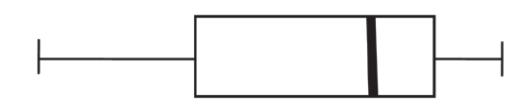

**2.** En el siguiente diagrama de caja y bigotes, se muestran las estaturas (en centímetros) de los alumnos de un determinado curso. Conteste verdadero (V) o falso (F) a las afirmaciones

a. \_\_\_\_ El 50% de los alumnos tienen estaturas desde 169 cm a 177 cm.

b. \_\_\_\_ El rango de las estaturas es 20 cm.

c. \_\_\_\_ La distribución de las estaturas es asimétrica.

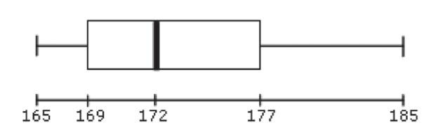

**3.** Los datos de la masa en kilogramos de 12 alumnos de 3º medio de un colegio, han sido registrados en el gráfico de caja y bigotes en la figura adjunta. Conteste verdadero (V) o falso (F) a las afirmaciones

a. \_\_\_\_ El primer cuartil es 50.

b. \_\_\_\_ El recorrido intercuartílico es 5.

c. \_\_\_\_ La muestra es negativamente asimétrica.

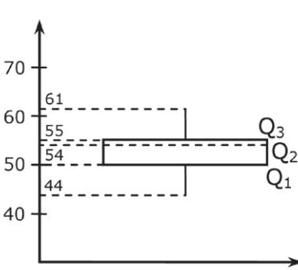

**Respuestas** c. V b. V 3. a. V c. V b. V 2. a. V f. V e. F d. F c. V b. F 1. a. F

# 7. COMBINATORIA

## 7.1 TÉCNICAS DE CONTEO

El análisis combinatorio es la rama de la matemática que estudia el número de posibilidades de ocurrencia de un suceso, sin necesariamente describir todas las posibilidades. Si un suceso puede ocurrir de **a** maneras diferentes y otro suceso puede ocurrir de **b** maneras diferentes, entonces se cumplen dos principios:

#### **PRINCIPIO MULTIPLICATIVO**

Si los sucesos ocurren en forma simultánea, entonces existen **a • b** maneras diferentes de que ocurran ambos sucesos.

#### **PRINCIPIO ADITIVO**

Si los sucesos no ocurren en forma simultánea, entonces existen **a + b** maneras diferentes de que ocurra solo uno de ellos.

- **1.** Al lanzar un dado y una moneda, ¿cuántos resultados distintos se pueden obtener?
- **2.** Si Pedro dispone de 5 lápices de pasta, 4 de tinta y 3 de grafito, entonces ¿de cuántas maneras diferentes puede elegir un lápiz para hacer una tarea?
- **3.** En un local de comida rápida, Patricia puede armar un combo que consiste en escoger una de cinco hamburguesas distintas con una bebida entre cuatro sabores distintos ó bien un jugo entre dos sabores distintos y todo esto acompañado de papas fritas. ¿Cuántos combos distintos puede armar Patricia?

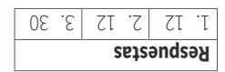

### 7.2 FACTORIALES

Sea n un número natural, se llama **factorial de n** o **n factorial**, al producto de los n primeros números naturales y se denota por **n!.**

Se define: 0! = 1

1! = 1

n! = n • ( n ‒ 1 )!

Se deduce de lo anterior, que

$$n! = n \cdot (n - 1) \cdot (n - 2) \cdot ... \cdot 3 \cdot 2 \cdot 1$$

#### **EJERCICIOS**

**1.** ¿Cuál(es) de las siguientes expresiones es (son) igual(es) a 4!?

I) 2! • 2!

II) 1! + 1! + 1! + 1!

III) 12 • 2

**2.** ¿Cuál(es) de las siguientes afirmaciones es (son) verdadera(s)?

I) 45 es divisor de 6!

II) 720 es múltiplo de 6!

III) 0! es divisor de 6!

- **3.** El sucesor de p es q. Entonces, p! en términos de q es
- **4.** Si se definen y , entonces =

### 7.3 PERMUTACIONES

Se denomina permutación, a cada una de las diferentes ordenaciones que se pueden realizar con todos los elementos de un conjunto.

### **PERMUTACIÓN SIMPLE O LINEAL**

El número de permutaciones que pueden hacerse con **n** elementos diferentes en disposición lineal, esta dado por.

Pn = n!

### **PERMUTACIÓN CON REPETICIÓN**

El número de permutaciones de **n** elementos, de los cuales, k1 son iguales, k2 son iguales,…. kr son iguales, está dado por

$$P_{\text{rep}} = \frac{n!}{k_1! \cdot k_2! \cdot \dots k_r!}$$

### **PERMUTACIÓN CIRCULAR**

El número de maneras diferentes en que se pueden ordenar **n** elementos diferentes en disposición circular, está dado por: Pcircul = ( n - 1) !

- **1.** ¿De cuántas maneras se pueden ubicar 5 autos diferentes en fila en un estacionamiento?
- **2.** ¿Cuántas palabras con o sin sentido se pueden hacer con todas las letras de la palabra ELEMENTO?
- **3.** ¿De cuántas maneras distintas se puede sentar una familia de 7 integrantes alrededor de una mesa con 7 sillas?

T. 
$$Si = 120$$
 2.  $\frac{3i}{8i}$ 
 3.  $6i$ 

 Respuestas
 3.  $6i$ 

### 7.4 VARIACIONES O ARREGLOS

En un conjunto de **n** elementos, se denominan variaciones o arreglos a diferentes ordenaciones que se pueden formar con **r** elementos (**r** ≤ **n**).

### **VARIACIONES SIN REPETICIÓN**

Dado un conjunto de **n** elementos, la cantidad de ordenaciones diferentes de **r** elementos que se pueden obtener, sin repetir, está dada por:

V ( r ≤ n) r = ( n - r) ! n n!

### **VARIACIONES CON REPETICIÓN**

Dado un conjunto de **n** elementos, la cantidad de ordenaciones diferentes de **r** elementos que se pueden obtener, en los cuales se puede repetir uno o más de ellos, está dada por:

$$VR_r^n = n^r \qquad (r \le n)$$

#### *OBSERVACIÓN*

*Una permutación es un caso particular de una variación sin repetición, cuando n = r.*

#### **EJERCICIOS**

- **1.** Si en un autobús hay disponibles sólo 3 asientos y 7 personas están de pie, ¿de cuántas maneras distintas podrían ocupar esos asientos?
- **2.** En un campeonato de fútbol participan 8 equipos locales. ¿De cuántas maneras distintas pueden ser ocupados los tres primeros lugares?
- **3.** Si se lanza un dado común 3 veces consecutivas y en cada ocasión se anota el resultado, la cantidad de resultados posibles es

**Respuestas** 3. 216 2. 336 1. 210

### 7.5 COMBINACIONES

Son los diferentes grupos que se pueden formar con un total de **n** elementos de modo que cada grupo tenga **r** elementos, no interesando el orden de éstos.

#### COMBINACIÓN SIN REPETICIÓN

Dado un conjunto de **n** elementos, la cantidad de conjuntos de **r** elementos que se pueden obtener, sin repetición, está dada por:

 $(0 \le r \le n)$ 

#### COMBINACIÓN CON REPETICIÓN

Dado un conjunto de  $\bf n$  elementos, la cantidad de conjuntos de  $\bf r$  elementos que se pueden obtener, con repetición, está dada por:

 $CR_r^n = C_r^{n+r-1} = \frac{(n+r-1)!}{(n-1)!r!}$  $(0 \le r \le n)$ 

**OBSERVACIONES** 

$$\bullet$$
  $C_r^n = {n \choose r}$   $\bullet$   $C_r^n = C_{n-r}^n$   $\bullet$   $C_n^n = 1$   $\bullet$   $C_0^n = 1$   $\bullet$   $C_1^n = n$ 

$$\bullet \quad C_r^n = C_{n-r}^n$$

• 
$$C_n^n = 1$$

• 
$$C_0^n = 1$$

• 
$$C_1^n = n$$

- 1. Para el mundial de fútbol de Brasil clasificaron 32 países. Si este torneo se jugara con la modalidad "todos contra todos", ¿cuántos partidos se tendrían que jugar?
- 2. En un jardín infantil hay 5 cupos para 8 niños que postulan, ¿ de cuántas formas se puede ocupar esas vacantes?
- 3. ¿Cuántos saludos se pueden intercambiar entre sí 12 personas, si cada una sólo saluda una vez a cada una de las otras?
- 4. Si tenemos una cantidad de monedas de \$10, \$50, \$100 y \$500, donde hay más de tres monedas de cada una, ¿cuántas selecciones de tres monedas se pueden hacer?

| _  |   |    |    | _  |    | set | sənds | Ке |
|----|---|----|----|----|----|-----|-------|----|
| 07 | , | 4. | 99 | Ξ. | 99 | 7.  | 967   | Ţ. |

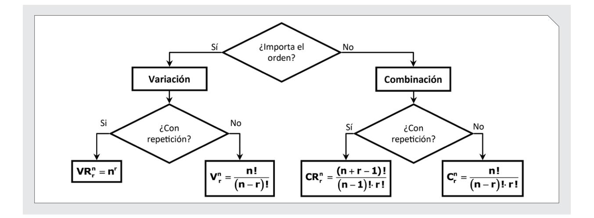

- **1.** ¿De cuántas maneras se pueden ordenar 7 personas en una fila?
- **2.** ¿Cuántas palabras con o sin sentido se pueden hacer con todas las letras de la palabra AMASAS?
- **3.** ¿De cuántas maneras se pueden sentar 5 personas alrededor de una mesa?
- **4.** ¿Cuántos códigos de 3 letras distintas se pueden formar con las vocales?
- **5.** ¿Cuántos triángulos se pueden formar con los vértices de un hexágono?
- **6.** ¿Cuántos códigos de dos letras, sin importar el orden se pueden formar con las vocales, si se sabe que se pueden repetir las letras?
- **7.** En una pastelería quedan 5 pasteles distintos. ¿De cuántas maneras se pueden escoger 3 pasteles?

| Respuesta s |       |  |       |  |       |  |       |  |       |  |       |  |       |  |
|----------------|-------|--|-------|--|-------|--|-------|--|-------|--|-------|--|-------|--|
|                | 7. 10 |  | 6. 15 |  | 5. 20 |  | 4. 60 |  | 3. 24 |  | 2. 60 |  | 1. 7! |  |