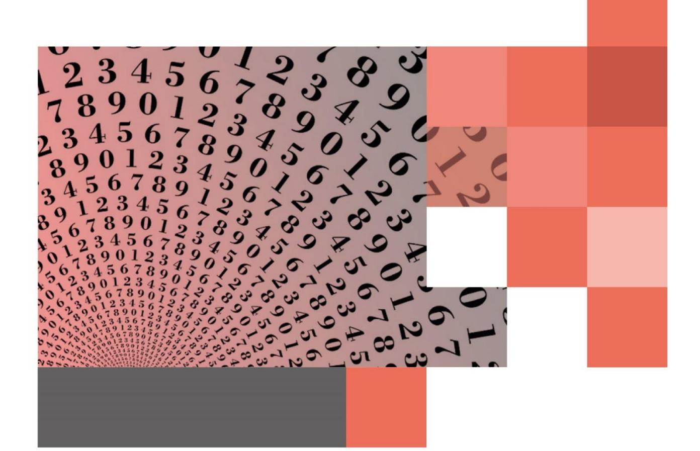

# **PLANTEAMIENTOS**

# 11.4 PROBLEMAS DE EDADES

En estos problemas conviene representar las edades de los personajes con letras diferentes indicando en una línea del tiempo o en una tabla, sus edades pasadas, presentes o futuras, según corresponda:

| Edad pasada (hace b años) | Edad actual | Edad futura (dentro de c años) |  |  |
|------------------------------|----------------|-----------------------------------|--|--|
| x ‒ b                        | x              | x + c                             |  |  |
| y ‒ b                        | y              | y + c                             |  |  |

## **EJERCICIOS**

|  | 1. | Si al triple de la edad que tengo se resta mi edad aumentada en 8 años, tendría 28 años. ¿Qué edad tengo? |  |  |  |  |  |  |
|--|----|-----------------------------------------------------------------------------------------------------------|--|--|--|--|--|--|
|--|----|-----------------------------------------------------------------------------------------------------------|--|--|--|--|--|--|

**2.** La edad de una persona será c años dentro de a años. ¿Cuántos años tenía hace b años?

**3.** Si el triple de la edad de una persona es 63 años, entonces la tercera parte de su edad, más un año es

| 4. | Si la edad de una persona en y años más será x años, entonces ¿cuántos años tiene? |  |  |  |  |  |  |
|----|------------------------------------------------------------------------------------|--|--|--|--|--|--|
|----|------------------------------------------------------------------------------------|--|--|--|--|--|--|

**5.** Si al triple de la edad de Mauricio se le restan 37 años, se obtiene lo que le falta para cumplir 91 años. ¿Qué edad tendría actualmente si hubiera nacido 6 años antes?

**6.** Pedro tiene el triple de la edad que tiene María y hace 12 años la edad de Pedro era el cuádruplo de la edad que tenía María. ¿Qué edad tendrá María dentro de 12 años?

**7.** Un padre tiene **x** años y su hijo **y** años. ¿Dentro de cuántos años la edad del padre será el cuádruplo de la edad de su hijo?

Respuestas

L. 18 años 
$$A$$
.  $C$  –  $A$  –  $A$   $A$   $A$   $A$   $A$   $A$   $A$   $A$   $A$   $A$ 

# 11.5 PROBLEMAS DE TRABAJO SIMULTÁNEO

Si un trabajador (o máquina) puede realizar un trabajo en un tiempo **a** y otro en un tiempo **b**, la ecuación que permite calcular el tiempo x que demoran en hacer el trabajo en conjunto es:

$$\frac{1}{x} = \frac{1}{a} + \frac{1}{b}$$

### **OBSERVACIÓN**

• La ecuación anterior se puede generalizar para n trabajadores o máquinas

#### **EJERCICIOS**

1. Una máquina realiza un trabajo en 2 horas y otra máquina realiza el mismo trabajo en 3 horas, ¿Cuánto se demoran las dos máquinas trabajando simultáneamente en realizar dicho trabajo?

2. Una llave A llena un estanque vacío en 2 horas, en cambio una llave B lo llena en 6 horas y un desagüe C lo deja vacío en 3 horas. ¿En qué tiempo se llenará el estanque, si estando vacío se abren ambas llaves y el desagüe simultáneamente?

3. Rodrigo puede realizar una tarea en 15 días, mientras que Nelson la puede hacer en el triple de los días que emplearían si trabajaran los dos juntos. ¿En cuántos días realizaría la tarea Nelson si trabajara solo?

## 11.6 PROBLEMAS DE MÓVILES

Para este tipo de problemas, debemos tener presente la igualdad:

**s** = Recorrido

 $s = v \cdot t$  v = Rapidez

t = Tiempo

### **EJERCICIOS**

1. Un automovilista sale de La Serena y otro de Valdivia, distantes 1.120 km, uno hacia el otro. El primero viaja a 120 km/h y el segundo a 100 km/h . Si ambos parten a las 8 am, ¿qué distancia los separa a las 12:00 pm., de ese mismo día?

2. Dos móviles parten simultáneamente desde la Plaza de Armas en la misma dirección y sentido. Uno viaja con una rapidez de 60 km/h, y el otro viaja a 80 km/h. Transcurrida 3 horas, ¿cuál será la distancia que los separa?

3. Dos buses parten desde un terminal a la misma hora en sentidos opuestos. La rapidez de uno de ellos es 10 km menor que la del otro. Sabiendo que al cabo de 5 horas se encuentran a 1.050 km. de distancia entre \nellos, ¿cuál es la rapidez del bus más lento?

T. 240 km 2. 60 km 3. 100 km

# 11.7 PROBLEMAS DE MEZCLAS

Para este tipo de problemas podemos considerar el siguiente planteamiento general: Si **n** objetos que valen **c**, se componen de **x** objetos que valen **a** cada uno, y **n – x** objetos que valen **b** cada uno, la ecuación que permite encontrar **x** es:

$$ax + b(n - x) = c$$

## **EJERCICIOS**

- **1.** Pedro ahorró dinero juntando en total 85 monedas entre monedas de \$ 100 y de \$ 500. Si en total ahorró \$ 22.500, el dinero ahorrado en monedas de \$ 100 es
- **2.** A una función de teatro organizada por un colegio, asistieron 1.000 personas, dejando \$ 2.650.000 por la venta de entradas, las cuales eran de dos tipos: galería, que costaba \$ 2.000 y platea \$ 3.000. Si se vendieron entradas de los dos tipos, ¿cuántas personas asistieron a la platea?

**3.** Valeria para su fiesta de cumpleaños compró 32 bebidas y 18 pizzas pagando en total \$ 52.600. Si cada pizza costó \$ 700 más que una bebida, el precio de cada pizza es

**4.** El número de adultos que asiste a un Bingo de beneficencia excede en 70 al número de niños. Si cada adulto paga \$ 4.000 y cada niño \$ 1.500 y hubo una recaudación total de \$ 555.000, ¿cuántas personas asistieron al Bingo de beneficencia?

### **EJERCICIOS ADICIONALES**

Conteste verdadero (V) o falso (F) a las siguientes afirmaciones.

- 1. \_\_\_\_\_ El resultado de 10:2·5-1 es 24
- 2.  $A \cdot (B \cdot C) = AB \cdot AC$
- 3.  $(a+b)^2 = a^2 + b^2$
- 4.  $(2000 + 1) \cdot (2000 1) = 2000^2 1$
- 5.  $(2+i) \cdot (2-i) = 5$
- 6. \_\_\_\_  $(a-b)^2 = a^2 2ab b^2$
- 7. \_\_\_\_  $(a-b)^2 = (b-a)^2$
- 8.  $2x^2 + 6x + 3 = 2(x^2 + 3x + 3)$
- 9.  $a^2 b^2 = (a b)^2$ .
- 10. \_\_\_\_  $\frac{a^2 4a + 4}{a^2 4} = -4a$
- 11. \_\_\_\_\_ El opuesto de  $x^{-1}$  en la ecuación de  $3x^{-1}$  6 = 0, es –2
- 12. \_\_\_\_\_ El conjunto solución de |x-5| = 1 es  $\{6, 4\}$
- 13. \_\_\_\_  $\sqrt{(-2)^2} = \pm 2$
- 14. \_\_\_\_\_ "El doble de dos aumentado en dos es ocho"