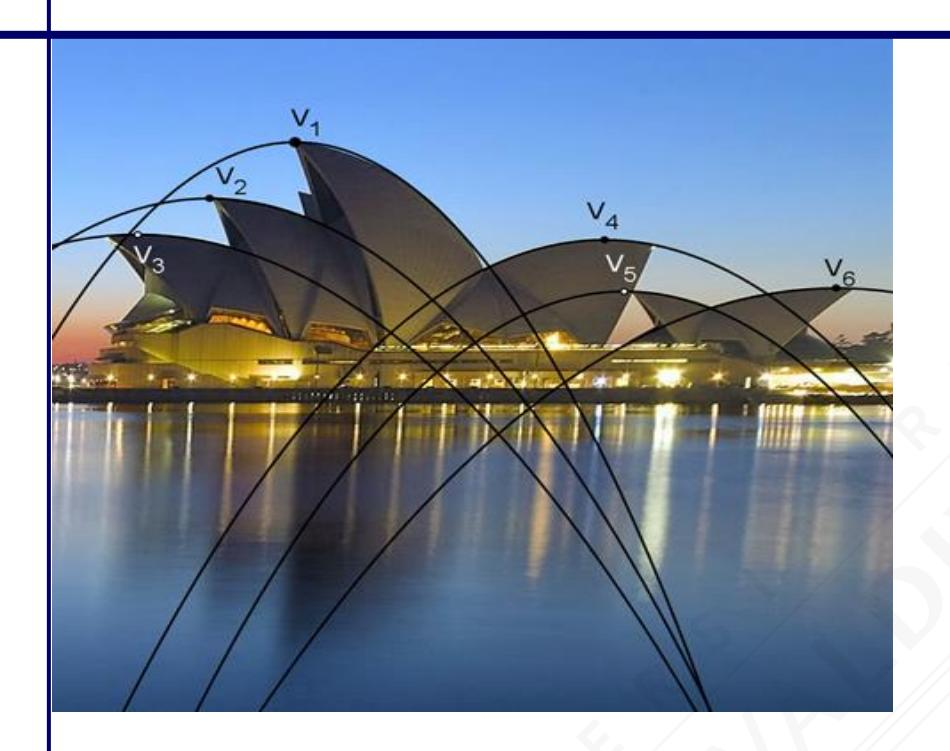

# **RESUMEN RMA-07 ÁLGEBRA, FUNCIONES Y GEOMETRÍA**

| Nombre   |  |
|----------|--|
| Curso    |  |
| Profesor |  |

## **RAÍCES**

#### **Definiciones:**

| n es par                        | n es impar                 |
|---------------------------------|----------------------------|
| n = a n a = b  b | n = a n a = b  b |

#### **Observaciones:**

- Una expresión de la forma par número negativo **NO** representa un número real.
- n ka = k n a , con a > 0
- 2a = a

#### **Propiedades:**

Si n a y n b están definidas **en los números reales**, entonces se cumple lo siguiente:

| Igual Índice         | Multiplicación | n a n b n ab · =                       | 3 7 3 7 3 2 3 14 · = 2 = |
|----------------------|----------------|----------------------------------------------------|------------------------------------------------|
|                      | División       | n a n b n a : b : = Obs. : b  0 | 20 : 5 = 20 : 5 = 4 = 2   |
| Potencia de una raíz |                | n ma n a m = ( )                    | 5 2 3 5 3 2 = ( )               |
| Raíz de una raíz     |                | n m a nm a  =                            | 4 3 2 43 2  12 2 = =           |
| Cambio de índice     |                | nm  ma n a = con a > 0             | 3 4  3 2 4 2 1216 = =       |
| Factor de una raíz   |                | n n b n a b = a con b > 0       | 3 3 2 3 40 3 5 2 = 5 =   |

## **RACIONALIZACIÓN**

| Forma                             | Amplificar por              | Ejemplo                        | Racionalizando                                                                                                                                          |
|-----------------------------------|--------------------------------|--------------------------------|---------------------------------------------------------------------------------------------------------------------------------------------------------|
| $\frac{a}{b\sqrt{c}}$             | √c                             | 2 3√5                       | $\frac{2}{3\sqrt{5}} \cdot \frac{\sqrt{5}}{\sqrt{5}} = \frac{2\sqrt{5}}{3 \cdot 5}$                                                                     |
| a √b m              | n √b n-m | $\frac{5}{\sqrt[7]{2^3}}$      | $\frac{5}{\sqrt[7]{2^3}} \cdot \frac{\sqrt[7]{2^4}}{\sqrt[7]{2^4}} = \frac{5\sqrt[7]{2^4}}{2}$                                                          |
| $\frac{a}{p\sqrt{b} + q\sqrt{c}}$ | p√b – q√c                      | $\frac{2}{\sqrt{3}+\sqrt{5}}$  | $\frac{2}{\sqrt{3} + \sqrt{5}} \cdot \frac{(\sqrt{3} - \sqrt{5})}{(\sqrt{3} - \sqrt{5})} = \frac{2(\sqrt{3} - \sqrt{5})}{(\sqrt{3})^2 - (\sqrt{5})^2}$  |
| $\frac{a}{p\sqrt{b} - q\sqrt{c}}$ | p√b + q√c                      | $\frac{2}{2\sqrt{3}-\sqrt{5}}$ | $\frac{2}{2\sqrt{3} - \sqrt{5}} \cdot \frac{2\sqrt{3} + \sqrt{5}}{2\sqrt{3} + \sqrt{5}} = \frac{2(2\sqrt{3} + \sqrt{5})}{(2\sqrt{3})^2 - (\sqrt{5})^2}$ |
| $\frac{a}{p\sqrt{b}+q}$           | p√b – q                        | $\frac{3}{5\sqrt{2}+4}$        | $\frac{3}{5\sqrt{2}+4}\cdot\frac{5\sqrt{2}-4}{5\sqrt{2}-4}=\frac{3(5\sqrt{2}-4)}{(5\sqrt{2})^2-4^2}$                                                    |

Observación: La expresión de la columna "Amplificar por" debe ser un número real.

## **FUNCIÓN RAIZ**

### **Definición:**

Sea f: l 0 R l 0 R , se define la **función raíz cuadrada** como f(x) = x **.**

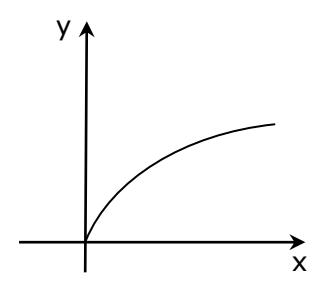

#### **Observaciones:**

- Dom f = Rec f = l 0 R
- Función biyectiva.
- Función creciente.
- Función de crecimiento lento.

## **ECUACIÓN DE SEGUNDO GRADO**

$$ax^2 + bx + c = 0$$
, con  $a \neq 0$   
 $a$ ,  $b$ ,  $c \in IR$ 

#### Resolución de ecuaciones de segundo grado:

|                               | b = 0 c = 0    | $ax^2 = 0$          | $x_1 = x_2 = 0$                                          | $3x^2 = 0$ $x_1 = x_2 = 0$                                                                                                                                                                 |
|-------------------------------|-------------------|---------------------|----------------------------------------------------------|--------------------------------------------------------------------------------------------------------------------------------------------------------------------------------------------|
| <b>Ecuaciones</b> incompletas | Solo b = 0     | $ax^2 + c = 0$      | X 1 y X 2 son opuestas          | $5x^2 - 20 = 0$ $x_1 = -2 \ y \ x_2 = 2$                                                                                                                                                |
|                               | Solo c = 0     | $ax^2 + bx = 0$     | $x_1 = 0$ $x_2 = -\frac{b}{a}$                           | $3x^{2} + 5x = 0$ $x_{1} = 0  y  x_{2} = -\frac{5}{3}$                                                                                                                                     |
|                               |                   | + 0                 | Factorizar                                               | $x^{2} + 5x + 6 = 0$ (x + 3)(x + 2) = 0 $x_{1} = -3  y  x_{2} = -2$                                                                                                                  |
| Ecuaciones completas          | a ≠ 0 b ≠ 0 c ≠ 0 | $ax^2 + bx + c = 0$ | Aplicar fórmula $x = \frac{-b \pm \sqrt{b^2 - 4ac}}{2a}$ | $x^{2} + 5x + 6 = 0$ $a = 1; b = 5; c = 6$ $x = \frac{-5 \pm \sqrt{5^{2} - 4 \cdot 1 \cdot 6}}{2 \cdot 1}$ $x = \frac{-5 \pm 1}{2}$ $x_{1} = \frac{-6}{2} = -3; x_{2} = \frac{-4}{2} = -2$ |

#### **Observaciones:**

Sean  $\alpha$  y  $\beta$  las soluciones de una ecuación de segundo grado, entonces:

• 
$$(x - \alpha)(x - \beta) = 0 \Rightarrow x^2 - (\alpha + \beta)x + \alpha\beta = 0$$

$$\bullet \quad \alpha\beta = \frac{\mathsf{c}}{\mathsf{a}}$$

## **FUNCIÓN CUADRÁTICA**

$$f(x) = ax^2 + bx + c = 0$$
, con a, b,  $c \in IR$  y a  $\neq 0$ 

| f(x) = ax2 + bx + c = 0                                                                                                                 |                                            |                                                     | f(x) = x2 – 8x + 12                                                       |
|-----------------------------------------------------------------------------------------------------------------------------------------|--------------------------------------------|-----------------------------------------------------|------------------------------------------------------------------------------|
| y c x x1 x2                                                                                                                 |                                            | y x = 4 12 x 6 2 -4 V(4,-4) |                                                                              |
| Concavidad                                                                                                                              | a = Número positivo                        | Cóncava hacia arriba                             | a = 1  cóncava hacia arriba                                              |
|                                                                                                                                         | a = Número negativo                        | Cóncava hacia abajo                              |                                                                              |
| Intersección con el eje Y x = 0                                                                                                   | y = f(0) = c  El punto es (0, c)    |                                                     | c = 12  (0, 12)                                                          |
| Ceros de la función  Intersección con el eje X.  y = 0  Se debe resolver la ecuación de segundo grado. | f(x) = 0 ax2 + bx + c = 0 x1 y x2 |                                                     | 2 – x 8x + 12 = 0 (x – 6)(x – 2) = 0 x1 = 6 y x2 = 2 |

|                                                     | $x = \frac{x_1 + x_2}{2}$                               | $x = \frac{6+2}{2} = 4$                                                                                                    |  |  |
|-----------------------------------------------------|---------------------------------------------------------|----------------------------------------------------------------------------------------------------------------------------|--|--|
| Eje de simetría                                     | $x = \frac{-b}{2a}$                                     | $\begin{cases} a = 1 \\ b = -8 \end{cases}  x = \frac{-(-8)}{2 \cdot 1} = 4$                                               |  |  |
| <b>Vértice</b> Mínimo o Máximo de la función. | V(x, f(x))                                              | $x = 4 \Rightarrow$ $f(4) = 4^2 - 8 \cdot 4 + 12 = -4$ $\Rightarrow V(4, -4)$                                              |  |  |
|                                                     | $V\!\!\left(\!\frac{-b}{2a'},\frac{4ac-b^2}{4a}\right)$ | $a = 1$ $b = -8$ $c = 12$ $\Rightarrow$ $V\left(\frac{8}{2 \cdot 1}, \frac{4 \cdot 1 \cdot 12 - (-8)^2}{4 \cdot 1}\right)$ |  |  |

#### Observación:

- ♦ Si a > 0, tiene un valor mínimo, que corresponde a la ordenada del vértice.
- Si a < 0, tiene un valor máximo, que corresponde a la ordenada del vértice.

#### **Observación:**

El discriminante b 2 – 4ac, determina la naturaleza de las soluciones de la ecuación de segundo grado y la intersección con el eje x.

| Discriminante 2 – b 4ac | Naturaleza de las soluciones                                                      | Intersección con el eje                                                                                  |
|----------------------------------|--------------------------------------------------------------------------------------|----------------------------------------------------------------------------------------------------------|
| Positivo                         | x1  x2 Reales y distintas                                                  | y y x1 x2 x1 x2 x x Dos puntos distintos de intersección.                        |
| Cero                             | x1 = x2 Reales e iguales                                                    | y y x1 = x2 x x x1 = x2 Un punto de intersección (grafica tangente al eje x). |
| Negativo                         | x1 =  + i x2 =  - i ,  lR  Complejas conjugadas | y y x x No existen puntos de intersección.                                                   |

#### **Observación:**

La función de segundo grado se puede expresar como: **f(x) = a(x – x1)(x – x2)**

## **CONTRACCIÓN Y EXPANSIÓN DE f(x) = ax2**

| a > 1     | Se contrae | Se acerca al eje Y (es más angosta) |
|----------------|------------|-------------------------------------|
| 0 < a < 1 | Se expande | Se aleja del eje Y (es más ancha)   |

#### **Ejemplo:**

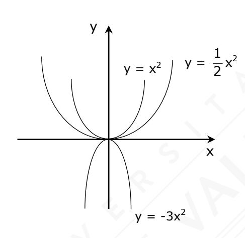

## **TRASLACIÓN VERTICAL f(x) = x2**

| y = x2 + c             | Desplazamiento | Función          | Gráfico      |
|------------------------|----------------|------------------|--------------|
| c = número positivo | Hacia arriba   | f(x) = x2 + 1    | y 1 x  |
| c = número negativo | Hacia abajo    | f(x) = x2 – 2 | y x -2 |

## **TRASLACIÓN HORIZONTAL DE f(x) = x2**

| h)2 y = (x –        | Desplazamiento     | Función            | Gráfico      |
|------------------------|--------------------|--------------------|--------------|
| h = número positivo | Hacia la derecha   | 3)2 f(x) = (x – | y x 3  |
| h = número negativo | Hacia la izquierda | f(x) = (x + 2)2    | y x -2 |

**Forma canónica:** 

$$y = a(x - h)^2 + k$$

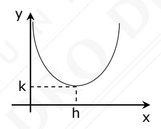

- El vértice es V(h, k)
- El eje de simetría es x = h

#### **Ejemplo:**

| Función                 | Eje de simetría |          | Concavidad |          |        | Intersección con            |
|-------------------------|--------------------|----------|------------|----------|--------|-----------------------------|
|                         |                    | Vértice  | a          | Signo    | Hacia  | el eje Y (x = 0)         |
| 2)2 + 3 f(x) = 6(x – | x = 2              | v(2, 3)  | 6          | positivo | arriba | c=6(-2)2 + 3 = 27           |
| f(x) = -2(x + 1)2 + 4   | x = -1             | v(-1, 4) | -2         | negativo | abajo  | 2 + 4 = 2 c=-2 · 1 |

## **VECTORES**

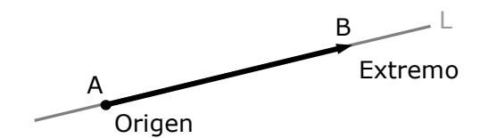

Un vector es un segmento de recta dirigido AB caracterizado por tener:

**Módulo**: Es la longitud del segmento AB y se anota como AB .

**Dirección**: Está dada por la posición de la recta que contiene al vector (recta L).

**Sentido**: Existen dos sentidos posibles, de A hacia B o de B hacia A, indicados por la

flecha AB o BA, respectivamente.

#### **OBSERVACIONES**

Dos vectores son iguales o equipolentes si tienen **igual módulo, dirección y sentido**.

 Los vectores también se expresan con una letra minúscula y una flecha sobre dicha letra: u

Si A coincide con B, tendremos el vector cero o nulo AB = AA = 0

| Adición                                                                                                                                                                                                                           | Sustracción                                                                                                                                                          |  |  |  |  |
|-----------------------------------------------------------------------------------------------------------------------------------------------------------------------------------------------------------------------------------|----------------------------------------------------------------------------------------------------------------------------------------------------------------------|--|--|--|--|
| Para sumar, se copia v a continuación de u, haciendo coincidir el origen de v con el extremo de u. Luego, u + v es el vector que resulta de unir el origen de u con el extremo de v. | El vector diferencia entre u y v, en ese orden, es u + (-v), donde –v (inverso aditivo de v) tiene igual módulo y dirección, pero sentido contrario a v. |  |  |  |  |
| u + v v u                                                                                                                                                                                                                   | u -v u – v                                                                                                                                                  |  |  |  |  |
| Ponderación por un escalar                                                                                                                                                                                                        |                                                                                                                                                                      |  |  |  |  |
| I. La magnitud de a · v es a · v II. Si a > 0, la dirección y sentido de a · v corresponden a las del vector v.                                                                                       |                                                                                                                                                                      |  |  |  |  |
|                                                                                                                                                                                                                                   | III. Si a < 0, la dirección es la misma de v y su sentido contrario a v.                                                                                          |  |  |  |  |

### **Vectores en lR2**

Se puede establecer una relación entre las coordenadas del extremo de un vector, asociándolo a un vector anclado en el origen:

Por ejemplo OA = (a, b)

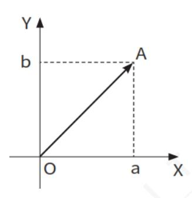

Dado el vector AB no anclado en el origen, con A(x1, y1) y B(x2, y2), entonces:

$$\overrightarrow{AB} = (x_2 - x_1, y_2 - y_1)$$

Dados los vectores a = (a1, a2), b = (b1, b2), se definen:

## **Modulo o Magnitud de un Vector**

$$|\overrightarrow{a}| = \sqrt{(a_1)^2 + (a_2)^2}$$

#### **Adición y Sustracción**

$$\overrightarrow{a} \pm \overrightarrow{b} = (a_1 \pm b_1, a_2 \pm b_2)$$

## **Ponderación por un escalar K (Real)**

$$k \cdot \overrightarrow{a} = k \cdot (a_1, a_2) = (k \cdot a_1, k \cdot a_2)$$

#### **Vectores Unitarios**

Se definen los vectores unitarios (módulo igual a 1): i = (1, 0) y j = (0, 1), de modo que cualquier vector en el plano se puede expresar en términos de ellos en **forma canónica.**

$$\overrightarrow{\mathbf{a}} = \mathbf{a}_1 \cdot \hat{\mathbf{i}} + \mathbf{a}_2 \cdot \hat{\mathbf{j}} = (\mathbf{a}_1, \mathbf{a}_2)$$

v

Para dos vectores u y v en el plano o en el espacio, se cumple la desigualdad u+v u+v, llamada **desigualdad triangular**.

u + v

u

## **CUERPOS GEOMÉTRICOS**

#### **Poliedro**

Es un cuerpo limitado por cuatro o más polígonos donde cada polígono se denomina cara, sus lados son las aristas y la intersección de las aristas se llaman vértices

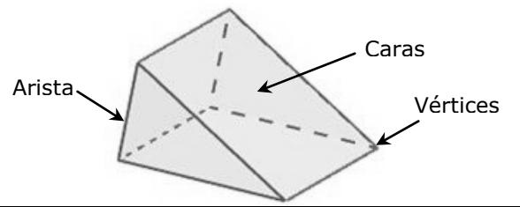

#### **Prisma**

Es un poliedro limitado por paralelogramos (caras paralelas del prisma) y dos polígonos congruentes cuyos planos son paralelos (bases del prisma)

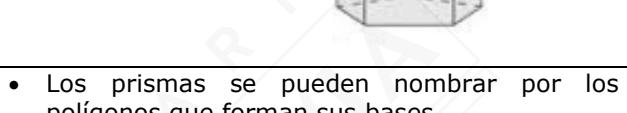

- Las diagonales son los segmentos que unen dos vértices no situados en una misma cara.
- polígonos que forman sus bases.
- Un prisma es recto si sus aristas laterales son perpendiculares a las bases. En caso contrario, es oblicuo.
- Si las bases de un prisma recto son polígonos regulares, el prisma es regular.

**Paralelepípedo**, es un prisma cuyas bases son paralelogramos.

**Ortoedro**, es un paralelepípedo recto rectangular con bases rectangulares

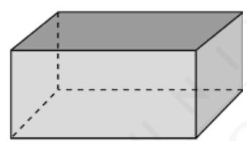

**Cubo o hexaedro regular**, es un paralelepípedo recto cuyas caras son todos cuadrados.

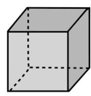

#### **Pirámide**

Es un poliedro cuyas caras laterales son triángulos que concurren en un punto llamado vértice de la pirámide, y su base es un polígono. La altura de cada una de las caras laterales se denomina apotema.

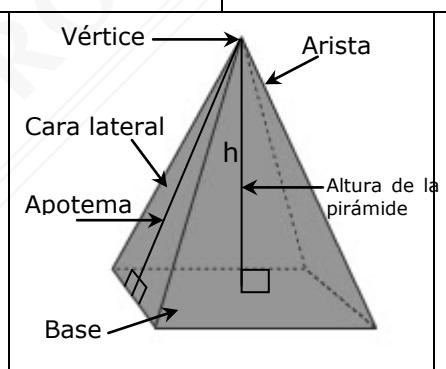

- Una pirámide se puede nombrar por el polígono de su base.
- Una pirámide es recta si el pie de su altura equidista de los vértices basales. En caso contrario es oblicua.
- Una pirámide regular es una pirámide recta cuya base es un polígono regular. Sus caras laterales son triángulos isósceles

#### **Cuerpos Redondos**

Son cuerpos limitados por superficies curvas o superficies planas y curvas.

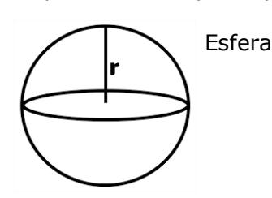

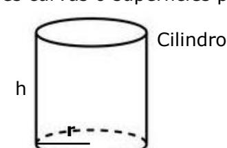

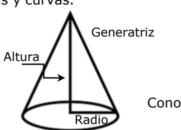

#### **Cuerpos de Revolución**

Se obtienen haciendo girar una superficie plan alrededor de un eje.

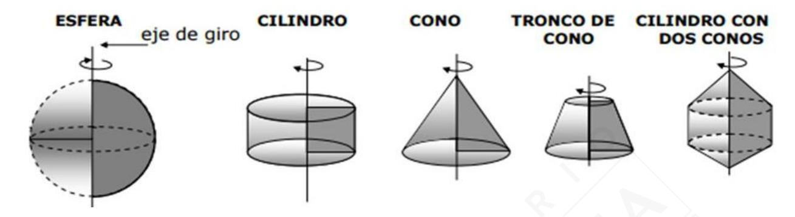

#### **Cuerpos generados por traslación**

Se genera por traslación de una superficie plana

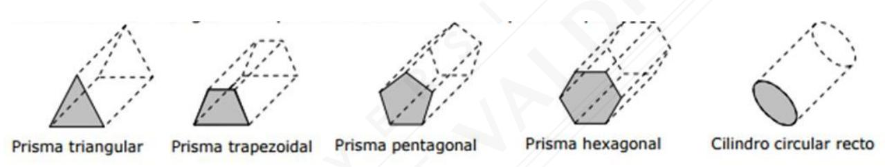

#### ÁREAS Y VOLÚMENES DE PRISMAS

El volumen de todos los prismas y cilindros es igual al área de la base por la altura.

| Nombre                                | Figura                                                           | Área A = Suma del área de cada una de las caras                      | Volumen V =Área de la base por la altura |
|---------------------------------------|------------------------------------------------------------------|----------------------------------------------------------------------------|---------------------------------------------------|
| Paralelepípedo rectangular         | $d = \sqrt{a^2 + b^2 + h^2}$                                     | A = 2(ab + bh + ah)                                                        | V = a ⋅ b ⋅ h                                     |
| Hexaedro regular                   | Diagonal de una cara: $a\sqrt{2}$ Diagonal del cubo: $a\sqrt{3}$ | $A = 6a^2$                                                                 | $V = a^3$                                         |
| Prisma recto triángular            | a b c b                                                          | ♦ $A = A_{Laterales} + 2A_{basal}$ • $A = h(a + b + c) + 2B$ B: área basal | V =B·h                                            |
| Cilindro recto de base circular | h                                                                |                                                                            | $V = \pi r^2 h$                                   |

ÁREAS Y VOLÚMENES DE PIRÁMIDE, CONO Y TRONCO DE CONO El volumen de todas las pirámides y conos es igual al área de la base por la altura divido por tres.

| Nombre                                | Figura | Área A = Suma del área de cada una de las caras                                                                                                                                                                                    | Volumen V= Un tercio del área basal por la altura |
|---------------------------------------|--------|------------------------------------------------------------------------------------------------------------------------------------------------------------------------------------------------------------------------------------------|------------------------------------------------------------|
| Pirámide recta de base cuadrada | h g a  | <ul> <li>A = 4ALateral + Abasal</li> <li>A = 2ag + a2</li> <li>g: apotema lateral</li> </ul>                                                                                                            | $V = \frac{a^2 \cdot h}{3}$                                |
| Cono recto de base circular        | h      | <ul> <li>A = AManto + Abasal</li> <li>A = πrg + πr2</li> <li>g: generatriz</li> <li>El manto del cono corresponde a un sector circular cuyo radio es la generatriz g y longitud de arco 2πr.</li> </ul> | $V = \frac{\pi r^2 h}{3}$                                  |

## Áreas y Volumen de una Esfera

| Nombre | Forma | Área                   | Volumen                           |
|--------|-------|------------------------|-----------------------------------|
| Esfera |       | $4\cdot \pi \cdot r^2$ | $\frac{4}{3} \cdot \pi \cdot r^3$ |