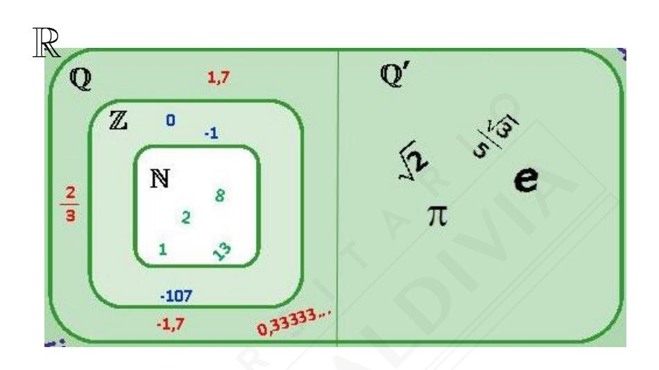

# **RESUMEN RMA-01**

# **NÚMEROS Y PROPORCIONALIDAD**

| Nombre   |  |
|----------|--|
| Curso    |  |
| Profesor |  |

# **CONJUNTOS NUMÉRICOS**

# **Números Naturales**

$$\mathbb{N} = \{1, 2, 3, 4, ...\}$$

## **Números Cardinales**

$$\mathbb{N}_{\mathbf{0}} = \{0, 1, 2, 3, 4, ...\}$$

# **Números Enteros**

$$\mathbb{Z} = \{..., -1, 0, 1, 2, 3, ...\}$$

## **Números Irracionales**

$$Q' = \{ \sqrt{2}, \sqrt{3}, \pi, e, \emptyset, \sqrt[3]{5} ... \}$$

#### **Números Racionales**

$$\mathbb{Q} = \left\{ \frac{1}{5}, -7, \frac{5}{3}, 2\frac{1}{7}, 0, 3, \ldots \right\}$$

#### **Números Reales**

$$IR = \mathbb{Q} \cup \mathbb{Q}^*$$

IR = 
$$\left\{ \sqrt{5}, -1, 7, \frac{3}{4}, \ldots \right\}$$

# **VALOR ABSOLUTO**

$$|n| = \begin{cases} n, & \text{si n es un entero no negativo.} \\ -n, & \text{si n es un entero negativo.} \end{cases}$$

### **Observación:**

 El valor absoluto de un número representa la **distancia** que existe entre este **número y el cero.**

|      | Signo de n         | Valor absoluto | Ejemplos            | Interpretación                         |
|------|--------------------|-------------------|---------------------|----------------------------------------|
| n | Positivo o cero | n                 | 3 = 3          | Distancia que hay desde 3 hasta 0.  |
|      | Negativo           | -n                | -5 = -(-5) = 5 | Distancia que hay desde -5 hasta 0. |

# **OPERATORIA EN**

| Adición | Igual signo       | 1° Se suman. 2° Se conserva signo.                                                            |  5 + 4 = 9  -5 – 3 = -8 |
|---------|-------------------|--------------------------------------------------------------------------------------------------------|---------------------------------------|
|         | Distinto signo | 1°Se restan. 2°Se conserva el signo del número con mayor valor absoluto. |  -5 + 3 = -2  -3 + 7 = 4   |

| Multiplicación                  | Ejemplos                      | División                        | Ejemplos                      |
|---------------------------------|-------------------------------|---------------------------------|-------------------------------|
| + · + = + – · – = + | 5 · 7 = 35 -3 · -6 = 18 | + : + = + – : – = + | 30 : 6 = 5 -15 : -3 = 5 |
| – · + = – + · – = – | -2 · 4 = -8 9 · -5 = -45   | – : + = – + : – = – | -18 : 6 = -3 20 : -5 = -4  |

**3**

| Propiedades       |                                                                                                                    |  |
|-------------------|--------------------------------------------------------------------------------------------------------------------|--|
| Orden en         | a > b  a – b > 0                                                                                            |  |
|                   | a < b  a – b < 0                                                                                            |  |
| Ley de Tricotomía | Entre dos números, a y b, sólo se cumple una de las siguientes relaciones: a < b ó a > b ó a = b |  |
| Observaciones     |  Si a  b, entonces a – b = a – b  Si a  b, entonces a – b = b – a      |  |

| Números             | Formas                   | Observaciones                                                                                        |
|---------------------|--------------------------|------------------------------------------------------------------------------------------------------|
| Enteros             | n                        | Tres números enteros consecutivos: Antecesor Sucesor n – 1 n n + 1                    |
| Pares               | 2n                       | Tres números pares consecutivos: Antecesor par Sucesor par 2n – 2 2n 2n + 2           |
| Impares             | 2n + 1 ó 2n – 1 | Tres números impares consecutivos: Antecesor impar Sucesor impar 2n – 1 2n + 1 2n + 3 |
| Cuadrados Perfectos | 2 n                   | 1, 4, 9, 16, 25, 36, 49, 64, …                                                                       |
| Cubos Perfectos     | 3 n                   | 1, 8, 27, 64, 125, 216, …                                                                            |

# **POTENCIAS**

# **DEFINICIÓN**

 $\mathbf{a}^{\mathbf{n}} = \mathbf{a} \cdot \mathbf{a} \cdot \mathbf{a} \cdot \dots \cdot \mathbf{a}$ , con  $\mathbf{a} \in \mathbb{Z}$  y  $\mathbf{n} \in \mathbb{Z}^+$  donde a se multiplica n veces por sí mismo.

#### **Observaciones:**

- a0 = 1, con a ≠ 0
   1n = 1
   00 no está definido.

| Base     | Exponente | Resultado | Ejemplo         |
|----------|-----------|-----------|-----------------|
|          | Par       | Positivo  | $(-3)^4 = 81$   |
| Negativa | Impar     | Negativo  | $(-5)^3 = -125$ |

| Propiedades Sean $\{a, b\} \in \mathbb{Z}$ , con $b \neq 0$ , $y \{m, n\} \in \mathbb{Z}^+$ |                    | Ejemplos                  |                                         |
|---------------------------------------------------------------------------------------------|--------------------|---------------------------|-----------------------------------------|
| Igual base                                                                                  | Producto           | $a^m \cdot a^n = a^{m+n}$ | $3^5 \cdot 3^{-2} = 3^{5-2} = 3^3 = 27$ |
|                                                                                             | División           | $a^m:a^n=a^{m-n}$         | $5^6: 5^4 = 5^{6-4} = 5^2 = 25$         |
| Igual exponente                                                                          | Producto           | $a^n \cdot b^n = (ab)^n$  | $6^4 \cdot 3^4 = (6 \cdot 3)^4 = 18^4$  |
|                                                                                             | División           | $a^{n}:b^{n}=(a:b)^{n}$   | $12^3: 4^3 = (12:4)^3 = 3^3 = 27$       |
| Potencia de una potencia                                                                 | $(a^n)^m = a^{nm}$ |                           | $(5^2)^3 = 5^6$                         |

# **PRIORIDAD DE LAS OPERACIONES**

Los ejercicios que contienen operaciones combinadas se deben resolver siguiendo el siguiente orden:

- **1°** Resolver **paréntesis** (si hay paréntesis dentro de paréntesis, se resuelven de adentro hacia afuera).
- **2°** Calcular las **potencias**.
- **3°** Realizar **multiplicaciones** y/o **divisiones** (de izquierda a derecha).
- **4°** Realizar **adiciones** y/o **sustracciones.**

| PRIORIDAD DE LAS OPERACIONES    | EJEMPLO                                                                  |
|---------------------------------|--------------------------------------------------------------------------|
| Paréntesis                      | (3 + 2)2 – 5)3 + (-10 + 6) : 4 2(3 – · 5                        |
| Potencias                       | 2 – 2(-2)3 + (-4) : 4 5 · 5 25 – 2 · -8 + (-4) : 4 · 5 |
| Multiplicaciones y/o divisiones | 25 + 16 + (-1) · 5                                                       |
|                                 | 25 + 16 – 5                                                           |
| Adiciones y/o sustracciones     | 25 + 16 – 5 36                                                     |

| MÚLTIPLOS Y DIVISORES                           |                      |               |                     |
|-------------------------------------------------|----------------------|---------------|---------------------|
|                                                 | Se lee               |               | Ejemplo             |
| a · b = c con a y b números enteros | a es divisor de c |               | 4 es divisor de 20  |
|                                                 |                      |               | 5 es divisor de 20  |
|                                                 | b es divisor de c    | 4 · 5 = 20 |                     |
|                                                 | c es múltiplo de a   |               | 20 es múltiplo de 4 |
|                                                 | c es múltiplo de b   |               | 20 es múltiplo de 5 |

|                   | Observaciones                                                                                                                                                                                                                           | Ejemplos                                                       |
|-------------------|-----------------------------------------------------------------------------------------------------------------------------------------------------------------------------------------------------------------------------------------|----------------------------------------------------------------|
| Múltiplos M(n) |  Los múltiplos de un número entero n se obtienen multiplicando n por cada número entero.  Todo número entero es múltiplo de sí mismo.  El cero es múltiplo de todos los números enteros.            | Múltiplos de 3 M(3)={…,-12,-9,-6,-3,0,3,6,9,…}              |
| Divisores D(n) | En la división de números enteros,  a : b, b es divisor de a si el resto de la división es cero.  Todo número entero, distinto de cero, es divisor de sí mismo.  El número uno es divisor de todo número. | Divisores de 12 D(12)={-12,-6,-4,-3,-2,-1,1,2,3,4, 6,12} |

# **NÚMEROS PRIMOS Y COMPUESTOS**

| Números    | Definiciones                                                                           | Ejemplos                         |
|------------|----------------------------------------------------------------------------------------|----------------------------------|
| Primos     | Tienen sólo dos divisores positivos  distintos (el 1 y el mismo número).        | 2,3,5,7,11,13,17,19,23,29,31,37… |
| Compuestos | No son primos.   Son aquellos que tienen más de dos divisores distintos. | 4,6,8,9,10,12,14,15,16,18,20…    |

#### **Observación:**

El número 1 no es primo ni compuesto.

# TEOREMA FUNDAMENTAL DE LA ARITMÉTICA (FACTORIZACIÓN PRIMA DE UN NÚMERO)

"Todo número compuesto se puede expresar, de manera única, como un producto de números primos"

### **Ejemplos:**

- $45 = 3^2 \cdot 5$
- $\bullet$  360 =  $2^3 \cdot 3^2 \cdot 5$

### CÁLCULO DEL m.c.m Y M.C.D

|         | Procedimiento                                 | Ejemplo                                                 |
|---------|-----------------------------------------------|---------------------------------------------------------|
| m.c.m   | 1° Tomar todos los factores primos.           | $150 = 2 \cdot 3 \cdot 5^{2}$ $200 = 2^{3} \cdot 5^{2}$ |
| micini  | 2º Considerar el mayor exponente de cada uno. | m.c.m(150, 200) = $2^3 \cdot 3 \cdot 5^2 = 600$         |
| M.C.D   | 1º Tomar sólo los factores primos comunes.    | <b>M.C.D(150, 200)</b> = $2 \cdot 5^2 = 50$             |
| Pil.C.D | 2º Considerar el menor exponente de cada uno. | THOID(130, 200) = 2 · 3 = 30                            |

# **NÚMEROS RACIONALES**

| Tipos de fracciones |                                 | Ejemplos                         |
|---------------------|---------------------------------|----------------------------------|
| Fracción Propia     | $\frac{a}{b}$ , con $ a  <  b $ | $\frac{3}{4}$ y $\frac{-5}{8}$   |
| Fracción Impropia   | $\frac{a}{b}$ , con $ a  >  b $ | $\frac{18}{7}$ y $\frac{-21}{4}$ |

|                                                                                                       | Ejemplos                       |                     |                     |  |
|-------------------------------------------------------------------------------------------------------|--------------------------------|---------------------|---------------------|--|
| Fracciones Equivalentes                                                                               | Fracciones                     | Producto Cruzado | Conclusión          |  |
| $\frac{a}{b} = \frac{c}{d} \Leftrightarrow \mathbf{a} \cdot \mathbf{d} = \mathbf{b} \cdot \mathbf{c}$ | $\frac{10}{4}$ y $\frac{5}{2}$ | 10 · 2 = 4 · 5      | Son equivalentes |  |
| (El producto cruzado debe ser el mismo)                                                               | $\frac{3}{12}$ y $\frac{2}{8}$ | 3 · 8 = 2 · 12      | Son equivalentes |  |

| ,           | Procedimiento                                                                               | Ejemplos |                      |               |
|-------------|---------------------------------------------------------------------------------------------|----------|----------------------|---------------|
| Operación   |                                                                                             | Fracción | Operación            | Resultado     |
| Amplificar  | Se multiplica el numerador y el denominador por un mismo número entero distinto de cero.    | 3 4      | Amplificar por 5  | 1 <u>5</u> 20 |
| Simplificar | Se divide el numerador y el denominador por un mismo divisor común entero distinto de cero. | 12 15 | Simplificar por 3 | <u>4</u> 5 |

#### **Observaciones:**

- ♦ Una fracción es **irreductible**, si el máximo común divisor entre el numerador y el denominador es 1, es decir, no se puede simplificar.
- ◆ EL **Neutro Aditivo** es el 0.
- ♦ El **Neutro Multiplicativo** es el 1.
- ◆ El **Inverso Aditivo** (Opuesto) de un número se obtiene cambiando el signo del número dado.
- ◆ El **Inverso Multiplicativo** (Recíproco) se obtiene invirtiendo el numerador por el denominador.
- A partir de un **número mixto** se obtiene una fracción impropia y viceversa.

|      | Inverso Aditivo (Opuesto)          | - <u>13</u>    |
|------|---------------------------------------|----------------|
| 13 2 | Inverso Multiplicativo (Recíproco) | 2 13        |
|      | Número mixto                          | $5\frac{3}{2}$ |

| Adición y sustracción de números racionales |                                                      |                                                                                                           |
|---------------------------------------------|------------------------------------------------------|-----------------------------------------------------------------------------------------------------------|
|                                             | Operatoria                                           | Ejemplo                                                                                                   |
| Igual denominador                        | $\frac{a}{c} \pm \frac{b}{c} = \frac{a \pm b}{c}$    | $\frac{2}{7} + \frac{3}{7} = \frac{2+3}{7} = \frac{5}{7}$                                                 |
| Distinto denominador                     | $\frac{a}{b} \pm \frac{c}{d} = \frac{ad \pm bc}{bd}$ | $\frac{3}{4} - \frac{5}{7} = \frac{3 \cdot 7 - 5 \cdot 4}{4 \cdot 7} = \frac{21 - 20}{28} = \frac{1}{28}$ |

|                | Operatoria                                                                                         | Ejemplo                                                                                                  |
|----------------|----------------------------------------------------------------------------------------------------|----------------------------------------------------------------------------------------------------------|
| Multiplicación | $\frac{a}{b} \cdot \frac{c}{d} = \frac{a \cdot c}{b \cdot d}$                                      | $\frac{1}{3} \cdot \frac{5}{4} = \frac{1 \cdot 5}{3 \cdot 4} = \frac{5}{12}$                             |
| División       | $\frac{a}{b}: \frac{c}{d} = \frac{a}{b} \cdot \frac{d}{c} = \frac{a \cdot d}{b \cdot c}; c \neq 0$ | $\frac{5}{7}: \frac{2}{3} = \frac{5}{7} \cdot \frac{3}{2} = \frac{5 \cdot 3}{7 \cdot 2} = \frac{15}{14}$ |

# RELACIÓN DE ORDEN EN Q (COMPARAR FRACCIONES)

| Cantidad de fracciones | Procedimiento                                                                               | Ejemplo                                                               |
|------------------------|---------------------------------------------------------------------------------------------|-----------------------------------------------------------------------|
| 2 o más                | $\frac{a}{b} \ge \frac{c}{d} \Leftrightarrow a \cdot d \ge b \cdot c$ $con b y d positivos$ | $\frac{7}{8} \ge \frac{3}{5} \text{ porque } 7 \cdot 5 \ge 3 \cdot 8$ |

| Cantidad de fracciones | Procedimiento                                      |                                                                                                                                                                                                                                                                                                 | Ejemplo  Ordenar las siguientes fracciones $\mathbf{a} = \frac{3}{4}$ ; $\mathbf{b} = \frac{5}{3}$ ; $\mathbf{c} = \frac{1}{2}$                                                  |
|------------------------------|----------------------------------------------------|-------------------------------------------------------------------------------------------------------------------------------------------------------------------------------------------------------------------------------------------------------------------------------------------------|----------------------------------------------------------------------------------------------------------------------------------------------------------------------------------|
| 3 o más fracciones        | Igualar numeradores Igualar denominadores | <ul> <li>1° Amplificar y/o simplificar por un valor adecuado.</li> <li>2° Mientras más grande sea el denominador, más pequeño será el valor de la fracción</li> <li>1° Amplificar y/o simplificar por un valor adecuado.</li> <li>2° Al ordenar los numeradores quedan ordenadas las</li> </ul> | a = $\frac{15}{20}$ ; b = $\frac{15}{9}$ ; c = $\frac{15}{30}$ Por lo tanto, c < a < b  a = $\frac{9}{12}$ ; b = $\frac{20}{12}$ ; c = $\frac{6}{12}$ Por lo tanto, c < a < b |
|                              | Convertir a número decimal                   | fracciones.  1º Dividir numerador con denominador.  2º Comparar, una a una, las cifras decimales.                                                                                                                                                                                               | a = 0.75; $b = 1.6$ y $c = 0.5Por lo tanto, c < a < b$                                                                                                                           |

# POTENCIAS EN $\mathbb Q$

|                             |                    |                            | Ejemplos                                                                                                                                                                           |
|-----------------------------|--------------------|----------------------------|------------------------------------------------------------------------------------------------------------------------------------------------------------------------------------|
|                             | Producto           | $a^m \cdot a^n = a^{m+n}$  | $\left(\frac{2}{7}\right)^3 \cdot \left(\frac{2}{7}\right)^{-1} = \left(\frac{2}{7}\right)^2 = \frac{4}{49}$                                                                       |
| Igual base                  | División           | $a^m:a^n=a^{m-n}$          | $\left(\frac{4}{5}\right)^3 : \left(\frac{4}{5}\right)^5 = \left(\frac{4}{5}\right)^{3-5} = \left(\frac{4}{5}\right)^{-2} = \left(\frac{5}{4}\right)^2 = \frac{25}{16}$            |
| Igual exponente          | Producto           | $a^n \cdot b^n = (ab)^n$   | $\left(\frac{1}{5}\right)^3 \cdot \left(\frac{2}{3}\right)^3 = \left(\frac{1}{5} \cdot \frac{2}{3}\right)^3 = \left(\frac{2}{15}\right)^3$                                         |
| exponente                   | División           | $a^{n}: b^{n} = (a:b)^{n}$ | $\left(\frac{3}{5}\right)^2 : \left(\frac{2}{7}\right)^2 = \left(\frac{3}{5} : \frac{2}{7}\right)^2 = \left(\frac{3}{5} \cdot \frac{7}{2}\right)^2 = \left(\frac{21}{10}\right)^2$ |
| Potencia de una potencia | $(a^n)^m = a^{nm}$ |                            | $\left( \left( \frac{1}{4} \right)^2 \right)^{-3} = \left( \frac{1}{4} \right)^{-6} = 4^6$                                                                                         |

| 2 2                    | Notaciones especiales                                                                              | Ejemplos a = 153.000.000 b = 0,00428                          |
|------------------------|----------------------------------------------------------------------------------------------------|---------------------------------------------------------------------|
| Notación Científica | • $\mathbf{k} \cdot 10^{\mathbf{n}}$ Con $1 \le  \mathbf{k}  < 10$ y n es un número entero.     | $\mathbf{a} = 1,53 \cdot 10^8$ $\mathbf{b} = 4,28 \cdot 10^{-3}$ |
| Forma Abreviada     | $\rightharpoonup \mathbf{p} \cdot 10^{\text{n}}$   p   es el menor entero y n es un número entero. | $\mathbf{a} = 153 \cdot 10^6$ $\mathbf{b} = 428 \cdot 10^{-5}$      |

# TRANSFORMACIÓN DE NÚMERO DECIMAL A FRACCIÓN

| Número Decimal         | Procedimiento para el numerador y el denominador                                                                                                                                                                                                                               | Ejemplo                                                |
|------------------------|-----------------------------------------------------------------------------------------------------------------------------------------------------------------------------------------------------------------------------------------------------------------------------------|--------------------------------------------------------|
| Finito                 | Numerador: Todos los dígitos que forman el número decimal.  Denominador: Una potencia de 10 con tantos ceros como cifras decimales tenga el número.                                                                                                                               | $0,2=\frac{2}{10}$                                     |
| Infinito Periódico     | Numerador: Diferencia entre el número decimal completo (sin considerar la coma) y el número formado por todas las cifras que anteceden al periodo.  Denominador: Tantos nueves como cifras tenga el periodo.                                                                      | $0, \bar{2} = \frac{2-0}{9} = \frac{2}{9}$             |
| Infinito Semiperiódico | Numerador: Diferencia entre el número decimal completo (sin considerar la coma) y el número formado por todas las cifras que anteceden al periodo.  Denominador: Tantos nueves como cifras tengan el periodo, seguido de tantos ceros como cifras decimales tenga el anteperiodo. | $0,13\bar{2} = \frac{132 - 13}{900} = \frac{119}{900}$ |

#### **APROXIMACIONES**

| Tipo de aproximación | Procedimiento                                                                                                                                                 |                                                                                                                                                                    |                                                                        | Ejemplo                                                        |
|-------------------------|---------------------------------------------------------------------------------------------------------------------------------------------------------------|--------------------------------------------------------------------------------------------------------------------------------------------------------------------|------------------------------------------------------------------------|----------------------------------------------------------------|
| Truncamiento            | 1° Marcar y dejar la cifra a truncar. 2° Reemplazar todas las cifras que están a la derecha de ésta por ceros.                                    |                                                                                                                                                                    |                                                                        | 0,438 truncado a la décima: 0,438 ≈ 0,400 ≈ 0,4 |
| Redondeo                | Cifra marcada mayor o igual a 5 Marcar la cifra que está a la derecha de la cifra a redondear. Cifra marcada menor a 5 | 1° Sumar 1 a la cifra a la cual se redondeará. 2° Reemplazar por ceros todas las cifras que están a la derecha de la cifra a redondear. | O,372 redondeado a la décima: 0,372 ≈ 0,400 = 0,4 |                                                                |
|                         |                                                                                                                                                               | 1° Mantener la cifra a redondear. 2° Reemplazar todas las cifras a la derecha de ésta por ceros.                                                 | O,419 redondeado a la décima: 0,419 ≈ 0,400 = 0,4 |                                                                |

#### **Observaciones:**

- **Aproximación por exceso:** El valor resultante es mayor que el valor del número original.
- **Aproximación por defecto:** El valor resultante es menor que el valor del número original.
- **Error:** Corresponde al valor absoluto de la diferencia entre el valor exacto y su aproximación.

# **NÚMEROS IRRACIONALES (Q')**

Son todos los números con desarrollos infinitos no periódicos.

#### **Observaciones:**

- Un número irracional no se puede escribir como fracción.
- Son números irracionales todas las raíces reales inexactas.

# **CASOS PARTICULARES DE NÚMEROS IRRACIONALES:**

- = 3,1415927 …
- e = 2,718281
- = 1,618033

# **NÚMEROS REALES (lR)**

Es la unión de los números racionales con los números irracionales.

$$\mathbb{R} = \mathbb{Q} \ \mathsf{U} \ \mathbb{Q}'$$

# **OPERATORIA EN lR**

| Operatoria entre               | Resultado                                                                                         | Ejemplos                                                                                                                                                                |  |  |
|--------------------------------|---------------------------------------------------------------------------------------------------|-------------------------------------------------------------------------------------------------------------------------------------------------------------------------|--|--|
| Dos números racionales   | Siempre será un número racional (se excluye dividir por cero).                     | a = 7 b = 2 Cualquier operación entre a y b será racional.                                                                                                     |  |  |
| Dos números irracionales | Puede ser un número racional o irracional dependiendo de la operación que se aplique. | a = 5 b = 3 5  a + b = +3 = 4 es un 5 5 5 número irracional.  ab = · 3 = 15 es un 5 5 número racional. |  |  |
| Un número                   | Siempre será un número                                                                   | a = 0 b = 3 ab = 0 · = 0 es un número  3 racional  a : b = 0 : 3 = 0 es un número racional                                     |  |  |
| racional y uno irracional   | irracional (excepto la multiplicación y/o división por cero).                               | a = 5 b = 2 3 ab = 5 · 2 = 10 es un  3 3 número irracional  a + b = 5 +2 3 es un número irracional              |  |  |

## **PROPORCIONALIDAD**

| Definición |                                                                        | Se escribe                               | Se lee                       |
|------------|------------------------------------------------------------------------|------------------------------------------|------------------------------|
| Razón      | Comparación de dos cantidades a través del cuociente de ellas | a a : b ó b                        | "a es a b"                   |
| Proporción | Igualdad formada por dos razones                                    | c a a : b = c : d ó = d b | "a es a b, como c es a d" |

# **TIPOS DE PROPORCIONALIDAD**

| Nombre  | Constante de Proporcionalidad                                          | Gráfica | Observaciones                                                                                                                                                                                |
|---------|---------------------------------------------------------------------------|---------|----------------------------------------------------------------------------------------------------------------------------------------------------------------------------------------------|
| Directa | "El cuociente permanece constante" y = k x k: constante | Y X  |  Si una variable aumenta la otra aumenta proporcionalmente.  Si una variable disminuye la otra disminuye proporcionalmente.  La gráfica pasa por el origen. |
| Inversa | "El producto permanece constante" x · y = k k: constante      | Y X  |  Si una variable aumenta la otra disminuye proporcionalmente.  La gráfica es una rama de una hipérbola equilátera.                                                    |

#### **PORCENTAJES**

| Definición                        | Ejemplo                                       |
|-----------------------------------|-----------------------------------------------|
| $n\% = \frac{n}{100}$             | $5\% = \frac{5}{100}$                         |
| a% de b = $\frac{a}{100} \cdot b$ | $3\% \text{ de } 15 = \frac{3}{100} \cdot 15$ |

| Observaciones                                                                                 |                             |  |
|-----------------------------------------------------------------------------------------------|-----------------------------|--|
| <ul><li> ¿Qué tanto por ciento es a de b?</li><li> ¿Qué tanto por ciento de b es a?</li></ul> | $\frac{x}{100} \cdot b = a$ |  |
| <ul><li> ¿Qué parte es a de b?</li><li> ¿Qué fracción es a de b?</li></ul>                    | $\frac{a}{b}$               |  |

#### Interés

Ci: Capital inicial Cf: Capital final i%: Tasa de interés

n : Periodos de capitalización

**Obs.:** La Tasa de Interés (i%) y los periodos de capitalización (n) deben estar en la misma unidad de tiempo.

| Tipo de Interés | Capital Final                                       | Ganancia                                                                                                             |
|-----------------|-----------------------------------------------------|----------------------------------------------------------------------------------------------------------------------|
| Simple          | $C_f = C_i \bigg( 1 + \frac{i}{100} \cdot n \bigg)$ | $\begin{aligned} & \text{Ganancia} = C_f - C_i \\ & \text{Ganancia} = C_i \cdot n \cdot \frac{i}{100} \end{aligned}$ |
| Compuesto       | $C_f = C_i \left(1 + \frac{i}{100}\right)^n$        | Ganancia = C f - C i                                                                           |