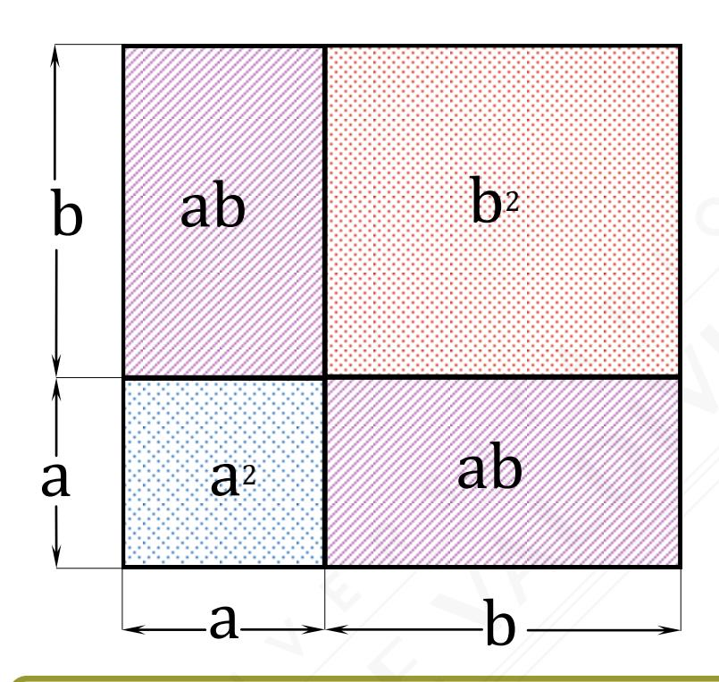
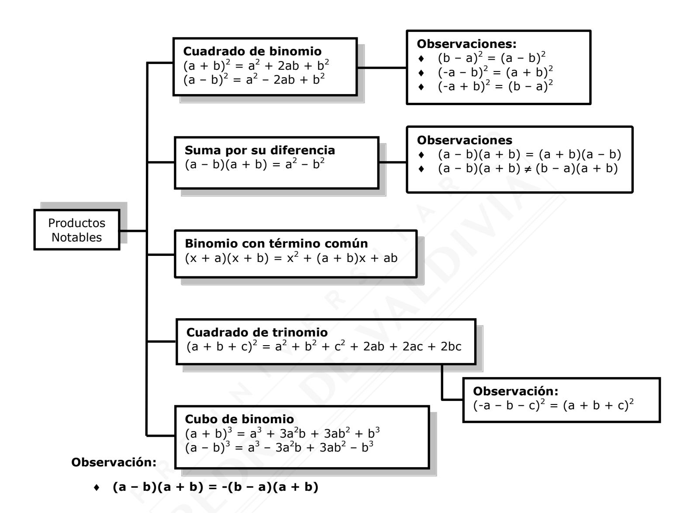
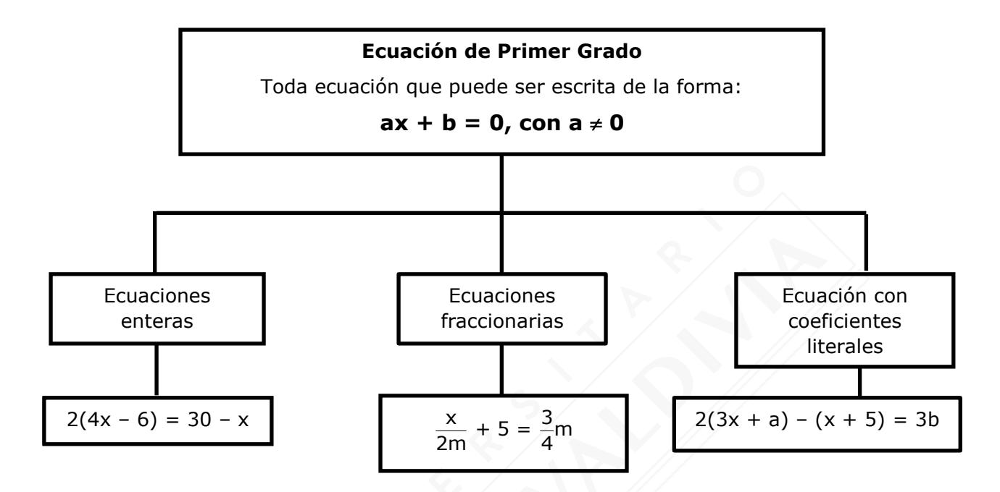

$$(a + b)^2 = a^2 + 2ab + b^2$$

# RESUMEN RMA-02 ÁLGEBRA I

| Nombre   |  |
|----------|--|
| Curso    |  |
| Drofocor |  |

# ÁLGEBRA

#### Término algebraico

- Expresión formada por números, letras, o bien, números y letras.
- Es posible distinguir Factor Numérico y Factor Literal.

**Ejemplo:**  $-3xy^2$ 

Factor Numérico: -3 Factor literal: xy2

## **Expresiones algebraicas**

Expresión formada por dos o más términos algebraicos, espaciadas por adiciones y/o sustracciones.

## Clasificación de las Expresiones Algebraicas

- Monomio: Es una expresión algebraica que tiene solo un término algebraico.
- ◆ Binomio: Es una expresión algebraica que tiene solo dos términos algebraicos. 3x² 2y
- **Trinomio**: Es una expresión algebraica que tiene solo tres términos algebraicos.  $4x^2 + 5x 3$
- Multinomio: Es una expresión algebraica que tiene más de tres términos algebraicos.

$$4x^4 + 2x^2y - 3xy^2 + x$$

## Términos semejantes:

Términos algebraicos que tienen el mismo factor literal.  $2a^3b^2$ ;  $-5a^3b^2$ ;  $3a^3b^2$ 

| OPERATORIA     |                                                                                                 |                                                                                                 |  |  |  |
|----------------|-------------------------------------------------------------------------------------------------|-------------------------------------------------------------------------------------------------|--|--|--|
| ADICIÓN        | Se debe reducir términos semejantes                                                    | 5x2 + 3x2 – 20x2 = -12x2  -7 + ab3 – 1 + 4ab3 = -8 + 5ab3                      |  |  |  |
| MULTIPLICACIÓN | Se multiplican todos los términos entre sí, es decir, se debe multiplicar término a término. |                                                                                                 |  |  |  |
|                | Monomio por monomio                                                                          | 5xy3 3 · y = 20x2 4 · 4xy = 5 · 4 · x · x · y y                      |  |  |  |
|                | Monomio por binomio                                                                          | 2b3 4a · 2b3 = 20a – 8ab3 4a(5 – ) = 4a · 5 –                                    |  |  |  |
|                | Binomio por Binomio                                                                       | (2 – x)(3 + y) = 2 · 3 + 2 · y – x · 3 – x · y = 6 + 2y – 3x – xy |  |  |  |

| Producto Notable             | Ejemplo                                                                                                                                                                                     |
|------------------------------|---------------------------------------------------------------------------------------------------------------------------------------------------------------------------------------------|
| Cuadrado de Binomio          | $(3a - b)^2 = (3a)^2 - 2 \cdot 3a \cdot b + b^2 = 9a^2 - 6ab + b^2$                                                                                                                         |
| Suma por su Diferencia       | $(4x - 3y)(4x + 3y) = (4x)^2 - (3y)^2 = 16x^2 - 9y^2$                                                                                                                                       |
| Binomio con Término Común | $(x + 7)(x + 3) = x^2 + (7 + 3)x + 7 \cdot 3 = x^2 + 10x + 21$                                                                                                                              |
| Cuadrado de Trinomio         | $(3 + x + y)^{2} = 3^{2} + x^{2} + y^{2} + 2 \cdot 3 \cdot x + 2 \cdot 3 \cdot y + 2 \cdot x \cdot y$ = 9 + x 2 + y 2 + 6x + 6y + 2xy                              |
| Cubo de Binomio              | $(2x - 5y)^3 = (2x)^3 - 3 \cdot (2x)^2 \cdot 5y + 3 \cdot 2x \cdot (5y)^2 - (5y)^3$ $= 8x^3 - 3 \cdot 4x^2 \cdot 5y + 3 \cdot 2x \cdot 25y^2 - 125y^3$ $= 8x^3 - 60x^2y + 150xy^2 - 125y^3$ |

# **TIPOS DE FACTORIZACIONES**

| Factor Común                                  | <ul> <li>ac + ad = a(c + d)</li> <li>(a + b)c + (a + b)d = (a + b)(c + d)</li> </ul>                                                 |
|-----------------------------------------------|--------------------------------------------------------------------------------------------------------------------------------------|
|                                               | Diferencia de cuadrados $a^2 - b^2 = (a - b)(a + b)$                                                                              |
| Factorización de Binomios (2 Términos)     | Diferencia de cubos $\mathbf{a}^3 - \mathbf{b}^3 = (\mathbf{a} - \mathbf{b})(\mathbf{a}^2 + \mathbf{a}\mathbf{b} + \mathbf{b}^2)$ |
|                                               | Suma de cubos $a^3 + b^3 = (a + b)(a^2 - ab + b^2)$                                                                               |
|                                               | Trinomio cuadrado perfecto $a^2 + 2ab + b^2 = (a + b)^2$ $a^2 - 2ab + b^2 = (a - b)^2$                                         |
| Factorización de Trinomios (3 Términos) | Trinomio de la forma $x^2 + px + q = (x + a)(x + b)$ con p = a + b y q = a · b                                                 |
|                                               | Trinomio de la forma $ax^2 + bx + c = \frac{(ax + p)(ax + q)}{a}$ $con b = p + q \ y \ a \cdot c = p \cdot q$                  |
| Factorización por agrupación de términos   | Factorizar polinomios de tres o más términos agrupándolos convenientemente.                                                       |

#### FRACCIONES ALGEBRAICAS

Son expresiones de la forma  $\frac{P(x)}{Q(x)}$  donde P(x) y Q(x) son polinomios.

## Simplificación de una fracción algebraica

| Tipo de Fracción Algebraica          | Procedimiento                                                                       | Ejemplo                                                                          |
|-----------------------------------------|-------------------------------------------------------------------------------------|----------------------------------------------------------------------------------|
| Numerador y denominador Monomios. | Se simplifican los factores comunes.                                                | $\frac{12ab}{6a} = 2b$                                                           |
| Numerador y/o denominador no monomios.  | Se factoriza el numerador y/o el denominador y se simplifican los factores comunes. | $\frac{x^2 + x - 6}{3x - 6} = \frac{(x + 3)(x - 2)}{3(x - 2)} = \frac{x + 3}{3}$ |

## **OPERATORIA CON FRACCIONES ALGEBRAICAS**

| Operación      |                                                                           | Ejemplo                                                                                               |
|----------------|---------------------------------------------------------------------------|-------------------------------------------------------------------------------------------------------|
| Adición        | $\frac{a}{b} \pm \frac{c}{b} = \frac{a \pm c}{b}$                         | $\frac{b}{3a} - \frac{a - b}{3a} = \frac{b - (a - b)}{3a} = \frac{b - a + b}{3a} = \frac{2b - a}{3a}$ |
|                | $\frac{a}{b} \pm \frac{c}{d} = \frac{a \cdot d \pm b \cdot c}{b \cdot d}$ | $\frac{5a}{7} + \frac{3b}{2} = \frac{5a \cdot 2 + 3b \cdot 7}{14} = \frac{10a + 21b}{14}$             |
| Multiplicación | $\frac{a}{b} \cdot \frac{c}{d} = \frac{a \cdot c}{b \cdot d}$             | $\frac{5a^2}{8} \cdot \frac{3b}{a+b} = \frac{5a^2 \cdot 3b}{8(a+b)} = \frac{15a^2b}{8(a+b)}$          |
| División       | $\frac{a}{b}: \frac{c}{d} = \frac{a}{b} \cdot \frac{d}{c}, c \neq 0$      | $\frac{5}{x}: \frac{3x^2}{4} = \frac{5}{x} \cdot \frac{4}{3x^2} = \frac{20}{3x^3}$                    |

# **ECUACIÓN DE PRIMER GRADO O ECUACIONES LINEALES**

# **ANÁLISIS DE LAS SOLUCIONES PLANTEADAS EN PRIMER GRADO**

| ax + b = 0 | Cantidad de Soluciones | Condición           | Ejemplo                                                                           | Observación                                                                                       |
|------------|---------------------------|---------------------|-----------------------------------------------------------------------------------|---------------------------------------------------------------------------------------------------|
|            |                           |                     |                                                                                   | El coeficiente                                                                                    |
|            |                           | a  0            | 5x + 7 = 15  5x – 8 = 0                                                 | numérico de la                                                                                    |
|            | Solución                  |                     |                                                                                   | variable x debe                                                                                   |
|            | única                     |                     |                                                                                   | ser distinto de                                                                                   |
|            |                           |                     |                                                                                   | cero.                                                                                             |
|            | Infinitas soluciones   | a = 0 y b = 0    | 3x – 7 + x = 2x – 10 + 2x + 3  4x – 7 = 4x – 7  -7 = -7 | Si se decide resolver la ecuación, se obtiene una expresión numérica verdadera. |
|            | No tiene solución      | a = 0 y b  0 | 5x – 2 + x = 7 – 4x + 10x  6x – 2 = 6x + 7  -2 = 7         | Si se decide resolver la ecuación, se obtiene una expresión numérica falsa.        |

# **ANÁLISIS DE LAS SOLUCIONES DE ECUACIONES CON VALOR ABSOLUTO**

|                | Condición | Cantidad de Soluciones | Ejemplo                 | Resolución                                                     |
|----------------|-----------|---------------------------|-------------------------|----------------------------------------------------------------|
| ax + b  = c | c = 0     | Solución única            | 5x + 7  = 0 | 5x + 7 = 0                                         |
|                | c > 0     | Dos soluciones            | 2x + 3  = 5    | 2x + 3 = 5 y 2x + 3 = -5               |
|                | c < 0     | No existe solución     | x + 3  = -6    | x + 3  = -6 Expresión Falsa  Solución vacía |

## **PLANTEAMIENTOS**

| Traducción a Lenguaje Algebraico                                                                 |                                               |  |  |  |
|--------------------------------------------------------------------------------------------------|-----------------------------------------------|--|--|--|
| Enunciado                                                                                        | Lenguaje Algebraico                           |  |  |  |
|  El doble de un número a  El duplo de un número a  Dos veces un número a       | 2a                                            |  |  |  |
|  El triple de un número b  Tres veces el número b                                     | 3b                                            |  |  |  |
|  El cuádruplo de un número c  Cuatro veces un número c                                | 4c                                            |  |  |  |
|  n veces el número d  El producto entre los números n y d                             | nd                                            |  |  |  |
|  El cuadrado de un número x  La segunda potencia de un número x                       | 2 x                                        |  |  |  |
|  El cubo de un número y  La tercera potencia de un número y                           | 3 y                                        |  |  |  |
|  La cuarta potencia de un número w                                                           | 4 w                                        |  |  |  |
|  La diferencia entre a y b  El exceso de a sobre b  a disminuido en b unidades | a – b                                      |  |  |  |
|  c aumentado en d unidades                                                                   | c + d                                         |  |  |  |
|  La semisuma entre los números x e y                                                         | x + y 2                                    |  |  |  |
| La semidiferencia entre los números x e y                                                    | x  y 2                              |  |  |  |
| x es a unidades mayor que y                                                                  | x= y + a, o bien, x – a = y |  |  |  |
|  w es a unidades menor que z                                                                 | w=z - a, o bien, w + a = z  |  |  |  |
|  El cociente entre a y b                                                                     | a b                                        |  |  |  |
|  El doble de x más y                                                                         | 2x + y                                  |  |  |  |
|  El triple de n menos m                                                                      | 3n - m                                  |  |  |  |
|  El triple de, n menos m                                                                     | 3(n - m)                                |  |  |  |

| Problemas de Planteo    |                                            |                                                           |                                                                                                                                                            |  |  |  |
|-------------------------|--------------------------------------------|-----------------------------------------------------------|------------------------------------------------------------------------------------------------------------------------------------------------------------|--|--|--|
| Tipo de Problema     |                                            | Observaciones                                             |                                                                                                                                                            |  |  |  |
| Fracciones              | a La fracción de b un número x | a · x b                                             | Se multiplica la fracción por el número.                                                                                                             |  |  |  |
| Dígitos                 | Notación Ampliada                          | · 102 + · 101 + c · 100 abc = a b             | c, b y a son las cifras de las unidades, decenas y centenas, respectivamente.                                                                     |  |  |  |
| Edades                  | Línea de Tiempo                            | Edad pasada Edad actual (hace b años) x - b x | Edad futura (dentro de c años) x + c                                                                                                                 |  |  |  |
| Trabajos Simultáneos | Ecuación de Trabajo simultáneo       | 1 1 1 = + x a b                      | a y b: Tiempo de trabajo individual x: Tiempo de trabajo simultáneo a, b y x deben estar en la misma unidad de tiempo        |  |  |  |
| Móviles                 | Ecuación de Distancia                   | d = v · t                                              | d: Distancia v: Velocidad t: Tiempo Movimiento Rectilíneo Uniforme                                                                          |  |  |  |
| Mezclas                 | Ecuación de Mezcla                      | ax + b(n - x) = c                                   | a y b: Valores (costos) unitarios. c: Valor (costo) total n: Cantidad total de objetos x y n - x: Cantidad de objetos de cada tipo |  |  |  |