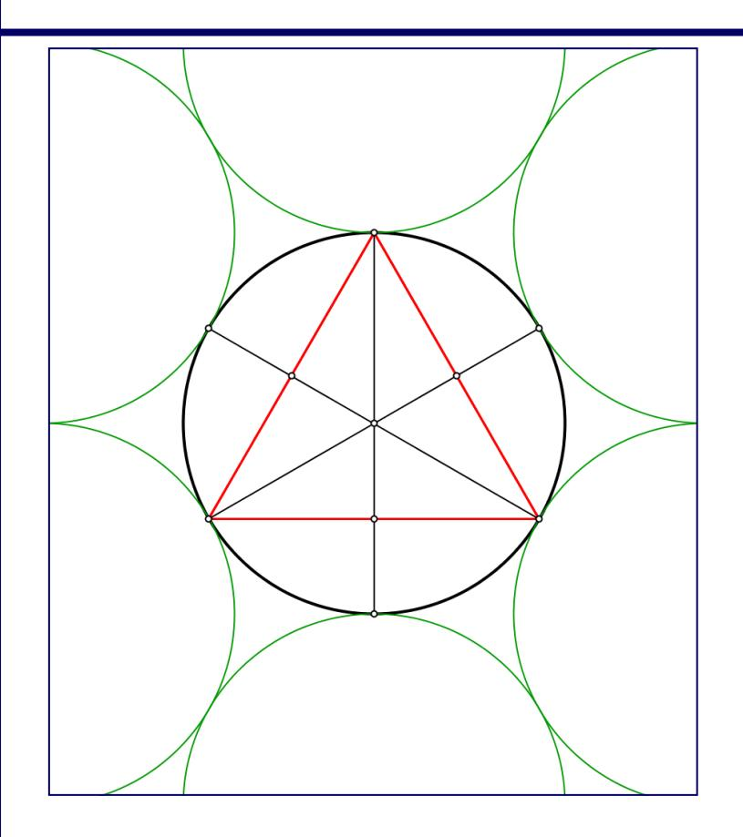

# **RESUMEN RMA-03 GEOMETRÍA I**

| Nombre   |  |
|----------|--|
| Curso    |  |
| Profesor |  |

# **ÁNGULOS**

| NOMBRE DEL ÁNGULO | MEDIDA             | FORMA |
|----------------------|--------------------|-------|
| Nulo                 |  = 0°          |       |
| Agudo                | 0° <  < 90°    |      |
| Recto                |  = 90°         |      |
| Obtuso               | 90° <  < 180°  |      |
| Extendido            |  = 180°        |      |
| Completo             | = 360°         |      |
| Convexo              | 0° <  < 180°   |      |
| Cóncavo              | 180° <  < 360° |      |

## **CLASIFICACIÓN DE LOS ÁNGULOS SEGÚN SU POSICIÓN**

| NOMBRE                                | IMAGEN           | CARACTERÍSTICA                                                                                                                                      |
|---------------------------------------|------------------|-----------------------------------------------------------------------------------------------------------------------------------------------------|
| Ángulos Consecutivos               |             | Tienen el vértice y un rayo  común que los separa, y no está uno comprendido en el otro.                                   |
| Ángulos Adyacentes                 |             | Tienen el vértice y un rayo en  común. Los otros dos rayos están en una recta común.  Son consecutivos.   +  = 180° |
| Ángulos Opuestos por el Vértice |     |  Se forman al intersectar dos rectas y son congruentes.                                                                       |

#### **OBSERVACIONES:**

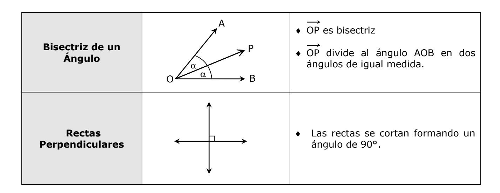

### **ÁNGULOS FORMADOS POR DOS RECTAS PARALELAS CORTADAS POR UNA TRANSVERSAL**

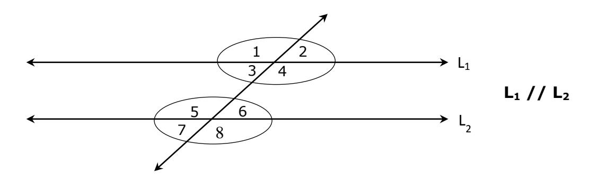

|                     | Internos: 3 con 6 4 con 5 |                    |
|---------------------|-------------------------------------------|--------------------|
| Ángulos Alternos    | Externos: 1 con 8 2 con 7       | Son congruentes    |
|                     |                                           |                    |
|                     |  1 con 5                            |                    |
| Ángulos             |  2 con 6                            | Son congruentes    |
| Correspondientes    |  3 con 7                            |                    |
|                     | 4 con 8                             |                    |
|                     |  1 , 3 , 5 y 7                    |                    |
| Ángulos Colaterales |  2 , 4 , 6 y 8                 | Son suplementarios |

#### **OBSERVACIÓN:**

Los Ángulos Alternos y Ángulos Correspondientes son congruentes entre sí.

| Ángulos | Complementarios |  Suman 90°  Complemento de  = 90° -   | 90 -    |
|---------|-----------------|-------------------------------------------------------------|--------------|
|         | Suplementarios  |  Suman 180°  Suplemento de  = 180° -  | 180 -   |

# **TRIÁNGULOS**

| TEOREMA                                                                           | IMAGEN | SE CUMPLE                                  |
|-----------------------------------------------------------------------------------|--------|--------------------------------------------|
| Suma de los ángulos interiores                                                 | β      | $\alpha + \beta + \gamma = 180^{\circ}$    |
| Suma de los ángulos exteriores (adyacentes a los ángulos interiores)     | β΄     | $\alpha' + \beta' + \gamma' = 360^{\circ}$ |
| Relación entre dos ángulos interiores y el exterior no adyacente a ellos | β      | $\alpha + \beta = \gamma'$                 |
| Observación                                                                       | Y Y'   | $\gamma + \gamma' = 180^{\circ}$           |

# **CLASIFICACIÓN DE TRIÁNGULOS**

|                       | NOMBRE     | CONDICIÓN                    | REPRESENTACIÓN GRÁFICA | CONSECUENCIAS DE LA CLASIFICACIÓN |
|-----------------------|------------|------------------------------|---------------------------|--------------------------------------|
| Según sus Lados | Equilátero | Tres lados congruentes |                           |     = 60°            |
|                       | Isósceles  | Dos lados congruentes  | Base                      | C    A B Base   |
|                       | Escaleno   | Sin lados congruentes     |                  |         |

#### **Observación:**

Si un triángulo tiene dos lados de igual medida dicho triángulo es al menos isósceles, pues si el tercer lado es de igual medida que los otros dos, entonces será equilátero.

|                      | NOMBRE      | CONDICIÓN                  | REPRESENTACIÓN GRÁFICA                                               |
|----------------------|-------------|----------------------------|----------------------------------------------------------------------|
|                      | Acutángulo  | Tres ángulos agudos     | 0° <  < 90° 0° <  < 90° 0° <  < 90°    |
| Según sus Ángulos | Rectángulo  | Un ángulo recto            |  +  = 90°                                            |
|                      | Obtusángulo | Un ángulo obtuso () |  90° <  < 180°                                               |

#### **OBSERVACIONES:**

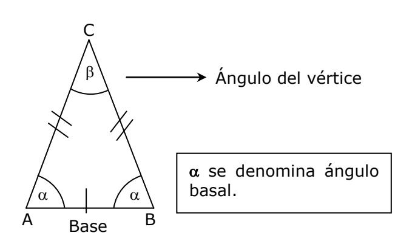

#### **Triángulo Isósceles: Triángulo rectángulo**

 Catetos: AB y AC (forman el ángulo recto)

 Hipotenusa: BC

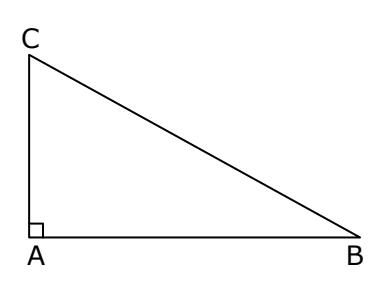

#### **DESIGUALDAD TRIANGULAR**

En todo triángulo, el tercer lado siempre mide menos que la suma de los otros dos, y, más que la diferencia positiva de esos mismos dos lados.

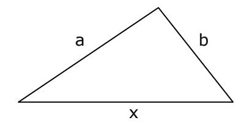

$$|\mathbf{a} - \mathbf{b}| < \mathbf{x} < \mathbf{a} + \mathbf{b}$$

#### **RELACIÓN ENTRE EL LADO DE UN TRIÁNGULO Y EL ÁNGULO QUE SE OPONE A ÉSTE**

"A mayor lado, mayor es el ángulo que se opone a dicho lado y viceversa"

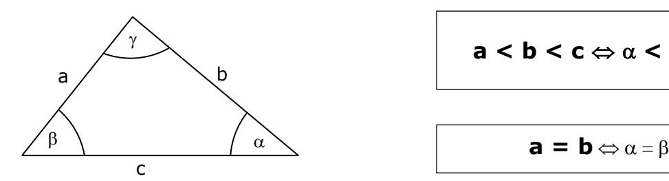

$$\mathbf{a} < \mathbf{b} < \mathbf{c} \Leftrightarrow \alpha < \beta < \gamma$$

$$\mathbf{a} = \mathbf{b} \Leftrightarrow \alpha = \beta$$

### **CONGRUENCIA DE TRIÁNGULOS ABC PQR**

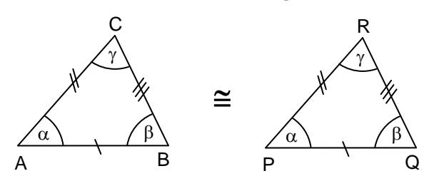

#### **POSTULADOS DE CONGRUENCIA**

| POSTULADO            | REPRESENTACIÓN GRÁFICA                                        |
|----------------------|---------------------------------------------------------------|
| ALA                  | C R      B Q A P           |
| LAL                  | C R    B Q A P                     |
| LLL                  | C R  B Q A P                               |
| LLA> con a > b | C R b b a a    B Q A P |

| ELEMENTOS SECUNDARIOS DEL TRIÁNGULO  |                           |                              |                                                                                                          |                                                                                                                           |
|--------------------------------------|---------------------------|------------------------------|----------------------------------------------------------------------------------------------------------|---------------------------------------------------------------------------------------------------------------------------|
| NOMBRE                               | REPRESENTACIÓN GRÁFICA | PUNTO SINGULAR            | DEFINICIÓN                                                                                               | OBSERVACIONES                                                                                                             |
| Altura (h)                           | h                         | Ortocentro (H)            | Cae desde un vértice y forma un ángulo de 90° con la recta que contiene al lado opuesto.                 | <ul> <li>La altura puede caer sobre el triángulo.</li> <li>h</li> <li>La altura puede caer fuera del triángulo</li> </ul> |
| Bisectriz (b)                     | b a a               | Incentro (I)                 | Divide al ángulo en dos ángulos congruentes.                                                       | "I" equidista de los lados del triángulo. R I P I P I P I P I P I P I R I R I R I                                   |
| Transversal de Gravedad (t) | t                         | Centro de Gravedad (G) | Segmento que se origina desde un vértice e intersecta en el punto medio del lado opuesto. | El punto "G" divide a la transversal en razón 2:1.                                                                        |
| Simetral (S)                      | S                         | Circuncentro (O)          | Recta perpendicular, exactamente en el punto medio, de un lado del triángulo.             | "O" equidista de los vértices del triángulo.  P  Q  OP = OR = OQ                                                          |
| Mediana (MN)                      | M N A B                   | No hay                       | Segmento que une los puntos medios de dos lados de un triángulo.                                         | ♦ $\overline{MN}$ // $\overline{AB}$ ♦ Mediana = $MN = \frac{AB}{2}$                                                      |

#### **OBSERVACIONES**

#### **TRIANGULO EQUILÁTERO**

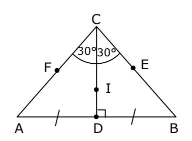

- Coinciden todos los elementos secundarios.
- CD = Altura = Bisectriz = Transversal de Gravedad = Simetral
- D, E y F son puntos medios, entonces CD = BF = AE
- Coinciden todos los puntos singulares: H = I = G = O

#### **TRIANGULO ISÓSCELES**

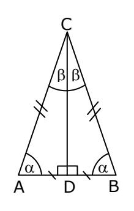

- Solo coinciden los elementos secundarios que caen a la base.
- CD = Altura = Bisectriz =Transversal de Gravedad = Simetral

# **POLÍGONOS**

|           | CLASIFICACIÓN | REPRESENTACIÓN GRÁFICA | OBSERVACIÓN                                         |
|-----------|---------------|---------------------------|-----------------------------------------------------|
| POLÍGONOS | Cóncavo       |                           | Al menos un ángulo interior mide más de 180°     |
|           | Convexo       |                           | Todos sus ángulos interiores miden menos de 180° |

|                                 | PROPIEDADES Y CARACTERÍSTICAS                                                                                                                                                                                                                                      |  |  |
|---------------------------------|--------------------------------------------------------------------------------------------------------------------------------------------------------------------------------------------------------------------------------------------------------------------|--|--|
| POLIGONOS CONVEXOS (n lados) |  Diagonales desde un vértice: n – 3 n(n 3)   Cantidad total de diagonales: 2  Suma de los ángulos interiores: 180° (n – 2)  Suma de los ángulos exteriores: 360°                                                 |  |  |
| POLIGONO REGULAR (n lados)   |  Polígono convexo  Todos sus lados son congruentes  Todos sus ángulos interiores son congruentes  Todos sus ángulos exteriores son congruentes 360° Ángulo exterior: ' =  n Ángulo interior:  = 180° - '  |  |  |

| OBSERVACION                                                                                                                               | EJEMPLO     |
|-------------------------------------------------------------------------------------------------------------------------------------------|-------------|
| En un polígono regular, al trazar todas las diagonales desde un vértice, éstas dividen al ángulo interior en ángulos congruentes.   |    |
| El Hexágono regular es el único polígono regular que se puede subdividir en 6 triángulos equiláteros congruentes. |             |
| Los otros polígonos regulares se subdividen en triángulos isósceles.                                                                   |             |

# **CUADRILÁTEROS (CONVEXOS)**

| TEOREMAS BÁSICOS DE CUADRILÁTEROS    |       |                                                      |
|--------------------------------------|-------|------------------------------------------------------|
| Suma de los ángulos interiores    | δ B   | $\alpha + \beta + \gamma + \delta = 360^{\circ}$     |
| Suma de los ángulos exteriores | δ' β' | $\alpha' + \beta' + \gamma' + \delta' = 360^{\circ}$ |

|               | CLASIFICACIÓN  |                                                                                      | <b>OBSERVACIÓN</b>           |
|---------------|----------------|--------------------------------------------------------------------------------------|------------------------------|
|               | Paralelogramos | <ul><li>◆ Cuadrado</li><li>◆ Rombo</li><li>◆ Rectángulo</li><li>◆ Romboide</li></ul> | Dos pares de lados paralelos |
| CUADRILÁTEROS | Trapecios      | <ul><li>◆ Escaleno</li><li>◆ Isósceles</li><li>◆ Rectángulo</li></ul>                | Un par de lados paralelos |
|               | Trapezoides    | <ul><li>◆ Asimétrico</li><li>◆ Simétrico</li><li>(Deltoide)</li></ul>                | Sin lados paralelos          |

|        | PROPIEDADES DE LOS PARALELÓGRAMOS                             |                    |                                                                                               |
|--------|------------------------------------------------------------------|--------------------|-----------------------------------------------------------------------------------------------|
|        | PARA TODOS LOS PARALELÓGRAMOS                                 | CASOS PARTICULARES |                                                                                               |
|       | Lados opuestos congruentes                                       | Cuadrado           | Diagonales perpendiculares   Diagonales bisectrices  Diagonales congruentes |
|   | Ángulos opuestos congruentes Ángulos contiguos suplementarios | Rombo              |  Diagonales perpendiculares  Diagonales bisectrices                                |
|       | Las diagonales se dimidian                                       | Rectángulo         | Diagonales congruentes                                                                    |

|                                                                                                                                                       | CLASIFICACIÓN Y REPRESENTACIÓN                                   | OBSERVACIONES Y PROPIEDADES                                                                              |
|-------------------------------------------------------------------------------------------------------------------------------------------------------|---------------------------------------------------------------------|-------------------------------------------------------------------------------------------------------------|
| TRAPECIOS                                                                                                                                             | GRÁFICA                                                             |                                                                                                             |
| D C     A B ( AB // DC )  Ángulos colaterales                                                       | Escalenos D C     A B AB // DC | Todos los lados son distintos   Todos los ángulos interiores son distintos              |
| suplementarios:  +  = 180°  +  = 180°  Se llama Base a cada uno de los lados paralelos ( AB // DC ) | Isósceles D C     A B AB // DC |  Dos pares de ángulos basales  Ángulos opuestos suplementarios  Diagonales congruentes |
|                                                                                                                                                       | Rectángulo D C   A B AB // DC          |  Uno de sus lados no paralelos es perpendicular a ambas bases                                     |

|             | CLASIFICACIÓN Y REPRESENTACIÓN GRÁFICA                    | OBSERVACIONES Y PROPIEDADES                                                                                                    |
|-------------|--------------------------------------------------------------|-----------------------------------------------------------------------------------------------------------------------------------|
|             | Asimétrico                                                   |  Suma de los ángulos interiores igual a 360°                                                                               |
| Trapezoides | Simétrico (Deltoide)         | Diagonales diferentes   Diagonales perpendiculares  Una diagonal es bisectriz y simetral de la otra diagonal |

#### **CIRCUNFERENCIA**

# **CONCEPTOS BÁSICOS:**

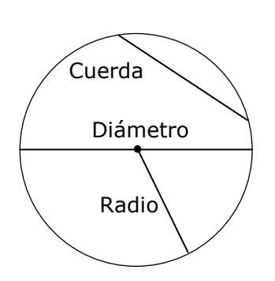

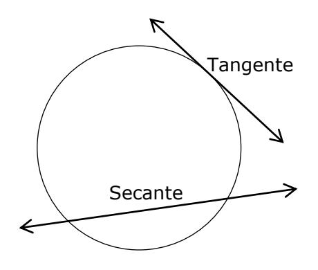

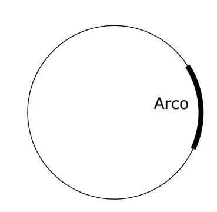

| TIPO DE ÁNGULO       | REPRESENTACIÓN GRÁFICA | RELACIÓN DEL ÁNGULO CON EL ARCO QUE SUBTIENDE |
|-------------------------|---------------------------|-----------------------------------------------------|
| Ángulo del Centro       |                          |                                                |
| Ángulo Inscrito         |                          |  2                                             |
| Ángulo Semi-inscrito | A B                | A B  2                                   |
| Ángulo Interior         | x                         |  +  x = 2  x               |
| Ángulo Exterior         | x                         |     x = 2  x                    |

#### **TEOREMAS**

| Teorema 1 |  2 2         | Todo ángulo inscrito mide la mitad del ángulo del centro si subtienden el mismo arco.                                                                                   |
|--------------|-----------------------|----------------------------------------------------------------------------------------------------------------------------------------------------------------------------|
| Teorema 2 | C D B A      | Cuerdas paralelas determinan arcos congruentes entre ellas. AB // CD  arco CA  arco BD                                                     |
| Teorema 3 |    O      | Todos los ángulos inscritos que subtienden el mismo arco son congruentes.                                                                                            |
| Teorema 4 | O Diámetro         | Todo ángulo inscrito en una circunferencia que subtiende un arco de 180° es recto.                                                                                      |
| Teorema 5 |  O    | En todo cuadrilátero inscrito en una circunferencia, los ángulos opuestos son suplementarios.  +  = 180°  +  = 180° |
| Teorema 6 | O                     | Un radio siempre es perpendicular a la tangente en el punto de tangencia.                                                                                               |

| Teorema 7  | A B b P b | Si desde un punto P se trazan dos tangentes, los segmentos que unen P con los puntos de tangencia son congruentes.  PA PB |
|---------------|-----------------------|----------------------------------------------------------------------------------------------------------------------------------------------------|
| Teorema 8  |  O            | Un ángulo inscrito mide lo mismo que un ángulo semi-inscrito si subtienden el mismo arco.                                                    |
| Teorema 9  | O                     | Cuerdas congruentes determinan arcos congruentes. //  arco AD  arco BC AD BC                                    |
| Teorema 10 | W                     | Todo radio perpendicular a una cuerda, biseca a la cuerda y al arco correspondiente.                                             |
| Teorema 11 | b c a d      | En todo cuadrilátero circunscrito a una circunferencia, la suma de cada par de lados opuestos es la misma. a + c = b + d   |

# **TEOREMA DE PITÁGORAS**

En todo triángulo rectángulo, el cuadrado de la longitud de la hipotenusa es igual a la suma de los cuadrados de las longitudes de los catetos.

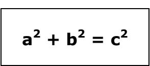

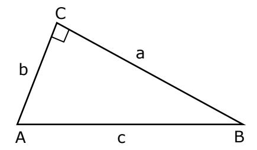

#### **Tríos Pitagóricos**

| Cateto 1 | Cateto 2 | Hipotenusa |
|----------|----------|------------|
| 3        | 4        | 5          |
| 5        | 12       | 13         |
| 8        | 15       | 17         |

| Cateto 1 | Cateto 2 | Hipotenusa         |
|----------|----------|--------------------|
| a        | a        | 2 a             |
| a        | 2a       | 5 a             |
| a        | 3a       | 10 a            |
| a        | 4a       | 17 a            |
| a        | ka       | 2 k + 1 a |

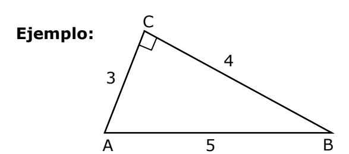

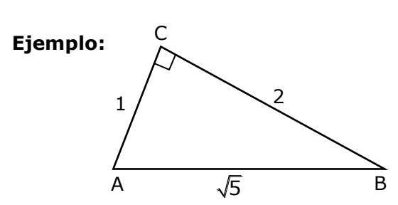

# **TRIÁNGULOS NOTABLES**

**Triángulo 30°-60°-90°**

| Cateto 1 | Cateto 2 | Hipotenusa |
|----------|----------|------------|
| a        | 3 a   | 2a         |

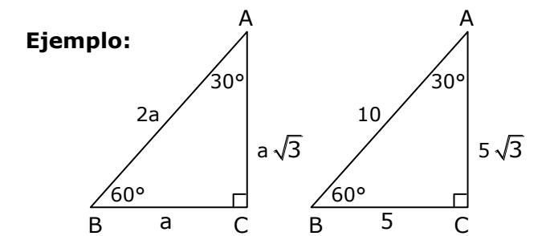

# **Triángulo Rectángulo Isósceles**

| Cateto 1 | Cateto 2 | Hipotenusa |
|----------|----------|------------|
| a        | a        | 2 a     |

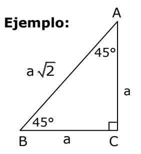

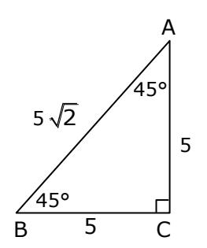

# **TRIÁNGULOS**

| ÁREAS Y PERÍMETROS      |                                                      |               |                                                                             |  |  |  |  |  |
|-------------------------|------------------------------------------------------|---------------|-----------------------------------------------------------------------------|--|--|--|--|--|
| NOMBRE                  | FIGURA                                               | PERÍMETRO     | ÁREA                                                                        |  |  |  |  |  |
| Triángulo               | b h a h c h b A c B | P = a + b + c | $A = \frac{a \cdot h_a}{2} = \frac{b \cdot h_b}{2} = \frac{c \cdot h_c}{2}$ |  |  |  |  |  |
| Triángulo Equilátero | a h a a                                              | P = 3a        | $A = \frac{a^2 \sqrt{3}}{4}$ Observación: $h = \frac{a\sqrt{3}}{2}$         |  |  |  |  |  |
| Triángulo Rectángulo | B h c C A a C                       | P = a + b + c | $A = \frac{ab}{2} = \frac{c \cdot h_c}{2}$                                  |  |  |  |  |  |

# **CUADRILÁTEROS**

| NOMBRE     | FIGURA                                                        | PERÍMETRO           | ÁREA                                                                               |
|------------|---------------------------------------------------------------|---------------------|------------------------------------------------------------------------------------|
| Cuadrado   | a d a d a a                                                   | ◆ P = 4a            | $  A = a^2 $ $  A = \frac{d^2}{2} $                                                |
| Rectángulo | a b b                                                      | ◆ P = 2a + 2b       | ◆ A = a · b                                                                        |
| Rombo      | $ \begin{array}{c} a \\ h \\                                $ | ◆ P = 4a            | $  A = h \cdot a $ $  A = \frac{d_1 \cdot d_2}{2} $                                |
| Romboide   | $\begin{array}{c} a \\ b \\ h_1 \\ \end{array}$               | ◆ P = 2a + 2b       | $  A = a \cdot h_1 $ $  A = b \cdot h_2 $                                          |
| Trapecio   | c d h b m a                                             | ◆ P = a + b + c + d | $A = \left(\frac{a+c}{2}\right) \cdot h$ $A = m \cdot h$ $donde m = \frac{a+c}{2}$ |

# **CIRCUNFERENCIA Y CÍRCULO**

| NOMBRE                      | FIGURA | PERÍMETRO                                                                                                 | ÁREA                   |
|-----------------------------|--------|-----------------------------------------------------------------------------------------------------------|------------------------|
| Circunferencia y Círculo | 0 • r  | • $P = D \cdot \pi$ • $P = 2 \cdot \pi \cdot r$ D: diámetro                                               | $  A = \pi \cdot r^2 $ |
| Sector Circular             | O r B  | • P = Arco AB + 2r  Donde:  Arco AB = $\left(\frac{\alpha}{360^{\circ}}\right) \cdot 2 \cdot \pi \cdot r$ |                        |