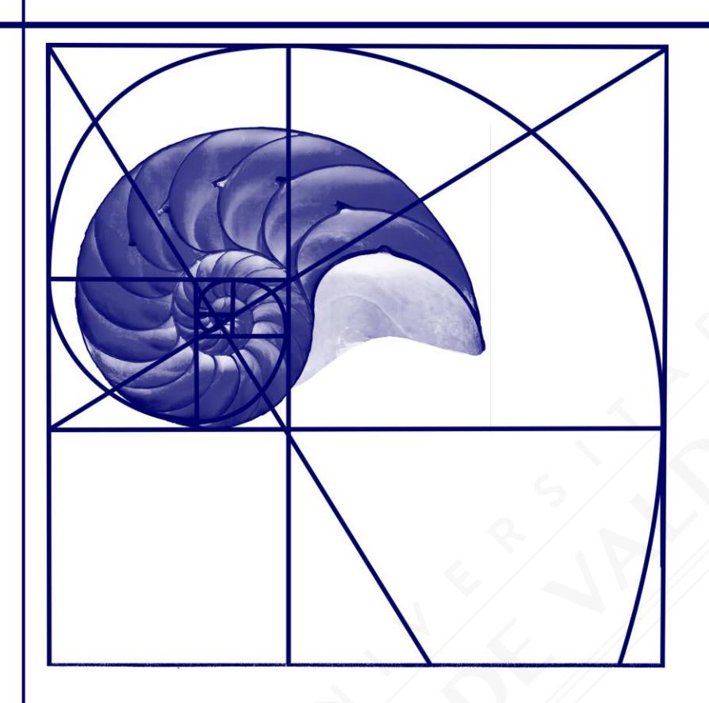

# **RESUMEN RMA-04 GEOMETRÍA II**

| Nombre   |  |
|----------|--|
| Curso    |  |
| Profesor |  |

# **Figuras Semejantes**

Dos figuras son semejantes si sus lados homólogos son proporcionales y sus ángulos correspondientes son congruentes.

| SEMEJANZA DE TRIÁNGULOS                      |                                                          |  |
|----------------------------------------------|----------------------------------------------------------|--|
| ΔABC ~ ΔPQR si y solo si                     |                                                          |  |
| ∡A ≅ ∡P                                      |                                                          |  |
| ∡B ≅ ∡Q                                      | $rac{R}{\sqrt{\gamma}}$                                  |  |
| ∡C ≅ ∡R                                      | Y                                                        |  |
| Lados homólogos proporcionales  AB _ BC _ CA | $\alpha$ $\beta$ $\beta$ $\beta$ $\beta$ $\beta$ $\beta$ |  |
| ${PQ} - {QR} - {RP}$                         | АВР                                                      |  |

| TEOREMA FUNDAMENTAL  Si ∡A ≅ ∡P ; ∡B ≅ ∡Q, entonces ΔABC ~ ΔPQR          | $ \begin{array}{c cccc} C & R \\ \hline A & B & P & Q \end{array} $ |
|--------------------------------------------------------------------------|---------------------------------------------------------------------|
| Corolario 1 Si DE // AB, entonces ΔABC ~ ΔDEC                            | C β Ε Α Α Α Β                                                       |
| Corolario 2 Si ∡EDC ≅ ∡CAB, entonces ΔABC ~ ΔDEC                         | E A B                                                               |
| Corolario 3 Si $\overline{DE}$ // $\overline{AB}$ , entonces ΔABC ~ ΔDEC | $ \begin{array}{cccccccccccccccccccccccccccccccccccc$               |

#### **CRITERIOS DE SEMEJANZA**

LAL (Lado-Ángulo-Lado)

Si 
$$\angle A \cong \angle P$$
 y  $\frac{AC}{PR} = \frac{AB}{PO}$ ,

entonces ∆ABC ~ ∆PQR

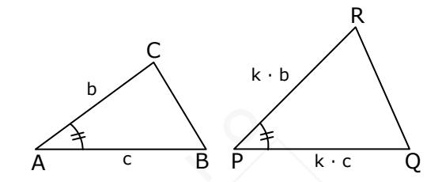

LLL (Lado-Lado -Lado)

Si 
$$\frac{AB}{PQ} = \frac{BC}{QR} = \frac{CA}{RP}$$
,

entonces  $\triangle ABC \sim \triangle PQR$ 

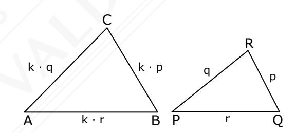

LLA> (Lado- Lado -Ángulo Mayor)

Si 
$$\angle C \cong \angle R$$
 y  $\frac{AC}{PR} = \frac{AB}{PQ}$ , donde

PQ > PR; AB > AC,

entonces  $\triangle PQR \sim \triangle ABC$ 

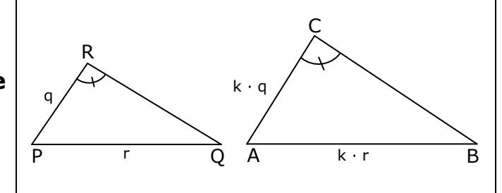

# PROPORCIONALIDAD PARA EL PERÍMETRO Y ÁREA DE TRIÁNGULOS SEMEJANTES

$$\frac{\text{Perímetro }\Delta ABC}{\text{Perímetro }\Delta A'B'C'} \; = \; \frac{b}{b'} = \frac{t_c}{t_{c'}} = \frac{h_a}{h_{a'}} \; = \; ...$$

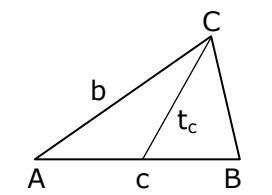

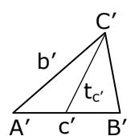

$$\frac{\text{\'Area }\Delta \text{ABC}}{\text{\'Area }\Delta \text{A'B'C'}} \ = \left(\frac{\text{b}}{\text{b'}}\right)^{\!2} = \left(\frac{\text{t}_{\text{c}}}{\text{t}_{\text{c'}}}\right)^{\!2} = \left(\frac{\text{h}_{\text{a}}}{\text{h}_{\text{a'}}}\right)^{\!2} \ = \ \dots$$

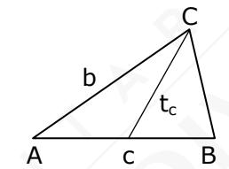

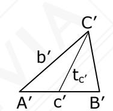

### Observación:

La proporcionalidad para el perímetro y el área es válida también en polígonos semejantes.

$$\frac{P(ABCDEF)}{P(A'B'C'D'E'F')} = \frac{a}{a'} = \frac{b}{b'} = \frac{c}{c'} = \dots$$

$$\frac{\mathbf{A}(\mathbf{ABCDEF})}{\mathbf{A}(\mathbf{A'B'C'D'E'F'})} = \left(\frac{\mathbf{a}}{\mathbf{a'}}\right)^2 = \left(\frac{\mathbf{b}}{\mathbf{b'}}\right)^2 = \left(\frac{\mathbf{c}}{\mathbf{c'}}\right)^2 = \dots$$

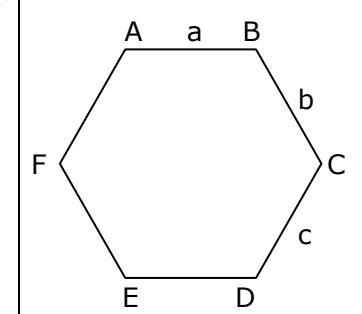

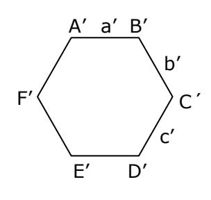

## **TEOREMA DE THALES**

Si  $L_1 // L_2 // L_3$ , entonces  $\frac{AB}{BC} = \frac{DE}{EF}$ 

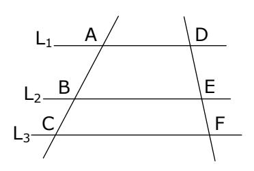

### **TEOREMA DE LA BISECTRIZ INTERIOR**

Si  $\overline{CD}$  es bisectriz, entonces  $\frac{AC}{AD} = \frac{BC}{BD}$ 

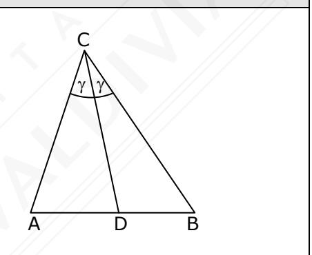

#### **TEOREMA DE EUCLIDES**

$$h_c^2 = p \cdot q$$

$$b^2 = q \cdot c$$

$$a^2 = p \cdot c$$

$$h_c = \frac{a \cdot b}{c}$$

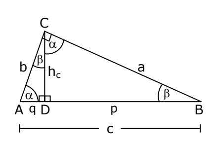

#### **TEOREMA DE LAS CUERDAS**

AB y CD cuerdas y P punto de intersección de ellas.

$$AP \cdot PB = CP \cdot PD$$

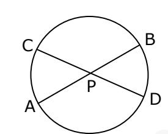

## **TEOREMA DE LAS SECANTES**

AP y BP secantes, con C y D puntos de intersección con la circunferencia.

$$AP \cdot CP = BP \cdot DP$$

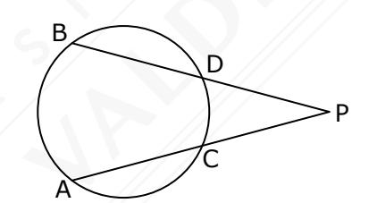

#### **TEOREMA DE LA TANGENTE Y LA SECANTE**

TP tangente y AP secante a la circunferencia.

$$TP^2 = AP \cdot BP$$

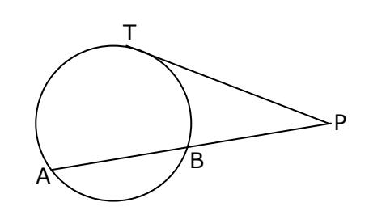

# **DIVISIÓN DE TRAZOS**

# **DIVISIÓN INTERNA**

$$\frac{AP}{PB} = \frac{m}{n}$$

Donde:

$$AP = mt$$

$$PB = nt$$

$$AB = (m + n) \cdot t$$

t = constante

# 0

# **DIVISIÓN ÁUREA O DIVINA**

#### Número áureo

$$\varphi = \frac{AB}{AP} = \frac{1+\sqrt{5}}{2} \approx 1,618034$$

Si  $\frac{AB}{AP} = \frac{AP}{PB}$ , con PA > PB, entonces la razón  $\frac{AB}{AP}$ , se denomina razón áurea.

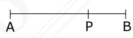

# **ISOMETRÍAS**

#### **TRASLACIONES**

Al  $\triangle$ ABC de la figura se le aplicó una traslación de vector  $\overrightarrow{t}$  obteniéndose el  $\triangle$ A'B'C'.

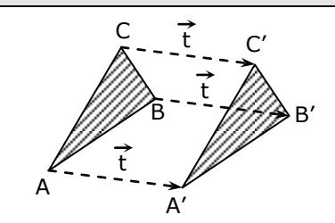

#### **OBSERVACIONES**:

- ♦ Una figura que se traslada jamás rota, es decir, el ángulo que forma con la horizontal no varía.
- ♦ No importa el número de traslaciones que se realicen siempre es posible resumirlas en una única traslación.

| ROTACIONES                                               |                                                                                            |  |
|----------------------------------------------------------|--------------------------------------------------------------------------------------------|--|
| Rotación en 90° (antihoraria) respecto del origen  | y 90° x R(0,90°) se tiene A(x,y)  A'(-y, x)                             |  |
| Rotación en 180° (antihoraria) respecto del origen | y 180° x R(0,180°) se tiene A(x,y)  A'(-x, -y)                                |  |
| Rotación en 270° (antihoraria) respecto del origen    | y 270° x R(0,270°) se tiene A(x,y)  A'(y, -x) R(0,270°) = R(0, -90°) |  |

# **SIMETRÍAS**

# **SIMETRÍA CENTRAL**

## **O**: **Centro de simetría**

$$OP = OP'$$

$$OQ = OQ'$$

$$OR = OR'$$

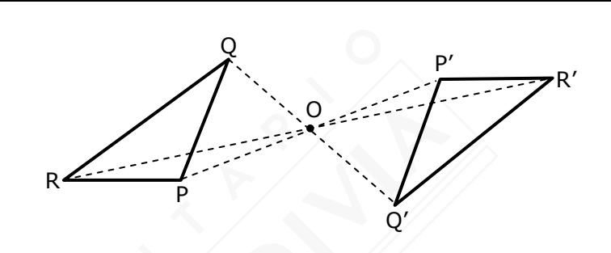

#### **Observación**:

Una simetría central es equivalente a una rotación en 180°.

# **SIMETRÍA AXIAL**

$$OP = OP'$$
  $L \perp \overline{PP}'$ 

$$O'Q = O'Q' \quad y \quad L \perp \overline{QQ}'$$

$$O''R = O''R'$$
  $L \perp \overline{RR}'$ 

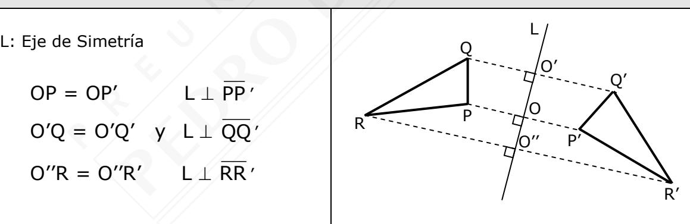

#### **Observaciones**:

- No es posible superponer mediante traslaciones y/o rotaciones, los triángulos congruentes PQR y P'Q'R'.
- Los puntos de la recta L permanecen invariantes ante una reflexión.

# **EJE DE SIMETRÍA**

- Existen figuras que no tienen ejes de simetría.
- Existen figuras que tienen solo un eje de simetría.
- Existen figuras que tienen más de un eje de simetría.
- La circunferencia tiene infinitos ejes de simetría.

Un eje de simetría

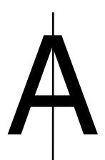

Dos ejes de simetría

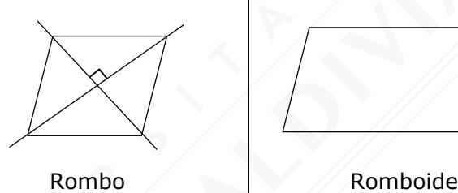

No tiene ejes de simetría

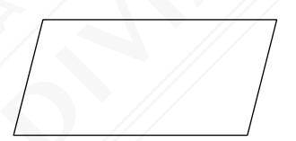

# **CENTRO DE SIMETRÍA**

- El centro de simetría es único.
- No todas las figuras tienen centro de simetría.
- En una circunferencia el centro de simetría es el centro de la circunferencia.
- Los triángulos no tienen centro de simetría.
- Todos los paralelógramos tienen centro de simetría.

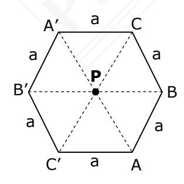

P centro de simetría

$$\overline{\mathsf{A'P}} \cong \overline{\mathsf{PA}}$$

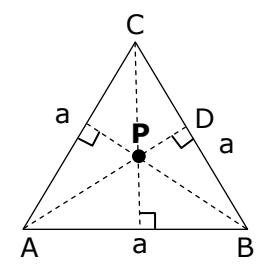

P no es centro de simetría

$$\overline{AP} \not \equiv \overline{PD}$$