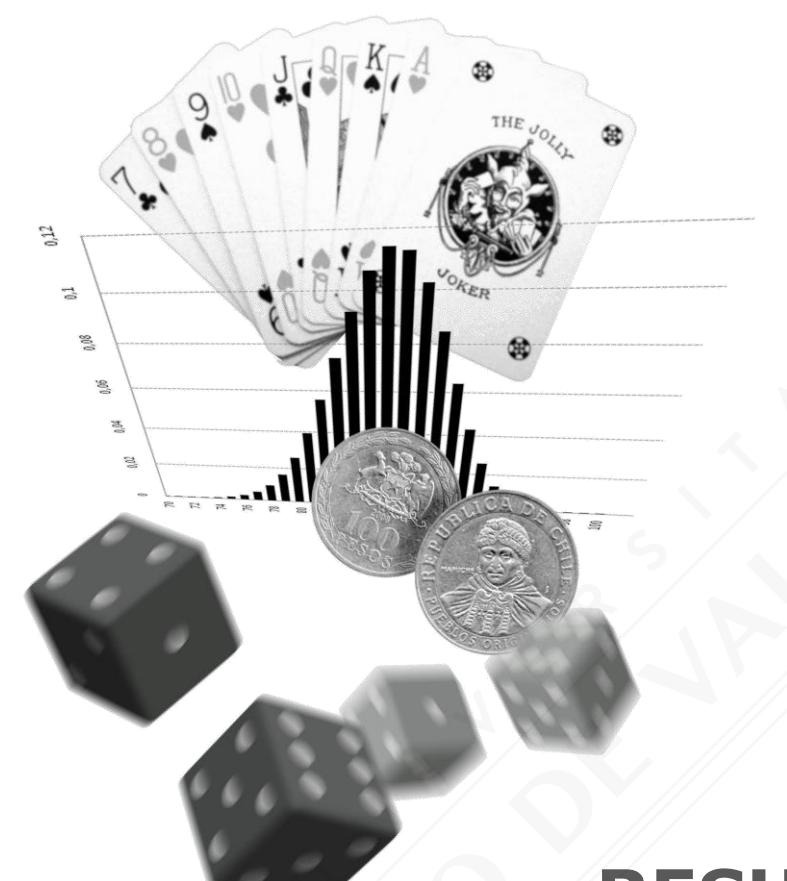
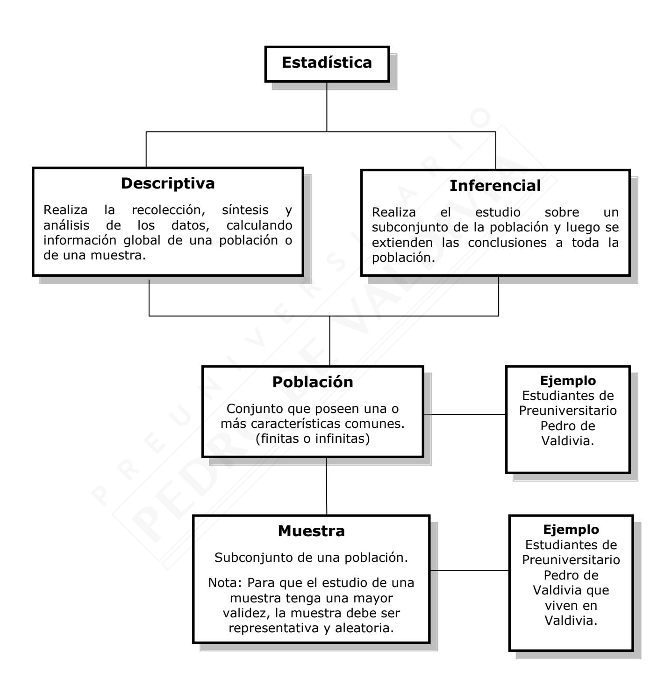
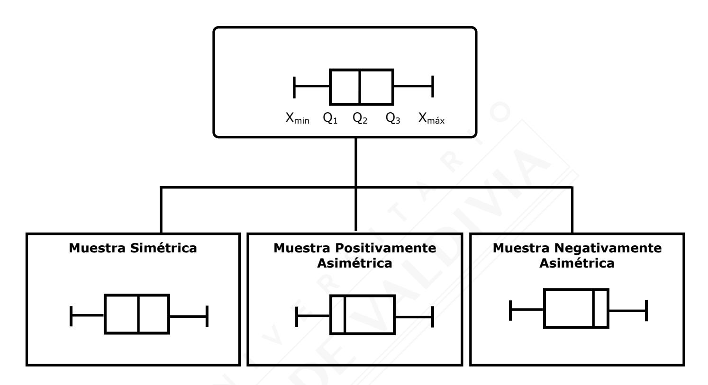
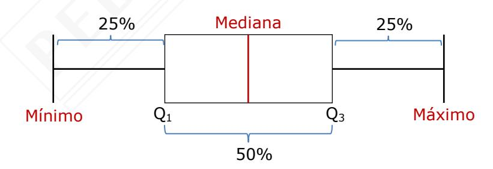
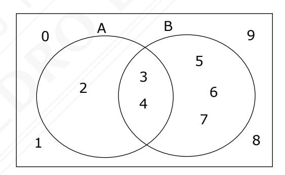

# **RESUMEN RMA-05 PROBABILIDADES Y ESTADÍSTICA**

| Nombre   |  |
|----------|--|
|          |  |
| Curso    |  |
|          |  |
| Profesor |  |

## **ESTADÍSTICA**

| Definición | Tipo                                                                 | Subtipo                                                         | Ejemplos                                                            |
|------------|----------------------------------------------------------------------|-----------------------------------------------------------------|---------------------------------------------------------------------|
| Variable   | Variable cualitativa                                              | Nominal  Listado Nómina Los resultados no se pueden jerarquizar | <ul><li>◆ Estado civil</li><li>◆ Sexo</li></ul>                     |
|            | <ul><li>◆ Característica o atributo.</li><li>◆ No medible.</li></ul> | Ordinal  Orden intuitivo Los resultados se pueden jerarquizar   | <ul><li>Nivel educacional</li><li>Rango militar</li></ul>           |
|            | Variable cuantitativa                                             | Discreta  ◆ Los datos se pueden medir                           | <ul> <li>Número de hijos</li> <li>Número de mascotas</li> </ul> |
| 8          | ◆ Resultado de una medición o conteo.                          | Continua  Los datos se pueden medir                             | <ul><li>Masa</li><li>Estatura</li></ul>                             |

#### **MEDIDAS DE TENDENCIA CENTRAL**

#### Para datos discretos

Si n es el número de datos de la muestra.

Sea  $X = x_i$  el valor que toma la variable para todo i = 1, 2, ...., n

Sea  $f_i$  la frecuencia i- ésima con la cual se repite el valor  $X = x_i$  en el conjunto de datos, válido para i = 1, 2, ....n.

#### Para datos continuos tabulados

Si n es el número de intervalos o clases presentes.

Sea  $c_i$  la de clase representativo para el intervalo o clase i-ésima, válido para todo i=1,2,....n.

Sea  $f_i$  la frecuencia del i-ésimo intervalo, para todo i = 1, 2, ....n.

|                                                            | Datos no agrupados                                  | $\bar{x} = \frac{x_1 + x_2 + x_3 + + x_n}{n}$                                                                                                                     |
|------------------------------------------------------------|-----------------------------------------------------|-------------------------------------------------------------------------------------------------------------------------------------------------------------------|
| Media Aritmética o Promedio                          | Datos agrupados en tabla                         | $\overline{x} = \frac{x_1 \cdot f_1 + x_2 \cdot f_2 + x_3 \cdot f_3 + \dots + x_n \cdot f_n}{f_1 + f_2 + f_3 + \dots + f_n}$                                      |
|                                                            | Datos agrupados en intervalos                       | $\overline{x} = \frac{c_1 \cdot f_1 + c_2 \cdot f_2 + c_3 \cdot f_3 + \dots + c_n \cdot f_n}{f_1 + f_2 + f_3 + \dots + f_n}$                                      |
| Mediana  Dato que ocupa la posición central de la muestra. | Datos no agrupados y datos agrupados en tabla | ♦ Si n es un número par: $Me = \frac{x_{\frac{n}{2}} + x_{\frac{n+1}{2}}}{2}$ ♦ Si n es un número impar: $Me = x_{\frac{n+1}{2}}$                                 |
| Moda  Dato(s) con mayor frecuencia absoluta.               | Datos no agrupados y datos agrupados en tabla | Dato(s) que más se repite(n)  Cuando los datos se agrupan en una tabla de intervalos, se habla de intervalo modal y corresponde al intervalo de mayor frecuencia. |

## **Ejemplo:**

Calcular la media en la siguiente tabla:

| Intervalo    | Marca de Clase | Frecuencia Absoluta |                 | F. Acumulada |
|--------------|----------------|------------------------|-----------------|--------------|
| [a, b[    | x              | f                      | x · f        | F            |
| [13 – 15[ | 14             | 7                      | 98              | 7            |
| [15 – 17[ | 16             | 8                      | 128             | 15           |
| [17 – 19[ | 18             | 5                      | 90              | 20           |
| [19 – 21[ | 20             | 3                      | 60              | 23           |
| [21 – 23[ | 22             | 2                      | 44              | 25           |
|              |                | f = 25                | x · f = 420 |              |

## **Media aritmética:**

$$\bar{x} = \frac{\sum x \cdot f}{\sum f} = \frac{420}{25} = 16.8$$

| MEDIDAS DE POSICIÓN                                     |                                                                                                                  |  |  |
|---------------------------------------------------------|------------------------------------------------------------------------------------------------------------------|--|--|
|                                                         | (CUANTILES)                                                                                                      |  |  |
| Cuartiles                                               |  3 valores  4 partes aproximadamente iguales  Cada parte representa el 25 % de los datos    |  |  |
| Quintiles                                               |  4 valores 5 partes aproximadamente iguales  Cada parte representa el 20 % de los datos  |  |  |
| Deciles                                                 |  9 valores  10 partes aproximadamente iguales  Cada parte representa el 10 % de los datos   |  |  |
| Percentiles                                             |  99 valores  100 partes aproximadamente iguales  Cada parte representa el 1 % de los datos  |  |  |
| OBS.: Los datos deben estar ordenados de menor a mayor. |                                                                                                                  |  |  |

|    | Método para determinar una Medida de Posición                                      |                               |                                                                                                                                                                 |                                 |
|----|------------------------------------------------------------------------------------|-------------------------------|-----------------------------------------------------------------------------------------------------------------------------------------------------------------|---------------------------------|
| 1° | Ordenar los datos de menor a mayor.                                                |                               |                                                                                                                                                                 |                                 |
| 2° | Determinar el lugar que ocupa la posición buscada con la forma correspondiente: |                               |                                                                                                                                                                 |                                 |
|    | Cuartil                                                                            | Quintil                       | Decil                                                                                                                                                           | Percentil                       |
|    | N + 1 PQi = i · 4                                                      | N + 1 PKi = i · 5 | N + 1 PDi = i · 10                                                                                                                                  | N + 1 PPi = i · 100 |
| 3° | Determinar la medida de posición con uno de los dos posibles resultados:           |                               |                                                                                                                                                                 |                                 |
|    | Número entero                                                                      |                               | Número decimal                                                                                                                                                  |                                 |
|    | La medida de posición buscada será el dato que ocupa ese lugar.                 |                               | La medida de posición buscada será el promedio entre el dato que se encuentra a la izquierda de la posición con el dato que se encuentra a la derecha. |                                 |

# **MEDIDAS DE DISPERSIÓN**

RANGO: diferencia entre el mayor y menor valor de la variable

| REPRESENTACIÓN GRÁFICA                               |                                                                                                                                                                                                                       |  |
|------------------------------------------------------|-----------------------------------------------------------------------------------------------------------------------------------------------------------------------------------------------------------------------|--|
| Gráfico de Barras                                 | Se utiliza para variables de tipo cualitativas y cuantitativas discretas. Consiste en una serie de barras cuyas alturas representan la frecuencia absoluta de éstos.                                      |  |
| Gráfico Circular                                  | Se utiliza en variables de tipo cualitativa y cuantitativa discreta. Consiste en un círculo dividido en secciones proporcionales al tamaño de la muestra y la frecuencia de los datos.                 |  |
| Histograma                                           | Se utiliza para la representación de los datos agrupados en intervalos. Se elabora representando a los datos en el eje horizontal y a las frecuencias en el eje vertical.                                 |  |
| Polígono de Frecuencia                            | Se utiliza en datos agrupados en intervalos. Para confeccionarlo, debemos unir con una recta los puntos donde se intersectan la marca de clase y la frecuencia de los intervalos.                      |  |
| Polígono de Frecuencias Acumuladas u Ojivas | Se representa uniendo puntos referidos al límite superior y frecuencia acumulada de cada intervalo. Para "anclar" la ojiva al eje horizontal, se posiciona en el límite inferior del primer intervalo. |  |

## **GRÁFICO DE CAJA Y BIGOTES**

En una distribución **simétrica** el gráfico de caja con bigotes presenta las siguientes características.

- En teoría el promedio, la mediana y la moda son valores coincidentes.
- En teoría la magnitud de los bigotes es la misma.

En un gráfico de caja con bigotes con distribución **asimétrica positiva**, se tienen las siguientes características.

- La mediana muestral es el mejor estimador de tendencia central. Para una función de densidad de probabilidades sesgada a la derecha se tiene que: moda < mediana < media aritmética.
- Los valores mayores de la muestra son más heterogéneos a diferencia de los valores menores, que resultan estar distribuidos en forma más compacta.
- La longitud del bigote derecho es mayor a la longitud del bigote izquierdo.

En un gráfico de caja con bigotes con distribución **asimétrica negativa**, se tienen las siguientes características.

- La mediana muestral es el mejor estimador de tendencia central. Para una función de densidad de probabilidades sesgada a la izquierda se tiene que: media aritmética < mediana < moda.
- Los valores menores de la muestra son más heterogéneos a diferencia de los valores mayores, que resultan estar distribuidos en forma más compacta.

El rango intercuartil se calcula mediante la diferencia entre el tercer cuartil y el primer cuartil, por ende, acumula un 50% de la información de la muestra. En el grafico queda representado por la longitud de la caja.

| PROBABILIDADES                       |                                                                                                 |                                                                                            |  |
|--------------------------------------|-------------------------------------------------------------------------------------------------|--------------------------------------------------------------------------------------------|--|
| Concepto                             |                                                                                                 | Ejemplo                                                                                    |  |
| Experimento Aleatorio             | Experimento cuyo resultado no se puede predecir, existiendo un conjunto de resultados posibles. | Lanzar un dado.                                                                            |  |
| Espacio muestral                     | Resultados posibles del Experimento Aleatorio.                                               | U = {1, 2, 3, 4, 5, 6}                                                                     |  |
| Evento o Suceso                      | Subconjunto del Espacio Muestral.                                                            | A = Obtener un número par A = {2, 4, 6} B = Obtener un número impar B = {1, 3, 5} |  |
| Evento Cierto                        | El propio Espacio Muestral.                                                                     | C = Obtener un número menor que 20 C = {1, 2, 3, 4, 5, 6}                            |  |
| Evento Imposible                     | No tiene elementos.                                                                             | D = Obtener un múltiplo de 10 $D = \emptyset$                                           |  |
| Eventos Mutuamente Excluyentes | No tienen elementos comunes.                                                                    | $A \cap B = \varnothing$                                                                   |  |
| Eventos Independientes            | La ocurrencia de uno no afecta la ocurrencia del otro                                           | Obtener sello al lanzar una moneda y obtener un número par al lanzar un dado.              |  |
| Eventos Complementarios           | No tienen elementos comunes y juntos completan el Espacio Muestral.                       | $A \cup B = U  y  A \cap B = \emptyset$                                                    |  |

## **PROBABILIDAD CLÁSICA O REGLA DE LAPLACE**

Para un espacio muestral finito con distribución uniforme:

$$P(A) = \frac{\text{Número de casos favorables}}{\text{Número de casos totales}}$$

#### **Observaciones:**

- 0 P(A) 1, o bien, 0% P(A) 100%
- P(A ocurra) + P(A no ocurra) = 1

#### **DIAGRAMA DE VENN**

Los diagramas de Venn permiten visualizar la cantidad de elementos de un evento y de esta forma determinar fácilmente su probabilidad clásica.

| Probabilidad    | Diagrama de Venn  | Probabilidad Clásica |
|-----------------|-------------------|-------------------------|
| <b>P( A∪B )</b> | 0 A B 9 1 2 4 8 8 | $\frac{6}{10}$          |
| <b>P(A ∩ B)</b> | A 5 9 5 9 1 7 8   | 2 10                 |
| P(A - B)        | 0 A 5 B 9 6 A 7 8 | $\frac{1}{10}$          |
| P(B – A)        | 0 A 3 B 9 A 4 B 8 | $\frac{3}{10}$          |

Página 12

## **PROBABILIDAD EMPÍRICA**

**P(A) =** Número de veces que ocurrió el evento A Número de veces que se realizó el experimento

## **LEY DE LOS GRANDES NÚMEROS**

"Si un experimento aleatorio se repite un gran número de veces, la probabilidad empírica de A se aproximará a la probabilidad teórica de que ocurra A".

## TRIÁNGULO DE PASCAL

Para variables dicotómicas, con resultados equiprobables y eventos independientes.

## **Ejemplo:**

En el experimento aleatorio "lanzar 4 monedas", la probabilidad de obtener:

- a) 3 caras
- b) 4 sellos
- c) 2 caras

$$\begin{array}{cccccccccccccccccccccccccccccccccccc$$

| Probabilidad pedida | Tomar el coeficiente que está justo sobre | Coeficiente | Probabilidad clásica |
|---------------------|-------------------------------------------|-------------|-------------------------|
| P(3 Caras)          | <b>C</b> 3 S 1      | $C_3^4 = 4$ | $\frac{4}{16}$          |
| P(4 Sellos)         | C 0 <b>S</b> 4      | $C_4^4 = 1$ | $\frac{1}{16}$          |
| P(2 Caras)          | C 2 S 2             | $C_2^4 = 6$ | $\frac{6}{16}$          |

## **PROBABILIDAD DE EVENTOS**

|          | Eventos Excluyentes            |                                                     |  |
|----------|--------------------------------|-----------------------------------------------------|--|
|          |  A  B =            | P(A B) = P(A) + P(B)                         |  |
| P(A o B) |  No hay elementos comunes. |                                                     |  |
|          | Eventos NO excluyentes         | P(A  B) = P(A) + P(B) – P(A  B) |  |
|          |  Hay elementos comunes.    |                                                     |  |

|          | Eventos Independientes  Un evento no influye en la ocurrencia del otro                                                                                                                                                                                                                                       | P(A  B) = P(A) · P(B)   |
|----------|------------------------------------------------------------------------------------------------------------------------------------------------------------------------------------------------------------------------------------------------------------------------------------------------------------------------|-----------------------------------|
| P(A y B) | Eventos Dependientes  La ocurrencia del primer evento influye en la ocurrencia del segundo, es decir, con la ocurrencia del primero se ve afectado el espacio muestral para la ocurrencia del segundo.  P(B/A), se lee, la probabilidad de B habiendo ocurrido A. | P(A  B) = P(A) · P(B/A) |