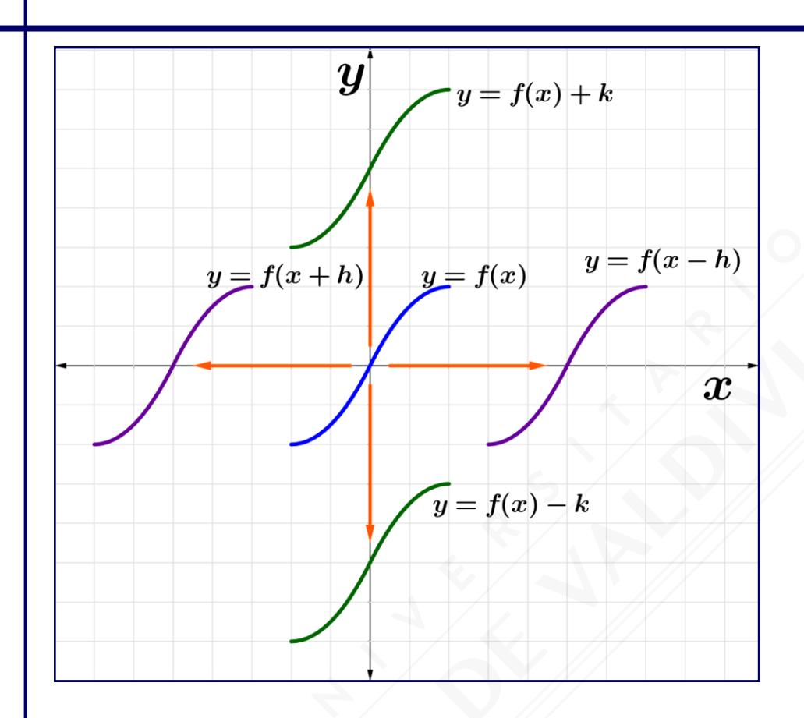
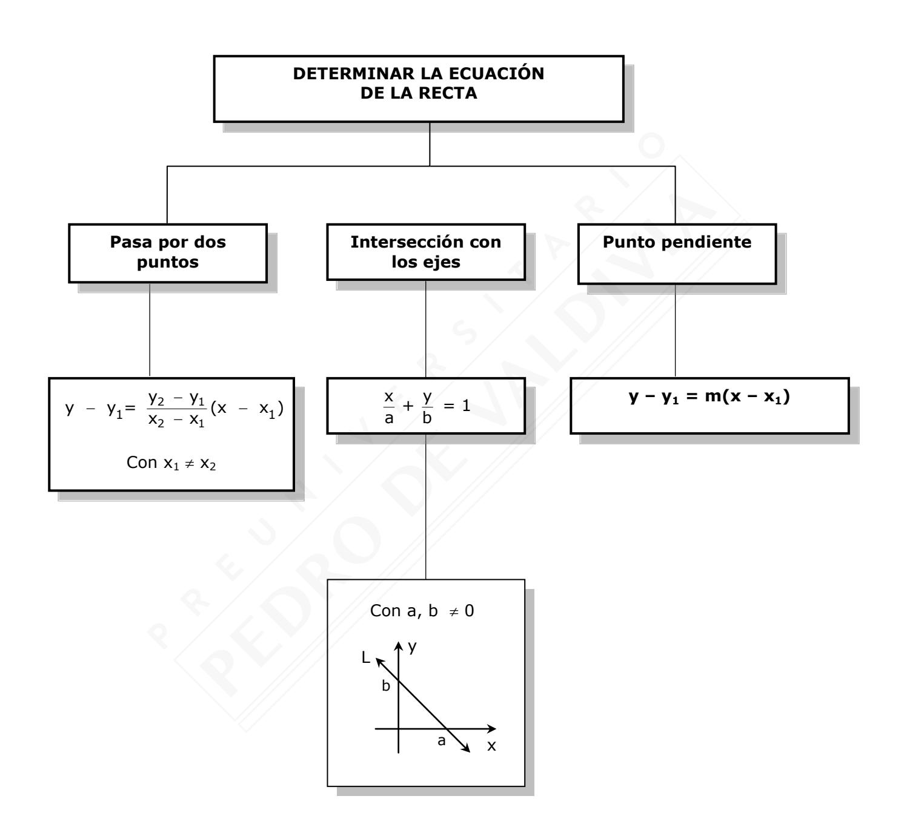
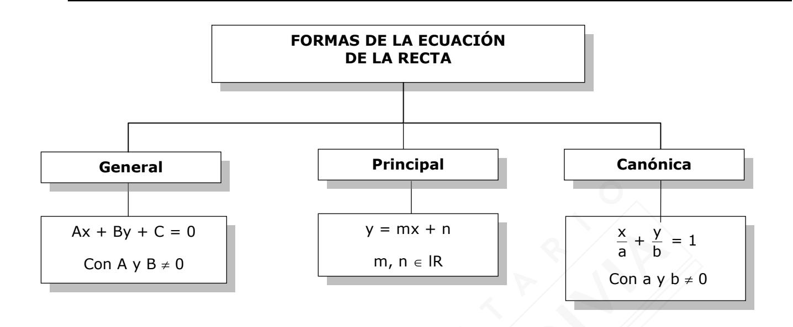
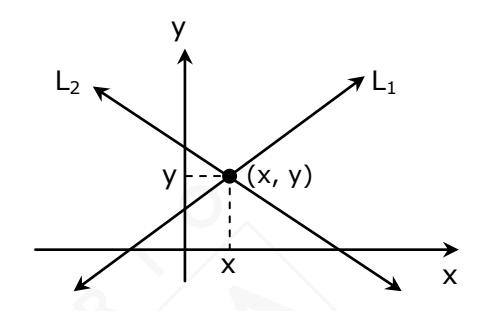
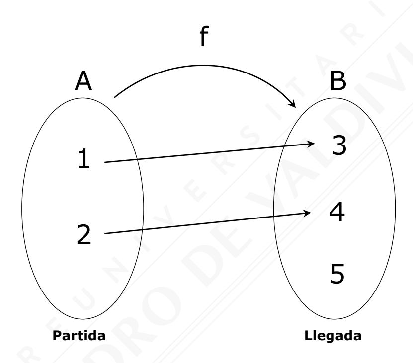
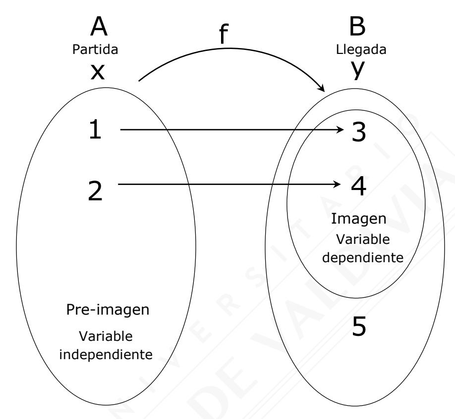
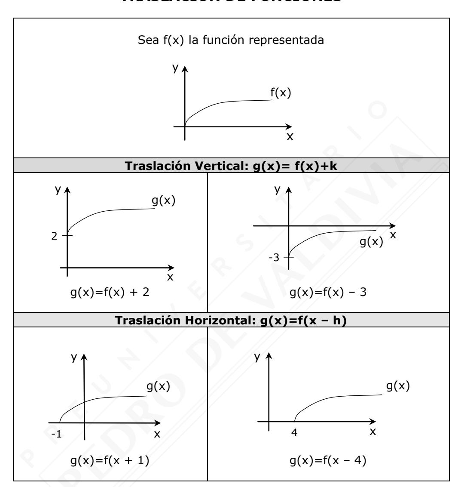

# **RESUMEN RMA-06 ÁLGEBRA Y FUNCIONES II**

| Nombre   |  |
|----------|--|
|          |  |
| Curso    |  |
|          |  |
| Profesor |  |

# **ECUACIÓN DE LA RECTA**

Dados dos puntos pertenecientes al plano  $A(x_1, y_1)$  y  $B(x_2, y_2)$  se tiene:

• Distancia entre A y B:

$$d_{AB} = \sqrt{(x_2 - x_1)^2 + (y_2 - y_1)^2}$$

 Coordenadas del punto medio del segmento AB:

$$PM_{AB} = \left(\frac{x_1 + x_2}{2}, \frac{y_1 + y_2}{2}\right)$$

• Pendiente de la recta que

$$m = \frac{y_2 - y_1}{x_2 - x_1}, con x_1 \neq x_2$$

## **OBSERVACIONES:**

 $\alpha$  = Ángulo de inclinación. m: Pendiente de la recta L.

| Condición      |                               | Figura   |  |
|----------------|-------------------------------|----------|--|
| Ángulo         | Pendiente                     |          |  |
| α = 0°         | m = 0                         | y ↑      |  |
| 0° < α < 90°   | m > 0 (Pendiente positiva) | y L x |  |
| α = 90°        | No tiene pendiente            | y ↑      |  |
| 90° < α < 180° | m < 0 (Pendiente negativa) |          |  |

| Ecuación de la recta                                | Pendiente                    | Coeficiente de posición   |
|-----------------------------------------------------|------------------------------|---------------------------|
| y = mx + n                                          | m                            | n                         |
| Ax + By + C = 0                                     | A , B  0 - B    | C , B  0 - B |
| x y + = 1 a b Con a y b  0 | b - , a  0 a | b                         |

### **RECTAS PARALELAS Y PERPENDICULARES**

|        | Paralelas       |  L1 // L2  m1 = m2  L1 // L2  Ambas pendientes son indeterminadas.                                               |
|--------|-----------------|----------------------------------------------------------------------------------------------------------------------------------------------------|
| Rectas | Perpendiculares |  L1  L2  m1 · m2 = -1; con m1, m2  lR – {0}  L1  L2  m1 = 0 y m2 es indeterminada. |

# **SISTEMAS DE ECUACIONES LINEALES**

A, B, C, D, E, F lR y con A y B 0 ; con D y E 0

$$L_1$$
: Ax + By = C  
 $L_2$ : Dx + Ey = F

$$(x, y) \in L_1$$
  
 $(x, y) \in L_2$ 

Conjunto solución L1 L2 = {(x, y)} La solución del sistema es el punto (x, y).

La solución de un sistema de ecuaciones lineales es el punto donde se intersectan las rectas.

# **RESOLUCIÓN ALGEBRAICA PARA UN SISTEMA DE ECUACIONES LINEALES**

| MÉTODO      | PROCEDIMIENTO                                                                                                                                                                                                                                                                                                                                                                                                       |  |  |
|-------------|---------------------------------------------------------------------------------------------------------------------------------------------------------------------------------------------------------------------------------------------------------------------------------------------------------------------------------------------------------------------------------------------------------------------|--|--|
| Igualación  | 1° Despejar la misma variable en ambas ecuaciones. 2° Igualar las variables despejadas. 3° Resolver la ecuación de primer grado que se genera para obtener el valor de esa variable. 4° Para obtener el valor de la variable faltante, reemplazar el valor obtenido en cualquiera de las ecuaciones iniciales.                                                                     |  |  |
| Sustitución | 1° Despejar una de las dos variables en cualquiera de las ecuaciones. 2° Reemplazar la expresión obtenida en el paso 1 en la otra ecuación. 3° Resolver la ecuación de primer grado que se genera para así obtener el valor de esa variable. 4° Reemplazar el valor obtenido en el paso anterior en cualquiera de las ecuaciones iniciales para obtener el valor de la otra variable. |  |  |
| Reducción   | 1° En ambas ecuaciones, igualar los coeficientes numéricos de la variable que se desea eliminar. 2° Restar ambas ecuaciones. 3° Resolver la ecuación de primer grado que se genera para obtener el valor de esa variable. 4° Finalmente, para obtener el valor de la otra variable, reemplazar el valor obtenido en el paso anterior en cualquiera de las ecuaciones iniciales. |  |  |

# **INECUACIONES DE PRIMER GRADO**

Sean a, b y c números reales y a < b, entonces:

| Propie                                                                                               | edad                                          | Sentido de la desigualdad | Ejemplo                                         |
|------------------------------------------------------------------------------------------------------|-----------------------------------------------|------------------------------|-------------------------------------------------|
| Si a ambos miembros se les suma o resta un mismo valor, la desigualdad no cambia.           | a < b /+c a + c < b + c                    | NO Cambia                 | 3 < 7 /+5 3 + 5 < 7 + 5 8 < 12            |
| Si ambos miembros se multiplican o dividen por un valor positivo, la desigualdad no cambia. | a < b /·c; con c > 0 ac < bc               |                              | 3 < 7 /· 5 3 · 5 < 7 · 5 15 < 35          |
| Si ambos miembros se multiplican o dividen por un valor negativo, la desigualdad cambia.    | a < b /·c; con c < 0 ac > bc               |                              | -12 < 18 /:(-6) -12 : -6 > 18 : -6 2 > -3 |
| Si los dos miembros se invierten (siendo ambos positivos o ambos negativos), la desigualdad cambia.  | $a < b / ()^{-1}$ $\frac{1}{a} > \frac{1}{b}$ | Cambia                       | $2 < 4 / ()^{-1}$ $\frac{1}{2} > \frac{1}{4}$   |

### **TIPOS DE INTERVALO ACOTADOS**

| Cerrado                         | [a, b] | Desde a hasta b                             | a  x  b | lR a b |
|---------------------------------|--------|------------------------------------------------|-----------------|--------------|
| Abierto                         | ]a, b[ | Entre a y b                           | a < x < b       | lR a b |
| Semiabierto o Semicerrado | ]a, b] | Desde a hasta b, sin incluir a. | a < x  b    | lR a b |
| Semiabierto o Semicerrado | [a, b[ | Desde a hasta b, sin incluir b. | a  x < b    | lR a b |

#### **INTERVALOS NO ACOTADOS**

| Intervalos no acotados | Conjunto solución | Representación gráfica |
|---------------------------|----------------------|------------------------|
| x < a                     | ]-, a[              | a lR                |
| x  a                  | ]-, a]              | a lR                |
| x > b                     | ]b, +[              | b lR                |
| x  b                  | [b, +[              | b lR                |

# RESOLUCIÓN DE SISTEMAS DE INECUACIONES LINEALES

- 1° Resolver cada una de las inecuaciones.
- 2° Intersectar todas las soluciones.
- 3° La Solución Final es la intersección de todas las soluciones, es decir:

Solución Final = 
$$S_1 \cap S_2 \cap ... \cap S_n$$

#### **INECUACIONES CON VALOR ABSOLUTO**

|        | +  x  < a ⇔ -a < x < a                                                                                                               | 8////////////////////////////////////// |  |  |
|--------|--------------------------------------------------------------------------------------------------------------------------------------|-----------------------------------------|--|--|
| Caso 1 | a ∈ IR +                                                                                                                  | -a a IR                                 |  |  |
|        | •  x ≤a⇔-a≤x≤a                                                                                                                       |                                         |  |  |
|        | a ∈ IR 0 +                                                                                                     | -a a lR                                 |  |  |
|        | •  x >a⇔x>aox<-a                                                                                                                     |                                         |  |  |
| Caso 2 | a ∈ IR +                                                                                                                  | -a a IR                                 |  |  |
|        | $  \mathbf{x}  \ge \mathbf{a} \Leftrightarrow \mathbf{x} \ge \mathbf{a} \circ \mathbf{x} \le -\mathbf{a} $ $ \mathbf{a} \in IR_0^+ $ | -a a IR                                 |  |  |

**a** es un número real **NO NEGATIVO**

# **FUNCIONES**

Sea f: A B una relación que asigna a cada elemento x del conjunto A uno y solo un elemento y del conjunto B.

## **Ejemplo:**

#### **Observaciones:**

- Se lee: "f es una función de A en B" o "y = f(x)".
- **Dominio de f:** Dom f = A = {1,2}
- **Codominio de f:** Codom f = B = {3, 4, 5}
- **Recorrido de f:** Rec f = {3, 4}
- Observación: Rec f Codom f

## **Ejemplo:**

| Se interpreta | Se lee              |                         |  |
|---------------|---------------------|-------------------------|--|
| f(1) = 3      | La imagen de 1 es 3 | La pre-imagen de 3 es 1 |  |
| f(2) = 4      | La imagen de 2 es 4 | La pre-imagen de 4 es 2 |  |
| f(x) = y      | La imagen de x es y | La pre-imagen de y es x |  |

# **EVALUACIÓN DE FUNCIONES**

Para encontrar el valor de la variable dependiente o evaluar una función, se debe reemplazar el valor de la variable independiente en la función y resolver las operaciones resultantes como se indica en los siguientes casos:

#### **Ejemplo:**

Sean f(x) = 3x + 1 y g(x) = 2x + 5

- $f(4) = 3 \cdot (4) + 1 = 13$
- f(a + b) = 3(a + b) + 1
- f(x-2) = 3(x-2) + 1
- f(g(x)) = 3(g(x)) + 1 = 3(2x + 5) + 1 = 6x + 16

## **TIPOS DE FUNCIONES**

| Tipo        | Condición                                                                          | Figura                                |
|-------------|------------------------------------------------------------------------------------|---------------------------------------|
| Continua    | No presenta cortes en su gráfica                                                | y x                                |
| Discontinua | Presenta cortes en su gráfica                                                   | y x                                |
| Creciente   | Si x crece entonces y crece x2 > x1 f(x2) > f(x1)         | y f(x2) f(x1) x1 x2 x  |
| Decreciente | Si x crece, entonces y decrece x2 > x1  f(x2) < f(x1)  | y f(x1) f(x2) x1 x2 x  |
| Constante   | Si x crece, entonces y no varía x2 > x1  f(x2) = f(x1) | y f(x1)= f(x2) x2 x1 x |

## **MODELOS LINEALES**

| Nombre               | Forma         | Condición                  | Gráfica                                 | Ejemplo       |
|----------------------|---------------|----------------------------|-----------------------------------------|---------------|
| Función afín      | f(x) = mx + n | m ≠ 0 n ≠ 0             | Y \\ \ \ \ \ \ \ \ \ \ \ \ \ \ \ \ \ \  | f(x) = 3x + 2 |
| Función lineal    | f(x) = mx     | m ≠ 0 n = 0             | Y \ \ \ \ \ \ \ \ \ \ \ \ \ \ \ \ \ \ \ | f(x) = 5x     |
| Función constante | f(x) = n      | $\forall n \in IR$ $m = 0$ | У                                       | f(x) = 3      |

## **OBSERVACIÓN PARA LA FUNCIÓN LINEAL:**

- ♦ Siempre pasa por el origen del plano cartesiano, es decir, pasa por P(0, 0).
- ◆ Si a y b pertenecen al dominio de f, entonces:

$$f(a + b) = f(a) + f(b)$$

• 
$$f(k \cdot a) = k \cdot f(a)$$
, con  $k \in IR$ 

# **TRASLACIÓN DE FUNCIONES**

#### **Observación:**

 En general, **y = f(x – h) + k** representa una traslación horizontal de f en h unidades a la derecha, si h > 0 y una traslación vertical de f en k unidades hacia arriba, si k > 0.

# **SIMETRÍA DE FUNCIONES**

| Respecto al eje X (El eje X es el eje de simetría) | Respecto al eje Y (El eje Y es el eje de simetría) |
|-------------------------------------------------------|----------------------------------------------------------|
| y                                                     | y                                                        |
| f(x)                                                  | f(x)                                                     |
| x                                                     | f(-x)                                                    |
| -f(x)                                                 | x                                                        |

## **Casos especiales de funciones simétricas**

| Función par   | f(x) = f(-x)  |  Su gráfica posee simetría axial respecto al eje Y |  |  |
|---------------|---------------|-----------------------------------------------------------|--|--|
| Función impar | -f(x) = f(-x) |  Su gráfica posee simetría central        |  |  |
|               |               | respecto del origen (0, 0)                                |  |  |

# **FUNCIONES ESPECIALES**

## **FUNCIÓN PARTE ENTERA:**

Se define 
$$f : IR \to \mathbb{Z}$$
;  $f(x) = [x]$   
Donde [x] es el mayor entero no superior a x

| Propiedades        | Gráfica                           |
|--------------------|-----------------------------------|
|                    |                                   |
|                    | y                                 |
|                    | 4                                 |
|  f(x) = [x]    | 3                                 |
|  Dom f(x) = lR | 2                                 |
|                    | 1                                 |
|  Rec f(x) =   |                                   |
|                    | x -2 -1 4 1 2 3 |
|                    | -1                                |
|                    | -2                                |
|                    |                                   |
|                    |                                   |

## **Observaciones:**

- Para calcular la parte entera de un número se debe considerar el mayor número entero que es menor o igual que el número dado, o bien, corresponde al menor número entero entre los cuales se encuentra el número dado.
- La parte entera de un número entero es el mismo número entero.

| X     | x está entre | Menor número entero | [x] |
|-------|--------------|---------------------|-----|
| 2,015 | 2 y 3        | 2                   | 2   |
| 1,903 | 1 y 2        | 1                   | 1   |
| 0,03  | 0 y 1        | 0                   | 0   |
| -1,4  | -2 y -1      | -2                  | -2  |
| -7,01 | -8 y -7      | -8                  | -8  |

# **FUNCIÓN VALOR ABSOLUTO:**

Se define f: lR 0 lR , como **f(x) = x**

## **Propiedades Gráfica** f(x) = x = Dom f: lR Rec f: 0 lR x, x 0 -x, x < 0 y x f(x) = x -2 -1 1 2 2 1