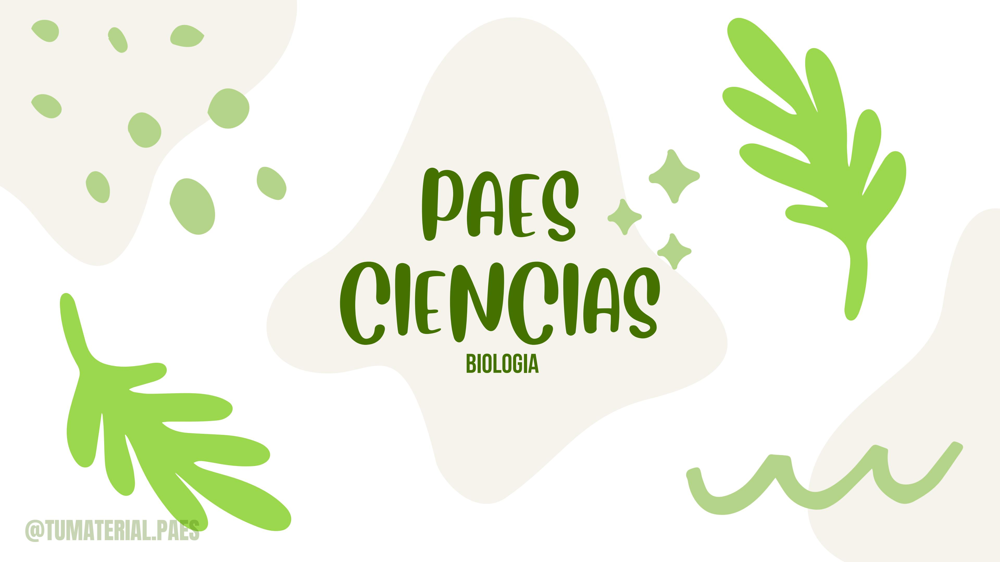

### CONTENIDOS

### Organización, estructura y actividad celular

**1.celulasprocariontesyeucariontes 2.organelosyestructurascelulares 3. relacion entreestructurasyfuncion celular 4.transportecelular**

**1.Ciclocelular** 2. **Biotecnología**

### Procesos y funciones biológicas

**1.Sexualidad humana 2.Cicloováricoyuterino 3. Métodos decontrol dela natalidad 4. Infecciones detransmisión sexual(ITS) 5. Nutrientesy biomoléculas**

### Herencia y evolución Organismo y ambiente

**1.Fotosíntesisy respiración celular 2.Flujo de materia yenergía en lascadenasytramastróficas**

## Organización, estructura y actividad celular

**1.celulasprocariontesyeucariontes 2.organelosyestructurascelulares 3. relacion entreestructurasyfuncion celular 4.transportecelular**

## 1. Células Procariontes y eucariontes

### Procariontes **Son células más simples, que se**

**encuentran en organismos como bacterias y arqueas.**

**Carecen de organelos membranosos y tienen una estructura célular más simple en general.**

**A pesar de ser simples, possen estructuras especializadas.**

**Son capaces de realizar funciones esenciales como: reproducción, metabolismo, la respuesta su entorno, adaptación génetica y**

**No tiene núcleo definido, su material genético está disperso por el citoplasma, en forma de una molécula de ADN circular.**

Son capaces de reproducirse rápidamente mediante la división celular. Este proceso se llama bipartición o fisión binaria, donde la célula madre se divide en dos células hijas idénticas.

Pueden establecer relaciones simbióticas con otros organismos. Por ejemplo, algunas bacterias viven en simbiosis con las plantas, ayudándoles a fijar nitrógeno atmosférico y proporcionándoles nutrientes esenciales.

# espuesta

Pueden detectar y responder a señales químicas mediante receptores y sistemas de señalización. Esto les permite alejarse de condiciones desfavorables y moverse hacia fuentes de nutrientes favorables.

Tienen diversos mecanismos de metabolismo para obtener energía y nutrirse. Pueden utilizar la fermentación, la respiración anaeróbica o la respiración aeróbica, dependiendo de las condiciones ambientales y la disponibilidad de oxígeno.

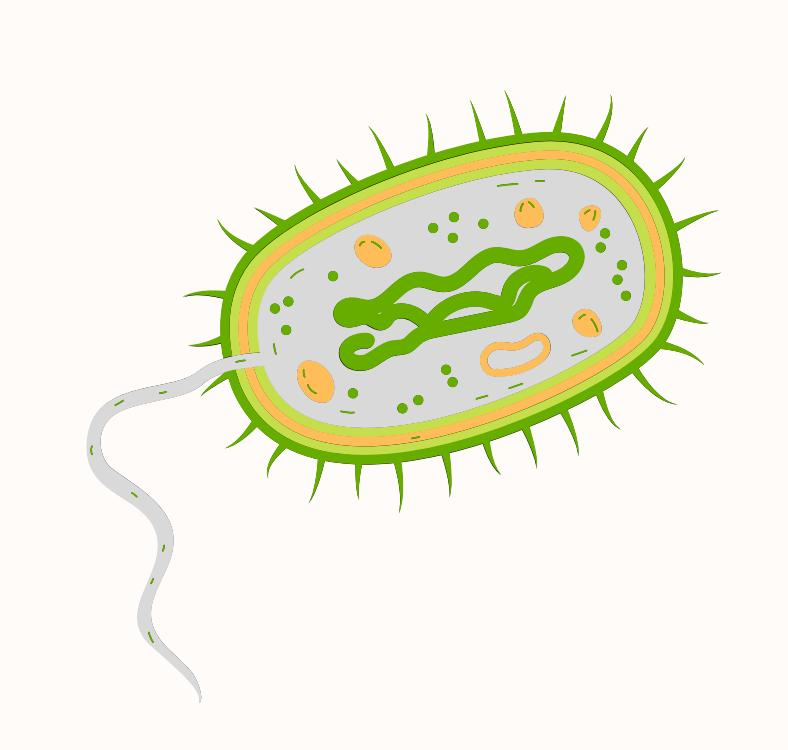

daptación

La transferencia horizontal de genes, donde los genes pueden intercambiarse entre células procariotas, contribuye a la adaptación y la adquisición de nuevas características beneficiosas.

### Eucariontes

**Contienen diversos organelos membranosos, como el retículo endoplasmático, el aparato de Golgi, las mitocondrias, entre otros.**

**Posee un núcleo definido rodeado por una membrana nuclear.**

> **Presentan un citoesqueleto, una red de filamentos que proporciona soporte estructural, ayuda en la forma de la célula y en el movimiento de organelos.**

**Los organelos membranosos permiten la segregación de diferentes funciones y procesos dentro de la célula.**

> **Muchas células eucariotas pueden reproducirse a través de la reproducción sexual.**

> > **Son generalmente más grandes y estructuralmente más complejas.**

**Las células eucariotas forman una amplia variedad de tipos celulares especializados, como células musculares, células nerviosas y células epiteliales.**

@TUMATERIAL.PAES

## Síntesis de

Pueden reproducirse a través de manera asexual, con la división celular mitótica, donde una célula madre se divide en dos células hijas genéticamente idénticas, y de manera sexual, que combina el material genético de dos células progenitoras para crear variabilidad genética.

Transporte

Tienen un sistema de transporte que les permite mover moléculas y organelos dentro de la célula, así como comunicarse con otras células a través de señales químicas.

los ribosomas, donde se traduce la información genética del ARN mensajero (ARNm) en proteínas funcionales.

### **FUNCIONES**

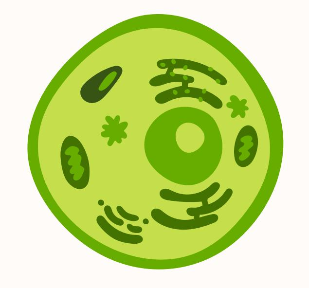

Metabolismo

Llevan a cabo el metabolismo de los nutrientes para obtener energía y los procesos de biosíntesis. Esto incluye la respiración celular, en la cual se libera energía de moléculas de nutrientes, como la glucosa, a través de una serie de reacciones químicas en las mitocondrias.

# Comunicación

Se comunican entre sí a través de señales químicas y señales eléctricas, permitiendo la coordinación de actividades en los tejidos y el organismo en su conjunto.

# Diferenciación y especialización

Se diferencian y se especializan en diferentes tipos celulares durante el desarrollo embrionario. Estos diferentes tipos de células adquieren estructuras y funciones específicas para cumplir tareas especializadas en los tejidos y órganos del organismo multicelular.

Mantienen un equilibrio interno, conocido como homeostasis, regulando el ambiente intracelular, el pH, la concentración de iones y otros factores para garantizar un funcionamiento óptimo.

### **FUNCIONES**

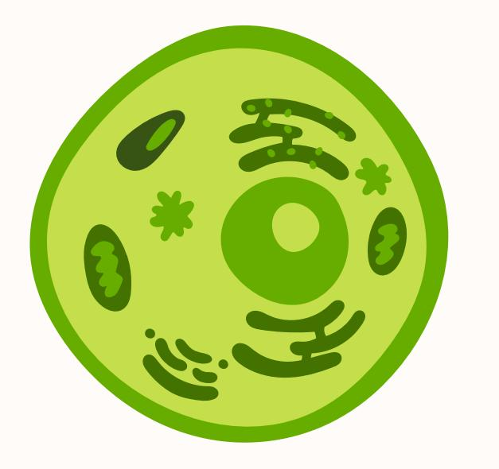

## 2. Organelos y estructuras celulares

### Célula procarionte

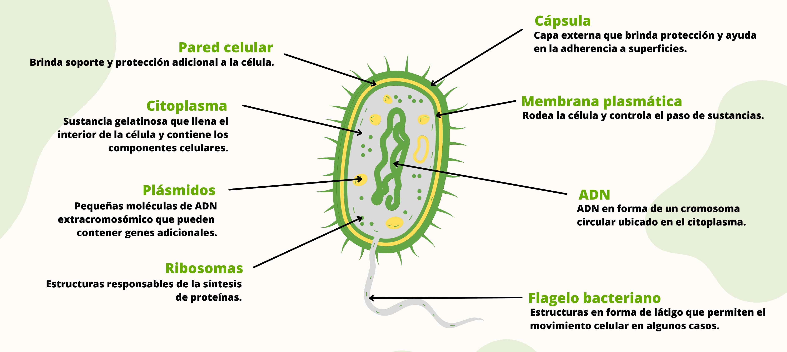

### Célula eucarionte

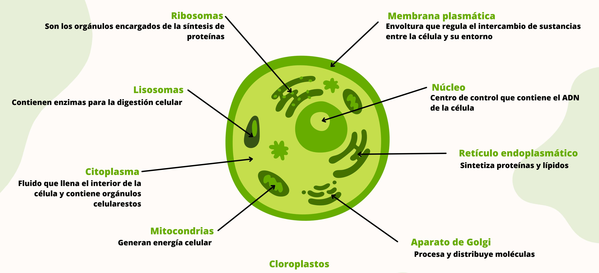

**Orgánulos exclusivos de las células vegetales, son**

**responsables de la fotosíntesis** @TUMATERIAL.PAES

## 3. Relación entre estructuras y función celular

**enterocito,célula muscular esquelética, neurona ycélulassecretoraspancreáticas**

**Estas estructuras en forma de dedos aumentan significativamente el área de la superficie de la célula, lo que permite una mayor absorción de nutrientes.**

**Los enterocitos son células epiteliales que se encuentran en el revestimiento del intestino delgado.**

**Su función principal es la absorción de nutrientes y agua de los alimentos digeridos.**

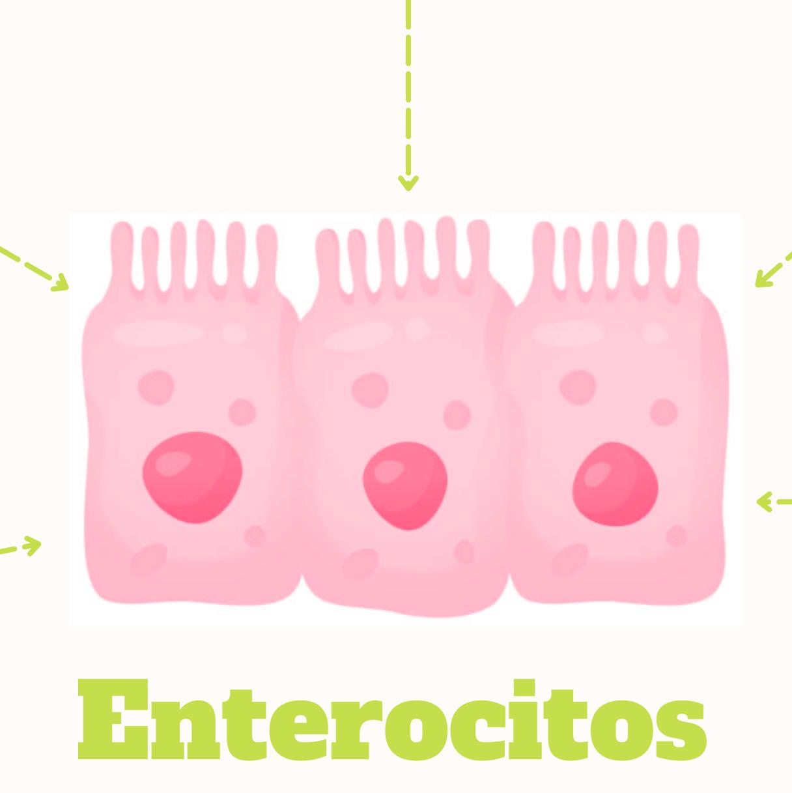

**Los enterocitos contienen numerosas mitocondrias para producir la energía necesaria para la absorción activa de nutrientes.**

> **Estas células están adaptadas para aumentar la superficie de absorción mediante la presencia de microvellosidades en su membrana apical.**

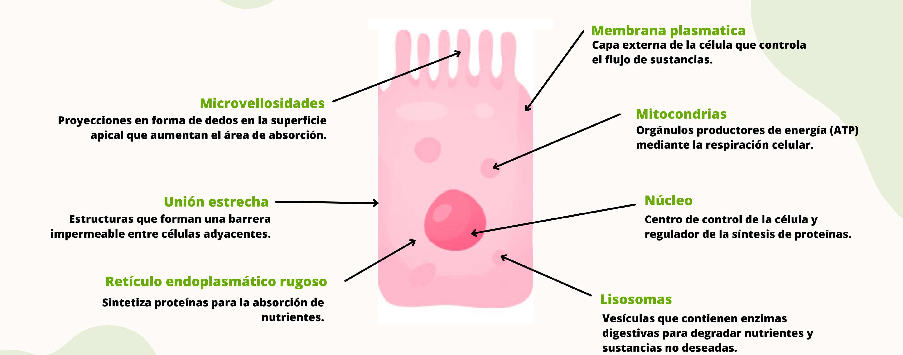

**Estas células contienen fibras contráctiles llamadas miofibrillas, las cuales están formadas por unidades repetitivas llamadas sarcómeros.**

**Los sarcómeros están compuestos por filamentos de actina y miosina, los cuales se deslizan entre sí para generar la contracción muscular.**

**Son células alargadas y multinucleadas que forman el tejido muscular esquelético, el cual es responsable del movimiento voluntario.**

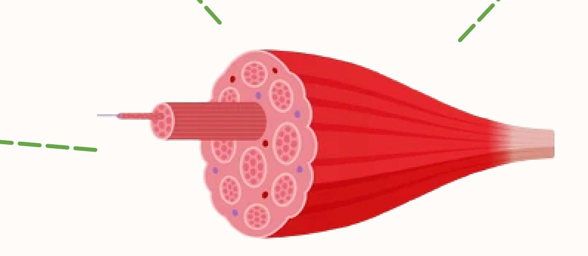

**La estructura altamente organizada de los sarcómeros permite la contracción coordinada de las células musculares y la generación de fuerza para el movimiento.**

### Célula muscular esquelética

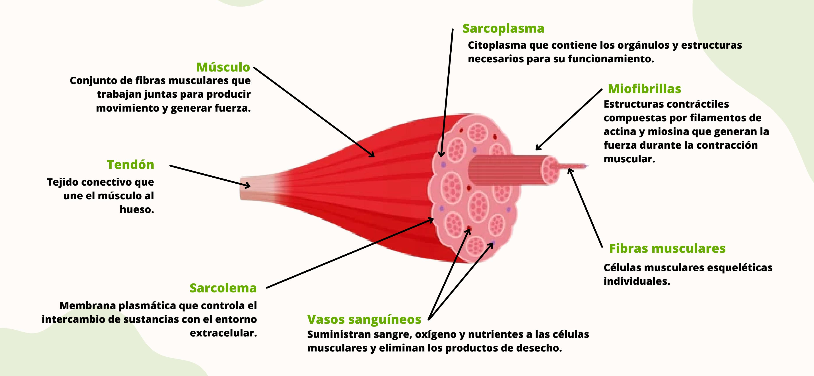

@TUMATERIAL.PAES

**Tienen una forma ramificada con dendritas que reciben señales y un axón que transmite señales a otras células**

**Las neuronas exhiben excitabilidad y plasticidad, su transmisión se realiza mediante cambios electroquímicos.**

**Son células especializadas del sistema nervioso que transmiten señales eléctricas y se comunican entre sí y con otras células a través de sinapsis.**

**Estas características permiten a las neuronas procesar y transmitir información en el sistema nervioso, desempeñando un papel fundamental en la coordinación y el control de las funciones del organismo.**

Neurona

#### **Núcleo**

**Es el centro de control de la célula y contiene el material genético, tiene la información genética necesaria para la síntesis de proteínas y el funcionamiento de la célula.**

#### **Axón**

**Es una prolongación larga y delgada que se extiende desde el soma y lleva la señal eléctrica generada por la neurona hacia otras células.**

#### **Mielina**

**Tiene una cubierta de mielina formada por células de Schwann en el sistema nervioso periférico y células de oligodendrocitos en el sistema nervioso central.**

#### **Dentrita**

**Son extensiones ramificadas que se originan desde el soma y se encargan de recibir señales y estímulos del entorno o de otras neuronas.**

#### **Soma o cuerpo celular**

**Es la parte principal de la neurona que contiene el núcleo y otros orgánulos celulares.**

#### **Nodos de Ranvier**

**Son pequeñas brechas en la mielina que se encuentran a intervalos regulares a lo largo del axón.**

#### **Terminales axónicos**

**Son estructuras en forma de botón ubicadas al final del axón. Los terminales axónicos establecen conexiones sinápticas con otras neuronas o células objetivo.**

**Las células secretoras pancreáticas son responsables de la producción y liberación de enzimas digestivas y hormonas en el páncreas.**

**Tienen un aparato de Golgi desarrollado que procesa y empaqueta las proteínas en vesículas secretoras.**

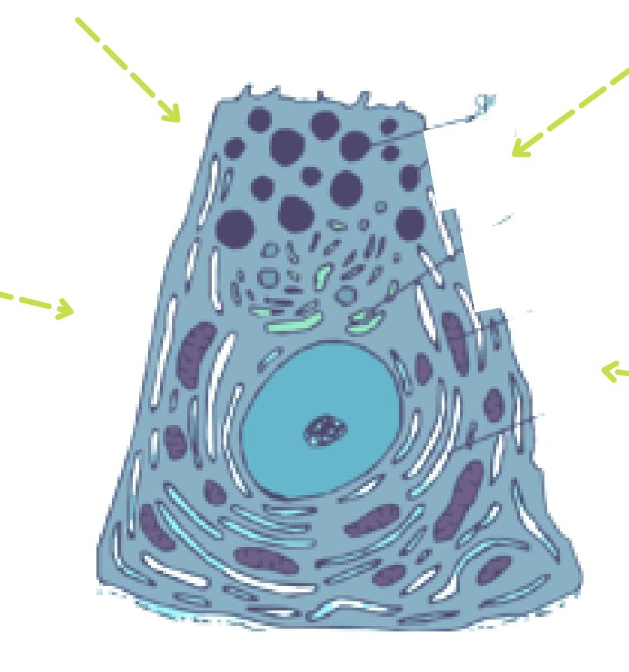

**Estas células tienen una estructura especializada para la síntesis y secreción de proteínas. Contienen un retículo endoplásmico rugoso bien desarrollado, que está involucrado en la síntesis de proteínas.**

> **Contienen un retículo endoplásmico rugoso bien desarrollado, que está involucrado en la síntesis de proteínas.**

### Células secretoras pancreáticas

@TUMATERIAL.PAES

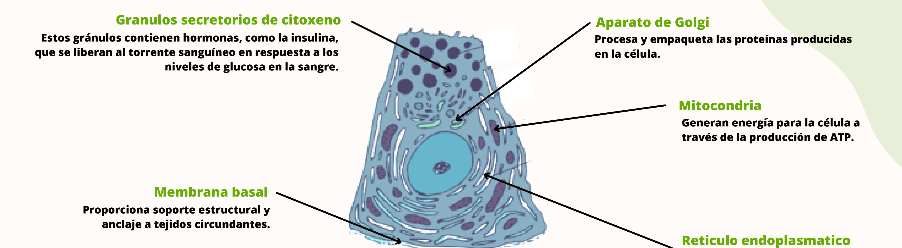

**rugoso**

**Sintetiza proteínas, incluyendo**

**enzimas y hormonas.**

## 4. Transporte celular

### **Es un proceso en el cual las moléculas se mueven a través de la membrana celular sin requerir gasto de energía por parte de la célula.** trasporte pasivo

### **DIFUSIÓN SIMPLE**

**Las moléculas se mueven directamente a través de la bicapa lipídica de la membrana celular. Las moléculas pequeñas y no polares, como el oxígeno y el dióxido de carbono, pueden difundir libremente a favor de su gradiente de concentración.**

### **DIFUSIÓN FACILITADA ÓSMOSIS**

**Implica el movimiento de moléculas a través de proteínas transportadoras o canales de membrana. Las moléculas más grandes o cargadas, como la glucosa o los iones, utilizan proteínas específicas de transporte para facilitar su paso a través de la membrana.**

**Involucra el movimiento de agua a través de la membrana celular. El agua se mueve desde una región de menor concentración de solutos hacia una región de mayor concentración de solutos a través de canales de agua llamados acuaporinas.**

### trasporte activo

**Es un proceso en el cual las moléculas se mueven a través de la membrana celular en contra de su gradiente de concentración, lo que requiere el gasto de energía celular, generalmente en forma de ATP**

#### **TRASPORTE ACTIVO PRIMARIO**

**Las moléculas se transportan en contra de su gradiente de concentración utilizando proteínas de transporte llamadas bombas.**

#### **TRASPORTE ACTIVO SECUNDARIO**

**El movimiento de una molécula se acopla al gradiente electroquímico previamente establecido por otra molécula transportada por una bomba.**

## Procesos y funciones biológicas

**1.sexualidad humana**

**2.cicloovaricoyuterino**

**3. metodos decontrol de natalidad**

**4. infecciones detransmision sexual(ITS)**

**5. nutrientesy biomoleculas**

## 1. Sexualidad humana

**pubertad,gametosysufunción la fecundación**

### Pubertad

**Algunos factores que pueden influir en el inicio y la duración de la pubertad incluyen la genética, el entorno, la nutrición y la salud en general.**

**También implica cambios hormonales que pueden influir en el estado de ánimo y el comportamiento.**

**Se producen una serie de cambios en el cuerpo, como el crecimiento acelerado, el desarrollo de los órganos sexuales y la aparición de características sexuales secundarias.**

**Generalmente comienza entre los 8 y los 13 años. Generalmente comienza entre los 9 y los 14 años.**

### **CAMBIOS FISICOS**

#### **Desarrollo del sistema reproductivo interno y externo**

**Desarrollo de los senos**

**Crecimiento acelerado**

**Crecimiento del vello corporal**

**Menstruación (menarquía)**

**Ensanchamiento de las caderas**

**Desarrollo del sistema reproductivo interno y externo**

**Cambios en la musculatura**

**Crecimiento acelerado**

**Cambios en la voz**

**Desarrollo de la fertilidad**

**Aumento de la sudoración**

**Crecimiento del vello corporal**

Gametos **Son células sexuales especializadas que se producen durante la gametogénesis**

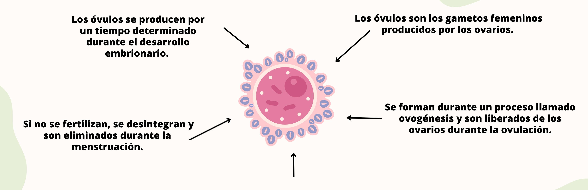

**Los óvulos contienen la mitad del número normal de cromosomas y, si son fertilizados por un espermatozoide, pueden dar lugar a un embarazo.**

Gametos **Son células sexuales especializadas que se producen durante la gametogénesis**

**Los espermatozoides son células masculinas especializadas necesarias para la reproducción sexual.**

**A diferencia de las mujeres, los hombres producen espermatozoides continuamente a lo largo de su vida adulta.**

**Durante la eyaculación, los espermatozoides son expulsados a través del pene y pueden fertilizar un óvulo durante la actividad sexual.**

**Son células pequeñas y móviles que contienen el material genético del hombre.**

**fusión del espermatozoide y el óvulo para iniciar el desarrollo de un nuevo individuo.**

- **1. Crecimiento de ovulos**
- **2. Ovulación**
- **3. Transporte de gametos**
- **4. Fecundación**

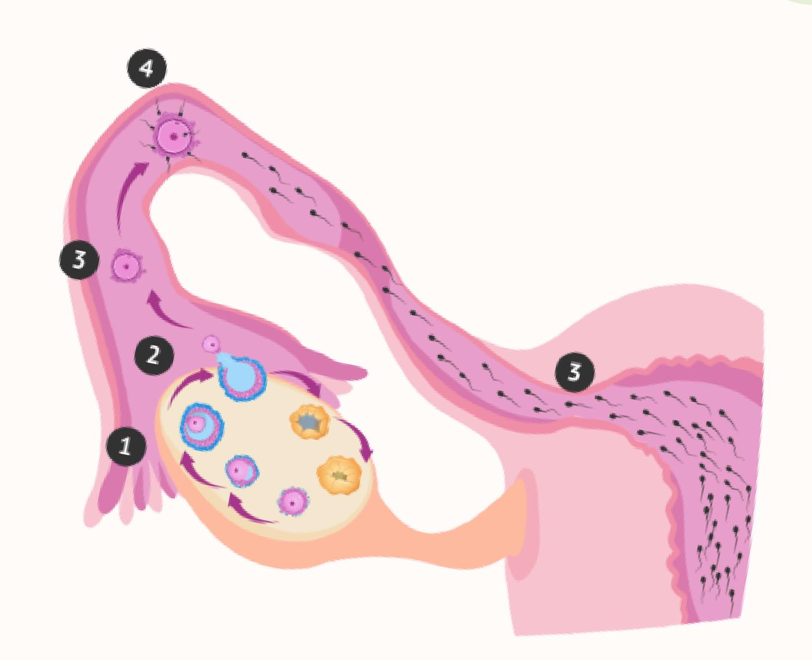

## 2. Ciclo ovarico y uterino

Ciclo ovarico **Es el proceso mensual que ocurre en los ovarios de las mujeres.**

#### **Fase lútea (16-28)**

**Después de la ovulación, el folículo vacío se convierte en el cuerpo lúteo, que produce progesterona. Esta hormona prepara el útero para el embarazo. Si no hay fertilización, el cuerpo lúteo se degenera y los niveles hormonales disminuyen, lo que desencadena la menstruación y el inicio de un nuevo ciclo.**

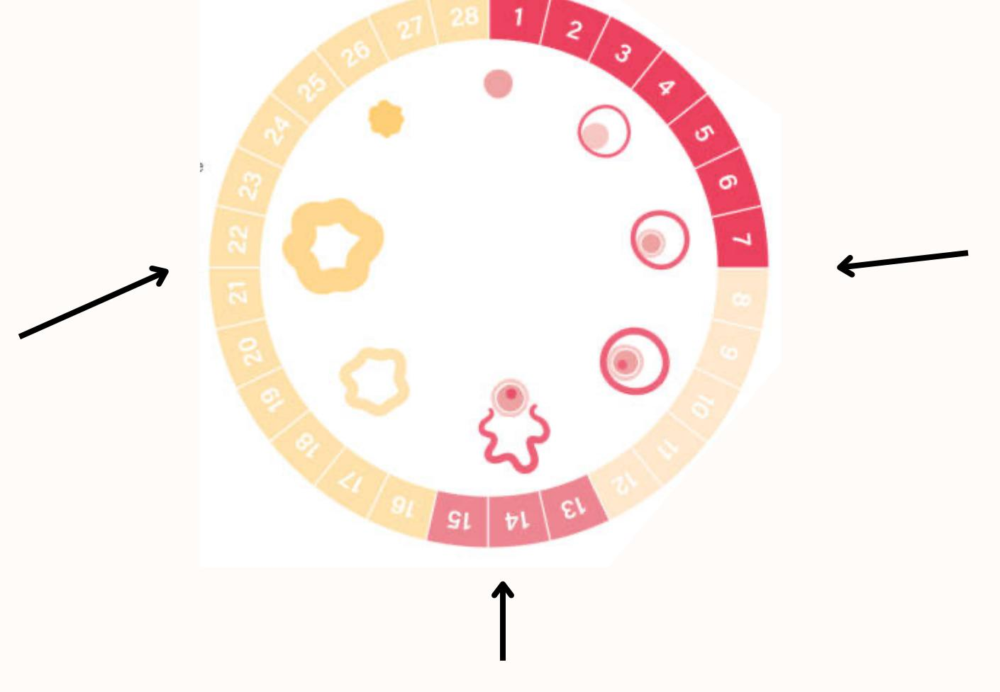

**Fase folicular (1-12)**

**Comienza con la menstruación y dura aproximadamente dos semanas. Aquí los folículos ováricos maduran y producen estrógeno, preparando el útero para la posible implantación de un óvulo fertilizado.**

**Ovulación (13-15)**

**Ocurre alrededor del día 14 del ciclo. Un óvulo maduro es liberado del ovario y puede ser fertilizado en las trompas de Falopio.**

### Ciclo uterino **El ciclo uterino es el proceso que ocurre en el revestimiento del útero, el endometrio.**

#### **Fase menstrual (1-7)**

**Se produce el sangrado menstrual cuando no hay implantación. El endometrio se desprende y se elimina.**

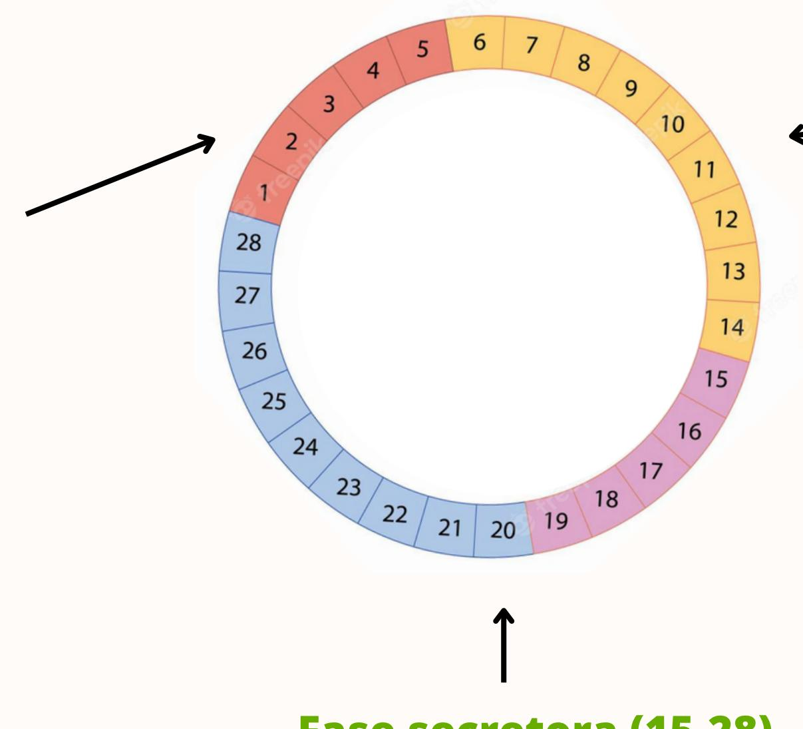

#### **Fase proliferativa (7-14)**

**Después de la menstruación, el endometrio se regenera y crece bajo la influencia del estrógeno. Se vuelve más grueso y se prepara para recibir un óvulo fertilizado.**

**Fase secretora (15-28)**

**Después de la ovulación, el endometrio se vuelve más glandular y rico en vasos sanguíneos debido a la progesterona. Esto lo prepara para la implantación del óvulo fertilizado.**

**Si no hay implantación, se inicia la menstruación y se repite el ciclo.** @TUMATERIAL.PAES

## 3. Metodos de control de natalidad

### Metodos naturales

**Estos métodos se basan en el seguimiento de los ciclos reproductivos de la mujer y en la abstinencia sexual durante los períodos fértiles. Es importante tener en cuenta que estos métodos tienen una tasa de falla más alta en comparación con los anticonceptivos hormonales o intrauterinos.**

### **Del calendario**

**Consiste en registrar la duración de los ciclos menstruales para determinar los días fértiles y abstenerse de tener relaciones sexuales durante ese período.**

### **Billings**

**Se basa en la observación y la interpretación de los cambios en el moco cervical para determinar los días fértiles. El moco cervical claro, acuoso y elástico indica fertilidad, mientras que un moco espeso y pegajoso indica infertilidad.**

### **Temperatura basal**

**Se basa en tomar la temperatura basal todas las mañanas antes de levantarse para identificar el aumento de temperatura que ocurre durante la ovulación y abstenerse de tener relaciones sexuales durante esos días.**

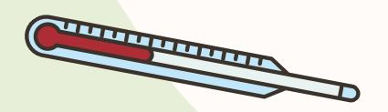

### Metodos artificiales reversibles

**Estos métodos son eficaces para prevenir el embarazo y pueden ser descontinuados en cualquier momento si se desea concebir.**

### **Anticonceptivos hormonales**

**Estos incluyen píldoras anticonceptivas, parches cutáneos, anillos vaginales e inyecciones. Estos liberan hormonas que inhiben la ovulación y hacen que el moco cervical sea menos propicio para el paso de los espermatozoides.**

### **Dispositivos intrauterinos (DIU)**

**Son pequeños dispositivos de plástico o metal que se colocan dentro del útero. Los DIU pueden ser hormonales o de cobre y previenen el embarazo al interferir con la fertilización o implantación del óvulo fertilizado.**

### **Diafragma y capuchón cervical**

**Son dispositivos de barrera que se colocan en la vagina antes de las relaciones sexuales para bloquear la entrada del esperma al útero.**

#### **Métodos de barrera**

**Incluyen el uso de preservativos masculinos y femeninos, que crean una barrera física para evitar que el esperma entre en el útero.**

### Metodos parcialmente reversibles

**Son aquellos que pueden proporcionar una anticoncepción efectiva durante un período de tiempo, pero que requieren una intervención médica o procedimiento para su reversión.**

### **Implantes anticonceptivos**

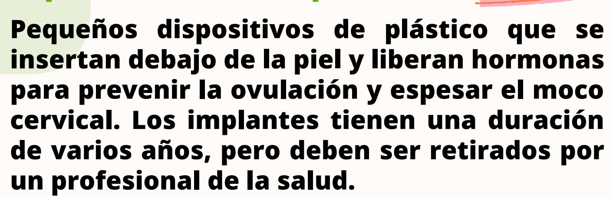

### **Ligadura de trompas:**

**Es un procedimiento quirúrgico en el cual se bloquean o cortan las trompas de Falopio para prevenir la fertilización de los óvulos. Aunque es irreversible, existe la opción de realizar una cirugía adicional para intentar revertirlo, pero la efectividad de la reversión puede variar.**

### **Inyecciones anticonceptivas de larga duración**

**Estas inyecciones contienen hormonas que previenen la ovulación y proporcionan protección anticonceptiva durante un período de tiempo prolongado, generalmente entre uno y tres meses. Se puede dejar de recibir las inyecciones y la fertilidad debería restaurarse gradualmente.**

## 4.Infecciones de transmisión sexual (ITS)

### ITS

**Las ITS son enfermedades transmitidas principalmente a través del contacto sexual sin protección. Pueden ser causadas por bacterias, virus o parásitos y presentan diversos síntomas. La prevención incluye el uso de métodos de barrera y la vacunación cuando sea posible. Buscar atención médica y tratamiento adecuado son fundamentales para controlar las ITS y mantener una vida sexual saludable.**

#### **Algunos ejemplos son:**

- **· Clamidia**
- **· Gonorrea**
- **· Sífilis**
- **· VIH/SIDA**
- **· Herpes genital**
- **· VPH (Virus del Papiloma Humano)**
- **· Hepatitis B**
- **· Tricomoniasis**
- **· Candidiasis (infección por levaduras)**
- **· Hepatitis C**

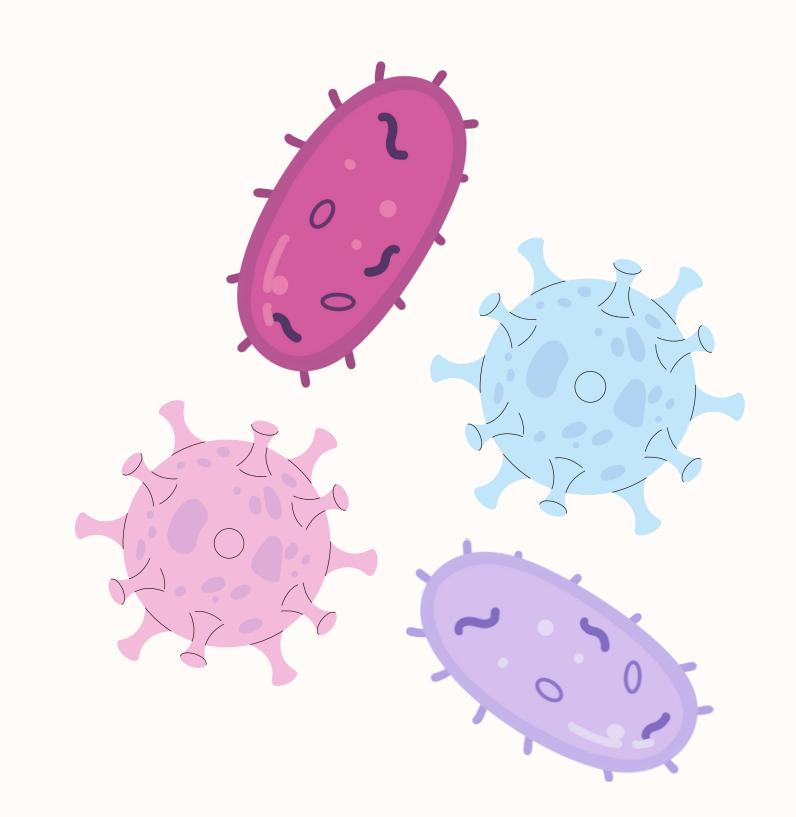

#### **Agente patógeno**

**· VIH-1 y VIH-2, pertenecientes a la familia de los retrovirus.**

#### **Mecanismos de transmisión**

- **· Relaciones sexuales sin protección con una pareja infectada.**
- **· Compartir agujas o jeringas contaminadas con sangre infectada.**
- **· Transmisión de madre a hijo durante el embarazo, parto o lactancia.**

#### **Medidas de prevención**

- **· Uso de condones en todas las relaciones sexuales.**
- **· Evitar compartir agujas u otros instrumentos de inyección.**
- **· Realizar pruebas regulares del VIH y recibir asesoramiento médico.**
- **· Uso de medicamentos antirretrovirales para personas con mayor riesgo de exposición (profilaxis · preexposición o PrEP)**

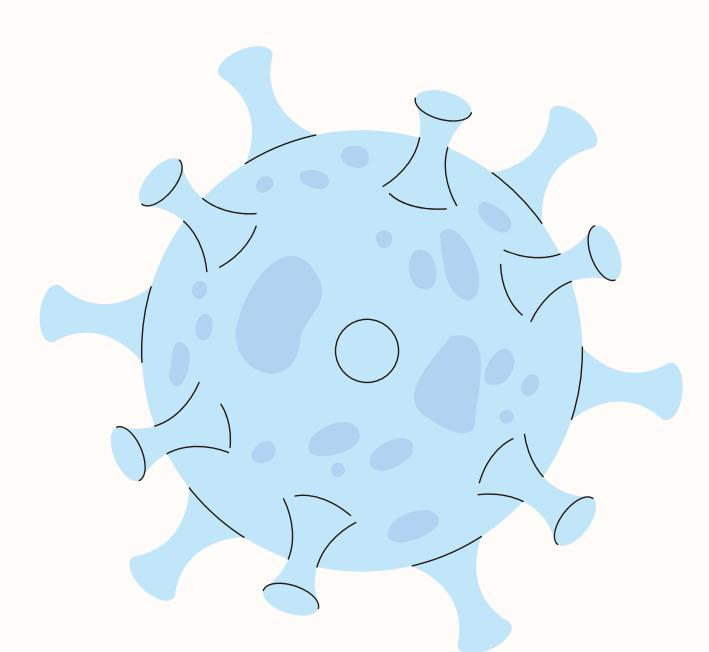

### Gonorrea

#### **Agente patógeno**

**· Neisseria gonorrhoeae, una bacteria gramnegativa.**

#### **Mecanismos de transmisión**

- **· Relaciones sexuales vaginales, anales u orales sin protección con una · pareja infectada.**
- **· Transmisión de madre a hijo durante el parto.**

- **· Uso de condones en todas las relaciones sexuales.**
- **· Realizar pruebas regulares de ITS y recibir tratamiento adecuado.**
- **· Notificar a las parejas sexuales para que también se hagan la prueba y reciban tratamiento si es necesario.**

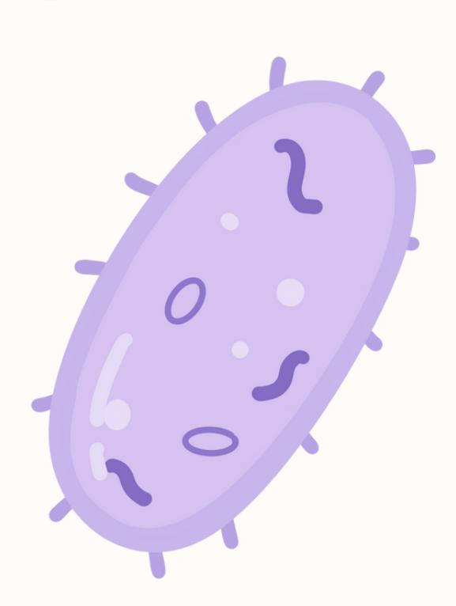

### Herpes genital

#### **Agente patógeno**

**· Virus del Herpes Simplex (VHS) tipo 1 y tipo 2.**

#### **Mecanismos de transmisión**

- **· Contacto directo de las lesiones activas o la piel y las membranas mucosas infectadas.**
- **· Relaciones sexuales sin protección con una pareja infectada.**

### **Medidas de prevención**

- **· Uso de condones en todas las relaciones sexuales, aunque no ofrecen una protección completa debido a la posible transmisión a través del contacto de áreas no cubiertas por el condón.**
- **· Evitar el contacto directo con lesiones o áreas infectadas.**
- **· Realizar pruebas regulares de ITS y buscar tratamiento adecuado.**

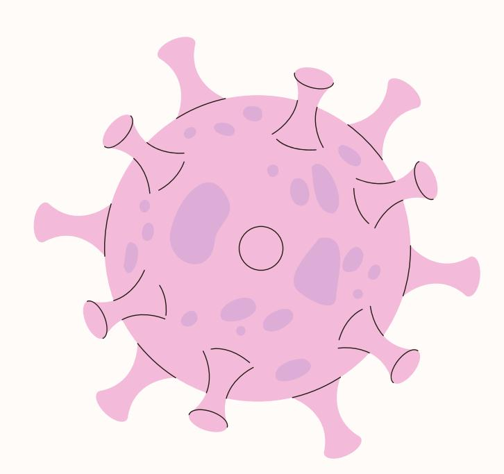

### Clamidia

#### **Agente patógeno**

**· Chlamydia trachomatis, una bacteria intracelular.**

#### **Mecanismos de transmisión**

- **· Relaciones sexuales vaginales, anales u orales sin protección con una pareja infectada.**
- **· Transmisión de madre a hijo durante el parto.**

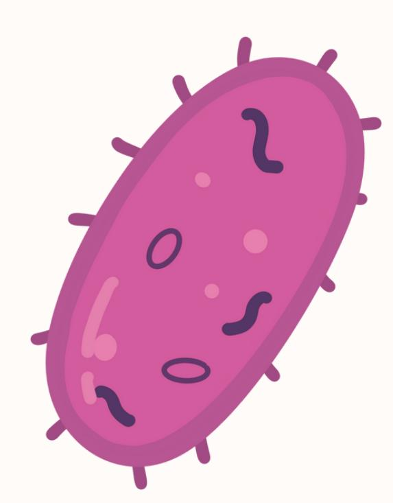

#### **Medidas de prevención**

- **· Uso de condones en todas las relaciones sexuales.**
- **· Realizar pruebas regulares de ITS y recibir tratamiento adecuado.**
- **· Notificar a las parejas sexuales para que también se hagan la prueba y reciban tratamiento si es necesario.**

## 5. Nutrientes y biomoleculas

**Las proteínas están compuestas por cadenas de aminoácidos. Cada proteína tiene una secuencia única de aminoácidos que determina su estructura y función.**

**Las proteínas son macromoléculas complejas y versátiles. Su estructura tridimensional les permite realizar una amplia gama de funciones en el cuerpo.**

**Propiedades Características**

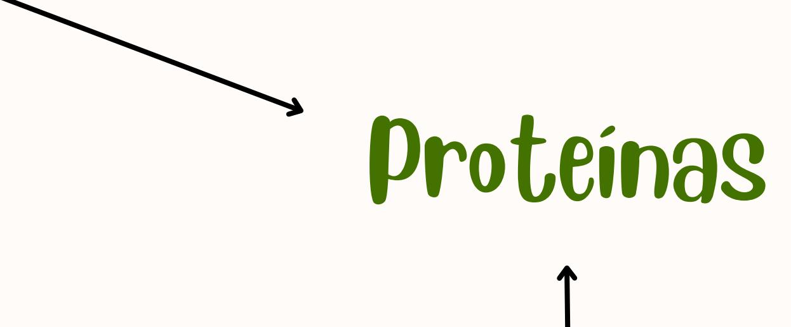

#### **Efectos en la salud**

**Las proteínas son fundamentales para el crecimiento y la reparación de tejidos, la producción de enzimas, hormonas y anticuerpos, y el mantenimiento de un sistema inmunológico saludable. También juegan un papel importante en la regulación del metabolismo y pueden contribuir a la saciedad y control del apetito.**

**Los carbohidratos se pueden clasificar en carbohidratos simples (monosacáridos y disacáridos) y carbohidratos complejos (polisacáridos). Los carbohidratos complejos suelen contener fibra, que no puede ser digerida por el cuerpo humano.**

**Los carbohidratos son compuestos orgánicos compuestos por carbono, hidrógeno y oxígeno en una proporción de 1:2:1.**

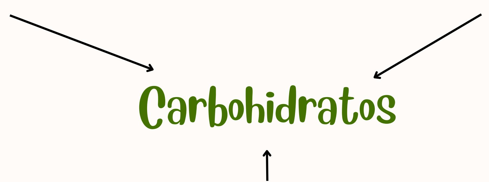

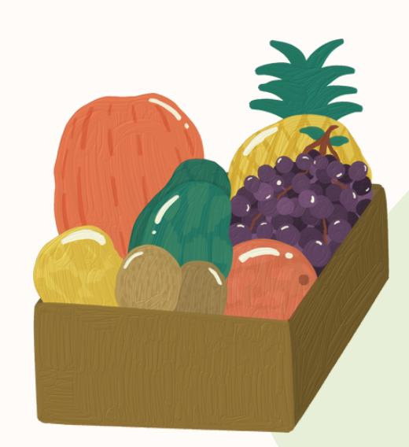

#### **Efectos en la salud**

**Los carbohidratos son la principal fuente de energía para el cuerpo. Los carbohidratos complejos, como los encontrados en cereales integrales, frutas y verduras, proporcionan energía sostenida y fibra dietética. Los carbohidratos simples, como los azúcares refinados, pueden contribuir a problemas de salud si se consumen en exceso.**

**Los lípidos son altamente energéticos y son insolubles en agua debido a su naturaleza hidrofóbica. Los principales tipos de lípidos son los triglicéridos, fosfolípidos y esteroides.**

**Propiedades Características**

**Los lípidos son biomoléculas insolubles en agua que incluyen grasas, aceites y otros compuestos lipídicos.**

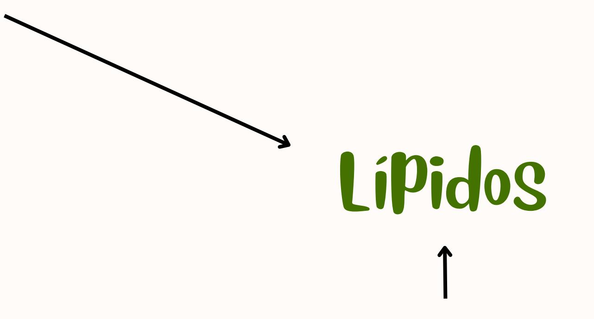

#### **Efectos en la salud**

**Los lípidos son una fuente concentrada de energía y proporcionan ácidos grasos esenciales, que son importantes para el funcionamiento del cerebro, la salud cardiovascular y la regulación hormonal. Sin embargo, el consumo excesivo de grasas saturadas y grasas trans puede aumentar el riesgo de enfermedades cardiovasculares.**

**Los ácidos grasos insaturados se clasifican en monoinsaturados (un enlace doble) y poliinsaturados (múltiples enlaces dobles). Los ácidos grasos omega-3 y omega-6 son ácidos grasos poliinsaturados esenciales.**

**Propiedades Características**

**Los ácidos grasos son los componentes estructurales de los lípidos. Pueden ser saturados (sin enlaces dobles), insaturados (con enlaces dobles) o trans (estructura alterada).**

#### **Efectos en la salud**

**Los ácidos grasos insaturados, como los omega-3 y omega-6, son esenciales para la salud cardiovascular, el funcionamiento cerebral y la respuesta inflamatoria. Los ácidos grasos trans, presentes en alimentos procesados y fritos, se asocian con un mayor riesgo de enfermedades cardíacas y otros problemas de salud.**

**Las vitaminas se clasifican en vitaminas solubles en grasa (A, D, E, K) y vitaminas solubles en agua (C y complejo B). Los minerales incluyen calcio, hierro, zinc, magnesio, potasio, entre otros.**

**Las vitaminas son compuestos orgánicos esenciales que el cuerpo necesita en pequeñas cantidades. Los minerales son elementos inorgánicos necesarios para el funcionamiento adecuado del organismo.**

**Propiedades Características**

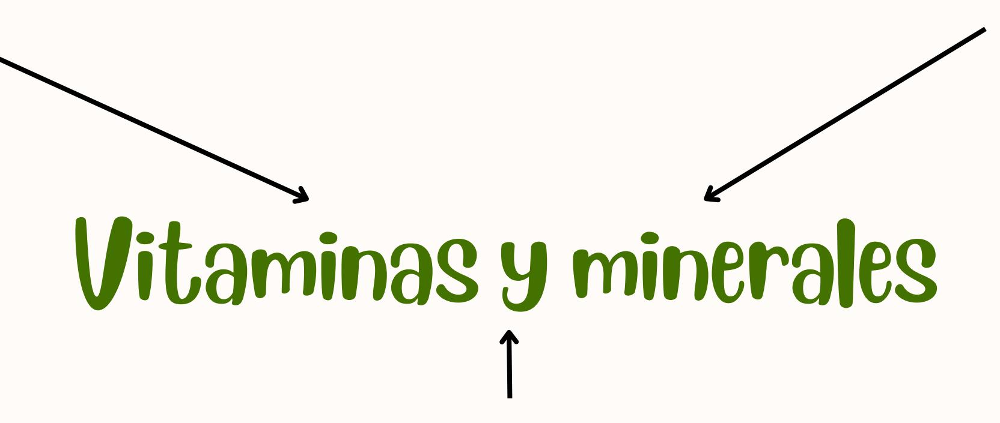

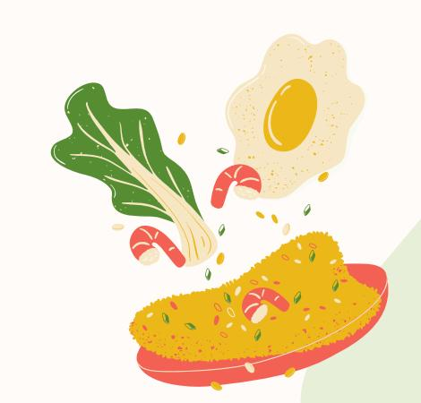

### **Efectos en la salud**

**Las vitaminas y minerales desempeñan funciones vitales en el metabolismo, el sistema inmunológico, la salud ósea, la producción de energía y la protección celular. Cada vitamina y mineral tiene funciones específicas en el organismo y deficiencias o excesos pueden tener efectos negativos en la salud.**

## Herencia y evolución

**1.ciclocelular**

**2. biotecnologia**

### 1. Ciclo celular **interfase, mitosisy meiosis**

**Durante la interfase, la cromatina está descondensada y se asocia a proteínas histonas formando nucleosomas.**

**En la mitosis, la cromatina se condensa aún más y forma cromosomas visibles bajo el microscopio.**

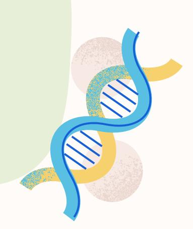

Estructura de la cromatina

**La cromatina es la forma en la que el ADN se organiza en el núcleo de las células eucariotas.**

**Durante la replicación del ADN, la cromatina se compacta más.**

> **La estructura de la cromatina varía durante el ciclo celular, permitiendo la accesibilidad del ADN, la replicación precisa y la formación de cromosomas para la división celular.**

**La condensación de la cromatina en la mitosis es esencial para la segregación precisa del material genético durante la división celular.**

**La cromatina es la forma en la que el ADN se organiza en el núcleo de las células eucariotas**

**Durante la interfase, la cromatina está en una forma descondensada.**

**La estructura de la cromatina varía durante el ciclo celular, permitiendo la accesibilidad del ADN, la replicación precisa y la formación de cromosomas para la división celular.**

Grados de compactación

**En la fase S de la interfase, la cromatina se compacta más debido a la replicación del ADN.**

**La condensación de la cromatina en la mitosis es esencial para la correcta segregación del material genético durante la división celular.**

**Durante la mitosis, la cromatina se condensa aún más y forma cromosomas visibles.**

### Puntos de control

**Los puntos de control G1, G2 y Metafase son fundamentales para mantener la integridad del ciclo celular y evitar la proliferación celular descontrolada. Estos puntos de control evalúan la calidad y la integridad del ADN, así como las condiciones adecuadas para la progresión del ciclo y la correcta segregación de los cromosomas**

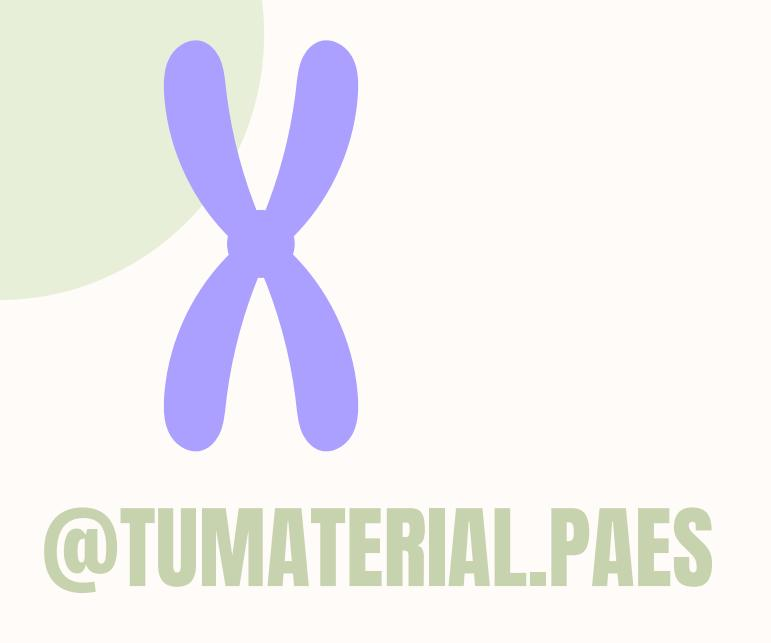

**Marca la transición entre la fase G1 y la fase S, iniciando la replicación del ADN.**

**Asegura que se hayan cumplido las condiciones necesarias para la entrada en la fase S.**

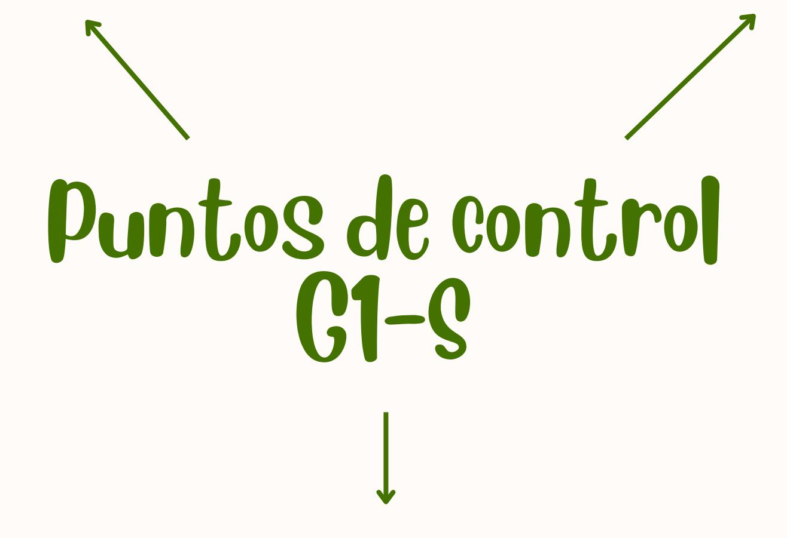

**Verifica si el ADN está íntegro y si se han completado los procesos previos a la replicación del ADN.**

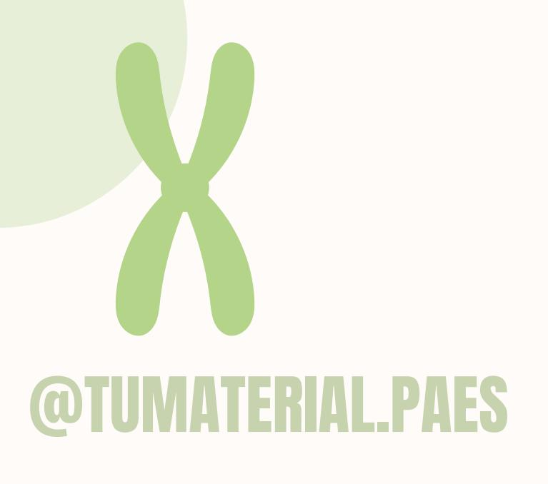

**Verifica que se hayan cumplido todas las condiciones para entrar en la fase de mitosis.**

**Se asegura de que la replicación del ADN se haya completado de manera exitosa.**

Puntos de control G2-M

**Evalúa la integridad del ADN y si hay daños en los cromosomas antes de la segregación cromosómica.**

**Detiene la progresión del ciclo celular si se detectan errores en la replicación del ADN o si hay daños no reparados.**

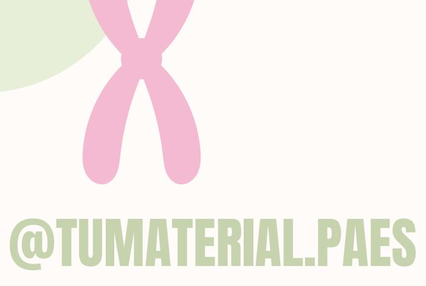

**Ocurre durante la mitosis, en la etapa de metafase.**

**Verifica si los cromosomas se han alineado correctamente en el plano ecuatorial de la célula.**

**Detiene la progresión del ciclo celular si los cromosomas no están correctamente alineados.** **Asegura una distribución precisa de los cromosomas durante la segregación cromosómica en la anafase.**

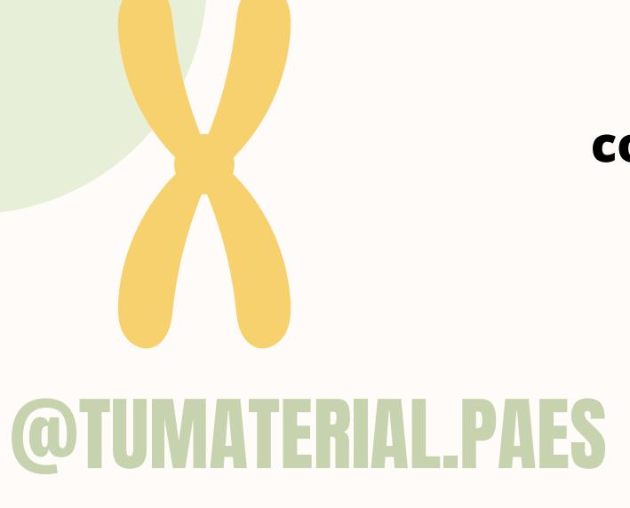

**Punto de control G1-S: Verifica las condiciones favorables y la integridad del ADN antes de la entrada en la fase S. Evita la replicación del ADN en caso de daños o condiciones desfavorables.**

**Los puntos de control son esenciales para mantener la integridad del genoma y la conservación de la información genética durante la división celular.**

Efecto sobre la progresión normal del ciclo

**Punto de control G2-M: Evalúa la replicación correcta del ADN y las condiciones adecuadas para entrar en la fase de mitosis. Detiene la progresión si se detectan errores o daños no reparados.**

**Los puntos de control regulan la progresión normal del ciclo celular y evitan la proliferación celular descontrolada.**

**Punto de control en Metafase: Verifica el alineamiento correcto de los cromosomas en el plano ecuatorial antes de la segregación cromosómica. Asegura una distribución precisa del material genético en la anafase.**

### Etapas de la interfase

**Se sintetizan proteínas y se duplican los orgánulos.**

**Se produce un crecimiento celular activo.**

**La célula realiza sus funciones normales y se prepara para la replicación del ADN.**

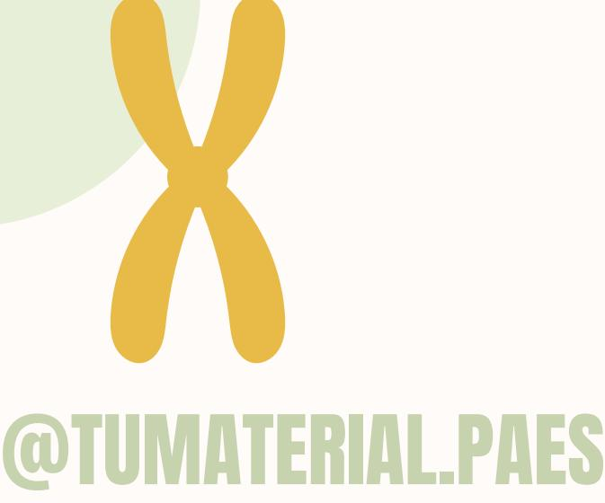

**Cruze por el punto de control G1-S, donde se evalúa si las condiciones son favorables para entrar en la fase S.**

### Etapas de la interfase

**El ADN se duplica para formar dos copias idénticas de cada cromosoma.**

**Se forman las cromátidas hermanas, que están unidas en el centrómero.**

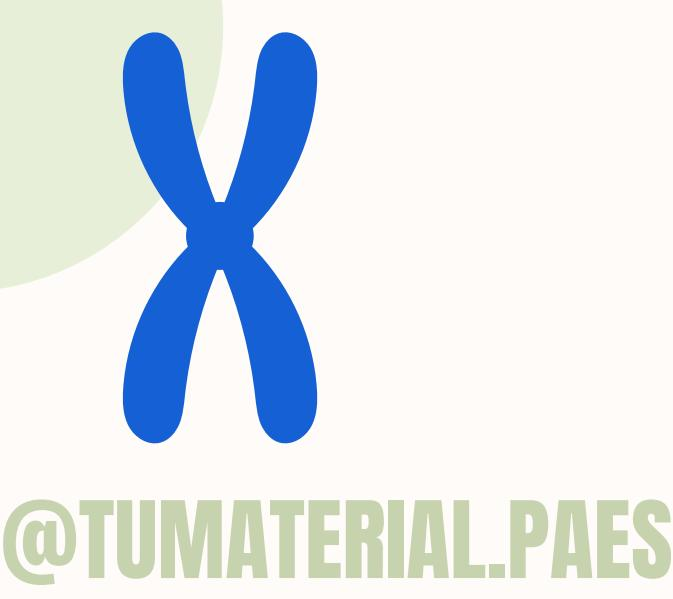

**Es una fase crítica para la conservación de la información genética.**

### Etapas de la interfase

**La célula se prepara para la división celular (mitosis).**

**Se continúa el crecimiento celular y la síntesis de proteínas y orgánulos.**

Fase G2

**(Fase de crecimiento 2)**

**Cruze por el punto de control G2-M, donde se verifica si el ADN se ha replicado correctamente y si las condiciones son adecuadas para entrar en la fase de mitosis.**

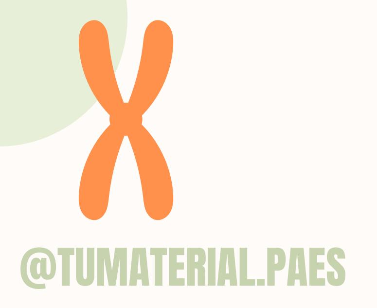

**La envoltura nuclear se desintegra, permitiendo el acceso de los microtúbulos del huso mitótico al material genético.**

**Los cromosomas comienzan a condensarse y hacerse visibles bajo el microscopio.**

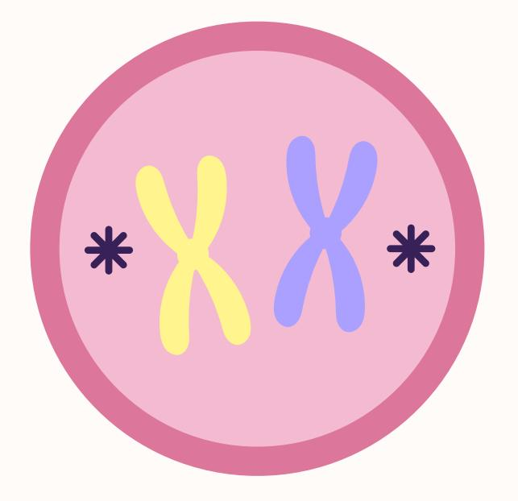

**Los centríolos se separan y se mueven hacia los polos opuestos de la célula.**

@TUMATERIAL.PAES

Metafase

**Los cromosomas se alinean en el plano ecuatorial de la célula, formando una estructura llamada placa metafásica.**

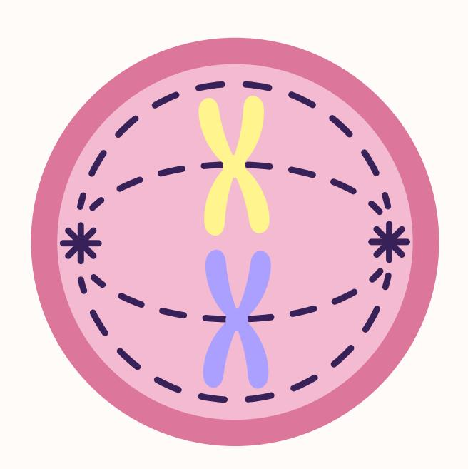

Anafase

**Los centrómeros de los cromosomas se dividen, separando las cromátidas hermanas.**

**Los microtúbulos del huso mitótico se acortan y arrastran las cromátidas hermanas hacia los polos opuestos de la célula.**

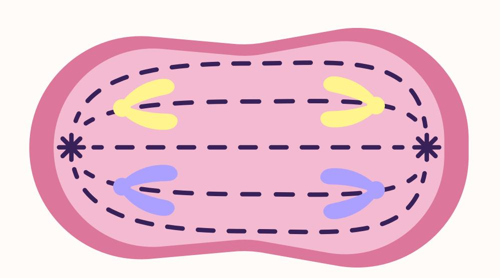

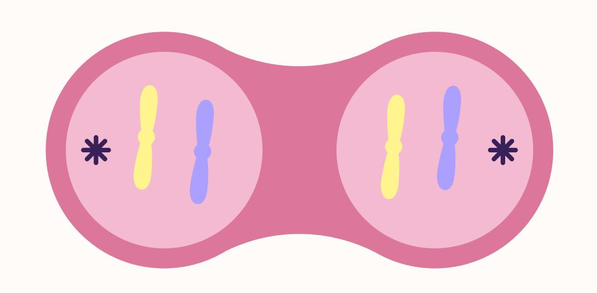

### Telofase

**Los cromosomas llegan a los polos opuestos de la célula y comienzan a descondensarse.**

**Se forman nuevas envolturas nucleares alrededor de cada conjunto de cromosomas.**

**La citocinesis ocurre durante esta etapa, células hijas.**

### **CONSERVACIÓN DE LA INFORMACIÓN GENÉTICA**

**La mitosis asegura que cada célula hija reciba una copia exacta y completa del material genético de la célula madre.**

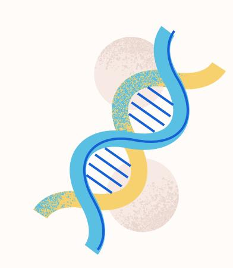

**Esto es esencial para mantener la estabilidad genética a lo largo de las generaciones celulares y para transmitir la información genética de manera precisa a las células hijas.**

**Durante la mitosis, los cromosomas se replican y se segregan de manera precisa, garantizando que las células hijas tengan la misma información genética que la célula progenitora.**

### **PROCESOS DE CRECIMIENTO, DESARROLLO, REPARACIÓN DE TEJIDOS Y CÁNCER.**

**La mitosis es crucial para el crecimiento, desarrollo y reparación de tejidos en organismos multicelulares.**

**Juega un papel fundamental en la reparación de tejidos dañados.**

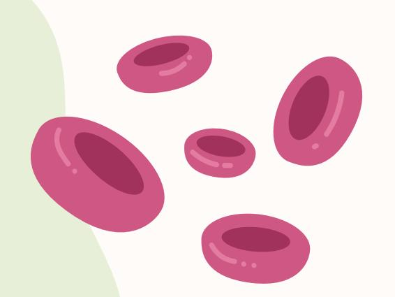

**Contribuye al aumento en tamaño y formación de tejidos y órganos.**

**Permite la generación de células hijas adicionales.**

**Desregulaciones en la mitosis pueden llevar a la proliferación celular descontrolada.**

**El estudio y la regulación adecuada de la mitosis son importantes para mantener la homeostasis celular y prevenir trastornos en el crecimiento, desarrollo y enfermedades relacionadas con la proliferación celular anormal.**

**Se compone de dos divisiones nucleares: meiosis I y meiosis II. Profase I**

### **MEIOSIS I**

**En la meiosis I, los cromosomas homólogos se separan, reduciendo el número de cromosomas a la mitad en las células hijas.**

**Durante la profase I de la meiosis I, ocurre el entrecruzamiento, intercambiando material genético entre cromosomas homólogos, lo que aumenta la variabilidad genética.**

**En la anafase I de la meiosis I, los cromosomas homólogos se separan aleatoriamente, promoviendo la segregación aleatoria de los alelos maternos y paternos en diferentes células hijas.**

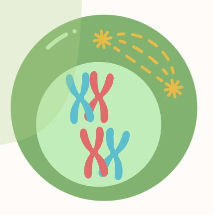

### **Metafase I**

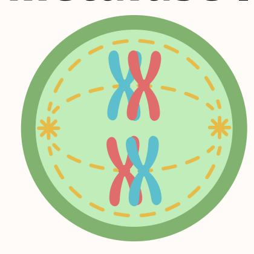

### **Anafase I**

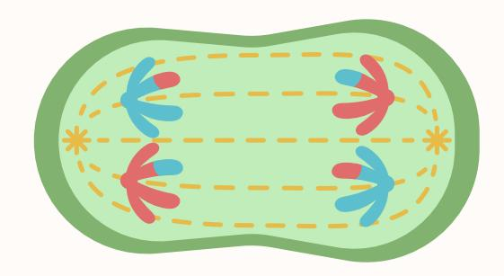

### **Telofase I**

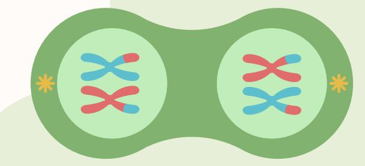

**Se compone de dos divisiones nucleares: meiosis I y meiosis II. Profase II**

### **MEIOSIS II**

**La meiosis II es similar a una división celular mitótica, donde las cromátidas hermanas se separan y se forman células hijas haploides.**

**La meiosis contribuye a la variabilidad genética mediante el entrecruzamiento, la segregación independiente y la recombinación genética.**

**La variabilidad genética resultante es esencial para la evolución y adaptación de las especies.**

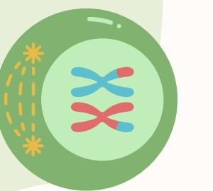

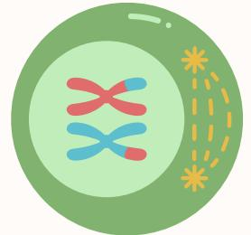

### **Metafase II**

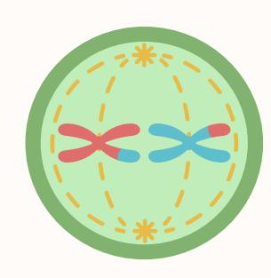

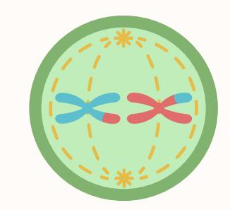

### **Anafase II**

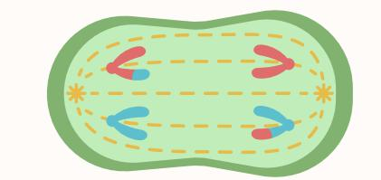

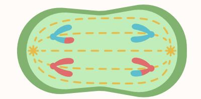

### **Telofase II**

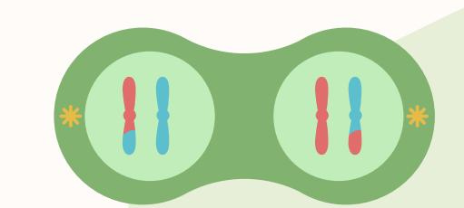

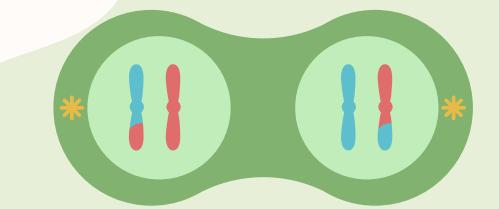

## 2. Biotecnología

### Manipulación genética

**La manipulación genética, también conocida como ingeniería genética, es el proceso de modificar el material genético de un organismo mediante técnicas científicas. Esta tecnología ha tenido aplicaciones en diversos campos, incluyendo la generación de alimentos, detergentes, vestuario y fármacos.**

### **Generación de alimentos**

- **· Cultivos transgénicos para mejorar resistencia a plagas y enfermedades.**
- **· Mejora de características nutricionales en alimentos.**
- **· Aumento de la vida útil de los alimentos.**

- **· Uso de enzimas modificadas genéticamente para mejorar la eficiencia de los detergentes.**
- **· Utilización de microorganismos modificados genéticamente para producir enzimas específicas.**

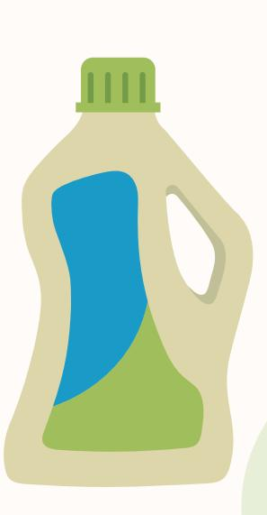

@TUMATERIAL.PAES

### **Fármacos**

- **· Producción de proteínas terapéuticas utilizando microorganismos o células modificadas genéticamente.**
- **· Medicina personalizada basada en la genética individual de los pacientes.**

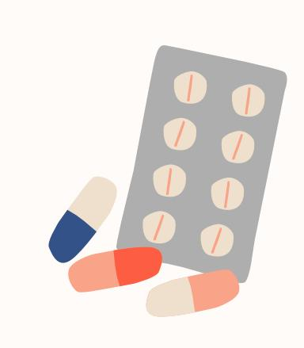

### **Vestuario**

- **· Desarrollo de fibras sintéticas modificadas genéticamente con propiedades mejoradas.**
- **· Producción de colorantes y pigmentos naturales a través de organismos modificados genéticamente.**

### **Terapia génica**

**· La manipulación genética para corregir genes defectuosos y tratar enfermedades genéticas.**

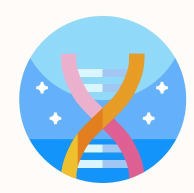

### **Mejoramiento de cultivos**

**· La modificación genética de cultivos para aumentar la productividad y la resistencia a plagas y condiciones adversas.**

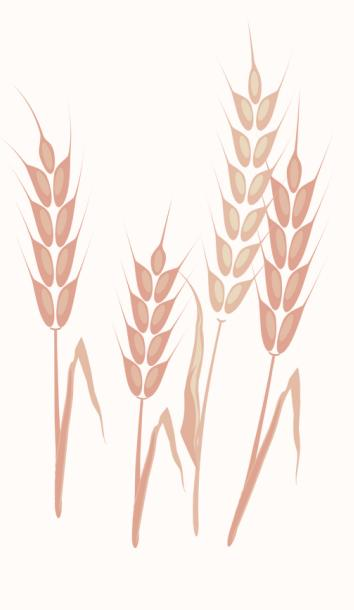

## Organismo y ambiente

**1.Fotosíntesisy respiración celular** 2.**Flujo de materia yenergía en lascadenasytramastróficas**

## 1. Fotosíntesis y respiración celular

### Rol general

**Los procesos de obtención de energía y síntesis de moléculas orgánicas desempeñan un papel fundamental en los ecosistemas y son realizados por organismos autótrofos y heterótrofos.**

### **Fotosíntesis**

**Los organismos fotosintéticos, como las plantas, convierten la energía solar en energía química en forma de moléculas orgánicas (glucosa) durante la fotosíntesis. La fotosíntesis es responsable de la producción primaria en los ecosistemas y proporciona la base alimentaria para otros organismos.**

### **Respiración celular**

**Tanto los organismos autótrofos como los heterótrofos realizan la respiración celular para liberar energía de las moléculas orgánicas y utilizarla para llevar a cabo funciones vitales. Durante la respiración celular, se consume oxígeno y se produce dióxido de carbono.**

### Nutrición autótrofa y heterótrofa

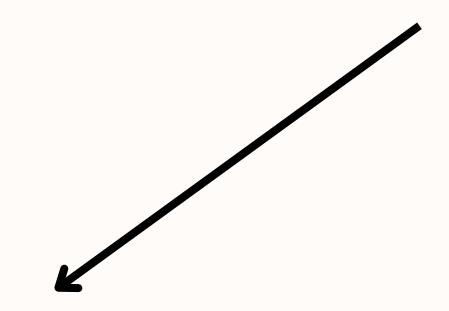

**Los organismos autótrofos, como las plantas, son capaces de producir su propio alimento utilizando la energía solar a través de la fotosíntesis. Son capaces de convertir la energía luminosa en energía química, almacenada en forma de glucosa y otras moléculas orgánicas.**

**Los organismos heterótrofos obtienen su alimento consumiendo a otros organismos o materia orgánica. No son capaces de realizar la fotosíntesis y dependen de los organismos autótrofos para obtener la energía y los compuestos orgánicos necesarios para su supervivencia.**

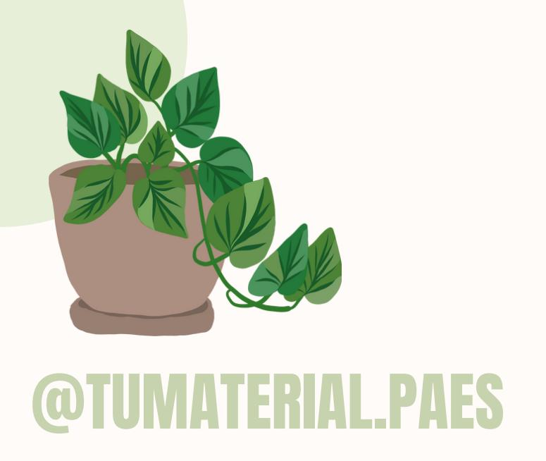

### Fotosíntesis

- **· Lugar: Membranas de los tilacoides en los cloroplastos.**
- **· Reactantes: Luz solar, agua.**
- **· Productos: Oxígeno, ATP (trifosfato de adenosina) y NADPH (nicotinamida adenina dinucleótido fosfato reducido).**
- **· Otras moléculas: Pigmentos como la clorofila y los sistemas de transporte de electrones.**

### **Etapa de la luz dependiente: Etapa de la fijación del carbono (ciclo de Calvin):**

- **· Lugar: Estroma de los cloroplastos.**
- **· Reactantes: Dióxido de carbono, ATP y NADPH generados en la etapa anterior.**
- **· Productos: Glucosa y otros compuestos orgánicos.**
- **· Otras moléculas: Enzimas como la rubisco y otros intermediarios químicos.**

### Fotosíntesis

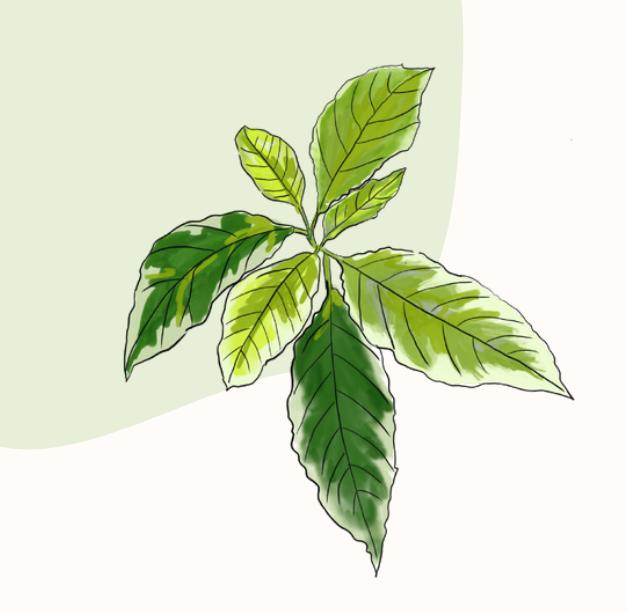

### **Efecto de variables ambientales en la fotosíntesis:**

**· Temperatura: La fotosíntesis tiene una temperatura óptima, y tanto temperaturas muy bajas como muy altas pueden afectar negativamente la actividad enzimática y, por lo tanto, la fotosíntesis.**

**· Luz: La fotosíntesis requiere luz para ser activada, pero tanto la falta como el exceso de luz pueden inhibir el proceso.**

## 2. Flujo de materia y energía en las cadenas y tramas tróficas

**En la cima de la cadena trófica se encuentran los depredadores tope, que no tienen depredadores naturales.**

**Una cadena trófica es una secuencia lineal de organismos en un ecosistema, donde cada organismo se alimenta del precedente y es a su vez el alimento del siguiente.**

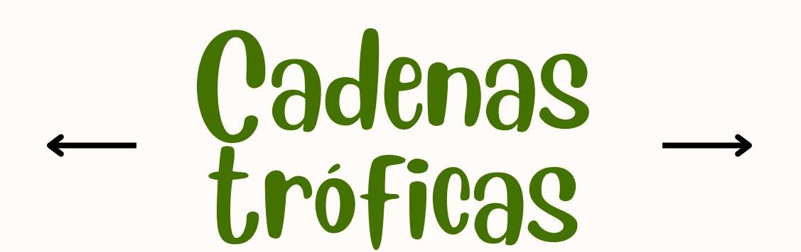

**Las cadenas tróficas generalmente comienzan con productores, que son organismos autótrofos que realizan la fotosíntesis y capturan la energía solar para producir alimentos.**

**Los consumidores primarios son organismos herbívoros que se alimentan de los productores. Luego, los consumidores secundarios son organismos carnívoros que se alimentan de los consumidores primarios, y así sucesivamente.**

**Los niveles tróficos son posiciones jerárquicas en una cadena trófica, que indican la posición de un organismo en relación a la fuente de energía y la transferencia de nutrientes.**

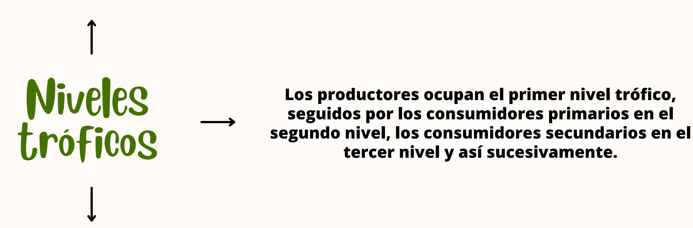

**Los descomponedores, como los hongos y las bacterias, son organismos que descomponen la materia orgánica muerta y los desechos, cerrando el ciclo de nutrientes en el ecosistema.**

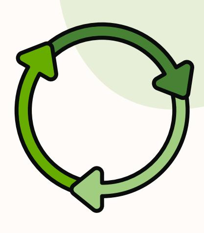

**La energía fluye a través de los niveles tróficos en un ecosistema, desde los productores hasta los consumidores y, finalmente, a los descomponedores.**

**A medida que la energía se transfiere de un nivel trófico a otro, se pierde en forma de calor debido a los procesos metabólicos y la respiración celular**

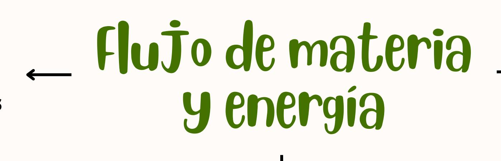

**La energía transferida se utiliza para el crecimiento, el movimiento, la reproducción y otras actividades metabólicas de los organismos.**

**La materia, como nutrientes y compuestos orgánicos, también fluye a través de los niveles tróficos, pero en general, se recicla en el ecosistema mediante la acción de los descomponedores.**

