# **Ensayo 1 Prueba de Acceso a la Educación Superior Comprensión Lectora SOLUCIONARIO**

### **Lectura 1 (preguntas 1 a 7)**

Fragmento de un artículo de opinión escrito por Jorge Calvo, Director Tecnología Innovación en Colegio Europeo de Madrid, publicado en *Educación 3.0* en 2022.

### **Algoritmos en redes sociales: ¿cómo afecta a los niños y adolescentes?**

*Los algoritmos propician que los menores queden más expuestos a ciertos contenidos y puede aumentar su adicción a las redes sociales. Así lo apunta en este artículo Jorge Calvo, Director Tecnología Innovación en Colegio Europeo de Madrid.*

- 1. ¿Qué está ocurriendo en nuestra sociedad cuando hablamos de redes sociales? Su creciente uso ha hecho que surjan preocupaciones éticas y de privacidad con respecto a la gestión de los datos y cómo estas mismas redes entrenan algoritmos para organizar el contenido que muestra a sus usuarios.
- 2. Anteriormente se podía medir si un producto funcionaba mejor o tenía mayor impacto después de haberlo publicitado y analizado, pero ahora el escenario ha cambiado y las empresas están midiendo si las personas cambian sus comportamientos mientras navegan, visualizan e interactúan, y donde los 'feeds' de cada usuario se ajustan constantemente para obtener la información deseada. En resumen, nuestro comportamiento se está convirtiendo en un producto.
- 3. Toda esta forma de alimentar a estos algoritmos para que nos conozcan y recomienden cada vez de forma más efectiva se logra principalmente a través de los dispositivos personales conectados. Recopilan datos sobre las comunicaciones, los intereses, los movimientos, el contacto con los demás, las reacciones emocionales ante las circunstancias, las expresiones faciales, las compras, los signos vitales de cada persona: una variedad de datos ilimitada y en constante crecimiento.

### **Mayor consumo de tiempo**

- 4. Los feeds personalizados se optimizan para 'atraer' a cada usuario, a menudo con señales emocionalmente potentes, lo que puede llevar con más frecuencia en edades más tempranas a una cierta adicción. El objetivo es hacer que cada vez se pase más tiempo en el sistema, de esta forma la cantidad de datos será mayor y la optimización de los algoritmos será exponencial.
- 5. Las redes sociales impactan en los menores de manera diferente según sus fortalezas y vulnerabilidades. Para algunos, su uso tiende a ser relativamente neutral o quizás

incluso beneficioso. Sin embargo, para muchos otros, los efectos positivos y negativos pueden amplificarse. Por eso estos algoritmos de inteligencia artificial pueden manipular con mayor facilidad la conducta. Efectos como las conocidas 'jaulas de oro' provocan que los adolescentes vayan cerrando su círculo de visualización e interacción sobre temas muy concretos, perdiendo la información de otros contenidos y la percepción más amplia de lo que están visualizando.

6. Actualmente existen algoritmos que en apenas 120 minutos de interacción son capaces de conocer los puntos de interés y de mayor atención de un usuario con una fiabilidad por encima del 84%. Atendiendo a este dato se podría afirmar que un adolescente que acceda por primera vez a una red social estará viendo un contenido sesgado por los algoritmos al segundo día de uso. 

https://www.educaciontrespuntocero.com/opinion/algoritmos-redes-sociales/

- 1. Según el autor, ¿qué consecuencia tendrían los algoritmos?
  - A) Propiciarían un mayor control de la privacidad con respecto a la gestión de los datos.
  - B) Alimentaría el sentimiento de soledad y aislamiento de los usuarios independiente de su edad.
  - C) Cambiarían completamente la forma de publicitar y de comprar un determinado producto.
  - **D) Podrían aumentar la adicción de los niños y adolescentes a las redes sociales.**

**Correcta:** D

**Habilidad:** Localizar

**Defensa:** La información se encuentra textual en la bajada del artículo: "Los algoritmos propician que los menores queden más expuestos a ciertos contenidos y puede aumentar su adicción a las redes sociales." Asimismo, el texto señala que "Los feeds personalizados se optimizan para 'atraer' a cada usuario, a menudo con señales emocionalmente potentes, lo que puede llevar con más frecuencia en edades más tempranas a una cierta adicción." Por lo tanto, el aumento de la adicción a las redes sociales es la principal consecuencia de los algoritmos según el autor.

2. ¿Qué función cumple la pregunta formulada al inicio del segundo párrafo?

¿Qué está ocurriendo en nuestra sociedad cuando hablamos de redes sociales? Su creciente uso ha hecho que surjan preocupaciones éticas y de privacidad con respecto a la gestión de los datos y cómo estas mismas redes entrenan algoritmos para organizar el contenido que muestra a sus usuarios. 

- A) Expresar la incertidumbre que caracteriza a los tiempos actuales.
- B) Criticar el uso indiscriminado de los nuevos dispositivos tecnológicos.
- **C) Motivar la reflexión del lector sobre el uso de las redes sociales.**
- D) Evidenciar el problema que surge de la masificación de la tecnología.

**Correcta:** C

**Habilidad:** Interpretar

**Defensa:** La interrogante planteada corresponde a una pregunta retórica, cuya función es promover la reflexión e invitar al lector a pensar en los problemas que trae el creciente uso de las redes sociales en la sociedad actual. Estos problemas son mencionados en el párrafo para introducir el tema de los algoritmos que se desarrollará en el resto de la lectura.

- 3. Según la lectura, las redes sociales utilizan los algoritmos para:
  - A) medir cuánto tiempo permanecen los usuarios navegando en internet.
  - **B) organizar el contenido que muestran a sus usuarios de manera personalizada.**
  - C) mejorar las interacciones de los niños y adolescentes con las publicaciones.
  - D) manipular la conducta de las personas recomendándoles contenido sesgado.

**Correcta:** B

**Habilidad:** Localizar

**Defensa:** El texto señala explícitamente que las redes "entrenan algoritmos para organizar el contenido que muestra a sus usuarios." La alternativa D no es correcta porque si bien en el texto se menciona que las redes sociales manipulan la conducta de las personas, esto no corresponde a la finalidad con la que las redes sociales crearon los algoritmos, sino que es una consecuencia que se deriva de ellos.

- 4. A partir de lo señalado en el texto, se puede inferir que los llamados "feeds" corresponden a:
  - A) las publicaciones que sube cada usuario a la web.
  - B) las interacciones entre distintas cuentas personales.
  - C) los anuncios publicitarios que aparecen en internet.
  - **D) los contenidos que se muestran en las redes sociales.**

**Correcta:** D

**Habilidad:** Interpretar

**Defensa:** En el texto se menciona que "los 'feeds' de cada usuario se ajustan constantemente para obtener la información deseada" y que "Los feeds personalizados se optimizan para 'atraer' a cada usuario", por lo tanto, es posible concluir que los feeds son todos los contenidos que un usuario puede visualizar al navegar en las redes sociales.

- 5. ¿A qué se refiere el efecto 'jaulas de oro' mencionado por el autor en el penúltimo párrafo?
  - A) A la sensación de encierro y soledad que tienen los niños y los adolescentes en sus hogares.
  - B) Al aislamiento social producido por el excesivo uso de los dispositivos personales conectados.
  - C) Al ensimismamiento y pérdida de conexión con el mundo real que ocasiona el internet.
  - **D) A la limitación de temas y perspectivas que provocan las redes sociales con sus algoritmos.**

**Correcta:** D

**Habilidad:** Interpretar

**Defensa:** En el penúltimo párrafo dice "Efectos como las conocidas 'jaulas de oro' provocan que los adolescentes vayan cerrando su círculo de visualización e interacción sobre temas muy concretos, perdiendo la información de otros contenidos y la percepción más amplia de lo que están visualizando." Por ende, D es correcta.

- 6. ¿Con qué propósito el autor recurre a los datos señalados en el último párrafo del texto?
  - **A) Demostrar la efectividad de los algoritmos en la restricción del contenido que visualizan los usuarios.**
  - B) Ejemplificar el funcionamiento de la publicidad en las redes sociales en nuestra sociedad actual.
  - C) Explicar los peligros que corren los niños y adolescentes al pasar tanto tiempo conectados.
  - D) Especificar las cifras que confirman los efectos negativos del uso de las redes sociales.

**Correcta:** A

**Habilidad:** Interpretar

**Defensa:** El último párrafo del texto se refiere principalmente al peligro que representa para los adolescentes el contenido que visualizan en las redes sociales, pues dada la alta efectividad de los algoritmos, demostrada con las cifras mencionadas, es muy probable que terminen viendo información sesgada o limitada a sus intereses.

- 7. ¿Cuál es la actitud que asume el autor frente a la temática planteada en el texto?
  - A) Desconfiada, porque desconoce los alcances que podría tener la innovación de las redes sociales para la vida de las personas.
  - **B) Preocupante, porque pone en evidencia los riesgos de los algoritmos de las redes sociales para los niños y adolescentes.**
  - C) Neutral, porque comenta tanto las ventajas como las desventajas que tiene el uso de internet en la sociedad de hoy en día.
  - D) Optimista, porque destaca los avances que ha logrado la inteligencia artificial en materia de información y comunicación.

**Correcta:** B

**Habilidad:** Evaluar

**Defensa:** Según lo planteado por el autor, los algoritmos que utilizan las redes sociales para personalizar el contenido que se muestra a los usuarios podría producir ciertos riesgos en los niños y adolescentes. El principal riesgo sería el mayor consumo de tiempo o la adicción, debido a que los algoritmos son tan efectivos que seleccionan contenido exclusivo según el interés demostrado por el usuario, lo cual implicaría un mayor riesgo de manipulación, pues se estaría accediendo a contenido sesgado. Por lo tanto, la actitud del autor es preocupante.

### **Lectura 2 (preguntas 8 a 16)**

Fragmento de un cuento escrito por Virginia Wolff publicado en *La casa encantada* (1944).

1. Mabel tuvo la primera sospecha seria de que algo no iba bien al quitarse la capa; y la señora Barnet, al alcanzarle el espejo y tomar los cepillos, llamó su atención —un tanto exageradamente tal vez— sobre la ropa en la mesa y todos los artefactos para arreglar el cabello, cuidar el cutis y la ropa, que yacían sobre el tocador, confirmando así la sospecha, de que algo no iba bien, nada bien; y la sospecha aumentaba mientras subía las escaleras y se arrebataba sobre Clarissa Dalloway; y después de saludarla, corrió hacia el fondo de la habitación, donde en un rincón oscuro colgaba un espejo, y se miró. ¡No! No estaba bien. Y de inmediato, la tristeza que siempre intentaba ocultar, esa profunda insatisfacción —la sensación de inferioridad que siempre, desde niña, había sentido frente a las otras personas— se fue apoderando de ella, implacable, sin piedad, con una intensidad de la que no podía librarse leyendo a Borrow o Scott como lo hacía en su casa al despertarse por las noches; porque estos hombres, estas mujeres, todos pensaban: «¿Qué se ha puesto Mabel? ¡Qué mal se ve! ¡Qué espantoso vestido!», pestañeando de prisa y entrecerrando los ojos. La deprimía su total incompetencia, su cobardía; su sangre fría. Y de inmediato, toda la habitación, donde durante horas había planeado con el modisto cómo sería, se veía sórdida, repulsiva. Y su sala de estar tan fea; y ella misma, que salió de su casa 

orgullosa, y antes de hacerlo tomó las cartas sobre la mesa del hall y dijo: «¡qué aburrido!» para presumir. Todo eso le parecía ahora tan estúpido, tan mediocre. Todo eso se destruyó, voló por los aires en el momento en que entró en la sala de estar de la señora Dalloway.

- 2. Lo que había pensado aquella tarde, sentada frente a las tazas de té, al llegar la invitación de la señora Dalloway, fue que, desde luego, no podía vestir a la moda. Era absurdo siquiera intentarlo. Moda era sinónimo de buen corte, de estilo, de treinta guineas de gasto al menos. ¿Pero por qué no ser original? ¿Por qué no ser ella misma después de todo? Se levantó y buscó el viejo figurín1 de su madre, un figurín del París del Imperio; y pensó cuánto más bonitas, más dignas, más femeninas eran las mujeres en ese tiempo. Entonces decidió —oh, qué idea más absurda— que intentaría parecerse a una de ellas, que presumiría de hecho, de ser modesta y anticuada; y se entregó sin dudarlo a una orgía de narcisismo, que merecía ser castigada, y salió así vestida.
- 3. Pero no se animó a mirarse al espejo. No pudo enfrentar todo el horror: el vestido de seda amarillo claro, ridículamente pasado de moda, con la falda larga y esas mangas aparatosas, y esa cintura, y todo aquello que se veía tan bien en el libro, pero no en ella, no entre todas esas personas comunes y corrientes. Se sintió el tonto maniquí de un modisto, puesto allí para que los jóvenes le pincharan alfileres.
- 4. —¡Pero querida, te ves encantadora! —dijo Rose Shaw mirándola de arriba abajo, frunciendo los labios con ironía tal como ella esperaba. Rose vestía completamente a la moda, al igual que todo el resto, siempre.
- 5. Somos como moscas arrastrándose hasta el borde del plato, pensó Mabel y repitió la frase como si estuviera exorcizándose, como si quisiera encontrar una fórmula para detener el dolor, para hacer tolerable la agonía. Cuando sentía dolor, citas de Shakespeare o pasajes de libros que había leído hacía años se le venían a la mente de repente, y las repetía una y otra vez. «Moscas arrastrándose», repitió. Si pudiera decirlo tantas veces como para llegar a ver efectivamente las moscas, se quedaría adormecida, quieta, muda. Ahora podía verlas salir lentamente de una jarra de leche, con las alas pegadas; y se esforzó más y más (de pie frente al espejo, escuchando a Rose Shaw) para ver a Rose Shaw y al resto de los invitados como moscas, intentando salir de algún lugar o meterse en otro, insignificantes, torpes moscas trabajando penosamente. Pero no podía verlos así, no a los otros. Podía verse a sí misma así; ella era una mosca, pero ellos eran libélulas, mariposas, insectos bellos, danzando, revoloteando, sobrevolando, mientras que sólo ella se arrastraba hasta el borde de la jarra. (La envidia y el resentimiento, los sentimientos más detestables, eran sus principales defectos).
- 6. —Me siento una horrible y deprimente mosca, vieja y sin gracia —dijo, haciendo que

1 Figurín: Dibujo o modelo pequeño para los trajes y adornos de moda.

Robert Haydon se detuviera justo para oírla decirlo, justo para reafirmarse articulando una frase de lo más pobre y así demostrar cuánto desencajaba, y qué bueno era que no se sintiera en absoluto fuera de lugar. Y desde luego, Robert Haydon respondió algo bastante correcto, bastante falso, que ella interpretó al instante, y se dijo a sí misma (otra frase sacada de un libro): «¡Mentiras, mentiras, mentiras!».

- 7. Pues una fiesta puede hacer todo mucho más real, o todo mucho menos real, pensó. De repente vio en lo profundo el corazón de Robert Haydon, lo vio todo. Vio la verdad. Esto era verdad, esta sala, este ser y no el otro. El pequeño taller de la señorita Milan era realmente caluroso, viciado, sórdido. Olía a ropa y a repollo cocinándose; y aún, cuando la señorita Milan puso el espejo en su mano y ella se miró con el vestido terminado, una dicha extraordinaria le atravesó el pecho. Bañada en luz, sintió que volvía a nacer. Libre de cuidados y arrugas, lo que había soñado de sí misma estaba allí: una mujer bella. Por un segundo (no se atrevió a mirar más tiempo, la señorita Milan quería saber el largo de la falda) la miró, dentro del marco de caoba, con ese estrafalario atuendo, una joven encantadora, de tez blanca y sonrisa misteriosa; su esencia, su alma. Y no era simple vanidad o narcisismo lo que la hacía pensar que era un alma buena, cariñosa y sincera. La señorita Milan dijo que la falda no podía ser más larga. En todo caso, dijo frunciendo el ceño, muy concentrada en su trabajo, debía ser más corta. Y de repente se sintió, honestamente, llena de amor por ella; sintió que la quería más que a nadie en el mundo, y podría haber llorado de tristeza al verla en el suelo, con la boca llena de alfileres, el rostro rojo y esos ojos saltones. Que un ser humano hiciera algo así por otro; y los vio a todos como simples seres humanos, y a ella yendo a la fiesta, y a la señorita Milan tapando la jaula del canario o dejándolo agarrar una semilla de cáñamo de entre sus labios. Y pensar en eso, pensar en ese costado de la naturaleza humana, en su paciencia y su tolerancia, y que esté satisfecha con placeres tan sencillos, tan escasos, tan pequeños, le llenó los ojos de lágrimas. Y ahora todo había desaparecido. El vestido, la habitación, el amor, la tristeza, el espejo, la jaula del canario… Todo había desaparecido, y allí estaba, en el rincón de la sala de estar de la señora Dalloway, padeciendo ese martirio, despertando a la realidad.
- 8. A su edad y con dos hijos, era un síntoma de tanta mezquindad, de tanta debilidad y falta de inteligencia, seguir dependiendo tanto de las opiniones de los otros; no tener principios ni convicciones. No ser capaz de decir como otras personas: «¡Eso es Shakespeare! ¡Eso es la muerte! No somos más que una gota de agua en el océano», o lo que fuera que dijesen.

### 8. ¿Cuál es la relación entre el primer párrafo y el segundo?

|    | El primer párrafo:                                                                                               | El segundo párrafo:                                                         |
|----|------------------------------------------------------------------------------------------------------------------|-----------------------------------------------------------------------------|
| A) | describe la sensación de inferioridad que siente Mabel al entrar a la sala de estar de la señora Dalloway. | relata los hechos anteriores de la vida de Mabel.                        |
| B) | resume los problemas psicológicos de Mabel desde su infancia hasta la fiesta de la señora Dalloway.        | narra los sucesos ocurridos durante el encuentro con la señora Dalloway. |
| C) | explica los acontecimientos previos a que Mabel recibiera la invitación de la señora Dalloway.             | refiere los pensamientos y divagaciones de Mabel.                        |
| D) | muestra lo ridícula que se siente Mabel con su vestido nuevo al compararse con la señora Dalloway.         | explica de dónde sacó Mabel su vestido nuevo.                            |

**Correcta:** D

**Habilidad:** Interpretar

**Defensa:** El contenido principal del primer párrafo se refiere a la incomodidad que siente Mabel cuando repara en la elegancia y sofisticación de la señora Dalloway, la cual se refleja en los artículos que observa en su tocador. Al saludar a la señora Dalloway, Mabel confirma su vergüenza, pues su forma de vestir no era apropiada: "algo no iba bien, nada bien; y la sospecha aumentaba mientras subía las escaleras y se arrebataba sobre Clarissa Dalloway; y después de saludarla, corrió hacia el fondo de la habitación, donde en un rincón oscuro colgaba un espejo, y se miró. ¡No! No estaba bien". Esta sensación de estar fuera de lugar se expresa claramente en el texto cuando se señala lo que cree Mabel que piensan los demás invitados: estos hombres, estas mujeres, todos pensaban: «¿Qué se ha puesto Mabel? ¡Qué mal se ve! ¡Qué espantoso vestido!».

Si bien el texto menciona el sentimiento de inferioridad de Mabel, este proviene de su historia personal, desde la infancia, y no es consecuencia del encuentro con la señora Dalloway, como se expresa en la alternativa A.

Por otro lado, el segundo párrafo indica que "Lo que había pensado aquella tarde, sentada frente a las tazas de té, al llegar la invitación de la señora Dalloway, fue que, desde luego, no podía vestir a la moda." De esta manera, se introduce información sobre la decisión que tomó Mabel respecto a cómo ir vestida a la fiesta de la señora Dalloway: "Se levantó y buscó el viejo figurín de su madre, un figurín del París del Imperio; y pensó cuánto más bonitas, más dignas, más femeninas eran las mujeres en ese tiempo."

- 9. ¿Cuál es el principal conflicto de Mabel?
  - A) La angustia frente a la certeza de que todos, independiente de la clase social, son iguales ante la muerte.
  - **B) La frustración por no poder vestir elegante y a la moda como las mujeres de su círculo social.**
  - C) La falta de autoestima producto de una infancia marcada por la pobreza y el poco reconocimiento.
  - D) El pesimismo que le provoca el vivir una vida vacía, cuyo sentido intenta encontrarlo en fiestas.

**Correcta:** B

**Habilidad:** Interpretar

**Defensa:** El diálogo interno de la protagonista deja ver que no tiene la posibilidad de vestirse a la moda y por ello, se siente frustrada, lo cual se indica en los párrafos 3 y 4: "No pudo enfrentar todo el horror: el vestido de seda amarillo claro, ridículamente pasado de moda, con la falda larga y esas mangas aparatosas, y esa cintura, y todo aquello que se veía tan bien en el libro, pero no en ella (…) Rose vestía completamente a la moda, al igual que todo el resto, siempre."

- 10. La protagonista, Mabel, es descrita como una mujer:
  - A) mentirosa y ambiciosa.
  - **B) vanidosa y envidiosa.**
  - C) indecisa y ensimismada.
  - D) humilde y encantadora.

**Correcta:** B

**Habilidad:** Localizar

**Defensa:** La información que se requiere para responder esta pregunta se encuentra textual en el párrafo 5, donde el narrador comenta que "La envidia y el resentimiento, los sentimientos más detestables, eran sus principales defectos".

- 11. . En el contexto del párrafo 5, ¿cómo se puede interpretar la frase "Somos como moscas arrastrándose hasta el borde del plato"?
  - **A) Mabel posee tanta inseguridad que se siente indigna en la fiesta.**
  - B) Mabel le tenía asco a los insectos, especialmente a las moscas.
  - C) Mabel cree que todos buscamos la felicidad en algún lugar lejano.
  - D) Mabel considera que los invitados a la fiesta son insignificantes.

**Correcta:** A

**Habilidad:** Interpretar

**Defensa:** De acuerdo con lo narrado en el párrafo 5, se puede apreciar que Mabel se sentía como una mosca insignificante frente al resto de los invitados a la fiesta. Aunque ella quisiera sentir seguridad y confianza en sí misma durante el evento social, y poder despreciar al resto, no puede evitar su sensación de inferioridad: "se esforzó más y más (de pie frente al espejo, escuchando a Rose Shaw) para ver a Rose Shaw y al resto de los invitados como moscas, intentando salir de algún lugar o meterse en otro, insignificantes, torpes moscas trabajando penosamente. Pero no podía verlos así, no a los otros. Podía verse a sí misma así; ella era una mosca, pero ellos eran libélulas, mariposas, insectos bellos, danzando, revoloteando, sobrevolando, mientras que sólo ella se arrastraba hasta el borde de la jarra". Por lo tanto, la analogía que se establece con la imagen de la mosca arrastrándose hasta el borde del plato, representa su condición de invitada de segunda categoría.

- 12. La perspectiva que asume el narrador refleja:
  - A) los hechos que observa Mabel de forma objetiva.
  - B) la realidad concreta que rodea a Mabel y sus amigos.
  - **C) la subjetividad de Mabel, es decir, su mundo interior.**
  - D) sus propias apreciaciones sobre los acontecimientos.

**Correcta:** C

**Habilidad:** Evaluar

**Defensa:** Desde el primer párrafo es posible apreciar que el narrador narra los acontecimientos desde la perspectiva de Mabel, enfatizando sus sensaciones y percepciones de lo que va ocurriendo (su sospecha de que algo no iba bien, lo que piensa de sí misma y de los hechos) y cómo su propia inseguridad constituye un sesgo para interpretar la realidad.

- 13. ¿A qué se refiere fundamentalmente el párrafo 7?
  - A) Cómo era el taller de costura de la señorita Milan.
  - B) Las conversaciones que tiene Mabel durante la fiesta.
  - C) La entrañable amistad entre Mabel y la señorita Milan.
  - **D) Cómo se sentía Mabel con su vestido recién arreglado.**

**Correcta:** D

**Habilidad:** Interpretar

**Defensa:** La mayor parte del párrafo 7 se refiere a los hechos anteriores a la fiesta, cuando Mabel lleva su vestido al taller de la señorita Milan: "la señorita Milan puso el espejo en su mano y ella se miró con el vestido terminado, una dicha extraordinaria le atravesó el pecho. Bañada en luz, sintió que volvía a nacer. Libre de cuidados y arrugas, lo que había soñado de sí misma estaba allí: una mujer bella." La felicidad que Mabel sintió al verse con su vestido arreglado contrasta con cómo se siente en la fiesta: "Y ahora todo había desaparecido. El vestido, la habitación, el amor, la tristeza, el espejo, la jaula del canario… Todo había desaparecido, y allí estaba, en el rincón de la sala de estar de la señora Dalloway, padeciendo ese martirio, despertando a la realidad."

- 14. ¿Por qué Mabel suele recurrir a frases de Shakespeare?
  - A) Porque considera que Shakespeare es su escritor favorito.
  - **B) Porque le sirven para aliviar en cierta medida su angustia.**
  - C) Porque es un autor que conoce plenamente las emociones.
  - D) Porque en su literatura encuentra un escape a su realidad.

**Correcta:** B

**Habilidad:** Interpretar

**Defensa:** Para responder esta pregunta, se requiere relacionar los párrafos 5 y 8 que es donde se hace referencia a la costumbre de Mabel de recordar citas de Shakespeare o de otros escritores y determinar el sentido que para ella tiene este recurso considerando que su principal característica psicológica es la inseguridad y el sentimiento de inferioridad. En este sentido resulta correcta la alternativa B, ya que es lo que se puede interpretar a partir del siguiente fragmento: "Somos como moscas arrastrándose hasta el borde del plato, pensó Mabel y repitió la frase como si estuviera exorcizándose, como si quisiera encontrar una fórmula para detener el dolor, para hacer tolerable la agonía. Cuando sentía dolor, citas de Shakespeare o pasajes de libros que había leído hacía años se le venían a la mente de repente, y las repetía una y otra vez."

- 15. A partir de la lectura del último párrafo se infiere que Mabel:
  - A) es incapaz de conectarse con la realidad debido a su excesiva ensoñación.
  - B) está muy deprimida y eso le impide poder disfrutar de los encuentros sociales.
  - **C) duda de sí misma, por eso busca constantemente la aprobación de los demás.**
  - D) desea un cambio porque está disconforme con el estilo de vida que ha tenido.

**Correcta:** C

**Habilidad:** Interpretar

**Defensa:** El último párrafo de la lectura confirma que Mabel es una mujer totalmente insegura, pues siente que su valor depende de cómo la juzguen los demás: "A su edad y con dos hijos, era un síntoma de tanta mezquindad, de tanta debilidad y falta de inteligencia, seguir dependiendo tanto de las opiniones de los otros; no tener principios ni convicciones."

16. ¿Cuál de las siguientes opciones es una crítica social que se puede formular de acuerdo con la problemática narrada en el texto?

### **A) Las personas que creen que su valor está en lo material, solo encontrarán insatisfacción.**

- B) Quienes critican la apariencia de los otros deben aprender a apreciar también su interioridad.
- C) Tener la posibilidad de vestir a la moda no le da a las personas el derecho a burlarse de los demás.

D) Si un evento social no parece interesante ni entretenido, es preferible abstenerse de asistir.

**Correcta:** A

**Habilidad:** Evaluar

**Defensa:** En el texto se aprecia que la principal preocupación de la protagonista es cómo luce con su vestido y cómo es vista por los demás de acuerdo con su apariencia. El conflicto interno de Mabel, de estar o no a la moda, se puede trasladar a otros contextos en los que las personas sienten que van a ser juzgadas según la forma en que se visten o la marca de ropa que usan. Por lo tanto, el relato transmite una crítica hacia una dinámica social en la que lo material tiene tal nivel de importancia que los sujetos inseguros como Mabel desarrollan una permanente necesidad de autoafirmación a partir de cuánto tienen y no de cómo son.

# **Lectura 3 (preguntas 17 a 24)**

Noticia publicada por *Vegetarianos Hoy* en su sitio web el 24 de abril de 2022.

### **Día Mundial del Animal de Laboratorio: Camino al remplazo de la crueldad animal**

*Cada 24 de abril se conmemora este día para visibilizar la realidad de más de 190 millones de animales que año a año son víctimas de uso en experimentación científica, cosmética, higiene, farmacéutica, entre otras industrias.*

- 1. El Día Mundial del Animal de Laboratorio se conmemora desde el año 1979, gracias a la organización británica Sociedad Nacional Anti-Vivisección (NAVS por su sigla en inglés), la que busca erradicar el uso de animales para pruebas científicas, de productos cosméticos, higiénicos, entre otros.
- 2. Se sabe que más de 192 millones de animales se utilizaron con fines científicos en todo el mundo en 2015, y que los principales animales utilizados para estos propósitos son ratones, peces, ratas, conejos, conejillos de Indias, hámsters, animales de granja, pájaros, gatos, perros, minicerdos y primates no humanos.
- 3. Afortunadamente, el desarrollo de métodos alternativos que no impliquen el uso de animales está creciendo, y debido a las innovaciones en la ciencia, las pruebas con animales están siendo reemplazadas en áreas como toxicidad, neurociencia, seguridad cosmética y el desarrollo de fármacos.
- 4. "*Como organización hemos educado por 10 años sobre la importancia de eliminar las pruebas en animales para cosméticos, y este día es sumamente importante para volver a recordar que debemos exigir el avance de la ciencia y la innovación para obtener métodos alternativos más éticos y seguros para los humanos*" indicó Camila Cortínez, cofundadora y Directora General de ONG Te Protejo.

- 5. La organización ha impulsado la campaña Be Cruelty Free desde el año 2017 en Chile, promoviendo el Boletín #13.966-11, que busca una modificación al código sanitario, para que no se permitan test en animales en las pruebas de seguridad de cosméticos para comercialización en Chile, tanto en productos finales como ingredientes. El proyecto de ley fue aprobado por la Cámara de Diputados en diciembre de 2021, y se encuentra a la espera de discusión en la Comisión de Salud del Senado.
- 6. En la industria cosmética, ya existen más de 25 test aprobados por la comunidad científica para reemplazar el uso de animales en pruebas de seguridad cosmética, y hasta la fecha 41 países han legislado para acabar con estas prácticas, incluido México, Colombia, y algunos Estados de Brasil.
- 7. Por parte de Fundación Vegetarianos Hoy, han notado un incremento de empresas que han buscado certificar sus productos como aptos para veganos, lo que se traduce en que no presentan ningún ingrediente de origen animal, destacando, además, por ser la única organización que gestiona este tipo de servicio a través de un proceso de estudio y análisis, que concluye con el otorgamiento del Sello V-Label, de origen suizo, o Sello Vegano que es de nuestra propiedad.
- 8. Es en el proceso de investigación para la certificación que realiza la Fundación, donde tampoco otorga sellos a empresas que en su producto final se haya sometido a algún tipo de prueba en animales, ya sea por su empresa, el productor, o el proveedor. Esto ya sea para fines de investigación, desarrollo y/o producción, incluida la experimentación con animales bajo la guía de agencias gubernamentales en el país y en el extranjero.
- 9. Al respecto, la Directora de Proyectos de Fundación Vegetarianos Hoy, Lyda Durango, comenta que: "*Trabajamos para transparentar los procesos de aquellos productos declarados como 'veganos' por las empresas, garantizando que realmente lo sean y que tanto sus componentes como también su proceso de producción estén libres de ingredientes de origen animal para cumplir con nuestro estándar.*" Cabe destacar que el objetivo principal de las certificaciones es promover los productos que respetan a los animales, entregando una garantía y referencia fiable a la hora de comprar, ahorrando la lectura de etiquetas.

https://vegetarianoshoy.org/dia-mundial-del-animal-de-laboratorio/

# 17. ¿Qué se conmemora el 24 de abril?

- A) El Día Internacional contra la Crueldad Animal.
- B) El Día de la Experimentación Científica en Animales.
- C) El Día de la Cosmética y Farmacéutica Cruelty Free.
- **D) El Día Mundial del Animal de Laboratorio.**

**Correcta:** D

**Habilidad:** Localizar

**Defensa:** La información requerida para responder esta pregunta se encuentra explícita en la bajada de la noticia: Cada 24 de abril se conmemora este día para visibilizar la realidad de más de 190 millones de animales que año a año son víctimas de uso en experimentación científica, cosmética, higiene, farmacéutica, entre otras industrias". La información también se encuentra disponible en el título del texto: "Día Mundial del Animal de Laboratorio: Camino al reemplazo de la crueldad animal".

- 18. A partir de la lectura, se concluye que la Fundación Vegetarianos Hoy:
  - A) es responsable de haber impulsado la campaña Be Cruelty Free.
  - B) mantiene informada a la comunidad científica con sus investigaciones.
  - **C) se encarga del proceso de certificación de productos veganos.**
  - D) se dedica a denunciar a las empresas que testean en animales.

**Correcta:** C

**Habilidad:** Interpretar

**Defensa:** Para responder esta pregunta se requiere analizar la información que aparece en los párrafos 7 y 8 del texto, donde se alude a la función que cumple la Fundación Vegetarianos Hoy en el contexto del trabajo por la erradicación de los animales de laboratorio. La A no es correcta porque la organización que ha impulsado la campaña Be Cruelty Free es la ONG Te Protejo.

- 19. ¿Cuál es el propósito comunicativo del texto anterior?
  - A) Describir el trabajo de organizaciones comprometidas con los animales.
  - B) Exponer la legislación vigente en materia de derechos de los animales.
  - **C) Explicar los avances en la erradicación de animales para experimentación.**
  - D) Criticar a la industria cosmética que utiliza animales en sus productos.

**Correcta:** C **Habilidad:** Evaluar

**Defensa:** El texto corresponde a una noticia cuyo tema central es la conmemoración del Día Mundial del Animal de Laboratorio, respecto a ello el emisor explica algunas iniciativas que buscan erradicar el uso de animales en la industria. Si bien en el texto se describe el trabajo de dos organizaciones comprometidas con los animales, la alternativa A no es correcta porque la mayor parte del texto no se enfoca en el trabajo de todas las organizaciones que existen cuya misión es la defensa de los animales, además se mencionan otras iniciativas (como leyes y métodos alternativos de experimentación que no requieren el uso de animales). Por lo tanto, los avances en la erradicación de la experimentación en animales incluyen el trabajo de las organizaciones mencionadas en la lectura.

- 20. Se citan las palabras de Camila Cortínez, cofundadora y Directora General de ONG Te Protejo, y Lyda Durango, Directora de Proyectos de Fundación Vegetarianos Hoy, con el propósito de:
  - A) sensibilizar a los lectores respecto a la importancia de ser responsables en el cuidado de los animales.
  - **B) demostrar el compromiso de estas instituciones con la eliminación de las pruebas en animales.**
  - C) incentivar la preferencia por productos de marcas que no utilicen animales en su fabricación.
  - D) comprobar que han incrementado las empresas cosméticas que buscan una certificación vegana.

**Correcta:** B

**Habilidad:** Interpretar

**Defensa:** Para responder esta pregunta se requiere relacionar los párrafos 4 y 9, donde se aprecia el uso de comillas para reproducir las palabras de las representantes de las organizaciones ONG Te Protejo y Fundación Vegetarianos Hoy. Determinar la función de ambas citas textuales dentro del texto implica establecer su aporte al desarrollo del tema, en este caso se trata de mostrar el trabajo realizado para fomentar que las empresas dejen de testear en animales.

- 21. ¿Qué función cumple el primer párrafo?
  - **A) Contextualizar el origen del día mundial del animal de laboratorio.**
  - B) Introducir el problema del maltrato animal en la ciencia y en la industria.
  - C) Reflexionar sobre el uso de animales para fines científicos en el mundo.
  - D) Destacar los aportes de la Sociedad Nacional Anti-Vivisección (NAVS).

**Correcta:** A

**Habilidad:** Interpretar

**Defensa:** Esta pregunta implica analizar el contenido del primer párrafo en relación con el resto de la lectura. En este sentido, el párrafo se refiere al origen del día mundial del animal de laboratorio, es decir, cuándo, dónde y por qué surgió. La alternativa B no se relaciona con lo planteado en el primer párrafo, sino que corresponde a lo expuesto en el párrafo 2. Por otra parte, la opción C se limita al uso de animales en la ciencia, mientras que el texto menciona también otras industrias, además, promover la reflexión sobre el uso de animales podría considerarse una intención implícita de la lectura en general, por lo tanto, es una idea mucho más general que lo que se plantea en el párrafo 1 en particular.

# 22. ¿Cuál es el tema del párrafo 3?

- A) Las innovaciones científicas en áreas como seguridad cosmética y fármacos.
- B) El reemplazo de la experimentación en animales por el testeo en humanos.
- C) Las estadísticas existentes sobre animales utilizados en pruebas científicas.
- **D) El aumento de métodos libres de crueldad animal en algunas industrias.**

**Correcta:** D

**Habilidad:** Interpretar

**Defensa:** El texto se enfoca en la disminución de la "crueldad animal", entendida como la utilización de animales con fines de experimentación en la elaboración de productos. En este sentido, la información que aporta el párrafo 3 se relaciona con el reemplazo de animales en las pruebas y el uso de otros mecanismos de testeo que no involucren animales, lo cual es una iniciativa que va en aumento.

- 23. Sobre las pruebas con animales en Chile es CORRECTO afirmar que:
  - I. Existen más de 25 test aprobados por la comunidad científica para reemplazar el uso de animales en pruebas de seguridad cosmética.
  - II. Se busca una modificación al código sanitario, para que no se permitan test en animales en las pruebas de seguridad de cosméticos.
  - III. Hay un proyecto de ley aprobado en la Cámara de Diputados para regular los productos que se comercialicen en el país.
    - A) Solo I
    - B) Solo II
    - C) Solo III
    - **D) Solo II y III**

**Correcta:** D

**Habilidad:** Localizar

**Defensa:** La información necesaria para responder esta pregunta se encuentra de manera explícita en el párrafo 5. El enunciado I es falso porque no corresponde al contexto de Chile, sino que se refiere a una realidad mundial.

- 24. De acuerdo con el párrafo nueve, para que un producto sea considerado "vegano" debe cumplir con el requisito de:
  - A) no haber sido sometido a ningún tipo de prueba en animales por parte de la empresa que lo fabrica.
  - B) tener estándares de calidad en el trato, cuidado y alimentación de los animales que forman parte de la cadena productiva.
  - **C) no utilizar ingredientes de origen animal tanto en sus componentes como en su proceso de producción.**
  - D) contar con la aprobación de los organismos gubernamentales y las instituciones especializadas en cosmética.

**Correcta:** C

**Habilidad:** Localizar

**Defensa:** Según las palabras de la Directora de Proyectos de Fundación Vegetarianos Hoy, Lyda Durango, reproducidas directamente en el párrafo 9, se puede establecer que para que un producto sea certificado como vegano se debe garantizar que ninguno de sus componentes sea de origen animal además de que no se utilicen animales en el proceso productivo: "Trabajamos para transparentar los procesos de aquellos productos declarados como 'veganos' por las empresas, garantizando que realmente lo sean y que tanto sus componentes como también su proceso de producción estén libres de ingredientes de origen animal para cumplir con nuestro estándar." La alternativa A no es correcta porque según se indica en el párrafo 8, la certificación vegana exige que no solo sea la empresa que vende el producto final la que no haga pruebas en animales, sino que también la que lo fabrica, el productor o el proveedor.

# **Lectura 4 (preguntas 25 a 32)**

Informe elaborado por la compañía de estudios de mercado Ipsos y Fundación La Fuente en abril de 2022.

# **Estudio de hábitos y percepciones lectoras en Chile**

- 1. Con motivo de la celebración del Día Mundial del Libro, la Lectura y el Derecho de Autor, la compañía de estudios de mercado Ipsos y La Fuente presentan el primer informe de su estudio Encuesta de hábitos y percepciones lectoras en Chile, que muestra el comportamiento de más de 1.700 personas en todo el país, con el objetivo de medir los hábitos y gustos que tienen en relación con la lectura y los libros.
- 2. Este primer informe arrojó como resultado que tres de cada cuatro chilenos (76%) declaran leer algún material todas las semanas. De los consultados, un 23% dijo leer todos los días por al menos 15 minutos; un 27% lo hace casi todos los días y un 26% lee una o dos veces por semana. Este dato considera cualquier material de lectura en

formato físico o digital, como libros, diarios, revistas, sitios web, etc.

### *Gráfico 1*

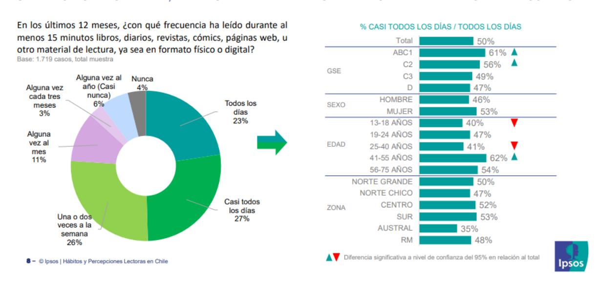

3. Otro de los ejes de esta encuesta consistió en observar los hábitos de lectura en relación con la percepción de la lectura por placer o no. En este sentido, los resultados muestran que siete de cada 10 encuestados siente mucho (22%) o bastante interés (48%) en la lectura por gusto. Esta tendencia disminuye en las personas de bajos ingresos, los menores de 18 años y en el sur del país.

### *Gráfico 2*

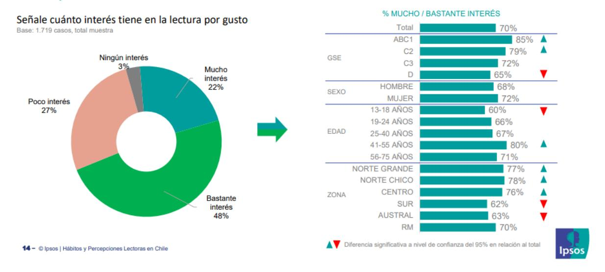

4. De las personas que leen por gusto, un 69% se inclina principalmente por las redes sociales (Facebook, Instagram, Twitter, etc.), seguido de las páginas web o portales de noticias (52%) y los libros (51%). Esta última categoría es más preferida por personas del segmento socioeconómico ABC1 y C2 (72%) y por jóvenes de 19 a 24 años (62%). Por otro lado, las lecturas menos recurridas por los chilenos fueron los blogs, foros y otros (5%), correo electrónico laboral/institucional (20%) y revistas (25%).

### *Gráfico 3*

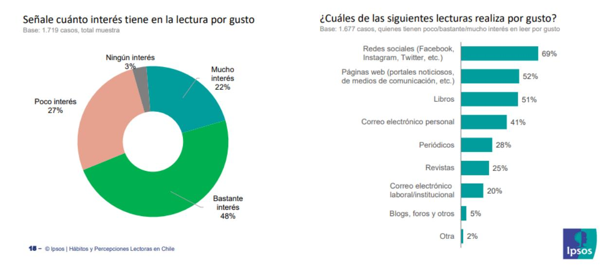

*5.* Según el estudio, a un 82% de los chilenos le gustaría leer más de lo que lee actualmente, y solo un 11% dice que no tiene interés. Entre los motivos por los que no se lee con mayor frecuencia destacan la falta de tiempo (53%), preferencia de otras actividades recreativas (17%) y porque les da pereza (12%).

### *Gráfico 4*

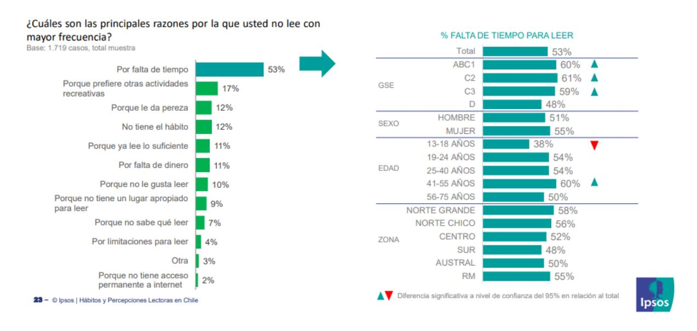

6. Con respecto a la frecuencia de lectura de libros en Chile, un 33% de quienes 

realizan este tipo de lectura mencionan haber leído siete o más libros en el último año, mientras que un 49% leyó cuatro o menos en los pasados 12 meses. De los encuestados que leen libros, 55% dice leer todas las semanas libros impresos, y un 49% dice que semanalmente lee libros digitales. En tanto, los audiolibros son mucho menos utilizados, con sólo un 19% que dice escucharlos cada semana. Los encuestados mencionan que las principales razones para escoger un libro recaen en la temática (74%), seguido por la recomendación de un amigo o familiar (35%), el título (35%) o el autor (32%). Sobre las temáticas que mayor interés generan en los lectores nacionales se encuentran la ciencia ficción/fantasía (41%), historia (41%), seguido de salud (39%) y cocina (38%).

https://www.fundacionlafuente.cl/la-fuente-e-ipsos-presentan-el-primer-informe-de-suestudio-de-habitos-y-percepciones-lectoras-en-chile/

- 25. Según el texto, el material de lectura que se consideró para el informe fue:
  - I. libros físicos y digitales.
  - II. diarios y revistas.
- III. sitios web.
  - A) Solo I
  - B) Solo II
  - C) Solo I y II
  - **D) I, II y III**

**Correcta:** D

**Habilidad:** Reconocer-identificar

**Defensa:** Para responder esta pregunta, se necesita recuperar la información explícita mencionada en el segundo párrafo: "Este dato considera cualquier material de lectura en formato físico o digital, como libros, diarios, revistas, sitios web, etc."

26. ¿Qué función tiene el Gráfico 1 en relación con el párrafo 2?

El Gráfico 1

- A) muestra nuevos antecedentes sobre las preferencias de lectura en Chile.
- **B) representa detalladamente la frecuencia con la que los chilenos leen.**
- C) confirma que una minoría de chilenos ha desarrollado hábitos de lectura.
- D) complementa la información sobre los soportes de lectura más populares.

**Correcta:** B

**Habilidad:** Interpretar

**Defensa:** Para determinar la función del Gráfico 1, es necesario analizar el contenido del párrafo 2, en el cual se destacan algunos datos asociados a cuánto están leyendo los chilenos para demostrar que hay efectivamente una alta frecuencia de lectura. En

este sentido, en el Gráfico 1 se aprecia la pregunta "En los últimos 12 meses, ¿con qué frecuencia ha leído durante al menos 15 minutos?", mediante la representación gráfica es posible observar detalladamente todos los porcentajes de respuesta (nunca, alguna vez al año, alguna vez cada tres meses, alguna vez al mes, una o dos veces a la semana, casi todos los días, todos los días), además de cómo se distribuyen por edad, grupo socioeconómico, zona y sexo.

- 27. De acuerdo con el Gráfico 2, el interés en la lectura por gusto:
  - I. es mayor en las personas que tienen entre 41 y 55 años.
  - II. no presenta diferencias por zona geográfica.
  - III. es inferior en lectores de género masculino en comparación con las mujeres.
    - A) Solo I
    - **B) Solo I y III**
    - C) Solo II y III
    - D) I, II y III

**Correcta:** B

**Habilidad:** Interpretar

**Defensa:** Para responder esta pregunta, se requiere analizar los datos representados en la gráfica de barras, donde se aprecia que un 80% de las personas cuya edad varía entre los 41 y 55 años declara tener mucho o bastante interés en la lectura por gusto, un porcentaje más alto que en los otros grupos etarios (entre el 60% y el 71%). Asimismo, si se observa la tendencia por sexo, un 72% de las mujeres afirma tener mucho o bastante interés en la lectura por gusto, mientras que en los hombres el interés en la lectura por gusto corresponde a un 68%. El enunciado II es falso porque las en las zonas sur y austral (62% y 63% de interés en la lectura por gusto) sí hay una diferencia en comparación a las otras zonas del país (sobre el 70%).

- 28. A partir del cuarto párrafo, se deduce que:
  - **A) los jóvenes son los que más leen libros por gusto.**
  - B) el grupo socioeconómico ABC1 lee más páginas web.
  - C) los chilenos tienen poco interés en la lectura por gusto.
  - D) el grupo socioeconómico C2 prefiere leer redes sociales.

**Correcta:** A

**Habilidad:** Interpretar

**Defensa:** Para responder esta pregunta, se requiere determinar que el párrafo 4 se refiere a la lectura por gusto. Al respecto se menciona que un 51% de personas declara leer libros por gusto y de ese 51% la mayoría, es decir, un 62% corresponde a jóvenes entre 19 y 24 años. Por lo tanto, se puede deducir que los jóvenes son los que más leen libros por gusto.

- 29. El texto anterior se refiere principalmente a:
  - A) impresiones sobre el gusto por los libros y la lectura en Chile.
  - **B) datos e información sobre qué y cuánto leen los chilenos.**
  - C) opiniones de los hábitos de lectura en Chile y su evidencia.
  - D) características de un buen lector según Ipsos y La Fuente.

**Correcta:** B

**Habilidad:** Interpretar

**Defensa:** El texto corresponde a un informe basado en los datos obtenidos a partir de una encuesta, por lo tanto, entrega información objetiva. Tal como se indica en el primer párrafo la "Encuesta de hábitos y percepciones lectoras en Chile muestra el comportamiento de más de 1.700 personas en todo el país, con el objetivo de medir los hábitos y gustos que tienen en relación con la lectura y los libros."

- 30. Según el texto, los chilenos no leen más principalmente porque:
  - A) carecen de dinero.
  - B) prefieren otra actividad.
  - C) no saben qué leer.
  - **D) no tienen tiempo.**

**Correcta:** D

**Habilidad:** Localizar

**Defensa:** De acuerdo con la información señalada en el párrafo 5, el principal motivo por el cual los chilenos no leen más es por falta de tiempo: "Entre los motivos por los que no se lee con mayor frecuencia destacan la falta de tiempo (53%), preferencia de otras actividades recreativas (17%) y porque les da pereza (12%)." Las otras opciones detalladas en el Gráfico 4 tienen un bajo índice de respuesta.

### 31. ¿Cuál es la relación entre el último párrafo y el resto del texto?

# El último párrafo

- A) aborda las causas que explican el problema de la falta de hábitos de lectura de los chilenos.
- B) resume las principales conclusiones que se desprenden del análisis de los datos de la encuesta.
- **C) se refiere específicamente a la lectura de libros, su frecuencia, formato y temáticas preferidas.**
- D) describe los hábitos y percepciones lectoras de los chilenos, por edad, grupo socioeconómico, sexo y zona.

**Correcta:** C

**Habilidad:** Interpretar

**Defensa:** El último párrafo se enfoca en la lectura de libros, mientras que los párrafos anteriores se refieren a los hábitos de lectura en general.

- 32. Según el párrafo 6, es correcto afirmar que:
  - I. el motivo principal para escoger un libro es el tema.
  - II. los audiolibros son más leídos que los libros físicos.
  - III. la ciencia ficción y la fantasía son las temáticas preferidas.
  - A) Solo I
  - B) Solo I y II
  - **C) Solo I y III**
  - D) I, II y III

**Correcta:** C

**Habilidad:** Localizar

**Defensa:** Para responder esta pregunta es necesario recuperar información explícita del párrafo 6: "Los encuestados mencionan que las principales razones para escoger un libro recaen en la temática (74%)", "Sobre las temáticas que mayor interés generan en los lectores nacionales se encuentran la ciencia ficción/fantasía (41%)." El enunciado II es falso porque de los audiolibros se señala que "son mucho menos utilizados, con sólo un 19% que dice escucharlos cada semana", según la encuesta.

### **Lectura 5 (preguntas 33 a 41)**

Artículo de opinión escrito por Patricia Morales, publicado en *La Tercera* el 28 de marzo de 2022.

### **El golpe de Smith a Rock: De masculinidad tóxica y otras yerbas**

- 1. "El amor te hace hacer locuras", dijo Will Smith luego de pegarle una cachetada a Chris Rock por hacer una broma sobre su esposa Jada Pinkett Smith en la ceremonia de los Oscar. ¿Por qué le llaman amor si en realidad es masculinidad? ¿Por qué otra vez usan la violencia en el nombre del amor?
- 2. "Como siempre, la atención y el protagonismo quedó reducida a los hombres y la violencia entre ellos", escribió en su cuenta de Instagram la escritora feminista y doctora en Ciencias Sociales Esther Pineda. Y es que esta escena –probablemente la más comentada del evento– reúne en menos de un minuto, abundantes elementos que dan cuenta de que nos falta mucho para construir un mundo sin desigualdad de género y en el que la violencia deje de estar legitimada. Y que, de paso, demuestra todo aquello que los hombres no deberían ser: partiendo por la ofensiva y repudiable broma de Rock, y luego, el golpe de Smith como respuesta. En una cultura como la nuestra, pegarle a otro hombre es un mandato de la masculinidad; desde niños se les enseña que es así, que deben resolver sus problemas de esa manera, "peleando como hombres". Los hombres siguen construyendo su identidad a través de su fuerza física frente a otros.
- 3. Y en el otro lado, están las mujeres, que son vistas como débiles, como si carecieran de la capacidad de defenderse y, por tanto, requieren de un hombre para cumplir con esa misión. Y qué mejor si es en público, con un gesto violento, pero que se plantea como un gesto romántico que Smith remata diciendo "mantén el nombre de mi esposa fuera de tu boca". Lo dice en nombre de ella, porque ese es el mandato patriarcal: defender la honra de su mujer dejándola a ella sin agencia, o al menos sin saber si ella lo quiere o lo necesita. Como ese clásico ejemplo de padres y hermanos que bromean con que la primera vez que llegue un pololo a la casa de la única hija, se las va a ver con ellos. Es que en el fondo ellas no importan, porque todo esto se trata de un diálogo entre hombres.
- 4. Más allá de que Jada haya querido o no que su esposo se subiera ahí, el mensaje que se dio es claro: Jada es de propiedad de Will Smith. Y todo esto en el nombre del amor. Pero no, esto no es amor. El amor siempre debe estar lejos de la violencia, y por eso es primordial que cuestionemos los hábitos y costumbres, y discutamos las normas sociales que nos rigen y que ponen en evidencia lo que se esconde detrás de algunos gestos como éste.

- 5. Uno que Jadem, el hijo de Smith y Jada, entendió inmediatamente: "Así es como lo hacemos", escribió en su cuenta de Twitter minutos después de que su padre abofetea a Chris Rock en el escenario. Y seguramente ese es uno de los mayores problemas, que los niños, adolescentes y jóvenes entiendan este mensaje: que con violencia es como se construye su identidad y su masculinidad, que esa es la única manera de ser hombres.
- 6. El neuropsicólogo Álvaro Bilbao escribió a propósito de este caso que la verdadera razón por la que Will Smith golpeó a Chris Rock tiene que ver con su infancia. "Cuando veía a su padre golpear a su madre, lo que le provocó la creencia inconsciente de que tiene derecho a utilizar la violencia para poner límites a los demás. Esto es algo que se transmite de generación en generación, como demuestra el tweet de su hijo".
- 7. Y ojo, que esto tampoco se trata de defender a Rock. Su actitud es igual de violenta. ¿Hasta cuándo hay lugar para hacer chistes con los cuerpos de las mujeres (o de cualquier grupo vulnerable)? Según Esther Pineda quien usa el concepto de Violencia Estética, "este es un claro ejemplo de cómo la belleza ha sido construida y erigida como un valor social, no importa si tienes fama o no, si tienes recursos económicos o no, si tienes acceso y visibilidad mediática o no. Si eres mujer, y más aún una mujer negra, estás siempre siendo juzgada y expuesta a ser violentada por tu apariencia física si por alguna razón no respondes a la expectativa de belleza que se ha construido para ti".
- 8. Esta mañana todos comentan lo ocurrido entre los dos hombres y la mujer queda en el rol de la "manzana de la discordia". Lo que pensó y sintió Jada de la broma y la posterior agresión, y lo que piensan miles de mujeres a diario al sufrir agresiones respecto de su físico, sigue siendo invisibilizado porque, al parecer, una pelea entre hombres suena más importante. Todo esto nos debería hacer reflexionar: erradicar estas narrativas sobre la masculinidad, el amor y la violencia; y entender que no debe haber espacio para hablar sobre el cuerpo de las mujeres, es aún una tarea pendiente.

https://www.latercera.com/paula/el-golpe-de-smith-a-rock-la-masculinidad-toxica-y-otras-yerbas/

### 33. La intención de la autora del texto es:

### **A) reflexionar sobre la masculinidad y la violencia.**

- B) erradicar la idea de que el amor te hace hacer locuras.
- C) criticar el comportamiento de los hombres tóxicos.
- D) defender a las mujeres que han sufrido agresiones.

**Correcta:** A

**Habilidad:** Evaluar

**Defensa:** Para responder esta pregunta es necesario determinar que el golpe de Smith

a Rock constituye, para la autora, un caso de masculinidad tóxica. El hecho referido da pie para la reflexión de la autora sobre la relación entre la violencia y la configuración de la identidad masculina. Sin embargo, no es correcto decir que la autora se plantee como propósito criticar el comportamiento de los hombres tóxicos, como se señala en la alternativa C, porque más bien invita al lector a pensar sobre ciertas actitudes y creencias que están instaladas en nuestra sociedad, tal como lo indica al final del texto: "Todo esto nos debería hacer reflexionar: erradicar estas narrativas sobre la masculinidad, el amor y la violencia; y entender que no debe haber espacio para hablar sobre el cuerpo de las mujeres, es aún una tarea pendiente."

- 34. ¿Qué sentido tienen las preguntas formuladas en el primer párrafo?
  - A) Interrogar al actor Will Smith por su violenta reacción en los Oscar.
  - B) Interpelar a los hombres para que tengan más gestos románticos.
  - **C) Cuestionar la creencia de que el amor justifica la violencia.**
  - D) Dudar de los mandatos de la masculinidad en nuestra cultura.

**Correcta:** C

**Habilidad:** Interpretar

**Defensa:** El primer párrafo hace referencia a la frase dicha por Smith para justificar su acto violento: "El amor te hace hacer locuras". Sin embargo, la autora se manifiesta en contra de esta justificación o excusa, y por ello plantea interrogantes que pretenden cuestionar o desestimar una idea arraigada en nuestra sociedad según la cual es válido que los hombres utilicen la violencia en nombre del amor.

- 35. La actitud de la autora del texto anterior es predominantemente:
  - A) sensacionalista.
  - B) pesimista.
  - **C) feminista.**
  - D) objetiva.

**Correcta:** C

**Habilidad:** Evaluar

**Defensa:** Para responder esta pregunta es necesario evaluar la actitud de la autora del texto. Considerado esto, podemos establecer como actitud predominante la feminista, pues utiliza argumentos basados en la igualdad de género y citas de autoridad de especialistas en materia de feminismo.

- 36. A partir de la lectura, ¿qué se entiende por masculinidad tóxica?
  - A) El protagonismo histórico que los hombres han tenido en la sociedad patriarcal.
  - **B) La actitud violenta que caracteriza a los hombres como parte de su identidad.**
  - C) El gesto romántico de un hombre que protege a su mujer cuando es ofendida.
  - D) El afán de los hombres de burlarse de las mujeres por su apariencia física.

**Correcta:** B

**Habilidad:** Interpretar

**Defensa:** Para responder esta pregunta se debe relacionar diferentes partes del texto en las cuales la autora describe comportamientos que ella califica como ejemplos de masculinidad tóxica. En este sentido, la principal crítica apunta hacia la violencia como una característica esencial de los hombres que los define como tal, porque al parecer un hombre que no ataca con golpes no es lo suficientemente hombre. El siguiente fragmento extraído del párrafo 3 lo demuestra: "Y que, de paso, demuestra todo aquello que los hombres no deberían ser: partiendo por la ofensiva y repudiable broma de Rock, y luego, el golpe de Smith como respuesta. En una cultura como la nuestra, pegarle a otro hombre es un mandato de la masculinidad; desde niños se les enseña que es así, que deben resolver sus problemas de esa manera, "peleando como hombres". Los hombres siguen construyendo su identidad a través de su fuerza física frente a otros." Y luego se confirma en el párrafo 5: "Y seguramente ese es uno de los mayores problemas, que los niños, adolescentes y jóvenes entiendan este mensaje: que con violencia es como se construye su identidad y su masculinidad, que esa es la única manera de ser hombres."

- 37. Según la autora, en la sociedad patriarcal las mujeres son consideradas como sujetos:
  - A) inferiores y sumisos.
  - B) delicados y sensibles.
  - **C) débiles e indefensos.**
  - D) admirables y bellos.

**Correcta:** C

**Habilidad:** Localizar

**Defensa:** Para responder esta pregunta es necesario identificar la información que se menciona directamente en el texto. En el párrafo 3 se dice: "Y en el otro lado, están las mujeres, que son vistas como débiles, como si carecieran de la capacidad de defenderse y, por tanto, requieren de un hombre para cumplir con esa misión." Por lo tanto, la alternativa C es la correcta.

38. ¿Qué relación tiene el golpe de Smith a Rock con el ejemplo de los padres y hermanos que bromean con que la primera vez que llegue un pololo a la casa de la única hija, se las va a ver con ellos?

### Ambos casos

- A) reflejan lo complejo de las relaciones familiares.
- B) revelan el amor de los hombres hacia las mujeres.

- C) confirman que la masculinidad es algo negativo.
- **D) demuestran la invisibilización de las mujeres.**

**Correcta:** D

**Habilidad:** Interpretar

**Defensa:** Para responder esta pregunta es necesario analizar el contenido del párrafo 3, donde se plantea el problema de cómo son vistas las mujeres en el contexto de una sociedad patriarcal que legitima la violencia masculina. Por lo tanto, en ambas situaciones las mujeres quedan fuera del debate, no se considera su sentir o su opinión, no tienen una voz propia, sino que los hombres hablan por ellas, lo que equivale a decir que son invisibilizadas.

39. ¿Por qué se dice que la broma de Rock sobre Jada Pinkett Smith en la ceremonia de los Oscar puede ser calificada de violencia estética?

- **A) Porque se ataca a una mujer debido a que su cuerpo no coincide con el ideal de belleza que se ha construido para ella.**
- B) Porque ella, al formar parte de un grupo vulnerable, está expuesta a ser agredida por su color de piel aunque sea famosa.
- C) Porque las actrices sufren discriminación en la industria del cine, especialmente si su imagen es diferente a la mayoría.
- D) Porque se perpetúa un tipo de humor basado en la humillación de las personas y el daño a su dignidad u honra.

**Correcta:** A

**Habilidad:** Interpretar

**Defensa:** Para responder esta pregunta es necesario interpretar la definición de Esther Pineda sobre violencia estética que se cita en el párrafo 7. En este sentido, si se relaciona la broma de Rock sobre Jada con el concepto de violencia estética, se puede determinar que es un caso en el cual se evidencia que los chistes sobre los cuerpos de las mujeres tienen cabida en una sociedad donde existe un ideal de belleza femenina (blanca, pelo largo, delgada) y quien no cumpla con ese estándar estético será sancionado o criticado.

- 40. De acuerdo con el párrafo 6, ¿cuál es el motivo por el cual Smith golpeó a Rock?
  - A) No poder controlar sus emociones según el contexto.
  - B) Tener una familia en la que padres e hijos se agreden.
  - C) Vivir rodeado de hombres que usan siempre la violencia.
  - **D) Pensar que la violencia es válida para poner límites.**

**Correcta:** D

**Habilidad:** Localizar

**Defensa:** Para responder esta pregunta es necesario recuperar la información que aporta el neuropsicólogo Álvaro Bilbao, quien afirma que la verdadera razón por la que Will Smith golpeó a Chris Rock tiene que ver con su infancia, ya que el ver a su padre golpear a su madre, le habría provocado la creencia inconsciente de que tiene derecho a utilizar la violencia para poner límites a los demás.

- 41. ¿Cuá(les) de las siguientes opciones son opiniones planteadas por la autora?
- I. El amor te hace hacer locuras.
- II. El amor siempre debe estar lejos de la violencia.
- III. No debe haber espacio para hablar sobre el cuerpo de las mujeres.
  - A) Solo I
  - B) Solo I y II
  - **C) Solo II y III**
  - D) I, II y III

**Correcta:** C

**Habilidad:** Localizar

**Defensa:** La respuesta a esta pregunta se encuentra explícita en el texto. En ese sentido, los enunciados II y III corresponden a planteamientos formulados por la autora. Sin embargo, el enunciado I es lo que dijo el actor Will Smith, el cual es citado en el texto, pero no es una opinión de la autora.

### **Lectura 6 (preguntas 42 a 50)**

Artículo de opinión escrito por Pablo Noriega, publicado en *La Opinión* el 26 de octubre de 2017.

# **Los murciélagos, una especie incomprendida que brinda grandes beneficios al hombre**

- 1. El principal peligro al que se enfrentan las poblaciones de murciélagos es el ataque directo del ser humano, absurdamente incitado por toda la serie de mitos insólitos que hay alrededor de ellos.
- 2. Son fundamentales para un buen desarrollo medioambiental ya que mantienen en equilibrio la biodiversidad.
- 3. Diversos mitos e historias han generado que los murciélagos sean una especie incomprendida alrededor del mundo, lo que ocasiona que se desconozcan muchas de las ventajas que estos animales brindan a nuestro medio ambiente.

- 4. Estos voladores únicos en su tipo, son el segundo grupo de mamíferos más importante por su número y diversidad biológica después de los roedores, pero tienen mayor importancia ecológica por su impacto en la naturaleza. Además de estar presentes en casi todo el planeta ya que son diversas las especies que existen, son fundamentales para un buen desarrollo medioambiental, pues como polinizadores, dispersores de semillas y controladores de plagas, mantienen en equilibrio la biodiversidad de los ecosistemas que habitan.
- 5. Como ejemplo, sabemos que los murciélagos son esenciales en el mantenimiento y regeneración de los bosques; además de que su guano, sirve como fertilizante en grandes cantidades, lo que lo convierte en una alternativa natural y orgánica para el cultivo agrícola.
- 6. A pesar de los mitos, los murciélagos son animales de importancia significativa para la naturaleza, por lo que ha surgido una noble iniciativa para concientizar sobre su gran papel ecológico. Como cada año a finales de octubre, justo durante la época de Halloween y el Día de Muertos, celebramos la "**Semana del Murciélago"**, con la cual tenemos la oportunidad de conocer, apreciar y comprometernos con la conservación de esta especie.
- 7. Para los especialistas, es imperativo cuidar de esta especie, ya que han llegado a ser incomprendidos por algunas personas, causando repulsión a una parte de la población que no conoce, ni entiende el papel benéfico que juegan.
- 8. La alimentación de los murciélagos también es muy variada: además de los insectívoros, también hay especies de frugívoros (se alimentan de frutas, flores y hojas), polinívoros (consumen polen), carnívoros (se alimentan de la carne) y piscívoros (comen pescado). Una triste realidad es que a pesar de ser considerados "vampiros", es decir, consumidores de sangre, sólo 3 especies son hematófagas, ya que se alimentan de sangre del ganado, en su mayoría vacas y su ingesta de sangre es mínima lo que desmitifica el hecho de que afectan la industria ganadera; pero muchas personas siguen creyendo lo anterior, por lo que los matan por ser considerados una especie de plaga.

https://laopinion.com/2017/10/26/los-murcielagos-una-especie-incomprendida-que-brindagrandes-beneficios-al-hombre/

42. Con respecto a los murciélagos, es correcto afirmar que:

- **A) son beneficiosos para el medio ambiente.**
- B) suelen atacar directamente al ser humano.
- C) trasmiten enfermedades a los seres humanos.
- D) son una plaga que afecta la industria ganadera.

**Correcta:** A

**Habilidad:** Localizar

**Defensa:** Para responder esta pregunta se requiere recuperar información explícita del texto, en este caso la idea de que los murciélagos son beneficiosos para el ser humano se formula en el título. La opción B es incorrecta porque según la lectura los murciélagos son atacados por el ser humano. La opción C no aparece en ninguna parte del texto, no es un mito que se mencione en esta lectura, sino que podría corresponder a los conocimientos previos de los lectores. Por último, la opción D corresponde a uno de los mitos sobre los murciélagos, si bien se mencionan en la lectura es información falsa.

- 43. ¿Qué características de los murciélagos demuestran su importancia?
- I. Actúan como polinizadores, dispersores de semillas y controladores de plagas.
- II. Su guano, en grandes cantidades, sirve como fertilizante.
- III. Ayudan en el mantenimiento y regeneración de los bosques.
  - A) Solo I
  - B) Solo I y II
  - C) Solo II y III
  - **D) I, II y III**

**Correcta:** D

**Habilidad:** Localizar

**Defensa:** Según los párrafos 4 y 5, que es donde se describen los beneficios de los murciélagos para el medio ambiente, estos animales "son fundamentales para un buen desarrollo medioambiental, pues como polinizadores, dispersores de semillas y controladores de plagas, mantienen en equilibrio la biodiversidad de los ecosistemas que habitan." Además, se dice que "son esenciales en el mantenimiento y regeneración de los bosques; además de que su guano, sirve como fertilizante en grandes cantidades". Por lo tanto, los enunciados I, II y III son verdaderos.

- 44. ¿Cuál de las siguientes opciones contiene un título alternativo para el texto anterior?
  - A) Ventajas y desventajas de los murciélagos.
  - B) Cuidado y protección de los animales.
  - **C) Mitos y verdades sobre los murciélagos.**
  - D) Especies favorables para el medio ambiente.

**Correcta:** C

**Habilidad:** Interpretar

**Defensa:** El título de un texto debe ser global e inclusivo. Es decir, debe condensar lo esencial del texto. En este sentido, un título apropiado en este caso es el que propone la opción C, ya que resume el tema del que se habla (los murciélagos) más lo que se dice sobre él (mitos y verdades). El texto no se refiere a las desventajas de los

murciélagos (alternativa A), tampoco se menciona la protección de los animales en general (alternativa B). La opción E excede el contenido de la lectura, ya que esta se enfoca solo en los murciélagos y no en otras especies favorables para el medio ambiente.

- 45. ¿Por qué se dice que los murciélagos son una especie incomprendida?
  - A) Porque se encuentran desprotegidos en comparación a otros animales que son mucho más dañinos.
  - B) Porque no se sabe el valor que tienen para el medio ambiente, lo que despierta el interés de los especialistas.
  - C) Porque son considerados "vampiros", es decir, consumen sangre humana y de otros animales mamíferos.
  - **D) Porque hay una serie de creencias falsas sobre ellos y se desconoce el rol que cumplen en la naturaleza.**

**Correcta:** D

**Habilidad:** Relacionar-interpretar

**Defensa:** Para responder esta pregunta es necesario interpretar el sentido que tiene la expresión en relación al desarrollo del tema. En este sentido, el texto se dedica a desmentir los mitos o creencias erróneas en torno a los murciélagos debido que no se conocen sus beneficios para el medio ambiente, esto hace que se considere una especie incomprendida y desvalorizada injustamente.

- 46. Según el párrafo 6, ¿qué objetivo tiene la "Semana del Murciélago"?
  - A) Celebrar el gran aporte que hacen los murciélagos.
  - B) Enseñar la importancia de los animales en la naturaleza.
  - C) Elogiar el trabajo de los especialistas en medio ambiente.
  - **D) Crear conciencia sobre la función de los murciélagos.**

**Correcta:** D

**Habilidad:** Localizar

**Defensa:** De acuerdo con lo que el texto señala "ha surgido una noble iniciativa para concientizar sobre su gran papel ecológico. Como cada año a finales de octubre, justo durante la época de Halloween y el Día de Muertos, celebramos la "Semana del Murciélago". Por lo tanto, la alternativa D es la correcta.

- 47. ¿Cuál de las siguientes opciones sintetiza el contenido del último párrafo?
  - A) Existe una diversidad de especies de murciélagos, lo cual brinda más ventajas que desventajas para los ecosistemas.
  - **B) Al contrario de lo que se piensa, no todos los murciélagos se alimentan de sangre, sino que tienen una dieta variada.**

- C) Si bien los murciélagos suelen consumir sangre de vaca, también pueden alimentarse de otros animales.
- D) Uno de los mitos más extendidos es que los muricélagos son hematófogos, es decir, que la sangre es su alimento preferido.

**Correcta:** B

**Habilidad:** Interpretar

**Defensa:** Para responder esta pregunta es necesario extraer la información más relevante del párrafo, la cual se relaciona con otro mito muy extendido respecto a esta especie: su alimentación. De acuerdo a lo anterior, se señala que no todos los murciélagos son "vampiros", es decir, consumidores de sangre, sino que hay solo 3 especies que son hematófagas, por lo que la alimentación de los murciélagos es muy variada. La opción D, si bien coincide con la información que aporta el último párrafo, no resume su contenido global.

48. ¿Qué visión de los murciélagos es la que predomina en la lectura?

- **A) Reivindicativa, porque defiende el valor de esa especie.**
- B) Neutra, porque describe las caracteristicas de los animales.
- C) Técnica, porque usa un lenguaje altamente especializado.
- D) Rebelde, porque está en contra de las teorías existentes.

**Correcta:** A

**Habilidad:** Evaluar

**Defensa:** Para responder esta pregunta es necesario elaborar un juicio crítico sobre la actitud del emisor frente al tema desarrollado. A lo largo del texto, se entregan diferentes razones para considerar al murciélago una especie benigna, por lo tanto, la intención del emisor es recuperar el valor que debería tener este animal.

- 49. A partir de la lectura se puede concluir que:
  - A) los murciélagos son una especie que está protegida.
  - B) las personas sienten repulsión por los murciélagos.
  - **C) no se debería matar ni atacar a los murciélagos.**
  - D) la naturaleza es muy sabia y tiene sus propias reglas.

**Correcta:** C

**Habilidad:** Interpretar

**Defensa:** Para responder esta pregunta es necesario extraer información implícita a partir del texto, específicamente en el último párrafo de este. En dicho segmento, se señala que "Una triste realidad es que a pesar de ser considerados "vampiros", es decir, consumidores de sangre, sólo 3 especies son hematófagas, ya que se alimentan de sangre del ganado, en su mayoría vacas y su ingesta de sangre es mínima lo que desmitifica el hecho de que afectan la industria ganadera; pero muchas personas siguen creyendo lo anterior, por lo que los matan por ser considerados una especie de plaga." Por lo tanto, se puede concluir que no hay razones para matar a los murciélagos

o atacarlos como ocurre actualmente de acuerdo a lo señalado en el párrafo 1: "El principal peligro al que se enfrentan las poblaciones de murciélagos es el ataque directo del ser humano, absurdamente incitado por toda la serie de mitos insólitos que hay alrededor de ellos." La opción B corresponde a información textual, por lo tanto, no es algo que se pueda desprender de la lectura.

50. ¿Qué información aportan los párrafos 4 y 5 en relación con la totalidad del texto?

- A) Analizan las causas del desconocimiento acerca de los murciélagos.
- B) Describen detalladamente en qué consiste la biodiversidad del ecosistema.
- C) Explican los insólitos mitos que se han difundido sobre los murciélagos.
- **D) Fundamentan el impacto positivo de los murciélagos mediante ejemplos.**

**Correcta:** D

**Habilidad:** Interpretar

**Defensa:** Para responder esta pregunta es necesario analizar e interpretar la función que cumplen los párrafos 4 y 5 dentro del texto, relacionando la información que aportan con el desarrollo del tema principal. Considerando que la lectura se enfoca en destacar la importancia de los murciélagos para la naturaleza, estos párrafos refieren ejemplos concretos que demuestran lo beneficioso que son los animales de esta especie.

# **Lectura 7 (preguntas 51 a 58)**

Cuento del escritor peruano Julio Ramón Ribeyro publicado en *Cuentos de circunstancias* (1958).

Apenas su mamá cerró la puerta, Perico saltó del colchón y escuchó, con el oído pegado a la madera, los pasos que se iban alejando por el largo corredor. Cuando se hubieron definitivamente perdido, se abalanzó hacia la cocina de kerosene y hurgó en una de las hornillas malogradas. ¡Allí estaba! Extrayendo la bolsita de cuero, contó una por una las monedas -había aprendido a contar jugando a las bolitas- y constató, asombrado, que había cuarenta soles. Se echó veinte al bolsillo y guardó el resto en su lugar. No en vano, por la noche, había simulado dormir para espiar a su mamá. Ahora tenía lo suficiente para realizar su hermoso proyecto. Después no faltaría una excusa. En esos callejones de Santa Cruz, las puertas siempre están entreabiertas y los vecinos tienen caras de sospechosos. Ajustándose los zapatos, salió desalado hacia la calle.

En el camino fue pensando si invertiría todo su capital o sólo parte de él. Y el recuerdo de los merengues –blancos, puros, vaporosos- lo decidieron por el gasto total. ¿Cuánto tiempo hacía que los observaba por la vidriera hasta sentir una salvación amarga en la garganta? Hacía ya varios meses que concurría a la pastelería de la esquina y sólo se 

contentaba con mirar. El dependiente ya lo conocía y siempre que lo veía entrar, lo consentía un momento para darle luego un coscorrón y decirle:

-¡Quita de acá, muchacho, que molestas a los clientes!

Y los clientes, que eran hombres gordos con tirantes o mujeres viejas con bolsas, lo aplastaban, lo pisaban y desmantelaban bulliciosamente la tienda.

Él recordaba, sin embargo, algunas escenas amables. Un señor, al percatarse un día de la ansiedad de su mirada, le preguntó su nombre, su edad, si estaba en el colegio, si tenía papá y por último le obsequió una rosquita. Él hubiera preferido un merengue, pero intuía que en los favores estaba prohibido elegir. También, un día, la hija del pastelero le regaló un pan de yema que estaba un poco duro.

-¡Empara!- dijo, aventándolo por encima del mostrador. Él tuvo que hacer un gran esfuerzo a pesar de lo cual cayó el pan al suelo y, al recogerlo, se acordó súbitamente de su perrito, a quien él tiraba carnes masticadas divirtiéndose cuando de un salto las emparaba en sus colmillos.

Pero no era el pan de yema ni los alfajores ni los piononos lo que le atraía: él sólo amaba los merengues. A pesar de no haberlos probado nunca, conservaba viva la imagen de varios chicos que se los llevaban a la boca, como si fueran copos de nieve, ensuciándose los corbatines. Desde aquel día, los merengues constituían su obsesión.

Cuando llegó a la pastelería, había muchos clientes ocupando todo el mostrador. Esperó que se despejara un poco el escenario pero no pudiendo resistir más, comenzó a empujar. Ahora no sentía vergüenza alguna y el dinero que empuñaba lo revestía de cierta autoridad y le daba derecho a codearse con los hombres de tirantes. Después de mucho esfuerzo, su cabeza apareció en primer plano, ante el asombro del dependiente.

-¿Ya estás aquí? ¡Vamos saliendo de la tienda!

Perico, lejos de obedecer, se irguió y con una expresión de triunfo reclamó: ¡veinte soles de merengues! Su voz estridente dominó en el bullicio de la pastelería y se hizo un silencio curioso. Algunos lo miraban, intrigados, pues era hasta cierto punto sorprendente ver a un rapaz de esa cabaña comprar tan empalagosa golosina en tamaña proporción. El dependiente no le hizo caso y pronto el barullo se reinició. Perico quedó algo desconcertado, pero estimulado por un sentimiento de poder repitió, en tono imperativo:

-¡Veinte soles de merengues!

El dependiente lo observó esta vez con cierta perplejidad, pero continuó despachando a los otro parroquianos.

-¿No ha oído? – insistió Perico excitándose- ¡Quiero veinte soles de merengues!

El empleado se acercó esta vez y lo tiró de la oreja.

-¿Estás bromeando, palomilla?

Perico se agazapó.

-¡A ver, enséñame la plata!

Sin poder disimular su orgullo, echó sobre el mostrador el puñado de monedas. El dependiente contó el dinero.

- -¿Y quieres que te dé todo esto en merengues?
- -Sí –replicó Perico con una convicción que despertó la risa de algunos circunstantes.
- -Buen empacho te vas a dar –comentó alguien.

Perico se volvió. Al notar que era observado con cierta benevolencia un poco lastimosa, se sintió abochornado. Como el pastelero lo olvidaba, repitió:

- -Deme los merengues- pero esta vez su voz había perdido vitalidad y Perico comprendió que, por razones que no alcanzaba a explicarse, estaba pidiendo casi un favor.
  - -¿Va a salir o no? – lo increpó el dependiente
  - -Despácheme antes.
  - -¿Quién te ha encargado que compres esto?
  - -Mi mamá.
- -Debes haber oído mal. ¿Veinte soles? Anda a preguntarle de nuevo o que te lo escriba en un papelito.

Perico quedó un momento pensativo. Extendió la mano hacia el dinero y lo fue retirando lentamente. Pero al ver los merengues a través de la vidriería, renació su deseo, y ya no exigió, sino que rogó con una voz quejumbrosa:

-¡Deme, pues, veinte soles de merengues!

Al ver que el dependiente se acercaba airado, pronto a expulsarlo, repitió conmovedoramente:

-¡Aunque sea diez soles, nada más!

El empleado, entonces, se inclinó por encima del mostrador y le dio el cocacho acostumbrado pero a Perico le pareció que esta vez llevaba una fuerza definitiva.

-¡Quita de acá! ¿Estás loco? ¡Anda a hacer bromas a otro lugar!

Perico salió furioso de la pastelería. Con el dinero apretado entre los dedos y los ojos húmedos, vagabundeó por los alrededores.

Pronto llegó a los barrancos. Sentándose en lo alto del acantilado, contempló la playa. Le pareció en ese momento difícil restituir el dinero sin ser descubierto y maquinalmente fue arrojando las monedas una a una, haciéndolas tintinear sobre las piedras. Al hacerlo, iba pensando que esas monedas nada valían en sus manos, y en ese día cercano en que, grande ya y terrible, cortaría la cabeza de todos esos hombres, de todos los mucamos de las pastelerías y hasta de los pelícanos que graznaban indiferentes a su alrededor.

Julio Ramón Ribeyro, "Los merengues"

- 51. La idea central del primer párrafo es que Perico:
  - A) no podía dormir por las noches.
  - B) aprendió a contar jugando a las bolitas.
  - **C) robó parte del dinero de su madre.**
  - D) le contaría una mentira a sus vecinos.

**Correcta:** C

**Habilidad:** Interpretar

**Defensa:** Para responder esta pregunta, se requiere determinar la información más general y esencial del primer párrafo. En dicho segmento se describe cómo Perico se

las arregla para poder sacar el dinero que tenía escondido su madre sin que ella se diera cuenta. Para ello, esperó que ella saliera de la casa y apenas se fue sacó la bolsita de cuero con monedas guardada en la cocina.

- 52. ¿Cuál era el mayor anhelo de Perico?
  - A) Poder escapar de la casa de su madre.
  - B) Llegar a ser respetado por los adultos.
  - C) Salir a jugar a las bolitas con sus amigos.
  - **D) Probar los merengues de la pastelería.**

**Correcta:** D

**Habilidad:** Localizar

**Defensa:** La información necesaria para responder esta pregunta se encuentra explícita en el texto: "no era el pan de yema ni los alfajores ni los piononos lo que le atraía: él sólo amaba los merengues. A pesar de no haberlos probado nunca, conservaba viva la imagen de varios chicos que se los llevaban a la boca, como si fueran copos de nieve, ensuciándose los corbatines. Desde aquel día, los merengues constituían su obsesión."

- 53. De acuerdo con lo leído, ¿qué se puede concluir respecto a Perico?
  - **A) Su condición social es la de un niño pobre o marginal.**
  - B) Ha sufrido violencia doméstica desde la infancia temprana.
  - C) No demuestra un comportamiento adecuado en la escuela.
  - D) Primero fue abandonado por su padre y ahora por su madre.

**Correcta:** A

**Habilidad:** Interpretar

**Defensa:** Considerando que Perico aprendió a contar jugando a las bolitas, se puede inferir que no va a la escuela, además el trato que recibe de los adultos con tirantes (es decir, adinerados) y del dependiente de la tienda refleja que su aspecto es el de un niño de la calle. Su comportamiento deshonesto y sin culpa permite también inferir que carece de una formación valórica sólida por parte de su cuidadora principal (la madre) y que no tiene la posibilidad de pedirle que le compre los merengues que desea. Por lo tanto, es un niño que debe recurrir a su ingenio para poder sobrevivir en la pobreza.

- 54. ¿Qué hacía el encargado de la pastelería cuando veía entrar a Perico?
  - A) Le lanzaba un pan de yema por encima del mostrador.
  - **B) Le pegaba un coscorrón y lo echaba a la calle.**
  - C) Le regalaba una rosquita, aunque estuviera dura.
  - D) Le preguntaba por el colegio y por su familia.

**Correcta:** B

**Habilidad:** Localizar

**Defensa:** Para responder esta pregunta, se requiere recuperar la información mencionada de manera explícita en el texto. Al respecto se describe lo siguiente: "Hacía ya varios meses que concurría a la pastelería de la esquina y sólo se contentaba con mirar. El dependiente ya lo conocía y siempre que lo veía entrar, lo consentía un momento para darle luego un coscorrón y decirle: -¡Quita de acá, muchacho, que molestas a los clientes!" Por lo tanto, la alternativa B es la correcta. La alternativa A describe lo que hizo una vez la hija del empleado de la pastelería. La alternativa C se refiere al obsequio que le hizo una vez uno de los clientes. Por último, la alternativa D menciona lo que hizo una vez el mismo señor que le regaló la rosquita.

55. ¿Cuál es el valor que tiene el dinero para Perico cuando entra a comprar a la pastelería a diferencia de cuando sale?

|    | Cuando ingresa a la pastelería:                                                             | Cuando sale de la pastelería:                                                                         |
|----|---------------------------------------------------------------------------------------------|-------------------------------------------------------------------------------------------------------|
| A) | imagina que con el dinero que posee es suficiente para comprar muchos merengues.      | entiende que la cantidad de dinero que llevaba no era suficiente para comprar lo que él quería. |
| B) | se regocija sabiendo que gracias al dinero podrá ser realmente feliz .                   | piensa que la felicidad es realmente imposible de alcanzar con o sin dinero.                    |
| C) | confía en que el dinero que tiene le otorga el derecho a poder comprar lo que quiera. | siente que la posesión de dinero es insuficiente para ser digno de comprar.                     |
| D) | cree que tener dinero equivale a ser una persona seria y respetable.                     | reconoce que nunca podrá llegar a ser alguien lo suficientemente poderoso.                         |

**Correcta:** C

**Habilidad:** Interpretar

**Defensa:** Para responder esta pregunta, es necesario analizar cómo se siente Perico con las monedas al entrar a la pastelería: "Ahora no sentía vergüenza alguna y el dinero que empuñaba lo revestía de cierta autoridad y le daba derecho a codearse con los hombres de tirantes." La actitud de Perico es la de un cliente como los demás y se atreve a reclamar que le vendan sus merengues, porque para eso tiene dinero. Sin embargo, ante la negativa del empleado de la pastelería Perico se va sintiendo despreciado y pierde la confianza que tenía: "esta vez su voz había perdido vitalidad y Perico comprendió que, por razones que no alcanzaba a explicarse, estaba pidiendo

casi un favor." La única razón por la que el dependiente no considera a Perico un cliente válido es porque lo conoce y sabe que es un niño pobre, es decir, lo discrimina por su condición, aunque tenga el dinero suficiente para acceder al producto que desea, no es digno de comprar merengues en esa pastelería: "iba pensando que esas monedas nada valían en sus manos". En este sentido, la escena expone la problemática social de la diferencia de clases.

56. ¿Qué sentimientos predominan en Perico al final del relato?

- A) Soledad y confusión.
- B) Ira y envidia.
- C) Vergüenza y tristeza.
- **D) Frustración y venganza.**

**Correcta:** D

**Habilidad:** Interpretar

**Defensa:** Tras salir de la pastelería se relata que Perico salió furioso, "con el dinero apretado entre los dedos y los ojos húmedos, vagabundeó por los alrededores" y que se puso a pensar en el día que, "grande ya y terrible, cortaría la cabeza de todos esos hombres, de todos los mucamos de las pastelerías y hasta de los pelícanos que graznaban indiferentes a su alrededor." Por lo tanto, se puede concluir que se sintió tremendamente frustrado y con deseos de venganza.

57. ¿Qué decide hacer finalmente Perico con las monedas?

- A) Devolverlas a la bolsita de cuero escondida.
- **B) Lanzarlas al mar desde un acantilado.**
- C) Usarlas para comprar en otra pastelería.
- D) Guardarlas para cuando fuera grande.

**Correcta:** B

**Habilidad:** Localizar

**Defensa:** En el desenlace se menciona explícitamente que Perico "pronto llegó a los barrancos. Sentándose en lo alto del acantilado, contempló la playa. Le pareció en ese momento difícil restituir el dinero sin ser descubierto y maquinalmente fue arrojando las monedas una a una, haciéndolas tintinear sobre las piedras." Por lo tanto, la respuesta correcta es la B.

# Lectura 8 (preguntas 58 a 65)

Infografía publicada en *Ladera Sur* el 28 de abril de 2022.

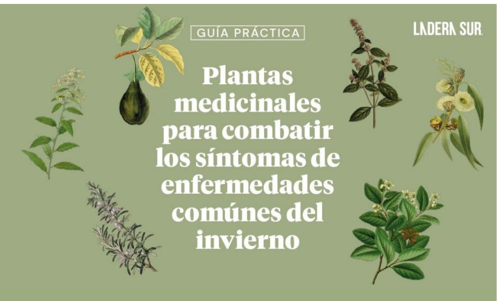

### Palqui [Cestrum parqui

# Usos medicinales: En medicina tradicional la infusión de los tallos desprovistos de su corteza se emplea para bajar la fiebre y para uso externo se utiliza para tratar enfermedades de la piel (heridas, úlceras, granos). En zonas rurales se usa para tratar el "pasmo", una afección caracterizada por la inflamación de la garganta y tos seca, que se produce por el contraste de un ambiente caliente que entra en contacto bruscamente con uno frio.

\*La mayor parte de la planta es toxica, a excepción de su tallo y sus hojas, por lo que hay que tene mucho cuidado al momento de consumirla.

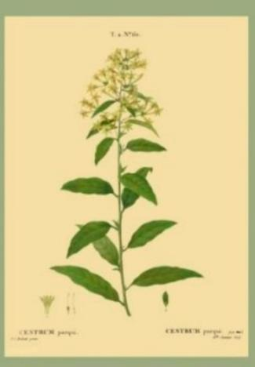

Infusión: Se prepara con 1 talio de aprox. 5 cm. para 1 taza de agua recién hervida: beber 1 taza al dia.

# Palto

Usos medicinales:
Todas las partes de esta planta
han sido investigadas, en\nespecial el aceite esencial, el
aceite fijo, las hojas y el fruto,
por sus magnificas cualidades
alimenticias y usos médicos. En
nuestro país las hojas frescas o
secas se emplean
principalmente en tratamientos
de afecciones respiratorias:
tos, catarro, bronquitis,
resfrios; malestares\nestomacales, enfermedades
de la piel y en menstruaciones
difícilas y deloroses

### Infusión:

Se prepara con 1 cucharada de hojas frescas o secas para 1 litro de agua recién hervida: beber 1 taza 3 veces al día.

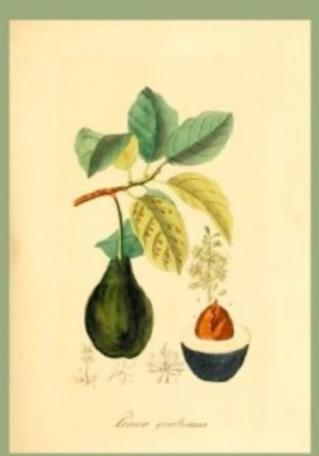

Menta Todas las [*Menthas*]

Usos medicinales:
La menta es una de las plantas más utilizada por la población en todo tipo de desórdenes digestivos, como antiparasitario y para combatir cefaleas.
Las hojas y sumidades floridas tienen propiedades estimulantes, estomáquicas, carminativas y antisépticas. Se puede tomar fresca o seca, sola o en mezclas con otras especies. Consumirla a modo de infusión es el método más usado para desordenes digestivos, mientras que utilizaria en forma de vahos es la forma más efectiva para aliviar los síntomas del resfrio tales como el dolor de cabeza, el catarro y la bronquitis.

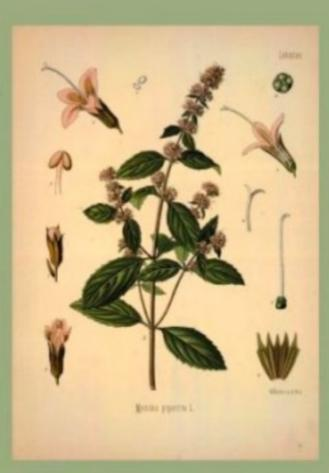

Eucalipto [Eucalyptus globulus Labill]

Usos medicinales:
La infusión de las hojas adultas de esta planta se emplea en afecciones respiratorias de diversa índole tales como catarro, bronquitis, asma, faringitis, amigdalitis, gripes y resfriados. Por otro lado, en los casos de males respiratorios es común utilizar esta planta en forma de "vahos" (vaporizaciones) ya que es muy efectivo para síntomas como la tos y el catarro.

Infusión: Se prepara con 1 cucharada del vegetal para 1 litro de agua recién hervida; beber 1 taza 3 veces en el día. Se puede endulzar con miel.

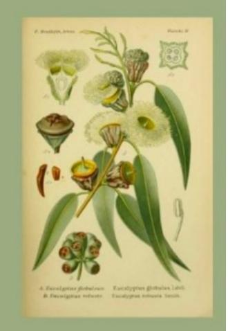

### Quillay

[Quillaja saponaria Molina]

Se prepara con 1 cucharada de hojas frescas para 1 litro de agua recién hervida: beber 1 taza 3 veces en el día.

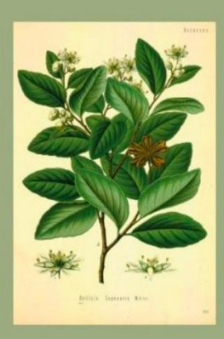

# 

### Romero

Usos medicinales:
La planta tiene propiedades antiinflamatorias y antiespasmódicas. En medicina popular el romero se utiliza a modo de infusión en afecciones del tracto digestivo, como espasmolítico, colagogo, colerético y emenagogo, pero también para el dolor de cabeza o cefaleas. En aplicaciones locales se emplea la decocción de romero, solo o con otras especies, como cicatrizante, antiséptico y rubefaciente. Por otro lado, por sus efectos vulnerarios, también se utiliza en dolores musculares y padecimientos reumáticos: se dan masajes con la alcoholatura de la planta.

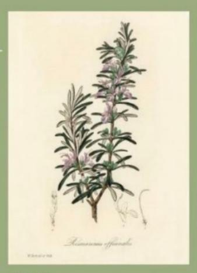

Infusión: Se prepara con 1 cucharada del vegetal para 1 litro de agua recién hervida: beber 1 taza 3 veces al día.

https://laderasur.com/content/uploads/2022/04/e060e4ca-1bf8-40e0-9a65-cb13bebdf6f3.jpg

- 58. ¿Qué función cumplen las ilustraciones en relación al contenido del texto?
  - A) Ejemplificar los diferentes usos medicinales de las plantas.
  - **B) Ilustrar la apariencia de las hojas, tallos y flores de las plantas.**
  - C) Profundizar en el proceso de elaboración de las infusiones.
  - D) Señalar la belleza que tiene cada una de las distintas plantas.

**Correcta:** B

**Habilidad:** Interpretar

**Defensa:** Para responder esta pregunta es necesario determinar qué información aportan las ilustraciones de las plantas al desarrollo del tema. En este sentido, es posible determinar que ilustran cómo son las plantas mencionadas para que el lector pueda reconocer sus hojas, tallos y flores, que son las partes de la planta que se utilizan en las infusiones medicinales.

- 59. ¿Cuál es el propósito comunicativo del texto anterior?
  - A) Explicar la variedad de plantas que hay en la naturaleza.
  - B) Reconocer la efectividad de los tratamientos hechos en casa.
  - C) Valorar la medicina basada en plantas más que los químicos.
  - **D) Informar las propiedades medicinales de algunas plantas.**

**Correcta:** D

**Habilidad:** Evaluar

**Defensa:** Para responder esta pregunta es necesario evaluar la actitud del emisor con respecto al tema tratado en la infografía. En este caso, es posible señalar que el emisor se dedica a entregar información sobre algunas plantas de uso medicinal, detallando para qué sirven y cómo se utilizan.

- 60. ¿Qué aspecto tienen en común las plantas descritas?
  - A) Son fáciles de encontrar en cualquier lugar, en zonas rurales y urbanas.
  - B) Son utilizadas frecuentemente en la cocina para diversas preparaciones.
  - C) Pueden plantarse con facilidad en las casas, pues se adaptan al ambiente.
  - **D) Su uso en infusiones alivia los síntomas del resfrío y otras enfermedades.**

**Correcta:** D

**Habilidad:** Interpretar

**Defensa:** Esta pregunta requiere analizar las características comunes de las plantas mencionadas en la infografía. Al relacionar las propiedades de cada una de ellas, es

posible determinar que todas sirven para aliviar los síntomas del resfrío y otras dolencias como los dolores estomacales o musculares. Por lo tanto, la alternativa correcta es la D. Las otras alternativas plantean información que no puede interpretarse a partir de la lectura.

- 61. ¿Cuál(es) de las siguientes plantas son útiles para combatir problemas estomacales?
- I. Menta.
- II. Palto.
- III. Eucalipto.
  - A) Solo I
  - **B) Solo I y II**
  - C) Solo II y III
  - D) I, II y III

**Correcta:** B

**Habilidad:** Localizar

**Defensa:** Esta pregunta requiere localizar la información que se menciona directamente en la infografía con respecto a las propiedades de cada planta. En este sentido, se dice que la menta y el palto son plantas que sirven para combatir problemas estomacales.

- 62. ¿Cuál de las siguientes plantas se podría consumir como infusión para aliviar la fiebre?
  - A) Quillay.
  - B) Eucalipto.
  - **C) Palqui.**
  - D) Palto.

**Correcta:** C

**Habilidad:** Localizar

**Defensa:** Esta pregunta requiere localizar la información que se menciona directamente en la infografía con respecto a las propiedades de cada planta. En este sentido, se dice que el palqui sirve para aliviar la fiebre.

- 63. Según la lectura, ¿qué planta(s) sirve(n) para tratar la tos?
- I. Eucalipto.
- II. Quillay.
- III. Palto.

- A) Solo I
- B) Solo I y II
- C) Solo I y III
- **D) I, II y III**

**Correcta:** D

**Habilidad:** Localizar

**Defensa:** Esta pregunta requiere localizar la información que se menciona directamente en la infografía con respecto a las propiedades de cada planta. En este sentido, se afirma que el eucalipto, el quillay y el palto son plantas que sirven para tratar la tos.

64. A partir de la lectura, se puede inferir que:

- **A) las enfermedades respiratorias son frecuentes en invierno.**
- B) cada vez es más común el uso de plantas medicinales.
- C) las plantas medicinales solo funcionan si se cree en ellas.
- D) el invierno es la estación en la que más se utilizan las plantas.

**Correcta:** A

**Habilidad:** Interpretar

**Defensa:** Esta pregunta requiere extraer información implícita de la infografía. Considerando lo indicado en el título "Plantas medicinales para combatir los síntomas de las enfermedades comunes del invierno", además de la descripción de las dolencias que atacan las plantas mencionadas (dolores de cabeza, gripe, afecciones respiratorias, dolores musculares, tos, dolores de garganta) se puede determinar que en invierno las enfermedades más comunes se relacionan con el sistema respiratorio.

65. ¿Cuál de las siguientes opciones corresponde a plantas que podrían ser utilizadas en forma de vahos además de infusiones?

- A) Quillay y romero.
- **B) Menta y eucalipto.**
- C) Palto y menta.
- D) Eucalipto y romero.

**Correcta:** B

**Habilidad:** Localizar

**Defensa:** Esta pregunta requiere localizar la información que se menciona directamente en la infografía con respecto a las propiedades de cada planta. En este sentido, se afirma que la menta y el eucalipto son plantas que se usan en forma de vahos (respirar el vapor que despide una sustancia al hervirla).