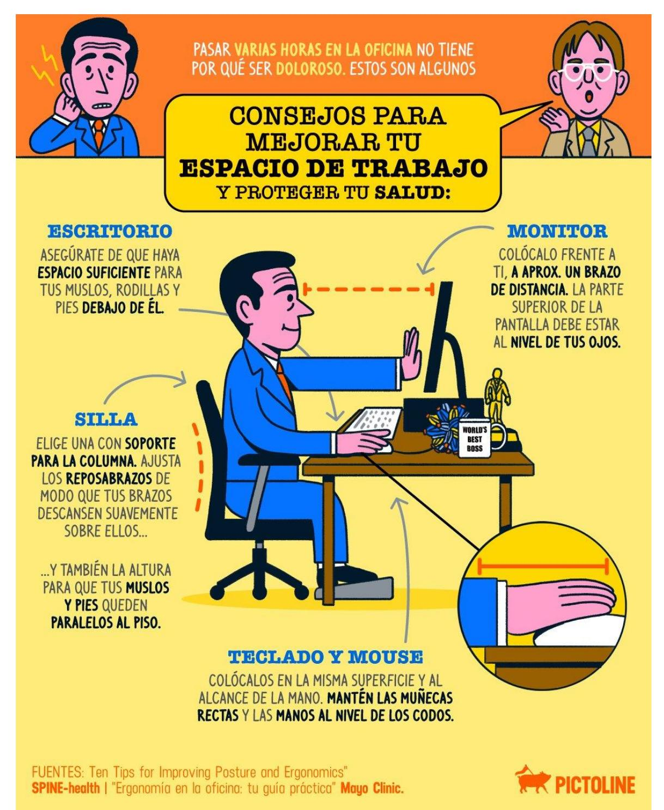
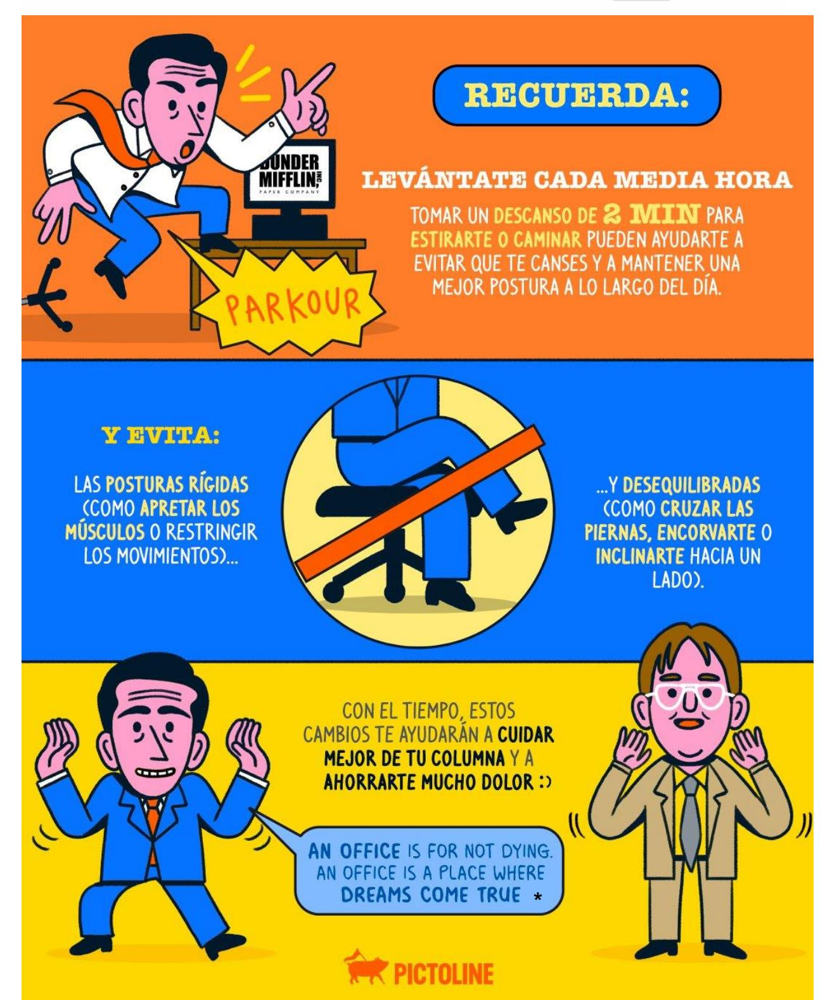
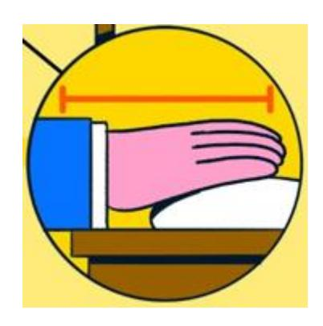

**Tercera Jornada Ensayo PAES Competencia Lectora SOLUCIONARIO**

#### **Lectura 1 (preguntas 1 a 7)**

Reportaje de María Paz Salas publicado el 2 de junio de 2022 en *Revista Paula*.

## *Breadcrumbing***: migas de atención virtual que no llevan a nada**

- 1. En el clásico cuento infantil Hansel y Gretel, los protagonistas utilizaban migas de pan para dejar un rastro que los llevara de vuelta a casa. Y, aunque es de esa historia que proviene el término inglés *breadcrumbing –*que significa ir dejando migas de pan–, la palabra se refiere más bien a las migas virtuales: a esas muestras de atención o afecto hacia otra persona sin que haya un compromiso real ni una intención de concretar una relación presencial.
- 2. El Urban Dictionary lo define así: "es cuando alguien no tiene intenciones de llevar las cosas más lejos, pero le gusta la atención. Así, coquetea aquí o allá, envía señales de vida solo para mantener a la persona interesada".
- 3. Ejemplos hay miles. Alguien que demuestra interés a través de las redes sociales, pero no busca nada más. Dejar un 'me gusta' en Instagram, pero ignorar los mensajes. Aparecer de vez en cuando con una propuesta en WhatsApp que nunca se lleva a cabo. Un día calor, otro frío. Migas de pan para generar atención y dejar un rastro que no lleva a ningún lugar, pero que sí mantiene la atención. Básicamente el primo menos famoso del *ghosting*, el término en inglés para definir la desaparición abrupta de la vida de una persona.
- 4. "El *breadcrumbing* y el *ghosting* siempre han existido en contextos *offline*1, solo que ahora disponemos de dominios virtuales en los que se pueden poner en práctica. Del mismo modo que la vida virtual ha añadido una nueva dimensión a nuestra vida, estos fenómenos añaden una capa más que hay que tener en cuenta y saber gestionar", dice la doctora Kelly Campbell, académica de psicología de la Universidad Estatal de California.
- 5. Por su parte, en el libro *Que sea amor del bueno. Por qué la responsabilidad afectiva es clave en tus relaciones*, la psicóloga Marta Martínez Novoa explica que esta situación puede generar angustia, frustración y una sensación de vacío cuando esas pequeñas cuotas de atención desaparecen. Además, dice, relaciones disfuncionales o tóxicas como estas pueden generar adicción.
- 6. Los expertos concuerdan en que las personas que van dejando estas "migas de afecto" buscan tener cerca a otras personas ya sea para engrandecer su ego o para llenar otros tipos de vacíos emocionales. Entre muchas otras razones, puede tratarse también de personas inseguras o con baja autoestima.
- 7. Para Dana McNeil, terapeuta de parejas y experta en relaciones basada en San Diego, Estados Unidos, hay que considerar otro factor: el *breadcrumbing* es fácil de ejercer.

1 **Offline**: Que está disponible o se realiza sin conexión a internet o a otra red de datos.

"Cualquiera puede soltar una respuesta vaga o una respuesta a alguien con un lenguaje elogioso y positivo sin decir realmente nada concreto. La frecuencia y la duración de la respuesta también están controladas por la persona que hace el *breadcrumbing*", explica. "Pueden decir cosas como 'he estado muy ocupado, pero quería decirte que sigo pensando en ti y que me pondré en contacto contigo pronto para planear un encuentro'. Este tipo de respuesta es vaga, pero deja al receptor con una sensación de esperanza y de creer que la persona que envió la nota se preocupa y quiere seguir conectando", añade McNeil.

- 8. ¿Cómo saber que una persona está utilizando este mecanismo? Según explica Campbell, hay que tener claro en todo momento que los hechos hablan más que las palabras. "Si una persona lleva semanas enviando mensajes y no ha querido concretar y demostrar su interés por ti, es una señal de alarma", dice.
- 9. Algunas de estas señales pueden detectarse cuando la otra persona hace planes, pero siempre los termina cancelando, o quienes parecen demasiado ocupadas para dedicarte tiempo. También cuando nunca sabes qué puedes esperar del otro. Las personas que tienen este tipo de comportamientos suelen ser bastante inconsistentes en el trato personal.
- 10. Se puede detectar este modo de vincularse cuando no se reciben señales de vida de la otra persona durante días, semanas o incluso meses. La irregularidad en las comunicaciones provoca que surjan desconfianzas.
- 11. Para que una relación florezca de manera positiva, dice Campbell, deber seguir una "progresión orgánica" en términos de tiempo, energía y emociones. "Si no has visto este tipo de inversión por parte de la otra persona, tú tienes que invertir menos. Siempre hay un equilibrio de poder en las relaciones, incluso en las que están empezando. No se siente bien ser la única persona que se preocupa, la que está poniendo el esfuerzo", dice.
- 12. Para lidiar con este tipo de situaciones, la experta aconseja dar un paso al costado. "Invierte en otras cosas, en ti mismo y en las relaciones con los amigos y la familia. Una pareja bien compenetrada dedicará el mismo tiempo a hacer florecer la relación", explica.
- 13. Por su parte, McNeil aconseja abordar el tema de una forma más práctica. "Pide una fecha u hora concreta en la que puedan conectar por teléfono o en persona. Indica algunas fechas en las que estés libre y pide un encuentro específico. Si la otra persona espera a responder hasta que haya pasado el evento o no responde a la pregunta formulada, puedes suponer con seguridad que te está *breadcrumbing*", dice.

- 1. ¿Con qué intención se menciona el cuento de Hansel y Gretel en el primer párrafo?
  - A) Señalar el primer caso conocido de *breadcrumbing*.
  - B) Comentar el origen del término *breadcrumbing*.
  - C) Comparar las migas de pan con las migas virtuales.
  - D) Justificar el uso de migas de pan para dejar un rastro.

**Correcta:** B

**Habilidad:** Interpretar

**Defensa:** En el primer párrafo se menciona que: "En el clásico cuento infantil Hansel y Gretel, los protagonistas utilizaban migas de pan para dejar un rastro que los llevara de vuelta a casa." Luego, se agrega que el término inglés *breadcrumbing* proviene de esa historia y que en su sentido original significa ir dejando migas de pan. Por lo tanto, la intención es comentar el origen del concepto *breadcrumbing,* el cual en la actualidad se refiere a las migas de atención virtual que una persona deja para mostrar atención o afecto hacia otra persona, pero sin que haya un compromiso real ni una intención de concretar una relación presencial.

- 2. ¿Cuál(es) de los siguientes casos se puede(n) considerar como *breadcrumbing*?
- I. Aparecer de vez en cuando con una propuesta en WhatsApp que nunca se lleva a cabo
- II. Dejar un 'me gusta' en Instagram, pero ignorar los mensajes.
- III. Desaparecer abruptamente de la vida de una persona.
  - A) Solo I
  - B) Solo II
  - C) I y II
  - D) I, II y III

**Correcta:** C

**Habilidad:** Localizar

**Defensa:** De acuerdo con la información del párrafo 3 hay miles de ejemplos de *breadcrumbing*. En dicho segmento se mencionan explícitamente "Dejar un 'me gusta' en Instagram, pero ignorar los mensajes. Aparecer de vez en cuando con una propuesta en WhatsApp que nunca se lleva a cabo." Por lo tanto, la alternativa correcta es la C. El enunciado III (desaparecer abruptamente de la vida de una persona) corresponde a la definición de *ghosting*.

- 3. De acuerdo con el texto, ¿cuál de los siguientes enunciados es **falso** en relación con el *breadcrumbing*?
  - A) Es un fenómeno nuevo surgido en un contexto en el que son frecuentes las relaciones virtuales.
  - B) Puede generar angustia, frustración y sensación de vacío cuando la atención desaparece.
  - C) Consiste en dejar muestras de atención sin que haya una intención de concretar una relación presencial.
  - D) Las relaciones disfuncionales o tóxicas como el *breadcrumbing* pueden producir adicción.

**Correcta:** A

**Habilidad:** Localizar

**Defensa:** En el párrafo 4 se menciona explícitamente que "El *breadcrumbing* y el *ghosting* siempre han existido en contextos offline, solo que ahora disponemos de dominios virtuales en los que se pueden poner en práctica". Por lo tanto, la alternativa A es falsa. Lo que indican las alternativas B y D aparece en el párrafo 5: "Marta Martínez Novoa explica que esta situación puede generar angustia, frustración y una sensación de vacío cuando esas pequeñas cuotas de atención desaparecen. Además, dice, relaciones disfuncionales o tóxicas como estas pueden generar adicción." Por último, la definición de *breadcrumbing* se puede encontrar en el párrafo 1: "la palabra se refiere más bien a las migas virtuales: a esas muestras de atención o afecto hacia otra persona sin que haya un compromiso real ni una intención de concretar una relación presencial."

- 4. Según los expertos, quienes dejan "migas de afecto":
  - A) no saben qué es lo que pueden esperar del otro.
  - B) suelen ser personas realmente muy ocupadas.
  - C) coquetean con varias personas al mismo tiempo.
  - D) pueden ser personas inseguras o con baja autoestima.

**Correcta:** D

**Habilidad:** Localizar

**Defensa:** De acuerdo con la información proporcionada por el párrafo 6 "Los expertos concuerdan en que las personas que van dejando estas "migas de afecto" buscan tener cerca a otras personas ya sea para engrandecer su ego o para llenar otros tipos de vacíos emocionales. Entre muchas otras razones, puede tratarse también de personas inseguras o con baja autoestima." Por lo tanto, la alternativa D es la correcta.

5. ¿Qué relación se puede establecer entre los párrafos 12 y 13 con el resto del texto?

## Ambos párrafos

- A) justifican psicológicamente la necesidad de abordar el *breadcrumbing* a tiempo.
- B) relatan situaciones que son consideradas migas de atención según las expertas.
- C) describen recomendaciones de especialistas para enfrentar el *breadcrumbing*.
- D) explican cómo detectar que alguien no podrá acudir a un encuentro específico.

**Correcta:** C

**Habilidad:** Interpretar

**Defensa:** Para responder esta pregunta se requiere analizar el contenido de los párrafos 12 y 13, y luego determinar su aporte al desarrollo del tema. En este caso, ambos segmentos se refieren a consejos o sugerencias que aportan las especialistas Kelly Campbell ("Para lidiar con este tipo de situaciones, la experta aconseja dar un paso al costado") y Dana McNeil ("aconseja abordar el tema de una forma más práctica"). Por lo tanto, la alternativa C es la correcta.

- 6. A partir de lo expuesto en el párrafo 11, se concluye que la expresión "progresión orgánica" se refiere a:
  - A) la inversión de tiempo, energía y emociones que realiza alguien en una relación que está empezando.
  - B) el desarrollo positivo que se logra en una relación gracias a que una persona pone todo su esfuerzo.
  - C) el florecimiento de relaciones que se inician en contextos offline y continúan en las redes sociales.
  - D) el avance natural de una relación en la que ambas partes demuestran interés en la misma medida.

**Correcta:** D

**Habilidad:** Interpretar

**Defensa:** De acuerdo con el párrafo 11 "Para que una relación florezca de manera positiva, dice Campbell, deber seguir una "progresión orgánica" en términos de tiempo, energía y emociones." Esta progresión orgánica depende de que ambas personas involucradas inviertan lo mismo, porque es necesario que exista un equilibrio de poder en las relaciones para que estas se desarrollen. "Si no has visto este tipo de inversión por parte de la otra persona, tú tienes que invertir menos. Siempre hay un equilibrio de poder en las relaciones, incluso en las que están empezando. No se siente bien ser la única persona que se preocupa, la que está poniendo el esfuerzo". Lo que ocurre cuando alguien practica *breadcrumbing* es que se pierde o se trunca esta progresión orgánica. Por lo tanto, la alternativa correcta es la D.

- 7. ¿Cuál de las siguientes opciones resume las señales que permiten detectar el *breadcrumbing*?
  - A) La falta de consistencia y la intermitencia en las demostraciones de interés.
  - B) La imposibilidad de concretar un encuentro por temor al compromiso afectivo.
  - C) La dificultad para entablar conversaciones extensas mediante redes sociales.
  - D) La formulación de respuestas vagas con un lenguaje elogioso y positivo.

**Correcta:** A

**Habilidad:** Interpretar

**Defensa:** Los párrafos 8, 9 y 10 se refieren a las señales que permiten detectar cuando una persona está haciendo *breadcrumbing*. En este sentido, se destaca la falta de coherencia entre lo que se dice y lo que realmente se hace, tal como se expone en el párrafo 8 ("¿Cómo saber que una persona está utilizando este mecanismo? Según explica Campbell, hay que tener claro en todo momento que los hechos hablan más que las palabras" y en el párrafo 9 ("Algunas de estas señales pueden detectarse cuando la otra persona hace planes, pero siempre los termina cancelando, o quienes parecen demasiado ocupadas para dedicarte tiempo"). También se destaca la irregularidad de las comunicaciones en el párrafo 10: "Se puede detectar este modo de vincularse cuando no se reciben señales de vida de la otra persona durante días, semanas o incluso meses."

#### **Lectura 2 (preguntas 8 a 16)**

Texto del educador brasileño Paulo Freire, escrito en Jamaica, el 9 de mayo 1992.

## **Del derecho a criticar**

- 1. El derecho a criticar y el deber, al criticar, de no faltar a la verdad para apoyar nuestra crítica, es un imperativo ético de la más alta importancia en el proceso de aprendizaje de nuestra democracia.
- 2. Es preciso aceptar la crítica seria, fundada, que recibimos, de un lado, como esencial en el avance de la práctica y de la reflexión teórica, de otro, en el crecimiento necesario del sujeto criticado. De ahí que, al ser criticados, por más que no nos agrade, si la crítica es correcta, fundamentada, hecha éticamente, no tenemos forma de dejar de aceptarla, rectificando así nuestra posición anterior. Asumir la crítica implica, por tanto, reconocer que ella nos convence, parcial o totalmente, de que estábamos incurriendo en equívoco o error que merecía ser corregido o superado.
- 3. Esto significa que tenemos que aceptar algo obvio: que nuestros análisis de los hechos, de las cosas, que nuestras reflexiones, que nuestras propuestas, que nuestra comprensión del mundo, que nuestra manera de pensar, de hacer política, de sentir la belleza o la fealdad, las injusticias, que nada de eso es unánimemente aceptado o rechazado. Esto significa, fundamentalmente, reconocer que es imposible estar en el mundo, haciendo cosas, influyendo, interviniendo, sin ser criticado.
- 4. Pero, a pesar de la obviedad de lo que acabo de decir, esto es, de que es imposible agradar a griegos y a troyanos, quien hace algo tiene que ejercitar la humildad antes de comenzar a aparecer en función de lo que empezó a hacer. Vivida auténticamente, la humildad calma, pacifica los posibles ímpetus de intolerancia de nuestra vanidad frente a la crítica, incluso justa, que recibimos.
- 5. No es posible, por otro lado, ejercer el derecho a criticar, en términos constructivos, pretendiendo tener en el criticar un testimonio educativo, sin encarnar una posición rigurosamente ética. Así, el derecho a la práctica de criticar exige de quien lo asume el cumplimiento minucioso de ciertos deberes que, si no son observados, retiran la validez y la eficacia de la crítica. Deberes con relación al autor que criticamos y deberes con relación a los lectores de nuestros textos críticos. Deberes, en el fondo, también con relación a nosotros mismos.
- 6. El primero de ellos es no mentir. No mentir sobre lo criticado, no mentir a los lectores ni a nosotros. Nos podemos equivocar, podemos errar. Mentir, nunca.
- 7. Otro deber es procurar, con rigor, conocer el objeto de nuestra crítica. No es ético ni

riguroso criticar lo que no conocemos. No puedo basar mi crítica en el pensamiento de A o de B, en lo que oí decir de A y de B, ni siquiera en lo que apenas leí sobre A y B, sino en lo que yo mismo leí, en lo que yo mismo indagué acerca de su pensamiento. Está claro que, para criticar positiva o negativamente el pensamiento de A o de B, me es importante también saber lo que de ellos dicen otros autores. Esto, sin embargo, no basta.

- 8. La exigencia de conocer el pensamiento que se ha de criticar no depende de que nos gustó o no la persona cuyo pensamiento analizamos.
- 9. ¿Cómo criticar un texto que ni siquiera leí, basado apenas en la manía que tengo al autor o a la autora o porque José y María me dijeran que el autor del texto es espontaneísta? Que tenemos derecho a sentir manía de la gente no hay duda. Es obvio también. El derecho que tengo de tener manía a María o a José no se puede extender, sin embargo, al mentir sobre él o sobre ella. No puedo decir, por ejemplo, sin probarlo, que José y María dijeron que puede haber práctica educativa sin contenidos. En primer lugar, esta afirmación es una falsedad histórica. Nunca hubo ni hay educación sin contenidos. Segundo, si digo esto de José y de María, subrayando por tanto su error, sin probar que ellos, de verdad, hicieron tal afirmación, miento en relación a José y María, miento en relación a mí mismo y continúo trabajando contra la democracia, que no se construye falseando la verdad.
- 10. Otro deber ético de quien critica es dejar claro a sus lectores que su crítica abarca un texto apenas del autor criticado o toda su obra, todo su pensamiento. Si el autor criticado escribe varios trabajos, al criticar uno de ellos, no podemos decir que la crítica es a su pensamiento como totalidad, a no ser que, conociendo la totalidad, estemos convencidos de esto. Reitero: lo que no es posible es leer uno entre diez textos y extender a los nueve restantes la crítica hecha a uno, antes de analizar rigurosamente los demás.
- 11. La eticidad del trabajo intelectual no me permite la irresponsabilidad de ser imprudente en la apreciación de la producción de los otros. Como dije antes, puedo errar, me puedo equivocar o confundirme en mi análisis, pero no puedo distorsionar el pensamiento que estudio y critico. No puedo decir que el autor que critico dijo Y si él dijo M y yo estoy seguro de que él dijo M.
- 12. No puedo criticar por pura envidia o por pura rabia simplemente para figurar.
- 13. Es inadmisible que, entre intelectuales de buen nivel, escuchemos afirmaciones como ésta: -¿Ha leído usted hay un trabajo reciente de ese autor que usted critica tan duramente? -No. Y me produce irritación de quien lo ha leído.
- 14. Este discurso niega totalmente al intelectual que lo hace. Peor todavía: este discurso en nada contribuye a la formación ético-científica de los alumnos o alumnas de tal intelectual.
- 15. Creo que es urgente, entre nosotros, superar este mal hábito que es, en el fondo, un

testimonio deformante, de criticar, de minimizar a un autor, de imputarle afirmaciones que jamás hizo o distorsionar las que realmente hizo. Y de hacerlo con seriedad y certeza tales que pudieran dejar en duda hasta al autor injustamente criticado. En cierto momento del proceso los críticos se apoyan apenas en lo que oyen y no en lo que leen o investigan.

16. El derecho incontestable a criticar exige de quien lo ejerce el deber de no mentir.

<https://www.bloghemia.com/2021/06/paulo-freire-no-puedo-criticar-por-pura.html> (Adaptación)

- 8. ¿Cuál es la postura del emisor acerca de la crítica?
  - A) Es una responsabilidad social en tanto contribuye al desarrollo democrático.
  - B) Es un derecho, pero también implica cumplir con ciertas obligaciones éticas.
  - C) Es un imperativo ético esencial en el avance de la práctica y de la reflexión teórica.
  - D) Es un deber con el cual los intelectuales y educadores tienen que cumplir.

**Correcta:** B

**Habilidad:** Interpretar

**Defensa:** Para poder determinar la postura o planteamiento del autor se necesita extraer su pensamiento central. En este sentido, en el quinto párrafo se plantea que "el derecho a la práctica de criticar exige de quien lo asume el cumplimiento minucioso de ciertos deberes que, si no son observados, retiran la validez y la eficacia de la crítica." Asimismo, en el primer párrafo se señala que "El derecho a criticar y el deber, al criticar, de no faltar a la verdad para apoyar nuestra crítica, es un imperativo ético de la más alta importancia en el proceso de aprendizaje de nuestra democracia." Y, además, en el último párrafo el autor concluye categóricamente que "El derecho incontestable a criticar exige de quien lo ejerce el deber de no mentir." Por lo tanto, se puede afirmar que el autor considera que la crítica es un derecho, sin embargo, exige el cumplimiento de ciertos deberes, los cuales menciona más adelante.

- 9. ¿Cómo se puede sintetizar la idea que sostiene el emisor con respecto al hecho de ser criticado?
  - A) No le agrada, pero intenta aceptarlo con humildad.
  - B) Lo considera como un imperativo ético en democracia.
  - C) Lo acepta como una oportunidad de corregir un error.
  - D) Le produce resistencia porque no soporta a los críticos.

**Correcta:** C

**Habilidad:** Interpretar

**Defensa:** Para responder esta pregunta se requiere analizar el contenido del segundo párrafo, en el cual se indica que "al ser criticados, por más que no nos agrade, si la crítica es correcta, fundamentada, hecha éticamente, no tenemos forma de dejar de aceptarla,

rectificando así nuestra posición anterior. Asumir la crítica implica, por tanto, reconocer que ella nos convence, parcial o totalmente, de que estábamos incurriendo en equívoco o error que merecía ser corregido o superado." Por lo tanto, la alternativa correcta es la C. La alternativa B se refiere no al hecho de ser criticado, sino al ejercicio de la crítica.

10. ¿Qué quiso decir el autor con la expresión "es imposible agradar a griegos y a troyanos" formulada en el cuarto párrafo?

## El trabajo de un intelectual

- A) puede ser aceptado por algunos y rechazado por otros.
- B) implica enfrentarse con quienes sostienen ideas en contra.
- C) lo convierte en vanidoso e intolerante hacia las críticas.
- D) produce inevitablemente envidia en algunas personas.

**Correcta:** A

**Habilidad:** Interpretar

**Defensa:** Para responder esta pregunta se requiere interpretar el sentido de la frase considerando el contexto en el que se enuncia. En este caso, la idea proviene del planteamiento que el autor desarrolla en el tercer párrafo, donde señala que toda acción llevada a cabo por alguien en la sociedad podría generar aceptación por parte de algunos y rechazo por parte de otros: "es imposible estar en el mundo, haciendo cosas, influyendo, interviniendo, sin ser criticado". Por ello, la alternativa correcta es la A.

- 11. Según el autor, quien hace algo en la sociedad debe practicar:
  - A) la vanidad.
  - B) la justicia.
  - C) la sabiduría.
  - D) la humildad.

**Correcta:** D

**Habilidad:** Localizar

**Defensa:** Esta pregunta requiere recuperar la información mencionada de manera explícita en el texto. En el párrafo 3 se dice que "es imposible estar en el mundo, haciendo cosas, influyendo, interviniendo, sin ser criticado." Y luego, en el párrafo 4 el autor declara que "quien hace algo tiene que ejercitar la humildad antes de comenzar a aparecer en función de lo que empezó a hacer. Vivida auténticamente, la humildad calma, pacifica los posibles ímpetus de intolerancia de nuestra vanidad frente a la crítica, incluso justa, que recibimos." Por lo tanto, la alternativa que plantea información verdadera es la D.

- 12. ¿Qué relación se puede establecer entre los párrafos 5 y 6 de la lectura?
  - A) El párrafo 5 plantea que es necesario que la crítica cumpla con ciertos deberes; mientras que el párrafo 6 menciona uno de esos deberes.
  - B) El párrafo 5 expresa que es importante considerar a la práctica de criticar como un derecho; mientras que el párrafo 6 fundamenta esta idea.
  - C) El párrafo 5 explica cuándo se puede considerar que una crítica es constructiva, mientras que el párrafo 6 señala una característica de esta.
  - D) El párrafo 5 increpa a quienes ejercen el derecho a la crítica faltando a la ética; mientras que el párrafo 6 da un ejemplo de una práctica poco ética.

**Correcta:** A

**Habilidad:** Interpretar

**Defensa:** La respuesta a esta pregunta implica analizar el contenido de ambos párrafos del texto y determinar sus ideas principales. En este sentido, en el párrafo 5 se observa que el autor manifiesta su planteamiento central con respecto a la crítica como un derecho que exige asumir una postura ética, la cual consiste en el cumplimiento de ciertos deberes. En relación con lo anterior, en el párrafo 6 el autor expresa que el primero de esos deberes es el de no mentir.

- 13. Según el autor, son deberes de todo intelectual que practique la crítica:
- I. No mentir sobre lo criticado.
- II. Apoyarse en lo que oyen de otros.
- III. Conocer el objeto de la crítica.
- IV. Aclarar si se critica solo un texto o toda la obra.
  - A) I y III
  - B) I, II y III
  - C) I, III y IV
  - D) I, II, III y IV

**Correcta:** C

**Habilidad:** Localizar

**Defensa:** La información necesaria para responder esta pregunta se encuentra explícita en la lectura. En el párrafo 6 se menciona que el primer deber de la crítica es no mentir. En el párrafo 7 se dice que otro de los deberes "es procurar, con rigor, conocer el objeto de nuestra crítica. No es ético ni riguroso criticar lo que no conocemos." Y, por último, en el párrafo 10 el autor afirma que "Otro deber ético de quien critica es dejar claro a sus lectores que su crítica abarca un texto apenas del autor criticado o toda su obra, todo su pensamiento." Por lo tanto, los enunciados I, III y IV son verdaderos. Con respecto al enunciado II, el párrafo 15 dice que "En cierto momento del proceso los críticos se apoyan apenas en lo que oyen y no en lo que leen o investigan", sin embargo, esto constituye una práctica considerada poco ética por parte del autor y es justamente lo que él está cuestionando en su escrito.

#### 14. A partir de lo leído, se puede inferir que para el autor:

- A) un problema grave de la democracia es que el derecho a no ser criticado no está garantizado.
- B) la verdad es un valor esencial en nuestra sociedad debido a que la democracia se basa en ella.
- C) se requiere que el trabajo intelectual tenga un mayor reconocimiento y menos cuestionamientos.
- D) la mentira es un mal hábito que debe ser erradicado en forma urgente entre los intelectuales.

**Correcta:** B

**Habilidad:** Interpretar

**Defensa:** A partir de lo planteado en el párrafo 9 "si digo esto de José y de María, subrayando por tanto su error, sin probar que ellos, de verdad, hicieron tal afirmación, miento en relación a José y María, miento en relación a mí mismo y continúo trabajando contra la democracia, que no se construye falseando la verdad", es posible inferir que para el autor la democracia se basa en el valor de la verdad, tal como se plantea en la alternativa B. En cuanto a la alternativa D, esta idea se encuentra textual en el párrafo 15: "Creo que es urgente, entre nosotros, superar este mal hábito que es, en el fondo, un testimonio deformante, de criticar, de minimizar a un autor, de imputarle afirmaciones que jamás hizo o distorsionar las que realmente hizo." Por ello, no corresponde a una inferencia, es decir, no es información implícita que pueda desprenderse de la lectura.

## 15. ¿Qué función tiene la interrogante planteada en el párrafo 9?

- A) Poner en duda la calidad del trabajo que realizan algunos críticos.
- B) Denunciar ciertas afirmaciones falsas sobre la práctica educativa.
- C) Discutir con quienes se han atrevido a criticar el trabajo del propio autor.
- D) Reprobar las malas prácticas de algunos críticos que falsean la verdad.

**Correcta:** D

**Habilidad:** Interpretar

**Defensa:** Para responder esta pregunta, se requiere interpretar para qué el autor formula la pregunta "¿Cómo criticar un texto que ni siquiera leí, basado apenas en la manía que tengo al autor o a la autora o porque José y María me dijeran que el autor del texto es espontaneísta?" Esta interrogante sirve para desaprobar algunos hábitos de los intelectuales que critican a otros intelectuales, como fundar su crítica en rumores, mentiras o envidias. Por lo tanto, la alternativa correcta es la D.

#### 16. Considerando el planteamiento del autor, su posición es:

- A) crítica, porque emite un juicio ético sobre la labor de criticar.
- B) especulativa, porque reflexiona en términos puramente teóricos.
- C) desconfiada, porque duda del trabajo serio de los intelectuales.
- D) ofensiva, porque descalifica con fuerza a quienes lo han criticado.

**Correcta:** A

**Habilidad:** Evaluar

**Defensa:** Esta pregunta requiere formular un juicio crítico con respecto al punto de vista que sostiene el autor, analizando la forma y contenido del texto. Considerando que se trata de un texto de carácter argumentativo, Freire orienta su planteamiento hacia los fundamentos éticos del ejercicio de la crítica, destacando la importancia de no mentir. Por lo tanto, su posición es crítica, tal como se expresa en la alternativa A.

## **Lectura 3 (preguntas 17 a 24)**

Fragmento de un reportaje publicado el 14 de junio de 2022 en *Ladera Sur*.

# **Carpinteros nativos de Chile, maravillosas aves de pico fuerte que podemos encontrar a lo largo del territorio nacional**

- 1. De seguro en más de alguna ocasión -recorriendo los frondosos bosques del sur de Chile, caminando entre el arbolado urbano o pasando por las zonas áridas del norte – has escuchado el fuerte golpeteo sobre un tronco que delata la presencia de algún carpintero. Lo cierto es que en Chile tenemos 4 especies de este grupo, y podemos encontrarlas en casi todas las regiones de nuestro país, construyendo cavidades en los troncos de los árboles o marcando su territorio. Estas aves, además de ser pintorescas y muy distintivas, cumplen un rol fundamental en los ecosistemas en los que habitan ya que controlan las plagas y brindan refugio a otras especies con las cavidades que generan para hacer sus nidos.
- 2. Los carpinteros nativos de Chile pertenecen a la gran familia de los pícidos, que incluye 218 especies que se distribuyen en casi todos los continentes del mundo, con la excepción de Australia, Madagascar y las regiones polares extremas. Esta familia forma parte de uno de los grupos de aves más antiguos que existen, los Piciformes, y se encuentra emparentada con otras familias de pájaros como los tucanes.
- 3. En Chile tenemos 4 de estas hermosas aves, las cuales se distribuyen en casi todo el territorio nacional y poseen distintas cualidades que las convierten en especies clave para los ecosistemas en los que habitan. Estas son: el pitío (*Colaptes pitius*), el pitío del norte (*Colaptes rupicola*), el carpinterito (*Veniliornis lignarius*), y el carpintero negro (*Campephilus magellanicus*).
- 4. La principal característica que hace especiales a estas aves está relacionada con sus adaptaciones morfológicas, las cuales fueron esculpidas por la necesidad de tomar ventaja de su entorno. La mayoría de las especies de carpinteros son estrictamente forestales debido a que, por un lado, nidifican en cavidades de árboles, y por otro, están especializadas en alimentarse principalmente de insectos xilófagos, es decir, aquellos que dependen de la madera para completar sus ciclos biológicos.
- 5. Esta exclusividad trófica2 ha condicionado curiosas adaptaciones morfológicas en esta familia de aves. Presentan cráneos neumatizados que les permiten absorber la fuerza de los golpes cuando horadan la madera (el famoso repiqueteo o tamborileo sobre las ramas y troncos), una lengua que se recoge dando la vuelta al cráneo y que es capaz de ensartar a los artrópodos cuando se extiende, dedos enfrentados en sus patas (zigodáctilos) que les

2 **Trófico, trófica**: Perteneciente o relativo a la nutrición.

facilitan el agarre en superficies verticales, y unas plumas de la cola, o rectrices, rígidas que les ayudan a desplazarse y estabilizarse en los troncos.

- 6. "La principal característica de los carpinteros es que tienen picos fuertes y cráneos adaptados para golpear fuerte la madera. Estas aves a lo largo del tiempo desarrollaron características en el cráneo que reducen el impacto de los golpes, que son con mucha fuerza y podrían provocar daños cerebrales en el caso de no contar con las adaptaciones adecuadas", señala Franco Villalobos, profesional de la Red de Observadores de Aves y Vida Silvestre de Chile (ROC).
- 7. Y es justamente esta cualidad la que los convierte en especies tan importantes para los ecosistemas. Diversos estudios han documentado que la capacidad de horadar troncos y ramas crea una red de cavidades secundarias en el bosque que es fundamental para muchas otras especies que las ocupan una vez abandonadas. Además, se ha comprobado que son capaces de controlar algunas plagas forestales al alimentarse de los insectos xilófagos que las provocan.
- 8. "Son arquitectos del paisaje porque pueden modificar su entorno a través de las cavidades y eso resulta súper interesante, porque cuando el carpintero termina su ciclo reproductivo y abandona el nido, esas cavidades son utilizadas por otros animales. Por ejemplo, en el caso de las aves, hay un montón de especies que nidifican en cavidades como el chercán (*Troglodytes aedon*), la golondrina chilena (*Tachycineta meyeni*), el rayadito (*Aphrastura spinicauda*), el chuncho (*Glaucidium nana*), el concón (*Strix rufipes*), el choroy (*Enicognathus leptorhynchus*), la cachaña (*Enicognathus ferrugineus*), entre otros. Queda en evidencia que hay diversas especies que se benefician de las cavidades que generan los carpinteros. Y no solo aves, sino que también mamíferos como murciélagos, marsupiales como el monito del monte, y también reptiles. Entonces cumplen un rol ecológico importante porque disponen de sitios de nidificación o refugio para otras especies", agrega el profesional de la ROC.
- 9. Por otro lado, también se ha asociado a los pájaros carpinteros con los hongos dependientes de la madera o lignícolas, pues su preferencia por madera muerta o en putrefacción necesita ser facilitada por este tipo de organismos. Y parece que esta interacción es en ambos sentidos, ya que los hongos poliporales (como el hongo yesquero) podrían depender de los pájaros carpinteros como vectores de dispersión de esporas.
- 10. Asimismo, todos estos aspectos los confirman como un grupo de aves muy especializado dependiente de un tipo de bosque concreto, con altos grados de madurez y conservación, en el caso del carpintero negro, por ejemplo, lo que los convierte en buenos indicadores de la calidad de los bosques, ya que su presencia es indicativa de la buena salud de la masa forestal.

- 11. Pese a lo anterior, los pájaros carpinteros de Chile, como nos comenta Franco, se ven constantemente amenazados, en gran parte por los cambios en el uso del suelo en los ambientes que habitan.
- 12. Esto se debe principalmente a la extracción de madera y los cambios en las estructuras del bosque, lo que finalmente se traduce en destrucción y fragmentación de sus hábitats. Por otro lado, los carpinteros que suelen habitar en ciudades, como es el caso del carpinterito, se enfrentan constantemente a ser depredados por animales domésticos como gatos y choques con vidrios y otras estructuras. Además, los carpinteros que habitan en el bosque esclerófilo como el propio carpinterito, el pitío y el comesebo grande enfrentan cada verano la posibilidad de perecer ante los incendios forestales.

[https://laderasur.com/articulo/carpinteros-nativos-de-chile-maravillosas-aves-de-pico-fuerte-que-podemos](https://laderasur.com/articulo/carpinteros-nativos-de-chile-maravillosas-aves-de-pico-fuerte-que-podemos-encontrar-a-lo-largo-del-territorio-nacional/)[encontrar-a-lo-largo-del-territorio-nacional/](https://laderasur.com/articulo/carpinteros-nativos-de-chile-maravillosas-aves-de-pico-fuerte-que-podemos-encontrar-a-lo-largo-del-territorio-nacional/)

- 17. ¿Cuál es la función del primer párrafo en relación con el resto de la lectura?
  - A) Motivar al lector a recorrer los paisajes de Chile en busca de pájaros carpinteros.
  - B) Describir las especies de pájaros carpinteros que existen en Chile y su hábitat.
  - C) Explicar la manera en que se puede detectar la presencia de pájaros carpinteros.
  - D) Presentar a los pájaros carpinteros destacando su relevancia en la naturaleza.

**Correcta:** D

**Habilidad:** Interpretar

**Defensa:** Para responder esta pregunta se requiere analizar qué información aporta el primer párrafo en relación el desarrollo del tema. Considerando que se trata de un texto expositivo, el segmento corresponde a la introducción. En ella se menciona que "Estas aves, además de ser pintorescas y muy distintivas, cumplen un rol fundamental en los ecosistemas en los que habitan ya que controlan las plagas y brindan refugio a otras especies con las cavidades que generan para hacer sus nidos." Por lo tanto, la alternativa correcta corresponde a la D.

- 18. ¿Por qué se dice que los pájaros carpinteros cumplen un rol fundamental en los ecosistemas donde habitan?
  - A) Porque actúan como verdaderos arquitectos del paisaje modificando su entorno a través de las cavidades.
  - B) Porque están emparentados con los Piciformes, uno de los grupos de aves más antiguos que existen.
  - C) Porque controlan las plagas y las cavidades que generan para hacer sus nidos sirven de refugio a otras especies.
  - D) Porque las especies que forman parte de esta familia de aves poseen curiosas adaptaciones morfológicas.

**Correcta:** C

**Habilidad:** Localizar

**Defensa:** La información necesaria para responder a esta pregunta se encuentra textual en el primer párrafo: "Estas aves, además de ser pintorescas y muy distintivas, cumplen un rol fundamental en los ecosistemas en los que habitan ya que controlan las plagas y brindan refugio a otras especies con las cavidades que generan para hacer sus nidos.". De ahí que la alternativa correcta sea la C.

19. ¿A qué se deben las adaptaciones morfológicas que caracterizan a los carpinteros?

- A) A sus necesidades de alimentación.
- B) A que son aves estrictamente forestales.
- C) A su superioridad sobre otras aves del entorno.
- D) A su dependencia de la madera.

**Correcta:** A

**Habilidad:** Interpretar

**Defensa:** Esta pregunta requiere analizar el contenido del cuarto párrafo, donde se menciona que "La principal característica que hace especiales a estas aves está relacionada con sus adaptaciones morfológicas, las cuales fueron esculpidas por la necesidad de tomar ventaja de su entorno". En el mismo segmento se especifica que los pájaros carpintero se alimentan "principalmente de insectos xilófagos, es decir, aquellos que dependen de la madera para completar sus ciclos biológicos." Posteriormente, en el quinto párrafo se hace referencia a que las adaptaciones morfológicas de estas aves se deben a su exclusividad trófica, es decir, su nutrición habría condicionado el desarrollo de ciertas características físicas. Por lo tanto, la alternativa correcta es la A. No es correcto que la causa de las adaptaciones morfológicas de los pájaros carpinteros sea su dependencia a la madera, como se plantea en la alternativa D, puesto que esta idea corresponde a las características de los insectos xilófagos.

- 20. ¿Con qué intención se cita a Franco Villalobos en el contexto del sexto párrafo?
  - A) Explicar cómo evolucionaron los pájaros carpinteros en su morfología para adaptarse al medio ambiente.
  - B) Destacar una de las cualidades de los pájaros carpinteros que los convierte en especies claves para los ecosistemas.
  - C) Especificar a qué se dedica la Red de Observadores de Aves y Vida Silvestre de Chile (ROC).
  - D) Confirmar que los carpinteros poseen un cráneo especialmente adaptado para resistir los golpes a la madera.

**Correcta:** B

**Habilidad:** Interpretar

**Defensa:** En el párrafo 6 se citan directamente las palabras del profesional de la Red de Observadores de Aves y Vida Silvestre de Chile (ROC), Franco Villalobos. Sus palabras

se refieren a la principal característica morfológica de los pájaros carpintero: su cráneo resistente a los golpes. Por lo tanto, la intención es destacar esta cualidad como un rasgo que los convierte en especies importantes para los ecosistemas.

- 21. ¿Qué característica **NO** es propia de los pájaros carpinteros?
  - A) Poseen una lengua que se recoge dando la vuelta al cráneo.
  - B) Presentan dedos enfrentados en sus patas para agarrarse.
  - C) Nidifican sobre las ramas y troncos de bosques nativos.
  - D) Tienen plumas rígidas en la cola para estabilizarse en los troncos.

**Correcta:** C

**Habilidad:** Localizar

**Defensa:** La información necesaria para responder esta pregunta se encuentra en el quinto párrafo, donde se describen las particularidades del pájaro carpintero. En este sentido, se dice que poseen "una lengua que se recoge dando la vuelta al cráneo y que es capaz de ensartar a los artrópodos cuando se extiende, dedos enfrentados en sus patas (zigodáctilos) que les facilitan el agarre en superficies verticales, y unas plumas de la cola, o rectrices, rígidas que les ayudan a desplazarse y estabilizarse en los troncos." Sin embargo, no es verdadero que nidifiquen sobre las ramas, puesto que lo que se menciona al respecto es que lo hacen en las cavidades que ellos mismos forman perforando los troncos de los árboles. Por lo tanto, la alternativa C es la correcta.

- 22. De los párrafos 8 y 9, se infiere que los pájaros carpinteros:
  - A) se distribuyen en casi todo el territorio nacional.
  - B) dependen de otras especies para su sobrevivencia.
  - C) son buenos indicadores de la calidad de los bosques.
  - D) favorecen el desarrollo de otras especies del bosque.

**Correcta:** D

**Habilidad:** Interpretar

**Defensa:** Esta pregunta requiere extraer información implícita. En ambos párrafos se destaca la relación de los pájaros carpinteros con otras especies y los beneficios que aportan estas aves al ecosistema: "Queda en evidencia que hay diversas especies que se benefician de las cavidades que generan los carpinteros. (…) los hongos poliporales (como el hongo yesquero) podrían depender de los pájaros carpinteros como vectores de dispersión de esporas." En este sentido, se puede establecer que los pájaros carpinteros favorecen el desarrollo de otras especies del bosque.

- 23. En el párrafo 5, ¿cuál es la función de la información contenida en los paréntesis?
  - A) Señalar cuál es el nombre científico de las especies de aves que se mencionan.
  - B) Aclarar información sobre las características que distinguen al pájaro carpintero.
  - C) Ejemplificar el rol que cumplen los pájaros carpinteros en su medio ambiente.
  - D) Comentar un aspecto interesante de las aves que podría emocionar al lector.

**Correcta:** B

**Habilidad:** Interpretar

**Defensa:** Los signos de paréntesis sirven para insertar en un enunciado una información complementaria o aclaratoria. En este caso, se introduce un dato que aclara la información que se está entregando sobre las características de los pájaros carpintero: "Presentan cráneos neumatizados que les permiten absorber la fuerza de los golpes cuando horadan la madera (el famoso repiqueteo o tamborileo sobre las ramas y troncos), una lengua que se recoge dando la vuelta al cráneo y que es capaz de ensartara los artrópodos cuando se extiende, dedos enfrentados en sus patas (zigodáctilos) que les facilitan el agarre en superficies verticales, y unas plumas de la cola, o rectrices, rígidas que les ayudan a desplazarse y estabilizarse en los troncos." Por lo cual, la alternativa correcta es la B.

- 24. ¿Cuál es la principal amenaza que enfrentan actualmente los pájaros carpinteros?
  - A) Los choques con vidrios y otras estructuras presentes en las ciudades.
  - B) La posibilidad de ser depredados por animales domésticos como gatos.
  - C) Los incendios forestales que se producen durante los veranos.
  - D) Los cambios en el uso del suelo en los ambientes donde habitan.

**Correcta:** D

**Habilidad:** Localizar

**Defensa:** Esta pregunta requiere recuperar información explícita contenida en el párrafo 11: "los pájaros carpinteros de Chile, como nos comenta Franco, se ven constantemente amenazados, en gran parte por los cambios en el uso del suelo en los ambientes que habitan." Por lo tanto, la alternativa D es la correcta.

#### **Lectura 4 (preguntas 25 a 31)**

Fragmento del libro *La poesía de Violeta Parra* de la académica y docente Paula Miranda, publicado en 2013.

## **Poesía amorosa: Enamoramientos, gratitudes y maledicencias**

*"Solo el amor con su ciencia, nos vuelve tan inocentes." (V. Parra)*

- 1. La experiencia del amor de pareja y los distintos discursos o representaciones que lo han vehiculado están presentes en todas las obras de arte. Y muy especialmente en la poesía y en la canción. Además, esas "historias de amor" han alimentado el imaginario y la construcción de identidades entre las personas. Pero la manera en que este es abordado y experimentado en el arte y en la vida varía de cultura en cultura. Violeta Parra incorpora en su comprensión del mundo tanto su propia experiencia vital como los ideologemas de las distintas tradiciones que ella conoce, especialmente la campesina popular y la popular urbana de los años treinta y cuarenta en Chile. En este ámbito específico del amor hay que resaltar la confluencia de varios hallazgos: su recopilación de cuecas y tonadas entre cantores de diversas zonas de Chile; su admiración por las cantoras españolas de sevillanas y pasodobles, a quienes "imitó" en la primera etapa de su trayectoria; su trabajo de interpretación de boleros, corridos, habaneras y valses peruanos en las quintas de recreo santiaguinas y porteñas, entre los más medulares. En algunos casos la mirada de Violeta Parra confluye con la visión que esas canciones portan -como lo que ocurre con las tonadas de sus "amigas" cantoras- y en otros casos diverge profundamente, como lo que ocurre en "Gracias a la vida" o en "Volver a los diecisiete", en las que la pulsión amorosa se sublima y se aleja de alguna manera, del tono recriminador o liberal de las tonadas. Estos diálogos con distintas tradiciones van decantando en ella una comprensión del amor en que la mujer tiene un rol muy activo y pasional, carnal y liberador, y a veces también idealizador.
- 2. Pero Violeta desarrollará una poética amorosa que irá cambiando y que pasará por diversos periodos, todos coincidentes con sus pulsiones vitales y estéticas. Hay en este ámbito tres inclinaciones: un primer momento, más apegado a la tradición; un segundo momento de transición, donde prima el amor trágico, de alta violencia simbólica ("El Gavilán"), pero ricamente experimental y creativo en lo artístico; y una última etapa, en que Violeta abre su arte a formas más personales y únicas de tratamiento del amor. En *Las últimas composiciones* se despliega con gran maestría y complejidad su "decir" amoroso y aquí desarrolla al menos tres poéticas del amor: el amor sublimado con visión vitalista ("Gracias a la vida", "Volver a los diecisiete"); el amor sublime con visión fatalista, ("Maldigo del alto cielo") y, por último, el amor desafiante y lúdico de la recriminación ("El Albertí'o").
- 3. Si pensamos en esa estrecha y temprana relación de Violeta Parra con las cantoras, y especialmente con las cantoras de tonadas, ella sería heredera y habría además "glorificado" una larga tradición iniciada por las cantoras del mundo arábigo andaluz. En

esta genealogía de cantoras habría que incluir a Violeta Parra, pues en ella la relación amorosa es más que una simple temática o un motivo recurrente. Sostengo que esta es una pulsión que marca su obra y su vida, sus proyectos y sus relaciones, a veces bajo fuerzas más positivas o de vida (eróticas) y en otras, aparentemente más inclinadas al dolor y a la muerte, aunque igualmente pasionales. Ambas pulsiones no son en ella excluyentes ni dualistas, sino que se complementan y hasta potencian en algunos casos. Su máxima realización se expresa en que en *Las últimas composiciones*, seis de sus catorce canciones sean exclusivamente de esta temática, más dos cuyo centro es el amor, aunque tengan alcances más amplios, como son "Gracias a la vida" y "Volver a los diecisiete". En este sentido, el amor pasional sería el núcleo aglutinador de sus últimas canciones. Pero este amor es a veces sublimado y en otras ocasiones es un amor muy concreto, hacia el hombre que esta mujer quiere y desea, muy en la línea de las tonadas. Es esta la razón por la que encontramos, entre el repertorio grabado por Violeta Parra, solo un bolero ("Brillo de mar en tus ojos"), al inicio de su carrera; y en cambio, varias decenas de tonadas, entre las recopiladas, las adaptadas y las creadas. Ha habido por tanto un largo camino, personal e histórico, para llegar a la composición de sus grandes temas de amor. Ese camino tiene dos motivaciones. Una es esta experiencia estética de la que hablábamos, amplia, compleja y muy rica en matices; y la otra, tanto o más importante, la huella que imprime allí el sujeto real, con sus propias vivencias amatorias, todas intensas, activas y multidimensionales.

- 4. Ambos elementos, el estético y el vital, irán alimentando una poética amorosa caracterizada por lo pasional, en la que se mezclan diversos sentimientos: la liberación a través del amor, la rememoración del que se ha ido, la invitación al reencuentro, las amenazas de amor (el abandono, la separación), el deseo de fusión con el ser amado, el deseo de plenitud total (vitalista casi siempre), la ironía, el humor y la exigencia amatoria. Más cerca de la estética urbana, en la línea del bolero, estaría la idealización o demonización del tú y la imposibilidad de ser sin el otro. Pero su poesía amorosa de la etapa final alcanzará realizaciones mucho más plenas y en las que el motivo vital será menos importante que el logro estético.
- 5. Creo que la capacidad de la poesía amorosa de Violeta Parra consiste justamente en que, sin recurrir al sentimentalismo melodramático, logra la creación de una atmósfera, un sentido, un sentimiento y un discurso vigoroso y único. En muchos casos la melodía, la interpretación y la entonación son los que complementan esta comunicación de sentimientos.
- 6. Tres grandes momentos marcan esta preocupación. El primero lo pensaremos todavía ligado a su apego a diversas tradiciones, sobre todo a la folklórica (1948-1957); el segundo, de transición (1957-1959) será el de su pleno encuentro con la imagen de la mujer activa y decidida de la tonada, versus la poética fatalista, aunque ricamente experimental de su canción "El Gavilán". El tercer momento, será su etapa de plenitud creativa (1960-1966), en la que propondrá nuevos sentidos para el decir amoroso, muy cercanos a una ritualidad sincrética. En términos biográficos la primera etapa se abre con el amor (no correspondido) de Luis Oyarzún, y continúa con sus dos matrimonios: el

contraído con Luis Cereceda, con quien estuvo casada entre 1938 y 1948, y el que mantuvo con Luis Arce, entre 1949 y 1954. Esta etapa de los "tres luises" es seguida por una de transición, en la que Violeta mantiene una relación amorosa intensa en Europa con el español Paco Ruz en 1954 y en Concepción, con el pintor Julio Escámez, en 1957. El tercer momento, de plenitud amatoria y creativa, está marcado, sin duda, por la pasión amorosa que despertó en ella el suizo Gilbert Favre, con quien se mantuvo unida, pese a los viajes y estadías en Europa y Argentina, entre 1960 y 1965. En este momento su poesía se abre a más posibilidades, aunque vuelve el temple de la tonada festiva en la etapa final de su vida, a propósito de su también intensa relación con el uruguayo Alberto Zapicán ("El Albertí'o" y "Pupila de águila").

Miranda, Paula (2013). *La poesía de Violeta Parra*. Editorial Cuarto Propio.

## 25. ¿Qué función cumple el primer párrafo?

- A) Destacar el rol de Violeta Parra en la literatura chilena.
- B) Comentar que el amor está presente en todas las obras de arte.
- C) Introducir el tema del amor en la obra poética de Violeta Parra.
- D) Resumir los tipos de amor que desarrolla Violeta Parra en sus canciones.

**Correcta:** C

**Habilidad:** Interpretar

**Defensa:** Esta pregunta requiere analizar la forma en que se organizan las ideas en el texto. Considerando lo anterior, el primer párrafo tiene una finalidad introductoria al tema del amor en la obra poética de Violeta Parra. Por lo tanto, la alternativa C es la correcta. Si bien la alternativa B es algo que se menciona, no corresponde al contenido fundamental del primer párrafo, sino que es una idea secundaria.

- 26. De acuerdo con el planteamiento de la autora, un elemento que marcó la poética amorosa de Violeta Parra fue:
  - A) su experiencia de vida, es decir, sus propias vivencias amatorias.
  - B) la sensibilidad femenina derivada de la cercanía con otras cantoras.
  - C) su preferencia musical concentrada en las tonadas y los boleros.
  - D) la dedicación al estudio de otros discursos estéticos sobre el amor.

**Correcta:** A

**Habilidad:** Localizar

**Defensa:** Esta pregunta requiere recuperar información que se presenta explícita en el texto. De acuerdo a lo anterior, en el tercer párrafo se dice que "Ese camino tiene dos motivaciones. Una es esta experiencia estética de la que hablábamos, amplia, compleja y muy rica en matices; y la otra, tanto o más importante, la huella que imprime allí el sujeto real, con sus propias vivencias amatorias, todas intensas, activas y multidimensionales."

Por lo tanto, la alternativa A es la correcta. No es correcto afirmar que la preferencia musical (en el sentido de gusto) de Violeta Parra fueran las tonadas y los boleros, sino que más bien esos géneros tradicionales fueron los que ella se dedicó a recopilar.

27. Según la autora, el primer momento de la poesía de Violeta Parra se relaciona con:

- A) la pasión amorosa que despertó en ella el suizo Gilbert Favre.
- B) el apego a la tradición folklórica, especialmente a la tonada.
- C) la plenitud creativa, marcada por formas más personales y únicas del amor.
- D) una transición, donde prima el sentido trágico del amor.

**Correcta:** B

**Habilidad:** Localizar

**Defensa:** Para responder esta pregunta, se requiere reconocer lo que la autora afirma explícitamente sobre las etapas de la poesía amorosa de Violeta Parra. Al respecto, se menciona en el párrafo 6 que "Tres grandes momentos marcan esta preocupación. El primero lo pensaremos todavía ligado a su apego a diversas tradiciones, sobre todo a la folklórica (1948-1957); el segundo, de transición (1957-1959) será el de su pleno encuentro con la imagen de la mujer activa y decidida de la tonada, versus la poética fatalista, aunque ricamente experimental de su canción "El Gavilán". El tercer momento, será su etapa de plenitud creativa (1960-1966), en la que propondrá nuevos sentidos para el decir amoroso, muy cercanos a una ritualidad sincrética." Por lo tanto, se puede establecer que el primer momento de la poesía de Violeta Parra corresponde a su apego a la tradición folklórica, tal como se plantea en la alternativa B.

- 28. En el contexto del segundo párrafo, ¿con qué intención se utiliza la palabra "decir" entre comillas?
  - A) Para referirse a la visión que Violeta Parra expresa sobre el amor en sus canciones.
  - B) Para reforzar la calidad poética de las letras de las canciones de Violeta Parra.
  - C) Para indicar la ironía con la que se analizará la poesía amorosa de Violeta Parra.
  - D) Para expresar el sentido problemático que tiene el sentimiento amoroso en el arte.

**Correcta:** A

**Habilidad:** Interpretar

**Defensa:** Para responder esta pregunta es necesario determinar el uso que la autora le da a las comillas. En este caso, se dice que "En *Las últimas composiciones* se despliega con gran maestría y complejidad su "decir" amoroso." De acuerdo a lo anterior, la intención es indicar que la palabra se utiliza con un sentido especial para hacer referencia a la poética amorosa de Violeta Parra, es decir, la visión del amor que ella expresa en sus canciones.

29. ¿Cuál es el propósito de mencionar *Las últimas canciones* de Violeta Parra en el tercer párrafo?

- A) Ejemplificar una de las obras de la autora que tiene más canciones amorosas.
- B) Confirmar que las pulsiones de amor y dolor no son excluyentes en su poesía.
- C) Sintetizar que Violeta Parra desarrolló un concepto de amor violento y trágico.
- D) Demostrar que el amor es un motivo central en la obra poética de Violeta Parra.

**Correcta:** D

**Habilidad:** Interpretar

**Defensa:** Para responder esta pregunta es necesario analizar las ideas expuestas en el tercer párrafo. En dicho segmento se menciona que "Su máxima realización se expresa en que en *Las últimas composiciones*, seis de sus catorce canciones sean exclusivamente de esta temática, más dos cuyo centro es el amor, aunque tengan alcances más amplios, como son "Gracias a la vida" y "Volver a los diecisiete"." Esto quiere decir que la autora desea destacar que la máxima realización del amor como motivo en la poesía de Violeta Parra se aprecia en su obra *Las últimas canciones.* La referencia correcta del pronombre "su" se relaciona con el planteamiento que expone la autora: "Sostengo que esta (la relación amorosa) es una pulsión que marca su obra y su vida, sus proyectos y sus relaciones, a veces bajo fuerzas más positivas o de vida (eróticas) y en otras, aparentemente más inclinadas al dolor y a la muerte, aunque igualmente pasionales." Por lo tanto, la alternativa D es la correcta. La alternativa B expresa una referencia incorrecta del pronombre "su", ya que este no reemplaza a las pulsiones de amor y dolor, sino al motivo del amor como eje central de la poesía de Violeta Parra: "En este sentido, el amor pasional sería el núcleo aglutinador de sus últimas canciones."

30. ¿Cuál es el tema fundamental que se aborda en el texto?

- A) La importancia de la vida sentimental en la creación poética femenina.
- B) La influencia de las tonadas y los boleros en la obra de Violeta Parra.
- C) Las intensas relaciones amorosas que mantuvo la cantante Violeta Parra.
- D) Las características y etapas de la poesía amorosa de Violeta Parra.

**Correcta:** D

**Habilidad:** Interpretar

**Defensa:** Para responder esta pregunta se necesita determinar cuál es el contenido más importante. En este caso, se trata de un texto argumentativo que plantea un análisis e interpretación de la obra de Violeta Parra y el fragmento seleccionado se enfoca específicamente en las características y etapas de su poesía amorosa. Por lo tanto, la alternativa correcta es la D. Las alternativas B y C si bien se refieren a ideas que aparecen en el texto, corresponden a subtemas, es decir, a ideas que expresan un contenido parcial.

### 31. ¿Cómo es la actitud del emisor del texto con respecto a Violeta Parra?

- A) De valoración, porque destaca los aspectos centrales de su poesía.
- B) De objetividad, porque describe los hechos que formaron parte de su vida.
- C) De admiración, porque enfatiza su importancia en la literatura chilena.
- D) De obsesión, porque conoce detalles de la vida íntima de la autora.

**Correcta:** A

**Habilidad:** Evaluar

**Defensa:** Para responder esta pregunta se requiere reflexionar sobre la forma y contenido del texto y emitir un juicio de valor respecto a la manera en que la autora se posiciona frente al tema. En este caso, el propósito comunicativo es formular una interpretación de la poesía amorosa de Violeta Parra, para ello se utiliza un estilo que refleja una valoración positiva destacando lo más relevante de su poética amorosa.

#### **Lectura 5 (preguntas 32 a 38)**

Fragmento de un cuento del escritor argentino Julio Cortázar, publicado en 1951.

## **"Las puertas del cielo"**

 A las ocho vino José María con la noticia, casi sin rodeos me dijo que Celina acababa de morir. Me acuerdo que reparé instantáneamente en la frase, Celina acabando de morirse, un poco como si ella misma hubiera decidido el momento en que eso debía concluir. Era casi de noche y a José María le temblaban los labios al decírmelo.

—Mauro lo ha tomado tan mal, lo dejé como loco. Mejor vamos.

 Yo tenía que terminar unas notas, aparte de que le había prometido a una amiga llevarla a comer. Pegué un par de telefoneadas y salí con José María a buscar un taxi. Mauro y Celina vivían por Cánning y Santa Fe, de manera que le pusimos diez minutos desde casa. Ya al acercarnos vimos gente que se paraba en el zaguán con un aire culpable y cortado; en el camino supe que Celina había empezado a vomitar sangre a las seis, que Mauro trajo al médico y que su madre estaba con ellos. Parece que el médico empezaba a escribir una larga receta cuando Celina abrió los ojos y se acabó de morir con una especie de tos, más bien un silbido.

 —Yo lo sujeté a Mauro, el doctor tuvo que salir porque Mauro se le quería tirar encima. Usté sabe cómo es él cuando se cabrea.

 Yo pensaba en Celina, en la última cara de Celina que nos esperaba en la casa. Casi no escuché los gritos de las viejas y el revuelo en el patio, pero en cambio me acuerdo que el taxi costaba dos sesenta y que el chófer tenía una gorra. Vi a dos o tres amigos de la barra de Mauro, que leían *La Razón* en la puerta; una nena de vestido azul tenía en brazos al gato barcino y le atusaba minuciosa los bigotes. Más adentro empezaban los clamoreos y el olor a encierro.

—Andá velo a Mauro —le dije a José María—. Ya sabes que conviene darle bastante alpiste.

 En la cocina andaban ya con el mate. El velorio se organizaba solo, por sí mismo: las caras, las bebidas, el calor. Ahora que Celina acababa de morir, increíble cómo la gente de un barrio larga todo (hasta las audiciones de preguntas y respuestas) para constituirse en el lugar del hecho. Una bombilla rezongó fuerte cuando pasé al lado de la cocina y me asomé a la pieza mortuoria. Misia Manita y otra mujer me miraron desde el oscuro fondo, donde la cama parecía estar flotando en una jalea de membrillo. Me di cuenta por su aire superior que acababan de lavar y amortajar a Celina; hasta se olía débilmente a vinagre.

 —Pobrecita la finadita —dijo Misia Martita—. Pase, doctor, pase a verla. Parece como dormida.

 Aguantando las ganas de putearla me metí en el caldo caliente de la pieza. Hacía rato que estaba mirando a Celina sin verla y ahora me dejé ir a ella, al pelo negro y lacio naciendo de una

frente baja que brillaba como nácar de guitarra, al plato playo blanquísimo de su cara sin remedio. Me di cuenta de que no tenía nada que hacer ahí, que esa pieza era ahora de las mujeres, de las plañideras llegando en la noche. Ni siquiera Mauro podría entrar en paz a sentarse al lado de Celina, ni siquiera Celina estaba ahí esperando, esa cosa blanca y negra se volcaba del lado de las lloronas, las favorecía con su tema inmóvil repitiéndose. Mejor Mauro, ir a buscar a Mauro que seguía del lado nuestro.

 De la pieza al comedor había sordos centinelas fumando en el pasillo sin luz. Peña, el loco Bazán, los dos hermanos menores de Mauro y un viejo indefinible me saludaron con respeto.

- —Gracias por venir, doctor —me dijo uno—. Usté siempre tan amigo del pobre Mauro.
- —Los amigos se ven en estos trances —dijo el viejo, dándome una mano que me pareció una sardina viva.

 Todo esto ocurría, pero yo estaba otra vez con Celina y Mauro en el *Luna Park*, bailando en el Carnaval del cuarenta y dos, Celina de celeste que le iba tan mal con su tipo achinado, Mauro de *palmbeach* y yo con seis whiskies. Me gustaba salir con Mauro y Celina para asistir de costado a su dura y caliente felicidad. Cuanto más me reprochaban estas amistades, más me arrimaba a ellos (a mis días, a mis horas) para presenciar su existencia de la que ellos mismos no sabían nada.

Me arranqué del baile, un quejido venía de la pieza trepando por las puertas.

—Esa debe ser la madre —dijo el loco Bazán, casi satisfecho.

 «Silogística perfecta del humilde», pensé. «Celina muerta, llega madre, chillido madre.» Me daba asco pensar así, una vez más estar pensando todo lo que a los otros les bastaba sentir. Mauro y Celina no habían sido mis cobayos3 , no. Los quería, cuánto los sigo queriendo. Solamente que nunca pude entrar en su simpleza, solamente que me veía forzado a alimentarme por reflejo de su sangre; yo soy el doctor Hardoy, un abogado que no se conforma con el Buenos Aires forense o musical o hípico, y avanza todo lo que puede por otros zaguanes. Ya sé que detrás de eso está la curiosidad, las notas que llenan poco a poco mi fichero. Pero Celina y Mauro no, Celina y Mauro no.

- —Quién iba a decir esto —le oí a Peña—. Así tan rápido…
- —Bueno, vos sabés que estaba muy mal del pulmón. —Sí, pero lo mismo…

 Se defendían de la tierra abierta. Muy mal del pulmón, pero así y todo… Celina tampoco debió esperar su muerte, para ella y Mauro la tuberculosis era «debilidad». Otra vez la vi girando entusiasta en brazos de Mauro, la orquesta de Canaro ahí arriba y un olor a polvo barato. Después

3 **Cobayos:** conejillo de Indias, es decir, un animal o persona sometido a observación o experimentación.

bailó conmigo una machicha4 , la pista era un horror de gente y calina. «Qué bien baila, Marcelo», como extrañada de que un abogado fuera capaz de seguir una machicha. Ni ella ni Mauro me tutearon nunca, yo le hablaba de vos a Mauro, pero a Celina le devolvía el tratamiento. A Celina le costó dejar el «doctor», tal vez la enorgullecía darme el título delante de otros, mi amigo el doctor. Yo le pedí a Mauro que se lo dijera, entonces empezó el «Marcelo». Así ellos se acercaron un poco a mí, pero yo estaba tan lejos como antes. Ni yendo juntos a los bailes populares, al box, hasta al fútbol (Mauro jugó años atrás en Racing) o mateando hasta tarde en la cocina. Cuando acabó el pleito y le hice ganar cinco mil pesos a Mauro, Celina fue la primera en pedirme que no me alejara, que fuese a verlos. Ya no estaba bien, su voz siempre un poco ronca era cada vez más débil. Tosía por la noche, Mauro le compraba Neurofosfato Escay lo que era una idiotez, y también Hierro Quina Bisleri, cosas que se leen en las revistas y se les toma confianza.

Íbamos juntos a los bailes, y yo los miraba vivir.

 —Es bueno que lo hable a Mauro —dijo José María que brotaba de golpe a mi lado—. Le va a hacer bien.

 Fui, pero estuve todo el tiempo pensando en Celina. Era feo reconocerlo, en realidad lo que hacía era reunir y ordenar mis fichas sobre Celina, no escritas nunca pero bien a mano. Mauro lloraba a cara descubierta como todo animal sano y de este mundo, sin la menor vergüenza. Me tomaba las manos y me las humedecía con su sudor febril. (…) Ya el velorio funcionaba a todo tren, de Mauro abajo estaban todos perfectos, hasta la noche ayudaba caliente y pareja, linda para estarse en el patio y hablar de la finadita, para dejar venir el alba sacándole a Celina los trapos al sereno.

 Esto fue un lunes, después tuve que ir a Rosario por un congreso de abogados donde no se hizo otra cosa que aplaudirse unos a otros y beber como locos, y volví a fin de semana. En el tren viajaban dos bailarinas del Moulin Rouge y reconocí a la más joven, que se hizo la zonza. Toda esa mañana había estado pensando en Celina, no que me importara tanto la muerte de Celina sino más bien la suspensión de un orden, de un hábito necesario. Cuando vi a las muchachas pensé en la carrera de Celina y el gesto de Mauro al sacarla de la milonga del griego Kasidis y llevársela con él. Se precisaba coraje para esperar alguna cosa de esa mujer, y fue en esa época que lo conocí, cuando vino a consultarme sobre el pleito de su vieja por unos terrenos en Sanagasta. Celina lo acompañó la segunda vez, todavía con un maquillaje casi profesional, moviéndose a bordadas anchas pero apretada a su brazo. No me costó medirlos, saborear la sencillez agresiva de Mauro y su esfuerzo inconfesado por incorporarse del todo a Celina. Cuando los empecé a tratar me pareció que lo había conseguido, al menos por fuera y en la conducta cotidiana. Después medí mejor, Celina se le escapaba un poco por la vía de los caprichos, su ansiedad de bailes populares, sus largos entresueños al lado de la radio, con un remiendo o un tejido en las manos. Cuando la oí cantar, una noche de Nebiolo y Racing cuatro a uno, supe que todavía estaba con Kasidis, lejos de una casa estable y de Mauro puestero del Abasto. Por conocerla mejor alenté sus deseos baratos,

4 **Machicha:** Baile popular brasileño de origen español, de ritmo moderado y parecido al tango, que se puso de moda en Europa y América a principios del siglo XX.

fuimos los tres a tanto sitio de altoparlantes cegadores, de pizza hirviendo y papelitos con grasa por el piso. Pero Mauro prefería el patio, las horas de charla con vecinos y el mate. Aceptaba de a poco, se sometía sin ceder. Entonces Celina fingía conformarse, tal vez ya estaba conformándose con salir menos y ser de su casa. Era yo el que le conseguía a Mauro para ir a los bailes, y sé que me lo agradeció desde un principio. Ellos se querían, y el contento de Celina alcanzaba para los dos, a veces para los tres.

Cortázar, Julio (1951). *Bestiario.* Editorial Alfaguara.

- 32. Según el texto, Celina falleció a causa de:
  - A) un accidente.
  - B) que se suicidó.
  - C) una intoxicación.
  - D) tuberculosis.

**Correcta:** D

**Habilidad:** Localizar

**Defensa:** La información necesaria para responder esta pregunta se encuentra textual: "—Bueno, vos sabés que estaba muy mal del pulmón. —Sí, pero lo mismo… Se defendían de la tierra abierta. Muy mal del pulmón, pero así y todo… Celina tampoco debió esperar su muerte, para ella y Mauro la tuberculosis era «debilidad»."

- 33. ¿Qué tipo de relación era la que tenía el narrador con Mauro y Celina?
  - A) Familiar, eran hermanos unidos por su afición a salir a bailar.
  - B) Laboral, cada uno por separado había sido un antiguo cliente.
  - C) De amistad, los apreciaba, aunque eran de distinta clase social.
  - D) Amorosa, los dos hombres estaban enamorados de Celina.

**Correcta:** C

**Habilidad:** Interpretar

**Defensa:** La interpretación de la relación entre los tres personajes se puede establecer a partir de las declaraciones del propio narrador, Marcelo Hardoy, quien afirma que: "Mauro y Celina no habían sido mis cobayos, no. Los quería, cuánto los sigo queriendo. Solamente que nunca pude entrar en su simpleza, solamente que me veía forzado a alimentarme por reflejo de su sangre; yo soy el doctor Hardoy, un abogado que no se conforma con el Buenos Aires forense o musical o hípico, y avanza todo lo que puede por otros zaguanes. Ya sé que detrás de eso está la curiosidad, las notas que llenan poco a poco mi fichero. Pero Celina y Mauro no, Celina y Mauro no." A partir del discurso del narrador protagonista se da a entender que pertenecían a diferentes clases sociales, sin embargo, los consideraba sus amigos.

.

## 34. ¿Cuál es la profesión de Marcelo Hardoy?

- A) Médico.
- B) Abogado.
- C) Taxista.
- D) Psicólogo.

**Correcta:** B

**Habilidad:** Localizar

**Defensa:** El narrador protagonista habla de sí mismo describiéndose como abogado: "yo soy el doctor Hardoy, un abogado que no se conforma con el Buenos Aires forense o musical o hípico, y avanza todo lo que puede por otros zaguanes." Además, relata que tuvo que ir a Rosario a un congreso de abogados y que conoció a Mauro cuando este lo visitó para consultarle sobre el pleito de su vieja por unos terrenos en Sanagasta.

35. ¿De qué se trata el siguiente fragmento?

 Todo esto ocurría, pero yo estaba otra vez con Celina y Mauro en el *Luna Park*, bailando en el Carnaval del cuarenta y dos, Celina de celeste que le iba tan mal con su tipo achinado, Mauro de *palmbeach* y yo con seis whiskies. Me gustaba salir con Mauro y Celina para asistir de costado a su dura y caliente felicidad. Cuanto más me reprochaban estas amistades, más me arrimaba a ellos (a mis días, a mis horas) para presenciar su existencia de la que ellos mismos no sabían nada.

Me arranqué del baile, un quejido venía de la pieza trepando por las puertas.

- —Esa debe ser la madre —dijo el loco Bazán, casi satisfecho.
  - A) Un desdoblamiento que sufre el doctor Hardoy mientras está bailando.
  - B) Un delirio del doctor Hardoy producido por el consumo de alcohol.
  - C) Un recuerdo que el doctor Hardoy evoca en medio del velorio de Celina.
  - D) Una realidad paralela vivida por los personajes de Marcelo, Celina y Mauro.

**Correcta:** C

**Habilidad:** Interpretar

**Defensa:** El fragmento seleccionado utiliza el recurso del montaje para sobreponer dos momentos diferentes de la historia. Mientras el doctor Hardoy se encuentra en el velorio de Celina recuerda brevemente cuando salía con Celina y Mauro a los salones de baile. Por lo tanto, la alternativa correcta es la C.

36. En relación con el ambiente que describe el narrador cuando Celina estaba viva, se puede concluir que:

- A) muestra la ciudad de Buenos Aires invadida de hechos fantásticos.
- B) se recrea la vida cotidiana de la clase acomodada de Buenos Aires.
- C) expone las tensiones culturales entre el mundo rural y la urbe bonaerense.
- D) corresponde a la vida nocturna de los salones de baile de Buenos Aires.

**Correcta:** D

**Habilidad:** Interpretar

**Defensa:** En diferentes momentos el narrador describe escenas de bailes a los cuales él asistía junto a Mauro y Celina cuando ella estaba viva: "yo estaba otra vez con Celina y Mauro en el *Luna Park*, bailando en el Carnaval del cuarenta y dos"; "Otra vez la vi girando entusiasta en brazos de Mauro, la orquesta de Canaro ahí arriba y un olor a polvo barato. Después bailó conmigo una machicha, la pista era un horror de gente y calina. «Qué bien baila, Marcelo», como extrañada de que un abogado fuera capaz de seguir una machicha"; "yendo juntos a los bailes populares"; "fuimos los tres a tanto sitio de altoparlantes cegadores, de pizza hirviendo y papelitos con grasa por el piso." Por lo tanto, el ambiente que describe el narrador a partir de sus recuerdos con Mauro y Celina corresponde a la vida nocturna de los salones de baile de Buenos Aires.

- 37. Del último párrafo se infiere que Celina era una mujer:
  - A) perteneciente a una buena familia.
  - B) que se dedicaba a bailar en locales nocturnos.
  - C) que fingía ser profundamente hogareña.
  - D) proveniente de algún país extranjero.

**Correcta:** B

**Habilidad:** Interpretar

**Defensa:** En el último párrafo el narrador relata que se encontró con unas bailarinas del *Moulin Rouge* y que cuando vio a las muchachas pensó en la carrera de Celina. Entonces comienza a recordar la vida de Celina y la relación que tenía con Mauro, quien la sacó de la milonga del griego Kasidis para llevársela con él. También comenta que "se precisaba coraje para esperar alguna cosa de esa mujer (…) Celina se le escapaba un poco por la vía de los caprichos, su ansiedad de bailes populares, sus largos entresueños al lado de la radio (…) Cuando la oí cantar, una noche de Nebiolo y Racing cuatro a uno, supe que todavía estaba con Kasidis, lejos de una casa estable y de Mauro." Por lo tanto, se puede inferir que se dedicaba a bailar en locales nocturnos, tal como se expresa en la alternativa B.

38. Con respecto al tema de la muerte, la visión expresada en el texto puede calificarse como:

- A) alegre y esperanzadora, pues perder a Celina impulsa a Mauro a vivir de nuevo.
- B) cercana y predecible, pues para Mauro y Celina la muerte forma parte del día a día.
- C) triste y melancólica, pues Mauro y Marcelo viven la pérdida de Celina con dolor.
- D) espiritual y liberadora, pues dejar de existir representa una salvación para Celina.

**Correcta:** C

**Habilidad:** Evaluar

**Defensa:** Esta pregunta implica elaborar un juicio crítico sobre la perspectiva que asume el narrador protagonista para referirse al tema de la muerte de Celina. Al analizar las descripciones del velorio y los recuerdos de Marcelo Hardoy se puede calificar su visión de triste y melancólica: "Fui, pero estuve todo el tiempo pensando en Celina. Era feo reconocerlo, en realidad lo que hacía era reunir y ordenar mis fichas sobre Celina, no escritas nunca pero bien a mano. Mauro lloraba a cara descubierta como todo animal sano y de este mundo, sin la menor vergüenza. Me tomaba las manos y me las humedecía con su sudor febril."

#### **Lectura 6 (preguntas 39 a 47)**

Transcripción de un video de *BBC Mundo* basado en la investigación de Margarita Rodríguez y Laura García.

# **Qué es la reserva cognitiva y por qué debemos fortalecerla para proteger nuestro cerebro**

- 1. El cerebro tiene una capacidad asombrosa: la reserva cognitiva. Una especie de almacén de recursos que permite compensar los efectos de una lesión o una enfermedad neurodegenerativa. Y lo mejor de todo es que podemos construir y reforzar esta reserva a lo largo de nuestras vidas.
- 2. Los científicos se han dado cuenta de que si realizamos actividades diversas que nos reten a pensar y sobre todo que nos gusten, podemos fortalecer a nuestro cerebro y volverlo súper ágil, creativo y ayudarlo a protegerse de daños a futuro. ¿Pero cómo funciona la "reserva cognitiva" y cómo podemos fortalecerla?
- 3. La salud cognitiva de tu cerebro, o sea la capacidad que tenemos de pensar, aprender y recordar con claridad a lo largo de nuestras vidas, depende de dos cosas: la reserva cerebral y la reserva cognitiva. Piensa en tu cerebro como si fuera una computadora. Una computadora tiene dos componentes principales: el hardware y el software. La reserva cerebral es como el "hardware" de tu cerebro, los componentes físicos, la estructura base que heredas de tus padres. Por ejemplo, tus genes, el tamaño de tu cerebro, cuántas neuronas tienes. La reserva cognitiva es como el "software", son los programas que le has "cargado" o "instalado" a tu cerebro y los podemos ir acumulando. Por ejemplo, aprender un idioma, leer, escribir un blog, jugar juegos de mesa, o hacer manualidades. Todas estas actividades hacen que tu cerebro sea más ágil, más creativo y lo retan a ser más adaptable.
- 4. Lo fascinante es que varias investigaciones han demostrado que, aunque nuestro cerebro tenga lesiones o problemas en el hardware, si le instalamos más programas y reforzamos la "reserva cognitiva" nuestros cerebros tienen más herramientas para improvisar, para protegerse de los efectos de estas lesiones y así evitar que se manifiesten los síntomas de la pérdida de salud cognitiva. Los científicos todavía no entienden bien a nivel fisiológico cómo es que nuestros cerebros logran protegerse de esta manera.
- 5. Lo que sí está muy claro son sus efectos positivos. Entonces si no sabemos todavía cómo es que funciona la "reserva cognitiva" ¿cómo sabemos que existe? Esto es gracias a cientos de monjas que permitieron que un joven científico estudiara sus cerebros en los años 80. El llamado "estudio de las monjas" es la evidencia científica más clara que tenemos sobre el poder de la "reserva cognitiva" para proteger nuestro cerebro.

- 6. En 1986, David Snowden quería estudiar las capacidades cognitivas de las personas a través de los años y se dio cuenta de que las monjas serían el grupo de control perfecto porque tenían un estilo de vida muy similar. 678 hermanas de varios conventos en Minnesota aceptaron tomar exámenes cognitivos y de memoria cada año y aparte donar sus cerebros después de su muerte para que fueran estudiados. Después de 15 años de estudiar a las hermanas, Snowden y sus colegas se dieron cuenta de que las monjas que más leían, daban clases y se mantenían activas tenían cerebros excepcionales. Y resaltó un caso en particular.
- 7. Hasta su muerte a los 101 años, la hermana Mary tuvo excelentes resultados en sus pruebas cognitivas. Pero cuando examinaron su cerebro, vieron que estaba lleno de las lesiones clásicas de la enfermedad de Alzheimer. O sea que, a nivel físico, el cerebro de la hermana Mary "tenía" Alzheimer, pero nunca presentó los síntomas clásicos de la enfermedad, aunque las lesiones estuvieran ahí.
- 8. La hermana Mary construyó y reforzó su reserva cognitiva durante toda su vida, leyendo, escribiendo, usando su memoria para aprender rezos y canciones de alabanza, platicando con las otras hermanas y encontrando felicidad en estas actividades. Es como si su cerebro tuviera tantas herramientas y fuera tan creativo que le sacó la vuelta al Alzheimer.
- 9. Nunca es tarde para enriquecer tu reserva cognitiva, aunque si empezamos desde chicos, mejor. ¿Y qué actividades sirven? Las que nos desafían a concentrarnos, a aprender algo nuevo, a usar nuestra memoria, a pensar de manera estratégica, las que nos hacen interactuar con otras personas y sobre todo que nos gusten. Cuando algo nos gusta, le dedicamos más atención y de paso ayudamos a combatir otro de los grandes enemigos de la salud cognitiva: la depresión.
- 10. Ojo, no hay olvidar que el cerebro es parte del cuerpo y que por lo tanto hay que cuidarlo también. Aunque hagamos todos los crucigramas del mundo y hablemos veinte idiomas, esto no va a servir de mucho si no cuidamos del resto del "hardware".
- 11. Así que si alguna vez escuchaste el refrán "mente ocupada, mente feliz", te proponemos una leve corrección para seguir el ejemplo de las monjas del estudio y construir tu reserva cognitiva: "mente ocupada, mente saludable por más tiempo".

<https://www.youtube.com/watch?v=bjntTyBEu24> (Adaptación)

- 39. ¿Cuál es la idea principal del primer párrafo en relación con la totalidad del texto?
  - A) La reserva cognitiva se puede fortalecer a lo largo de la vida.
  - B) Debemos prevenir las enfermedades neurodegenerativas.
  - C) El cerebro es un órgano asombroso capaz de regenerarse.
  - D) La reserva cognitiva actúa como un almacén de recursos.

**Correcta:** A

**Habilidad:** Interpretar

**Defensa:** Para responder esta pregunta es necesario jerarquizar la información que se plantea. Considerado lo anterior, en el primer párrafo se indica que "Y lo mejor de todo es que podemos construir y reforzar esta reserva a lo largo de nuestras vidas." Esta idea es la que se profundizará en el resto de la lectura. Por lo tanto, la alternativa A resulta ser la idea central.

- 40. De acuerdo con la lectura, ¿qué es la reserva cognitiva?
  - A) Son los componentes físicos del cerebro heredados genéticamente, como el tamaño y cantidad de neuronas.
  - B) Es la habilidad que tenemos de pensar, aprender y recordar con claridad a lo largo de nuestras vidas.
  - C) Se compone de las actividades gracias a las cuales el cerebro se vuelve más ágil y creativo.
  - D) Es la capacidad cerebral de compensar los efectos de una lesión o una enfermedad neurodegenerativa.

**Correcta:** D

**Habilidad:** Localizar

**Defensa:** En el primer párrafo se menciona la definición de reserva cognitiva: "El cerebro tiene una capacidad asombrosa: la reserva cognitiva. Una especie de almacén de recursos que permite compensar los efectos de una lesión o una enfermedad neurodegenerativa." La alternativa D es la correcta, pues se encuentra explícita.

- 41. ¿Con qué intención se compara al cerebro con una computadora en el tercer párrafo?
  - A) Para justificar la idea de que proteger nuestro cerebro es fundamental para mantener una buena salud cognitiva.
  - B) Para explicar la diferencia entre la reserva cerebral, equivalente al *hardware*, y la reserva cognitiva, similar a un *software*.
  - C) Para reflexionar sobre los avances tecnológicos que posibilitan la comprensión de fenómenos complejos como la mente.
  - D) Para enfatizar las tremendas capacidades de flexibilidad y adaptabilidad que posee nuestro cerebro.

**Correcta:** B

**Habilidad:** Interpretar

**Defensa:** El tercer párrafo invita al lector a pensar en su cerebro como si fuera una computadora: "Una computadora tiene dos componentes principales: el hardware y el software. La reserva cerebral es como el "hardware" de tu cerebro, los componentes físicos, la estructura base que heredas de tus padres. (…) La reserva cognitiva es como el "software", son los programas que le has "cargado" o "instalado" a tu cerebro". Por lo tanto, se puede establecer que la intención de esta analogía es explicar la diferencia entre la reserva cerebral y la reserva cognitiva.

## 42. ¿Cuál es la relación entre los párrafos 6 y 7 del texto?

|    | El párrafo 6:                                                                                                 | El párrafo 7:                                                                                                 |  |  |  |  |
|----|---------------------------------------------------------------------------------------------------------------|---------------------------------------------------------------------------------------------------------------|--|--|--|--|
|    |                                                                                                               |                                                                                                               |  |  |  |  |
| A) | explica un estudio que David Snowden aplicó a un grupo de monjas.                                          | destaca un caso específico de dicho estudio y sus resultados.                                              |  |  |  |  |
| B) | expone las ideas de David Snowden sobre el funcionamiento cerebral.                                        | relata un evento que confirmó la teoría de Snowden.                                                        |  |  |  |  |
| C) | describe una investigación de David Snowden referida a las capacidades cognitivas.                      | compara la situación de la hermana Mary con las otras monjas de la investigación.     |  |  |  |  |
| D) | insiste en la relación entre la salud cognitiva del cerebro y las actividades que ejercitan la memoria. | profundiza en la importancia de entrenar el cerebro para vivir hasta los 101 años como la hermana Mary. |  |  |  |  |

**Correcta:** A

**Habilidad:** Interpretar

**Defensa:** Esta pregunta requiere analizar el contenido de ambos párrafos. En este sentido, el párrafo 6 desarrolla o amplía en qué consistió el "estudio de las monjas" mencionado en el párrafo 5, explicando quién lo realizó, a quiénes y para qué se aplicó. Mientras que el párrafo 7 resalta un caso en particular: el de la hermana Mary, quien pese a tener lesiones provocadas por Alzheimer en su cerebro nunca presentó los síntomas de la enfermedad. Por lo tanto, la alternativa A es la que refleja los aspectos centrales de cada uno de los párrafos.

## 43. Según el texto, ¿qué importancia tiene el estudio de las monjas?

- A) Permitió levantar información sobre qué actividades resultan más favorables para prevenir el Alzheimer.
- B) Sus resultados demostraron que el estilo de vida de las monjas es el más apropiado para desarrollar estudios.
- C) Es la evidencia científica más clara que existe sobre el poder de la reserva cognitiva para proteger el cerebro.
- D) Reveló que todavía tenemos mucho que aprender sobre las enfermedades

neurodegenerativas.

**Correcta:** C

**Habilidad:** Localizar

**Defensa:** Esta pregunta requiere identificar información explícita. Para ello, se debe considerar la información aportada por el quinto párrafo: "El llamado "estudio de las monjas" es la evidencia científica más clara que tenemos sobre el poder de la "reserva cognitiva" para proteger nuestro cerebro". Por lo tanto, la alternativa correcta es la C.

- 44. El caso de la hermana Mary permite concluir que:
  - A) actividades como leer, escribir y memorizar rezos son efectivas para combatir la depresión, otro de los grandes enemigos de la salud cognitiva.
  - B) donar nuestro cerebro a la ciencia puede ayudar a producir importantes descubrimientos sobre las capacidades cognitivas de las personas.
  - C) es posible que las personas logren envejecer en forma digna sin manifestar enfermedades físicas o deterioro cognitivo.
  - D) reforzar nuestra reserva cognitiva es útil para evitar sufrir los síntomas de enfermedades neurodegenerativas como el Alzheimer.

**Correcta:** D

**Habilidad:** Interpretar

**Defensa:** Esta pregunta requiere analizar la información de los párrafos 7 y 8 en los cuales se habla del caso de la hermana Mary, el cual resulta interesante porque al examinar su cerebro se descubrió que pese a tener lesiones provocadas por el Alzheimer no demostró tener deterioro cognitivo durante las pruebas que se le hicieron. La explicación a esto es que "la hermana Mary construyó y reforzó su reserva cognitiva durante toda su vida, leyendo, escribiendo, usando su memoria para aprender rezos y canciones de alabanza, platicando con las otras hermanas y encontrando felicidad en estas actividades." Por lo tanto, se puede concluir que reforzar nuestra reserva cognitiva es útil para evitar sufrir los síntomas de enfermedades neurodegenerativas como el Alzheimer.

- 45. ¿Cuál(es) de las siguientes opciones sirve(n) para enriquecer la reserva cognitiva?
- I. Actividades que exijan concentración, memoria y estrategia.
- II. Actividades que nos permitan aprender algo nuevo.
- III. Actividades que nos gusten y en las que interactuemos con otros.
  - A) Solo I
  - B) Solo II
  - C) Solo I y II
  - D) I, II y III

**Correcta:** D

**Habilidad:** Localizar

**Defensa:** La información para responder esta pregunta se encuentra textual en el párrafo 9, en el cual se señala que las actividades que sirven para enriquecer la reserva cognitiva son "las que nos desafían a concentrarnos, a aprender algo nuevo, a usar nuestra memoria, a pensar de manera estratégica, las que nos hacen interactuar con otras personas y sobre todo que nos gusten." Por lo tanto, los enunciados I, II y III son correctos.

46. ¿Cuál es el propósito del texto leído?

- A) Contar un interesante estudio realizado en los años 80 que explica nuestro cerebro.
- B) Describir los efectos positivos de realizar actividades intelectualmente desafiantes.
- C)Explicar cómo es posible mantener la salud cerebral gracias a la reserva cognitiva.
- D) Demostrar que aprender cosas nuevas es un factor determinante para la felicidad.

**Correcta:** C

**Habilidad:** Evaluar

**Defensa:** Para responder esta pregunta es necesario reflexionar sobre la forma y contenido del texto. A partir del título "Qué es la reserva cognitiva y por qué debemos fortalecerla para proteger nuestro cerebro" ya es posible determinar que el propósito comunicativo del texto es explicar en qué consiste la reserva cognitiva y cuál es la importancia de fortalecerla para mantener la salud de nuestro cerebro. Las alternativas A y B si bien corresponden a información que se menciona en la lectura, son ideas que apoyan el tema central.

- 47. ¿Cuál es el sentido de la frase "mente ocupada, mente saludable por más tiempo"?
  - A) Es necesario hacer crucigramas y aprender varios idiomas para prolongar el tiempo de vida.
  - B) Fortalecer la reserva cognitiva realizando ciertas actividades ayuda a la salud de nuestro cerebro.
  - C) Quien se dedica a construir su reserva cognitiva, no tendrá tiempo para desarrollar enfermedades.
  - D) Tener una mentalidad positiva como las monjas del estudio, influye en la salud cognitiva.

**Correcta:** B

**Habilidad:** Interpretar

**Defensa:** Para responder esta pregunta es necesario interpretar qué quiere decir la frase mencionada en el contexto del último párrafo a modo de conclusión. En este sentido, la frase sirve para sintetizar la idea de que fortalecer la reserva cognitiva realizando ciertas actividades ayuda a la salud de nuestro cerebro, ya que esa es la idea central del texto.

#### **Lectura 7 (preguntas 48 a 57)**

Artículo de opinión escrito por el abogado Juan Pablo Glasinovic Vernon, publicado en El Dínamo el 3 de julio de 2022.

## **Política exterior y prioridades ciudadanas**

- 1. Hace unos días, AthenaLab publicó su tercera encuesta de Percepciones sobre Política Exterior y Seguridad Nacional. Este ejercicio, a pesar de su corta vida, ha venido a convertirse en una importante herramienta para los estudiosos e interesados en las relaciones internacionales en nuestro país. Además, incorpora en sus preguntas la segmentación de "expertos" y "población en general", lo que permite contrastar las prioridades y percepciones de unos y otros, quedando en evidencia en qué materias hay sintonía y en cuáles no.
- 2. Aludo a esta herramienta, porque en tiempos en que carecemos de un consenso en materia de política exterior en el país, escuchar a los ciudadanos y a los especialistas es parte de un necesario ejercicio y ya existe una herramienta que lleva 3 años preguntando cuáles debieran ser nuestras prioridades en materia de política exterior, así como cuáles son las principales amenazas para nuestra seguridad, entre otras materias.
- 3. Desde la primera versión en 2020, el segmento "población en general" ha puesto en el lugar principal el combate al narcotráfico y crimen organizado como objetivo de nuestra política exterior. En el caso de los "expertos" este tema ha escalado del cuarto lugar en 2020, al segundo puesto en 2022.
- 4. Si tomamos la percepción de amenaza a nuestra seguridad, ambos segmentos ponen al narcotráfico y crimen organizado en el primer lugar a lo largo de las 3 versiones (2020-21- 22).
- 5. Para los que habitamos en Chile, lo que refleja esta encuesta no es sorpresivo, pero no por eso menos potente. Todos hemos asistido a un dramático deterioro de la seguridad que está afectando la vida de millones de habitantes y esas personas, en materia de política exterior, están pidiendo que el Estado de Chile priorice el combate contra las causas más peligrosas de este fenómeno, entre las que se cuentan el narcotráfico y el crimen organizado.
- 6. Esta semana el gobierno del presidente Boric parece haber sintonizado con esta prioridad, al hacer una serie de anuncios desde Arica (donde como en otras ciudades, la tasa de homicidios se ha disparado). Siendo muy relevante que la máxima autoridad del país haga anuncios tan resueltos y categóricos, convocando toda la institucionalidad del Estado para ese cometido, no es suficiente. Ya hemos escuchado a varios mandatarios y ministros diciendo básicamente lo mismo, y las cosas no han hecho sino empeorar. Sin perjuicio del

complejo contexto político y económico actual, parte importante de esa degradación se debe a un diagnóstico doblemente errado: sobrevalorar las competencias estatales y menospreciar las capacidades criminales.

- 7. Así, básicamente se siguió haciendo lo mismo ante un fenómeno criminal cada vez más sofisticado y extendido por el territorio. El Estado va siempre tarde y además en una de sus responsabilidades básicas y justificativas de su propia existencia. Recordemos que en la teoría del contrato social los ciudadanos se asocian creando el Estado para que este vele por el bienestar general, protegiendo la vida y bienes de cada uno.
- 8. Lamentablemente, la gran preocupación que tenemos los chilenos es compartida por prácticamente toda la región. Los carteles de la droga se han convertido en una combinación de consorcios empresariales, con verdaderos estados al interior de los países, cuando no cooptan directamente toda la institucionalidad y se convierten en el verdadero gobierno, escalando desde los municipios al ámbito nacional. Los negocios lícitos, adquiridos y alimentados por sus ingentes e incesantes ingresos ilegales, no paran de expandirse, creando dependencia por su impacto en materia de empleo, tributos y control de empresas en áreas claves para la economía. El desarrollo de estos sofisticados imperios económicos se sustenta en última medida en la fuerza de verdaderos ejércitos. Estos protegen las operaciones ilícitas y a sus líderes, destruyen a quien no se doblega y amedrentan al resto. Lo que no se puede corromper, se elimina. Esto se conoció alguna vez como "plata o plomo" y lamentablemente sigue plenamente vigente en cada vez más lugares.
- 9. En las grandes urbes latinoamericanas, el narcotráfico ha ido tomando el control de los barrios marginales. Si ahí la acción del Estado apenas llegaba con anterioridad, una vez instalado el narco, su control ha pasado a ser casi total. Ellos imponen el orden y son el principal empleador. Cobran tributos e imparten justicia. Recuperar esos territorios exige un trabajo multidimensional y sostenido por varios años.
- 10. Además de todo lo anteriormente descrito, existe una creciente simbiosis entre crimen organizado, terrorismo y guerrilla, y en Chile estamos viendo el desarrollo y expansión de estos últimos grupos, fundamentalmente en la zona sur, ante la inoperancia estatal.
- 11. Por eso, siendo el enemigo tan poderoso, está claro que la simple acción nacional es totalmente insuficiente. Se requiere de la cooperación internacional y esta debe profundizarse y convertirse en una de las prioridades de la política exterior.
- 12. Debiéramos reorientar la labor de las agregadurías policiales, concentrándose en todos los aspectos relacionados con este combate, así como fortalecer el trabajo en materia de seguridad con los países vecinos, con el mandato a nuestras embajadas de mantener esta prioridad, lo que extenderse por razones obvias a otros países como México, Colombia, Venezuela y Ecuador.

- 13. Esta dimensión también podría potenciarse en nuestra agenda con Estados Unidos y con la Unión Europea, potencias que cuentan con una fuerte institucionalidad contra el crimen organizado y de las cuales, además de cooperación y asistencia, se puede acudir a su acervo y experiencia.
- 14. Por último, la decaída integración regional sin duda que tendría un tema urgente común en lo que se refiere a revitalizar la lucha contra el crimen organizado. Hay ahí también un espacio para impulsar una agenda, que nadie ha todavía levantado en estos últimos años y que podría abordarse en conjunto con el fenómeno migratorio (aunque son temas distintos, tienen muchos cruces como la trata de personas, el tráfico de drogas, la corrupción, el desplazamiento de grupos criminales, etc.).
- 15. En suma, los habitantes de Chile llevan al menos 3 años exigiendo que la política exterior se haga cargo de un grave problema que no solo amenaza su calidad de vida e integridad personal, sino que también pone en peligro nuestra democracia y la existencia misma de la república. El presidente Boric parece haber sintonizado con este clamor, pero si quiere tener éxito (aunque sea relativo considerando la complejidad del fenómeno), no puede prescindir de la cooperación internacional y eso pasa por incorporar el tema en nuestra política exterior en forma prioritaria.
- 16. En la coyuntura en que vivimos, me atrevo a decir que el gobierno del presidente Boric será juzgado en buena medida por su éxito o fracaso en materia de seguridad.

[https://www.eldinamo.cl/opinion/Politica-exterior-y-prioridades-ciudadanas-20220701-0045.html 3/](https://www.eldinamo.cl/opinion/Politica-exterior-y-prioridades-ciudadanas-20220701-0045.html%203/)

- 48. ¿Cuál es la intención comunicativa del texto anterior?
  - A) Exponer la política exterior adoptada en Chile.
  - B) Proponer soluciones al problema de la seguridad.
  - C) Alertar sobre los peligros del narcotráfico en Chile.
  - D) Criticar el gobierno del presidente Gabriel Boric.

**Correcta:** B

**Habilidad:** Evaluar

**Defensa:** Para responder esta pregunta es necesario reflexionar sobre la forma y el contenido del texto. En este caso se trata de un texto argumentativo, por lo que la intención del emisor es plantear un punto de vista sobre un tema polémico, que en este caso es la seguridad nacional. Desde el punto de vista del autor, el actual gobierno de Boric no ha aplicado medidas efectivas para combatir el narcotráfico y el crimen organizado. Considerando lo anterior, el emisor propone algunas soluciones al problema que se relacionan con la colaboración con otros países, es decir, con la política exterior. Por lo tanto, la alternativa B es la correcta.

- 49. Según la encuesta de AthenaLab, ¿qué problemas de seguridad nacional son prioridad en Chile, tanto para la población general como para los expertos?
  - A) El terrorismo y la guerrilla.
  - B) La migración y la trata de personas.
  - C) La corrupción y el lavado de dinero.
  - D) El narcotráfico y el crimen organizado.

**Correcta:** D

**Habilidad:** Localizar

**Defensa:** Para responder esta pregunta es necesario recuperar información que se menciona explícitamente en el cuarto párrafo: "Si tomamos la percepción de amenaza a nuestra seguridad, ambos segmentos ponen al narcotráfico y crimen organizado en el primer lugar a lo largo de las 3 versiones (2020-21-22)." Por lo tanto, la alternativa correcta es la D.

- 50. ¿Con qué objetivo el emisor menciona la encuesta de Percepciones sobre Política Exterior y Seguridad Nacional de AthenaLab?
  - A) Complementar su visión con respecto a la política exterior de Chile.
  - B) Demostrar las prioridades ciudadanas en el ámbito de la seguridad.
  - C) Expresar su acuerdo con los resultados obtenidos sobre la seguridad.
  - D) Sensibilizar a la ciudadanía acerca de las amenazas a la seguridad.

**Correcta:** B

**Habilidad:** Interpretar

**Defensa:** Esta pregunta requiere determinar cuál es la relevancia de la encuesta para efectos del desarrollo del planteamiento del autor. Dicha encuesta arrojó como resultado que la ciudadanía considera prioritario combatir el narcotráfico y el crimen organizado, lo cual le sirve al autor como evidencia para respaldar su punto de vista, es decir, para confirmar qué problemas deben ser atacados en forma urgente y cómo atacarlos. Por lo tanto, la alternativa B es la correcta. En cuanto a la alternativa A, se descarta porque el verbo complementar no se ajusta a la intención comunicativa del emisor, ya que no es información que se añade de forma complementaria, sino como sustento para el desarrollo argumentativo: "esas personas, en materia de política exterior, están pidiendo que el Estado de Chile priorice el combate contra las causas más peligrosas de este fenómeno, entre las que se cuentan el narcotráfico y el crimen organizado."

- 51. ¿Cómo evalúa el emisor la labor del gobierno del presidente Boric en materia de seguridad?
  - A) Sostiene que no ha sintonizado con el clamor de la ciudadanía.
  - B) Cree que no tendrá éxito dada la coyuntura en que vivimos.
  - C) Considera que debería procurar adoptar estrategias diferentes.
  - D) Piensa que le ha causado un dramático deterioro al país.

**Correcta:** C

**Habilidad:** Interpretar

**Defensa:** Para responder esta pregunta es necesario analizar los comentarios y apreciaciones que formula el emisor con respecto al gobierno de Boric. A partir de lo expuesto en el sexto párrafo: "Esta semana el gobierno del presidente Boric parece haber sintonizado con esta prioridad, al hacer una serie de anuncios desde Arica (donde como en otras ciudades, la tasa de homicidios se ha disparado). Siendo muy relevante que la máxima autoridad del país haga anuncios tan resueltos y categóricos, convocando toda la institucionalidad del Estado para ese cometido, no es suficiente. Ya hemos escuchado a varios mandatarios y ministros diciendo básicamente lo mismo, y las cosas no han hecho sino empeorar", se puede establecer que la alternativa C es la correcta. Asimismo, en el párrafo 15 se plantea que "El presidente Boric parece haber sintonizado con este clamor, pero si quiere tener éxito (aunque sea relativo considerando la complejidad del fenómeno), no puede prescindir de la cooperación internacional y eso pasa por incorporar el tema en nuestra política exterior en forma prioritaria." En este sentido, se da a entender que el emisor está disconforme con las medidas que han tomado los gobiernos anteriores y que el presidente Boric debería procurar adoptar estrategias diferentes.

- 52. El emisor hace referencia a la teoría del contrato social con el fin de:
  - A) denunciar la negligencia del Estado chileno en la lucha contra la delincuencia.
  - B) recordar un rasgo esencial que define a un Estado que se declara democrático.
  - C) exponer uno de los fundamentos en los que se sustenta el Estado republicano.
  - D) justificar la creación del Estado desde el punto de vista de la teoría política.

**Correcta:** A

**Habilidad:** Interpretar

**Defensa:** La respuesta se puede extraer a partir de lo señalado en el séptimo párrafo: "El Estado va siempre tarde y además en una de sus responsabilidades básicas y justificativas de su propia existencia. Recordemos que en la teoría del contrato social los ciudadanos se asocian creando el Estado para que este vele por el bienestar general, protegiendo la vida y bienes de cada uno." Considerando que el rol del Estado debería ser procurar el bienestar de los ciudadanos, el autor considera que el Estado chileno no ha hecho suficiente por resguardar la seguridad, es decir, pretende denunciar la negligencia del Estado chileno en la lucha contra la delincuencia.

- 53. ¿Cuál(es) de las siguientes acciones corresponde(n) a lo que propone el emisor para enfrentar los problemas de seguridad nacional?
- I. Potenciar la agenda con Estados Unidos y con la Unión Europea.
- II. Abordar la integración regional en conjunto con el fenómeno migratorio.
- III. Reorientar la labor de las agregadurías policiales.

- A) Solo I
- B) Solo II
- C) I y III
- D) I, II y III

**Correcta:** D

**Habilidad:** Localizar

**Defensa:** La pregunta requiere reconocer información textual. Específicamente los párrafos 12, 13 y 14 se refieren a las soluciones que propone el emisor: "Debiéramos reorientar la labor de las agregadurías policiales, concentrándose en todos los aspectos relacionados con este combate, así como fortalecer el trabajo en materia de seguridad con los países vecinos"; "esta dimensión también podría potenciarse en nuestra agenda con Estados Unidos y con la Unión Europea, potencias que cuentan con una fuerte institucionalidad contra el crimen organizado y de las cuales, además de cooperación y asistencia, se puede acudir a su acervo y experiencia"; "Por último, la decaída integración regional sin duda que tendría un tema urgente común en lo que se refiere a revitalizar la lucha contra el crimen organizado. Hay ahí también un espacio para impulsar una agenda, que nadie ha todavía levantado en estos últimos años y que podría abordarse en conjunto con el fenómeno migratorio". De esta manera, los enunciados I, II y III son correctos.

54. ¿Qué relación se establece entre el párrafo 11 con los párrafos 12, 13 y 14?

## El párrafo 11

- A) plantea la necesidad de profundizar en la cooperación internacional y los siguientes, especifican las medidas que se podrían adoptar al respecto.
- B) defiende el valor de la unidad nacional y los siguientes, mencionan ejemplos de países que han logrado derrotar al narcotráfico.
- C) define una de las prioridades de la política exterior actual y los siguientes, explican las acciones que se deberían implementar en el futuro.
- D) describe la situación de Chile en materia de seguridad y los siguientes, comparan la realidad chilena con otros países latinoamericanos.

**Correcta:** A

**Habilidad:** Interpretar

**Defensa:** Para responder esta pregunta se necesita analizar el contenido fundamental de los párrafos señalados con el fin de establecer su aporte al desarrollo del tema del texto. En este sentido, en el párrafo 11 el autor afirma categóricamente que "Se requiere de la cooperación internacional y esta debe profundizarse y convertirse en una de las prioridades de la política exterior." Luego, en el párrafo 12 habla de formas de "fortalecer el trabajo en materia de seguridad con los países vecinos". Asimismo, en el párrafo 13 plantea que "Esta dimensión también podría potenciarse en nuestra agenda con Estados Unidos y con la Unión Europea". Y, por último, en el párrafo 14 señala que la integración regional "podría abordarse en conjunto con el fenómeno migratorio". Por lo tanto, son párrafos en los que el autor se dedica a especificar las medidas que él considera que

| podrían aplicarse en materia de seguridad y que implican el desarrollo de una política exterior centrada en la colaboración entre varios países. |  |  |  |
|--------------------------------------------------------------------------------------------------------------------------------------------------------|--|--|--|
|                                                                                                                                                        |  |  |  |
|                                                                                                                                                        |  |  |  |
|                                                                                                                                                        |  |  |  |
|                                                                                                                                                        |  |  |  |
|                                                                                                                                                        |  |  |  |
|                                                                                                                                                        |  |  |  |
|                                                                                                                                                        |  |  |  |
|                                                                                                                                                        |  |  |  |
|                                                                                                                                                        |  |  |  |
|                                                                                                                                                        |  |  |  |
|                                                                                                                                                        |  |  |  |
|                                                                                                                                                        |  |  |  |
|                                                                                                                                                        |  |  |  |
|                                                                                                                                                        |  |  |  |
|                                                                                                                                                        |  |  |  |
|                                                                                                                                                        |  |  |  |
|                                                                                                                                                        |  |  |  |

55. ¿A qué se refiere el emisor cuando dice que "siendo el enemigo tan poderoso, está claro que la simple acción nacional es totalmente insuficiente"?

- A) A que, ante la asociación entre el crimen organizado, el terrorismo y la guerrilla, es imposible que en la zona sur se pueda derrotar la delincuencia.
- B) A que, debido a la expansión del narcotráfico en todos los países de la región, el crimen solo puede ser combatido con el apoyo de Estados Unidos.
- C) A que, considerando la magnitud del problema del narcotráfico y del crimen organizado en la región, un país no tiene la capacidad para enfrentarlo.
- D) A que los detractores del gobierno de Gabriel Boric continuarán exigiendo mayor eficacia en la lucha contra el narcotráfico para defender la democracia.

**Correcta:** C

**Habilidad:** Interpretar

**Defensa:** La frase se encuentra en el contexto del párrafo 11, sin embargo, para responder esta pregunta es preciso analizar las ideas que se presentan en los párrafos anteriores, en los cuales se describe detalladamente cómo opera el narcotráfico en la región, de manera que el enemigo poderoso hace referencia al narcotráfico. En ese sentido, la magnitud de los problemas sociales provocados por el narcotráfico impulsa al autor a afirmar la necesidad de combatirlo en alianza con otros países. Por lo tanto, la respuesta correcta es la alternativa C.

- 56. ¿Desde cuándo estarían definidas tanto las prioridades en materia de política exterior como las principales amenazas para nuestra seguridad, según el emisor?
  - A) 2019.
  - B) 2020.
  - C) 2021.
  - D) 2022.

**Correcta:** B

**Habilidad:** Localizar

**Defensa:** La información necesaria para responder esta pregunta se encuentra textual. Desde el segundo párrafo el autor alude a la encuesta de AthenaLab "porque en tiempos en que carecemos de un consenso en materia de política exterior en el país, escuchar a los ciudadanos y a los especialistas es parte de un necesario ejercicio y ya existe una herramienta que lleva 3 años preguntando cuáles debieran ser nuestras prioridades en materia de política exterior, así como cuáles son las principales amenazas para nuestra seguridad, entre otras materias." Asimismo, en el tercer párrafo, se señala que "desde la primera versión en 2020, el segmento "población en general" ha puesto en el lugar principal el combate al narcotráfico y crimen organizado como objetivo de nuestra política exterior. En el caso de los "expertos" este tema ha escalado del cuarto lugar en 2020, al segundo puesto en 2022." Y, también, en el cuarto párrafo se dice que "Si tomamos la percepción de amenaza a nuestra seguridad, ambos segmentos ponen al narcotráfico y

crimen organizado en el primer lugar a lo largo de las 3 versiones (2020-21-22)." Por lo tanto, las prioridades en materia de política exterior como las principales amenazas para nuestra seguridad estarían definidas desde el año 2020, cuando se inició la encuesta.

57. ¿Cuál de las siguientes opciones podría funcionar como un título alternativo para el texto?

- A) Consecuencias del narcotráfico y el crimen organizado en Latinoamérica.
- B) Percepciones de la ciudadanía sobre seguridad nacional y política exterior.
- C) Acciones para combatir los principales problemas de seguridad en Chile.
- D) Medidas anunciadas por el presidente Boric en materia de seguridad.

**Correcta:** C

**Habilidad:** Interpretar

**Defensa:** Esta pregunta requiere determinar el contenido esencial del texto. El título de debe ser global e inclusivo, es decir, debe abarcar el asunto del que se habla y lo que se dice sobre el tema. En este sentido, el título más apropiado es el que propone la alternativa C, ya que el emisor propone qué acciones se pueden aplicar para combatir los problemas de seguridad como el narcotráfico y el crimen organizado. La alternativa B hace referencia a un aspecto parcial del texto, es decir, es información que se desarrolla en los primeros párrafos con el fin de justificar el planteamiento del propio autor, por lo tanto, no corresponde al contenido más general.

#### **Lectura 8 (preguntas 58 a 65)**

Infografía publicada en *Pictoline* el 13 de junio de 2022.

<https://pbs.twimg.com/media/FVJWoz9XsAI3rNB?format=jpg&name=large>

**\*** *"Una oficina es para no morir. Una oficina es un lugar donde los sueños se hacen realidad." Michael Scott, The Office.*

## 58. ¿Con qué intención se amplía la imagen de la mano en el *mouse*?

- A) Ilustrar cómo se realiza el trabajo de oficina.
- B) Ejemplificar en qué consiste la ergonomía.
- C) Graficar la correcta postura de las muñecas.
- D) Persuadir sobre la importancia de cuidar la salud.

**Correcta:** C

**Habilidad:** Interpretar

**Defensa:** Esta pregunta requiere establecer cómo contribuye la imagen al desarrollo del tema. La mano apoyada correctamente en el *mouse* grafica la información proporcionada por el apartado "Teclado y *mouse*", en el cual se explica que estos deben colocarse en la misma superficie y al alcance de la mano y se da la siguiente recomendación: "mantén las muñecas rectas y las manos al nivel de los codos". Por lo tanto, la alternativa C es la correcta.

- 59. En relación con la implementación del espacio de trabajo es correcto afirmar que:
  - A) La altura de la silla debe ajustarse para permitir estirar las piernas.
  - B) El teclado y el *mouse* deben ubicarse a un brazo de distancia.
  - C) El escritorio debe contar con espacio suficiente para la organización.
  - D) La parte superior de la pantalla debe estar al nivel de los ojos.

**Correcta:** D

**Habilidad:** Localizar

**Defensa:** Para responder esta pregunta es necesario identificar qué información se menciona en el texto. En este caso, en la sección "Monitor" se afirma que la parte superior de la pantalla debe estar al nivel de los ojos, tal como se expresa en la alternativa D.

60. ¿Qué elemento del texto permite confiar en la información entregada?

- A) El logo de Pictoline.
- B) El uso de lenguaje técnico.
- C) La indicación de la fuente.
- D) La fecha de publicación.

**Correcta:** C

**Habilidad:** Evaluar

**Defensa:** Para responder esta pregunta es necesario evaluar de manera crítica la confiabilidad de la información entregada. En este sentido, la infografía se basa en dos documentos citados en la esquina inferior izquierda: "Ten tips for improving posture and ergonomics" (publicado en SPINE-health) y "Ergonomía en la oficina: tu guía práctica (publicado en Mayo Clinic). A partir de lo anterior se puede comprobar que el contenido publicado es verdadero, pues tiene un fundamento válido debidamente garantizado por publicaciones provenientes de medios de divulgación científica.

- 61. A partir de la lectura, se infiere que las personas que trabajan en oficina:
  - A) tienden a ser descuidadas con su salud física y mental.
  - B) están expuestas a sufrir dolores y molestias a la columna.
  - C) realizan poca actividad física fuera del horario laboral.
  - D) pasan horas en posturas rígidas que tensionan sus músculos.

**Correcta:** B

**Habilidad:** Interpretar

**Defensa:** Para responder esta pregunta es necesario extraer información implícita. Considerando que el texto señala desde el título que se entregarán consejos para mejorar el espacio de trabajo y proteger la salud y además que en la última imagen se transmite el mensaje "con el tiempo estos cambios te ayudarán a cuidar mejor de tu columna y a ahorrarte mucho dolor" dirigido a los oficinistas, podemos establecer que quienes trabajan largas jornadas en oficina son propensos a sufrir dolores y molestias en la columna a causa de malas posturas o mal acondicionamiento del lugar de trabajo.

### 62. ¿Qué posturas se deberían evitar en la oficina?

- I. Encorvarse hacia un lado.
- II. Apretar los músculos.
- III. Cruzar las piernas.
  - A) Solo I
  - B) Solo II
  - C) II y III
  - D) I, II y III

**Correcta:** D

**Habilidad:** Localizar

**Defensa:** La información que se requiere para responder esta pregunta se encuentra de forma explícita en el recuadro que dice "evita posturas rígidas (como apretar los músculos o restringir los movimientos) y desequilibradas (como cruzar las piernas, encorvarte o inclinarte hacia un lado)". Por lo tanto, todos los enunciados son verdaderos.

- 63. ¿Cómo se podría sintetizar el mensaje que transmite la infografía?
  - A) Trabajar en oficina puede hacer que tus sueños se conviertan en realidad.
  - B) Adaptar tu lugar de trabajo para que tenga las condiciones óptimas depende de ti.
  - C) Mantener una postura adecuada mientras trabajas ayuda a cuidar tu salud.
  - D) Mientras más horas dediques a tu trabajo de oficina más arriesgas tu salud.

**Correcta:** C

**Habilidad:** Interpretar

**Defensa:** Para responder esta pregunta se requiere resumir la idea más importante que se busca comunicar. En este caso, el texto contiene información sobre cómo implementar una postura adecuada en el lugar de trabajo. Por lo tanto, la alternativa correcta es la C.

## 64. ¿Qué hábito permite mantener una mejor postura durante el día?

- A) Comenzar a practicar parkour (entrenar usando obstáculos).
- B) Levantarse y descansar 2 minutos cada media hora.
- C) Elegir una silla que cuente con soporte para la columna.
- D) Tomar pausas activas y realizar estiramientos.

**Correcta:** B

**Habilidad:** Localizar

**Defensa:** La información requerida para responder esta pregunta se encuentra en el recuadro que dice "Recuerda: levántate cada media hora. Tomar un descanso de 2 minutos para estirarte o caminar pueden ayudarte a evitar que te canses y a mantener una mejor postura durante el día". Por lo tanto, la alternativa B es la correcta.

65. ¿Cuál de las siguientes opciones podría ser otro título para el texto?

- A) Posturas adecuadas en la oficina.
- B) Hábitos saludables en el trabajo.
- C) Cambios favorables de autocuidado.
- D) Conductas seguras en la oficina.

**Correcta:** A

**Habilidad:** Interpretar

**Defensa:** Esta pregunta requiere determinar el tema central del texto. El título de un texto debe ser global e inclusivo. Es decir, debe condensar lo esencial del texto. En este sentido, un título apropiado es el que propone la alternativa A, ya que indica el asunto del que se habla (posturas adecuadas en la oficina).