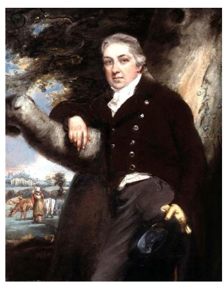
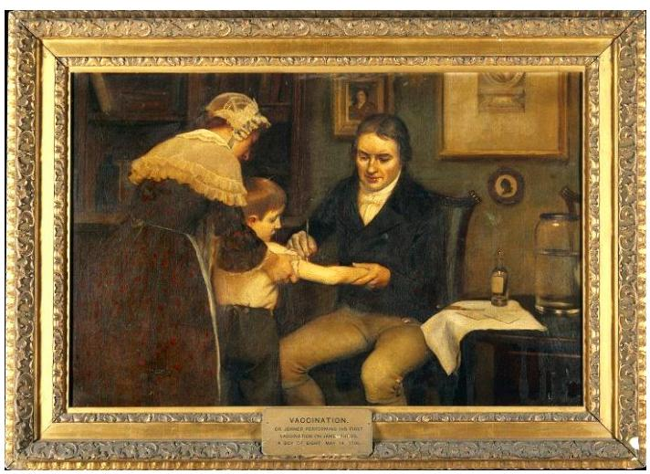
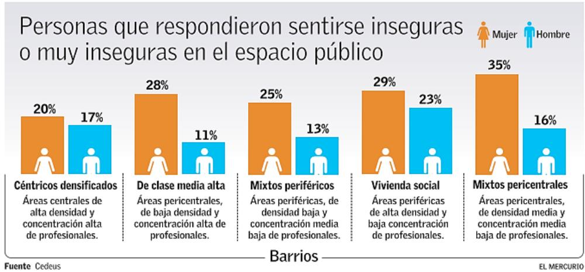

**Cuarta Jornada Ensayo PAES Competencia Lectora SOLUCIONARIO**

#### **Lectura 1 (preguntas 1 a 9)**

Artículo publicado en *National Geographic Historia,* actualizado a 21 de mayo de 2022.

## HISTORIA DE LA MEDICINA

# **La vacuna de la viruela: Edward Jenner y la primera vacuna de la historia**

Hoy en día resulta difícil comprender el azote que significaban las epidemias**.** La muerte se extendía en oleadas, como un incendio en una pradera reseca, pero nadie sabía cómo o por qué. Una de las más temibles de esas plagas era la viruela, y por eso la vacuna que Edward Jenner desarrolló contra ella a finales del siglo XVIII supuso un indiscutible punto de inflexión en la historia humana.

En realidad, la lucha de los europeos contra la viruela había empezado décadas antes. En 1716 llegó a Estambul el nuevo embajador británico, lord Montagu. Su esposa**,** lady Mary Wortley Montagu, había sufrido la viruela dos años antes. Ella sobrevivió, desfigurada, pero su hermano murió.

En Estambul, lady Montagu aprendió el idioma y descubrió que sus nuevas amigas turcas se infectaban deliberadamente a sí mismas y a sus hijos con pus de enfermos de viruela; al momento sufrían un acceso muy leve de la enfermedad, pero luego quedaban inmunizadas. Esto impresionó mucho a lady Montagu, quien, sin dudarlo un momento, inoculó a sus propios hijos y declaró: **«**Soy lo bastante patriota como para tomarme la molestia de llevar esta útil invención a Inglaterra y tratar de imponerla».

*Reconocido como el padre de la inmunología, de Edward Jenner se dice que ha sido el hombre que, con su trabajo, ha salvado más vidas en la historia de la humanidad; y es cierto.*

En realidad, lady Montagu no era la primera en plantear en Europa esta vía para prevenir la viruela**,** pero ella le dio gran publicidad y la defendió enérgicamente frente a la dura

oposición de médicos y eclesiásticos. Durante el resto del siglo fueron inoculados personajes de alto rango.

Sin embargo, el método turco, denominado variolización, tenía un serio inconveniente: entre un 1 y un 3 por ciento de los inoculados enfermaban gravemente y fallecían. Por lo tanto, la variolización nunca llegó a imponerse. Lady Montagu falleció en 1762, ignorando que un chico de entonces trece años, llamado Edward Jenner, iba a dar el paso decisivo contra la viruela.

## **Un médico filántropo**

Edward Jenner nació en 1749 en la pequeña localidad rural de Berkeley. Edward sufrió la viruela en su infancia, lo que le dejó secuelas duraderas en su salud. Fue aprendiz de un cirujano, estudió y practicó en un hospital, se unió a la asociación médica local, y publicó estudios detallados sobre varias enfermedades**.** 

Durante la década de 1790, Jenner buscó sistemáticamente el modo de proteger a la humanidad de la enfermedad que había estado a punto de matarlo en su infancia. Conocía la variolización, pero buscaba algo más eficaz, sin riesgos para el paciente.

Como médico rural, Jenner investigó muy a fondo la viruela de las vacas y a las personas que las ordeñaban. Observó así que los ganaderos, sobre todo las lecheras, que rozaban con sus manos las pústulas en las ubres de las vacas enfermas, contraían la viruela bovina, que les provocaba ampollas en las manos; sin embargo, cuando llegaban epidemias de viruela humana sus familias se contagiaban, pero ellos no.

*Edward Jenner realizando su primera vacunación en James Phipps, un niño de 8 años. 14 de mayo de 1796.*

El 14 de mayo de 1796, Jenner dio el paso decisivo: extrajo pus de las ampollas de viruela bovina de Sarah Nelme, una campesina, y se lo inoculó a un niño llamado James Phipps, el hijo de su jardinero. Este, al cabo de una semana, cayó levemente enfermo durante un par de

días, pero luego se recuperó. Seis semanas después, Jenner le infectó deliberadamente con viruela humana, sin que se produjera efecto visible alguno. Luego repitió estos experimentos con otras 22 personas, ninguna de las cuales sufrió enfermedades graves ni murió. La eficacia de la vacunación, como empezó a denominarse su método, quedó demostrada.

## **Estalla la polémica**

El descubrimiento de Jenner fue recibido con entusiasmo, pero también halló una dura oposición tanto científica como ideológica. Obispos reaccionarios y filósofos ilustrados se opusieron a la vacunación.

De esta forma abrió, sin darse cuenta, la puerta al desarrollo de otras vacunas contra enfermedades humanas sin un equivalente animal relativamente benigno, usando microorganismos atenuados o debilitados de algún modo. El propio Jenner no pudo dar ese paso porque durante su vida no se habían descubierto aún los gérmenes patógenos.

Poco a poco, la nueva práctica se fue imponiendo en toda Europa. En 1803 se creó en Gran Bretaña una Real Sociedad Jenneriana, para ofrecer de manera gratuita la vacunación contra una enfermedad que seguía matando a unos 80.000 británicos cada año. En 1800, la vacunación llegó a España y tres años después el Gobierno organizó una «Expedición filantrópica» dirigida por el doctor Balmis, que durante tres años llevó la vacuna a todo el imperio español de América, las Filipinas, y después a Macao, China e incluso a la isla de Santa Helena, colonia británica. En 1806, Napoleón ordenó la vacunación de todo su ejército.

#### **La herencia de Jenner**

Edward Jenner recibió títulos y honores por doquier. El Parlamento le recompensó con 10.000 libras, una suma colosal, y en 1806 le entregaron 20.000 adicionales, pero siempre fue un hombre modesto. Regresó a su pueblo natal, Berkeley, y ayudó a sus vecinos en sus problemas de salud. Jenner sufrió una apoplejía que le dejó paralizado el 25 de enero de 1823, falleciendo al día siguiente, con 73 años.

En 1840, el Gobierno británico prohibió la técnica de variolización y promulgó leyes para que toda la población fuese vacunada gratis**.** Sin embargo, aún no se comprendía la causa de la enfermedad. Para eso fue preciso esperar al descubrimiento de los gérmenes, gracias a Robert Koch y Louis Pasteur. Únicamente entonces fue posible crear vacunas contra enfermedades como la diarrea crónica intestinal grave (1879), el ántrax (1881), la rabia (1882), el tétanos (1890), la difteria (1890) o la peste (1897). El último caso conocido de viruela tuvo lugar en Somalia en 1977. Todo ello es el legado de un modesto médico rural inglés llamado Edward Jenner.

[https://historia.nationalgeographic.com.es/a/vacuna-viruela-edward-jenner-y-primera-vacuna-historia\\_7914](https://historia.nationalgeographic.com.es/a/vacuna-viruela-edward-jenner-y-primera-vacuna-historia_7914) (Adaptación)

- 1. ¿Cuál es el propósito de la primera sección del artículo en relación con el resto del contenido del texto?
  - A) Justificar la importancia histórica del médico Edward Jenner.
  - B) Comentar que la muerte se extendía a causa de la falta de vacunas.
  - C) Presentar el contexto en el que vivía la sociedad europea del siglo XVIII.
  - D) Explicar los antecedentes históricos de la lucha contra la viruela.

**Correcta:** D

**Habilidad:** Interpretar

**Defensa:** La primera sección del artículo corresponde a un segmento introductorio, mientras que la segunda sección lleva por título "Un médico filántropo" y se refiere al trabajo de Edward Jenner como médico. La tercera sección titulada "Estalla la polémica" expone las consecuencias de la vacuna que descubrió Jenner y la cuarta "La herencia de Jenner" hace alusión a la trascendencia de Jenner como el primero en aplicar la vacunación. En este sentido, la primera sección plantea que "la lucha de los europeos contra la viruela había empezado décadas antes" de que Jenner descubriera la vacuna contra esta enfermedad y, menciona los intentos de lady Montagu por introducir la técnica de la variolización para prevenirla. En este contexto cobra importancia el desarrollo de la primera vacuna de la historia gracias al trabajo de Jenner. Por lo tanto, el propósito de la primera sección es explicar los antecedentes históricos de la lucha contra la viruela, tal como se plantea en la alternativa D.

- 2. ¿Cómo se puede interpretar la frase "Soy lo bastante patriota como para tomarme la molestia de llevar esta útil invención a Inglaterra y tratar de imponerla" dicha por Lady Montagu?
  - A) Para ella salvar a su país es un asunto prioritario, aunque a los hombres les moleste.
  - B) Para ella defender la vida de sus compatriotas contra la viruela es un acto de honor y valentía.
  - C) Para ella es necesario obligar a los ingleses a adoptar un método para combatir la viruela.
  - D) Para ella viajar a Inglaterra se ha convertido en una verdadera molestia debido a la viruela.

**Correcta:** B

**Habilidad:** Interpretar

**Defensa:** En el contexto del tercer párrafo se menciona que en Estambul lady Montagu conoció el método llamado variolización, el cual consistía en infectarse con pus de enfermos de viruela para lograr la inmunidad: "En Estambul, lady Montagu aprendió el idioma y descubrió que sus nuevas amigas turcas se infectaban deliberadamente a sí mismas y a sus hijos con pus de enfermos de viruela; al momento sufrían un acceso muy leve de la enfermedad, pero luego quedaban inmunizadas. Esto impresionó mucho a lady Montagu, quien, sin dudarlo un momento, inoculó a sus propios hijos y declaró:

**«**Soy lo bastante patriota como para tomarme la molestia de llevar esta útil invención a Inglaterra y tratar de imponerla»." Este antecedente se enmarca en el contexto de la lucha de los europeos contra la viruela en el siglo XVIII y por eso lady Montagu afirma que se considera patriota al querer promover la técnica de la variolización en Inglaterra a pesar de los costos o molestias que esto pueda significar. Ella confía en que es una invención útil para defender la vida de sus compatriotas ingleses, quienes estaban muriendo a causa de la epidemia. En este sentido, su cualidad de patriota se relaciona con realizar una acción arriesgada que beneficie a su país y que demuestre el amor que le tiene, tal como se expresa en el cuarto párrafo: "ella le dio gran publicidad y la defendió enérgicamente frente a la dura oposición de médicos y eclesiásticos." Por lo tanto, la alternativa correcta es la B.

- 3. Según el texto, ¿cuál es la importancia de Lady Montagu para la historia de la medicina?
  - A) Como tantos europeos de la época sufrió la viruela y aunque sobrevivió a la enfermedad, quedó con graves secuelas.
  - B) Llegó a Estambul en 1716 junto su esposo, el embajador británico, para aprender cómo los turcos combatían la viruela.
  - C) Le hizo publicidad a la variolización y la defendió enérgicamente por ser un buen método para prevenir la viruela.
  - D) Inoculó a sus propios hijos con el virus de la viruela tras descubrir que sus amigas turcas se infectaban con pus de enfermos.

**Correcta:** C

**Habilidad:** Localizar

**Defensa:** En el párrafo 4 se menciona explícitamente que "En realidad, lady Montagu no era la primera en plantear en Europa esta vía para prevenir la viruela, pero ella le dio gran publicidad y la defendió enérgicamente frente a la dura oposición de médicos y eclesiásticos." Por lo tanto, la alternativa C es la correcta.

- 4. ¿Por qué Edward Jenner es reconocido como el padre de la inmunología?
  - A) Porque era un modesto médico rural cuyo deseo de proteger a la humanidad cambió la medicina.
  - B) Porque publicó estudios detallados sobre varias enfermedades a pesar de haber sufrido la viruela.
  - C) Porque es el hombre que más vidas ha salvado con su trabajo en la historia de la humanidad.
  - D) Porque descubrió el método de la vacunación y su vacuna contra la viruela fue la primera de la historia.

**Correcta:** D

**Habilidad:** Interpretar

**Defensa:** Para responder esta pregunta se requiere analizar el contenido de diferentes partes del texto, además, es complementario entender que el concepto de "padre" tiene la acepción de autor, creador o fundador de algo. Jenner es calificado como el padre de

la inmunología en el pie de la primera imagen, sin embargo, las razones para llamarlo así no se encuentran allí (según lo que se plantea en la alternativa C), sino que estas se pueden establecer a partir de las valoraciones que se formulan a lo largo del texto: "la vacuna que Edward Jenner desarrolló contra ella a finales del siglo XVIII supuso un indiscutible punto de inflexión en la historia humana", "un chico de entonces trece años, llamado Edward Jenner, iba a dar el paso decisivo contra la viruela", "La eficacia de la vacunación, como empezó a denominarse su método, quedó demostrada", "El descubrimiento de Jenner fue recibido con entusiasmo (…) De esta forma abrió, sin darse cuenta, la puerta al desarrollo de otras vacunas contra enfermedades humanas". Por último, el título también aporta información necesaria para determinar por qué Edward Jenner es reconocido como el padre de la inmunología: "Edward Jenner y la primera vacuna de la historia". Por lo tanto, la alternativa D es la correcta.

- 5. De acuerdo con lo expuesto, la variolización nunca llegó a imponerse debido a que:
  - A) entre un 1 y un 3 por ciento de los inoculados enfermaban gravemente y fallecían.
  - B) tanto los religiosos como los filósofos de la época se opusieron a esta práctica.
  - C) la vacunación demostró ser un método mucho más eficaz contra la viruela.
  - D) en 1840 el Gobierno británico prohibió la técnica proveniente de Turquía.

**Correcta:** A

**Habilidad:** Localizar

**Defensa:** Para responder esta pregunta se requiere ubicar en el quinto párrafo la información textual: "Sin embargo, el método turco, denominado variolización, tenía un serio inconveniente: entre un 1 y un 3 por ciento de los inoculados enfermaban gravemente y fallecían. Por lo tanto, la variolización nunca llegó a imponerse." Por lo tanto, la alternativa A es la correcta.

- 6. ¿Qué función cumplen las imágenes incluidas en el artículo en relación con la información que se destaca en cada una de ellas?
  - A) Ilustran los problemas de salud de la época en Gran Bretaña.
  - B) Retratan el destacado aporte de Edward Jenner a la medicina.
  - C) Representan momentos claves en la historia de la humanidad.
  - D) Grafican lo que significaba la epidemia causada por la viruela.

**Correcta:** B

**Habilidad:** Interpretar

**Defensa:** Esta pregunta requiere determinar cómo las imágenes aportan a la comprensión del tema. La primera imagen corresponde a un retrato del médico Edward Jenner y la segunda imagen lo muestra realizando su primera vacunación el año 1796. Este hito de la historia de la medicina es el tema que se pretende destacar en el artículo. Por lo tanto, la alternativa B corresponde a la función que cumplen las imágenes.

# 7. ¿Cómo fue la reacción que generó la vacuna contra la viruela?

- A) Entusiasta, porque rápidamente la nueva práctica se fue imponiendo en toda Europa.
- B) Receptiva, porque se promulgaron leyes para que toda la población fuera vacunada gratis.
- C) Polémica, porque se recibió con entusiasmo, pero halló una oposición científica e ideológica.
- D) Negativa, porque tenía un serio inconveniente y recibió una dura oposición de médicos y eclesiásticos.

**Correcta:** C

**Habilidad:** Localizar

**Defensa:** La información necesaria para responder esta pregunta se encuentra explícita en la sección "Estalla la polémica". Si bien se menciona que el descubrimiento de Jenner fue recibido con entusiasmo, también se señala que halló una dura oposición tanto científica como ideológica y que obispos reaccionarios y filósofos ilustrados se opusieron a la vacunación. Por lo tanto, la reacción hacia la vacuna contra la viruela fue controversial, es decir, generó discusión de opiniones contrarias.

# 8. ¿En qué consiste la herencia de Jenner?

- A) Su descubrimiento de los gérmenes patógenos inspiró a otros científicos como Robert Koch y Louis Pasteur.
- B) Su dedicación a la medicina fue premiada con títulos, honores y una gran recompensa económica.
- C) Su investigación sobre la relación entre la viruela bovina y la viruela humana permitió el desarrollo de otras vacunas.
- D) Sus experimentos sirvieron para que se creara una Real Sociedad Jenneriana para ofrecer la vacunación de manera gratuita.

**Correcta:** C

**Habilidad:** Interpretar

**Defensa:** Para poder determinar en qué consiste la herencia o el legado de Jenner, es necesario analizar qué aportes realizó al desarrollo de la medicina y cuál fue el impacto o trascendencia que tuvo su descubrimiento para el futuro de la ciencia. En este sentido, se menciona en el texto que "Como médico rural, Jenner investigó muy a fondo la viruela de las vacas y a las personas que las ordeñaban. Observó así que los ganaderos, sobre todo las lecheras, que rozaban con sus manos las pústulas en las ubres de las vacas enfermas, contraían la viruela bovina, que les provocaba ampollas en las manos; sin embargo, cuando llegaban epidemias de viruela humana sus familias se contagiaban, pero ellos no." De esta forma, Jenner extrajo pus de las ampollas de viruela bovina de Sarah Nelme y se lo inoculó a un niño, a quien luego le infectó con viruela humana, sin que este desarrollara la enfermedad. Por lo tanto, Jenner "abrió la puerta al desarrollo de otras vacunas contra enfermedades humanas sin un equivalente animal relativamente benigno, usando microorganismos atenuados o debilitados de algún modo. El propio Jenner no pudo dar ese paso porque durante su vida no se

habían descubierto aún los gérmenes patógenos." Es decir, su herencia se relaciona con la invención de la primera vacuna gracias a su investigación sobre la relación entre la viruela bovina y la viruela humana, tal como se plantea en la alternativa C.

- 9. En relación con la viruela, se puede inferir que actualmente:
  - A) ya no se considera una plaga, pues dejó de ser una enfermedad mortal.
  - B) está erradicada, es decir, el mundo está libre de esta enfermedad.
  - C) es una de las epidemias más temibles por su rápida expansión.
  - D) todavía no ha sido posible comprender la causa de la enfermedad.

**Correcta:** B

**Habilidad:** Interpretar

**Defensa:** Para responder esta pregunta se requiere extraer información implícita. El último párrafo del artículo señala que "El último caso conocido de viruela tuvo lugar en Somalia en 1977. Todo ello es el legado de un modesto médico rural inglés llamado Edward Jenner." Por lo tanto, si no se registran casos de la enfermedad desde el año 1977 podemos afirmar que actualmente la viruela es una enfermedad que ha sido eliminada o suprimida de manera completa y definitiva. El planteamiento de la alternativa A es incorrecto debido a que no habiendo casos de contagio por viruela desde el año 1977 no es posible afirmar que haya cesado su carácter mortal, pues esto implicaría que la enfermedad continúa existiendo.

#### **Lectura 2 (preguntas 10 a 17)**

Noticia de Isadora Vargas Meza publicada en *El Mercurio* el 14 de junio de 2022.

Análisis del Centro de Desarrollo Urbano Sustentable (Cedeus):

# **Mujeres se sienten transversalmente inseguras en el espacio público, concluye estudio**

*La investigación, realizada mediante una encuesta a personas de distintos barrios de la capital, muestra que un 27% de las mujeres consultadas percibe inseguridad, versus un 11% de los hombres.*

- 1. Un estudio desarrollado por el Centro de Desarrollo Urbano Sustentable (Cedeus), iniciativa conjunta de la U. Católica y de la U. de Concepción, comparó las experiencias de mujeres y hombres en las ciudades, revelando claras diferencias respecto de lo que sucede al usar el espacio público, ya que las mujeres suelen percibir mayor inseguridad cuando se desenvuelven en este.
- 2. La investigación, realizada a partir de la Segunda Encuesta de Percepción de Desarrollo Urbano Sustentable del Cedeus, se llevó a cabo mediante cuestionarios por vía telefónica, en julio de 2021, a 624 personas que viven en cinco tipologías urbanas del Gran Santiago, construidas en base a densidad por manzana, porcentaje de profesionales por manzana (ambos según el Censo de 2017) y distancia a centros de trabajo (según la Encuesta Origen-Destino de 2012).
- 3. Así, se definieron cinco tipologías urbanas: barrios céntricos densificados (como Santiago centro o algunas zonas de Providencia), barrios de clase media alta (como Vitacura o algunas zonas de La Florida), barrios mixtos periféricos (como Puente Alto o Maipú), barrios de vivienda social (como San Bernardo o sectores como Bajos de Mena) y barrios mixtos pericentrales (como Recoleta o Conchalí). Al evaluar los resultados, se constató que las mujeres se sienten más inseguras que los hombres en el espacio público de Santiago, ya que mientras un 27% de ellas declara sentirse insegura o muy insegura, ello sucede solo para un 11% de los hombres.

## **Datos por estratos**

- 4. Al analizar la inseguridad en el espacio público por género para cada nivel socioeconómico, se observó que las mujeres de segmento bajo (DE) son las que se sienten más inseguras (34%), mientras que las mujeres del segmento C3 son las que se sienten menos inseguras (18%). En el caso de los hombres, los de segmentos y C2 son los que sienten menor inseguridad (11%) mientras que los C3, la mayor inseguridad (21%).
- 5. En tanto, al observar las diferencias entre hombres y mujeres según la zona de la ciudad donde viven, el estudio arrojó que las mujeres de barrios mixtos pericentrales son las que sienten mayor inseguridad en el espacio público (35%), mientras que las que viven en zonas densificadas son las menos inseguras (20%) (*ver infografía*).
- 6. Andrés Señoret, investigador del Cedeus y uno de los autores del estudio, plantea que "el miedo de las mujeres en el espacio público es muy transversal, más allá del nivel socioeconómico y del sector de la ciudad donde viven. En comparación con los hombres, en quienes aumenta su inseguridad mientras disminuye su nivel socioeconómico, entre las mujeres es súper similar, incluso entre grupos como el ABC1 y el DE, que es donde se muestra mayor inseguridad".
- 7. Luis Fuentes, investigador principal del Cedeus y otro de los autores del análisis, agrega que "existe un ámbito de inseguridad que es mucho más amplio que en el caso de los hombres, eso justifica que las mujeres no puedan sentirse seguras, por ejemplo, por eventos lamentables que se han dado en el metro o en barrios universitarios".
- 8. Añade que aquello "muestra una perspectiva en la cual las mujeres se sienten mucho más inseguras ante la probabilidad de no solo un delito, como sería el caso de los hombres, sino que también a una agresión sexual".
- 9. Ángela Morales, jefa de la Unidad de Género y Diversidad de la U. Central, afirma que más allá del nivel socioeconómico, hay otros factores que pueden incidir en esta percepción, como la ubicación de los barrios, su conformación y "qué tipo de interacciones hace la mujer, por ejemplo, en el desplazamiento entre su hogar y el transporte público".
- 10. Por ello, añade que "no es posible solo restringirlo al nivel socioeconómico, también debe observarse la dinámica del ambiente del barrio, para poder analizar y situar la percepción de la inseguridad que le genera a la mujer andar por esos barrios".
- 11. Para Eugenia Dos Santos, socióloga y académica de la U. De Santiago, lo observado por el estudio "es reflejo de la inequidad de género, porque la criminalidad ve a las mujeres como las más vulnerables".
- 12. "Las medidas deben ser tomadas para toda la población, pero la parte de la ciudad que

se siente más vulnerada debe tener medidas de protección que deben darse de forma diferenciada. La vulnerabilidad debe ser disminuida a través de políticas públicas que reconozcan que las mujeres son las más atacadas", propone.

- 13. A juicio de Morales, diversos sectores de la sociedad deben involucrarse. "Tiene que ver con cómo nos hacemos cargo todos de cuidar los espacios donde no solo transitan mujeres adultas, sino también jóvenes de distintas edades, También se deben tomar medidas desde las distintas policías", afirma.
- 14. "También, estudiar dónde están los paraderos, que pueden estar en sectores más o menos conflictivos. Desde ese punto de vista, puede hacerse un estudio de uso de los paraderos. Asimismo, estudiar las conexiones que existen entre el metro y los demás transportes que hacen las conexiones", plantea.

<https://www.cedeus.cl/wp-content/uploads/2022/06/MEPRC006202206141L.pdf>

10. ¿Qué relación se puede establecer entre los párrafos 1 y 2 del texto?

|    | El párrafo 1:                                                                                        | El párrafo 2:                                                        |
|----|------------------------------------------------------------------------------------------------------|----------------------------------------------------------------------|
| A) | Resume las experiencias de mujeres y hombres en las ciudades según la encuesta. | Indica la fecha de aplicación de la encuesta.   |
| B) | Destaca que las mujeres se sienten más inseguras que los hombres en la ciudad.                 | Menciona los estudios que confirman esta inseguridad.             |
| C) | Expone el trabajo realizado por el Cedeus.                                         | Compara la investigación del Cedeus con otros estudios similares. |
| D) | Presenta el estudio al cual se referirá la noticia y menciona su conclusión.                      | Explica el método utilizado para la investigación. |

**Correcta:** D

**Habilidad:** Interpretar

**Defensa:** Para responder esta pregunta se debe analizar el contenido de ambos párrafos y establecer cuál es su aporte al desarrollo del tema. La primera sección de la noticia tiene una finalidad introductoria, es decir, presenta el tema del cual se hablará y contextualiza la información. Específicamente el primer párrafo hace referencia al estudio desarrollado por el Centro de Desarrollo Urbano Sustentable (Cedeus) en conjunto con la U. Católica y la U. de Concepción, según el cual quedó demostrado que las mujeres perciben mayor inseguridad en el espacio público que los hombres. Siguiendo progresivamente el desarrollo del tema, en el segundo párrafo se especifica que la investigación se llevó a cabo mediante cuestionarios por vía telefónica, en julio de 2021, a 624 personas que viven en cinco tipologías urbanas del Gran Santiago, es decir, se explica el método utilizado para el estudio. Por ello, la alternativa correcta es la D.

- 11. ¿De qué manera la infografía "Personas que respondieron sentirse inseguras o muy inseguras en el espacio público" contribuye a la comprensión del texto?
  - A) Demuestra que las mujeres viven más inseguras que los hombres en Santiago.
  - B) Compara las características de las tipologías urbanas definidas en el estudio.
  - C) Detalla las respuestas afirmativas a la encuesta organizadas por género y barrio.
  - D) Ejemplifica las zonas de Santiago donde las mujeres dicen sentirse más inseguras.

**Correcta:** C

**Habilidad:** Interpretar

**Defensa:** Esta pregunta requiere analizar la relación entre la imagen y el contenido textual. En este caso la infografía muestra los resultados del estudio sobre la percepción de inseguridad en el espacio público, comparando las respuestas afirmativas de hombres y mujeres según el barrio en el cual viven. Estos barrios fueron definidos en base a densidad por manzana, porcentaje de profesionales por manzana y distancia a centros de trabajo. Por lo tanto, la infografía es una representación detallada de las respuestas afirmativas a la encuesta, es decir, muestra el porcentaje de hombres y mujeres (género) que declararon sentir inseguridad en el espacio público. Se observa que estas respuestas aparecen organizadas de acuerdo con los barrios de donde se obtuvieron. Por lo cual, alternativa correcta es la C. El planteamiento de la alternativa B es incorrecto dado que no se comparan las características de cada barrio, sino las respuestas de los encuestados y si bien es posible apreciar una breve descripción de cada tipología urbana esta información es relevante solo para efectos de la distribución de las respuestas, es decir, la infografía sirve para mostrar que en las cinco tipologías la percepción de inseguridad de las mujeres es mayor a la de los hombres y, por tanto, es transversal.

- 12. Según la información proporcionada por la infografía "Personas que respondieron sentirse inseguras o muy inseguras en el espacio público" es **VERDADERO** que:
  - A) Un 35% de las mujeres que viven en barrios mixtos pericentrales siente inseguridad.
  - B) Un 27% de las mujeres que trabajan en barrios céntricos densificados declara sentirse insegura.
  - C) En barrios de vivienda social, un 23% de las mujeres vive con sensación de inseguridad.
  - D) En barrios de clase media alta, las mujeres que se sienten inseguras son un 20%.

**Correcta:** A

**Habilidad:** Localizar

**Defensa:** La respuesta a esta pregunta implica recuperar información explícita. El porcentaje de mujeres que declara sentirse insegura en barrios céntricos densificados corresponde a un 20% según el gráfico, el 27% corresponde al porcentaje promedio de las mujeres, por lo que la alternativa B es falsa. En barrios de vivienda social el 23% de los hombres vive con sensación de inseguridad y el 29% de las mujeres, por lo que la alternativa C resulta falsa. En barrios de clase media alta, las mujeres que se sienten

inseguras son un 28% y no un 20%, este porcentaje corresponde a las mujeres de barrios céntricos densificados, por lo que la alternativa D también es falsa. En relación con lo anterior, la alternativa A es la única verdadera.

- 13. ¿Con qué propósito se reproducen los comentarios de Andrés Señoret y Luis Fuentes?
  - A) Profundizar el diálogo sobre las problemáticas del espacio urbano en el ámbito de la seguridad.
  - B) Proponer soluciones tendientes a asegurar la protección de las mujeres como un grupo vulnerable.
  - C) Manifestar que la sensación de inseguridad de las mujeres es un fenómeno generalizado.
  - D) Complementar los datos del análisis del Cedeus desde el punto de vista de los expertos.

**Correcta:** C

**Habilidad:** Interpretar

**Defensa:** En los párrafos 6, 7 y 8 se encuentran las declaraciones de Andrés Señoret y Luis Fuentes, ambos investigadores del Cedeus y autores del estudio. Las ideas planteadas por los investigadores apuntan a comentar los resultados del estudio y explicar las posibles causas de la mayor percepción de inseguridad de las mujeres frente a los hombres. Dichos comentarios no se incluyen con el propósito complementar los datos, como se plantea en la alternativa D, pues esto implicaría añadir información nueva. Señoret afirma que "el miedo de las mujeres en el espacio público es muy transversal, más allá del nivel socioeconómico y del sector de la ciudad donde viven", lo cual es más bien una conclusión formulada a partir de los datos. Por su parte, Fuentes agrega que "existe un ámbito de inseguridad que es mucho más amplio que en el caso de los hombres, eso justifica que las mujeres no puedan sentirse seguras". Estas declaraciones manifiestan que la sensación de inseguridad de las mujeres es un fenómeno generalizado, es decir, transversal al género femenino.

- 14. Según Ángela Morales, ¿qué factores inciden en la percepción de inseguridad demostrada por las mujeres?
  - A) Las dificultades en el desplazamiento entre su hogar y el transporte público.
  - B) La probabilidad de ser víctimas de una agresión sexual además de un delito.
  - C) La inequidad de género, porque la criminalidad ve a las mujeres como las más vulnerables.
  - D) La ubicación de los barrios, su conformación y el tipo de interacciones que hacen las mujeres.

**Correcta:** D

**Habilidad:** Localizar

**Defensa:** La respuesta se encuentra explícita según lo que se plantea en el párrafo 9 "Ángela Morales, jefa de la Unidad de Género y Diversidad de la U. Central, afirma que más allá del nivel socioeconómico, hay otros factores que pueden incidir en esta percepción, como la ubicación de los barrios, su conformación y "qué tipo de interacciones hace la mujer, por ejemplo, en el desplazamiento entre su hogar y el transporte público". Por lo tanto, la alternativa D es la correcta.

15. ¿Qué función tiene la sección "Datos por estrato" en relación con la primera sección de la noticia?

- A) Repite las respuestas obtenidas en la encuesta y describe los principales riesgos a los que se exponen las mujeres en la ciudad.
- B) Analiza los resultados del estudio según nivel socioeconómico y comenta las posibles causas asociadas a la inseguridad de las mujeres.
- C) Expone las conclusiones de los investigadores y justifica la importancia de realizar nuevos estudios complementarios.
- D) Amplía información con respecto al contexto social de los encuestados y sugiere algunas soluciones al problema de la seguridad.

**Correcta:** B

**Habilidad:** Interpretar

**Defensa:** Para responder esta pregunta, se requiere analizar la información más relevante de la sección titulada "Datos por estrato" y cuál es su aporte al desarrollo del tema. Cabe destacar que la primera sección se enfoca en la descripción de una investigación acerca de la percepción de inseguridad en el espacio público y en un análisis de los resultados de dicha encuesta por barrios y por género. En relación con lo anterior, la información nueva que proporciona la sección "Datos por estrato" consiste en un análisis de los resultados del estudio por nivel socioeconómico (cuarto párrafo) y a partir de ello, se agregan los comentarios de Señoret, Fuentes, Morales y Dos Santos. Estos comentarios se relacionan con la transversalidad del fenómeno de la inseguridad en el espacio público en el caso de las mujeres, pues independiente del estrato socioeconómico siempre es mayor que la sensación de inseguridad de los hombres. Asimismo, son comentarios en los cuales se plantean ideas que podrían servir para explicar las causas de esta situación. Por lo tanto, la alternativa correcta es la B. El planteamiento de la alternativa D es incorrecto, ya que se agrega información no sobre las condiciones sociales en que viven los encuestados, sino sobre sus respuestas según el nivel socioeconómico al que pertenecen. Por otra parte, las soluciones que se plantean como sugerencias apuntan a disminuir la sensación de inseguridad de las mujeres con acciones que tiendan a protegerlas, no a combatir los problemas de seguridad en general.

16. ¿Cuál de las siguientes medidas debería aplicarse para aminorar la sensación de inseguridad de las mujeres?

- A) Analizar los eventos lamentables que se han dado en el metro o en barrios universitarios.
- B) Diferenciar los riesgos según nivel socioeconómico y sector de la ciudad donde viven.
- C) Estudiar dónde están los paraderos y las conexiones que existen entre el metro y los demás transportes.
- D) Observar cómo es la dinámica del ambiente del barrio y cuál es el actuar de las policías.

**Correcta:** C

**Habilidad:** Localizar

**Defensa:** Esta pregunta requiere recuperar información explícita desde los párrafos 12, 13 y 14 pues estos segmentos de la lectura se refieren a medidas o propuestas que son necesarias (desde el punto de vista de las académicas citadas) para poder enfrentar el problema de la inseguridad de las mujeres en la ciudad a través de la implementación de políticas públicas: "Las medidas deben ser tomadas para toda la población, pero la parte de la ciudad que se siente más vulnerada debe tener medidas de protección que deben darse de forma diferenciada", dice Dos Santos. "A juicio de Morales, diversos sectores de la sociedad deben involucrarse (…) También, estudiar dónde están los paraderos, que pueden estar en sectores más o menos conflictivos". Si bien el estudio de los paraderos no aminora directamente la sensación de inseguridad, es una acción que serviría para reunir la información suficiente como para implementar medidas de protección para las mujeres en el espacio público. Por ello, se considera correcta la alternativa C.

- 17. ¿Sobré qué tema busca informar la lectura?
  - A) Sobre la percepción de inseguridad de las mujeres en el espacio público.
  - B) Sobre las políticas públicas en materia de desarrollo urbano y equidad de género.
  - C) Sobre el resultado de investigaciones efectuadas por universidades chilenas.
  - D) Sobre la histórica vulnerabilidad que tienen las mujeres en la sociedad.

**Correcta:** A

**Habilidad:** Interpretar

**Defensa:** Para responder esta pregunta se requiere determinar el contenido esencial de la lectura. Considerando que se trata de un texto expositivo que informa sobre los resultados de un estudio acerca de la percepción de inseguridad de las mujeres en el espacio público, la alternativa correcta corresponde a la A.

# **Lectura 3 (preguntas 18 a 25)**

Fragmento de un ensayo del escritor argentino Ernesto Sábato, publicado en 2000.

# **La resistencia**

- 1. Hay días en que me levanto con una esperanza demencial, momentos en los que siento que las posibilidades de una vida más humana están al alcance de nuestras manos. Éste es uno de esos días.
- 2. Les pido que nos detengamos a pensar en la grandeza a la que todavía podemos aspirar si nos atrevemos a valorar la vida de otra manera. Nos pido ese coraje que nos sitúa en la verdadera dimensión del hombre. Todos, una y otra vez, nos doblegamos. Pero hay algo que no falla y es la convicción de que —únicamente— los valores del espíritu nos pueden salvar de este terremoto que amenaza la condición humana.
- 3. Trágicamente, el hombre está perdiendo el diálogo con los demás y el reconocimiento del mundo que lo rodea, siendo que es allí donde se dan el encuentro, la posibilidad del amor, los gestos supremos de la vida. Las palabras de la mesa, incluso las discusiones o los enojos, parecen ya reemplazadas por la visión hipnótica. La televisión nos tantaliza1 , quedamos como prendados de ella. Este efecto entre mágico y maléfico es obra, creo, del exceso de la luz que con su intensidad nos toma. No puedo menos que recordar ese mismo efecto que produce en los insectos, y aun en los grandes animales. Y entonces, no sólo nos cuesta abandonarla, sino que también perdemos la capacidad para mirar y ver lo cotidiano.
- 4. Es apremiante reconocer los espacios de encuentro que nos quiten de ser una multitud masificada mirando aisladamente la televisión. Lo paradójico es que a través de esa pantalla parecemos estar conectados con el mundo entero, cuando en verdad nos arranca la posibilidad de convivir humanamente, y lo que es tan grave como esto, nos predispone a la abulia. Irónicamente he dicho en muchas entrevistas que "la televisión es el opio del pueblo", modificando la famosa frase de Marx. Pero lo creo, uno va quedando aletargado delante de la pantalla, y aunque no encuentre nada de lo que busca lo mismo se queda ahí, incapaz de levantarse y hacer algo bueno. Nos quita las ganas de trabajar en alguna artesanía, leer un libro, arreglar algo de la casa mientras se escucha música o se matea. O ir al bar con algún amigo, o conversar con los suyos. Es un tedio, un aburrimiento al que nos acostumbramos como "a falta de algo mejor". El estar monótonamente sentado frente a la televisión anestesia la sensibilidad, hace lerda la mente, perjudica el alma.
- 5. Algo que a mí me afecta terriblemente es el ruido. Hay tardes en que caminamos cuadras y cuadras antes de encontrar un lugar donde tomar un café en paz. Y no es que finalmente encontremos un bar silencioso, sino que nos resignamos a pedir que, por favor, apaguen el televisor, cosa que hacen con toda buena voluntad tratándose de mí, pero me pregunto,

1 **Tantalizar:** someter [a alguien] a un tormento consistente en ofrecer, a través de la vista o de promesas, algo deseado que no se puede conseguir.

¿cómo hacen las personas que viven en esta ciudad de trece millones de habitantes para encontrar un lugar donde conversar con un amigo? Esto que les digo nos pasa a todos, y muy especialmente a los verdaderos amantes de la música, ¿o es que se cree que prefieren escucharla mientras todos hablan de otros temas y a los gritos? En todos los cafés hay, o un televisor, o un aparato de música a todo volumen. Si todos se quejaran como yo, enérgicamente, las cosas empezarían a cambiar. Me pregunto si la gente se da cuenta del daño que le hace el ruido, o es que se los ha convencido de lo avanzado que es hablar a los gritos. En muchos departamentos se oye el televisor del vecino, ¿cómo nos respetamos tan poco? ¿Cómo hace el ser humano para soportar el aumento de decibeles en que vive? Las experiencias con animales han demostrado que el alto volumen les daña la memoria primero, luego los enloquece y finalmente los mata. Debo de ser como ellos porque hace tiempo que ando por la calle con tapones para los oídos.

- 6. El hombre se está acostumbrando a aceptar pasivamente una constante intrusión sensorial. Y esta actitud pasiva termina siendo una servidumbre mental, una verdadera esclavitud.
- 7. Pero hay una manera de contribuir a la protección de la humanidad, y es no resignarse. No mirar con indiferencia cómo desaparece de nuestra mirada la infinita riqueza que forma el universo que nos rodea, con sus colores, sonidos y perfumes.
- 8. No hay otra manera de alcanzar la eternidad que ahondando en el instante, ni otra forma de llegar a la universalidad que a través de la propia circunstancia: el hoy y aquí. Y entonces ¿cómo? Hay que re-valorar el pequeño lugar y el poco tiempo en que vivimos, que nada tienen que ver con esos paisajes maravillosos que podemos mirar en la televisión, pero que están sagradamente impregnados de la humanidad de las personas que vivimos en él.
- 9. Son muy pocas las horas libres que nos deja el trabajo. Apenas un rápido desayuno que solemos tomar pensando ya en los problemas de la oficina, porque de tal modo nos vivimos como productores que nos estamos volviendo incapaces de detenernos ante una taza de café en las mañanas, o de unos mates compartidos. Y la vuelta a la casa, la hora de reunirnos con los amigos o la familia, o de estar en silencio como la naturaleza a esa misteriosa hora del atardecer que recuerda los cuadros de Millet, ¡tantas veces se nos pierde mirando televisión! Concentrados en algún canal, o haciendo *zapping*, parece que logramos una belleza o un placer que ya no descubrimos compartiendo un guiso o un vaso de vino o una sopa de caldo humeante que nos vincule a un amigo en una noche cualquiera.
- 10. Cuando somos sensibles, cuando nuestros poros no están cubiertos de las implacables capas, la cercanía con la presencia humana nos sacude, nos alienta, comprendemos que es el otro el que siempre nos salva. Y si hemos llegado a la edad que tenemos es porque otros nos han ido salvando la vida, incesantemente. A los años que tengo hoy, puedo decir, dolorosamente, que toda vez que nos hemos perdido un encuentro humano algo quedó atrofiado en nosotros, o quebrado. Muchas veces somos incapaces de un genuino encuentro porque sólo reconocemos a los otros en la medida que definen nuestro ser y nuestro modo de sentir, o que nos son propicios a nuestros proyectos. Uno no puede detenerse en un

encuentro porque está atestado de trabajos, de trámites, de ambiciones. Y porque la magnitud de la ciudad nos supera. Entonces el otro ser humano no nos llega, no lo vemos. Está más a nuestro alcance un desconocido con el que hablamos a través de la computadora. En la calle, en los negocios, en los infinitos trámites, uno sabe abstractamente— que está tratando con seres humanos, pero en lo concreto tratamos a los demás como a otros tantos servidores informáticos o funcionales. No vivimos esta relación de modo afectivo, como si tuviésemos una capa de protección contra los acontecimientos humanos "desviantes" de la atención. Los otros nos molestan, nos hacen perder el tiempo. Lo que deja al hombre espantosamente solo.

11. Estamos a tiempo de revertir este abandono y esta masacre. Esta convicción ha de poseernos hasta el compromiso.

Sábato, Ernesto. (2000). *La resistencia*. Seix Barral. (Adaptación)

- 18. A partir de la lectura, es posible inferir que el emisor:
  - A) aborrece el desarrollo de las nuevas tecnologías de comunicación.
  - B) desprecia a quienes pierden su tiempo en largas jornadas laborales.
  - C) está preocupado por la falta de conexión entre los seres humanos.
  - D) cree que la soledad es algo perjudicial en los tiempos actuales.

**Correcta:** C

**Habilidad:** Interpretar

**Defensa:** Para responder esta pregunta se requiere extraer información implícita con respecto al planteamiento del emisor, analizando marcas textuales que expresen juicios de valor. En este caso, el autor señala que se ha levantado con esperanza, pues tiene la convicción de que "los valores del espíritu nos pueden salvar de este terremoto que amenaza la condición humana. La amenaza a la cual se refiere se relaciona con lo expuesto en el tercer párrafo: "Trágicamente, el hombre está perdiendo el diálogo con los demás y el reconocimiento del mundo que lo rodea, siendo que es allí donde se dan el encuentro, la posibilidad del amor, los gestos supremos de la vida." De ahí que la alternativa correcta sea la C.

- 19. Según el planteamiento del autor, lo que está provocando la pérdida del diálogo con los demás y el reconocimiento del mundo exterior es:
  - A) el trabajo.
  - B) la televisión.
  - C) la presencia humana.
  - D) la ciudad.

**Correcta:** B

**Habilidad:** Localizar

**Defensa:** De acuerdo con el párrafo 3, es la televisión lo que está provocando el aislamiento del ser humano con otros y con el mundo que le rodea: "La televisión nos

tantaliza, quedamos como prendados de ella. (…) Y entonces, no sólo nos cuesta abandonarla, sino que también perdemos la capacidad para mirar y ver lo cotidiano." Por lo tanto, la alternativa correcta es la B.

- 20. Según lo mencionado en el texto, ¿por qué mirar la televisión es considerado un acto paradójico?
  - A) Porque nos hipnotiza con su brillante intensidad, pero también nos obliga a caminar buscando un café libre del ruido que esta produce.
  - B) Porque nos permite admirar paisajes maravillosos, pero al mismo tiempo nos quita las ganas de trabajar en alguna artesanía, leer un libro o arreglar algo de la casa mientras se escucha música.
  - C) Porque nos hace perder el tiempo en una actitud pasiva, pero simultáneamente nos estimula a valorar el tiempo y lugar que vivimos.
  - D) Porque nos aísla quitándonos la posibilidad de convivir humanamente, pero a la vez parecemos estar conectados con el mundo entero.

**Correcta:** D

**Habilidad:** Localizar

**Defensa:** La información necesaria para responder esta pregunta se encuentra explícita en el cuarto párrafo: "Lo paradójico es que a través de esa pantalla parecemos estar conectados con el mundo entero, cuando en verdad nos arranca la posibilidad de convivir humanamente, y lo que es tan grave como esto, nos predispone a la abulia." Por lo tanto, la respuesta correcta corresponde a la alternativa D.

- 21. ¿A qué se refiere el autor cuando señala que "la televisión es el opio del pueblo"?
  - A) A que el pueblo busca evadirse ya sea con medios lícitos o ilícitos.
  - B) A que los modelos que muestra la televisión fomentan la drogadicción.
  - C) A que la televisión es como una droga que anula a las personas.
  - D) A que el consumo de opio es tan adictivo como mirar televisión.

**Correcta:** C

**Habilidad:** Interpretar

**Defensa:** Esta pregunta implica darle un sentido a la frase citada. El significado de la expresión depende del contexto y de la intención del autor. En el contexto del cuarto párrafo, el emisor se refiere fundamentalmente a los efectos que está provocando la televisión en la sociedad actual, por ello menciona esta frase para señalar un aspecto negativo de la televisión: "uno va quedando aletargado delante de la pantalla, y aunque no encuentre nada de lo que busca lo mismo se queda ahí, incapaz de levantarse y hacer algo bueno. Nos quita las ganas de trabajar en alguna artesanía, leer un libro, arreglar algo de la casa mientras se escucha música o se matea. O ir al bar con algún amigo, o conversar con los suyos. Es un tedio, un aburrimiento al que nos acostumbramos como "a falta de algo mejor". El estar monótonamente sentado frente a la televisión anestesia la sensibilidad, hace lerda la mente, perjudica el alma." De esta manera, la expresión se interpreta como lo plantea la alternativa C.

22. ¿Qué situación es la que está dejando al ser humano espantosamente solo, según el autor?

- A) La falta de encuentros genuinos con otros seres humanos, ya que se viven relaciones útiles y no afectivas.
- B) La imposibilidad de lograr encontrar placer o belleza en las cosas simples, ya que las preferencias han cambiado.
- C) El exceso de trabajo y las exigencias de la vida en la ciudad, ya que estamos superados por el estrés.
- D) La extrema sensibilidad ante la presencia humana, ya que un desconocido se considera una amenaza.

**Correcta:** A

**Habilidad:** Localizar

**Defensa:** Esta pregunta requiere recuperar información que se encuentra textual en el penúltimo párrafo, donde el emisor describe el tipo de relaciones que los seres humanos están sosteniendo actualmente. En este sentido, se afirma que "Muchas veces somos incapaces de un genuino encuentro porque sólo reconocemos a los otros en la medida que definen nuestro ser y nuestro modo de sentir, o que nos son propicios a nuestros proyectos. Uno no puede detenerse en un encuentro porque está atestado de trabajos, de trámites, de ambiciones. Y porque la magnitud de la ciudad nos supera. Entonces el otro ser humano no nos llega, no lo vemos." Y luego, se agrega que "en lo concreto tratamos a los demás como a otros tantos servidores informáticos o funcionales. No vivimos esta relación de modo afectivo, como si tuviésemos una capa de protección contra los acontecimientos humanos "desviantes" de la atención. Los otros nos molestan, nos hacen perder el tiempo. Lo que deja al hombre espantosamente solo." Por lo tanto, la respuesta correcta es la A.

- 23. De acuerdo con el contenido del fragmento, ¿cuál es la resistencia a la que se alude en el título?
  - A) La lucha del ser humano contra las máquinas.
  - B) La rebeldía de valorar el momento presente.
  - C) La recuperación de los vínculos humanos.
  - D) La imposición del silencio por sobre el ruido.

**Correcta:** C

**Habilidad:** Interpretar

**Defensa:** Esta pregunta requiere establecer una relación entre el contenido del fragmento y el título, analizando el planteamiento del autor. Considerando lo anterior, debemos recordar que el título de un texto hace referencia a su sentido más amplio y global. A modo de conclusión, en el último párrafo el autor afirma que "Estamos a tiempo de revertir este abandono y esta masacre. Esta convicción ha de poseernos hasta el compromiso." Por lo cual, se advierte que la intención del emisor es promover una resistencia al problema expuesto a lo largo de todo el texto, es decir, la falta de vínculos sensibles e importantes entre los seres humanos. Por lo tanto, alternativa correcta es la

C en cuanto responde al planteamiento general del autor y al tema central. La alternativa B es incorrecta porque no responde al problema fundamental expuesto por el autor, sino que se refiere a un problema secundario, es decir, a un aspecto parcial y específico de una parte del texto.

#### 24.

"Cuando somos sensibles, cuando nuestros poros no están cubiertos de las implacables capas, la cercanía con la presencia humana nos sacude, nos alienta, comprendemos que es el otro el que siempre nos salva."

¿Cuál de las siguientes opciones precisa adecuadamente la interpretación del segmento anterior?

- A) La compañía de otro ser humano es lo único que puede salvar a las personas.
- B) Ser sensibles permite a los seres humanos convivir felizmente en sociedad.
- C) Cuando hay afecto es posible sentirse cerca de otra persona aunque esté lejos.
- D) El contacto con otros seres humanos es fundamental para nuestra existencia.

**Correcta:** D

**Habilidad:** Interpretar

**Defensa:** Esta pregunta requiere determinar el sentido connotativo del fragmento citado. Para ello se necesita analizar el contenido del párrafo en el cual se encuentra y relacionar la frase con el propósito del autor. Siguiendo su planteamiento, la conexión o el contacto entre los seres humanos se ha perdido a causa de la televisión principalmente y este problema debería ser enfrentado desde una actitud de resistencia. Estas ideas lo conducen a reflexionar acerca de la importancia que tiene el vínculo con otros seres humanos. Por lo tanto, la alternativa D es la correcta.

25. ¿Cuál es la intención comunicativa del emisor del texto leído?

- A) Defender la necesidad humana de apreciar la naturaleza.
- B) Criticar la falta de humanidad que aqueja a los seres humanos.
- C) Reflexionar sobre la estresante forma de vivir de la humanidad.
- D) Discutir la utilidad de la televisión en lugares públicos y privados.

**Correcta:** B

**Habilidad:** Evaluar

**Defensa:** Para responder esta pregunta se requiere reflexionar sobre la forma y contenido del texto. En este caso, se trata de un texto argumentativo en el cual su autor analiza la condición de la sociedad actual utilizando un tono crítico, pues juzga a la humanidad por su falta de humanidad. A partir de lo expuesto en el segundo párrafo se puede establecer que el emisor interpela al receptor sobre la necesaria recuperación de los valores humanos: "Les pido que nos detengamos a pensar en la grandeza a la que todavía podemos aspirar si nos atrevemos a valorar la vida de otra manera. Nos pido ese coraje que nos sitúa en la verdadera dimensión del hombre." Y más adelante

agrega: "Trágicamente, el hombre está perdiendo el diálogo con los demás y el reconocimiento del mundo que lo rodea, siendo que es allí donde se dan el encuentro, la posibilidad del amor, los gestos supremos de la vida." Asimismo, en el párrafo 6 queda plasmada la preocupación del emisor por la deshumanización que caracteriza a la sociedad actual, es decir, la pérdida de las condiciones o cualidades que definen al ser humano como tal: "hay una manera de contribuir a la protección de la humanidad, y es no resignarse. No mirar con indiferencia cómo desaparece de nuestra mirada la infinita riqueza que forma el universo que nos rodea, con sus colores, sonidos y perfumes." Por ello, destaca en el párrafo 10 la necesidad de generar vínculos entre los seres humanos: "Cuando somos sensibles, cuando nuestros poros no están cubiertos de las implacables capas, la cercanía con la presencia humana nos sacude, nos alienta, comprendemos que es el otro el que siempre nos salva. Y si hemos llegado a la edad que tenemos es porque otros nos han ido salvando la vida, incesantemente. A los años que tengo hoy, puedo decir, dolorosamente, que toda vez que nos hemos perdido un encuentro humano algo quedó atrofiado en nosotros, o quebrado." De esta manera, la alternativa B es la correcta.

## **Lectura 4 (preguntas 26 a 32)**

Fragmento de un cuento de la escritora mexicana Elena Poniatowska, publicado en 2003.

# **El corazón de la alcachofa**

A todos nosotros nos fascinan las alcachofas: comerlas es un acto sacramental. La disfrutamos en silencio, primero las hojas grandes, las correosas, las verdes profundo que la revisten de una armadura de maguey; luego las medianas que se van ablandando a medida que uno se acerca al centro, se vuelven niñas, y finalmente las delgaditas, finas, que parecen pétalos de tan delicadas. Es muy difícil platicar cuando se llevan las hojas de alcachofa a la boca, chupándolas una por una, rascándoles despacio la ternura de su ternura con los dientes.

Llegar al centro es descubrir el tesoro, la pelusa blanca, delgadísima que protege el corazón ahuecado por la espera como un ánfora griega. No hay que darse prisa, el proceso es lento, las hojas se van arrancando en redondo, una por una, saboreándolas porque cada una es distinta a la anterior y la prisa puede hacer que se pierda ese arco iris de sabores, un verde de océano apagado, de alga marina a la que el sol le va borrando la vida.

La abuela nos hizo alcachoferos. A mi padre lo incluyó en esa costumbre cuando él y mi madre se casaron. Al principio papá, que las desconocía por completo, alegó que él no comía cardos. A nosotros, los nietos, nos domesticó a temprana edad. Una vez a la semana, a mediodía, empezamos la comida con alcachofas. Otilia las sirve muy bien escurridas en un gran plantón, trae dos salseras, una con salsa muselina y otra con una simple vinagreta. En una ocasión le dieron a mi abuela la receta de una salsa que llevaba rajas de pimiento rojo dulce, huevo duro cortado en trocitos, pimienta en grano, sal, aceite y vinagre, pero dijo que era un poco vulgar, se perdía el aroma específico de la alcachofa. No volvimos a intentarlo. En alguna casa, a la abuela le sirvieron alcachofas con la salsa encima y entonces sí que los criticó: las alcachofas jamás se sirven cubiertas de salsa, imposible tocarlas sin ensuciarse los dedos. La experiencia más atroz fue en casa de los Palacio ya que la abuela vio a Yolanda Palacios encajarle cuchillo y tenedor, destrozando su vestido de hojas, perforarla desde lo alto y apuñalar el corazón al que dejó hecho trizas. Quedó claro que no sabía comerlas. La pobre intuía que había que llegar a algo, como sucede con los erizos y, a machetazo limpio, escogió el camino de la destrucción. La abuela presenció la masacre con espanto y jamás volvió a aceptarles una invitación. Los Palacios perdieron hasta el apellido. Ahora son "los que no saben comer alcachofas".

Las alcachofas, a veces, son plantas antediluvianas, pequeños seres prehistóricos. En realidad, las plantas dan flor, pero las hojas se comen antes. La flor las endurece. La flor, final de su existencia, las mata. Al llegar al corazón hay que maniobrar con suma pericia, para no lastimarlo.

La abuela llegó a la conclusión de que la única casa en el Distrito Federal de veintidós millones de habitantes donde se sabe comer alcachofa es la nuestra.

El rito se inicia cuando colocamos nuestra cuchara bajo el plato. Así lo inclinamos y la salsa puede engolfarse en una sola cuenca para ir metiendo allí el borde de las hojas que chupamos con meticulosidad. Nos tardamos más de la cuenta; si hay visitas, su mirada inquisitiva nos observa. Al terminarlas tomamos agua.

-Después de comer una alcachofa, el agua es una delicia -sentencia la abuela.

Todos asentimos. El agua resbala por nuestra garganta, nos inicia en la sensualidad.

De mis hermanos, Estela es la más tardada. Es una mañosa, porque una vez comida la punta de cada hoja, la repasa hasta dejarlas hechas una verdadera lástima a un lado de su plato. Lacias, en la pura raíz. Ella nunca pudo darle una hojita al hermano menor, Manuelito, porque nunca le quedó nada. Efrén es muy desesperado y es el primero en engullir el corazón verde casi de un bocado y en sopear un pedazo de pan en la vinagreta o la muselina hasta dejar limpio su plato. "Eso no se hace", le ha dicho la abuela, pero como todos están tan afanados en deshojar sus corolas, la acción de Efrén pasa a segundo plano. Sandra habla tanto como se distrae y muchas veces sostiene la hoja a medio camino entre su mano y su boca y me irrita, casi me saca de quicio, porque la pobre hoja aguarda, suspendida en el aire, como una acróbata que pierde su columpio: el paladar de mi hermana. Me cae muy mal que ingiera como si las formas no importaran; creo, de veras, que Sandra no merece la alcachofa. Se la quitaría de mil amores, nos toca una por cabeza, una grande, porque las que ponen en la paella, según mi abuela, ni son alcachofas.

Cada uno establece con su alcachofa una relación muy particular. Mi abuela, bien sentada, las piernas ligeramente separadas, la cabeza en algo, conduce la hoja en un funicular invisible del plato a la boca y luego la hace bajar derechito como piedra en pozo a su plato, le rinde un homenaje a Newton con sus movimientos precisos. La figura geométrica que traza en el aire se repite treinta veces porque hay alcachofas con ese número de hojas. Las come con respeto o con algo que no entiendo, porque al chupar la hoja cierra los ojos. Lleva constantemente la servilleta doblada a la comisura de sus labios por si se le hubiera adherido un poco de salsa. Come, el ceño fruncido, con la misma atención que ponía de niña en sus versiones latinas, porque de toda la familia es la única latinista. Y se ve bien con la alcachofa en mano, la proporción exacta, la hoja tiene el tamaño que armoniza con su figura.

En cambio, mi padre y la alcachofa desentonan. Mi padre es un gigantón de dos metros. Le brilla la frente, me gustaría limpiársela, pero no lo alcanzo, su frente sigue robándole cámara a la penumbra del comedor. Acostumbra usar camisas a cuadros de colores. La alcachofa se extravía a medio camino sobre su pecho, ignoro si va en el verde o en el amarillo y nunca sé si la trae, porque su mano velluda la cubre por completo. La alcachofa necesita un tono neutro como el de mi abuela o un fondo blanco. Nunca podría mi padre ser el modelo de "Hombre comiendo alcachofa", porque el pintor la extraviaría en el proceso.

Una vez rasuradas por sus dientes delanteros, papá archiva sus hojas, como expedientes en su oficina. Cada pila se mantiene en tan erguida perfección que envidio ese equilibrio, porque las mías caen como pétalos de rosa deshojada.

Mi madre es más casual. Las come entre risas. Fuma mucho, y dice la abuela que fumar daña no sólo el paladar sino las buenas maneras. Antes, mamá tomaba el vaso de agua para extasiarse como el resto de la familia. Quién sabe qué le dijo su psicoanalista, que ahora levanta su copa de vino tinto. La primera vez, la abuela la amonestó:

-Ese vino mata cualquier otro sabor.

Mamá hizo resaltar un cerillo en la caja para encender su cigarro y la abuela tuvo que capitular.

Un mediodía, en plena ceremonia, papá fue el primero en terminar y nos anunció, solemne, su voz un tanto temblorosa encima de su pila de hojas de alcachofa:

-Tengo algo que comunicarles...

Como Sandra, hoja en el aire, no interrumpía su parloteo de guacamaya, repitió con voz todavía más opaca:

- Quisiera decirles que...
- ¿Qué papá, qué? Lo alentó Sandra señalándole con la misma hoja que le cedía la palabra.
  - Voy a separarme de su madre.

En ese momento, Manuelito bajó de su silla y se acercó a él:

- ¿Me das una hojita?
- Ya no tengo, hijo.

Mamá miraba el corazón de su alcachofa y la abuela también había atornillado los ojos en su plato.

- Su madre ya lo sabe...
- Lo que no me esperaba, Julián, es que soltaras la noticia en la mesa ahora que comemos alcachofas.
  - No creo que sea el momento. Murmuró la abuela y se llevó el vaso de agua a los labios.
  - Los niños no han llegado al corazón de la alcachofa -reprochó mamá de nuevo.

Poniatowska, Elena. (2003). *Tlapalería.* LOM.

- 26. ¿Cuál de las siguientes opciones corresponde a la forma en que la narradora describe el acto de comer alcachofas?
  - A) Es un castigo de la abuela.
  - B) Es una superstición personal.
  - C) Es un ritual de los mexicanos.
  - D) Es una costumbre familiar.

**Correcta:** D

**Habilidad:** Localizar

**Defensa:** Esta pregunta requiere recuperar información que se presenta explícita en el texto. De acuerdo con la descripción que hace la narradora, la experiencia de comer alcachofas es un rito característico de su familia: "La abuela nos hizo alcachoferos. A mi padre lo incluyó en esa costumbre cuando él y mi madre se casaron." Por lo tanto, la alternativa D es la correcta.

- 27. ¿Qué tipo de conflicto se presenta en el relato?
  - A) Nutricional.
  - B) Amoroso.
  - C) Familiar.
  - D) Existencial.

**Correcta:** C

**Habilidad:** Evaluar

**Defensa:** Para responder esta pregunta, se requiere reflexionar sobre el tipo de conflicto de la historia. Al respecto, el principal quiebre se produce a nivel familiar, cuando el padre anuncia que va a separarse de la madre:

"Un mediodía, en plena ceremonia, papá fue el primero en terminar y nos anunció, solemne, su voz un tanto temblorosa encima de su pila de hojas de alcachofa:

-Tengo algo que comunicarles...

Como Sandra, hoja en el aire, no interrumpía su parloteo de guacamaya, repitió con voz todavía más opaca:

- Quisiera decirles que...
- ¿Qué papá, qué? Lo alentó Sandra señalándole con la misma hoja que le cedía la palabra.
- Voy a separarme de su madre."

Por ello, el propósito del texto es desarrollar un conflicto familiar, tal como se plantea en la alternativa C.

### 28.

*La abuela nos hizo alcachoferos. A mi padre lo incluyó en esa costumbre cuando él y mi madre se casaron. Al principio papá, que las desconocía por completo, alegó que él no comía cardos. A nosotros, los nietos, nos domesticó a temprana edad. Una vez a la semana, a mediodía, empezamos la comida con alcachofas. Otilia las sirve muy bien escurridas en un gran plantón, trae dos salseras, una con salsa muselina y otra con una simple vinagreta. En una ocasión le dieron a mi abuela la receta de una salsa que llevaba rajas de pimiento rojo dulce, huevo duro cortado en trocitos, pimienta en grano, sal, aceite y vinagre, pero dijo que era un poco vulgar, se perdía el aroma específico de la alcachofa. No volvimos a intentarlo. En alguna casa, a la abuela le sirvieron alcachofas con la salsa encima y entonces sí que los criticó: las alcachofas jamás se sirven cubiertas de salsa, imposible tocarlas sin ensuciarse los dedos. La experiencia más atroz fue en casa de los Palacio ya que la abuela vio a Yolanda Palacios encajarle cuchillo y tenedor, destrozando su vestido de hojas, perforarla desde lo alto y apuñalar el corazón al que dejó hecho trizas. Quedó claro que no sabía comerlas. La pobre intuía que había que llegar a algo, como sucede con los erizos y, a machetazo limpio, escogió el camino de la destrucción. La abuela presenció la masacre con espanto y jamás volvió a aceptarles una invitación. Los Palacios perdieron hasta el apellido. Ahora son "los que no saben comer alcachofas".*

El párrafo anterior se refiere principalmente a:

- A) las distintas maneras de preparar alcachofas en la familia.
- B) la forma en que cada miembro de la familia come alcachofa.
- C) cómo se come con delicadeza el corazón de la alcachofa.
- D) el modo correcto de servir las alcachofas según la abuela.

**Correcta:** D

**Habilidad:** Interpretar

**Defensa:** Para responder esta pregunta es necesario determinar el contenido más importante del párrafo. En este caso, la narradora dice que la abuela inculcó a los nietos la costumbre de comer alcachofas y luego menciona tres ocasiones en las cuales la abuela reprobó la manera de servir las alcachofas. En la primera, la salsa le pareció

vulgar, en la segunda, criticó que las sirvieran con la salsa encima ("las alcachofas jamás se sirven cubiertas de salsa"), y en la tercera, fue tal su indignación por ver a Yolanda Palacios comerse la alcachofa con cuchillo y tenedor que nunca más aceptó una invitación suya. Por lo tanto, en este párrafo la narradora hace énfasis en las normas que tenía la abuela para comer alcachofas y en que la manera correcta de comerlas es cómo las sirve Otilia: "Otilia las sirve muy bien escurridas en un gran plantón, trae dos salseras, una con salsa muselina y otra con una simple vinagreta."

- 29. A partir del modo de comerse la alcachofa, ¿qué diferencia de carácter hay entre los personajes del padre y la madre?
  - A) Él es meticuloso y ella es espontánea.
  - B) Él es distraído y ella es organizada.
  - C) Él es pausado y ella es apresurada.
  - D) Él es muy torpe y ella es habilosa.

**Correcta:** A

**Habilidad:** Interpretar

**Defensa:** Según la narradora, cada miembro de la familia establece con su alcachofa una relación muy particular. Con respecto al padre dice que "Una vez rasuradas por sus dientes delanteros, papá archiva sus hojas, como expedientes en su oficina. Cada pila se mantiene en tan erguida perfección que envidio ese equilibrio". Y sobre la madre agregar que "es más casual. Las come entre risas." Por lo tanto, se puede interpretar que él es meticuloso y ella es espontánea.

- 30. Cuando el papá comunica la noticia de la separación, ¿por qué motivo la mamá se lo reprocha?
  - A) Porque creía que sería ella quien se lo contara a los hijos.
  - B) Porque siente que ha interrumpido un momento especial.
  - C) Porque no se lo esperaba, la decisión la toma por sorpresa.
  - D) Porque tenía la esperanza de poder salvar su matrimonio.

**Correcta:** B

**Habilidad:** Interpretar

**Defensa:** Para responder esta pregunta se necesita analizar la reacción del personaje de la madre:

Mamá miraba el corazón de su alcachofa y la abuela también había atornillado los ojos en su plato.

- Su madre ya lo sabe...
- Lo que no me esperaba, Julián, es que soltaras la noticia en la mesa ahora que comemos alcachofas.
- No creo que sea el momento. Murmuró la abuela y se llevó el vaso de agua a los labios.
- Los niños no han llegado al corazón de la alcachofa -reprochó mamá de nuevo.

En esta escena se advierte que lo que le preocupa a la madre es que no hayan llegado al corazón de la alcachofa y como el comer alcachofas es un ritual para la familia, se

puede interpretar que ha interrumpido un momento especial.

- 31. La narradora cree que su padre nunca podría ser el modelo de un cuadro llamado "Hombre comiendo alcachofa" porque:
  - A) es incapaz de quedarse quieto y la alcachofa se le perdería.
  - B) tiene la frente brillante y es un hombre demasiado alto.
  - C) es imposible distinguir dónde tiene la alcachofa.
  - D) sus horribles camisas a cuadros desentonan con la alcachofa.

**Correcta:** C

**Habilidad:** Interpretar

**Defensa:** Para responder esta pregunta se requiere analizar la descripción que la narradora hace de su padre comiendo alcachofa: "mi padre y la alcachofa desentonan. Mi padre es un gigantón de dos metros. Le brilla la frente, me gustaría limpiársela, pero no lo alcanzo, su frente sigue robándole cámara a la penumbra del comedor. Acostumbra usar camisas a cuadros de colores. La alcachofa se extravía a medio camino sobre su pecho, ignoro si va en el verde o en el amarillo y nunca sé si la trae, porque su mano velluda la cubre por completo. La alcachofa necesita un tono neutro como el de mi abuela o un fondo blanco. Nunca podría mi padre ser el modelo de "Hombre comiendo alcachofa", porque el pintor la extraviaría en el proceso." El problema de que un pintor retrate a su padre comiendo alcachofa es que no podría ver dónde está la alcachofa porque se confunde con el verde y amarillo de sus camisas o bien la cubre completamente con la mano, de manera que es imposible distinguir dónde tiene la alcachofa.

- 32. A partir del fragmento leído, ¿cuál es el rol que cumple el personaje de la abuela en la familia?
  - A) Es la que conserva las historias.
  - B) Es la voz de la experiencia y aconseja.
  - C) Es la única que consiente a los niños.
  - D) Es la principal figura de autoridad.

**Correcta:** D

**Habilidad:** Interpretar

**Defensa:** La abuela es descrita por la narradora a partir de su conocimiento sobre cómo comer alcachofas: "La abuela nos hizo alcachoferos. A mi padre lo incluyó en esa costumbre cuando él y mi madre se casaron.", "La abuela llegó a la conclusión de que la única casa en el Distrito Federal de veintidós millones de habitantes donde se sabe comer alcachofa es la nuestra." Además de ser una tradición, el acto de comer alcachofas refleja una dinámica familiar marcada por lo que es considerado correcto e incorrecto: "-Después de comer una alcachofa, el agua es una delicia -sentencia la abuela.", "Eso no se hace", le ha dicho la abuela" (a Efrén), "nos toca a una por cabeza, una grande, porque las que ponen en la paella, según mi abuela, ni son alcachofas.", "La primera vez, la abuela la amonestó: -Ese vino mata cualquier otro sabor." Finalmente, es la abuela la que confronta al padre cuando anuncia la separación: "- No creo que sea el momento. Murmuró la abuela y se llevó el vaso de agua a los labios."

Todas estas marcas textuales confirman que es la principal figura de autoridad, como propone la alternativa D.

Conferencia realizada por el filósofo y lingüista estadounidense Noam Chomsky en 1992.

# **El control de los medios de comunicación**

- 1. El papel de los medios de comunicación en la política contemporánea nos obliga a preguntar por el tipo de mundo y de sociedad en los que queremos vivir, y qué modelo de democracia queremos para esta sociedad. Permítaseme empezar contraponiendo dos conceptos distintos de democracia. Uno es el que nos lleva a afirmar que, en una sociedad democrática, por un lado, la gente tiene a su alcance los recursos para participar de manera significativa en la gestión de sus asuntos particulares, y, por otro, los medios de información son libres e imparciales. Si se busca la palabra democracia en el diccionario se encuentra una definición bastante parecida a lo que acabo de formular.
- 2. Una idea alternativa de democracia es la de que no debe permitirse que la gente se haga cargo de sus propios asuntos, a la vez que los medios de información deben estar fuerte y rígidamente controlados. Quizás esto suene como una concepción anticuada de democracia, pero es importante entender que, en todo caso, es la idea predominante. Voy a ceñirme al período moderno y acerca de la forma en que se desarrolla la noción de democracia, y sobre el modo y el porqué el problema de los medios de comunicación y la desinformación se ubican en este contexto.

### **Primeros apuntes históricos de la propaganda**

- 3. Empecemos con la primera operación moderna de propaganda llevada a cabo por un gobierno. Ocurrió bajo el mandato de Woodrow Wilson. Este fue elegido presidente en 1916 como líder de la plataforma electoral Paz sin victoria, cuando se cruzaba el ecuador de la Primera Guerra Mundial. La población era muy pacifista y no veía ninguna razón para involucrarse en una guerra europea; sin embargo, la administración Wilson había decidido que el país tomaría parte en el conflicto. Había por tanto que hacer algo para inducir en la sociedad la idea de la obligación de participar en la guerra. Y se creó una comisión de propaganda gubernamental, conocida con el nombre de Comisión Creel, que, en seis meses, logró convertir una población pacífica en otra histérica y belicista que quería ir a la guerra y destruir todo lo que oliera a alemán, despedazar a todos los alemanes, y salvar así al mundo.
- 4. Entre los que participaron activa y entusiastamente en la guerra de Wilson estaban los intelectuales progresistas. Estos se mostraban muy orgullosos, como se deduce al leer sus escritos de la época, por haber demostrado que lo que ellos llamaban los miembros más inteligentes de la comunidad, es decir, ellos mismos, eran capaces de convencer a una población reticente de que había que ir a una guerra mediante el sistema de aterrorizarla y suscitar en ella un fanatismo patriotero. Los medios utilizados fueron muy amplios. Por ejemplo, se fabricaron montones de atrocidades supuestamente cometidas por los alemanes, en las que se incluían niños belgas con los miembros arrancados y todo tipo de cosas horribles que todavía se pueden leer en los libros de historia, buena parte de lo cual fue inventado por el Ministerio británico de propaganda, cuyo auténtico propósito en aquel momento -tal como

queda reflejado en sus deliberaciones secretas- era el de dirigir el pensamiento de la mayor parte del mundo. Pero la cuestión clave era la de controlar el pensamiento de los miembros más inteligentes de la sociedad americana, quienes, a su vez, diseminarían la propaganda que estaba siendo elaborada y llevarían al pacífico país a la histeria propia de los tiempos de guerra. Y funcionó muy bien, al tiempo que nos enseñaba algo importante: cuando la propaganda que dimana del estado recibe el apoyo de las clases de un nivel cultural elevado y no se permite ninguna desviación en su contenido, el efecto puede ser enorme.

#### **La democracia del espectador**

- 5. Otro grupo que quedó directamente marcado por estos éxitos fue el formado por teóricos liberales y figuras destacadas de los medios de comunicación, como Walter Lippmann, que era el decano de los periodistas americanos, un importante analista político -tanto de asuntos domésticos como internacionales- así como un extraordinario teórico de la democracia liberal. Lippmann estuvo vinculado a estas comisiones de propaganda y admitió los logros alcanzados, al tiempo que sostenía que lo que él llamaba revolución en el arte de la democracia podía utilizarse para fabricar consenso, es decir, para producir en la población, mediante las nuevas técnicas de propaganda, la aceptación de algo inicialmente no deseado. También pensaba que ello era no solo una buena idea sino también necesaria, debido a que, tal como él mismo afirmó, los intereses comunes esquivan totalmente a la opinión pública y solo una clase especializada de hombres responsables lo bastante inteligentes puede comprenderlos y resolver los problemas que de ellos se derivan.
- 6. Lippmann respaldó todo esto con una teoría bastante elaborada según la cual en una democracia con un funcionamiento adecuado hay distintas clases de ciudadanos. En primer lugar, los ciudadanos que asumen algún papel activo en cuestiones generales relativas al gobierno y la administración. Es la clase especializada, formada por personas que analizan, toman decisiones, ejecutan, controlan y dirigen los procesos que se dan en los sistemas ideológicos, económicos y políticos, y que constituyen, asimismo, un porcentaje pequeño de la población total. Por supuesto, todo aquel que ponga en circulación las ideas citadas es parte de este grupo selecto, en el cual se habla primordialmente acerca de qué hacer con aquellos otros, quienes, fuera del grupo pequeño y siendo la mayoría de la población, constituyen lo que Lippmann llamaba el rebaño desconcertado: hemos de protegernos de este rebaño desconcertado cuando brama y pisotea. Así pues, en una democracia se dan dos funciones: por un lado, la clase especializada, los hombres responsables, ejercen la función ejecutiva, lo que significa que piensan, entienden y planifican los intereses comunes; por otro, el rebaño desconcertado también con una función en la democracia, que, según Lippmann, consiste en ser espectadores en vez de miembros participantes de forma activa.

<https://cronicon.net/paginas/Documentos/paq2/No.31.pdf> (Adaptación)

## 33. ¿Qué relación se establece entre el primer y el segundo párrafo del texto leído?

|    | El primer párrafo:                          | El segundo párrafo:                                |
|----|---------------------------------------------|----------------------------------------------------|
|    |                                             |                                                    |
| A) | Menciona la definición de democracia        | Describe el rol de los medios de |
|    | según el diccionario.                       | información en democracia.                         |
| B) | Plantea la relación entre la democracia     | Distingue el modelo de democracia      |
|    | y los medios de comunicación.               | predominante.                                      |
| C) | Señala los problemas de una sociedad        | Analiza el rol de los medios de  |
|    | democrática.                                | comunicación y la desinformación.                  |
| D) | Defiende el ideal de democracia | Explica una idea alternativa de        |
|    | participativa.                              | democracia.                                        |

**Correcta:** B

**Habilidad:** Interpretar

**Defensa:** Para responder esta pregunta se requiere analizar el contenido esencial de ambos párrafos y establecer su aporte al desarrollo del tema. En este sentido, ambos párrafos tienen una finalidad introductoria, pues sirven al autor para plantear el tema al cual se referirá. La idea principal del primer párrafo se encuentra en la primera oración: "El papel de los medios de comunicación en la política contemporánea nos obliga a preguntar por el tipo de mundo y de sociedad en los que queremos vivir, y qué modelo de democracia queremos para esta sociedad". Por lo que, se puede establecer que el autor plantea la relación entre la democracia y los medios de información, distinguiendo dos conceptos de democracia. En el segundo párrafo se observa el segundo concepto de democracia, el cual, según el autor, es la idea predominante: "Una idea alternativa de democracia es la de que no debe permitirse que la gente se haga cargo de sus propios asuntos, a la vez que los medios de información deben estar fuerte y rígidamente controlados." Por lo tanto, la relación correcta se encuentra en la alternativa B.

- 34. ¿Cuál fue el propósito con el que se creó la Comisión Creel?
  - A) Ejecutar operaciones de inteligencia contra los alemanes.
  - B) Estudiar nuevas técnicas de propaganda gubernamental.
  - C) Asustar a la sociedad sobre los peligros de la guerra.
  - D) Inducir a la población a querer participar en la guerra.

**Correcta:** D

**Habilidad:** Localizar

**Defensa:** La respuesta a esta pregunta se encuentra mencionada directamente en el párrafo 3: "se creó una comisión de propaganda gubernamental, conocida con el nombre de Comisión Creel, que, en seis meses, logró convertir una población pacífica en otra histérica y belicista que quería ir a la guerra y destruir todo lo que oliera a alemán, despedazar a todos los alemanes, y salvar así al mundo." Por lo que la alternativa correcta es la D.

- 35. De la lectura del cuarto párrafo, se concluye que durante la Primera Guerra Mundial:
  - A) los alemanes cometieron crímenes atroces en contra de la población.
  - B) incluso los intelectuales decidieron unirse al ejército para combatir.
  - C) se difundió información falsa para manipular la opinión de la gente.
  - D) la sociedad americana optó por resolver el conflicto en forma pacífica.

**Correcta:** C

**Habilidad:** Interpretar

**Defensa:** Se requiere extraer información implícita a partir de ciertas marcas textuales: "se fabricaron montones de atrocidades supuestamente cometidas por los alemanes", "buena parte de lo cual fue inventado por el Ministerio británico de propaganda, cuyo auténtico propósito en aquel momento era el de dirigir el pensamiento de la mayor parte del mundo." Por lo tanto, la alternativa correcta es la C.

- 36. Con relación al texto, ¿cuál es la función que cumple la sección **Primeros apuntes históricos de la propaganda**?
  - A) Explicar la primera operación moderna de propaganda y su importancia histórica para el gobierno de Estados Unidos.
  - B) Demostrar la forma en que un gobierno puede controlar el pensamiento de los ciudadanos a través de información falsa.
  - C) Describir los medios utilizados por Woodrow Wilson para liderar a la sociedad americana en un contexto de guerra.
  - D) Aclarar los motivos que condujeron a Estados Unidos a involucrarse en un conflicto bélico de carácter mundial.

**Correcta:** B

**Habilidad:** Interpretar

**Defensa:** Para responder esta pregunta se necesita analizar la organización del texto y establecer qué información aporta dicha sección al desarrollo del tema siguiendo el planteamiento del autor. A partir de los primeros párrafos se advierte que el propósito del texto es manifestar que en la democracia actual los medios de información están fuerte y rígidamente controlados con el fin de impedir que la gente se haga cargo de sus propios asuntos. Esta idea cobra sentido gracias a lo expuesto en la sección "Primeros apuntes históricos de la propaganda", donde se expone la primera operación moderna de propaganda llevada a cabo por un gobierno. Por lo tanto, el modo de operar del gobierno de Wilson con respecto a la participación de Estados Unidos en la Primera Guerra Mundial le sirve al autor para demostrar cómo se puede influir en el pensamiento de las masas mediante la manipulación de la información. De manera que la alternativa B es la correcta.

- 37. De acuerdo con el texto, para que la propaganda logre el efecto político deseado se necesita:
  - A) conformar comisiones especializadas en técnicas de propaganda que promuevan la guerra.
  - B) aterrorizar a la población mediante imágenes y suscitar en ella un fanatismo patriotero.
  - C) comprender los problemas comunes que afectan al rebaño desconcertado y resolverlos.
  - D) conseguir el apoyo de la clase intelectual para difundir las ideas al resto de la población.

**Correcta:** D

**Habilidad:** Localizar

**Defensa:** De acuerdo con lo planteado por el autor en el cuarto párrafo, donde se expone la primera operación moderna de propaganda llevada a cabo por un gobierno, el rol que adoptan los intelectuales en la difusión de las ideas que se quieren imponer es fundamental. Tal como se expresa en dicho segmento: "la cuestión clave era la de controlar el pensamiento de los miembros más inteligentes de la sociedad americana, quienes, a su vez, diseminarían la propaganda que estaba siendo elaborada y llevarían al pacífico país a la histeria propia de los tiempos de guerra." Por lo tanto, el enunciado correcto es el de la alternativa D.

- 38. De acuerdo con el quinto párrafo, ¿en qué consiste la fabricación de consenso en la democracia liberal?
  - A) Valerse de los medios de comunicación para poner a disposición de la población la mayor cantidad de información.
  - B) Controlar el trabajo de los periodistas y los asuntos que preocupan a la opinión pública.
  - C) Utilizar la propaganda para producir en la población la aceptación de una idea inicialmente no deseada.
  - D) Promover una revolución ciudadana que represente legítimamente los intereses de la mayoría.

**Correcta:** C

**Habilidad:** Localizar

**Defensa:** Esta pregunta implica recuperar información textual. De esta manera, en dicho segmento el emisor se refiere al concepto de fabricación de consenso a propósito de las ideas de Lippmann: "Lippmann estuvo vinculado a estas comisiones de propaganda y admitió los logros alcanzados, al tiempo que sostenía que lo que él llamaba revolución en el arte de la democracia podía utilizarse para fabricar consenso, es decir, para producir en la población, mediante las nuevas técnicas de propaganda, la aceptación de algo inicialmente no deseado." Por lo que la alternativa correcta es la C.

- 39. A partir del sexto párrafo, ¿cuál de los siguientes enunciados expresa una síntesis de la teoría de Lippmann?
  - A) En democracia todos los ciudadanos disponen de los recursos para participar de manera activa en la gestión política.
  - B) En una democracia liberal existen dos clases de ciudadanos, una minoría que dirige y una mayoría con un rol de espectador.
  - C) En una sociedad democrática, la clase especializada debe protegerse de la violencia del rebaño desconcertado.
  - D) En una democracia que funciona, los medios de comunicación hacen circular las ideas de la clase intelectual.

**Correcta:** B

**Habilidad:** Interpretar

**Defensa:** Para responder esta pregunta es necesario analizar la información que se plantea. En el sexto párrafo se indica que "Lippmann respaldó todo esto con una teoría bastante elaborada según la cual en una democracia con un funcionamiento adecuado hay distintas clases de ciudadanos." A partir de lo anterior, se explica quiénes son los que conforman la clase especializada y quiénes son parte del rebaño desconcertado. De esta manera, la alternativa B resulta ser una síntesis correcta, pues resume lo esencial del párrafo atendiendo a su contenido fundamental.

- 40. La idea de que "la función del rebaño desconcertado en la democracia consiste en ser espectadores en vez de miembros participantes de forma activa" se refiere a que:
  - A) la opinión pública es guiada según los intereses de la clase especializada.
  - B) las minorías carecen de la información suficiente para tomar decisiones.
  - C) la mayoría de la población prefiere obedecer a la clase política dirigente.
  - D) la ciudadanía observa atentamente el trabajo de quienes administran el Estado.

**Correcta:** A

**Habilidad:** Interpretar

**Defensa:** En el contexto del sexto párrafo, donde se explica la teoría de Lippmann, se hace referencia a un grupo de ciudadanos denominado el rebaño desconcertado: "hemos de protegernos de este rebaño desconcertado cuando brama y pisotea. Así pues, en una democracia se dan dos funciones: por un lado, la clase especializada, los hombres responsables, ejercen la función ejecutiva, lo que significa que piensan, entienden y planifican los intereses comunes; por otro, el rebaño desconcertado también con una función en la democracia, que, según Lippmann, consiste en ser espectadores en vez de miembros participantes de forma activa." Esta idea de un grupo de ciudadanos con un rol pasivo o de espectadores es lo que caracterizaría al actual modelo de democracia, tal como se advierte a partir del título de la sección "La democracia del espectador", pues esta clase de ciudadanos, aunque sea la mayoría, no se hace cargo de las decisiones, no es la encargada de resolver los problemas, sino que es conducida por la clase especializada que manipula la información a su conveniencia,

tal como se expone en el párrafo cinco: "[Lippmann] pensaba que ello [el uso de las nuevas técnicas de propaganda con fines políticos] era no solo una buena idea sino también necesaria, debido a que, tal como él mismo afirmó, los intereses comunes esquivan totalmente a la opinión pública y solo una clase especializada de hombres responsables lo bastante inteligentes puede comprenderlos y resolver los problemas que de ellos se derivan."

- 41. ¿Qué actitud sostiene el emisor sobre el rol que cumplen los medios de comunicación en democracia?
  - A) Pesimista, porque infunde una visión negativa de la sociedad.
  - B) Agresiva, porque confronta a la clase política estadounidense.
  - C) Escéptica, porque desconfía de los periodistas y de los políticos.
  - D) Crítica, porque denuncia su utilización al servicio del poder.

**Correcta:** D

**Habilidad:** Evaluar

**Defensa:** Para responder esta pregunta se requiere reflexionar sobre la forma y contenido del texto y emitir un juicio de valor respecto a la manera en que el autor se posiciona frente al tema. Su actitud se puede calificar como crítica en cuanto defiende un punto de vista personal sobre la construcción de la democracia y el problema de los medios de comunicación en este contexto, los cuales son utilizados por los gobiernos como medio de propaganda. Por lo tanto, la alternativa correcta es la D.

#### **Lectura 6 (preguntas 42 a 48)**

Noticia publicada en *TecnoXplora* el 16 de junio de 2022.

## CONTAMINACIÓN GLOBAL

# **Encuentran microplásticos en la nieve de la Antártida**

*Este hallazgo, realizado por investigadores de la Universidad de Canterbury, condiciona la vida de organismos y acelera el derretimiento de la nieve y el hielo.*

- 1. La mayoría de las personas ven a la Antártida como un lugar inmaculado y relativamente intacto, pero un nuevo estudio de la Universidad de Canterbury, en Nueva Zelanda, ha revelado la presencia de microplásticos en la nieve antártica recién caída por primera vez.
- 2. Estos hallazgos, 'Primera evidencia de microplásticos en la nieve antártica' publicados en la revista científica 'The Cryosphere', sacan a la luz una grave amenaza para la Antártida. La investigación ha encontrado que los microplásticos tienen impactos negativos en la salud ambiental.
- 3. Estas partículas de plástico, que son mucho más pequeñas que un grano de arroz, hacen especial daño a los organismos, a los que limitan el crecimiento, la reproducción y sus funciones biológicas generales. Además, también incluyen implicaciones negativas para los humanos. En una escala más amplia, la presencia de partículas microplásticas en el aire tiene el potencial de influir en el clima al acelerar el derretimiento de la nieve y el hielo.

#### **El problema se desconocía hasta ahora**

- 4. El estudiante de doctorado de la Universidad de Canterbury, Alex Aves, recolectó muestras de nieve de la plataforma de hielo de Ross en la Antártida a finales de 2019 como parte de su Certificado de Posgrado. En ese momento, había pocos estudios que investigaran la presencia de microplásticos en el aire, y se desconocía cómo de extendido estaba este problema.
- 5. "Cuando Alex viajó a la Antártida en 2019, éramos optimistas de que no encontraría ningún microplástico en un lugar tan prístino y remoto", dice la profesora de Física Ambiental, Laura Revell. Además de los sitios más remotos, "le pedimos que recogiera nieve de las carreteras de la base Scott y la estación McMurdo, para que tuviera al menos algunos microplásticos para estudiar", recoge una nota de prensa de la universidad.
- 6. Sin embargo, cuando regresó al laboratorio, rápidamente se hizo evidente que también había partículas de plástico en cada muestra de nieve, incluidas las extraídas de los sitios remotos en la plataforma de hielo de Ross, y que los hallazgos serían de importancia mundial.

#### **Hallazgos de importancia mundial**

- 7. Sin embargo, a pesar de la importancia de sus descubrimientos, para Aves este hecho "es increíblemente triste, encontrar microplásticos en la nieve fresca de la Antártida resalta el alcance de la contaminación plástica incluso en las regiones más remotas del mundo". "Recolectamos muestras de nieve de 19 sitios en la región de la isla Ross de la Antártida y encontramos microplásticos en todos ellos", añade.
- 8. "Mirando hacia atrás ahora, no estoy nada sorprendida", explica Revell. "A partir de los estudios publicados en los últimos años, hemos aprendido que en todos los lugares donde buscamos microplásticos en el aire, los encontramos".

## **29 microplásticos por cada litro de nieve**

- 9. Aves analizó muestras de nieve utilizando una técnica de análisis químico para identificar el tipo de partículas de plástico presentes. Las partículas de plástico también se observaron bajo un microscopio para identificar su color, tamaño y forma, para detallar al máximo sus hallazgos en caso de estudios futuros.
- 10. La investigación neozelandesa encontró un promedio de 29 partículas microplásticas por litro de nieve derretida, que es más alta que las concentraciones marinas reportadas previamente en el Mar de Ross circundante y en el hielo marino de la Antártida.
- 11. Inmediatamente al lado de las bases científicas en la isla Ross, la base Scott y la estación McMurdo, la estación más grande de la Antártida, la densidad de microplásticos era casi 3 veces mayor, con concentraciones similares a las encontradas en los restos del glaciar italiano. Se encontraron 13 tipos de plástico diferentes, siendo el más común el PET, comúnmente utilizado para fabricar botellas de refrescos y ropa.
- 12. Se examinaron las posibles fuentes de microplásticos. El modelo atmosférico sugirió que los microplásticos pueden haber viajado miles de kilómetros por el aire, sin embargo, es igualmente probable que la presencia de humanos en la Antártida haya dejado una "huella" de microplásticos, dicen los investigadores.
- 13. Por otra parte, el estudio de Aves tiene una importancia internacional y, de acuerdo con la asesora medioambiental de la Antártida, Natasha Gardiner, "permite a las Partes del Tratado Antártico tomar decisiones basadas en evidencia con respecto a la necesidad urgente de reducir la contaminación plástica en el futuro. Mejora nuestra comprensión del alcance de la contaminación plástica cerca de la Base Scott y de dónde proviene. Podemos usar esta información para reducir la contaminación plástica en su origen e informar nuestras prácticas de gestión ambiental más amplias".

[https://www.lasexta.com/tecnologia-tecnoxplora/ciencia/encuentran-microplasticos-nieve](https://www.lasexta.com/tecnologia-tecnoxplora/ciencia/encuentran-microplasticos-nieve-antartida_2022061662ab5702dbf6f2000136c6ac.html#:~:text=La%20mayor%C3%ADa%20de%20las%20personas,reci%C3%A9n%20ca%C3%ADda%20por%20primera%20vez)[antartida\\_2022061662ab5702dbf6f2000136c6ac.html#:~:text=La%20mayor%C3%ADa%20de%20las%20pe](https://www.lasexta.com/tecnologia-tecnoxplora/ciencia/encuentran-microplasticos-nieve-antartida_2022061662ab5702dbf6f2000136c6ac.html#:~:text=La%20mayor%C3%ADa%20de%20las%20personas,reci%C3%A9n%20ca%C3%ADda%20por%20primera%20vez) [rsonas,reci%C3%A9n%20ca%C3%ADda%20por%20primera%20vez](https://www.lasexta.com/tecnologia-tecnoxplora/ciencia/encuentran-microplasticos-nieve-antartida_2022061662ab5702dbf6f2000136c6ac.html#:~:text=La%20mayor%C3%ADa%20de%20las%20personas,reci%C3%A9n%20ca%C3%ADda%20por%20primera%20vez)

42. ¿Qué característica del texto leído dificulta la comprensión de su contenido?

Es difícil distinguir de qué investigación se habla debido a:

- A) la presencia de tecnicismos sin sus respectivas definiciones.
- B) la ausencia de imágenes ilustrativas o recursos visuales.
- C) el confuso planteamiento y organización de la información.
- D) la diferencia de extensión que tienen las secciones.

**Correcta:** C

**Habilidad:** Evaluar

**Defensa:** Para responder esta pregunta se requiere reflexionar sobre la estructura del texto y emitir un juicio crítico respecto a la manera en que el medio expone el tema del hallazgo de microplásticos en la nieve antártica recién caída, lo que implica reflexividad y el componente metacognitivo. En este caso, se trata de una noticia cuya organización de la información hace difusa la comprensión de la división de las dos investigaciones descritas. Los párrafos 1, 2 y 3 se refieren a la investigación actual o reciente, mientras que los párrafos 4, 5 y 6 aluden a la primera investigación de Aves. Asimismo, es impreciso o dudoso que en el párrafo 13 se señale "el estudio de Aves", cuando estaría haciendo referencia a la última investigación, en la cual participó más de un investigador, dado que en el párrafo 12 se indica "dicen los investigadores". Por lo tanto, es difícil llegar a comprender que existen dos estudios diferentes sobre la presencia de microplásticos en la Antártida, cuya distinción se relaciona con el objeto de estudio (en un caso la nieve recién caída o fresca y en el otro la nieve ya aposentada). De manera que la alternativa correcta es la C.

# 43. ¿Cuál es la idea central del tercer párrafo?

- A) Las consecuencias negativas de los microplásticos para los organismos y el medio ambiente.
- B) El impacto producido por la contaminación por plásticos en el clima y el calentamiento global.
- C) La influencia del tamaño de las partículas de plástico en el desarrollo de los seres vivos.
- D) El daño irreversible que están provocando los microplásticos en el territorio antártico.

**Correcta:** A

**Habilidad:** Interpretar

**Defensa:** Esta pregunta requiere determinar el contenido esencial del segmento, en el cual se menciona que los microplásticos hacen daño a los organismos y tienen implicaciones negativas para los humanos, además de afectar al clima. El concepto que resume estas ideas es el de consecuencias negativas. Por lo tanto, la alternativa correcta es la A.

- 44. Según el texto, ¿qué información es **FALSA** con respecto a los hallazgos de la investigación neozelandesa?
  - A) Se detectaron 13 tipos de plástico diferentes en las muestras de nieve, siendo el más común el de tipo PET.
  - B) Los microplásticos presentes en el análisis de la nieve provienen de la actividad humana en la Antártica.
  - C) Se encontró una concentración promedio de 29 partículas microplásticas por litro de nieve derretida.
  - D) Una de las posibles fuentes de los microplásticos hallados en la nieve antártica es su desplazamiento por el aire.

**Correcta:** B

**Habilidad:** Localizar

**Defensa:** Esta pregunta requiere recuperar la información de la sección "29 microplásticos por cada litro de nieve", en la cual se mencionan detalladamente los resultados del estudio. La alternativa C corresponde a una idea que tergiversa lo expuesto en la lectura, puesto que según el párrafo 12 la actividad humana en la Antártida es uno de los factores que podría explicar la presencia de microplásticos en la nieve: "Se examinaron las posibles fuentes de microplásticos. El modelo atmosférico sugirió que los microplásticos pueden haber viajado miles de kilómetros por el aire, sin embargo, es igualmente probable que la presencia de humanos en la Antártida haya dejado una "huella" de microplásticos, dicen los investigadores.

- 45. ¿Con qué propósito se cita a Natasha Gardiner, asesora medioambiental de la Antártida?
  - A) Para justificar que la necesidad de reducir la contaminación plástica en el planeta es urgente.
  - B) Para ilustrar el nivel de sorpresa y tristeza que ha producido mundialmente el problema de los microplásticos.
  - C) Para comentar la importancia de la información del estudio en la gestión medioambiental.
  - D) Para resaltar que la investigación de la Universidad de Canterbury hizo un descubrimiento increíble.

**Correcta:** C

**Habilidad:** Interpretar

**Defensa:** En el último párrafo del texto se exponen las declaraciones de Natasha Gardiner, asesora medioambiental de la Antártida, quien comenta que el estudio "permite a las Partes del Tratado Antártico tomar decisiones basadas en evidencia con respecto a la necesidad urgente de reducir la contaminación plástica en el futuro". Además, agrega que la investigación "Mejora nuestra comprensión del alcance de la contaminación plástica cerca de la Base Scott" y que se puede "usar esta información para reducir la contaminación plástica". Por lo tanto, la alternativa C es la correcta.

46. ¿Cuál es la principal diferencia entre la investigación realizada por Alex Aves en 2019 y el estudio actual?

# La investigación de 2019:

- A) se desarrolló cuando había pocos estudios sobre los microplásticos, mientras que la investigación reciente recoge antecedentes de otras publicaciones.
- B) no tuvo repercusiones a nivel internacional, mientras que la investigación reciente ha llamado la atención de las instituciones ambientales.
- C) contó con una mirada optimista de parte de los académicos, mientras que la investigación reciente refleja un tono más pesimista.
- D) recolectó muestras de nieve antigua de ciertos sitios de la Antártida, mientras que la investigación reciente analizó la nieve recién caída.

**Correcta:** D

**Habilidad:** Interpretar

**Defensa:** Para responder esta pregunta es necesario analizar la organización del texto, ya que este comienza haciendo referencia a un importante hallazgo en la Antártida, el cual "ha revelado la presencia de microplásticos en la nieve antártica recién caída por primera vez". Luego, a partir del cuarto párrafo se describe un estudio anterior realizado por uno de los mismos investigadores, la diferencia es que, en ese caso, donde también se encontraron microplásticos, se analizó nieve de la plataforma de hielo de Ross en la Antártida, de las carreteras de la base Scott y la estación McMurdo, es decir, nieve que ya había caído y estaba aposentada. Por lo tanto, la alternativa D es la correcta.

- 47. A partir de los hallazgos de la investigación 'Primera evidencia de microplásticos en la nieve antártica' se puede concluir que:
  - A) los plásticos utilizados para fabricar botellas y ropa son los más perjudiciales para el medio ambiente.
  - B) la contaminación por microplásticos está mucho más extendida de lo que se pensaba y ha ido en aumento.
  - C) la nieve fresca caída en otras regiones del mundo también está contaminada por partículas de plástico.
  - D) la Antártida es el lugar del planeta que presenta mayor contaminación por microplásticos.

**Correcta:** B

**Habilidad:** Interpretar

**Defensa:** En el texto se señala que la contaminación por microplásticos en la nieve recién caída de la Antártida era un problema que se desconocía hasta ahora, pues se creía que por tratarse de un lugar remoto no sería posible encontrar contaminación allí. Sin embargo, el estudio reciente da cuenta de un problema que se ha extendido incluso a las regiones más remotas como la Antártida. Además, se dice que la concentración de microplásticos por litro de nieve es más alta que lo que indican estudios previos de otras zonas de la Antártida. Por lo tanto, se puede inferir lo que plantea la alternativa B.

- 48. Hasta que no se hubo encontrado microplásticos en la nieve de la Antártida, esta se consideraba:
  - A) la única zona del planeta libre de contaminación.
  - B) una de las regiones más remotas del mundo.
  - C) un sitio desconocido por la mayoría de las personas.
  - D) un lugar inmaculado y relativamente intacto.

**Correcta:** D

**Habilidad:** Localizar

**Defensa:** La información necesaria para responder esta pregunta se encuentra explícita en el primer párrafo: "La mayoría de las personas ven a la Antártida como un lugar inmaculado y relativamente intacto". Por lo tanto, la alternativa D es la correcta.

#### **Lectura 7 (preguntas 49 a 57)**

Fragmento de un capítulo del libro *La educación del ser emocional* del filósofo, sociólogo y educador Juan Casassus, publicado en 2014.

# **Emociones y estados de ánimo**

- 1. No hay consenso acerca de lo que es una emoción. Unos dicen que es una respuesta a eventos que son importantes para las personas. Otros la consideran como una experiencia personal, que es fundamentalmente de placer o de dolor. También se la considera como una disposición a la acción. Otros aun, la consideran como estructuras de significados en un evento que afecta a una persona. En este texto las emociones son más que una experiencia psicológica, o biológica. Para mí las emociones son una energía vital.
- 2. Cuando hablamos de emociones, nos referimos a estados, experiencias o vivencias muy diferentes, como la rabia, la alegría, la envidia, los celos, la admiración, la nostalgia y el éxtasis, entre muchas otras. Se vivencian en el cuerpo, en el mundo interno subjetivo, a veces las reconocemos a través del lenguaje en el cuerpo y otras en espacios menos definibles. A veces las podemos nombrar y otras veces no tenemos palabras para ellas.
- 3. Lo que distinguimos en general como emociones, han sido objeto de estudio de diversas disciplinas, fundamentalmente las artes, la filosofía, la biología, la bioquímica, la neurología y la psicología y la sociología. Desde cada una de estas disciplinas, los énfasis, enfoques y definiciones son diferentes. En relación a los componentes conceptuales de los afectos, los eventos fisiológicos, la experiencia vivida y la expresión conductual.
- 4. Desde algunas corrientes dentro de la biología, hay aportes centrales para la comprensión de las funciones de las emociones: Las emociones están a la base de la acción. Y tal como lo planteara C. Darwin en el siglo XIX serían mecanismos de supervivencia. Puesto que las emociones están basadas en la relación entre eventos y nuestras intenciones e intereses, nos permiten adaptarnos a las situaciones en las que nos encontramos. Las emociones nos permiten estar en un estado de disposición para la acción. Por ejemplo, el miedo nos hace abandonar lo que estamos haciendo, nos congelamos, nos pone alerta, nos induce a catear el ambiente, buscando señales de peligro o de seguridad. Y nos pone en un estado de apresto para arrancar o eventualmente, de combatir.
- 5. Por ello, se puede afirmar que las emociones y sentimientos son absolutamente fundamentales para la sobrevivencia del hombre. Y, al parecer, de todos los seres vivientes. Puesto que guían nuestra conducta respecto a dos principios básicos para la vida que son la autoconservación y la preservación de la especie.
- 6. Desde la experiencia cotidiana podemos constatar que existen distintos tipos de emociones. Unas son más fáciles de identificar y comunicar, por ejemplo, la rabia, la tristeza y otras más complejas, en que hay una mezcla de emociones como los celos y la envidia. Esto permite distinguir entre emociones primarias o básicas y mixtas.
- 7. También hay reacciones emocionales momentáneas y bruscas, como el miedo, y otras que duran más largo en el tiempo, como la ansiedad o la depresión. Las primeras parecen ser una reacción frente a un evento externo. En las otras hay menos claridad con relación al evento que las desencadena y más bien hay que referirse a las circunstancias que las mantienen.

- 8. En general, hay acuerdo en considerar como emociones básicas o primarias a la rabia, el miedo, la tristeza y la alegría. A partir de estas emociones primarias se pueden distinguir familias de emociones secundarias o derivadas. Las emociones secundarias requieren un cierto desarrollo de auto-referencia (desarrollo del sí mismo, desarrollo de la imagen de sí mismo o desarrollo del ego) y de un cierto nivel de desarrollo cognitivo para que ellas puedan emerger. Por ejemplo, el miedo y la ira son consideradas emociones primarias, pero la vergüenza y la envidia son consideradas como emociones secundarias, pues requieren de un nivel de reconocimiento de un sí mismo (frente a otro) para que pueda emerger.
- 9. Las emociones, secundarias o derivadas, que son estados emocionales semejantes entre sí, pero con diferentes matices, que pueden relacionarse con diferencias en la intensidad, duración, objeto o cualidades vivenciales más sutiles que las alejan del concepto de emociones primarias propiamente tales. Algunos ejemplos:
  - Rabia: agresión, enojo, ira, furia, odio, cólera, irritación, disgusto, exasperación.
  - Tristeza: pena, pesar, melancolía, pesimismo, abatimiento, desesperación, desánimo, impotencia, descontento.
  - Miedo: angustia, alarma, horror, espanto, temor, terror, ansiedad, aprensión, pánico.
  - Alegría: risa, felicidad, contento, entusiasmo, buen humor, placer, dicha, diversión.
- 10. La diferencia entre la ira y la rabia, el miedo y el terror se da en la intensidad con que se vive en estas emociones. En cambio, la depresión puede verse como una pena mantenida en el tiempo que va perdiendo el dolor y la esperanza. La ansiedad es definida como miedo sin objeto claro, un temor más difuso y sostenido. Hablamos de estar deprimido o andar ansioso. En estos casos, más que reacciones frente a algo que gatilla una emoción, nos encontramos con estados; se los puede llamar estados de ánimo.
- 11. Tal como su nombre lo sugiere, los estados de ánimo pueden verse más como estados que como reacciones momentáneas. Las emociones vistas como energías gatilladas por eventos e intereses son más cortas en el tiempo. En este sentido, la duración es un elemento que los define. Las emociones nos llegan desde la mente externa, mientras que los estados de ánimo son propios de una conciencia más profunda. Cuando las reacciones emocionales gatilladas se repiten en patrones frecuentes, a nivel de la capa externa de la mente, estas tienden a transformarse en una condición de nuestra conciencia más profunda.
- 12. Al ser estados que duran en el tiempo, permanecen aún sin el estímulo que las gatilla, lo que hace que pierdan su carácter adaptativo inmediato, de reacción frente al entorno estando mediados por pensamientos e imágenes.
- 13. Un estado de ánimo, si bien no tiene detonante que estimule una reacción, tiene la particularidad de establecer la tonalidad del espacio en el cual nos encontramos. Si estamos en un estado de ánimo triste, tenderemos a ver el mundo de un tono gris, ligeramente deprimido, y ese será el tipo de información que procesaremos para actuar. O, por el contrario, si estamos en estado de ánimo alegre, la tonalidad será radiante y nuestras acciones se realizarán en la base de informaciones estimulantes.

Casassus, Juan. (2014). *La educación del ser emocional*. Cuarto propio. (Adaptación)

#### 49. La función del primer párrafo es:

- A) comparar emociones y estados de ánimo.
- B) mostrar la dificultad de las emociones.
- C) introducir el concepto de emoción.
- D) sintetizar las teorías sobre las emociones.

**Correcta:** C

**Habilidad:** Interpretar

**Defensa:** Para responder esta pregunta es necesario analizar la organización textual y la contribución del primer párrafo al desarrollo del tema. En este caso, se trata de un texto argumentativo en el cual se describe la función de las emociones, su clasificación y su diferenciación con respecto a los estados de ánimo. De acuerdo con el párrafo 1 "No hay consenso acerca de lo que es una emoción", por lo que se plantean distintas nociones sobre lo que se considera que son emociones, y finalmente, el autor declara que para él las emociones son una energía vital. Por lo tanto, la función de dicho segmento es introducir el concepto de emoción, tal como se expresa en la alternativa C.

- 50. Según el texto, ¿cuál es la importancia de las emociones?
  - A) Son mecanismos de sobrevivencia del ser humano, porque nos predisponen a la acción.
  - B) Se dividen en básicas y secundarias, porque pueden abarcar estados, experiencias o vivencias muy diferentes.
  - C) Influyen en la tonalidad del espacio en el que estamos, porque tendemos a proyectarlas.
  - D) No hay consenso sobre las emociones, porque cada disciplina comprende su función de manera distinta.

**Correcta:** A

**Habilidad:** Localizar

**Defensa:** La respuesta se encuentra mencionada explícitamente en el quinto párrafo: "se puede afirmar que las emociones y sentimientos son absolutamente fundamentales para la sobrevivencia del hombre". Esta idea retoma lo mencionado en el párrafo anterior, donde se señala que "Las emociones nos permiten estar en un estado de disposición para la acción. Por ejemplo, el miedo nos hace abandonar lo que estamos haciendo, nos congelamos, nos pone alerta, nos induce a catear el ambiente, buscando señales de peligro o de seguridad. Y nos pone en un estado de apresto para arrancar o eventualmente, de combatir." Por lo tanto, la alternativa A es la correcta.

- 51. ¿Con qué objetivo se menciona a Darwin en el contexto del cuarto párrafo?
  - A) Discutir el aporte de la biología a la comprensión de las emociones.
  - B) Relacionar la biología con otras disciplinas como la psicología.
  - C) Reafirmar la función que tienen las emociones para el ser humano.
  - D) Definir las emociones desde el punto de vista científico.

**Correcta:** C

**Habilidad:** Interpretar

**Defensa:** Esta pregunta requiere determinar cuál es la relevancia de mencionar a Darwin para efectos del desarrollo del planteamiento del autor. Respecto a la función de las emociones se dice que, desde la biología, se considera que "las emociones están a la base de la acción. Y tal como lo planteara C. Darwin en el siglo XIX serían mecanismos de supervivencia." De esta manera, el emisor utiliza las ideas de Darwin para respaldar que "Las emociones nos permiten estar en un estado de disposición para la acción." Por lo mismo, luego plantea el ejemplo del miedo y su función adaptativa. De esta manera, la alternativa C es la correcta.

- 52. ¿Qué función cumple la información señalada con viñetas en el párrafo 9?
  - A) Clasifica las emociones según sean positivas o negativas.
  - B) Distingue reacciones emocionales que son complejas de nombrar.
  - C) Muestra la diversidad de emociones que podemos experimentar.
  - D) Ilustra la distinción entre emociones primarias y secundarias.

**Correcta:** D

**Habilidad:** Interpretar

**Defensa:** La idea central del noveno párrafo consiste en explicar las emociones secundarias y su diferencia con respecto a las emociones primarias. Por ello, el contenido se expone a través de una lista con viñetas que permite distinguir esta clasificación. La marca textual "por ejemplo" nos indica que la función es ilustrar las ideas planteadas. Por lo tanto, la alternativa correcta es la D.

- 53. De acuerdo con el texto, ¿qué características diferencian a las emociones de los estados de ánimo?
  - A) Su intensidad.
  - B) Su duración.
  - C) Su complejidad.
  - D) Su profundidad.

**Correcta:** B

**Habilidad:** Localizar

**Defensa:** La pregunta requiere reconocer información textual. Específicamente el párrafo 11 se refiere a la diferencia entre emociones y estados de ánimo: "Tal como su nombre lo sugiere, los estados de ánimo pueden verse más como estados que como

reacciones momentáneas. Las emociones vistas como energías gatilladas por eventos e intereses son más cortas en el tiempo. En este sentido, la duración es un elemento que los define." De esta manera, la alternativa correcta es la B.

- 54. ¿Cuál de las siguientes opciones corresponde a emociones primarias?
  - A) La depresión y la ansiedad.
  - B) La envidia y la vergüenza.
  - C) El miedo y la tristeza.
  - D) El entusiasmo y la ira.

**Correcta:** C

**Habilidad:** Localizar

**Defensa:** Para responder esta pregunta se necesita recuperar información que se plantea de manera explícita en la lectura. En este sentido, en el párrafo 10 se afirma que la depresión y la ansiedad son estados de ánimo, por lo que se descarta la alternativa A. Las alternativas B y D corresponden a emociones secundarias. Por lo tanto, la alternativa C es la correcta, de acuerdo con lo expuesto en los párrafos 8 y 9.

- 55. A partir de la lectura, se concluye que las emociones:
  - A) son experiencias difíciles de identificar y de clasificar.
  - B) requieren de un estímulo externo, el cual gatilla una reacción.
  - C) se sienten con distinta intensidad dependiendo de la persona.
  - D) pueden provocar problemas de salud si no se controlan.

**Correcta:** B

**Habilidad:** Interpretar

**Defensa:** A partir de la distinción entre emociones y estados de ánimo que el autor expone en los párrafos 11, 12 y 13, se puede establecer que requieren de un estímulo externo, el cual gatilla una reacción: "Las emociones vistas como energías gatilladas por eventos e intereses son más cortas en el tiempo.", "[los estados de ánimo] Al ser estados que duran en el tiempo, permanecen aún sin el estímulo que las gatilla.", "Un estado de ánimo, si bien no tiene detonante que estimule una reacción". Por lo tanto, la respuesta correcta es la alternativa B.

56. ¿Qué característica del texto leído dificulta la comprensión de su contenido?

- A) La diferencia que presentan los párrafos en cuanto a su extensión.
- B) La reiteración de algunas de las ideas planteadas en diferentes partes.
- C) La ausencia de ejemplos sobre el rol de las emociones en la vida cotidiana.
- D) La falta de subtítulos que organicen por temas la información que se presenta.

**Correcta:** D

**Habilidad:** Evaluar

**Defensa:** Esta pregunta requiere reflexionar sobre la estructura del texto y mide la capacidad para relacionarse críticamente con el texto, lo que implica reflexividad y el componente metacognitivo. Considerando la progresión temática del texto se observa que se van desarrollando nuevos temas relacionados con la información ya mencionada, y que podrían constituir apartados o secciones dentro del texto que permitieran al lector seguir la organización lógica de las ideas. Por lo tanto, la alternativa correcta es la D.

57. ¿A qué se refieren fundamentalmente los párrafos 11, 12 y 13 del texto leído?

- A) A la descripción de los estados de ánimo en comparación con las emociones.
- B) A la función adaptativa que cumplen los estados de ánimo para las personas.
- C) A la relación entre el estado de ánimo y la manera en que percibimos el mundo.
- D) A las causas que provocan que experimentemos diferentes tipos de emociones.

**Correcta:** A

**Habilidad:** Interpretar

**Defensa:** Para responder esta pregunta se requiere determinar el contenido más importante o esencial del segmento seleccionado. En este caso, en el párrafo 11 se indica que "los estados de ánimo pueden verse más como estados que como reacciones momentáneas", en cambio, las emociones serían más breves. Además, en el mismo párrafo se dice que "Las emociones nos llegan desde la mente externa, mientras que los estados de ánimo son propios de una conciencia más profunda". En el párrafo 12 se destaca que en comparación con las emociones, "[los estados de ánimo] Al ser estados que duran en el tiempo, permanecen aún sin el estímulo que las gatilla, lo que hace que pierdan su carácter adaptativo inmediato" y luego, en el párrafo 13 se continúa estableciendo diferencias entre emociones y estados de ánimo: "Un estado de ánimo, si bien no tiene detonante que estimule una reacción, tiene la particularidad de establecer la tonalidad del espacio en el cual nos encontramos." Por lo tanto, la alternativa que resume de qué se trata el segmento seleccionado es la A.

.

# **Lectura 8 (preguntas 58 a 65)**

Infografía divulgada en las redes sociales de SERNAC (Servicio Nacional del Consumidor), publicada en *Twitter* el 5 de agosto de 2022.

<https://twitter.com/SERNAC/status/1555633765636087810/photo/1>

<https://twitter.com/SERNAC/status/1555633765636087810/photo/2>

<https://twitter.com/SERNAC/status/1555633765636087810/photo/3>

58. ¿Cómo se relacionan las secciones *Mayores diferencias de precios* y *Consejos para evitar el impuesto rosa*, considerando el contenido del texto?

# La segunda sección

- A) nombra algunos productos que tienen impuesto rosa, mientras que la tercera señala las acciones que pueden efectuar los consumidores para comprarlos.
- B) indica cuáles son los productos con mayores diferencias de precios, mientras que la tercera justifica que los consumidores luchen por combatir estas diferencias.
- C) detalla los precios de los productos con mayor impuesto rosa, mientras que la tercera formula recomendaciones a los consumidores para evitar pagar este impuesto.
- D) especifica los productos escogidos para el análisis, mientras que la tercera enumera las formas en que los consumidores podrían reemplazar estos productos.

**Correcta:** C

**Habilidad:** Interpretar

**Defensa:** Esta pregunta requiere establecer cuál es la información que aportan al desarrollo del tema cada una de las secciones de la infografía. En la segunda sección se observan los tres productos que registraron las mayores diferencias de precios según estuvieran destinados a niñas o a niños, es decir, se detallan los precios de los productos con mayor impuesto rosa. En la tercera sección, el emisor aconseja formas de evitar el impuesto rosa o sobreprecio (reemplazar el color del producto, su presentación o la licencia, preferir productos genéricos y comparar los precios). Por lo tanto, la alternativa C es la correcta.

- 59. En relación con el estudio del SERNAC sobre el impuesto rosa infantil es correcto afirmar que:
  - A) la diferencia de precios entre los productos para niños y para niñas oscila entre el 75% y el 30%.
  - B) un 15% de los productos analizados presentó diferencias de precios según el género.
  - C) un 56% de los productos que se escogieron resultaron ser más caros porque eran para niñas.
  - D) del total de productos comparados, solo tres resultaron tener precios más caros para niñas.

**Correcta:** B

**Habilidad:** Localizar

**Defensa:** Para responder esta pregunta es necesario identificar qué información se menciona en el texto. En este caso, en la primera sección de la infografía se señala que los productos que presentaron diferencias de precios por género corresponden a un 15%, tal como se expresa en la alternativa B.

60. A partir de la información contenida en el texto, ¿cómo se puede definir el "impuesto rosa"?

- A) El costo extra de productos que están destinados al público femenino.
- B) El aumento del costo de productos de colores femeninos como el rosa.
- C) El cargo adicional que tienen los productos para el Día del niño y la niña.
- D) El mayor precio que pagan los consumidores al comprar productos infantiles.

**Correcta:** A

**Habilidad:** Interpretar

**Defensa:** Para responder esta pregunta es necesario determinar a qué se refiere el emisor con el concepto de impuesto rosa, el cual no está definido explícitamente, pero cuyo sentido se puede inferir a partir de la lectura. Siguiendo la información que se presenta en la primera sección, se menciona que SERNAC analizó productos idénticos que presentaran una versión para género femenino y masculino, lo cual permitió concluir que un 15% de estos productos presentó diferencias en el precio, solo por estar destinados a un público específico. Más adelante se agrega que, de los productos con diferencias de precio, un 56% son más caros si son para niñas. De lo anterior, se desprende que el impuesto rosa es el costo extra de productos que están destinados al público femenino, tal como indica la alternativa A.

- 61. ¿Cuál de las siguientes acciones **NO** es un consejo del SERNAC enfocado en la adquisición de productos de menor precio?
  - A) Optar por productos genéricos.
  - B) Reemplazar el color del producto.
  - C) Sustituir la presentación del producto.
  - D) Aprovechar los productos en oferta.

**Correcta:** D

**Habilidad:** Localizar

**Defensa:** Para responder esta pregunta es necesario recuperar información explícita de la tercera sección titulada *Consejos para evitar el impuesto rosa*. La única recomendación que no aparece textual es aprovechar los productos en oferta, pues lo que se señala es "comparar los precios de diferentes tiendas".

62. ¿Qué atributo comparten los productos analizados en el estudio que presentaron diferencias de precios?

# La mayoría de los que

- A) se venden en Ripley cuestan más caro que los de otras tiendas.
- B) son para bebés suelen ser más costosos que los de niños grandes.
- C) son para niñas cuestan más caro que los que son para niños.
- D) se comercializan en color rosado tienen un mayor costo de producción.

**Correcta:** C

**Habilidad:** Localizar

**Defensa:** La información que se requiere para responder esta pregunta se encuentra de forma explícita en la primera sección de la infografía, donde se menciona que "los que son para niñas cuestan más que los para niños". Además, se indica que un 56% de los productos son más caros para niñas, es decir, la mayoría. Por lo tanto, la alternativa C es la correcta.

- 63. De acuerdo con el texto, ¿cómo puede calificarse el rol del SERNAC?
  - A) Educativo, pues informa a los consumidores.
  - B) Legislativo, pues aplica la ley del consumidor.
  - C) Fiscalizador, pues sanciona a las empresas.
  - D) Mediador, pues intercede ante un reclamo.

**Correcta:** A

**Habilidad:** Evaluar

**Defensa:** Para responder esta pregunta se requiere reflexionar sobre la forma y contenido del texto y elaborar un juicio sobre el emisor de la infografía, en este caso la institución del Servicio Nacional del Consumidor. A partir de que la información que se presenta proviene de un estudio del mismo SERNAC, de lo específico de los datos publicados y, además, de las sugerencias proporcionadas por el emisor, es posible determinar que el rol de la organización es de carácter educativo. Por lo tanto, la alternativa correcta es la A.

### 64. A partir de la siguiente imagen, ¿qué se puede concluir?

- A) El comportamiento de las empresas respecto al impuesto rosa comprueba que mantienen buenas prácticas.
- B) La comercialización de productos para niños y para niñas obedece a los estereotipos de género.
- C) El grupo etario infantil representa un foco importante de análisis en materia de consumismo.
- D) Hay una tendencia mayoritaria a que ciertos productos tengan un precio más alto si son para niños.

**Correcta:** B

**Habilidad:** Interpretar

**Defensa:** La imagen seleccionada se encuentra en el contexto de la segunda sección titulada *Mayores diferencias de precios*, donde se detallan los precios de los tres productos que presentaron mayores diferencias en el precio atribuidas al género. En este caso, se observa que el triciclo para niños es más caro que el triciclo para niñas, a diferencia de la mayoría de los productos que resultaron ser más caros si estaban destinados para las niñas. Tanto en relación a la imagen como al estudio en general, es posible afirmar que la comercialización de productos para niños y para niñas obedece a los estereotipos de género, puesto que se considera que existen productos propios para niños (camiones, triciclos) y para niñas (cocina, gimnasio). Asimismo, se sigue promoviendo la idea de que hay colores masculinos y femeninos o que incluso hay unos dibujos animados exclusivos para niños y otros para niñas. Por lo tanto, la alternativa B es la correcta.

- 65. ¿Qué derecho promueve la publicación del SERNAC?
  - A) La protección de la niñez.
  - B) La propiedad privada.
  - C) La igualdad de género.
  - D) La libertad de opinión.

**Correcta:** C

**Habilidad:** Evaluar

**Defensa:** Esta pregunta requiere elaborar un juicio crítico acerca de la orientación ideológica del emisor del texto. De esta manera, es posible establecer un propósito

implícito de la infografía como es promover el derecho a la igualdad de género, tal como se expresa en la alternativa C, ya que, aunque no se declare explícitamente que está en desacuerdo con el impuesto rosa, lo analiza como un problema que repercute en el consumo.