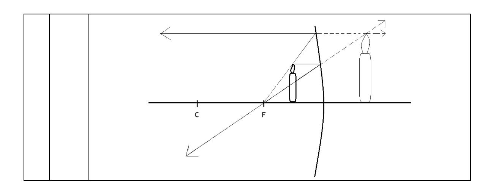
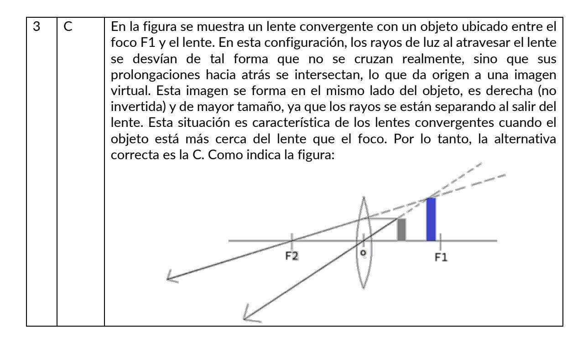

## I. Área temática. ONDAS

Tema 1. Características de las ondas

Actividad 1.4 Ejercicios propuestos (Pág. 42)

| N° | Clave | Defensa                                                                                                                                                                                                                                                                                                                                                                                          |
|----|-------|--------------------------------------------------------------------------------------------------------------------------------------------------------------------------------------------------------------------------------------------------------------------------------------------------------------------------------------------------------------------------------------------------|
| 1  | D     | Para resolver el problema, utilizamos la relación de rapidez de propagación que viene dada por: $v=\frac{d}{t}$ , donde "d" es la distancia, "v" es la rapidez de propagación de la onda y "t" es el tiempo. Para este caso se nos pide la distancia donde se produjo la descarga eléctrica, entonces de la relación de rapidez podemos despejar dicha distancia quedando $d=v*t$ , reemplazando |
|    |       | los datos se tiene que $d=340\frac{m}{s}*8s=2720$ metros. Alternativa correcta D.                                                                                                                                                                                                                                                                                                                |
| 2  | С     | La figura muestra una onda que se propaga hacia la derecha. Dado que la onda avanza y la forma de la onda desciende en esa zona, el punto P está descendiendo en ese instante. Por tanto, la dirección y sentido del movimiento de P corresponde al punto Z. La alternativa correcta es la C.                                                                                                    |
| 3  | A     | Para ordenar de forma creciente las frecuencias debemos calcularlas utilizando su definición $f=\frac{numero\ de\ oscilaciones}{tiempo}$ para cada caso se obtiene: $f_x=\frac{10}{20}=0,5$ Hz; $f_y=\frac{14}{7}=2$ Hz; $f_z=\frac{12}{3}=4$ Hz. Ordenando desde menor a mayor se obtiene que el (X-Y-Z). Alternativa correcta A.                                                               |

Tema 2. Luz y ondas electromagnéticas.

Actividad 2.4 Ejercicios propuestos (Pág. 52 y 53)

| NIO | CI    | D (                                                                                                                                                                                                                                                                                                                                                                                                                                                                                                                                                                                                                                                                                              |
|-----|-------|--------------------------------------------------------------------------------------------------------------------------------------------------------------------------------------------------------------------------------------------------------------------------------------------------------------------------------------------------------------------------------------------------------------------------------------------------------------------------------------------------------------------------------------------------------------------------------------------------------------------------------------------------------------------------------------------------|
| N°  | Clave | Defensa                                                                                                                                                                                                                                                                                                                                                                                                                                                                                                                                                                                                                                                                                          |
| 1   | E     | Newton explicó la naturaleza de la luz a través de la teoría corpuscular, proponiendo que la luz estaba compuesta por pequeñas partículas (corpúsculos) que se propagaban en línea recta a gran velocidad. Esta idea buscaba explicar fenómenos como la reflexión y la refracción desde una perspectiva mecánica, donde las partículas de luz interactuaban con las superficies o medios al cambiar su trayectoria según ciertas leyes. La visión de Newton se mantiene como un antecedente importante dentro de la historia de la física, especialmente porque fue una de las primeras explicaciones sistemáticas sobre la naturaleza de la luz. Por lo tanto, la alternativa correcta es la E. |
| 2   | В     | Cuando la onda electromagnética pasa desde un medio A hasta otro medio B, su frecuencia se mantiene constante, ya que esta depende exclusivamente de la fuente emisora. Sin embargo, al cambiar de medio, lo que si puede variar son la rapidez y la longitud de onda, dado que la rapidez de propagación de la onda depende de las propiedades del medio. En este caso, la onda demora el doble de tiempo "2t" en recorrer el triple de distancia "3d", lo que implica que la rapidez aumento considerando que: $v = \frac{3d}{2t} > v = \frac{d}{t}$                                                                                                                                           |

|   |   | Como la rapidez aumento y la frecuencia no cambia, necesariamente también                                                                                                                                                                                                                                                                                                                                                                                                                                                                                                                                                                                                                                                                                                                                                                                                 |
|---|---|---------------------------------------------------------------------------------------------------------------------------------------------------------------------------------------------------------------------------------------------------------------------------------------------------------------------------------------------------------------------------------------------------------------------------------------------------------------------------------------------------------------------------------------------------------------------------------------------------------------------------------------------------------------------------------------------------------------------------------------------------------------------------------------------------------------------------------------------------------------------------|
|   |   | aumento la longitud de onda por la relación 𝑣𝑣 = 𝜆𝜆 ∗ 𝑓𝑓, donde si la frecuencia                                                                                                                                                                                                                                                                                                                                                                                                                                                                                                                                                                                                                                                                                                                                                                                       |
|   |   | es mantiene constante y conservar la igualdad si la velocidad aumenta la                                                                                                                                                                                                                                                                                                                                                                                                                                                                                                                                                                                                                                                                                                                                                                                                  |
|   |   | longitud de onda debe aumentar. Por lo que la alternativa correcta es la B.                                                                                                                                                                                                                                                                                                                                                                                                                                                                                                                                                                                                                                                                                                                                                                                               |
| 3 | A | El gráfico muestra tres ondas electromagnéticas propagándose por el vacío, todas viajan con la misma rapidez (la velocidad de la luz), pero tienen distintas longitudes de onda. Como la frecuencia está relacionada con la longitud de onda a través de la relación 𝑣𝑣 = 𝜆𝜆 ∗ 𝑓𝑓, una mayor longitud de onda implica menor frecuencia. Al observar el gráfico, vemos que P tiene la mayor longitud de onda, seguida por R y luego Q con la menor. Eso implica que P es la de menor frecuencia y Q es la de mayor frecuencia. Relacionando esto con el espectro electromagnético podríamos clasificar que: -Q tiene mayor frecuencia (Rayos X) -R tiene una frecuencia intermedia en comparación (Luz visible) -P Tiene menor frecuencia (Ondas de radio) Por tanto, la alternativa correcta es la A.            |
| 4 | D | Para determinar los colores de los láseres utilizados en el laboratorio, debemos considerar que, al graficar la velocidad de propagación en función de la longitud de onda, la pendiente de cada línea representa la frecuencia de la onda, según la relación 𝑣𝑣 = 𝜆𝜆 ∗ 𝑓𝑓 . Una mayor pendiente implica una mayor frecuencia y, por tanto, una menor longitud de onda. En el espectro visible, los colores se ordenan de mayor a menor frecuencia de la siguiente forma: violeta, azul, verde, amarillo, naranjo y rojo. Observando el gráfico, el láser 1 tiene la pendiente más pronunciada, por lo tanto, corresponde al violeta (mayor frecuencia). El láser 2, con pendiente intermedia, se asocia al verde, y el láser 3, con la menor pendiente, corresponde al rojo (menor frecuencia). Por lo que, la opción correcta es la D. |

Tema 3. Fenómenos ondulatorios.

Actividad 3.9 Ejercicios propuestos (Pág. 66 y 67)

| N° | Clave | Defensa                                                                                                                                                                                                                                                                                                                                                                                                                                                                                                                                                                                                                |
|----|-------|------------------------------------------------------------------------------------------------------------------------------------------------------------------------------------------------------------------------------------------------------------------------------------------------------------------------------------------------------------------------------------------------------------------------------------------------------------------------------------------------------------------------------------------------------------------------------------------------------------------------|
| 1  | C     | En el experimento descrito, se observa que el rayo de luz permanece confinado dentro del medio transparente 2, reflejándose internamente sin salir hacia el medio transparente 1. Los ángulos indicados (70°) son mayores al ángulo crítico, lo que permite que se produzca reflexión total interna, fenómeno característico de la fibra óptica. En este fenómeno, la luz no se refracta, sino que se refleja completamente dentro del medio con mayor índice de refracción, manteniéndose la energía del rayo sin pérdidas a través del trayecto. Por lo tanto, la alternativa correcta es la C. |
| 2  | B     | El enrojecimiento de la luz observada por Hubble en las galaxias fue una manifestación del corrimiento al rojo, lo que en física se interpreta como una disminución en la frecuencia de la luz debido a la expansión del universo. Según el efecto Doppler, cuando una fuente de ondas se aleja del observador, las ondas se alargan (mayor longitud de onda), lo que en luz visible se percibe como un desplazamiento hacia el rojo. Por lo tanto, la conclusión de Hubble                                                                                                                             |

|   |   | fue que las galaxias se estaban alejando del punto de observación, es decir, del planeta Tierra. Por lo tanto, correcta es la B.                                                                                                                                                                                                                                                                                                                                                                                                                                                                                                                                                                                                                                                                                                                                                                                                           |
|---|---|--------------------------------------------------------------------------------------------------------------------------------------------------------------------------------------------------------------------------------------------------------------------------------------------------------------------------------------------------------------------------------------------------------------------------------------------------------------------------------------------------------------------------------------------------------------------------------------------------------------------------------------------------------------------------------------------------------------------------------------------------------------------------------------------------------------------------------------------------------------------------------------------------------------------------------------------------|
| 3 | C | En esta situación, la luz se propaga desde un medio con menor índice de refracción hacia otro con mayor índice, lo que implica que, al atravesar la interfaz, los rayos deben refractarse acercándose a la normal. Observando el comportamiento de los rayos, se aprecia que el rayo P se refracta acercándose a la normal, lo cual es coherente con el paso de un medio menos denso a uno más denso, es decir, es compatible con la situación. En cambio, el rayo Q atraviesa la interfaz sin desviarse, lo que solo sería posible si ambos medios tuvieran el mismo índice de refracción, por lo que resulta incompatible. Finalmente, el rayo R se refracta alejándose de la normal, lo que contradice la ley de refracción en este contexto, siendo también incompatible. Por lo tanto, los rayos incompatibles con la situación planteada son Q y R. Por lo que, la alternativa correcta es C. |
| 4 | B | Al analizar paso a paso el experimento, se observa que el frente de ondas de luz al pasar por las dos rendijas debido a la difracción, convierten a estas en dos nuevos emisores de onda que se superponen produciéndose la interferencia entre ambas una de tipo constructiva y otra destructiva, lo que lleva a interpretar que los hechos observados están de acuerdo con los datos experimentales, es decir, estos fenómenos solo son producidos en ondas, lo que toma forma de conclusión. Por lo que, la alternativa correcta es B.                                                                                                                                                                                                                                                                                                                                                                                   |
| 5 | B | SE DEBE CAMBIAR LA ALTERNATIVA B), DEBE DECIR INFERENCIA EN LUGAR DE CONCLUSIÓN. El texto describe un experimento y luego una afirmación que interpreta los resultados observados: que el patrón de líneas solo puede explicarse mediante interferencia, un fenómeno ondulatorio. Esta afirmación representa una inferencia, ya que es un razonamiento lógico que se construye a partir de datos experimentales para sostener una idea sobre la naturaleza de la luz. Young no está simplemente observando ni proponiendo una suposición inicial (hipótesis), sino extrayendo una conclusión razonada a partir de lo observado, que apunta a una explicación causal. Por tanto, la descripción corresponde a una inferencia científica, lo que haría correcta la alternativa B si esta indicara "inferencia".                                                                              |

Tema 4. Formación de imágenes en espejos

Actividad 4.5 Ejercicios propuestos (Pág. 77 y 78)

| N° | Clave | Defensa                                                                                                                                                                                                                                                                                                                                                                                                                                                                                                             |
|----|-------|---------------------------------------------------------------------------------------------------------------------------------------------------------------------------------------------------------------------------------------------------------------------------------------------------------------------------------------------------------------------------------------------------------------------------------------------------------------------------------------------------------------------|
| 1  | C     | En los espejos esféricos cóncavos, los rayos de luz que inciden paralelamente al eje principal se reflejan pasando por un punto específico de convergencia ubicado sobre ese mismo eje. Este punto se denomina foco principal, y es característico porque todos los rayos paralelos al eje que llegan al espejo convergen en él después de reflejarse. Este comportamiento óptico es fundamental en la formación de imágenes por espejos cóncavos. Por lo tanto, la alternativa correcta es la C. |

| 2 | D | El rayo incidente mantiene su inclinación de 60 grados respecto con la recta PQ, al variar el espejo en 10 grados en sentido antihorario y esquematizando la normal se obtiene que el rayo reflejado con la recta PQ forman un ángulo de 40 grados.                                                                                                                                                                                                                                                                                                                                                                                                                                                                                                                                                              |
|---|---|---------------------------------------------------------------------------------------------------------------------------------------------------------------------------------------------------------------------------------------------------------------------------------------------------------------------------------------------------------------------------------------------------------------------------------------------------------------------------------------------------------------------------------------------------------------------------------------------------------------------------------------------------------------------------------------------------------------------------------------------------------------------------------------------------------------------------|
| 3 | C | En la figura se observa un rayo de luz que incide sobre un espejo cóncavo, acercándose de forma casi paralela al eje óptico. Aunque no es exactamente paralelo, su comportamiento se asemeja al de un rayo marginal, es decir, un rayo que incide lejos del eje en una zona más curva del espejo. Según las leyes de la óptica geométrica, los rayos que inciden paralelos al eje óptico en un espejo cóncavo se reflejan pasando por el foco. Sin embargo, los rayos marginales se desvían ligeramente de este punto ideal debido a la aberración esférica: en lugar de converger en el foco, lo hacen un poco antes, es decir, entre el vértice y el foco. Por ello, el rayo reflejado mostrado en la figura corta el eje en ese tramo. En consecuencia, la alternativa correcta es la C. |
| 4 | D | El enunciado menciona que, al colocar un objeto frente a un espejo, se forma una imagen derecha y tres veces mayor, lo cual entrega pistas claras sobre el tipo de espejo y la posición del objeto. Una imagen derecha en espejos solo se produce cuando el objeto está entre el foco y el vértice, ya cóncavos que en esa zona se forma una imagen virtual, derecha y ampliada. Además, el hecho de que sea tres veces mayor indica un aumento significativo, típico cuando el objeto está muy cerca del espejo. En cambio, los espejos convexos generan siempre imágenes virtuales, pero menores y no ampliadas como en este caso. Por tanto, la alternativa correcta es la D.                                                                                                            |
| 5 | A | En los espejos cóncavos, una imagen virtual se forma únicamente cuando el objeto se encuentra ubicado entre el foco y el vértice del espejo. En esa situación, al trazar los rayos notables, estos se reflejan de tal manera que divergen, es decir, no se cruzan realmente, y por lo tanto no forman una imagen real. Sin embargo, al prolongar esos rayos hacia atrás, parecen provenir de un punto detrás del espejo, lo que da origen a una imagen virtual, derecha y aumentada. En los cuatro experimentos mostrados, solo el experimento 1 ubica el objeto en esta posición. Por eso, la hipótesis correcta que explica esta situación es la alternativa A. Como indica la figura:                                                                                                    |

Tema 4. Formación de imágenes en lentes

Actividad 5.5 Ejercicios propuestos (Pág. 86)

| N° Clave | Defensa                                                                                                                                                                                                                                                                                                                                                                                                                                                                                                                                                                                                                                                                                                                                                                                                                             |
|-------------|-------------------------------------------------------------------------------------------------------------------------------------------------------------------------------------------------------------------------------------------------------------------------------------------------------------------------------------------------------------------------------------------------------------------------------------------------------------------------------------------------------------------------------------------------------------------------------------------------------------------------------------------------------------------------------------------------------------------------------------------------------------------------------------------------------------------------------------|
| 1 A      | La miopía es un defecto visual en el que los rayos de luz convergen antes de la retina, causando dificultad para ver objetos lejanos. Esto ocurre porque el ojo es demasiado largo o la córnea es muy curva, lo que provoca un exceso de convergencia. Para corregirlo, se usa una lente divergente, que dispersa los rayos de luz antes de que ingresen al ojo, moviendo el punto de enfoque hacia la retina. La alternativa correcta es la A.                                                                                                                                                                                                                                                                                                                                                                   |
| 2 B      | En el sistema óptico descrito, compuesto por dos lentes convergentes de igual distancia focal f = 20 cm y separadas 80 cm entre sí, se ubica un objeto a 40 cm a la izquierda de la primera lente. Dado que esta distancia equivale a 2f, la primera lente forma una imagen real, invertida e igual en tamaño, ubicada a 40 cm al otro lado de la lente, es decir, justo en el centro entre ambas lentes. Esta imagen intermedia pasa a actuar como objeto para la segunda lente, también situada a 2f, lo que genera nuevamente una imagen real, invertida e igual. Sin embargo, dado que la imagen intermedia ya estaba invertida, esta segunda inversión produce una imagen final que resulta derecha. Por lo tanto, la imagen final es real, derecha e igual. La alternativa correcta es B. |

## I. Área temática. MECÁNICA

Tema 1. Primera ley de newton: Ley de inercia.

Actividad 1.8 Ejercicios propuestos (Pág. 95)

| N° | Clave | Defensa                                                                                                                                                                                                                                                                                                                                                                                                                                                                                                                                                                                                                                                                                    |
|----|-------|--------------------------------------------------------------------------------------------------------------------------------------------------------------------------------------------------------------------------------------------------------------------------------------------------------------------------------------------------------------------------------------------------------------------------------------------------------------------------------------------------------------------------------------------------------------------------------------------------------------------------------------------------------------------------------------------|
| 1  | B     | Recordemos que para que un cuerpo tenga MRU, la fuerza neta sobre él debe ser cero. Es decir, todas las fuerzas que actúan sobre el cuerpo deben estar en equilibrio, de modo que no haya aceleración. La única situación donde el cuerpo puede tener movimiento rectilíneo uniforme es la alternativa B, donde las fuerzas opuestas se equilibran.                                                                                                                                                                                                                                                                                                                            |
| 2  | D     | Un estado inercial, según la primera ley de Newton, corresponde a una situación en la que un cuerpo no experimenta aceleración, lo que implica que se encuentra en reposo o en movimiento con velocidad constante en línea recta. Esto ocurre cuando la fuerza neta que actúa sobre el cuerpo es cero, aunque pueden existir varias fuerzas actuando, siempre que estén en equilibrio. La clave de un estado inercial es que el movimiento no cambia con el tiempo, es decir, no hay variaciones en la velocidad. Por lo tanto, la afirmación que mejor representa esta condición es que el cuerpo tiene velocidad constante, siendo la alternativa correcta la D. |
| 3  | A     | Considerando la Ley de inercia, para que un cuerpo cambie su estado inercial o estado de movimiento, SE DEBE EJERCER UNA FUERZA SOBRE ESTE. En el caso descrito el bus frena, pero la persona sigue su movimiento inicial ya que la fuerza para frenar NO esta siendo aplicada directamente sobre la persona, por lo tanto, en el instante mismo del "frenazo" NO hay fuerza                                                                                                                                                                                                                                                                                    |

externa aplicada sobre el cuerpo más allá del peso y la normal, siendo la fuerza Neta NULA.

Tema 2. Tipo de fuerzas

## Actividad 2.6 Ejercicios propuestos (Pág. 105 y 106)

| N° | Clave | Defensa                                                                                                                                                                                                                                            |
|----|-------|----------------------------------------------------------------------------------------------------------------------------------------------------------------------------------------------------------------------------------------------------|
| 1  | С     | Para determinar la constante del resorte utilizamos la relación de la ley de Hooke: $F = k * x$                                                                                                                                                    |
|    |       | Reemplazando datos se obtiene:                                                                                                                                                                                                                     |
|    |       | 75 N = k * 0.03 m                                                                                                                                                                                                                                  |
|    |       | $k = \frac{75N}{0.03 m} = 2500 \text{ N/m}$                                                                                                                                                                                                        |
|    |       | 0.03 <i>m</i>                                                                                                                                                                                                                                      |
|    |       | Hay que mencionar que en el sistema internacional la distancia se mide en metro, por ende, si la información entrega fue en centímetros se debe realizar su conversión recordando que 1 metro = 100 centímetros.  La alternativa correcta es la C. |
| 2  | B     | CORREGIR EN CLAVIJERO (ALTERNATIVA CORRECTA B)                                                                                                                                                                                                     |
|    |       | La situación diagramada corresponde a:                                                                                                                                                                                                             |
|    |       | Posición de equilibrio  Linicial  Linicial  Linicial  Linicial  Linicial  Linicial                                                                                                                                                                 |
|    |       | Para describir la situación algebraicamente utilizamos la relación de la ley de Hooke, $F = k * x$                                                                                                                                                 |
|    |       | $r = \kappa * x$ Como en estos casos el resorte llega a una posición de equilibrio y la única                                                                                                                                                      |
|    |       | fuerza que interactúa es el peso, sabemos que F = P = m * g                                                                                                                                                                                        |
|    |       | Como la constante del resorte es la misma y queremos saber su posición                                                                                                                                                                             |
|    |       | inicial, despejamos la relación en función de la constante de elasticidad. Para                                                                                                                                                                    |
|    |       | cada caso tenemos:                                                                                                                                                                                                                                 |
|    |       | $k=\frac{m_1*g}{\Delta x 1}$ y $k=\frac{m_2*g}{\Delta x 2}$ ; Como la constante es la misma podemos igualar las                                                                                                                                    |
|    |       | relaciones, además desglosamos $\Delta x$ que corresponde a la diferencia de                                                                                                                                                                       |
|    |       | longitud, para cada caso [( $\Delta x1 = L_{f1} - Li$ ) y ( $\Delta x2 = L_{f2} - Li$ )] obteniendo:                                                                                                                                               |
|    |       | $\frac{m_1 * g}{L_{f1} - Li} = \frac{m_2 * g}{L_{f2} - Li}$                                                                                                                                                                                        |
|    |       | De la igualdad podemos reducir la gravedad y establecer una relación lineal:                                                                                                                                                                       |
|    |       | $m_1(L_{f2}-Li) = m_2(L_{f1}-Li)$                                                                                                                                                                                                                  |

|   |   | Multiplicando las masas en los paréntesis se obtiene:                                                                                                                                                                                                                                                                                                                                                                                                                                                                                                                                                                                                                                                                                                                                                                                                                               |
|---|---|-------------------------------------------------------------------------------------------------------------------------------------------------------------------------------------------------------------------------------------------------------------------------------------------------------------------------------------------------------------------------------------------------------------------------------------------------------------------------------------------------------------------------------------------------------------------------------------------------------------------------------------------------------------------------------------------------------------------------------------------------------------------------------------------------------------------------------------------------------------------------------------|
|   |   | 𝑚𝑚1 ∗ 𝐿𝐿𝑓𝑓2 − 𝑚𝑚1 ∗ 𝐿𝐿 = 𝑚𝑚2 ∗ 𝐿𝐿𝑓𝑓1 − 𝑚𝑚2 ∗ 𝐿𝐿                                                                                                                                                                                                                                                                                                                                                                                                                                                                                                                                                                                                                                                                                                                                                                                                                |
|   |   | Reemplazando por los valores conocidos queda:                                                                                                                                                                                                                                                                                                                                                                                                                                                                                                                                                                                                                                                                                                                                                                                                                                       |
|   |   | 2 * 0,213 – 2Li = 3,3 * 0,2 – 3,3 Li                                                                                                                                                                                                                                                                                                                                                                                                                                                                                                                                                                                                                                                                                                                                                                                                                                                |
|   |   | 0,426 – 2Li = 0,66 – 3,3 Li                                                                                                                                                                                                                                                                                                                                                                                                                                                                                                                                                                                                                                                                                                                                                                                                                                                         |
|   |   | Ordenando la ecuación se obtiene:                                                                                                                                                                                                                                                                                                                                                                                                                                                                                                                                                                                                                                                                                                                                                                                                                                                   |
|   |   | 3,3 Li – 2 Li = 0,66 – 0,426                                                                                                                                                                                                                                                                                                                                                                                                                                                                                                                                                                                                                                                                                                                                                                                                                                                        |
|   |   | 1,3 Li = 0,234                                                                                                                                                                                                                                                                                                                                                                                                                                                                                                                                                                                                                                                                                                                                                                                                                                                                      |
|   |   | Li = 0,234 = 0,18 metros = 18 centímetros. 1,3                                                                                                                                                                                                                                                                                                                                                                                                                                                                                                                                                                                                                                                                                                                                                                                                                                |
|   |   | Como la alternativa aparece en centímetros, corresponde realizar la                                                                                                                                                                                                                                                                                                                                                                                                                                                                                                                                                                                                                                                                                                                                                                                                                 |
|   |   | conversión para comprobar, siendo correcta la alternativa B.                                                                                                                                                                                                                                                                                                                                                                                                                                                                                                                                                                                                                                                                                                                                                                                                                        |
| 3 | B | En el sistema de poleas descrito, se deben considerar todas las fuerzas que actúan desde los distintos elementos para contar cuántas están presentes. Primero la persona ejerce una fuerza hacia abajo sobre la cuerda, lo que también transmite una tensión hacia el sistema, por tanto, la polea superior recibe tres tensiones: una desde la persona, otra desde la polea inferior, y además está sujeta al techo, que reacciona con una fuerza hacia arriba. En la segunda polea también se pueden observar tres tensiones, una debido a la polea superior, hacia arriba, otra debido a la masa colgando, que implicaría una tensión hacia abajo desde la polea y una tercera hacia el techo. Sumando todas estas interacciones, se identifican seis fuerzas actuando sobre el sistema de poleas, tal como se indica en la figura: |
| 4 | B | CAMBIAR EN EL CLAVIJERO LA ALTERNATIVA CORRECTA ES LA B)                                                                                                                                                                                                                                                                                                                                                                                                                                                                                                                                                                                                                                                                                                                                                                                                                            |
|   |   | De la información obtenida de los procedimientos experimentales podemos                                                                                                                                                                                                                                                                                                                                                                                                                                                                                                                                                                                                                                                                                                                                                                                                             |
|   |   | concluir que en el experimento 1 se obtuvo un coeficiente de roce (μ1=0,4)                                                                                                                                                                                                                                                                                                                                                                                                                                                                                                                                                                                                                                                                                                                                                                                                          |
|   |   | y en el 2 se obtuvo un coeficiente de roce (μ1=0,2). Como la masa y la fuerza                                                                                                                                                                                                                                                                                                                                                                                                                                                                                                                                                                                                                                                                                                                                                                                                       |
|   |   | aplicada son las mismas, la diferencia en el coeficiente de roce se debe                                                                                                                                                                                                                                                                                                                                                                                                                                                                                                                                                                                                                                                                                                                                                                                                            |
|   |   | únicamente a la naturaleza de los materiales de la caja y la superficie. La                                                                                                                                                                                                                                                                                                                                                                                                                                                                                                                                                                                                                                                                                                                                                                                                         |
|   |   | superficie del experimento 1 es más rugosa o tiene mayor fricción que la del                                                                                                                                                                                                                                                                                                                                                                                                                                                                                                                                                                                                                                                                                                                                                                                                        |
|   |   | experimento 2 o la caja del experimento 1 podría estar hecha de un material                                                                                                                                                                                                                                                                                                                                                                                                                                                                                                                                                                                                                                                                                                                                                                                                         |
|   |   |                                                                                                                                                                                                                                                                                                                                                                                                                                                                                                                                                                                                                                                                                                                                                                                                                                                                                     |

con mayor adherencia o rugosidad en contacto con la superficie. Por lo tanto, la alternativa correcta es la B.

Tema 3. Segunda ley de Newton: Ley de fuerza

Actividad 3.3 Ejercicios propuestos (Pág. 111 y 112)

| N° | Clave | Defensa                                                                                                                                                                                                                                                                                                                                                                                                                                                                                                                                                                                                                                                                                                                                                                                                                                                                                                                                                                                                                                                                                                                                                                                                                                                                           |
|----|-------|-----------------------------------------------------------------------------------------------------------------------------------------------------------------------------------------------------------------------------------------------------------------------------------------------------------------------------------------------------------------------------------------------------------------------------------------------------------------------------------------------------------------------------------------------------------------------------------------------------------------------------------------------------------------------------------------------------------------------------------------------------------------------------------------------------------------------------------------------------------------------------------------------------------------------------------------------------------------------------------------------------------------------------------------------------------------------------------------------------------------------------------------------------------------------------------------------------------------------------------------------------------------------------------|
| 1  | D     | Cuando un cuerpo se mueve con rapidez constante, esto significa que su aceleración es cero, y por lo tanto, la fuerza neta que actúa sobre él también debe ser nula, según la segunda ley de Newton (𝐹𝐹𝑛𝑛𝑛𝑛 = 𝑚𝑚 ∗ 𝑎𝑎). Por lo tanto, la alternativa correcta es D.                                                                                                                                                                                                                                                                                                                                                                                                                                                                                                                                                                                                                                                                                                                                                                                                                                                                                                                                                                                                   |
| 2  | C     | De los comentarios realizados por los estudiantes, podemos evidenciar su veracidad o error de manera textual: - Estudiante 1: asevera que "siempre" el movimiento se produce en la dirección y sentido de la fuerza externa aplicada sobre, lo cual es un error. La aceleración del cuerpo será en la dirección y sentido de la fuerza neta aplicada, no necesariamente su movimiento. Un cuerpo puede estar en movimiento en una dirección diferente a la de la fuerza aplicada (por ejemplo, si ya tiene velocidad en otra dirección). Un caso claro es un objeto que se desliza con fricción: la fuerza neta puede estar en contra de su movimiento, desacelerándolo. - Estudiante 2: La primera ley de Newton establece que, si la fuerza neta sobre un cuerpo es cero, este mantendrá su estado de movimiento, lo que incluye estar en reposo o moverse con velocidad constante. Es decir, no necesariamente debe estar en reposo; puede estar en movimiento rectilíneo uniforme. - Estudiante 3: La afirmación resulta ser coherente por tanto se afirma como la aseveración correcta. Por tanto, la alternativa correcta es la C. (sin embargo, EXISTE UNA EXCEPCIÓN PARA ESTE CASO, si analizamos el |
|    |       | movimiento horizontal, como el lanzamiento vertical hacia arriba, en el punto más alto, la rapidez es cero, pero la fuerza de gravedad sigue actuando, sería un caso donde la afirmación seria incorrecta)                                                                                                                                                                                                                                                                                                                                                                                                                                                                                                                                                                                                                                                                                                                                                                                                                                                                                                                                                                                                                                                               |
| 3  | B     | En el sistema descrito, dos masas están unidas por una cuerda ideal que pasa por una polea sin masa ni fricción. La masa M cuelga verticalmente, mientras que la masa m se encuentra sobre una superficie sin roce. Dado que ambas masas están conectadas por la misma cuerda, cualquier movimiento de una masa necesariamente provoca un desplazamiento en la otra. Por lo tanto, las aceleraciones deben ser iguales en magnitud, ya que la cuerda transmite la misma tensión y no se estira. Esta es una propiedad típica de sistemas con cuerdas y poleas ideales. Así, la relación entre las aceleraciones de las masas es lo que significa 1:1. Por lo tanto, la alternativa correcta es B 𝑎𝑎𝑀𝑀 = 𝑎𝑎𝑚𝑚                                                                                                                                                                                                                                                                                                                                                                                                                                                                                                                                  |
| 4  | B     | Respecto la información entregada si se realiza la sumatoria de fuerzas se tiene que:                                                                                                                                                                                                                                                                                                                                                                                                                                                                                                                                                                                                                                                                                                                                                                                                                                                                                                                                                                                                                                                                                                                                                                                          |
|    |       | Para el eje X: N = 𝑃𝑃𝑛𝑛 (Con los valores 4N = 4N) por lo tanto se anulan.                                                                                                                                                                                                                                                                                                                                                                                                                                                                                                                                                                                                                                                                                                                                                                                                                                                                                                                                                                                                                                                                                                                                                                                                      |

|   |   | Para el eje Y: $P_T > F$ (Con los valores 3N > 2N) por lo que actúa una fuerza de 1N como resultante en dirección paralela al plano inclinado y hacia abajo. En las afirmaciones es correcto enunciar que el bloque se deslizara por el plano inclinado con aceleración constante por tanto la alternativa correcta es la B.                                                                                                                                                                                                                                                                                  |
|---|---|---------------------------------------------------------------------------------------------------------------------------------------------------------------------------------------------------------------------------------------------------------------------------------------------------------------------------------------------------------------------------------------------------------------------------------------------------------------------------------------------------------------------------------------------------------------------------------------------------------------|
| 5 | С | En este sistema, tres vehículos idénticos de masa 4M cada uno se encuentran unidos y se mueven sobre una superficie sin roce. Se aplica una fuerza de magnitud 3F al vehículo del extremo trasero, lo que genera una aceleración común a todo el sistema. Como la fuerza neta es igual a la masa total por la aceleración ( $F_{neta} = m*a$ ), se considera una masa total de 12M (la suma de las tres masas). Aplicando la segunda ley de Newton se obtiene $3F = 12M*a$ , y al despejar, se concluye que la aceleración del sistema es $a = \frac{F}{4M}$ . Por lo tanto, la alternativa correcta es la C. |

Tema 4. Tercera ley de Newton: Acción y reacción Actividad 4.3 Ejercicios propuestos (Pág. 117 y 118)

| N° | Clave | Defensa                                                                                                                                                                                                                                                                                                                                                                                                                                                                                                                                                                                                                                                                                           |
|----|-------|---------------------------------------------------------------------------------------------------------------------------------------------------------------------------------------------------------------------------------------------------------------------------------------------------------------------------------------------------------------------------------------------------------------------------------------------------------------------------------------------------------------------------------------------------------------------------------------------------------------------------------------------------------------------------------------------------|
| 1  | E     | CAMBIAR ALTERNIVA EN EL CLAVIJERO C -> E                                                                                                                                                                                                                                                                                                                                                                                                                                                                                                                                                                                                                                                          |
|    |       | En el caso planteado, dado que no hay roce entre los bloques ni con la superficie, la fuerza F aplicada genera una aceleración constante en todo el sistema. Esto significa que los bloques no pueden moverse con rapidez constante, ya que siempre estarán acelerando. Las demás opciones son incorrectas porque la fuerza de contacto entre los bloques nunca es igual ni mayor a F, sino que se distribuye de acuerdo con la Segunda y Tercera Ley de Newton. Por lo tanto, la alternativa correcta es la E.                                                                                                                                                                                   |
| 2  | С     | CAMBIAR ALTERNIVA EN EL CLAVIJERO E -> C                                                                                                                                                                                                                                                                                                                                                                                                                                                                                                                                                                                                                                                          |
|    |       | Por la tercera ley de Newton, la caja A reacciona sobre la caja B con una fuerza de igual magnitud y dirección opuesta. Por lo tanto, la única afirmación correcta es que la caja B ejerce una fuerza sobre la caja A de igual magnitud que la que la caja A aplica sobre la caja B, lo que corresponde a la alternativa C.                                                                                                                                                                                                                                                                                                                                                                       |
| 3  | С     | Cuando una persona empuja una pared de concreto inamovible, aunque la pared no se desplace, sí responde aplicando una fuerza sobre la persona. Esto se explica por la tercera ley de Newton, que establece que toda acción tiene una reacción de igual magnitud y en sentido contrario. Es decir, si la persona aplica una fuerza sobre la pared, la pared aplica simultáneamente una fuerza de igual intensidad en dirección opuesta sobre la persona, independientemente de si alguno de los cuerpos se mueve o no. Por lo tanto, la afirmación correcta es que la fuerza que aplica la persona a la pared es la misma que la pared aplica a la persona, lo que corresponde a la alternativa C. |
| 4  | D     | CAMBIAR ALTERNIVA EN EL CLAVIJERO C -> D                                                                                                                                                                                                                                                                                                                                                                                                                                                                                                                                                                                                                                                          |

|   |   | Para encontrar el par acción-reacción, se debe considerar que este debe tener el mismo modulo, estar en la misma dirección, pero debe tener un sentido contrario, en ese sentido la única imagen gráfica que cumple con esos requisitos es la de la opción D.                                                                                                                                                                                                                                                                                                                                                                                                              |
|---|---|----------------------------------------------------------------------------------------------------------------------------------------------------------------------------------------------------------------------------------------------------------------------------------------------------------------------------------------------------------------------------------------------------------------------------------------------------------------------------------------------------------------------------------------------------------------------------------------------------------------------------------------------------------------------------|
| 5 | D | La correcta determinación de las fuerzas de contacto entre los bloques se basa en la Segunda y Tercera Ley de Newton. La Segunda Ley (F = ma) permite calcular la aceleración del sistema y cómo se distribuye la fuerza aplicada entre los bloques. La Tercera Ley establece que cada bloque ejerce una fuerza sobre el siguiente, y este responde con una fuerza de igual magnitud y dirección opuesta, asegurando la interacción entre ellos. Otras leyes, como la de gravitación universal o la de Hooke, no son relevantes en este caso, ya que no hay fuerzas gravitacionales entre los bloques ni deformaciones elásticas. Por tanto, la alternativa correcta es D. |

Tema 5. Presión en sólidos, líquidos y gases.

Actividad 5.10 Ejercicios propuestos (Pág. 129 y 130)

| N° | Clave | Defensa                                                                                                                                                                                                                                                                                                                                                                                                                                                                                                                                                                                                                                                                                                                             |
|----|-------|-------------------------------------------------------------------------------------------------------------------------------------------------------------------------------------------------------------------------------------------------------------------------------------------------------------------------------------------------------------------------------------------------------------------------------------------------------------------------------------------------------------------------------------------------------------------------------------------------------------------------------------------------------------------------------------------------------------------------------------|
| 1  | С     | Cuando una persona está de pie sobre una superficie horizontal, el peso que ejerce sobre el suelo se distribuye normalmente entre ambos pies. Si en un momento levanta un pie, el peso total del cuerpo no cambia, ya que su masa y la aceleración gravitacional se mantienen constantes. Sin embargo, el área de contacto con el suelo se reduce a la mitad, ya que ahora solo uno de los pies está en contacto con la superficie. Como la presión se calcula mediante la fórmula $P = \frac{F}{A}$ , al mantenerse constante la fuerza F y reducirse el área A a la mitad, la presión ejercida sobre el suelo aumenta al doble. Por lo tanto, la alternativa correcta es C.                                                       |
| 2  | В     | En esta situación, se traspasan $200 \ cm^3$ de agua desde una probeta a otra con una base de mayor área. Como se conoce la masa del agua y se busca la nueva presión que esta ejerce sobre el fondo, se utiliza la fórmula de presión hidrostática: $P = \rho * g * h$ , donde $\rho$ es la densidad del agua, g la aceleración gravitacional y h la altura de la columna de líquido. Para calcular h, se usa la relación $h = \frac{V}{A}$ , donde el volumen es 0,0002 m³ y el área de base es 0,010 m². Esto da una altura de 0,02 m. Aplicando la fórmula: $P = 1000 * 10 * 0,02 = 200 \ Pa$ . Por lo tanto, la presión que el agua ejerce sobre el fondo de la segunda probeta es de 200 Pa, la alternativa correcta es la B. |
| 3  | В     | En un recipiente que contiene dos líquidos no miscibles, como aceite sobre agua, la presión total en el fondo se determina sumando los efectos de cada columna de líquido más la presión atmosférica que actúa sobre la superficie. La presión ejercida por cada líquido se calcula mediante la fórmula de presión hidrostática $P = \rho * g * h$ , donde \rho es la densidad del líquido, g la aceleración de gravedad y h la altura de la columna. Como los dos líquidos están uno sobre otro, la presión total en el fondo se obtiene sumando la presión atmosférica, la presión ejercida por la columna de aceite y la presión ejercida por la columna de agua. Por lo tanto, la alternativa correcta es B.                    |

| 4 | В | La presión que un líquido ejerce sobre el fondo de un recipiente depende únicamente de la altura de la columna de líquido, según la expresión $P=\rho*g*h$ , donde $\rho$ es la densidad del líquido, g la aceleración de gravedad y h la altura. Si el contenido de un tambor cilíndrico A lleno de agua se vacía completamente en otro tambor B de mayor radio y altura, el agua se distribuye en una mayor base, por lo que la altura alcanzada por el líquido será menor que la inicial. Al disminuir la altura, también disminuye la presión ejercida sobre el fondo. Por tanto, la nueva presión será menor que la presión inicial, y la alternativa correcta es B. |
|---|---|---------------------------------------------------------------------------------------------------------------------------------------------------------------------------------------------------------------------------------------------------------------------------------------------------------------------------------------------------------------------------------------------------------------------------------------------------------------------------------------------------------------------------------------------------------------------------------------------------------------------------------------------------------------------------|
| 5 | D | Cuando se abre un orificio en un recipiente lleno de agua, el líquido sale impulsado por la presión ejercida por la columna de agua en ese punto. Esta presión hidrostática actúa en todas las direcciones, pero el chorro de agua sale siempre perpendicular a la superficie del recipiente en el lugar donde se encuentra el orificio. En este caso, como la pared del recipiente está inclinada, el orificio no está sobre una superficie vertical, por lo que el chorro no saldrá horizontalmente, sino en una dirección diagonal, perpendicular a esa pared inclinada. Por lo tanto, la trayectoria correcta del chorro corresponde a la alternativa D.              |