# **PRESENTACIÓN**

La **Prueba de Acceso a la Educación Superior** (PAES) es el instrumento que permite acceder actualmente a las universidades adscritas al sistema de acceso.

Las Pruebas de Acceso a la Educación Superior en Ciencias, al igual que las Bases Curriculares de Ciencias del MINEDUC, incorporan dos aspectos: uno referido a las **Habilidades Científicas** y el otro referido al **Conocimiento de la Ciencia**; el primero, común a los tres ejes (Biología, Física y Química) y el segundo, diferenciado para cada uno de ellos.

Además, las PAES consideran las Habilidades Científicas: Observar y plantear preguntas (OPP), Planificar y conducir una investigación (PCI), Procesar y analizar la evidencia (PAE), Evaluar y Comunicar, las que funcionan como elementos transversales e integradores. Estos elementos son aplicables y evaluables en todas las áreas temáticas de dicha prueba.

El temario de la Prueba de Acceso a la Educación Superior se estructura por ejes subdivididos en áreas temáticas en donde se explicitan los Conocimientos de la Ciencia susceptibles de ser evaluados en cada una de ellas. Estas áreas temáticas están constituidas por los conocimientos asociados a Organización, estructura y actividad celular; Procesos y funciones biológicas; Herencia y evolución; Organismo y ambiente; Ondas; Mecánica; Energía; Electricidad; Estructura atómica; Química orgánica; Reacciones químicas y estequiometría.

La estructura de las Pruebas de Transición de Ciencias consta de 80 preguntas de selección múltiple de respuesta única, de 4 o 5 opciones cada una, de las cuales 54 corresponden a Módulo Común y 26 preguntas corresponden a Módulo Electivo o Módulo TP, respectivamente.

En este apartado se trabajará el reconocimiento de las habilidades científicas consideradas por la PAES, a través de la comprensión del método científico y sus características.

# **EL MÉTODO CIENTÍFICO**

El método científico organiza la forma de adquirir conocimiento del ser humano, por lo tanto, se puede definir como el conjunto de etapas que hay que recorrer para obtener un conocimiento válido desde el punto de vista científico, utilizando para esto instrumentos que resulten fiables. Lo que hace este método es minimizar la influencia de la subjetividad del investigador en su trabajo, generando un procedimiento sistematizado que también permite reducir e identificar de forma oportuna cualquier error.

En relación con esto, antiguamente se concebía el método científico como un proceso lineal, sin embargo, ahora se entiende como un proceso multidimensional, el cual se puede observar en el siguiente esquema:

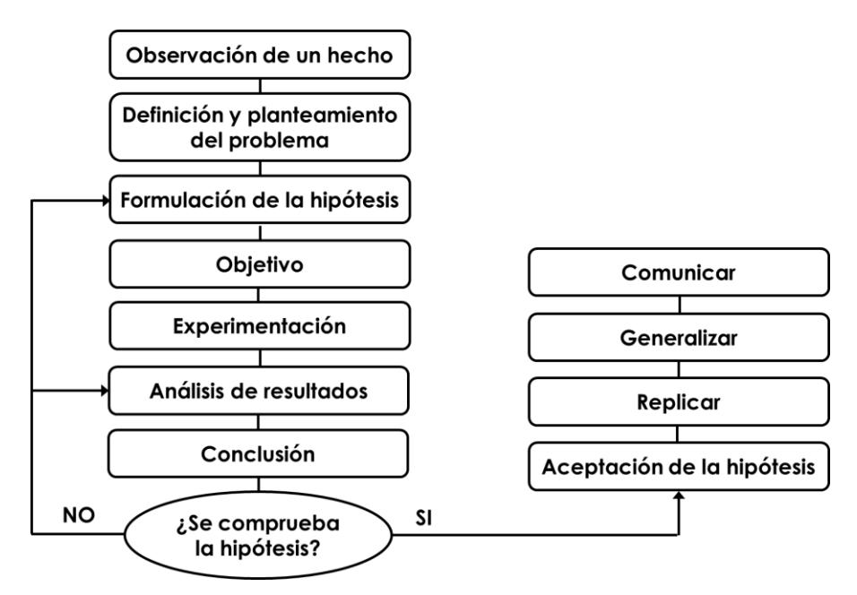

Entre cada una de las etapas, se presentan las habilidades del pensamiento científico, y para poder identificarlas, es importante comprender que implica cada uno de los pasos del método científico.

# **I. Observar un hecho**

Se considera observación científica al proceso de lograr seleccionar dentro de un fenómeno aquello que se desea analizar. Se adquiere información mediante los sentidos o instrumentos de medición, de un hecho o fenómeno natural. Estas observaciones pueden registrarse tanto cuantitativa como cualitativamente.

- **Cuantitativo:** es aquello que se puede cuantificar, es decir, que se le puede asignar un valor numérico.
- **Cualitativo:** son datos que expresan cualidades o características que son verbalizadas, se identifican mediante los sentidos.

### **¿Qué es una variable?**

Son aquellos factores, características o propiedades que pueden influir en el experimento. Estas variables pueden ser controladas, modificadas o medidas dependiendo de cómo se plantee la relación entre ellas.

### Variable independiente

Representa un factor que se modifica en un experimento (manejado por el experimentador). A menudo esta variable es representada con una X en una ecuación, por lo tanto, se ubica en el eje de las abscisas en un gráfico cartesiano.

Puede responder a preguntas como: *"¿Qué se modifica a voluntad?, ¿Qué es lo que el científico cambia?, ¿Qué es lo que se cambia de forma controlada?"*

## Variable dependiente

Representa un factor cuyo valor depende de cómo se modifica la variable independiente. A menudo es representada con la letra Y en una ecuación, por lo tanto, se ubica en el eje de las ordenadas en un gráfico cartesiano. Por otro lado, la variable dependiente es aquello que se busca medir en el experimento.

Puede responder a preguntas como: *"¿Qué es lo que cambia?, ¿Qué es lo que se mide?, ¿Qué es lo que se observa?"*

#### Variable controlada

Son aquellos factores que se mantienen fijos, constantes o sin modificar dentro del proceso experimental con el fin de que no influyan en los resultados experimentales. Puede ser una o más de una dentro de un mismo experimento.

Puede responder a preguntas como: *"¿Qué se mantiene constante durante el experimento?, ¿Qué se mantiene fijo?, ¿Qué no cambia durante todo el experimento?"*

Para comprender estos conceptos, se pueden aplicar a la observación de una experiencia realizada en un laboratorio de física. Suponga que está estudiando la aceleración de un cuerpo en un plano inclinado, y su profesor le muestra cómo un carrito se desliza por esta a medida que el ángulo de inclinación aumenta.

Se observa que a medida que la inclinación de la rampa aumenta, acercándose a quedar perpendicular con la mesa, la rapidez con la que baja el carrito aumenta también y viceversa. Por referencias de clases anteriores se sabe que el peso es un vector que puede descomponerse en una componente tangencial a la superficie y una componente perpendicular al plano inclinado y que la aceleración de un cuerpo está directamente relacionada con la fuerza neta sobre el mismo.

*Observación inicial: al aumentar el ángulo de inclinación de un plano, la aceleración con la* 

# **II. Definición y planteamiento del problema**

*que cae un cuerpo aumenta.*

Se produce a partir de la observación, formulación y organización de la idea de investigación, comenzando por la observación inicial del hecho y de los conocimientos ya existentes.

▪ **Pregunta científica:** corresponde a la pregunta central de la investigación. En ella es posible encontrar las variables implicadas en el fenómeno observado. **Esta** pregunta se formula durante el proceso del planteamiento y definición del problema, para luego dar paso a la hipótesis.

En base a las observaciones del comportamiento del carrito en el plano inclinado es posible plantear una pregunta experimental coherente con la experiencia observada.

*Pregunta científica: ¿Cómo afecta la inclinación del plano al estado de movimiento del carrito?*

# **III. Formulación de la hipótesis**

En esta etapa se busca dar una respuesta a la pregunta de investigación, por lo que es necesario tomar en consideración las variables directamente involucradas en el fenómeno, para generar posibles respuestas a la misma y dentro de estas identificar aquella que se considerará como hipótesis.

La hipótesis, por tanto, es una respuesta anticipada, que se da como posible contestación a un problema que surge al tratar de explicar un fenómeno y que se debe verificar por medio de la experimentación.

Con la pregunta investigación planteada y las observaciones del fenómeno se puede formular una hipótesis que intente dar una respuesta.

*Hipótesis: Al aumentar la inclinación del plano, aumenta la componente del peso tangencial a la superficie, aumentando con esto la aceleración del carro.* 

#### **IV.Objetivo de investigación:**

Indica **qué** es lo que se va a determinar o medir, **cómo** se va a determinar o medir experimentalmente y **cuál** es el propósito del procedimiento. Resume la idea central y finalidad de la investigación.

Los objetivos se refieren también al tipo de conocimientos o fin que se desean alcanzar, y se debe tener cuidado en su formulación. El objetivo bien construido logra transmitir en pocas palabras la

intención del investigador responsable del proyecto, para ello se elaboran enunciados que excluyen el mayor número de interpretaciones posibles, así se logra ese sentido de exactitud respecto a nuestra intención.

En la redacción se deben tomar en cuenta las siguientes recomendaciones para considerar los aspectos más relevantes:

- I. Deben ser concretos, es decir no redundar en frases largas y poco claras.
- II. Ser factibles, es decir, tomar en cuenta todos los aspectos involucrados dentro de la investigación: tiempo, dinero, personal, perspectivas y capacidad.
- III. Identificar el abordaje del tema, el destino de dicha investigación y el uso de los recursos, en otras palabras, el diseño cualitativo o cuantitativo del proyecto.
- IV. El uso de los verbos en infinitivo, para identificar de forma clara los resultados esperados.

Saber utilizar los verbos para redactar objetivos es fundamental en todos los tipos de investigación, ya sea cualitativa, cuantitativa o tecnológica. Los verbos nos permiten expresar de manera clara y precisa lo que queremos lograr.

En la *investigación cualitativa*, los verbos nos ayudan a explorar, entender y analizar fenómenos complejos. Para esto podemos utilizar verbos como comprender y analizar, entre otros, *con la intención de indagar en profundidad* sobre un tema específico.

En la *investigación cuantitativa*, los verbos nos ayudan a medir, calcular y comparar variables. Para esto podemos utilizar verbos como medir y comparar, entre otros, *con el fin de obtener datos numéricos* y realizar análisis estadísticos.

En la *investigación tecnológica*, los verbos nos ayudan a diseñar, implementar y evaluar nuevas tecnologías. Para esto podemos utilizar verbos como desarrollar y adaptar, entre otros, *con el propósito de crear innovaciones tecnológicas* y analizar su eficacia.

Ejemplos de verbos para construir un objetivo de investigación:

| Tipo de investigación |             |              |             |             |
|-----------------------|-------------|--------------|-------------|-------------|
| Cuantitativa          |             |              |             |             |
| Descriptiva           | Explicativa | Exploratoria | Cualitativa | Tecnológica |
| Analizar              | Comprobar   | Conocer      | Interpretar | Desarrollar |
| Calcular              | Demostrar   | Detectar     | Comprender  | Diseñar     |
| Identificar           | Determinar  | Indagar      | Indagar     | Adaptar     |
| Examinar              | Establecer  | Sondear      | Describir   | Construir   |
| Medir                 | Relacionar  | Definir      | Explorar    | Transformar |

A partir de la hipótesis y determinado el tipo de investigación que debe realizarse, se puede formular el objetivo experimental.

*Objetivo: Medir la aceleración del carro a medida que se aumenta el grado de inclinación del plano por el que se desliza.* 

#### **V. Experimentación**

Se dice del diseño intencionado de un procedimiento que busca manipular las variables que rigen un determinado fenómeno, el cual queda definido por el objetivo experimental, y su finalidad **es entregar la información necesaria para confirmar o descartar la hipótesis.**

La base de un procedimiento experimental es utilizar instrumentos que nos permitan replicar de manera controlada el fenómeno observado.

▪ **Instrumento:** es un dispositivo construido para buscar, adquirir, medir, observar y almacenar datos dentro de un proceso experimental, por ejemplo: termómetro, sismógrafo, dinamómetro, amperímetro, voltímetro.

Con el objetivo de investigación planteado, es posible diseñar el experimento, seleccionar los instrumentos de laboratorio correspondientes y definir el procedimiento a seguir.

*Materiales: Tabla (plano inclinado), transportador, carrito, sensor de velocidad.* 

*Procedimiento: Dejar caer el carro desde la parte superior del plano inclinado, partiendo desde el reposo, midiendo con el sensor la velocidad alcanzada al final de la rampa. Repetir el procedimiento aumentando el grado de inclinación en 5° cada vez, hasta llegar a los 85°.* 

*Variables: En este procedimiento es posible identificar como variable independiente; el ángulo de inclinación de la rampa, variable dependiente; la aceleración del cuerpo durante el movimiento y variables controladas; el roce entre la superficie y el carro, los materiales del carro y del plano inclinado, la masa del carro.* 

La culminación del proceso experimental consiste en la recolección de datos, que llamaremos resultados experimentales.

Se registran las observaciones durante el experimento, como el ángulo de inclinación de la rampa y la velocidad final del carrito.

*Estos datos se pueden ordenar en una tabla:*

| Ángulo de inclinación | Velocidad final |
|-----------------------|-----------------|
| 0°                    | 0 m/s           |
| 5°                    | 2,9 m/s         |
| 10°                   | 4,1 m/s         |
| 15°                   | 5 m/s           |
| 20°                   | 5,8m/s          |

### **Conceptos de exactitud y precisión:**

Corresponden a cualidades de métodos o instrumentos empleados en ciencia. *La precisión es la capacidad de un instrumento de dar el mismo resultado en diferentes mediciones* llevadas a cabo bajo las mismas condiciones. Es una cualidad que debe ser evaluada en el corto plazo, de tal manera de seleccionar el mejor instrumento para cumplir con nuestros objetivos. Por otro lado, *la exactitud es la capacidad de un instrumento de dar el resultado real de una medición*, es decir, qué tan cerca está la medición del valor real.

La exactitud se relaciona con la proximidad de los resultados de las mediciones realizadas con respecto al valor verdadero. La precisión se relaciona con repetibilidad o reproductibilidad de la técnica o instrumento mediante el cual se obtuvo la medida.

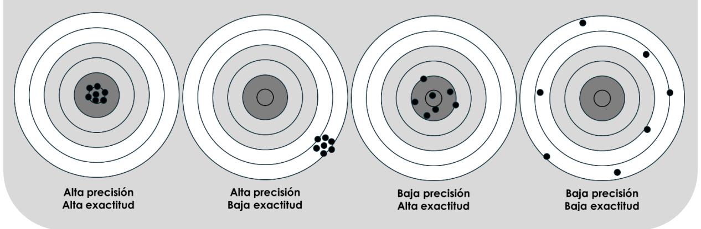

#### **V. Análisis de resultados**

Es el proceso sistemático y objetivo de examinar y evaluar los datos recopilados durante una investigación. Este análisis implica identificar patrones, relaciones, tendencias o cualquier otra información relevante que pueda proporcionar una comprensión más profunda del fenómeno estudiado. Además, implica la interpretación de estos hallazgos en el contexto de la hipótesis.

*Con los datos obtenidos es posible hacer una interpretación de los mismo en relación con la hipótesis planteada:*

*Se sabe que la aceleración de un cuerpo depende de su masa y de la fuerza neta aplicada sobre él. Además, la aceleración es la variación de la velocidad en el tiempo. Considerando que el roce entre el carro y la rampa es despreciable, que la masa del carro es de 0,2 kg y que la longitud de la rampa es de 1 m, es posible obtener la componente del peso paralela a la superficie en cada intento.*

| Ángulo de inclinación | Velocidad final | aceleración | Fuerza neta |
|-----------------------|-----------------|-------------|-------------|
| 0°                    | 0 m/s           | 0 m/s2      | 0 N         |
| 5°                    | 2,9 m/s         | 0,85 m/s2   | 0,17 N      |
| 10°                   | 4,1 m/s         | 1,7 m/s2    | 0,34 N      |
| 15°                   | 5 m/s           | 2,5 m/s2    | 0,5 N       |
| 20°                   | 5,8m/s          | 3,4 m/s2    | 0,68 N      |

# Relación entre variables

Se entiende que la relación entre variables conlleva que si una de estas cambia (variable independiente), por consecuencia, la otra (variable dependiente) también lo hará. Esta relación puede ser directamente proporcional, inversamente proporcional, con correlación positiva, correlación negativa o nula.

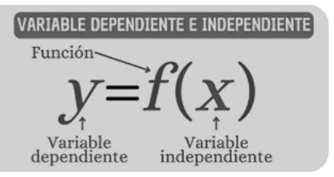

Es posible modelar este tipo de relaciones de manera gráfica:

## Directamente proporcional

Es posible modelarla a través de una función lineal, este tipo de relación es posible reconocerla ya que, al subir o aumentar una de las variables, la otra también lo hará.

$$y = kx$$

Donde k es una constante que presenta la pendiente del gráfico, la que se obtiene considerando las herramientas matemáticas disponibles para esto:

$$k = \left(\frac{y_2 - y_1}{x_2 - x_1}\right) = \frac{y}{x}$$

Una vez determinada la función que modele la relación entre las variables es posible representarla en un gráfico, como el de la figura.

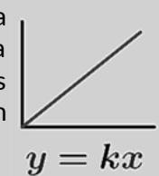

### Inversamente proporcional

Es posible modelarla a través de una función racional, este tipo de relación es posible reconocerla ya que, al subir o aumentar una de las variables, la otra disminuye y viceversa.

$$y=\frac{k}{x}$$
  
Esta relación será  
representada a través del  
siguiente gráfico:  $y=k$ 

Es importante recordar que, para considerar una proporcionalidad directa, la función debe pasar por el punto (0,0), es decir, pasar por el origen del plano cartesiano. De lo contrario, sería considerada como función "afín".

Finalmente, es necesario comprender que dentro de un fenómeno científico es posible identificar distintas **correlaciones entre las variables** observadas, diferente de las relaciones ya mencionadas, como se puede observar en las siguientes imágenes:

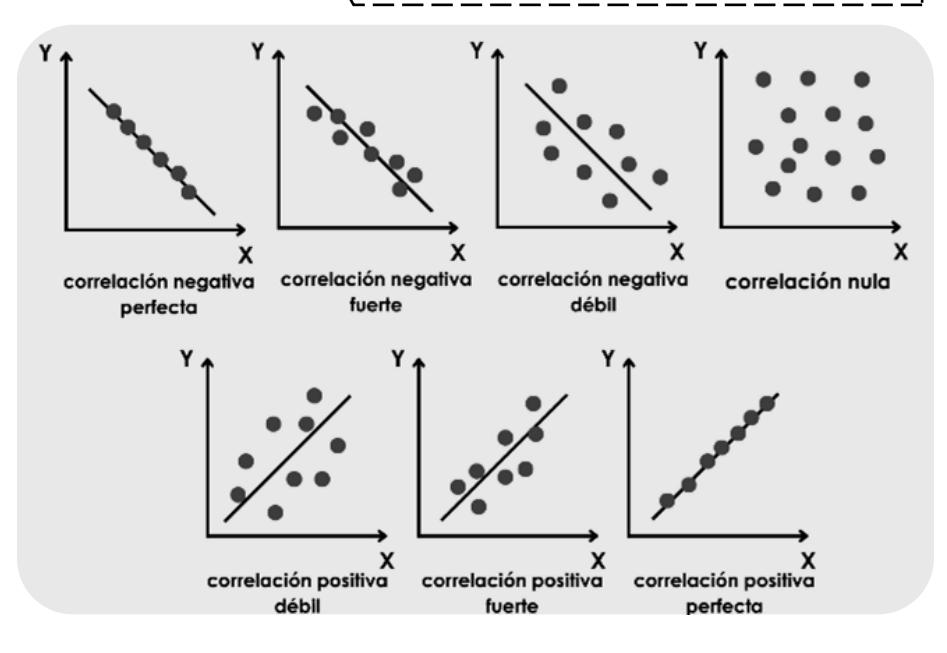

#### **Tabla de datos**

| Variable independiente <i>X</i> | Variable dependiente <i>Y</i> |
|---------------------------------------|-------------------------------------|
| $X_1$                                 | $y_1=f(x_1)$                        |
| $X_2$                                 | $y_2 = f(x_2)$                      |
| :                                     | :                                   |
| $X_{\mathbf{D}}$                      | $y_n = f(x_n)$                      |

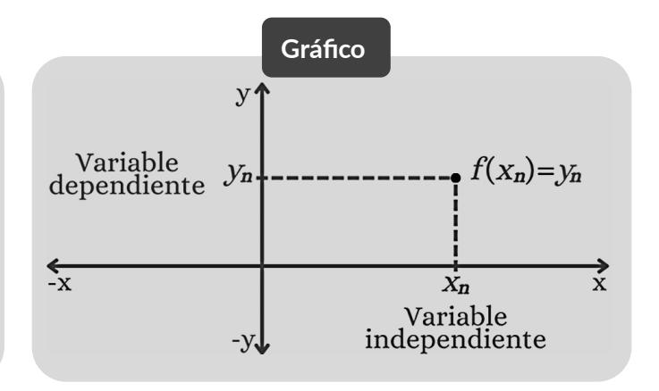

En el contexto de una investigación científica, comunicar resultados de manera clara y comprensible es fundamental. Para ello, se utilizan diversas formas de representación gráfica, cada una con características y utilidades específicas. A continuación, se describen algunas de las principales formas de representación, junto con ejemplos prácticos para cada una:

#### **Tablas**

#### **Características:**

- Organiza datos en filas y columnas.
- Permite mostrar una gran cantidad de información de forma estructurada.
- Ideal para resúmenes numéricos o categóricos.

#### **Utilidad:**

- Facilitar la comparación directa de valores.
- Ordenar los datos obtenidos.

**Ejemplo:** Un estudiante desea comprobar la relación entre el estiramiento de un resorte y la fuerza elástica de un resorte según la Ley de Hooke, para ello mide el estiramiento del resorte a medida que se aumenta gradualmente la masa de cuelga de este.

| Masa del cuerpo (g) | Longitud del resorte estirado (cm) | Longitud natural del resorte una vez retirado cada cuerpo (cm) |
|------------------------|------------------------------------|----------------------------------------------------------------|
| 0                      | 15                                 | 15                                                             |
| 60                     | 19                                 | 15                                                             |
| 120                    | 23                                 | 15                                                             |
| 180                    | 27                                 | 15                                                             |
| 240                    | 34                                 | 15                                                             |
| 300                    | 48                                 | 18                                                             |

#### **Gráfico de dispersión**

#### **Características:**

- Muestra puntos que representan la relación entre dos variables.
- Cada eje representa una variable continua.

**Ejemplo:** En el estudio de la absorción intestinal de nutrientes, se puede medir el contenido calórico de las heces en función de la actividad enzimática de las microvellosidades intestinales, para dos condiciones alimentarias diferentes, cuyos resultados pueden presentarse en un gráfico de dispersión como el de la siguiente figura:

#### **Utilidad:**

• Analizar correlaciones o patrones en conjuntos de datos.

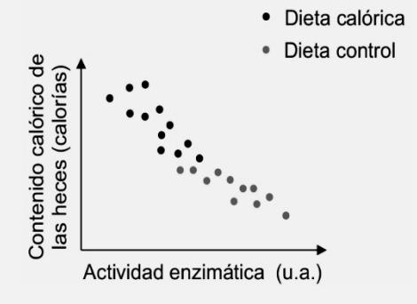

#### **Gráfico de línea**

### **Características:**

- Conecta puntos con líneas para mostrar cambios continuos en una variable.
- Utiliza ejes X e Y, con X representando a la variable independiente.

#### **Utilidad:**

• Visualizar tendencias y cambios a lo largo del tiempo.

**Ejemplo:** La solubilidad representa la máxima cantidad de un determinado soluto que puede disolverse en una cantidad específica de disolvente. Además, depende del tipo de soluto. Este parámetro puede variar en función de la temperatura, cuya relación puede representarse en un gráfico de línea:

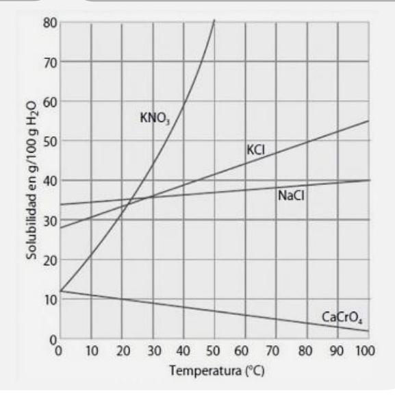

#### **Gráfico de barras**

### **Características:**

- Usa barras verticales u horizontales para comparar categorías.
- La altura o longitud de la barra indica la magnitud.

### **Utilidad:**

• Comparar datos categóricos o discretos.

**Ejemplo:** Se han realizado estudios que buscaron establecer la relación entre ciertos hábitos, como el de fumar, sobre la fertilidad masculina. En este contexto de investigación, se puede medir la concentración espermática de tres grupos de hombres (G1: no fumador, G2: fumador poco habitual, G3: fumador frecuente), cuyos resultados se pueden representar en un gráfico de barras:

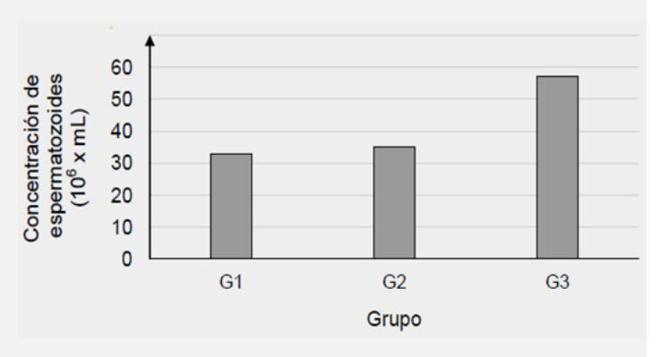

### **Gráfico de datos segmentados**

#### **Características:**

- Representa proporciones de varias categorías en un gráfico rectangular.
- La altura y el ancho de las áreas representan cantidades relativas.

#### **Utilidad:**

• Útil para mostrar proporciones complejas entre categorías.

**Ejemplo:** Se ha observado que el cambio de pH del suelo puede cambiar la proporción de la tonalidad de las flores de ciertas especies vegetales, como es el caso de las hortensias. El cambio en la proporción de las tonalidades de las flores en función del pH promedio del suelo puede representarse en un gráfico de datos segmentados:

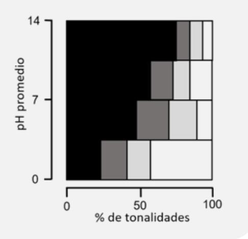

#### **Gráfico circular o de torta**

#### **Características:**

- Representa proporciones de un total usando segmentos de un círculo.
- Cada segmento del gráfico circular tiene un tamaño proporcional a su porcentaje dentro del conjunto total.

**Ejemplo:** La calcopirita es un mineral formado por cobre (Cu), hierro (Fe) y azufre (S) utilizado en la industria para obtener cobre. Su fórmula química es CuFeS2. La composición de este mineral en porcentaje en masa puede ser representada en un gráfico circular como el de la siguiente figura:

#### **Utilidad:**

• Visualizar la relación entre las partes y el todo de una serie de datos.

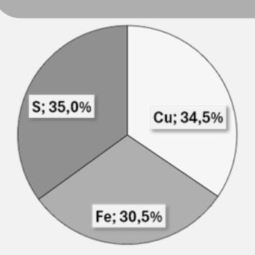

#### **Gráfico de barras contrastables**

#### **Características:**

- Permite comparar dos o más conjuntos de datos en categorías similares.
- Se utilizan barras agrupadas o apiladas.

#### **Utilidad:**

• Visualizar la relación entre las partes y el todo de una serie de datos.

**Ejemplo:** En el estudio de los cambios de las poblaciones humanas en función del tiempo, se suelen utilizar las pirámides de población, donde se representa la cantidad de hombres y mujeres de acuerdo con el rango etario al que pertenecen. Este tipo de representaciones se basan en las pirámides de barras contrastables:

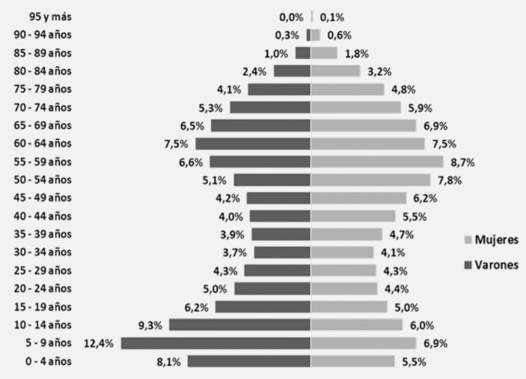

# **Concepto de replicabilidad**

En el contexto de una investigación científica, la replicabilidad hace referencia a la capacidad de repetir un mismo experimento bajo las mismas condiciones, y así obtener los mismos resultados. Es fundamental en la aplicación del método científico, así como un aspecto fundamental en la realización de una investigación. La replicabilidad permite la posibilidad de que otros equipos de científicos, con los mismos recursos y utilizando las mismas técnicas y metodologías, logren llegar a las mismas conclusiones.

#### **VII. Conclusiones**

Son argumentos y afirmaciones relativas a datos de mediciones experimentales y de la lógica (reglas y procedimientos para discernir si un razonamiento es correcto -válido- o incorrecto -inválido-). Se obtienen a partir del análisis de resultados.

# **¿Es lo mismo concluir que inferir?**

La respuesta es **no.** Las inferencias se basan en hechos de una situación, pero en lugar de sacar una conclusión, las inferencias utilizan hechos para determinar otros hechos. La inferencia consiste en juicios emitidos a partir de premisas, por ejemplo, resultados experimentales. Implica la interpretación de resultados y hechos para explicar fenómenos de diversa índole dentro del contexto en el que se realiza la inferencia. Además, las inferencias pueden tener valor predictivo. Por ejemplo, si alguien menciona un animal de cuatro patas, peludo y que mueve la cola, se puede inferir que probablemente se trata de un perro.

A partir del análisis de datos es posible obtener una conclusión, identificando si el experimento confirma o descarta la hipótesis.

*Conclusión: El experimento confirma la relación directamente proporcional entre la inclinación de la rampa y la aceleración del carro, debido al aumento de la componente del peso paralela a la superficie.* 

# **CONCEPTOS NECESARIOS EN CONTEXTO CIENTÍFICO**

En el ámbito científico, existen conceptos que son fundamentales para explicar fenómenos naturales y formular explicaciones precisas sobre el mundo que nos rodea. Aunque estos términos a menudo y de forma coloquial se utilizan de manera intercambiable, cada uno tiene un significado y una función específica dentro del proceso científico. A continuación, te presentamos las diferencias clave entre ellos:

#### **PRINCIPIO**

Un **principio** es una regla o fundamento general que orienta las leyes y teorías en la ciencia. Puede ser más amplio que una ley y puede tener menos especificidad matemática, ya que no se limita a ciertas condiciones. Siendo una afirmación fundamental, al igual que las leyes cuentan con evidencias de carácter directo o primario.

### **TEORÍA**

Una **teoría** es una **explicación** amplia y bien fundamentada de un conjunto de fenómenos observados. Las teorías son comprobadas a través de la experimentación y la observación, y pueden predecir resultados bajo ciertas condiciones. A diferencia de una ley, una teoría explica el porqué de un fenómeno, no solo lo que ocurre.

Cuentan principalmente con evidencia indirecta o secundaria.

#### **LEY**

Una **ley** es una **descripción** precisa y general de un fenómeno que ocurre de manera consistente bajo ciertas condiciones, y generalmente se expresa en términos matemáticos. Las leyes científicas describen lo que sucede, pero no explican por qué ocurre.

Cuentan con evidencias de carácter directo o primario, replicables considerando las limitaciones de la ley.

# **MODELO**

Un **modelo** es una representación simplificada de un fenómeno, sistema o proceso real que ayuda a los científicos a entender, explicar, predecir o simular su comportamiento. Los modelos pueden ser físicos, matemáticos, conceptuales o computacionales, y se utilizan cuando no se puede estudiar directamente el fenómeno.

| Concepto                                                                                                  | Definición                                              | Propósito                        | Evidencias                                          | Características                                                             |
|-----------------------------------------------------------------------------------------------------------|---------------------------------------------------------|----------------------------------|-----------------------------------------------------|-----------------------------------------------------------------------------|
| Principio                                                                                                 | Fundamento general que guía el estudio de fenómenos. | Orientar las leyes y teorías. | Generalmente directas, replicables               | Suele ser más amplio que una ley, pero menos específico.                 |
| Ejemplo: principio de conservación de la energía, principio de incertidumbre.                             |                                                         |                                  |                                                     |                                                                             |
| Ley                                                                                                       | Descripción de un fenómeno observado.                | Explicar qué ocurre.          | Directas, replicables                               | Se expresa generalmente de forma matemática y no explica por qué ocurre. |
| Ejemplo: Ley de conservación de la masa, leyes de newton, ley de Mendel.                                  |                                                         |                                  |                                                     |                                                                             |
| Teoría                                                                                                    | Explicación de un conjunto de fenómenos observados.  | Explicar por qué ocurre.      | Indirectas, difícil de replicas o no replicables | Se basa en evidencias científicas. Se puede modificar.                   |
| Ejemplo: Teoría evolutiva, teoría celular, teoría cinética de los gases, teoría de la deriva continental. |                                                         |                                  |                                                     |                                                                             |

**Sabias que…. ¿En qué se diferencian el principio de conservación de la energía con la ley de conservación de la masa?**

El **principio de conservación de la energía** es válido en **todos los contextos y bajo cualquier condición espaciotemporal**. Por otro lado, la **ley de conservación de la masa** puede **no aplicarse estrictamente en ciertas reacciones químicas**, especialmente cuando el rendimiento es inferior al 100%, debido a pérdidas de materia en forma de subproductos, gases o partículas no cuantificadas.

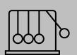

Las leyes de Newton dejaron de considerarse **principios fundamentales** a finales del siglo XIX y principios del siglo XX, con el desarrollo de la **teoría de la relatividad** de Einstein y la **mecánica cuántica**. Esto ocurrió porque las leyes de Newton, aunque extremadamente útiles y precisas en muchos contextos, se demostraron como válidas solo bajo ciertas condiciones

#### **VIII. Comunicación o socialización**

Implica la presentación y difusión de los resultados de una investigación por medio de comunicaciones orales, pósteres, conferencias, publicaciones, etc. La secuencia que lleva a la presentación de resultados de forma oral se puede dividir en elaboración del resumen, construcción del material gráfico, presentación y defensa de los resultados.

Para poder hacer la socialización de los resultados a toda la comunidad se utilizan las herramientas vistas en el apartado de análisis de resultados, como gráficos y tablas de datos.

Este tipo de experiencias realizadas en un laboratorio con supervisión de un profesor se puede comunicar mediante un informe científico, que incluye: introducción con hipótesis y objetivos, materiales y métodos, resultados con tablas y/o gráficos, discusiones, conclusiones y sugerencias para futuros experimentos.

# **Actividades**

A continuación, se presenta un set de preguntas correspondientes a ejemplos de preguntas PAES publicadas por el DEMRE, donde se aplican algunas de las habilidades científicas para su resolución.

#### **Pregunta 1**

**Área temática:** Organismo y ambiente **Conocimiento de la ciencia:** Ecosistemas

**Habilidad científica:** PAE

**Criterio de evaluación:** Identificar conclusiones o inferencias a partir de los resultados en contextos

científicos.

El gráfico representa la relación entre la productividad primaria neta y la temperatura ambiente en el crecimiento de un bosque joven.

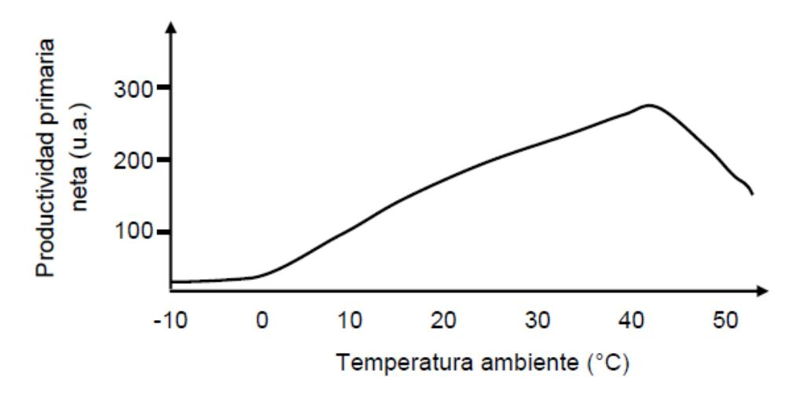

De acuerdo con la información, ¿cuál de las siguientes opciones es una inferencia correcta?

- A) A temperaturas inferiores a los 0 °C, la vegetación estudiada gasta más energía en su metabolismo, por lo que no hay productividad primaria neta.
- B) A temperaturas superiores a los 40 °C, la vegetación estudiada aumenta la transpiración, aumentando la productividad primaria neta.
- C) Entre 20 °C y 40 °C, la vegetación estudiada aumenta la tasa fotosintética, elevando la productividad primaria neta.
- D) A temperaturas superiores a 40 °C, la productividad primaria neta aumenta, ya que la vegetación estudiada incrementa la tasa fotosintética.

#### **Defensa**

Para responder esta pregunta es importante realizar el análisis del gráfico presentado. Además, es fundamental identificar la relación existente entre las variables dependiente (productividad primaria neta) y la independiente (temperatura).

Inicialmente debemos tener en cuenta los conocimientos de la ciencia involucrados en esta pregunta. La productividad primaria neta (PPN) corresponde a la cantidad de biomasa producida por las poblaciones de productores, como plantas, a través de la fotosíntesis. De esta forma se sitúan como el primer eslabón de las cadenas alimentarias, a partir de las cuales la energía fluye hacia los productores. Factores ambientales como la temperatura pueden influir sobre el rendimiento fotosintético, e indirectamente sobre la productividad primaria neta de los productores que forman parte de los ecosistemas de los cuales forman parte.

En este contexto, al analizar el gráfico, es posible observar que la PPN varía de forma diferente en tres tramos de temperatura. En el tramo entre los -10 °C y 0 °C la variación es prácticamente nula, mientras entre los 0 °C y aproximadamente los 40 °C la PPN se incrementa con la temperatura. A temperaturas superiores a 40 °C la PPN decae. Estos cambios pueden ser explicados en función de cómo afecta la temperatura al rendimiento fotosintético. Por ejemplo, en el tramo de temperatura más bajo, la variación es mínima y con bajos valores de PPN, probablemente debido a la baja actividad de las enzimas que catalizan las reacciones de la fotosíntesis. En el segundo tramo, mientras mayor es la temperatura, las reacciones fotosintéticas se favorecen, resultando en un incremento casi constante de la PPN. En el último tramo el descenso puede ser explicado por la desnaturalización de las enzimas fotosintéticas.

De acuerdo con la explicación del párrafo anterior es posible inferir que en el tramo de temperatura comprendido entre los 20 °C y 40 °C la productividad primaria neta se incrementó debido a un incremento en la tasa fotosintética de los organismos vegetales que forman parte del ecosistema descrito, el bosque joven. Con base en esta explicación, la alternativa correcta es C).

### **¿Qué se necesita saber y saber hacer para responder correctamente esta pregunta?**

Inicialmente es importante reconocer y relacionar los conceptos que definen el desarrollo de los ecosistemas, tales como la fotosíntesis y la productividad primaria neta, junto con el efecto de factores ambientales como la temperatura sobre estas dos variables. El procesar y analizar la evidencia presentada en el gráfico presentado en esta pregunta con el fin de elaborar una inferencia requiere de la base del conocimiento de la ciencia acorde con los conceptos sobre el estudio de los ecosistemas indicados con anterioridad.

#### **Pregunta 2**

**Área temática:** Ondas

**Conocimiento de la ciencia:** Espectro electromagnético **Habilidad científica:** Observar y plantear preguntas, OPP.

**Criterio de evaluación:** Identificar una hipótesis para dar una explicación tentativa a un problema

científico que debe validarse con evidencias.

Preocupados por los efectos de la radiación ultravioleta (UV), un grupo de estudiantes busca determinar la cantidad de radiación UV a la que están expuestas las personas de su colegio. Para ello, planean utilizar un tipo de sensor UV para registrar, a lo largo del día, la intensidad de esta radiación en un lugar específico de la cancha de asfalto del colegio, y en base a los resultados proponer medidas de protección para las personas.

En relación con lo anterior, ¿cuál de las siguientes opciones señala correctamente una hipótesis adecuada al diseño experimental propuesto por el grupo estudiantes?

- A) La radiación UV varía su intensidad según los lugares en que sea medida.
- B) La intensidad de la radiación UV varía según el tipo de sensor utilizado.
- C) La intensidad de la radiación UV es máxima a una determinada hora.
- D) La radiación UV provoca daños en la salud de las personas.

#### **Defensa**

Para responder esta pregunta, es esencial comprender las características de los componentes de una investigación científica, especialmente el concepto de hipótesis y cómo se formula. Además, es crucial identificar correctamente las variables derivadas del procedimiento experimental propuesto por el grupo de estudiantes.

Una hipótesis es una posible respuesta a una pregunta de investigación basada en hechos reales que explica la relación entre la variable independiente y la variable dependiente de manera clara y específica. Debe ser simple y establecida previamente al estudio. La hipótesis guía el estudio y debe ser sometida a prueba para ser aceptada o rechazada.

En el diseño experimental, se consideran tres tipos de variables: independiente (el factor que se contrasta), dependiente (el factor que se mide) y controlada (el factor que se mantiene constante por decisión de los investigadores).

Con esto en mente, es posible identificar cuál hipótesis podría haber guiado el diseño experimental propuesto por el grupo de estudiantes. Analizando las opciones A) y B), se observa que los datos obtenidos por el grupo no permitirían evaluar cómo varía la intensidad de la radiación UV según el lugar de medición o el tipo de sensor utilizado, ya que estos factores se mantendrían inalterados.

En cuanto a la opción C), esta hipótesis se adecúa al diseño experimental, ya que permitiría obtener datos que relacionen la intensidad de la radiación UV con el tiempo. Esto posibilitaría validar o refutar la hipótesis de que "la intensidad de la radiación UV es máxima a una determinada hora".

Por último, la opción D) presenta una hipótesis que no puede ser sometida a prueba con el diseño experimental propuesto, ya que no se obtendrían datos relacionados con los daños provocados por la radiación UV en las personas.

En conclusión, la respuesta correcta es la opción C).

#### **¿Qué necesitas saber y saber hacer para responder correctamente esta pregunta?**

Lo principal para poder responder esta pregunta es conocer el concepto de hipótesis, manejar una definición clara será fundamental además de poder relacionar e identificar las variables que participaran en el procedimiento experimental.

#### Pregunta 3

Área temática: Reacciones químicas y estequiometría.

Conocimiento de la ciencia: Características de las soluciones químicas en cuanto a sus

componentes y propiedades. Habilidad científica: Evaluar

**Criterio de evaluación:** Evaluar la coherencia o pertinencia entre las explicaciones, teorías, leyes, marcos conceptuales, modelos, preguntas, problemas, predicciones, hipótesis, variables, diseños, procedimientos, inferencias, evidencias y conclusiones en contextos científicos.

Una estudiante de segundo año medio lee en Internet que, al mezclar sal de mesa con agua, esta conduce la corriente eléctrica. Para comprobarlo, la estudiante determinó la conductividad eléctrica de soluciones de distinta concentración. Los datos los presentó en la siguiente tabla:

| Número de mediciones | Masa de sal de mesa (g) | Conductividad eléctrica promedio (μS cm -1 ) |
|----------------------|-------------------------|---------------------------------------------------------|
| 6                    | 0,049                   | 100                                                     |
| 6                    | 0,490                   | 1000                                                    |
| 6                    | 5,370                   | 10000                                                   |
| 6                    | 10,240                  | 18000                                                   |

Posteriormente, la estudiante presentó estos datos a su docente, quien cuestiona la forma en que estos están presentados. En relación con lo anterior, ¿cuál de las siguientes opciones señala correctamente el motivo de dicho cuestionamiento?

- A) El número de veces que la estudiante mide la conductividad de la solución es insuficiente para asegurar la confiabilidad del resultado.
- B) La masa de sal es insuficiente para realizar mediciones y a partir de ello establecer conclusiones.
- C) La estudiante ha omitido el volumen del agua empleado para preparar las soluciones salinas al momento de reportar sus datos.
- D) Los resultados presentados por la estudiante incluyen la medida correspondiente al agua pura en lugar de variaciones de mezclas.

#### Defensa

Para responder correctamente esta pregunta lo primero que se debe hacer es analizar el enunciado y los valores presentados en la tabla, comparar y obtener patrones entre los resultados mostrados para finalmente contrarrestar esta información con el conocimiento propio de las características de las soluciones.

Primero, se debe tener presente que una investigación científica basada en la determinación de parámetros cuantitativos, el número mínimo de datos para entregar confiabilidad depende del tipo de investigación, sin embargo, en un laboratorio de química se considera valido poseer un mínimo de 5 mediciones y estas deben ser replicables y precisas.

Segundo, se debe tener presente algunas características importantes de las soluciones electrolíticas, como por ejemplo que la conducción de la electricidad depende de varios factores

como por ejemplo el tipo de soluto (electrolito fuerte o débil) y de la concentración de este. Considerando este último factor de la concentración se debe conocer que esta se determina por la razón entre la cantidad de soluto en una determinada cantidad de solución (soluto + solvente). En el caso del experimento el soluto corresponde a la sal (NaCl) y el agua al solvente.

El enunciado dice que se mide la conductividad eléctrica de soluciones de distinta concentración, pero la tabla solo nos indica la cantidad de soluto en la solución y se desconoce la de solvente, por lo tanto, no puedo determinar la concentración para cada cantidad de sal mostrada.

Según lo establecido y respecto a los señalado en la tabla, el cuestionamiento valido para el experimento realizado por el estudiante corresponde a la opción C)

#### **¿Qué se necesita saber y saber hacer para responder correctamente esta pregunta?**

Debes saber analizar críticamente información científica en un contexto científico, tal como el experimento realizado por el estudiante y así contrastarla con los conocimientos previos. Para ello, necesitas saber relacionar y seleccionar datos cuantitativos o cualitativos de manera correcta. En particular, en esta pregunta necesitas evaluar datos cuantitativos o cualitativos considerando la información experimental presentada en tablas, metodologías experimentales y las propiedades de las soluciones basadas en la conductividad eléctrica.

| Presentación                                                      | 27  |
|-------------------------------------------------------------------|-----|
| I. INTRODUCCIÓN:                                                  | 29  |
| CONOCIMIENTOS PREVIOS A LA FÍSICA                                 | 29  |
| 1.1 ¿Qué es la física?                                            | 29  |
| 1.2 Magnitudes en el mundo físico                                 | 29  |
| 1.3 Sistema Internacional de Medidas (S.I.)                       | 31  |
| 1.4 Prefijos y potencias                                          | 31  |
| 1.5 Conversión de unidades de medidas                             | 32  |
| II. ONDAS:                                                        | 33  |
| TEMA 1. CARACTERÍSTICAS DE LAS ONDAS                              | 33  |
| 1.1 Conceptos iniciales                                           | 33  |
| 1.2 Características de las ondas                                  | 34  |
| 1.3 Clasificación de las ondas                                    | 40  |
| 1.4 Ejercicios propuestos                                         | 42  |
| TEMA 2. LUZ Y ONDAS ELECTROMAGNÉTICAS                             | 45  |
| 2.1 Naturaleza de la luz                                          | 45  |
| 2.2 Ondas electromagnéticas                                       | 48  |
| 2.3 Medios en los que se propagan                                 | 50  |
| 2.4 Ejercicios propuestos                                         | 52  |
| TEMA 3. FENÓMENOS ONDULATORIOS                                    | 57  |
| 3.1 Transmisión                                                   | 57  |
| 3.2 Absorción                                                     | 57  |
| 3.3 Reflexión                                                     | 58  |
| 3.4 Refracción                                                    | 59  |
| 3.5 Difracción                                                    | 60  |
| 3.6 Interferencia                                                 | 61  |
| 3.7 Efecto Doppler                                                | 62  |
| 3.8 Aplicaciones y dispositivos tecnológicos que se basan en onda | s63 |
| 3.9 Ejercicios propuestos                                         | 66  |
| TEMA 4. FORMACIÓN DE IMÁGENES EN ESPEJOS                          | 71  |
| 4.1 Tipos de imagen                                               | 71  |
| 4.2 Formación de imágenes en espejos planos                       | 71  |
| 4.3 Espejos Cóncavos (convergentes)                               | 72  |
| 4.3.1 Rayos notables                                              | 72  |

| 4.3.2   | Convergencia de rayos reflejados                            | 73  |
|---------|-------------------------------------------------------------|-----|
| 4.3.3   | Formación de imágenes en espejos cóncavos                   | 73  |
| 4.4     | Espejos convexos (divergentes)                              | 74  |
| 4.4.1   | Rayos Notables                                              | 75  |
| 4.4.2   | Formación de imágenes en espejos convexos                   | 76  |
| 4.5 Ej  | jercicios propuestos                                        | 77  |
| TEN     | MA 5. FORMACIÓN DE IMÁGENES EN LENTES                       | 81  |
| 5.1     | Formación de imágenes en lentes biconvexos (convergentes)   | 81  |
| 5.1.1   | Rayos notables                                              | 81  |
| 5.1.2   | Formación de la imagen                                      | 82  |
| 5.2     | Formación de imágenes en lentes bicóncava (divergentes)     | 83  |
| 5.3     | Ojo humano y problemas a la vista                           | 84  |
| 5.4     | Astronomía y contaminación lumínica                         | 85  |
| 5.5     | Ejercicios propuestos                                       | 86  |
| III. ME | ECÁNICA                                                     | 89  |
| TEN     | MA 1. PRIMERA LEY DE NEWTON: LEY DE INERCIA                 | 89  |
| 1.1     | ¿Qué es una fuerza ( <b>F</b> )?                            | 89  |
| 1.2     | ¿Cómo representamos las fuerzas?                            | 89  |
| 1.3     | Sumas de fuerzas y Fuerza neta                              | 90  |
| 1.3.1   | Suma de fuerzas con igual dirección y sentido               | 90  |
| 1.3.2   | Suma de fuerzas con igual dirección y sentido opuesto       | 90  |
| 1.3.3   | Suma de fuerzas perpendiculares entre sí                    | 91  |
| 1.4     | Primera Ley de Newton: Ley de Inercia                       | 91  |
| 1.5     | Enunciado de la Primera ley de Newton: Principio de Inercia | 92  |
| 1.6     | Peso aparente y ascensores en movimiento.                   | 93  |
| 1.7     | Primera Ley de Newton y DCL                                 | 93  |
| 1.8     | Ejercicios propuestos                                       | 95  |
| TEN     | MA 2. TIPOS DE FUERZAS                                      | 99  |
| 2.1     | Peso de un cuerpo ( <b>P</b> )                              | 99  |
| 2.2     | Fuerza Normal ( N )                                         | 100 |
| 2.3     | Tensión de un cable ( <b>T</b> )                            | 101 |
| 2.4     | Fuerzas de Roce o Fricción ( FR )                           | 101 |
| 2.5     | Fuerza Elástica o Restauradora ( <b>FK</b> ) y Ley de Hooke | 103 |
| 2.6     | Ejercicios propuestos                                       | 105 |

| TEMA 3. SEGUNDA LEY DE NEWTON: LEY DE FUERZA |                                                    | 109 |
|----------------------------------------------|----------------------------------------------------|-----|
| 3.1                                          | Enunciado de la Segunda Ley de Newton: Ley de masa | 109 |
| 3.2                                          | Segunda Ley de Newton y DCL                        | 109 |
| 3.3                                          | Ejercicios propuestos                              | 111 |
| TEI                                          | MA 4: TERCERA LEY DE NEWTON: ACCIÓN Y REACCIÓN     | 115 |
| 4.1                                          | Enunciado de la Tercera Ley de Newton              | 115 |
| 4.2                                          | Tercera Ley de Newton y DCL                        | 116 |
| 4.3                                          | Ejercicios propuestos                              | 117 |
| TEI                                          | MA 5. PRESIÓN EN SÓLIDOS, LÍQUIDOS Y GASES         | 121 |
| 5.1                                          | Estados de la Materia                              | 121 |
| 5.2                                          | Densidad (ρ)                                       | 122 |
| 5.3                                          | Presión (P)                                        | 122 |
| 5.4                                          | Presión Hidrostática                               | 124 |
| 5.5                                          | Vasos comunicantes:                                | 126 |
| 5.6                                          | Principio fundamental de la hidrostática           | 126 |
| 5.7                                          | Principio de Pascal                                | 126 |
| 5.8                                          | Presión atmosférica                                | 127 |
| 5.9                                          | Experimento de Torricelli                          | 128 |
| 5.10                                         | Ejercicios propuestos                              | 129 |

# **Presentación**

Este apunte, en su **primera edición**, es un material de apoyo pedagógico diseñado para la preparación de la PAES de Física Electivo. Los contenidos presentados están alineados con el temario oficial del DEMRE y abarcan las siguientes áreas temáticas: **Mecánica** y **Ondas**.

Es importante destacar que este texto complementa lo que se enseña en clases, por lo que no reemplaza la asistencia regular a estas.

#### **¿Cómo utilizar el apunte?**

- **Preparación previa a las clases:** Lee el capítulo correspondiente antes de asistir a clase. Esto te proporcionará un punto de partida para comprender los conceptos y te permitirá plantear preguntas que faciliten una mayor profundización durante la sesión.
- **Ejercitación de los temas:** Cada sección incluye ejercicios propuestos para que los resuelvas de manera independiente. Esta práctica es una excelente oportunidad para identificar dudas que podrás aclarar con apoyo en clase y evaluar tu comprensión del tema.
- **Toma de apuntes:** Usa el apunte durante las clases para registrar los aspectos más relevantes o las dudas que surjan. También puedes complementar las explicaciones o ejemplos del texto con las enseñanzas impartidas en cada sesión.
- **Complemento y profundización:** Aprovecha el apunte para repasar cada sección y, si es posible, consulta el material adicional disponible en la plataforma del estudiante para enriquecer tu aprendizaje.

# **I. INTRODUCCIÓN:**

# **CONOCIMIENTOS PREVIOS A LA FÍSICA**

En este capítulo podrás revisar los contenidos fundamentales para iniciar nuestro estudio sobre los distintos fenómenos físicos.

# **1.1 ¿Qué es la física?**

La física es la **ciencia que estudia los fenómenos naturales**, desde lo microscópico a lo macroscópico. Se ocupa de temas como el movimiento, la energía, la materia, el tiempo y el espacio.

Como **disciplina científica**, a partir de la observación sistemática y la experimentación, encuentra patrones, identifica componentes y los integra enunciando principios, construyendo modelos y formulando teorías que permiten explicar y predecir los fenómenos estudiados.

Una de sus principales características es que **utiliza las matemáticas como lenguaje para describir gran parte de estos fenómenos a través de relaciones, modelos, leyes, entre otros**, lo que le entrega un gran poder predictivo y le ha permitido propiciar el desarrollo de distintas tecnologías.

A lo largo de este curso, podrás aplicar varias de las herramientas que has aprendido en la asignatura de matemáticas, no solo para describir fenómenos, sino que también para desarrollar ejercicios cualitativos y cuantitativos.

### **1.2 Magnitudes en el mundo físico**

Para describir matemáticamente los distintos fenómenos físicos se usan magnitudes físicas, las cuales expresan una característica particular de un fenómeno.

Una **magnitud** es una propiedad medible de un objeto o fenómeno físico que se puede expresar mediante un número y una unidad. Por ejemplo, la longitud, la masa, el tiempo, la temperatura y la velocidad son magnitudes. Estas se clasifican en:

**Magnitud escalar** cuando una característica sea descrita usando únicamente un valor numérico y su respectiva unidad de medida. Algunos ejemplos son masa (m), energía (E), tiempo (t) y temperatura (T).

En cambio, hablaremos de **magnitud vectorial**  cuando una característica sea descrita usando un valor numérico, su respectiva unidad de medida y además una **dirección y sentido**. Un vector se representa como una flecha.

Algunos ejemplos de magnitudes vectoriales son la posición (x⃗ ), el desplazamiento (Δx⃗ ), la velocidad (v⃗ ), la aceleración (a⃗ ) y la fuerza (F⃗ ). **Las magnitudes vectoriales las señalaremos usando una flecha sobre la letra** que denota cada magnitud.

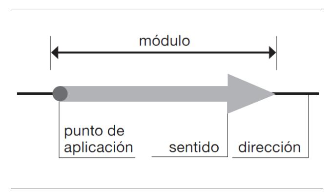

Para poder describir magnitudes vectoriales es necesario establecer un **sistema de referencia**, que corresponde a un marco o punto de observación que se usa para describir un fenómeno de interés para la disciplina. Un sistema de coordenadas cartesianas es un sistema de referencia muy usado en física, tiene un origen y una grilla (o matriz) que permite realizar mediciones; además, podemos establecer un *punto de referencia*, como un árbol, un edificio o una persona (observador) y que nos sirva para describir un fenómeno.

### **¿Qué es un vector?**

Un vector es una magnitud física que se representa mediante un segmento de recta orientado y que tiene tres características fundamentales:

- 1. **Módulo**: La magnitud o tamaño del vector (valor numérico con unidad).
- 2. **Dirección**: La orientación en el espacio en la que actúa el vector.
- 3. **Sentido**: El lado hacia el que apunta el vector.

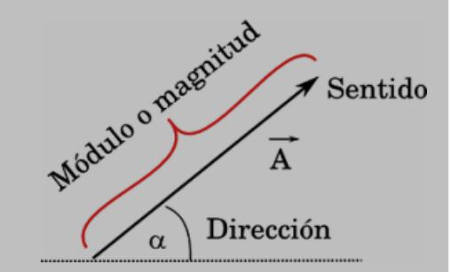

#### **Operaciones con vectores**

#### 1. **Suma de vectores**

o **Método gráfico (regla del paralelogramo o polígono)**: Los vectores se representan gráficamente desde el mismo origen o en cadena. El resultado es un vector (resultante) que cierra el polígono o conecta el origen con el extremo final.

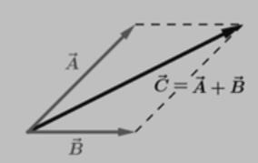

o **Método analítico**: Se suman sus componentes en cada eje (x, y, z).

$$\overrightarrow{Fy}_{*40 \text{ N}} = Fx^2 + Fy^2$$
Despejando F:
$$\overrightarrow{F}_{*50 \text{ N}} = \sqrt{Fx^2 + Fy^2}$$
Sustituyendo Valores:
$$\overrightarrow{Fx}_{*30 \text{ N}} = \sqrt{30^2 + 40^2} = 50 \text{ N}$$

#### 2. **Resta de vectores**

Se realiza sumando el opuesto del vector que se resta.

3. **Multiplicación de un vector por una escalar** Multiplica el módulo del vector por el escalar, manteniendo la dirección.

# **1.3 Sistema Internacional de Medidas (S.I.)**

En física, tal como ya hemos mencionado, para **especificar el tipo de fenómeno estudiado se utilizan unidades de medición**. Si bien existen varias unidades de medición para una misma magnitud física, la mayor parte del tiempo nos regiremos por el **acuerdo establecido por "El Sistema Internacional de Unidades" (S.I.)** que está compuesto por las siete unidades básicas que se muestran a continuación:

| Magnitud                    | Unidad básica | Símbolo |
|-----------------------------|---------------|---------|
| Longitud                    | Metro         | m       |
| Masa                        | Kilogramo     | kg      |
| Tiempo                      | Segundo       | s       |
| Corriente eléctrica         | Ampere        | A       |
| Temperatura                 | Kelvin        | K       |
| Intensidad luminosa      | Candela       | Cd      |
| Cantidad de sustancia | Mol           | mol     |

Para evitar posibles errores en la resolución de ejercicios, te recomendamos siempre poner mucha atención a las unidades de medida. **Muchas magnitudes físicas se cuantifican con la combinación de algunas de estas unidades básicas de medición**. Así mismo, como verás a lo largo de este texto, muchas veces las leyes físicas que se expresan a través de fórmulas matemáticas requieren del uso de constantes, cuyas unidades también se expresan como la combinación de estas unidades de medición.

# **1.4 Prefijos y potencias**

Los prefijos de las distintas unidades de medida son vocablos que se anteponen a los símbolos de las unidades y que equivalen a potencias de base 10. Estos **son usados para simplificar la notación y algunos cálculos**. En la siguiente tabla se muestran los valores de algunos prefijos más usados:

| Nombre | Símbolo | Valor |   |                   |
|--------|---------|-------|---|-------------------|
| tera   | T       | 1012  | = | 1.000.000.000.000 |
| giga   | G       | 109   | = | 1.000.000.000     |
| mega   | M       | 106   | = | 1.000.000         |
| kilo   | k       | 103   | = | 1.000             |
| hecto  | h       | 102   | = | 100               |
| deca   | da      | 10    | = | 10                |
| deci   | d       | 10-1  | = | 0,1               |
| centi  | c       | 10-2  | = | 0,01              |
| mili   | m       | 10-3  | = | 0,001             |
| micro  | µ       | 10-6  | = | 0,000 001         |
| nano   | n       | 10-9  | = | 0,000 000 001     |
| pico   | p       | 10-12 | = | 0,000 000 000 001 |

**Ejemplo**: Se dice que la distancia de la Tierra al Sol es aproximadamente 150.000.000.000 metros, es decir, 150 Gm.

#### **1.5 Conversión de unidades de medidas**

En ocasiones es necesario convertir las unidades de medición de cierta magnitud física y expresarla en otra unidad de medición. Por ejemplo, expresar los gramos en kilógramos, los kilómetros en milímetros o convertir de segundos a horas. Para realizar dichas conversiones te serán útiles los métodos que señalamos a continuación.

#### • **Conversión directa por factorización o descomposición**

Se trata de descomponer el valor numérico de la magnitud física en factores, para luego reemplazar uno de los factores por un prefijo.

**Ejercicio:** Convierta 0,0001 Coulomb (C) en micro Coulomb (µC). El prefijo "micro" equivale a 10-6 . Por lo tanto, se puede hacer la siguiente conversión: 0,0001 C = 10-4 C = 102 ∙ 10-6 C = 102 micro C = 100 micro C = 100 µC

#### • **Conversión usando proporcionalidad directa**

Se trata de recurrir a una proporción directa entre las unidades involucradas. Si tenemos el dato de la equivalencia entre dos unidades de una misma magnitud física, podemos plantear la proporción que nos permita encontrar el valor desconocido.

**Ejercicio:** El calor es una forma de energía que se manifiesta o se transfiere cuando existe una diferencia de temperatura entre dos o más cuerpos. Las dos unidades de medición que más se utilizan para el calor son las Calorías (cal) y los Joule (J). La equivalencia entre estas dos unidades es aproximadamente:

1 caloría = 4,2 Joule

¿A cuántas calorías equivalen 12,6 kJ?

Para resolver planteamos una proporción utilizando la equivalencia y la despejamos:

$$\frac{1 \text{ Cal}}{\text{x Cal}} = \frac{4.2 \text{ J}}{12.6 \text{ kJ}} \rightarrow \frac{1 \text{ Cal}}{\text{x Cal}} = \frac{4.2 \text{ J}}{12.600 \text{ J}}$$

$$x \text{ Cal} = \frac{1 \text{ Cal} \cdot 12600 \text{ J}}{4.2 \text{ J}} \rightarrow x \text{ Cal} = 3000 \text{ Cal}$$

#### • **Conversión utilizando factores unitarios**

Cuando necesitamos realizar una conversión entre unidades de medida compuestas por una o más unidades fundamentales, se puede recurrir al uso de los factores unitarios. Para ello, se requiere tener la **equivalencia de unidades** y usar fracciones unitarias.

**Ejercicio:** Una atleta corre en la prueba de los 100 metros planos y en un instante alcanza una rapidez máxima de 36 km/h. ¿Cuál fue su rapidez máxima en m/s?

Para transformar de km/h a m/s usamos los factores unitarios, tomando en cuenta las siguientes equivalencias:

$$1 \text{ km} = 1000 \text{ m}$$
  
 $1 \text{ h} = 3600 \text{ s}$ 

Por lo tanto:

$$36 \, \left(\frac{\text{km}}{\text{h}}\right) \cdot \, \frac{1\,000\,\text{m}}{1\,\text{km}} \, \cdot \, \, \frac{1\,\text{h}}{3\,600\,\text{s}} = \, 36 \, \cdot \, \frac{1\,000}{3\,600} \, \left(\frac{\text{m}}{\text{S}}\right) \, = \, 10 \, \left(\frac{\text{m}}{\text{S}}\right)$$

# **II. ONDAS:**

Vivimos rodeados de estímulos físicos que percibimos a través de nuestros sentidos; muchos de ellos se manifiestan como vibraciones y ondas que se propagan en el espacio, generando en nosotros sensaciones auditivas y visuales. Comprender cómo se comportan estos fenómenos y cómo interactúan con el entorno ha permitido, a lo largo de la historia, desarrollar tecnologías clave, desde las comunicaciones a distancia hasta dispositivos que facilitan nuestra vida cotidiana. Por ello, el estudio de las ondas y los fenómenos ondulatorios resulta fundamental.

# **TEMA 1. CARACTERÍSTICAS DE LAS ONDAS**

### **1.1 Conceptos iniciales**

Antes de adentrarnos en el estudio de las ondas, es importante distinguir entre tres conceptos fundamentales: vibración, oscilación y onda.

| Oscilación                                                                                                                                             | Vibración                                                                                                                  | Onda                                                                                                                                                                                                 |
|--------------------------------------------------------------------------------------------------------------------------------------------------------|----------------------------------------------------------------------------------------------------------------------------|------------------------------------------------------------------------------------------------------------------------------------------------------------------------------------------------------|
| Movimiento periódico de ida y vuelta alrededor de una posición de equilibrio. Representa un patrón repetitivo en el tiempo. | Se refiere a movimientos oscilatorios rápidos de las partículas que forman un objeto o sistema. | Perturbación que se propaga a través de un medio (como el aire, el agua o un sólido) o en el vacío, transportando energía sin un desplazamiento neto de materia. |
|                                                                                                                                                        |                                                                                                                            |                                                                                                                                                                                                      |

Es importante tener en consideración que toda vibración es una oscilación no así, al contrario.

A partir de este momento, el enfoque estará en las **ondas** como el fenómeno que permite transmitir energía y que constituye la base de numerosos procesos físicos esenciales en la naturaleza y la tecnología. Además de esto, el estudio se enfocará únicamente en ondas periódicas para simplificar su conceptualización.

### **1.2 Características de las ondas**

En este apartado aprenderemos a caracterizar las **ondas periódicas** mediante parámetros fundamentales como el ciclo, el período, la amplitud y la frecuencia, entre otros. Antes de abordar estos conceptos, es importante entender qué es una onda y cuáles son sus principales características.

Una onda se define como la propagación de una perturbación a través de un medio o sistema, tanto en el espacio como en el tiempo, cuando este es ligeramente desplazado de su estado de equilibrio. Su característica principal es que **transporta energía sin trasladar materia**. Para que una onda exista, debe haber una fuente emisora que genere las oscilaciones necesarias para propagarse, así como un receptor que pueda captarlas eventualmente.

Para poder definir una onda comenzaremos con los conceptos básicos que nos permitan modelar una onda.

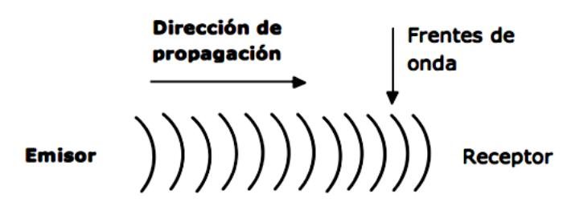

Como se dijo en el apartado anterior una onda se define como una perturbación en el espacio, ya sea material o vacío, transportando energía desde un **emisor hacia un receptor**.

El **emisor** es la fuente que genera una onda. Es el encargado de "producir" o enviar la energía que luego se propaga a través del vacío.

Dirección de propagación

El **receptor** es quien recibe la onda y transforma esa energía en algo que puede ser interpretado o utilizado.

El emisor y receptor son quienes definen la dirección de propagación de una onda.

Vale decir que, en estricto rigor, no todas las perturbaciones que se propagan en el espacio se pueden considerar ondas, solo serán ondas aquellas perturbaciones que cumplan con la ecuación de la onda.

En este capítulo profundizaremos en las características y comportamiento de ondas que son **periódicas**, es decir, cuya oscilación es **constante y regular en el tiempo**. Para poder estudiar esta onda es necesario poder modelarla, lo que significa representarla de una manera clara y sencilla lo que nos permitirá poder entenderla, predecir su comportamiento y resolver problemas relacionados con ella. Existen diversas formas de modelar ondas a través de gráficos o relaciones matemáticas, algunas de las cuales describiremos a continuación:

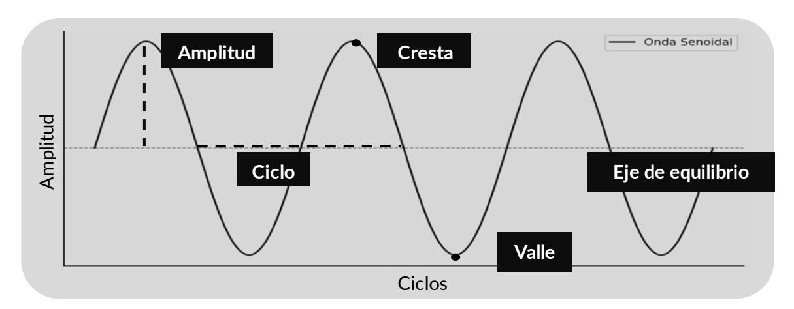

Un **ciclo** es una **oscilación completa** de una onda, es decir, el recorrido que hace la onda desde un punto de equilibrio hasta un punto máximo (cresta), baja hasta el punto mínimo (valle) y regresa de nuevo al punto de equilibrio.

El **eje de equilibrio** es la línea horizontal que representa el punto de reposo o posición media de la onda. Es el nivel donde no hay perturbación; es decir, la posición en la que las partículas del medio estarían si no hubiera una onda. Cuando una onda cruza el eje de equilibrio, significa que la perturbación es nula en ese punto.

La **cresta** es el **punto más alto de una onda**. Es la parte superior de la onda y representa el máximo desplazamiento hacia arriba desde el eje de equilibrio.

El **valle** es el **punto más bajo de una onda**. Es la parte inferior de la onda y representa el máximo desplazamiento hacia abajo desde el eje de equilibrio.

La **amplitud** es la **desviación máxima que alcanza una onda desde el eje de equilibrio**, tanto hacia arriba (hacia la cresta) como hacia abajo (hacia el valle). La amplitud indica cuánta energía transporta la onda: una mayor amplitud significa una onda con más energía.

Ya con estos conceptos claros, podemos analizar dos tipos de gráficos de ondas periódicas que entregan información fundamental de esta, el perfil o gráfico temporal y el perfil o gráfico espacial

#### • **Gráfico de amplitud en función del tiempo o perfil temporal**

De este tipo de gráficos podemos obtener datos específicos como lo son la amplitud, el periodo y la frecuencia de la onda, para esto es necesario comprender las definiciones de estos:

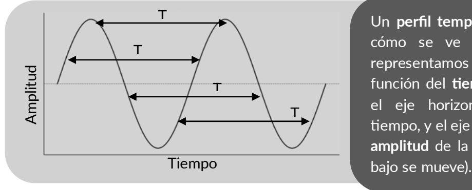

Un **perfil temporal** de una onda es cómo se ve la onda cuando la representamos en un gráfico en función del **tiempo**. En este gráfico, el eje horizontal (x) muestra el tiempo, y el eje vertical (y) muestra la **amplitud** de la onda (qué tan alto o El **periodo** se define como **el tiempo que demora el objeto en completar un ciclo**. Su unidad de medida en el SI es el segundo (s). En un gráfico de tiempo definir el periodo de una onda como la extensión horizontal de un ciclo. Se define con la fórmula:

$$T = \frac{\text{tiempo}}{\text{ciclos}}$$

La **frecuencia** por otra parte se define como la **cantidad de eventos o ciclos que ocurren en una unidad de tiempo** para cualquier evento periódico o cíclico. Su unidad de medida en el SI es el hertz (Hz) que equivale al inverso del segundo (s-1 ). Matemáticamente se expresa como:

$$f = \frac{\text{ciclos}}{\text{tiempo}}$$

Al comparar ambas expresiones es posible notar que son magnitudes recíprocas o inversos multiplicativos, es decir;

$$f = \frac{1}{T}, T = \frac{1}{f}$$

La relación entre período y frecuencia al ser una relación inversamente proporcional, gráficamente, se comporta como una hipérbola.

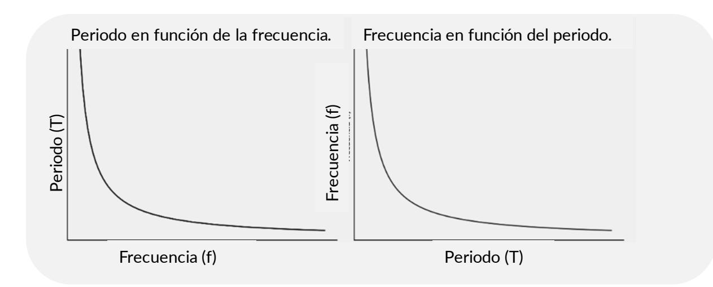

**Ejercicio:** Un péndulo completa 25 ciclos en 10 s. ¿Cuál es su período de oscilación?

Usando la relación anterior tenemos:

$$T = \frac{\text{tiempo}}{\text{ciclos}} = \frac{10}{25} = 0.4 \text{ s}$$

Esto quiere decir que la onda completa un ciclo en 0,4 s.

### • **Gráfico de amplitud en función de la distancia o perfil espacial**

De este tipo de gráficos podemos obtener datos específicos como lo son la amplitud y la longitud de la onda, ya que la amplitud la definimos con anterioridad es necesario comprender las definiciones de puntos en fase u homólogos y longitud de onda:

El **perfil espacial** de una onda es cómo se ve la onda cuando la representamos en un gráfico en función de la **posición** en el espacio. En este gráfico, el eje horizontal (x) muestra la **posición** (por ejemplo, la distancia a lo largo de una cuerda o en un medio) y el eje vertical (y) muestra la **amplitud** de la onda.

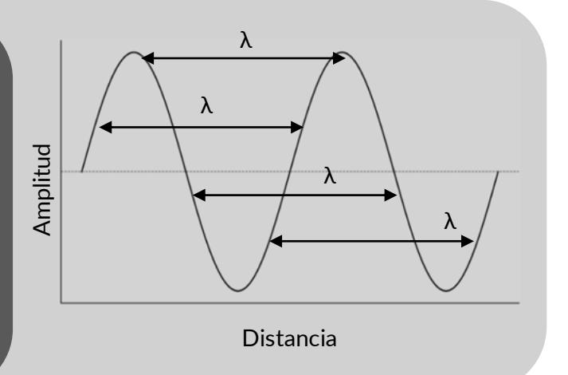

**Dos puntos están en fase** (también conocidos como **puntos homólogos**) cuando tienen el mismo estado de oscilación en un mismo instante. Esto significa que ambos puntos alcanzan sus valores máximos, mínimos o pasan por el eje de equilibrio al mismo tiempo y en la misma dirección. En una onda, los puntos en fase están separados por un múltiplo entero de la longitud de onda (λ). Dos puntos en fase están a igual distancia del eje de equilibrio, con el mismo sentido y dirección, pero en dos ciclos consecutivos.

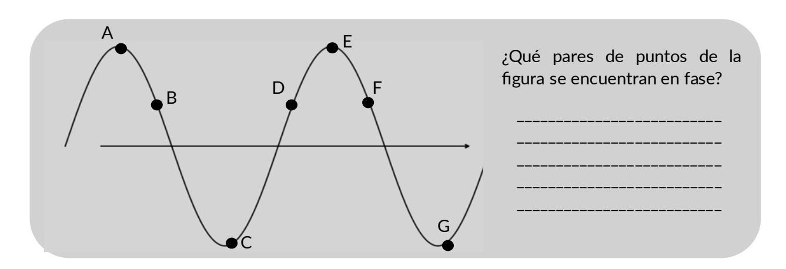

Se define **longitud de una onda** (λ) como la distancia contenida en un ciclo. Notemos que, según el punto inicial desde el cual se comience a contabilizar el ciclo, distinta será la forma de una longitud de onda. Por ejemplo, se puede definir una longitud de onda como la distancia entre dos crestas, o bien, la distancia entre dos valles. Por lo tanto, podremos definirla de forma general que la longitud de onda en la distancia entre **dos puntos en fase**, consecutivos.

**Ejercicio:** ¿Cuál es la longitud de la onda que se representa en la siguiente figura?

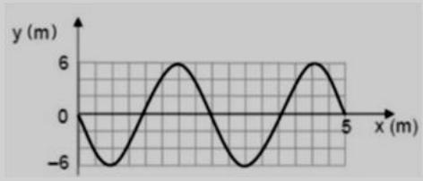

**Solución:** Para medir la longitud de onda λ se debe medir, en forma paralela al eje X, la distancia entre dos puntos característicos que sean homólogos. Se puede apreciar que en el gráfico están representados un par de "montes" y un par de "valles" de la onda, lo que significa que hay 2 longitudes de ondas completas entre el 0 y el 5. Al dividir por 2 la distancia de 5 m se obtiene la longitud de onda:

$$\lambda = \frac{5}{2} \text{ m} = 2.5 \text{ m}$$

**Ejercicio:** ¿Cuál es la frecuencia de la onda que se representa en la siguiente figura?

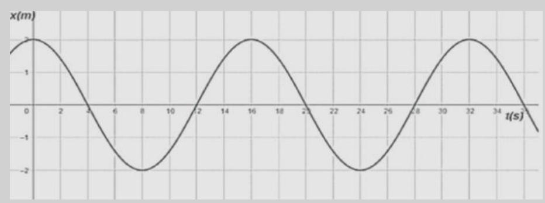

**Solución:** El gráfico representa la desviación X en función del tiempo t con respecto a un origen de referencia cero. El período de una onda se define como el tiempo que requiere una onda en completar una oscilación completa. En términos de distancia una onda completa una oscilación en una distancia que es igual a su longitud de onda. Por lo tanto, si medimos sobre el eje de las abscisas dos instantes de tiempo que describen una longitud de onda, podremos medir directamente el período de la onda.

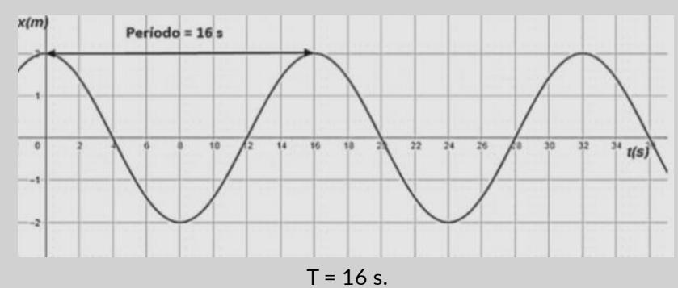

Ahora, para determinar la frecuencia de la onda se puede utilizar la expresión que relaciona a la frecuencia y el período de una onda:

$$f = \frac{1}{T}$$
 
$$f = \frac{1}{16} \text{ Hz} = 0,0625 \text{ Hz}.$$

Una vez que se relacionan magnitudes de tiempo y de espacio, es posible identificar una nueva variable que llamaremos **rapidez de propagación**.

De la misma manera que podemos cuantificar la rapidez de un cuerpo en movimiento, con las ondas pasa lo mismo. Si bien también podemos determinar la velocidad, **consideraremos que las ondas viajan en línea recta y, en general, de izquierda a derecha**, por lo tanto, es usual calcular simplemente la rapidez. En este caso, la caracterización que hacemos de la rapidez es relativa al medio en el que viaja. Para esto consideramos que la energía que transporta la onda viaja una determinada distancia, de modo que podemos usar la misma expresión de la cinemática:

Una onda que se propaga en el espacio lo hace con **rapidez determinada por las características de ese medio** en el que viaja. En general, diremos que la **rapidez de una onda es constante,** lo que trae como supuesto que el medio en el que viaja es homogéneo.

$$v = \frac{\Delta d}{\Delta t} = \frac{distancia}{tiempo}$$

Ahora bien, usando la idea de ciclo, como la distancia de un ciclo corresponde a la longitud de onda (λ) y el período (T), al tiempo en que se completa un ciclo, podemos expresar la rapidez en función de esos datos. Del mismo modo, y como la frecuencia es el inverso del período, también es posible expresar la rapidez en términos de (λ) y (*f*):

$$v = \frac{\lambda}{T}; v = f \cdot \lambda$$

**Ejercicio:** Una persona agita verticalmente con su mano un resorte con una frecuencia de 5 Hz como se aprecia en la figura adjunta.

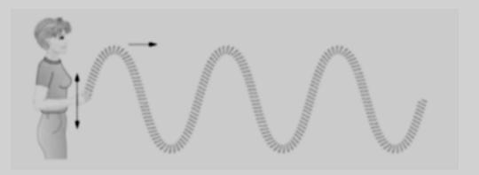

La distancia horizontal entre la mano de la persona y el extremo derecho del resorte es de 3 m. ¿Cuál es la rapidez de la onda generada con el resorte?

**Solución:** para calcular la rapidez de la onda utilizaremos la expresión que relaciona a las tres variables conocidas.

$$v = f \cdot \lambda$$

Podemos apreciar que la onda completa describe 3 longitudes de onda completas y lo hace en una distancia de 3 m, por lo tanto, la longitud de onda es de 1 metro. Por otro lado, como la frecuencia es de 5 Hz aplicamos la fórmula para calcular la rapidez de la onda:

$$v = 5 \text{ Hz} \cdot 1 \text{ m} = 5 \frac{\text{m}}{\text{s}}$$

### **1.3 Clasificación de las ondas**

Existen varias maneras de clasificar las ondas y las detallamos a continuación.

### • **Según su propagación en el espacio**

Según la extensión del espacio en el que se propagan las ondas pueden ser estacionarias o viajeras. Las **ondas viajeras** son aquellas que se **propagan libremente** por una región del espacio (y típicamente las representamos como sinusoides), mientras que las **ondas estacionarias**, son aquellas que viajan en una **región acotada del espacio**, tal como lo hace la cuerda de una guitarra.

En el caso de las ondas estacionarias, el hecho que existan límites provoca que la onda se superponga generando puntos llamados **nodos, en los cuales no existe vibración**. De la misma manera se producen puntos en los que la **amplitud de la vibración es máxima**, a estos puntos los llamamos **antinodos**.

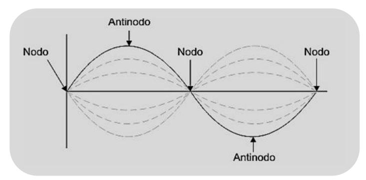

#### • **Según su naturaleza**

Según el medio en el que viajan las ondas se pueden clasificar en mecánicas o electromagnéticas. Las **ondas mecánicas** son aquellas que necesitan de un medio material para propagarse y algunos ejemplos son las olas del mar, las ondas sísmicas que viajan por la tierra y el sonido que viaja por distintos materiales. En cambio, las **ondas electromagnéticas** son aquellas que se pueden propagar tanto en el vacío como en algunos medios materiales. Una particularidad de las ondas electromagnéticas y que les permite viajar en el vacío, es que se forman por la superposición de campos eléctricos y campos magnéticos. Algunos tipos de ondas electromagnética son la luz visible, los rayos X o las microondas.

#### • **Según la dirección de la oscilación**

Para entender esta clasificación, es importante considerar que la dirección de propagación indica hacia dónde se transfiere la energía. Esta está determinada principalmente por el emisor y el receptor de la onda. Por otro lado, la dirección de oscilación corresponde al movimiento del medio como respuesta a la perturbación.

Según su dirección de vibración las ondas se pueden clasificar en longitudinales o transversales. Las **ondas transversales** son aquellas en que **la dirección de propagación es perpendicular a la dirección de la vibración**, como por ejemplo la cuerda que se representa la figura.

Mientras la onda avanza hacia la derecha, una de las partículas representada en el punto negro de la figura, sube y baja sobre la línea punteada.

Preuniversitario UC © Pontificia Universidad Católica de Chile

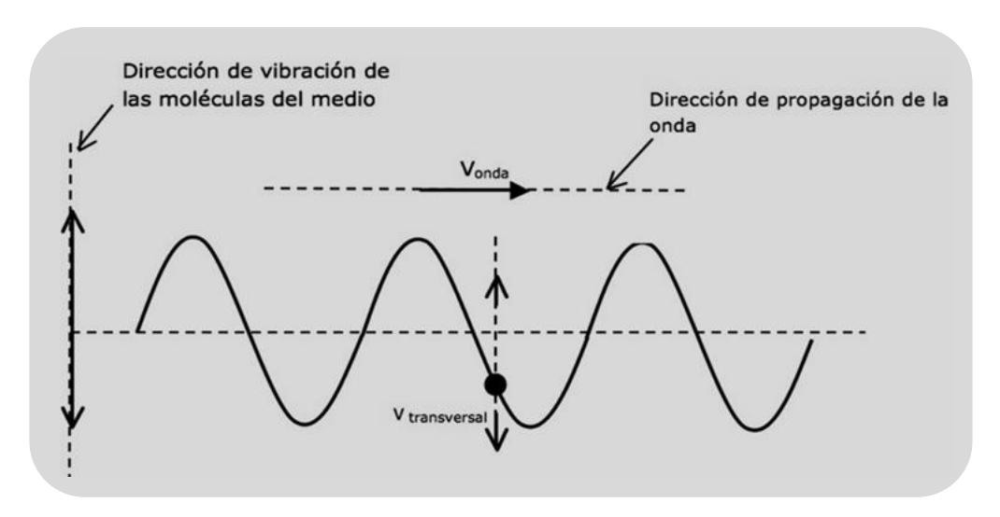

Por su parte, las **ondas longitudinales** son aquellas cuya **dirección de propagación es paralela a la dirección de vibración**, tal como se representa en la siguiente figura:

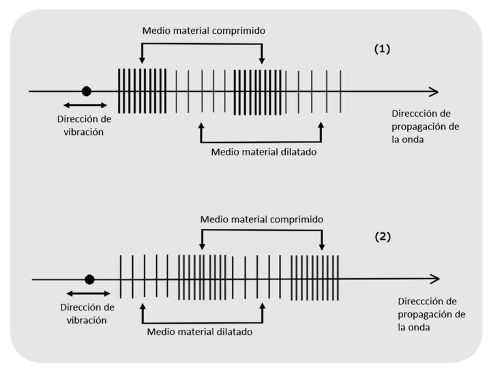

Es importante señalar que las categorías anteriores son complementarias entre sí. El **sonido**, por ejemplo, es una onda mecánica y longitudinal, mientras que la **luz** es una onda electromagnética y transversal.

En el siguiente apartado se abordarán en detalle las ondas electromagnéticas y sus principales características. Este análisis se realiza considerando la relevancia de este contenido dentro del temario oficial del DEMRE.

# **1.4 Ejercicios propuestos**

- 1. Durante una noche de invierno con una tormenta eléctrica, un alumno observa un relámpago, y después de 8 s, escucha el ruido del trueno correspondiente. Considerando que la velocidad del sonido es 340 m/s. ¿A qué distancia se produjo la descarga eléctrica que provocó el relámpago y el trueno?
- A) 2,72 m
- B) 42,5 m
- C) 272 m
- D) 2720 m
- 2. La figura muestra el punto P de una cuerda sobre la que se desplaza una onda hacia la derecha. ¿Cuál es la dirección y sentido del movimiento del punto P?

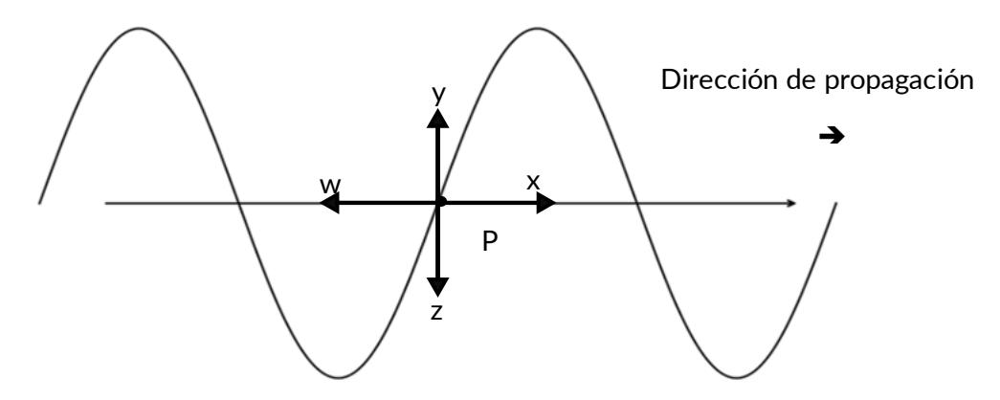

- A) X
- B) Y
- C) Z
- D) W
- 3. Un péndulo X efectúa 10 oscilaciones en 20 segundos. Un péndulo Y efectúa 14 oscilaciones en 7 segundos y un péndulo Z efectúa 12 oscilaciones en 3 segundos. Al ordenarlos crecientemente según sus frecuencias resulta:
- A) X Y Z
- B) Y X Z
- C) Z X Y
- D) Z Y X

| A | C | D |
|---|---|---|
| 3 | 2 | 1 |

#### **Completa el mapa conceptual (CLASE 1)**

#### **En este espacio puedes tomar notas durante la clase:**

# **TEMA 2. LUZ Y ONDAS ELECTROMAGNÉTICAS**

#### **2.1 Naturaleza de la luz**

¿Qué es la luz? posiblemente lo primero que viene a tu cabeza es una onda, pero en la actualidad, sabemos que la luz tiene una **naturaleza dual onda-partícula**, lo que significa que puede comportarse tanto como una onda como una partícula, dependiendo de las condiciones y la forma en que interactúa con la materia. En su forma ondulatoria, la luz es una **onda electromagnética**, es decir, corresponde a la propagación de una oscilación o perturbación en los campos eléctricos y magnéticos que varían en el tiempo. Además, la dirección de propagación de esta onda es perpendicular al plano formado por dichos campos, lo que la clasifica como una **onda transversal**.

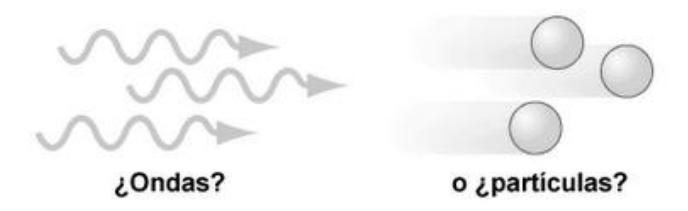

En su forma corpuscular, la luz se describe como un conjunto de partículas llamadas **fotones**, que son entidades sin masa ni carga eléctrica, capaces de transportar energía en cantidades discretas.

Este conocimiento sobre la naturaleza dual de la luz tomó varios siglos de investigación científica y fueron los **distintos fenómenos ondulatorios**, junto con otras experiencias, los que finalmente **mostraron evidencias** suficientes para la **construcción de este modelo**. A continuación, te contamos una breve síntesis de este pasaje de la física:

Algunos de los científicos más importantes en el debate sobre la naturaleza de la luz fueron **Isaac Newton**, quien defendía el modelo corpuscular, y **Christiaan Huygens**, quien apoyaba el modelo ondulatorio. Entre las evidencias a favor del modelo corpuscular se encontraban **la formación de sombras y la reflexión de la luz**, mientras que el modelo ondulatorio explicaba muy bien fenómenos como **la reflexión y la refracción**.

En este contexto, el experimento de la doble rendija realizado por **Thomas Young en 1803** demostró que la luz generaba **patrones de interferencia,** lo que proporcionaba un fuerte respaldo al modelo ondulatorio. Posteriormente, James Clerk Maxwell (1865) desarrolló una teoría que describía la luz como una onda electromagnética, es decir, una perturbación conjunta de campos eléctricos y magnéticos que se propaga en el espacio. Este modelo fue confirmado experimentalmente por Heinrich Hertz en 1887.

 El experimento de la doble rendija, realizado por Thomas Young en 1803, fue crucial para demostrar el comportamiento ondulatorio de la luz. En este experimento, un haz de luz se hace pasar a través de una lámina con dos rendijas muy estrechas y cercanas entre sí. Al llegar a una pantalla detrás de las rendijas, en lugar de observar solo dos franjas de luz correspondientes a las rendijas, se forma un patrón de franjas claras y oscuras, conocido como **patrón de interferencia**.

Este fenómeno ocurre porque la luz, al pasar por las rendijas, se comporta como una onda. Las ondas provenientes de las dos rendijas se superponen: en ciertos puntos se suman, formando franjas brillantes (interferencia constructiva), y en otros se cancelan, formando franjas oscuras (interferencia destructiva).

Este resultado no puede explicarse bajo un modelo puramente corpuscular de la luz, por lo que el experimento de Young se considera una de las evidencias más importantes del carácter ondulatorio de las ondas electromagnéticas.

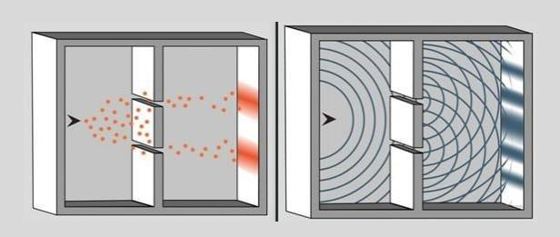

Más tarde, en 1905, Albert Einstein, basándose en las ideas de Max Planck, propuso un modelo matemático que explicaba el **efecto fotoeléctrico** observado previamente por Hertz. Einstein demostró que la luz podía comportarse como pequeñas partículas llamadas fotones, que son paquetes de energía sin masa que interactúan con la materia de forma discreta.

El **efecto fotoeléctrico** es un fenómeno en el que la luz, al incidir sobre la superficie de ciertos materiales, provoca la emisión de electrones. Fue observado por primera vez por Heinrich Hertz en 1887 y explicado teóricamente por Albert Einstein en 1905, partiendo de las ideas de Max Planck sobre la cuantización de la energía.

En este fenómeno, los electrones son liberados solo si la frecuencia de la luz incidente supera un valor mínimo, conocido como la **frecuencia umbral**, que depende del material. Esto no podía explicarse mediante la teoría clásica ondulatoria de la luz, que predecía que la energía transferida a los electrones dependía únicamente de la intensidad de la luz, sin importar su frecuencia.

Einstein propuso que la luz está compuesta por partículas llamadas **fotones**, y que cada fotón tiene una energía proporcional a su frecuencia. Si un fotón tiene suficiente energía, esta se transfiere al electrón, permitiéndole escapar de la superficie. Si la energía del fotón es menor que la función trabajo, no se emiten electrones, independientemente de la intensidad de la luz.

El efecto fotoeléctrico no solo confirma la existencia de los fotones, sino que también proporcionó evidencia clave para el desarrollo de la teoría cuántica, al demostrar el carácter corpuscular de la luz.

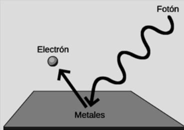

Este conjunto de trabajos aportó la evidencia necesaria para concluir que la luz tiene una naturaleza dual, comportándose tanto como onda como partícula según las circunstancias. Este concepto, conocido como dualidad onda-partícula, es fundamental en la comprensión moderna de la luz.

Respecto a la propagación de la luz, se sabe que es capaz de viajar en el vacío, pero también en algunos medios materiales que se consideran transparentes o semitransparentes, tales como en el agua, aire, vidrios, cristales y prismas. La rapidez de propagación de la luz en el vacío se denota con la letra c y tienen un valor 299 792 458 m/s, pero por simplicidad usamos:

c *=* 300 000 000 m/s

Una **invariante universal** es una magnitud que permanece constante e inalterada para todos los observadores, independientemente de su estado de movimiento o del sistema de referencia utilizado. En el caso de la **velocidad de la luz en el vacío**, esta constituye una constante universal fundamental, pues su valor es el mismo para cualquier observador, sin importar su velocidad relativa al origen de la luz. Este principio es central en la teoría de la relatividad especial de Einstein.

Además, aunque no es siempre cierto, diremos que la luz viaja en línea recta (esto es correcto al menos para distancias que recorremos los humanos), por lo tanto, **hablaremos de rayos de luz** y los representaremos por **un segmento rectilíneo orientado según el sentido de la propagación** de la luz. La linterna de la figura cambia de orientación, por lo tanto, cambia la dirección del rayo.

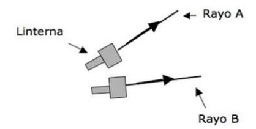

**Ejercicio:** Si se sabe que la distancia promedio aproximada entre la Tierra y el Sol es de 1,5∙108 km, ¿cuánto demora la luz del Sol en llegar a la Tierra?

**Solución:** Considerando que la luz viaja en línea recta, usamos la expresión para la rapidez. Convirtiendo además las unidades para que todo esté expresado en kilómetros y segundos nos queda:

$$v = \frac{\Delta x}{\Delta t} \to c = 3 \cdot 10^5 \, \frac{km}{s} = \frac{1.5 \cdot 10^8 \, km}{\Delta t} \to \Delta t = \frac{1.5 \cdot 10^8 \, km}{3 \cdot 10^5 \, \frac{km}{s}} = 500 \, s$$

La luz demora aproximadamente t = 500 segundos en viajar del Sol a la Tierra, lo que equivalente a un poco más de 8 minutos. De ahí que se diga que el Sol se encuentra 8 minutos-luz de la Tierra, donde minutos-luz es una unidad de distancia.

### **2.2 Ondas electromagnéticas**

Una onda electromagnética es un tipo de onda que no necesita un medio para propagarse, es decir, puede viajar tanto por el aire como por el vacío (como el espacio exterior). Está formado por dos campos: uno eléctrico y otro magnético, que oscilan en direcciones perpendiculares entre sí ya la dirección en que se mueve la onda.

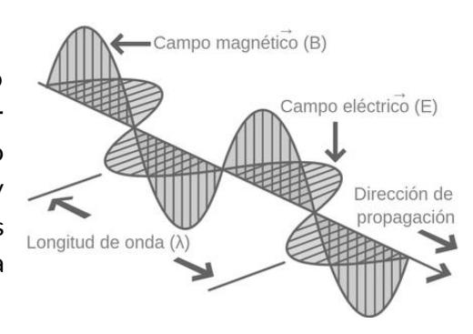

Las ondas electromagnéticas se pueden clasificar en dos grandes categorías: **radiación luminosa** (luz visible) y **radiación invisible** (aquella que no es percibida por el ojo humano). La principal propiedad que marca la diferencia entre estas dos categorías su frecuencia.

Sin embargo, recordemos que la velocidad de las ondas solo depende del medio en el que viajan y en el caso de la luz esto se puede expresar matemáticamente como c= λ ∙ *f*. Esta ecuación nos muestra que, en un mismo medio, **la longitud de onda λ es inversamente proporcional a la frecuencia** *f*.

Al ordenar los diferentes tipos de ondas electromagnéticas según los rangos de longitud de onda obtenemos lo que se denomina el espectro electromagnético según λ, y al ordenarlas según rangos de frecuencia obtenemos el espectro electromagnético según frecuencias.

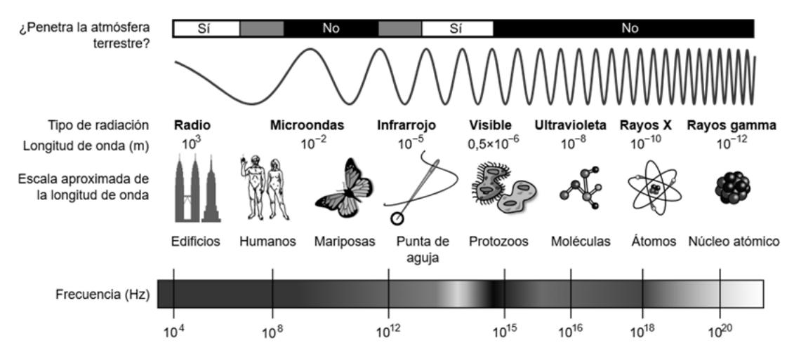

Como referencia tenemos que la zona visible para el ojo humano se extiende, en longitud de onda, entre la **luz infrarroja** y la **luz ultravioleta**, tomando valores entre los 380 nm y 780 nm aproximadamente. Notemos que cada valor de la frecuencia en el espectro visible, o bien cada valor de la longitud de onda, en términos de percepción lumínica, representará un color distinto.

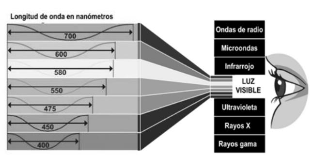

En cuanto a **la energía** que transporta una onda electromagnética, esta es **directamente proporcional a su frecuencia**, por lo tanto, los rayos gamma son los más energéticos del espectro, mientras que las ondas de radio los menos energéticos.

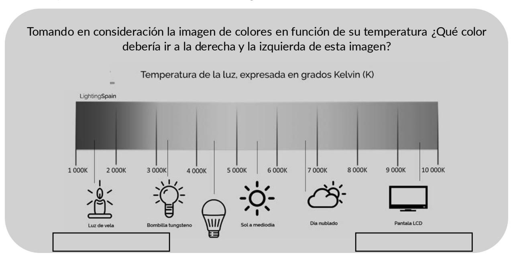

 Una forma sencilla de diferenciar las ondas electromagnéticas según su frecuencia y energía es observando su interacción con el entorno y sus aplicaciones prácticas. Las ondas con frecuencias mayores al ultravioleta, como los rayos X y los rayos gamma, poseen un alto nivel de energía asociado, lo que las hace potencialmente dañinas para el ser humano. Por este motivo, su uso está restringido a contextos específicos, como la medicina o la investigación científica, y no forman parte de la vida cotidiana.

En cambio, las ondas con frecuencias menores al infrarrojo, como las ondas de radio y las microondas, tienen una longitud de onda mayor y una energía significativamente menor, lo que las convierte en opciones ideales para aplicaciones cotidianas. Estos incluyen telecomunicaciones, electrodomésticos y tecnologías inalámbricas, donde su bajo nivel de energía no representa un riesgo para la salud y permiten una amplia versatilidad.

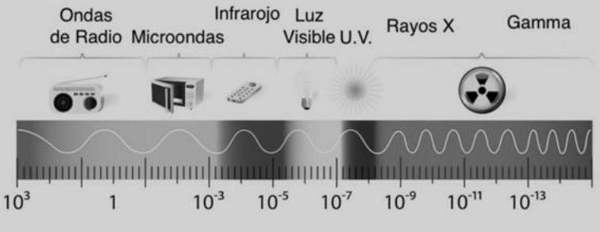

Es importante señalar que muchas fuentes de luz, como el Sol, emiten **luz blanca**, que no es más que la **superposición de ondas de diferentes colores** (y por tanto diferentes frecuencias).

#### **2.3Medios en los que se propagan.**

Una de las características principales de las ondas electromagnéticas es que son capaces de transmitirse en el vacío, pero cuando se trata de medios materiales hay diversos factores tanto del medio como de la misma onda que influyen en su propagación.

#### **1. Frecuencia o energía de la onda**

- **Frecuencia alta (energía alta)**: Ondas como los rayos X y los rayos gamma tienen alta energía, lo que les permite atravesar materiales densos, como tejidos humanos o incluso metales delgados. Sin embargo, su capacidad para penetrar disminuye en materiales más densos, como el plomo.
- **Frecuencia visible**: Para la luz visible la transmisión se da principalmente por las características del material que pueden clasificar en tres grandes grupos:

| Material        | Transparentes                                                                                                                                      | Translúcidos                                                                                                                                                               | Opacos                                                                                                                                  |
|-----------------|----------------------------------------------------------------------------------------------------------------------------------------------------|----------------------------------------------------------------------------------------------------------------------------------------------------------------------------|-----------------------------------------------------------------------------------------------------------------------------------------|
| Definición      | Son aquellos que permiten el paso de la luz visible de manera casi completa, lo que permite ver claramente a través de ellos. | Son materiales que permiten el paso de la luz visible, pero la dispersan al atravesarlos, lo que impide ver con claridad los objetos detrás de ellos. | Son aquellos que no permiten el paso de la luz visible, ya que la absorben o reflejan completamente.                  |
| Características | Transmiten la mayor parte de la luz sin desviarla significativamente.                                                                        | Parte de la luz se transmite, pero su trayectoria se desvía o dispersa.                                                                | Bloquean completamente la transmisión de luz visible, dejando sombras claras o bloqueando la visibilidad. |
| Ejemplos:       | Vidrio, agua pura, plásticos como el acrílico, y cristales ópticos.                                                                          | Vidrios esmerilados, papel vegetal, y ciertos tipos de plásticos como los utilizados en lámparas decorativas.                                      | Madera, metal, cartón grueso, y piedra.                                                                                        |

• **Frecuencia baja (energía baja)**: Ondas como las de radio o microondas tienen menor energía, lo que las hace menos aptas para atravesar materiales densos. Sin embargo, son ideales para propagarse en medios menos densos, como el aire, y pueden atravesar grandes obstáculos como edificios.

### **2. Propiedades del medio**

- **Densidad**: Los medios más densos tienden a bloquear ondas de menor energía, como la luz visible. Por ejemplo, el metal es opaco a la luz visible, pero puede ser parcialmente atravesado por rayos X o rayos gamma.
- **Composición química**: Algunos materiales absorben ciertas frecuencias de ondas debido a su estructura atómica. Por ejemplo, el vidrio es transparente a la luz visible, pero bloquea la mayor parte de las ondas ultravioleta.
- **Conductividad eléctrica**: Los materiales conductores, como los metales, reflejan la mayoría de las ondas electromagnéticas debido a la interacción de los campos eléctricos y magnéticos con sus electrones libres.

### **3. Longitud de onda**

- Las ondas de mayor longitud de onda (como las ondas de radio) pueden atravesar objetos grandes y dispersarse menos, lo que les permite propagarse exitosamente a través de edificios, montañas y la atmósfera.
- Las ondas de menor longitud de onda (como los rayos gamma) tienen una mayor capacidad para interactuar con partículas pequeñas y penetrar materiales densos.

En resumen, la capacidad de propagación de las ondas electromagnéticas depende de la relación entre su energía, frecuencia y longitud de onda, junto con las propiedades físicas y químicas del medio. Este equilibrio determina si las ondas son reflejadas, absorbidas o transmitidas al interactuar con distintos materiales.

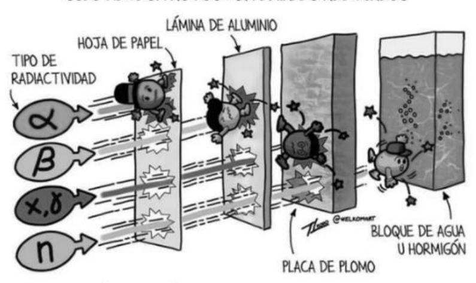

#### **2.4 Ejercicios propuestos**

- 1. Newton explicó la naturaleza de la luz como si esta fuera:
  - A) Una onda mecánica.
  - B) Una onda eléctrica.
  - C) Una onda electromagnética.
  - D) Una onda electromecánica.
  - E) Un grupo de partículas luminosas que se propaga en línea recta.
- 2. Una onda electromagnética viajando por un medio A demora un tiempo t en recorrer una distancia d. Posteriormente, pasa a otro medio B donde demora un tiempo 2t en recorrer una distancia 3d. Por lo tanto, al cambiar de medio es correcto aseverar que la onda:
  - A) aumentó su rapidez, mantuvo la longitud de onda y la frecuencia.
  - B) aumentó su rapidez y su longitud de onda, mantuvo su frecuencia.
  - C) disminuyó su rapidez, mantuvo su frecuencia y aumentó su longitud de onda.
  - D) disminuyó su rapidez, disminuyó su frecuencia y aumentó su longitud de onda
- 3. El espectro electromagnético se ordena crecientemente según frecuencia, de izquierda a derecha, según se muestra a continuación:

Por otra parte, se tienen las siguientes figuras que muestran el perfil espacial de tres ondas electromagnéticas P, Q y R que se propagan por el vacío.

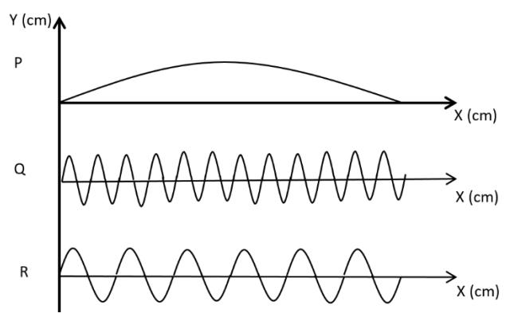

Suponiendo que los perfiles mostrados se completan en un mismo intervalo de tiempo, ¿qué opción podría representar a cada una de ellas?

|    | Onda P      | Onda Q       | Onda R      |
|----|-------------|--------------|-------------|
| A) | De radio    | Rayos X      | Luz visible |
| B) | Luz visible | Microondas   | Rayos X     |
| C) | Rayos X     | Ultravioleta | Infrarrojo  |
| D) | De radio    | Luz visible  | Rayos X     |
| E) | Microondas  | De radio     | Rayos gama  |

4. En el espectro electromagnético es posible ordenar la luz visible según los colores, ya que cada uno de estos posee un rango de frecuencia determinado.

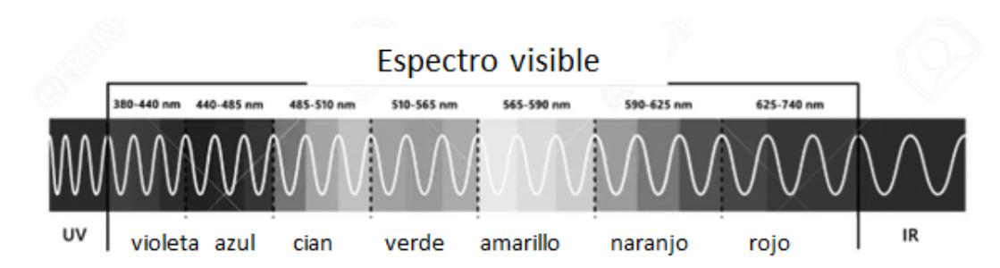

El siguiente gráfico obtenido en un laboratorio compara la relación entre velocidad de propagación en función de longitud de onda al pasar por medios de distintas densidades, de tres láseres de distinto color. Este proceso con la finalidad de identificar la frecuencia, a través de la pendiente para cada uno de los laser utilizados.

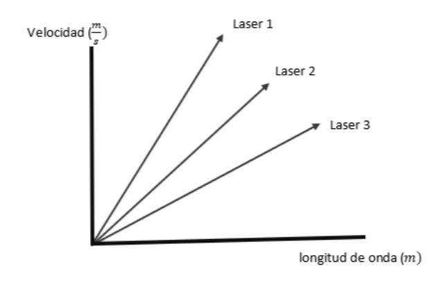

Tomando en consideración los gráficos obtenidos y la relación que existe entre la frecuencia de la onda y el color expresado, ¿cuál sería una relación correcta sobre los colores de los láseres utilizados en el laboratorio?

|    | Laser 1  | Laser 2  | Laser 3 |
|----|----------|----------|---------|
| A. | Amarillo | Verde    | Rojo    |
| B. | Violeta  | Naranja  | Azul    |
| C. | Rojo     | Amarillo | Verde   |
| D. | Violeta  | Verde    | Rojo    |

| D | A | B | E |
|---|---|---|---|
| 4 | 3 | 2 | 1 |

#### **Completa el mapa conceptual (Clase 2)**

#### **En este espacio puedes tomar notas durante la clase:**

# **TEMA 3. FENÓMENOS ONDULATORIOS**

Un fenómeno ondulatorio es cualquier proceso o evento relacionado con la propagación de una onda a través de un medio o del vacío y surgen de la interacción de las ondas con su entorno o consigo mismas, permitiendo estudiar el comportamiento y las propiedades de estas.

El estudio de los fenómenos ondulatorios nos proporciona un marco conceptual para entender cómo la energía se transmite en el mundo natural y cómo aprovechar este conocimiento en áreas tan diversas como la comunicación, la medicina y la astronomía.

A continuación, se detallarán los diversos fenómenos ondulatorios enfocado a las ondas electromagnéticas.

## **3.1 Transmisión**

La transmisión de ondas es un fenómeno ondulatorio que se refiere al proceso mediante el cual una onda se propaga a través de un medio (material o vacío), transportando energía desde un punto de origen (emisor) hacia otro (receptor) sin un desplazamiento permanente de la materia. Este proceso depende de las propiedades del medio, como su densidad y elasticidad, y de las características propias de la onda, como su frecuencia y longitud de onda.

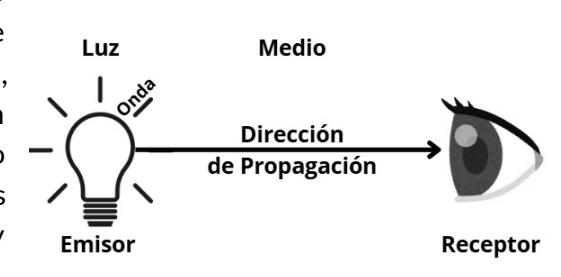

En el caso de las ondas electromagnéticas, la transmisión no requiere un medio material, ya que estas se propagan en el vacío como oscilaciones de campos eléctricos y magnéticos que se generan mutuamente mientras viajan. Este comportamiento es esencial en aplicaciones como las telecomunicaciones, donde las señales electromagnéticas se transmiten mediante cables, fibras ópticas o el aire, y en la astronomía, al transportar información desde el universo hacia la Tierra.

## **3.2 Absorción**

La absorción de ondas es el proceso mediante el cual un medio material retiene parte o toda la energía de una onda que lo atraviesa, transformándola en otras formas de energía, como calor. Este fenómeno depende de las propiedades del medio y de las características de la onda, como su frecuencia, y determina la disminución de la amplitud de la onda durante su propagación.

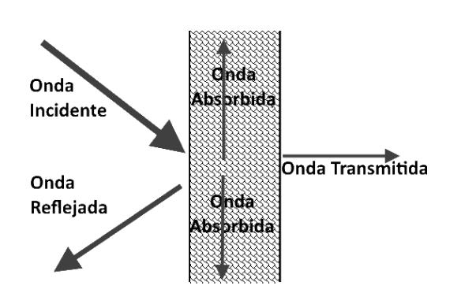

En las ondas electromagnéticas, la absorción ocurre cuando el material interactúa con los campos eléctricos y magnéticos de la onda, convirtiendo su energía en calor o excitando los átomos y moléculas del medio. Este fenómeno varía según la frecuencia de la onda y las propiedades del material: por ejemplo, ondas de alta frecuencia como los rayos X son absorbidas más intensamente por tejidos densos, mientras que ondas de baja frecuencia como las de radio atraviesan fácilmente la mayoría de los materiales. La absorción es clave en tecnologías como los filtros de luz, la protección contra radiaciones y la generación de calor en microondas.

## **3.3 Reflexión**

La reflexión de ondas es el fenómeno mediante el cual una onda cambia de dirección al encontrarse con una superficie que no puede atravesar, regresando al medio del que provenía. Este proceso está determinado por el ángulo de incidencia de la onda y las propiedades de la superficie, cumpliendo la **ley de reflexión**, que establece que el ángulo de incidencia es igual al ángulo de reflexión.

La ley de reflexión establece que el ángulo que forma el rayo incidente sobre un punto de una superficie (punto de incidencia) con la línea normal a la superficie que pasa por dicho punto, mide lo mismo que el ángulo que forma el rayo reflejado con dicha normal. Además, ambos ángulos pertenecen a un mismo plano, es decir son coplanarios. La figura de la derecha esquematiza la ley

de reflexión.

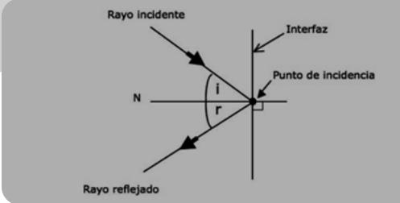

En el caso de las ondas electromagnéticas, la reflexión ocurre cuando estas interactúan con superficies que no permiten su paso, como espejos, metales u otros materiales con propiedades reflectantes. Dependiendo de las características de la interfaz o del material, se pueden distinguir tres tipos principales de reflexión:

| Reflexión especular                                                                                                                                                                                                                                                                                 | Reflexión difusa                                                                                                                                         |  |
|-----------------------------------------------------------------------------------------------------------------------------------------------------------------------------------------------------------------------------------------------------------------------------------------------------|----------------------------------------------------------------------------------------------------------------------------------------------------------|--|
| Ocurre en superficies lisas y pulidas, como los espejos, donde las ondas reflejadas mantienen un patrón ordenado. Este tipo de reflexión es fundamental para la formación de imágenes, un tema que se abordará en detalle en el capítulo de formación de imágenes. | Se da en superficies rugosas o irregulares, donde las ondas reflejadas se dispersan en diferentes direcciones de forma desordenada. |  |
|                                                                                                                                                                                                                                                                                                     |                                                                                                                                                          |  |

 **Reflexión interna total**: Se produce en ciertos materiales cuando la onda incide desde un medio más denso hacia uno menos denso con un ángulo superior al ángulo crítico, quedando completamente reflejada dentro del medio más denso.

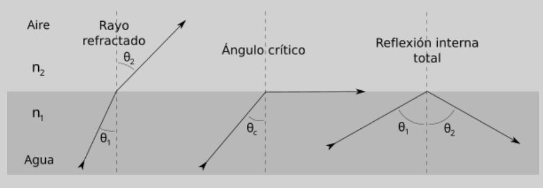

Además, la reflexión varía según la longitud de onda: por ejemplo, las ondas de radio reflejan en la ionosfera, facilitando su transmisión a largas distancias, mientras que la luz visible se refleja en superficies como los espejos, siendo utilizada en aplicaciones ópticas y tecnológicas como el diseño de antenas y dispositivos ópticos. Si porcentualmente la energía reflejada es mucho mayor que la transmitida, diremos que la **superficie es reflectante**, lo que ocurre, por ejemplo, en los espejos. Por el contrario, si la energía transmitida es mucho mayor que la reflejada, entonces la superficie se dice **transparente a la luz**, lo que ocurre en medios como el agua y el vidrio. Así mismo, si la energía reflejada es similar a la transmitida, la superficie se dice **translúcida**, lo que ocurre, por ejemplo, en las cortinas tipo visillos.

#### **3.4 Refracción**

Ya hemos estudiado que cuando una onda cambia el medio en el que se transmite, esta cambia su velocidad y dirección de propagación. En el caso de la luz**, el índice de refracción (n) relaciona la velocidad de la luz en el vacío con la velocidad de la luz en cada medio**, entregando información sobre la densidad de dicho medio. Esta magnitud no tiene unidad de medida, es decir, es adimensional y que matemáticamente se expresa como:

$$n = \frac{c}{v}$$

Notemos que, como c es la máxima velocidad que puede tomar la luz, los valores de n para los distintos medios serán siempre mayores que 1.

| Material       | Índice de refracción |
|----------------|----------------------|
| Vacío          | 1,000                |
| Aire           | 1,003                |
| Agua (a 20º C) | 1,333                |
| Vidrio (común) | 1,450                |
| Glicerina      | 1,473                |
| Benceno        | 1,501                |
| Diamante       | 2,420                |

Además, según la llamada **ley de refracción** o ley de Snell**, si un rayo de luz pasa a un medio con mayor índice de refracción** entonces el rayo refractado **se acerca a la recta normal** (línea imaginaria perpendicular a la superficie), es decir, el ángulo incidente que se forma con la superficie es mayor que el ángulo de refracción. En caso contrario, **si la luz pasa a un medio con menor índice de refracción, se alejará de la recta normal.**

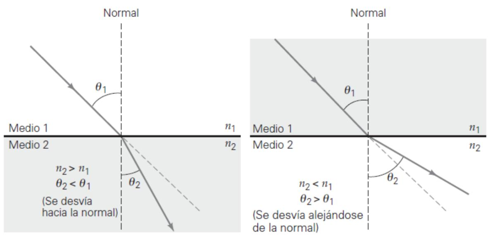

En general, mientras mayor sea el índice de refracción, mayor será la densidad del medio y menor será la velocidad de propagación de la luz.

# **Dispersión cromática de la luz**

Ya vimos que la luz blanca está compuesta por la superposición de todos los colores. Por otra parte, se sabe **que el índice de refracción** de los distintos medios **es ligeramente distinto para cada valor de frecuencia**. Estas dos características de la naturaleza de la luz permiten explicar **el fenómeno de dispersión cromática,** que ocurre cuando un haz de luz blanca se encuentra con un **prisma sólido, generando la descomposición de la luz en distintos colores**. Este fenómeno también ocurre con las gotas de agua capaces de formar, en algunas ocasiones, **un arcoíris**.

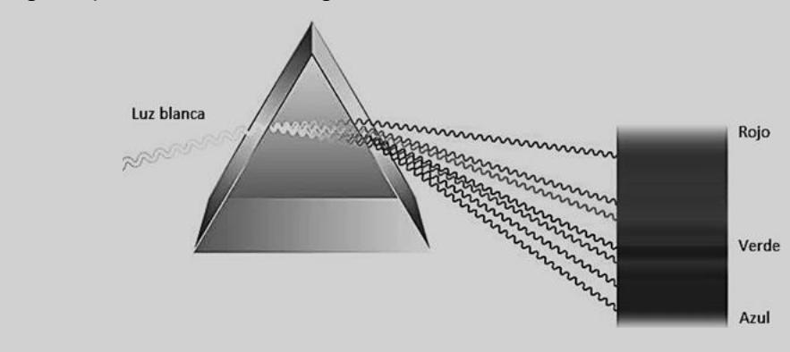

#### **3.5 Difracción**

La difracción de ondas es el fenómeno mediante el cual una onda se desvía o se curva al encontrarse con un obstáculo o pasar a través de una rendija, propagándose incluso hacia regiones que, según la trayectoria rectilínea inicial, deberían estar en sombra. Este fenómeno es más notable cuando la longitud de onda de la onda es comparable al tamaño del obstáculo o la apertura.

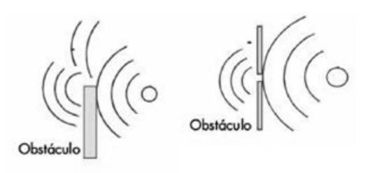

En el caso de las ondas electromagnéticas, la difracción ocurre cuando estas interactúan con bordes, rendijas u objetos que alteran su trayectoria. La magnitud del efecto depende de la relación entre la longitud de onda y el tamaño del obstáculo: por ejemplo, las ondas de radio, con longitudes de onda grandes, se difractan fácilmente alrededor de edificios y montañas, permitiendo que las señales lleguen a áreas sin línea directa de visión.

Dependiendo de las características del obstáculo o la abertura, podemos distinguir diferentes patrones de difracción:

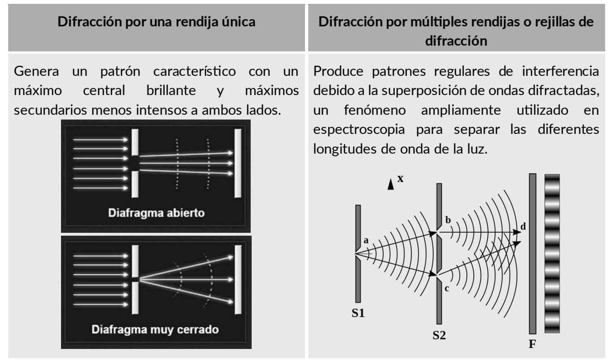

La difracción de la luz visible, aunque menos evidente que en ondas de mayor longitud, es fundamental en fenómenos como los anillos de difracción y la resolución de instrumentos ópticos. Este fenómeno, junto con otros como la **interferencia**, demuestra el carácter ondulatorio de las ondas electromagnéticas y tiene aplicaciones prácticas en tecnologías como las fibras ópticas y el diseño de antenas.

#### **3.6 Interferencia**

La interferencia de ondas es el fenómeno que ocurre cuando dos o más ondas se superponen en un mismo punto del espacio, dando lugar a un patrón resultante que puede amplificar o disminuir la intensidad de la onda según la relación entre sus fases. Este fenómeno puede clasificarse como interferencia constructiva, cuando las ondas se refuerzan mutuamente, o interferencia destructiva, cuando se cancelan parcial o totalmente.

Según las condiciones, se pueden distinguir diferentes escenarios de interferencia:

#### **Interferencia constructiva Interferencia destructiva**

Ocurre cuando las crestas y los valles de las ondas coinciden (es decir, que las ondas se encuentran en fase), resultando en una onda de mayor amplitud. Esto se observa en zonas brillantes de patrones de interferencia.

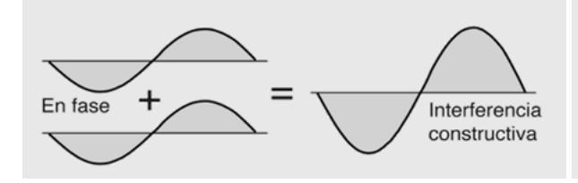

Tiene lugar cuando una cresta de una onda coincide con el valle de otra (es decir, que las ondas están desfasadas), generando una cancelación parcial o total de la amplitud. Esto produce zonas oscuras en los patrones de interferencia.

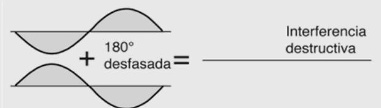

Un ejemplo clásico de interferencia en ondas electromagnéticas es el experimento de la doble rendija de Young, donde la luz pasa a través de dos rendijas estrechas y genera un patrón de franjas brillantes y oscuras en una pantalla. Este principio también es utilizado en dispositivos como los interferómetros, que permiten medir longitudes de onda con precisión, y en tecnologías como los hologramas y las redes de difracción para separar las diferentes longitudes de onda de la luz. La interferencia es esencial para entender fenómenos ópticos y tiene aplicaciones prácticas en múltiples campos científicos y tecnológicos.

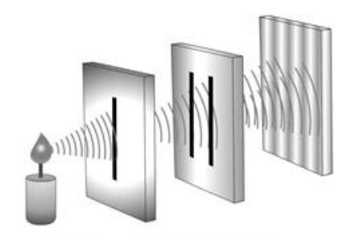

# **3.7 Efecto Doppler**

El efecto Doppler es el cambio aparente en la frecuencia de una onda percibida por un observador debido al movimiento relativo entre la fuente emisora de la onda y el observador. Si la fuente se acerca, la frecuencia percibida aumenta (desplazamiento hacia frecuencias más altas), mientras que, si se aleja, la frecuencia disminuye (desplazamiento hacia frecuencias más bajas).

En las ondas electromagnéticas, el efecto Doppler se manifiesta como un cambio en la longitud de onda y la frecuencia de la radiación debido al movimiento relativo entre la fuente emisora y el receptor. Este fenómeno tiene aplicaciones fundamentales en diversos campos, como la astronomía, donde se utiliza para estudiar el movimiento de estrellas y galaxias, y en la vida cotidiana, como en los radares de tráfico o los sistemas de navegación GPS.

El efecto Doppler en las ondas electromagnéticas se clasifica en dos escenarios principales:

#### **Desplazamiento al azul Desplazamiento al rojo**

Ocurre cuando la fuente de la radiación electromagnética se acerca al observador, provocando un aumento en la frecuencia y una disminución en la longitud de onda.

Tiene lugar cuando la fuente se aleja del observador, lo que genera una disminución en la frecuencia y un aumento en la longitud de onda.

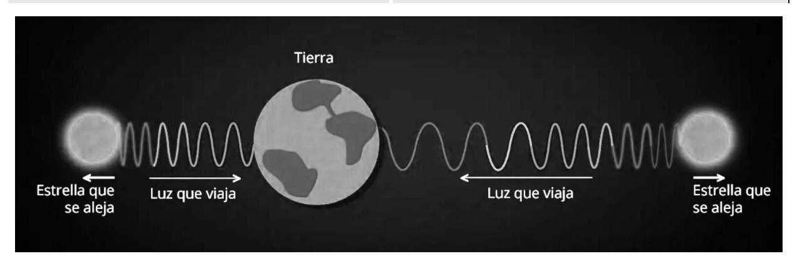

# **3.8 Aplicaciones y dispositivos tecnológicos que se basan en ondas**

El estudio y comprensión de los fenómenos ondulatorios ha permitido el desarrollo de tecnología que hoy se usa en las áreas de salud, comunicaciones e investigación científica. A continuación, te mostramos algunos artefactos y su funcionamiento.

Un **ecógrafo**, también llamado aparato de ultrasonidos es un dispositivo no invasivo que permite explorar el interior del cuerpo humano. La base de su funcionamiento es la reflexión del sonido o eco. El ecógrafo **emite ondas en el rango del ultrasonido**, que pueden penetrar los tejidos sin dañarlos. **Según la densidad de los tejidos humanos, parte de las ondas se transmiten y otra parte de ellas se reflejan** y vuelven al emisor-receptor, convirtiendo la señal del sonido en una señal digital en forma de imagen.

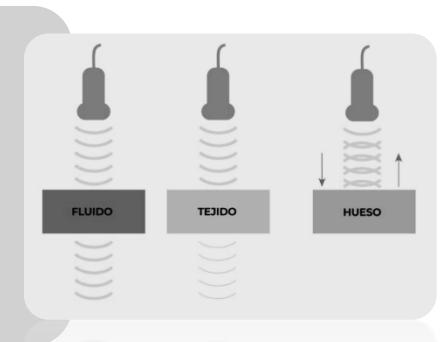

El **láser** es un dispositivo que emite un haz de **luz coherente**, **de poca dispersión, alta energía** y cuyos fotones se propagan en la misma dirección. El fundamento físico que da lugar a su funcionamiento es una propiedad de la mecánica cuántica llamada *emisión inducida de fotones por estimulación de energía*. Debido a que el láser transmite energía en forma muy precisa y **cuya potencia se puede regular con facilidad**, este tipo de tecnología tiene aplicaciones en medicina, telecomunicaciones, en la industria y en el campo de la investigación científica.

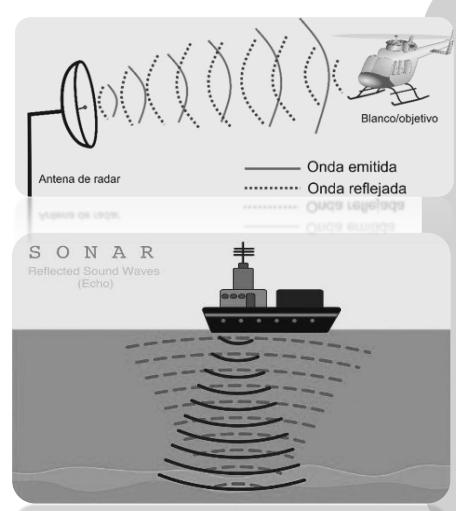

El **radar** se utiliza principalmente para determinar la posición en tiempo real de objetos como aviones, barcos, vehículos, nubes e incluso para caracterizar terrenos. El radar **emite y detecta ondas de radio**, lo que le permite determinar la posición y velocidad de un objeto en la atmósfera terrestre o en la superficie. Su funcionamiento tiene como fundamento físico la **reflexión de las ondas electromagnéticas** y el **efecto Doppler**.

El **sonar** es un dispositivo que se encuentra **en embarcaciones** y que **permite la detección de objetos**. Permite, por ejemplo, navegar en aguas poco profundas y turbias evitando que estas choquen con corales o con el fondo marino. Al igual que el ecógrafo, su funcionamiento **se basa en la reflexión del sonido**, pero puede emitir ultrasonidos o infrasonidos, dependiendo de la precisión y alcance que se necesite para explorar los objetos bajo el agua.

Los focos luminosos o ampolletas son dispositivos que convierten la **energía eléctrica en energía luminosa** en forma de ondas electromagnéticas. Básicamente existen tres tipos de focos: incandescentes, tubos fluorescentes y focos LED.

En el caso de las ampolletas incandescentes se utiliza **corriente eléctrica** que pasa a través de un **filamento** con alta resistencia eléctrica, lo que provoca el calentamiento de un gas inerte que está contenido en una bombilla cerrada herméticamente. El **calor transmitido al gas hace que éste último emita fotones**.

En el caso de los **tubos fluorescentes** su funcionamiento consiste en que un **gas inerte** es estimulado a través de **ondas ultravioleta** y el gas, al estar excitado, emite luz en el rango visible.

Por último, los sistemas de **iluminación LED** (en español diodo emisor de luz), que se basan en la electroluminiscencia. Consiste en un electrodo conectado a un **material semiconductor** en el cual, al ser sometido a un voltaje y una corriente eléctrica, se reordenan los electrones **generando la emisión fotones**.

Un aparato de radioemisión es un dispositivo que puede captar ondas electromagnéticas en el rango de las ondas de radio y al mismo tiene la capacidad de **convertir el sonido en una señal análoga para transmitirla como ondas electromagnéticas moduladas** y que otro receptor pueda codificarlas. Los aparatos de recepción y emisión de radiofrecuencias **se utilizan para las comunicaciones** en la navegación marítima, en la aviación civil, para la difusión de publicidad comercial, para las **emergencias en catástrofes**, ya que no depende de las redes de internet ni telefonía.

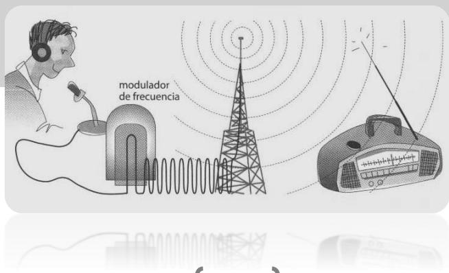

Los telescopios son instrumentos que permiten **captar señales electromagnéticas y amplificar la imagen de cuerpos celestres** que se encuentran a grandes distancias. Existen varios tipos de telescopios, nosotros estudiaremos 3 grandes categorías:

**Telescopio Refractor:** En este tipo de telescopio la luz que viene del espacio pasa primero por el **lente principal** que es **convergente** el cual genera una imagen real que se forma dentro de la distancia focal de un **segundo lente convergente ocular**  que **amplifica aún más la imagen inicial**. Debido a que es muy difícil corregir la *aberración cromática* en este tipo de telescopios, es que son más usado por los aficionados.

 **Telescopio Reflector:** Consiste en

un tubo ancho que al final posee el **espejo principal** y **cóncavo** cuyo objetivo es **recolectar la máxima cantidad de fotones** para así obtener una imagen con alta definición. Cuando los rayos de luz llegan al fondo del telescopio se encuentran con el espejo que hace converger los rayos los que luego se encuentran con un **espejo secundario** que dirige la luz a un **lente convergente**  llamado objetivo. Esto permite que se forme una **imagen virtual y muy aumentada**.

**Radiotelescopios:** En un radiotelescopio, las **ondas de radio** que provienen del espacio inciden en el **disco colector de la antena parabólica** y debido a la forma parabólica del instrumento todos los rayos convergen en un **reflector secundario** que concentra y desvía las ondas hacia **un cono receptor** y luego son **redirigidas y procesadas para así obtener información** de distintos objetos celestes. El norte de Chile alberga el conjunto de radiotelescopios más grande del mundo, el proyecto ALMA.

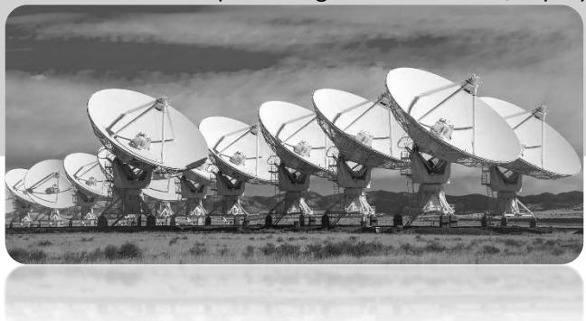

# **3.9 Ejercicios propuestos**

1. Karen realiza un experimento de laboratorio en el cual hace incidir un rayo de luz monocromática hacia el interior de un cable recto de fibra óptica como se muestra en la figura adjunta.

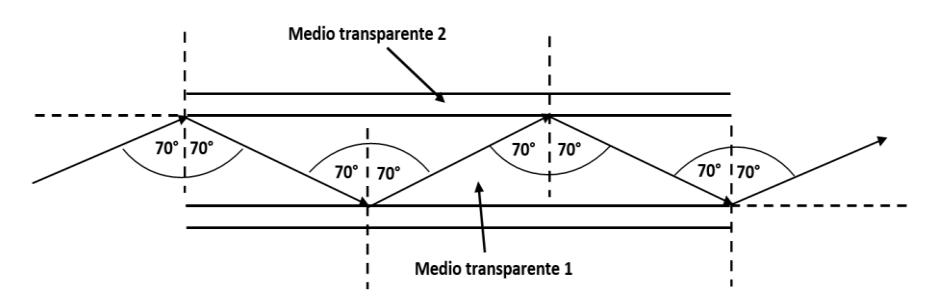

Si se sabe que la energía del rayo se conservó desde que entró en el cable hasta salir de él y que los ángulos de reflexión son los que se indican en la figura, ¿cuál de las siguientes opciones corresponde a una hipótesis que es consistente con los resultados experimentales y que explica el fenómeno observado?

- A) La energía del rayo de luz se conserva porque se refracta sucesivamente en la trayectoria que recorre.
- B) La energía del rayo de luz se conserva porque el medio transparente 1 y el medio transparente 2 tienen el mismo índice de refracción.
- C) La energía del rayo de luz se conserva porque en ningún momento se refracta, solo se refleja sucesivamente dentro del cable.
- D) La energía del rayo de luz se conserva porque en su trayectoria el ángulo de incidencia y el ángulo de reflexión en cada punto de incidencia siempre son iguales.
- 2. En la década de 1920 el astrónomo Edwin Hubble observó algunas galaxias, y para su sorpresa notó que la luz que emitían estaba enrojecida. ¿Cuál fue la conclusión a la que llego?
  - A) La galaxia observada emitía una radiación correspondiente al rojo.
  - B) La galaxia observada se alejaba del punto de observación.
  - C) La galaxia observada se acercaba al punto de observación.
  - D) La galaxia observada refleja todo el rango del espectro visible.
- 3. Un foco luminoso E emite tres rayos de luz P, Q y R los que inciden en la interfaz indicada. El foco E se encuentra en un medio (1) de índice de refracción menor que el índice del medio (2), tal como muestra la figura.

Luego, el (los) rayo(s) incidente(s), cuyo(s) refractado(s) es (son) incompatible(s) con la situación planteada es (son):

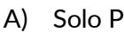

B) Solo Q

C) Solo Q y R

D) Solo P y Q

E) Solo P y R

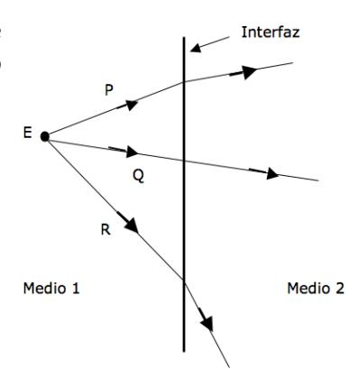

4. En el experimento de la doble rendija realizado por Thomas Young en 1801, la luz solar pasaba a través de un agujero de alfiler en una tabla, luego el rayo emergente incidía sobre dos agujeros en una segunda tabla. Finalmente, la luz que emanaba de los dos agujeros llegaba a una pantalla en la que se observaba un patrón de puntos brillantes y oscuros. El patrón de líneas formado sólo pudo explicarse a través de la interferencia, un fenómeno ondulatorio. ¿A qué corresponde la descripción desarrollada?

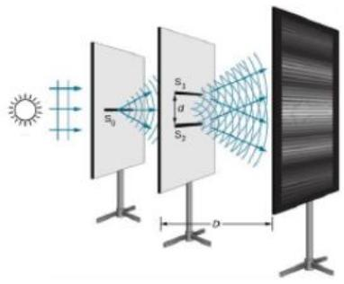

- A) Hipótesis.
- B) Conclusión.
- C) Dato experimental.
- D) Modelo.
- E) Teoría.
- 5. Thomas Young intentando demostrar la naturaleza ondulatoria de la luz propuso el siguiente experimento:

En una cámara oscura se introduce una fuente de luz monocromática que pasa primero por un pequeño orificio y luego por una pantalla con dos pequeñas rendijas.

En ese momento se presentó un argumento como el que sigue: "si la luz tiene naturaleza ondulatoria debiese observarse el fenómeno de difracción y, por lo tanto, al atravesar las rendijas se generarán dos nuevas fuentes de ondas, mostrando en una segunda pantalla un patrón de interferencia que dará cuenta de la superposición de las ondas"

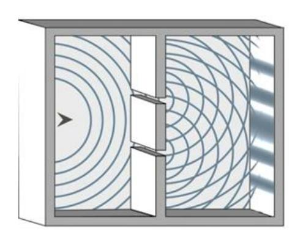

Según lo planteado por Young, ¿a qué corresponde la parte del texto que se encuentra entre comilla?

- A. Ley
- B. Teoría
- C. Conjetura
- D. Conclusión

#### **Completa el mapa conceptual (Clase 3 y 4)**

#### **En este espacio puedes tomar notas durante la clase:**

|   |  |
|------|--|
|      |  |
|      |  |
|      |  |
|      |  |
|      |  |
|      |  |
|      |  |
|      |  |
|      |  |
|      |  |
|      |  |
|      |  |
|      |  |
|      |  |
|      |  |
|      |  |
|      |  |
|      |  |
|      |  |
|      |  |
|      |  |
|      |  |
|      |  |
|      |  |
|      |  |
|      |  |
|      |  |
|      |  |
|      |  |
|   |  |
|      |  |
|      |  |
|      |  |
|      |  |
|      |  |
|      |  |
|      |  |
|      |  |
|      |  |

# **TEMA 4. FORMACIÓN DE IMÁGENES EN ESPEJOS**

En esta sección profundizaremos en el fenómeno de reflexión de la luz, pero aplicados a problemas de formación de imágenes en espejos.

#### **I. Recordemos**

La ley de reflexión establece que **el ángulo que forma el rayo incidente** sobre un punto de una superficie (punto de incidencia) con la línea normal a la superficie que pasa por dicho punto, **mide lo mismo que el ángulo que forma el rayo reflejado con dicha normal**. Además, ambos ángulos pertenecen a un mismo plano, es decir son coplanarios. La figura de la derecha esquematiza la ley de reflexión.

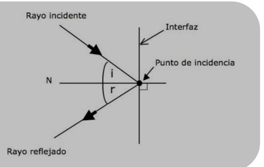

# **4.1 Tipos de imagen**

En la vida diaria estamos bastante familiarizados con **espejos,**  tales como el retrovisor de los vehículos, el espejo del baño o el de una tienda comercial. Sabemos que en ellos **se forman imágenes** o reflejos de la realidad que esta frente a ellos.

En física, diremos que; si la imagen de un objeto ubicado frente a cualquier tipo de espejo se forma **intersecando rayos reflejados,** la **imagen formada es real**; Sin embargo, si los rayos reflejados no se pueden intersecar, es decir, divergen, entonces **intersecamos sus prolongaciones** formándose una **imagen del tipo virtual.**

 Una forma de diferenciar una imagen real de una virtual es que: Toda imagen **REAL** está **INVERTIDA** respecto al objeto. Toda imagen **VIRTUAL** está **DERECHA** respecto al objeto.

# **4.2 Formación de imágenes en espejos planos**

En el caso de los espejos planos, técnicamente, para formar una imagen basta con hace incidir sobre el espejo **2 rayos que provengan de la parte superior del objeto y 2 rayos que provengan de la parte inferior** (uno de ellos puede incidir frontalmente). En el caso de un espejo plano, lo que se intersecan son las prolongaciones de los rayos reflejados tal como se muestre en la siguiente imagen.

Un espejo plano siempre formará una **imagen virtual, de igual tamaño y derecha** (en este caso la imagen de la flecha apunta en la misma dirección que el objeto real), pero además se cumplirá que la imagen estará **a la misma distancia que el objeto del espejo.** 

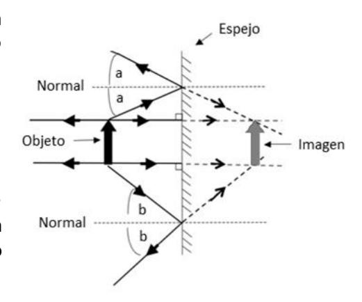

Además, otra particularidad es que, si la superficie reflectora es vertical (como en la figura) la imagen se invierte horizontalmente, lo que explica porque **al levantar tu mano derecha, en el espejo se vea del lado izquierdo.**

# **4.3 Espejos Cóncavos (convergentes)**

Un espejo esférico cóncavo consiste en una porción de esfera en que **la superficie reflectora está en el interior de ella**. Se representa por un arco circular que corresponde a un corte transversal de esfera. Sus elementos son:

- El **eje óptico** (recta L), contiene al diámetro de la esfera.
- El **centro de la esfera** (O) o centro de curvatura del espejo.
- El **vértice** (V).
- El **foco** (F) que se encuentra en punto medio entre (V) y (O).
- El **radio de curvatura**, que corresponde a la distancia entre (V) y (O).
- La **distancia focal del espejo**, que corresponde a la distancia entre (V) y (F) y es igual a la mitad de (R).

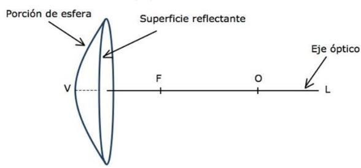

La imagen muestra una representación del espejo y sus elementos.

# **4.3.1 Rayos notables**

Para formar la imagen de un objeto ubicado frente a un espejo esférico cóncavo y caracterizarla, debemos primero considerar lo que se denomina **rayos notables**. Es importante señalar que en este tipo de espejos también se cumple la ley de reflexión, pero dada la curvatura es más difícil de aplicar directamente y de ahí la importancia de los rayos notables.

#### I. **Rayo incidente paralelo al eje óptico:**

Todo rayo que incide sobre un espejo esférico cóncavo aproximándose al espejo paralelo al eje óptico, se refleja pasando por el foco.

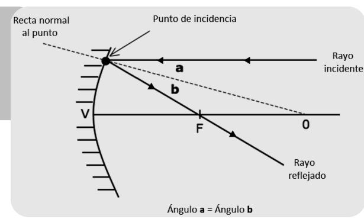

#### **II. Rayo incidente que pasa por el foco:**

Todo rayo que incide sobre un espejo esférico cóncavo pasando por el foco, se refleja paralelo al eje del espejo.

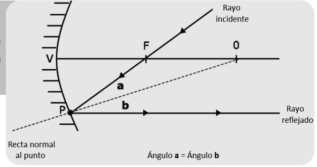

### III. Rayo incidente que pasa por el centro:

Todo rayo que incide sobre un espejo esférico cóncavo pasando por el centro, se refleja pasando por el centro.

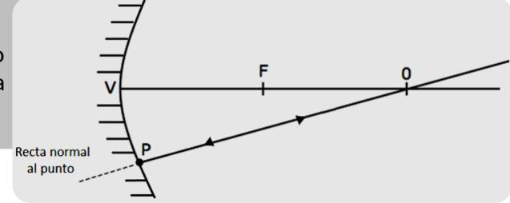

### IV. Rayo incidente sobre el vértice:

El rayo incidente sobre el vértice mostrado en la figura se refleja en una dirección tal que el ángulo incidente (a) mida lo mismo que el ángulo reflejado (b). En este caso, la línea normal (N) coincide con el eje óptico del

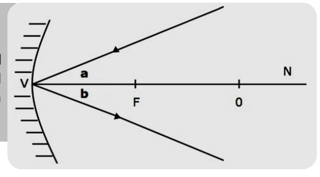

# 4.3.2 Convergencia de rayos reflejados

Debido a que un rayo incidente paralelo al eje se refleja por el foco, al incidir un haz de rayos paralelos, sus respectivos rayos reflejados convergerán en el foco. Por este motivo, el **espejo esférico cóncavo también se denomina espejo convergente**. Este fenómeno tiene aplicaciones en artefactos como las cocinas y hornos solares. Debido a la lejanía del Sol, se puede decir que sus rayos siempre inciden paralelos sobre una superficie reflectora esférica.

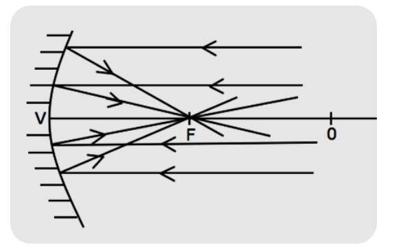

# 4.3.3 Formación de imágenes en espejos cóncavos

Tal como ocurre en el caso de un espejo plano, para formar la imagen de un objeto ubicado frente a un espejo esférico cóncavo, basta con encontrar la imagen de los puntos extremos (superior e inferior) del objeto. Por simplificación consideraremos que el objeto tiene su extremo inferior sobre el eje del espejo. Entonces **basta con encontrar la imagen del extremo superior**, ya que la imagen de un punto sobre el eje siempre estará sobre el eje.

Ahora, para encontrar la imagen del extremo superior del objeto, basta con hacer incidir 2 rayos notables sobre el espejo y que provengan de dicho extremo. Enseguida se debe determinar si sus respectivos rayos reflejados se intersecan. Si lo hacen, en ese punto de intersección se encuentra la imagen la que se denomina imagen real. Si no se intersecan, pero sí lo hacen sus prolongaciones entonces en dicho punto de intersección se encuentra la imagen, la que se dice es virtual. Por último, si los rayos reflejados no se intersecan ni tampoco sus prolongaciones (es decir, son paralelos), entonces no se forma imagen.

Además, la imagen podrá tener mayor o menor tamaño que objeto original y se dirá **aumentada o disminuida,** respectivamente. Si la imagen tiene la misma orientación respecto al eje óptico la imagen será **derecha**, en caso contrario será **invertida**. A continuación, te mostramos un ejemplo de un objeto que se encuentra más allá del centro (O). En este caso la imagen es real, disminuida e invertida.

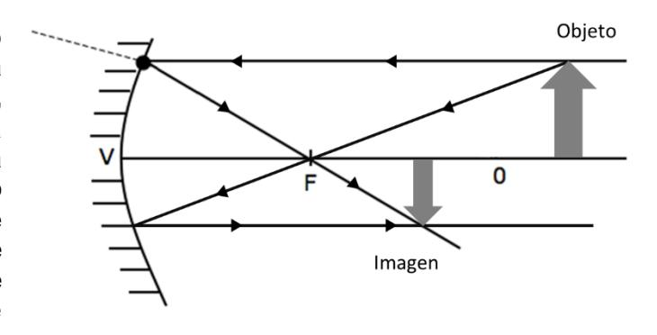

En el espejo cóncavo **el tipo de imagen que se forma dependerá de la distancia del objeto al vértice del espejo**, tal como se detalla a continuación. De todos modos, te invitamos a trazar los rayos y comprobar que lo que se resume a continuación se cumple siempre:

| Ubicación                  | Tipo de imagen     | Orientación | Tamaño       |
|----------------------------|--------------------|-------------|--------------|
| Más allá del centro O      | Real               | Invertida   | Disminuida   |
| En el centro O             | Real               | Invertida   | Igual tamaño |
| Entre el centro y el foco  | Real               | Invertida   | Aumentada    |
| En el foco                 | No se forma imagen | -           | -            |
| Entre el foco y el vértice | Virtual            | Derecha     | Aumentada    |

Un espejo cóncavo muy fácil de encontrar en el comercio son los espejos con aumento.

# **4.4 Espejos convexos (divergentes)**

Un espejo esférico convexo consiste en una porción de cascarón esférico con un ángulo central pequeño (no mayor a 20°), en que la superficie reflectante es el "exterior" de ella, por lo tanto, el objeto a reflejar debe ubicarse al lado izquierdo del vértice (V) indicado en la siguiente figura.

De manera similar a lo que ocurre con el espejo cóncavo podemos identificar los siguientes elementos.

- El eje óptico (recta L)
- El centro de curvatura O2
- El vértice V
- El foco F2
- El punto F1, que corresponde al punto simétrico de F2 con respecto al vértice.
- El punto O1, que corresponde al punto simétrico de O2 con respecto al vértice.

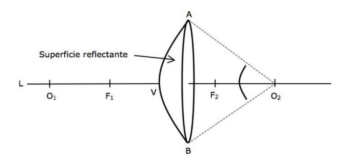

La imagen muestra una representación del espejo y sus elementos.

### 4.4.1 Rayos Notables

El comportamiento de los rayos notales en el caso de un espejo convexo se muestra a continuación:

### I. Rayo incidente paralelo al eje:

El ángulo incidente (a) formado por el rayo incidente y la normal N, es igual al ángulo reflejado (b), formado por la Normal N y el rayo reflejado. Además, el rayo reflejado se dibuja como si saliese del foco F2.

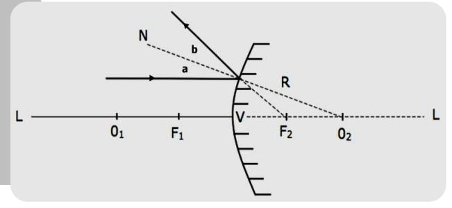

### II. Rayo incidente en la dirección del foco F2:

El ángulo incidente (a), formado por el rayo incidente y la línea normal N, es igual al ángulo reflejado (b), formado por la línea normal N y el rayo reflejado Además el rayo reflejado es paralelo al eje óptico.

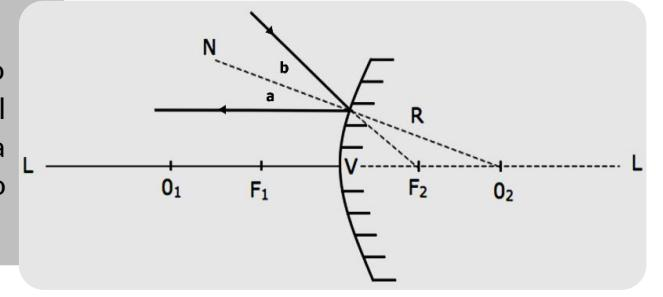

### III. Rayo incidente en el vértice:

En este caso la línea normal N en el punto de incidencia del rayo, coincide con la línea del eje óptico del espejo. Bajo esta coincidencia el ángulo incidente (a) es igual al reflejado (b).

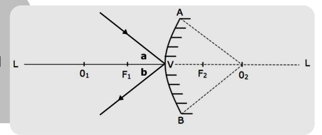

# IV. Rayo incidente en la dirección del centro O2

En este caso, el rayo incidente en el punto correspondiente (punto de incidencia) tiene la dirección de la línea normal N, por lo tanto, el ángulo de incidencia es nulo, luego el ángulo reflejado también lo es. Decimos que un rayo que incide en la dirección del centro O2 se refleja en la misma dirección.

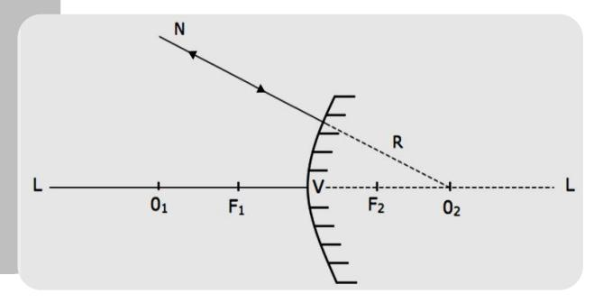

#### **4.4.2 Formación de imágenes en espejos convexos**

Al igual que ocurre en los espejos cóncavos, la imagen se obtiene intersecando rayos reflejados o sus prolongaciones. Sin embargo, en el caso del **espejo convexo se forma un solo tipo de imagen**, independiente de la distancia que exista entre el objeto y el espejo:

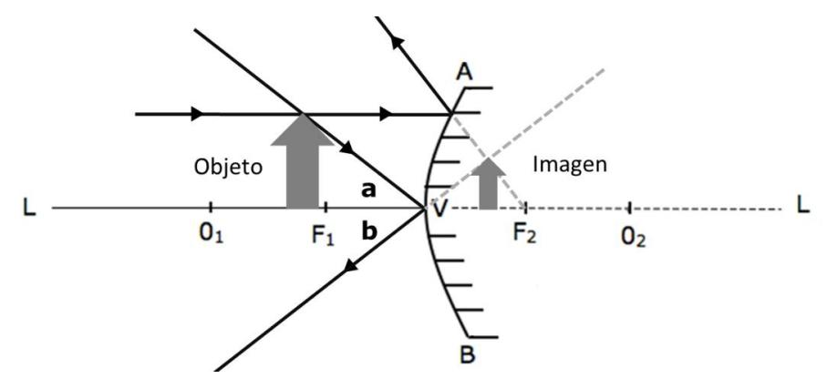

Observamos que la imagen es siempre **virtual, derecha respecto al objeto, más pequeña**  que el objeto y **más cercana** al espejo que el objeto.

Algunos espejos cóncavos muy fáciles de encontrar son los espejos retrovisores de los autos.

 El espejo **cóncavo** se llama **convergente** porque refleja los rayos paralelos al eje óptico hacia un punto común, el **foco**, gracias a su curvatura hacia adentro. En cambio, el espejo **convexo** se llama **divergente** porque los rayos reflejados se separan, como si provinieran de un foco virtual detrás del espejo, debido a su curvatura hacia afuera.

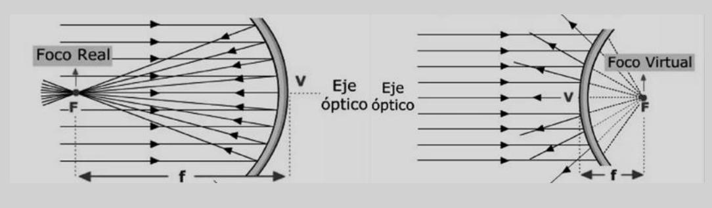

# **4.5 Ejercicios propuestos**

- 1. En los espejos curvos, luego de incidir paralelamente al eje principal, los rayos luminosos son reflejados en dirección a un punto convergente situado en el eje principal. Este punto es llamado:
  - A) Vértice.
  - B) Eje principal.
  - C) Foco principal.
  - D) Distancia focal.
  - E) Centro de curvatura.
- 2. Un rayo luminoso se refleja en un espejo plano con un ángulo de incidencia de 60°, como indica la figura. Si el espejo se gira en torno al punto P en el sentido indicado (sentido antihorario) en un ángulo de 10° ¿qué ángulo forma el rayo reflejado con la recta PQ?

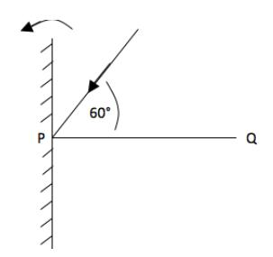

- A) 10°
- B) 20°
- C) 30°
- D) 40°
- E) 50°
- 3. El rayo de luz incide sobre un espejo esférico cóncavo como se indica en la figura. Por lo tanto, el rayo reflejado correspondiente:

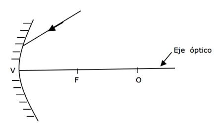

- A) corta al eje del espejo a la derecha del centro O.
- B) pasa entre el centro O y el foco F
- C) pasa entre el vértice y el foco.
- D) pasa por el centro (O) del espejo.
- E) es paralelo al eje del espejo.

- 4. Al colocar un objeto de 2 metros de alto delante de un espejo, se forma una imagen derecha y tres veces mayor. ¿Qué tipo de espejo es y en donde se sitúa el objeto?
  - A) Cóncavo; se sitúa entre el centro de curvatura y el foco.
  - B) Convexo; se sitúa en el centro de curvatura.
  - C) Convexo; se sitúa en cualquier punto delante del espejo.
  - D) Cóncavo; se sitúa entre el foco y el vértice del espejo.
- 5. Tamara observa cuatro experimentos de óptica relacionados con espejos cóncavos. Ella debe escoger el experimento que le permitirá obtener una imagen virtual del objeto. Los cuatro experimentos se muestran en la figura adjunta.

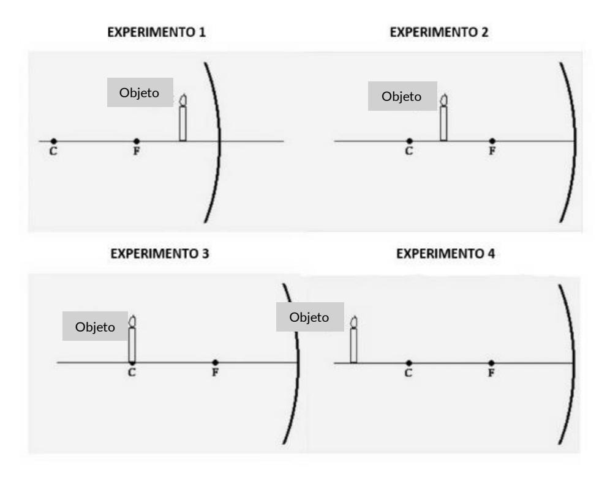

¿Cuál de las siguientes opciones corresponde a una hipótesis correcta que permite a Tamara elegir el experimento en el cual se obtiene una imagen virtual del objeto?

- A) La imagen será virtual si al proyectar los rayos notables, sus rayos reflejados divergen.
- B) La imagen será virtual si al proyectar los rayos notables, sus rayos reflejados convergen.
- C) La imagen será virtual si al proyectar los rayos notables, las prolongaciones de sus rayos reflejados divergen.
- D) La imagen será virtual si al proyectar los rayos notables, sus rayos reflejados son paralelos.

| A | D | C | D | C |
|---|---|---|---|---|
| 5 | 4 | 3 | 2 | 1 |

#### **Completa el mapa conceptual (Clase 5)**

#### **En este espacio puedes tomar notas durante la clase:**

| ,       |  |
|---------|--|
|         |  |
|         |  |
|         |  |
|         |  |
|         |  |
|         |  |
|         |  |
|         |  |
|         |  |
|         |  |
|         |  |
|         |  |
|         |  |
|         |  |
|         |  |
| <b></b> |  |
|         |  |
|         |  |
|         |  |
|         |  |
|         |  |
|         |  |
|         |  |
|         |  |
|         |  |
|         |  |
|         |  |
|         |  |
|         |  |
|         |  |
|         |  |
|         |  |
|         |  |
|         |  |
|         |  |
|         |  |
|         |  |
|         |  |
|         |  |
|         |  |
|         |  |
|         |  |
|         |  |
|         |  |
|         |  |
|         |  |
|         |  |
|         |  |
|         |  |
|         |  |
|         |  |
|         |  |
|         |  |
|         |  |
|         |  |
|         |  |
|         |  |
|         |  |
|         |  |
|         |  |
|         |  |
|         |  |
|         |  |

# **TEMA 5. FORMACIÓN DE IMÁGENES EN LENTES**

En esta sección profundizaremos en el fenómeno de refracción de la luz, pero aplicados a problemas de **formación de imágenes en lentes delgadas**.

### 5.1**Formación de imágenes en lentes biconvexos (convergentes)**

Un lente **biconvexo** común es la tradicional y conocida "lupa". Es un lente formado por dos "porciones" esféricas transparentes de igual radio de curvatura.

La figura muestra esquemáticamente a una "lupa" en corte transversal:

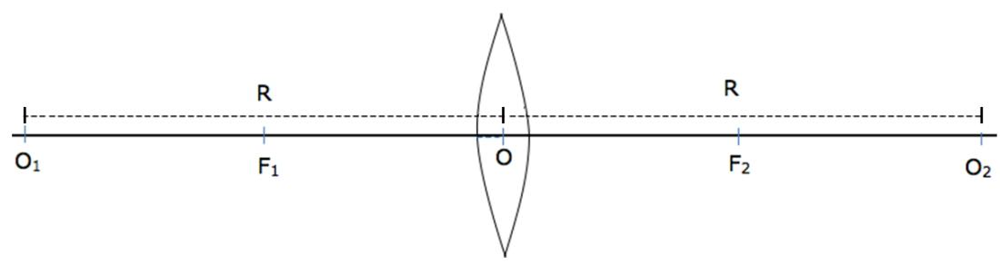

Sus elementos son:

- El centro del lente O.
- Los centros de curvatura O1 y O2.
- Los focos F1 y F2.
- Sus radios de curvatura R.
- Su eje óptico.

Además, F1 es punto medio del segmento O1O y del mismo modo F2 es punto medio del segmento O2O.

# 5.1.1 **Rayos notables**

Al igual como ocurre en la formación de imágenes en espejos, para formar la imagen de un objeto es necesario examinar el comportamiento de los rayos más relevantes al incidir sobre el lente, es decir, los rayos notables.

#### **I. Rayo incidente paralelo al eje**

De la ley de refracción se puede desprender que un rayo incidente en un lado del lente paralelo al eje se refracta pasando por el foco del otro lado, como indica la figura.

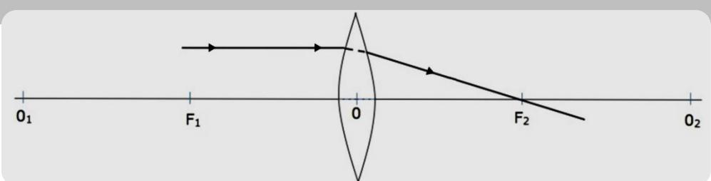

#### **II. Rayo incidente por el foco**

Análogamente, de la ley de refracción se obtiene que un rayo incidente en un lado del lente que pasa por el foco se refracta emergiendo paralelo al eje en el otro lado del lente.

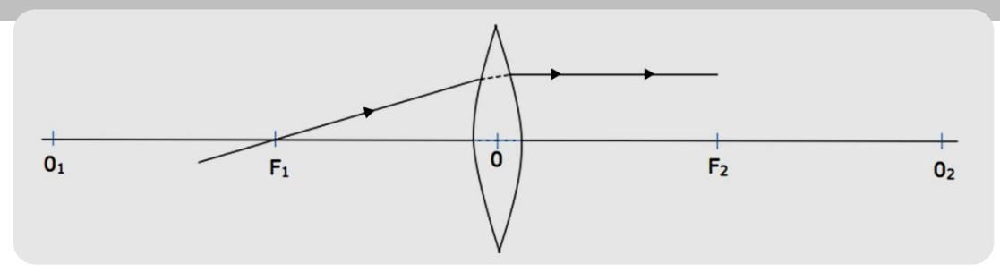

### **III. Rayo incidente por el centro del lente**

Un rayo incidente desde un lado del lente sobre el centro no se desvía, sino que se transmite al otro lado del lente en la misma dirección y sentido, como indica la figura.

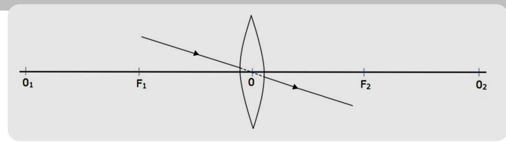

#### 5.1.2 **Formación de la imagen**

La imagen de un objeto ubicado frente a este lente se obtiene considerando al menos **dos rayos incidentes provenientes del extremo superior** del objeto. La imagen se obtiene intersecando los rayos refractados o sus prolongaciones. Por simplificación, el extremo inferior del objeto se ubica sobre el eje del lente, pues su imagen estará también sobre el eje, de la misma manera que cuando hacemos la formación de imágenes en espejos.

A continuación, te mostramos un ejemplo:

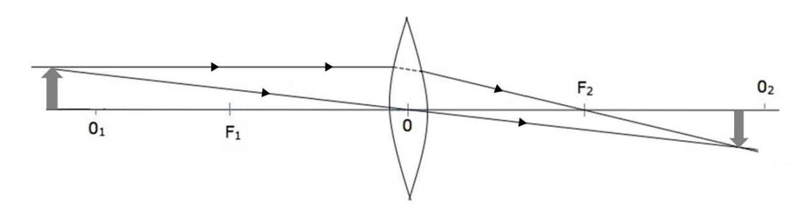

Al igual que lo que ocurre en la formación de imágenes en espejos cóncavos, en una lente convergente **el tipo de imagen que se forme dependerá de la distancia del objeto al vértice**.

| Ubicación                       | Tipo de imagen     | Orientación | Tamaño       |
|---------------------------------|--------------------|-------------|--------------|
| Más allá del centro O1          | Real               | Invertida   | Disminuida   |
| En el centro O1                 | Real               | Invertida   | Igual tamaño |
| Entre el centro O1 y el foco F1 | Real               | Invertida   | Aumentada    |
| En el foco F1                   | No se forma imagen | -           | -            |
| Entre el foco F1 y el centro O  | Virtual            | Derecha     | Aumentada    |

De todos modos, te invitamos a trazar los rayos y comprobar que lo que se resume a continuación se cumple siempre.

# 5.2**Formación de imágenes en lentes bicóncava (divergentes)**

Un lente **bicóncavo** es un lente que también está formado por dos "porciones" esféricas transparentes de igual radio de curvatura, pero se dice que su radio de curvatura es negativo. La siguiente figura muestra un corte trasversal de este tipo de lentes, en el cuál podemos identificar los mismos elementos que en el lente convergente:

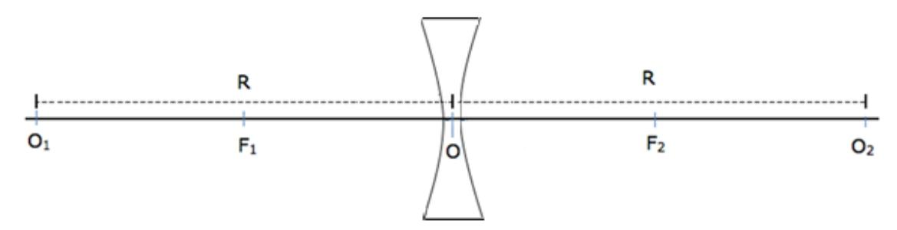

Si bien podemos detallar el comportamiento de los rayos notables de este tipo de lentes, la imagen que entrega es siempre la misma: **virtual, derecha y de menor tamaño**. Este lente se llama divergente, porque, si los rayos vienen de izquierda a derecha, **este lente desvía los rayos como si estos viniesen del foco F1.**

Te invitamos a observar los distintos casos de formación de imágenes en lentes y espejos en el siguiente **simulador web**.

# 5.3 **Ojo humano y problemas a la vista**

### **1. Funcionamiento del ojo**

El ojo tiene la capacidad de captar la luz y, junto a nuestro sistema nervioso, nos permiten desarrollar nuestro sentido de la vista.

Un ojo sano es capaz de formar imágenes legibles en nuestra retina, sin embargo, muchas veces las imágenes se forman más adelante o más atrás de la retina, lo que se manifiesta con distintas enfermedades a la vista.

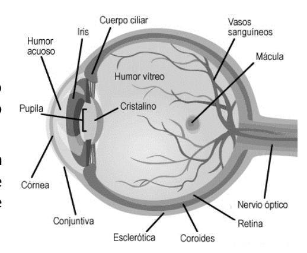

#### **2. Miopía**

La miopía es un defecto de la visión del ojo humano asociado a la refracción de la luz en el cual la persona presenta dificultades para enfocar objetos lejanos. Este problema se produce por la forma más alargada del globo ocular y el efecto óptico es que **los rayos que provienen del exterior y pasan por el cristalino** (lente natural del ojo humano) se refractan con normalidad**, pero la imagen se forma antes de llegar a la retina** lo que la hace borrosa. Este problema se corrige usando gafas con **lentes divergentes.**

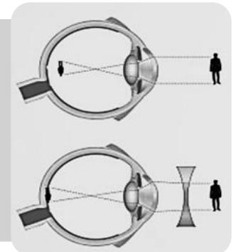

#### **3. Hipermetropía**

La hipermetropía es el defecto de la visión inverso a la miopía. En este caso, debido a la geometría del globo ocular, más corto de lo normal, la imagen después de la refracción del cristalino **se forma después de pasar por la retina**, lo que provoca problemas para visualizar objetos cercanos. Este defecto de la visión se corrige usando lentes convergentes.

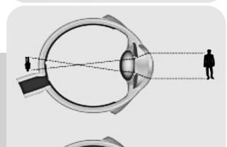

# **4. Astigmatismo**

El astigmatismo es un problema muy típico a la visión y se produce por una deformación desigual en la córnea del ojo humano. Esto genera zonas del campo visual enfocadas y otras desenfocadas. Esta anomalía óptica es más difícil de corregir ya que requiere el uso de lentes cilíndricas.

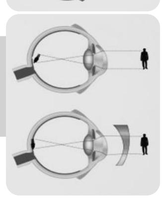

# 5.4 **Astronomía y contaminación lumínica**

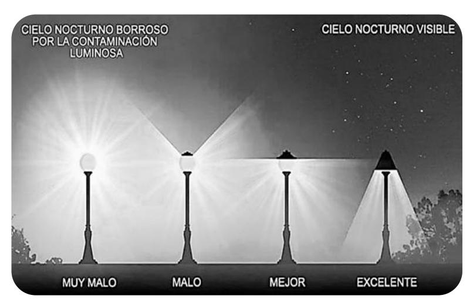

La zona norte de nuestro país **agrupa una serie de condiciones atmosféricas** que le entregan una **gran limpieza a sus cielos**, lo que la convierte en una **zona ideal para la observación astronómica**. Por lo mismo, alberga una gran cantidad de proyectos de envergadura internacional y telescopios de hasta 40 m de diámetro. Sin embargo y a pesar de las excelentes condiciones, la llamada *contaminación lumínica* representa una amenaza para el trabajo científico en el área.

Pero ¿a qué se le llama contaminación lumínica? Nos referimos a la **alteración de la oscuridad natural de la noche** y que se provoca por luz artificial, principalmente alumbrado de exteriores, la que es desaprovechada, innecesaria o inadecuada. Este **desperdicio de luz artificial genera impactos en la salud** y en la vida de los seres vivos.

En la actualidad, el **crecimiento de los asentamientos** humanos que están cercanos a los observatorios astronómicos **dificulta el trabajo de la comunidad científica**, debido a la creciente emisión de luz hacia el cielo.

Sin embargo, este no es el único impacto de la contaminación lumínica, ya que puede **alterar el sueño de las personas**, generando diversos problemas de salud e **impactando negativamente en su calidad de vida**. De ahí la importancia de ocuparnos de evitar al máximo este tipo de contaminación. Para más detalles te invitamos a ver el siguiente minidocumental.

# 5.5**Ejercicios propuestos**

1. La miopía puede deberse a una deformación del ojo, que hace que las imágenes se formen antes de llegar a la retina, como se muestra en la figura:

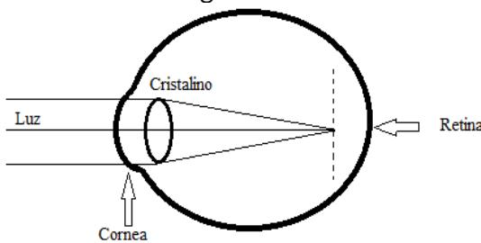

Los miopes no ven bien de lejos y tienden a acercarse para ver bien los objetos. De las siguientes opciones, ¿cuál puede corregir la miopía?

- A) Anteponiendo al ojo una lente divergente.
- B) Anteponiendo al ojo una lente convergente.
- C) Anteponiendo al ojo una lente cilíndrica.
- D) Anteponiendo al ojo un espejo cóncavo.
- 2. Un sistema óptico está formado por dos lentes convergentes de la misma distancia focal f=20 cm, situadas en un mismo eje óptico a una distancia entre sí de 80 cm. A 40 cm a la izquierda de la primera lente se encuentra iluminado un objeto perpendicular al eje óptico de 2 m de alto. ¿Cuáles son las características de la imagen?
  - A) Virtual, invertida y mayor
  - B) Real, derecha e igual
  - C) Virtual derecha e igual
  - D) Real, invertida e igual
- 3. La imagen del objeto ubicado frente al lente convergente de la figura adjunta, del cual se indican los dos focos, es:

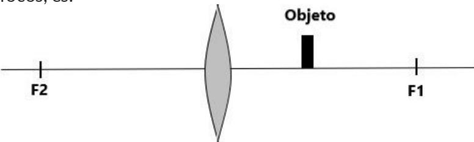

- A) real, derecha y de menor tamaño que el objeto.
- B) virtual, invertida y de igual tamaño que el objeto.
- C) virtual, derecha y de mayor tamaño que el objeto.
- D) real, invertida y de igual tamaño que el objeto.
- E) Real, invertida y de mayor tamaño que el objeto.

| C | B | A |
|---|---|---|
| 3 | 2 | 1 |

#### **Completa el mapa conceptual (Clase 6)**

#### **En este espacio puedes tomar notas durante la clase:**

|   |  |
|------|--|
|      |  |
|      |  |
|      |  |
|      |  |
|      |  |
|      |  |
|      |  |
|      |  |
|      |  |
|      |  |
|      |  |
|      |  |
|      |  |
|      |  |
|      |  |
|      |  |
|      |  |
|      |  |
|      |  |
|      |  |
|      |  |
|      |  |
|      |  |
|      |  |
|      |  |
|      |  |
|      |  |
|      |  |
|      |  |
|   |  |
|      |  |
|      |  |
|      |  |
|      |  |
|      |  |
|      |  |
|      |  |
|      |  |
|      |  |

# **III. MECÁNICA**

En esta unidad estudiaremos las causas de los movimientos en términos de fuerza y los cambios que producen en el tiempo. Todo esto corresponde al área de la física llamada dinámica.

# **TEMA 1. PRIMERA LEY DE NEWTON: LEY DE INERCIA.**

# **1.1 ¿Qué es una fuerza (** ⃗ **)?**

A modo de definición se puede decir que la fuerza es **la acción de un cuerpo sobre otro** o la interacción entre dos o más cuerpos. Si bien la fuerza, en tanto acción, **no se puede poseer ni acumular**, sabemos que existe una fuerza por los efectos que esta produce. Una fuerza puede **poner en movimiento un objeto, detenerlo, desviarlo, o también deformarlo**.

Más adelante detallaremos matemáticamente los efectos de una fuerza, pero en general podemos decir que **una fuerza genera cambios en la velocidad de un cuerpo**, ya sea porque produce **cambios en su rapidez o en su dirección de movimiento**. En términos de cinemática, una fuerza acelera los cuerpos. La aceleración también es una magnitud vectorial, que en S.I. se mide en [m/s2 ]. y matemáticamente se expresa como:

$$\vec{a} = \frac{\Delta \vec{v}}{\Delta t}$$

Físicamente, la aceleración es la tasa de cambio de la velocidad de un cuerpo en el tiempo.

Diremos, por ejemplo, que una fuerza neta que actúa sobre un cuerpo que parte del reposo es capaz de poner en movimiento dicho cuerpo, es decir, es capaz de acelerarlo de modo tal que el sentido de la aceleración **coincide con el sentido de la fuerza**. En el siguiente apartado profundizaremos en la definición de fuerza neta.

La **unidad de medida** de la fuerza es el **newton (N)**, en honor al científico Sir Isaac Newton. Para que te hagas una idea, un (1) newton es la fuerza necesaria para aumentar la velocidad de un cuerpo de masa 1 kg en 1 m/s.

Su equivalente en unidades fundamentales del SI es

$$N = \left[ \mathbf{kg} \cdot \frac{\mathbf{m}}{s^2} \right]$$

# **1.2 ¿Cómo representamos las fuerzas?**

**Las fuerzas son magnitudes vectoriales** ya que, además de la magnitud, se requiere de **dirección y sentido** para dar cuenta del efecto que generan en la **interacción con otro**. En la siguiente situación hay dos personas tirando un objeto, usando cuerdas.

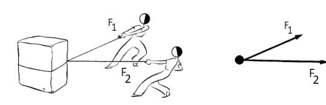

Para representar las fuerzas que realizan esas personas **dibujamos una flecha para cada fuerza y en el sentido en el que ellas aplican la fuerza** (en este caso de izquierda a derecha). Mientras mayor sea la fuerza aplicada mayor será la magnitud del vector dibujado.

### 1.3 Sumas de fuerzas y Fuerza neta

Tal como se observa en la figura anterior, en general ocurre que **sobre un cuerpo actúa más de una fuerza simultáneamente**. Sin embargo, vectorialmente podemos **simplificar el sistema asignándole una única fuerza** que representa todas las fuerzas que actúan sobre un cuerpo. A esta fuerza se le llama **Fuerza neta**  $(\overline{F}_{neta})$  y se calcula **sumando vectorialmente** todas las fuerzas que actúan sobre el cuerpo.

En esta sección te mostraremos cómo sumar vectores en distintos casos. Los problemas más complejos de suma de fuerzas serán combinaciones de estos casos base.

Es importante considerar que vectorialmente y por convención, diremos que una **fuerza tiene signo negativo** si apunta verticalmente hacia abajo, o bien si apunta horizontalmente hacia la izquierda. Así mismo, una fuerza **tiene signo positivo** si apunta verticalmente hacia arriba o bien, horizontalmente hacia la derecha.

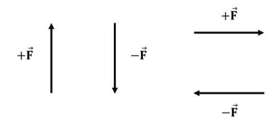

### 1.3.1 Suma de fuerzas con igual dirección y sentido

Supongamos que inicialmente tenemos un cuerpo de masa (M) que se encuentra en reposo. La imagen representa un ejemplo de tres fuerzas actuando en igual dirección y sentido. En este caso, la magnitud de la fuerza resultante se evalúa sumando las magnitudes de las fuerzas involucradas. En este diagrama, el sentido resultante de la fuerza neta es el sentido de cada una de las fuerzas, el que coincide con el sentido de la  $(\overline{F}_{neta})$ .

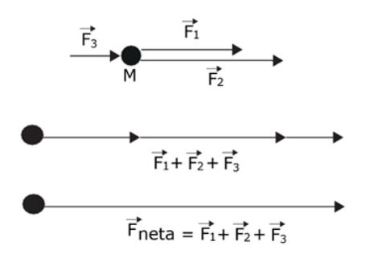

El diagrama anterior podría representar un objeto empujado por 3 personas distintas, cada una ejerciendo una fuerza sobre él. Por extensión, debemos realizar el mismo ejercicio, si tenemos 2 fuerzas o más de 3 fuerzas.

#### 1.3.2 Suma de fuerzas con igual dirección y sentido opuesto

Supongamos nuevamente, por simplicidad, un cuerpo en reposo, pero ahora actúan sobre él dos fuerzas en sentido contrario. En este caso, la magnitud de la fuerza neta se evalúa restando las magnitudes de las fuerzas involucradas. En la figura, la magnitud de  $\overrightarrow{F_1}$  es mayor que la de  $\overrightarrow{F_2}$ , por

lo tanto, la fuerza neta tiene el sentido de  $\overrightarrow{F_1}$ , en el caso del diagrama, hacia la derecha. En la práctica  $\overrightarrow{F_2}$  se contrapone a  $\overrightarrow{F_1}$  y se anula porque  $\overrightarrow{F_1}$  tiene mayor módulo.

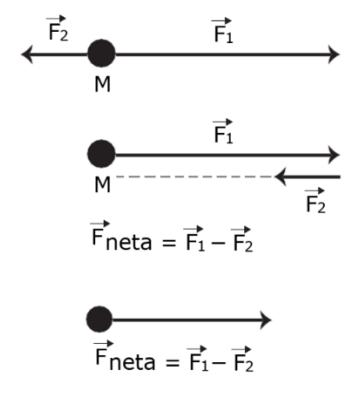

#### 1.3.3 Suma de fuerzas perpendiculares entre sí

Para realizar la suma de dos fuerzas perpendiculares entre sí una opción es ordenar los vectores uno delante del otro y **completar el triángulo rectángulo**, tal como se señala en la figura. En este caso, **la magnitud de la fuerza** neta se evalúa utilizando el **teorema de Pitágoras** y la **dirección de la fuerza neta es la diagonal que actúa en m**.

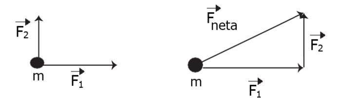

Al realizar el proceso inverso, es decir de descomposición vectorial, podemos siempre escribir dos fuerzas  $F_1$  y  $F_2$  que son componentes rectangulares de dicha fuerza neta.

#### 1.4 Primera Ley de Newton: Ley de Inercia

Las leyes de Newton tienen una gran relevancia en la historia de la física y la mecánica clásica. Son tres leyes o axiomas sencillos que permiten explicar una gran cantidad de problemas relacionado con el movimiento de los objetos. A continuación, comenzaremos el estudio de cada una de las leyes y las aplicaremos en la resolución de algunos ejercicios.

#### ¿Qué es la inercia de un cuerpo?

La inercia de un cuerpo se puede definir como la tendencia de los cuerpos a mantener su estado de movimiento a lo largo del tiempo. Considerando un sistema de referencia determinado y fijo, la inercia permite que los objetos que se están moviendo sigan en ese estado o bien, que un cuerpo que está en reposo mantenga su estado de reposo. Esta magnitud física está directamente relacionada con la masa, de modo que mientras mayor sea la masa de un cuerpo, mayor es su inercia.

#### **1.5 Enunciado de la Primera ley de Newton: Principio de Inercia.**

El principio de inercia establece lo siguiente:

*"En ausencia de fuerzas externas, un objeto en reposo permanecerá en reposo y un objeto en movimiento continúa en movimiento con velocidad constante".*

Otra forma de expresar la primera ley de Newton es la siguiente:

*"Un cuerpo que se encuentra en reposo con respecto a un sistema de referencia, tiende a seguir en reposo. Un cuerpo que se encuentra en movimiento con velocidad constante con respecto a un sistema de referencia tiende a seguir en movimiento, a no ser que una fuerza externa actúe sobre él y cambie su inercia o estado de movimiento".*

Notemos que, lo que hay detrás de esta Ley es que existen **dos estados inerciales posibles**: Un cuerpo que se mueve con velocidad constante respecto a un sistema de referencia, o bien, un cuerpo que se mueve con velocidad constante igual a cero respecto a un sistema de referencia, es decir, que se encuentre en reposo.

#### **¿En qué situaciones se manifiesta la inercia?**

- Cuando un bus parte o frena bruscamente, las personas tienden a seguir en moviéndose como lo hacía el bus debido a la inercia.
- Cuando resbalamos en el piso debido a la disminución del roce, la inercia nos hace seguir en movimiento.
- Al dejar de pedalear en una bicicleta ésta se sigue moviendo por un tiempo por la inercia. Veamos ahora un ejemplo para introducir el concepto de **aceleración inercial.**

**Ejemplo:** Consideremos una persona en reposo al interior de un bus en movimiento. Mientras el bus se mueva con velocidad constante, la persona permanecerá en su estado inercial. Supongamos que el bus acelera hacia la derecha (**aceleración externa**). ¿Qué pasa con el pasajero? El pasajero experimenta una aceleración ficticia llamada **aceleración inercial** hacia la izquierda que lo hace retroceder con respecto al piso del autobús, seguramente has experimentado algo similar. Supongamos que esta situación ahora la describe alguien que observa la situación desde la calle: Este observador verá que la persona trata de mantener su posición original.

Físicamente diremos que la **aceleración externa y la aceleración inercial** son vectores de igual magnitud, pero tienen sentidos contrario y que **aparecen simultáneamente**.

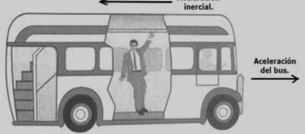

Analicemos ahora otra situación en la que se manifiesta la aceleración inercial:

#### **1.6 Peso aparente y ascensores en movimiento.**

Supongamos un pasajero que se encuentra dentro de un ascensor. Si el ascensor se pone en movimiento hacia arriba, este necesariamente acelera. Producto de la aceleración inercial (en este caso dirigido hacia abajo), la persona experimentará una sensación de **un aumento de su peso:**

$$\vec{P} = m \cdot (-\vec{g} - \vec{a}_{inercial})$$

En otras palabras, debido a la inercia, la persona tiene la tendencia a permanecer en reposo o con rapidez constante, entonces la presión que ejerce la persona sobre el suelo aumenta. Notemos que, en este **caso la masa de la persona se mantiene constante**, pero a la magnitud de la aceleración de gravedad se le suma la magnitud de la aceleración del ascensor, generando un peso distinto al que tendría una persona en reposo, lo que se denomina **peso aparente**.

Veamos ahora otro escenario, en el que un ascensor que estaba subiendo se detiene, esto es que acelera hacia abajo: En este caso, la aceleración inercial apunta hacia arriba, de modo que la **persona experimenta una sensación de disminución de su peso**. Por lo tanto, la magnitud del peso aparente del pasajero es menor a la magnitud del peso de la persona en reposo.

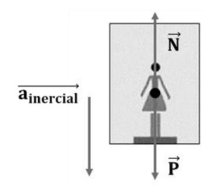

$$\vec{P} = m(-\vec{g} + \vec{a}_{inercial})$$

Vale decir que los fenómenos descritos ocurren en sistemas de referencia no inerciales, es decir sistemas de referencia en los que existe aceleración (cambio de velocidad).

# **1.7 Primera Ley de Newton y DCL**

Un diagrama de cuerpo libre (DCL) es la **simplificación de un sistema físico** de interés, que predecir su movimiento.

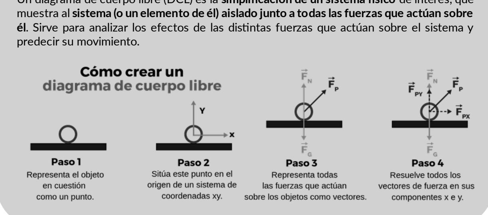

Veamos cómo se puede resolver un problema de 1era Ley de Newton usando diagramas de cuerpo libre.

**Ejercicio:** Si el bloque A está en reposo, ¿cuál es el valor la fuerza normal que ejerce la superficie sobre él?

$$\mathbf{A} \qquad \mathbf{m} = 5 \text{ kg}$$

**Solución:** Primero dibujamos las fuerzas que actúan sobre el cuerpo. Notemos que en este caso actúan solo las fuerzas normal y peso. Como conocemos la masa podemos calcular el valor del peso, obteniendo que:

$$\vec{P} = - m \cdot g = 5 \text{ kg} \cdot 10 \frac{m}{s^2} = -50 \text{ N}.$$

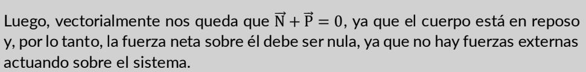

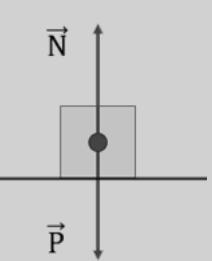

Finalmente sabemos que el módulo de dichos vectores cumple que:

$$N = P = 50N$$

Este resultado se puede extender a cualquier **cuerpo detenido sobre una superficie horizontal**: Si no hay más fuerzas actuando, siempre se cumplirá que la fuerza normal tiene igual magnitud que la fuerza peso. Esto permite explicar que el cuerpo no se mueva en dirección vertical.

**Ejercicio:** El bloque A se desliza sobre la superficie moviéndose con velocidad constante e igual a 3 m/s. Considere que el coeficiente de roce cinético entre el bloque y la superficie es 0,3. ¿Cuál es el valor de la fuerza horizontal ( $\overline{F_A}$ ) que se aplica sobre el bloque?

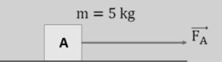

Solución: Primero dibujamos las fuerzas que actúan sobre el cuerpo.

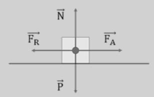

Notemos que, en este caso, en la línea vertical nuevamente actúan las fuerzas normal y peso, así que podemos concluir que:

$$N = P = 50N$$

Ahora bien, en el caso de la línea horizontal se cumple que

$$\overrightarrow{F_R} + \overrightarrow{F_A} = 0$$

Además, sabemos que  $\overrightarrow{F_R} = \mu \cdot N$ , que para los datos de nuestro problema resulta  $\overrightarrow{F_R} = 0.3 \cdot 50 = 15 \ N$ . Siguiendo la convención de signos nos queda que:

$$-15 \text{ N} + \overrightarrow{F_A} = 0 \rightarrow \overrightarrow{F_A} = 15 \text{ N}$$

# **1.8 Ejercicios propuestos**

1. de las siguientes opciones el bloque **puede** tener movimiento rectilíneo uniforme?

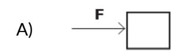

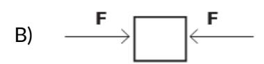

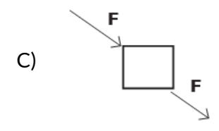

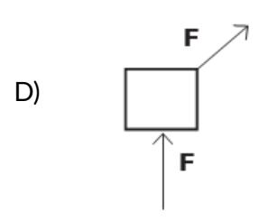

- 2. ¿Cuál es la característica principal de un "estado inercial"?
- A) La aceleración del cuerpo es constante.
- B) La fuerza neta sobre el cuerpo es constante.
- C) No hay fuerzas interactuando sobre el cuerpo.
- D) El cuerpo tiene velocidad constante.
- 3. Una persona, de 55 kg de masa, sobre un bus en movimiento con velocidad constante, siente un "frenazo" con una desaceleración de 7 m/s2 , lo que la hace perder el equilibrio ¿Cuál es la fuerza neta sobre la persona al momento en que la micro frena?
- A) 0 N
- B) 385 N
- C) 550 N
- B) 3850 N

| A | D | B |
|---|---|---|
| 3 | 2 | 1 |

#### **Completa el mapa conceptual (Clase 7)**

#### **En este espacio puedes tomar notas durante la clase:**

|   |  |
|------|--|
|      |  |
|      |  |
|      |  |
|      |  |
|      |  |
|      |  |
|      |  |
|      |  |
|      |  |
|      |  |
|      |  |
|      |  |
|      |  |
|      |  |
|      |  |
|      |  |
|      |  |
|      |  |
|      |  |
|      |  |
|      |  |
|      |  |
|      |  |
|      |  |
|      |  |
|      |  |
|      |  |
|      |  |
|      |  |
|   |  |
|      |  |
|      |  |
|      |  |
|      |  |
|      |  |
|      |  |
|      |  |
|      |  |
|      |  |

# **TEMA 2. TIPOS DE FUERZAS**

Como se habló en el tema anterior, un **diagrama de cuerpo libre** es una representación gráfica que muestra un objeto aislado del entorno y todas las fuerzas que actúan sobre él, incluyendo su magnitud, dirección y punto de aplicación. Este diagrama es una herramienta fundamental en física para analizar situaciones de equilibrio y movimiento, facilitando la resolución de problema.

Para elaborar un DCL debemos identificar los distintos tipos de fuerzas que actúan sobre él. A continuación, te mostramos los distintos **tipos de fuerza** que podrías tener que dibujar a la hora de hacer un DCL. Estas fuerzas se dibujan considerando que **cada cuerpo que compone el sistema es en verdad una partícula**, por lo que muchas veces se opta por dibujar las fuerzas desde el *centro de masa* de cada objeto.

# **2.1 Peso de un cuerpo (** ⃗⃗ **)**

El peso de un cuerpo corresponde a **la fuerza con que es atraído por la Tierra** (Fuerza de gravedad). Todo cuerpo, por el solo hecho de tener masa es atraído hacía la Tierra y por mismo los objetos al ser soltados desde una cierta altura**, siempre caen al piso**.

En la cercanía de la superficie terrestre, el peso se expresa matemáticamente como:

$$\vec{P} = \mathbf{m} \cdot \vec{\mathbf{g}}$$

En esta expresión, m es la masa del cuerpo y ⃗ **es la aceleración de gravedad**. La dirección de P es **la línea vertical y el sentido es siempre hacia la Tierra**, (la misma dirección que tienen la aceleración de gravedad (g⃗ ), que tal como muestra la figura.

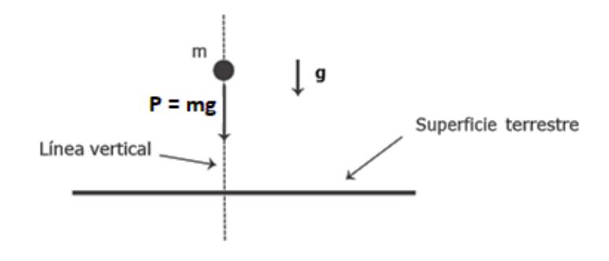

Tal como se puede deducir de la expresión anterior, cerca de la superficie terrestre, el peso de un objeto es **directamente proporcional a su masa**. Si bien estos conceptos se suelen usar como sinónimos, son **magnitudes físicas distintas**.

Entonces, una balanza mide ¿la masa o el peso de un cuerpo? No hay que perder de vista que peso es una medida de la atracción gravitatoria, de modo que una balanza detecta o "acusa" **esta atracción gravitatoria, la que se traduce en alguna deformación medible** por el sistema mecánico o electrónico de la balanza. Pero como esta atracción gravitatoria es directamente proporcional a la masa basta calibrar adecuadamente el instrumento para que proporcione una medida de masa.

Podemos decir que a **masas iguales** le corresponden **pesos iguales y recíprocamente** iguales pesos provienen de iguales masas.

Sin embargo, es importante notar que **un objeto que está en un planeta distinto a la Tierra experimentará una aceleración de gravedad distinta** a la de la Tierra. El módulo de la aceleración de gravedad de la Tierra se aproxima a 10 m/s2 , pero la aceleración de gravedad en la Luna es aproximadamente 1/6 la aceleración de gravedad de la Tierra.

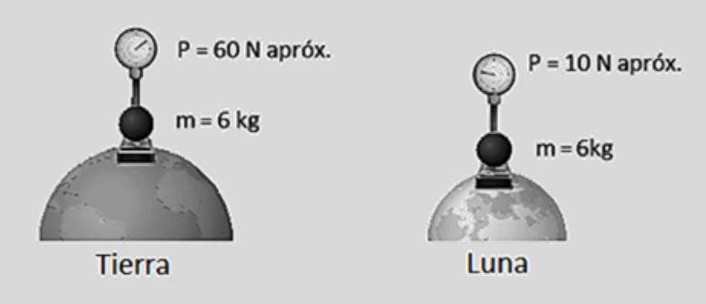

La aceleración de gravedad de cada planeta o satélite depende de sus dimensiones (masa y radio) y se deduce de la Ley de Gravitación universal. En la Tierra el módulo de g se aproxima a 10 m/s2 .

# **2.2 Fuerza Normal (** ⃗⃗⃗ **)**

Cuando un cuerpo está apoyado sobre una superficie, recibe desde esta una **fuerza perpendicular a la superficie**, denominada fuerza normal **(** ⃗⃗⃗ **)**. Para el caso de una superficie horizontal, la normal tiene igual dirección y sentido contrario al peso.

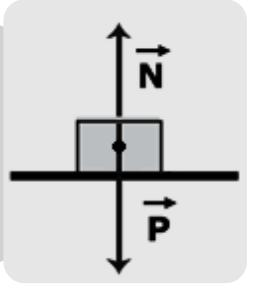

Ahora bien, si la **superficie no es horizontal**, podemos descomponer el peso rectangularmente de modo que una dirección sea tangente y la otra es perpendicular a la superficie.

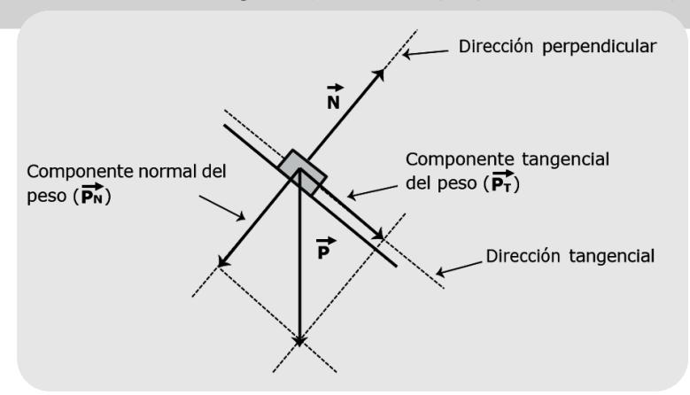

En este tipo de sistemas como el movimiento eventual es tangente a la superficie, las fuerzas en dirección perpendicular se anulan, de modo que el movimiento se deberá solo a la componente tangencial del peso, tal como se representa en la siguiente figura.

# **2.3 Tensión de un cable (** ⃗⃗ **)**

Un objeto que cuelga de un hilo estirado, tenso e inextensible, recibe una fuerza llamada tensión que actúa en **la dirección del hilo y en el sentido desde el cuerpo hacia el hilo**.

(Se reconoce como fuerza reactiva, ya que debe existir como mínimo una fuerza en sentido contrario para que esta aparezca)

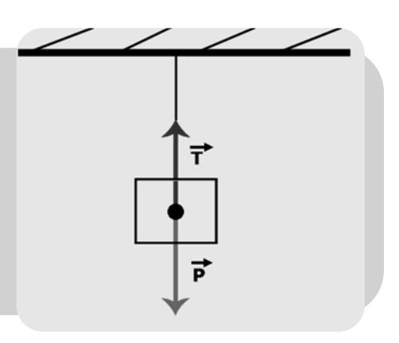

#### **2.4 Fuerzas de Roce o Fricción (** ⃗⃗⃗⃗⃗⃗ **)**

La fuerza de roce se define como la fuerza que aparece entre un cuerpo y la superficie que los sostiene, pero que, a diferencia de la fuerza normal, **se opone al deslizamiento de un objeto**. Esta depende de la rugosidad de la superficie y los materiales que interactúan entre sí. Existe dos tipos de fuerzas de roce: el **roce estático,** que **se opone al inminente movimiento de un objeto**, y el **roce cinético que se opone al movimiento de un objeto.**

Ambas fuerzas de roce son directamente proporcionales a la fuerza normal y se expresan matemáticamente como:

$$\overrightarrow{F_R} = \mu \cdot \overrightarrow{N}$$

Donde **es el coeficiente de roce** y depende del tipo de material de las superficies en contacto y del pulimiento entre ellas. Para distinguir si el roce es estático o cinético se suelen usar los subíndices y , respectivamente. En un DCL las graficaremos con la misma dirección y en sentido opuesto al movimiento (o posible movimiento) del objeto que se esté analizando.

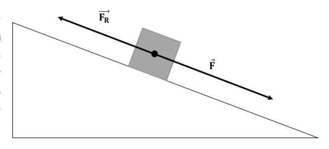

**Coeficiente de fricción estática (μE):** permite determinar la fuerza de roce estático. Representa la resistencia al movimiento entre dos superficies en contacto mientras permanece en reposo.

**Coeficiente de fricción dinámica (μD):** se utiliza para calcular la fuerza de roce dinámico. Describe la resistencia al movimiento relativo entre dos superficies cuando una se desliza sobre la otra.

Existen tres momentos claves en el estado de movimiento de cuerpo que son fundamentales para lograr identificar la magnitud del roce; cuando el cuerpo está en reposos, cuando el cuerpo este "a punto de moverse" y cuando el cuerpo está en movimiento.

| Reposo                         | Por moverse                        | Movimiento               |
|--------------------------------|------------------------------------|--------------------------|
| R= Fuerza en sentido contrario | N⃗ R máximo= μ𝑒𝑠𝑡á𝑡𝑖𝑐𝑜 ∙     | N⃗ R = μ𝑑𝑖𝑛é𝑚𝑖𝑐𝑜 ∙ |
|                                | Además μ𝑒𝑠𝑡á𝑡𝑖𝑐𝑜 > μ𝑑𝑖𝑛á𝑚𝑖𝑐𝑜 |                          |

Debido a que el coeficiente de roce estático es mayor que el coeficiente de roce dinámico de una misma superficie, un gráfico de fuerza de roce en función de la fuerza aplicada (en sentido contrario al roce) se ve como el de la derecha.

La **fuerza de roce** entre un cuerpo y una superficie puede **disminuirse o aumentarse** variando la fuerza normal que actúa sobre el objeto o modificando la rugosidad entre las superficies, lo que se obtiene **puliéndolas o lubricándolas**, afectando a los coeficientes de roce.

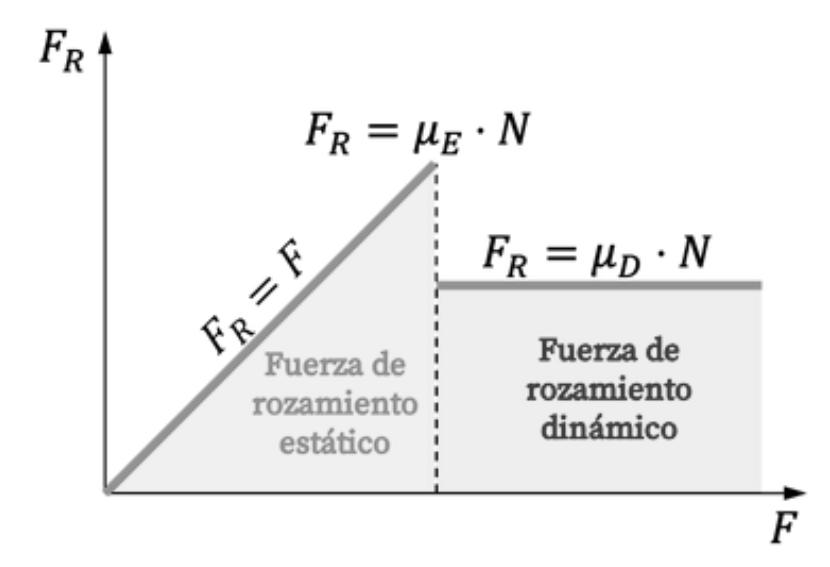

(Se reconoce como fuerza reactiva, ya que debe existir como mínimo una fuerza en sentido contrario para que esta aparezca)

Un beneficio importante del **roce es que nos permite caminar y correr**, pero si su valor es muy bajo, podemos fácilmente resbalar. Así mismo, para un vehículo con ruedas es muy importante la existencia del roce, pues **permite a las ruedas "rodar" y no resbalar**. Por otra parte, en un vehículo que viaja sobre un suelo mojado le cuesta más detenerse al aplicar los frenos, provocando que el vehículo "patine".

El **aire**, como medio material también produce una **fuerza de roce cinético**, sobre los objetos que caen, disminuyendo su velocidad de impacto con el suelo. Los paracaídas, por ejemplo, aprovechan el roce del aire y se componen de una gran superficie para aumentar el roce.

#### **2.5 Fuerza Elástica o Restauradora (** ⃗⃗⃗⃗⃗⃗ **) y Ley de Hooke**

Tal como mencionamos anteriormente, uno de los efectos que puede generar una fuerza es deformar un objeto. Uno de los objetos de particular interés en física son los resortes, en los cuales la fuerza que se aplica es directamente proporcional a su deformación y se expresa matemáticamente con la ley de Hooke, dada por la

expresión:

$$\overrightarrow{F_K} = -\mathbf{k} \cdot \Delta \vec{x}$$

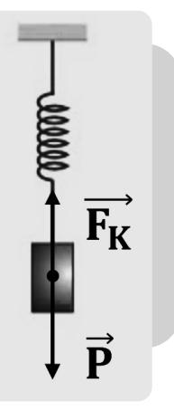

A la hora de realizar un DCL en un sistema con uno o más resortes, la fuerza que se debe dibujar es contraria a la fuerza que deforma el resorte y en la misma dirección del resorte.

Un instrumento utilizado para medir fuerzas es el dinamómetro. En el caso del dinamómetro mecánico su funcionamiento se basa en la ley de Hooke que describe el comportamiento de los resortes. La ley de Hooke señala que la fuerza ( ) con la que se estira (o comprime) es directamente proporcional a cuánto se estira (o comprime) el resorte (∆ ). Matemáticamente se expresa como:

$$F_k = \, - K \cdot \Delta \vec{x}$$

donde **k es la constante de proporcionalidad o constante de elasticidad** del resorte que es una propiedad del resorte e indica qué tan difícil es comprimir un resorte. La unidad de medida de la constante es N/m.

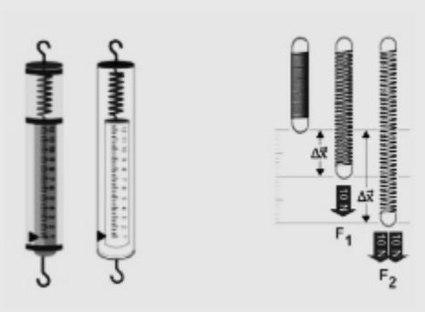

En este caso, el signo de la ley de Hooke señala **que la fuerza que se ejerce sobre el resorte tiene sentido contrario a la fuerza elástica o restauradora** que devuelve el resorte a su estado original.

Ahora que tenemos claro cuáles son los tipos de fuerza, construyamos un diagrama de cuerpo libre.

**Ejemplos**: Dibuja el diagrama de cuerpo libre para los siguientes cuerpos A y B, que se encuentran en reposo y que están unidos por una cuerda inextensible que pasa por una polea sin masa.

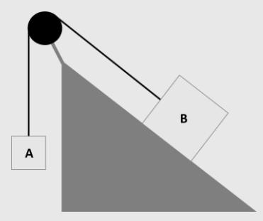

**Solución:** Debemos analizar las fuerzas que actúan sobre cada cuerpo por separado.

Notemos que sobre el cuerpo A actúa la fuerza peso y la fuerza tensión. Por su parte, sobre el cuerpo B actúa también la fuerza peso, la fuerza normal, la fuerza tensión y la fuerza de roce estático (se asume que existe roce a menos que se señale lo contrario).

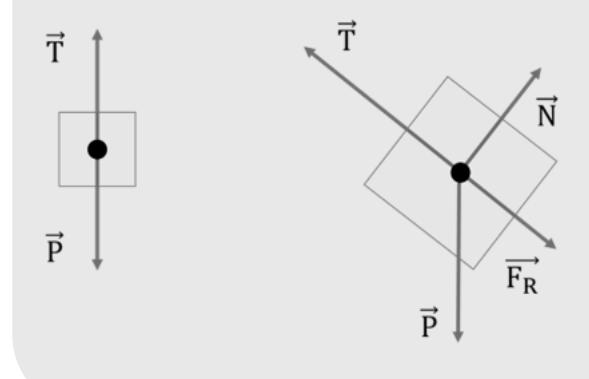

# **2.6 Ejercicios propuestos**

- 1. Sobre un resorte se ejerce una fuerza de 75 N, producto de lo cual éste se estira 3 cm. ¿Determine cuál es el valor de la constante del resorte?
  - A) 25 N/m
  - B) 250 N/m
  - C) 2 500 N/m
  - D) 0,04 N/m
  - E) 0,4 N/m
- 2. Anclado al techo de una casa cuelga hacia abajo un resorte. En el extremo inferior tiene una masa colgando de 2 Kg y el resorte presenta una longitud de 20 cm. Si la masa se cambia por otra de 3,3 Kg el resorte presenta una longitud de 21,3 cm. ¿Cuál es la longitud inicial del resorte sin masas colgando de él? Considere g =10 m/s2 .
  - A) 0,19 m
  - B) 18 cm
  - C) 1 000 N/m
  - D) 10 cm
  - E) 1,8 m
- 3. En el sistema descrito en la figura adjunta, ¿cuántas fuerzas están actuando sobre el sistema de poleas?

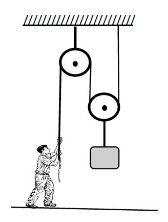

- A) 7
- B) 6
- C) 5
- D) 4
- E) 3

- 4. Se realizaron dos experimentos para estudiar el coeficiente de roce cinético entre dos cajas de distinto material, pero igual masa y dos superficies horizontales de distinta naturaleza utilizando la misma fuerza aplicada F horizontales para mover las dos cajas. En el experimento 1 se obtuvo un coeficiente de roce cinético de 0,4 y en el experimento 2 un coeficiente de roce cinético 0,2. ¿Cuál de las siguientes conclusiones es consistente con los resultados experimentales obtenidos?
  - A) En el experimento 1 la magnitud de la fuerza Normal fue mayor que en el experimento 2.
  - B) En el experimento 1 existió una mayor rugosidad entre las superficies en contacto que en el experimento 2.
  - C) En el experimento 1 la caja tuvo una mayor aceleración que en el experimento 2.
  - D) En el experimento 1 existió una menor rugosidad entre las superficies en contacto que en el experimento 2.

| D | B | D | C |
|---|---|---|---|
| 4 | 3 | 2 | 1 |

#### **Completa el mapa conceptual (Clase 8)**

#### **En este espacio puedes tomar notas durante la clase:**

| <u> </u> |  |
|----------|--|
|          |  |
|          |  |
| i     |  |
|          |  |
|          |  |
|          |  |
|          |  |
|          |  |
|          |  |
|          |  |
| )        |  |
|          |  |
|          |  |
|          |  |
| j        |  |
| <u> </u> |  |
|          |  |
|          |  |
|          |  |
|          |  |
|          |  |
|          |  |
|          |  |
|          |  |
| <u> </u> |  |
|          |  |
|          |  |
|          |  |
|          |  |
|          |  |
|          |  |
|          |  |
|          |  |
|          |  |
|          |  |
|          |  |
| ;     |  |
|          |  |
|          |  |
|          |  |
|          |  |
|          |  |
|          |  |
|          |  |
|          |  |
|          |  |
|          |  |
|          |  |
|          |  |
|          |  |
|          |  |
|          |  |
|          |  |
|          |  |
|          |  |
|          |  |
|          |  |
|          |  |
|          |  |
|          |  |
|          |  |
|          |  |
|          |  |
|          |  |
| <u> </u> |  |
|          |  |
|          |  |
| L        |  |
|          |  |
|          |  |
|          |  |
|          |  |
|          |  |
|          |  |
|          |  |

# **TEMA 3. SEGUNDA LEY DE NEWTON: LEY DE FUERZA**

## **3.1 Enunciado de la Segunda Ley de Newton: Ley de masa**

*"La aceleración que experimenta un cuerpo es proporcional a la fuerza neta que actúa sobre él e inversamente proporcional a la masa".*

Es considerada **el principio fundamental de la mecánica** se expresa como:

$$\vec{F} = m \cdot \vec{a}$$

Lo esencial de esta ley es que **la fuerza es la causa del cambio en la velocidad** de los objetos, ya sea un cambio de **dirección o un cambio de rapidez**.

La gran mayoría de los problemas en física consideran **sistemas de masa constante**, por lo que, considerando los módulos de los vectores involucrados, la ley se puede expresar de la forma:

$$m = \frac{F}{a}$$

### **3.2 Segunda Ley de Newton y DCL**

Veamos algunos problemas que se resuelven aplicando la Segunda Ley de Newton con la ayuda de diagramas de cuerpo libre.

**Ejercicio:** Considere el bloque A de la figura, ¿cuál es el valor de la fuerza neta horizontal (FA ⃗⃗⃗ ) aplicada sobre el bloque?

$$\mathbf{A} = 5 \text{ kg}$$

$$\mathbf{a} = 2 \frac{\mathbf{m}}{\mathbf{s}^2}$$

$$\overrightarrow{\mathbf{F}_A}$$

**Solución:** Podemos aplicar directamente la ecuación de la ley de fuerza de modo que

$$\vec{F} = m \cdot \vec{a} = 5 \cdot 2 = 10 \text{ N}$$

Por lo tanto, sobre el bloque se aplica una fuerza de 10 N hacia la derecha.

**Ejercicio:** Considere el bloque A de la figura, ¿cuál es el valor de la fuerza horizontal  $(\overrightarrow{F_A})$  aplicada sobre el bloque?

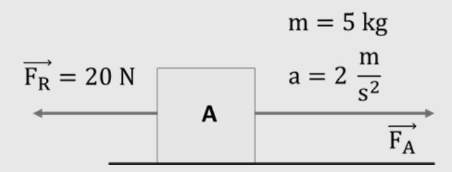

Solución: Podemos aplicar directamente la ecuación de la ley de fuerza de modo que

$$\overrightarrow{F_{\text{neta}}} = m \cdot \overrightarrow{a} = 5 \cdot 2 = 10 \text{ N}$$

En este caso, la fuerza neta sobre el bloque se aplica es de 10 N hacia la derecha. Para determinar el valor de la fuerza aplicada  $(\overrightarrow{F_A})$  escribimos la suma de fuerzas sobre el bloque, obteniéndose que:

$$\overrightarrow{F}_{neta} = \overrightarrow{F}_A + \overrightarrow{F}_R$$

$$F_{neta} = F_A - F_R$$

$$10 = F_A - 20 \quad \rightarrow \quad F_A = 30 \text{ N}$$

Finalmente, sobre el bloque se aplica una fuerza de 30 N hacia la derecha.

### **3.3 Ejercicios propuestos**

- 1. Sobre un bloque de masa m, actúan tres fuerzas horizontales F, 2F y 3F que provocan que el bloque se mueva con rapidez constante en una superficie rugosa. ¿Qué valor debe tener la fuerza neta?
- A) FN= 6F
- B) FN= 4F
- C) FN= 2F
- D) FN= 0
- 2. Al término de una prueba de física, tres estudiantes comentan sus respuestas a varias preguntas sobre fuerza y sus efectos.
- **Estudiante 1**: El movimiento de un cuerpo siempre se produce en la dirección y sentido de la fuerza neta.
- **Estudiante 2**: Si sobre un cuerpo no actúa ninguna fuerza o si la fuerza neta es nula, el cuerpo está en reposo.
- **Estudiante 3**: Si en un instante la rapidez con que se mueve un cuerpo es nula, la fuerza neta en ese mismo instante también lo será.
- ¿Quién o quiénes dieron una respuesta correcta?
- A) Estudiante 1.
- B) Estudiante 2.
- C) Estudiante 3.
- D) Estudiantes 1 y 2.
- E) Estudiantes 1 y 3.
- 3. En la figura se muestra dos masas unidas por una cuerda ideal que pasa por una polea sin masa. La superficie por donde se mueve la masa *m* no posee roce. ¿Cuál es la relación entre la aceleración de M y m (aM: am)?

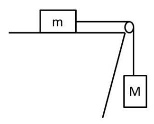

- A) 2:1
- B) 1:1
- C) 1:2
- D) 1:4

4. Claudia realiza un experimento de laboratorio en el cual se ubica un bloque sobre un plano inclinado con roce homogéneo como se muestra en la figura adjunta.

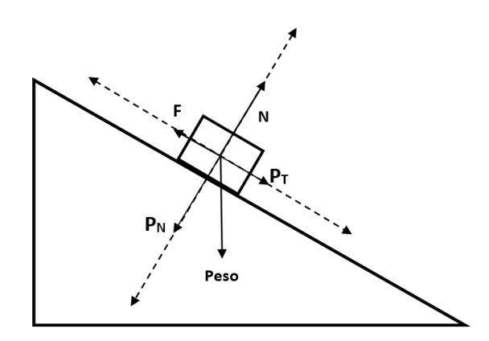

Si **F** es la magnitud de la fuerza de roce entre el bloque y el plano inclinado, **PT** es la magnitud de la componente tangencial del peso, **PN** la componente normal de la magnitud del peso y **N** es la magnitud de la fuerza normal y sus magnitudes son **F**=2(N), **PT**=3(N), **PN**=4(N) y **N**=4(N), ¿cuál de las siguientes conclusiones respecto del estado de movimiento que presentará el bloque es correcta?

- A) El bloque se deslizará por el plano inclinado con rapidez constante.
- B) El bloque se deslizará por el plano inclinado con aceleración constante.
- C) El bloque no se moverá porque las fuerzas están todas equilibradas.
- D) El bloque primero se moverá con rapidez constante y luego con aceleración constante.

5. Tres vehículos idénticos de masa 4M se desplazan sobre una superficie lisa sin roce, gracias a que el de más atrás realiza una fuerza de magnitud 3F.

¿Cuál es el valor de la aceleración del sistema?

- A) 4 *F M*
- B) 12*FM*
- C) 1 4 *F M*
- D) 3 4 *F M*
- E) *F M*

| C | B | B | C | D |
|---|---|---|---|---|
| 5 | 4 | 3 | 2 | 1 |

#### **Completa el mapa conceptual (Clase 9)**

#### **En este espacio puedes tomar notas durante la clase:**

|              |      |   |
|--------------|------|------|
|              |   |   |
|           |   |   |
| }            |   |   |
|              |   |   |
|              |   |   |
|              |   |   |
|              |   |   |
|              |   |   |
|              |   |   |
|              |   |   |
|              |   |   |
|              |   |   |
|           |   |   |
|              |   |   |
|              |   |   |
|              |   |   |
|              |      |   |
|              |   |   |
|              |   |   |
|              |   |   |
|              |   |   |
|              |   |   |
| ļ            |   |   |
|              |   |   |
|              |   |   |
|              |   |   |
|              |   |   |
|              |   |   |
|              |   |   |
|           |   |   |
|              |      |   |
|              |   |   |
|              |   |   |
|              |   |   |
| <del> </del> |   |   |
|              |   |   |
|              |   |   |
|              |   |   |
|              |   |   |
|              |   |   |
|              |   |   |
| ļ            |   |   |
|              |   |   |
|              |   |   |
|              |   |   |
|              |      |      |
|              |   |   |
|              |      |   |
|              |   |   |
|              |   |   |
|              |   |   |
|              |   |   |
|              |   |   |
|              |   |   |
|              |   |   |
|              |      |      |

# TEMA 4: TERCERA LEY DE NEWTON: ACCIÓN Y REACCIÓN

# 4.1 Enunciado de la Tercera Ley de Newton

Imaginemos que dos personas están de pie sobre una pista de hielo tratando de empujarse. Cuando una de ellas empuja a la otra lo que ocurre es que ambas se mueven hacia atrás ¿Por qué ocurre esto?

Este ejemplo ilustra la Tercera ley de Newton de Acción y Rección que establece que:

"Si un objeto A ejerce una fuerza sobre un objeto B, entonces el objeto B ejerce instantáneamente sobre A una fuerza de igual dirección y magnitud, pero en sentido contrario"

# ¿En qué situaciones podemos observar la Tercera Ley de Newton?

- Al saltar en una cama elástica: las personas se impulsan hacia abajo y la cama elástica los empuja hacia arriba.
- Cuando se desinfla un globo los gases contenidos en él ejercen una fuerza cuya reacción sobre el globo que lo empuja hacia adelante con una velocidad de sentido opuesto a la de los gases que salen del globo.
- Cuando despega un cohete al interior de él y por diversas reacciones químicas, se genera un impulso en contra del suelo cuya reacción eleva el cohete por los aires sacándolo al espacio.

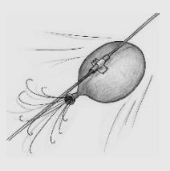

Se dice que estas fuerzas forman un par acciónreacción y una de sus principales características\nes que son simultáneas y actúan siempre sobre
cuerpos diferentes. Además, son consideras
como fuerzas internas al sistema. Esta
apreciación es útil ya que nos permiten distinguir
la Tercera Ley de Newton de la Segunda Ley, que
considera las fuerzas externas que actúan sobre\nun sistema u obieto.

Notemos que, independiente del valor de las masas de los cuerpos, si el cuerpo A ejerce una fuerza sobre el cuerpo B, digamos  $\vec{F}_{AB}$ , simultáneamente el cuerpo B ejercerá sobre A digamos  $\vec{F}_{BA}$  de igual magnitud y dirección, pero de sentido contrario, lo que matemáticamente podemos expresar como:

$$\vec{F}_{AB} = -\vec{F}_{BA}$$

Sin embargo, si uno de los dos cuerpos tiene una masa considerablemente menor, por la Primera Ley de Newton este cuerpo tenderá a acelerar mucho más. Esto explica, por ejemplo, cómo podemos caminar: Nosotros ejercemos una fuerza sobre la Tierra y la Tierra ejerce una fuerza sobre nosotros. Si bien ambas fuerzas tienen igual magnitud, pero sentidos contrarios, dado que la masa de la Tierra es considerablemente mayor, el efecto de la fuerza que nosotros ejercemos sobre ella es imperceptible, en cambio nosotros podemos caminar sobre ella.

Un ejemplo de la Ley de Acción y Reacción, pero con cuerpos a distancia es la atracción gravitatoria entre los cuerpos del Universo. Un caso de ejemplo puede ser la atracción entre la Tierra y la Luna.

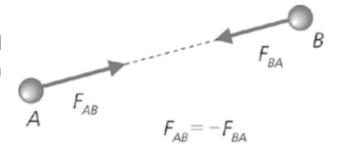

# **4.2 Tercera Ley de Newton y DCL**

Veamos un problema típico de la Tercera Ley de Newton que se puede resolver usando diagramas de cuerpo libre. Este tipo de problema consiste en encontrar las **fuerzas de contacto** entre dos objetos que son un **ejemplo de pares de fuerza acción-reacción**.

**Ejercicio:** Considere el sistema de la figura, ¿cuál es el valor de la fuerza de contacto (FAB ⃗⃗⃗⃗⃗ )? En otras palabras, buscamos la fuerza que ejerce el cuerpo A sobre el cuerpo B:

$$m_{A} = 20 \text{ kg}$$

$$m_{B} = 10 \text{ kg}$$

$$\overrightarrow{F_{neta}} = 60 \text{ N}$$

$$A$$

$$B$$

**Solución:** Consideremos que en este sistema los bloque se mueven juntos por acción de la fuerza neta externa**.** Primero evaluamos la **aceleración del sistema** de cuerpos utilizando el segundo principio de Newton, para ellos consideramos la masa del sistema completo y que el **sentido de la aceleración** es **igual al de sentido de la fuerza neta**:

$$\overrightarrow{F_{\text{neta}}} = m \cdot \overrightarrow{a} \rightarrow 60 \ N = (20 + 10) \text{kg} \cdot \text{a} \rightarrow \text{a} = \frac{60}{30} = 2 \frac{\text{m}}{\text{s}^2} \text{ hacia la derecha$$

Ahora, para evaluar la fuerza de contacto entre ambos bloques, podemos **aislar uno de los bloques y dibujar un DCL**. Aislemos el cuerpo A y notemos que, sobre él las fuerzas externas son Fneta ⃗⃗⃗⃗⃗⃗⃗⃗⃗ y FBA ⃗⃗⃗⃗⃗ . Además, sabemos cuál es la aceleración de ese bloque:

Fneta = 60 N  

$$\overrightarrow{F_{BA}}$$
 =?  
 $\overrightarrow{F_{BA}}$  =?  
 $\overrightarrow{F_{BA}}$  =?  
 $\overrightarrow{F_{BA}}$  =  $\overrightarrow{F_{BA}}$   
 $20 \cdot 2 = 60 + F_{BA}$   
 $40 - 60 = F_{BA}$   $\rightarrow$   $F_{BA} = -20 \text{ N}$ 

Por lo tanto FBA = −20 N. El signo (-) nos indica que las fuerza es por, convención, hacia la izquierda. Sabemos, además, que se debe cumplir que FAB = 20 N, en dirección hacia la derecha.

# **4.3Ejercicios propuestos**

1. Sobre un sistema compuesto por dos bloques de masas M y m respectivamente que están en contacto, se aplica una fuerza F, como se indica en la figura adjunta.

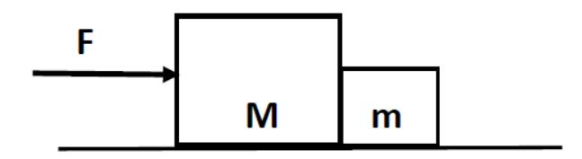

Si no hay roce en con la superficie de contacto, para que el conjunto de los dos bloques se mueva con rapidez constante se debe de cumplir que:

- A) La fuerza de reacción de m sobre M debe ser mayor a F.
- B) La fuerza de acción de M sobre m sea igual a F.
- C) La fuerza de reacción de m sobre M sea igual a F.
- D) La fuerza F debe ser siempre mayor que las fuerzas de acción-reacción.
- E) En ningún caso los bloques M y m se pueden mover con rapidez constante.
- 2. Una persona empuja una caja cilíndrica de masa 2 kg con una fuerza constante de 20 N por una superficie sin roce y a la vez la caja cilíndrica empuja otra caja rectangular de 1 kg. cómo se observa en la figura adjunta.

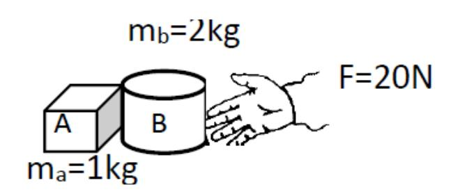

Al moverse el sistema se puede afirmar que:

- A) La caja B ejerce más fuerza sobre la caja A que la que la caja A aplica a la caja B.
- B) La caja B ejerce menos fuerza sobre la caja A que la que la caja A aplica sobre la caja B.
- C) La caja B ejerce una fuerza sobre la caja A de igual magnitud que la caja A aplica sobre la caja B.
- D) La caja A no ejerce fuerza sobre la caja B.
- E) El sistema no se puede mover porque la fuerza aplicada a la caja B no es suficiente.

- 3. Una persona empuja una pared de concreto inamovible. ¿Cuál de las siguientes afirmaciones es correcta?
- A) La pared no aplica fuerza a la persona porque no se puede mover.
- B) La fuerza que puede aplicar la persona no puede sobrepasar su peso.
- C) La fuerza que aplica la persona a la pared es la misma que la pared aplica a la persona.
- D) La fuerza de roce entre la superficie de apoyo y la persona tiene sentido contrario a la fuerza que aplica la persona.
- 4. El vector de la figura representa a la fuerza de acción de un cierto par acción–reacción. ¿Qué opción representa mejor a la fuerza de reacción?

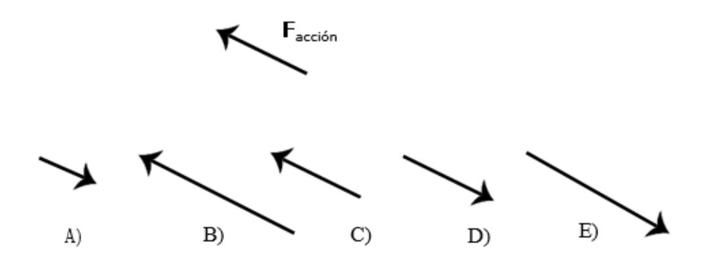

5. En un experimento de laboratorio, se aplica una fuerza neta F sobre un sistema de tres cuerpos **M**, **2M** y **3M** sobre una superficie donde se puede despreciar el roce como se muestra en la figura adjunta.

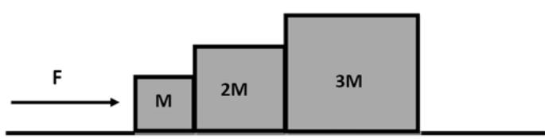

¿Cuál de las siguientes leyes físicas permite determinar las fuerzas de contacto entre los bloques?

- A) La ley de gravitación universal de Newton.
- B) La ley de elasticidad de Hooke.
- C) La ley de inercia de Newton.
- D) La ley de fuerza y aceleración y la ley de acción y reacción.

| D | C | C | E | C |
|---|---|---|---|---|
| 5 | 4 | 3 | 2 | 1 |

#### **Completa el mapa conceptual (Clase 10)**

#### **En este espacio puedes tomar notas durante la clase:**

| <u> </u> |  |
|----------|--|
|          |  |
|          |  |
| i     |  |
|          |  |
|          |  |
|          |  |
|          |  |
|          |  |
|          |  |
|          |  |
| )        |  |
|          |  |
|          |  |
|          |  |
| j        |  |
| <u> </u> |  |
|          |  |
|          |  |
|          |  |
|          |  |
|          |  |
|          |  |
|          |  |
|          |  |
| <u> </u> |  |
|          |  |
|          |  |
|          |  |
|          |  |
|          |  |
|          |  |
|          |  |
|          |  |
|          |  |
|          |  |
|          |  |
| ;     |  |
|          |  |
|          |  |
|          |  |
|          |  |
|          |  |
|          |  |
|          |  |
|          |  |
|          |  |
|          |  |
|          |  |
|          |  |
|          |  |
|          |  |
|          |  |
|          |  |
|          |  |
|          |  |
|          |  |
|          |  |
|          |  |
|          |  |
|          |  |
|          |  |
|          |  |
|          |  |
|          |  |
| <u> </u> |  |
|          |  |
|          |  |
| L        |  |
|          |  |
|          |  |
|          |  |
|          |  |
|          |  |
|          |  |
|          |  |

# **TEMA 5. PRESIÓN EN SÓLIDOS, LÍQUIDOS Y GASES.**

En este apartado, exploraremos dos tipos principales de presión: **la presión mecánica**, que se aplica en sólidos y describe situaciones como el peso ejercido por un objeto sobre una superficie, y la **presión hidrostática**, que se relaciona con los fluidos en reposo y es clave. para entender fenómenos como la flotación o la fuerza ejercida por líquidos a distintas profundidades. Para poder cumplir es premisa, es necesario recordar algunos conceptos previos.

#### **5.1 Estados de la Materia**

Los tres estados comunes de la materia son: sólido, líquido y gaseoso. Algunas sustancias, en condiciones normales de presión y temperatura, se pueden encontrar en más de un estado, tal como ocurre en el caso del agua o de algunos metales.

## **¿Cómo se diferencian los distintos estados de la materia?**

Los **sólidos tienden a conservar su forma y tamaño fijos**. No son compresibles, esto significa que no cambian su volumen fácilmente, incluso si se les aplica una gran fuerza. A nivel microscópico sus partículas tienen una **fuerte fuerza de cohesión** que las mantiene unidas. Los sólidos en general se caracterizan por la rigidez y regularidad de sus estructuras.

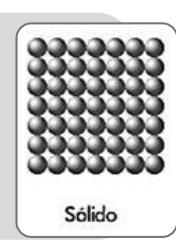

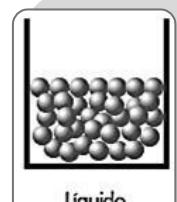

Los **líquidos no conservan su forma fija**, sino que toman la forma de su recipiente. Al igual que los sólidos, no son compresibles y su volumen no cambia fácilmente si se les aplica una fuerza. A nivel microscópico sus partículas tienen mayor libertad de movimiento que los sólidos y **se dice que su fuerza de cohesión es media.**

Los gases no tienen forma ni volumen fijo. Se expanden hasta llenar el recipiente que los contiene y sus características físicas cambian fácilmente frente a variaciones de presión y temperatura. Los gases son compresibles, es decir, es posible reducir su volumen. A nivel microscópico sus partículas tienen mayor energía cinética (movimiento) y **las fuerzas de cohesión entre ellas es débil**.

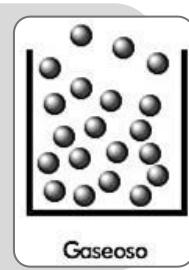

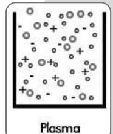

Existe un cuarto estado de la materia, el **plasma**. Este estado es posible encontrarlo en temperaturas suficientemente altas para que los electrones se separen completamente de los núcleos atómicos (átomos ionizados), lo cual los convierte en buenos conductores de la electricidad. La materia de las estrellas normalmente está en estado plasmático.

La siguiente figura representa la **movilidad** de las moléculas en cada estado: Cuando existe un aumento de la temperatura de las sustancias, en el estado sólido las partículas pueden vibrar, pero mantienen su posición relativa; en el estado líquido las partículas tienen mayor movilidad y no mantienen su posición entre sí; en el estado gaseoso las partículas tienen gran energía cinética y tienden a ocupar todo el volumen disponible.

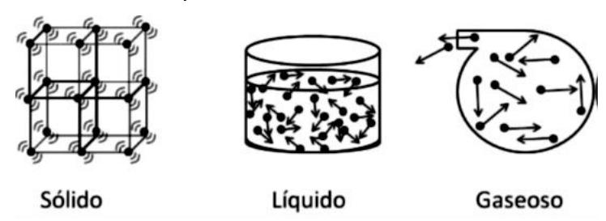

Como los **líquidos y gases no conservan una forma fija**, se dice que ambos tienen la capacidad de fluir, lo que los agrupa en una sola **categoría: los fluidos**.

# **5.2Densidad (ρ)**

Seguro en tu infancia escuchaste la pregunta: "¿Qué pesa más: un kilogramo de plumas o un kilogramo de hierro?" Claramente esta era una pregunta trampa, porque ambos pesan (y masan) lo mismo, sin embargo, un kilo de plumas ocupa bastante más espacio que un kilogramo de hierro. Detrás de esta idea está el concepto de densidad.

La **densidad volumétrica** de una sustancia se puede definir como la **cantidad de materia que ocupa una sustancia en un determinado volumen**. Suele indicarse con la letra rho (ρ) minúscula del alfabeto griego y se expresa matemáticamente como:

$$\rho = \frac{m}{V}$$

Su unidad de medida en SI es , pero también se suele expresar en .

# **5.3 Presión (P)**

La presión es una magnitud escalar que relaciona la magnitud de una fuerza que se ejerce sobre una superficie de área conocida. En concreto, si se aplica una **fuerza (** ) **perpendicularmente sobre una superficie de área (A)**, la presión es la magnitud de la fuerza que se ejerce por unidad de área, lo que matemáticamente se expresa como:

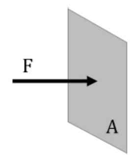

$$\mathbf{P} = \frac{\mathbf{F}}{\mathbf{A}}$$

Notemos que la presión es **directamente proporcional a la fuerza** aplicada e **inversamente proporcional a la superficie** sobre la cual se aplica la fuerza.

En el Sistema Internacional de Unidades (SI) la presión se mide en pascales (Pa), que corresponde a la fuerza de un newton sobre un metro cuadrado, es decir

$$1 Pa = \frac{1N}{1m^2}$$

**¿Qué pasa si la fuerza aplicada no es perpendicular a la superficie?** 

En este caso, para conocer el valor de la presión, es necesario descomponer vectorialmente la fuerza y considerar solo la componente que es **perpendicular a la superficie, ya que es la única que ejerce presión sobre ella.** 

Como se observa en la imagen de la derecha, se aplica una fuerza F sobre la superficie, pero solo la componente F' es la ejerce presión sobre esta última.

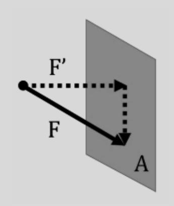

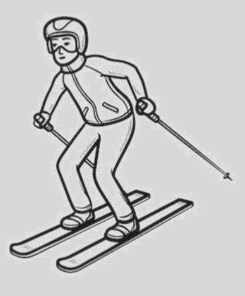

**Aplicación:** ¿Por qué una persona que camina por la nieve tiende a hundirse, pero una persona que usa esquís no?

Supongamos que una misma persona camina por la nieve y luego se sube a un par de esquí. Cuando la persona camina, **su fuerza peso se distribuye en la superficie de sus zapatos**, en cambio cuando se sube a los esquís, **ese mismo peso se distribuye en la superficie de ambos esquís, que es mucho mayor.** En definitiva, se ejerce una mayor presión cuando la persona camina porque el área de contacto (superficie) disminuye; y, en caso contrario, la presión aumenta cuando la persona usa los esquís porque el área de contacto (superficie) es mayor. Lo anterior ocurre porque la presión es inversamente proporcional a la superficie.

Ahora que ya hemos presentado el concepto de presión estudiaremos, en específico, la **presión que realizan fluidos que se encuentran en reposo**.

### **5.4 Presión Hidrostática**

Tanto los objetos sólidos como los fluidos pueden ejercer presión sobre distintas superficies y recipientes. En particular, diremos que la **presión hidrostática es aquella que genera la fuerza peso de un fluido que se encuentra en reposo**. Físicamente se cumple dos propiedades interesantes:

Supongamos que un cuerpo se encuentra en reposo sumergido en un fluido. En un punto del fluido en reposo, **la fuerza, debido a la presión, es la misma en todas las direcciones** (igual módulo). Si no fuera así, el cuerpo sumergido se movería, contradiciendo el hecho de que el fluido está en reposo.

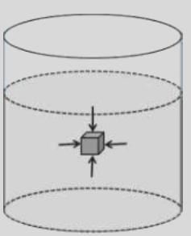

En un recipiente que contiene un fluido en reposo, **la presión hidrostática provoca una fuerza que siempre es perpendicular a la superficie del envase**. Si existiera una fuerza paralela al envase, por reacción, el fluido recibiría una fuerza en sentido opuesto y se movería.

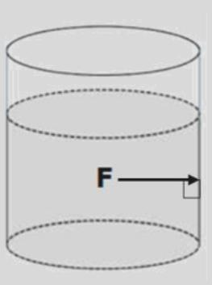

**Aplicación:** En la figura se representa el corte transversal de un envase que contiene agua. Si el envase de la figura contiene agua y está abierto en su parte superior. Las fuerzas generadas debido a la presión ejercida en las paredes internas del recipiente se señalan en la figura de la derecha y todas tienen el mismo módulo:

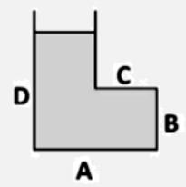

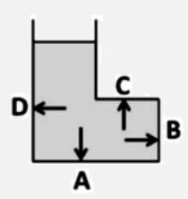

A continuación, exploraremos cómo es posible expresar la presión hidrostática en función de las propiedades del fluido, en lugar de las características del recipiente que lo contiene. Para ello, nos enfocaremos en responder la siguiente pregunta:

*¿Cuál será la presión hidrostática en el fondo de un estanque cilíndrico de profundidad H y área basal A que contiene un fluido de densidad ρ?*

Sabemos que la presión en el fondo del estanque se puede calcular con la definición de presión:

$$P = \frac{F}{A}$$

Ahora bien, la fuerza que se ejerce sobre el fondo corresponde al **peso del fluido**, de modo que F se puede expresar como:

$$\mathbf{F} = \mathbf{m} \cdot \mathbf{g}$$

Lo que nos queda ahora es expresar la masa del fluido en términos de su densidad. Sabemos que la densidad de un fluido se expresa como:

$$\rho = \frac{m}{V} \to m = \rho \cdot V$$

A su vez, el volumen del fluido corresponde al volumen del cilindro de base A y altura H:

$$\mathbf{V} = \mathbf{A} \cdot \mathbf{H}$$

Reemplazando lo anterior la expresión para la presión, se obtiene:

$$P = \frac{F}{A} \rightarrow \ P = \frac{m \cdot g}{A} = \frac{\rho(A \cdot H)g}{A} \rightarrow P = \rho \cdot g \cdot H$$

La expresión anterior muestra que la **presión hidrostática** en el fondo del estanque depende la **densidad del fluido (), la aceleración de gravedad (g) y la profundidad del envase (H**).

El desarrollo anterior se puede extender al cálculo de la presión ejercida por un fluido a una profundidad determinada. Esta relación constituye la **ecuación fundamental de la hidrostática**, una herramienta clave para comprender diversas situaciones relacionadas con fluidos en reposo.

Entre otras cosas, esta ecuación nos muestra que el valor de **la presión hidrostática no depende del área ni de la forma del recipiente** que contiene el fluido.

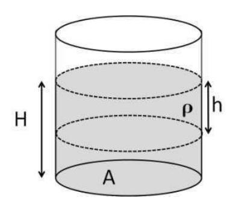

**Aplicación:** Los cuatro vasos contienen agua en reposo. ¿Cuál de ellos tiene mayor presión en la profundidad h?

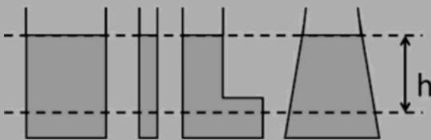

Todos tienen igual densidad (mismo líquido) y profundidad de agua, por lo tanto, todos tienen la misma presión hidrostática, ya que **el valor de presión no depende del área basal ni de la forma del recipiente**.

#### **5.5 Vasos comunicantes:**

En física se llama vasos comunicantes al conjunto de recipientes que contienen un líquido homogéneo y que están conectados ya sea en su parte inferior, como es el caso de la figura, o bien por su parte superior o lateral.

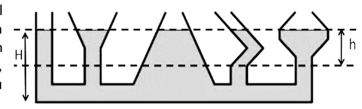

La gracia de este tipo de sistemas es que, independientemente de cómo se les añada agua, cuando el líquido esté en reposo, siempre se cumplirá que **todos los recipientes alcanzarán el mismo nivel de agua**.

#### **5.6Principio fundamental de la hidrostática**

Ya vimos que la presión hidrostática de un fluido en reposo se expresa matemáticamente como:

$$\mathbf{P} = \mathbf{\rho} \cdot \mathbf{g} \cdot \mathbf{H}$$

Esto se conoce como el principio fundamental de la hidrostática y de él se puede deducir que:

"En todos los puntos de un plano horizontal de un fluido en equilibrio, la presión hidrostática tiene el mismo valor"

Este principio se aplica mucho en la resolución de situaciones que involucran fluidos. La clave está en encontrar el plano horizontal más adecuado según los datos del problema.

Por ejemplo, en el tubo en U de la figura hay dos líquidos en equilibrio (1 y 2). Por el principio fundamental, en la línea horizontal punteada sabemos que la presión debe ser la misma en ambos lados del tubo. Entonces:

$$P_1 = P_2 \to \; \rho_1 g h_1 = \; \rho_2 g h_2 \to \; \; \rho_1 h_1 = \; \rho_2 h_2$$

De esta última ecuación se concluye que, en un problema de este tipo, **las alturas de las columnas de fluidos serán inversamente proporcionales a las densidades.**

$$\frac{\rho_1}{\rho_2} = \frac{h_2}{h_1}$$

## **5.7 Principio de Pascal**

Hasta ahora hemos considerado la presión hidrostática de los líquidos en un recipiente. Notemos que, sobre una columna de líquido perfectamente puede haber una columna de otro fluido ejerciendo presión, o bien, se puede aplicar una presión externa sobre un fluido en equilibrio. Este tipo de situaciones son descritas por el Principio de Pascal:

*"Sobre un fluido incompresible que se encuentra en reposo al interior de un recipiente de paredes indeformables, la presión externa que se ejerce sobre él se transmite con igual intensidad en todas las direcciones y en todos los puntos del fluido"*

Ya sabemos que la presión debido al peso propio de un fluido se determina con la expresión:

$$P_h = \rho \cdot g \cdot H$$

Analicemos ahora el sistema de la derecha usando el principio de Pascal:

La presión hidrostática a la profundidad h estará dada por el principio fundamental de la hidrostática, sin embargo, en este caso hay una presión externa PE que se propaga de igual manera en todo el fluido, luego se puede expresar matemáticamente como:

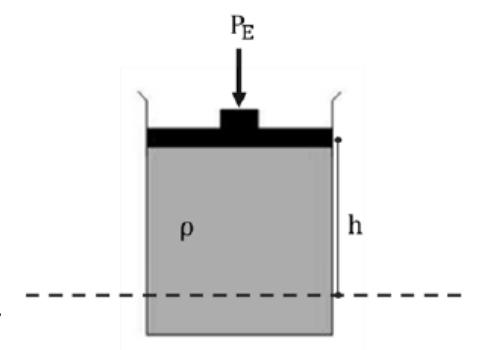

$$P_h = P_E + \rho g h$$

**Aplicación:** En el siguiente sistema, es posible determinar la expresión para la presión absoluta en los niveles 1 y 2. Para ello, basta sumar la presión externa y la presión hidrostática en cada caso:

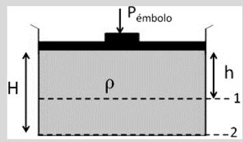

Para el nivel 1 resulta: P1 = P émbolo+ ρ g h Para el nivel 2 se obtiene: P2 = P émbolo+ ρ g H

# **5.8Presión atmosférica**

El físico italiano evangelista Torricelli fue el primero que se percató de que nos encontramos inmersos en el fondo de un fluido. Esta idea la expresó poéticamente diciendo *"Vivimos en el fondo de un océano de aire"*. Este *océano de aire* es lo que hoy conocemos como atmósfera.

Como nosotros vivimos en el fondo de la atmósfera, sentimos constantemente la presión hidrostática que ejerce el aire sobre nosotros. A esta presión la llamaremos *presión atmosférica.* 

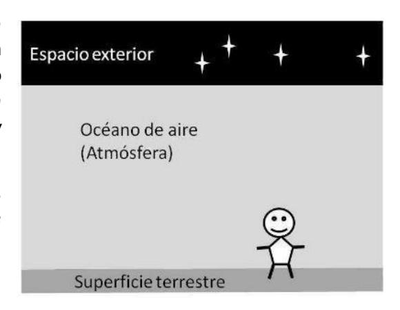

Por lo tanto, considerando el principio de Pascal y la presión atmosférica como una presión externa, la *presión total o absoluta,* para un recipiente como el de la figura, a una profundidad h, se expresa matemáticamente como:

$$P_{absoluta} = P_{atmosférica} + \rho g h$$

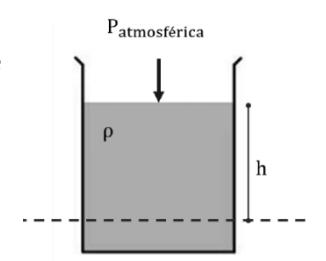

# **5.9Experimento de Torricelli**

Si aplicamos el principio fundamental de la hidrostática en una línea horizontal trazada entre los puntos A y B, la presión en el exterior del tubo de mercurio debe ser igual a la presión en el interior del tubo de este fluido. Teniendo en cuenta la idea anterior, la presión en el exterior del tubo corresponde a la que ejerce la atmósfera (P0), mientras que la presión dentro del tubo corresponde a la ejercida por el fluido (PHg).

Este simple experimento permitió cuantificar el valor de la presión atmosférica (P0), de modo que:

$$P_0 = P_{Hg} \rightarrow P_0 = \rho_{Hg} g H$$

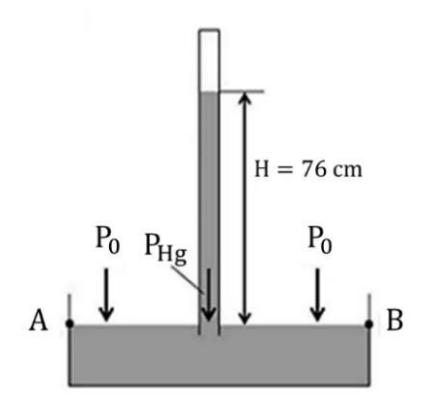

Reemplazando los valores de densidad del mercurio, aceleración de gravedad y altura de columna se obtienen que la presión atmosférica a nivel del mar es de aproximadamente 101.300 Pa.

¿Pero cómo es que no sentimos la presión atmosférica? La verdad es que estamos tan acostumbrados a ella que no percibimos su efecto.

# **5.10 Ejercicios propuestos**

- 1. Una persona se encuentra parada sobre una superficie horizontal. Si de pronto levanta el pie derecho, se puede afirmar correctamente que:
- A) La magnitud de la fuerza que ejerce su cuerpo sobre el suelo disminuye a la mitad.
- B) La presión se mantiene constante porque está actuando el mismo peso.
- C) La presión que su cuerpo ejerce sobre el suelo aumenta al doble.
- D) El área de contacto se mantiene constante.
- 2. En una probeta de 200 cm3 llena con agua, la presión que ejerce el líquido sobre el fondo es de 400 Pascales. Si se traspasa la totalidad del agua a otra probeta cuya base tiene un área de 0,010 m2 y se sabe que 1000 cm3 de agua tiene una masa de 1 kg, ¿cuál es la nueva presión que ejerce el mismo líquido en el fondo de la segunda probeta?
- A) 100 Pa
- B) 200 Pa
- C) 300 Pa
- D) 800 Pa
- 3. El recipiente de la figura contiene aceite y agua sin mezclarse. Si se conoce la densidad de cada sustancia, las alturas de cada una de las columnas y el valor de la presión atmosférica, ¿cuál de las siguientes alternativas es correcta con respecto a la presión total sobre el fondo del recipiente?

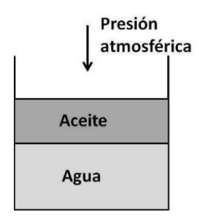

- A) La presión total es igual a la presión que ejerce la columna de agua sobre el fondo del recipiente.
- B) La presión total es igual a la presión atmosférica más la presión hidrostática de cada columna de líquido.
- C) La presión total es igual a la presión atmosférica más la presión que ejerce el agua sobre el fondo del recipiente.
- D) La presión total es igual a la presión que ejerce la columna de aceite sobre la superficie superior de la columna de agua, más la presión atmosférica.

- 4. Un tambor cilíndrico A está completamente lleno de agua. Si se vacía completamente su contenido a otro tambor cilíndrico B de mayor radio y altura, ¿cómo será el valor de la nueva presión sobre el fondo del nuevo recipiente con respecto a la presión inicial?
- A) Mayor.
- B) Menor.
- C) Igual.
- D) No se puede determinar porque se necesita la altura del recipiente B.
- 5. La vasija de la figura se encuentra abierta en su parte superior con el nivel de agua indicado. A es un pequeño orificio de la pared lateral, que se encuentra cerrado. Al abrirlo, el vector que mejor representa la dirección en que sale el agua es:

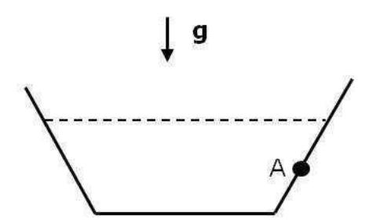

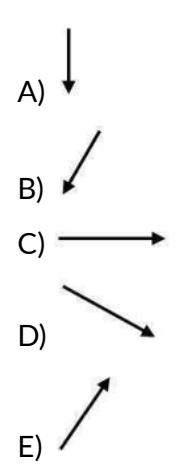

| D | B | B | B | C |
|---|---|---|---|---|
| 5 | 4 | 3 | 2 | 1 |

#### **Completa el mapa conceptual (Clase 11)**

#### **En este espacio puedes tomar notas durante la clase:**

|   |
|------|
|      |
|      |
|      |
|      |
|      |
|      |
|      |
|      |
|      |
|      |
|      |
|      |
|      |
|      |
|      |
|      |
|      |
|      |
|      |
|      |
| _    |
|      |
|      |
|      |
|      |
|      |
|      |
|      |
|      |
|      |
|      |
|      |
|      |
|      |
|      |
|      |
|      |
|      |
|      |
|      |
|      |
|      |
|      |
|      |
|      |
|      |
|      |
|      |
|      |
|      |
|      |
|      |
|      |
|      |
|      |
|      |
|      |
|      |
|      |
|      |
|      |
|      |
|      |
|      |
|      |