# BIOLOGÍA IV/TOMO1

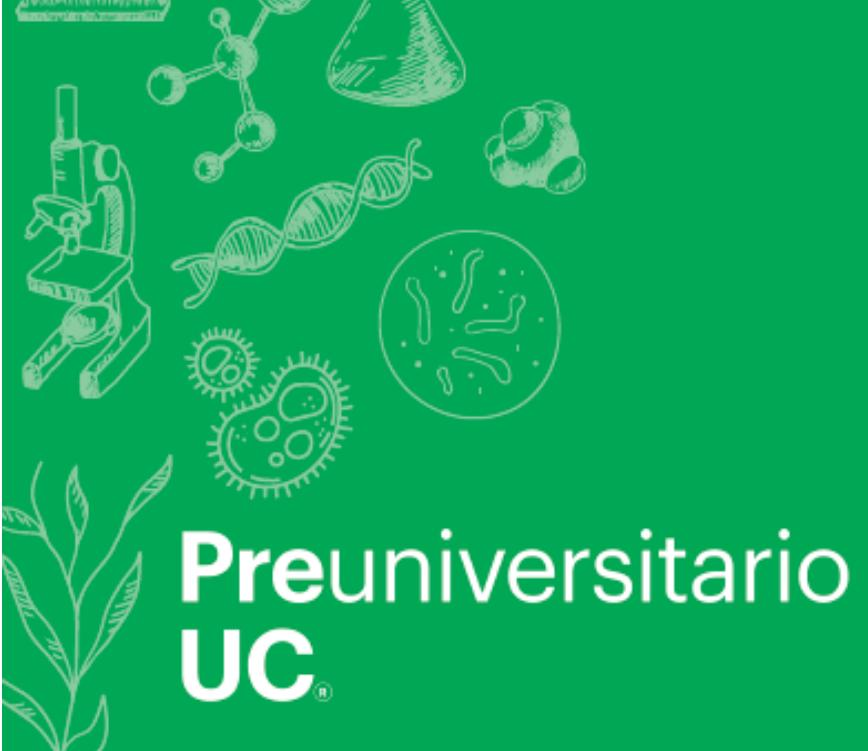

# **PRESENTACIÓN**

La **Prueba de Acceso a la Educación Superior** (PAES) es el instrumento que permite ingresar actualmente a las universidades adscritas al sistema de admisión.

Las Pruebas de Acceso a la Educación Superior en Ciencias, al igual que las Bases Curriculares de Ciencias del MINEDUC, incorporan dos aspectos: uno referido a las **Habilidades Científicas** y el otro referido al **Conocimiento de la Ciencia**; el primero, común a los tres ejes (Biología, Física y Química) y el segundo, diferenciado para cada uno de ellos.

Además, las PAES consideran las Habilidades Científicas: Observar y plantear preguntas (OPP), Planificar y conducir una investigación (PCI), Procesar y analizar la evidencia (PAE), Evaluar y Comunicar, las que funcionan como elementos transversales e integradores. Estos elementos son aplicables y evaluables en todas las áreas temáticas de dicha prueba.

El temario de la Prueba de Acceso a la Educación Superior se estructura por ejes subdivididos en áreas temáticas en donde se explicitan los Conocimientos de la Ciencia susceptibles de ser evaluados en cada una de ellas. Estas áreas temáticas están constituidas por los conocimientos asociados a Organización, estructura y actividad celular; Procesos y funciones biológicas; Herencia y evolución; Organismo y ambiente; Ondas; Mecánica; Energía; Electricidad; Estructura atómica; Química orgánica; Reacciones químicas y estequiometría.

La estructura de las Pruebas de Transición de Ciencias consta de 80 preguntas de selección múltiple de respuesta única, de 4 o 5 opciones cada una, de las cuales 54 corresponden a Módulo Común y 26 preguntas corresponden a Módulo Electivo o Módulo TP, respectivamente.

En este apartado se trabajará el reconocimiento de las habilidades científicas consideradas por la PAES, a través de la comprensión del método científico y sus características.

# **EL MÉTODO CIENTÍFICO**

El método científico organiza la forma de adquirir conocimiento del ser humano, por lo tanto, se puede definir como el conjunto de etapas que hay que recorrer para obtener un conocimiento válido desde el punto de vista científico, utilizando para esto instrumentos que resulten fiables. Lo que hace este método es minimizar la influencia de la subjetividad del investigador en su trabajo, generando un procedimiento sistematizado que también permite reducir e identificar de forma oportuna cualquier error.

En relación con esto, antiguamente se concebía el método científico como un proceso lineal, sin embargo, ahora se entiende como un proceso multidimensional, el cual se puede observar en el siguiente esquema:

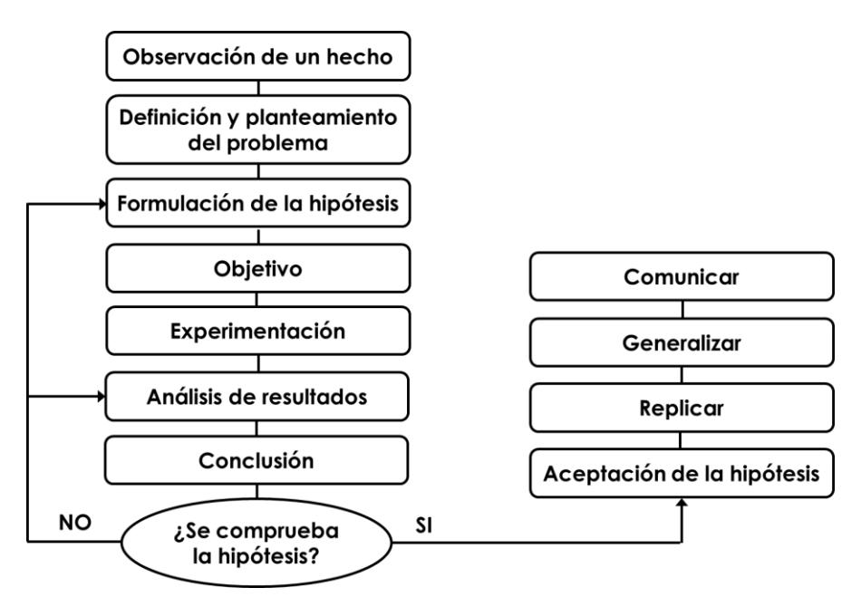

Entre cada una de las etapas, se presentan las habilidades del pensamiento científico, y para poder identificarlas, es importante comprender que implica cada uno de los pasos del método científico.

# **I. Observar un hecho**

Se considera observación científica al proceso de lograr seleccionar dentro de un fenómeno aquello que se desea analizar. Se adquiere información mediante los sentidos o instrumentos de medición, de un hecho o fenómeno natural. Estas observaciones pueden registrarse tanto cuantitativa como cualitativamente.

- **Cuantitativo:** es aquello que se puede cuantificar, es decir, que se le puede asignar un valor numérico.
- **Cualitativo:** son datos que expresan cualidades o características que son verbalizadas, se identifican mediante los sentidos.

# **¿Qué es una variable?**

Son aquellos factores, características o propiedades que pueden influir en el experimento. Estas variables pueden ser controladas, modificadas o medidas dependiendo de cómo se plantee la relación entre ellas.

# Variable independiente

Representa un factor que se modifica en un experimento (manejado por el experimentador). A menudo esta variable es representada con una X en una ecuación, por lo tanto, se ubica en el eje de las abscisas en un gráfico cartesiano.

Puede responder a preguntas como: *"¿Qué se modifica a voluntad?, ¿Qué es lo que el científico cambia?, ¿Qué es lo que se cambia de forma controlada?"*

# Variable dependiente

Representa un factor cuyo valor depende de cómo se modifica la variable independiente. A menudo es representada con la letra Y en una ecuación, por lo tanto, se ubica en el eje de las ordenadas en un gráfico cartesiano. Por otro lado, la variable dependiente es aquello que se busca medir en el experimento.

Puede responder a preguntas como: *"¿Qué es lo que cambia?, ¿Qué es lo que se mide?, ¿Qué es lo que se observa?"*

# Variable controlada

Son aquellos factores que se mantienen fijos, constantes o sin modificar dentro del proceso experimental con el fin de que no influyan en los resultados experimentales. Puede ser una o más de una dentro de un mismo experimento.

Puede responder a preguntas como: *"¿Qué se mantiene constante durante el experimento?, ¿Qué se mantiene fijo?, ¿Qué no cambia durante todo el experimento?"*

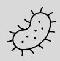

### **Aplicación:**

Imagine que se encuentra trabajando en un laboratorio farmacéutico y por accidente deja caer una cantidad indeterminada de un medicamento experimental llamado X sobre una placa de cultivo bacteriano de un compañero de laboratorio, como la que se muestra a continuación.

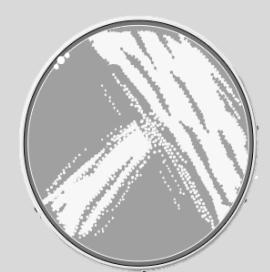

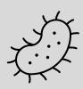

# **Aplicación:**

Se observa que luego de algunas horas, la cantidad de colonias bacterianas presentes en la placa de cultivo disminuye considerablemente.

**Observación inicial:** Al aplicar una concentración de X, la cantidad de bacterias disminuye.

# **II. Definición y planteamiento del problema**

Se produce a partir de la observación, formulación y organización de la idea de investigación, comenzando por la observación inicial del hecho y de los conocimientos ya existentes.

▪ **Pregunta científica:** corresponde a la pregunta central de la investigación. En ella es posible encontrar las variables implicadas en el fenómeno observado. Esta pregunta se formula durante el proceso del planteamiento y definición del problema, para luego dar paso a la hipótesis.

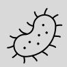

### **Aplicación:**

A partir de las observaciones del fenómeno ocurrido en las placas de cultivo se puede proponer una pregunta de investigación acorde a lo observado.

**Pregunta de investigación:** ¿Tiene el medicamento X un efecto inhibidor sobre el crecimiento de colonias bacterianas, y cómo varía este efecto según la concentración aplicada?

# **III. Formulación de la hipótesis**

En esta etapa se busca dar una respuesta a la pregunta de investigación, por lo que es necesario tomar en consideración las variables directamente involucradas en el fenómeno, para generar posibles respuestas a la misma y dentro de estas identificar aquella que se considerará como hipótesis.

La hipótesis, por tanto, es una respuesta anticipada, que se da como posible contestación a un problema que surge al tratar de explicar un fenómeno y que se debe verificar por medio de la experimentación.

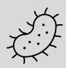

# **Aplicación:**

Una vez planteada la pregunta investigación a partir de las observaciones del fenómeno se puede plantar una hipótesis que intente dar una respuesta a dicha pregunta.

**Hipótesis:** El medicamento X reduce el crecimiento de colonias bacterianas de manera dependiente de la concentración, es decir, a mayor concentración, mayor será la inhibición del crecimiento bacteriano.

# **IV.Objetivo de investigación:**

Indica **qué** es lo que se va a determinar o medir, **cómo** se va a determinar o medir experimentalmente y **cuál** es el propósito del procedimiento. Resume la idea central y finalidad de la investigación.

Los objetivos se refieren también al tipo de conocimientos o fin que se desean alcanzar, y se debe tener cuidado en su formulación. El objetivo bien construido logra transmitir en pocas palabras la intención del investigador responsable del proyecto, para ello se elaboran enunciados que excluyen el mayor número de interpretaciones posibles, así se logra ese sentido de exactitud respecto a nuestra intención.

En la redacción se deben tomar en cuenta las siguientes recomendaciones para considerar los aspectos más relevantes:

- 1. Deben ser concretos, es decir no redundar en frases largas y poco claras.
- 2. Ser factibles, es decir, tomar en cuenta todos los aspectos involucrados dentro de la investigación: tiempo, dinero, personal, perspectivas y capacidad.
- 3. Identificar el abordaje del tema, el destino de dicha investigación y el uso de los recursos, en otras palabras, el diseño cualitativo o cuantitativo del proyecto.
- 4. El uso de los verbos en infinitivo, para identificar de forma clara los resultados esperados.

Saber utilizar los verbos para redactar objetivos es fundamental en todos los tipos de investigación, ya sea cualitativa, cuantitativa o tecnológica. Los verbos nos permiten expresar de manera clara y precisa lo que queremos lograr.

En la *investigación cualitativa*, los verbos nos ayudan a explorar, entender y analizar fenómenos complejos. Para esto podemos utilizar verbos como comprender y analizar, entre otros, *con la intención de indagar en profundidad* sobre un tema específico.

En la *investigación cuantitativa*, los verbos nos ayudan a medir, calcular y comparar variables. Para esto podemos utilizar verbos como medir y comparar, entre otros, *con el fin de obtener datos numéricos* y realizar análisis estadísticos.

En la *investigación tecnológica*, los verbos nos ayudan a diseñar, implementar y evaluar nuevas tecnologías. Para esto podemos utilizar verbos como desarrollar y adaptar, entre otros, *con el propósito de crear innovaciones tecnológicas* y analizar su eficacia.

Ejemplos de verbos para construir un objetivo de investigación:

| Tipo de investigación |             |              |             |             |  |
|-----------------------|-------------|--------------|-------------|-------------|--|
| Cuantitativa          |             |              |             |             |  |
| Descriptiva           | Explicativa | Exploratoria | Cualitativa | Tecnológica |  |
| Analizar              | Comprobar   | Conocer      | Interpretar | Desarrollar |  |
| Calcular              | Demostrar   | Detectar     | Comprender  | Diseñar     |  |
| Identificar           | Determinar  | Indagar      | Indagar     | Adaptar     |  |
| Examinar              | Establecer  | Sondear      | Describir   | Construir   |  |
| Medir                 | Relacionar  | Definir      | Explorar    | Transformar |  |

### **Aplicación:**

Posteriormente a la redacción de la hipótesis y de la elección del tipo de investigación que se desea realizar, es necesario redactar un objetivo experimental.

**Objetivo:** Determinar el efecto inhibidor del medicamento experimental X sobre el crecimiento de colonias bacterianas y establecer si este efecto depende de la concentración aplicada.

# **V. Experimentación**

Se dice del diseño intencionado de un procedimiento que busca manipular las variables que rigen un determinado fenómeno, el cual queda definido por el objetivo experimental, y su finalidad **es entregar la información necesaria para confirmar o descartar la hipótesis.**

La base de un procedimiento experimental es utilizar instrumentos que nos permitan replicar de manera controlada el fenómeno observado.

▪ **Instrumento:** es un dispositivo construido para buscar, adquirir, medir, observar y almacenar datos dentro de un proceso experimental, por ejemplo: microscopio, bureta, balanza, entre otros. A continuación, se presentan algunos instrumentos comúnmente utilizados en Biología.

| Instrumento | Utilidad |
|-------------|----------|
|-------------|----------|

| Cámara de cultivo celular | Mantiene condiciones controladas para el crecimiento de cultivos celulares.                   |  |  |
|------------------------------|--------------------------------------------------------------------------------------------------|--|--|
| Cámara de Neubauer           | Cuenta células o partículas en una muestra líquida.                                              |  |  |
| Criostatos (criogenia)       | Preserva tejidos o células a temperaturas extremadamente bajas para análisis futuros.         |  |  |
| Estereomicroscopio           | Observa objetos grandes como insectos, tejidos o estructuras anatómicas. |  |  |
| Gel electroforesis           | Separa moléculas como ADN, ARN o proteínas según tamaño o carga eléctrica.                    |  |  |
| Micropipeta                  | Mide y transfiere pequeños volúmenes de líquidos con precisión.                                  |  |  |

| Microscopio     | Permite observar organismos, células y estructuras no visibles a simple vista. |
|-----------------|-----------------------------------------------------------------------------------|
| Potenciómetro   | Mide la acidez o alcalinidad de una solución.                                     |
| Placas de Petri | Cultiva microorganismos, tejidos o células en un medio de cultivo.                |

# **Aplicación:**

Con el objetivo de investigación claro se puede diseñar un experimento que incluya los materiales y el procedimiento adecuado.

# **Materiales:**

- Placas de cultivo con agar y colonias bacterianas de una cepa específica.
- Medicamento experimental X en solución.
- Solución salina estéril o agua destilada para diluciones.
- Pipetas y puntas estériles.
- Placas de Petri.
- Incubadora ajustada a la temperatura óptima de crecimiento bacteriano.
- Regla o software para medir zonas de inhibición.
- Alcohol 70% y guantes para asepsia.

# **Procedimiento:**

# **1. Preparación de diluciones del medicamento X:**

• Preparar una serie de diluciones del medicamento X en solución salina estéril (por ejemplo, 0.1 mg/mL, 0.5 mg/mL, 1 mg/mL, 5 mg/mL, y un control sin medicamento).

# **2. Aplicación a las placas de cultivo:**

- Dividir una placa de cultivo en secciones iguales y etiquetarlas según las concentraciones del medicamento.
- Aplicar una gota de cada dilución en las secciones correspondientes.
- En una placa separada, aplicar solo solución salina como control negativo.

# **3. Incubación:**

- Colocar las placas en la incubadora a la temperatura óptima para el crecimiento bacteriano (generalmente 37 °C).
- Incubar durante 18-24 horas.

# **4. Evaluación del efecto:**

- Observar y medir el número de colonias bacterianas o el tamaño de la zona de inhibición (área sin crecimiento alrededor de las gotas de medicamento).
- Registrar los resultados para cada concentración.

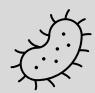

# **Aplicación:**

# **Variables en estudio:**

# 1. **Variable independiente:**

• La concentración del medicamento X.

# 2. **Variable dependiente:**

• El crecimiento de colonias bacterianas, medido por el número de colonias visibles o el tamaño de la zona de inhibición.

# 3. **Variables controladas:**

- Cepa bacteriana utilizada.
- Tiempo de incubación.
- Temperatura y condiciones de incubación.
- Volumen de solución aplicada en cada sección.

La culminación del proceso experimental consiste en la recolección de datos, que llamaremos resultados experimentales.

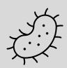

# **Aplicación:**

Se registran las observaciones durante el experimento en términos de número de colonias bacterianas observadas frente a las distintas concentraciones de X que se aplicaron a las muestras.

Estos **datos** se pueden ordenar en una tabla de datos:

| Concentración de X (mg/mL) | Número de colonias observadas | Zona de inhibición (mm) | Observaciones       |
|-------------------------------|-------------------------------------|----------------------------|---------------------|
| Control                       | 100                                 | 0                          | Crecimiento         |
|                               |                                     |                            | promedio de         |
|                               |                                     |                            | colonias            |
| 0,1                           | 85                                  | 5                          | Ligera inhibición   |
| 0,5                           | 60                                  | 10                         | Inhibición          |
|                               |                                     |                            | moderada            |
| 1                             | 30                                  | 15                         | Inhibición          |
|                               |                                     |                            | significativa       |
| 5                             | 5                                   | 25                         | Eliminación         |
|                               |                                     |                            | prácticamente total |

# **Conceptos de exactitud y precisión:**

Corresponden a cualidades de métodos o instrumentos empleados en ciencia. *La precisión es la capacidad de un instrumento de dar el mismo resultado en diferentes mediciones* llevadas a cabo bajo las mismas condiciones. Es una cualidad que debe ser evaluada en el corto plazo, de tal manera de seleccionar el mejor instrumento para cumplir con nuestros objetivos. Por otro lado, *la exactitud es la capacidad de un instrumento de dar el resultado real de una medición*, es decir, qué tan cerca está la medición del valor real.

La exactitud se relaciona con la proximidad de los resultados de las mediciones realizadas con respecto al valor verdadero. La precisión se relaciona con repetibilidad o reproductibilidad de

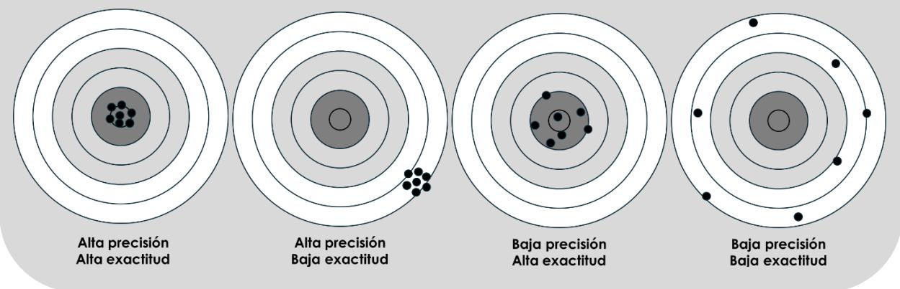

# **VI. Análisis de resultados**

Es el proceso sistemático y objetivo de examinar y evaluar los datos recopilados durante una investigación. Este análisis implica identificar patrones, relaciones, tendencias o cualquier otra información relevante que pueda proporcionar una comprensión más profunda del fenómeno estudiado. Además, implica la interpretación de estos hallazgos en el contexto de la hipótesis.

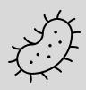

### **Aplicación:**

Se interpretan los datos en función de la hipótesis, tal como se presenta a continuación: **Control negativo (0 mg/mL):** Sin medicamento, las bacterias crecen de manera normal, lo que valida que no hay otros factores que inhiban el crecimiento.

**Concentraciones crecientes (0.1 - 5 mg/mL):** A medida que aumenta la concentración, el número de colonias disminuye y el tamaño de la zona de inhibición aumenta, indicando un efecto inhibidor dependiente de la dosis.

**Máxima inhibición (5 mg/mL):** A la concentración más alta, el crecimiento bacteriano es casi completamente eliminado, mostrando que el medicamento es altamente efectivo en esta dosis.

Estos resultados respaldan la hipótesis de que el medicamento X tiene un efecto inhibidor sobre el crecimiento bacteriano y que este efecto es dependiente de la concentración.

# Relación entre variables

Se entiende que la relación entre variables conlleva que si una de estas cambia (variable independiente), por consecuencia, la otra (variable dependiente) también lo hará. Esta relación puede ser directamente proporcional, inversamente proporcional, con correlación positiva, correlación negativa o nula.

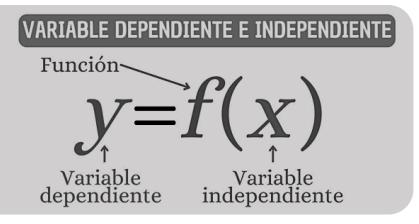

Es posible modelar este tipo de relaciones de manera gráfica:

# Directamente proporcional

Es posible modelarla a través de una función lineal, este tipo de relación es posible reconocerla ya que, al subir o aumentar una de las variables, la otra también lo hará.

$$y = kx$$

Donde k es una constante que presenta la pendiente del gráfico, la que se obtiene considerando las herramientas matemáticas disponibles para esto:

$$k = \left(\frac{y_2 - y_1}{x_2 - x_1}\right) = \frac{y}{x}$$

Una vez determinada la función que modele la relación entre las variables es posible representarla en un gráfico, como el de la figura.

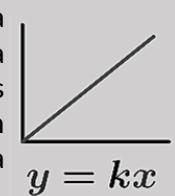

# Inversamente proporcional

Es posible modelarla a través de una función racional, este tipo de relación es posible reconocerla ya que, al subir o aumentar una de las variables, la otra disminuye y viceversa.

$$y=\frac{k}{x}$$
Esta relación será representada a través del siguiente gráfico:  $y=k$ 

Es importante recordar que, para considerar una proporcionalidad directa, la función debe pasar por el punto (0,0), es decir, pasar por el origen del plano cartesiano. De lo contrario, sería considerada como función "afín".

Finalmente, es necesario comprender que dentro de un fenómeno científico es posible identificar distintas **correlaciones entre las variables** observadas, diferente de las relaciones ya mencionadas, como se puede observar en las siguientes imágenes:

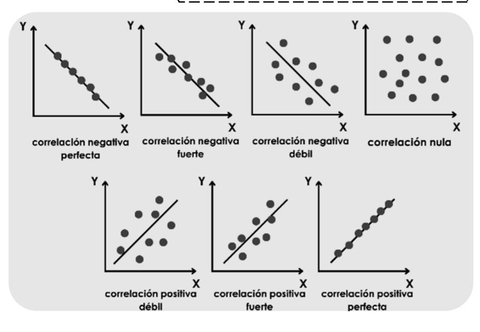

| Variable independiente <i>X</i> | Variable dependiente <i>Y</i> |
|---------------------------------------|-------------------------------------|
| <i>X</i> 1                 | $y_1=f(x_1)$                        |
| $X_2$                                 | $y_2 = f(x_2)$                      |
| :                                     | :                                   |
| $X_{\mathbf{n}}$                      | $y_n = f(x_n)$                      |

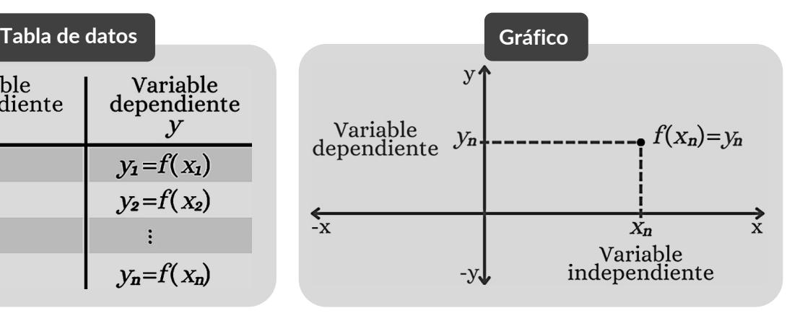

En el contexto de una investigación científica, comunicar resultados de manera clara y comprensible es fundamental. Para ello, se utilizan diversas formas de representación gráfica, cada una con características y utilidades específicas. A continuación, se describen algunas de las principales formas de representación, junto con ejemplos prácticos para cada una:

# **Tablas**

# **Características:**

- Organiza datos en filas y columnas.
- Permite mostrar una gran cantidad de información de forma estructurada.
- Ideal para resúmenes numéricos o categóricos.

# **Utilidad:**

- Facilitar la comparación directa de valores.
- Ordenar los datos obtenidos.

**Ejemplo:** Un estudiante desea comprobar la relación entre el estiramiento de un resorte y la fuerza elástica de un resorte según la Ley de Hooke, para ello mide el estiramiento del resorte a medida que se aumenta gradualmente la masa de cuelga de este.

| Masa del cuerpo (g) | Longitud del resorte estirado (cm) | Longitud natural del resorte una vez retirado cada cuerpo (cm) |
|------------------------|------------------------------------|----------------------------------------------------------------|
| 0                      | 15                                 | 15                                                             |
| 60                     | 19                                 | 15                                                             |
| 120                    | 23                                 | 15                                                             |
| 180                    | 27                                 | 15                                                             |
| 240                    | 34                                 | 15                                                             |
| 300                    | 48                                 | 18                                                             |

# **Gráfico de dispersión**

# **Características:**

- Muestra puntos que representan la relación entre dos variables.
- Cada eje representa una variable continua.

**Ejemplo:** En el estudio de la absorción intestinal de nutrientes, se puede medir el contenido calórico de las heces en función de la actividad enzimática de las microvellosidades intestinales, para dos condiciones alimentarias diferentes, cuyos resultados pueden presentarse en un gráfico de dispersión como el de la siguiente figura:

# **Utilidad:**

• Analizar correlaciones o patrones en conjuntos de datos.

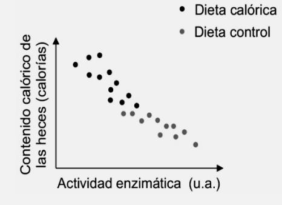

# **Gráfico de línea**

# **Características:**

- Conecta puntos con líneas para mostrar cambios continuos en una variable.
- Utiliza ejes X e Y, con X representando a la variable independiente.

# **Utilidad:**

• Visualizar tendencias y cambios a lo largo del tiempo.

**Ejemplo:** La solubilidad representa la máxima cantidad de un determinado soluto que puede disolverse en una cantidad específica de disolvente. Además, depende del tipo de soluto. Este parámetro puede variar en función de la temperatura, cuya relación puede representarse en un gráfico de línea:

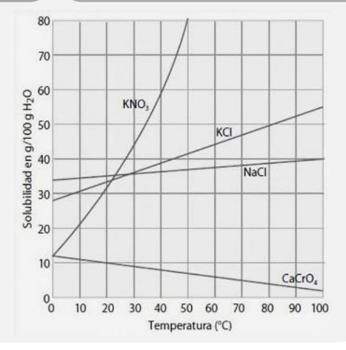

# **Gráfico de barras**

# **Características:**

- Usa barras verticales u horizontales para comparar categorías.
- La altura o longitud de la barra indica la magnitud.

# **Utilidad:**

• Comparar datos categóricos o discretos.

**Ejemplo:** Se han realizado estudios que buscaron establecer la relación entre ciertos hábitos, como el de fumar, sobre la fertilidad masculina. En este contexto de investigación, se puede medir la concentración espermática de tres grupos de hombres (G1: no fumador, G2: fumador poco habitual, G3: fumador frecuente), cuyos resultados se pueden representar en un gráfico de barras:

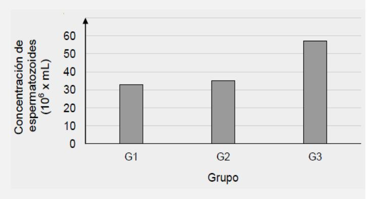

# **Gráfico de datos segmentados**

# **Características:**

- Representa proporciones de varias categorías en un gráfico rectangular.
- La altura y el ancho de las áreas representan cantidades relativas.

### **Utilidad:**

• Útil para mostrar proporciones complejas entre categorías.

**Ejemplo:** Se ha observado que el cambio de pH del suelo puede cambiar la proporción de la tonalidad de las flores de ciertas especies vegetales, como es el caso de las hortensias. El cambio en la proporción de las tonalidades de las flores en función del pH promedio del suelo puede representarse en un gráfico de datos segmentados:

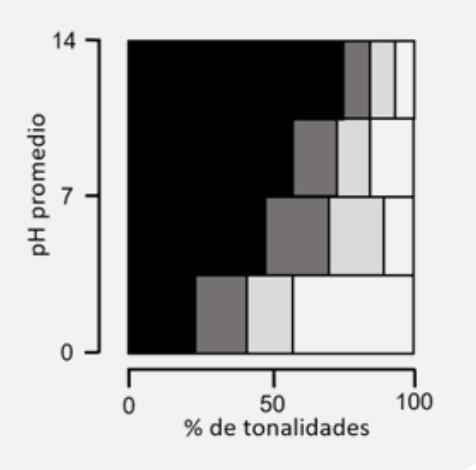

# **Gráfico circular o de torta**

# **Características:**

- Representa proporciones de un total usando segmentos de un círculo.
- Cada segmento del gráfico circular tiene un tamaño proporcional a su porcentaje dentro del conjunto total.

**Ejemplo:** La calcopirita es un mineral formado por cobre (Cu), hierro (Fe) y azufre (S) utilizado en la industria para obtener cobre. Su fórmula química es CuFeS2. La composición de este mineral en porcentaje en masa puede ser representada en un gráfico circular como el de la siguiente figura:

# **Utilidad:**

• Visualizar la relación entre las partes y el todo de una serie de datos.

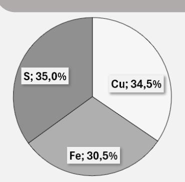

# **Gráfico de barras contrastables**

# **Características:**

- Permite comparar dos o más conjuntos de datos en categorías similares.
- Se utilizan barras agrupadas o apiladas.

# **Utilidad:**

• Visualizar la relación entre las partes y el todo de una serie de datos.

**Ejemplo:** En el estudio de los cambios de las poblaciones humanas en función del tiempo, se suelen utilizar las pirámides de población, donde se representa la cantidad de hombres y mujeres de acuerdo con el rango etario al que pertenecen. Este tipo de representaciones se basan en las pirámides de barras contrastables:

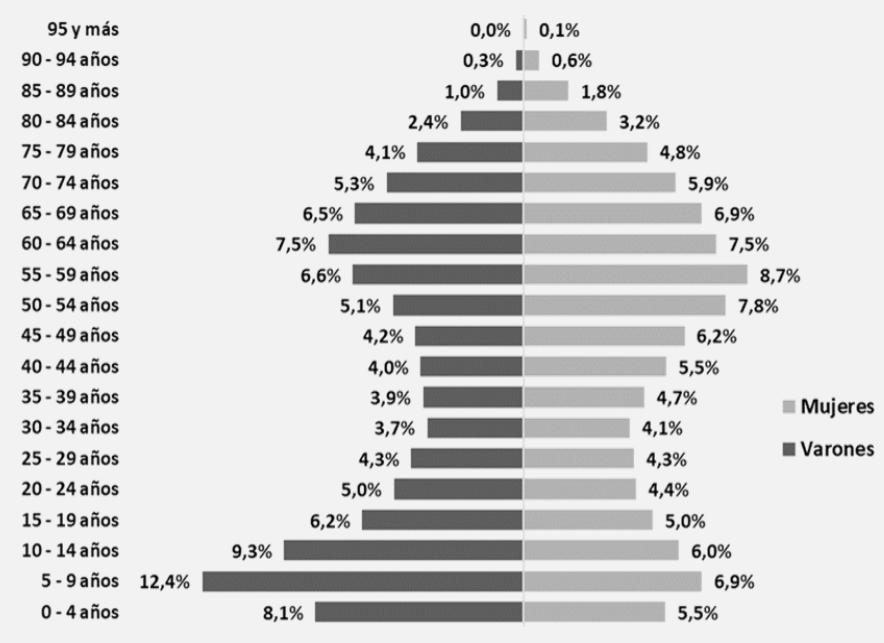

# **Concepto de replicabilidad**

En el contexto de una investigación científica, la replicabilidad hace referencia a la capacidad de repetir un mismo experimento bajo las mismas condiciones, y así obtener los mismos resultados. Es fundamental en la aplicación del método científico, así como un aspecto fundamental en la realización de una investigación. La replicabilidad permite la posibilidad de que otros equipos de científicos, con los mismos recursos y utilizando las mismas técnicas y metodologías, logren llegar a las mismas conclusiones.

# **VII. Conclusiones**

Son argumentos y afirmaciones relativas a datos de mediciones experimentales y de la lógica (reglas y procedimientos para discernir si un razonamiento es correcto -válido- o incorrecto -inválido-). Se obtienen a partir del análisis de resultados.

# **¿Es lo mismo concluir que inferir?**

La respuesta es **no.** Las inferencias se basan en hechos de una situación, pero en lugar de sacar una conclusión, las inferencias utilizan hechos para determinar otros hechos. La inferencia consiste en juicios emitidos a partir de premisas, por ejemplo, resultados experimentales. Implica la interpretación de resultados y hechos para explicar fenómenos de diversa índole dentro del contexto en el que se realiza la inferencia. Además, las inferencias pueden tener valor predictivo. Por ejemplo, si alguien menciona un animal de cuatro patas, peludo y que mueve la cola, se puede inferir que probablemente se trata de un perro.

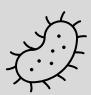

### **Aplicación:**

Los resultados del experimento muestran que el medicamento experimental X inhibe el crecimiento bacteriano de manera dependiente de la concentración. A mayor concentración, se observa una disminución significativa en el número de colonias y un aumento en el tamaño de las zonas de inhibición. Esto sugiere que X es efectivo como agente antibacteriano en las condiciones evaluadas.

# **CONCEPTOS NECESARIOS EN CONTEXTO CIENTÍFICO**

En el ámbito científico, existen conceptos que son fundamentales para explicar fenómenos naturales y formular explicaciones precisas sobre el mundo que nos rodea. Aunque estos términos a menudo y de forma coloquial se utilizan de manera intercambiable, cada uno tiene un significado y una función específica dentro del proceso científico. A continuación, te presentamos las diferencias clave entre ellos:

# **PRINCIPIO**

Un **principio** es una regla o fundamento general que orienta las leyes y teorías en la ciencia. Puede ser más amplio que una ley y puede tener menos especificidad matemática, ya que no se limita a ciertas condiciones. Siendo una afirmación fundamental, al igual que las leyes cuentan con evidencias de carácter directo o primario.

# **TEORÍA**

Una **teoría** es una **explicación** amplia y bien fundamentada de un conjunto de fenómenos observados. Las teorías son comprobadas a través de la experimentación y la observación, y pueden predecir resultados bajo ciertas condiciones. A diferencia de una ley, una teoría explica el porqué de un fenómeno, no solo lo que ocurre.

Cuentan principalmente con evidencia indirecta o secundaria.

# **LEY**

Una **ley** es una **descripción** precisa y general de un fenómeno que ocurre de manera consistente bajo ciertas condiciones, y generalmente se expresa en términos matemáticos. Las leyes científicas describen lo que sucede, pero no explican por qué ocurre.

Cuentan con evidencias de carácter directo o primario, replicables

# **MODELO**

Un **modelo** es una representación simplificada de un fenómeno, sistema o proceso real que ayuda a los científicos a entender, explicar, predecir o simular su comportamiento. Los modelos pueden ser físicos, matemáticos, conceptuales o computacionales, y se utilizan cuando no se puede estudiar directamente el fenómeno.

| Concepto                                                                                                  | Definición                                              | Propósito                        | Evidencias                                          | Características                                                             |
|-----------------------------------------------------------------------------------------------------------|---------------------------------------------------------|----------------------------------|-----------------------------------------------------|-----------------------------------------------------------------------------|
| Principio                                                                                                 | Fundamento general que guía el estudio de fenómenos. | Orientar las leyes y teorías. | Generalmente directas, replicables               | Suele ser más amplio que una ley, pero menos específico.                 |
| Ejemplo: principio de conservación de la energía, principio de incertidumbre.                             |                                                         |                                  |                                                     |                                                                             |
| Ley                                                                                                       | Descripción de un fenómeno observado.                | Explicar qué ocurre.          | Directas, replicables                               | Se expresa generalmente de forma matemática y no explica por qué ocurre. |
| Ejemplo: Ley de conservación de la masa, leyes de newton, ley de Mendel.                                  |                                                         |                                  |                                                     |                                                                             |
| Teoría                                                                                                    | Explicación de un conjunto de fenómenos observados.  | Explicar por qué ocurre.      | Indirectas, difícil de replicas o no replicables | Se basa en evidencias científicas. Se puede modificar.                   |
| Ejemplo: Teoría evolutiva, teoría celular, teoría cinética de los gases, teoría de la deriva continental. |                                                         |                                  |                                                     |                                                                             |

**Sabias que…. ¿En qué se diferencian el principio de conservación de la energía con la ley de conservación de la masa?**

El **principio de conservación de la energía** es válido en **todos los contextos y bajo cualquier condición espaciotemporal**. Por otro lado, la **ley de conservación de la masa** puede **no aplicarse estrictamente en ciertas reacciones químicas**, especialmente cuando el rendimiento es inferior al 100%, debido a pérdidas de materia en forma de subproductos, gases o partículas no cuantificadas.

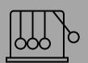

Las leyes de Newton dejaron de considerarse **principios fundamentales** a finales del siglo XIX y principios del siglo XX, con el desarrollo de la **teoría de la relatividad** de Einstein y la **mecánica cuántica**. Esto ocurrió porque las leyes de Newton, aunque extremadamente útiles y precisas en muchos contextos, se demostraron como válidas solo bajo ciertas condiciones

# **VIII. Comunicación o socialización**

Implica la presentación y difusión de los resultados de una investigación por medio de comunicaciones orales, pósteres, conferencias, publicaciones, etc. La secuencia que lleva a la presentación de resultados de forma oral se puede dividir en elaboración del resumen, construcción del material gráfico, presentación y defensa de los resultados.

Para poder hacer la socialización de los resultados a toda la comunidad se utilizan las herramientas vistas en el apartado de análisis de resultados, como gráficos y tablas de datos.

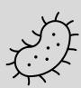

### **Aplicación:**

Este tipo de experiencias realizadas en un laboratorio se pueden comunicar mediante un informe científico, que incluye: introducción con hipótesis y objetivos, materiales y métodos, resultados con tablas y/o gráficos, discusiones, conclusiones y sugerencias para futuros experimentos.

# **ACTIVIDADES**

A continuación, se presenta un set de preguntas correspondientes a ejemplos de preguntas PAES publicadas por el DEMRE, donde se aplican algunas de las habilidades científicas para su resolución.

# **Pregunta 1**

**Área temática:** Organismo y ambiente **Conocimiento de la ciencia:** Ecosistemas

**Habilidad científica:** Procesar y analizar la evidencia, PAE

**Criterio de evaluación:** Identificar conclusiones o inferencias a partir de los resultados en contextos científicos.

El gráfico representa la relación entre la productividad primaria neta y la temperatura ambiente en el crecimiento de un bosque joven.

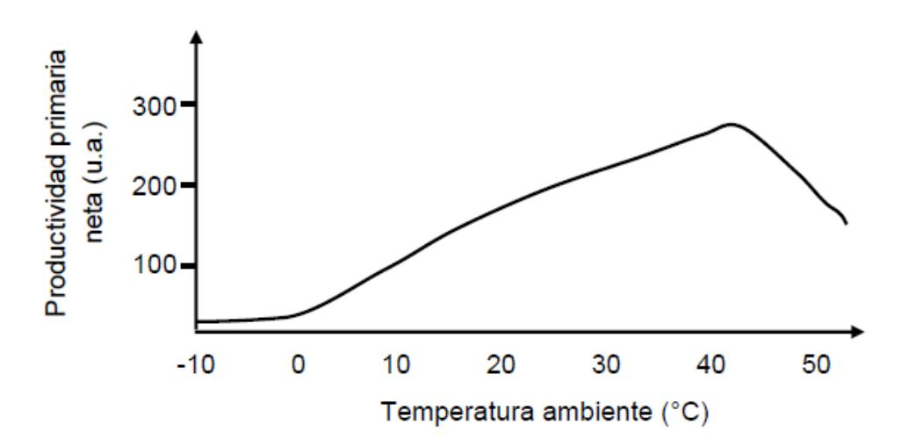

De acuerdo con la información, ¿cuál de las siguientes opciones es una inferencia correcta?

- A) A temperaturas inferiores a los 0 °C, la vegetación estudiada gasta más energía en su metabolismo, por lo que no hay productividad primaria neta.
- B) A temperaturas superiores a los 40 °C, la vegetación estudiada aumenta la transpiración, aumentando la productividad primaria neta.
- C) Entre 20 °C y 40 °C, la vegetación estudiada aumenta la tasa fotosintética, elevando la productividad primaria neta.
- D) A temperaturas superiores a 40 °C, la productividad primaria neta aumenta, ya que la vegetación estudiada incrementa la tasa fotosintética.

# **Defensa**

Para responder esta pregunta es importante realizar el análisis del gráfico presentado. Además, es fundamental identificar la relación existente entre las variables dependiente (productividad primaria neta) y la independiente (temperatura).

Inicialmente debemos tener en cuenta los conocimientos de la ciencia involucrados en esta pregunta. La productividad primaria neta (PPN) corresponde a la cantidad de biomasa producida por las poblaciones de productores, como plantas, a través de la fotosíntesis. De esta forma se

sitúan como el primer eslabón de las cadenas alimentarias, a partir de las cuales la energía fluye hacia los productores. Factores ambientales como la temperatura pueden influir sobre el rendimiento fotosintético, e indirectamente sobre la productividad primaria neta de los productores que forman parte de los ecosistemas de los cuales forman parte.

En este contexto, al analizar el gráfico, es posible observar que la PPN varía de forma diferente en tres tramos de temperatura. En el tramo entre los -10 °C y 0 °C la variación es prácticamente nula, mientras entre los 0 °C y aproximadamente los 40 °C la PPN se incrementa con la temperatura. A temperaturas superiores a 40 °C la PPN decae. Estos cambios pueden ser explicados en función de cómo afecta la temperatura al rendimiento fotosintético. Por ejemplo, en el tramo de temperatura más bajo, la variación es mínima y con bajos valores de PPN, probablemente debido a la baja actividad de las enzimas que catalizan las reacciones de la fotosíntesis. En el segundo tramo, mientras mayor es la temperatura, las reacciones fotosintéticas se favorecen, resultando en un incremento casi constante de la PPN. En el último tramo el descenso puede ser explicado por la desnaturalización de las enzimas fotosintéticas.

De acuerdo con la explicación del párrafo anterior es posible inferir que en el tramo de temperatura comprendido entre los 20 °C y 40 °C la productividad primaria neta se incrementó debido a un incremento en la tasa fotosintética de los organismos vegetales que forman parte del ecosistema descrito, el bosque joven. Con base en esta explicación, la alternativa correcta es C).

# **¿Qué se necesita saber y saber hacer para responder correctamente esta pregunta?**

Inicialmente es importante reconocer y relacionar los conceptos que definen el desarrollo de los ecosistemas, tales como la fotosíntesis y la productividad primaria neta, junto con el efecto de factores ambientales como la temperatura sobre estas dos variables. El procesar y analizar la evidencia presentada en el gráfico presentado en esta pregunta con el fin de elaborar una inferencia requiere de la base del conocimiento de la ciencia acorde con los conceptos sobre el estudio de los ecosistemas indicados con anterioridad.

# **Pregunta 2**

**Área temática:** Ondas

**Conocimiento de la ciencia:** Espectro electromagnético **Habilidad científica:** Observar y plantear preguntas, OPP.

Preocupados por los efectos de la radiación ultravioleta (UV), un grupo de estudiantes busca determinar la cantidad de radiación UV a la que están expuestas las personas de su colegio. Para ello, planean utilizar un tipo de sensor UV para registrar, a lo largo del día, la intensidad de esta radiación en un lugar específico de la cancha de asfalto del colegio, y en base a los resultados proponer medidas de protección para las personas.

En relación con lo anterior, ¿cuál de las siguientes opciones señala correctamente una hipótesis adecuada al diseño experimental propuesto por el grupo estudiantes?

- A) La radiación UV varía su intensidad según los lugares en que sea medida.
- B) La intensidad de la radiación UV varía según el tipo de sensor utilizado.
- C) La intensidad de la radiación UV es máxima a una determinada hora.
- D) La radiación UV provoca daños en la salud de las personas.

### **Defensa**

Para responder esta pregunta, es esencial comprender las características de los componentes de una investigación científica, especialmente el concepto de hipótesis y cómo se formula. Además, es crucial identificar correctamente las variables derivadas del procedimiento experimental propuesto por el grupo de estudiantes.

Una hipótesis es una posible respuesta a una pregunta de investigación basada en hechos reales que explica la relación entre la variable independiente y la variable dependiente de manera clara y específica. Debe ser simple y establecida previamente al estudio. La hipótesis guía el estudio y debe ser sometida a prueba para ser aceptada o rechazada.

En el diseño experimental, se consideran tres tipos de variables: independiente (el factor que se contrasta), dependiente (el factor que se mide) y controlada (el factor que se mantiene constante por decisión de los investigadores).

Con esto en mente, es posible identificar cuál hipótesis podría haber guiado el diseño experimental propuesto por el grupo de estudiantes. Analizando las opciones A) y B), se observa que los datos obtenidos por el grupo no permitirían evaluar cómo varía la intensidad de la radiación UV según el lugar de medición o el tipo de sensor utilizado, ya que estos factores se mantendrían inalterados.

En cuanto a la opción C), esta hipótesis se adecúa al diseño experimental, ya que permitiría obtener datos que relacionen la intensidad de la radiación UV con el tiempo. Esto posibilitaría validar o refutar la hipótesis de que "la intensidad de la radiación UV es máxima a una determinada hora".

Por último, la opción D) presenta una hipótesis que no puede ser sometida a prueba con el diseño experimental propuesto, ya que no se obtendrían datos relacionados con los daños provocados por la radiación UV en las personas.

En conclusión, la respuesta correcta es la opción C).

# **¿Qué necesitas saber y saber hacer para responder correctamente esta pregunta?**

Lo principal para poder responder esta pregunta es conocer el concepto de hipótesis, manejar una definición clara será fundamental además de poder relacionar e identificar las variables que participaran en el procedimiento experimental.

# Pregunta 3

**Área temática:** Reacciones químicas y estequiometría.

Conocimiento de la ciencia: Características de las soluciones químicas en cuanto a sus

componentes y propiedades. **Habilidad científica:** Evaluar

**Criterio de evaluación:** Evaluar la coherencia o pertinencia entre las explicaciones, teorías, leyes, marcos conceptuales, modelos, preguntas, problemas, predicciones, hipótesis, variables, diseños, procedimientos, inferencias, evidencias y conclusiones en contextos científicos.

Una estudiante de segundo año medio lee en Internet que, al mezclar sal de mesa con agua, esta conduce la corriente eléctrica. Para comprobarlo, la estudiante determinó la conductividad eléctrica de soluciones de distinta concentración. Los datos los presentó en la siguiente tabla:

| Número de mediciones | Masa de sal de mesa (g) | Conductividad eléctrica promedio (μS cm -1 ) |
|----------------------|-------------------------|---------------------------------------------------------|
| 6                    | 0,049                   | 100                                                     |
| 6                    | 0,490                   | 1000                                                    |
| 6                    | 5,370                   | 10000                                                   |
| 6                    | 10,240                  | 18000                                                   |

Posteriormente, la estudiante presentó estos datos a su docente, quien cuestiona la forma en que estos están presentados. En relación con lo anterior, ¿cuál de las siguientes opciones señala correctamente el motivo de dicho cuestionamiento?

- A) El número de veces que la estudiante mide la conductividad de la solución es insuficiente para asegurar la confiabilidad del resultado.
- B) La masa de sal es insuficiente para realizar mediciones y a partir de ello establecer conclusiones.
- C) La estudiante ha omitido el volumen del agua empleado para preparar las soluciones salinas al momento de reportar sus datos.
- D) Los resultados presentados por la estudiante incluyen la medida correspondiente al agua pura en lugar de variaciones de mezclas.

### Defensa

Para responder correctamente esta pregunta lo primero que se debe hacer es analizar el enunciado y los valores presentados en la tabla, comparar y obtener patrones entre los resultados mostrados para finalmente contrarrestar esta información con el conocimiento propio de las características de las soluciones.

Primero, se debe tener presente que una investigación científica basada en la determinación de parámetros cuantitativos, el número mínimo de datos para entregar confiabilidad depende del tipo de investigación, sin embargo, en un laboratorio de química se considera valido poseer un mínimo de 5 mediciones y estas deben ser replicables y precisas.

Segundo, se debe tener presente algunas características importantes de las soluciones electrolíticas, como por ejemplo que la conducción de la electricidad depende de varios factores como por ejemplo el tipo de soluto (electrolito fuerte o débil) y de la concentración de este. Considerando este último factor de la concentración se debe conocer que esta se determina por la razón entre la cantidad de soluto en una determinada cantidad de solución (soluto + solvente). En el caso del experimento el soluto corresponde a la sal (NaCl) y el agua al solvente.

El enunciado dice que se mide la conductividad eléctrica de soluciones de distinta concentración, pero la tabla solo nos indica la cantidad de soluto en la solución y se desconoce la de solvente, por lo tanto, no puedo determinar la concentración para cada cantidad de sal mostrada.

Según lo establecido y respecto a los señalado en la tabla, el cuestionamiento valido para el experimento realizado por el estudiante corresponde a la opción C)

# **¿Qué se necesita saber y saber hacer para responder correctamente esta pregunta?**

Debes saber analizar críticamente información científica en un contexto científico, tal como el experimento realizado por el estudiante y así contrastarla con los conocimientos previos. Para ello, necesitas saber relacionar y seleccionar datos cuantitativos o cualitativos de manera correcta. En particular, en esta pregunta necesitas evaluar datos cuantitativos o cualitativos considerando la información experimental presentada en tablas, metodologías experimentales y las propiedades de las soluciones basadas en la conductividad eléctrica.

# **PRESENTACIÓN**

La **Organización de las Naciones Unidas para la Educación, la Ciencia y la Cultura (UNESCO)** considera que la enseñanza de la **Biología** es esencial para formar ciudadanos que puedan enfrentar los desafíos globales del siglo XXI. La Biología no sólo fomenta la comprensión de los sistemas vivos, sino que también promueve habilidades críticas como el pensamiento científico, la resolución de problemas complejos y la toma de decisiones informadas. Además, juega un papel clave en la **promoción de la sostenibilidad**, permitiendo que los estudiantes comprendan la interconexión entre los ecosistemas, la biodiversidad y el bienestar humano. En este sentido, la educación biológica se convierte en una herramienta fundamental para abordar problemas globales como el cambio climático, la seguridad alimentaria y la salud, formando una ciudadanía más consciente y comprometida con la construcción de un futuro sostenible.

En Chile, el **Departamento de Evaluación, Medición y Registro Educacional (DEMRE)** es responsable de gestionar la **Prueba de Acceso a la Educación Superior (PAES)**, que incluye la prueba específica de ciencias, que contempla el eje temático de **Biología.** Esta prueba es necesaria para aquellos estudiantes interesados en carreras científicas, tecnológicas o de la salud. En este contexto, la PAES de Ciencias evalúa los contenidos esenciales de Biología, los cuales están alineados con el objetivo del desarrollo de la comprensión de fenómenos biológicos, la interpretación de datos experimentales y la aplicación de conceptos en contextos diversos. Los temas más destacados se organizan en cuatro áreas temáticas, las que incluyen **Organización, estructura y actividad celular, Procesos y funciones biológicas, Herencia y evolución, y Organismo y ambiente.** Además, esta prueba también mide habilidades ligadas al quehacer científico, considerando las siguientes: **Observar y plantear preguntas, Planificar y conducir una investigación, Procesar y analizar la evidencia, Evaluar y Comunicar.**

El presente texto se configura como el primero de dos tomos que considera los contenidos agrupados en dos áreas temáticas iniciales: Organización, estructura y actividad celular, y Herencia y evolución, contenidos acordes con el temario DEMRE para la preparación de la PAES. Además, se trabajará el desarrollo de habilidades científicas mediante ejercicios de selección única, los cuales requieren de la aplicación de los conocimientos de la ciencia específicos de cada área temática, y aquellos relacionados con el quehacer de las ciencias, desde la formulación de preguntas de investigación e hipótesis, selección de procedimientos y determinación de variables, procesamiento y análisis de datos, y comunicación de resultados.

> **Departamento de Biología Preuniversitario UC**

# Índice

| Area temática: Organización estructura y actividad celular               | 1  |
|--------------------------------------------------------------------------|----|
| Capítulo 1: La célula                                                    | 1  |
| Objetivos de aprendizaje:                                                | 1  |
| 1.1. Célula procarionte                                                  | 1  |
| 1.2. Célula eucarionte animal                                            | 2  |
| 1.3. Célula eucarionte vegetal                                           | 3  |
| 1.4. Estructuras de una célula animal y vegetal                          | 3  |
| 1.5. Célula eucarionte vegetal                                           | 7  |
| 1.6. Los virus                                                           | 8  |
| 1.7. Características de algunos tipos celulares                          | 10 |
| Ejercicios de selección única                                            | 14 |
| Área temática: Herencia y evolución                                      | 17 |
| Capítulo 1: Material genético y reproducción celular                     | 17 |
| Objetivos de aprendizaje:                                                | 17 |
| 1.1. Núcleo celular                                                      | 17 |
| 1.2 Compactación del ADN y formación de cromatina                        | 18 |
| 1.3. Cromosomas homólogos                                                | 19 |
| 1.4. Cariotipo y cariograma                                              | 19 |
| 1.5. Cromosomas somáticos y sexuales                                     | 20 |
| 1.6. Células haploides y diploides                                       | 20 |
| 1.7 Ciclo celular                                                        | 21 |
| 1.7.1. Interfase                                                         | 21 |
| 1.7.2. Mitosis                                                           | 23 |
| 1.7.3. Citocinesis o citodiéresis                                        | 24 |
| 1.7.4. Cantidad de ADN (c)                                               | 25 |
| 1.8. Regulación del ciclo celular                                        | 26 |
| 1.9. Mutaciones                                                          | 27 |
| 1.10. Cáncer                                                             | 27 |
| 1.10.1. Causas                                                           | 28 |
| 1.10.2. Genes y cáncer                                                   | 28 |
| 1.10.3. ¿Qué diferencia existe entre el proceso de apoptosis y necrosis? | 29 |

| 1.11. Meiosis                                                 | 30 |
|---------------------------------------------------------------|----|
| 1.11.1. Meiosis I o Reduccional                               | 31 |
| 1.11.2. Meiosis II (Meiosis ecuacional)                       | 33 |
| 1.11.3. Comparación entre el proceso de mitosis y meiosis     | 34 |
| Ejercicios de selección única                                 | 36 |
| Capítulo 2: Biotecnología                                     | 39 |
| Objetivos de aprendizaje:                                     | 39 |
| 2.1. Ingeniería genética                                      | 39 |
| 2.2. Enzimas de restricción y vectores de clonación-expresión | 40 |
| 2.3. Metodología básica empleada en ingeniería genética       | 41 |
| 2.4. Aplicaciones de biotecnología                            | 44 |
| 2.5. Producción de OGM                                        | 45 |
| 2.6. Terapia génica y celular                                 | 46 |
| 2.7. Clonación y aplicaciones                                 | 46 |
| Ejercicios de selección única                                 | 47 |
| Capítulo 3: Evolución                                         | 50 |
| Objetivos de aprendizaje:                                     | 50 |
| 3.1. Conceptos básicos empleados en Evolución                 | 50 |
| 3.2. Teorías evolutivas                                       | 53 |
| 3.3. Evidencias evolutivas                                    | 58 |
| 3.4. Selección natural                                        | 67 |
| 3.5. Factores que afectan el proceso evolutivo                | 70 |
| Ejercicios de selección única                                 | 75 |

# **Área temática: Organización estructura y actividad celular**

# **Capítulo 1: La célula**

# **Objetivos de aprendizaje:**

- Reconocer y analizar la estructura y función de los principales organelos y estructuras celulares en células procariontes y eucariontes (animales y vegetales).
- Identificar y describir las características estructurales distintivas de células como el enterocito, la célula muscular esquelética, la neurona y las células secretoras pancreáticas, estableciendo cómo estas adaptaciones estructurales permiten que cada tipo celular cumpla eficientemente con su función específica en el organismo.

Entre todos los seres vivos se pueden reconocer dos tipos de células: procariontes y eucariontes, los cuales se diferencian en el nivel de compartimentalización (organización de espacios) que existe al interior de ellas.

# **1.1. Célula procarionte**

Los procariontes presentan formas variables y reciben diferentes nombres en función de su forma. Así, los cocos son esféricos; los bacilos, alargados; los espirilos tienen forma de espiral, etc.

Algunas bacterias tienen filamentos que se proyectan desde la superficie celular, llamados flagelos bacterianos. Cabe recordar que la pared celular de bacterias está constituida por ácido murámico y peptidoglicano, la de hongos por quitina.

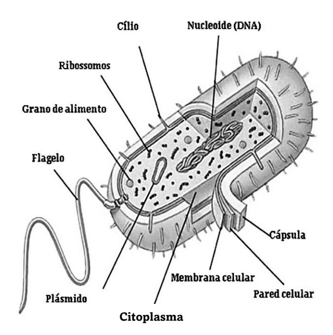

Las células procariontes o procariotas (del latín: pro = antes; y del griego: karyon = núcleo) no poseen organelos formados por membranas, y cuentan con un único cromosoma (ADN) que se encuentra disperso en el citosol. Este tipo celular constituye organismos unicelulares, como las bacterias, y se reproducen por fisión, como se representa en el siguiente esquema:

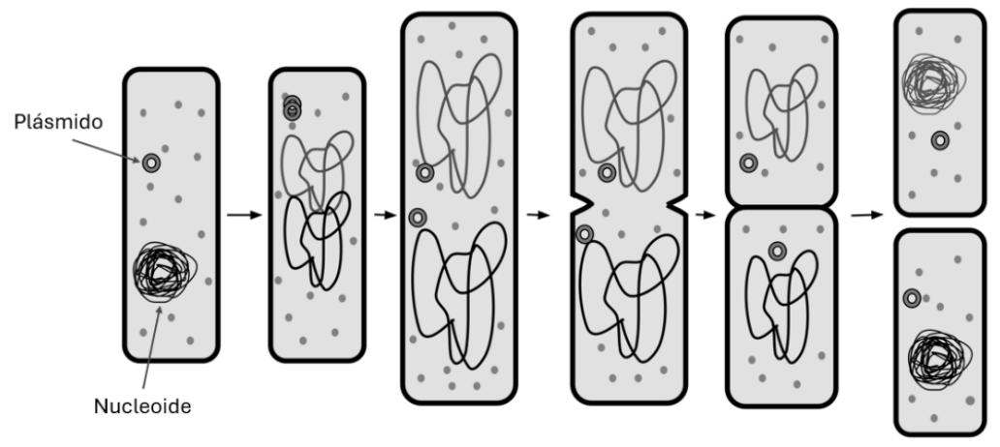

# **1.2. Célula eucarionte animal**

La célula animal es una célula eucarionte que contiene organelos celulares membranosos y no membranosos que la definen y diferencian de otras clases de células.

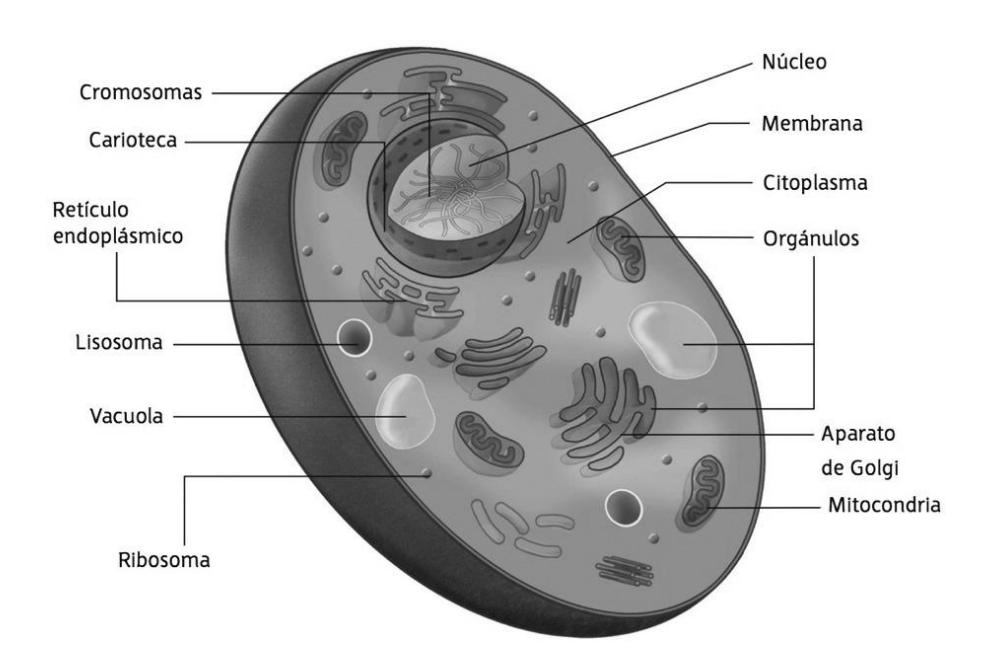

# **1.3. Célula eucarionte vegetal**

La célula vegetal también es una célula eucarionte y posee casi todos los organelos que tiene una célula animal. Sin embargo, existen diferencias entre las células vegetales y las animales, como la ausencia de los centríolos y la presencia de algunos organelos exclusivos de este tipo de células, como son la pared celular, una gran vacuola y los plastidios (cloroplastos).

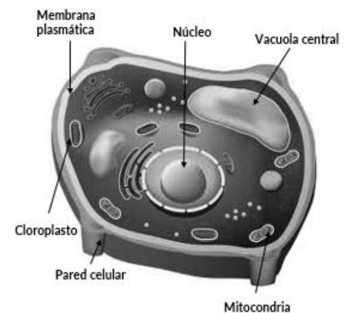

# **1.4. Estructuras de una célula animal y vegetal**

**Membrana plasmática:** Estructura que rodea a la célula y la separa del medio externo. Permite el intercambio de materiales y energía con el entorno. Es selectiva, por ello impide el paso de algunas moléculas y permite el de otras, garantizando la integridad y la estabilidad del medio celular interno. Está compuesta de fosfolípidos y proteínas que participan en el transporte de sustancias.

**Citoplasma:** Líquido viscoso al interior de la célula, en el que se encuentran los organelos y diversas moléculas, ocupa el espacio entre la membrana plasmática y el núcleo.

**Núcleo:** Contiene en su interior la información genética en forma de ADN y ARN. Está delimitado por una membrana doble con poros llamada envoltura nuclear o carioteca (su función es controlar y regular la comunicación entre el citoplasma y el nucleoplasma, siendo una barrera selectiva, al igual que la membrana plasmática). El nucleoplasma está compuesto por agua, sales y proteínas que le confieren la apariencia de gel o semisólido.

El nucléolo es una estructura granulosa, sin membrana presente al interior del núcleo. En él se forman las subunidades de los ribosomas. Normalmente hay entre 1 a 5 nucléolos por célula, según su función.

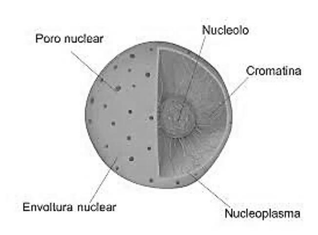

**Retículo endoplasmático rugoso (RER):** Complejo sistema de membranas interconectadas que se originan a partir de la envoltura nuclear presenta ribosomas asociados que participan en la producción de proteínas que serán utilizadas para formar las membranas de la célula. El RER de la neurona recibe el nombre de Cuerpo de Nissl, esta estructura sintetiza los neurotransmisores en el soma neuronal. Además, en algunos tipos celulares el RER produce enzimas digestivas.

**Retículo endoplasmático liso (REL):** Tiene la misma estructura del RER, pero carece de ribosomas. En el se sintetizan los lípidos que forman parte de las membranas celulares y, en algunas células, adquiere funciones más específicas, como la síntesis de hormonas esteroidales. La mayoría de las células tienen REL, pero este es más abundante, por ejemplo, en las células del hígado, que tienen la función de neutralizar determinadas sustancias tóxicas, como alcoholes, pesticidas y drogas, inactivándolas y facilitando su eliminación. El REL especializado de la célula muscular recibe el nombre de Retículo Sarcoplasmático, el cual almacena calcio.

**Aparato de Golgi:** Está formado por un conjunto de bolsas membranosas planas llamados sacos, los cuales se encuentran apilados unos sobre otros. Se ubica después de los retículos. En este organelo, algunas proteínas y lípidos producidos en los retículos son modificados y luego distribuidos mediante vesículas a un destino específico, ya sea para formar parte de la membrana celular, o para exportarlos de la célula. Algunas de estas vesículas permanecen en el citoplasma y se conocen como lisosomas. El aparato de Golgi en vegetales se llama Dictiosoma, este es responsable de la formación del fragmoplasto (tabique que realiza la citocinesis en vegetales). También, da origen al acrosoma de los espermatozoides.

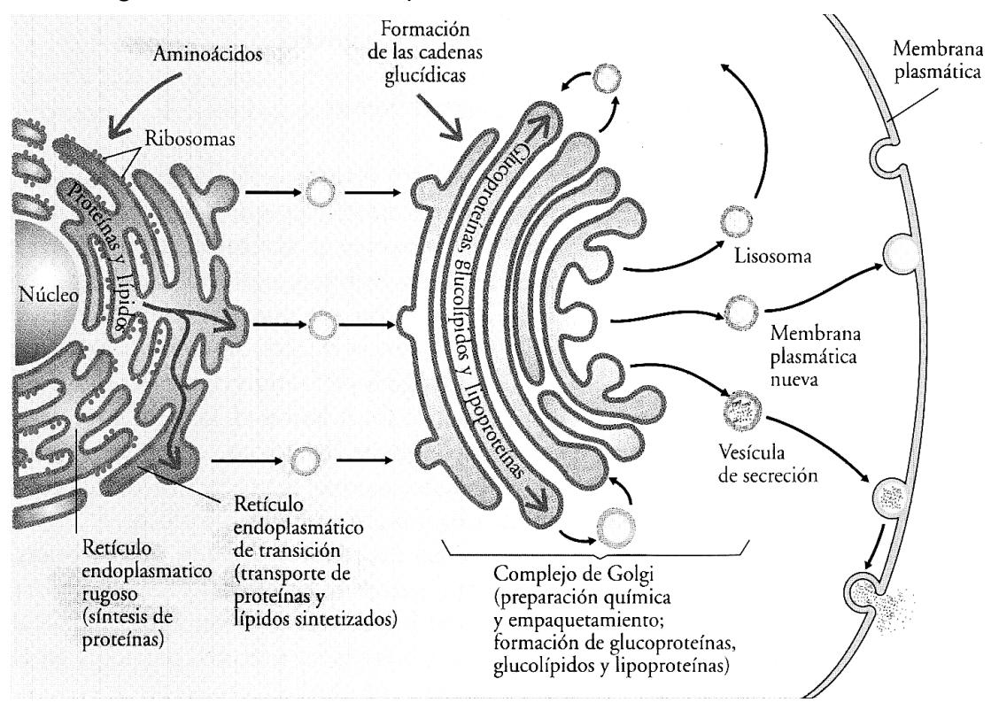

**Lisosomas:** Son vesículas membranosas que contienen enzimas digestivas.

# **Función de los lisosomas**

- Digestión de materiales que ingresan por endocitosis.
- Realizan la autofagia celular digiriendo las membranas celulares excedentes y aquellos organelos viejos o defectuosos, generando la renovación celular.
- Digestión de materiales extracelulares mediante liberación de enzimas al medio circundante (caso del osteoclasto, en el tejido óseo).
- En los anfibios, realizan la autofagia del citoplasma de las células (autolisis) de la cola del renacuajo, para que éste se transforme en un adulto.

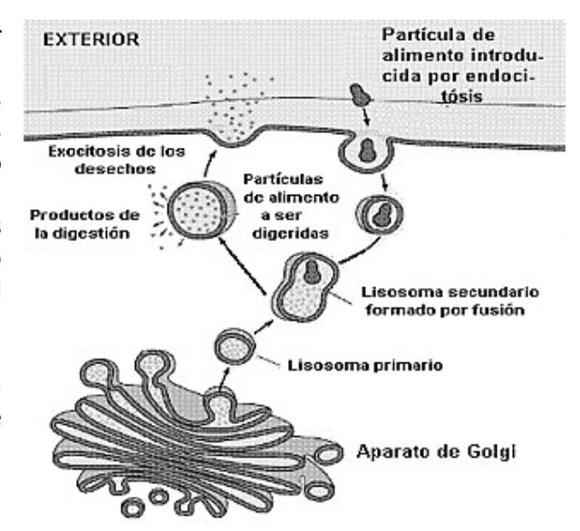

**Peroxisomas:** Pequeñas vesículas membranosas que se originan a partir del REL. En estas vesículas, determinadas enzimas degradan las sustancias tóxicas derivadas del metabolismo celular, como por ejemplo el peróxido de hidrógeno (H2O2), tóxico para la célula. También, los peroxisomas oxidan los ácidos grasos, preparándolos para su uso como materia prima en la respiración celular, son particularmente abundantes en las células del hígado. Existen peroxisomas especializados en vegetales llamados Glioxisomas, su función principal es convertir los lípidos en carbohidratos a través del ciclo del glioxilato.

**Mitocondrias:** Organelos encargados de sintetizar ATP que requiere la célula mediante un proceso llamado respiración celular. El número de mitocondrias en la célula varía de decenas a cientos, dependiendo del tipo celular de que se trate. Las mitocondrias están delimitadas por dos membranas. La más externa es lisa, mientras que la membrana interna presenta pliegues llamados crestas mitocondriales. El interior de las mitocondrias contiene enzimas, ADN, ARN y ribosomas más pequeños que los

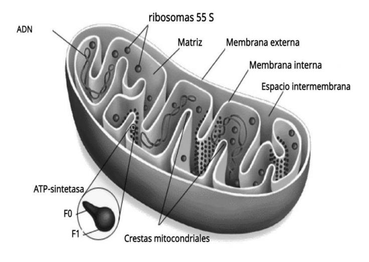

citoplasmáticos, muy similares a los ribosomas bacterianos.

**Citoesqueleto:** El citoesqueleto está presente en todas las células eucariontes. Está formado por proteínas que unen los filamentos del citoesqueleto entre sí y con las membranas de la célula. Esta estructura mantiene la forma de la célula, le da resistencia mecánica, participa en el movimiento celular, sostiene y mueve los organelos y participa también en la división celular. El citoesqueleto de la neurona recibe el nombre de Neurofibrillas.

Estos filamentos son de tres tipos: microtúbulos, microfilamentos y filamentos intermedios.

# **A) Microtúbulos**

Estructuras huecas formadas por una proteína llamada tubulina. Estas estructuras pueden aumentar o disminuir su longitud y cambian de posición en el citoplasma, lo que permite modificar la forma de la célula y redistribuir los organelos.

# **B) Microfilamentos**

Están compuestos de macromoléculas de actina, proteína intracelular más abundante en los organismos eucariontes. El esqueleto estructural de la actina es dinámico, es decir, sus microfilamentos aumentan y disminuyen de longitud, y los paquetes y las redes cambian continuamente.

# **C) Filamentos intermedios**

Tienen un espesor intermedio entre los microfilamentos y los microtúbulos, y a diferencia de ellos, no participan en los movimientos de la célula, sino que se mantienen estables, otorgando soporte a la membrana plasmática.

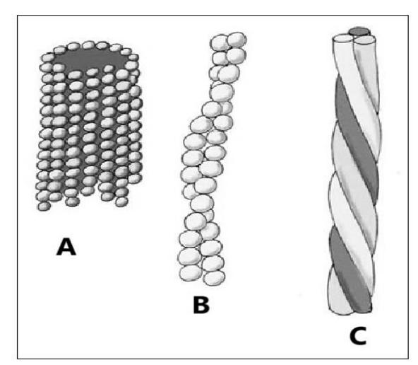

**Centríolos:** Son estructuras cilíndricas compuestas por microtúbulos. Se ubican en un área del citoplasma denominada centrosoma, donde se originan y ensamblan los microtúbulos antes de la división celular. Los centríolos se encuentran solo en células animales. Los Cuerpos Basales son estructuras análogas a los centríolos y su función es dar origen a apéndices locomotores como cilios y flagelos.

# **Las células pueden presentar 3 tipos de apéndices motores:**

• **Cilios:** Prolongaciones cortas y numerosas, constituidas por microtúbulos. Presentes en algunas membranas mucosas y en protozoos como el paramecio.

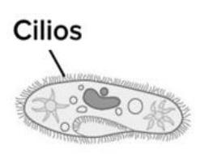

• **Flagelo:** Prolongación de mayor longitud, única o par, en forma de látigo. Se observa en bacterias, protozoos y en el espermatozoide.

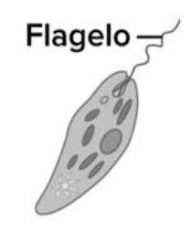

• **Pseudópodos:** Prolongaciones del cuerpo celular, que se expanden y contraen. Constituidas por las proteínas miosina y actina. Se encuentran en los glóbulos blancos y en protozoos como las amebas.

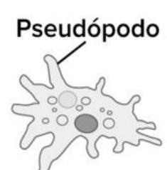

# **1.5. Célula eucarionte vegetal**

La célula vegetal también es una célula eucarionte y posee casi todas las estructuras exclusivas que tiene una célula animal. Sin embargo, existen diferencias entre las células vegetales y las animales, como la ausencia de los centríolos y la presencia de algunos organelos exclusivos de este tipo de células, como son la pared celular, una gran vacuola y los plastidios.

# **Cloroplastos**

Son un tipo de plastidios responsables de realizar el proceso de fotosíntesis. Estos organelos, característicos de las células vegetales, contienen un pigmento llamado clorofila, que además de dar el color verde a las plantas es responsable de captar la energía lumínica del Sol, necesaria para llevar a cabo el proceso fotosintético.

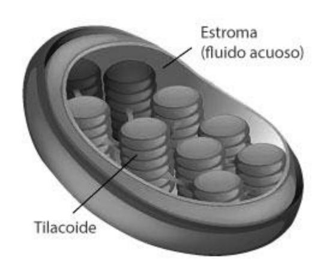

# **Vacuola central**

Estructura delimitada por una membrana. Contiene una solución compuesta por iones, azúcares, aminoácidos y, en algunos casos, proteínas. En células vegetales son de gran tamaño. Además, posee enzimas digestivas que desempeñan una función similar a la de los lisosomas en las células animales. Su presencia, combinada con la pared celular, genera las condiciones de turgencia que hacen posible que las plantas permanezcan erguidas.

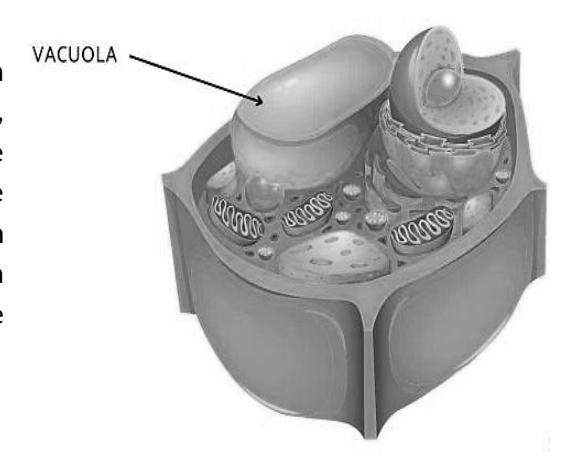

# **Pared celular**

Estructura externa de las células vegetales, está constituida principalmente por celulosa, polisacáridos y proteínas. La principal función de la pared celular en vegetales es dar rigidez y mantener la turgencia de las plantas evitando la ruptura de la célula. También permiten el contacto entre citoplasmas de diferentes células vegetales.

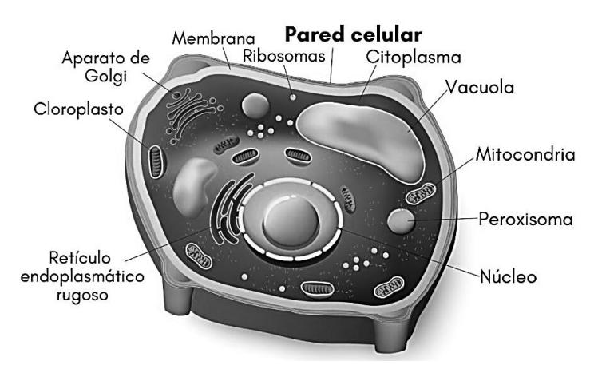

# **1.6. Los virus**

Son parásitos intracelulares obligados y para actuar como un ser vivo utilizan la maquinaria metabólica de la célula que parasitan, inyectando su material genético y controlando sus actividades, obligándola a convertirse en una fábrica de componentes virales, que se ensamblarán, pudiendo generar la lisis celular, es decir, necesitan sintetizar los ácidos nucleicos y las proteínas que los conforman para lograr reproducirse.

Pero la vía no es siempre lítica (lisis celular), pudiendo ocurrir que el material genético incorporado al ADN celular no genere componentes virales o produzca muy pocos, permaneciendo al interior de la célula sin destruirla.

Pueden afectar a bacterias, plantas y animales para lograr su objetivo y por esto son responsables de una gran cantidad de enfermedades. Los virus están formados por ADN (adenovirus) o de ARN (retrovirus), rodeados por una cápside y por un manto. Contienen las enzimas necesarias para copiar su material genético y ensamblar las nuevas partículas virales.

Son considerados como "organismos al límite de la vida" ya que no poseen estructura celular, es decir, son estructuras que corresponden al límite entre la "materia viva" y la "materia inerte".

La ausencia de metabolismo es una de las principales características que le impide a los virus crecer, desarrollarse y reproducirse de manera autónoma.

### **Estructura de un virus**

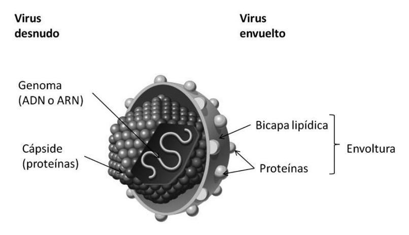

### **Ciclo de un virus**

Ciclo reproductivo para el virus bacteriano denominado bacteriófago lambda (fago lambda (λ)). Este se utiliza como modelo general para ejemplificar el mecanismo de infección de los virus.

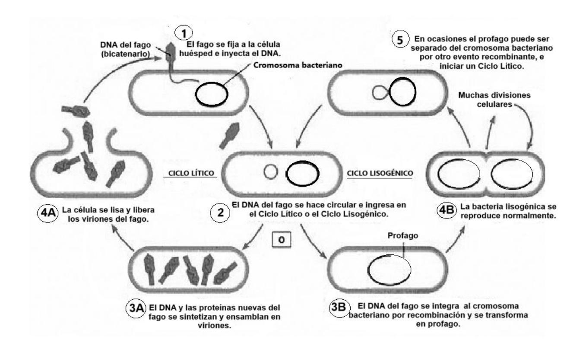

# **1.7. Características de algunos tipos celulares**

Los organismos pluricelulares como los seres humanos presentan una gran diversidad de células. Aunque todas estas comparten características básicas, como la presencia de membrana plasmática y material genético, su forma y organización varían notablemente según la función que desempeñan en el organismo. Esta especialización estructural permite a las células llevar a cabo tareas específicas que son fundamentales para el funcionamiento del cuerpo y la mantención de la homeostasis.

# **Células del epitelio intestinal: Enterocitos**

Corresponden a células epiteliales del intestino, encargadas de funciones como la absorción de nutrientes,de agua y electrolitos al interior del organismo, y la secreción de proteínas hacia la cavidad o luz intestinal. Anatómicamente, presentan microvellosidades las que aumentan el área de absorción de nutrientes.

Dentro de sus funciones encontramos:

- **1. Barrera mecánica:** Forman una barrera semipermeable que permite el paso de sustancias de forma selectiva, tales como nutrientes inorgánicos (agua y sales minerales) y orgánicos (monosacáridos, aminoácidos, ácidos grasos y vitaminas).
- **2. Barrera bioquímica:** Producen enzimas, las cuales cumplen un rol importante en la digestión química de los nutrientes contenidos en los alimentos. Esta característica es posible porque este tipo de células posee un gran desarrollo de RER y Aparato de Golgi.

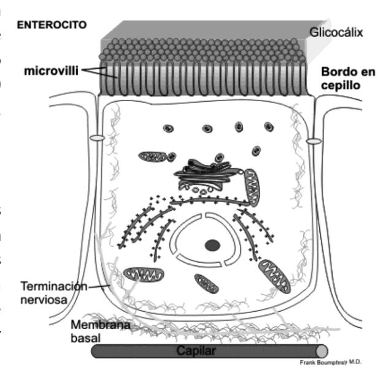

**3. Barrera inmunológica:** Bloquean el paso de antígenos microbianos (bacterias y virus, agentes patógenos), permiten la mantención del sistema inmunitario y permiten la adquisición de tolerancia a los antígenos de los alimentos y a la microbiota intestinal (bacterias que habitan la mucosa intestinal, dentro de las que encontramos a la bacteria *Escherichia coli*.

# **Célula muscular esquelética: miocito**

Los miocitos que conforman el tejido muscular esquelético son los responsables del movimiento de tipo voluntario. Estas células están asociadas íntimamente a los huesos mediante los tendones. Este tipo de células son en realidad sincitios, es decir, citoplasma rodeado por membrana que incluye varios núcleos, algo así como "células fusionadas".

Suelen ser muy alargadas y se caracterizan por poseer un citoesqueleto muy desarrollado que permite el acortamiento de la fibra muscular, lo cual provoca directamente la contracción muscular responsable del movimiento.

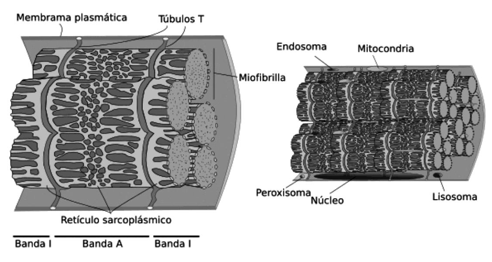

Como ya se mencionó, presentan un citoesqueleto muy desarrollado, principalmente formado por filamentos de actina y de miosina. Estas se asocian en haces denominados miofibrillas, las cuales están rodeadas por membranas del retículo endoplasmático liso, denominado específicamente como retículo sarcoplásmico. Además, entre las miofibrillas encontraremos mitocondrias y cúmulos de glucógeno. Respecto a este último organelo, dada la actividad contráctil que ejercen los miocitos, el requerimiento energético (ATP) es particularmente alto, por ende, la cantidad de mitocondrias suele ser bastante alta (3% a 8% del volumen muscular está ocupado por mitocondrias, aunque esto depende en gran medida del nivel de actividad física). Este tipo de células se denominan estriadas debido a que cuando se observa con el microscopio óptico aparece un patrón de bandas claras y oscuras, a modo de estrías. Este patrón de bandas es consecuencia de la superposición de los filamentos del citoesqueleto que forman las miofibrillas. La porción comprendida entre dos discos o líneas Z corresponde al sarcómero, el cual es la unidad funcional y contráctil del músculo estriado.

# **Célula nerviosa: neurocito o neurona**

La neurona es el principal componente del sistema nervioso. Se caracteriza por poseer un núcleo y una o más prolongaciones, una de ellas denominada axón. Debido a su alto grado de especialización se encuentran fuera del ciclo celular (G0), por ende, no se reproducen por mitosis como sí lo hacen otros tipos de tejidos. Su principal función se centra en la conducción y propagación del impulso nervioso, una señal de naturaleza electroquímica que puede comunicarse de una neurona a otras células, como neuronas, músculos y glándulas, mediante el contacto estrecho entre ambas células conocidas como sinapsis.

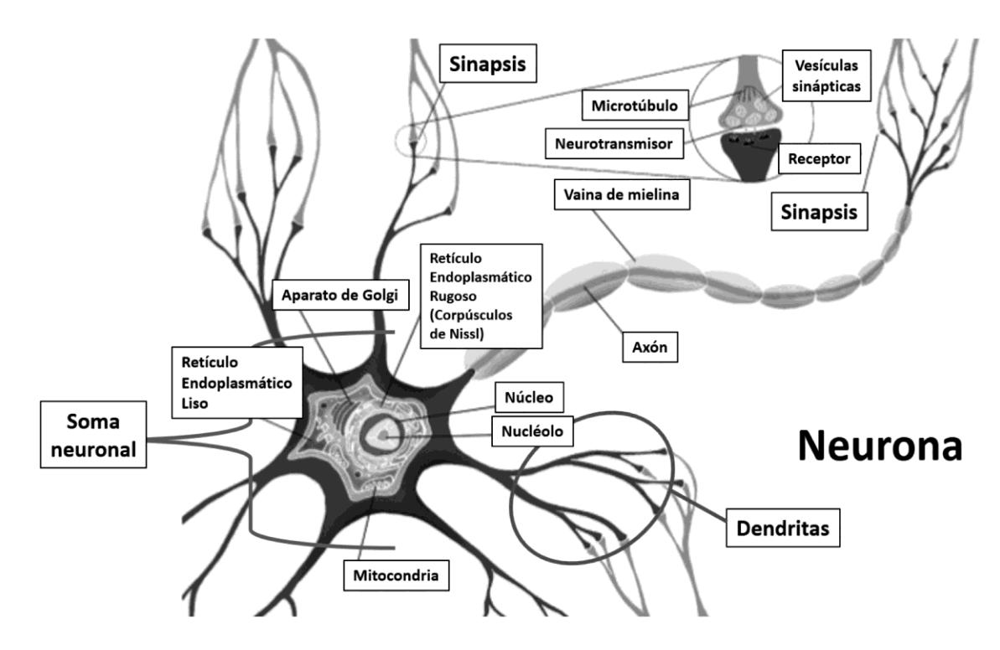

Esta comunicación es posible gracias a los neurotransmisores, sustancias químicas de naturaleza proteica y aminoacídica producidos por las neuronas, específicamente en los corpúsculos de Nissl, los cuales corresponden a retículo endoplasmático rugoso (RER). Debido a esto, este tipo de células tienen un alto grado de especialización presentando un nivel mayor de RER y de Aparato de Golgi que otros tipos celulares.

# **Células secretoras pancreáticas: pancreocito**

El páncreas es un órgano con función glandular mixta: función exocrina y función endocrina.

# **Función exocrina**

La porción exocrina comprende células que están especializadas en la síntesis y secreción del componente acuoso (una disolución de bicarbonato) y proteico (enzimas digestivas), función que depende de las células acinares. Debido a esta función en este tipo de células se observa un alto desarrollo de RER y Aparato de Golgi.

# **Función endocrina**

La porción endocrina comprende células especializadas en hormonas de tipo proteicas como la insulina y el glucagón, las cuales son fundamentales para la homeostasis de la glicemia.

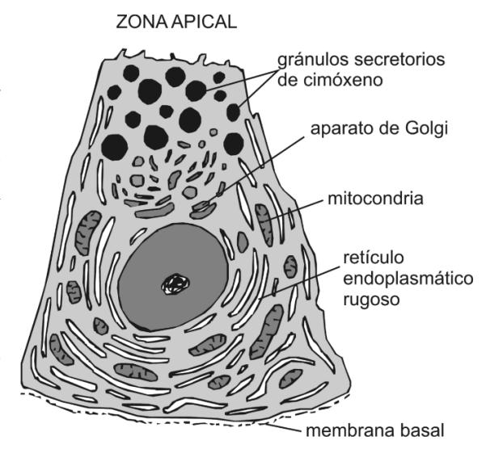

# **Ejercicios de selección única**

Seleccione la alternativa correcta para cada pregunta.

1. Durante la década de los 80 nació una nueva corriente de estudio llamada medicina física, que, entre sus múltiples áreas de desarrollo, proponía la hipótesis de que algunas lesiones como heridas, fracturas o quemaduras podían mejorar sus índices de rehabilitación y recuperación mediante la irradiación de los tejidos con láser infrarrojo de baja frecuencia.

Con el objetivo de poner a prueba dicha hipótesis, un grupo de científicos desarrolla un estudio experimental donde se sometió a 24 ratas hembra divididas en cuatro grupos (A, B, C y D), de acuerdo con la siguiente tabla:

| Grupo A | Control (sin luz infrarroja) |
|---------|------------------------------|
| Grupo B | 4 J/cm2                      |
| Grupo C | 8 J/cm2                      |
| Grupo D | 16 J/cm2                     |

La estimulación infrarroja se realizó diariamente, por 15 días ininterrumpidos. Posteriormente, se extrajeron muestras de tejido hepático de los grupos estudiados, con el fin de medir las cantidades de retículo endoplasmático rugoso (RER), mitocondrias y glucógeno. Los resultados se presentan en el siguiente gráfico.

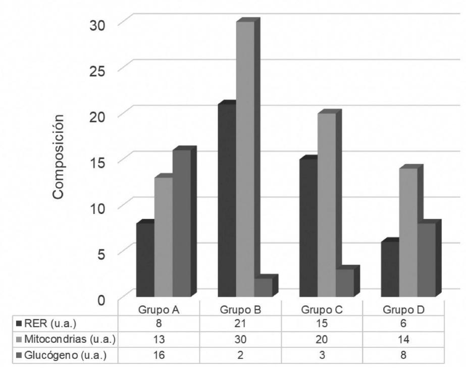

De acuerdo con la información anterior, ¿cuál de las siguientes alternativas es una conclusión coherente con los resultados?

- A) La radiación infrarroja de baja frecuencia aumenta la regeneración celular del grupo A.
- B) Las ratas del grupo D son las que presentan el mejor índice de regeneración celular.
- C) La radiación infrarroja disminuye la cantidad de mitocondrias en el grupo B.
- D) Las ratas control presentan la mayor cantidad de glucógeno.

2. Múltiples estudios han demostrado los efectos positivos del consumo de creatina en el desempeño muscular de deportistas desde amateurs hasta los de alto rendimiento. El principal beneficio tiene que ver con que la creatina es un compuesto nitrogenado que se combina con fosfato, dando origen a fosfocreatina. Este compuesto es de vital importancia en el metabolismo energético durante la contracción muscular y la recuperación post entrenamiento ya que participa en la reposición de ATP a partir de ADP mediado por la enzima creatinquinasa. Este aumento de la síntesis de ATP se produce por un incremento de la actividad mitocondrial a nivel del musculo esquelético y que, al ser combinado con entrenamiento aeróbico, produce adaptaciones celulares que aumentan el número y tamaño de estos organelos.

¿Cuál de las siguientes opciones expresa correctamente los efectos del consumo de creatina en deportistas?

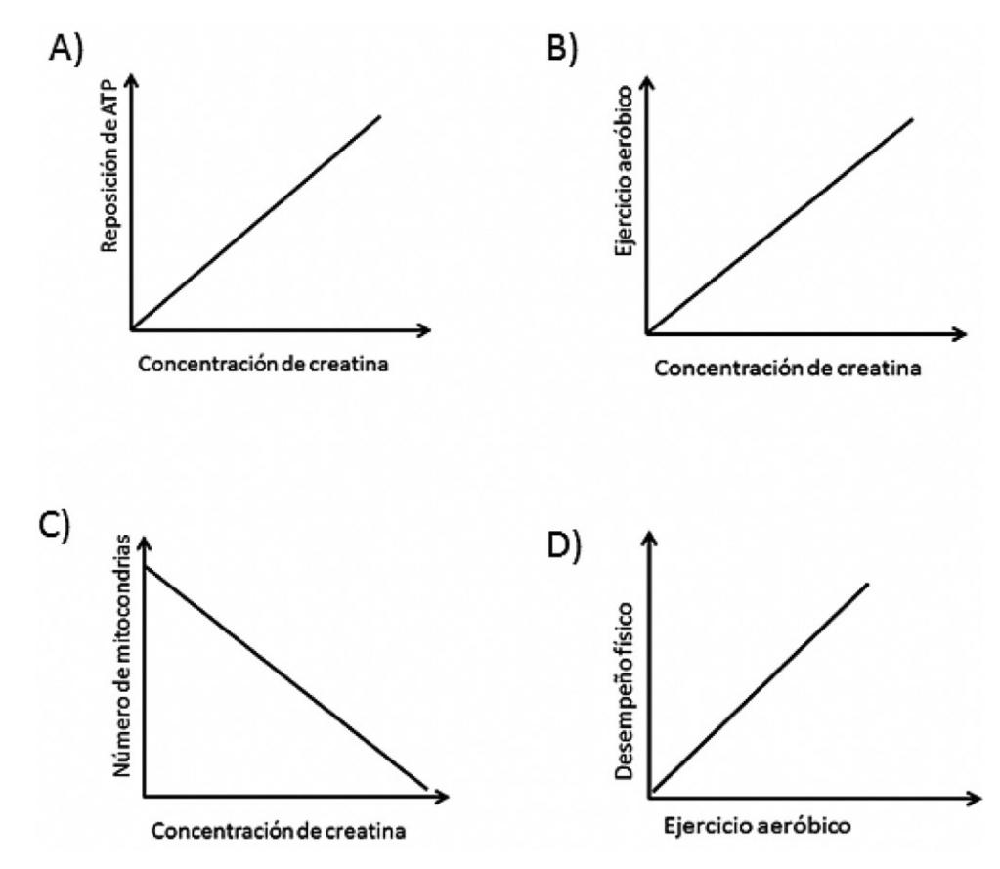

3. Investigadores están estudiando la función del retículo endoplasmático liso (REL) en células hepáticas de ratones sometidos a una dieta alta en grasas. En un experimento el equipo de investigación concluye que hubo un descenso en la función de este organelo en las ratas tratadas.

Al respecto, ¿cuál de las siguientes opciones representa un parámetro cuantificable que pudo llevar a la conclusión del equipo?

- A) Producción de ATP para el metabolismo celular.
- B) Síntesis de proteínas destinadas de secreción.
- C) Transporte de proteínas al aparato de Golgi.
- D) Detoxificación y síntesis de lípidos.
- 4. En un laboratorio, un grupo de estudiantes analiza la estructura celular de plantas que crecen en suelos salinos. En un experimento observan que las células vegetales tienen vacuolas centrales muy grandes y contienen altas concentraciones de iones.

A partir de estas observaciones, ¿cuál de las siguientes opciones representa la función más probable de la vacuola central?

- A) Almacenar sustancias como iones y agua, y mantener la presión de turgencia.
- B) Participar en la síntesis de proteínas esenciales para el metabolismo.
- C) Producir energía en forma de ATP mediante la respiración celular.
- D) Regular el intercambio de gases durante la fotosíntesis.
- 5. Un equipo de investigadores está estudiando un tipo raro de enfermedad genética en la que las células humanas no pueden neutralizar cierto tipo de metabolitos de desecho, conocidos como especies reactivas de oxígeno, lo que lleva a la acumulación de estas sustancias dentro de las células, causando daño en el material genético.

Al respecto, ¿cuál de las siguientes alternativas presenta al principal organelo involucrado en la neutralización de estas sustancias?

- A) REL
- B) Lisosomas
- C) Peroxisomas
- D) Mitocondrias

# **Área temática: Herencia y evolución**

# **Capítulo 1: Material genético y reproducción celular**

# **Objetivos de aprendizaje:**

- Comprender y explicar las características generales del ciclo celular (mitosis y meiosis) y su importancia biológica.
- Comprender y analizar los diferentes métodos de manipulación genética y su impacto en diversos ámbitos de la vida cotidiana

# **1.1. Núcleo celular**

El núcleo es el centro de control celular. Está limitado por una membrana doble llamada **carioteca** o envoltura nuclear, la cual cuenta con una serie de poros. Al conjunto de poros nucleares se les llama complejo poro. La membrana es semipermeable, incluso posee un potencial eléctrico a cada lado.

En el núcleo se encuentra ADN, ARN, proteínas y enzimas que participan en los distintos procesos nucleares, como replicación y transcripción. El ADN que normalmente se encuentra parcialmente condensado en el núcleo se le denomina **cromatina**. Cuando la célula inicia la mitosis, esta cromatina se condensa fuertemente formando **cromosomas**.

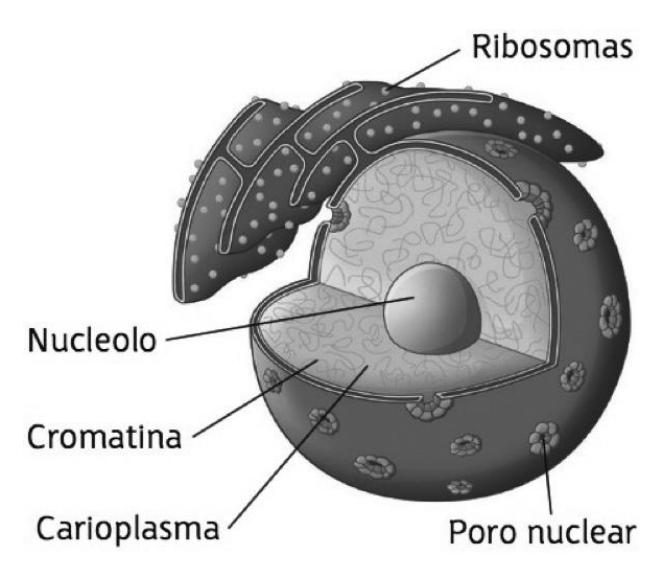

El nucléolo es una estructura presente en el interior del núcleo. No presenta membrana celular y está compuesto por ARN ribosomal y proteínas. En él se forman las subunidades de los ribosomas.

# **1.2 Compactación del ADN y formación de cromatina**

El ADN que normalmente se encuentra parcialmente condensado en el núcleo se le denomina cromatina (cromosoma simple, es decir, con un solo ADN).

Las macromoléculas de ADN son extensas, y aun así se encuentran en el interior del núcleo celular. Esto se debe a que están parcialmente condensadas, gracias a la ayuda de un grupo de proteínas conocidas como histonas. Estas proteínas permiten que el ADN se enrolle sobre ellas formando una especie de collar de cuentas, cada cuenta se conoce como nucleosoma.

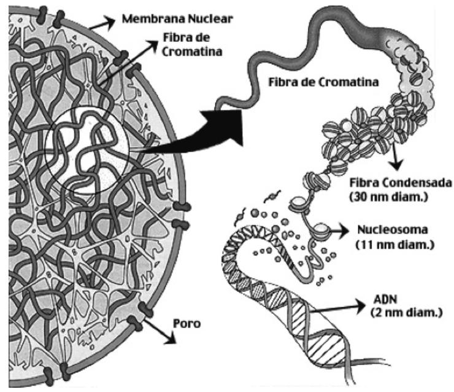

Cuando la cromatina se ha duplicado y se condensa da origen a los cromosomas. Las cromátidas se encuentran unidas en un sector llamado constricción primaria o centrómero.

A los extremos de cada cromátida se les denomina telómeros.

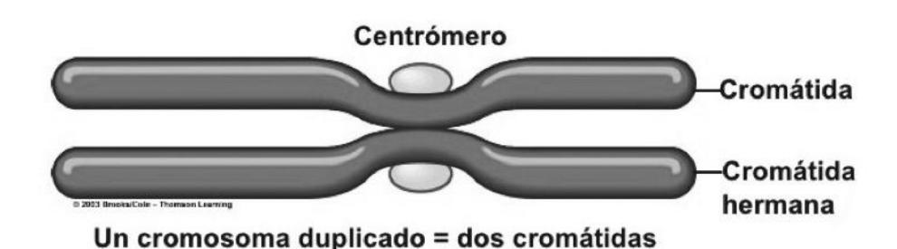

# **1.3. Cromosomas homólogos**

Es un par de cromosomas iguales en forma, tamaño y posición de centrómero. Son los que tienen los mismos genes, aunque en distintas versiones, denominadas alelos (genes alelos). Un locus corresponde al lugar físico que ocupa un gen, plural loci.

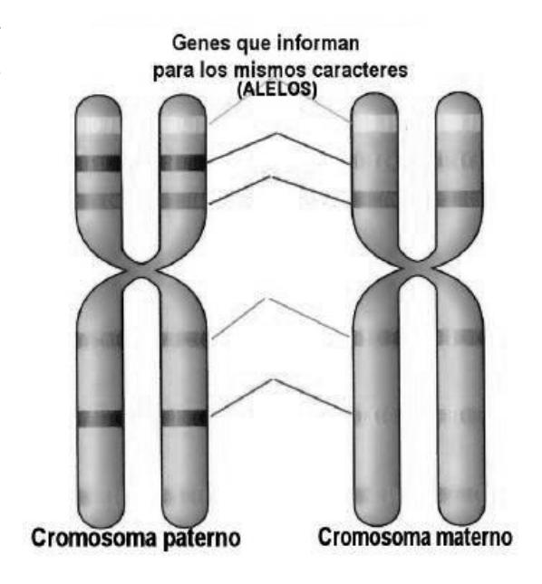

# **1.4. Cariotipo y cariograma**

El cariotipo es el conjunto de cromosomas característicos de una determinada especie de organismos, un cariotipo se diferencia de otro por la forma, número y dimensiones de los cromosomas que lo componen. Por otro lado, un cariograma corresponde a la representación gráfica de los cromosomas de una célula.

Por ejemplo, la siguiente imagen representa el cariograma de la especie humana, en esta imagen puede apreciarse que los cromosomas están ordenados por tamaño y posición del centrómero. El último par corresponde al par sexual (par 23), el cual es diferente en hombres y en mujeres.

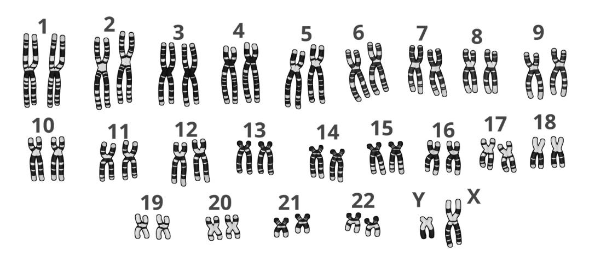

# **1.5. Cromosomas somáticos y sexuales**

Los cromosomas somáticos o autosómicos corresponden a todos los cromosomas del individuo, excepto los cromosomas sexuales y son iguales en forma y tamaño en hombres y en mujeres.

Los cromosomas sexuales o heterocromosomas corresponden a los cromosomas que determinan el sexo del individuo. Se identifican con X e Y. En mujeres los cromosomas sexuales son iguales XX y en hombres son diferentes XY.

# **1.6. Células haploides y diploides Célula haploide**

- Presenta sólo un juego de cromosomas, todos diferentes entre sí.
- No presenta cromosomas homólogos.
- El símbolo utilizado para identificar este tipo de célula es "n" ("n" significa un solo juego de cromosomas).
- Ejemplo de célula haploide: Gametos o células sexuales. En el caso humano, los gametos presentan sólo 23 cromosomas.

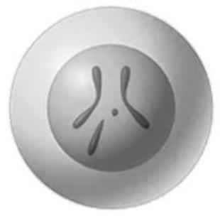

# **Célula diploide**

- Presenta dos juegos de cromosomas, dispuestos en pares homólogos.
- El símbolo utilizado para identificar este tipo de célula es 2n (n significa un solo juego de cromosomas).
- Ejemplo de célula diploide: Células somáticas o corporales.
- En el caso humano, las células somáticas presentan 46 cromosomas.

# **1.7 Ciclo celular**

Las células eucarióticas pasan a través de una secuencia regular, repetitiva de crecimiento y división denominada ciclo celular. El ciclo celular se divide en dos fases principales: interfase y división celular. Esta última a su vez está constituida por la mitosis (fase M) y la citocinesis (división del citoplasma). Antes de que una célula pueda comenzar la mitosis y dividirse efectivamente, la célula debe prepararse. Estos procesos preparatorios ocurren durante la interfase, en la cual se distinguen tres etapas: G1, S y G2.

Los detalles del ciclo pueden cambiar de acuerdo con el tipo celular, pero ciertas características son universales. Primero, el ADN debe ser cuidadosamente replicado (copiado) y los cromosomas así replicados deben ser segregados o separados en dos células.

La mayoría de las células también duplican su masa y sus organelos citoplasmáticos en cada ciclo celular. Recientes experimentos han revelado que existe un sistema de control del ciclo celular que lo coordina como un todo.

La duración del ciclo celular varía de manera importante entre un tipo celular a otro, por ejemplo, en cultivos de leucocitos humanos la interfase de 22

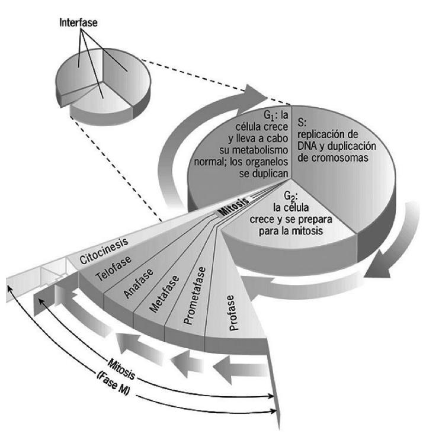

horas se subdivide en un período G1 de 11 horas de duración, un período S de 7 horas y un período G2 de 4 horas de duración. Una célula de tejido conjuntivo de mamíferos, en cambio, tiene una interfase de 19 horas dividida en un período de 5 horas (G1), 8 horas (S) y 6 horas (G2).

# **1.7.1. Interfase**

**Fase G0:** Es un estado que se encuentra fuera del ciclo celular. Todas las células en general se encuentran en G0, sólo si se dividen pasan al ciclo celular. Ellas pueden abandonar el ciclo celular, pero lo pueden hacer únicamente en G1, ya que si pasan el punto R tienen que terminar el ciclo o morir.

El punto R se encuentra al final de G1 y corresponde al punto de control de

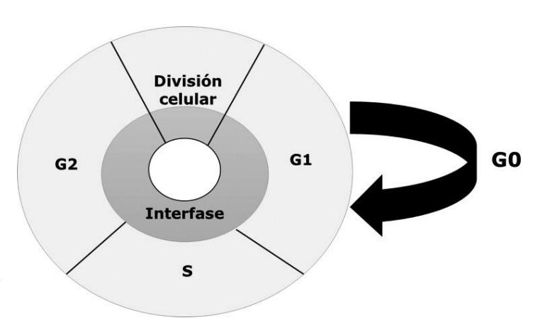

proliferación celular. Sin embargo, aunque las células que están en G0 cumplen una función específica no pierden el potencial proliferativo, ya que bajo determinados estímulos pueden volver al ciclo celular.

En el adulto existen células que no presentan actividad proliferativa como es el caso de la mayoría de las neuronas y células musculares. Estas células se diferencian entrando a un estado de máxima especialización, con lo cual pierden totalmente el potencial proliferativo, en condiciones normales, ningún estímulo las hace volver al ciclo celular, por lo tanto, permanecen toda su existencia en G0.

**Fase G1:** Es un período de alta actividad bioquímica. La célula aumenta de tamaño e incrementa la cantidad de proteínas (enzimas y microtúbulos para el huso mitótico), ribosomas, mitocondrias y el resto de las estructuras celulares.

Durante la fase G1 la célula evalúa su ambiente, su tamaño y cuando las condiciones son adecuadas recién comienza a replicar su ADN (fase S) y completar el ciclo. Si la célula detecta que las condiciones para la replicación del ADN no están dadas, subsisten en un estado especializado fuera del ciclo, llamado G0, en el cual pueden permanecer por días, semanas o aún años antes de reiniciar la proliferación.

**Fase S:** Es un período en el cual ocurre la replicación del ADN (duplicación de cromosomas), por tanto, muchas de las histonas y otras proteínas asociadas al ADN son sintetizadas. Por ende, cada célula hija recibe de manera equitativa el ADN duplicado por la célula madre.

**Fase G2:** es el periodo comprendido entre la fase S y la división celular. En esta fase se asegura que la replicación del ADN se ha completado antes de comenzar la mitosis o meiosis. Además, durante esta fase, se sintetizan las proteínas (microtúbulos) que darán origen al huso mitótico.

# **1.7.2. Mitosis**

La mitosis corresponde a la división del núcleo. Esta tiene distintas funciones dependiendo del tipo de organismo que la realice: reproducción asexual en algunos organismos unicelulares eucariontes o regeneración de tejidos y proliferación celular (crecimiento) en organismos pluricelulares. Se caracteriza por mantener iguales tanto el contenido nuclear (2n) como la cantidad de ADN (2c).

Esto significa que las células hijas son idénticas entre sí y con la célula progenitora. Este proceso se divide en etapas, diferenciadas por los fenómenos que ocurren en cada una de ellas.

| Etapas   | Características                                                                                                                                                                                                                                                                                                                                                                                                                                                                                                                                                          | Ejemplo |  |  |
|----------|--------------------------------------------------------------------------------------------------------------------------------------------------------------------------------------------------------------------------------------------------------------------------------------------------------------------------------------------------------------------------------------------------------------------------------------------------------------------------------------------------------------------------------------------------------------------------|---------|--|--|
| Profase  | • Los cromosomas siguen compactándose y pueden ser vistos al microscopio. • Los centrosomas migran hacia los polos y entre ellos se genera el huso mitótico, formado por microtúbulos. • Se desarticula la carioteca, el aparato de el retículo endoplásmico y el Golgi, nucléolo. • Las fibras del huso mitótico se enganchan a los cinetocoros (disco proteico ubicado a ambos lados del centrómero) de cada cromosoma. 2n: diploide. |         |  |  |
|          | 4c: ADN en forma de cromosomas dobles.                                                                                                                                                                                                                                                                                                                                                                                                                                                                                                                 |         |  |  |
| Metafase | • Se completa la formación del huso mitótico. • Los cromosomas alcanzan su máxima compactación y son ordenados por las hebras del huso, en el plano ecuatorial. 2n: diploide. 4c: ADN en forma de cromosomas dobles.                                                                                                                                                                                                                                                           |         |  |  |
| Anafase  | • En esta etapa se separan las cromátidas hermanas desplazándose hacia los polos opuestos de la célula, siendo traccionadas por la acción de las fibras del huso. • Al final de esta etapa, las cromátidas se agrupan en cada polo de la célula. 4n: tetraploide. 4c: ADN en forma de cromosomas simples.                                                                                                                               |         |  |  |

# **Telofase** • En esta etapa el huso mitótico se desarticula y las cromátidas se agrupan en los polos, se desenrollan y asumen el aspecto de cromatina. • La membrana nuclear se reorganiza, alrededor de los cromosomas y se reconstituye el nucléolo. • En el interior de la célula es posible observar dos núcleos diploides idénticos. **4n: tetraploide (dos pares de juegos de cromosomas en dos núcleos por separado). 4c: ADN en forma de cromosomas simples.**

# **1.7.3. Citocinesis o citodiéresis**

La citocinesis o división del citoplasma usualmente está en progreso antes de que la división nuclear se complete, puede comenzar en anafase o en telofase.

# **¿La citodiéresis ocurre de la misma manera en células animales y vegetales?**

• En animales es por estrangulación del citoplasma gracias a la acción de un anillo contráctil de actina y miosina.

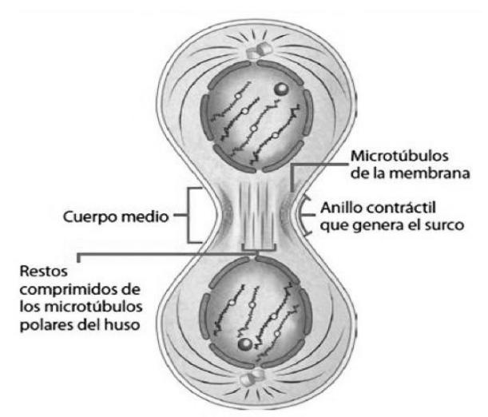

- En vegetales gracias a vesículas membranosas derivadas del aparato de Golgi se forma el fragmoplasto.
- Posteriormente la fusión de las vesículas origina la placa celular, que completará las paredes de las células hijas.

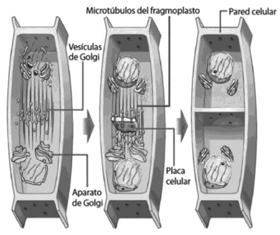

# **1.7.4. Cantidad de ADN (c)**

En genética se define como valor "c" a la cantidad de ADN que contiene un genoma haploide (compuesto por un único juego cromosómico).

La especie humana tiene dos copias de cada uno de sus 23 cromosomas, que habitualmente se expresa como **2n=46**, por lo tanto, es una especie diploide (**2n**). Con dos juegos de 23 cromosomas,

uno recibido del padre y otro de la madre. El valor "**c**" es la cantidad de ADN correspondiente a uno de estos juegos que en la especie humana son de 23 cromosomas.

Por ejemplo, una célula diploide con cromosomas simples o no duplicados, su cantidad de ADN es **2c**. En cambio, esta misma célula con sus cromosomas duplicados (cada uno, formado por dos cromátidas), la cantidad de ADN es **4c**.

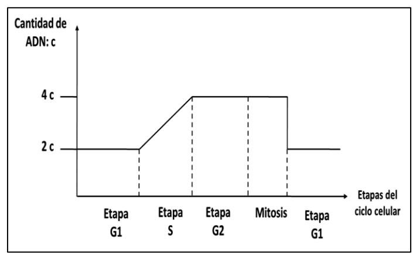

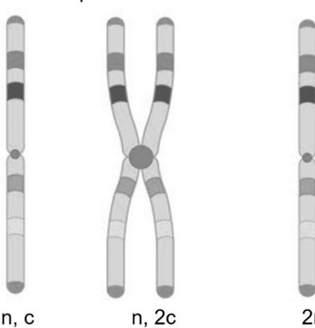

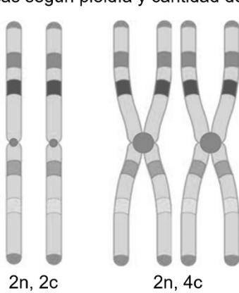

# **1.8. Regulación del ciclo celular**

Todos estos procesos celulares (interfase y mitosis) poseen mecanismos de control que son regulados por diversos factores, fundamentalmente por proteínas que se sintetizan a partir de genes específicos. El ciclo celular presenta puntos clave donde controla los procesos celulares para iniciar o no una división.

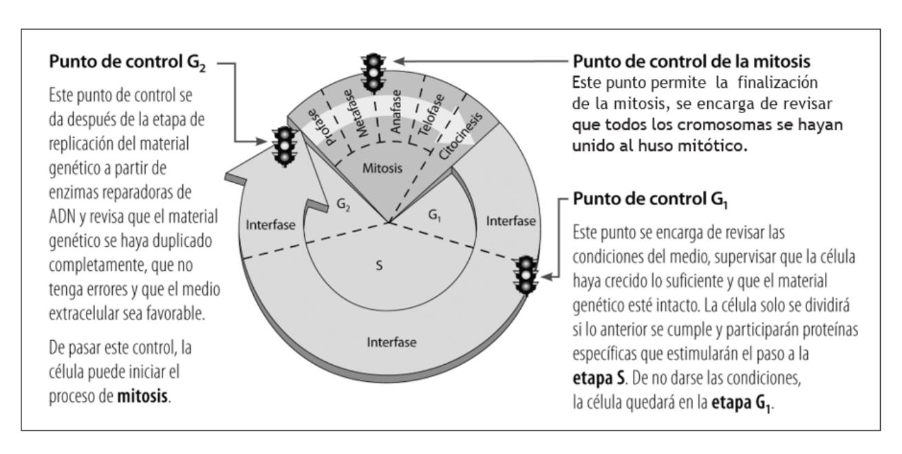

Los genes que regulan el ciclo celular se dividen en tres grupos:

- **a.** Genes que codifican proteínas para el ciclo celular, como por ejemplo tubulinas que forman parte de los microtúbulos que forman el huso mitótico.
- **b.** Genes que codifican proteínas como las ciclinas y quinasas dependientes de ciclina (Cdk) que regulan positivamente el ciclo (protooncogenes) activando la proliferación celular. Estas proteínas son fundamentales en la promoción de las etapas de G1 a S y de G2 a mitosis.
- **c.** Genes que codifican proteínas que regulan negativamente el ciclo, también llamados genes supresores de tumores. Éstos detienen la mitosis si se detecta alguna alteración en el proceso del ciclo celular o que la replicación del ADN ha ocurrido en forma incorrecta.

Entre estos genes se encuentran los que codifican proteínas como la quinasa WEE1 que inactiva las Cdk; también los que codifican proteínas como la **P53, P27, P21** que inhiben el ciclo.

**P53:** Es una proteína que funciona bloqueando el ciclo celular si el ADN está dañado, codificada por un gen supresor de tumor. Si el daño es severo, esta proteína puede inducir la apoptosis o muerte celular programada (proceso ordenado y sin daño para las células vecinas). La P53 hace que se expresen otros genes de proteínas reguladoras como los P21 y P16 que bloquean la actividad de las Cdk. Las células, al no replicar su ADN, se detiene en la fase G1.

**P27:** Es una proteína que se une a ciclinas y Cdk bloqueando la entrada a fase S.

# **1.9. Mutaciones**

Cada ser humano está formado por millones de células, en algunas de las cuales ocurren cambios en la información genética. Algunos de estos cambios son reparados, mientras que otros se mantienen y se heredan a las células hijas. Estos cambios o alteraciones en el material genético se conocen con el nombre de mutaciones.

Las mutaciones son alteraciones en el material genético (ADN, cromosomas, cariotipo) producto de un daño mal reparado.

Aunque muchas mutaciones puedan originarse en nuestras células somáticas, estas no se heredan a la descendencia. Sólo se traspasan a la descendencia si la mutación ocurre en el material genético de los gametos.

Las mutaciones pueden ser: Naturales (espontáneas) o Inducidas (provocadas artificialmente por agentes mutágenos).

El efecto de las mutaciones es variado, mientras que algunas pueden ser **beneficiosas**, otras son **perjudiciales**, mientras que otras pueden ser **neutras**.

Un agente mutágeno es todo factor capaz de aumentar la frecuencia de mutación natural.

Son ejemplos de agentes mutágenos:

- Factores físicos como los rayos ionizantes.
- Factores químicos como el alcohol y el cigarrillo.
- Factores biológicos como algunos virus.

# **1.10. Cáncer**

El cáncer es una enfermedad genética producida por una mutación en determinados genes: protooncogenes o genes supresores de tumores.

La mutación de estos genes provoca que las células se multipliquen sin control y de manera autónoma, invadiendo localmente y a distancia otros tejidos.

El cáncer se inicia cuando un grupo de células de un lugar específico del organismo comienza a dividirse de manera inusual, lo que origina

una masa de células denominada tumor. Los tumores benignos están restringidos a un lugar determinado. En cambio, los tumores malignos,

pueden invadir otros tejidos, viajando en la sangre o en la linfa, proliferando y produciendo más

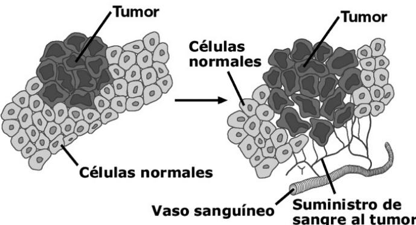

tumores malignos. Este fenómeno se denomina metástasis y es propio de la mayoría de los tipos de cáncer.

# **1.10.1. Causas**

En muchos casos la causa del cáncer tiene un componente hereditario, pero existen factores ambientales que pueden actuar como agentes que pueden producir mutaciones en el ADN. Algunos de ellos son la contaminación, la exposición a rayos UV, el consumo de tabaco o la inhalación de ciertas sustancias químicas, entre otros. Por otro lado, existen evidencias de que la infección de ciertos virus está asociada a algunos tipos de cáncer, como es el caso del virus del papiloma humano, que puede provocar cáncer cérvico uterino.

Todos los factores, ya sean químicos, físicos o biológicos, que causan algún tipo de cáncer se denominan **agentes carcinógenos**.

# **1.10.2. Genes y cáncer**

Actualmente se conocen dos grupos de genes cuya alteración puede generar cáncer:

**Protooncogenes:** Grupo de genes cuya función es estimular la división celular y que, en condiciones normales, están presentes en las células. Cuando se produce una mutación en alguno de ellos, se generan oncogenes, cuya expresión provoca un aumento descontrolado del crecimiento y la reproducción celular.

**Antioncogenes o genes supresores de tumores:** Son genes que codifican proteínas que de una u otra forma inhiben la división celular, ya sea deteniendo el ciclo o bien produciendo la muerte de la célula (apoptosis).

La pérdida de función en uno o más de estos "frenos" contribuyen al desarrollo de muchos tipos de cáncer. Por ejemplo, la mutación, del gen P53 y la consiguiente formación de una proteína P53 no funcional puede ocasionar cáncer de colon y recto, mamas, pulmones, vejiga y cerebro.

En condiciones normales existe un equilibrio entre las funciones de los protooncogenes y los antioncogenes, de tal forma que el balance de nuevas células producidas y aquellas que mueren por apoptosis responde a las necesidades del organismo.

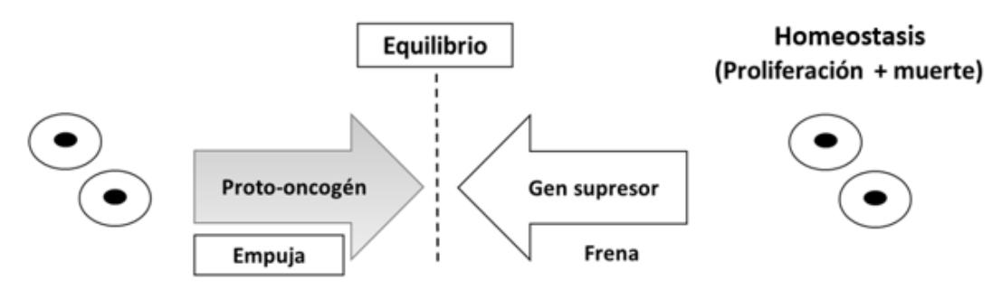

Sin embargo, si las mutaciones afectan a los protooncogenes, estos pueden quedar activados sin posibilidad de ser regulados negativamente, en cuyo caso pasan a llamarse oncogenes.

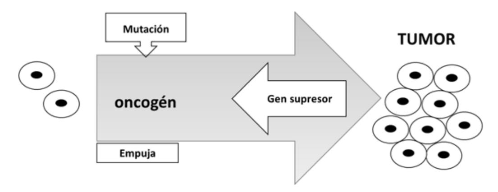

En otras situaciones, las mutaciones pueden afectar a los genes supresores de tumores o antioncogenes, de tal forma que su expresión es inactivada. Debido a esto, al no haber señales de detención o regulación negativa sobre el avance del ciclo celular, las células se reproducen sin control generando tumores.

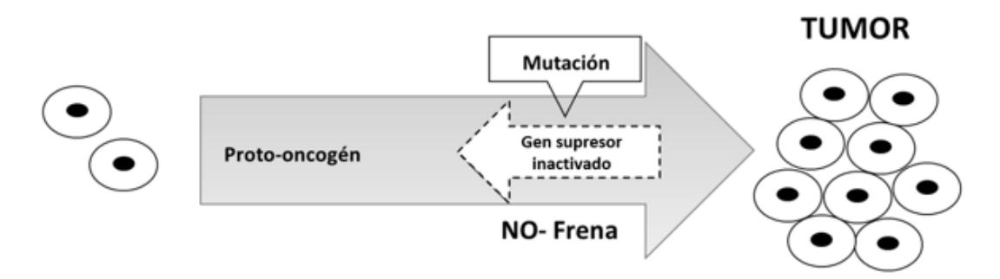

# **1.10.3. ¿Qué diferencia existe entre el proceso de apoptosis y necrosis?**

La muerte celular es un proceso básico para el mantenimiento de la homeostasis en organismos pluricelulares. No obstante, no todas las células mueren de manera idéntica ni por las mismas razones. En la naturaleza existen dos mecanismos bien conocidos, la necrosis y la apoptosis, los cuales representan formas diferentes en cuanto a su regulación y consecuencias para los tejidos en los cuales se desarrollan.

Por una parte, la necrosis es un proceso pasivo y caótico, generalmente provocado por daño mecánico o estrés extremo. Por otro lado, la apoptosis se conoce como muerte celular programada, cuidadosamente regulada para eliminar células innecesarias o dañadas sin causar inflamación.

• **Apoptosis o muerte celular programada:** Es una secuencia de acontecimientos que termina con la muerte celular controlada por la propia célula. Ocurre en el período de formación de los órganos, cuando se requiere eliminar células, también cuando en un tejido hay sobrepoblación de células, o cuando el ADN de las células ha sido severamente dañado.

• **Necrosis:** En este mecanismo las células se hinchan y sufren un deterioro de su estructura y organización, así como el progresivo cese de sus funciones (síntesis de proteínas y ácidos nucleicos, respiración celular, etc.) que acaba por impedir su viabilidad y conduce al rompimiento de la membrana plasmática y la lisis celular.

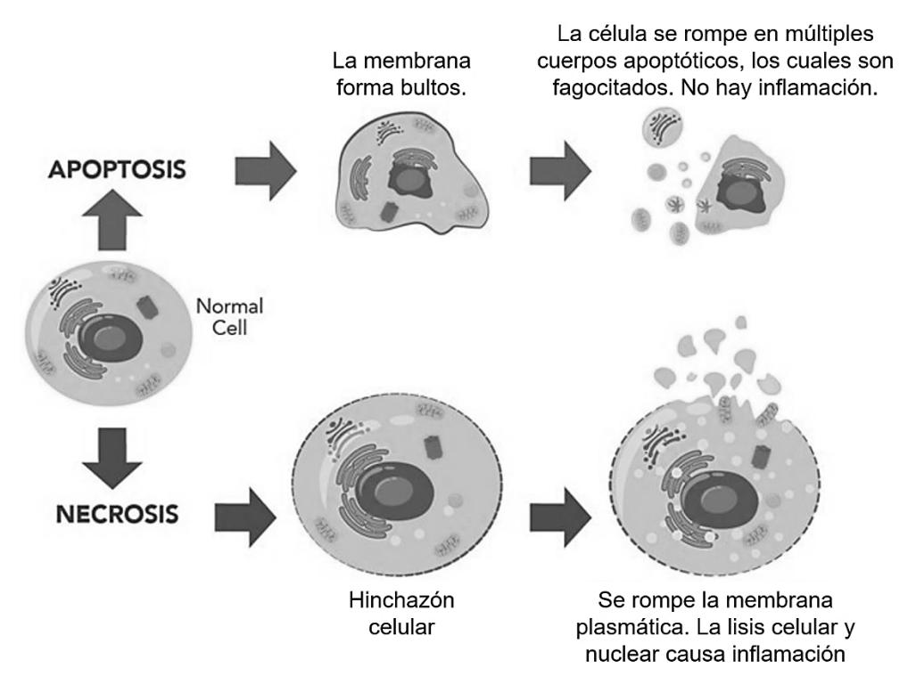

# **1.11. Meiosis**

Cuando cada cromosoma es duplicado por replicación del ADN (etapa S) las copias gemelas de cada cromosoma se mantienen al principio estrechamente asociadas y son denominadas cromátidas hermanas. En una división celular normal (mitosis), cada una de las cromátidas hermanas se separa en la anafase y se convierte en un cromosoma individual, por lo que cada una de las dos células hijas recibirá una copia de cada cromosoma paterno y otra de cada cromosoma materno.

En contraste, un gameto haploide producido por la división de una célula diploide durante la meiosis debe contener la mitad del número original de cromosomas (sólo un cromosoma de cada par de cromosomas homólogos). Este mecanismo que ha producido la evolución requiere que cada par de homólogos se reconozcan y se apareen físicamente antes de que se ubiquen en el huso meiótico, constituyendo una característica distintiva de la meiosis. Este hecho es esencial para asegurar la distribución equitativa de los cromosomas homólogos. De este modo uno de los homólogos (el paterno o el materno, al azar) irá a una de las células hijas y el otro a la segunda. De no ser así los cromosomas se distribuirían al azar y una célula hija podría recibir un par de homólogos y carecer en absoluto de una copia de otros cromosomas, distribución que sería letal para ellas.

# **1.11.1. Meiosis I o Reduccional**

Se le llama reduccional porque reduce a la mitad el número de cromosomas en las células hijas, transformando una célula diploide (2n) en dos células haploides (n). Esto ocurre durante la anafase I, donde los cromosomas homólogos se separan, llevando un representante de cada par hacia polos opuestos de la célula. A diferencia de la mitosis, las cromátidas hermanas permanecen juntas en esta etapa, asegurando que el número de cromosomas se divida entre las células hijas. Este paso es esencial para mantener la ploidía de la descendencia.

# **Profase I (2n, 4c)**

- Es la fase más larga de la meiosis.
- Los cromosomas homólogos se unen en forma específica, gen por gen (sinapsis).
- Los pares homólogos formados se conocen como bivalentes o tétradas.
- Ocurre el intercambio de material genético entre cromosomas homólogos, proceso conocido como recombinación genética o crossing over. Este proceso ocurre al azar y constituye la primera fuente de variabilidad genética en el contexto de la meiosis.
- Luego del crossing over, cromosomas homólogos comienzan a separarse, pero permanecen unidos por los quiasmas.
- Quiasma es el punto (lugar físico) donde ocurre intercambio de material genético o "crossing over".
- Se organiza el huso meiótico, el núcleo se desorganiza y desaparece el nucléolo.

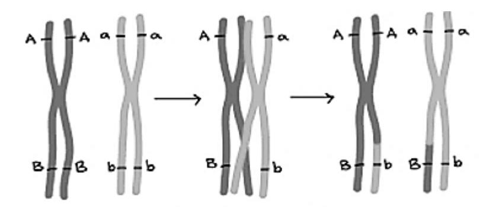

# **Metafase I (2n, 4c)**

- Los pares de cromosomas homólogos se alinean sobre el ecuador.
- Un homólogo de cada par mira hacia cada uno de los polos de la célula.

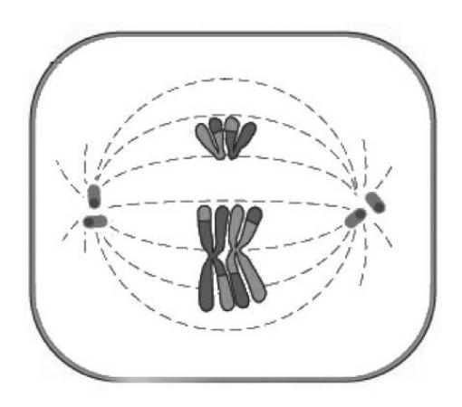

• La ordenación de los pares homólogos es al azar y se denomina **permutación cromosómica.** Es la segunda fuente de variabilidad genética.

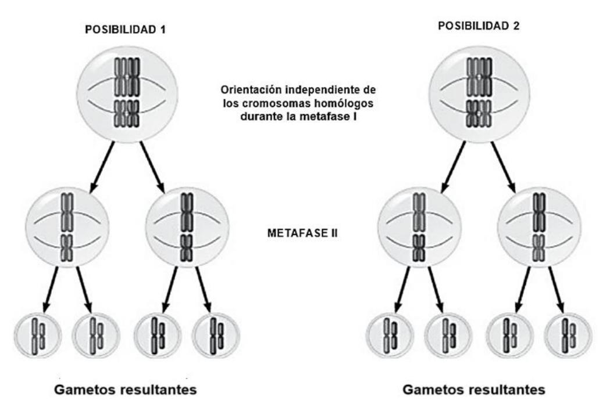

# **Anafase I (2n, 4c)**

• Se produce la separación de los cromosomas homólogos, siendo traccionados hacia los polos opuestos de la célula, por la acción de las fibras del huso meiótico.

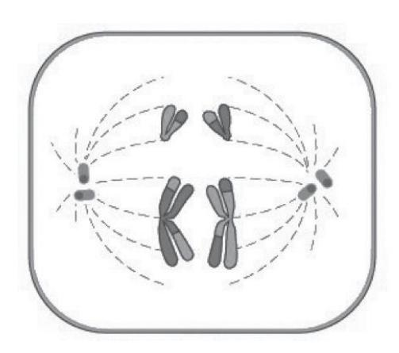

### **Telofase I + Citodiéresis I (n, 2c)**

- En esta etapa se reconstituyen las envolturas nucleares (1) alrededor de cada polo celular, y las dos células resultantes, luego de la citocinesis, son haploides.
- Por ejemplo, si se trata de una célula humana: las dos células hijas tendrían 23 cromosomas cada una, estando cada cromosoma constituido por dos cromátidas. En cuanto a la cantidad de ADN, las 2 células hijas presentaran 2c ADN, cada una.

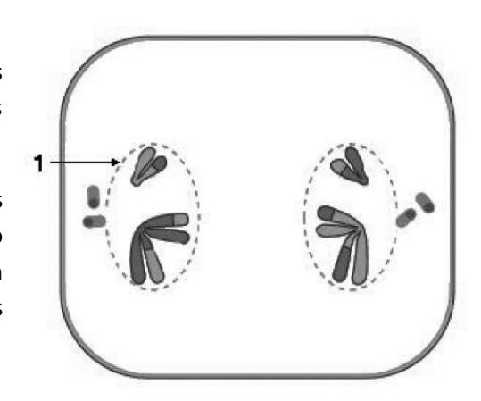

# **1.11.2. Meiosis II (Meiosis ecuacional)**

Se conoce como ecuacional porque conserva el número de cromosomas en las células hijas, manteniendo su estado haploide (n). Durante esta etapa, las cromátidas hermanas de cada cromosoma se separan y migran hacia polos opuestos, similar a lo que ocurre durante la mitosis. Este proceso asegura que cada célula hija reciba una cromátida de cada cromosoma, manteniendo la cantidad cromosómica constante tras la división, pero dividiendo la cantidad de ADN a la mitad. Es el paso final que genera cuatro células haploides genéticamente distintas (n, c).

# **Profase II (n, 2c)**

Dado que no ocurre replicación de ADN durante la etapa previa, en algunos organismos los cromosomas parecen pasar casi directamente de una fase a la otra. En todos los organismos la profase II es breve: la envoltura nuclear se rompe y se forma un nuevo huso meiótico, luego de lo cual siguen las etapas correspondientes a la metafase II, anafase II y telofase II.

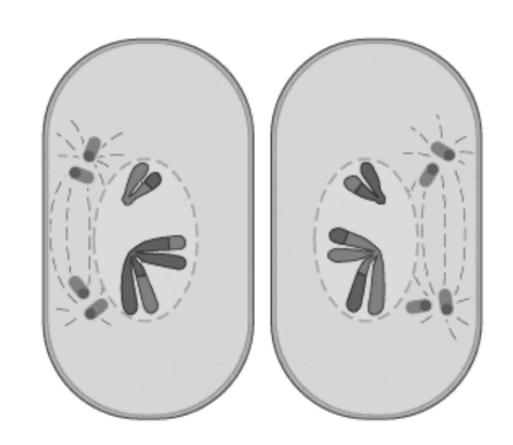

# **Metafase II (n, 2c)**

En cada una de las células provenientes de la meiosis I termina de formarse el huso acromático y se alinean los cromosomas en la placa ecuatorial.

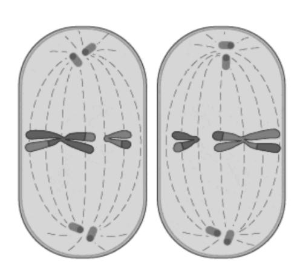

# **Anafase II (2n, 2c)**

Se produce la separación las cromátidas hermanas, dirigiéndose cada cromátida a los polos opuestos.

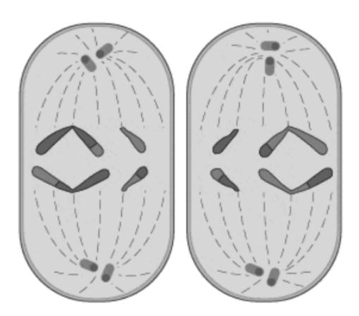

# **Telofase II + citodiéresis II (n, c)**

Cada célula origina dos células hijas, luego de la reconstitución de la envoltura nuclear alrededor de cada polo celular y de la división del citoplasma. El resultado final de la telofase II, y por ende de la meiosis, es la formación de cuatro células hijas haploides (n) a partir de una célula madre o germinal diploide (2n).

Cada una de las células hijas haploides, presenta c ADN.

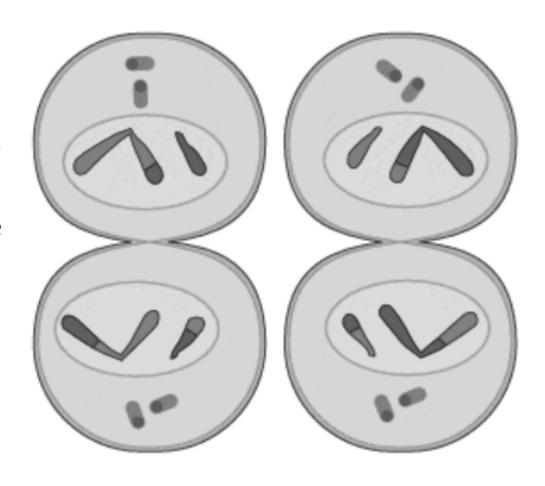

# **1.11.3. Comparación entre el proceso de mitosis y meiosis**

Existen al menos dos diferencias significativas en la forma en la que los cromosomas se separan en la meiosis II y en la mitosis:

Durante la mitosis y la meiosis II, las cromátidas hermanas están unidas solamente a nivel de los centrómeros, en tanto que en cada uno de los cinetocoros formados a ambos lados se unen microtúbulos del cinetocoro que tiran de las cromátidas en direcciones opuestas durante la anafase.

En la metafase I de la meiosis, en cambio, los cinetocoros de ambas cromátidas hermanas parecen haberse fusionado, de tal modo que las fibras del cinetocoro tiran todas hacia la misma dirección y los cromosomas homólogos son mantenidos juntos únicamente en la zona de los quiasmas.

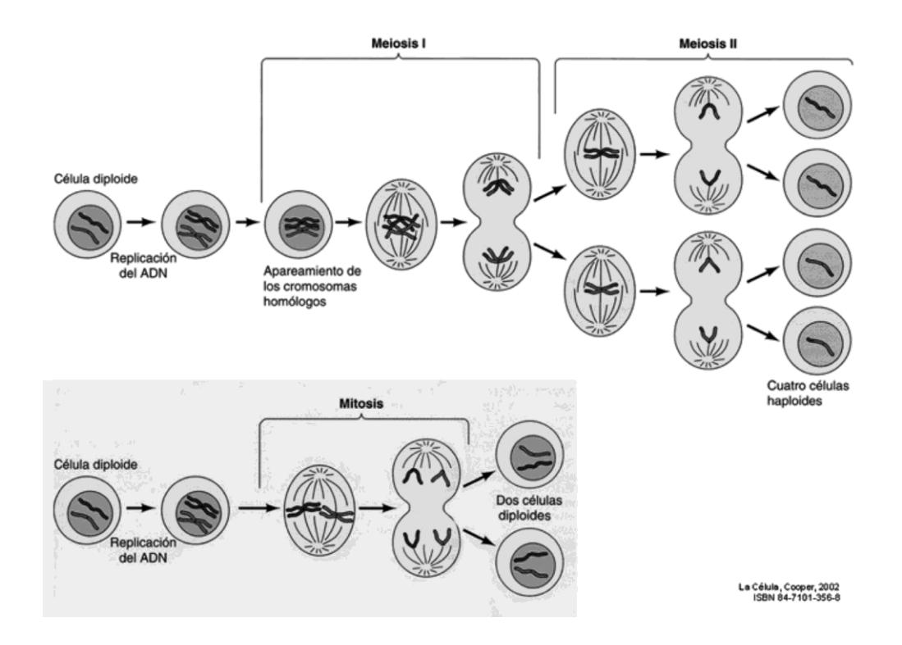

| Criterio de comparación                    | Mitosis                                                                                                                                    | Meiosis                                                                                                                                              |  |
|--------------------------------------------|--------------------------------------------------------------------------------------------------------------------------------------------|------------------------------------------------------------------------------------------------------------------------------------------------------|--|
| Se da en células…                 | Somáticas                                                                                                                                  | Germinales                                                                                                                                           |  |
| N° de divisiones de núcleo     | 1                                                                                                                                          | 2                                                                                                                                                    |  |
| Procesos que generan variabilidad | No                                                                                                                                         | Sí                                                                                                                                                   |  |
| Da lugar a                           | Dos células diploides idénticas entre sí e iguales a la progenitora.                                                     | Cuatro células haploides (gametos o células sexuales)                                                                                    |  |
| Función biológica                       | • Crecimiento corporal en pluricelulares. • Reparación y regeneración de tejidos. • Reproducción asexual. | • Producción de gametos. • Permite mantener la diploidía de la especie. • Genera variabilidad genética. |  |

# **Ejercicios de selección única**

Seleccione la alternativa correcta para cada pregunta.

1. El gen p53, conocido como "el guardián del genoma", es un supresor tumoral que desempeña un papel importante en la interrupción de la división celular (mitosis) cuando hay daño extensivo en el ADN.

En un laboratorio se desarrolla un experimento en el cual se cultivan dos líneas celulares humanas (A y B) donde A fue sometida a un tratamiento previo donde se suprimió la función de p53 y B es un cultivo control que mantiene las copias del gen p53 funcionales. Ambos cultivos fueron sometidos a radiación gama con el objetivo de dañar su ADN y luego se monitoreó el índice mitótico de cada uno de ellos obteniéndose los resultados expuestos a continuación.

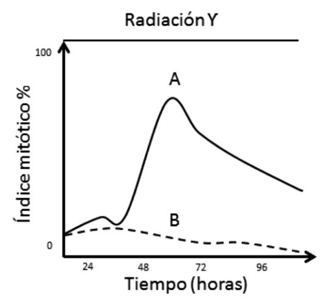

Respecto a lo anterior, ¿cuál de las siguientes afirmaciones corresponde a una conclusión coherente con los datos obtenidos?

- A) El gen p53 promueve la división mitótica en el cultivo A
- B) La radiación gama promueve la división mitótica en el cultivo A
- C) La inactivación del gen p53 inhibe la división mitótica en el cultivo B
- D) La inhibición mitótica del cultivo B comprueba la funcionalidad de p53

2. La meiosis fue descubierta y descrita por primera vez en 1876 por el biólogo alemán Oscar Hertwig (1849-1922), quien trabajaba estudiando huevos del erizo de mar. La idea fue complementada a nivel cromosomal por el zoólogo belga Édouard van Beneden (1846-1910) en trabajos con huevos de gusanos parásitos Ascaris, donde observó que los cromosomas no se dividían de la misma manera que en la mitosis durante la anafase, sino que se separaban de sus pares homólogos disminuyendo el número de cromosomas en la primera división, para posteriormente volver a dividirse mediante un proceso simple similar al mitótico. Este proceso completo daba como resultado 4 células con la mitad del material genético de las células parentales (haploides).

A partir de los antecedentes expuestos. ¿Cuál de las siguientes opciones corresponde a una pregunta que podría haber movilizado las investigaciones que llevaron a la comprensión del fenómeno meiótico?

- A) ¿Por qué los cromosomas de las células de Ascaris no se separan en cromátidas durante la división?
- B) ¿Por qué los cromosomas se separan en cromátidas hermanas durante la metafase mitótica?
- C) ¿Por qué los huevos de erizo se dividen de manera distinta a los de Ascaris?
- D) ¿Por qué la Meiosis tiene dos divisiones consecutivas?
- 3. Un grupo de investigadores estudia el proceso de división celular en células de gusanos parásitos, empleando técnicas de microscopía de fluorescencia para observar la organización del citoesqueleto durante la mitosis. En una primera experiencia, los investigadores bloquean la función de los centriolos en células en activa división y observan que, como resultado, las células tienen dificultades para organizar los cromosomas correctamente durante la Metafase. Al respecto. ¿Qué función de los centriolos explica este resultado?
  - A) Organización de las fibras del huso mitótico durante la división celular.
  - B) Transporte de vesículas intracelulares hacia la membrana plasmática.
  - C) Regulación de la síntesis de ADN en la fase S del ciclo celular.
  - D) Formación de lisosomas encargados de la digestión intracelular.

4. Un grupo de estudiantes realiza un experimento para medir la cantidad de ADN en células de un organismo durante las diferentes fases de la meiosis. Durante el trabajo, los estudiantes miden la cantidad de ADN (c) en una célula que está experimentando meiosis. Observan que en la profase I la cantidad de ADN es 4c, luego de la primera citodiéresis la cantidad disminuye a 2c, pero después de la telofase II, 2 de las células hijas tienen una cantidad de ADN de 2c mientras que las 2 restantes no presentan ADN.

Respecto a lo anterior, ¿cuál de las siguientes alternativas representa la etapa del proceso donde se produjo el problema que llevó a estos resultados?

- A) Profase II
- B) Metafase I
- C) Anafase II
- D) Profase I

5. Un equipo de investigadores está estudiando el efecto de mutaciones en los genes reguladores del ciclo celular, en células cancerígenas humanas. El trabajo utiliza cultivos celulares y análisis moleculares, lo cual les permitió descubrir que estas mutaciones desactivan los puntos de control del ciclo, sin embargo, las células mutantes continuaron dividiéndose a pesar del daño en el material genético.

Al respecto, ¿cuál de las siguientes alternativas presenta una posible causa de este fenómeno y su relación con el cáncer?

- A) Las mutaciones desactivan los puntos de control, permitiendo que células con ADN dañado continúen dividiéndose.
- B) La mutaciones aceleran la reparación del ADN, lo que reduce la incidencia de errores genéticos.
- C) Las mutaciones aumentan la actividad de los puntos de control, lo que evita la apoptosis.
- D) Las mutaciones retrasan el ciclo celular, impidiendo que las células entren en mitosis.

# **Capítulo 2: Biotecnología**

# **Objetivos de aprendizaje:**

• Explicar los principios básicos de la biotecnología y la ingeniería genética, especialmente en sus aplicaciones en la generación de fármacos, clonación de organismos, mejora de cultivos y diseño de vestuario.

La **biotecnología** corresponde a la aplicación o modificación de los sistemas biológicos o sus derivados, con el fin de generar y/o modificar productos y servicios de uso humano, como alimentos enriquecidos en nutrientes, organismos para extraer contaminantes (biorremediación), mejoramiento de cultivos, obtención de antibióticos, entre otros.

# **2.1. Ingeniería genética**

Muchas veces, lo que se quiere es transferir las características de un organismo a otro, por ejemplo, la capacidad de resistir bajas temperaturas del pez Koi podría ser transferida a una planta de interés comercial para que resista las heladas. Esta transformación es posible gracias a la ingeniería genética, entendida como el conjunto de técnicas que permiten la manipulación directa de genes, ya sea para modificarlos, duplicarlos, eliminarlos o transferirlos de un organismo a otro.

Las técnicas utilizadas se engloban en las denominadas técnicas del ADN recombinante, lo

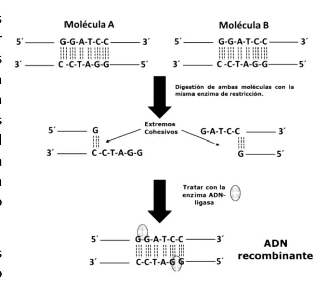

cual significa que podemos seleccionar, cortar, transferir, ligar e inducir la expresión de genes de un organismo en otro, mediante estas técnicas basadas en los procesos de recombinación genética que se encuentran naturalmente en las células.

**El ADN recombinante (ADNr)** corresponde a macromoléculas de ADN producidas a partir de técnicas de ingeniería genética, de tal forma que se obtienen secuencias de ADN que no se encontraría de manera natural en el genoma del organismo receptor de este transgén (genoma, corresponde a la totalidad del material genético contenido en una célula). Por ejemplo, la soja transgénica posee genes de resistencia a glifosato, los cuales no se encuentran de forma natural en esta especie vegetal, por lo tanto, la soja genéticamente modificada corresponde a un OMG o un transgénico.

Los organismos obtenidos mediante ingeniería genética se llaman organismos genéticamente modificados (OGM o del inglés genetically modified organisms, GMO) o transgénicos. La obtención y utilización de OGM se rige por una serie de principios que permiten su regulación dentro de límites éticos y morales ligados a las ciencias de la vida, enmarcados en lo que conocemos como **bioética**.

# **2.2. Enzimas de restricción y vectores de clonación-expresión**

Las primeras técnicas de la ingeniería genética fueron posibles gracias al descubrimiento de las enzimas de restricción, las cuales tienen actividad nucleasas (cortan ácidos nucleicos). Estas enzimas se presentan de manera natural al interior de bacterias como Escherichia coli, donde se desempeñan como un sistema de defensa contra ADN exógeno producto de la infección de algunos virus (bacteriófagos o fagos). Son empleadas como tijeras moleculares para cortar y aislar de manera específica genes de interés.

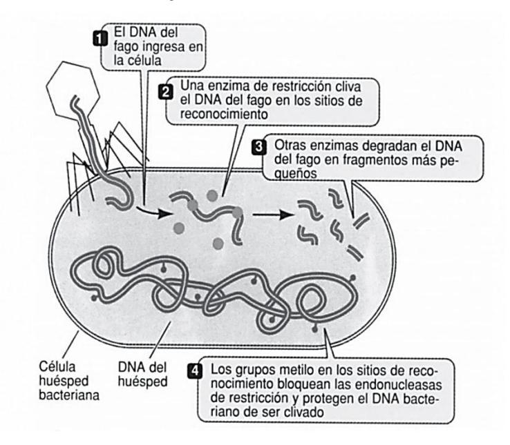

 **Sistema de restricción-metilación de bacterias**

# **Las enzimas de restricción:**

- Cortan en secuencias específicas de reconocimiento.
- Generan dos patrones de corte: extremos cohesivos o extremos romos.
- Cuando generan extremos cohesivos, se suelen denominar "pegajosos", dada la facilidad que tienen para unirse a otros fragmentos de ADN por complementariedad de bases.
- Fueron aisladas de diferentes microorganismos; sin embargo, hoy en día se producen comercialmente.
- Permiten cortar y aislar secuencias específicas de genes para insertar genes de un organismo en otro, aunque sean de especies diferentes.

Por otro lado, un vector de clonación-expresión es una macromolécula de ADN capaz de replicarse (multiplicarse) de forma autónoma. Para transformación bacteriana, se emplean plásmidos, macromoléculas de ADN circular extracromosomales que se presentan de manera natural en las bacterias.

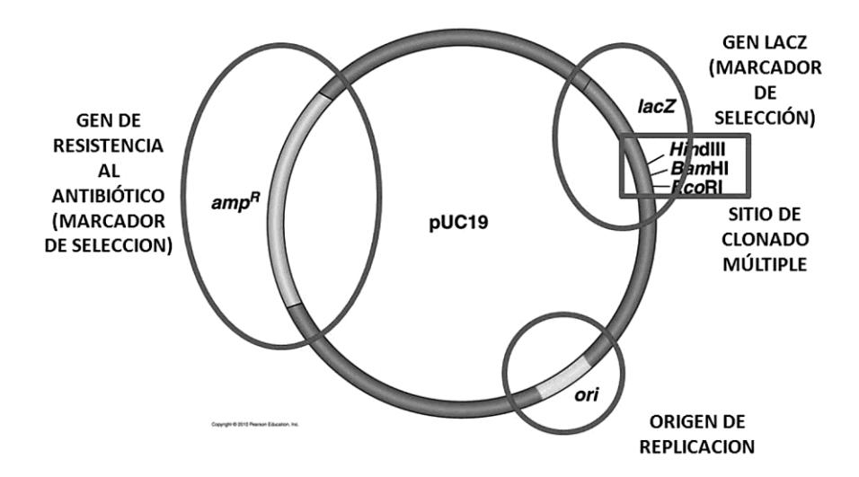

Este tipo de vectores cuentan con un origen de replicación (sitio ori), sitio de corte (clonado múltiple) y genes de selección. Estos últimos confieren a las bacterias que han incorporado al vector la capacidad de crecer en presencia de antibióticos como ampicilina o en un medio con carencia de nutrientes. Algunos vectores también permiten la expresión de los transgenes, es decir, permiten que podamos obtener proteínas (por ejemplo) a partir de este transgén de forma directa.

# **2.3. Metodología básica empleada en ingeniería genética**

La obtención de un organismo transgénico consiste en la incorporación de genes exógenos en una célula receptora, para lo cual se sigue una serie de pasos para cumplir con este objetivo. Debemos tener en cuenta que, dependiendo del tipo de organismo con el cual se esté trabajando, la metodología puede presentar variantes, aunque el fundamento teórico de la práctica sea, fundamentalmente, la misma.

- **1. Identificar:** previamente se debe tener claridad de la característica que queremos incorporar en nuestro organismo, o bien, el gen del producto que queremos obtener. Normalmente, esa información se encuentra contenida en bases de datos de genes o genbanks (sitio del Centro Nacional de la Información para la Biotecnología, National Center for Biotechnology Information (NCBI) https:// www.ncbi.nlm.nih.gov/genbank/).
- **2. Cortar y aislar:** una vez identificado el gen de interés, este puede ser cortado empleando enzimas de restricción como EcoRI.

- **3. Ligar e introducir:** el gen cortado y aislado debe ser ligado a un vector de clonación-expresión y ser introducido al interior de un hospedador, por ejemplo, una bacteria. El objetivo de este paso consiste en obtener múltiples copias del gen para asegurar el éxito del proceso de obtención del transgén. Una vez se ha cortado el gen de interés y el vector de clonación, se procede a ligarlo con una enzima llamada ADN ligasa, dando origen al ADN recombinante.
- **4. Clonar:** una vez introducido el vector de clonación al interior de una bacteria, este organismo comenzará a reproducirse, junto con el plásmido recombinante, actuando como una especie de reactor bacteriano. De esta forma, se obtendrán miles de copias del gen mediante la obtención de clones bacterianos (población de bacterias con el mismo material genético).
- **5. Seleccionar:** se siembran las bacterias en medio de selección que contienen antibióticos o que carecen de algún nutriente necesario para su crecimiento. El objetivo es seleccionar aquellas colonias bacterianas que hayan incorporado el vector de clonación con el transgén. Si la bacteria tiene el vector en su interior, entonces contará con el gen de selección, por ejemplo, uno que confiera resistencia a antibióticos como la kanamicina o la ampicilina. De esta forma, sólo trabajaremos con las bacterias que hayan incorporado y replicado el transgén de interés, aumentando la eficiencia del proceso.
- **6. Obtener producto:** se cultivan aquellas bacterias transformadas, de tal forma que estas expresen el producto deseado. En otros casos, lo que se quiere es incorporar el gen clonado en otros organismos, como genes de resistencia a herbicidas en plantas, cuyo proceso requiere de pasos adicionales para llevarlo a cabo. Inicialmente, se purifica el ADN y luego es cortado e incorporado en otros vectores especializados en la transformación de organismos con el fin de obtener transgénicos.

# **Producción de insulina recombinante**

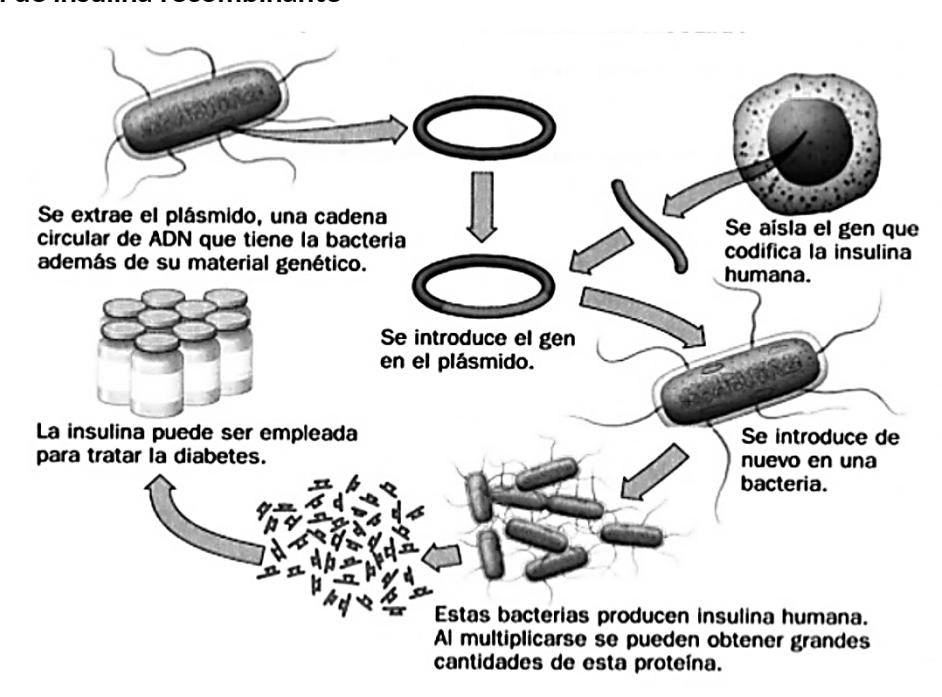

# **Transformación genética vegetal**

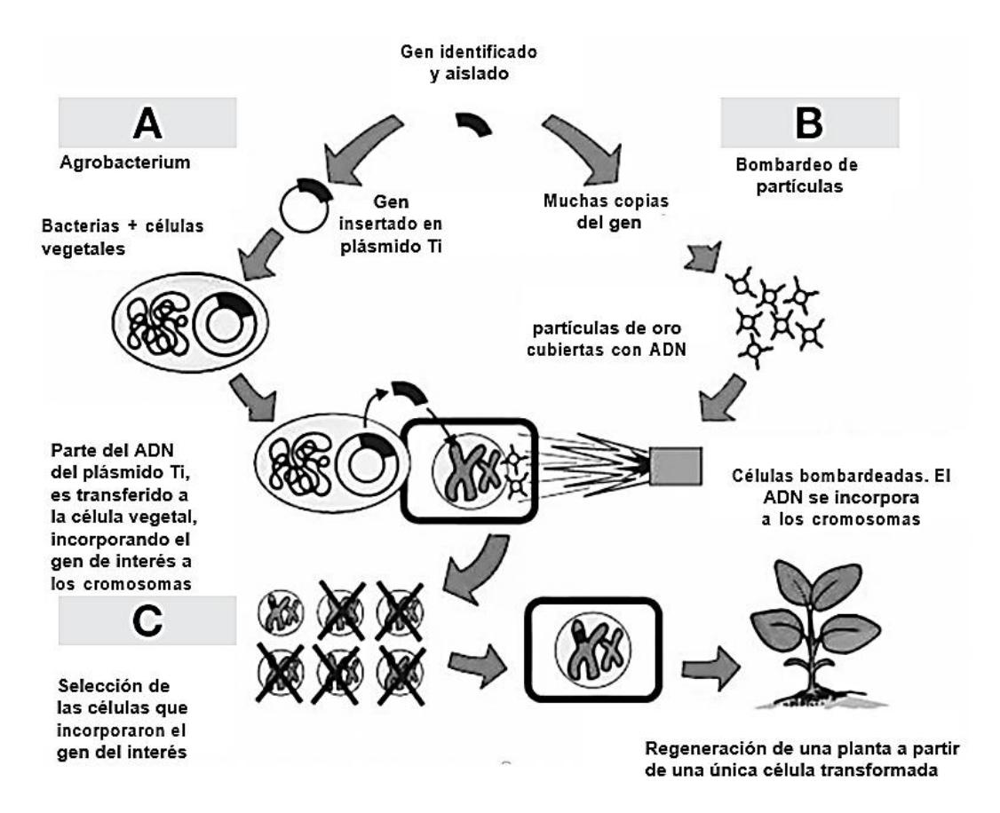

**(A)** En este caso, se nos muestra que la incorporación de genes en una especie vegetal puede lograrse mediante infección con la bacteria transformante Agrobacterium tumefaciens, la cual naturalmente incorpora genes exógenos en células vegetales. **(B)** El otro método consiste en transformar células vegetales empleando biobalística, donde partículas de oro cubiertas del gen de interés bombardean a la célula vegetal para introducir el gen de interés. En ambos casos, se obtienen plantas transformadas.

# **2.4. Aplicaciones de biotecnología**

Se distinguen cuatro ramas fundamentales de las aplicaciones biotecnológicas:

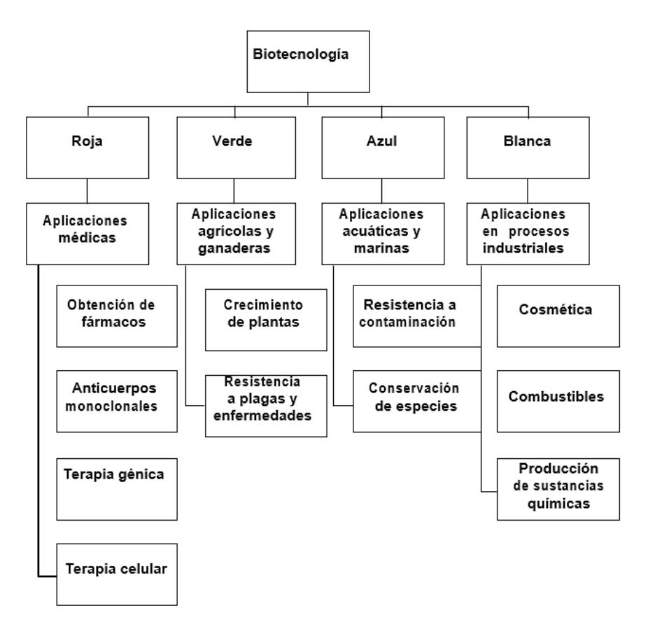

# **2.5. Producción de OGM**

La producción de organismos genéticamente modificados (OGM) se ha convertido en uno de los objetivos primordiales de diversas industrias, especialmente la alimentaria. La creciente demanda de la población mundial y la baja disponibilidad alimentaria han construido un escenario en el cual la biotecnología y la ingeniería genética proponen soluciones mediante la producción de OGM de acuerdo con las necesidades planteadas. No obstante, aún existe temor por parte de la población hacia el consumo de este tipo de productos, sumado al exceso de información errónea que circula por las redes, creando creencias y prejuicios hacia la biotecnología e ingeniería genética, lo cual ha mantenido un debate a nivel mundial respecto a la utilización de tecnologías de mejoramiento genético en el rubro alimentario, el cual está lejos de terminar.

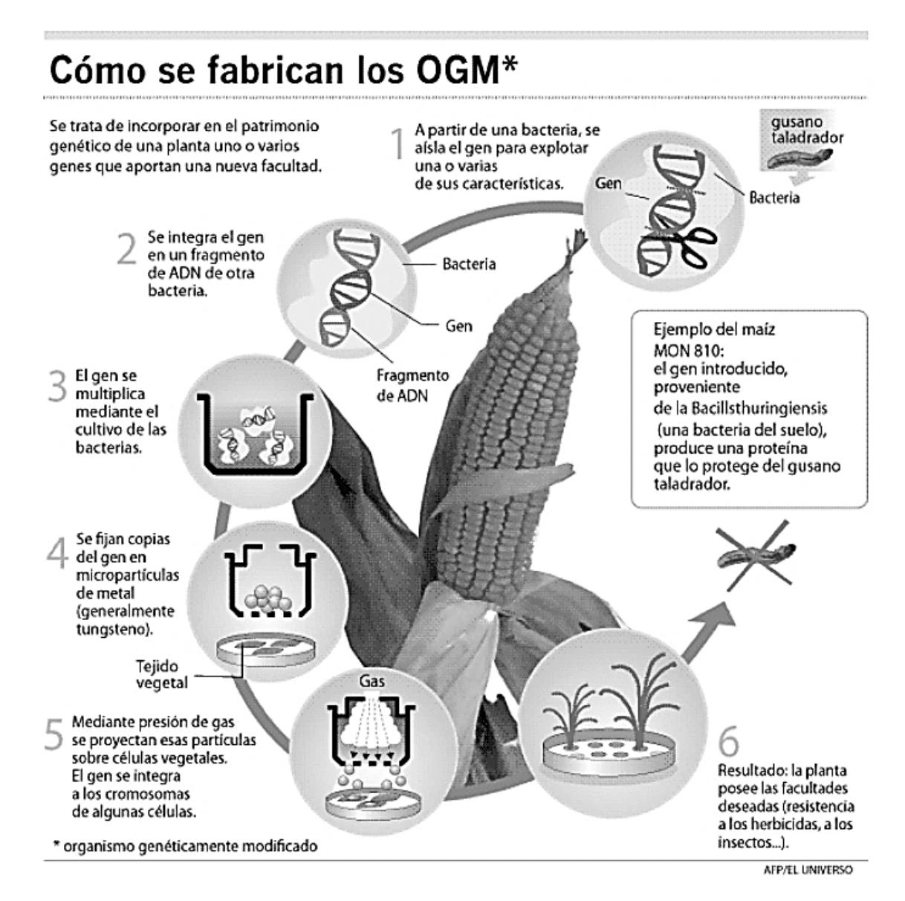

# **2.6. Terapia génica y celular**

La terapia génica consiste en la manipulación genética en tratamiento médico de enfermedades debidas a genes mutados cuya función está afectada. Se emplean virus como vectores de transformación para introducir genes exógenos en pacientes de enfermedades genéticas. Los virus son útiles en este aspecto, ya que naturalmente poseen mecanismos infecciosos donde pueden inyectar material genético exógeno al interior de células humanas. Básicamente, consiste en transformar células del paciente con los genes que queremos introducir para

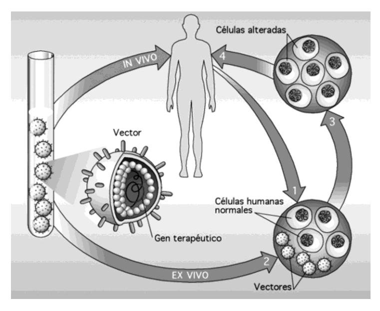

restituir una función perdida. Estas células son injertadas en el paciente, con el "gen reparado". Existen dos modalidades en la terapia génica:

**A. Ex vivo:** se infectan células extraídas de paciente, las cuales son transformadas empleando un vector viral. Luego, las células con el gen terapéutico son reinyectadas en el paciente.

**B. In vivo:** se inyecta el virus transformante directamente en el tejido afectado. La infección viral y transformación celular ocurre al interior del paciente.

# **2.7. Clonación y aplicaciones**

La clonación corresponde a un procedimiento a través del cual podemos obtener copias genéticamente idénticas de moléculas, células, tejidos u organismos complejos completos por medio de reproducción asexual.

Las principales aplicaciones de esta técnica son:

- A) Investigación biomédica: la clonación permite crear animales útiles para estudiar enfermedades humanas y probar nuevos tratamientos en condiciones genéticamente controladas.
- B) Medicina regenerativa: esto permite generar células embrionarias compatibles con el paciente para ser utilizadas en la reparación de tejido dañados o en el tratamiento de enfermedades degenerativas como el Parkinson.
- C) Reproducción de animales genéticamente modificados: estos son utilizados para producir proteínas de interés terapéutico como insulina o factores de coagulación a modo de biorreactores.
- D) Conservación biológica: se clonan especies cuya diversidad genética se encuentra amenazada o para intentar recuperar especies extintas.
- E) Agricultura y ganadería: clonación de ejemplares de alto valor genético, como vacas lecheras de alta producción o animales de competición, como caballos de carreras. También se puede utilizar para mejorar la cría selectiva.

# **Ejercicios de selección única**

Seleccione la alternativa correcta para cada pregunta.

1. Se ha desarrollado una técnica para producir plantas transgénicas que producen mayor número de estomas y de todo el mecanismo bioquímico asociado a su función con respecto a plantas normales de la misma especie. Los estomas son estructuras presentes en las hojas de las plantas que permiten el intercambio gaseoso entre los tejidos vegetales y el ambiente, principalmente de O2 y CO2. Cada estoma está formado por dos células llamadas células oclusivas que rodean un poro central. Cuando estas células se separan, el poro se abre, lo que permite que el intercambio gaseoso.

El momento en que los estomas se abren o permanecen cerrados depende de múltiples factores como, por ejemplo: la humedad ambiental, la temperatura o la luminosidad ambiental. Con respecto a esto último hay que recordar que vemos a las plantas de color verde porque estas absorben principalmente luz roja y azul, reflejando la verde que nuestros ojos captan y nuestro cerebro interpreta. Si se ilumina una planta con luz roja a saturación, llegará a un punto máximo de fotosíntesis y los estomas se abrirán en función de la actividad fotosintética, de tal manera que su apertura también se ve saturada. Si tras ello se ilumina con luz azul a saturación, los estomas se abrirán más, sobrepasando ese límite de saturación, tal como se muestra en el siguiente gráfico:

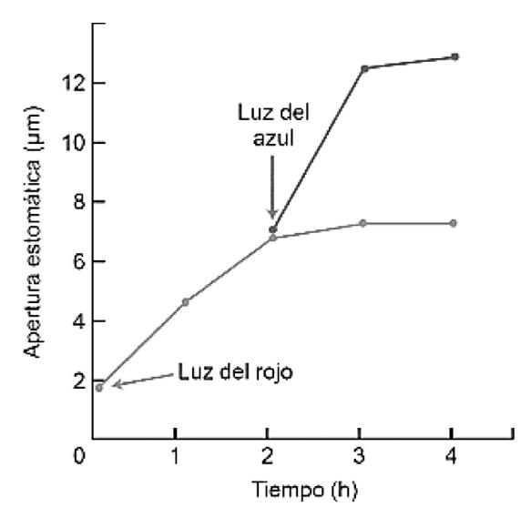

A partir de toda la información entregada, una inferencia coherente sería:

- A) Las plantas transgénicas aumentarían su porcentaje de intercambio gaseoso al ser expuestas a luz roja y azul.
- B) Las plantas transgénicas aumentarían su apertura estomática en presencia de luz azul.
- C) Las plantas transgénicas disminuirían su apertura estomática en presencia de luz azul.
- D) El aumento del número de estomas no reportará ningún beneficio para la especie modificada genéticamente.

2. Las plantas que hoy forman parte de nuestra dieta son totalmente diferentes de sus antepasados de vida silvestre. Durante el desarrollo de la civilización humana hemos ido seleccionando y modificando mediante cruces controlados entre los individuos con mejores características para nuestro interés. Este largo proceso ha dado paso a estrategias y tecnologías mucho más avanzadas como las que se empezaron a desarrollar a finales de los años 20 del siglo pasado, donde científicos descubrieron que se podían inducir mutaciones exponiendo a las plantas a agentes mutagénicos físicos como los rayos x, entre otros.

Estas mutaciones ocurren de manera completamente azarosa y de vez en cuando pueden originar la aparición de una característica de interés para el humano. Esta nueva característica es seleccionada y multiplicada para dar origen a nuevos productos de consumo como el pomelo rosado, obtenido a partir de mutaciones del pomelo blanco, característico por su amargor intenso.

Hoy existen más de 2.000 especies de alta demanda en el mundo que se obtuvieron por mutagénesis por radiación, entre ellas, diversos tipos de arroz, lechugas, porotos, etc.

De acuerdo con lo anterior, ¿cuál de las siguientes aseveraciones corresponde a una observación coherente con la línea investigativa descrita en el texto

- A) Las plantas actuales son distintas a las plantas del pasado.
- B) La cantidad de plantas comestibles ha ido aumentando a lo largo del tiempo.
- C) Las mutaciones, eventualmente pueden derivar en características beneficiosas para los humanos.
- D) La dieta humana se basa en alimentos de origen vegetal.
- 3. Un equipo de investigadores intenta clonar un animal extinto hace miles de años utilizando transferencia nuclear de células somáticas extraídas de un ejemplar encontrado en los glaciares de Alaska, para esto utilizan núcleos de células somáticas del animal donante y los transfieren a un óvulo enucleado (sin núcleo) de una especie cercana. Los embriones resultantes son implantados en hembras sustitutas para intentar generar descendencia viable. Luego de varios intentos concluyen que no es posible clonar esta especie debido a que los embriones solo se desarrollan hasta cierto punto y luego mueren.

A partir de lo anterior, ¿cuál de las siguientes opciones presenta un desafío biológico que podría estar implicado en estos resultados?

- A) La gran cantidad de daño en el ADN debido al tiempo que lleva extinta la especie de interés.
- B) Incapacidad del ADN clonado para dirigir la síntesis de proteínas en el núcleo.
- C) Ausencia de una fuente de ADN mitocondrial en el proceso de clonación.
- D) Falta de mitocondrias funcionales en el embrión clonado.

- 4. Un grupo de investigadores desarrolla una bacteria modificada genéticamente para degradar plásticos en ambientes contaminados. Para ello, introducen genes que codifican enzimas capaces de descomponer polímeros plásticos en compuestos más simples que las bacterias pueden metabolizar. Luego usan estas bacterias modificadas para tratar áreas contaminadas con residuos plásticos. Al respecto, ¿cuál de las siguientes alternativas es un beneficio potencial de esta aplicación biotecnológica?
  - A) Producción de energía renovable a partir de residuos plásticos.
  - B) Sustitución total del uso de plásticos por materiales biodegradables.
  - C) Eliminación de contaminantes plásticos sin generar subproductos tóxicos.
  - D) Incremento en la velocidad de síntesis de polímeros plásticos en ambientes industriales.
- 5. En la industria farmacéutica, se utiliza *Escherichia coli* modificada genéticamente para producir insulina humana. Al respecto, ¿cuál es una ventaja clave de esta aplicación biotecnológica?
  - A) La insulina producida por bacterias tiene mayor efectividad que la insulina natural humana.
  - B) La insulina obtenida es idéntica a la humana y reduce el riesgo de reacciones alérgicas.
  - C) Este método elimina completamente la necesidad de tratamientos para la diabetes.
  - D) Las bacterias no requieren modificaciones genéticas para producir insulina.

# **Capítulo 3: Evolución**

# **Objetivos de aprendizaje:**

- Comprender los aportes de Lamarck, Darwin y Wallace al estudio de los mecanismos evolutivos.
- Analizar las evidencias que respaldan la evolución biológica desde diferentes disciplinas científicas.

# **3.1. Conceptos básicos empleados en Evolución**

Al momento de estudiar Evolución es importante tener clara una serie de conceptos que ayudarán a su correcta comprensión.

**Adaptación biológica:** Corresponde a todo rasgo que incrementa la probabilidad de sobrevivencia de una especie, el cual es heredable y persistente en el tiempo a lo largo de las generaciones.

**ADN:** Ácido desoxirribonucleico, el cual contiene la información necesaria (genes) para expresar las funciones biológicas necesarias para una entidad biológica en particular (célula, virus). Es la principal molécula de la herencia, mediante la cual se heredan ciertas características y funciones desde los progenitores a la descendencia (transmisión vertical) o entre organismos, como es el caso de la conjugación plasmidial bacteriana (transmisión horizontal).

**Aislamiento reproductivo:** Mecanismo que comprende el conjunto de características, conductas o procesos fisiológicos que impiden la formación de híbridos entre especies diferentes, ya sea impidiendo el cruzamiento, la viabilidad embrionaria o que la descendencia sea fértil.

**Analogía estructural:** Se dice que dos o más estructuras son análogas cuando cumplen con una función similar teniendo cada una orígenes diferentes. Por ejemplo, el ala de una mariposa y el ala de una paloma. Ambas permiten volar, pero tienen orígenes evolutivos diferentes. Se produce cuando dos o más especies están sometidas a presiones ambientales similares, lo que se conoce como convergencia evolutiva.

**ARN:** Ácido ribonucleico, sintetizado a partir de la información contenida en la macromolécula de ADN. Mediante el proceso de transcripción, los genes en el ADN son copiados en una macromolécula de ARN. Dependiendo del tipo de gen, el transcrito puede ser procesado para dar origen a ribosomas (ARNr), actuar como mensajero para la biosíntesis de proteínas (ARNm) o como macromolécula transferente (ARNt) participante de la traducción de proteínas.

**Creacionismo:** Creencia religiosa que postula que toda la vida sobre la Tierra proviene de creación divina.

**Convergencia evolutiva:** Es un proceso en el cual dos o más especies se presentan en hábitats muy similares, los cuales presentan factores ambientales equivalentes, induciendo que estas especies tiendan a desarrollar funciones parecidas.

**Cromosomas homólogos:** Pares de cromosomas que son iguales en forma, tamaño y posición de los genes. Uno es de origen paterno y el otro de origen materno.

**Divergencia evolutiva**: Proceso mediante el cual se producen dos o más especies diferentes a partir de un ancestro común cercano.

**Dogma central de la Biología Molecular**: Es una teoría que indica que el flujo de información genética va desde el ADN hasta el ARN (transcripción), y desde el ARN a las proteínas (traducción). Para el caso de los retrovirus, es decir, aquellos que cuentan con ARN como macromolécula de la información genética, la información entre ADN y ARN es bidireccional, es decir, se puede sintetizar ADN desde ARN (transcripción inversa).

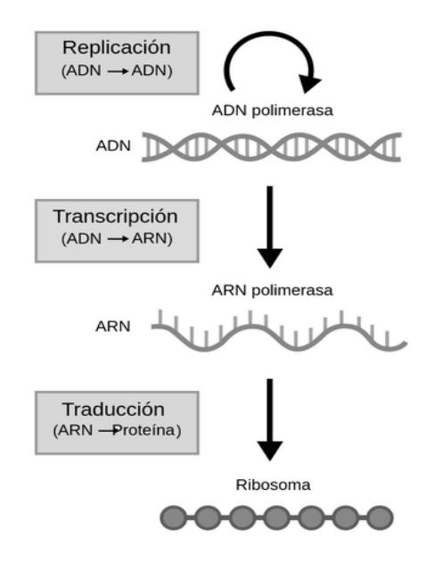

**Era geológica:** Es una unidad de medida geocronológica de la Tierra, mediante las cuales se organizan los tiempos geológicos, es decir, los eventos sucedidos durante la formación de nuestro planeta.

**Especiación:** Proceso mediante el cual una población biológica da origen a una o más especies diferentes, producto del aislamiento reproductivo.

**Especie:** Conjunto de individuos que comparten un acervo genético común y que pueden dejar descendencia fértil.

**Evolución:** Cambio en el perfil genético de una población biológica, el cual puede expresarse a través del fenotipo. Estos cambios pueden llevar a la aparición de adaptaciones, novedades evolutivas, cambios en las especies, aparición de nuevas especies (especiación) o desaparición de ellas (extinción). Es un proceso complejo que puede durar miles de años, es decir, para que los resultados de la Evolución sean visibles se requiere que pasen muchas generaciones.

**Extinción:** Corresponde a la desaparición total de una especie en el planeta.

**Fenotipo:** Expresión visible del genotipo de un organismo, resultado de la interacción de la dotación genética del organismo con los factores ambientales.

**Fijismo:** Creencia que postula que las especies permanecen inmutables desde la Creación, sin cambio alguno. Junto con el Creacionismo, no son consideradas teorías propiamente tal en campo científico.

**Gen:** Secuencia de ADN o ARN que cuenta con información suficiente para expresar una función biológica, por ejemplo, la biosíntesis de una proteína.

**Genes alelos:** Corresponden a cada una de las versiones de un determinado gen. En organismos diploides suelen presentarse de a pares, donde cada miembro de los cromosomas homólogos porta con un alelo, pudiendo ser iguales o diferentes.

**Gen dominante**: Es aquel alelo cuya expresión genética enmascara al del alelo recesivo. Para que su expresión sea visible, sólo requiere de una copia de este alelo.

**Gen recesivo:** Corresponde a aquel alelo cuya expresión genética requiere que se presente en homocigosis, es decir, que ambas copias del gen sean iguales. Si se acompaña de un alelo dominante, su expresión queda enmascarada, es decir, no es visible en el fenotipo.

**Genotipo:** Dotación genética de un organismo.

**Herencia**: Transmisión de las características de los progenitores a los descendientes, mediante mecanismos que involucran el flujo de genes que codifican para dichas características.

**Heterocigosis:** En este caso, la formación del cigoto es tal que los alelos para un determinado gen al interior de los gametos son diferentes.

**Híbrido:** Organismo resultante del cruce entre individuos de diferentes especies, géneros o variedades, que normalmente no se reproducen entre sí. Estos cruces pueden ocurrir de forma natural o ser inducidos por humanos a través de técnicas como la hibridación artificial. Los híbridos suelen combinar características de ambas especies parentales y, en algunos casos, pueden ser estériles debido a diferencias genéticas. Ejemplos comunes incluyen el mulo (cruce entre una yegua y un burro) y ciertas plantas cultivadas.

**Homocigosis:** Formación de un cigoto formado por la unión de dos gametos cuyos alelos (2) para un determinado gen son iguales. Si son dominantes, el organismo entonces es homocigoto dominante para ese gen; en caso de ser recesivos, pasa a ser homocigoto recesivo.

**Homología estructural:** Se dice que dos o más estructuras son homólogas cuando tienen funciones diferentes pero el mismo origen evolutivo, resultando en estructuras muy similares entre sí. Por ejemplo, el brazo de un humano y la pata de un gato. Ambas presentan huesos muy similares, sin embargo, cumplen con funciones diferentes. La homología estructural es producto de la divergencia evolutiva.

**Loci**: Conjunto de locus.

**Locus:** Región física al interior de un cromosoma donde se localizan genes.

**Radiación adaptativa:** Proceso que describe la especiación rápida de varias especies diferentes, con el fin de llenar muchos nichos ecológicos. Ocurre por evolución divergente.

**Rasgo:** Característica específica de un organismo.

**Selección natural:** Mecanismo evolutivo que se caracteriza porque uno o más factores ambientales actúan sobre el fenotipo de una población biológica, de tal forma que aquellos individuos con los fenotipos más aptos ante el contexto en el cual se desarrolla este mecanismo logran reproducirse y traspasan sus genes a la descendencia, mientras que aquellos con los fenotipos menos aptos, tienden a reproducirse menos.

# **3.2. Teorías evolutivas**

Hubo una época en que se creyó que no existía la evolución, sino la creación divina de especies, en la diversidad existente, para satisfacer las necesidades humanas. Dichas especies permanecían inmutables, sin experimentar ningún cambio a través del tiempo (fijismo o creacionismo), a menos que se produjera una catástrofe.

Posteriormente surgió el Evolucionismo, que plantea que las especies derivan unas de otras por transformaciones. La existencia de la evolución es un hecho del que no se tiene ninguna duda en el ámbito científico y del cual ya había evidencias considerables antes del desarrollo de la biología molecular.

Evolución, en el ámbito biológico, es un término que se refiere al cambio que experimentan las especies en períodos extensos de tiempo.

# **3.2.1 Antecedentes**

Previo al desarrollo de las teorías evolutivas, las ideas predominantes sobre el origen de las especies se centraban en la intervención de divinidades, de acuerdo con la concepción religiosa y espiritual bajo la cual se concebían estas ideas.

# • **Creacionismo**

Es una creencia religiosa que sostiene que las especies que habitan la Tierra son el producto de creación divina y no de la Evolución.

### • **Fijismo**

Es una doctrina que sostiene que las especies han permanecido inmutables desde su creación, es decir, no han experimentado cambio alguno. Según esto, los fósiles pertenecerían a especies que perecieron en eventos catastróficos como el Diluvio Universal, o bien, caprichos de la naturaleza. Esta doctrina describe a la naturaleza como algo una realidad definitiva, inmutable y completamente finalizada.

# • **Catastrofismo**

Fue una teoría científica que planteaba que el planeta Tierra se habría formado por eventos de gran magnitud, violentos y de corta duración. En el contexto del desarrollo de las especies, las catástrofes acabarían con muchas poblaciones, dejando disponibles muchos nichos ecológicos, los cuales son ocupados por especies sobrevivientes o migrantes.

# **3.2.2. Teoría evolutiva de Lamarck**

Jean Baptiste de Lamarck fue un naturalista francés, el primer científico en proponer que los organismos pasaban por una serie de cambios a lo largo del tiempo, resultado de fenómenos naturales y no por la intervención de un dios.

Según Lamarck, un ambiente cambiante causa que un organismo altere su comportamiento, lo que provoca el uso o desuso de algunos órganos o partes del cuerpo. A través de generaciones, un órgano o estructura corporal podría aumentar su tamaño si este es muy usado, o podría empequeñecerse hasta desaparecer si no se le da uso. Su hipótesis requiere que los organismos traspasen los caracteres adquiridos durante su vida a sus crías. Por ejemplo, Lamarck sugirió que el largo cuello de las jirafas se desarrolló cuando un ancestro de cuello corto lo estiró para alcanzar las hojas que se ubicaban a mayor altura. De esta forma las crías heredarían este nuevo carácter y cada generación tendría entonces cuellos más largos. Lamarck también pensó que todos los organismos tenían una fuerza o energía vital que los llevaba a cambiar hasta alcanzar una forma perfecta a lo largo del tiempo.

# **Postulados de la Teoría de los caracteres adquiridos**

- El ambiente está en continuo cambio.
- Ley de uso y desuso: La utilización de un órgano lo desarrolla y el desuso lo atrofia.
- Herencia de los caracteres adquiridos: Las características que se adquieren durante la existencia se heredan a la descendencia.
- Tendencia al aumento de complejidad (Principio perfeccionista): Los organismos poseen una "Tendencia interna hacia la perfección".
- Los organismos generan nuevas necesidades cuando se producen cambios en el ambiente.

**La siguiente figura representa la forma en que Lamarck explicó la manera en que las jirafas actuales tienen el cuello largo.** 

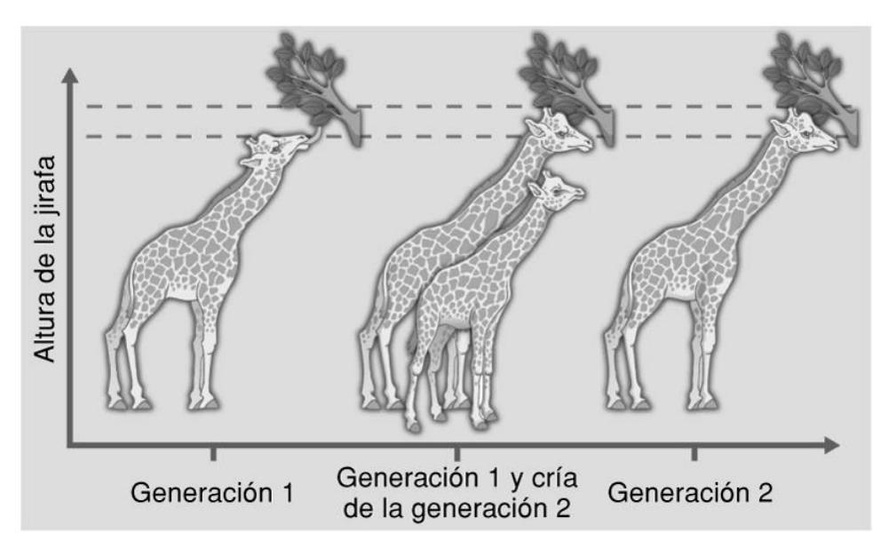

Existen organismos que se reproducen y la progenie hereda características de sus progenitores, existen variaciones de características si el medio ambiente no admite a todos los miembros de una población en crecimiento. Entonces, aquellos miembros de la población con características menos adaptadas (según lo determine su medio ambiente) morirán con mayor probabilidad. De esta forma, aquellos miembros con características mejor adaptadas sobrevivirán más probablemente.

**Darwin,** *El origen de las especies*

# **3.2.3. Teoría de la selección natural de Darwin-Wallace**

Charles Darwin fue un naturalista de origen británico, que planteó la Teoría evolutiva de la selección natural, en la misma época, pero independiente del trabajo de Wallace. Todo comenzó con un viaje de 5 años que hizo en el bergantín Beagle.

En 1831 este se dirigió a América del Sur, en donde Darwin estudió animales, plantas, fósiles y formaciones geológicas en zonas prácticamente inexploradas. Recolectó y catalogó cientos de plantas y animales, y tomó notas que sustentaron el desarrollo de su teoría.

El Beagle estuvo 2 meses en las islas Galápagos, en donde Darwin continuó con su estudio. Comparó animales y plantas de la isla con las de tierra firme, interesándose en las similitudes que había entre estas. También le llamó la atención que en las islas hubiera tanta diversidad. Tiempo después recopilando información y trabajos de otros científicos, planteó que los animales se adaptan a un medio de modo que aumente la probabilidad de supervivencia y el éxito reproductivo. Eventualmente la acumulación de modificaciones puede resultar en nuevas especies, y solo era necesario tiempo para que esto ocurriera.

Darwin finalmente había desarrollado en explicación aceptable de la evolución, la selección natural en donde el organismo mejor adaptado tiene mayor probabilidad de sobrevivir y de convertirse en los padres de la siguiente generación. Como resultado de esta selección, la población cambia a lo largo del tiempo; la frecuencia de caracteres favorables aumenta en las generaciones posteriores, mientras que características menos favorables se hacen escasas o desaparecen a lo largo del tiempo.

# **Planteamientos de Darwin-Wallace:**

- El principal mecanismo por el que ocurre la evolución es la reproducción diferencial, lo que significa que cierto tipo de individuos de una población deja más descendientes que otros, con lo que sus características fenotípicas se van haciendo cada vez más frecuentes.
- Generalmente, los individuos que más descendientes dejan son los mejores adaptados al ambiente en que viven, vale decir, los que tienen mayores probabilidades de sobrevivir en dicho ambiente.
- Para que lo anterior sea posible es una condición necesaria que exista variabilidad en las poblaciones.
- La evolución, según esta teoría, consiste en un cambio de las proporciones fenotípicas en las poblaciones (se van haciendo más y más frecuentes ciertos fenotipos, aquellos que permiten dejar más descendencia).
- Si un rasgo fenotípico confiere mayor probabilidad de sobrevivir en un ambiente, pero no de reproducirse, carece de importancia evolutiva.

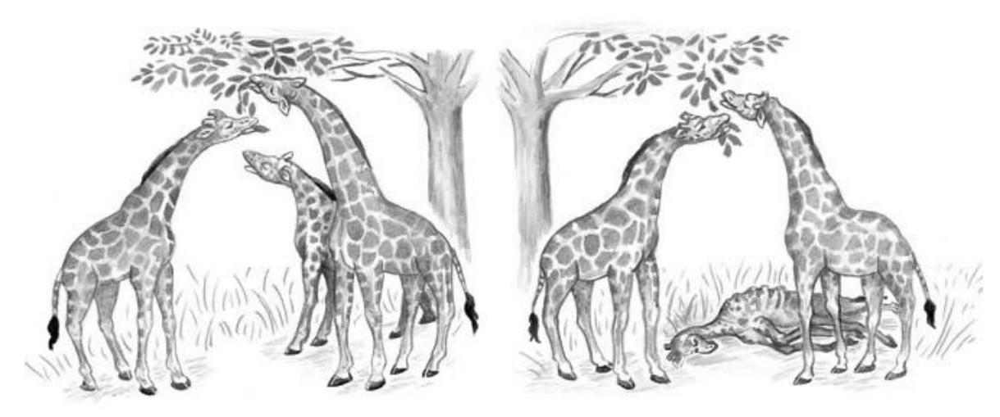

# **3.2.4 Teoría sintética de la evolución o Neodarwinismo**

La Teoría de Evolución por Selección Natural de Darwin y Wallace, complementada con la genética Mendeliana produjo la Genética poblacional y al incluir en ella los aportes de la Biología Molecular se gestó la **"Teoría Sintética de la Evolución o Neodarwinista".**

### **Ideas principales**

- La teoría sintética no acepta la teoría de los caracteres adquiridos.
- Los seres vivos experimentan variaciones debidas a mutaciones que se producen al azar, lo que genera variabilidad entre los individuos de una misma especie.
- En individuos con reproducción sexual, interviene, además, el proceso de recombinación génica.

- La selección natural actúa sobre la variabilidad genética.
- Cada individuo en una población es portador de distintos alelos responsables de su fenotipo.
- La selección natural actúa sobre estas variedades de genes.
- Los individuos mejor adaptados, sobreviven y dejan más descendientes y sus caracteres se extienden dentro de la población.
- Los peores adaptados dejan menos descendientes y sus genes van desapareciendo.
- Estos cambios progresivos se acumulan en el tiempo produciendo cambios en las poblaciones que dan lugar a nuevas variedades, razas y especies.

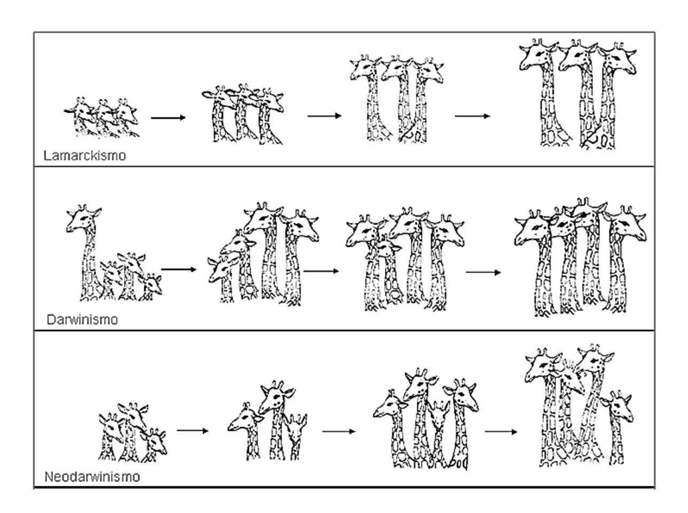

# **3.3. Evidencias evolutivas**

# **3.3.1. Registro fósil**

Quizás la evidencia más importante de la evolución es el descubrimiento, identificación e interpretación de fósiles, restos o huellas dejados en rocas sedimentarias por organismos que en algún momento existieron.

Los registros fósiles muestran una progresión desde los primeros organismos unicelulares hasta otros unicelulares y pluricelulares que habitan en la Tierra actualmente.

El registro fósil entonces demuestra que la vida evolucionó a lo largo del tiempo, generalmente revelan una sucesión de formas en los organismos y aportan las evidencias más directas de la teoría de la evolución orgánica, mostrando frecuentemente una direccionalidad. Es decir, que las formas de plantas y animales más

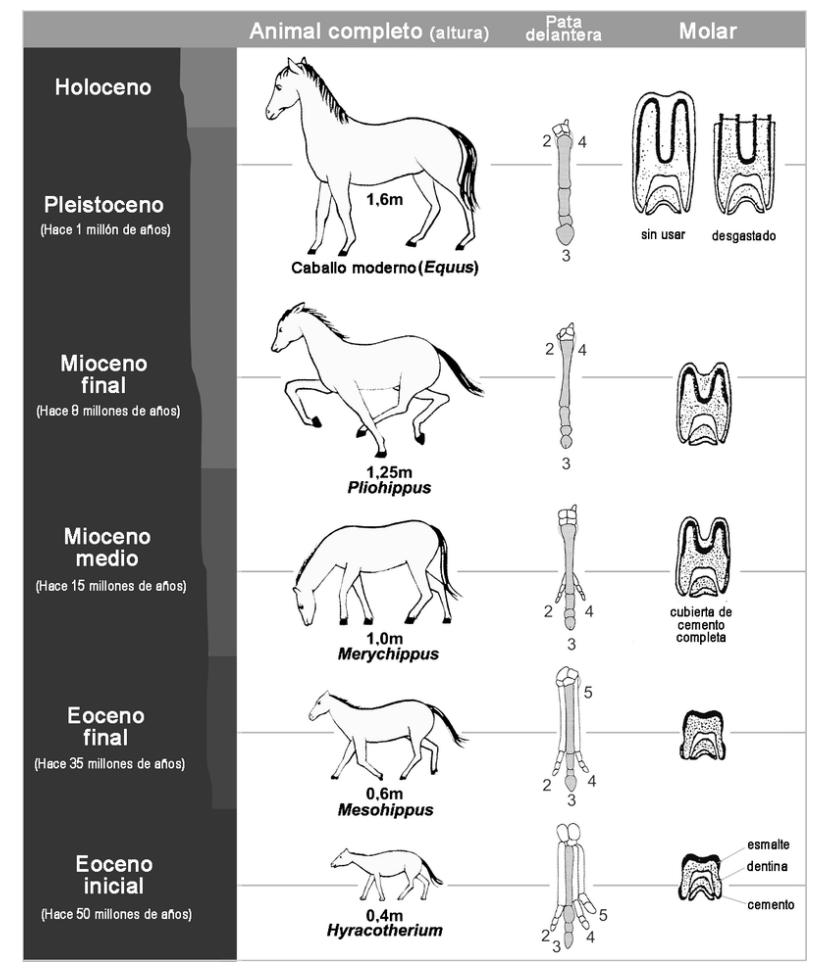

simples generalmente preceden a las más complejas y que los estratos de fósiles más recientes presentan un parecido más acentuado con las especies vivas actuales. Además, si el fósil encontrado se encuentra en los estratos superiores de la Tierra, es señal de que procede de un organismo más actual, por el contrario, si este registro se haya en estratos más profundo, mayor es la antigüedad de este.

### **3.3.2. Anatomía comparada**

Se basa en el estudio comparado de la morfología y anatomía de los seres vivos. En este aspecto debemos distinguir entre órganos homólogos, órganos análogos y vestigiales.

# **A) Órganos homólogos**

Son órganos con un mismo origen evolutivo y estructuras semejantes pero diferentes para realizar funciones distintas. La comparación de detalles estructurales de características encontradas en órganos distintos, pero de organismos relacionados revela similitud.

Esas características derivan de la misma estructura presente en un ancestro común y se denominan carácter homólogo **(la condición se llama homología)**. La homología se debe a un proceso de evolución divergente o adaptación de un mismo órgano a finalidades y medios distintos: volar, nadar, trepar, etc. Ejemplo de esto es la composición ósea de una extremidad superior en mamíferos: ala para un murciélago, aleta para una ballena, brazo en humanos.

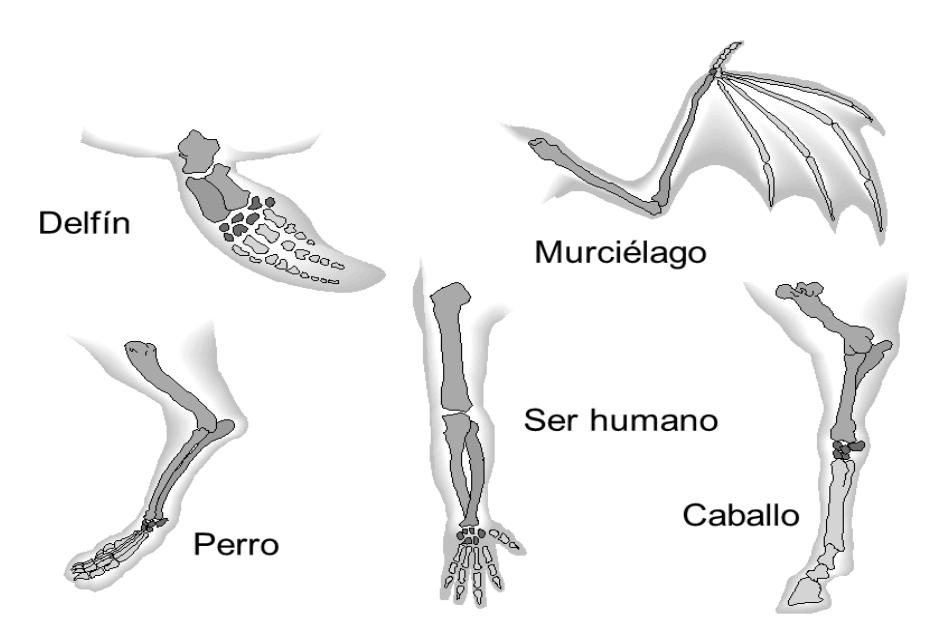

Otro ejemplo de homología estructural, la podemos encontrar en la forma de las hojas de diferentes especies vegetales:

Para cada uno de los casos presentados, las hojas se han modificado adaptativamente confiriendo ventajas a las especies que las presentan.

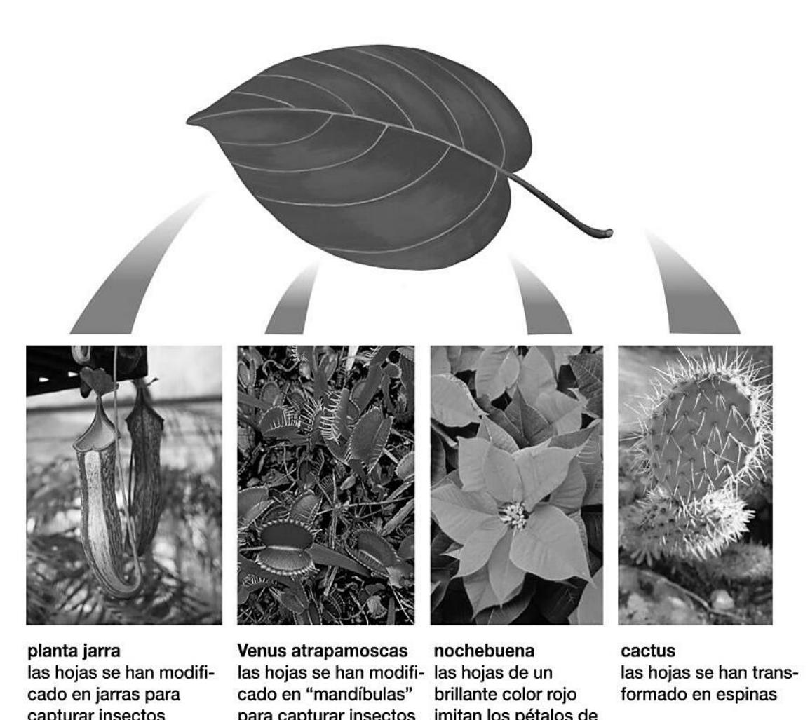

# **B) Órganos análogos**

Son aquellas estructuras con diferente origen evolutivo pero que presentan un aspecto semejante por tener una finalidad similar. Por ejemplo, el ala de un insecto y el ala de un ave.

La analogía indica una evolución convergente por adaptación de estructuras diferentes a un mismo medio o finalidad (función).

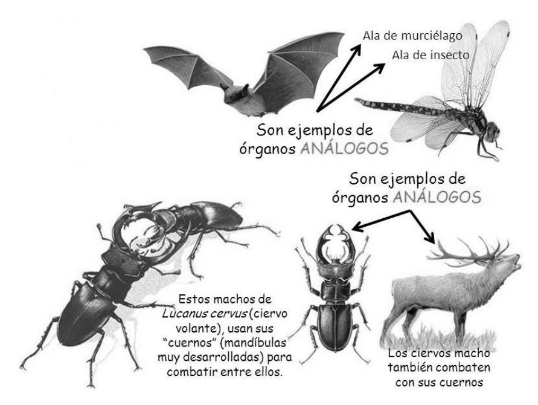

# **C) Órganos vestigiales**

Se trata de órganos atrofiados, sin función alguna en la actualidad, pero que puede revelar la existencia de antepasados para los que estos órganos eran necesarios. Un buen ejemplo lo tenemos en los restos de las extremidades posteriores del esqueleto de las ballenas que revelan su pasado cuadrúpedo.

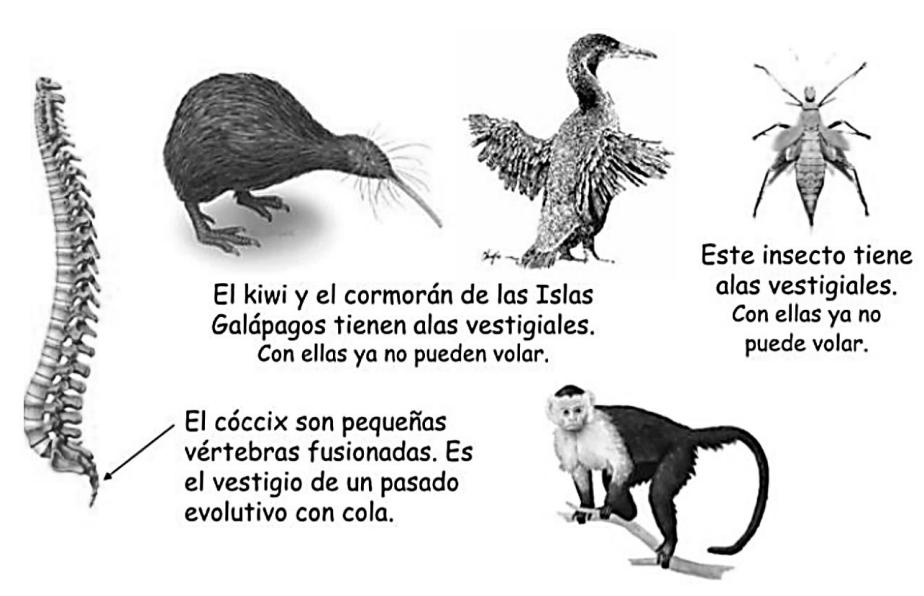

# **3.3.3. Embriología**

Consiste en la comparación de las etapas del desarrollo embrionario entre distintas especies. Antes solo era desde el punto de vista anatómico, ahora se consideran los distintos genes participantes en este proceso. Se sabe que los mismos genes regulan las primeras etapas del desarrollo en los mamíferos, por lo tanto, son muy parecidos físicamente hablando en estas mismas etapas.

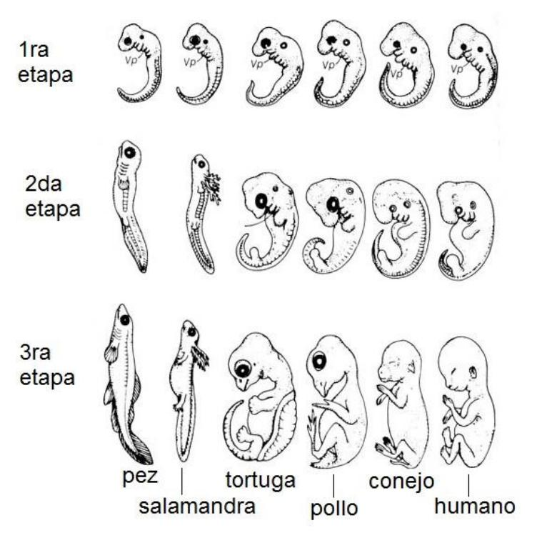

# **3.3.4. Bioquímica y biología molecular**

En la actualidad, una de las formas más efectivas de medir la semejanza entre diferentes especies a partir de la bioquímica es el análisis de aminoácidos. Este consiste en comparar la semejanza en la secuencia de aminoácidos de proteínas presentes en estas especies. Cuanto más semejante la cadena de aminoácidos, las especies serán más semejantes. En el ejemplo de la tabla, se puede ver que el chimpancé no presenta diferencia en la

| Especies  | Secuencia de aminoácidos en la misma sección de las proteínas de hemoglobina |  |
|-----------|------------------------------------------------------------------------------------|--|
| Humano    | Lys-Glu-His- <b>Iso</b>                                                            |  |
| Chimpancé | Lys-Glu-His- <b>Iso</b>                                                            |  |
| Gorila    | Lys-Glu-His- <b>Lys</b>                                                            |  |
| Caballo   | Arg-Lys-His-Lys                                                                    |  |
| Cebra     | Arg-Lys-His- <b>Arg</b>                                                            |  |

composición de ese segmento de aminoácidos, respecto al ser humano. En otras especies, las diferencias se acentúan mientras menos cercanas sean estas especies evolutivamente. Esto se encuentra íntimamente ligado a las similitudes existentes entre las secuencias genéticas entre diferentes especies. En general, mientras mayor sea el grado de similitud genética, es más probable que las secuencias de aminoácidos de las proteínas también lo sean.

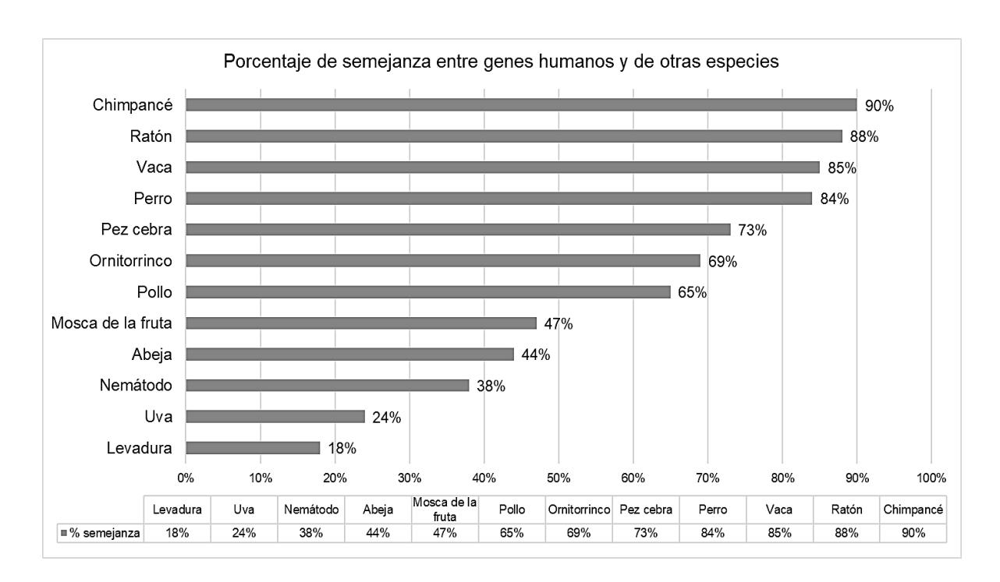

# **3.3.5. Análisis filogenético**

Un árbol filogenético es una representación de tipo arborescente (es decir, que asemeja un árbol), la cual muestra las diferentes relaciones evolutivas entre poblaciones o especies, u otras entidades biológicas, que se cree tienen un ancestro común, el cual puede ser cercano o no. Los árboles filogenéticos son útiles porque nos permiten establecer relaciones de forma gráfica, sin embargo, estos actúan como hipótesis, y no deben tomarse como hechos definitivos.

En general, mientras más cercano sea el ancestro común, más relacionadas están las especies (como es el caso de A y B), en caso contrario, tienden a ser más lejanos en términos evolutivos (caso de A con E).

Existen diferentes formas de representar un mismo árbol filogenético, lo cual no cambia la información contenida en este. Mientras más lejana sea la divergencia que da origen a las especies, más lejano es este ancestro. En la siguiente imagen se representan tres formas diferentes del mismo árbol filogenético.

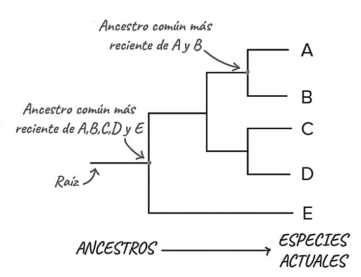

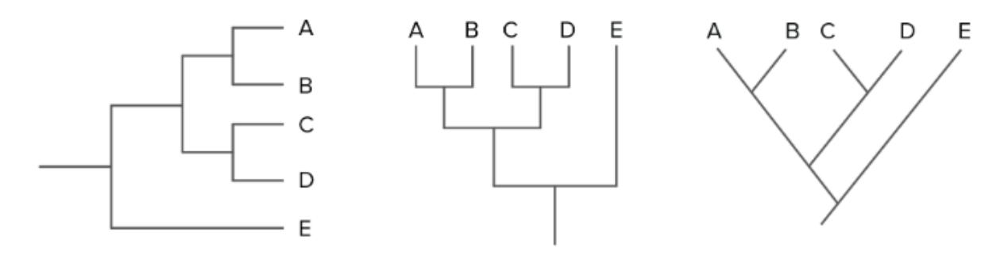

# **¿Cómo interpretar un árbol filogenético?**

Para interpretar correctamente estos modelos de representación, es necesario tener en cuenta lo siguiente:

- 1. Las especies de interés suelen presentarse en las puntas de la rama de cada árbol.
- 2. Las ramas se conectan entre sí representando la historia evolutiva de las especies involucradas.
- 3. La separación de dos ramas corresponde a eventos de divergencia evolutiva. Estos puntos se conocen como nodos, los cuales representan ancestros comunes recientes.
- 4. Las ramas de los árboles representan una amplia serie de ancestros que se extienden desde una especie hasta la siguiente.
- 5. Un clado es una agrupación que contiene un antepasado común y todas las especies descendientes, sea que estén vivas o extintas, de dicho antepasado. Por ejemplo:

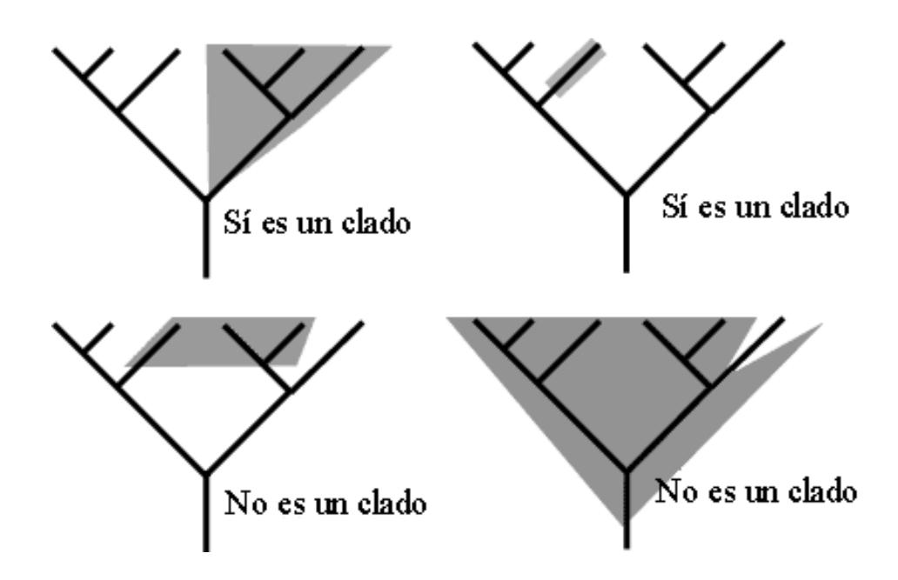

Por ejemplo, consideremos el siguiente árbol filogenético para las especies A, B, C, D y E:

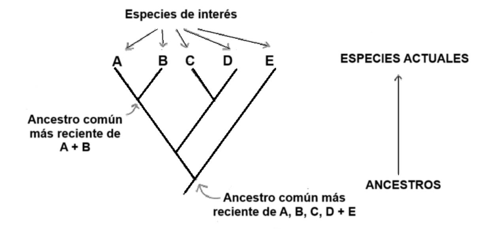

Si analizamos este árbol, encontramos que:

- Las especies A y B presentan un ancestro común reciente, lo cual puede ser interpretado como señal de un alto grado de parentesco.
- Las especies C y D presentan un ancestro común reciente, diferente al de A y B, lo cual puede ser interpretado como señal de un alto grado de parentesco.
- La especie E es la menos emparentada con el resto de las especies, aunque comparte un ancestro común reciente con dichas especies.
- Se representan cuatro eventos de divergencia evolutiva (representados por los nodos del esquema).

# **3.3.6. Biogeografía**

El conocimiento de que los continentes estuvieron en algún momento conectados y que se han separado es muy útil para explicar ciertos aspectos de la biogeografía en el estudio de la distribución geográfica de organismos en el pasado y presente. La deriva continental (movimiento aleatorio de las masas terrestres en la superficie terrestre) ha jugado un rol muy importante en la evolución de distintos organismos.

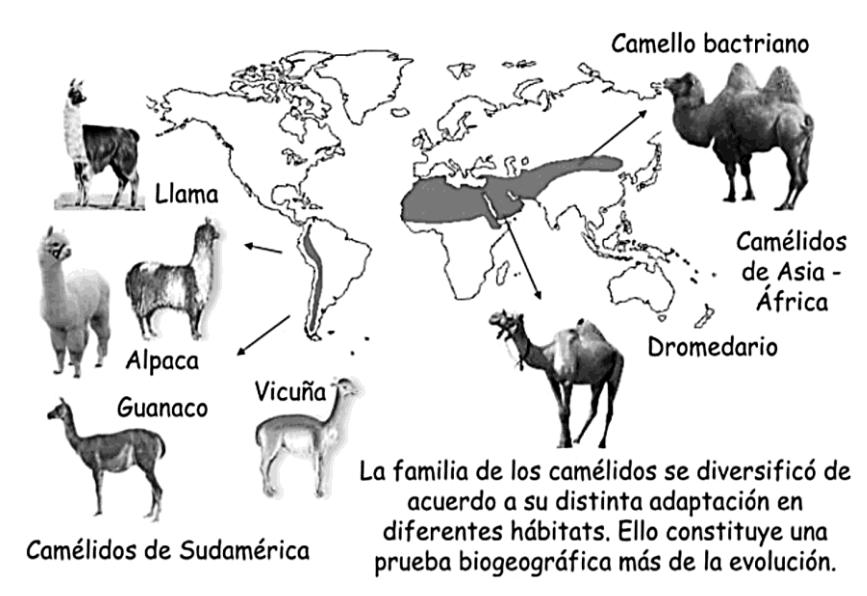

Cuando el continente único Pangea se formó, juntó especies terrestres que habían evolucionado separadamente unas de otras, llevando a la competencia y extinción de algunas.

La vida marina fue afectada negativamente hablando, en parte por la falta de costa (consecuencia de la existencia de un solo continente). La Pangea se separó en distintas masas terrestres hace 180 millones de años. A medida que los nuevos continentes empezaron a separarse, las poblaciones se aislaron geográficamente en diversas condiciones ambientales y comenzaron a diferenciarse y seguir sendas evolutivas distintas.

Como resultado de esto, plantas, animales y otros organismos de los continentes previamente conectados, se diferenciaron.

# **3.4. Selección natural**

Es un mecanismo evolutivo en el cual los miembros de una población que poseen características más exitosas en su ambiente tienen mayor probabilidad de sobrevivir y reproducirse. Por lo tanto, las sucesivas generaciones la proporción de características favorables aumentan en la población. Como resultado la selección natural conduce a un cambio evolutivo adaptativo.

**Importante: La selección natural puede actuar u operar sólo sobre las características expresadas en el fenotipo, por lo tanto, la unidad de selección es el fenotipo completo, es decir, el organismo completo.** 

Ejemplo de Selección Natural: El caso de la polilla moteada del abedul

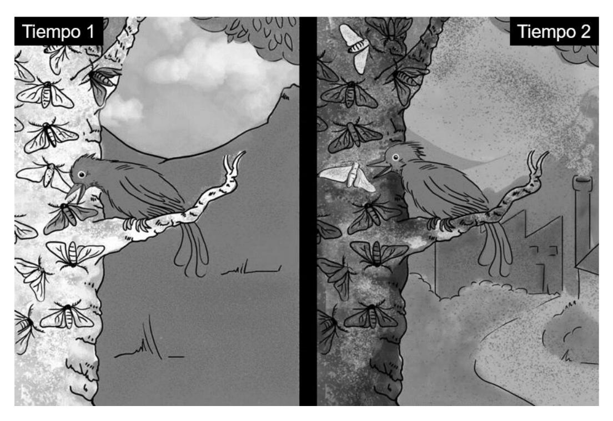

Esta especie de polilla se caracteriza porque presenta dos variantes de tonalidad: clara y oscura. El abedul es un árbol cuyo tronco es de tonalidad clara. Para las polillas de variante clara esto es ventajoso porque pueden camuflarse mejor, escapando de los depredadores, mientras que las variantes oscuras ante la incapacidad de camuflarse son las predilectas por los depredadores (**tiempo 1**). Hasta antes de la Revolución Industrial, la variante oscura era muy poco frecuente. Cuando comenzó el proceso de industrialización, la cubierta del abedul comenzó a oscurecerse debido al hollín liberado desde las chimeneas industriales. Ante este nuevo escenario, las polillas de la variante oscura presentan una ventaja, ya que pueden camuflarse mejor y protegerse de los depredadores que los de tono claro. Estas últimas se convierten en las predilectas por los depredadores (**tiempo 2**). Como la variante oscura es el rasgo ventajoso, entonces las polillas de este color comienzan a reproducirse en mayor proporción respecto a las de tono claro, propagando los genes responsables de este fenotipo.

# **3.4.1 Tipos de selección natural**

# **a. Selección direccional**

Favorece los caracteres mayores o menores, es decir, a uno de los extremos, y con el tiempo el fenotipo promedio de desplaza.

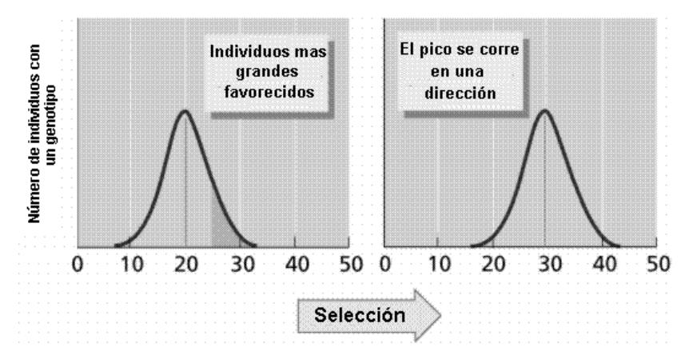

### **b. Selección estabilizadora**

Favorece el valor o fenotipo promedio del carácter. El fenotipo promedio no cambia y la variabilidad fenotípica disminuye.

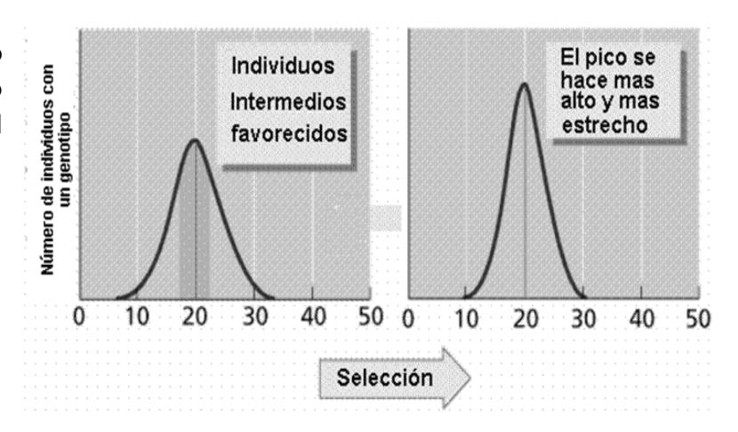

# **c. Selección disruptiva**

Favorece los valores mayores y menores, es decir, a los fenotipos de los extremos. Con el tiempo, las poblaciones se dividen en dos fenotipos.

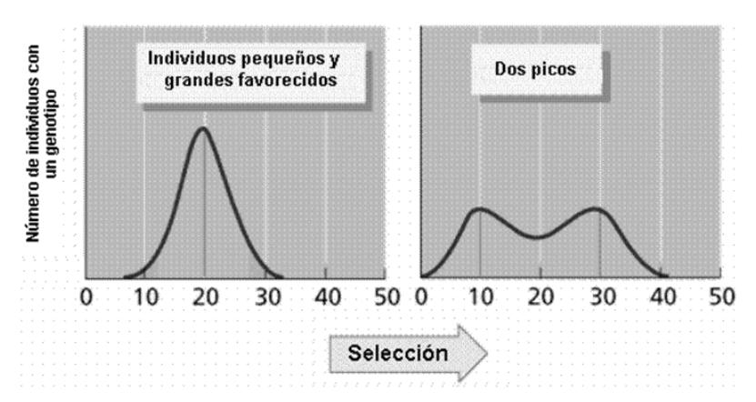

# **d. Selección sexual**

Es un tipo especial de selección que se ejerce sobre ciertas características de un animal para ser o no elegido para aparearse.

Se considera que la selección sexual es la principal causa de dimorfismo sexual (diferencias morfológicas entre machos y hembras de una misma especie).

El dimorfismo sexual es más marcado en especies poligínicas, donde pocos machos engendran a la mayoría de la progenie.

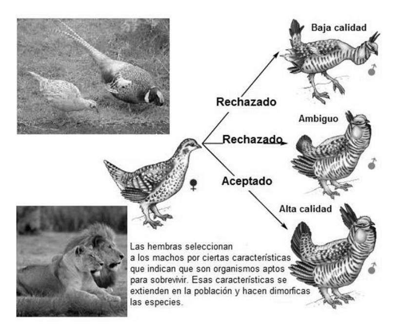

**d.1. Selección intersexual:** Los individuos de un sexo escogen con qué individuos del sexo opuesto se van a aparear. En muchas especies animales, en general, es la hembra quien escoge al macho con quien se reproducirá. Para que esto suceda, el macho se ve favorecido por ciertos atributos para atraer a la hembra, y es a través de la elección de estos atributos que la hembra se aparea. Estos incluyen apariencia física (dimorfismo sexual) y conducta como el canto y coreografías. Por ejemplo, el ave Saltarín cabecirrojo con su coreografía de "moonwalk" en la imagen a la derecha.

**d.2. Selección intrasexual:** Esta es una competencia directa entre dos machos por conquistar a una misma hembra. En este caso, dos machos se enfrentan a un duelo en el cual el ganador se aparea con la hembra. Por ejemplo, en el caso de cabras o ciervos que luchan con sus cornamentas.

# **3.5. Factores que afectan el proceso evolutivo**

# **3.5.1. Mutaciones**

Corresponden a cambios a nivel del ADN, lo cual puede producir la aparición de nuevas variantes alélicas para un determinado gen. Todas las mutaciones ocurren de manera impredecible y espontánea, aunque su frecuencia puede incrementarse por factores ambientales (mutágenos). Corresponde a una fuente de variabilidad genética en todo tipo de organismos.

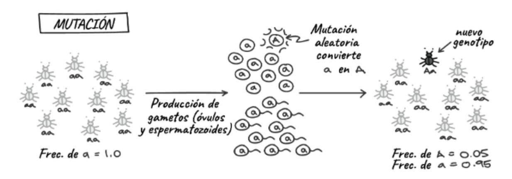

# **3.5.2 Selección natural**

Mecanismo evolutivo en el cual los miembros de una determinada población que poseen características más ventajosas al medioambiente tienen mayores probabilidades de sobrevivir y reproducirse. Por lo tanto, en las generaciones sucesivas la proporción de alelos más favorables aumenta en la población.

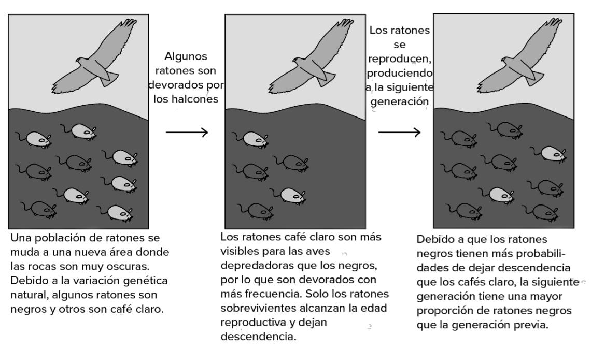

# **3.5.3. Flujo génico**

Las migraciones entre poblaciones causan un movimiento de alelos o flujo genético. El flujo de genes (entrada o salida de los alelos del reservorio genético) puede introducir nuevos genes o alterar la frecuencia alélica de la población.

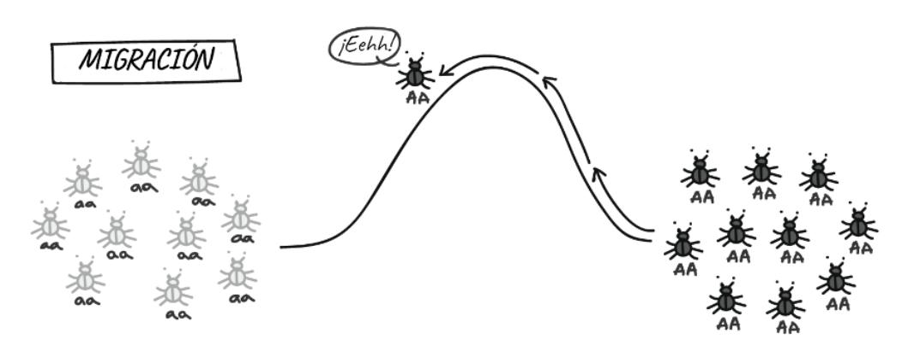

### **3.5.4. Apareamiento no aleatorio**

Se presenta cuando los individuos de una especie seleccionan a sus parejas con base al fenotipo (con lo cual seleccionan el genotipo correspondiente), pueden inducir el cambio evolutivo en la población. Dada la variabilidad que existe al interior de una población, la probabilidad de cada individuo de reproducirse dependerá de sus rasgos visibles (fenotipo). Aquellas características que sean más ventajosas pueden implicar un incremento en la probabilidad de reproducirse del individuo que porta los genes (genotipo) responsables de dichas características. En el caso del apareamiento no aleatorio, este puede ser **selectivo** o **no selectivo**, dependiendo si los individuos prefieren aparearse con otros del mismo fenotipo o fenotipos diferentes, respectivamente.

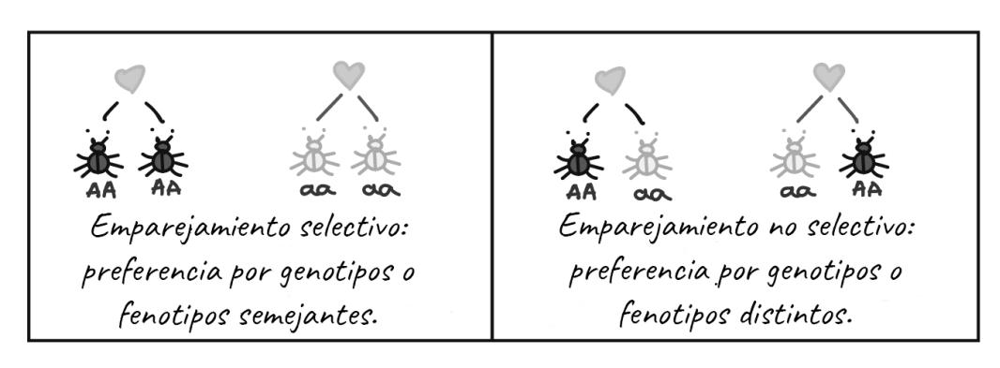

# **3.5.5. Deriva génica**

Es un mecanismo evolutivo que consiste en el cambio de la frecuencia alélica de una población producto de fenómenos aleatorios como desastres naturales u otros factores ambientales. Sus efectos suelen ser mayores en poblaciones pequeñas, ya sea desapareciendo algunos fenotipos o incrementando enormemente la frecuencia de otros asociado a la expresión de determinados alelos. En la siguiente imagen se representa un ejemplo de deriva génica aplicado a una población de escarabajos que presentan dos tonos de coloración: uno claro, definido por el alelo dominante A, y otro oscuro, dependiente del alelo recesivo a.

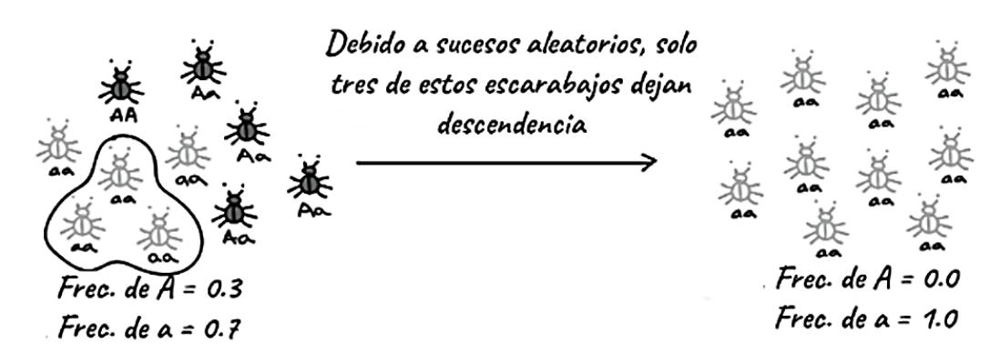

# **a. Efecto cuello de botella**

Se describe como un caso extremo de deriva génica, la cual se caracteriza por una disminución drástica del tamaño poblacional producto de un factor seleccionador muy intenso, por ejemplo, un incendio o un terremoto. Esto provoca que pocos individuos pasen a la siguiente generación, junto con sus alelos.

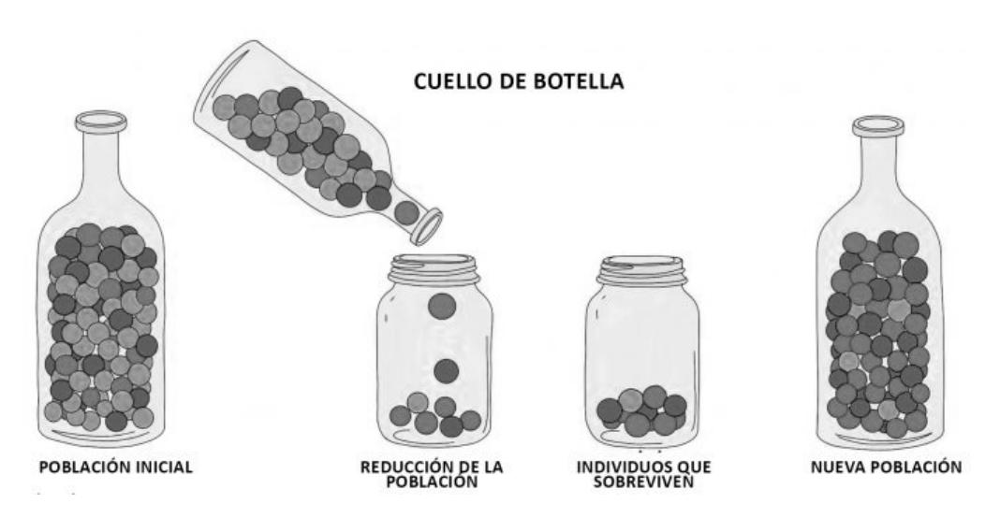

Dada la magnitud del efecto cuello de botella sobre la población, pueden producirse dos efectos. El primero, que la población afectada recupere un tamaño adecuado y persista en el tiempo. El segundo, si la población no logra recuperarse, eventualmente puede llegar a extinguirse.

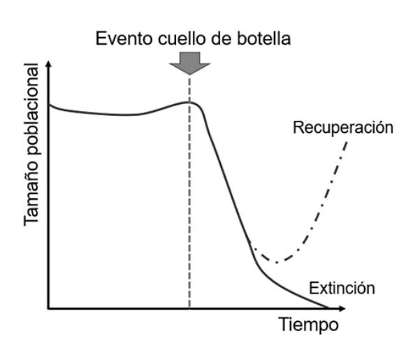

# **b. Efecto fundador**

Es otro fenómeno asociado a un caso de deriva génica extrema. Consiste en que un pequeño grupo de individuos se aparta de la población inicial, iniciando una colonia. Esta nueva colonia queda aislada de la población original. Existe la posibilidad de que los miembros de esta nueva colonia no representen toda la diversidad genotípica y fenotípica de la población original, es decir, que las frecuencias alélicas entre esta colonia y la población que le dio origen sean muy diferentes. En casos extremos, algunos alelos pueden no estar presentes en la nueva colonia.

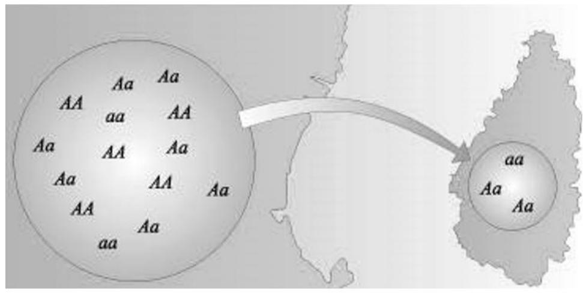

# **Ejercicios de selección única**

Seleccione la alternativa correcta para cada pregunta.

- 1. En un estudio sobre poblaciones fragmentadas de una especie de ave, los investigadores analizaron cómo la deriva génica afecta la variación genética. Al respecto, ¿cuál de las siguientes afirmaciones describe correctamente el efecto de la deriva génica que se esperaría observar en poblaciones pequeñas y aisladas de la especie estudiada?
  - A) Introducción de nuevos alelos mediante migración genética.
  - B) Incremento en la variación genética debido a la selección natural.
  - C) Pérdida de alelos raros por eventos aleatorios en generaciones sucesivas.
  - D) Aumento de la variabilidad genotípica en la población debido al apareamiento selectivo.
- 2. En un bosque tropical, un investigador está estudiando una población de escarabajos que varían en color desde claro hasta oscuro. Inicialmente, la distribución del color de los escarabajos está representada por T1. Luego, se introdujeron aves depredadoras que provocaron cambios en la frecuencia fenotípica, tal como se aprecia en T2 y T3 en el gráfico adjunto.

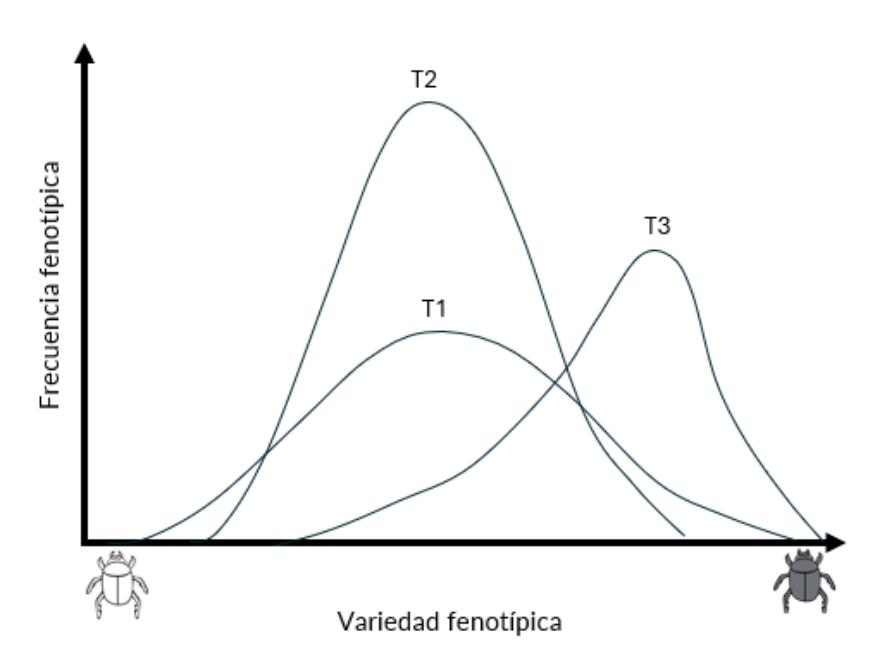

Con base en esta información, ¿cuál de las siguientes afirmaciones corresponde a una inferencia coherente con los datos mostrados?

- A) En T1 los fenotipos más abundantes son los extremos claro y oscuro
- B) Las aves depredadoras no tuvieron efecto en la población de escarabajos
- C) En T3 probablemente ocurrió un cambio ambiental que perjudicó al fenotipo más claro.
- D) En T3 probablemente las aves depredadoras comenzaron a consumir mayoritariamente escarabajos más oscuros.

3. Un equipo de investigación trabaja en un experimento para analizar el impacto de mutaciones en el proceso evolutivo de una población de bacterias. Se expusieron bacterias a diferentes niveles de radiación ultravioleta (UV) para inducir mutaciones y observar su efecto en la tasa de supervivencia y la aparición de nuevas adaptaciones en ambientes de estrés térmico. Los resultados del experimento se resumen en la siguiente tabla:

| Condición              | Nivel de radiación UV | Frecuencia de mutación | Tasa de supervivencia (%) | Número de adaptaciones observadas |
|------------------------|--------------------------|---------------------------|---------------------------------|-----------------------------------------|
| Grupo control          | S/radiación              | 0,001                     | 95                              | No                                      |
| Exposición moderada | 5 J/m2                   | 0,01                      | 80                              | Si                                      |
| Exposición alta        | 10 J/m2                  | 0,05                      | 50                              | Si                                      |
| Exposición extrema  | 20 J/m2                  | 0,10                      | 10                              | No                                      |

¿Cuál de las siguientes conclusiones del experimento podría ser replicada de manera confiable mediante un procedimiento similar?

- A) Las mutaciones inducidas por radiación UV siempre aumentan la tasa de supervivencia en todas las condiciones.
- B) Las exposiciones moderadas a radiación UV pueden favorecer la aparición de nuevas adaptaciones sin una reducción crítica en la supervivencia.
- C) Las mutaciones inducidas por radiación UV no afectan la tasa de supervivencia de las bacterias ni la aparición de adaptaciones.
- D) Las exposiciones extremas a radiación UV producen un aumento significativo en la tasa de supervivencia y en la aparición de nuevas adaptaciones.

4. En un tipo de roedor el fenotipo del color de pelaje, el alelo **Q** codifica para el color negro, mientras que el alelo **q** codifica el color blanco. Cuando un organismo presenta la combinación genotípica **Qq** presenta un color intermedio (gris). Se analiza el efecto de la aparición de un felino depredador sobre la frecuencia genotípica de una población de estos roedores, encontrando los siguientes resultados:

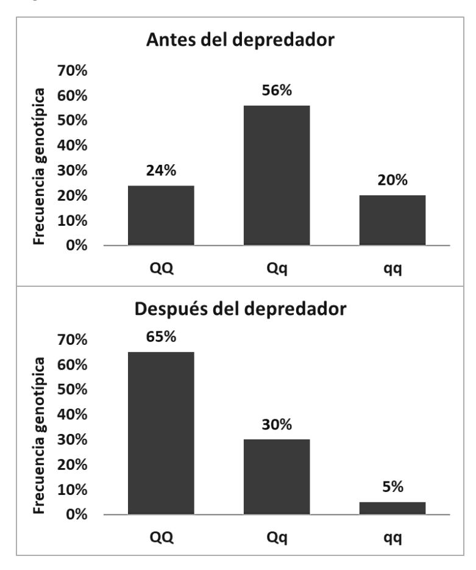

De acuerdo con estos resultados, es correcto concluir que:

- A) La presencia del depredador ha convertido al fenotipo blanco en un rasgo que favorece la sobrevivencia.
- B) La variabilidad genética de la población ha aumentado producto de la fuerza seleccionadora.
- C) La presencia del factor seleccionador produce un fenómeno de selección disruptiva.
- D) El depredador actúa como una fuerza seleccionadora sobre la población biológica.

- 5. Las ballenas francas y los tiburones ballena se encuentran entre los mayores animales marinos conocidos. Estos animales tienen un cuerpo hidrodinámico con formas muy similares. Además, ambos son animales filtradores, que se alimentan de grandes cantidades de pequeños organismos presentes en el agua. Sin embargo, las ballenas francas australes pertenecen al grupo de los mamíferos, mientras que los tiburones ballena pertenecen al grupo de los peces cartilaginosos. La semejanza entre el tamaño, el formato del cuerpo y el modo de alimentación de esas dos especies de animales se debe a un proceso evolutivo conocido como:
  - A) Convergencia adaptativa.
  - B) Divergencia adaptativa.
  - C) Radiación adaptativa.
  - D) Coevolución.

CONOCE NUESTRAS PLATAFORMAS DIGITALES

