| Presentación                                                                | 5  |
|-----------------------------------------------------------------------------|----|
| I. ENERGIA Y TIERRA                                                         | 7  |
| TEMA 1: TEORÍA DE LA DERIVA CONTINENTAL Y TEORÍA DE LA TECTÓNICA DE PLACAS. | 7  |
| 1.1 Antes de la deriva continental                                          | 7  |
| 1.2 Teoría de la deriva continental                                         | 8  |
| 1.2 Teoría de la tectónica de placas.                                       | 11 |
| 1.3 Ejercicios propuestos:                                                  | 13 |
| TEMA 2: MODELOS INTERNOS DE LA TIERRA                                       | 17 |
| 2.1 Composición de la Tierra                                                | 17 |
| 2.2. Estructura interna de la Tierra                                        | 18 |
| 2.2 Ejercicios propuestos:                                                  | 21 |
| TEMA 3: Fenómenos sísmicos                                                  | 25 |
| 3.1. Elementos de un sismo                                                  | 25 |
| 3.3. Impacto de la actividad sísmica                                        | 26 |
| 3.3.3. Tsunamis                                                             | 28 |
| 3.3.4. Erupciones volcánicas                                                | 29 |
| 3.4. Ejercicios propuestos:                                                 | 31 |
| II. ELECTRICIDAD                                                            | 35 |
| TEMA 1. CARACTERÍSTICAS DE LAS ONDAS                                        | 35 |
| 1.1. Corriente y circuitos eléctricos                                       | 35 |
| 1.2. Componentes básicos de un circuito eléctrico                           | 35 |
| 1.3. Corriente eléctrica                                                    | 36 |
| 1.4. Voltaje                                                                | 37 |
| 1.4.1 Fuentes de voltaje                                                    | 37 |
| 1.5. Corriente continua y corriente alterna (CC y CA)                       | 38 |
| 1.6. Resistencia eléctrica                                                  | 38 |
| 1.7. Características de la resistencia eléctrica                            | 39 |
| 1.7.1. Buenos conductores y aislantes                                       | 40 |
| 1.8 Ejercicios propuestos                                                   | 41 |
| TEMA 2. LEY DE OHM Y RESISTENCIA EQUIVALENTE                                | 45 |
| 2.1. Ley de Ohm                                                             | 45 |
| 2.1.1. Aplicación de la ley de Ohm: el circuito eléctrico más simple        | 45 |
| 2.1.2. Resolución de circuitos eléctricos                                   | 46 |
| 2.2. Resistencia eléctrica equivalente                                      | 47 |
|                                                                             |    |

| 2.2.1. Circuito serie (conexión en serie)            | 48 |
|------------------------------------------------------|----|
| 2.2.2. Circuito en paralelo (Conexión en paralelo)   | 49 |
| 2.2.3. Circuito mixto                                | 50 |
| 2.3. Medición de corriente y voltaje                 | 52 |
| 2.4 Ejercicios propuestos                            | 53 |
| TEMA 3. RED DOMICILIARIA Y POTENCIA ELÉCTRICA        | 57 |
| 3.1. El consumo residencial                          | 57 |
| 3.2. Potencia eléctrica                              | 57 |
| 3.2.1. Cálculo de potencia eléctrica en resistencias | 58 |
| 3.2.2. El efecto Joule                               | 59 |
| 3.3 Energía eléctrica y cuenta de la luz eléctrica   | 61 |
| 3.4. Métodos de transformación de energía eléctrica  | 62 |
| 3.4.1. Generación de energía eléctrica               | 63 |
| 3.4.2. Transmisión de energía eléctrica              | 65 |
| 3.4.3. Consumo de energía eléctrica                  | 65 |
| 3.5 Ejercicios propuestos                            | 67 |
|                                                      |    |

## **Presentación**

Este apunte, en su **primera edición**, es un material de apoyo pedagógico diseñado para la preparación de la PAES de Física Electivo. Los contenidos presentados están alineados con el temario oficial del DEMRE y abarcan las siguientes áreas temáticas: **Energía y Electricidad**.

Es importante destacar que este texto complementa lo que se enseña en clases, por lo que no reemplaza la asistencia regular a estas.

#### **¿Cómo utilizar el apunte?**

- 1. **Preparación previa a las clases:** Lee el capítulo correspondiente antes de asistir a clase. Esto te proporcionará un punto de partida para comprender los conceptos y te permitirá plantear preguntas que faciliten una mayor profundización durante la sesión.
- 2. **Ejercitación de los temas:** Cada sección incluye ejercicios propuestos para que los resuelvas de manera independiente. Esta práctica es una excelente oportunidad para identificar dudas que podrás aclarar con apoyo en clase y evaluar tu comprensión del tema.
- 3. **Toma de apuntes:** Usa el apunte durante las clases para registrar los aspectos más relevantes o las dudas que surjan. También puedes complementar las explicaciones o ejemplos del texto con las enseñanzas impartidas en cada sesión.
- 4. **Complemento y profundización:** Aprovecha el apunte para repasar cada sección y, si es posible, consulta el material adicional disponible en la plataforma del estudiante para enriquecer tu aprendizaje.

# **I. ENERGIA Y TIERRA**

La superficie de la Tierra está en constante cambio debido a la energía interna del planeta. Este capítulo aborda los principales procesos que explican estos cambios, comenzando con la teoría de la deriva continental, que propuso que los continentes se han desplazado a lo largo del tiempo, y las evidencias que la respaldan.

A partir de esta teoría se desarrolló el modelo actual de la tectónica de placas, que explica fenómenos como los sismos, el volcanismo y la formación de montañas. Para comprender por qué ocurren estos procesos, también exploraremos el modelo físico del interior de la Tierra (geosfera) y su relación con el movimiento de las placas.

Estos contenidos son clave para entender cómo funciona nuestro planeta y forman parte del eje temático de Energía y Tierra del temario oficial PAES.

# **TEMA 1: TEORÍA DE LA DERIVA CONTINENTAL Y TEORÍA DE LA TECTÓNICA DE PLACAS.**

En esta sección revisarás las teorías que explican cómo se mueve la superficie terrestre. Comenzaremos con la deriva continental y su evolución hacia la tectónica de placas, modelo que permite comprender fenómenos como los sismos, el volcanismo y la formación del relieve.

## **1.1 Antes de la deriva continental**

### **Primeras observaciones sobre la forma de los continentes**

Desde el siglo XVI, con la expansión de la cartografía durante la era de los descubrimientos, **algunos navegantes y geógrafos** notaron que las costas de África y Sudamérica parecían encajar como piezas de un rompecabezas. Esta similitud llamó la atención, pero en ese momento no se pensaba en el movimiento de continentes, sino que se asumía que las formas eran coincidencias curiosas.

### **James Hutton y el nacimiento de la geología moderna (finales del siglo XVIII)**

En 1795, **James Hutton** publicó *Teoría de la Tierra*, donde propuso que los procesos geológicos que modelan la superficie —como la erosión, el depósito de sedimentos y la formación de montañas eran **lentos, continuos y cíclicos**, y requerían **una fuente interna de calor**. Hutton introdujo el concepto de **"tiempo profundo"**, desafiando la visión de una Tierra joven e inmutable. Aunque no habló del movimiento de continentes, sí sentó las bases para pensar en un planeta dinámico.

#### **Charles Lyell y el uniformismo (siglo XIX)**

A principios del siglo XIX, **Charles Lyell**, influido por Hutton, desarrolló la teoría del **uniformismo**: la idea de que los procesos geológicos actuales (como la erosión, sedimentación y levantamiento) han operado de la misma forma en el pasado. Su obra *Principios de geología* (1830) tuvo una enorme influencia, incluso en científicos como Charles Darwin. Sin embargo, aún no se pensaba en grandes desplazamientos horizontales de los continentes.

### **Hipótesis de desplazamientos continentales (siglo XIX)**

Durante el siglo XIX, **algunos científicos empezaron a especular** que los continentes podían haberse movido. Por ejemplo:

- En 1858, **Antonio Snider-Pellegrini**, un científico francés, propuso que los continentes alguna vez estuvieron unidos y se separaron por causas desconocidas. Usó como argumento la similitud de fósiles en distintos continentes. Incluso hizo un mapa mostrando cómo encajaban.
- Sin embargo, estas ideas fueron generalmente rechazadas o ignoradas, porque no se conocía **un mecanismo físico plausible** que explicara cómo podrían moverse masas continentales tan grandes.

### **Glaciaciones y fósiles compartidos**

A fines del siglo XIX, geólogos que estudiaban **glaciaciones antiguas** notaron rastros de hielo de la misma época en continentes muy separados hoy en día (como Sudamérica, África, India y Australia). También se descubrieron **fósiles idénticos** (como el reptil *Mesosaurus*) en continentes separados por océanos. Estos hallazgos hacían pensar que, en algún momento, esos continentes habían estado conectados… pero aún sin una teoría consolidada.

### **Llegada de Wegener (1912)**

Alfred Wegener reunió todas estas evidencias dispersas y propuso, ya con fuerza y claridad, que los continentes **no solo se habían movido**, sino que lo **seguían haciendo**. Su hipótesis de la **deriva continental** fue revolucionaria, pero también resistida por falta de un mecanismo convincente. Recién en los años 60, con el desarrollo del modelo de **tectónica de placas**, se le dio respaldo definitivo

### **1.2 Teoría de la deriva continental**

A principios del siglo XX, el científico Alfred Wegener propuso la **teoría de la deriva continental**,

durante el periodo de la Primera Guerra Mundial en que se desempeñó como oficial de reserva en el servicio de meteorología del ejército. Esta labor le permitió viajar entre diferentes continentes y realizar observaciones que luego sistematizó en un libro que fue altamente controversial para la época y ampliamente ignorado. Según propuesta implicada que los continentes no eran estructuras fijas, sino que se desplazaban lentamente a través del fondo oceánico, de forma similar a cómo un iceberg flota y se mueve en el mar. Wegener incluso planteó que, en el pasado geológico, todos los continentes estuvieron unidos en un solo supercontinente llamado **Pangea**, el cual se fragmentó y dio origen a los continentes actuales. Todo esto fue planteado en un momento de la

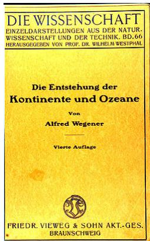

historia en que todo fenómeno geológico era explicado por movimientos verticales de expansión y contracción de la materia.

¿Cómo demostrarías un suceso ocurrido hace millones de años?

Para respaldar su propuesta, Wegener presentó diversas **evidencias geológicas y paleontológicas** que sugerían que los continentes alguna vez estuvieron unidos:

**Fósiles similares en distintos continentes**: Wegener identificó fósiles de especies idénticas en continentes actualmente separados por océanos. Por ejemplo, el fósil del *Mesosaurus*, un reptil acuático de agua dulce fue hallado tanto en Brasil como en África Occidental. Dado que esta especie no podía haber cruzado el océano Atlántico, la única explicación razonable era que ambos continentes habían estado unidos en el pasado. De forma similar, se encontraron fósiles de la planta *Glossopteris* en Sudamérica, África, India, Australia y la Antártida, lo que también indicaba una conexión terrestre previa entre estas regiones.

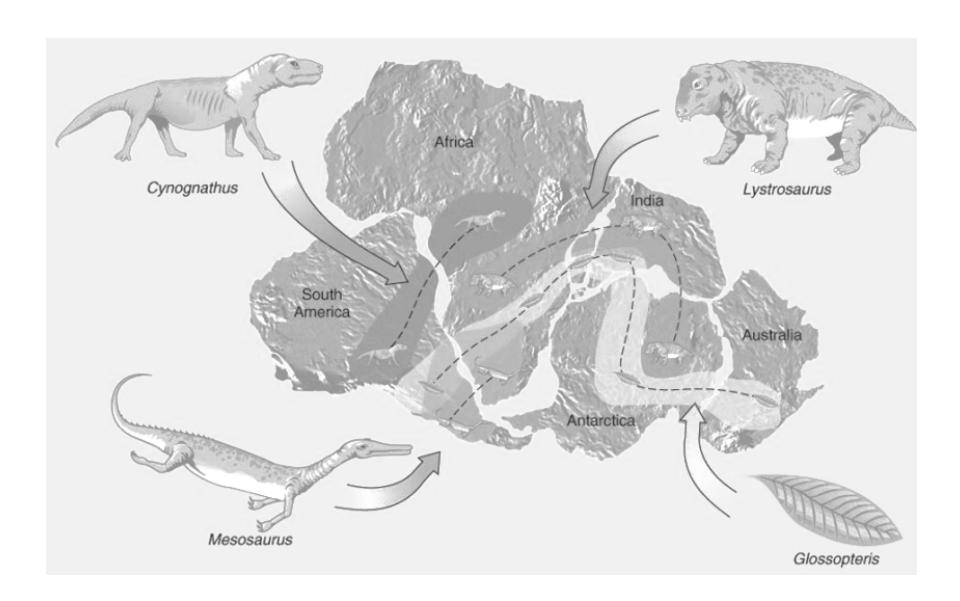

**Coincidencia en la forma de los continentes:** Wegener observó que los perfiles de los continentes parecían encajar como piezas de un rompecabezas, especialmente los bordes de África y Sudamérica. Este encaje sugería que, en algún momento, formaron parte de una misma masa continental que luego se fragmentó. Esta observación visual fue una de las primeras pistas que motivaron la formulación de la teoría.

**Similitudes geológicas entre regiones separadas**: Además de fósiles y formas costeras, Wegener encontró que **formaciones rocosas y cadenas montañosas** de igual edad y composición se extendían a través de continentes distantes. Por ejemplo, las montañas de los Apalaches en América del Norte tienen continuidad estructural con formaciones similares en Escocia y Noruega. Este tipo de evidencia geológica solo podía explicarse si estas regiones hubieran estado conectadas en el pasado.

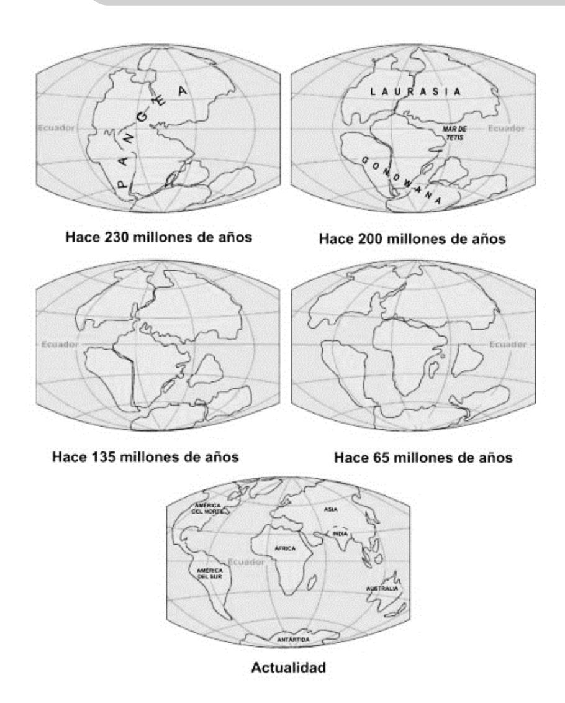

Estas evidencias reforzaban la idea de que los continentes se habían desplazado con el tiempo. Sin embargo, la teoría aún tenía un gran vacío: **no se conocía el mecanismo** capaz de mover masas continentales tan grandes. Esta falta de una explicación física fue el principal motivo por el cual la comunidad científica no aceptó la teoría de Wegener en su época, aunque más tarde sería fundamental para el desarrollo de la **tectónica de placas**.

### **1.2 Teoría de la tectónica de placas.**

La teoría de la tectónica de placas permite explicar cómo se produce el desplazamiento de los continentes a lo largo del tiempo. De hecho, muchos científicos consideran que esta teoría representa una actualización y ampliación de la teoría de la deriva continental propuesta por Alfred Wegener en 1912, al incorporar nuevos conocimientos y evidencias que Wegener no conocía en su época.

Esta teoría se basa en el modelo dinámico del interior de la Tierra y sostiene que la capa más externa del planeta, conocida como litosfera, está fragmentada en grandes bloques o placas tectónicas. Estas placas se desplazan lentamente sobre una capa subyacente llamada astenosfera, que posee propiedades plásticas debido al calor interno del planeta. Este calor genera corrientes de convección en el manto terrestre, las cuales impulsan el movimiento de las placas. La astenosfera, al ser parcialmente fluida, actúa como una especie de "lubricante" que facilita el desplazamiento de la litosfera.

En términos simples, podemos decir que las placas tectónicas se mueven debido a las corrientes de convección del manto y a procesos como la **expansión del fondo oceánico**, que ocurre en las **dorsales oceánicas**. Estas dorsales son elevaciones submarinas ubicadas en el centro de los océanos, donde se genera nueva corteza oceánica a partir de magma que asciende desde el interior del planeta. Al enfriarse, este magma se solidifica y se incorpora a la corteza existente, lo que provoca el crecimiento del fondo oceánico y el alejamiento de los continentes a ambos lados de la dorsal.

Existen dos tipos principales de corteza que forman las placas: la corteza continental, que es más gruesa y menos densa, y la corteza oceánica, más delgada y densa. A pesar de sus diferencias, ambas interactúan constantemente a través de procesos como la subducción (cuando una placa se hunde bajo otra), la colisión y la separación.

### **Convección**

Es la transmisión de calor a través del movimiento de masas de fluidos (líquidos o gases). Para que se logre la convección es importante que la fuente de calor se ubique bajo el fluido, ya que las corrientes o el movimiento de los fluidos se producen por el cambio de densidad que ocurre al aumentar la temperatura.

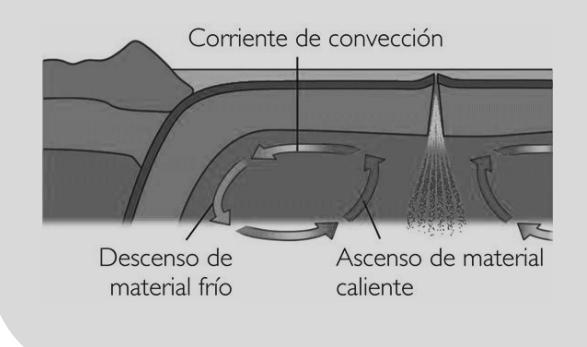

Gracias a esta teoría, es posible entender muchos fenómenos geológicos: desde la formación de cordilleras, hasta el origen de los terremotos, los volcanes y la actividad sísmica en distintas zonas del planeta. También permite explicar la geografía terrestre actual y los cambios geológicos que han ocurrido a lo largo de millones de años.

En la siguiente imagen se muestra un mapa mundial con las dorsales oceánicas y los distintos tipos de interacción entre placas (divergente, convergente y transformante).

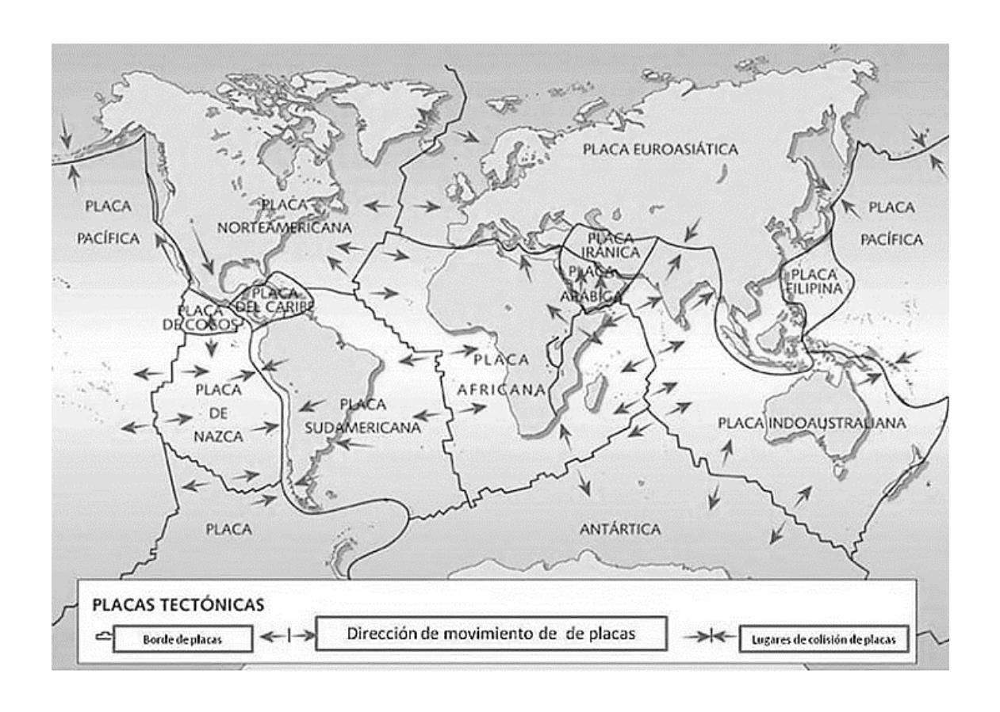

Te invitamos a ver el siguiente vídeo que explica la relación entre la teoría de la deriva continental y la teoría de la tectónica de placas.

## **1.3 Ejercicios propuestos:**

- 1. ¿Cuál de las siguientes afirmaciones representa una diferencia fundamental entre la teoría de la deriva continental y la teoría de la tectónica de placas?
  - A) La deriva continental explica los volcanes, mientras que la tectónica de placas no.
  - B) La deriva continental propone que los continentes se mueven, mientras que la tectónica de placas propone que la Tierra es estática.
  - C) La deriva continental se basa principalmente en evidencias fósiles y geológicas, mientras que la tectónica de placas incorpora además mecanismos físicos para explicar el movimiento.
  - D) Ambas teorías son idénticas, solo que con nombres diferentes.
- 2. La presencia de fósiles de una misma especie extinta en las costas de África y Sudamérica se considera una evidencia de:
  - A) La actividad volcánica en las dorsales oceánicas.
  - B) El movimiento de las placas tectónicas por corrientes de convección.
  - C) La subducción de la corteza oceánica bajo la continental.
  - D) El desplazamiento de los continentes propuesto en la teoría de la deriva continental.
- 3. ¿Cuál de los siguientes procesos ocurre en un límite convergente entre una placa oceánica y una placa continental?
  - A) Formación de una dorsal oceánica por surgimiento de magma.
  - B) Deslizamiento lateral entre dos placas, generando fallas transformantes.
  - C) Hundimiento de la placa oceánica bajo la continental, generando actividad sísmica y volcánica.
  - D) Separación de dos placas continentales, formando un valle de rift.

## **Completa el mapa conceptual**

#### **En este espacio puedes tomar notas durante la clase:**

|            |   |   |
|------------|------|------|
|            |   |   |
|            |   |   |
|            |   |   |
|         |   |   |
|         |   |   |
|            |   |   |
|            |   |   |
|            |   |   |
|            |   |   |
|            |   |   |
|            |   |   |
|         |   |   |
|            |   |   |
|            |   |   |
|            |   |   |
|            |   |   |
|            |   |   |
|            |   |   |
|            |   |   |
|            |   |   |
|            |   |   |
|            |   |   |
|            |   |   |
|      |   |   |
|            |   |   |
|            |   |   |
| •          |      |      |
|            |   |   |
|            |   |   |
|            |   |      |
|            |      |      |
|            |      |      |
|            |      |      |
|            |      |      |
|            |      |      |
|            |      |      |
|            |      |      |
|            |      |      |
|            |      |      |
|            |      |      |
|            |      |      |
|            |      |      |
|            |      |      |
|            |      |      |
|            |      |      |
|            |      |      |
|            |      |      |
|            |      |      |
|            |      |      |
|            |      |      |

# **TEMA 2: MODELOS INTERNOS DE LA TIERRA**

En esta sección exploraremos la estructura interna de la Tierra y cómo se libera la energía desde el interior del planeta hacia la superficie. Comprender estos procesos es fundamental para explicar fenómenos como los volcanes, los terremotos y el movimiento de las placas tectónicas.

## **2.1 Composición de la Tierra**

Desde una perspectiva global, la Tierra puede entenderse como un sistema dinámico compuesto por **cuatro grandes subsistemas** o "esferas", que están en **constante interacción** entre sí. Estos subsistemas se influencian mutuamente, generando cambios a distintas escalas que afectan tanto al planeta como a los seres vivos que lo habitan.

- **Atmósfera**: Es la delgada capa de gases que rodea la Tierra, compuesta principalmente por nitrógeno (78%) y oxígeno (21%), además de otros gases en menor proporción como dióxido de carbono, vapor de agua y argón. Esta capa protege al planeta de la radiación solar, regula la temperatura y permite la vida tal como la conocemos.
- **Hidrósfera**: Incluye toda el agua del planeta en sus diferentes estados (líquido, sólido y gaseoso). Esto abarca los océanos, mares, ríos, lagos, glaciares, capas de nieve, vapor de agua en la atmósfera y aguas subterráneas. La hidrósfera es esencial para el clima, los ecosistemas y los ciclos biogeoquímicos.
- **Litósfera**: Es la parte sólida y rígida de la Tierra. Comprende la corteza terrestre y la parte superior del manto, incluyendo las formaciones geológicas como montañas, cordilleras, volcanes, continentes y el fondo oceánico. Es en esta capa donde ocurren procesos como la tectónica de placas, la formación del relieve y la actividad sísmica.
- **Biósfera**: Engloba a todos los seres vivos del planeta —desde microorganismos hasta plantas, animales y humanos— así como sus interacciones con el entorno. La biósfera depende directamente de las condiciones que ofrecen la atmósfera, la hidrósfera y la litósfera, y a su vez influye en ellas a través de procesos como la fotosíntesis, la respiración y la descomposición.

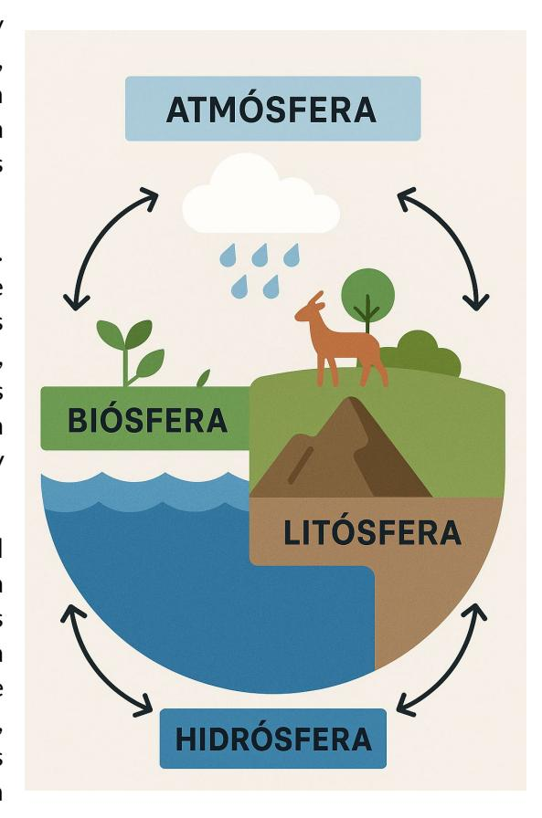

### **2.2. Estructura interna de la Tierra**

Se puede decir que la geosfera es el conjunto de capas que forman el interior de la Tierra. Su estructura se ha estudiado y definido desde dos perspectivas que dan origen a dos modelos: El modelo químico o estático (que observa principalmente su composición) y el modelo físico o dinámico (que observa el estado físico de sus capas y sus propiedades mecánicas).

### **2.2.1. Modelo químico de la Tierra**

Este modelo divide el interior de la Tierra en 3 capas que están separadas por límites llamados discontinuidades, los que marcan el cambio de composición de cada capa:

### • **Corteza**

La conforman los materiales menos densos del planeta. Tiene una densidad media de alrededor de 2,7 gr/cm3, es decir es 2,7 veces la densidad del agua. Comprende a la corteza continental y a la corteza oceánica que se encuentra totalmente por debajo del nivel del mar.

### • **Manto**

En el manto se concentra la mayor cantidad de material sólido rocoso del planeta. Es la capa de la Tierra que se encuentra entre la corteza y el núcleo (aproximadamente el 87 % del volumen del planeta). El manto terrestre se extiende desde cerca de 40 km de profundidad (o alrededor de 8 km en las zonas oceánicas) hasta los 2900 km. Se divide en dos partes: el manto interno (sólido y elástico) y el manto externo (fluido y viscoso).

### • **Núcleo**

El núcleo es la capa más profunda de la estructura de la Tierra y también la más densa. Se estima que su densidad media es de alrededor de 11 g/cm3, lo que equivale a 11 veces la densidad del agua.

Está compuesto de una zona externa (núcleo externo) en estado líquido y de una zona interna (núcleo interno) en estado sólido, donde hay una gran concentración de hierro y níquel. Se estima que en el centro de la Tierra la temperatura es como en la superficie Solar, es decir, alrededor de 6000 °C.

La tabla siguiente muestra las profundidades aproximadas entre las cuales se extiende cada una de las capas.

| Capa de la Tierra | Profundidad en km                |
|----------------------------|----------------------------------|
| Corteza                    | Desde 0 a 40 km                  |
| Manto                      | Desde 40 a 2900 km   |
| Núcleo externo          | Desde 2900 a 5200 km |
| Núcleo interno          | Desde 5200 a 6400 km |

#### **2.2.2. Modelo físico de la Tierra**

Este modelo considera que factores como la presión y temperatura afectan el comportamiento de las distintas capas. Las capas que componen este modelo son:

### • **Litósfera**

Es la capa sólida superficial de la Tierra, caracterizada por su rigidez. Está formada por la corteza y la zona más externa del manto, y "flota" sobre la astenósfera, una capa "plástica" que forma parte del manto superior. La litósfera suele tener un espesor aproximado de 50 a 300 km, siendo su límite externo la superficie terrestre. La litósfera está fragmentada en una serie de *placas tectónicas* o litosféricas.

### • **Astenósfera**

La astenósfera es la zona superior del manto terrestre que está inmediatamente debajo de la litósfera, aproximadamente entre 250 y 660 km de profundidad. Se caracteriza por la plasticidad de los materiales y su fluidez (capacidad para desplazarse). Se encuentra por debajo de la litósfera hasta unos 700 km de profundidad desde la superficie. Sobre ella se mueven las placas tectónicas.

### • **Mesósfera**

Bajo la astenósfera se encuentra la mesósfera hasta unos 2900 km de profundidad. Es una capa sólida de la que no se conoce su estado de rigidez. La astenósfera y la mesósfera formarían parte del manto. La parte "menos sólida" del manto está constituida por el magma, que es una mezcla de rocas en estado de fusión y la que produce la inestabilidad de la corteza. Los volcanes en erupción expulsan grandes cantidades de magma hacia el exterior.

### • **Endósfera**

Abarca unos 200 km del manto en su parte más profunda y a la totalidad del núcleo. El núcleo (externo e interno), que es el centro de la esfera, el que está compuesto de metales pesados, como el hierro y el níquel. Por lo tanto, el núcleo y parte del manto forman la endósfera.

A continuación, se muestra una representación visual de ambos modelos de la estructura interna de la Tierra: a la izquierda el modelo químico y a la derecha el modelo físico

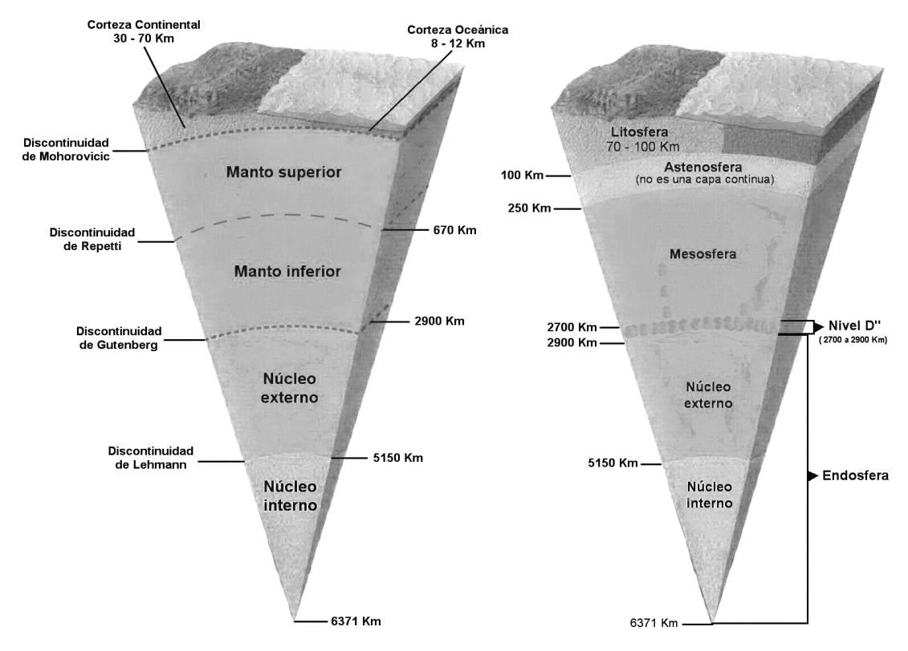

## **2.2 Ejercicios propuestos:**

1. La astenósfera es una capa de la Tierra que se encuentra en A) la corteza. C) la litosfera. B) el núcleo interno. D) el núcleo externo. E) el manto superior. 2. Considerando la composición química de las capas terrestres, ¿cuál es el orden correcto desde el interior hacia el exterior? A) Corteza – manto – núcleo B) Núcleo – manto – corteza C) Corteza- núcleo – manto D) Manto – corteza – núcleo E) Núcleo – corteza – manto 3. ¿Cuál es la causa del movimiento de placas tectónicas? A) Las corrientes de convección en la astenósfera. B) La existencia de las mareas. C) El movimiento de rotación de la Tierra. D) La fuerza de atracción gravitatoria de la Luna. E) La atracción que ejerce el núcleo sobre las placas. 4. Al ordenar crecientemente las densidades del núcleo de la tierra (ρN), de la corteza terrestre (ρC) y del manto (ρM) resulta: A) ρC – ρN – ρM B) ρN – ρC – ρM C) ρN – ρM – ρC D) ρM – ρC – ρN E) ρC – ρM – ρN

**Completa el mapa conceptual (Clase 10)**

#### **En este espacio puedes tomar notas durante la clase:**

| , |  |
|---|--|
|   |  |
|   |  |
|   |  |
|   |  |
|   |  |
|   |  |
|   |  |
|   |  |
|   |  |
|   |  |
|   |  |
|   |  |
|   |  |
|   |  |
|   |  |
|   |  |
|   |  |
|   |  |
|   |  |
|   |  |
|   |  |
|   |  |
|   |  |
|   |  |
|   |  |
|   |  |
|   |  |
|   |  |
|   |  |
|   |  |
|   |  |
|   |  |
|   |  |
|   |  |
|   |  |
|   |  |
|   |  |
|   |  |
|   |  |
|   |  |
|   |  |
|   |  |
|   |  |
|   |  |
|   |  |
|   |  |
|   |  |
|   |  |
|   |  |
|   |  |
|   |  |
|   |  |
|   |  |
|   |  |
|   |  |
|   |  |
|   |  |

# **TEMA 3: Fenómenos sísmicos**

Un sismo se define como un proceso mediante el cual se libera súbitamente una gran cantidad de energía, que se propaga en forma de ondas sísmicas, que viaja desde el interior de la tierra hasta la superficie. Los sismos pueden provocar distintos efectos sobre las infraestructuras y sobre la corteza terrestre, tales como desplazamientos de tierra, aluviones, grietas, tsunamis o actividad volcánica.

## **3.1. Elementos de un sismo**

Se denomina hipocentro al punto donde se genera la liberación de energía, mientras que el epicentro es el punto de la superficie terrestre más cercano a él.

Se define como área de ruptura a la zona o región de la litósfera que se vuelve acomodar luego de un sismo. Además, se define también como falla a la superficie de contacto entre dos bloques que se desplazan uno con respecto al otro. Su extensión puede abarcar varios cientos de km. Algunas fallas muy nombradas en los medios son la falla de San Ramón, ubicada en la zona oriente de la región metropolitana, o la falla de San Andrés que se ubica en el estado de California, en Estados Unidos.

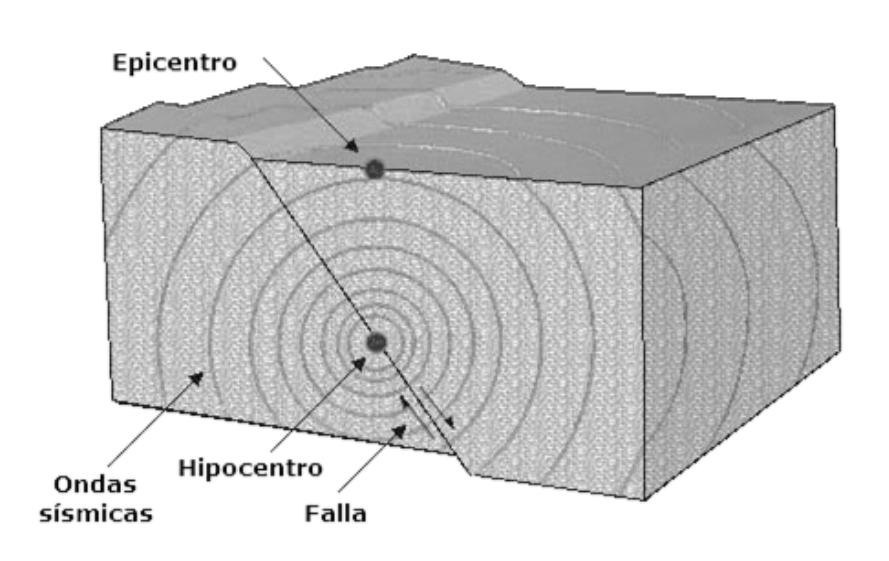

#### **3.2. ¿Cómo se producen los sismos?**

Seguro has oído decir que los sismos se originan por el rozamiento entre las placas tectónicas. Las placas tectónicas son, en términos simples, planchas rígidas de roca sólida que conforman una parte de la litósfera de la Tierra, que flotan sobre la astenosfera, que como ya hemos comentado, es una capa de roca fundida. En nuestro planeta se han identificado más de 10 placas tectónicas en la litósfera. La mayor parte de los terremotos se produce en las zonas ubicadas en los límites entre las placas, los que se clasifican en tres:

• **Límites convergentes:** En este tipo de límites una placa tiende a hundirse bajo la otra, muchas veces generando destrucción en la corteza terrestre. Uno de los casos más conocido es el de nuestro país que se ubica en la placa Sudamericana bajo la cual se hunde la placa de Nazca. Este fenómeno, también llamado subducción, afecta a las costas de Chile y Perú provocando gran número de sismos en la zona.

- **Límites transformantes:** En este tipo de límites las placas se desplazan paralelamente entre sí, pero en sentidos opuestos (movimiento antiparalelo). Esto ocurre, por ejemplo, en la falla de San Andrés, en California, Estados Unidos, área de numerosos terremotos.
- **Límites divergentes:** En este tipo de límites las placas se alejan entre sí. Esto sucede por ejemplo con las placas norteamericana y europea que se separan a una velocidad de 2,5 centímetros por año. El alejamiento entre placas da origen a la formación de nueva litósfera oceánica (volcanes y montañas submarinos).

## **3.3. Impacto de la actividad sísmica**

Hay dos maneras de medir el impacto que tienen los sismos: existen escalas de intensidad y magnitud. La intensidad de un sismo se asocia a los daños que puede producir un sismo y mientras que la magnitud se relaciona con la energía liberada.

### **3.3.1 Escala de intensidad sísmica**

En un determinado lugar, la intensidad percibida depende de la distancia a la que se encuentre del epicentro y, además, de factores como: la calidad del suelo, la calidad de la construcción, altura con respecto al suelo a la que se encuentren las personas (pisos altos o bajos en un edificio), etc. Por lo tanto, la medida de la intensidad suele ser un poco subjetiva o relativa. Es por esto que, para dos lugares a igual distancia del epicentro, un mismo sismo puede tener intensidades diferentes, lo que dependerá principalmente de calidad de la construcción (o infraestructura).

Para medir la intensidad se emplea, desde 1961, la escala modificada de Mercalli, la que consiste en una escala descriptiva de 12 grados. La tabla siguiente muestra la escala descriptiva de Mercalli. La columna de la izquierda indica el grado de intensidad y la de la derecha la descripción correspondiente.

| I. Muy débil. | Imperceptible para la mayoría.                                                                                                                                                                                                                                                                                                                                                                            |
|---------------------|--------------------------------------------------------------------------------------------------------------------------------------------------------------------------------------------------------------------------------------------------------------------------------------------------------------------------------------------------------------------------------------------------------------------|
| II. Débil.       | Perceptible sólo por algunas personas en reposo, como aquellas que se encuentran ubicadas en los pisos superiores de los edificios. Los objetos colgantes suelen oscilar.                                                                                                                                                                                                   |
| III. Leve.       | Perceptible por algunas personas dentro de los edificios, especialmente en pisos altos. Los automóviles detenidos se mueven ligeramente. Sensación semejante al paso de un camión pequeño.                                                                                                                                                                                     |
| IV. Moderado.    | Perceptible por la mayoría de las personas dentro de los edificios, por pocas personas en el exterior durante el día. Durante la noche algunas personas pueden despertarse. Perturbación en cerámica, puertas y ventanas. Las paredes suelen hacer ruido. Los automóviles detenidos se mueven con más energía. Sensación semejante al paso de un camión grande. |

|                            | Sacudida sentida casi por todo el país o zona y algunas piezas de vajilla o cristales |
|----------------------------|------------------------------------------------------------------------------------------------------------------------------------|
| V. Poco fuerte.      | de ventanas se rompen; caen objetos inestables. Se observan perturbaciones en                        |
|                            | los árboles, postes y otros objetos altos.                                                                                         |
| VI. Fuerte.             | Sacudida sentida por todo el país o zona. Algunos muebles pesados cambian de                   |
|                            | sitio y provoca daños leves, en especial en viviendas de material ligero.                                                       |
| VII. Muy fuerte.     | Ponerse de pie es difícil. Muebles dañados. Daños insignificantes en estructuras                                                   |
|                            | de buen diseño y construcción. Daños leves a moderados en estructuras                                                              |
|                            | ordinarias bien construidas. Daños considerables en estructuras pobremente                                                         |
|                            | construidas. Perceptible por personas en vehículos en movimiento.                                                                  |
|                            | Daños leves en estructuras especializadas. Daños considerables en estructuras                                                      |
|                            | ordinarias bien construidas, posibles derrumbes. Daño severo en estructuras                                                        |
| VIII. Destructivo.      | pobremente construidas. Mampostería seriamente dañada o destruida. Muebles                                                         |
|                            | completamente sacados de lugar.                                                                                                    |
|                            | Pánico generalizado. Daños considerables en estructuras especializadas, paredes                               |
| IX. Muy destructivo. | fuera de plomo. Grandes daños en importantes edificios, con derrumbes                                      |
|                            | parciales. Edificios desplazados fuera de las bases.                                                                            |
| X. Desastroso.          | Algunas estructuras de madera bien construidas quedan destruidas. La mayoría                                                       |
|                            | de las estructuras de mampostería y el marco destruido con sus bases. Vías                        |
|                            | ferroviarias dobladas.                                                                                                             |
| XI. Muy desastroso.  | Pocas estructuras de mampostería permanecen en pie. Puentes destruidos. Vías                                                       |
|                            | ferroviarias curvadas en gran medida.                                                                                              |
|                            | Destrucción total con pocos supervivientes. Los objetos saltan al aire. Los niveles               |
| XII. Catastrófico.      | y perspectivas quedan distorsionados. Imposibilidad de mantenerse en pie.                                                          |
|                            |                                                                                                                                    |

#### **3.3.2. Escalas de magnitud sísmica**

Tal como ya mencionamos, la magnitud de un movimiento sísmico mide la cantidad de energía liberada en el foco o hipocentro de este. Estas escalas entregan una medida objetiva que se efectúa con instrumental científico. Hay dos escalas muy utilizadas: la escala de Richter y la escala de Magnitud Momento, siendo esta última, la más usada en la actualidad. Su principal ventaja es que, a diferencia de la escala de Richter, esta escala no se satura con sismos de gran magnitud y es más precisa con sismos de baja magnitud.

Las escalas de magnitud son escalas logarítmicas, es decir, sus grados representan exponentes de potencias. Para que te hagas una idea, un sismo de 4 grados de magnitud no es el doble de uno de 2 grados, sino que más de 1000 veces mayor. Las escalas de magnitud se caracterizan, además, porque no tienen límite superior. En Chile en el año 1960, se registró el sismo de mayor magnitud de la historia y que tuvo lugar en la ciudad de Valdivia.

El instrumento de medición más usual es el sismógrafo y para poder estimar la ubicación del hipocentro, se ubican distintos sismógrafos en estaciones sismológicas a diferentes distancias, de modo que todos registran la misma magnitud para un sismo, pero con tiempos de detección distintos.

Podemos decir que un sismo o un terremoto tiene una única magnitud y muchas intensidades posibles.

La siguiente tabla muestra la escala de Richter con algunos de sus grados y efectos asociados, aunque no la energía liberada. Para que hagas una idea, algunas estimaciones teóricas señalan que la explosión de 1 tonelada de TNT es más o menos equivalente a un terremoto de magnitud 4.

|              | Descripción | Efectos de un sismo                                                                                                                     |  |
|--------------|-------------|-----------------------------------------------------------------------------------------------------------------------------------------|--|
| Menos de 2,0 | Micro       | Los microsismos no son perceptibles.                                                                                        |  |
| 2,0-2,9      |             | Generalmente no son perceptibles.                                                                                              |  |
| 3,0-3,9      | Menor       | Perceptibles a menudo, pero rara vez provocan daños.                                                                     |  |
| 4,0-4,9      | Ligero      | Movimiento de objetos en las habitaciones que genera ruido. Sismo significativo, pero con daño poco probable.               |  |
| 5,0-5,9      | Moderado    | Puede causar daños mayores en edificaciones débiles o mal construidas. En edificaciones bien diseñadas los daños son leves. |  |
| 6,0-6,9      | Fuerte      | Pueden llegar a destruir áreas pobladas, en hasta unos 160 kilómetros a la redonda.                                   |  |
| 7,0-7,9      | Mayor       | Puede causar serios daños en extensas zonas.                                                                                            |  |
| 8,0-8,9      |             | Puede causar graves daños en zonas de varios cientos de kilómetros.                                                |  |
| 9,0-9,9      | Grande      | Devastadores en zonas de varios miles de kilómetros.                                                                     |  |
| 10,0+        | Épico       | Nunca registrado.                                                                                                                    |  |

## **3.3.3. Tsunamis**

Los tsunamis son fenómenos en los que una serie de olas se precipitan hacia la costa. La duración de este fenómeno puede extenderse incluso por días. Su causa más común son los terremotos submarinos formados en los límites convergentes, pero también se pueden generar debido a erupciones volcánicas, deslizamientos submarinos o deslizamientos terrestres. Los efectos que puede provocar un tsunami en las costas son diversos, algunos imperceptibles y otros verdaderamente devastadores.

### **3.3.4. Erupciones volcánicas**

Un volcán es una fisura de la corteza terrestre cuya principal característica es que puede hacer expulsar magma y otro tipo de materiales, proveniente desde el interior de la Tierra. El ascenso del magma suele ocurrir de manera violenta, pero estos episodios pueden variar en intensidad y frecuencia. Según la frecuencia de actividad volcánica, estas estructuras se pueden clasificar en tres tipos: volcanes activos, inactivos o extintos.

Hay dos maneras en las que se pueden formar volcanes y una de ellas, se debe a la tectónica de placas, principalmente en los límites convergentes y divergentes.

Chile es un país sísmico y volcánico porque se ubica en el cinturón de Fuego del Pacífico, justo en el límite convergente de las placas tectónicas Nazca y Sudamericana. La interacción de dichas placas dio origen a la cordillera de Los Andes y a la formación de más de 2000 volcanes, de los cuales solo 92 han presentado algún tipo de actividad en los últimos 10 mil años.

El siguiente esquema representa las partes de un volcán:

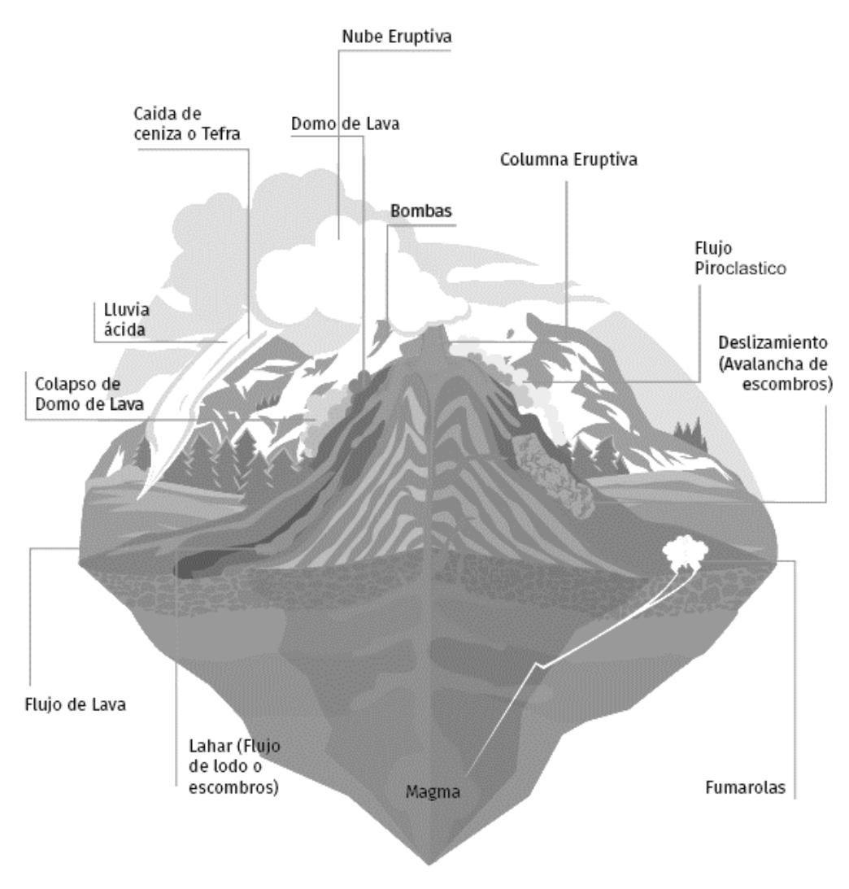

Vivimos rodeados de estímulos físicos que percibimos a través de nuestros sentidos; muchos de ellos se manifiestan como vibraciones y ondas que se propagan en el espacio, generando en nosotros sensaciones auditivas y visuales. Comprender cómo se comportan estos fenómenos y cómo interactúan con el entorno ha permitido, a lo largo de la historia, desarrollar tecnologías clave, desde las comunicaciones a distancia hasta dispositivos que facilitan nuestra vida cotidiana. Por ello, el estudio de las ondas y los fenómenos ondulatorios resulta fundamental.

## **3.4. Ejercicios propuestos:**

1. ¿Qué mide la escala de Mercalli?

D) la ocurrencia del siguiente sismo.

E) la intensidad del sismo.

| A) La ubicación del hipocentro. B) La magnitud de un sismo. C) La intensidad de un sismo. D) La ubicación del epicentro. E) La energía liberada por un sismo.                                                                                                                                                                                                                                                                                     |
|---------------------------------------------------------------------------------------------------------------------------------------------------------------------------------------------------------------------------------------------------------------------------------------------------------------------------------------------------------------------------------------------------------------------------------------------------------------|
| 2. ¿Qué se puede afirmar correctamente sobre los tipos de límites entre placas tectónicas? I) Un sismo se produce exclusivamente debido a la convergencia de los bordes de las placas al presionarse entre sí. II) Si los bordes entre las placas divergen entre sí, es posible que se forme nueva corteza oceánica. III) Una posible interacción entre placas tectónicas es que pueden deslizarse paralelamente en sentidos contrarios. |
| A) Solo I B) Solo II C) Solo III D) Solo II y III E) I, II y III                                                                                                                                                                                                                                                                                                                                                                                  |
| 3. Con respecto a la intensidad y magnitud de un movimiento sísmico se afirma que: I) La magnitud se relaciona con la cantidad de energía liberada. II) La intensidad se relaciona con los daños producidos. III) La escala de Richter mide intensidad y Mercalli mide magnitud. De estas afirmaciones es (son) correcta(s):                                                                                                                   |
| A) Solo I B) Solo II C) Solo I y II D) Solo II y III E) I, II y III                                                                                                                                                                                                                                                                                                                                                                               |
| 4. Una estación sísmica informa acerca de la magnitud y epicentro de un sismo. Con esta información es correcto aseverar que es posible estimar                                                                                                                                                                                                                                                                                                         |
| A) la duración del sismo. B) la cantidad de energía liberada por el sismo. C) la profundidad del hipocentro.                                                                                                                                                                                                                                                                                                                                            |

## **Completa el mapa conceptual**

#### **En este espacio puedes tomar notas durante la clase:**

| , |  |
|---|--|
|   |  |
|   |  |
|   |  |
|   |  |
|   |  |
|   |  |
|   |  |
|   |  |
|   |  |
|   |  |
|   |  |
|   |  |
|   |  |
|   |  |
|   |  |
|   |  |
|   |  |
|   |  |
|   |  |
|   |  |
|   |  |
|   |  |
|   |  |
|   |  |
|   |  |
|   |  |
|   |  |
|   |  |
|   |  |
|   |  |
|   |  |
|   |  |
|   |  |
|   |  |
|   |  |
|   |  |
|   |  |
|   |  |
|   |  |
|   |  |
|   |  |
|   |  |
|   |  |
|   |  |
|   |  |
|   |  |
|   |  |
|   |  |
|   |  |
|   |  |
|   |  |
|   |  |
|   |  |
|   |  |
|   |  |
|   |  |
|   |  |

# **II. ELECTRICIDAD**

Vivimos rodeados de estímulos físicos que percibimos a través de nuestros sentidos; muchos de ellos se manifiestan como vibraciones y ondas que se propagan en el espacio, generando en nosotros sensaciones auditivas y visuales. Comprender cómo se comportan estos fenómenos y cómo interactúan con el entorno ha permitido, a lo largo de la historia, desarrollar tecnologías clave, desde las comunicaciones a distancia hasta dispositivos que facilitan nuestra vida cotidiana. Por ello, el estudio de las ondas y los fenómenos ondulatorios resulta fundamental.

# **TEMA 1. CARACTERÍSTICAS DE LAS ONDAS**

## **1.1. Corriente y circuitos eléctricos**

Se denomina corriente eléctrica al desplazamiento o flujo de carga eléctrica que recorre un cierto material. Típicamente la corriente eléctrica corresponde a un flujo de electrones en un material conductor.

Por su parte, un circuito eléctrico se define como una trayectoria o camino a través del cual fluye una corriente eléctrica. La trayectoria puede estar cerrada (unido en ambos extremos), lo que lo convierte en un bucle. Es importante señalar que un circuito cerrado hace posible el flujo de corriente eléctrica. Cuando un circuito que se encuentra abierto en alguno de sus puntos, la corriente no puede circular. Veamos ahora los componentes de un circuito eléctrico.

### **1.2. Componentes básicos de un circuito eléctrico**

**Cable conductor o conductores:** Es por donde pasa la corriente eléctrica de un elemento a otro en el circuito. Algunos ejemplos son cables, protoboards y placas de circuitos impresos.

**Batería/generadores:** Son los que producen la corriente eléctrica. Por ejemplo, fuentes de alimentación, pilas y baterías.

**Resistencia/aparato eléctrico:** Son elementos que transforman la energía eléctrica en otro tipo de energía. Por ejemplo, motores, resistencias, lámparas, etc. Hay que tener en consideración que todo aparato eléctrico posee cierta resistencia interna al paso de la corriente. Además, dentro de los circuitos eléctricos domiciliarios, así como también en algunos aparatos eléctricos, existe un componente que es importante mencionar:

**Fusible:** Los fusibles son pequeños dispositivos de seguridad que forman parte de las instalaciones eléctricas, los cuales se funden cuando la corriente alcanza ciertos valores excesivos, provocando cortocircuitos y evitando que ciertos artefactos se quemen. Se conforman por una lámina o un filamento hecho de una aleación o de un metal que se destaca por presentar un punto de fusión bajo.

**Interruptor:** Elemento que permite abrir o cerrar el paso de la corriente eléctrica. Si el interruptor está abierto no circulan electrones, si está cerrado sí permite su paso.

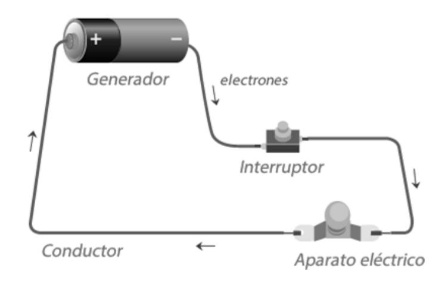

## **1.3. Corriente eléctrica**

Para cuantificar el flujo de carga en un conductor eléctrico se define la **intensidad de corriente eléctrica (I)** que corresponde a la cantidad de carga eléctrica que pasa a través del conductor en una unidad de tiempo.

La unidad de corriente eléctrica en el SI es el ampere o amperio (A). Si por un cuerpo fluye un coulomb de carga durante segundo, significa que por ese

cuerpo está fluyendo 1 ampere:

$$1 A = 1 \frac{C}{s}$$

### • **El sentido de la corriente**

Se dice que la corriente eléctrica es un flujo de electrones que viaja por un material conductor que se mueven siempre del polo (-) al polo (+) de la fuente de suministro; aunque el sentido convencional de circulación de la corriente eléctrica es a la inversa, del polo (+) al polo (-). Esta convención tiene motivos históricos y se debe a que en la época en que trató de explicar el flujo de la corriente eléctrica no se conocía la estructura del átomo (ni tampoco los electrones). En la práctica, esta convención no afecta nuestro estudio sobre de la corriente y los circuitos eléctricos.

## 1.4. Voltaje

Supongamos que se tiene una carga eléctrica ubicada en un punto A. Si esta carga se somete a una fuerza eléctrica que la hará moverse hasta otro punto B, entonces esa carga en el punto A posee energía potencial eléctrica respecto al punto B.

En términos simples, si existe movimiento de cargas es porque hay una fuerza y, por tanto, una energía que permite su movimiento.

Definimos voltaje (V) como la diferencia de energía potencial eléctrica por unidad de carga que existe entre dos puntos, lo que matemáticamente se expresa como:

$$V = \frac{Energía \ potencial}{Carga \ eléctrica}$$

La unidad de medida del voltaje en el SI es el volt o voltio (V) que equivale a:

$$1 \text{ V} = 1 \frac{\text{joule}}{\text{coulomb}} = 1 \frac{\text{J}}{\text{C}}$$

Al voltaje eléctrico también se le llama "Diferencia de potencial", "Caída de potencial" o "Tensión".

## 1.4.1 Fuentes de voltaje

Las baterías y pilas, mediante una reacción química, logran separar las cargas negativas de las positivas, las cuales quedan disponibles en sus terminales (o polos). Luego, entre los terminales de una pila existe un voltaje; por lo tanto, las pilas y baterías son fuentes de voltaje.

Cuando conectamos un circuito conductor entre los terminales de una fuente de voltaje, las cargas se mueven a través del circuito produciéndose la corriente eléctrica. + 1,5 V

Fuente de voltaje.

Símbolo

Las fuentes de voltaje más comunes son:

Pila común (doble A o triple A): 1,5 volts.

Batería de auto: 12 volts.

Enchufe del hogar: 220 volts.

## **1.5. Corriente continua y corriente alterna (CC y CA)**

Una pila (o una batería) siempre impulsará la corriente en el mismo sentido. En este caso se habla de voltaje y corriente continuos. Sin embargo, existen fuentes de voltaje que regularmente cambian la polaridad de sus terminales, produciendo que la corriente fluya alternadamente en un sentido y en otro. En este caso se habla de voltaje alterno y corriente alterna. El generador de corriente alterna es el medio más usado en el mundo para producir electricidad, por lo tanto, en nuestros enchufes disponemos de voltaje alterno. En Chile, la alternancia entre polos se realiza 50 veces por segundo, entonces en nuestro país la frecuencia de la corriente alterna es de 50 hertz.

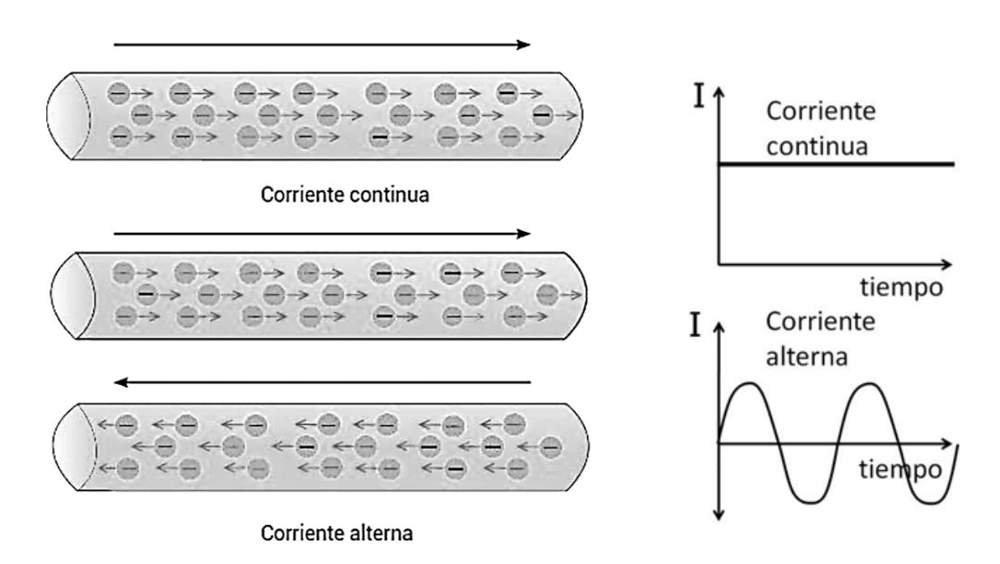

## **1.6. Resistencia eléctrica**

La intensidad de la corriente que fluye a través de un cuerpo no solo depende del voltaje que se aplique en sus extremos; sino que también depende de la dificultad que encuentran las cargas para atravesar por dicho cuerpo. El concepto que representa esta oposición al paso de las cargas por un cuerpo se llama **resistencia eléctrica (R)**.

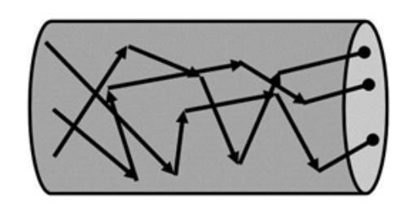

La unidad de medida en el SI para la resistencia eléctrica es el ohm, que se representa por la letra griega ómega en mayúscula: Ω.

La figura anterior representa cómo la trayectoria de los electrones se ve alterada por los continuos choques con los átomos del cuerpo, uno de los factores que afecta la resistencia de los materiales y dispositivos.

Tal como veremos a continuación, los conceptos de *resistividad* y resistencia eléctricas son conceptos diferentes pero que se relacionan entre sí; ambos afectan el flujo de la corriente en distintos niveles.

## **1.7. Características de la resistencia eléctrica**

¿De qué depende la resistencia eléctrica de un cuerpo? La dificultad que encuentran las cargas para atravesar un determinado cuerpo depende de tres factores:

- **Largo:** Mientras más largo es el cuerpo más difícil resulta recorrerlo.
- **Superficie transversal:** Mientras más estrecho es el camino de la corriente, más difícil es que circule.
- **Tipo de material:** Tal como vimos anteriormente hay materiales que permiten el paso de corriente y otros que no tanto. De hecho, no es mismo que las cargas fluyan por cobre, madera o vidrio. A este factor asociado se le llama resistividad. Por lo tanto, la resistencia de un dispositivo o un cable está determinado, entre otros factores, por la resistividad de los materiales que la componen.

Los tres factores mencionados se pueden expresar matemáticamente con la siguiente expresión para la resistencia de un conductor cilíndrico:

$$R = \rho \frac{L}{A}$$

En esta expresión R (Ω) es la resistencia del conductor, L (m) es el largo, A (m2) es la sección transversal y ρ (Ω·m) es la resistividad del material del conductor.

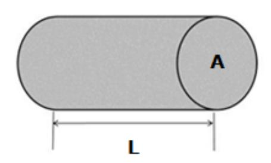

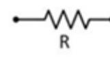

Entonces, ¿qué es la **resistividad** de un material? Corresponde a una **característica específica** de cada material. Se podría entender como la oposición a la corriente eléctrica que presenta un cuerpo de un determinado material cuyas dimensiones son 1 metro de largo y 1 2 de sección. La tabla muestra la resistividad de algunos materiales. Notemos que el material de menor resistividad será un mejor conductor de electricidad. Por ejemplo, el cobre es mejor conductor que el oro.

| MATERIAL | RESISTIVIDAD A 20º C (Ωm) |
|----------|------------------------------|
| Plata    | 1,59·10 -8        |
| Cobre    | 1,71·10 -8        |
| Oro      | 2,35·10 -8        |
| Aluminio | 2,82·10 -8        |
| Vidrio   | $\approx 10^{12}$            |

## **1.7.1. Buenos conductores y aislantes**

Un **buen conductor** es aquel cuerpo cuya resistencia es muy baja y que, por lo tanto, deja pasar con facilidad la corriente. Considerando la expresión de la resistencia, un buen conductor debe ser lo más corto posible, lo más grueso posible y de un material de baja resistividad, por ejemplo, un metal. Por otra parte, a veces se requiere que un elemento no deje pasar la corriente y, por lo tanto, debe tener una resistencia eléctrica muy alta.

En este caso se habla de un **buen aislante**. Algunos buenos aislantes son el plástico, vidrio o cerámica, que se caracterizan por tener una altísima resistividad. También suelen llamarse dieléctricos.

Tal como ya te hemos anticipado, ambos tipos de materiales son relevantes en la construcción de un circuito eléctrico.

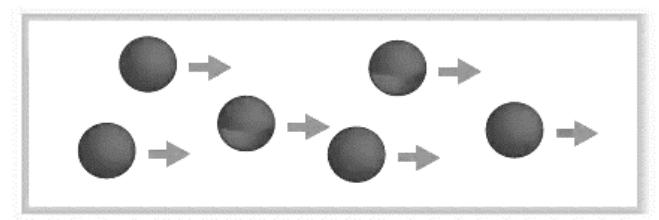

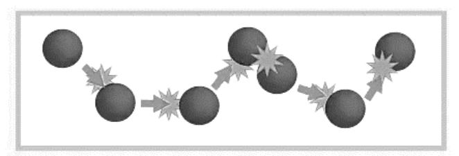

Te invitamos a escanear el código para poder revisar cómo varía la resistencia de un cable en función de las variables de resistividad, largo y sección transversal

## **1.8 Ejercicios propuestos**

- 1. ¿Cuál de los siguientes parámetros físicos influye directamente en la intensidad de corriente que pasa por un conductor?
- A) La carga que pasa por el conductor.
- B) La sección transversal del conductor.
- C) El material del cable conductor.
- D) El largo del cable conductor.
- 2. "Se conoce como la cantidad de carga que pasa por la sección transversal de un conductor durante un intervalo de tiempo. En un circuito eléctrico esta magnitud depende directamente del voltaje entregado por la fuente e inversamente de la resistencia total del circuito". ¿A que concepto físico se refiere el enunciado?
- A) Resistividad
- B) Caída de potencial
- C) Corriente eléctrica
- D) Fuerza electroestática
- 3. Se tienen un circuito compuesto por una fuente de voltaje y una resistencia variable. Si se duplica el voltaje de la fuente y se disminuye a la mitad la resistencia, ¿cómo cambia la intensidad de corriente?
- A) Se duplica.
- B) Se cuadruplica.
- C) Se reduce a la mitad.
- D) Se reduce a la cuarta parte.

## **Completa el mapa conceptual**

#### **En este espacio puedes tomar notas durante la clase:**

| ,        |    |   |
|----------|-------|------|
|          |    |   |
|          |    |   |
|          |    |   |
| <b> </b> |    |   |
| <b> </b> |    |   |
| <b> </b> |    |   |
| ļ        |    |   |
| ļ        |    |   |
| ļ        |    |   |
|          |    |   |
| ļ        |    |   |
| ļ        |    |   |
| ļ        |    |   |
| <b> </b> |    |   |
| ļ        |    |   |
| ļ        |    |   |
|          |    |   |
|          |    |   |
|          |  · |   |
|          |    |   |
|          |    |   |
|          |    |   |
|          |    |   |
| <b> </b> |    |   |
| <b> </b> |    |   |
| <b> </b> |    |   |
| <b> </b> |    |   |
|          |    |   |
| <b> </b> |    |   |
| ļ        |    |   |
| ļ        |    |   |
| ļ        |    |   |
| ļ        |    |   |
| ļ        |    |   |
| ļ        |    |   |
| ļ        |    |   |
|          |    |   |
|          |    |   |
|          |    |   |
|          |       |      |
|          |       |   |
|          |       |   |
| ļ        |       |      |
|          |       |   |
|          |    |   |
|          |    |   |
| <b> </b> |    |   |
|          |    |   |
|          |    |   |
|          |    |   |
| ļ        |    |   |
| ļ        |    |   |
| ļ        |    |   |
| İ        |       |      |

## **TEMA 2. LEY DE OHM Y RESISTENCIA EQUIVALENTE**

Cuando se conectan varios elementos eléctricos entre sí para obtener un determinado efecto, se está en presencia de un circuito eléctrico. Los **circuitos eléctricos son la base de los adelantos tecnológicos modernos**, desde el alumbrado de una casa y los electrodomésticos, hasta los celulares y computadores que se construyen a partir de microcircuitos eléctricos. Todo lo anterior ha sido posible gracias a la capacidad de entender y cuantificar lo que ocurre en cada circuito eléctrico.

En este capítulo aplicaremos los conceptos de corriente, voltaje, resistencia y ley de Ohm para resolver los circuitos eléctricos básicos: el circuito en serie, en paralelo y mixto.

## **2.1. Ley de Ohm**

El científico alemán Georg Ohm descubrió que, cuanto más voltaje se aplica a una resistencia, más corriente circula por ella. Georg llegó a mostrar experimentalmente que **ambas variables son directamente proporcionales**, lo que le permitió enunciar matemáticamente la llamada Ley de Ohm:

$$V = I \cdot R$$

Si una resistencia cumple con la Ley de Ohm, entonces de la expresión se cumple que la intensidad de corriente es directamente proporcional al voltaje aplicado:

$$R = \frac{V}{I}$$

Recordemos que las unidades del SI son volt para el voltaje (V), ampere para la corriente (I) y ohm para la resistencia.

## **2.1.1. Aplicación de la ley de Ohm: el circuito eléctrico más simple**

El circuito físico de la izquierda se representa simbólicamente como el circuito de la derecha. Como el voltaje de la fuente se aplica directamente entre ambos extremos de la resistencia, podemos obtener la corriente mediante la ley de Ohm.

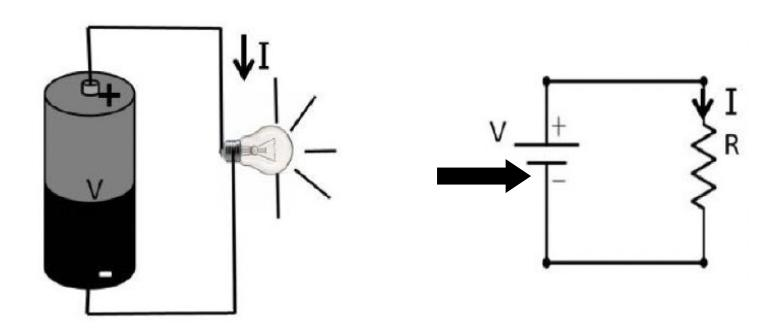

Si la fuente es de 12 V y la resistencia mide 6 Ω, entonces es posible determinar la corriente que circula por la resistencia:

$$V = I \cdot R \rightarrow 12 V = I \cdot 6 \Omega$$
  
$$I = \frac{V}{R} = 2 A$$

En general, para mejor una comprensión y visualización del circuito, es conveniente pensar que: "la corriente fluye a través de los elementos del circuito" y "el voltaje se aplica entre dos puntos".

## **2.1.2. Resolución de circuitos eléctricos**

Resolver un circuito consiste en llegar a conocer una o más variables que sean de interés (voltaje, corriente, potencia, energía, etc.) a partir de la información disponible.

Para resolver circuitos como los que aparecen es la PAES, basta con usar el **método de reducción a resistencia equivalente.** Esta estrategia permite **simplificar al máximo un circuito eléctrico**  independiente de la cantidad de dispositivos que lo compongan y, junto a la Ley de Ohm, es posible conocer lo que ocurre en cada componente.

### **Método de reducción de circuitos**

- 1. Reduzca el circuito de resistencias a una sola resistencia equivalente.
- 2. Resuelva el circuito simplificado aplicando la ley de Ohm.
- 3. Con la información obtenida, vuelva al circuito original y determine las variables que se requieran.

## **2.2. Resistencia eléctrica equivalente**

Se llama resistencia equivalente a una única resistencia que es capaz de producir el mismo efecto que un conjunto de resistencias.

En la figura, la resistencia Re es equivalente al conjunto de las 5 resistencias de arriba, si con el mismo voltaje aplicado V se produce la misma corriente I.

Entonces el método de resolución de circuitos propuesto requiere que sepamos determinar la resistencia equivalente de los circuitos básicos: A continuación, estudiaremos los circuitos en serie, en paralelo y los mixtos.

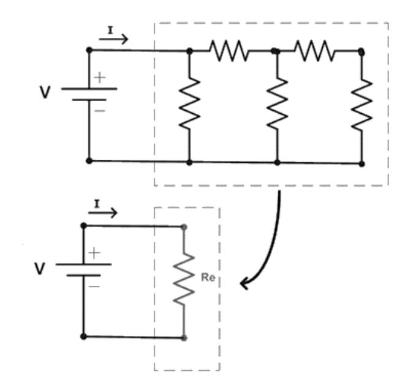

## **2.2.1. Circuito serie (conexión en serie)**

Diremos que dos o más elementos eléctricos están conectados en serie cuando la forma de conectarlos obliga a que la corriente sea igual para todos o, dicho de otro modo, cuando la corriente que circula sigue un mismo camino al pasar por dichas resistencias. Para el circuito de la derecha se cumple que:

$$\mathbf{I} = \mathbf{I_1} = \mathbf{I_2} = \mathbf{I_3}$$

En este tipo de circuitos el voltaje de la fuente queda aplicado al conjunto de las resistencias, por lo que se debe repartir entre ellas. Así, en el circuito de la derecha se cumple que:

$$V=V_1+V_2+V_3$$

$$\mathbf{R}_{\mathbf{e}} = \mathbf{R}_1 + \mathbf{R}_2 + \mathbf{R}_3$$

#### • **Ejercicio resuelto:**

Con los datos de la figura es posible determinar la corriente y el voltaje en cada uno de los elementos.

Primero usamos el método de reducción a resistencia equivalente y se obtienen que:

$$R_e = 5 \Omega + 10 \Omega = 15 \Omega$$

Ahora, aplicando la ley de Ohm se puede calcular la intensidad de corriente del circuito:

$$I = \frac{V}{R_e} = \frac{30 \text{ V}}{15 \Omega} = 2 \text{ A}$$

Notemos que en cada resistencia la corriente que circula es de 2 A.

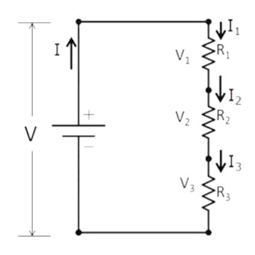

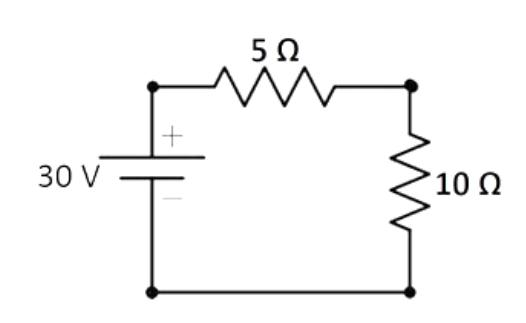

## 2.2.2. Circuito en paralelo (Conexión en paralelo)

Diremos que dos o más elementos eléctricos están conectados en paralelo cuando la forma de conectarlos implica que el voltaje entregado es igual para cada componente. En la figura se aprecia que todos los elementos comparten sus dos terminales, por lo tanto, se les aplica el mismo voltaje entre sus extremos. Para el circuito de la imagen se tiene que:

$$\mathbf{V} = \mathbf{V_1} = \mathbf{V_2} = \mathbf{V_3}$$

Por su parte, la corriente que provee la fuente se debe repartir entre las tres resistencias:

$$\mathbf{I} = \mathbf{I_1} + \mathbf{I_2} + \mathbf{I_3}$$

En una conexión en paralelo, el inverso de la resistencia equivalente es igual a la suma de los inversos de cada resistencia:

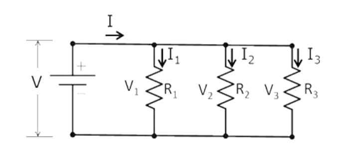

$$\frac{1}{R_e} = \frac{1}{R_1} + \frac{1}{R_2} + \frac{1}{R_3}$$

#### • Ejercicio resuelto:

Con los datos de la figura es posible determinar la corriente y el voltaje en cada uno de los elementos.

Como los 12 V de la fuente quedan aplicados directamente a cada resistencia podemos calcular la corriente por cada una de ellas, aplicando la ley de Ohm:

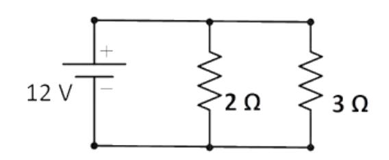

$$I_2 = \frac{V}{R_2} = \frac{12 \text{ V}}{2 \Omega} = 6 \text{ A}; I_3 = \frac{V}{R_3} = \frac{12 \text{ V}}{3 \Omega} = 4 \text{ A}$$

En este circuito se cumple que la corriente que circula por la fuente es la suma de la corriente de cada resistencia, es decir 10 A. Además, el voltaje es el mismo para los tres elementos, es decir, 12 V.

Si bien se analizó en el ejemplo un circuito con dos resistencias, esta fórmula puede ser utilizada para una cantidad de resistencias "n" que posea el circuito.

De este modo, en un circuito con n resistencias conectadas en serie, la resistencia equivalente se puede expresar como:

$$R_e = R_1 + R_2 + R_3 + \dots + R_n$$

Y en un circuito con n resistencias conectadas en paralelo, la resistencia equivalente se puede expresar como:

$$\frac{1}{R_e} = \frac{1}{R_1} + \frac{1}{R_2} + \frac{1}{R_3} + \dots + \frac{1}{R_n}$$

• **Circuitos en paralelo e instalación eléctrica domiciliaria.**

El esquema eléctrico de la figura representa la forma en que se conectan los aparatos eléctricos en nuestras casas. Una de las ventajas de este tipo de conexión es que, por ejemplo, si se quema una ampolleta, la corriente sigue teniendo caminos posibles para circular. Esto permite que los demás artefactos conectados a la corriente eléctrica sigan funcionando. Otra característica es que, a medida que aumenta el número de artefactos que se conectan a la red, disminuye la resistencia equivalente del circuito, ¿puedes explicar por qué?

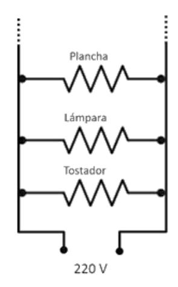

Tal como se ve en la imagen, en Chile los aparatos eléctricos conectados a la red doméstica reciben todos el mismo voltaje de 220 V. Sin embargo, en otros países la red doméstica entrega un voltaje de 110 V.

### **2.2.3. Circuito mixto**

Cuando un circuito presenta una mezcla de conexiones en paralelo y serie, se llama circuito mixto. Para resolver este tipo de circuitos se debe aplicar el método de la resistencia equivalente, teniendo el cuidado de ir reduciendo cada parte del circuito paso a paso, según sea serie o paralelo.

Respondamos la siguiente pregunta: ¿cuál es el voltaje en las resistencias de 2 Ω?

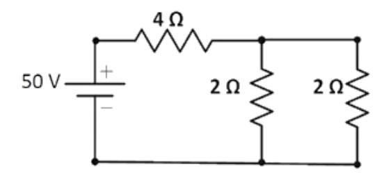

#### **Procedimiento:**

- 1. Calcular la resistencia equivalente: primero se reduce la rama paralela, al hacerlo, notamos que esa  $R_e$  queda en serie con la de 4  $\Omega$ .
- 2. Calcular la corriente en la fuente del circuito simplificado.
- 3. Una vez conocida la corriente en la fuente, se puede determinar el resto de las variables. Notemos que:

Al calcular resistencia equivalente entre las resistencias en paralelo de 2  $\Omega$  se obtiene:

$$\frac{1}{R_e} = \frac{1}{2\Omega} + \frac{1}{2\Omega} = 1 \quad \rightarrow \quad R_e = 1\Omega$$

Calculamos ahora la resistencia equivalente total del circuito:

$$R_e = 1 \Omega + 4 \Omega = 5\Omega$$

Aplicando la ley de Ohm se puede calcular la intensidad de corriente total del circuito:

$$I = \frac{V}{R} = \frac{50 \text{ V}}{5.0} = 10 \text{ A}$$

Notemos que esta corriente es igual para la resistencia equivalente 1 y la resistencia de 4  $\Omega$ , ya que están conectadas en serie (un solo camino para la corriente).

Con la corriente obtenida en conjunto, aplicando nuevamente la ley de Ohm se puede obtener el voltaje para la resistencia equivalente:

$$V = I \cdot R_e = 10 \cdot 1 = 10 V$$

Por último, al calculamos la intensidad de corriente para las dos resistencias de 2  $\Omega$ , para ello, sabemos que el voltaje es igual para ambas. Ya que están conectadas en paralelo a la fuente.

$$I = \frac{V}{R} = \frac{10 \text{ V}}{2 \Omega} = 5 \text{ A}$$

## **2.3. Medición de corriente y voltaje**

Con las herramientas anteriores es posible comprender lo que ocurre en cada elemento que forma parte de un circuito eléctrico. Sin embargo, en la vida real se suelen usar medidores de corriente y voltaje:

### • **Medición de corriente**

Para medir la corriente eléctrica se usa un instrumento llamado **amperímetro**. Este instrumento se debe conectar en serie con la corriente que se desea medir. Un buen amperímetro **tiene una resistencia muy baja para no alterar el circuito** a medir. Al amperímetro ideal se le asigna resistencia cero.

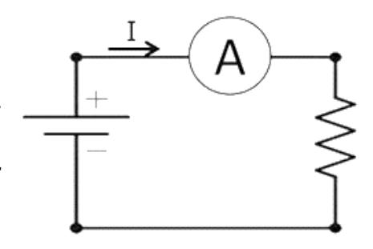

En la figura, el amperímetro, representado por una A dentro de un círculo, está midiendo la corriente que pasa por la resistencia (que en este caso es la misma corriente que pasa por la fuente).

## • **Medición de voltaje**

Para medir el voltaje se usa un instrumento llamado **voltímetro**. Este instrumento se debe conectar en paralelo con el voltaje que se desea medir. Un buen voltímetro **tiene una resistencia muy alta, para que la corriente que pase por él sea muy pequeña**. Al voltímetro ideal se le asigna resistencia infinita.

En la figura, el voltímetro, representado por una V dentro de un círculo, está midiendo el voltaje en la resistencia (que en este caso también se corresponde con el voltaje de la fuente).

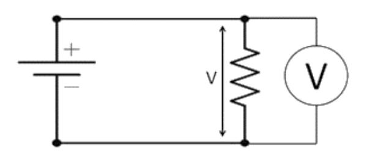

## **2.4 Ejercicios propuestos**

1. Tomando en cuenta que todas las resistencias de los circuitos son idénticas entre si ¿cuál de los siguientes circuitos eléctricos posee menor resistencia total?

A) B)

C) D)

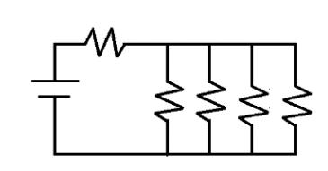

2. Con los datos entregados en la imagen, ¿cuál es la resistencia equivalente para el circuito?

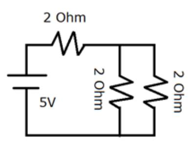

- A) 1 Ω
- B) 2 Ω
- C) 3 Ω
- D) 4 Ω
- E) 5 Ω

3. Una pila del tipo AA señala en sus especificaciones que es de 1,5 V. ¿Qué significa lo anterior?

- A) Que la energía total acumulada en la pila es de 1,5 joule.
- B) Que la energía máxima que puede proporcionar la pila es de 1,5 joule.
- C) Que la energía por unidad de carga es de 1,5 joule.
- D) Que la energía por cada electrón es de 1,5 joule.
- E) Que la energía continua que produce la pila es de 1,5 joule.

4. El siguiente circuito está compuesto por una batería V y tres resistencias eléctricas, tal como se representa en la siguiente figura:

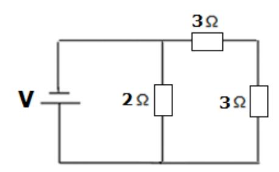

Si el voltaje de la resistencia de 2 Ω es de 12 V, ¿cuál es el valor de la intensidad de corriente que pasa por las resistencias de 3 Ω?

- A) 0,2 A
- B) 0,5 A
- C) 1,0 A
- D) 2,0 A
- E) 4,0 A

5. Un grupo de estudiantes desean comprobar cómo varía la intensidad de corriente total que pasa por un circuito paralelo, a medida que se le van agregando resistencias al circuito. Para esto arman un circuito con una fuente de poder con voltaje fijo, la que se conecta en serie con un amperímetro y también a un conjunto de resistencias conectadas en paralelo. Los estudiantes comienzan conectando dos resistencias y van añadiendo resistencias una en una, midiendo en cada configuración la intensidad de corriente total del circuito. Según esta descripción, ¿cuáles son las variables dependiente, independiente y controlada, respectivamente?

- A) El voltaje de la fuente, la intensidad de corriente, la cantidad de resistencias.
- B) La intensidad de corriente, el tipo de resistencias utilizadas, la caída de potencial en las resistencias.
- C) La intensidad de corriente, el voltaje entregado por la fuente, la cantidad de resistencias utilizadas.
- D) La intensidad de corriente, la cantidad de resistencias conectadas, el voltaje entregado por la fuente.

## **Completa el mapa conceptual**

### **En este espacio puedes tomar notas durante la clase:**

|      |  |
|------------|--|
|            |  |
|            |  |
|            |  |
|            |  |
|            |  |
|            |  |
|            |  |
|            |  |
|            |  |
|            |  |
|            |  |
|            |  |
|            |  |
|            |  |
|            |  |
|            |  |
|            |  |
|            |  |
|            |  |
|            |  |
|            |  |
|            |  |
|            |  |
|            |  |
|            |  |
|            |  |
|            |  |
|            |  |
|            |  |
|            |  |
|            |  |
|            |  |
|            |  |
|            |  |
|            |  |
|            |  |
|            |  |
|            |  |
|            |  |
|            |  |
|            |  |
|            |  |
|            |  |
|            |  |
|            |  |
|            |  |
|            |  |
|            |  |
|            |  |
|            |  |
|            |  |
|            |  |
|            |  |

# TEMA 3. RED DOMICILIARIA Y POTENCIA ELÉCTRICA

#### 3.1. El consumo residencial

Así como las compañías de agua potable cobran los metros cúbicos de agua consumidos, las compañías eléctricas cobran la energía eléctrica consumida.

Sin embargo, el joule es una unidad muy pequeña para las cantidades de energías utilizadas en los hogares, por lo es usual que en el mercado eléctrico se hable de kilowatt-hora (KWh) o incluso megawatt-hora (MWh).

Para poder entender la relación entre estas dos unidades de medida es necesario definir dos conceptos: potencia y energía eléctrica.

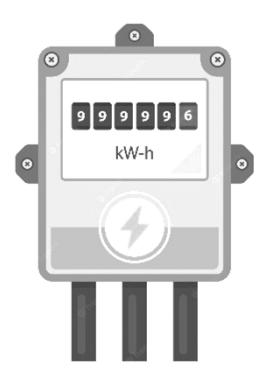

#### 3.2. Potencia eléctrica

La energía eléctrica, como forma de energía, cumple con la ley de conservación, es decir, "no se crea ni se destruye, solo se transforma".

Por otra parte, la potencia de un aparato eléctrico se define como la cantidad de energía que transforma por unidad de tiempo. Se puede entender como la rapidez con que transforma la energía eléctrica en otro tipo de energía, ya sea calórica, mecánica o lumínica. Si se trata de un aparato que consume energía eléctrica, por ejemplo, una resistencia, la potencia eléctrica corresponde a la energía que este consume por unidad de tiempo. Si el aparato produce energía eléctrica, por ejemplo, una fuente, la potencia sería la energía generada por unidad de tiempo.

La unidad de medida para la potencia en el SI es el watt (W) que corresponde a 1 joule por segundo:

$$Potencia = \frac{Energía}{tiempo} \rightarrow watt = \frac{joule}{segundo}$$

Ahora, considerando las definiciones de voltaje y corriente, notemos que se tiene:

$$Voltaje = \frac{Energía}{Carga}$$
 
$$Corriente = \frac{Carga}{tiempo}$$

Luego, se deduce que la potencia eléctrica se puede expresar como la multiplicación de ambas variables. Así, la potencia eléctrica de un circuito eléctrico está dada matemáticamente por la expresión:

$$P = V \cdot I$$

Esta expresión también se puede aplicar a cualquier tipo de componente eléctrico, ya sea fuente, resistencia o cualquier otro.

En el caso particular de una resistencia, podemos relacionar la potencia con la ley de Ohm, obteniéndose lo siguiente:

$$P = V \cdot I = (I \cdot R) I \rightarrow P = I^2 R$$

$$P = V \cdot I = V \cdot \left(\frac{V}{R}\right) \rightarrow P = \frac{V^2}{R}$$

## **3.2.1. Cálculo de potencia eléctrica en resistencias**

Para obtener la potencia en resistencias, ¿qué expresión es más conveniente? ¿P = I 2R ó P = V2 R ?

Aunque ambas fórmulas son válidas para resistencias, según el tipo de circuito que tenemos puede resultar más cómoda una u otra expresión: en el caso de circuitos en serie, suele ser más conveniente usar la expresión que depende de la corriente ya que, en ese tipo de conexiones, por todas las resistencias pasa la misma intensidad de corriente. De modo análogo, en el caso de los circuitos en paralelo, conviene más usar la expresión que depende del voltaje ya que, en ese tipo de conexiones, todas las resistencias tienen el mismo voltaje.

**Ejemplo**: Para los circuitos A y B de la figura, ordene las resistencias de menor a mayor potencia disipada.

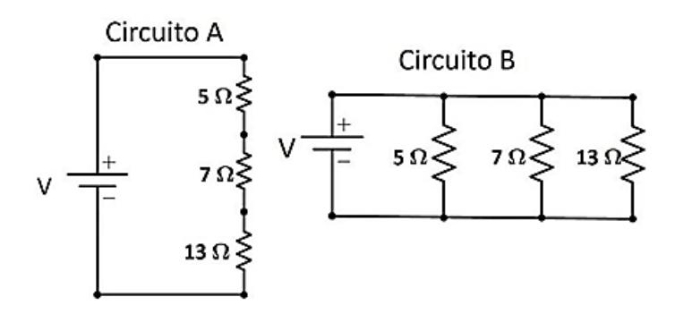

**Circuito A:** En este caso tenemos un circuito en serie, por lo tanto, en todas las resistencias circula corriente con la misma intensidad. Luego, se obtiene:

$$P_5 = I^2 R_5 = 5 I^2$$

$$P_7 = I^2 R_7 = 7 I^2$$

$$P_{13} = I^2 R_{13} = 13 I^2$$

Como la intensidad de corrientes es la misma para todas entonces P5 < P7 < P13.

**Circuito B**: En este caso todas las resistencias están sometidas al mismo voltaje, luego es conveniente calcular la potencia con V2 R .

$$P_5 = \frac{V^2}{R_5} = \frac{V^2}{5}$$

$$P_7 = \frac{V^2}{R_7} = \frac{V^2}{7}$$

$$P_{13} = \frac{V^2}{R_{13}} = \frac{V^2}{13}$$

Por lo tanto, P13 < P7 < P5

## **3.2.2. El efecto Joule**

Seguro te habrás dado cuenta de que algunas ampolletas (que convierten energía eléctrica en energía lumínica) liberan energía calórica en el proceso y aumentan su temperatura. Esto ocurre también con tu celular cuando se usa por un período de tiempo prolongado. En general, todos los aparatos eléctricos que transforman la energía eléctrica en su funcionamiento aumentan su temperatura. Este fenómeno se conoce como efecto Joule y fue descrito por primera vez por el científico inglés James P. Joule, pionero en el desarrollo del concepto de energía, quien descubrió que las resistencias eléctricas transforman la energía eléctrica en calor.

En general se puede afirmar lo siguiente:

Todos los aparatos eléctricos que generan calor se pueden representar como resistencias eléctricas (plancha, tostador, estufa, etc.)

Como todo elemento presenta resistencia eléctrica, ya sea en mayor o menor cantidad, en todo elemento se genera calor ante el paso de la corriente. Cuando este calor no es deseado, suele llamarse "pérdidas por efecto Joule" y la potencia disipada se puede calcular con la expresión:

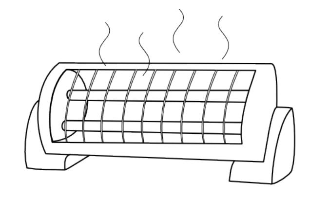

$$P = I^2 R.$$

Esta es la razón por la que se calienta la superficie de tu notebook, los cables de las instalaciones eléctricas, la procesadora de alimentos luego de largo tiempo de uso, el filamento de una ampolleta incandescente y la resistencia de una plancha. En relación con este calor transferido, existen distintos aparatos de seguridad en los circuitos eléctricos domiciliarios o dentro de los mismos circuitos de los aparatos eléctricos:

## **3.2.3 Importancia del fusible**

Si por accidente un aparato eléctrico falla y quedan los terminales de la fuente en contacto entre sí, se producirá una gran corriente la que generará mucho calor. Esto en la jerga eléctrica también se le llama un "cortocircuito" y en el caso de un aparato eléctrico implica que este deje de funcionar. Como medida de seguridad toda instalación eléctrica debe tener una protección ante cortocircuitos, para así evitar que el calor generado produzca un incendio.

El fusible es, en términos simples, un alambre delgado que, aprovechando el efecto Joule, se ubica para que se funda ante una intensidad de corriente muy alta y, así, interrumpir rápida y automáticamente el paso de la corriente potencialmente peligrosa.

Como se ve en la figura, un fusible de 20 A se ubica entre la fuente y el aparato o instalación a proteger. Por ejemplo, un cortocircuito en la plancha hace que la corriente en el fusible supere los 20 A y automáticamente se funde, desconectando el circuito. ¡Es una molestia que se te corte la energía eléctrica! Pero evita que se incendie tu casa.

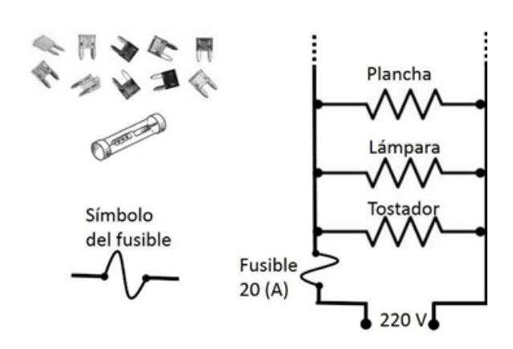

Por otro lado, existe otro elemento diseñado para disminuir el peligro de descargas eléctricas que vienen de los aparatos eléctricos y que pueden pasar a los seres vivos, a esto se le conoce como cable a tierra.

### **3.2.4 Cable a tierra**

¿Te has preguntado por qué el enchufe de algunos aparatos eléctricos tiene tres terminales (o "patas") y otros solo dos? Para entender esto observa la figura derecha. Una pequeña esfera cargada se conecta a una esfera gigante (la Tierra).

Sabemos que las cargas de igual signo se repelen y desean estar lo más lejos posible una de otra. Si lo piensas, en un objeto pequeño no hay suficiente espacio, de modo que cuando se produce una conexión a tierra disponen de una esfera gigante para alejarse.

De este modo, las cargas fluirán a la Tierra y la esfera pequeña queda descargada (figura derecha). En definitiva, la Tierra descarga los objetos que se conectan a ella.

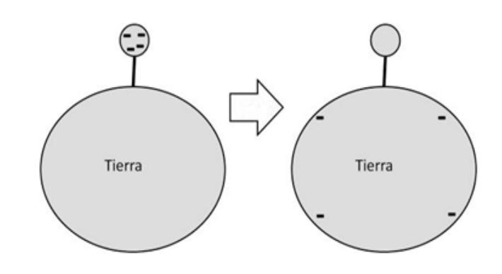

De aquí se tiene la siguiente regla de seguridad:

"toda superficie de un equipo eléctrico que pudiera ser tocada por una persona se conecta a Tierra para asegurar que siempre esté descargada, y así evitar toda posibilidad de electrocución". Hoy en día, la posición central de los tomacorrientes tiene un cable que va a Tierra.

## **3.3. Energía eléctrica y cuenta de la luz eléctrica**

Una vez conocida la potencia eléctrica de un aparato es fácil determinar cuánta energía consume. Basta multiplicar la potencia por el tiempo durante el cual estuvo funcionando el aparato:

$$E = P \cdot t$$

La unidad de medida de la energía en el SI es el joule, que corresponde a la energía que consume un aparato de 1 watt de potencia funcionando durante 1 segundo. Tal como ya mencionamos, para la cantidad de consumo energético de un hogar se usa como unidad de medida el kilowatt-hora (KWh), que es la energía que consume un aparato de 1 kilowatt de potencia funcionando durante 1 hora.

comparación con la energía promedio que debiera consumir dicho aparato.

En el mundo, la gran mayoría de los aparatos eléctricos deben traer una etiqueta de consumo, en la cual se describe la cantidad de energía que consumen junto a una

## **3.4. Métodos de transformación de energía eléctrica**

El diagrama en bloque sintetiza la forma en que se procesa actualmente la energía eléctrica que consumismos a diario. Se distinguen las etapas de **generación**, **transmisión** y **consumo**.

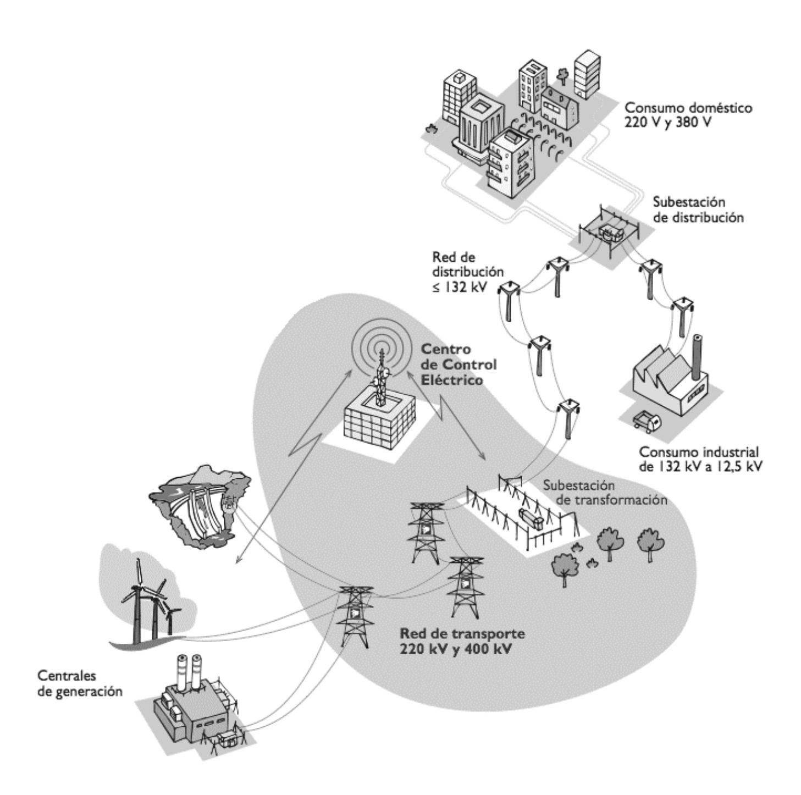

## **3.4.1. Generación de energía eléctrica**

Como sabemos la energía no se crea de la nada. Lo que hacen las centrales generadoras es transformar algún tipo de energía en energía eléctrica. Por ejemplo, las centrales hidráulicas utilizan la energía potencial del agua (como un lago a gran altura); las centrales térmicas queman algún combustible para lograr vapor a gran presión y este vapor hace girar las turbinas que hacen girar el generador eléctrico. A continuación, veremos cómo funcionan, en términos generales, algunos tipos de centrales eléctricas.

### **Tipos de centrales eléctricas**

- 1. **Hídricas:** Su funcionamiento consta principalmente del movimiento de turbinas que se accionan con el paso del agua que cae desde grandes alturas o a gran presión, es decir, aprovechan la energía del movimiento del agua (energía cinética) para transformarla en energía eléctrica.
- 2. **Nucleares:** La generación de energía eléctrica se logra mediante la transformación previa de la energía nuclear. Estas centrales funcionan a través de la fisión del uranio que libera gran cantidad de energía y, más tarde, vapor de agua para mover grandes turbinas; es decir, también se obtiene energía eléctrica mediante la transformación de energía cinética. En términos simples, los reactores nucleares funcionan como un gran hervidor de agua, impulsado por la energía que se libera de la fisión nuclear.
- 3. **Mareomotrices:** En este tipo de centrales son los cambios en las mareas y la retención de grandes masas de agua las que mueven grandes turbinas generadoras, las que convierten la energía del movimiento en electricidad.
- 4. **Geotérmicas:** Las altas temperaturas que existen en el interior del globo terráqueo producen un vapor natural a 200 °C aproximadamente. Esta energía térmica acciona directamente las turbinas de vapor de las centrales geotérmicas.
- 5. **Eólicas:** Estas centrales utilizan a los vientos o corrientes de aire para producir energía eléctrica a través de turbinas, nuevamente se obtiene energía eléctrica a través de transformación de energía cinética.
- 6. **Solares o heliotérmicas:** En un primer procedimiento, la energía luminosa y térmica proveniente del Sol, en forma de radiación electromagnética, es transformada en energía eléctrica mediante el empleo de celdas.
- 7. **Hidrotérmicas:** Estas centrales producen la energía a través del aprovechamiento de la energía térmica de grandes extensiones de agua. El lugar de emplazamiento de estas centrales suele ser en los mares y océanos.

- 8. **Térmicas:** La energía eléctrica surge como consecuencia de la energía térmica de combustión. La quema de combustible produce vapor de agua producido en una caldera posibilita el funcionamiento de las turbinas de vapor al hacer girar el eje de dichas máquinas.
- 9. **Central de biomasa:** La energía de biomasa es simplemente electricidad obtenida de la quema de productos de desecho orgánicos renovables. Cuando se quema el combustible orgánico se libera energía en forma de calor y genera vapor. La energía producida a partir del vapor se dirige a través de tuberías que hacen funcionar las turbinas.

A continuación, te mostramos como se clasifican los distintos tipos de centrales:

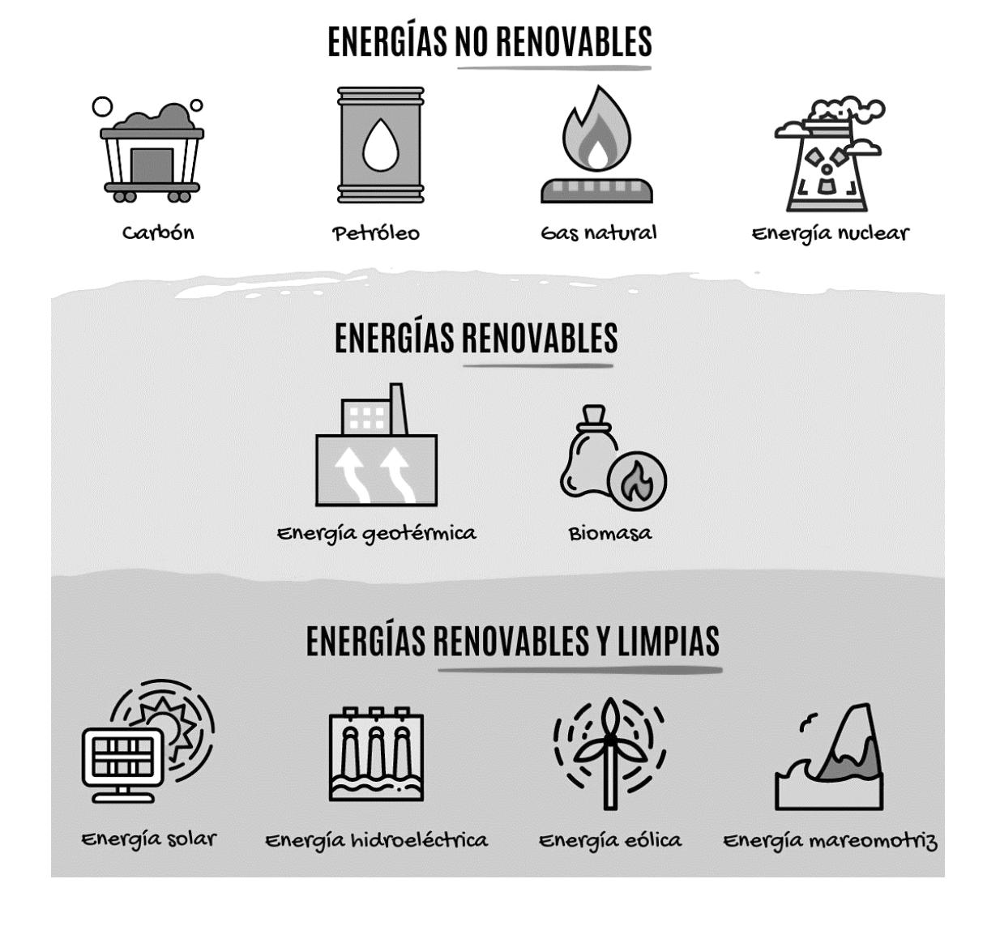

## **3.4.2. Transmisión de energía eléctrica**

La energía eléctrica debe ser transmitida grandes distancias desde las centrales generadoras hasta los centros consumidores (ciudades, industrias, mineras, etc.)

Para minimizar las pérdidas de transmisión en los conductores (por efecto Joule) la corriente se envía con alta tensión. Un voltaje típico de transmisión es 220 000 V.

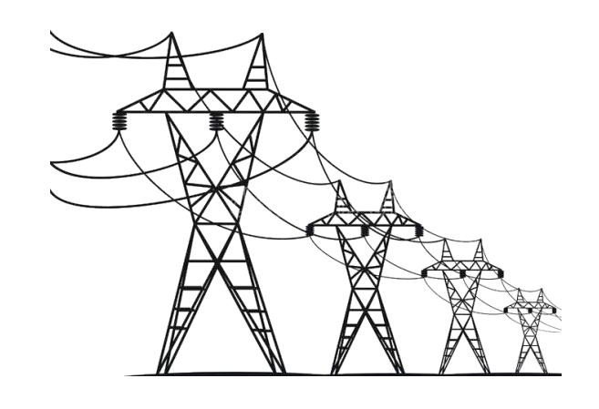

Al llegar a los consumidores se baja el voltaje hasta llegar a los 220 V de nuestras casas. Las subidas y bajadas de voltaje se realizan mediante transformadores.

Por otra parte, en Chile las centrales generadoras de electricidad y la red de consumo están conectados a un gran sistema eléctrico, de este modo, si falla una central, las demás la respaldan instantáneamente. Este sistema se denomina "Sistema Interconectado" que vendría a ser un enorme circuito eléctrico con múltiples fuentes y múltiples resistencias.

## **3.4.3. Consumo de energía eléctrica**

La energía eléctrica puede ser usada con muchos fines:

- Para generar calor y, por ejemplo, para calefaccionar un hogar o para hacer funcionar electrodomésticos como el hervidor, microondas, plancha, etc.
- Para generar luz, ya sea con ampolletas incandescentes, tubo fluorescente o LED.
- Para producir movimiento. El aparato que transforma la energía eléctrica en movimiento (energía cinética) se llama motor eléctrico, en general los motores se acoplan con otros dispositivos para producir el efecto deseado, ya sea en un ascensor, un auto eléctrico, taladro, lavadora, ventilador, entre otros.
- Usos en electrónica: como radio, TV, computadores, celulares, etc.

### **Ventajas de la energía eléctrica**

Supongamos por un momento que una familia decide dejar de usar energía eléctrica y, a cambio de ella, se compra una camionada de carbón al mes que le depositan en el patio de su casa. Imaginemos que con este carbón podría suplir sus necesidades energéticas sin problema, pero ¿qué consecuencias tendría esta decisión? Si lo piensas, seguro podrías enumerar algunas de las ventajas del uso de la energía eléctrica:

- Es relativamente fácil de transportar.
- Es muy versátil, es decir, tiene múltiples usos.

- Es casi instantánea. En el momento que la necesites basta con enchufar un artefacto.
- Casi no ocupa lugar.
- Su uso es limpio y silencioso.

### **Consideraciones ambientales**

Las múltiples ventajas de la energía eléctrica nos llevan a pensar que es la energía ideal. En realidad, para el consumidor es ideal, pero no debemos olvidar que la generación de energía eléctrica requiere de distintos procesos. En Chile gran parte de la energía eléctrica se produce en las centrales térmicas que se alimentan con gas, petróleo o carbón. Así diariamente, se queman toneladas y toneladas de combustible no renovable, emitiendo humo y gases invernadero.

Por su parte, las centrales hídricas no queman combustible ni emiten gases, pero ocupan terrenos y alteran los ríos, afectando el ecosistema del lugar.

Desgraciadamente, las centrales consideradas las más amigables con el medio ambiente (eólicas, fotovoltaicas, etc.) hoy en día requieren de grandes costos de inversión y la producción de energía no es la más eficiente. La especie humana es un consumidor voraz de energía eléctrica y el calentamiento global corre el riesgo de no ser reversible.

Finalmente, te invitamos a que no olvides que cuando dejas encendida la luz de tu pieza, en otra parte del país, muy probablemente se está quemando algún tipo combustible para mantener dicha luz encendida.

## **3.5 Ejercicios propuestos**

- 1. La potencia eléctrica se puede expresar en:
  - I) watt.
  - II) kilowatt-hora.
  - III) joule/hora.
- A) Solo I
- B) Solo II
- C) Solo III
- D) Solo I y II
- E) Solo I y III
- 2. La razón principal por la que las zapatillas o extensiones múltiples son consideradas peligrosas es debido a que, al conectar muchos aparatos a esta, se puede producir un incendio. ¿Cuál de las siguientes afirmaciones corresponde a una explicación correcta para este fenómeno?
- A) Al tener conexión en serie, conectar más aparatos aumenta la resistencia total del circuito, la intensidad de corriente disminuye quemando los circuitos internos.
- B) Al tener conexión en serie, conectar más aparatos disminuye la resistencia total del circuito, la intensidad de corriente aumenta generando más calor por efecto Joule.
- C) Al tener conexión en paralelo, conectar más aparatos aumenta la resistencia total del circuito, la intensidad de corriente disminuye quemando los circuitos internos.
- D) Al tener conexión en paralelo, conectar más aparatos disminuye la resistencia total del circuito, la intensidad de corriente aumenta generando más calor por efecto Joule.
- 3. En un domicilio se tienen conectados los siguientes aparatos eléctricos, con sus respectivas potencias y tiempo diario de uso:
  - Equipo de música: 100 W funcionado por 5 h.
  - Refrigerador: 25 W funcionando por 24 h.
  - Televisión 12 W funcionando por 4 h.
  - Hervidor de agua: 1200 W funcionando por 0,25 h.

¿Cuál de ellos genera un mayor consumo de energía diaria?

- A) Refrigerador
- B) Televisor
- C) Hervidor
- D) Equipo de música

- 4. Se tiene un circuito formado por tres ampolletas conectadas en serie. Si una de las ampolletas quema, ¿qué ocurre con la potencia eléctrica de las otras dos ampolletas?
- A) Es nula, porque la corriente deja de circular.
- B) Aumenta, ya que la resistencia equivalente disminuye.
- C) Disminuye un tercio, ya que la corriente disminuye un tercio.
- D) Disminuye, porque parte de la corriente se pierde en la ampolleta fundida.
- E) No cambia ya que la intensidad de la corriente no depende de la resistencia.
- 5. ¿Cuál es la potencia eléctrica del circuito representado en la imagen?

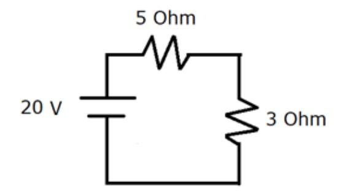

- A) 8 W
- B) 50 W
- C) 100 W
- D) 160 W
- E) 200 W

## **Completa el mapa conceptual**

#### **En este espacio puedes tomar notas durante la clase:**

| <u> </u> |         |
|----------|---------|
|          |         |
|          |         |
|          |         |
| <u> </u> |         |
|          | <b></b> |
| <u> </u> |         |
|          |         |
|          |         |
|          |         |
|          |         |
|          |         |
|          |         |
|          |         |
|          |         |
|          |         |
|          |         |
|          |         |
|          |         |
|          |         |
|          |         |
|          |         |
|          |         |
|          |         |
|          |         |
|          |         |
|          |         |
|          |         |
|          |         |
|          |         |
|          |         |
| <u></u>  |         |
|          |         |
|          |         |
|          |         |
|          |         |
|          |         |
|          |         |
|          |         |
|          |         |
|          |         |
|          |         |
|          |         |
|          |         |
| l        |         |
|          |         |
|          |         |
|          |         |
|          |         |
|          |         |
|          |         |
|          |         |
|          |         |
|          |         |
|          |         |
|          |         |
| <u></u>  |         |
| <b>!</b> |         |
|          |         |
|          |         |
|          |         |
|          |         |
|          |         |
|          |         |
|          |         |
|          |         |
|          |         |
|          |         |
|          |         |
|          |         |
|          |         |
|          |         |
|          |         |
|          |         |
|          |         |
| <u></u>  |         |
|          |         |
|          |         |
|          |         |
|          |         |
|          |         |
|          |         |
|          |         |
|          |         |
|          |         |
|          |         |
|          |         |
|          |         |
|          |         |
|          |         |
| 1        |         |
|          |         |
|          |         |
|          |         |
|          |         |
|          |         |
|          |         |