# BIOLOGÍA IV/TOMO2

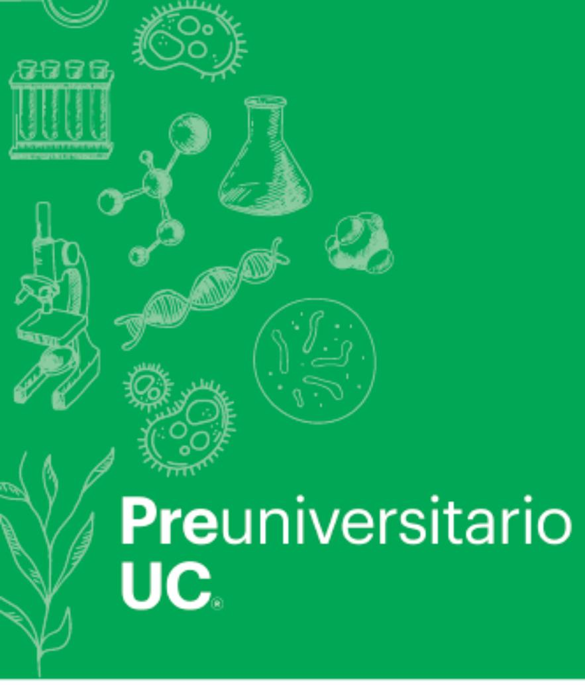

# **PRESENTACIÓN**

La **Organización de las Naciones Unidas para la Educación, la Ciencia y la Cultura (UNESCO)** considera que la enseñanza de la **Biología** es esencial para formar ciudadanos que puedan enfrentar los desafíos globales del siglo XXI. La Biología no sólo fomenta la comprensión de los sistemas vivos, sino que también promueve habilidades críticas como el pensamiento científico, la resolución de problemas complejos y la toma de decisiones informadas. Además, juega un papel clave en la **promoción de la sostenibilidad**, permitiendo que los estudiantes comprendan la interconexión entre los ecosistemas, la biodiversidad y el bienestar humano. En este sentido, la educación biológica se convierte en una herramienta fundamental para abordar problemas globales como el cambio climático, la seguridad alimentaria y la salud, formando una ciudadanía más consciente y comprometida con la construcción de un futuro sostenible.

En Chile, el **Departamento de Evaluación, Medición y Registro Educacional (DEMRE)** es responsable de gestionar la **Prueba de Acceso a la Educación Superior (PAES)**, que incluye la prueba específica de ciencias, que contempla el eje temático de **Biología.** Esta prueba es necesaria para aquellos estudiantes interesados en carreras científicas, tecnológicas o de la salud. En este contexto, la PAES de Ciencias evalúa los contenidos esenciales de Biología, los cuales están alineados con el objetivo del desarrollo de la comprensión de fenómenos biológicos, la interpretación de datos experimentales y la aplicación de conceptos en contextos diversos. Los temas más destacados se organizan en cuatro áreas temáticas, las que incluyen **Organización, estructura y actividad celular, Procesos y funciones biológicas, Herencia y evolución, y Organismo y ambiente.** Además, esta prueba también mide habilidades ligadas al quehacer científico, considerando las siguientes: **Observar y plantear preguntas, Planificar y conducir una investigación, Procesar y analizar la evidencia, Evaluar y Comunicar.**

El presente texto se configura como el segundo de dos tomos que considera los contenidos agrupados en las siguientes dos áreas: Procesos y funciones biológicas, y Organismo y ambiente, contenidos acordes con el temario DEMRE para la preparación de la PAES. Además, se trabajará el desarrollo de habilidades científicas mediante ejercicios de selección única, los cuales requieren de la aplicación de los conocimientos de la ciencia específicos de cada área temática, y aquellos relacionados con el quehacer de las ciencias, desde la formulación de preguntas de investigación e hipótesis, selección de procedimientos y determinación de variables, procesamiento y análisis de datos, y comunicación de resultados.

> **Departamento de Biología Preuniversitario UC**

# **Índice**

| Área temática: Procesos y funciones biológicas1                                                                     |    |
|---------------------------------------------------------------------------------------------------------------------|----|
| Capítulo 1: Sexualidad humana 2                                                                                  |    |
| 1. Aparato reproductor masculino3                                                                                   |    |
| 1.1. Regulación hormonal de la espermatogénesis y la producción de testosterona                                     | 5  |
| 1.2. Efectos corporales de la testosterona 7                                                                     |    |
| 2. Aparato reproductor femenino7                                                                                    |    |
| 2.1. Ciclo sexual femenino (ciclo menstrual) y control hormonal8                                                    |    |
| 2.2. Hormonas sexuales femeninas                                                                                    | 13 |
| 3. Control de la natalidad e Infecciones de transmisión sexual (ITS)14                                              |    |
| 3.1. Métodos de control de la natalidad14                                                                           |    |
| 4. Infecciones de Transmisión Sexual (ITS): Características, mecanismos de transmisión y medidas de prevención19 |    |
| 4.1. Un problema a escala mundial                                                                                   | 19 |
| 4.2. Las ITS constituyen un problema de salud público para Chile20                                                  |    |
| 4.3. Situación del VIH/SIDA en Latinoamérica y en Chile20                                                        |    |
| 4.4. Diferencia entre "contagio" y "transmisión"21                                                                  |    |
| Ejercicios sobre Sexualidad humana                                                                               | 27 |
| Área temática: Organismo y ambiente                                                                              | 29 |
| Capítulo 1: Fotosíntesis                                                                                            | 30 |
| 1. Estrategias de nutrición en los ecosistemas30                                                                    |    |
| 2. Cloroplastos31                                                                                                   |    |
| 3. Relación entre la luz y los pigmentos                                                                         | 32 |
| 4. Clorofila y pigmentos accesorios                                                                                 | 33 |
| 5. Fases de la fotosíntesis 34                                                                                   |    |
| 5.1. Fase dependiente de luz34                                                                                      |    |
| 5.2. Fase independiente de luz 35                                                                             |    |
| 6. Resumen de las fases de la fotosíntesis36                                                                     |    |
| 7. Relación entre fotosíntesis y respiración celular37                                                           |    |
| 8. Factores que afectan a la fotosíntesis                                                                        | 38 |
| Capítulo 2: Ecosistemas                                                                                          | 42 |
| 1. Primer nivel trófico43                                                                                        |    |
| 2. Consumidores                                                                                                  | 43 |

I

| 3.  | Descomponedores            | . 44 |
|-----|----------------------------|------|
| 4.  | Detritívoros               | .44  |
| 5.  | Cadenas tróficas           | . 45 |
| 6.  | Trama trófica              | .46  |
| Eje | rcicios sobre Fotosíntesis | .47  |
| Fie | rcicios sobre Ecosistemas  | 51   |

# **Área temática: Procesos y funciones biológicas**

Los mecanismos fisiológicos son fundamentales para llevar a cabo el proceso reproductivo en la especie humana. Desde el desarrollo de los caracteres sexuales secundarios durante la pubertad hasta el desarrollo de gametos durante la gametogénesis, junto con el rol de los gametos en la perpetuación de la especie. Además, es importante el reconocimiento de los métodos de control de la natalidad para ejercer una paternidad responsable, desde la determinación del momento adecuado para tener hijos, hasta para prevenir infecciones de transmisión sexual.

# **Aprendizajes esperados**

- Analizar los principales cambios que ocurren durante la pubertad en hombres y mujeres.
- Determinar el rol de los espermatozoides y óvulos en el proceso de fecundación.
- Describir cómo las hormonas pueden regular el proceso reproductivo en humanos.
- Identificar la importancia de los métodos de control de la natalidad en la planificación familiar y en evitar las infecciones de transmisión sexual.

# **Capítulo 1: Sexualidad humana**

### **Introducción**

No siempre el sexo resulta necesario para la generación de nuevos individuos. Muchos organismos unicelulares eucariotas se reproducen simplemente por mitosis. Este tipo de reproducción, denominada asexual, es también muy frecuente en organismos multicelulares, tanto animales como vegetales.

Muchas plantas pueden reproducirse por este mecanismo, denominado reproducción vegetativa, a través de métodos naturales o artificiales. La reproducción asexual también se presenta en algunos animales, como la hidra, que genera nuevos organismos por brotación (producción de una "yema" generada en la planta madre que luego se desprende de ella y vive independientemente) o en las anémonas y gusanos marinos, donde la disección del organismo da lugar a que cada parte regenere la faltante (regeneración), originándose dos nuevos individuos.

La reproducción asexual es entonces menos compleja y, a su vez, directa, dando lugar a individuos genéticamente idénticos (clones) a sus progenitores.

La reproducción sexual, por el contrario, recurre a mecanismos algo más complicados e involucra la mezcla de los genomas de dos individuos de distinto sexo para producir descendientes que siempre resultan genéticamente distintos a cualquiera de sus progenitores.

# **Objetivos de aprendizaje**

- Distinguir la importancia de los gametos en el proceso de reproducción.
- Analizar cómo el sistema reproductor masculino y femenino puede ser regulado mediante sistemas basados en hormonas.
- Reconocer la importancia de los métodos de control de la natalidad para la planificación familiar y la prevención de las infecciones de transmisión sexual.
- Distinguir infecciones de tipo bacterianas y virales asociadas a las prácticas sexuales, sus síntomas y medidas de prevención.

# **1. Aparato reproductor masculino**

El aparato reproductor masculino, está formado por dos gónadas llamadas **testículos**, un **sistema de conductos** que transporta los espermios producidos por el testículo hacia el exterior y un **órgano copulador** (pene) que permite depositar el semen en el aparato genital femenino. Además, existen **glándulas anexas**, cuya secreción proporciona a los espermios el medio adecuado para su subsistencia: **próstata, vesículas seminales y glándulas de Cowper o bulbouretrales.**

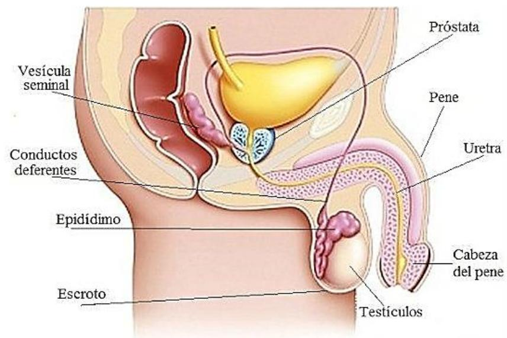

### **a) Testículos:** se alojan en el escroto.

El escroto es un saco cutáneo pigmentado, en el cual la temperatura es más baja que en el interior de la cavidad abdominal, permitiendo así que ocurra la espermatogénesis.

Cada testículo está subdividido en compartimientos y en cada uno de ellos se encuentra una serie de túbulos enrollados apretadamente, conocidos como túbulos seminíferos. En ellos se desarrolla la espermatogénesis.

Al examinar un corte transversal de túbulo seminífero, se observa, hacia la periferia, una capa de espermatogonias (pared del túbulo) y, con células en diferentes estados de diferenciación de forma piramidal, llamadas **células de Sertoli**, las cuales son sensibles a hormonas como la **FSH (hormona folículo estimulante)** y la **testosterona**.

### **Funciones de las células de Sertoli:**

- Están encargadas de dirigir la diferenciación espermática.
- Fagocitan los restos residuales de citoplasma de la diferenciación de la espermátida.
- Secretan la hormona inhibina y una proteína de unión a andrógenos (ABP) que permite la acción de la testosterona dentro del túbulo seminífero.

El tejido ubicado entre los túbulos seminíferos está formado por una gran cantidad de vasos sanguíneos y **células de Leydig** (células productoras de testosterona).

Las funciones de los testículos son:

- Producción de espermatozoides.
- Producción de testosterona.

# **b) Vías espermáticas**

Es un sistema de conductos encargados de transportar los espermios, hacia el exterior.

| Vías espermáticas            | Características                                                                                                | Funciones                                                                                                                                                                                                              |
|------------------------------|----------------------------------------------------------------------------------------------------------------|------------------------------------------------------------------------------------------------------------------------------------------------------------------------------------------------------------------------|
| Epidídimo                    | Es un tubo enrollado de 7 cm de longitud, que yace sobre cada testículo.                              | Los espermatozoides, durante su paso por el epidídimo van ganando una movilidad progresiva y la potencialidad de unirse con el ovocito y fertilizarlo (maduración espermática). |
| Conducto o vaso deferente | Cada conducto deferente se extiende desde el epidídimo hasta las vesículas seminales.                    | Almacena espermatozoides y los transporta hacia las vesículas seminales durante la eyaculación.                                                                                                         |
| Conducto eyaculador       | Conducto que nace de la unión entre el conducto deferente y los conductos de las vesículas seminales. | Transportar semen hacia la uretra.                                                                                                                                                                                     |
| Uretra                       | Es un conducto que nace de la vejiga urinaria.                                                              | La uretra transporta orina y semen.                                                                                                                                                                                    |

### **c) Pene (órgano copulador)**

El pene es el órgano de la copulación en el hombre. Durante el acto sexual, penetra en la vagina femenina para depositar los espermatozoides. Está constituido esencialmente por tejidos eréctiles, los cuales son tejidos sumamente irrigados, cuyos vasos pueden llenarse de sangre en un momento dado, lo que produce erección.

### **d) Glándulas anexas**

Son estructuras adosadas a las vías espermáticas, cuyas secreciones proporcionan a los espermatozoides un medio apropiado para su subsistencia. Estas secreciones, en conjunto,

forman el **semen**, líquido en el cual flotan los espermatozoides, y que les permite un medio adecuado para sobrevivir y movilizarse.

| Glándulas anexas                           | Función                                                                                                                                                                                                                                                                                                                                                      |
|--------------------------------------------|--------------------------------------------------------------------------------------------------------------------------------------------------------------------------------------------------------------------------------------------------------------------------------------------------------------------------------------------------------------|
| Vesículas seminales                        | Secretan un líquido que contiene un disacárido llamado fructosa (ayuda a la nutrición espermática), ácido cítrico y otras sustancias nutritivas, así como grandes cantidades de prostaglandinas y proteínas coagulantes.                                                                                                                            |
| Próstata                                   | Secreta un líquido lechoso y ligeramente alcalino (esto hace que el pH del semen sea de aproximadamente 7,5) lo que incrementa la motilidad del espermatozoide y ayuda a la fecundación al neutralizar las secreciones ácidas de la vagina. Este líquido contiene calcio, iones fosfato, una enzima de coagulación, entre otros elementos. |
| Glándulas de Cowper o bulbouretrales | Estas pequeñas glándulas se encuentran debajo de la próstata y su función es secretar un líquido alcalino que lubrica y neutraliza la acidez de la uretra antes del paso del semen en la eyaculación.                                                                                                                                                  |

# **1.1. Regulación hormonal de la espermatogénesis y la producción de testosterona**

En el hombre, la formación de espermatozoides comienza en la pubertad (12-14 años) y continúa ininterrumpidamente hasta los 50-60 años. A partir de esta edad empieza a disminuir su producción.

La espermatogénesis está sujeta a un estrecho y complejo control hormonal generado por la Adenohipófisis (lóbulo anterior de la hipófisis).

Esta glándula produce dos hormonas llamadas Gonadotrofinas, las cuales están reguladas por hormonas hipotalámicas, como la Hormona liberadora de gonadotrofinas (GnRH). Las hormonas gonadotropinas son la FSH (Hormona Folículo–Estimulante) y LH (Hormona Luteinizante).

La **hormona FSH,** actúa sobre las células de Sertoli, las cuales estimulan la espermatogénesis.

Para iniciar la espermatogénesis son necesarias tanto la FSH como la testosterona, aunque una vez que se ha producido la estimulación inicial, basta la testosterona para mantener el proceso.

Por otro lado, la LH actúa sobre las células de Leydig estimulando la producción de testosterona.

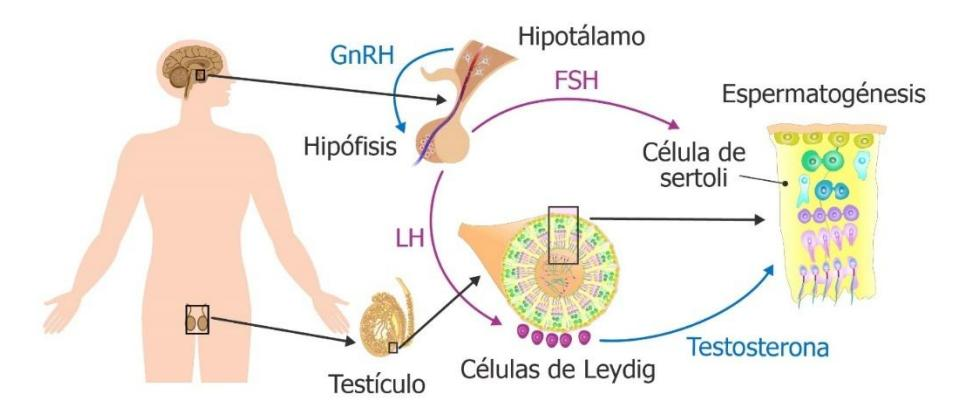

La **testosterona** secretada por las **células de Leydig**, tiene un efecto inhibidor de la secreción hipofisaria de LH. Por ejemplo, cuando los niveles de testosterona sanguínea son superiores al nivel normal, el hipotálamo deja de secretar GnRH. Esto provoca una disminución de la secreción de las hormonas LH y FSH por la adenohipófisis, y por su parte, la disminución de LH reduce la secreción de testosterona por las células de Leydig.

A la inversa, una cantidad demasiado escasa de testosterona permite que el hipotálamo secrete gran cantidad de GnRH, con el consiguiente aumento de hormonas gonadotrofinas y, a su vez, de testosterona.

Por otro lado, cuando la producción de espermios es demasiado rápida y excesiva, disminuye la secreción de FSH. Se cree que la causa es una hormona secretada por las células de Sertoli conocida como **inhibina**. Esta hormona ejerce un poderoso efecto sobre la adenohipófisis inhibiendo la producción de FSH y posiblemente un ligero efecto sobre el hipotálamo, inhibiendo la secreción de GnRH. Al contrario, si los túbulos seminíferos producen muy pocos espermios, aumenta la secreción de FSH. Este mecanismo de control, al igual que el anterior, se conoce como Feedback negativo.

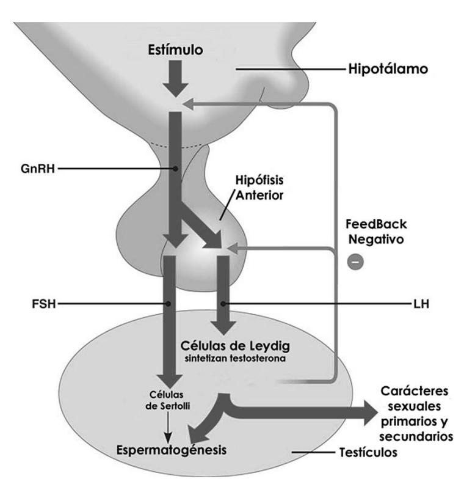

### **1.2. Efectos corporales de la testosterona**

- Estimula la síntesis de proteínas (anabolismo proteico), especialmente en las células musculares esqueléticas.
- Estimula la redistribución del vello corporal: El niño, hasta los 10 años, no tiene vello genital ni axilar; este comienza a aparecer en la pubertad. Aparece vello en cara, tórax, espalda, miembros superiores e inferiores. En la región del pubis, adopta una disposición característica del sexo masculino.
- Estimula la osificación del cartílago de crecimiento.
- La testosterona aumenta el grosor de la piel en todo el cuerpo, así como la tasa de secreción de la mayoría de las glándulas sebáceas del cuerpo.
- Genera un aumento del metabolismo basal.
- Durante el período fetal, la testosterona es necesaria para la diferenciación del pene, el escroto, la uretra peneana y la próstata del feto, así como también es importante en el descenso de los testículos al escroto.
- En la pubertad es necesaria para el crecimiento del escroto y la próstata.

# **2. Aparato reproductor femenino**

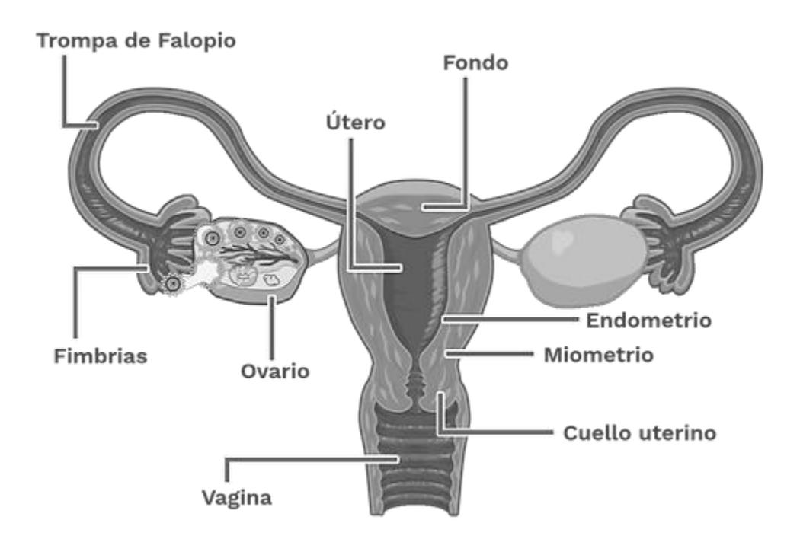

Está formado por una serie de órganos que se encuentran, en su mayoría, dentro de la pelvis.

| Estructuras                       | Funciones                                                                                                                                                                                                                                                                                                                                  |
|-----------------------------------|--------------------------------------------------------------------------------------------------------------------------------------------------------------------------------------------------------------------------------------------------------------------------------------------------------------------------------------------|
| Ovarios                           | Producir un gameto mensual conocido como ovocito II. Sintetizar las hormonas sexuales, progesterona y estrógenos.                                                                                                                                                                                                                       |
| Oviductos o trompas de Falopio | Su función es servir como lugar donde se lleva a cabo la fecundación. Gracias a los cilios presentes en su interior, transportan al ovocito II hacia el útero.                                                                                                                                               |
| Útero                             | Es un órgano muscular liso y hueco, de paredes gruesas, y en forma de pera. Su función es servir como receptáculo del producto de la concepción, y albergar al feto hasta su nacimiento. Por lo tanto, es la matriz u órgano de la gestación.                                                                                  |
| Vagina                            | Su función principal es recibir los espermios que ascienden hacia el útero y posteriormente a la trompa para fecundar al ovocito II. Además, es el canal por el cual el endometrio desprendido sale durante la menstruación. Por último, es el canal del parto, y el feto debe recorrerlo en toda su extensión en ese momento. |

### **2.1. Ciclo sexual femenino (ciclo menstrual) y control hormonal**

En la mujer, el nivel de gonadotrofinas hipofisarias varía en forma cíclica. Dado que estas hormonas actúan sobre los órganos sexuales, éstos sufren ciertos cambios que se van sucediendo cada 28 días aproximadamente (dependiendo de la mujer).

### **¿Cuánto dura cada ciclo menstrual?**

La duración normal del ciclo menstrual varía entre 22 y 35 días aproximadamente. El ciclo menstrual comienza con el desprendimiento del endometrio, proceso conocido como menstruación.

El ciclo se puede dividir en dos etapas o periodos, la etapa preovulatoria y la etapa postovulatoria.

La etapa preovulatoria, va desde el día 1 con la menstruación hasta el día de la ovulación. Esta etapa puede variar en cuanto a su duración (14, 15, 16 o más días).

La etapa postovulatoria, es la que va desde la ovulación hasta la próxima menstruación. Presenta una duración estable de 13 a 14 días.

Hay mujeres cuyos ciclos siempre duran el mismo tiempo, ya sea 28, 32 o 34 días, mientras que otras tienen ciclos de duraciones variables, uno de 28 días, el siguiente de 32 días, luego otro de 30 días, a modo de ejemplo. En el primer caso, se dice que la mujer es regular y en el otro, irregular, pero ambas situaciones están dentro de la normalidad.

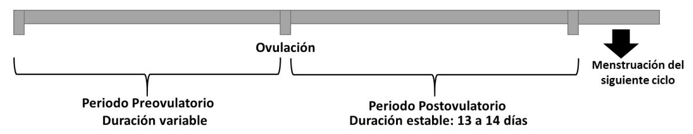

La finalidad del ciclo menstrual es una sola: posibilitar el desarrollo de un nuevo ser. Así, cada mes las estructuras reproductivas, se preparan para una posible fecundación.

## **a) Etapa preovulatoria**

El día 1 del ciclo es aquel en que comienza la menstruación (desprendimiento gradual del endometrio). Desde ese día los niveles de hormonas gonadotropinas (FSH y LH) comienzan a aumentar ligeramente.

La FSH induce maduración de los folículos primarios (foliculogénesis), es decir, estimula el crecimiento acelerado de varios folículos (5 a 10 folículos, pero solo uno termina su proceso de maduración).

A medida que el folículo crece, aumenta el número de capas celulares que lo rodean, hasta que completa su maduración, transformándose en un folículo maduro o de Graaf. De esta forma, la primera parte del ciclo en el ovario, se le denomina fase folicular.

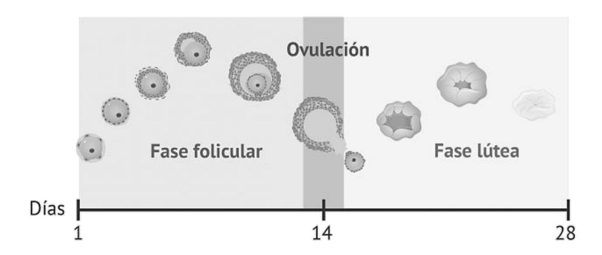

Por otro lado, la FSH estimula a las células del folículo a producir la hormona sexual femenina conocida como **estrógenos**. De este modo el nivel de estrógenos comienza a aumentar progresivamente. A medida que los niveles de estrógenos van aumentando, estos actúan en el endometrio generando que el endometrio aumente tanto en grosor como en el número de glándulas y vasos sanguíneos. A esta fase a nivel del endometrio se le conoce como **fase proliferativa**.

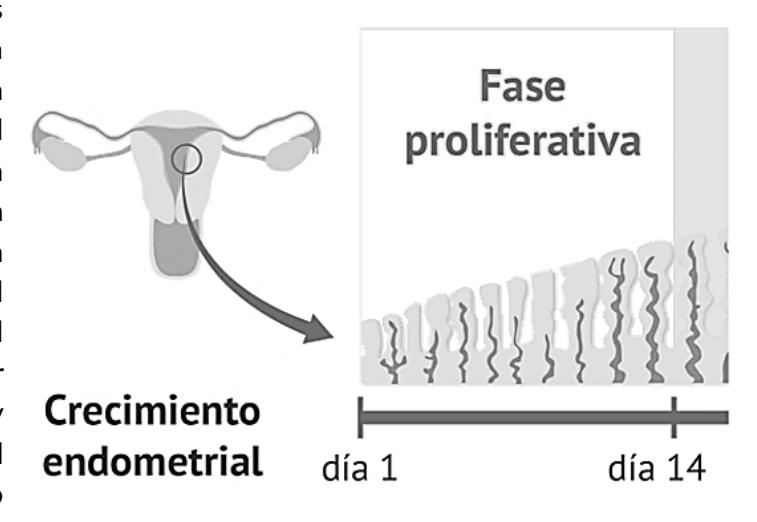

Días antes de la ovulación, los niveles de estrógenos (1) llegan a un punto máximo, el cual estimula a la adenohipófisis a secretar LH (3) a través de un mecanismo de retroalimentación o *feedback*  positivo, produciéndose una descarga brusca de esta hormona. Además, también se estimula el hipotálamo, el cual secreta aún más GnRH (2). Esta descarga de LH

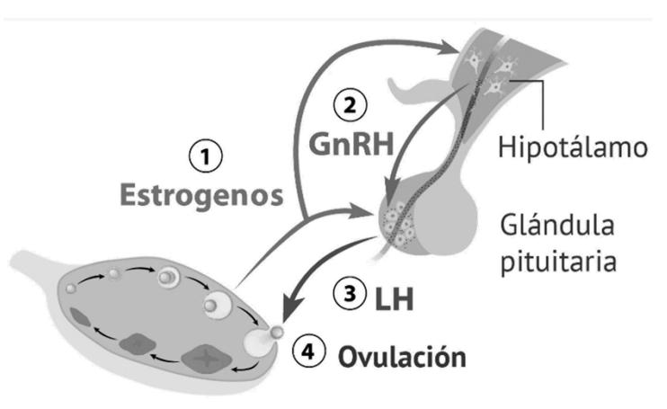

actúa sobre el folículo maduro o de Graaf, generando la expulsión del ovocito II, proceso conocido como **ovulación** (4)**.**

### **b) Etapa postovulatoria:**

Una vez que se produce el rompimiento del folículo maduro, sus las estructuras remanentes cambian su programa metabólico transformándose en el **cuerpo lúteo, todo esto bajo el efecto de la hormona LH**. A esta fase se le denomina **fase lútea**.

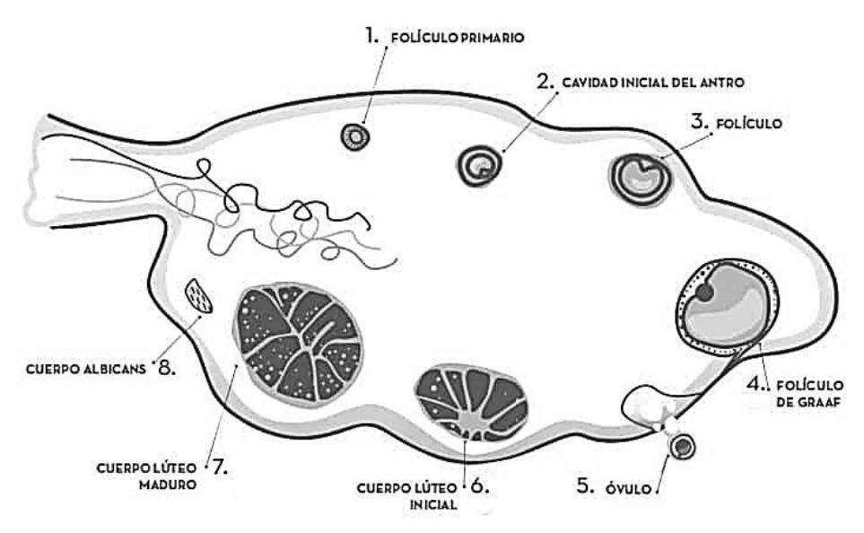

Luego, la hormona LH estimula al cuerpo lúteo a producir y secretar las hormonas sexuales progesterona y estrógenos, que estimulan el engrosamiento del endometrio. A medida que los niveles de progesterona y estrógenos aumentan, inhiben la producción a nivel del hipotálamo de las hormonas liberadoras de gonadotropinas (GnRH) y así la producción de las hormonas FSH y LH. De esa forma, se prepara al endometrio para aceptar, implantar y nutrir al posible embrión. A esta fase a nivel del endometrio se le conoce **como fase secretora**. Si llegado el término del ciclo ovárico no se produce la fecundación y posteriormente la implantación del embrión en el útero, el cuerpo lúteo involuciona y se transforma en un tejido conocido como **cuerpo albicans o cuerpo blanco**. A medida que el cuerpo lúteo involuciona, baja la producción de hormonas ováricas. Sin apoyo hormonal, el endometrio no puede mantenerse estable y una porción de él se desprende. A este fenómeno se le conoce como **menstruación**.

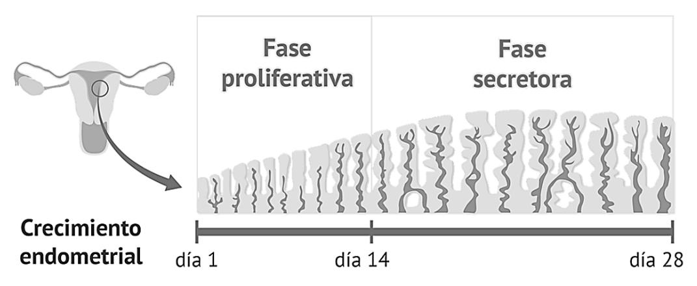

En respuesta al nivel bajo de hormonas ováricas, el nivel de hormonas gonadotrofinas comienza a elevarse nuevamente, de tal manera que otros folículos comienzan a desarrollarse en un nuevo ciclo sexual. El siguiente gráfico resume los cambios hormonales ocurridos durante un ciclo sexual femenino:

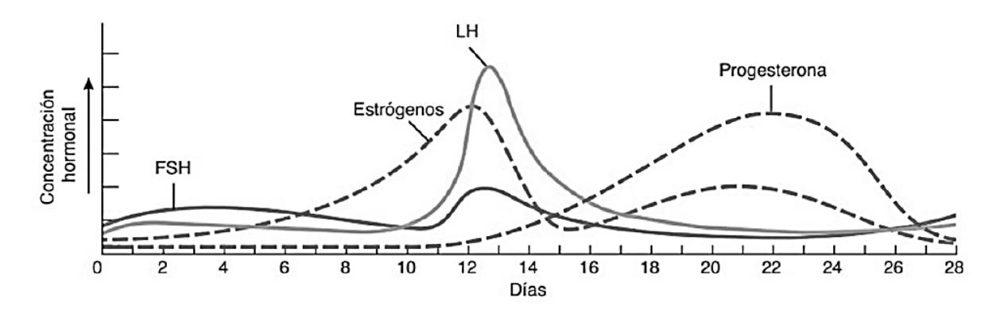

Si hay fecundación y el embrión en desarrollo se implanta este comienza a secretar una hormona llamada **gonadotrofina coriónica humana (GCH)**, que mantiene la función del cuerpo lúteo hasta el tercer mes de embarazo, fecha en que es reemplazada por la placenta en la producción de hormonas (especialmente progesterona).

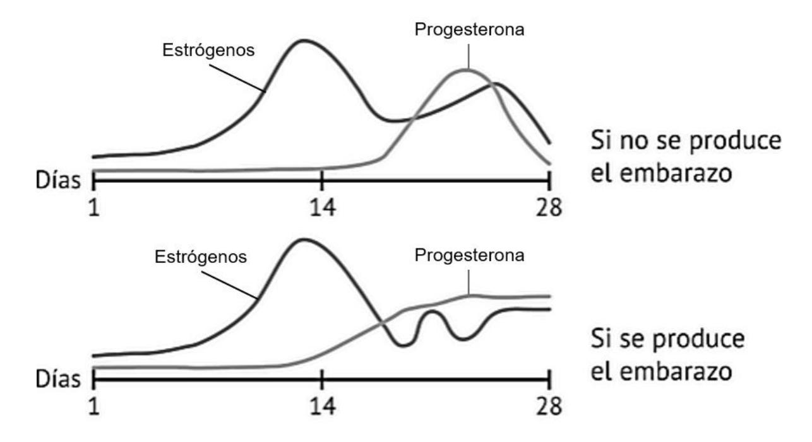

### **2.2. Hormonas sexuales femeninas**

Los dos tipos de hormonas sexuales femeninas son los estrógenos y la progesterona, ambas producidas en los ovarios.

### **a. Funciones de los estrógenos:**

- **Efecto sobre los genitales externos e internos:** Los ovarios, las trompas de Falopio, el útero y la vagina aumentan varias veces su tamaño. También crecen los genitales externos, con depósito de grasa en el Monte de Venus y en los labios mayores. En el útero inducen proliferación del endometrio.
- **Efecto sobre las glándulas mamarias: L**os estrógenos inician el crecimiento de las glándulas mamarias y del aparato productor de leche. Son también responsables del crecimiento y del aspecto externo característico de la mama femenina madura.
- **Efecto sobre el esqueleto:** Estimula el crecimiento de los huesos, pero rápidamente produce el cierre de los cartílagos de crecimiento.
- **Efecto sobre los caracteres sexuales secundarios:** Los estrógenos provocan un aumento en los depósitos de grasa en los tejidos subcutáneos, así como en ciertas zonas como las caderas, muslos y glándulas mamarias. Además, dan a la piel una textura blanda y habitualmente tersa, así como una voz más suave. Los estrógenos no afectan mucho la distribución del vello corporal, sin embargo, tras la pubertad se desarrolla vello en la región del pubis y en las axilas.
- **Efecto sobre el equilibrio electrolítico.** Actúan sobre el metabolismo del sodio, calcio y fósforo.

### **b. Funciones de la progesterona:**

- **Efecto sobre el útero:** Actúa sobre el endometrio haciendo que se transforme en un tejido secretor, preparándolo para la implantación.
- **Efecto sobre las trompas de Falopio:** Produce cambios secretores en las trompas de Falopio, los que permiten la alimentación del embrión durante su trayectoria al útero.
- **Efecto sobre las glándulas mamarias:** Estimula el desarrollo de los alvéolos mamarios, haciendo que las células alveolares proliferen, aumenten de tamaño y adopten una naturaleza secretora.

# **3. Control de la natalidad e Infecciones de transmisión sexual (ITS)**

### **3.1. Métodos de control de la natalidad**

Para facilitar la planificación familiar como también evitar el embarazo no deseado, se han desarrollado diversos métodos de anticoncepción, cuya elección debe realizarse bajo la guía de un médico que pueda proporcionar información más completa según el contexto de la pareja.

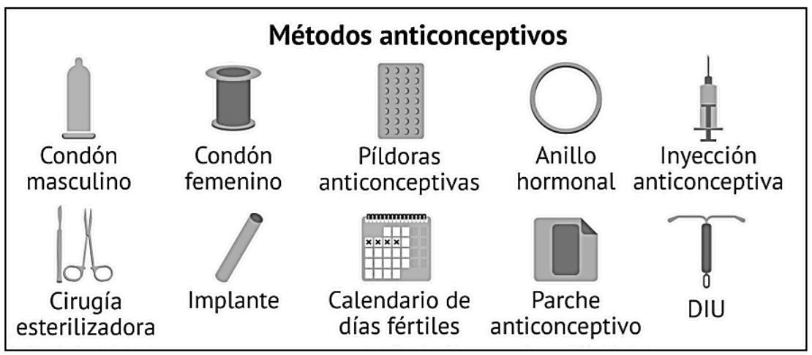

# **3.1.1. Métodos naturales**

La eficacia de estos métodos es muy difícil de determinar ya que depende fundamentalmente de la habilidad de cada persona, pero en general, no se consideran muy seguros.

- **Método del ritmo o calendario (Ogino-Knaus):** Consiste en abstenerse de tener relaciones sexuales coitales durante el periodo fértil de la mujer (durante los días que preceden y siguen a la ovulación.). Este se determina tomando en cuenta dos aspectos: La duración del ciclo menstrual de la mujer y la vida media de los gametos (los espermatozoides viven 72 horas en el cuerpo de la mujer y el ovocito II solo 48 horas). Este método solo es útil para mujeres con ciclos menstruales muy regulares.
- **Método de Billings**: Este método está basado en la observación diaria del moco cervical ya que teóricamente se pueden determinar los días fértiles mediante las variaciones que sufre el flujo vaginal (moco cervical) a lo largo del ciclo.

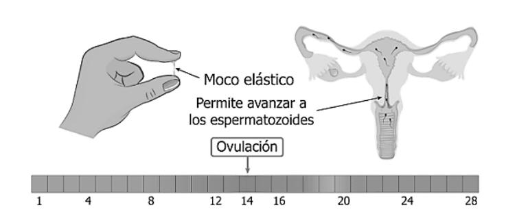

### **3.1.2. Métodos hormonales**

Su mecanismo se centra en activar mecanismos de retroalimentación negativa, lo cual impide la ovulación y vuelve al endometrio menos receptivo para el embarazo.

Los métodos hormonales presentan una variedad de formas como las pastillas, el parche que se pone en la piel, la inyección y el anillo que se inserta dentro de la vagina, o el implante del brazo o el dispositivo que va dentro del útero.

• **Pastillas anticonceptivas**: Están compuestas por hormonas sexuales femeninas sintéticas (estrógenos y/o progesterona). Su mecanismo de acción es impedir la ovulación, a través del efecto que ejercen las hormonas sintéticas femeninas sobre la liberación de las hormonas gonadotropinas FSH y LH (*feedback* negativo). También previenen el embarazo al engrosar la mucosa cervical. Su eficacia, si se utiliza bien, se aproxima al 100%. La proporción de fallos es de menos de 0,5 embarazos por cada 100 mujeres que la emplean anualmente.

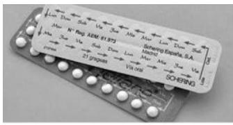

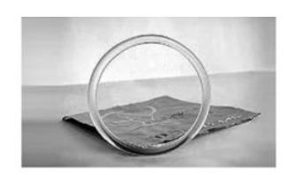

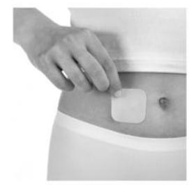

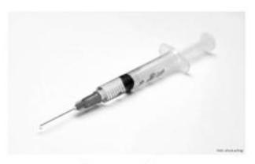

- **Parche anticonceptivo**: Es delgado y se adhiere a la piel. Contiene las mismas hormonas sintéticas de las pastillas anticonceptivas combinadas. Su efecto es inhibir la ovulación. Posibilidad de embarazo 5 - 8 de cada 100.
- **Implantes subdérmicos**: Estructura delgada de plástico flexible, casi del tamaño de un fósforo que se inserta bajo la piel del brazo. Libera una hormona, llamada progestina (progesterona sintética), que impide la ovulación. Otro efecto, es provocar que el moco cervical sea más espeso.
- **Píldora del día después o Pastillas Anticonceptivas de Emergencia (PAE)**: Es un preparado hormonal a base de una hormona única (Levonorgestrel). Lo más común es que actúe alterando o retrasando la ovulación, aunque a veces interfiere el proceso de anidación (implantación). La Organización Mundial de la Salud define este método como anticonceptivo, no como abortivo.
  - Este método, de emergencia, no debe utilizarse de forma habitual, sino que solo es recomendable en casos inesperados en los que no se ha utilizado ningún anticonceptivo o se ha utilizado mal, como por ejemplo una agresión sexual.

# **3.1.3. Métodos basados en dispositivos intrauterinos**

• **DIU (dispositivo intrauterino)**: Es un pequeño aparato plástico que se coloca en el interior del útero.

Existen dos tipos de DIU disponibles. Uno de ellos contiene cobre y el otro libera una pequeña cantidad de la hormona progestina.

El DIU de cobre evita que los espermatozoides alcancen al ovocito y lo fertilicen. También puede cambiar el revestimiento del útero.

El DIU hormonal evita la ovulación. También genera que el moco cervical sea más espeso, de manera que los espermatozoides no pueden subir por el útero.

### **3.1.4. Métodos de barrera**

- **Preservativo femenino**: Es una funda de poliuretano con un anillo flexible en cada extremo. Un extremo es cerrado y se coloca dentro de la vagina. Su mecanismo es evitar que el semen pase a la vagina. Además, ayuda a prevenir el contagio de infecciones de transmisión sexual (ITS). De cada 100 mujeres se pueden embarazar 5 si se usa correctamente.
- **Preservativo masculino**: Están confeccionados de plástico o látex moldeado con forma de pene. Se coloca sobre el pene erecto. Su mecanismo es evitar que el semen tome contacto con la vagina. Además, ayuda a prevenir el contagio de infecciones de transmisión sexual (ITS). Posibilidad de embarazo 18 de cada 100.

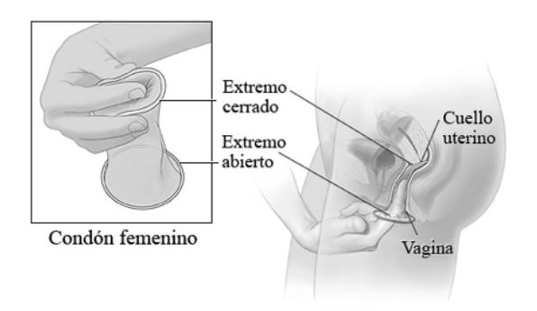

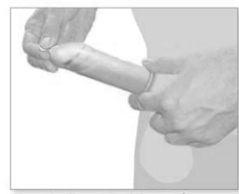

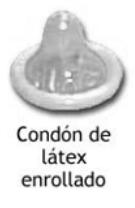

• **Diafragma o capuchón cervical**: Presenta forma de cúpula con un aro flexible. Está hecho de silicona y se coloca dentro de la vagina, cubriendo el cuello uterino. Su acción es impedir que los espermatozoides pasen hacia el útero. Su eficacia se calcula entre un 82 y un 96%.

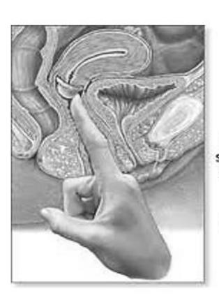

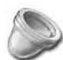

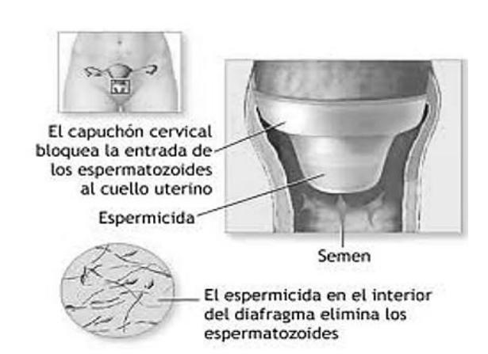

# **3.1.5. Métodos quirúrgicos parcialmente reversibles**

- **Ligadura de trompas**: Consiste en cortar y ligar las trompas de Falopio u oviductos. Este método impide que los espermatozoides se encuentren con el ovocito. Su eficacia es muy alta, cercana al 100%.
- **Vasectomía:** Consiste en cortar los conductos deferentes que provienen de cada testículo. Por lo tanto, se siguen produciendo espermatozoides en los testículos, pero estos no pueden llegar al pene durante la eyaculación. Su eficacia es muy alta, cercana al 100%

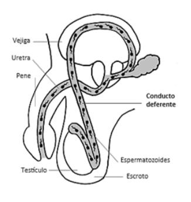

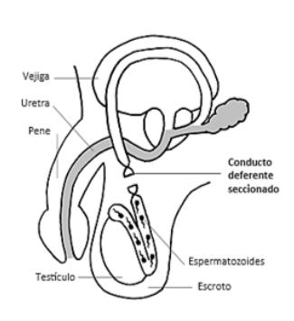

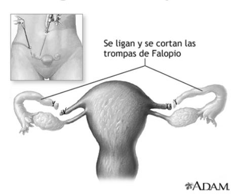

# **4. Infecciones de Transmisión Sexual (ITS): Características, mecanismos de transmisión y medidas de prevención.**

Las infecciones de transmisión sexual (ITS) corresponden a afecciones producidas por la infección de diversos agentes biológicos, como virus y bacterias, que pueden desencadenar enfermedades y suelen transmitirse principalmente por vía sexual. Anteriormente se les denominaba enfermedades de transmisión sexual (ETS), no obstante, la OMS en 1998 propuso cambiar la denominación, ya que muchas ITS pueden ocurrir de forma asintomática, pasando desapercibida tanto por la comunidad como por el personal de salud tratante.

Las ITS son producidas por diversos agentes patógenos, tales como bacterias, virus, hongos y protozoos. Respecto a la vía de transmisión, mayoritariamente es por vía sexual, sin embargo, pueden darse casos donde puede que no se ocupe esta vía necesariamente.

### **4.1. Un problema a escala mundial**

Las ITS tienen profundos efectos en la salud sexual y reproductiva de todo el mundo. Para el año 2016, la Organización Mundial de la Salud (OMS) estimó que hubo aproximadamente 376 millones (376.000.000) de nuevas infecciones debidas a clamidiasis (127 millones), gonorrea (87 millones), sífilis (6,3 millones) y tricomoniasis (156 millones). Por otro lado, la cantidad de personas con infección genital por virus herpes simple (VHS) supera los 500 millones, mientras que hay más de 300 millones de mujeres infectadas por el virus del papiloma humano (VPH), la principal causa de cáncer cervicouterino; cerca de 240 millones de personas padecen de hepatitis B crónica. Por otro lado, la infección por el virus de la inmunodeficiencia humana (VIH) sigue siendo una preocupación a nivel mundial, con un aumento de 1,7 millones de caso para el año 2018, según informa el Centro para el Control y Prevención de Enfermedades (*Centers for Disease, Control and Prevention*, CDC).

### **4.2. Las ITS constituyen un problema de salud público para Chile**

En nuestro país se monitorean las ITS mediante registros epidemiológicos y estadísticos, los cuales son reportados por los establecimientos especializados en esta atención (ingresos y atenciones de salud por esta causa). De acuerdo con registros estadísticos, en los últimos años (hasta el año 2019) se ha observado un incremento de los casos nuevos (o ingresos) de ITS en el sistema de salud público, registrándose 27.663 casos, en todas las causas monitoreadas. De la misma forma, para el mismo año, se registraron más de 40.000 atenciones por médico entre los niveles de atención primaria y de especialidades de salud, y 102.809 por profesionales no médicos (matronas y enfermeros) por esta causa en 2019.

### **4.3. Situación del VIH/SIDA en Latinoamérica y en Chile**

De acuerdo con cifras del informe mundial de Onusida "Ending AIDS 2017" entre los años 2010 y 2016, países como Guatemala, Costa Rica y Chile han exhibido una tendencia generalizada al aumento en el número de casos positivos por VIH. La infección por el virus de la inmunodeficiencia humana (VIH) responsable del síndrome de la inmunodeficiencia adquirida (SIDA) es un problema de salud pública que ha ido en franco aumento en los últimos años, a pesar de las campañas de prevención que se han implementado en los últimos 10 años, exhibiendo una fuerte tendencia al aumento en el número de casos confirmados hasta el año 2019.

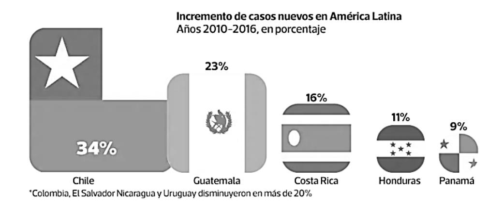

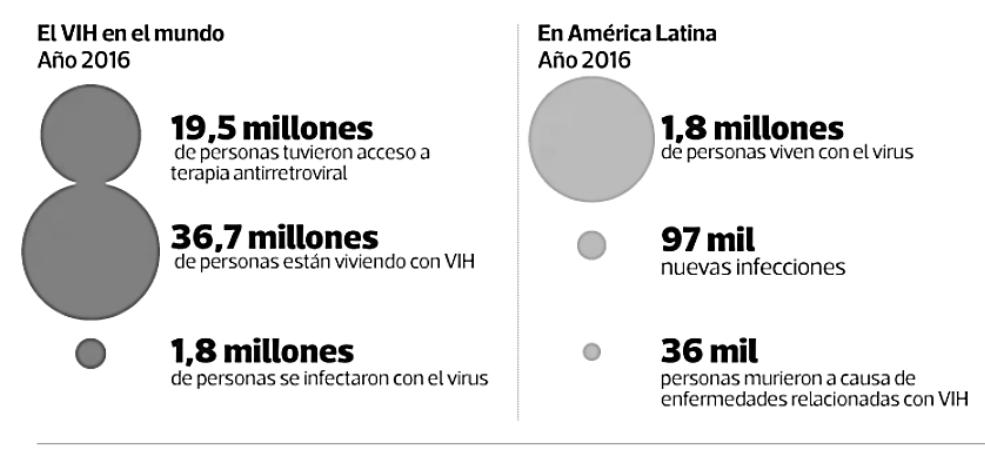

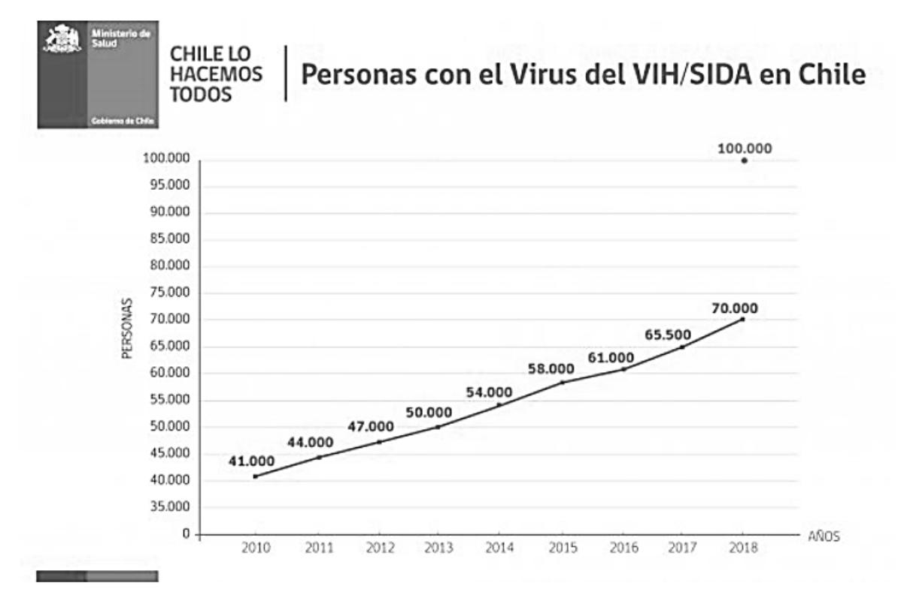

### **4.4. Diferencia entre "contagio" y "transmisión"**

Se dice que una enfermedad infecciosa se **contagia** cuando el patógeno que lo produce puede vivir o es viable fuera del cuerpo humano, pudiendo encontrarlo en el agua, el aire, superficies, animales, alimentos, etc. Típicamente, el agente infeccioso que produce este tipo de enfermedades finaliza su ciclo vital fuera del cuerpo humano.

Por otro lado, se dice que una enfermedad infecciosa se **transmite** cuando el agente patógeno que produce la enfermedad no logra sobrevivir o se vuelve inactivo si se encuentra fuera del cuerpo humano, por ende, las vías de transmisión son menos variadas, no obstante, no por eso menos frecuente. Por ejemplo, en el caso del VIH, la infección por este virus es mediante tres vías principales: sexual, sanguínea y perinatal (madre al feto), no obstante, no puede ser adquirido si el virus se encuentra fuera del cuerpo humano.

A continuación, se revisará una tabla con las ITS más frecuentes, poniendo énfasis en sus características generales, mecanismo de transmisión y medidas de prevención.

| Nombre de la enfermedad       | Agente patógeno               | Características generales y mecanismos de transmisión | Sintomas                                            | Medidas de prevención y tratamiento                                                  |
|----------------------------------|----------------------------------|-------------------------------------------------------------|-----------------------------------------------------|--------------------------------------------------------------------------------------|
| Síndrome de la Inmunodeficiencia | Virus de la Inmunodeficiencia | a prir                                                      | En algunos casos, personas que han sufrido       | Uso de métodos de barrera durante el acto sexual basados en condón o preservativo |
| Adquirida (SIDA)                 | Humana (VIH)                     | inmunitario, debilitando gradualmente. A medida que         | infección por VIH pueden experimentar síntomas   | masculino y femenino.                                                                |
|                                  |                                  | la infección progresa el                                    | similares a los de una                              | Realización de análisis periódicos para                                              |
|                                  |                                  | paciente se acerca cada día                                 | gripe, entre dos a cuatro                           | detectar tempranamente la infección por VIH.                                         |
|                                  |                                  | encia.                                                      |                                                     | Uso de fármacos antirretrovirales (TARV)                                             |
|                                  |                                  | inmunitaria                                                 | ingresado al cuerpo. Esta                           | para prevenir la transmisión de la madre al                                          |
|                                  |                                  | medirse en función del                                      | enfermedad se conoce                                | feto, incluso después del nacimiento, durante                                        |
|                                  |                                  | recuento de innocitos CD4, también conocidos como        | como Inteccion primaria (aguda) por VIH. la cual | el periodo de lactancia. Una buena adherencia al tratamiento puede disminuir el      |
|                                  |                                  | T4, los                                                     | puede presentar los                                 | riesgo de transmisión de la madre al hijo hasta                                      |
|                                  |                                  | tienen un rol fundamental en                                | siguientes síntomas:                                | un 1% e incluso menos.                                                               |
|                                  |                                  | la activación y amplificación                               | ,                                                   |                                                                                      |
|                                  |                                  | de la respuesta inmunitaria                                 | Fiebre                                              | Uso de tratamiento farmacológico                                                     |
|                                  |                                  | contra agentes patógenos.                                   | <ul> <li>Dolor de cabeza</li> </ul>                 | preexposición (PrEP), los cuales disminuyen                                          |
|                                  |                                  |                                                             | <ul> <li>Dolor muscular y</li> </ul>                | el nesgo de transmision en personas que no                                           |
|                                  |                                  | Este virus se transmite                                     | articular                                           | tienen el virus en su sistema, pero que                                              |
|                                  |                                  | mediante tres mecanismos:                                   | <ul> <li>Erupción cutánea</li> </ul>                | incurren en conductas de riesgo sexuales y en                                        |
|                                  |                                  |                                                             | <ul> <li>Dolor de garganta y</li> </ul>             | consumo de drogas inyectables.                                                       |
|                                  |                                  | 1. Intercambio de fiuidos                                   | llagas en la boca                                   |                                                                                      |
|                                  |                                  | por VIa sexual.                                             | <ul> <li>Ganglios linfáticos</li> </ul>             | terania antimatrovinal (TADV) normito di la                                          |
|                                  |                                  |                                                             | inflamados,                                         | carga viral (copias del virus VIH) estén en                                          |
|                                  |                                  | agujas contaminadas.                                        | especialitiente los del                             | niveles indetectables, es decir, muy bajos                                           |
|                                  |                                  | 3. Desde la madre al feto                                   | Diarrea                                             | para ser detectados, lo cual permite que se                                          |
|                                  |                                  | durante la gestación.                                       | <ul> <li>Pérdida de peso</li> </ul>                 | cumpla con la condición de intransmisibilidad                                        |
|                                  |                                  |                                                             | • Tos                                               | (IIIIIalisinie – IIIuetectable), es uecii,                                           |
|                                  |                                  |                                                             | <ul> <li>Sudor nocturno</li> </ul>                  | indetectables, no pueden transmitir el virus.                                        |
|                                  |                                  |                                                             |                                                     | No obstante, el uso de la TARV no elimina la                                         |
|                                  |                                  |                                                             |                                                     | infección, sólo retrasa su avance.                                                   |

| Nombre de la enfermedad | Agente patógeno                                | Características generales y mecanismos de transmisión                                                                                                                                                                                                                                                                                                                                                                                                                            | Sintomas                                                                                                                                                                                                                                                                                                                                                                                                                                                                                                                                                                                                                                                               | Medidas de prevención y tratamiento                                                                                                                                                                                                                                                                                                                                                                                                                               |
|----------------------------|---------------------------------------------------|----------------------------------------------------------------------------------------------------------------------------------------------------------------------------------------------------------------------------------------------------------------------------------------------------------------------------------------------------------------------------------------------------------------------------------------------------------------------------------------|------------------------------------------------------------------------------------------------------------------------------------------------------------------------------------------------------------------------------------------------------------------------------------------------------------------------------------------------------------------------------------------------------------------------------------------------------------------------------------------------------------------------------------------------------------------------------------------------------------------------------------------------------------------------|-------------------------------------------------------------------------------------------------------------------------------------------------------------------------------------------------------------------------------------------------------------------------------------------------------------------------------------------------------------------------------------------------------------------------------------------------------------------|
| Herpes                     | Virus del herpes simple tipo 1 y 2 (VHS1 y VHS2). | EI VHS es el responsable de la aparición de llagas en boca, labios y genitales. Muchas personas viven con este virus en su cuerpo sin presentar síntomas, debido a que este virus puede ocultarse del sistema inmunológicos al depositarse en los somas neuronales del sistema nervioso. Tanto el VHS1 como el VHS2 se contagian por contacto directo desde una persona a otra cuyo virus se ha reactivado, siendo la vía sexual una forma de transmisión de este tipo de infecciones. | Si bien las personas que se han infectado de VHS no presentan síntomas en la mayoría de los casos, cuando se manifiesta, puede presentar los siguientes síntomas:  • Dolor o comezón. Es posible que experimentes dolor y sensibilidad en la zona genital hasta que la infección desaparezca. • Protuberancias rojas pequeñas o ampollas pequeñas o ampollas blancas diminutas. Es posible que aparezcan unos pocos días o semanas después de la infección. • Úlceras. Se pueden formar úlceras cuando las ampollas se rompen y exudan o sangran. Las úlceras pueden provocar dolor al orinar. • Costras. La piel formará costras a medida que las úlceras cicatrizan. | Las medidas de prevención incluyen la utilización de métodos anticonceptivos de barrera basados en el condón o preservativo femenino y/o masculino, aunque no garantiza que no exista riesgo de infección.  El tratamiento consiste en el uso de antivirales tales como el aciclovir, el Famciclovir y el valaciclovir, no obstante, si bien el tratamiento puede ayudar a disminuir los síntomas, especialmente la inflamación y el dolor, no cura la infección. |
|                            |                                                   |                                                                                                                                                                                                                                                                                                                                                                                                                                                                                        | Las llagas pueden distribuirse en la zona genital, la boca, glúteos y en otras zonas del cuerpo.                                                                                                                                                                                                                                                                                                                                                                                                                                                                                                                                                              |                                                                                                                                                                                                                                                                                                                                                                                                                                                                   |

| Nombre de la enfermedad | Agente patógeno                                   | Características generales y mecanismos de                                                                                                                                                                                                                                                                                                                                                             | Sintomas                                                                                                                                                                                                                                                                                                                                                                                                                                     | Medidas de prevención y tratamiento                                                                                                                                                                                                                                               |
|----------------------------|------------------------------------------------------|----------------------------------------------------------------------------------------------------------------------------------------------------------------------------------------------------------------------------------------------------------------------------------------------------------------------------------------------------------------------------------------------------------|----------------------------------------------------------------------------------------------------------------------------------------------------------------------------------------------------------------------------------------------------------------------------------------------------------------------------------------------------------------------------------------------------------------------------------------------|-----------------------------------------------------------------------------------------------------------------------------------------------------------------------------------------------------------------------------------------------------------------------------------|
| Gonorrea                   | Causada por la bacteria Neisseria gonorrhoeae. | Es una de las ITS más comunes, pudiendo a afectar a un gran porcentaje de personas año a año, sin distinción de sexo y género. Es una infección muy recurrente en grupos de personas jóvenes (15-24 años), afectando genitales, el recto y la garganta, aunque también puede afectar la conjuntiva ocular Respecto al mecanismo de transmisión, la vía sexual y de la madre al feto son las más comunes. | Si bien la infección por gonorrea en algunos casos puede ser asintomática, cuando se manifiesta, los síntomas pueden incluir micción dolorosa y excreciones anormales del pene o la vagina. Los hombres sienten dolor en los testículos y las mujeres pueden sentir dolor en la zona inferior del vientre. En algunos casos, la gonorrea no presenta síntomas. En general el cuadro clínico por infección por Neisseria gonorrhoeae incluye: | Las medidas de prevención incluyen la utilización de métodos anticonceptivos de barrera basados en el condón o preservativo femenino y/o masculino, aunque no garantiza que no exista riesgo de infección.  El tratamiento se basa en el uso de antibióticos como la ceftriaxona. |
|                            |                                                      | Si no es tratado a tiempo, puede producir infertilidad, tanto en hombres como en mujeres.                                                                                                                                                                                                                                                                                                                | <ul> <li>Áreas de dolor:         abdomen inferior, pelvis, testículo o vagina</li> <li>Dolor al orinar o mantener relaciones sexuales.</li> <li>Aumento del flujo vaginal anormal o secreción del pene</li> <li>También comunes: dolor de garganta, flebre, menstruación irregular, necesidad frecuente de orinar o pus.</li> </ul>                                                                                                          |                                                                                                                                                                                                                                                                                   |

| Nombre de la enfermedad | Agente patógeno                   | Características generales y mecanismos de transmisión                                                                                                                                                                                                                                                                                                                                                                                                                                                                                                                                                                                                                                                                                                                      | Sintomas                                                                                                                                                                                                                                                                                                                                                                                                                                                                                                                                                                                                                                                            | Medidas de prevención y tratamiento                                                                                                                                                                                                                                            |
|----------------------------|--------------------------------------|----------------------------------------------------------------------------------------------------------------------------------------------------------------------------------------------------------------------------------------------------------------------------------------------------------------------------------------------------------------------------------------------------------------------------------------------------------------------------------------------------------------------------------------------------------------------------------------------------------------------------------------------------------------------------------------------------------------------------------------------------------------------------------|---------------------------------------------------------------------------------------------------------------------------------------------------------------------------------------------------------------------------------------------------------------------------------------------------------------------------------------------------------------------------------------------------------------------------------------------------------------------------------------------------------------------------------------------------------------------------------------------------------------------------------------------------------------------|-----------------------------------------------------------------------------------------------------------------------------------------------------------------------------------------------------------------------------------------------------------------------------------|
| Clamidia                   | Bacteria Chlamydia trachomatis | Es una ITS de transmisión bacteriana ampliamente diseminada en diversos países, especialmente los industrializados, junto con el VHS y el VPH. La bacteria Chlamydia trachomatis coloniza la zona genital tanto de hombres como de mujeres. Se considera que la infección es declarada luego de 7 a 21 días después del contacto con una persona infectada. En algunos casos puede estar en estado de latencia, manifestando los síntomas cuando la persona infectada presenta una baja de defensas o aumento de la carga bacteriana después de un nuevo contacto con otra persona contagiada.  El principal mecanismo de transmisión es el contacto sexual. La clamidia puede infectar el pene, la vagina, el cuello uterino, el ano, la uretra, los ojos y la garganta o boca. | La infección temprana por clamidia puede no presentar síntomas o bien, algunos muy leves. Una vez que se ha manifestado el cuadro clínico, podemos encontrar.  • Micción dolorosa • Flujo vaginal en mujeres oblor durante las relaciones sexuales en mujeres oblor durante períodos menstruales y después del sexo en mujeres oblor testicular en hombres  La Clamidia trachomatis también puede infectar el recto, pudiendo ser asintomáticamente, o con signos asociados a la aparición de dolor, secreción o sangrado rectal. También puedes contraer infecciones oculares por clamidia (conjuntivitis) a través del contacto con líquidos corroras infectados. | Las medidas de prevención incluyen la utilización de métodos anticonceptivos de barrera basados en el condón o preservativo femenino y/o masculino, aunque no garantiza que no exista riesgo de infección.  El tratamiento se basa en el uso de antibióticos como la doxiciclina. |

| Nombre de la | Agente    | Características generales v        | Sintomas                                             | Medidas de prevención     |
|--------------|-----------|------------------------------------|------------------------------------------------------|---------------------------|
| enfermedad   | patógeno  | mecanismos de transmisión          |                                                      | y tratamiento             |
| Sífilis      | Bacteria  | Es una ITS que suele transmitirse  | Los síntomas van progresando en                      | Las medidas de            |
|              | Treponema | principalmente por vía sexual. La  | gravedad a medida que se avanza                      | prevención incluyen la    |
|              | pallidum  | enfermedad comienza a              | por las etapas de la infección por                   | utilización de métodos    |
|              |           | manifestarse típicamente a         | sífilis, incluyendo:                                 | anticonceptivos de        |
|              |           | través de una llaga indolora, por  |                                                      | barrera basados en el     |
|              |           | lo general en el área genital, el  | <ul> <li>Una erupción cutánea,</li> </ul>            | condón o preservativo     |
|              |           | recto o la boca. Después de la     | generalmente en las palmas de                        | femenino y/o masculino,   |
|              |           | infección inicial, puede           | las manos y plantas de los pies.                     | aunque no garantiza que   |
|              |           | permanecer latente en el cuerpo    | <ul> <li>Úlceras llamadas parches</li> </ul>         | no exista riesgo de       |
|              |           | durante muchos años (décadas)      | mucosos en o alrededor de la                         | infección.                |
|              |           | antes que el agente patógeno se    | boca, la vagina o el pene.                           |                           |
|              |           | reactive. La enfermedad por        | <ul> <li>Parches húmedos y verrugosos</li> </ul>     | El tratamiento se basa en |
|              |           | sífilis puede pasar por tres       | (denominados condilomas                              | el uso de antibióticos    |
|              |           | estados (fase 1, fase 2 y fase 3), | sifilíticos) en los órganos                          | como la penicilina, no    |
|              |           | cuya progresión incluye síntomas   | genitales o los pliegues de la piel.                 | obstante, dependiendo     |
|              |           | cada vez más graves. En la etapa   | • Fiebre.                                            | del estado de avance de   |
|              |           | 3 o tardía, la enfermedad puede    | <ul> <li>Indisposición general.</li> </ul>           | la enfermedad, puede      |
|              |           | dañar el cerebro, los nervios, los | Falta de apetito                                     | requerir más de una       |
|              |           | ojos, el corazón, los vasos        | Dolores musculares v articulares                     | dosis, especialmente      |
|              |           | sanguíneos, el hígado, los         | Inflamación de los ganglios                          | desde la etapa 2.         |
|              |           | huesos y las articulaciones.       | 2                                                    |                           |
|              |           | Estos problemas pueden ocurrir     | <ul> <li>Cambios en la visión.</li> </ul>            |                           |
|              |           | mucnos anos despues de la          | <ul> <li>Pérdida del cabello.</li> </ul>             |                           |
|              |           | IIII eccioni original no natada.   | <ul> <li>Daño al corazón que causa</li> </ul>        |                           |
|              |           | Respecto a la vía de transmisión   | aneurismas o valvulopatía.                           |                           |
|              |           | es por contacto sexual directo     | <ul> <li>Trastornos del sistema nervioso</li> </ul>  |                           |
|              |           | con una de las llagas presentes    | central (neurosifilis)                               |                           |
|              |           | en boca o genitales, y por desde   | <ul> <li>Tumores de la piel, los huesos o</li> </ul> |                           |
|              |           | la madre al feto durante la        | el higado                                            |                           |
|              |           | gestación.                         |                                                      |                           |

# **Ejercicios sobre Sexualidad humana**

1. La sífilis es una infección de transmisión sexual (ITS), causada por la espiroqueta *Treponema pallidum*. Se transmite principalmente por vía sexual, y menos frecuentemente mediante transfusiones de sangre, trasplantes de órganos y transmisión vertical (madre al hijo). En la última década a nivel global ha habido un aumento de casos de sífilis y dentro de Latinoamérica, Chile es uno de los países más afectados por este aumento. El siguiente gráfico muestra la tasa de sífilis según sexo en Chile, dentro del periodo 2007 a 2018.

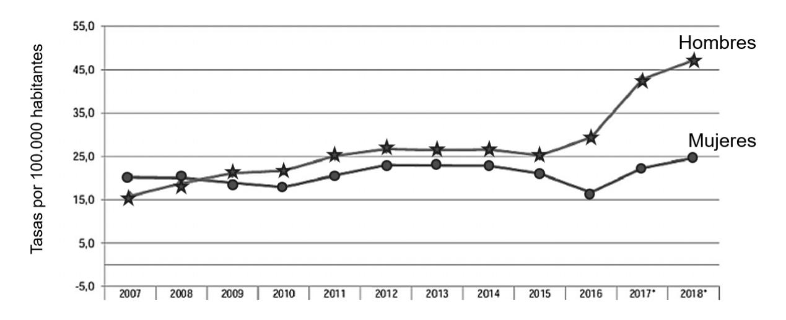

¿Cuál de las siguientes aseveraciones es correcta respecto a la gráfica?

- A) Entre el año 2011 y 2015 hubo una disminución en los casos de sífilis en ambos sexos.
- B) La tasa de sífilis en hombres muestra una tendencia constante entre el 2013 y 2016.
- C) El aumento en la tasa de contagio de sífilis es mayor en hombres que en mujeres entre el 2016 y 2018.
- D) La tasa de sífilis en hombres supera a la tasa en mujeres desde el año 2007.
- 2. Una pareja desea posponer durante dos años la posibilidad de tener un hijo. ¿Cuál de los siguientes métodos de control de la natalidad es el más efectivo para este propósito?
  - A) Un implante subcutáneo
  - B) El método del ritmo
  - C) Una vasectomía
  - D) Un espermicida

- 3. Algunos métodos hormonales de control de la natalidad están constituidos por una combinación de progestágenos y estrógenos. ¿Cuál es el efecto principal de este tipo de métodos?
  - A) Mantener los niveles hormonales como si hubiera embarazo.
  - B) Eliminar los espermatozoides en las vías genitales femeninas.
  - C) Bloquear la formación del tapón mucoso en el cuello uterino.
  - D) Impedir el tránsito del embrión desde el oviducto hacia el útero.
- 4. Una mujer sana de 35 años estaba usando un método anticonceptivo natural y desea cambiarlo por otro más efectivo y fácilmente reversible. Considerando que tiene menstruaciones abundantes y dolorosas, ¿cuál de los siguientes métodos sería el más apropiado para ella?
  - A) DIU de cobre
  - B) Diafragma vaginal
  - C) Ligadura de oviductos
  - D) Anticonceptivos orales
- 5. ¿Cuál de las siguientes características es suficiente para determinar si un individuo ha entrado en la pubertad?
  - A) La presencia de gónadas
  - B) El tamaño y peso del individuo
  - C) La capacidad de generar gametos
  - D) La presencia de hormonas sexuales

# **Área temática: Organismo y ambiente**

La Fotosíntesis es un proceso fundamental para la vida en la Tierra, mediante el cual las plantas, algas y algunas bacterias transforman la energía solar en energía química, produciendo oxígeno y nutrientes esenciales. Este fenómeno no solo sustenta a los organismos fotosintéticos, sino que también es la base de las cadenas alimentarias y el equilibrio de los ecosistemas.

Por otro lado, los Ecosistemas son sistemas dinámicos en los cuales los componentes bióticos y abióticos están en interacción recíproca, donde la energía y la materia fluyen a través de modelos de cadenas alimentarias o tróficas. En este sentido, la Fotosíntesis es fundamental para que la materia y la energía fluyan al interior de estos sistemas, sustentando los procesos vitales de las poblaciones que los conforman.

# **Objetivos de aprendizaje**

- Explicar cómo los organismos autótrofos, como plantas, algas y cianobacterias, capturan la energía solar y la transforman en energía química almacenada en moléculas orgánicas como la glucosa.
- Describir las fases dependiente e independiente de luz (ciclo de Calvin), identificando los reactivos, productos y estructuras celulares involucradas, como los cloroplastos y los pigmentos fotosintéticos (clorofila).
- Explicar cómo este proceso es la base de las cadenas y tramas tróficas, permitiendo la transferencia de energía y nutrientes a través de los ecosistemas.
- Determinar cómo la intensidad lumínica, la concentración de CO₂, la temperatura y la disponibilidad de agua influyen en la eficiencia fotosintética.
- Entender cómo los productos de la fotosíntesis (glucosa y oxígeno) son utilizados por los seres vivos en la respiración para obtener energía.
- Reconocer el papel de la fotosíntesis en la producción de oxígeno atmosférico y su contribución al ciclo del carbono, esencial para la vida en la Tierra.
- Comprender cómo la energía y la materia fluyen al interior de los Ecosistemas gracias a la Fotosíntesis, mediante el estudio de cadenas y tramas tróficas.

# Capítulo 1: Fotosíntesis

# 1. Estrategias de nutrición en los ecosistemas

Los seres vivos pueden ser clasificados según la estrategia empleada para obtener sus nutrientes con base de carbono, y la energía necesaria para impulsar sus funciones y procesos biológicos. En términos generales, podemos clasificarlos en:

| Fuente de energía                                     |                                                                                                                                                                              | ,                                                                                                                                                                                                                                              |
|-------------------------------------------------------|------------------------------------------------------------------------------------------------------------------------------------------------------------------------------|------------------------------------------------------------------------------------------------------------------------------------------------------------------------------------------------------------------------------------------------|
| Tuestic de chergia                                    | FOTOSINTETICO                                                                                                                                                                | QUIMIOSINTÉTICO                                                                                                                                                                                                                                |
| Fuente de carbono                                     | Utiliza luz                                                                                                                                                                  | Utiliza la energía de otras reacciones                                                                                                                                                                                                         |
|                                                       | Fotoautótrofo                                                                                                                                                                | Quimiautótrofos                                                                                                                                                                                                                                |
| AUTÓTROFO  Utiliza carbono\ninorgánico como\nel CO2   | Organismos vegetales, protozoos, cianobacterias y algas son capaces de utilizar la energía solar y el CO 2 para sintetizar sus propias moléculas como la glucosa. | Las bacterias del género <i>Nitrobacter</i> son capaces de obtener energía de reacción de oxidación del amonio (NH 4 + ) presente en el suelo. De esta forma sintetizan su propio alimento a partir de CO 2 . |
|                                                       | Fotoheterótrofo                                                                                                                                                              | Quimioheterótrofo                                                                                                                                                                                                                              |
| HETERÓTROFO  Utiliza carbono orgánico como la glucosa | Las bacterias de la familia Acetobacteraceae son capaces de producir su propio alimento utilizando radiación y compuestos orgánicos.                                         | Comprende a aquellos organismos que utilizan la energía de reacciones de oxidación y carbono orgánico para impulsar sus funciones biológicas. Un ejemplo típico corresponde a los animales.                                                    |

En este capítulo nos centraremos en la estrategia basada en los organismos fotoautótrofos, es decir, aquellos que realizan la **fotosíntesis.** 

El proceso fotosintético es aquel mecanismo bioquímico a través del que ciertos tipos de organismos son capaces de sintetizar sus propias moléculas orgánicas a partir de compuestos inorgánicos que obtienen desde el ambiente, todo esto mediado por una fuente energética virtualmente infinita que es la luz del sol.

La ecuación general de este proceso es la siguiente:

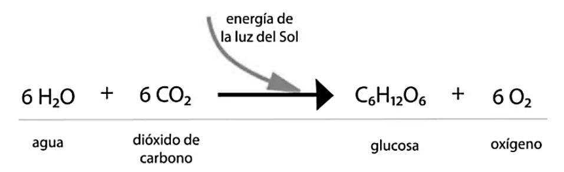

Los principales organismos fotosintetizadores en la Tierra son las plantas, las algas, algunos grupos de procariotas y algunos protozoos del grupo de los euglenoideos.

# **2. Cloroplastos**

En las plantas, algas y, con pequeñas diferencias, en los protozoos, la fotosíntesis se realiza en el interior de unos organelos membranosos llamados cloroplastos.

Los cloroplastos están característicamente rodeados por dos membranas, al igual que podemos observar en las mitocondrias y los núcleos.

El interior del cloroplasto se denomina **estroma**, y este comprende el espacio entre la

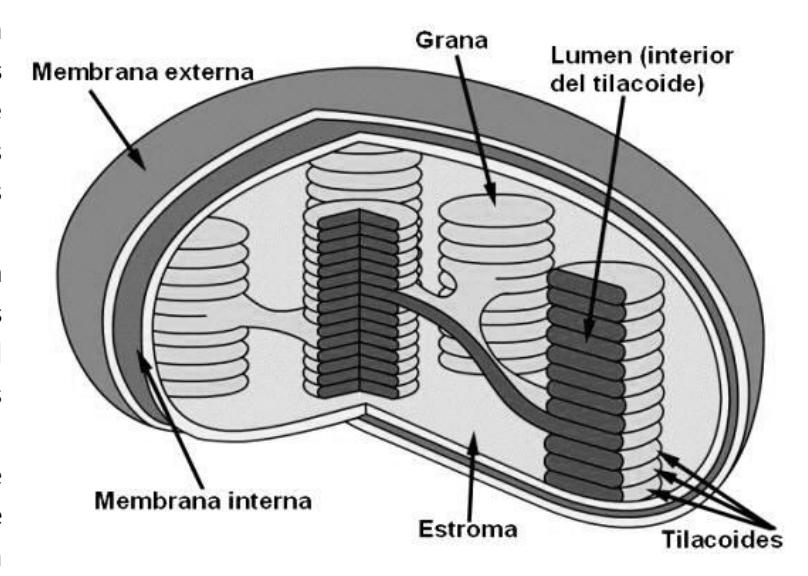

membrana interna y los tilacoides. Está formado por agua, ADN, ARN, ribosomas, enzimas y sales minerales, entre otros.

El interior del cloroplasto presenta un complejo sistema de membranas interconectadas que forman sacos aplanados llamados **tilacoides**. Los tilacoides se apilan formando unidades más grandes llamadas **granas**. Los pigmentos y sus moléculas accesorias, responsables de la captura de la luz están situados en la membrana interna de los tilacoides.

En los procariontes fotoautótrofos, que no presentan cloroplastos, los procesos fotosintéticos ocurren en adaptaciones de la membrana plasmática y en su medio interno, específicamente en pliegues conocidos como **lamelas**.

# **3. Relación entre la luz y los pigmentos**

Desde el siglo XVII en adelante, gracias a los aportes de distintos científicos se ha logrado desentrañar la naturaleza de la luz visible. En el siglo XIX, James C. Maxwell (1831-1879), comienza a descifrar la verdadera identidad de la luz, como parte muy pequeña de un espectro continuo de radiación, el **espectro de radiación electromagnética.**

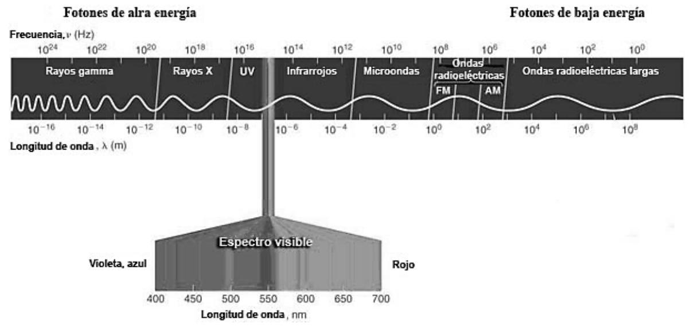

La luz visible es sólo una pequeña porción del espectro electromagnético. Va desde lo que nuestro cerebro interpreta como el color violeta hasta el rojo.

De acuerdo con el llamado modelo corpuscular de la luz, un haz de luz está compuesto por pequeños paquetes de energía, denominados actualmente cuantos de luz o fotones. La energía de un fotón no es la misma para todos los tipos de luz, sino que, en realidad, es inversamente proporcional a la longitud de onda: cuanto mayor sea la longitud de onda, menor será la energía.

# **4. Clorofila y pigmentos accesorios**

Para que la luz solar pueda ser usada por los organismos fotosintetizadores, debe ser absorbida por moléculas especializadas llamadas **fotopigmentos**.

Un pigmento es cualquier sustancia que absorbe luz de una longitud de onda particular y refleja el resto. Por ejemplo, algunos pigmentos absorben luz de todas las longitudes de onda y, por lo tanto, parecen negros.

Algunos pigmentos que intervienen en la fotosíntesis de los eucariontes son las clorofilas y los carotenoides. En las plantas, la **clorofila a** es el pigmento involucrado directamente en la transformación de la energía luminosa en energía química. Además, las células fotosintéticas también contienen la **clorofila b**.

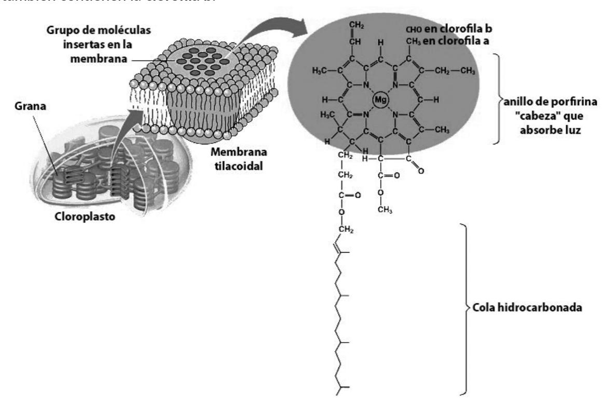

La clorofila absorbe en la región de la luz anaranjado/rojo y azul/violeta y refleja en la del verde, que es la longitud de onda que se refleja y podemos ver.

Los carotenoides son pigmentos rojos, anaranjados o amarillos, estos permiten que la planta aproveche más energía lumínica y disipan el exceso de energía en forma de calor, evitando que se dañen las moléculas de clorofila por la radiación intensa (especialmente bajo luz ultravioleta o de alta intensidad). En las hojas verdes su color está enmascarado por las clorofilas, que son más abundantes. Ejemplos de pigmentos accesorios son los carotenos y las xantófilas.

Los pigmentos vegetales se agrupan formando los **fotosistemas**. Estas estructuras están formadas por proteínas y los pigmentos antes mencionados, por lo que los fotosistemas son los encargados de captar la energía luminosa. Hay dos tipos de fotosistemas: FSII (P680) y FSI (P700).

En los fotosistemas se pueden distinguir dos partes: el **complejo antena** y el **centro de reacción**.

El **complejo antena** está formado por la agrupación de los llamados pigmentos accesorios (entre 250 y 400 moléculas de pigmentos) que actúan captando la energía luminosa. A medida que captan luz solar, la energía se transfiere de unos pigmentos a otros hasta llegar al centro de reacción.

El **centro de reacción** está formado por clorofilas a, estas reciben la energía absorbida por los pigmentos del complejo antena y se oxidan (pierden electrones). Este fenómeno se conoce como **fotooxidación.**

La fotosíntesis es un proceso que se desarrolla en dos fases: **la fase dependiente de luz**, donde la luz solar es capturada por pigmentos en la membrana de los tilacoides para

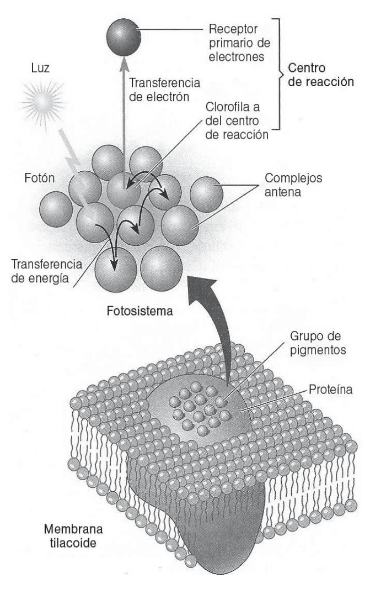

producir ATP y NADPH, y **la fase independiente de luz (ciclo de Calvin)**, que utiliza estos compuestos en el estroma para sintetizar glucosa a partir de CO₂. A continuación, ampliaremos las características de cada etapa en detalle.

### **5.1. Fase dependiente de luz**

Esta etapa ocurre en la membrana de los tilacoides y requiere los siguientes elementos: luz solar, agua, fotosistemas I y II, NADP⁺, ADP y fosfatos.

# **Activación de los fotosistemas**:

- Cuando el **fotosistema II (PSII)** absorbe luz, sus clorofilas se oxidan, liberando electrones que son transportados por una cadena de moléculas hacia el **fotosistema I (PSI)**.
- Para reponer estos electrones perdidos, el **agua se divide (fotólisis)**, liberando oxígeno (que se libera a la atmósfera), electrones (que reducen el PSII) e iones H⁺ (que se acumulan en el lumen tilacoidal).

### **Formación de NADPH y ATP**:

- El **fotosistema I (PSI)**, al absorber luz, transfiere sus electrones al **NADP⁺**, que junto con protones (H⁺) del medio forma **NADPH**.
- El flujo de electrones entre el PSII y el PSI genera un gradiente de protones que impulsa la síntesis de **ATP** (fotofosforilación).

# **Productos finales**:

- **Oxígeno** (O₂), liberado al ambiente.
- **ATP y NADPH**, que se utilizan en la fase independiente de la luz (Ciclo de Calvin) para sintetizar glucosa.

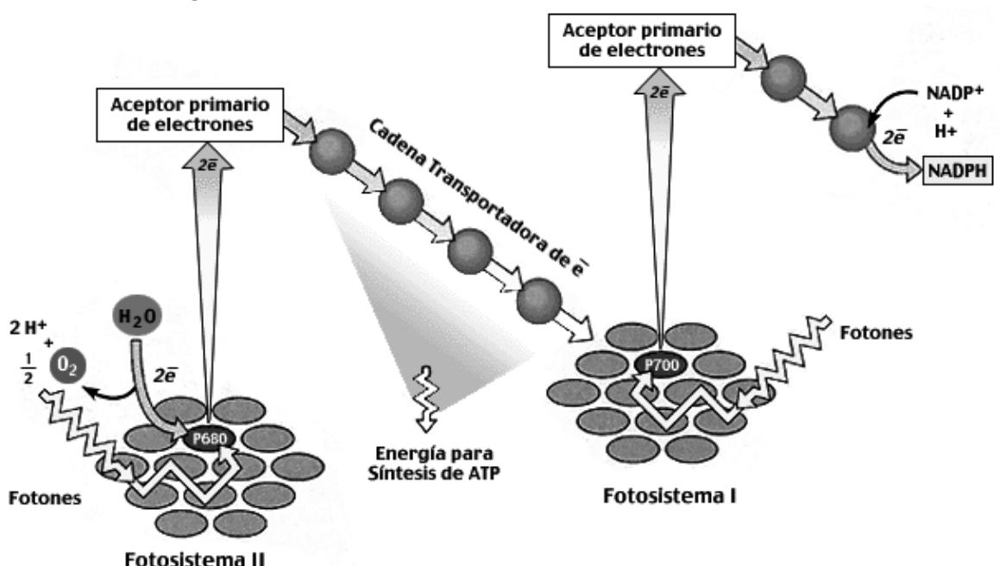

### **5.2.Fase independiente de luz**

En esta fase, el **ATP** y el **NADPH** producidos en la fase luminosa se utilizan para convertir el **dióxido de carbono (CO₂)** en un azúcar simple, transfiriendo la energía química almacenada en estas moléculas a compuestos más estables para su almacenamiento y transporte.

### **Fijación del CO₂**:

• El CO₂ se incorpora a un compuesto orgánico (ribulosa-1,5-bisfosfato, RuBP) mediante la enzima **RuBisCO**, iniciando el ciclo.

### **Reducción y formación de glucosa**:

• Los carbonos fijados se reducen usando el **NADPH** y la energía del **ATP**, generando gliceraldehído-3-fosfato (G3P), un azúcar de 3 carbonos.

• A partir del G3P, se sintetizan otros compuestos orgánicos, como **glúcidos, aminoácidos y ácidos grasos**.

### **Regeneración del RuBP**:

• Parte del G3P se recicla para regenerar la RuBP, permitiendo que el ciclo continúe.

**Producto final**: Moléculas orgánicas que sirven como base para la biosíntesis de nutrientes esenciales para la planta, principalmente glucosa.

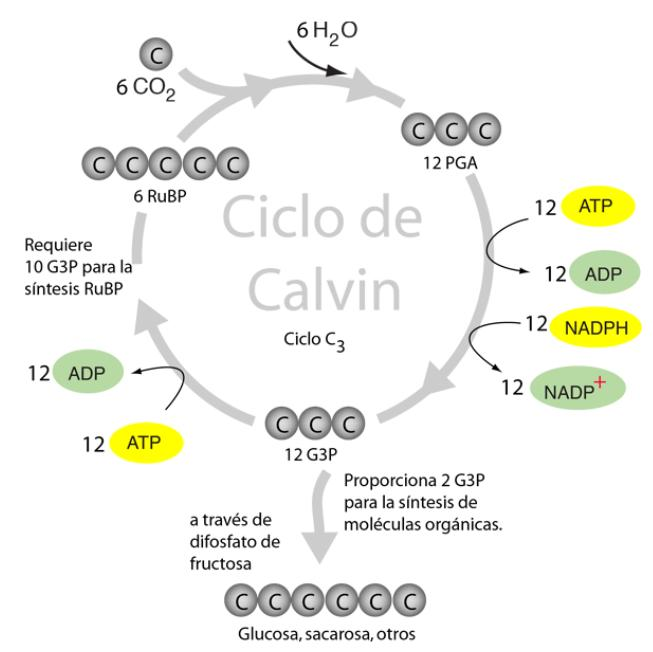

# **6. Resumen de las fases de la fotosíntesis**

| Criterio de comparación | Fase dependiente de la luz                                                                                                                                                                            | Fase independiente de la luz                                                                                 |
|-------------------------|-------------------------------------------------------------------------------------------------------------------------------------------------------------------------------------------------------|--------------------------------------------------------------------------------------------------------------|
| Lugar donde se realiza  | Membrana de los tilacoides.                                                                                                                                                                           | Estroma                                                                                                      |
| Elementos necesarios    | Agua, NADP, ADP, fotosistemas I y II.                                                                                                                                                        | CO2, ATP y NADPH                                                                                             |
| Resumen del proceso     | Durante esta fase se produce la fotólisis del agua, fotofosforilación para la formación de ATP, fotooxi dación de los fotopigmentos y la fotorreducción del NADP. | Durante esta fase se forma glucosa gracias a la fijación de CO2, y a la utilización de ATP y NADPH. |
| Productos               | ATP, O2 y NADPH                                                                                                                                                                                    | Glucosa y otras moléculas orgánicas como almidón, celulosa, lípidos y proteínas.                 |

Las etapas dependiente e independiente de la luz se encuentran separadas por compartimentalización al interior del cloroplasto, no obstante, los procesos se interconectan ya que los productos de la etapa dependiente de luz (ATP y NAPH) son utilizados en la etapa independiente de luz o ciclo de Calvin.

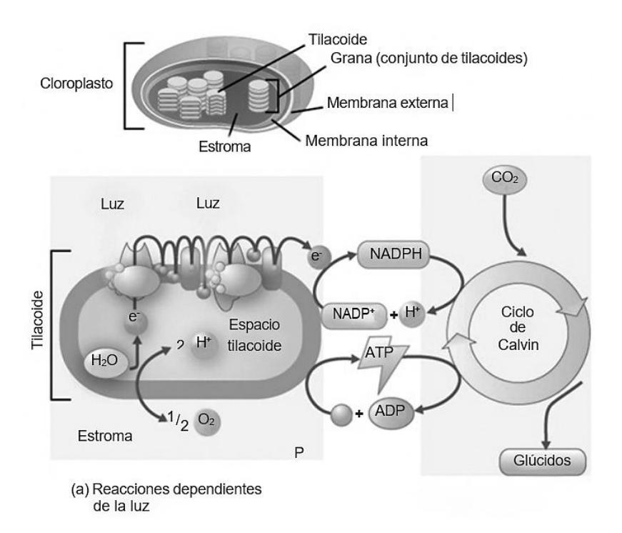

# **7. Relación entre fotosíntesis y respiración celular**

La fotosíntesis es un proceso que está íntimamente relacionado con la respiración celular.

El proceso de respiración celular libera CO2 y agua, productos que son utilizados por la fotosíntesis, en la formación de glucosa. En cambio, el oxígeno y la glucosa, producidos en la fotosíntesis, son utilizados por la respiración celular, en la síntesis de ATP.

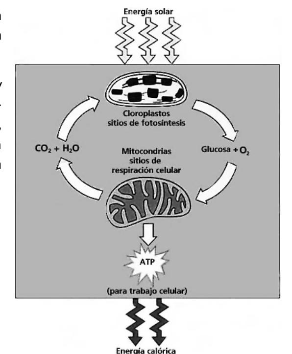

# **8. Factores que afectan a la fotosíntesis**

### **Factores internos de la planta**

• Cantidad de estomas

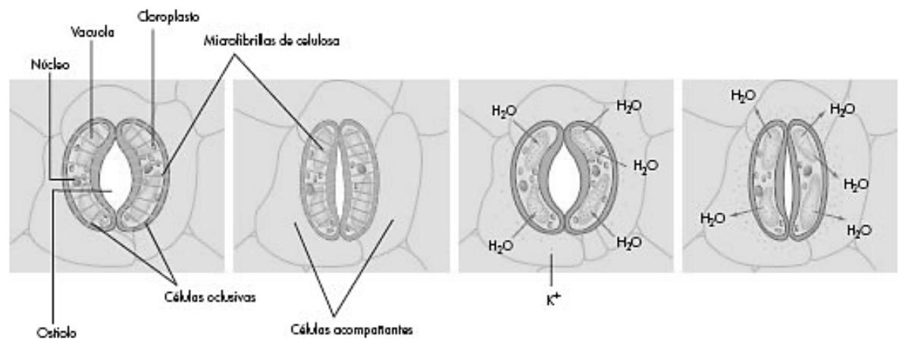

- Las condiciones anatómicas y fisiológicas del vegetal, tales como la estructura de la hoja, el contenido de clorofila y la actividad de las enzimas fotosintéticas.
- Grosor de la cubierta de las hojas.
- Contenido de agua en la planta.
- Edad y condición fisiológica de la hoja.

### **Factores externos**

• **Temperatura:** la fotosíntesis alcanza su máximo valor de tasa fotosintética en diferentes rangos de temperatura. Sin embargo, las enzimas reducen su actividad en temperaturas muy extremas, debido a la desnaturalización proteínica.

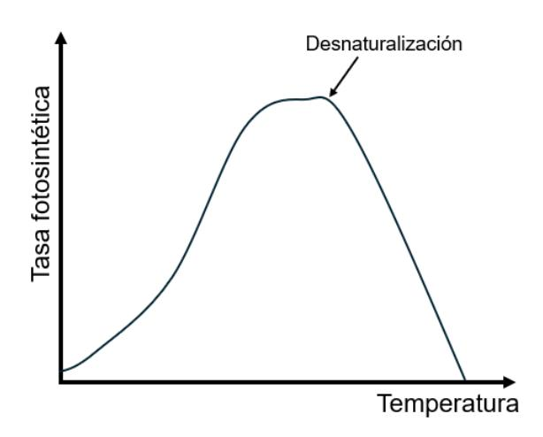

• **Acidez del medio (pH):** El pH del entorno donde se desarrolla una planta puede afectar su rendimiento fotosintético, básicamente porque macromoléculas como las enzimas responsables del proceso operan en torno a un valor óptimo de acidez. Fuera de los límites de tolerancia, la actividad disminuye, por ejemplo, por desnaturalización de proteínas.

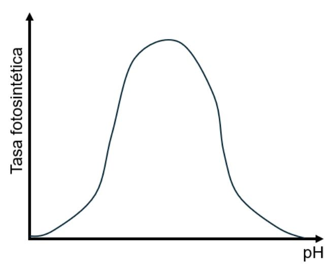

• **Presencia de O2:** La enzima rubisco puede reaccionar con el oxígeno del medio, disminuyendo su eficiencia. Esta sustancia actúa como una especie de inhibidor capaz de bajar la afinidad de la rubisco por el CO2 (fotorrespiración).

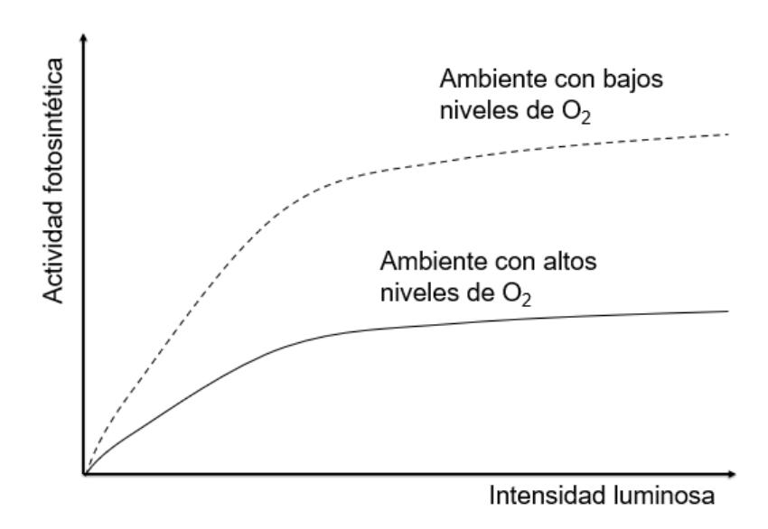

• **Concentración de CO2**: El CO2 es la molécula utilizada por las plantas para producir diversas moléculas orgánicas. La falta de él disminuye la productividad y en exceso el proceso de fotosíntesis se satura, ya que depende de la acción de enzimas.

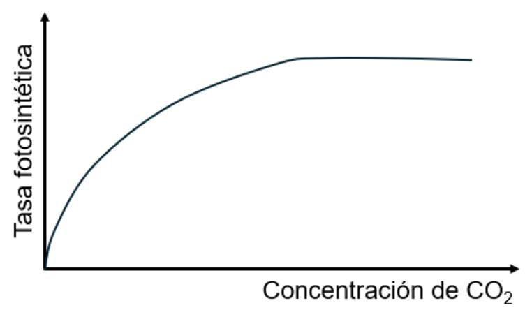

• **Intensidad luminosa**: En menores cantidades de luz las plantas presentan una menor tasa de fotosintética que en las que se encuentran bajo la incidencia de mayor cantidad de luz, pero si la luz es excesiva las plantas pueden presentar un descenso rápidamente de la fotosíntesis, ya que la luz satura a los fotosistemas y daña a los tejidos.

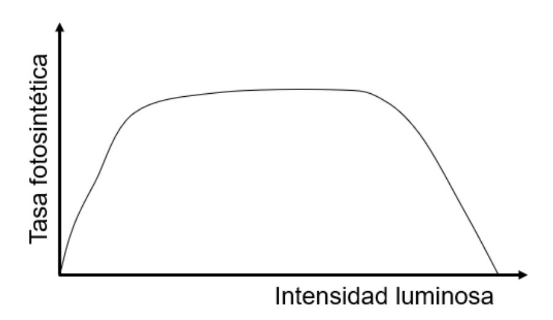

• **Cantidad de agua**: Ante la falta de agua en el terreno y de vapor de agua en el aire disminuye el rendimiento fotosintético. Esto se debe a que la planta reacciona, cerrando los estomas para evitar su desecación, dificultando de este modo el ingreso de CO2.

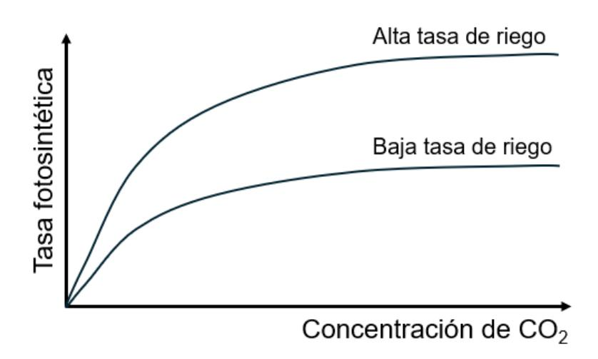

# **Capítulo 2: Ecosistemas**

Un ecosistema es un sistema dinámico formado por **seres vivos** (componentes bióticos) y su **entorno físico** (factores abióticos), que interactúan como una unidad funcional. Está compuesto por:

- **Comunidades biológicas** (poblaciones de distintas especies).
- **Hábitat** (espacio físico con condiciones ambientales específicas).

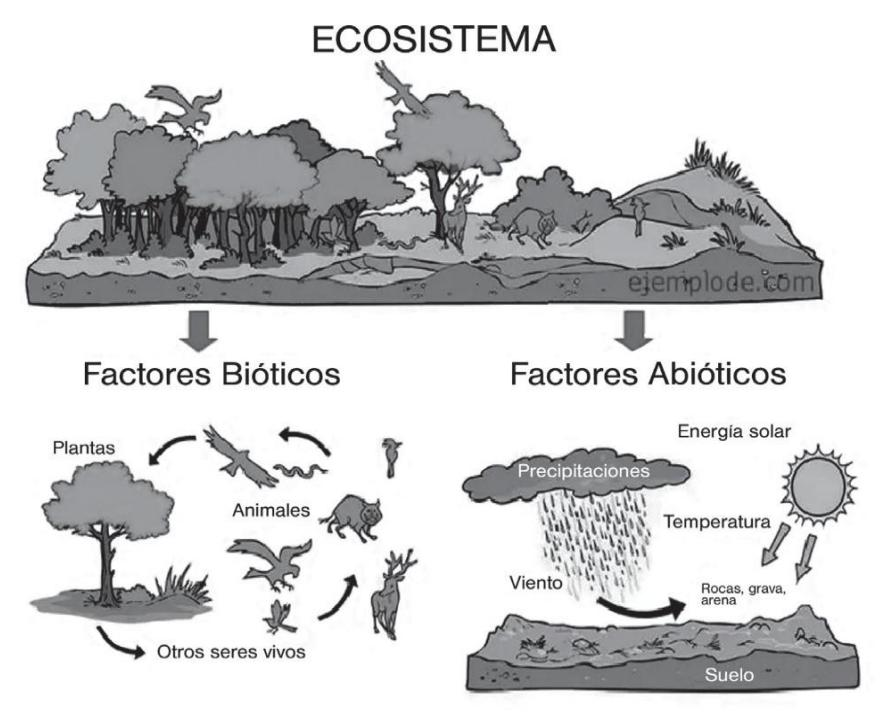

Desde un punto de vista cuantitativo, los ecosistemas pueden ser descritos en función de la cantidad de individuos, del número de diferentes especies que lo conforman y de la cantidad de energía que fluye en ellos. Algunos conceptos útiles que te ayudarán a comprender la dinámica de ecosistemas es el siguiente:

- **Abundancia**: Número de individuos de una especie particular
- **Riqueza:** Diversidad de especies presentes en el territorio ocupado por el ecosistema
- **Flujo de energía:** Proceso a través del cual se integra energía a través de los organismos productores y luego se utiliza a lo largo de las cadenas tróficas.

Los ecosistemas varían en escala (desde un charco hasta un bosque) y su equilibrio depende de las interacciones entre sus componentes.

# **Flujo de materia y energía en los ecosistemas**

Los ecosistemas se mantienen a lo largo del tiempo en un delicado equilibrio gracias al flujo de energía y materia a través de ellos, estos procesos son esenciales para mantener la vida. La energía ingresa en forma de luz solar al ser capturada por los productores (organismos fotoautótrofos) mediante la fotosíntesis, luego se transfiere a través de las cadenas alimentarias en forma de moléculas energéticas por medio de sucesivas relaciones de depredación. A diferencia de la energía, caracterizada porque parte de ella se disipa como calor, la materia (moléculas orgánicas, inorgánicas y agua) se recicla constantemente entre los seres vivos y el ambiente. A continuación, exploraremos cómo estos procesos sostienen los ecosistemas y por qué su equilibrio es crucial para la biodiversidad.

# **Cadenas y tramas tróficas**

Los seres vivos de los ecosistemas se organizan en los llamados **niveles tróficos**. Esta organización se centra en cómo la energía fluye en los procesos alimenticios de cada individuo, organizándose en las llamadas **cadenas tróficas** o **alimentarias.**

# **1. Primer nivel trófico**

El **primer nivel trófico** de una trama o red alimentaria siempre está ocupado por un **productor.**

Los productores son aquellos organismos que sintetizan o producen su propio alimento.

Los organismos que pertenecen a este nivel son los fotosintetizadores, tales como plantas, algas y cianobacterias, y los organismos quimiosintetizadores, que son bacterias que producen moléculas orgánicas, gracias a la energía proveniente de compuestos químicos inorgánicos. Un ejemplo de quimiosintetizadores son las bacterias que viven en el fondo del mar. En este lugar, las bacterias utilizan la energía del ácido sulfhídrico (H2S) para sintetizar sus propias moléculas orgánicas.

# **2. Consumidores**

Son organismos heterótrofos que se alimentan de otros seres vivos o de sus partes. Este grupo es representado por los animales.

- **Consumidor primario**: Se alimentan directamente de los productores, por lo que son denominados herbívoros. Ellos ocupan el segundo nivel trófico o alimenticio.
- **Consumidor secundario**: Son aquellos que se alimentan directamente de los consumidores primarios, por lo tanto, se les denomina carnívoros de primer orden. Estos pertenecen al tercer nivel trófico.
- **Consumidor terciario**: Son animales que se alimentan del consumidor secundario. Por lo tanto, pertenecen al cuarto nivel trófico.

# **3. Descomponedores**

Los descomponedores (detritívoros especializados) son microorganismos que habitan en el suelo y son los encargados de degradar y descomponer organismos muertos o restos de ellos. Ejemplo de este grupo son las bacterias y hongos saprobiontes o saprófitos.

Los descomponedores juegan un papel fundamental en los ecosistemas, ya que permiten que los nutrientes se reciclen y

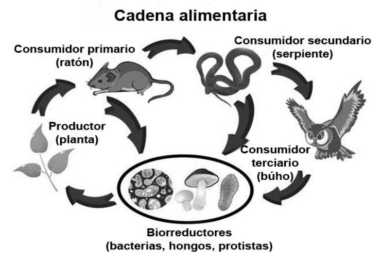

vuelvan a ser utilizados. Si no estuvieran presentes, la materia orgánica quedaría en el suelo, interrumpiéndose el ciclo de la materia.

Esto determina que la materia que formaba parte de los seres vivos sea devuelta al ambiente, específicamente al suelo, donde puede volver a ser utilizada por los productores, los que a su vez la transmitirán a los consumidores primarios y así sucesivamente a lo largo de la cadena.

El hecho de que los descomponedores actúen sobre organismos muertos puede hacer pensar que siempre actúan en el último nivel trófico. Sin embargo, los descomponedores pueden actuar en **cualquier nivel trófico**.

# **4. Detritívoros**

Son organismos que se alimentan de desechos o detritos, de un ecosistema (flojas, ramas, troncos de árboles muertos, heces o fecas, exoesqueletos, etc.). Por lo tanto, son consumidores que utilizan presas muertas en lugar de vivas.

Este grupo está representado por animales, vertebrados e invertebrados, tales como: Buitres, cóndores, cangrejos, lombrices, etc.

Este grupo no pertenece a un determinado nivel trófico, ya que su fuente alimenticia proviene de diferentes organismos.

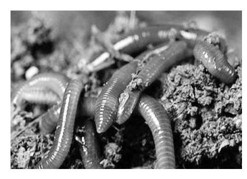

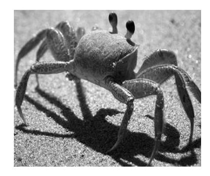

# **5. Cadenas tróficas**

Una cadena alimenticia o trófica es una relación lineal entre los diferentes niveles tróficos. En esta un organismo se alimenta del nivel anterior.

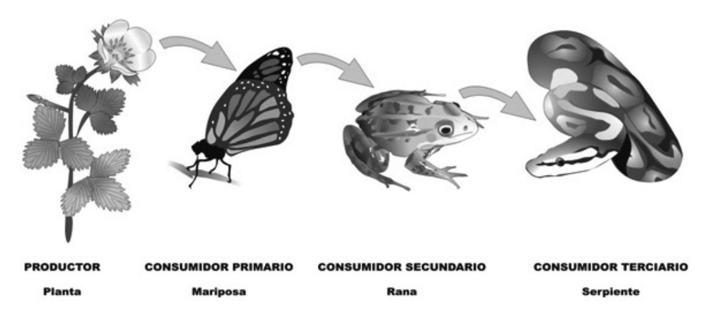

La energía en una cadena alimenticia fluye en una sola dirección (flujo unidireccional). En esta la cantidad de energía que contiene el primer nivel trófico es mayor que el resto de los niveles tróficos. Esto genera que a medida que se avanza en la cadena alimenticia, la cantidad de energía va disminuyendo, esto ocurre porque, en cada nivel trófico se ocupa parte de la energía que se recibe del nivel anterior. Por lo tanto, un 10% de la energía total es transferida al siguiente nivel trófico.

La principal razón de que las cadenas tróficas no tengan más de 4 a 5 niveles tróficos se debe a que la energía disponible para ser empleada por el siguiente nivel trófico es mínima, no obstante, cada nivel trófico es más eficaz en la captación energética que el anterior.

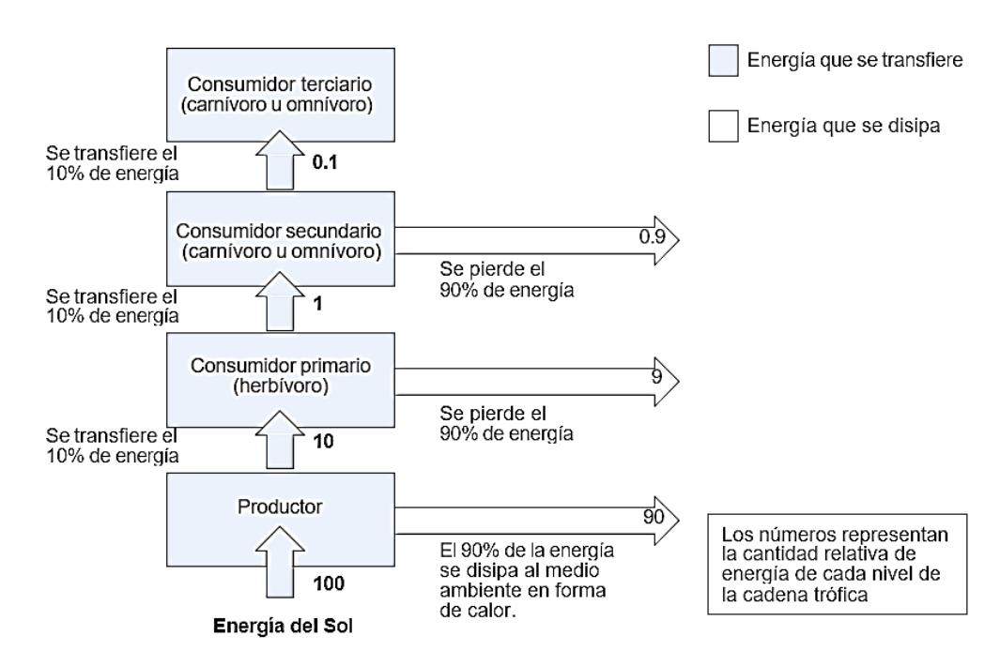

# **6. Trama trófica**

Una red o trama alimenticia corresponde a un conjunto de cadenas tróficas interrelacionadas. En estas, podemos observar que algunos consumidores se alimentan de varios niveles tróficos.

Por lo tanto, un consumidor, al alimentarse de un herbívoro y de un consumidor secundario, puede pertenecer al tercer y cuarto nivel trófico, al mismo tiempo.

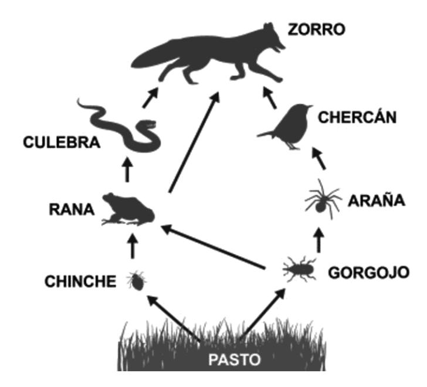

# **Ejercicios sobre Fotosíntesis**

- 1. En una investigación del año 2010, un equipo a cargo de Min Chen publicó el descubrimiento de un nuevo tipo de clorofila presente en algas y cianobacterias de Australia. Esta fue bautizada como clorofila F y se caracteriza por poder absorber energía de la luz roja muy cercana al infrarrojo, una parte del espectro que se creía inaccesible para la fotosíntesis. Los organismos que presentan este tipo de clorofila se encuentran en lugares profundos del océano donde casi no hay disponibilidad de luz solar. Otro posible beneficio es que la luz de esa longitud de onda es más penetrante, por lo que podría alcanzar lugares más profundos en los tejidos, aumentando así el rendimiento fotosintético de los organismos que presenten esta variedad de clorofila. La parte subrayada del texto corresponde a:
  - A) Una teoría
  - B) Un modelo
  - C) Una inferencia
  - D) Una conclusión
- 2. Un equipo de investigación somete a tres cultivos de células vegetales a tres condiciones de luz diferentes. Luego observa las muestras al microscopio óptico, encontrándose con los siguientes resultados:

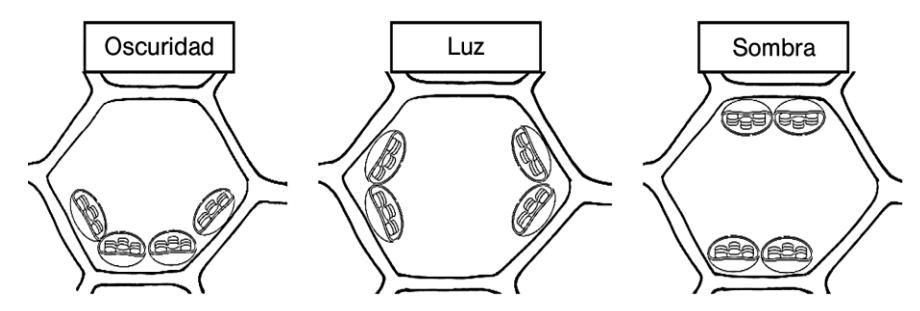

A partir de la información aportada, ¿cuál de las siguientes alternativas corresponde a una pregunta de investigación coherente con los resultados obtenidos?

- A) ¿Cuántos cloroplastos presentan las células de plantas de sombra?
- B) ¿Existe relación entre las condiciones de luz y la posición de los cloroplastos en las células?
- C) ¿Cómo varia la tasa fotosintética de una planta entre el día y la noche?
- D) ¿Qué diferencias se presentan entre la fase dependiente y la independiente de luz en la fotosíntesis?

3. La biogénesis y el desarrollo de los cloroplastos en cuanto a número y tamaño, está influenciada por una serie de parámetros ambientales. A partir de esto, un equipo de investigación monta un experimento en el que someten a tres cultivos de células vegetales de la misma especie a tres condiciones diferentes de temperatura para posteriormente evaluar los cambios que podrían ser inducidos por este factor, manteniendo el resto de los parámetros ambientales constantes para los tres cultivos. Los resultados se muestran en las siguientes imágenes:

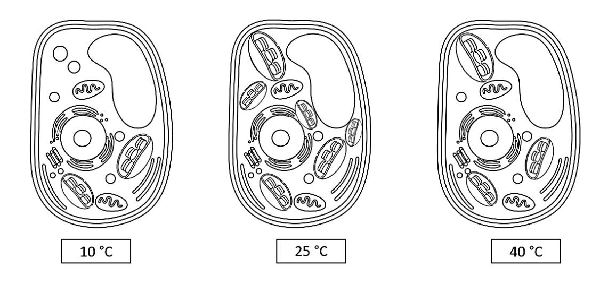

A partir de estos resultados ¿cuál de las siguientes alternativas corresponde una conclusión correcta?

- A) A 25 °C las células alcanzarán su máxima tasa fotosintética.
- B) El número de cloroplastos aumenta al aumentar la temperatura.
- C) A 25 °C se observa la mayor cantidad de mitocondrias.
- D) A 10 °C se observan más cloroplastos que a 40 °C.

4. Si iluminamos una especie de planta en tres grupos y estudiamos sus eficiencias fotosintéticas en distintas longitudes de onda, obtenemos lo que se muestra en la tabla adjunta:

| Grupo                                                     | Grupo A             | Grupo B           | Grupo Control |
|-----------------------------------------------------------|------------------------|----------------------|------------------|
| Variables                                                 |                        |                      |                  |
| Color iluminación (nm)                              | Violeta (450 nm) | Verde (520 nm) | Luz Solar     |
| Rendimiento fotosintético (Unidades arbitrarias) | 65                     | 10                   | 50               |

A partir de los datos presentados en la tabla, ¿cuál de las siguientes inferencias es correcta?

- A) La luz solar contiene todos los espectros que la planta puede absorber.
- B) Las plantas producirán menos glucosa si se irradian con luz verde que con luz solar.
- C) La fotólisis del agua se favorece más en presencia de luz verde que de luz violeta.
- D) Hay una relación proporcional entre la longitud de onda y la tasa fotosintética.

5. Los líquenes corresponden a un grupo de simbiontes entre un alga y un hongo. En un estudio, respecto del impacto del azufre en la sobrevida de los líquenes provenientes de la zona cordillerana del Maule, un grupo de científicos chilenos diseña un protocolo experimental (variables de temperatura, presión, luminosidad y oxígeno constantes) basado en lo que se observa en la imagen:

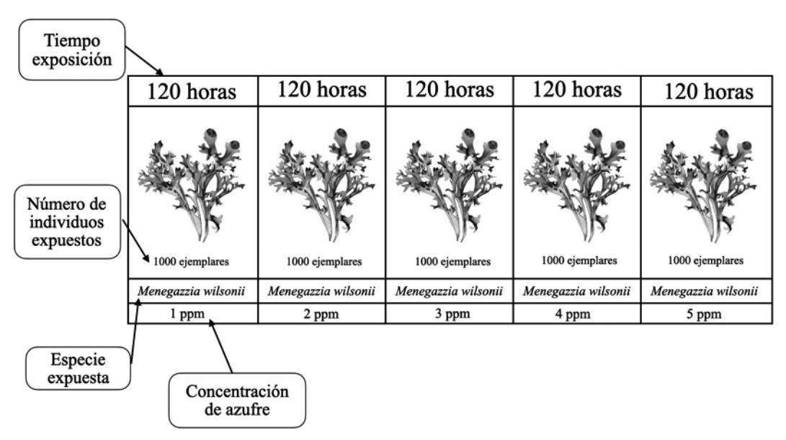

Luego de obtener resultados y la conclusión de que "las concentraciones crecientes de azufre afectan la sobrevida de los líquenes estudiados", publican su investigación en una prestigiosa revista. Luego de unos días, los editores les informan de un error muy importante en la experimentación. A partir del recuadro, y de lo propuesto por los editores, ¿qué es correcto inferir sobre la ejecución de este experimento?

- A) Poseen un número de ejemplares por concentración mayor a lo ideal.
- B) Deben tener distintos ejemplares entre una concentración y otra.
- C) Deben expresar los grupos en concentraciones decrecientes.
- D) Falta un grupo que no sea expuesto a concentraciones de azufre.
- E) Los tiempos de exposición deben ser diferentes entre cada concentración.

# **Ejercicios sobre Ecosistemas**

1. Los detritívoros corresponden a diversos grupos de organismos que se alimentan de materia orgánica en descomposición, reduciendo grandes masas de este tipo de materia a partículas más aptas para ser abordadas por los hongos y las bacterias en el proceso de descomposición final. Estudios recientes han aportado información relevante acerca de la importancia de los organismos detritívoros en las dinámicas ecosistémicas, demostrando que, a mayor diversidad de especies detritívoras en los ecosistemas de bosque, la productividad primaria (cantidad de energía radiante almacenada directamente en forma de moléculas orgánicas) del ecosistema aumenta. ¿Cuál de las siguientes alternativas representa de manera correcta la relación entre la diversidad de detritívoros y la productividad primaria de un ecosistema de bosque?

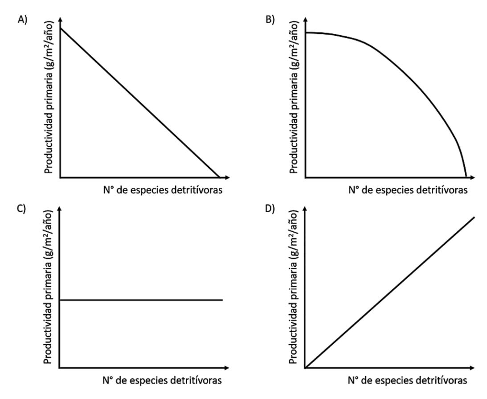

2. ¿Qué se puede afirmar correctamente respecto a la siguiente cadena trófica?

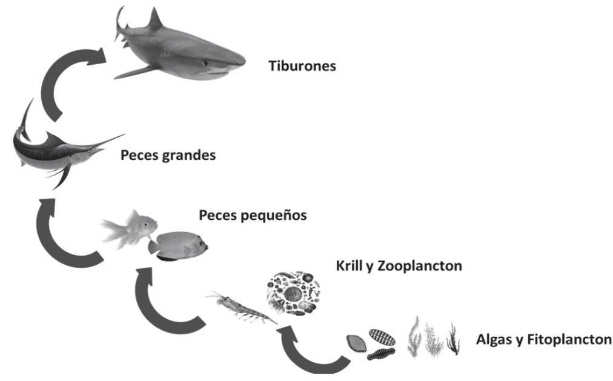

- A) El krill es una especie de productor marino.
- B) Esta cadena trófica consta de siete niveles tróficos.
- C) Los peces grandes corresponden a depredadores tope.
- D) El zooplancton está incluido en el nivel trófico conocido como "consumidores".
- E) Los tiburones constituyen el nivel trófico que presenta el mayor nivel energético.

- 3. Respecto a las estrategias de nutrición de los organismos productores y consumidores, ¿qué se puede afirmar correctamente?
  - A) Los organismos autótrofos convierten la energía solar en energía térmica, la cual es utilizada posteriormente por organismos quimiosintéticos.
  - B) Los organismos autótrofos fotosintetizadores convierten la energía solar en energía química, la cual es utilizada posteriormente por organismos heterótrofos.
  - C) Los organismos heterótrofos convierten la energía solar en energía química, la cual es utilizada posteriormente por otros organismos heterótrofos.
  - D) Los organismos autótrofos quimiosintéticos convierten la energía solar en energía térmica, la cual es utilizada posteriormente por organismos heterótrofos.

4. Los tiburones son depredadores clave en los océanos, y su desaparición puede tener consecuencias impredecibles y negativas en la estructura y función del ecosistema. Estudios científicos han demostrado que la disminución de poblaciones de tiburones ha llevado a una disminución en las poblaciones de presas, lo que a su vez ha provocado cambios en las comunidades de organismos y ha reducido la productividad del ecosistema.

La parte subrayada del texto corresponde a:

- A) Una ley.
- B) Una teoría.
- C) Una hipótesis.
- D) Una conclusión.
- 5. Las cadenas tróficas corresponden a modelos donde se representan relaciones alimentarias que ocurren al interior de los ecosistemas, poniendo especial énfasis en el flujo de energía y materia. Como todo modelo comprende límites y características que pueden venir dadas por el mismo fenómeno observado. Dentro de estas características, se encuentra que las cadenas tróficas no cuentan con más de cinco niveles, en general. Al respecto, es correcto afirmar que esto se debe a:
  - A) Que la materia no tiene un ciclo por el cual se mantiene circulando, lo cual limita el tamaño de la cadena.
  - B) Que, en general, a lo largo de una cadena trófica cualquiera, sólo un 10% de la energía de pierde en forma de calor.
  - C) Que la cantidad de energía del sol es limitada, por ende, incide directamente sobre la longitud de cadena trófica en un ecosistema.
  - D) Que a medida que avanzan los niveles tróficos el flujo de nutrientes disminuye en un 10% de forma aproximada en todas las cadenas.

CONOCE NUESTRAS PLATAFORMAS DIGITALES

