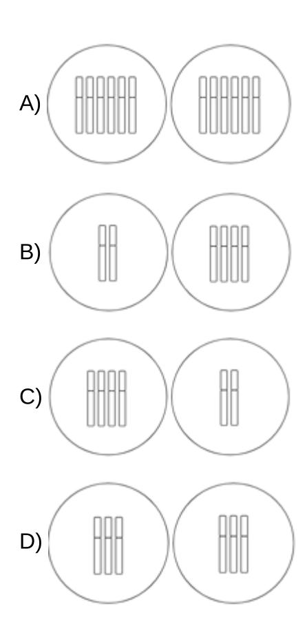
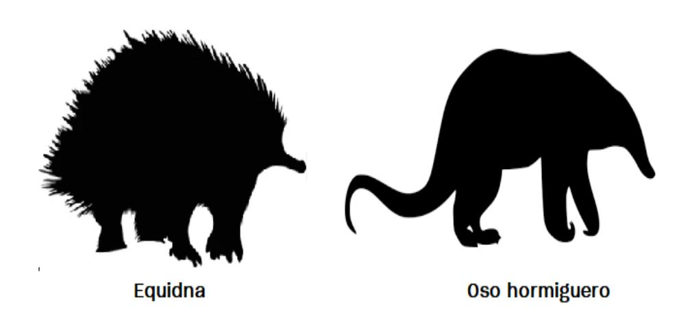
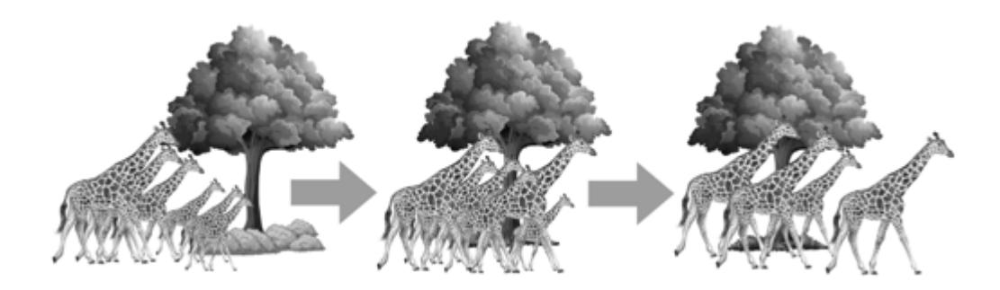
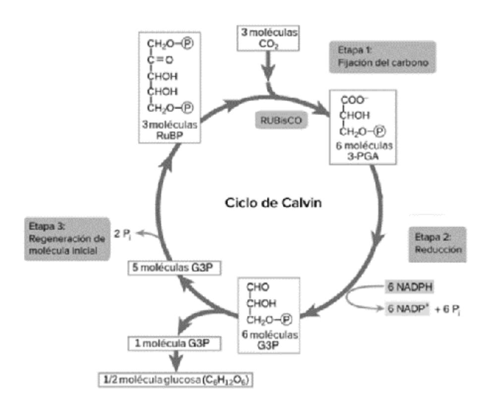
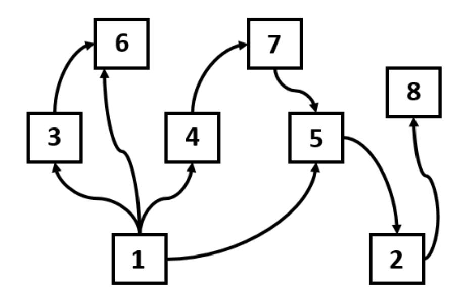

LA S IFI C A D O C L A S IFI C A D O C L A S IFI C A D O C L A S IFI C A D O

# CLASIFICADO Preu Filadd 2025 CIENCIAS BIOLOGÍA ENSAYO

A S IFI C A D O C L A S IFI C A D O C L A S IFI C A D O C L A S IFI C A D O

## Ingresa a la Universidad con

## **El Método Filadd**

**Apoyo en gestión de estrés y ansiedad**

**Diagnóstico y plan de estudio personalizado**

**Cápsulas Grabadas**

**Coaching Académico y Vocacional**

**Clases en vivo complementarias**

**Asistente virtual con IA**

**Consultas Ilimitadas**

**Guías y Ensayos**

**[filadd.cl](https://filadd.cl/?utm_source=pdf&utm_medium=pdf&utm_campaign=ensayos_clasificados&utm_term=m_d&utm_content=landing) [FILADD.CL](https://filadd.cl/?utm_source=pdf&utm_medium=pdf&utm_campaign=ensayos_clasificados&utm_term=m_d&utm_content=landing)**

- 1.En el laboratorio de Biología celular, un grupo de estudiantes universitarios extrajeron una muestra de placa dental para observarla al microscopio. Al preparar la muestra y observar en un aumento de 40X, pudieron determinar la presencia de dos capas limitantes: pared celular y membrana plasmática, además de la ausencia de organelos celulares. A partir de la información, ¿a qué tipo celular corresponde la muestra observada en el microscopio?
  - A) Un protoplasto
  - B) Una célula procarionte
  - C) Una célula eucarionte animal
  - D) Una célula eucarionte vegetal
- 2. Un estudio presentó un modelo tridimensional de la cápside del virus A de la papa (PVA) utilizando herramientas de marcación con inmunofluorescencia. Este modelo será útil para el diseño de estrategias de control de potyvirus, que afectan cultivos como papa, tomate y caña de azúcar. Según lo anterior, ¿cuál de las siguientes preguntas de investigación se responde con la información aportada?
  - A) ¿Cómo afecta la estructura de la cápside del virus A de la papa (PVA) en el proceso de infección de las plantas?
  - B) ¿Qué factores influyen en la capacidad de los potyvirus para infectar diferentes cultivos?
  - C) ¿Cómo puede el conocimiento sobre la estructura de la cápside de los potyvirus ayudar en el diseño de estrategias de control?
  - D) ¿Qué métodos permiten obtener la estructura tridimensional de los virus que afectan a la papa y el tomate?
- 3. Durante un experimento en un laboratorio de biología celular, un equipo de investigación añade una bicapa lipídica alrededor del material genético de una célula procarionte experimental, inexistente en la naturaleza. Según el tipo de célula tratada, ¿qué alternativa indica el proceso o estructura celular que sería afectado primero por la incorporación de la bicapa lipídica?
  - A) El transporte de proteínas al interior de la célula.
  - B) Síntesis de proteínas mediante los complejos supramoleculares.
  - C) Ralentización de la acción enzimática en ciertos lugares de la célula.
  - D) Expresión de proteínas mediante acción del retículo endoplasmático.

- 4. Un grupo de estudiantes colocó tres gramos de levadura en un vaso precipitado. La preparación se colocó a 20° C y enriquecieron el medio con una cucharada de azúcar. Tras 10 minutos, tomaron una muestra y observaron al microscopio, determinando que corresponde a un ejemplo de célula eucarionte. A partir de la información, ¿Cuál de las siguientes observaciones permite establecer inequívocamente definir su visualización como una célula eucarionte?
  - A) La alta compartimentalización de la célula.
  - B) La ausencia de flagelo y cilios en su superficie.
  - C) La dispersión citoplasmática del material genético.
  - D) La presencia de pared celular y membrana plasmática.
- 5.En un estudio centrado en investigar la relación entre la estructura neuronal y la velocidad de transmisión de señales en neuronas, se realizó una experimentación utilizando dos grupos de ratones. Un grupo de ratones fue sometido a un régimen de entrenamiento mental intenso, mientras que el otro grupo no realizó ninguna actividad cognitiva significativa. Tras un período de intervención, se extrajeron muestras de tejido neuronal y se analizó la densidad de las sinapsis, así como la velocidad de transmisión de los impulsos nerviosos. Considerando el diseño experimental planteado, ¿cuál sería la variable independiente en el estudio sobre la estructura neuronal y la velocidad de transmisión de señales?
  - A) Tipo de neuronas
  - B) Densidad sináptica
  - C) Régimen de entrenamiento cognitivo
  - D) Velocidad de transmisión de impulsos nerviosos
- 6. Un estudio en hepatocitos de rata muestra que existen intensidades de radiación infrarroja que generan un efecto sobre la función del Retículo Endoplásmico Liso (REL) de estas células. Para esto, los hepatocitos de distintas ratas son estimulados durante 15 días consecutivos con distintas intensidades de radiación infrarroja, lo que causa modificaciones en el volumen del REL. Al respecto, ¿cuál de las siguientes opciones corresponde a una variable dependiente de este experimento?

#### Ejercicio tipo DEMRE

- A) La intensidad de radiación infrarroja.
- B) El tiempo de irradiación.
- C) El volumen del REL.
- D) La línea celular utilizada.

7. Un grupo de investigadores realizó un estudio comparativo sobre la funcionalidad de los flagelos de espermatozoides en distintas especies de mamíferos. Para ello, midieron variables como la longitud del flagelo, la velocidad de nado y la eficiencia en la movilidad de los espermatozoides en un medio viscoso similar al ambiente reproductivo femenino. Los resultados obtenidos se presentan en la siguiente tabla:

| Especie (µm) | Longitud del flagelo | itud del flagelo Velocidad de nado (μm/s) |    |
|--------------|----------------------|-------------------------------------------|----|
| Especie A    | 55                   | 60                                        | 75 |
| Especie B    | Especie B 75         |                                           | 85 |
| Especie C    | 40                   | 50                                        | 65 |

A partir de los resultados presentados, ¿cuál podría haber sido la pregunta de investigación que guió este estudio?

- A) ¿Cómo varía la tasa de fecundación entre diferentes especies de mamíferos dependiendo de la eficiencia en movilidad?
- B) ¿Qué relación existe entre la longitud del flagelo y la velocidad de nado de los espermatozoides en diferentes especies de mamíferos?
- C) ¿Cómo afecta la viscosidad del medio a la viabilidad de los espermatozoides en distintos ambientes?
- D) ¿Qué diferencias existen en la morfología de los espermatozoides de diferentes especies de mamíferos?
- 8. En la investigación sobre los peroxisomas, los científicos han manipulado genéticamente las células para alterar la presencia de los peroxisomas, observando cambios notables en la capacidad de las células para descomponer metabolitos tóxicos. Además, han identificado patrones específicos de expresión génica asociados con la actividad de los peroxisomas. Dentro del contexto de la investigación sobre los peroxisomas, ¿cuál de las siguientes opciones presenta un objetivo de investigación coherente con la información entregada?
  - A) Investigar la contribución global de los peroxisomas a la detoxificación celular.
  - B) Evaluar la eficacia de la manipulación genética en la alteración de la cantidad de peroxisomas.
  - C) Identificar patrones específicos de expresión génica relacionados con la presencia de los peroxisomas.
  - D) Analizar la relación entre la presencia de los peroxisomas y la capacidad celular para neutralizar compuestos nocivos.

- 9.En los distintos reinos de la vida existen diversos tipos de reproducción, los cuales se agrupan en dos categorías fundamentales: la reproducción sexual y la reproducción asexual. Ambas están presentes en la mayoría de los reinos, con algunas excepciones. Sabiendo esto, ¿cuál de las siguientes alternativas presenta la diferencia clave entre la reproducción sexual y la asexual?
  - A) La reproducción sexual se da en animales, y la reproducción asexual se da en plantas.
  - B) La reproducción sexual requiere de contacto sexual directo, y la reproducción asexual no las requiere.
  - C) La reproducción sexual requiere exclusivamente dos progenitores, y la reproducción asexual requiere solo un progenitor.
  - D) La reproducción sexual requiere de la unión de gametos, mientras que la reproducción asexual no la requiere.
- 10.En un estudio realizado por un grupo de biólogos reproductivos, se analizó el proceso de reacción acrosomal en espermatozoides para entender cómo diversos factores afectan la fertilización. La investigación se centró en la influencia de la concentración de calcio en el medio de cultivo sobre la eficiencia de la reacción acrosomal, un proceso clave para la penetración del espermatozoide en el óvulo. "Los científicos manipularon la concentración de calcio en diferentes grupos de espermatozoides, midiendo la tasa de reacción acrosomal a través de técnicas de microscopía electrónica". Los resultados mostraron que a mayor concentración de calcio, la eficiencia de la reacción acrosomal aumentaba significativamente.

Con respecto a la información entregada en el enunciado, ¿a qué parte del método científico corresponde la frase subrayada?

- A) Hipótesis.
- B) Resultados.
- C) Observación.
- D) Experimentación.

11.En una investigación sobre el conocimiento de métodos anticonceptivos (MAC) fueron entrevistados 158 adolescentes, obteniendo los siguientes resultados:

| Pregunta                                       | Acierto | Falla | No sabe |
|------------------------------------------------|---------|-------|---------|
| Condón como método de prevención de las ITS | 93%     | 4%    | 3%      |
| Uso de la píldora del día después              | 71%     | 11%   | 18%     |
| Colocación del implante subdérmico             | 50%     | 5%    | 45%     |
| Uso de hormonas orales                         | 8%      | 26%   | 66%     |
| Vasectomía como método definitivo              | 57%     | 21%   | 22%     |

A partir de la información, ¿cuál de las siguientes preguntas de investigación pudo haber guiado la investigación?

- A) ¿Cómo obtienen información los adolescentes sobre los métodos anticonceptivos?
- B) ¿Cuál es el método anticonceptivo más utilizado entre los adolescentes encuestados?
- C) ¿Qué métodos utilizan los adolescentes para seleccionar los métodos anticonceptivos?
- D) ¿Cuál es el grado de conocimiento de los adolescentes sobre los métodos anticonceptivos?
- 12. Los ovocitos humanos son células grandes y no flageladas, que contienen una gran cantidad de citoplasma y organelos, y son esenciales para la reproducción. Considerando esta información, ¿cuál es el objetivo de estas características celulares?
  - A) Reducir el tamaño de la célula para facilitar la fecundación.
  - B) Proveer nutrientes y energía para el desarrollo del embrión.
  - C) Facilitar el movimiento de la célula hacia el lugar de fecundación.
  - D) Aumentar la cantidad de material genético disponible para la reproducción.

- 13. La menstruación es un proceso biológico que forma parte del ciclo reproductivo de las mujeres. Durante cada ciclo menstrual, el cuerpo se prepara para un posible embarazo. Si la fecundación no ocurre, el útero debe deshacerse del revestimiento que había preparado para recibir el óvulo fertilizado. Teniendo en cuenta lo anterior, ¿en qué consiste el proceso de la menstruación?
  - A) En preparar al útero para un embarazo.
  - B) En expulsar el ovocito almacenado en el útero.
  - C) En eliminar el tejido uterino que se preparó para un embarazo.
  - D) En desechar el tejido ovario acumulado durante un ciclo.
- 14. Los espermatozoides son células flageladas que se caracterizan por presentar numerosas mitocondrias, carecer de la mayoría de los organelos celulares y reducir su volumen citoplasmático. Considerando esta información, ¿cuál es el objetivo de estas modificaciones celulares?
  - A) Aumentar la diversidad genética.
  - B) Reducir la cantidad de material genético.
  - C) Incrementar las posibilidades de fecundación.
  - D) Utilizar todos los recursos para el movimiento.
- 15.En una investigación sobre la fecundidad en Chile, llamada Anticoncepción entre adolescentes en Chile en 2018, se establece: "En Chile, la fecundidad en la adolescencia disminuyó fuertemente desde 2008, en concordancia con el aumento del uso de métodos anticonceptivos y la diversificación de estos métodos entre las personas adolescentes, incluidos los anticonceptivos reversibles de larga duración". Considerando este contexto, ¿ a que parte del metodo científico corresponde la frase entre comillas"
  - A) Hipótesis
  - B) Resultados
  - C) Conclusión
  - D) Procedimiento

- 16.En una investigación se concluye que la inyección de una sustancia X en ratones machos inhibe la síntesis de una hormona Y. Como consecuencia de esto, disminuye considerablemente la de actividad de las células de Leydig, que se encuentran en el intersticio de los testículos, afectando la producción de testosterona. Según estos antecedentes, ¿qué opción corresponde a una inferencia correcta acerca de la función de la hormona Y?
  - A) Participa en la producción de gonadotropinas.
  - B) Forma parte de retroalimentación hormonal negativa.
  - C) Interviene directamente en la maduración de espermatozoides.
  - D) Tiene un rol indirecto en el crecimiento de órganos sexuales masculinos.
- 17.Se realiza el conteo del número de cromátidas y cromosomas presentes durante la división mitótica de un tejido celular en división de ratón (2n = 20 cromosomas), obteniendo los siguientes resultados:

|                                 | W  | Х  | Υ  | Z  |
|---------------------------------|----|----|----|----|
| Número de cromátidas por célula | 20 | 40 | 40 | 20 |
| Número de cromosomas por célula | 20 | 20 | 20 | 20 |

Considerando estos antecedentes, ¿cuál de las siguientes conclusiones es coherente con los resultados obtenidos?

- A) El número c se mantiene constante en todas las fases del ciclo celular.
- B) El aumento de la cantidad de cromátidas se debe a la clonación del ADN molde.
- C) El número de cromosomas es proporcional al número de cromátidas de cada fase.
- D) La separación de los cromosomas homólogos justifica el cambio de las fases X e Y.
- 18.En un estudio experimental sobre el ciclo celular de Xenopus laevis (Rana Africana), los investigadores analizaron las células en la fase G2 de la mitosis. Para ello, utilizaron una técnica de marcaje para identificar las proteínas clave involucradas en esta fase y observaron los cambios morfológicos en las células. ¿Cuál de las siguientes opciones sería una de las conclusiones adecuada para este estudio?
  - A) Durante la fase G2, las células completan la replicación del ADN y comienzan la condensación de los cromosomas para entrar en mitosis.
  - B) En la fase G2, las células finalizan la citocinesis y reanudan el ciclo celular, asegurando la correcta segregación de los cromosomas.
  - C) Durante la fase G2, las células experimentan una reducción en la síntesis de proteínas regulatorias, lo que evita su entrada en mitosis.
  - D) En la fase G2, la actividad de las ciclinas reguladoras aumenta, asegurando que la célula está preparada para la mitosis.

19. Un tumor es una masa anormal de tejido que aparece cuando las células se multiplican más de lo debido. Estas estructuras se pueden clasificar en benignos y malignos, tal como se resume en la siguiente tabla:

| Tipo de tumor | Similitud de tejido del que proviene | Velocidad de división | Localización              |
|---------------|-----------------------------------------|--------------------------|---------------------------|
| Benigno       | Alta                                    | Lenta                    | Permanece en el lugar  |
| Maligno       | Baja                                    | Rápida                   | Invade a otros tejidos |

Considerando los resultados de la tabla, ¿cuál de las siguientes opciones relaciona correctamente las variables dependientes e independientes?

- A) Variable independiente: tipo de tumor, localización variable dependiente: similitud de tejido, velocidad de división
- B) Variable independiente: tipo de tumor variable dependiente: similitud de tejido, velocidad de división y localización
- C) Variable dependiente: benigno, maligno variable independiente: tipo de tumor
- D) Variable independiente: similitud de tejido, velocidad de división variable dependiente: tipo de tumor, localización
- 20.En una clase de ciencias, un grupo de estudiantes está estudiando la mitosis de las células salivales. Al mirar por el microscopio las células, pudieron observar que una célula tenía formado el huso mitótico, las cromátidas hermanas estaban separadas y se desplazaban hacia los polos de la célula. Según lo anterior, ¿En qué etapa del ciclo celular se encuentra la célula que observaron?
  - A) Profase
  - B) Metafase
  - C) Anafase
  - D) Telofase

#### 21.El esquema representa los cromosomas presentes en una célula somática en G1:

Considerando la cantidad de ADN presente en la célula, ¿cuál de las siguientes alternativas permite representar correctamente a las células hijas tras el proceso mitótico?

- 22. Un equipo de investigación está estudiando el efecto que la toxina X tiene en el proceso meiótico y cómo genera células poliploides (con 3 o más juegos cromosómicos). Para realizar este estudio, el equipo estableció como primera variable la concentración de toxina X. Al respecto, ¿cuál de las siguientes opciones podría corresponder a una variable dependiente según el objetivo en este estudio?
  - A) Concentración de toxina X aplicada a los cultivos celulares.
  - B) Número de divisiones meióticas completas en presencia de la toxina.
  - C) Porcentaje de células poliploides formadas tras la exposición a la toxina.
  - D) Manipulación del ambiente de cultivo celular para optimizar el crecimiento.

- 23.En el contexto de un estudio, las científicas de un centro de investigación en biología celular provocaron errores en la permutación cromosómica de células en un cultivo sincronizado, con el propósito de analizar los mecanismos que corrigen estos errores. Considerando esta información, ¿en qué momento de la meiosis las científicas podrían comenzar a evaluar la efectividad en el funcionamiento de estos mecanismos?
  - A) Al final de la profase I.
  - B) Al inicio de la anafase I.
  - C) Al final de la metafase II.
  - D) Al final de la primera citocinesis.
- 24. Un investigador ha observado el tejido ovárico de una rata al microscopio y ha logrado identificar las siguientes características en una célula:

A partir de la información, ¿en qué fase de la meiosis debería clasificarse la célula observada?

- A) Profase II
- B) Metafase II
- C) Anafase II
- D) Telofase II
- 25.En una escuela, un grupo de estudiantes en la clase de Biología, tuvieron que realizar unos informes sobre la meiosis en mamíferos, para esto tuvieron que buscar mucha información en libros de texto, internet y videos. Con respecto a la investigación que realizaron sobre la meiosis, ¿Qué afirmación deberíamos encontrar en el informe?
  - A) Al finalizar el proceso, se obtienen células con la misma cantidad de ADN que la célula original.
  - B) Permite la recombinación genética gracias al entrecruzamiento en la profase I.
  - C) En la anafase I, las cromátides hermanas se separan y migran a polos opuestos.
  - D) En la telofase II, cada célula resultante tiene el doble de material genético que la célula madre.

- 26.En una investigación que se realizó en una universidad chilena, se hizo un experimento de clonación en mamíferos utilizando la técnica de transferencia nuclear de células somáticas (SCNT). A partir del estudio, se pudo observar que algunos embriones clonados no lograron desarrollarse correctamente y presentaron anomalías en la expresión de ciertos genes. A partir de esta información, ¿Cuál de las siguientes alternativas es una hipótesis validada por los resultados de esta investigación.
  - A) La transferencia nuclear de células somáticas garantiza la expresión normal de los genes durante el desarrollo.
  - B) La reprogramación de ADN en los embriones clonados puede ser incompleta, afectando la expresión génica.
  - C) La clonación en mamíferos no requiere la participación de un ovocito sin núcleo para que expresen los genes.
  - D) Los organismos clonados siempre presentan un desarrollo embrionario idéntico al del organismo original.
- 27.En una investigación chilena, se busca industrializar la clonación de mamíferos de alto consumo humano mediante la transferencia nuclear de células somáticas a óvulos cultivados en laboratorio. Para ello, se seleccionan células somáticas de ejemplares grandes y saludables, con el objetivo de que los clones, al poseer el mismo material genético, también presenten estas características. Sin embargo, tras un tiempo de aplicar esta técnica, los científicos evaluadores determinaron que el proceso debía detenerse de inmediato, ya que su continuidad va a provocar que los organismos clonados desarrollaran enfermedades asociadas a mutaciones genéticas. Con esta información, ¿es válida la conclusión planteada por los evaluadores?
  - A) Es válida la conclusión, dado que una clonación repetida puede llegar a provocar una no disyunción durante el crossing over.
  - B) No es válida la conclusión, dado que no se presentan datos que apoyen que en un futuro se presenten estas enfermedades.
  - C) Es válida la conclusión, dado que las mutaciones pueden darse de manera aleatoria en cualquier momento del proceso.
  - D) No es válida la conclusión, dado que las mutaciones genéticas, son procesos asociados a la meiosis, y no a la clonación.

- 28.En Chile en los últimos años, se ha estado realizando un estudio, acerca de la posibilidad de maximizar la producción de insulina en cultivos bacterianos, frente a un aumento de diabetes tipo I en la población. Para ello se sometieron los cultivos a diferentes condiciones ambientales, tales como pueden ser pH, temperatura, disponibilidad de nutrientes y proporción de gases, todo con el fin de evaluar la producción de insulina a través del tiempo en distintos cultivos. A partir de esta información ¿Cuál es la variable independiente más relevante para esta investigación?
  - A) El tipo de cultivo estudiado.
  - B) El paso del tiempo en la investigación.
  - C) Las diferentes condiciones ambientales.
  - D) La producción de insulina de los cultivos.
- 29. La transferencia nuclear se utiliza para fines terapéuticos y clonación. Esta técnica se realiza a través de los siguientes pasos:

Considerando este proceso, ¿cuál es la secuencia de eventos correcta con respecto al proceso de transferencia nuclear?

- A) 2 5 3 1 4
- B) 4 3 1 2 5
- C) 1 4 2 5 3
- D) 3 1 5 4 2
- 30.El ADN mitocondrial es el material genético presente en las mitocondrias, los orgánulos que realizan la respiración celular. "El estudio de este material genético permite inferir relaciones de parentesco entre los integrantes de una población de seres vivos", y conocer estos datos es esencial para poder poner en marcha planes de conservación en las especies. Además, existen diversas enfermedades mitocondriales ligadas a las mutaciones de este ADN, por lo que conocerlo es el primer paso para atajarlas. A partir de la información ¿a qué tipo de evidencia de evolución corresponde el fragmento subrayado?
  - A) Embriología
  - B) Biogeografía
  - C) Biología molecular
  - D) Anatomía comparada

31.En esta imagen de abajo, se encuentra la clásica planilla utilizada por la biología molecular para comparar secuencias de regiones específicas del ADN entre distintas especies. En este caso corresponde a una muy pequeña secuencia comparativa entre ADN de distintas especies, solo la del sujeto 1 se encuentra destacada.

Con esta información ¿Cuál será el pariente más cercano al

sujeto 1?

- A) Sujeto 2
- B) Sujeto 3
- C) Sujeto 4
- D) Sujeto 5

32. Los osos hormigueros habitan en Latinoamérica y tienen crías por medio de parto, es decir, son mamíferos placentarios; mientras que los equidnas viven en Australia y ponen huevos, es decir, pertenecen al grupo de los mamíferos monotremas. El equidna posee pelos modificados que se engrosan formando espinas duras, mientras que la piel del oso hormiguero es suave.

Considerando esta información ¿a qué tipo de evidencia evolutiva corresponde este ejemplo?

- A) Un ejemplo de órganos análogos.
- B) Un ejemplo de órganos vestigiales.
- C) Un ejemplo de órganos homólogos.
- D) Un ejemplo de embriología comparada.
- 33. La paleontología es la ciencia que busca y analiza los fósiles, para interpretar datos útiles en el estudio del origen de la vida en la tierra, y la historia evolutiva de los organismos. Sabiendo esto, ¿Cuál de estas respuestas contiene exclusivamente evidencias biológicas que estudiaría un paleontólogo?
  - A) Huesos de T- rex, Gastrolitos, dientes y un nido con huevos de gallina, que datan de hace 3 años.
  - B) Huella, Gastrolitos, Nidos, Raíces y Coprolitos, que datan de hace un millón de años.
  - C) Huesos, Heces, Huellas, tentáculos de calamar, que datan de hace un millón de años.
  - D) Hueso, Huevos de dinosaurio, y herramientas utilizadas por homo habilis, que datan de hace 2 millones de años

- 34.August Weissman en el siglo XIX quiso llevar a cabo una investigación, que consistió en la amputación de las colas de 20 generaciones consecutivas de ratones recién nacidos, le cortó la cola a un total de 1512 ratones, durante todo su experimento. Los resultados de este experimento revelaron que, a pesar de la intervención, los ratones seguían naciendo con colas, de manera similar a sus antepasados. Sabiendo esto ¿Qué inferencia es correcta formular?
  - A) Este experimento apoya completamente el fijismo de Lamarck, dado que las especies no cambian a través del tiempo.
  - B) Este experimento refuta completamente el transformismo de Lamarck, dado que no se heredaron características adquiridas en vida.
  - C) Después de más de 20 generaciones de experimentación, los ratones aún así nunca nacieron sin cola.
  - D) Si siguiéramos cortando la cola de los ratones por muchas más generaciones, estos eventualmente nacerían sin cola.
- 35. Darwin postuló que el mecanismo mediante el cual las especies se diversifican a lo largo del tiempo es la selección natural, pero muchas personas confunden este término, añadiendo elementos de otras teorías evolutivas, como las del transformismo Lamarckiano.SSabiendo esto ¿Cuál es las siguientes alternativas presenta una correcta definición para la selección natural darwiniana?
  - A) "Aporte de nuevas características beneficiosas a los organismos, que le confieren la capacidad de sobrevivir, reproducirse y dejar su fenotipo presente en las generaciones futuras."
  - B) "La selección natural es la razón por la cual se forman nuevas especies, a través del aporte de nuevas características gradualmente, hasta que con el tiempo se vuelven lo suficientemente diferentes como para considerarse especies distintas."
  - C) "El fenotipo de un organismo perdurará a través de las generaciones, en la medida que presente características más beneficiosas para la sobrevivencia y la reproducción, en un espacio y tiempo determinado."
  - D) "Procesos de especiación lentos y graduales, que gatillan cambios en las especies, que acumulan a lo largo del tiempo, permitiendo el desarrollo de pequeñas modificaciones"

- 36.En un laboratorio del sur de Chile, se sospecha que en los bosques nativos podría observarse el fenómeno de la selección natural, en el que los árboles ahora muestran mayor altura y cantidad de hojas, debido a presiones ambientales. Para esto se realizan mediciones en árboles endémicos, para determinar si la altura y la frondosidad de sus ramas, ha aumentado o disminuido en promedio, en comparación a las últimas mediciones realizadas en el año 1920, es decir hace 100 años atrás. "Los resultados indicaron que la altura promedio de los árboles y la frondosidad no ha variado de manera significativa, esto se puede deber a que la radiación disponible en el sur de Chile es elevada, y no supone un recurso limitado por el cual las especies deban competir". Esta última frase entre comillas ¿a que parte del método científico corresponde?
  - A) Inferencia
  - B) Hipótesis
  - C) Experimentación
  - D) Observación
- 37.Esta imagen de abajo, representa una de las ideas más importantes de las teorías evolutivas de Darwin, que es la selección natural, esta imagen muestra a una población de jirafas, mostrando a la izquierda un periodo pasado, y a la derecha el periodo actual.

Sabiendo esto ¿Cuál podría ser una correcta interpretación de esta imagen?

- A) Esta imagen además de apoyar las ideas de Darwin, también apoya las de Lamarck, ya que el organismo apuntó hacia la perfección.
- B) Esta imagen muestra cómo a través de los años, la selección natural le dió a las jirafas cuellos más largos para poder comer hojas altas.
- C) Con el pasar de los años sobreviven aquellos organismos cuyas características les confieren más supervivencia.
- D) Las jirafas más pequeñas son crías, que con el pasar del tiempo alcanzaron un tamaño suficiente para poder alimentarse y sobrevivir.

38.A continuación se presenta una tabla que compara las ideas principales de Lamarck y de Darwin, enfrentado sus distintos postulados.

| Jean Baptiste Lamarck                                   | Charles Darwin                                   |  |
|---------------------------------------------------------|--------------------------------------------------|--|
| Los seres vivos apuntan hacia la perfección.            | Los seres vivos apuntan a ser los más fuertes.   |  |
| Las jirafas evolucionaron por la ley del uso y desuso.  | Las jirafas evolucionaron por selección natural. |  |
| Los seres vivos siempre tenderán a ser más complejos | Los seres vivos nunca tenderán al cambio.        |  |
| La base de mis ideas son el fijismo                     | La base de mis ideas son el transformismo.       |  |

Observando la tabla ¿Cuál sería una afirmación correcta al respecto?

- A) La fila 1 es incorrecta dado que Lamarck en realidad postuló que los organismos apuntan hacia la adaptación.
- B) La fila 2 contiene información correcta sin excepción.
- C) La fila 3 es incorrecta dado que Darwin en realidad postuló que los organismos a veces sí pueden evolucionar.
- D) La fila 4 contiene información correcta sin excepción.
- 39. Un equipo de investigadores llevó a cabo un estudio en plantas para evaluar la eficacia de dos tratamientos diferentes en la mejora de la eficiencia de absorción de luz. Se seleccionaron 150 plantas de la misma especie y se dividieron en dos grupos: Grupo A y Grupo B. Al Grupo A se le aplicó el Tratamiento X, mientras que al Grupo B se le aplicó el Tratamiento Y. Después de un período de seis semanas, se registraron los resultados obtenidos en ambos grupos. ¿Cuál de las siguientes opciones corresponde a la variable dependiente?
  - A) El tratamiento X e Y administrado en las plantas.
  - B) La cantidad de plantas utilizadas en el experimento.
  - C) La eficiencia en la absorción de la luz de las plantas.
  - D) El periodo de tiempo luego de la administración del tratamiento.

- 40.En un proyecto de investigación centrado en la fase luminosa de la fotosíntesis en plantas, se busca comprender cómo los pigmentos fotosintéticos capturan la energía luminosa y la convierten en energía química. La pregunta clave es cómo se podría determinar experimentalmente la eficiencia de la fase luminosa en un grupo de plantas sometidas a diferentes condiciones de luz. ¿Cuál de las siguientes opciones representa el procedimiento más adecuado para investigar la eficiencia de la fase luminosa de la fotosíntesis en plantas?
  - A) Evaluar la cantidad de carbono captado a través de las hojas de las plantas.
  - B) Evaluar la velocidad de la síntesis de glucosa en el estroma de los cloroplastos.
  - C) Medir la cantidad de oxígeno producido por las plantas durante la fotosíntesis.
  - D) Analizar la composición química de los carotenoides presentes en las hojas de las plantas.
- 41. Un equipo de científicos ha descubierto una nueva especie bacteriana en un entorno extremo y propone la hipótesis de que esta bacteria exhibe nutrición autótrofa. La bacteria fue aislada de un hábitat donde no se observan fuentes orgánicas evidentes, y se sospecha que puede utilizar la energía de la luz solar o la oxidación de compuestos inorgánicos para obtener carbono y energía. Dentro del contexto descrito, ¿cuál de las siguientes opciones representaría la evidencia más sólida para respaldar la hipótesis de que la bacteria es autótrofa?
  - A) Medición de la tasa de crecimiento de la bacteria en presencia y ausencia de luz solar.
  - B) Identificación de genes asociados con la fijación de carbono y la síntesis de compuestos orgánicos en el genoma bacteriano.
  - C) Observación de la bacteria enriquecida en un medio de cultivo con compuestos orgánicos como única fuente de carbono
  - D) Análisis de la composición química de los productos de desecho de la bacteria en condiciones de baja concentración de oxígeno.

42.Para poder mantener con vida a una planta, ya sea que tenga pocos requerimientos o sea muy demandante, siempre hay que tener en cuenta algunos factores básicos, como que le llegue algo de luz solar, y regarla cuando lo requiera. Algunas necesitan poco riego como los cactus, pero algunas requieren de un riego mucho más regular como las rosas. Esto se relaciona con la ecuación de la fotosíntesis, que se presenta a continuación:

#### 6CO2 + 6H2O → C6H12O6 + 6O2

Pero en esta ecuación no está incluida la luz solar en ninguna parte, entonces sabiendo esto ¿Cuál es la función específica de la luz en la fotosíntesis?

- A) La luz es la fuente de energía del ciclo de calvin, sin ella no se podría formar la glucosa.
- B) La luz es útil para que en la membrana tilacoidal se sintetice ATP.
- C) La luz contiene el ATP necesario para hacer funcionar tanto a la fase luminosa como a la fase oscura de la fotosíntesis.
- D) La luz pone en funcionamiento a la fotosíntesis en los cloroplastos.
- 43. Lee el siguiente enunciado, presentado a estudiantes de 4° medio, acerca de la fase luminosa de la fotosíntesis "Esta da inicio con la llegada de la luz a los fotosistemas, la clorofila en su interior capta la luz y libera electrones que serán un aporte a la cadena transportadora de electrones, que activarán la fosforilación oxidativa por parte de la ATP sintasa, para que los electrones de la clorofila sean repuestos, es necesaria la ruptura de la molécula de agua" ¿Qué afirmación sería correcta formular con respecto a este enunciado?
  - A) La clorofila no libera electrones, sino que todos provienen exclusivamente de la ruptura de la molécula de H2O
  - B) La fosforilación oxidativa es parte de la fase oscura, y no de la fase luminosa.
  - C) La cadena transportadora de electrones es parte de la respiración celular, pero no de la fotosíntesis.
  - D) Todo el enunciado está correcto sin excepción.

44.En el siguiente esquema está representado el ciclo de calvin, proceso que ocurre en la fase oscura de la fotosíntesis, y que corresponde al paso final en la formación de la glucosa.

Observando este esquema ¿Qué afirmación es correcta?

- A) Este esquema no incluye la fuente de energía principal, que son los fotones de luz.
- B) La enzima RUBISCO tiene participación en la etapa 2 de reducción, y no en la etapa 1 de fijación del carbono.
- C) Para que se sintetice correctamente la glucosa, es necesario que ingresen al ciclo de calvin 6 moléculas de CO2 al mismo tiempo, y no solo 3 moléculas.
- D) Este esquema no incluye la fuente de energía principal del ciclo de calvin.

- 45.En las relaciones ecosistémicas, gran parte de la energía en cada nivel no queda disponible, esto se da porque los organismos al utilizarla suelen liberarla al ambiente, permitiendo que esa energía se disipe sin poder ser acumulada o absorbida para ser reutilizada, y cada nivel trófico obtiene una cantidad de energía limitada proveniente del nivel trófico anterior. Conociendo este fenómeno ¿Qué se puede inferir de él?
  - A) Esta liberación de energía va a limitar la cantidad de niveles tróficos de un ecosistema.
  - B) La energía se libera al ambiente en forma química, por ejemplo cuando los seres vivos liberan su orina.
  - C) De manera estimada se dice que cada nivel trófico es capaz de entregar un 10% del total energético el nivel siguiente.
  - D) Si los productores de un ecosistema almacenan 40.000 kcal/m2/año, sus consumidores cuaternarios obtendrán apenas 40 kcal/m2/año.
- 46. Dentro de un ecosistema, existe una demanda constante de energía, cuya fuente principal es el sol. Esta energía es captada por los organismos productores, que la convierten en formas utilizables para los demás seres vivos a través del proceso de fotosíntesis. Los productores constituyen la base fundamental de las pirámides ecológicas, sustentando tanto a los herbívoros como a los carnívoros. No obstante, durante la transferencia de energía entre niveles tróficos, únicamente un pequeño porcentaje de la energía contenida en el organismo consumido es aprovechable, debido a las pérdidas energéticas asociadas con procesos metabólicos y otras actividades vitales. Considerando esta información, ¿qué se puede inferir correctamente?
  - A) El sol provee de calor a los productores, quienes convierten esa energía calórica en energía química, aprovechable por los seres vivos.
  - B) Los seres vivos sólo aprovechan un 10% de la energía porque el resto se libera en forma de calor.
  - C) El 10% de la energía aprovechable, puede aumentar dependiendo de la estación del año, y la disponibilidad de sol.
  - D) Los productores producen energía para que los seres vivos superiores puedan consumirla y sobrevivir.

- 47.Se decidió estudiar la flora y fauna del cerro Santa Lucía, objetivo por el cual se registraron todas las especies presentes en área determinada de terreno. Para el estudio se analizó un árbol, en el cual había una población de 8 escarabajos, dos tipos de musgo, dos zorzales en su nido, y una colonia innumerable de hormigas. Sabiendo esto ¿Qué afirmación sería correcta?
  - A) En este enunciado están presentes la hipótesis y la experimentación del estudio.
  - B) A partir de esta información se podría confeccionar una pirámide de biomasa.
  - C) Estos datos representados en una pirámide de individuos, daría como resultado una pirámide invertida.
  - D) En este árbol, las hormigas pueden actuar como consumidor primario pero también secundario.
- 48. La siguiente tabla muestra algunos tipos de organismos presentes en un ecosistema y sus características, pero esta tabla está mal confeccionada, de hecho hay solo una de las columnas que contiene información correcta.

| Organismo            | Autótrofo                          | Heterótrofo                                   | Consumidor 1°           | Descomponedor                      |
|----------------------|------------------------------------|-----------------------------------------------|-------------------------|------------------------------------|
| Rol ecosistémico  | Productor del ecosistema.          | Todos los consumidores son heterótrofos | Consumir productores    | Descomponer materia inorgánica.    |
| Tipo de alimentación | Produce su propio alimento      | Consigue su alimento de una fuente externa.   | Se alimenta de plantas. | Se alimenta de organismos muertos. |
| Ejemplos             | Bacterias como Escherichia Coli | Nutrias y pumas.                              | Escarabajos y conejos.  | Hongos y larvas de mosca.       |

Sabiendo esto y con ayuda de la tabla ¿Cuál de las columnas contiene información correcta?

- A) Columna 1 (Autótrofos)
- B) Columna 2 (Heterótrofos)
- C) Columna 3 (Consumidor 1°)
- D) Columna 4 (Descomponedor)

- 49.En los últimos años se ha ocurrido un fenómeno inusual en la región de Magallanes, ya que desde el año 2016 se han observado la presencia de aves de la zona central, que nunca antes habían sido capaces de viajar hasta Magallanes debido a las bajas temperaturas y lluvias constantes. Una de estas aves son por ejemplo los zorzales, muy abundantes en Santiago. Esto ha hecho que los ecólogos se pregunten cuál será la razón que hay detrás de esta migración y cambio de ecosistema por parte de las aves de la zona central. Con la información anterior ¿Cuál de las siguientes hipótesis es factible para llevar a cabo una investigación al respecto?
  - A) Debido a la escasez de energía disponible en Santiago, las aves han migrado a otras zonas del país.
  - B) Pronto todas las aves de la zona central van a migrar hacia Magallanes
  - C) Las aves están migrando hacia Magallanes debido a factores abióticos, posiblemente por el aumento global de temperatura.
  - D) Las aves de la zona central no se lograron desarrollar en Magallanes, dado que todas murieron a causa del frío extremo.
- 50.A continuación se presenta una trama trófica que hace referencia a una pequeña zona de un ecosistema acuático, del lago Panguipulli en Chile, Valdivia.

A partir de esta trama trófica ¿Qué afirmación es correcta realizar?

- A) En esta trama hay 4 consumidores primarios.
- B) Esta trama refleja dos productores, los individuos 1 y 2.
- C) En esta trama, los individuos 6 y 8 pertenecen al último nivel trófico.
- D) Si eliminamos al individuo 1 de esta trama, el ecosistema perderá su capacidad de mantener la vida.

## Ingresa a la **carrera y universidad** de tus sueños junto a **Preu Filadd**

## **PACK MEDICINA**

Si tienes en mente **Medicina** o una **carrera del área de la salud**

- Todo el Método Filadd
- Matemática M1 y M2
- Competencia Lectora
- Biología, Física y Química
- Curso de intro. a Medicina

**PACK COMPLETO**

Prepárate para rendir **todas las pruebas PAES.**

#### **Incluye:**

- Todo el Método Filadd
- Matemática M1 y M2
- Competencia Lectora
- Biología, Física y Química
- Historia y Cs Sociales

**[filadd.cl](https://filadd.cl/?utm_source=pdf&utm_medium=pdf&utm_campaign=ensayos_clasificados&utm_term=m_d&utm_content=landing) [FILADD.CL](https://filadd.cl/?utm_source=pdf&utm_medium=pdf&utm_campaign=ensayos_clasificados&utm_term=m_d&utm_content=landing)**

### **Resolución de ejercicios Explicados en video** \*

**Escanea o presiona el QR para ver resolución de ejercicios:**

## CLAVES ENSAYO BIOLOGÍA

| <b>1.</b> B | <b>11.</b> D | 21. A        | 31. B | <b>41.</b> B |
|-------------|--------------|--------------|-------|--------------|
| 2. C        | 12. B        | 22. C        | 32. C | 42. B        |
| 3. B        | 13. C        | 23. B        | 33. B | 43. D        |
| 4. A        | 14. C        | 24. C        | 34. B | 44. D        |
| 5. C        | 15. B        | <b>25.</b> B | 35. C | 45. A        |
| 6. C        | 16. D        | 26. B        | 36. A | 46. B        |
| 7. B        | 17. B        | 27. B        | 37. C | 47. D        |
| 8. C        | 18. D        | 28. C        | 38. B | 48. B        |
| 9. D        | 19. B        | 29. C        | 39. C | 49. C        |
| 10. D       | 20. C        | 30. C        | 40. C | 50. A        |

### **Tabla de transformación de puntajes** \*

| Buenas | Puntaje |
|--------|---------|
| 1      | 100     |
| 2      | 118     |
| 3      | 136     |
| 4      | 155     |
| 5      | 173     |
| 6      | 191     |
| 7      | 210     |
| 8      | 228     |
| 9      | 247     |
| 10     | 265     |
| 11     | 283     |
| 12     | 302     |
| 13     | 320     |
| 14     | 338     |
| 15     | 357     |
| 16     | 375     |
| 17     | 393     |
| 18     | 412     |
| 19     | 430     |
| 20     | 449     |
| 21     | 467     |
| 22     | 485     |
| 23     | 504     |
| 24     | 522     |
| 25     | 540     |

| Buenas | Puntaje |
|--------|---------|
| 26     | 559     |
| 27     | 577     |
| 28     | 596     |
| 29     | 614     |
| 30     | 632     |
| 31     | 651     |
| 32     | 669     |
| 33     | 687     |
| 34     | 706     |
| 35     | 724     |
| 36     | 742     |
| 37     | 761     |
| 38     | 779     |
| 39     | 798     |
| 40     | 816     |
| 41     | 834     |
| 42     | 853     |
| 43     | 871     |
| 44     | 889     |
| 45     | 908     |
| 46     | 926     |
| 47     | 945     |
| 48     | 963     |
| 49     | 982     |
| 50     | 1000    |

