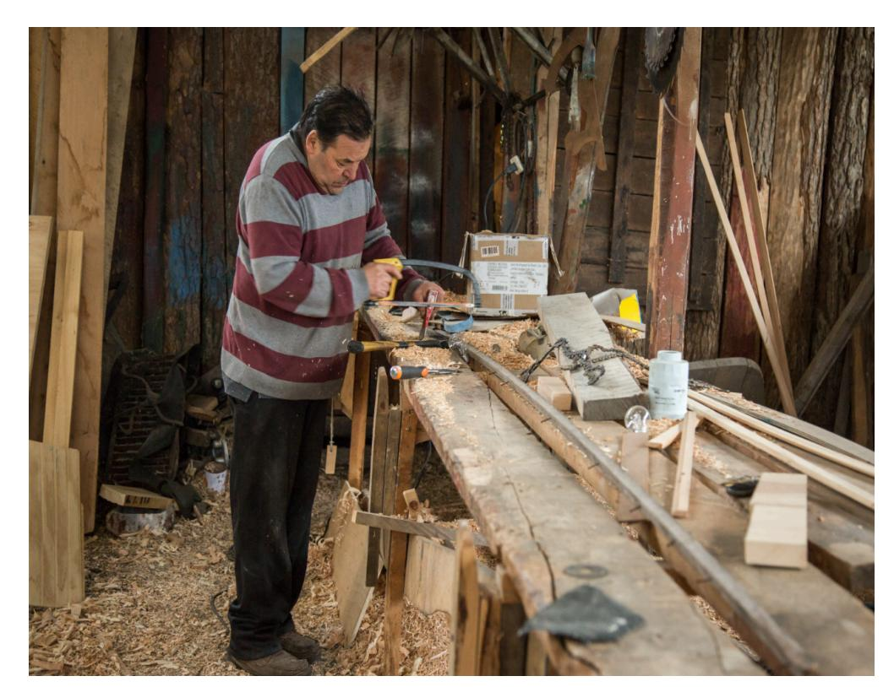
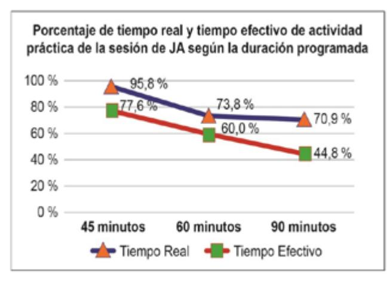

LA S IFI C A D O C L A S IFI C A D O C L A S IFI C A D O C L A S IFI C A D O

ENSAYO

# CLASIFICADO Preu Filadd 2025 COMPETENCIA LECTORA

A S IFI C A D O C L A S IFI C A D O C L A S IFI C A D O C L A S IFI C A D O

## Ingresa a la Universidad con

# **El Método Filadd**

**Apoyo en gestión de estrés y ansiedad**

**Diagnóstico y plan de estudio personalizado**

**Cápsulas Grabadas**

**Coaching Académico y Vocacional**

**Clases en vivo complementarias**

**Asistente virtual con IA**

**Consultas Ilimitadas**

**Guías y Ensayos**

**[filadd.cl](https://filadd.cl/?utm_source=pdf&utm_medium=pdf&utm_campaign=ensayos_clasificados&utm_term=m_d&utm_content=landing) [FILADD.CL](https://filadd.cl/?utm_source=pdf&utm_medium=pdf&utm_campaign=ensayos_clasificados&utm_term=m_d&utm_content=landing)**

#### Lectura 1 (Preguntas 1-9)

"Cuando Gregorio Samsa se despertó una mañana después de un sueño intranquilo, se encontró sobre su cama convertido en un monstruoso insecto. Estaba tumbado sobre su espalda dura, y en forma de caparazón y, al levantar un poco la cabeza veía un vientre abombado, parduzco, dividido por partes duras en forma de arco, sobre cuya protuberancia apenas podía mantenerse el cobertor, a punto ya de resbalar al suelo. Sus muchas patas, ridículamente pequeñas en comparación con el resto de su tamaño, le vibraban desamparadas ante los ojos.

«¿Qué me ha ocurrido?», pensó.

No era un sueño. Su habitación, una auténtica habitación humana, si bien algo pequeña, permanecía tranquila entre las cuatro paredes harto conocidas. Por encima de la mesa, sobre la que se encontraba extendido un muestrario de paños desempaquetados -Samsa era viajante de comercio-, estaba colgado aquel cuadro que hacía poco había recortado de una revista y había colocado en un bonito marco dorado. Representaba a una dama ataviada con un sombrero y una boa de piel, que estaba allí, sentada muy erguida y levantaba hacia el observador un pesado manguito de piel, en el cual había desaparecido su antebrazo.

La mirada de Gregorio se dirigió después hacia la ventana, y el tiempo lluvioso - se oían caer gotas de lluvia sobre la chapa del alféizar de la ventana- lo ponía muy melancólico.

«¿Qué pasaría -pensó- si durmiese un poco más y olvidase todas las chifladuras?»

Pero esto era algo absolutamente imposible, porque estaba acostumbrado a dormir del lado derecho, pero en su estado actual no podía ponerse de ese lado. Aunque se lanzase con mucha fuerza hacia el lado derecho, una y otra vez se volvía a balancear sobre la espalda. Lo intentó cien veces, cerraba los ojos para no tener que ver las patas que pataleaban, y sólo cejaba en su empeño cuando comenzaba a notar en el costado un dolor leve y sordo que antes nunca había sentido.

«¡Dios mío! -pensó-. ¡Qué profesión tan dura he elegido! Un día sí y otro también de viaje. Los esfuerzos profesionales son mucho mayores que en el mismo almacén de la ciudad, y además se me ha endosado este ajetreo de viajar, el estar al tanto de los empalmes de tren, la comida mala y a deshora, una relación humana constantemente cambiante, nunca duradera, que jamás llega a ser cordial. ¡Que se vaya todo al diablo!»

Sintió sobre el vientre un leve picor, con la espalda se deslizó lentamente más cerca de la cabecera de la cama para poder levantar mejor la cabeza; se encontró con que la parte que le picaba estaba totalmente cubierta por unos pequeños puntos blancos, que no sabía a qué se debían, y quiso palpar esa parte con una pata, pero inmediatamente la retiró, porque el roce le producía escalofríos.

Se deslizó de nuevo a su posición inicial.

«Esto de levantarse pronto -pensó- hace a uno desvariar. El hombre tiene que dormir. Otros viajantes viven como pachás. Si yo, por ejemplo, a lo largo de la mañana vuelvo a la pensión para pasar a limpio los pedidos que he conseguido, estos señores todavía están sentados tomando el desayuno. Eso podría intentar yo con mi jefe, pero en ese momento iría a parar a la calle. Quién sabe, por lo demás, si no sería lo mejor para mí. Si no tuviera que dominarme por mis padres, ya me habría despedido hace tiempo, me habría presentado ante el jefe y le habría dicho mi opinión con toda mi alma. ¡Se habría caído de la mesa! Sí que es una extraña costumbre la de sentarse sobre la mesa y, desde esa altura, hablar hacia abajo con el empleado que, además, por culpa de la sordera del jefe, tiene que acercarse mucho. Bueno, la esperanza todavía no está perdida del todo; si alguna vez tengo el dinero suficiente para pagar las deudas que mis padres tienen con él -puedo tardar todavía entre cinco y seis años- lo hago con toda seguridad. Entonces habrá llegado el gran momento; ahora, por lo pronto, tengo que levantarme porque el tren sale a las cinco», y miró hacia el despertador que hacía tic tac sobre el armario.

«¡Dios del cielo!», pensó.

Eran las seis y media y las manecillas seguían tranquilamente hacia delante, ya había pasado incluso la media, eran ya casi las menos cuarto. «¿Es que no habría sonado el despertador?» Desde la cama se veía que estaba correctamente puesto a las cuatro, seguro que también había sonado. Sí, pero... ¿era posible seguir durmiendo tan tranquilo con ese ruido que hacía temblar los muebles? Bueno, tampoco había dormido tranquilo, pero quizá tanto más profundamente.

¿Qué iba a hacer ahora? El siguiente tren salía a las siete, para cogerlo tendría que haberse dado una prisa loca, el muestrario todavía no estaba empaquetado, y él mismo no se encontraba especialmente espabilado y ágil; e incluso si consiguiese coger el tren, no se podía evitar una reprimenda del jefe, porque el mozo de los recados habría esperado en el tren de las cinco y ya hacía tiempo que habría dado parte de su descuido. Era un esclavo del jefe, sin agallas ni juicio. ¿Qué pasaría si dijese que estaba enfermo? Pero esto sería sumamente desagradable y sospechoso, porque Gregorio no había estado enfermo ni una sola vez durante los cinco años de servicio. Seguramente aparecería el jefe con el médico del seguro, haría reproches a sus padres por tener un hijo tan vago y se salvaría de todas las objeciones remitiéndose al médico del seguro, para el que sólo existen hombres totalmente sanos, pero con aversión al trabajo. ¿Y es que en este caso no tendría un poco de razón? Gregorio, a excepción de una modorra realmente superflua después del largo sueño, se encontraba bastante bien e incluso tenía mucha hambre.

Mientras reflexionaba sobre todo esto con gran rapidez, sin poderse decidir a abandonar la cama en este mismo instante el despertador daba las siete menos cuarto-, llamaron cautelosamente a la puerta que estaba a la cabecera de su cama.

-Gregorio -dijeron (era la madre)-, son las siete menos cuarto. ¿No ibas a salir de viaje?

¡Qué dulce voz! Gregorio se asustó, en cambio, al contestar. Escuchó una voz que, evidentemente, era la suya, pero en la cual, como desde lo más profundo, se mezclaba un doloroso e incontenible piar, que en el primer momento dejaba salir las palabras con claridad para, al prolongarse el sonido, destrozarlas de tal forma que no se sabía si se había oído bien. Gregorio querría haber contestado detalladamente y explicarlo todo, pero en estas circunstancias se limitó a decir:

-Sí, sí, gracias madre, ya me levanto.

Probablemente a causa de la puerta de madera no se notaba desde fuera el cambio en la voz de Gregorio, porque la madre se tranquilizó con esta respuesta y se marchó de allí. Pero merced a la breve conversación, los otros miembros de la familia se habían dado cuenta de que Gregorio, en contra de todo lo esperado, estaba todavía en casa, y ya el padre llamaba suavemente, pero con el puño, a una de las puertas laterales.

-¡Gregorio, Gregorio! -gritó-. ¿Qué ocurre? -tras unos instantes insistió de nuevo con voz más grave-. ¡Gregorio, Gregorio!

Desde la otra puerta lateral se lamentaba en voz baja la hermana.

-Gregorio, ¿no te encuentras bien?, ¿necesitas algo?

Gregorio contestó hacia ambos lados:

- -Ya estoy preparado -y con una pronunciación lo más cuidadosa posible, y haciendo largas pausas entre las palabras, se esforzó por despojar a su voz de todo lo que pudiese llamar la atención. El padre volvió a su desayuno, pero la hermana susurró:
- -Gregorio, abre, te lo suplico -pero Gregorio no tenía ni la menor intención de abrir, más bien elogió la precaución de cerrar las puertas que había adquirido durante sus viajes, y esto incluso en casa.

Al principio tenía la intención de levantarse tranquilamente y, sin ser molestado, vestirse y, sobre todo, desayunar, y después pensar en todo lo demás, porque en la cama, eso ya lo veía, no llegaría con sus cavilaciones a una conclusión sensata. Recordó que ya en varias ocasiones había sentido

en la cama algún leve dolor, quizá producido por estar mal tumbado, dolor que al levantarse había resultado ser sólo fruto de su imaginación, y tenía curiosidad por ver cómo se iban desvaneciendo paulatinamente sus fantasías de hoy. No dudaba en absoluto de que el cambio de voz no era otra cosa que el síntoma de un buen resfriado, la enfermedad profesional de los viajantes.

Tirar el cobertor era muy sencillo, sólo necesitaba inflarse un poco y caería por sí solo, pero el resto sería difícil, especialmente porque él era muy ancho. Hubiera necesitado brazos y manos para incorporarse, pero en su lugar tenía muchas patitas que, sin interrupción, se hallaban en el más dispar de los movimientos y que, además, no podía dominar. Si quería doblar alguna de ellas, entonces era la primera la que se estiraba, y si por fin lograba realizar con esta pata lo que quería, entonces todas las demás se movían, como liberadas, con una agitación grande y dolorosa.

«No hay que permanecer en la cama inútilmente», se decía Gregorio.

Quería salir de la cama en primer lugar con la parte inferior de su cuerpo, pero esta parte inferior que, por cierto, no había visto todavía y que no podía imaginar exactamente, demostró ser difícil de mover; el movimiento se producía muy despacio, y cuando, finalmente, casi furioso, se lanzó hacia delante con toda su fuerza sin pensar en las consecuencias, había calculado mal la dirección, se golpeó fuertemente con la pata trasera de la cama y el dolor punzante que sintió le enseñó que precisamente la parte inferior de su cuerpo era quizá en estos momentos la más sensible.

Así pues, intentó en primer lugar sacar de la cama la parte superior del cuerpo y volvió la cabeza con cuidado hacia el borde de la cama. Lo logró con facilidad y, a pesar de su anchura y su peso, el cuerpo siguió finalmente con lentitud el giro de la cabeza. Pero cuando, por fin, tenía la cabeza colgando en el aire fuera de la cama, le entró miedo de continuar avanzando de este modo porque, si se dejaba caer en esta posición, tenía que ocurrir realmente un milagro para que la cabeza no resultase herida, y precisamente ahora no podía de ningún modo perder la cabeza, antes prefería quedarse en la cama.

La metamorfosis, Franz Kafka (fragmento)

- 1. ¿Cuál de las siguientes opciones presenta un título alternativo que represente la idea central de la lectura?
  - A) "Una extraña enfermedad"
  - B) "Una transformación inesperada".
  - C) "Una familia preocupada"
  - D) "Una enfermedad mortal"
- 2. ¿En qué se desempeñaba el protagonista?
  - A) Guía turístico.
  - B) Jefe de comercio.
  - C) Mozo de los recados.
  - D) Viajante de comercio.

- 3.A partir de la lectura, ¿qué se deduce sobre el protagonista?
  - A) Que detesta a su jefe y familia.
  - B) Que prioriza su trabajo por sobre sí mismo.
  - C) Que desea renunciar cuanto antes a su trabajo.
  - D) Que es el único trabajador de su hogar.
- 4.En el texto, ¿qué función tiene el siguiente fragmento?

«Esto de levantarse pronto -pensó- hace a uno desvariar. El hombre tiene que dormir. Otros viajantes viven como pachás. Si yo, por ejemplo, a lo largo de la mañana vuelvo a la pensión para pasar a limpio los pedidos que he conseguido, estos señores todavía están sentados tomando el desayuno. Eso podría intentar yo con mi jefe, pero en ese momento iría a parar a la calle. Quién sabe, por lo demás, si no sería lo mejor para mí. Si no tuviera que dominarme por mis padres, ya me habría despedido hace tiempo, me habría presentado ante el jefe y le habría dicho mi opinión con toda mi alma."

- A) Enumerar las razones de Samsa para renunciar a su trabajo.
- B) Explicar los problemas que tiene con sus compañeros de trabajo.
- C) Contextualizar sobre la vida laboral y personal del protagonista.
- D) Caracterizar al jefe de Gregorio Samsa.
- 5.Según el texto, ¿qué parte del cuerpo de Gregorio, al parecer, es la más sensible?
  - A) La parte superior de su cuerpo.
  - B) La parte inferior de su cuerpo.
  - C) El caparazón.
  - D) La cola y sus patas.
- 6. ¿Qué vicio de la sociedad se refleja principalmente en el fragmento anterior?
  - A) Priorizar el trabajo por sobre la salud.
  - B) La codicia de solo pensar en el dinero.
  - C) La falta de empatía de los hijos hacia los padres.
  - D) La arrogancia de Gregorio Samsa.

- 7. ¿Cómo se puede caracterizar al protagonista?
  - A) Irresponsable e intransigente.
  - B) Resiliente y flexible.
  - C) Enfermizo y prepotente.
  - D) Trabajólico y autoexigente.
- 8. ¿Qué representa el cambio físico del protagonista?
  - A) El elemento que desestabiliza su vida.
  - B) La oportunidad de poder descansar de su trabajo.
  - C) La posibilidad de pensar en su familia por sobre el trabajo.
  - D) El elemento que le permite a Gregorio renunciar a su trabajo.
- 9. Considerando la historia en su totalidad, ¿qué función tiene el primer párrafo?
  - A) Comprender el escenario físico en que se desarrollan las acciones.
  - B) Comprender la motivación de los personajes.
  - C) Conocer el conflicto de la historia.
  - D) Caracterizar psicológicamente al protagonista.

LECTURA 2 (preguntas 10 - 17)

Artículo de SIGPA, publicado el año 2021

Carpintería de ribera en la región de Magallanes

La Carpintería de Ribera que se desarrolla en la región de Magallanes es un oficio especializado que consiste en la construcción artesanal de embarcaciones de madera, destinadas a actividades pesqueras, de transporte y turísticas, aprendido de forma oral y de la observación, a través de la práctica. Entre los saberes tradicionales que le caracterizan, se identifica un conjunto de conocimientos ecosistémicos sobre la flora local, muy relevante para la selección de maderas nativas en lugares cercanos a Punta Arenas, Puerto Natales, Puerto Edén y Puerto Williams. Así también, destaca el conocimiento sobre mareas, clima y navegación, articulando en ello memorias territoriales indígenas de larga data.

La carpintería de ribera es una práctica constructiva dinámica adaptada tanto a las características regionales como a las exigencias del mercado local e internacional, incorporando innovaciones materiales y tecnológicas en su expresión y diversidad, transmitidas de generación en generación, a través de redes familiares así como entre compañeros de oficio.

Como elemento del patrimonio cultural inmaterial, se trata de una técnica artesanal tradicional que integra conocimientos y usos relacionados con la naturaleza y el universo (Unesco, 2003). Se posiciona como una expresión compleja, que informa de paisajes construidos por movilidad lacustre, ribereña y marítima, incluyendo modelos y ciclos productivos en permanente tensión. Uno de sus aspectos más valorados, es la capacidad de articular diversos elementos del territorio sur austral en perspectiva temporal, logrando a su vez, proyección en el mar austral. Constituye un legado que incorpora la presencia de saberes de navegación y de conocimiento del entorno en territorio Kawéskar (Puerto Edén) y Yagán (Puerto Williams), que indican la integración de estas técnicas constructivas por poblaciones indígenas navegantes. Los carpinteros de ribera documentados en Punta Arenas y Puerto Natales comparten una historia de migración familiar, constando el arribo de la mayoría de ellos o sus familias desde Chiloé, provenientes de las localidades de Hualaihué, Calbuco (Isla Puluqui), Castro (Curahue) y Melinka (localidad aysenina contigua y estrechamente vinculada a Quellón y la isla en general).

La comunidad cultora del elemento se reconoce en relación al ejercicio activo del oficio de construcción de embarcaciones de madera, en todas sus fases, incluyendo en la mayoría de los casos, la búsqueda selectiva de piezas en bosques y aserraderos. Si bien la modalidad de trabajo recurrente del oficio incorpora la participación de otros conocedores de tareas específicas y ayudantes, se plantean distinciones entre éstos y quienes son efectivamente reconocidos como

maestros o carpinteros de ribera; ya que los últimos son responsables de la obra en su conjunto y participan de la construcción de las naves, paso a paso, en todas sus etapas. Así también se reconoce que este oficio se ejerce de forma individual, aún cuando congrega la participación de apoyos, sean familiares o "conocidos", para labores auxiliares en astilleros o espacios de trabajo particulares, que se emplazan en cada localidad.

SIGPA (2021). Carpintería de ribera en la región de Magallanes. [https://www.sigpa.cl/ficha](https://www.sigpa.cl/ficha-elemento/carpinteria-de-ribera-en-la-region-de-magallanes)[elemento/carpinteria-de-ribera-en-la-region-de-magallanes](https://www.sigpa.cl/ficha-elemento/carpinteria-de-ribera-en-la-region-de-magallanes)

- 10. ¿Qué caracteriza principalmente la Carpintería de Ribera en la región de Magallanes?
  - A) Se enfoca en la construcción artesanal de embarcaciones de madera para diversas actividades.
  - B) Es una labor ancestral que se enseña exclusivamente a través de redes familiares y tradición generacional.
  - C) Es un oficio exclusivamente relacionado con la construcción de viviendas, embarcaciones y artesanía en la región.
  - D) Es una técnica de carpintería moderna basada en el uso de materiales sintéticos para la construcción de embarcaciones.
- 11. ¿Qué aspecto destaca la Carpintería de Ribera como parte de su patrimonio cultural inmaterial?
  - A) Su capacidad para adaptarse al mercado internacional.
  - B) La integración de conocimientos y usos sobre la naturaleza.
  - C) La mezcla entre uso de tecnología moderna y conocimiento ancestral.
  - D) Su carácter exclusivamente rural, pero alejado de las tradiciones indígenas.
- 12. ¿Qué enunciado sintetiza de forma correcta el contenido general del texto?
  - A) La Carpintería de Ribera es un oficio moderno que utiliza tanto tecnologías avanzadas como saberes tradicionales para la construcción de embarcaciones de madera.
  - B) La Carpintería de Ribera es un oficio tradicional que integra conocimientos sobre la naturaleza, la navegación y la construcción artesanal.
  - C) La Carpintería de Ribera es una técnica que se limita a la construcción de embarcaciones para el mercado turístico.
  - D) La Carpintería de Ribera se basa en el dominio respecto a las mareas, clima y en navegación en las costas chilenas.

- 13. ¿Qué diferencia a los carpinteros de ribera de los ayudantes en el oficio?
  - A) Los carpinteros de ribera intervienen directamente en la mano de obra y construcción de la embarcación.
  - B) Los carpinteros de ribera supervisan el trabajo de los ayudantes sin involucrarse directamente en la construcción.
  - C) Los carpinteros de ribera asesoran a los ayudantes en temas de mareas y clima para una conducción segura de la embarcación.
  - D) Los carpinteros de ribera son los responsables de la obra en su conjunto y participan en todas las fases de la construcción de las embarcaciones.
- 14. ¿Cómo se transmite el conocimiento sobre la Carpintería de Ribera en la región de Magallanes?
  - A) Observación, familia y programas de la UNESCO.
  - B) Familia, compañeros y generación en generación.
  - C) Enseñanza formal y observación al maestro de ribera.
  - D) Entornos familiares, generación en generación y por medio de manuales.
- 15. ¿Quién es el lector ideal del texto sobre la Carpintería de Ribera en la región de Magallanes?
  - A) Historiadores expertos en las tradiciones propias del pueblo originario Kawéskar.
  - B) Personas interesadas en la historia de la navegación y las tradiciones indígenas del sur de Chile.
  - C) Expertos en carpintería que buscan aprender nuevas técnicas basadas en conocimientos ancestrales.
  - D) Estudiantes de navegación interesados en el ecosistema local y las características de los mares en la región.
- 16. ¿Cuál es el propósito comunicativo del texto leído?
  - A) Describir las técnicas modernas de carpintería de ribera utilizadas en la construcción de embarcaciones.
  - B) Explicar cómo las innovaciones han transformado la industria de la embarcación tradicional y la carpintería de ribera.
  - C) Resaltar la importancia del oficio tradicional de carpintería de ribera y su conexión con el patrimonio cultural inmaterial de la región.
  - D) Informar sobre los recursos naturales disponibles para la carpintería de ribera y la construcción de embarcaciones en Chile.

#### 17. ¿Cuál es el propósito comunicativo del segundo párrafo?

- A) Mostrar cómo la carpintería de ribera se ha mantenido vigente a lo largo del tiempo sin mayores cambios.
- B) Resaltar la importancia de la carpintería de ribera como patrimonio cultural de la región de Magallanes.
- C) Explicar cómo y por qué la carpintería de ribera se ha modificado.
- D) Describir la historia de la carpintería de ribera.

Lectura 3 (Preguntas 18 - 25)

Meta: renovarse o morir

Los responsables de Threads aseguran que no quieren ser solo un 'doppelgänger' de Twitter, sino que quieren convertirse en la primera gran red social interoperable.

Por qué sigues usando la misma cuenta de correo de Gmail de hace dos décadas. Como sus otros 1.800 millones de usuarios, llegaste porque el servicio era gratis y te quedaste porque el almacenamiento de nube y su integración con los principales sistemas operativos y navegadores facilita la mudanza de teléfono a teléfono y de ordenador a ordenador. Pero el motivo principal es que hace años que no piensas en ello. Forma parte de tu identidad, como tu número de teléfono y tu DNI, y la usas para todo en todas partes. Esa universalidad, libertad y compatibilidad es una de las principales características de los protocolos que usan los servidores de correo electrónico para intercambiar mensajes entre ellos. Es completamente deliberada y se llama interoperabilidad.

Lo opuesto a la interoperabilidad es la incompatibilidad. Si Gmail fuese incompatible con el resto de servicios de correo, todos tendríamos cuentas en todos (Outlook, Hotmail, Applemail, Protonmail). Es lo que ocurre con los sistemas de mensajería (WhatsApp, Telegram y Signal) y con las redes sociales. En estas, la incompatibilidad ha producido diferentes culturas generacionales, estéticas y sectoriales: los mayores están en Facebook y los jóvenes en TikTok; los nerds se juntan en Mastodon y los geeks en Discord. Pinterest es más de chicas y Reddit de hombres. Los influencers están en todas las plataformas donde puedan capitalizar contenido. Los periodistas y políticos están atrapados en Twitter y no saben a dónde ir.

Si Twitter hubiese adoptado protocolos abiertos, ahora mismo podrías mudarte a otro servicio sin perder tu cuenta, tus seguidores y tu identidad. Los responsables de Threads, la nueva plataforma de Meta, aseguran que no quieren ser solo un doppelgänger de Twitter, sino que quieren convertirse en la primera gran red social interoperable, adoptando un protocolo llamado ActivityPub. Si triunfa, cambiaría radicalmente el mundo de las redes sociales. Para Meta es una decisión arriesgada, pero, después del fiasco del Metaverso, solo queda renovarse o morir.

ActivityPub es el protocolo que sujeta el fediverso, una federación de plataformas y servicios para un nuevo internet descentralizado. Su miembro más importante es Mastodon, que tiene 10 millones de usuarios (la mitad inactivos) frente a los 1.300 millones de Instagram, la incubadora de Threads.

La reacción del fediverso ha sido predeciblemente negativa. Es como si Coca Cola quisiera ser socia de una cooperativa de refrescos de barrio: la cooperativa crece, pero a costa de alterar su delicado equilibro de manera existencial.

De momento, su relación con Instagram es su principal ventaja y su mayor inconveniente. Exportar tus seguidores a una nueva plataforma es como aterrizar en un país nuevo con casa, coche, novio y seguridad social. Solo con eso podría superar los 353 millones de Twitter rápidamente. Pero, al hacerlo, Threads hereda también las prácticas de Instagram, que recopila información sobre la salud, finanzas, contactos, historial de búsqueda y ubicación del usuario, además de enviar datos a terceros sobre su orientación sexual, creencias religiosas y políticas, raza y etnia, cuerpo y estado laboral. Incumple los estándares de la nueva Ley de Servicios Digitales de la Unión Europea. Y las multas son astronómicas, incluso para Meta. Podría quedarse en titulares, como la pelea en jaula entre Zuckerberg y Elon Musk.

https://elpais.com/opinion/2023-07-10/meta-renovarse-o-morir.htmlevent\_log=oklogin

- 18.A partir del texto se infiere que la razón por la que tantas personas mantienen su correo de Gmail es
  - A) por una acción más bien inconsciente.
  - B) por fidelidad hacia Google, dada su popularidad.
  - C) porque es el único sistema de mensajería gratuito.
  - D) porque es complejo modificarlo, al igual que el DNI.
- 19. ¿Cuál es la desventaja de que Threads pertenezca a Instagram?
  - A) Exporta seguidores de una cuenta a otra sin autorización.
  - B) Ejecuta prácticas de recepción y envío de información personal.
  - C) Favorecerá a la creación involuntaria de un nuevo grupo social.
  - D) Heredará practicas propias de Twitter como el hostigamiento social.
- 20. ¿Cuál ha sido una consecuencia de la incompatibilidad en las redes sociales?
  - A) La segregación virtual de las minorías sexuales.
  - B) La conformación de culturas generacionales distintas.
  - C) La creación de grupos sociales denominados geeks y nerds.
  - D) Incompatibilidad entre las distintas culturas sectoriales existentes.

- 21. ¿Por qué la emisora del texto señala que "Los periodistas y políticos están atrapados en Twitter y no saben a dónde ir"?
  - A) La única red social dirigida a periodistas y políticos es Twitter.
  - B) Twitter es una red social creada por políticos y periodistas.
  - C) Solo Twitter aborda temáticas políticas y periodísticas.
  - D) Twitter es una red social utilizada mayormente por periodistas y políticos.

#### 22. ¿Qué es el fediverso?

- A) Un conjunto de plataformas bajo la consigna de un internet descentralizado.
- B) La primera gran red social interoperable, descentralizada y cooperativa.
- C) El protocolo que sostiene a todas las redes sociales de ActivityPub.
- D) Grupo de sistemas operativos variados, responsables de Threads
- 23. Respecto a Mastodon es posible deducir que
  - A) Tiene diez millones de usuarios.
  - B) Es la incubadora de Threads.
  - C) Posee semejanzas con Coca Cola.
  - D) 5 millones de sus usuarios están inactivos.
- 24. ¿Cuál es el tono que predomina en el texto leído?
  - A) Admirativo.
  - B) Emotivo.
  - C) Conciliador.
  - D) Reflexivo.
- 25. ¿Cuál es el propósito comunicativo del texto leído?
  - A) Aseverar las ventajas de Threads por sobre Twitter.
  - B) Demostrar cómo Threads podría ser tan nociva como Instagram.
  - C) Informar sobre Threads, su origen, ventajas y desventajas.
  - D) Exponer las causas que propiciaron la creación de Threads.

Lectura 4 (Preguntas 26 - 34)

#### Queremos tanto a Glenda

En aquel entonces era difícil saberlo. Uno va al cine o al teatro y vive su noche sin pensar en los que ya han cumplido la misma ceremonia, eligiendo el lugar y la hora, vistiéndose y telefoneando y fila once o cinco, la sombra y la música, la tierra de nadie y de todos allí donde todos son nadie, el hombre o la mujer en su butaca, acaso una palabra para excusarse por llegar tarde, un comentario a media voz que alguien recoge o ignora, casi siempre el silencio, las miradas vertiéndose en la escena o la pantalla, huyendo de lo contiguo, de lo de este lado. Realmente era difícil saber por encima de la publicidad, de las colas interminables, de los carteles y las críticas, que éramos tantos los que queríamos a Glenda.

Llevó tres o cuatro años y sería aventurado afirmar que el núcleo se formó a partir de Irazusta o de Diana Rivero, ellos mismos ignoraban cómo en algún momento, en las copas con los amigos después del cine, se dijeron o se callaron cosas que bruscamente habrían de crear la alianza, lo que después todos llamamos el núcleo y los más jóvenes el club. De club no tenía nada, simplemente queríamos a Glenda Garson y eso bastaba para recortarnos de los que solamente la admiraban. Al igual que ellos, también nosotros admirábamos a Glenda y además a Anouk, a Marilina, a Annie, a Silvana y por qué no a Marcello, a Yves, a Vittorio y a Dirk, pero solamente nosotros queríamos tanto a Glenda, y el núcleo se definió por eso y desde eso, era algo que solo nosotros sabíamos y confiábamos a aquellos que a lo largo de las charlas habían ido mostrando poco a poco que también querían a Glenda.

A partir de Diana o Irazusta el núcleo se fue dilatando lentamente, el año de "El fuego de la nieve" debíamos ser apenas seis o siete, cuando estrenaron "El uso de la elegancia", el núcleo se amplió y sentimos que crecía casi insoportablemente y que estábamos amenazados de imitación snob o de sentimentalismo estacional. Los primeros, Irazusta y Diana y dos otros más decidimos cerrar filas, no admitir sin pruebas, sin el examen disimulado por los whiskys y los alardes de erudición (tan de Buenos Aires, tan de Londres y de México esos exámenes de medianoche). A la hora del estreno de "Los frágiles retornos" nos fue preciso admitir, melancólicamente triunfantes, que éramos muchos los que queríamos a Glenda. Los reencuentros en los cines, las miradas a la salida, ese aire como perdido de las mujeres y el dolido silencio de los hombres nos mostraban mejor que una insignia o un santo y seña. Mecánicas no investigables nos llevaron a un mismo café del centro, las mesas aisladas empezaron a acercarse, hubo la grácil costumbre de pedir el mismo cóctel para dejar de lado toda escaramuza inútil y mirarnos por fin en los ojos, allí donde todavía alentaba la última imagen de Glenda en la última escena de la última película.

Veinte, acaso treinta, nunca supimos cuántos llegamos a ser porque a veces Glenda duraba meses en una sala o estaba al mismo tiempo en dos o cuatro, y hubo además ese momento excepcional en que apareció en escena para representar a la joven asesina de "Los delirantes" y su éxito rompió los diques y creó entusiasmos momentáneos que jamás aceptamos. Ya para entonces nos conocíamos, muchos nos visitábamos para hablar de Glenda. Desde un principio Irazusta parecía ejercer un mandato tácito que nunca había reclamado, y Diana Rivero jugaba su lento ajedrez de confirmaciones y rechazos que nos aseguraba una autenticidad total sin riesgos de infiltrados o de necios. Lo que había empezado como asociación libre, alcanzaba ahora una estructura de clan y, a las livianas interrogaciones del principio, se sucedían las preguntas concretas, la secuencia del tropezón en "El uso de la elegancia", la réplica final de "El fuego de la nieve", la segunda escena erótica de "Los frágiles retornos". Queríamos tanto a Glenda que no podíamos tolerar a los advenedizos […], a los eruditos de la estética. Incluso (nunca sabremos cómo) se dio por sentado

que iríamos al café los viernes cuando en el centro pasaran una película de Glenda, y que en los reestrenos en cines de barrio dejaríamos correr una semana antes de reunirnos, para darles a todos el tiempo necesario; como en un reglamento riguroso, las obligaciones se definían sin equívoco, no acatarlas hubiera sido provocar la sonrisa despectiva de Irazusta o esa mirada amablemente horrible con que Diana Rivero denunciaba la traición y el castigo. En ese entonces las reuniones eran solamente Glenda, su deslumbrante ubicuidad en cada uno de nosotros, y no sabíamos de discrepancias o reparos. Solo poco a poco, al principio con un sentimiento de culpa, algunos se atrevieron a deslizar críticas parciales, el desconcierto o la decepción frente a una secuencia menos feliz, las caídas en lo convencional o lo previsible. Sabíamos que Glenda no era responsable de los desfallecimientos que nos enturbiaban por momentos la espléndida cristalería de "El látigo" o el final de "Nunca se sabe por qué". Conocíamos otros trabajos de sus directores, el origen de las tramas y los guiones, con ellos éramos implacables porque empezábamos a sentir que nuestro cariño por Glenda iba más allá del mero territorio artístico y que solo ella se salvaba de lo que imperfectamente hacían los demás. Diana fue la primera en hablar de misión, lo hizo con su manera tangencial de no afirmar lo que de veras contaba para ella, y le vimos una alegría de whisky doble, de sonrisa saciada, cuando admitimos llanamente que era cierto, que no podíamos quedarnos solamente en eso, el cine y el café y quererla tanto, a Glenda.

Tampoco entonces se dijeron palabras claras, no nos eran necesarias. Solo contaba la felicidad de Glenda en cada uno de nosotros, y esa felicidad solo podía venir de la perfección. De golpe los errores, las carencias se nos volvieron insoportables; no podíamos aceptar que "Nunca se sabe por qué" terminara así, o que "El fuego de la nieve" incluyera la infame secuencia de la partida de póker (en la que Glenda no actuaba, pero que de alguna manera la manchaba como un vómito, ese gesto de Nancy Phillips y la llegada inadmisible del hijo arrepentido). Como casi siempre, a Irazusta le tocó definir por lo claro la misión que nos esperaba, y esa noche volvimos a nuestras casas como aplastados por la responsabilidad que acabábamos de reconocer y asumir, y a la vez entreviendo la felicidad de un futuro sin tacha, de Glenda sin torpezas ni traiciones.

Instintivamente el núcleo cerró filas, la tarea no admitía una pluralidad borrosa. Dividimos ecuánimemente las tareas entre los que deberían procurarse la totalidad de las copias de "Los frágiles retornos", elegida por su relativamente escasa imperfección.

Cortázar, J. (2009). Queremos tanto a Glenda (pp. 17-26). Santillana.

#### 26. ¿Por qué el narrador hace la diferencia entre admirar y querer a Glenda?

- A) Porque quiere distinguirse de los otros integrantes del club de Glenda.
- B) Porque desea confirmar que es miembro fundador del club de Glenda.
- C) Porque necesita exaltar el sentimiento que experimenta hacia Glenda.
- D) Porque pretende explicar que tiene una relación personal con Glenda.
- 27. ¿Con qué finalidad se menciona a Anouk, Marilina, Annie y Silvana? Ejercicio tipo DEMRE.
  - A) Para caracterizar a los miembros del grupo de admiradores de Glenda.
  - B) Para identificar a los integrantes expulsados del grupo por criticar a Glenda.
  - C) Para ejemplificar los variados gustos artísticos de los admiradores de Glenda.
  - D) Para señalar que había otros artistas admirados en menor medida que Glenda.
- 28. ¿Qué provocó que el núcleo admitiera que eran muchos los que querían a Glenda? Ejercicio tipo DEMRE.
  - A) La gran cantidad de interesados en rendir el examen del club de Glenda.
  - B) La alta participación en actividades comunes tras ver las películas de Glenda.
  - C) La amplia gama de cines en que comenzaron a exhibir las películas de Glenda.
  - D) La abundante evidencia para defender las escenas protagonizadas por Glenda.

#### 29. ¿Por qué es relevante que el narrador sea un personaje dentro del relato?

Ejercicio tipo DEMRE.

- A) Porque presenta una perspectiva incuestionable de la calidad actoral de Glenda.
- B) Porque transmite la visión de lo que significa ser parte del núcleo de Glenda.
- C) Porque revela las discusiones sobre el funcionamiento del club de Glenda.
- D) Porque describe la exitosa trayectoria de la carrera cinematográfica de Glenda.
- 30. ¿Cuál fue la consecuencia directa del estreno de la película Los delirantes?

- A) La realización de reuniones periódicas para hablar de Glenda.
- B) La crítica parcial de las habilidades actorales de Glenda.
- C) El alza de postulantes para integrar el club de Glenda.
- D) El aumento de personas admiradoras de Glenda.

| 31. ¿Qué película tenía un final inaceptable para los miembros del núcleo? |
|-------------------------------------------------------------------------------------------------------------|
|-------------------------------------------------------------------------------------------------------------|

| DEMRE. Ejercicio tipo |
|-----------------------------|
|-----------------------------|

- A) "El fuego de la nieve"
- B) "Los frágiles retornos"
- C) "Nunca se sabe por qué"
- D) "El uso de la elegancia"
- 32. ¿Con qué finalidad el núcleo se propuso conseguir las copias de la película "Los frágiles retornos"?

- A) Para preservar la imagen de Glenda más cercana a la perfección.
- B) Para lograr que las escenas que perjudicaban a Glenda se modificaran.
- C) Para evitar que más personas se unieran al círculo de admiradores de Glenda.
- D) Para conseguir que cada uno tuviera una copia original de la película de Glenda.

|      | –  ENSAYO CLASIFICADO   COMPRENSIÓN LECTORA   2025 –                                                                                                                                                                    |
|------|----------------------------------------------------------------------------------------------------------------------------------------------------------------------------------------------------------------------------------------------------|
| 33.  | Una lectora del cuento plantea que el narrador muestra una visión poco objetiva debido a su fanatismo hacia Glenda. ¿Qué actitud del narrador respalda esta afirmación? |
|      |                                                                                                                                                                                                                                                    |
|      |                                                                                                                                                                                                                                                    |
|      | DEMRE. Ejercicio tipo                                                                                                                                                                                                                        |
|      | A) Su intolerancia, al criticar los roles de los fundadores del grupo de seguidores de Glenda.                                                                                                        |
|      | B) Su impulsividad, al enfrentar a quienes plantean cuestionamientos sobre la actuación de Glenda.                                                                                                          |
|      | C) Su imprudencia, al asistir a las películas de Glenda dejando de lado sus tareas cotidianas.                                                                                                        |
|      | D) Su condescendencia, al eximir a Glenda de la responsabilidad por la baja calidad de algunas películas.                                                                                          |
| 34.A | partir de la lectura, ¿Qué característica se puede atribuir al núcleo de quienes querían a Glenda?                                                                                                    |
|      | DEMRE. Ejercicio tipo                                                                                                                                                                                                                        |
|      | A) Son conservadores, pues preferían las películas clásicas en las que actuaba Glenda.                                                                                                                         |
|      | B) Son exigentes, pues rechazaban los errores cometidos por Glenda en sus películas.                                                                                                                           |
|      | C) Son recelosos, pues desconfiaban de los sentimientos de los nuevos admiradores de Glenda.                                                                                                                |
|      | D) Son radicales, pues negaban cualquier posibilidad de admirar a otros artistas además de Glenda.                                                                                                       |

Lectura 5 (Preguntas 35 - 42)

#### La actividad física es tu medicina

Por Fernando Concha Laborde, profesor de Educación Física.

Desde el año 2000, el Instituto de Nutrición y Tecnología de los Alimentos (INTA), a través del Dr. Fernando Monckeberg, académico de la Universidad de Chile, lidera diversas investigaciones en población preescolar, que aportan evidencias para la toma de decisiones, a nivel de políticas públicas. A través de una serie de intervenciones, que entregan estrategias y material educativo para docentes, párvulos y familias, el INTA intenta revertir los altos índices de malnutrición, por exceso y sedentarismo, que afectan a niños y niñas.

Actualmente, un 25,3 % de los escolares de 6 años presentan obesidad y alrededor del 28 %, sobrepeso, es decir que más de la mitad de los niños, de ese rango etario, tienen sobrepeso. En un estudio realizado por el INTA, cuya muestra abarcó niños de entre 6 y 8 años, se detectó que solo 33 % de los niños y 15 % de las niñas cumplían con la recomendación diaria de 60 minutos de Actividad Física Moderada a Vigorosa (AFMV), actividades que tengan un nivel de intensidad suficiente como para obtener beneficios a la salud en esas edades. En cuanto a las clases de Educación Física, se evidenció que en una clase de 90 minutos, en promedio, solo se realizan 15 minutos de AFMV y que alrededor de un 30 % de las clases son destinadas a otros fines (reemplazo por otra asignatura, actos, celebraciones, reuniones, evaluaciones pedagógicas, entre otras). En el caso de los párvulos asistentes a jardines infantiles, solo un 5 % del tiempo de permanencia diaria es utilizado en AFMV.

#### Un estudio necesario

Estos antecedentes y la necesidad de seguir generando evidencias, motivaron al INTA a postular a una licitación abierta por el Ministerio del Deporte para poder evaluar la "Contribución de las sesiones del componente Jardín Activo (JA) de las Escuelas Deportivas Integrales (EDI) al incremento del tiempo de actividad física en niños y niñas de 3 a 5 años".

Jardín Activo es un componente del programa EDI que otorga a menores de entre 3 y 5 años sesiones de actividad física, a cargo de profesores de Educación Física o monitores deportivos, basadas en el desarrollo de habilidades motrices básicas; también se incluyen otras actividades con objetivos transversales en el área de las Guías Alimentarias Basadas en Alimentos y Habilidades para la Vida. La estrategia cuenta con un equipo integral que incluye nutricionista y psicólogo, ambos profesionales para un territorio determinado. Al momento del estudio existían 532 Jardines Activos en 311 escuelas y 221 jardines infantiles de la Junta Nacional de Jardines Infantiles e Integra de nuestro país. Para la muestra final, el Instituto Nacional del Deporte (IND) solicitó que se incluyeran solo colegios, la correspondiente autorización de cada establecimiento, así como la de los apoderados.

#### Sobre las mediciones

El estudio recogió una serie de datos relevantes para la definición de programas y sus metodologías. Se utilizó la más avanzada tecnología en el campo de medición de la intensidad de la actividad física, conocida como el acelerómetro. Estos monitores, del tamaño de un reloj, se ubican en la cintura o sobre el pantalón y permiten, sin dañar a las personas, conocer el tiempo, la intensidad y la duración de los movimientos. El uso de esta herramienta permitió observar 408 jornadas escolares, considerando que durante cada día se monitorearon todas las actividades desarrolladas, además de 212 sesiones de Jardines Activos, donde también se registraron todas las actividades y, para cada una de ellas, la habilidad motora que predominó junto a la tarea motriz intencionada. El tiempo e intensidad de la actividad física también fueron considerados en ambos casos y a través del uso de sensores de movimiento y de la acelerometría, se pudo registrar directamente la intensidad de cada actividad física. Se aplicó también una Encuesta de Satisfacción del programa JA a los directores y educadoras de las instituciones participantes.

#### Principales resultados y conclusiones del estudio

En seis semanas de levantamiento de información en terreno (26 de octubre al 4 de diciembre de 2015) se monitorearon 408 jornadas escolares de las cuales 212 tenían JA, registrando 1.826 mediciones de acelerometría, las que siguieron un estricto proceso de revisión y validación para el análisis final, que consideró un total de 1.256 registros (628 párvulos). Cada uno contó con registros en una jornada escolar con Jardín Activo y otra jornada sin Jardín Activo.

La muestra se distribuyó en un 10,5 % en la zona norte, un 64,8 % en el centro y un 24,7 % en el sur, siguiendo la distribución que tenía el programa EDI y las posibilidades logísticas del estudio. Un 28 % fue rural y un 71,3 % urbano, con una distribución similar entre hombres y mujeres.

Los principales resultados arrojaron que el nivel de cumplimiento de las sesiones observadas de JA alcanzó un 87,7 % de las programadas, con una asistencia promedio del 88 % de los párvulos.

Para esta población infantil, se recomiendan 60 minutos diarios de intensidad moderada a vigorosa, es decir, que implique un gasto energético significativo de manera que impacte la salud del párvulo. El estudio evidenció que, en promedio, una jornada escolar de 6 horas, cuando no está el taller del IND, destina el 9,3 % de su tiempo a una actividad moderada a vigorosa; sin embargo, cuando está el taller, este porcentaje se incrementa a un 12,5 %, disminuyendo el tiempo sedentario significativamente. De esta forma, el programa cumple uno de sus grandes propósitos, aunque de todas maneras el porcentaje está por debajo de lo deseado.

Al analizar exclusivamente la sesión, el estudio mostró que el taller más efectivo es aquel que tiene una duración programada de 45 minutos. Esto radica en que el tiempo real de esa sesión es proporcionalmente mayor que cuando lo programado es de 60 o 90 minutos. También hubo que determinar cuánto era el tiempo de actividades prácticas, y se demostró que mientras más dura una sesión, el tiempo para que los párvulos se muevan es proporcionalmente menor (ver Figura 1).

Otra de las áreas de estudio se concentró en el tipo de actividades que se desarrolla en un taller: circuitos, estaciones, dinámicas, ejercitaciones y juegos motores, siendo esta última la predominante. A su vez, los evaluadores en terreno pudieron clasificar el tipo de habilidad motora que cada una de las actividades consideraba, siendo las de locomoción las más abordadas, por sobre las actividades de manipulación y equilibrio. En esta parte del estudio lo más significativo fue que se determinó el tiempo que un párvulo le destina a cada tarea motriz propuesta, y se mostró que, independiente de la duración de las sesiones, centra su propuesta en tareas que desarrollan el tren inferior, dejando muy abandonado el tren superior; entregándole bastante tiempo a correr y saltar y poco y nada de tiempo a traccionar, afirmar o soportar entre otras valiosas tareas que le brindarían un desarrollo integral al proceso.

Finalmente, la encuesta determinó que el programa está altamente valorado por directoras y educadoras de párvulos, quienes consideran que JA es pertinente a los proyectos educativos y contribuye al desarrollo de los párvulos. Sin embargo, aun cuando reconocen que los profesionales del IND son un aporte para desarrollar competencias y habilidades en las educadoras, su participación en las sesiones solo llega a un 46 % y se focaliza, principalmente, en apoyar la disciplina y la higiene.

Concha, F. (2016). La actividad física es tu medicina. Nutrición y vida. [http://nutricionyvida.cl/la](http://nutricionyvida.cl/la-actividad-fisica-es-tu-medicina/)[actividad-fisica-es-tu-medicina/](http://nutricionyvida.cl/la-actividad-fisica-es-tu-medicina/)

"ejercicio tipo DEMRE".

35. ¿Cuál es la función del segundo párrafo respecto de la investigación abordada en la lectura?

- A) Describir los resultados del estudio sobre AFMV.
- B) Criticar la falta de actividad física en el contexto escolar.
- C) Exponer las diferencias entre la obesidad y el sobrepeso.
- D) Presentar el problema de la obesidad y sobrepeso infantil.

| 36.Según la lectura, ¿para qué se usa el acelerómetro? |
|--------------------------------------------------------------------------------|
|--------------------------------------------------------------------------------|

| Ejercicio | tipo | DEMRE. |
|-----------|------|--------|
|           |      |        |

- A) Para evaluar la tarea motriz intencionada.
- B) Para identificar el tipo de habilidad motora.
- C) Para medir la intensidad de la actividad física.
- D) Para controlar las variaciones de los movimientos.
- 37. ¿Qué perspectiva adopta el emisor en la sección "Principales resultados y conclusiones del estudio"?

- A) Analítica, pues ofrece datos detallados a partir de la revisión de las actividades desarrolladas en la investigación.
- B) Reflexiva, pues pondera las posibles causas de la obesidad a partir de los resultados de las mediciones.
- C) Problematizadora, pues plantea nuevas interrogantes que surgen a partir de los resultados del estudio.
- D) Crítica, pues cuestiona las conclusiones del estudio a partir de los resultados obtenidos en este.

| 38.En la investigación mencionada en la lectura, ¿con qué finalidad se registró información sobre |
|------------------------------------------------------------------------------------------------------------------------------------------|
| escuelas con el programa Jardín Activo y otras sin este?                                                      |

Ejercicio tipo DEMRE.

- A) Para representar la distribución del programa Escuelas Deportivas Integrales.
- B) Para evaluar el impacto del programa en la actividad física de los niños.
- C) Para contar con una mayor cantidad de registros para el estudio.
- D) Para incrementar el tiempo de ejercicio de los párvulos.
- 39.A partir del siguiente párrafo de la lectura, ¿qué revela el estudio respecto de las sesiones de Jardín Activo?

«Para esta población infantil, se recomiendan 60 minutos diarios de intensidad moderada a vigorosa, es decir, que implique un gasto energético significativo de manera que impacte la salud del párvulo. El estudio evidenció que, en promedio, una jornada escolar de 6 horas, cuando no está el taller del IND, destina el 9,3 % de su tiempo a una actividad moderada a vigorosa; sin embargo, cuando está el taller, este porcentaje se incrementa a un 12,5 %, disminuyendo el tiempo sedentario significativamente. De esta forma, el programa cumple uno de sus grandes propósitos, aunque de todas maneras el porcentaje está por debajo de lo deseado».

- A) La diferencia positiva de tiempo empleado en actividad moderada a vigorosa gracias a las sesiones.
- B) La forma eficiente de usar diversos implementos en las sesiones para el desarrollo de actividad moderada a vigorosa.
- C) La precisión en la cantidad de tiempo que debe destinarse a la actividad moderada a vigorosa en las sesiones.
- D) La dificultad de implementación de las sesiones de actividad moderada a vigorosa debido a la duración de la jornada escolar.

| 40.En el último | párrafo,          | ¿qué | contraste | se | expresa | respecto | de | las | educadoras | de | párvulos | y el |
|-----------------------|-------------------|------|-----------|----|---------|----------|----|-----|------------|----|----------|---------|
| programa              | Jardín Activo? |      |           |    |         |          |    |     |            |    |          |         |

Ejercicio tipo DEMRE.

- A) El juicio de las educadoras versus el juicio de las directoras de los jardines.
- B) La valoración del programa versus la baja participación en su implementación.
- C) Las necesidades profesionales versus las exigencias de los especialistas del IND.
- D) Los intereses en disciplina e higiene versus la pertinencia de los programas externos.
- 41. ¿Cuál es uno de los propósitos del IND que se cumplió según el estudio?

- A) La reducción de la duración diaria de cada taller.
- B) La disminución del tiempo de sedentarismo de los párvulos.
- C) El aumento en la frecuencia semanal de ejecución de los talleres.
- D) El incremento en el nivel de participación de las educadoras en el programa.

42.Según la lectura, ¿qué tarea motriz es menos frecuente entre las actividades que desarrollan actualmente los párvulos?

| DEMRE. Ejercicio tipo |  |  |
|-----------------------------|--|--|
| A) Afirmar.              |  |  |
| B) Saltar.               |  |  |
| C) Trotar.               |  |  |
| D) Correr.               |  |  |
|                             |  |  |

Lectura 6 (Preguntas 43 - 50)

Columna de opinión de Daniel Matamala, publicada en octubre del 2023 en La Tercera.

#### Columna de Daniel Matamala: 65 formas de ser chileno

Santiago Ford entró caminando a Chile. Nacido, criado y formado como atleta en Cuba, dejó atrás su hogar para buscar una oportunidad al sur del mundo. La travesía, como la de tantos migrantes, fue infernal. Tras pasar por Guyana y Brasil, fue detenido por la policía en un bus en Perú. Le quitaron 30 dólares, todo el dinero que llevaba, bajo amenaza de deportarlo.

Desde Perú cruzó por el desierto, caminando tres horas en medio de la madrugada por la línea del tren. Ya en Chile, debió dejar el deporte para sobrevivir, trabajando como guardia en una discoteca.

Entonces llegó la solidaridad: un entrenador, Matías Barrera, le cobijó en su casa para que pudiera volver a dedicarse al atletismo. Luego vinieron los triunfos, un cupo en el Centro de Alto Rendimiento y la nacionalización por gracia.

En la última prueba del Decatlón, los 1.500 metros planos, Ford se frenó justo antes de llegar. Ante un Estadio Nacional que lo vitoreaba, cruzó la meta caminando. "Me paré, pero no porque haya querido, sino porque me acordé cuando caminaba por el desierto a las 5 de la mañana, en medio de la nada, sin saber qué hacer". Conmovido, Ford musitó un "gracias Chile, gracias por la oportunidad de estar acá".

Santiago Ford es chileno, y le dio una medalla a Chile.

Martina Weil es hija de gigantes. Su padre es el chileno Gert Weil, campeón panamericano de la bala. Su madre es la colombiana Ximena Restrepo, medallista olímpica de los 400 metros planos. Ella se crió en el país de su padre, y eligió la disciplina atlética de su madre. Comenzó a brillar en las pistas de su colegio, el Villa María; se profesionalizó en la Universidad Católica, y se perfeccionó en Estados Unidos, en la Universidad de Tennessee.

Su imagen, aclamada por la multitud bajo un diluvio, es un ícono de estos Panamericanos. Lúcida dentro y fuera de la pista, tuvo una reflexión después de su triunfo: "Escuchando historias como la de Santiago Ford, me doy cuenta que yo lo he tenido todo. Esto es fruto del esfuerzo, pero yo sé que he tenido mucha suerte".

Martina Weil es chilena, y le dio una medalla a Chile.

Zhiying Zeng llegó desde China a fines de la década del 80, a los 22 años, cuando ya era profesional del tenis de mesa, pero aquí su vida tomó otro rumbo. Formó una familia, y se dedicó a los negocios en Iquique.

Tres décadas después de haber dejado su país y su deporte por una nueva vida, Zhiying volvió al tenis de mesa, esta vez defendiendo la bandera de su patria por adopción.

Su historia dio la vuelta al mundo y la convirtió en la favorita del público chileno. A los 57 años de edad, como parte del equipo de tenis de mesa femenino, logró un bronce junto a sus compañeras Daniela Ortega y Paulina Vega.

Zhiying Zeng es chilena, y le dio una medalla a Chile.

El maratonista Hugo Catrileo nació en la Araucanía, estudió en el liceo de Nueva Imperial y pasaba las vacaciones cosechando el campo. Ya adulto, fue despedido de su trabajo por dedicar demasiado tiempo al entrenamiento. Tras cruzar segundo la meta de los 42 kilómetros, celebró arropado por dos banderas: la tricolor con la estrella solitaria, y la Wenufoye. "Es un triunfo para el pueblo mapuche y el pueblo chileno", declaró.

Hugo Catrileo es chileno, y le dio una medalla a Chile.

Los cuatrillizos Abraham nacieron en San Pedro de la Paz el 7 de julio de 1997, un día glorioso para el deporte chileno: ya nos han entregado cuatro medallas de oro, entre Lima 2019 y Santiago 2023. Fue Ignacio el primero de los cuatro en tomar los remos, y son las mellizas Melita y Antonia las que han liderado los triunfos del remo, convertido en potencia continental gracias a esa historia familiar increíble.

Los Abraham son chilenos, y le han dado, no sólo una, sino muchas medallas a Chile.

Podemos seguir relatando las vidas tras las 65 medallas que, hasta el cierre de esta columna, ya han ganado los deportistas chilenos. Y seguiríamos comprobando que cada una es distinta. Tenemos medallistas nacidos en Osorno, en Vitacura, en La Habana y en Pichilemu. Miembros de pueblos originarios y descendientes de colonos europeos. Algunos criados en familias de deportistas y otros no. Unos estudiaron en colegios de élite y otros en liceos de regiones. Los hay religiosos y ateos, sociables e introvertidos, adolescentes, jóvenes y adultos.

Son un hermoso mosaico de nuestro país. Uno que se hace fuerte cuando valora y abraza esa diversidad.

Vivimos tiempos ásperos. "Patria" es una de las palabras más nobles de nuestra lengua, pero ha sido secuestrada por grupos que definen el patriotismo, no desde el amor por lo nuestro, sino desde el odio y la agresión a quienes son diferentes. No desde la diversidad, sino desde la imposición de expresiones culturales, costumbres o incluso deportes oficiales, en los que no todos se sienten representados.

Contra ese patriotismo oscuro, excluyente, el deporte nos recuerda el valor de un patriotismo que recibe con brazos abiertos la diversidad de historias de vida.

Un valor que está en las raíces de nuestra patria. La libertad nos llegó desde Argentina con José de San Martín. La codificación del derecho, desde Venezuela con Andrés Bello. Hoy, entrenadores venidos de España, Venezuela, Cuba y Argentina están en la base del éxito de nuestro deporte.

Chile no es una frontera. Tampoco una cuna. Nuestro primer medallista olímpico fue un suplementero de Lampa llamado Manuel Plaza. Nuestra primera medallista, una descendiente de alemanes de Concepción llamada Marlene Ahrens.

Nuestros grandes poetas brotaron desde las raíces del sur y el norte profundos, con un Reyes en Parral y una Godoy en Vicuña, y también desde la más encopetada aristocracia de un García-Huidobro en Santiago.

Chile es el vibrante encuentro de múltiples historias de vida: de personas que eligieron este país para ser felices y esta bandera para llevarla de estandarte.

Por eso hay tantas formas de ser chilena y de ser chileno. Tantas como quienes llevan a nuestro país en su corazón.

[https://www.latercera.com/la-tercera-domingo/noticia/columna-de-daniel-matamala-65-formas-de](https://www.latercera.com/la-tercera-domingo/noticia/columna-de-daniel-matamala-65-formas-de-ser-chileno/RUB7EXZKYZEB3BOSAP3VPFOR4M/)[ser-chileno/RUB7EXZKYZEB3BOSAP3VPFOR4M/](https://www.latercera.com/la-tercera-domingo/noticia/columna-de-daniel-matamala-65-formas-de-ser-chileno/RUB7EXZKYZEB3BOSAP3VPFOR4M/)

- 43. ¿Por qué Santiago Ford se detuvo y empezó a caminar justo antes de llegar a la meta?
  - A) Se acordó de su travesía por el desierto para llegar a Chile.
  - B) Fue una manera de demostrarle al pueblo chileno su respeto y agradecimiento.
  - C) Fue un gesto de solidaridad ante sus compañeros que aún no se acercaban a la meta.
  - D) Para disfrutar y registrar en su memoria los vítores que recibía por parte del público.
- 44. ¿Por qué se dice que Martina Weil es "hija de gigantes"?
  - A) Porque tanto su padre como su madre obtuvieron primer lugar en carreras olímpicas.
  - B) Porque tanto su padre como su madre marcaron récords en sus disciplinas.
  - C) Porque tanto su padre como su madre fueron campeones panamericanos.
  - D) Porque tanto su padre como su madre han obtenido importantes triunfos deportivos.

- 45. ¿De qué manera los cuatrillizos Abraham han contribuido al deporte chileno?
  - A) Han ganado medallas de oro en natación.
  - B) Han conseguido más de un oro para Chile en remo.
  - C) Se han destacado mundialmente en su disciplina.
  - D)

Han representado a Chile internacionalmente en tenis de mesa.

- 46. ¿Qué tono predomina en la descripción realizada por el emisor a Santiago Ford?
  - A) Crítico, ya que enfatiza en las dificultades y la escasa ayuda recibida por parte del gobierno chileno.
  - B) Admirativo, ya que reconoce el esfuerzo y sacrificio realizado por Santiago para llegar y luego mantenerse en Chile.
  - C) Polémico, ya que destaca que si no fuera por el deporte difícilmente Santiago hubiese podido instalarse en Chile.
  - D) Irónico, ya que se detiene en la contradicción de ser inmigrante y conseguir triunfos para un país distinto al propio.
- 47. ¿Cuál es el propósito comunicativo al mencionar a "nuestros grandes poetas" en el contexto del párrafo 23?
  - A) Explicar que toda figura prestigiosa de un país proviene de un sector de esfuerzo y una realidad de sacrificios.
  - B) Convencer de que toda historia de triunfos y fama tiene un pasado de tragedias y sufrimientos.
  - C) Demostrar que figuras reconocidas del país han surgido desde distintos sectores y diversas realidades sociales.
  - D) Evidenciar que las figuras deportivas nacionales provienen de diversas realidades socioculturales.
- 48. ¿Qué tienen en común todos los deportistas mencionados en el texto, independientemente de sus orígenes y disciplinas deportivas?
  - A) Todos practican atletismo.
  - B) Todos provienen de familias de deportistas.
  - C) Todos han contribuido con medallas al deporte chileno.
  - D) Todos son reconocidos tanto en Chile como en el extranjero.

- 49.Según el emisor ¿Quiénes han secuestrado el concepto de "patria"?
  - A) Los grupos que definen patriotismo desde el odio y la agresión a lo distinto.
  - B) Quienes comprenden el concepto de patria desde una lógica de amor a lo propio.
  - C) Quienes defienden la idea de patria como una de las palabras más nobles de nuestra lengua.
  - D) Los que rechazan lo propio para darle espacio a lo ajeno y culturalmente diferente.
- 50. ¿Cuál es la tesis del texto leído?
  - A) Existen muchas maneras de ser chileno.
  - B) Ser chileno es ser diferente.
  - C) Hay que amar lo propio y rechazar lo externo.
  - D) Cualquiera que engrandezca al país puede ser chileno.

# Ingresa a la **carrera y universidad** de tus sueños junto a **Preu Filadd**

- Todo el Método Filadd
- Matemática M1 y M2
- Competencia Lectora
- Biología, Física y Química
- Curso de intro. a Medicina

*Si tienes en mente Medicina o una carrera del área de la salud.*

- Todo el Método Filadd
- Matemática M1 y M2
- Competencia Lectora
- Biología, Física y Química
- Historia y Cs. Sociales

*Prepárate para rendir todas las pruebas PAES.*

- Todo el Método Filadd
- Matemática M1 y M2
- Competencia Lectora
- Historia y Cs. Sociales

*Si quieres estudiar una carrera del área de las Humanidades.*

**filadd.cl [FILADD.CL](https://filadd.cl/?utm_source=pdf&utm_medium=pdf&utm_campaign=ensayos_clasificados&utm_term=m_d&utm_content=landing)**

### **Resolución de ejercicios Explicados en video** \*

**Escanea o presiona el QR para ver resolución de ejercicios:**

# CLAVES ENSAYO C. LECTORA

| <b>1.</b> B | <b>11.</b> B | 21. D | 31. C | 41. B |
|-------------|--------------|-------|-------|-------|
| 2. D        | 12. B        | 22. A | 32. A | 42. A |
| 3. B        | 13. D        | 23. D | 33. D | 43. A |
| 4. C        | <b>14.</b> B | 24. D | 34. C | 44. D |
| 5. B        | 15. B        | 25. C | 35. D | 45. B |
| 6. A        | 16. C        | 26. C | 36. C | 46. B |
| 7. D        | 17. C        | 27. D | 37. A | 47. C |
| 8. A        | 18. A        | 28. B | 38. B | 48. C |
| 9. C        | 19. B        | 29. B | 39. A | 49. A |
| 10. A       | 20. B        | 30. D | 40. B | 50. A |

### **Tabla de transformación de puntajes** \*

| Buenas | Puntaje |
|--------|---------|
| 1      | 100     |
| 2      | 118     |
| 3      | 136     |
| 4      | 155     |
| 5      | 173     |
| 6      | 191     |
| 7      | 210     |
| 8      | 228     |
| 9      | 247     |
| 10     | 265     |
| 11     | 283     |
| 12     | 302     |
| 13     | 320     |
| 14     | 338     |
| 15     | 357     |
| 16     | 375     |
| 17     | 393     |
| 18     | 412     |
| 19     | 430     |
| 20     | 449     |
| 21     | 467     |
| 22     | 485     |
| 23     | 504     |
| 24     | 522     |
| 25     | 540     |

| Buenas | Puntaje |
|--------|---------|
| 26     | 559     |
| 27     | 577     |
| 28     | 596     |
| 29     | 614     |
| 30     | 632     |
| 31     | 651     |
| 32     | 669     |
| 33     | 687     |
| 34     | 706     |
| 35     | 724     |
| 36     | 742     |
| 37     | 761     |
| 38     | 779     |
| 39     | 798     |
| 40     | 816     |
| 41     | 834     |
| 42     | 853     |
| 43     | 871     |
| 44     | 889     |
| 45     | 908     |
| 46     | 926     |
| 47     | 945     |
| 48     | 963     |
| 49     | 982     |
| 50     | 1000    |

