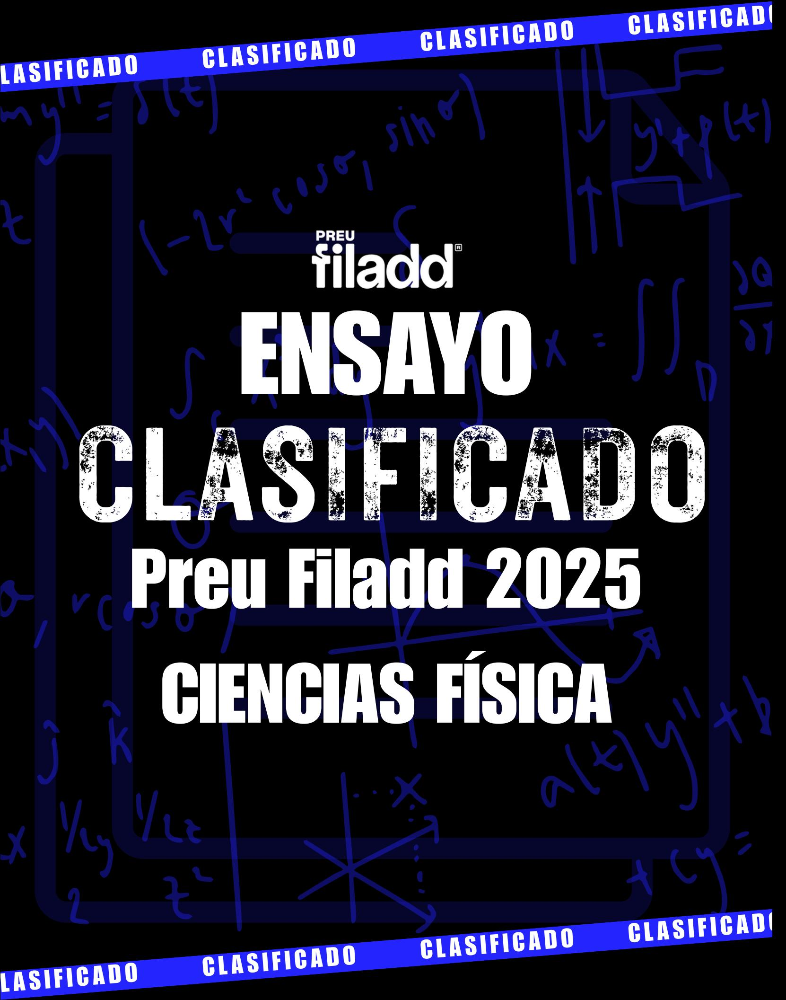

## Ingresa a la Universidad con

# **El Método Filadd**

**Apoyo en gestión de estrés y ansiedad**

**Diagnóstico y plan de estudio personalizado**

**Cápsulas Grabadas**

**Coaching Académico y Vocacional**

**Clases en vivo complementarias**

**Asistente virtual con IA**

**Consultas Ilimitadas**

**Guías y Ensayos**

**[filadd.cl](https://filadd.cl/?utm_source=pdf&utm_medium=pdf&utm_campaign=ensayos_clasificados&utm_term=m_d&utm_content=landing) [FILADD.CL](https://filadd.cl/?utm_source=pdf&utm_medium=pdf&utm_campaign=ensayos_clasificados&utm_term=m_d&utm_content=landing)**

1. La figura representa el perfil de una onda que se propaga a través de una cuerda.

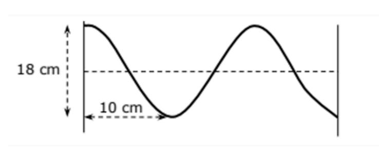

Con la información mostrada, se puede deducir correctamente que la longitud de onda y su amplitud son respectivamente

Ejercicio tipo DEMRE

- A) 10 cm y 9 cm
- B) 10 cm y 18 cm
- C) 18 cm y 10 cm
- D) 20 cm y 9 cm
- E) 20 cm y 18 cm

2.Si la onda de la figura tardó un minuto en ir de A hasta B, es correcto afirmar que:

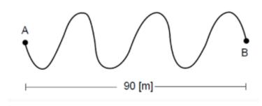

- A) el número de ciclos de la onda es 6.
- B) su periodo es 60 s.
- C) Su longitud de onda es 15 m.
- D) La frecuencia es 1/20 hz.
- E) Su rapidez de propagación es 2,5 m/s.

3. La figura siguiente representa la fotografía del perfil de una onda que se propaga en una cuerda, moviéndose hacia la derecha con una rapidez de 6 cm/s. La fotografía incluye una regla graduada en centímetros.

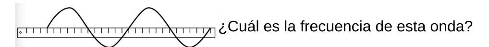

Ejercicio tipo DEMRE

- A) 0,5 Hz
- B) 1 Hz
- C) 2 Hz
- D) 4 Hz
- 4.En un experimento con luz un alumno observa que desde un prisma transparente emerge un único haz de luz de color verde. Respecto de esta situación, es correcto afirmar que
  - A) la luz incidente en el prisma es monocromática.
  - B) El prisma transformó la luz incidente en un haz de luz incoherente.
  - C) La luz incidente es de color blanco y en el prisma solo se transmitió el color verde.
  - D) Solo la luz de color verde se descompuso en el prisma.
  - E) El prisma transformó la luz incidente en un haz de luz coherente.
- 5.Algunas aves tienen la capacidad de ver en la región ultravioleta del espectro electromagnético. Solo con esta información, se puede afirmar correctamente que

- A) dichas aves pueden ver en un intervalo de longitudes de onda más amplio que los humanos.
- B) los humanos pueden ver en un intervalo de frecuencias más restringido que dichas aves.
- C) dichas aves pueden ver luz con frecuencias más altas que los humanos.
- D) dichas aves pueden ver luz de longitudes de onda mayores que los humanos.
- E) la máxima frecuencia que pueden ver los humanos es más alta que la máxima frecuencia que pueden ver dichas aves.

6.En el siglo XVII, los científicos C. Huygens e I. Newton desarrollaron diferentes teorías que describen los fenómenos de reflexión y refracción de la luz. En particular, Huygens proponía una teoría basada en ondas, mientras que Newton una fundamentada en partículas. Sin embargo, a comienzos del siglo XIX, T. Young demostró que solo la teoría de Huygens explicaba correctamente sus nuevos

experimentos de interferencia de la luz. Al respecto, ¿cuál de las siguientes afirmaciones son correctas basándose solo en la información anteriormente presentada?

- A) El experimento de Young explica los fenómenos de la luz de mejor forma que las teorías de Newton y Huygens.
- B) La teoría de Huygens contiene a la de Newton al predecir mejor los fenómenos de la luz.
- C) La teoría de Huygens se ajusta mejor a ciertos fenómenos de la luz que la teoría de Newton .
- D) Los resultados del experimento de Young son errados al desajustarsce con la teoría de Newton.
- 7. Una respuesta de la ciencia al hundimiento del Titanic fue la creación del sonar, un artefacto tecnológico muy importante para determinar los misterios del fondo marino, entre otras aplicaciones.

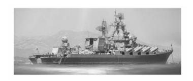

¿Cuál de los siguientes fenómenos es utilizado en los sistemas de Sonar para determinar la profundidad del agua?

- A) Difracción
- B) Refracción
- C) Resonancia
- D) Reflexión

8. La siguiente tabla muestra mediciones de la velocidad de la luz en diferentes medios. Estos resultados fueron obtenidos todos a la misma temperatura.

| Medio    | Velocidad de la luz (km/s) |
|----------|----------------------------|
| Aire     | 299.705                    |
| Agua     | 224.900                    |
| Vidrio   | 197.238                    |
| Diamante | 118.965                    |

Si disponemos d e una secuencia de estos materiales transparentes de forma que un haz de luz monocromática pueda atravesar primero al vidrio, luego el diamante y finalmente el agua, ¿Cuál es la trayectoria más probable que seguiría haz luz?

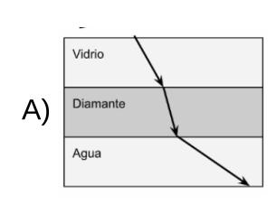

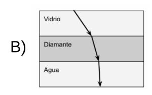

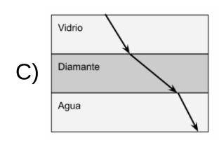

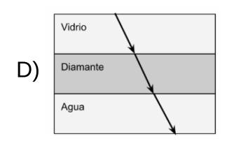

- 9. Considerando un estudio donde el objetivo es determinar el impacto que tiene la cantidad de usuarios conectados simultáneamente en la rapidex de una conexión Wi-Fi determinada. En este contexto de investigación, identifica cuál sería la variable que manipulamos o controlamos directamente:
  - A) El número de usuarios conectados a la red.
  - B) La tasa de transferencia de datos de la conexión a Internet.
  - C) El fabricante o modelo del dispositivo de enrutamiento Wi-Fi.
  - D) La naturaleza del uso de Internet, como visualización de contenido en streaming o exploración de páginas web.

10.Al colocar un objeto frente a una lente convergente delgada, se obtiene una imagen d e mayor tamaño, real e invertida respecto al objeto. En la figura, f corresponde a la distancia focal.

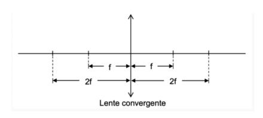

A qué distancia de la lente se encuentra el objeto que forma dicha imagen?

- A) A una distancia f.
- B) A una distancia mayor que 2f.
- C) A una distancia 2f.
- D) A una distancia menor que 2f.

11. Un objeto se ubica a una distancia 3f de un espejo cóncavo, cuya distancia focal es f. Desde un mismo punto del objeto se dibujan tres rayos: el rayo s que es paralelo al eje horizontal, el rayo Q que incide en el vértice del espejo y el rayo P que pasa por el foco del espejo, como se representa en la siguiente figura:

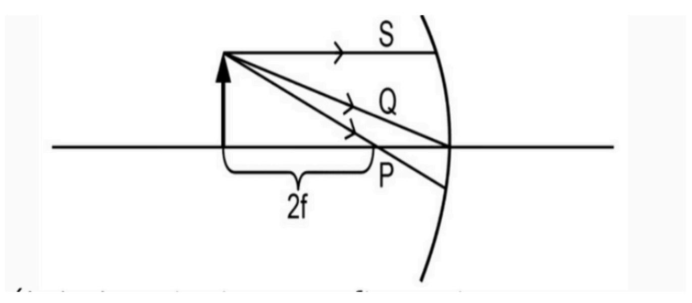

Al respecto, ¿cuál de las siguientes afirmaciones acerca de la formación de imágenes es correcta para esta situación?

- A) Las reflexiones de los rayos P y Q forman una imagen del mismo tamaño que el objeto.
- B) Las reflexiones de los tres rayos forman una imagen virtual e invertida con respecto al objeto.
- C) Las reflexiones de los tres rayos forman una imagen invertida y de menor tamaño que el objeto.
- D) Las reflexiones d e los rayos P y S no se interceptan, evitando que se forme una imagen del objeto.

12. La siguiente figura muestra un objeto, representado por una flecha negra, situado delante de una lente convergente de focos F.

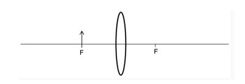

Se afirma correctamente que la lente, en este caso,

Ejercicio tipo DEMRE

- A) forma una imagen real, de mayor tamaño que el objeto e invertida respecto a él.
- B) forma una imagen real, de menor tamaño que el objeto e invertida respecto a él.
- C) forma una imagen real, del mismo tamaño del objeto e invertida respecto a él.
- D) forma una imagen virtual, de mayor tamaño que el objeto y derecha respecto a él.
- E) no forma imagen.
- 13. Un actor debe maquillarse para representar su personaje. Para esto necesita ver su imagen derecha y de mayor tamaño. ¿Qué tipo de espejo debe usar y dónde debe ubicarse?

- A) Espejo convexo, ubicándose a una distancia del espejo igual al doble de su distancia focal.
- B) Espejo cóncavo o convexo, ubicándose a una distancia del espejo igual a su distancia focal.
- C) Espejo cóncavo, ubicándose a una distancia del espejo igual a su distancia focal.
- D) Espejo cóncavo, ubicándose entre el espejo y el foco del espejo.
- E) Espejo plano, ubicándose cerca del espejo.

#### - 🥷 ENSAYO CLASIFICADO | FÍSICA | 2025 -

14. Una persona de 60 kg desciende en ascensor, el cual frena con una aceleración de magnitud 0,25  $m/s^2$ . Considerando que en ese momento la persona está sobre una pesa y que la magnitud de la aceleración de gravedad es igual a 10  $m/s^2$ , ¿Cuál es la medida que indicará la pesa mientras frena el ascensor?

#### Ejercicio tipo DEMRE

- A) 15 N
- B) 60 N
- C) 150 N
- D) 585 N
- E) 615 N
- 15. Mediante una cuerda, un niño arrastra un cajón de madera sobre un piso horizontal plano de cemento, moviéndolo con aceleración constante. Con esta información, se puede afirmar correctamente que, mientras acelera, el módulo de la fuerza neta aplicada al cajón

- A) es constante distinto de cero.
- B) es igual al de la fuerza de roce.
- C) es nulo.
- D) aumenta uniformemente desde cero hasta alcanzar el módulo de la fuerza de roce.
- E) aumenta uniformemente desde cero hasta alcanzar el módulo de su peso.

16. Sobre un bloque actúa una fuerza horizontal  $\vec{F}$  de magnitud F paralela a la superficie y una fuerza de roce de magnitud  $F_R$ , cuando se encuentra unido a una esfera mediante una cuerda, como se representa en la siguiente figura:

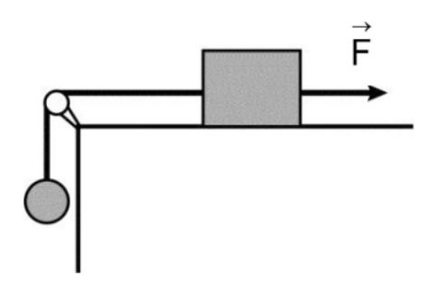

Considerando que g corresponde a la magnitud de la aceleración de gravedad y que el peso de la esfera es mayor que  $\vec{F}$ , ¿Cuál de las siguientes expresiones corresponde a la máxima masa que puede tener la esfera para que el bloque esté en reposo?

Ejercicio tipo DEMRE

A) 
$$\frac{g}{F-F_R}$$

B) 
$$(F-F_R)g$$

C) 
$$\frac{g}{F+F_R}$$

D) 
$$\frac{F+F_R}{g}$$

17. Sobre un cuerpo de 3 kg actúan solo dos fuerzas. Si las fuerzas tienen la misma dirección y el mismo sentido, el cuerpo adquiere una aceleración de magnitud 4  $m/s^2$ . Si las fuerzas tienen la misma dirección pero sentidos contrarios, el cuerpo adquiere una aceleración de magnitud 2  $m/s^2$ . ¿Cuáles son las magnitudes de estas fuerzas?

18. Un estudiante observa que si se dejan caer, desde una misma altura, objetos de igual tamaño y distinto peso por tubos llenos de agua, llegan primero al fondo los de mayor peso. En relación a esto, el estudiante argumenta que lo observado se explica debido a que la rapidez es inversamente proporcional al tiempo empleado y al hecho de que un objeto adquirirá mayor rapidez si tiene un peso mayor. Él infiere que si se dejan caer desde una misma altura, en el aire, dos objetos de igual tamaño y distinto peso, llegará primero al suelo el de mayor peso. Al respecto, se afirma que la inferencia que hace el estudiante es:

Ejercicio tipo DEMRE

- A) correcta de acuerdo a su propio marco conceptual.
- B) incorrecta porque no se conoce la altura de los tubos.
- C) correcta porque el experimento que se observa lo constata.
- D) incorrecta porque el experimento en que se basa está mal diseñado.
- E) correcta porque en el experimento que se propone se trata de un mismo medio.
- 19. Un móvil se mueve con fuerza neta igual a 12 N, experimentando una aceleración de 6  $m/s^2$  .¿Qué pasa con esta fuerza, si en otro instante de su recorrido el móvil desarrolla una aceleración de 3 $m/s^2$  ?

- A) Disminuye en 6 N.
- B) Aumenta en 6 N.
- C) Disminuye en 9 N.
- D) Aumenta en 9 N.
- E) Se mantiene en 12 N.

20. Una persona de 85 kg se para sobre su báscula de baño (B1), cuya masa es de 3 kg, la que a su vez descansa sobre otra báscula (B2) de 2 kg, la que se posiciona sobre una superficie horizontal. ¿Cuál es la lectura que entrega cada báscula?

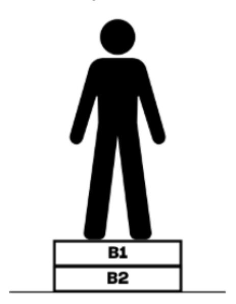

A) B1: 85 kg; B2: 83 kg

B) B1: 85 kg; B2: 88 kg

C) B1: 88 kg; B2: 85 kg

D) B1: 87 kg; B2: 83 kg

21.Se tienen 3 bloques A, B y C que cuelgan del techo de una construcción tal como lo muestra la figura.

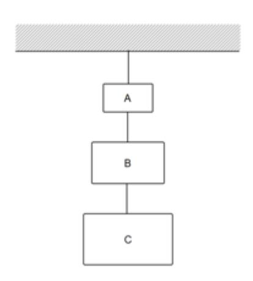

Si a la masa de A, es la mitad de la masa de B y la masa de B es la mitad de la masa de C, y se encuentra conectado por cuerdas que son cuerdas sin masa, ¿Cuál es el valor de la tensión de la cuerda entre a y b, si la masa del bloque A es de 6 Kg?

- A) 60N
- B) 180N
- C) 300N
- D) 360N

22. Un grupo de estudiantes piensa que los resortes ejercen mayor fuerza mientras más estirados se encuentren. Para verificarlo, planifican colgar de diferentes resortes el mismo objeto de masa m conocida, como se representa en la figura, y luego medir la longitud del resorte antes y después de colgar el objeto, con una regla graduada en milímetros.

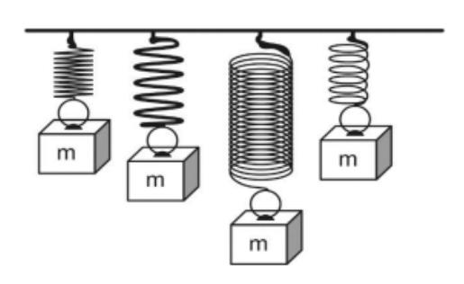

Los estudiantes muestran la planificación a un profesor, quien les señala que no es adecuada para la verificación que desean realizar. Al respecto, ¿cuál de los siguientes aspectos de su planificación deben cambiar los estudiantes para que al realizar la actividad se logre adecuadamente el objetivo?

- A) Las variables del procedimiento: de un mismo resorte colgar objetos de masa distinta y medir cuánto varía su longitud.
- B) Los instrumentos de medida: utilizar una regla graduada en una unidad de medida diferente para medir el estiramiento.
- C) Los instrumentos de medida: utilizar un instrumento que les permita medir la fuerza que ejercen los resortes en cada caso.
- D) Las variables del procedimiento: colgar en cada uno de los diferentes resortes el mismo objeto de masa m y medir la longitud final.

23.En un experimento se deja deslizar libremente un bloque por un plano inclinado, continuando por un plano horizontal hasta que se detiene. Un primer estudiante escribe en su cuaderno que, dado que el bloque se detiene, entonces existe una fuerza de roce entre las superficies en contacto, mientras que un segundo estudiante anota en su cuaderno que si la superficie de alguno de los planos fuese más áspera, el bloque se detendría antes. Entre las siguientes opciones, ¿qué podrían representar las anotaciones de estos dos estudiantes?

Ejercicio tipo DEMRE

- A) Una conclusión y una inferencia, respectivamente
- B) Una teoría y una conclusión, respectivamente
- C) Una inferencia y una teoría, respectivamente
- D) Una conclusión y una ley, respectivamente
- E) Una ley y una inferencia, respectivamente
- 24.El ladrillo de peso del esquema, desliza hacia abajo en contacto con una pared vertical mientras se le aplica una fuerza perpendicular a la pared. El coeficiente de roce dinámico entre la pared y el ladrillo es P F μ

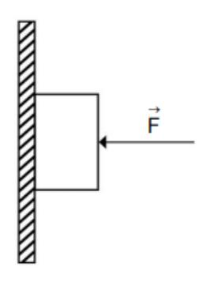

¿Cuál es la magnitud de la fuerza si el ladrillo se mueve con rapidez constante? F

- A) Cero
- B) μ P
- C) P
- D) μP
- E) 2P

25. Cada una de las siguientes opciones representa a un bloque de masa M en reposo, en contacto con una superficie rugosa con coeficiente de roce estático menor que 1. La magnitud de la fuerza normal sobre el bloque es mayor que la magnitud de su peso en

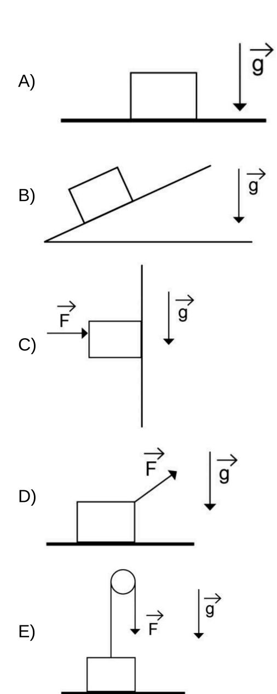

26.En un océano que no presenta fosas oceánicas, pero que sí tiene una dorsal oceánica que pasa por su centro, existen dos islas que se ubican en sus costas opuestas. Al respecto, ¿cuál de las siguientes opciones es una predicción consistente con lo planteado por la Teoría de Tectónica de Placas?

#### Ejercicio tipo DEMRE

- A) Ambas islas se debiesen estar alejando entre sí.
- B) Nuevas islas debiesen surgir en el océano.
- C) Debiese existir una gran sismicidad en ambas islas.
- D) Ambas islas debiesen mantenerse en la misma posición.
- 27.En el siguiente esquema, utilizado por un profesor para explicar que, P y Q representan dos placas tectónicas y 1, 2, 3, 4 y 5 representan estaciones de monitoreo que registran movimientos muy pequeños de cada placa tectónica:

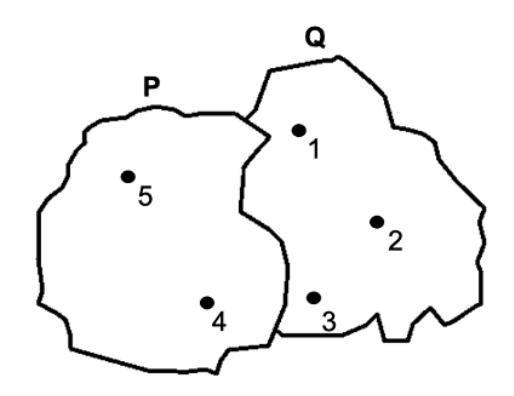

Considerando este esquema, ¿cuál de los siguientes procedimientos es el que mejor se enfoca en determinar si entre las placas tectónicas P y Q hay un límite convergente?

- A) Registrar la distancia entre las estaciones de monitoreo 4 y 3 por una década.
- B) Registrar la distancia entre las estaciones de monitoreo 5 y 4 cada un minuto durante 24 horas.
- C) Registrar la distancia entre las estaciones de monitoreo 1 y 2 por una década.
- D) Registrar la distancia entre las estaciones de monitoreo 3 y 5 cada un minuto durante 24 horas.

28. Una persona revisa diversas fuentes bibliográficas, deteniendo su atención en la siguiente relación entre la magnitud física M de una placa tectónica en función del tiempo t:

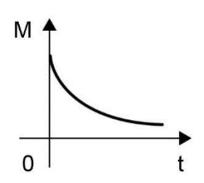

A partir de la información anterior, la persona afirma que a medida que transcurre el tiempo la magnitud física M disminuye. ¿A qué componente de la investigación científica corresponde lo afirmado por la persona?

- A) A una ley
- B) A una teoría
- C) A una variable
- D) A una inferencia

29. Cada punto en el siguiente gráfico representa una gran erupción volcánica ocurrida una cierta cantidad de tiempo, en años, después de un terremoto a una cierta distancia de su epicentro.

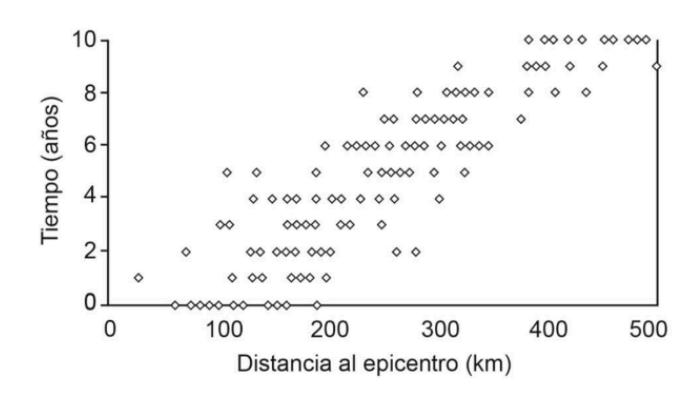

Solo usando este gráfico, ¿cuál de las siguientes opciones es una mejor interpretación del patrón de ocurrencias de erupciones volcánicas?

- A) Las erupciones volcánicas son independientes de la ocurrencia de terremotos.
- B) La cantidad de erupciones volcánicas es directamente proporcional al tiempo en que estas son generadas desde que ocurrió el terremoto.
- C) El tiempo de una erupción, medido desde el terremoto, aumenta con la distancia al epicentro de este.
- D) Un gran terremoto puede inducir erupciones volcánicas hasta 500 km a la redonda en un corto período de tiempo desde que ocurrió el terremoto.
- 30. Un grupo de geólogas monitorea la sismicidad de un volcán ante la sospecha de que su actividad ha aumentado. Para ello, primeramente, realizan un estudio geográfico del sector donde se emplaza el volcán con el fin de instalar sensores sismográficos. Con los sensores ya instalados y en funcionamiento comienza un periodo de mediciones que son procesadas y analizadas. "Finalmente, a partir de los resultados obtenidos, el grupo de geólogas reporta que la sismicidad está dentro de los parámetros normales". Al respecto, ¿a qué componente de la investigación científica se asocia la frase entre comillas?
  - A) Al planteamiento del problema.
  - B) A la formulación de la hipótesis.
  - C) A la presentación de una conclusión.
  - D) A la recolección de los datos experimentales.

#### – ENSAYO CLASIFICADO | FÍSICA | 2025 –

31. Una investigadora y su ayudante indagan acerca de fenómenos geológicos en una zona de su país. Para esto, confeccionan dos mapas, uno de los volcanes activos y otro con los epicentros de sismos sobre 4,0 en magnitud que han ocurrido en el último año en esa zona. Los mapas de la investigadora y su ayudante se presentan a continuación:

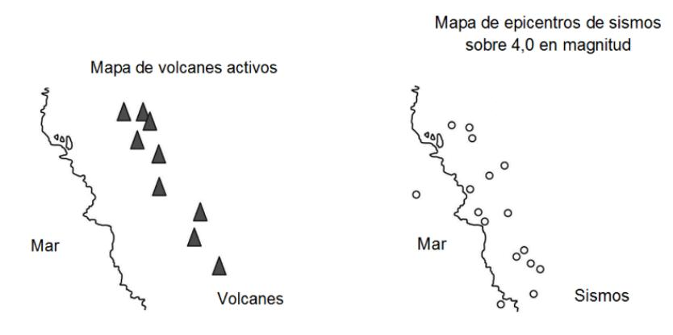

De acuerdo con la teoría de tectónica de placas y la información obtenida, ¿cuál es una inferencia apropiada al análisis de ambos mapas?

#### Ejercicio tipo DEMRE

- A) La zona estudiada se encuentra cerca del centro de una de las placas tectónicas principales.
- B) La zona estudiada se encuentra cerca de un límite transformante de placas tectónicas.
- C) La zona estudiada se encuentra cerca de un límite convergente de placas tectónicas.
- D) La zona estudiada se encuentra cerca de un límite divergente de placas tectónicas.
- 32. Un grupo de investigación utiliza sensores GPS fijos para determinar la posición geográfica de dos islas que están en lados opuestos de una dorsal oceánica y registra estos datos durante varios años. Al respecto, ¿cuál de las siguientes opciones es una pregunta de investigación acorde con el procedimiento descrito?

- A) ¿Cuál de las islas presentará actividad volcánica en el futuro cercano?
- B) ¿Cuál es la magnitud de los sismos que se generan en esta zona?
- C) ¿Cuál de las islas está más cerca del límite de las placas?
- D) ¿Cuál es la rapidez de separación de las placas?

33. Una científica se encuentra estudiando los climas de la Tierra en distintos periodos geológicos y para ello decide investigar los cambios en el clima de la Antártica. En una salida a terreno recolecta evidencias de la presencia de fósiles de plantas de clima cálido de la Era Mesozoica. ¿Cuál de las siguientes opciones es una explicación correcta para la presencia de estos fósiles?

#### Ejercicio tipo DEMRE

- A) El ser humano ha generado un cambio climático extremo, al punto de congelar terrenos que hace millones de años eran de clima cálido.
- B) Los terrenos que ahora se encuentran a la latitud de la Antártica, hace millones de años se encontraban a latitudes de clima cálido.
- C) Los dinosaurios vivieron en un clima cálido, y probablemente se extinguieron debido al congelamiento de sus terrenos.
- D) Las plantas de la Antártica han evolucionado con el cambio climático, pues hace millones de años eran aptas a climas cálidos.
- 34.Se ha descrito que en un cierto país existe una alta actividad sísmica en comparación con otros países. Según los antecedentes, este país presenta una gran cantidad de volcanes y se encuentra cercano al límite de dos placas tectónicas que convergen, produciéndose el hundimiento de una debajo de la otra. En base a lo anterior, ¿cuál de las siguientes opciones representa una inferencia pertinente a la información presentada?

- A) La alta actividad sísmica en el país ocurre por la presencia de muchos volcanes.
- B) La alta actividad sísmica en el país ocurre por un deslizamiento paralelo de una placa sobre la otra.
- C) La alta actividad sísmica en el país ocurre por una separación de las placas tectónicas.
- D) La alta actividad sísmica en el país ocurre por los efectos de la subducción de las placas.
- 35. ¿Qué caracteriza a una zona de convergencia entre placas continentales?
  - A) La generación de fosas oceánicas en bordes continentales.
  - B) La presencia de cordones montañosos.
  - C) La generación de fallas transformantes.
  - D) La presencia de vulcanismo activo.
  - E) La nula sismicidad en la zona.

36.El cinturón de fuego del Pacífico recibe su nombre por la presencia casi continua alrededor del Océano Pacífico de volcanes, cuyo origen es principalmente asociado al proceso de subducción, concentrando la mayor parte de la sismicidad a nivel mundial. Por ello, el casi nulo volcanismo y la escasa sismicidad alrededor del Océano Atlántico son indicativos de la ausencia de subducción. No obstante, existe una serie de zonas en el mundo que presentan volcanismo y sismicidad sin estar relacionados al proceso de subducción. En relación con lo anterior, ¿cuál de las siguientes opciones es una inferencia correcta con la información entregada?

- A) La interacción convergente de placas suele producir volcanismo y sismicidad.
- B) El volcanismo y la sismicidad están siempre asociados con el proceso de subducción.
- C) El volcanismo en zonas de subducción solo se produce en zonas continentales.
- D) La interacción divergente de placas es la responsable del volcanismo y la sismicidad en el cinturón de fuego del Pacífico.
- 37."La tectónica de placas es una teoría geológica que explica los desplazamientos de secciones de la litosfera sobre la astenosfera terrestre, sus direcciones e interacciones. Explica también la formación de las cadenas montañosas y por qué los terremotos y los volcanes se concentran en ciertas regiones geográficas. Además explica por qué las grandes fosas submarinas están junto a islas y continentes y no en el centro del océano". Basados solamente en el texto es correcto concluir que la tectónica de placas afirma que
  - A) la dinámica de las placas tectónicas ha modificado los continentes desde la formación de la Tierra.
  - B) la dinámica de las placas tectónicas indica que en un futuro todos los continentes estarán juntos.
  - C) los continentes estuvieron juntos en un gran continente llamado Pangea.
  - D) todos los terremotos solamente son producidos por la dinámica de las placas tectónicas.
  - E) la formación de volcanes ocurre solamente cuando existe movimiento de placas tectónicas.

38. Un foco industrial tiene un desperfecto en su resistencia eléctrica, por lo cual debe ser reemplazada. Si en la etiqueta del foco aparecen sus características, las cuales son y , ¿qué valor tiene la resistencia eléctrica a reemplazar? 220 V 4 A

Ejercicio tipo DEMRE

- A) 4, 0 Ω
- B) 13, 7 Ω
- C) 55 Ω
- D) 220, 0 Ω
- 39. Un circuito eléctrico está formado por una fuente de poder y dos resistencias en serie de y . Si por la resistencia de se registra una intensidad de corriente de , ¿cuál es el voltaje que entrega la fuente? 10 Ω 40 Ω 40 Ω 0, 1 A

- A) 1, 0 V
- B) 2, 5 V
- C) 4, 0 V
- D) 5, 0 V
- E) 10, 0 V

#### – ENSAYO CLASIFICADO | FÍSICA | 2025 –

40. Un estudiante construye un circuito eléctrico utilizando una pila, un amperímetro, una ampolleta y un interruptor conectados en serie. A continuación, cierra el circuito usando el interruptor y comienza a registrar, cada cinco minutos durante media hora, el valor de la intensidad de corriente medida por el amperímetro.

A partir del procedimiento realizado por el estudiante, ¿cuál de las siguientes preguntas de investigación guio el procedimiento descrito?

Ejercicio tipo DEMRE

- A) ¿Qué relación existe entre la diferencia de potencial de la pila y la intensidad de corriente del circuito?
- B) ¿Qué relación existe entre la diferencia de potencial de la pila y el tiempo de funcionamiento del circuito?
- C) ¿Cómo se relaciona el funcionamiento del interruptor con la intensidad de corriente del circuito?
- D) ¿Cómo se relaciona la intensidad de corriente con el tiempo de funcionamiento del circuito?
- 41.Si un grupo de personas construye un circuito conectando dos resistencias en paralelo a una batería, ¿cuál de las siguientes opciones es coherente con la ley de Ohm y la configuración del circuito, al comparar la diferencia de potencial y la intensidad de corriente eléctrica en cada resistencia con la suministrada por la batería?

| A) |  |  |  |
|----|--|--|--|
|    |  |  |  |
| B) |  |  |  |
| C) |  |  |  |
| D) |  |  |  |

42. La Ley de Ohm permite determinar la intensidad de corriente que se establece en un circuito a partir del voltaje y de la forma en que están conectadas las resistencias. Si bien en el momento en que se propuso, aún no existía la corriente alterna, al día de hoy se puede establecer una analogía entre circuitos de corriente continua y la conexión domiciliaria. ¿Cuál de las siguientes opciones describe de mejor forma al análogo del circuito hogareño en el cual están enchufados un televisor, una estufa y una ampolleta?

#### Ejercicio tipo DEMRE

- A) Un circuito en serie con resistencias distintas
- B) Un circuito en paralelo con tres resistencias idénticas
- C) Un circuito en paralelo con tres resistencias de distinto valor
- D) Un circuito simple, con una resistencia equivalente a la de los tres artefactos
- 43.Se tienen las resistencias , y conectadas como se representa en el esquema. R1 = 30 ΩR2 = 30 Ω R3 = 60 Ω

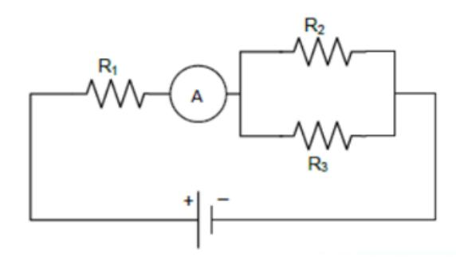

Si el circuito está conectado a una diferencia de potencial de , la corriente eléctrica que se registra en el amperímetro es 12 V A

- A) 0, 60 A
- B) 0, 53 A
- C) 0, 40 A
- D) 0, 24 A
- E) 0, 10 A

#### – ENSAYO CLASIFICADO | FÍSICA | 2025 –

44. Una estudiante propone que la corriente eléctrica que fluye a través de una resistencia tiene una intensidad que depende del valor de la resistencia y del voltaje al que esta se encuentra sometida. Sus compañeros de curso disponen de distintas resistencias, cuyos valores son todos diferentes entre sí. Si desean determinar experimentalmente de qué manera la intensidad de la corriente eléctrica depende del voltaje, ¿cuál de las siguientes opciones es un procedimiento experimental adecuado para lograr su objetivo?

- A) Medir la intensidad de corriente eléctrica de distintas resistencias sometidas a igual voltaje.
- B) Medir el voltaje de una misma resistencia con distintas intensidades de corriente eléctrica.
- C) Medir la intensidad de corriente eléctrica de una misma resistencia sometida a distintos voltajes.
- D) Medir el voltaje de distintas resistencias con una misma intensidad de corriente eléctrica.

45. Una persona realiza pruebas de potencia a unas ampolletas. Para ello, construye un circuito simple, conectando una ampolleta a una batería. Luego, en un tiempo t1 , conecta una segunda ampolleta en serie al circuito, manteniendo siempre la misma batería. ¿Cuál de las siguientes opciones representa correctamente la potencia eléctrica , que desarrolla la batería en función del tiempo? P

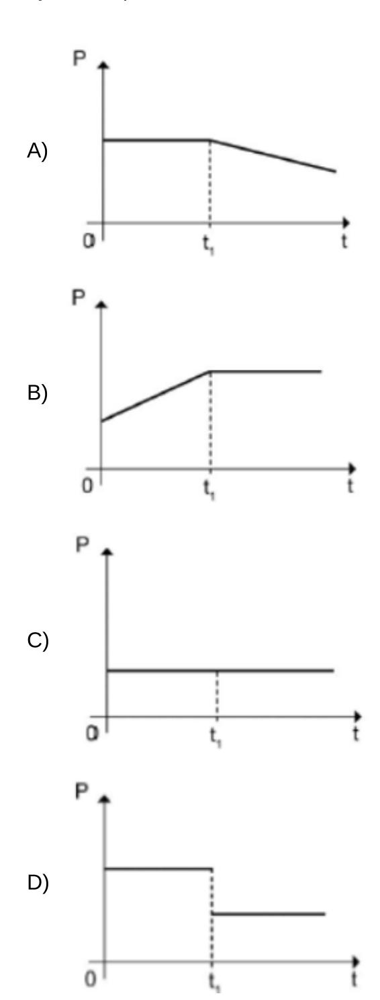

46. Una persona realiza mediciones en un circuito domiciliario y constata que una parte de él se encuentra a una temperatura mayor que la del ambiente. Al respecto, ¿cuál de las siguientes afirmaciones acerca de la energía eléctrica del circuito es correcta?

#### Ejercicio tipo DEMRE

- A) Se conserva cuando los artefactos están conectados en serie.
- B) Se puede estar disipando exclusivamente en ondas sonoras.
- C) Se puede estar disipando en los alambres de conexión.
- D) Se transforma exclusivamente en energía mecánica.
- 47. Una persona está en un local comercial y pretende comprar un refrigerador cuyo uso implique el menor gasto económico posible. La persona compara el etiquetado de distintos refrigeradores, uno de los cuales se representa en la siguiente imagen:

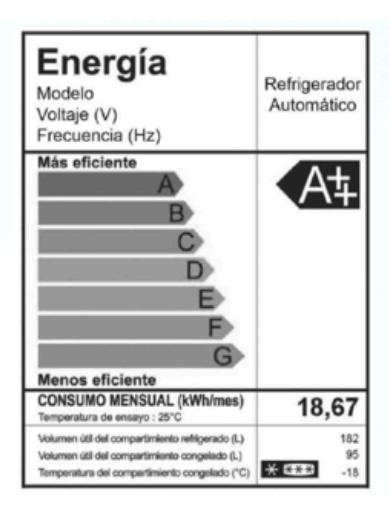

En relación con lo anterior, ¿qué información de la etiqueta debe considerar la persona para tomar su decisión?

- A) El consumo mensual del refrigerador
- B) El voltaje que se debe suministrar al refrigerador
- C) La temperatura del compartimiento congelado del refrigerador
- D) El volumen útil total de ambos compartimientos del refrigerador

#### 48.Se tiene el siguiente circuito:

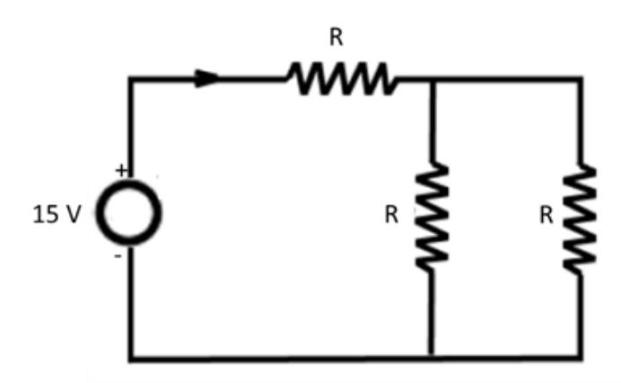

Considerando los parámetros indicados, ¿cuál es el valor de la resistencia que produce en el circuito una energía disipada por unidad de tiempo de ? R 5 W

- A) 10 Ω
- B) 20 Ω
- C) 30 Ω
- D) 40 Ω

49. Una persona construye cuatro circuitos eléctricos, cada uno de ellos con tres ampolletas de igual resistencia conectadas a una batería de voltaje constante, tal como se indica en las figuras. ¿Cuál de los circuitos construidos posee la mayor potencia disipada?

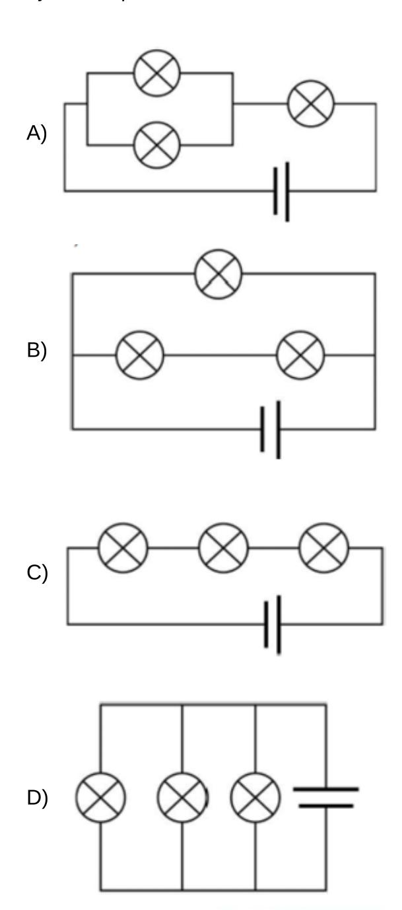

50.Algunos de los artefactos tecnológicos que se conectan al sistema eléctrico domiciliario requieren de un voltaje menor al que este proporciona, por lo que generalmente se utilizan con un dispositivo externo que adecua la intensidad de corriente que circula por estos. ¿Cuál de los siguientes aparatos cumple la función del dispositivo externo mencionado anteriormente?

- A) El medidor eléctrico.
- B) Los cables de corriente.
- C) El interruptor automático.
- D) El transformador eléctrico.

# Ingresa a la **carrera y universidad** de tus sueños junto a **Preu Filadd**

# **PACK MEDICINA**

Si tienes en mente **Medicina** o una **carrera del área de la salud**

- Todo el Método Filadd
- Matemática M1 y M2
- Competencia Lectora
- Biología, Física y Química
- Curso de intro. a Medicina

**PACK COMPLETO**

Prepárate para rendir **todas las pruebas PAES.**

#### **Incluye:**

- Todo el Método Filadd
- Matemática M1 y M2
- Competencia Lectora
- Biología, Física y Química
- Historia y Cs Sociales

**[filadd.cl](https://filadd.cl/?utm_source=pdf&utm_medium=pdf&utm_campaign=ensayos_clasificados&utm_term=m_d&utm_content=landing) [FILADD.CL](https://filadd.cl/?utm_source=pdf&utm_medium=pdf&utm_campaign=ensayos_clasificados&utm_term=m_d&utm_content=landing)**

### **Resolución de ejercicios Explicados en video** \*

**Escanea o presiona el QR para ver resolución de ejercicios:**

# CLAVES ENSAYO FÍSICA

| 1. D  | 11. C | 21. D | 31. C | <b>41.</b> B |
|-------|-------|-------|-------|--------------|
| 2. D  | 12. E | 22. A | 32. D | 42. C        |
| 3. A  | 13. D | 23. A | 33. B | 43. D        |
| 4. A  | 14. E | 24. B | 34. D | 44. C        |
| 5. C  | 15. A | 25. C | 35. B | 45. D        |
| 6. C  | 16. D | 26. A | 36. A | 46. C        |
| 7. D  | 17. C | 27. A | 37. A | 47. A        |
| 8. A  | 18. A | 28. D | 38. C | 48. C        |
| 9. A  | 19. A | 29. C | 39. D | 49. D        |
| 10. D | 20. B | 30. C | 40. D | 50. D        |

### **Tabla de transformación de puntajes** \*

| Buenas | Puntaje |
|--------|---------|
| 1      | 100     |
| 2      | 118     |
| 3      | 136     |
| 4      | 155     |
| 5      | 173     |
| 6      | 191     |
| 7      | 210     |
| 8      | 228     |
| 9      | 247     |
| 10     | 265     |
| 11     | 283     |
| 12     | 302     |
| 13     | 320     |
| 14     | 338     |
| 15     | 357     |
| 16     | 375     |
| 17     | 393     |
| 18     | 412     |
| 19     | 430     |
| 20     | 449     |
| 21     | 467     |
| 22     | 485     |
| 23     | 504     |
| 24     | 522     |
| 25     | 540     |

| Buenas | Puntaje |
|--------|---------|
| 26     | 559     |
| 27     | 577     |
| 28     | 596     |
| 29     | 614     |
| 30     | 632     |
| 31     | 651     |
| 32     | 669     |
| 33     | 687     |
| 34     | 706     |
| 35     | 724     |
| 36     | 742     |
| 37     | 761     |
| 38     | 779     |
| 39     | 798     |
| 40     | 816     |
| 41     | 834     |
| 42     | 853     |
| 43     | 871     |
| 44     | 889     |
| 45     | 908     |
| 46     | 926     |
| 47     | 945     |
| 48     | 963     |
| 49     | 982     |
| 50     | 1000    |

