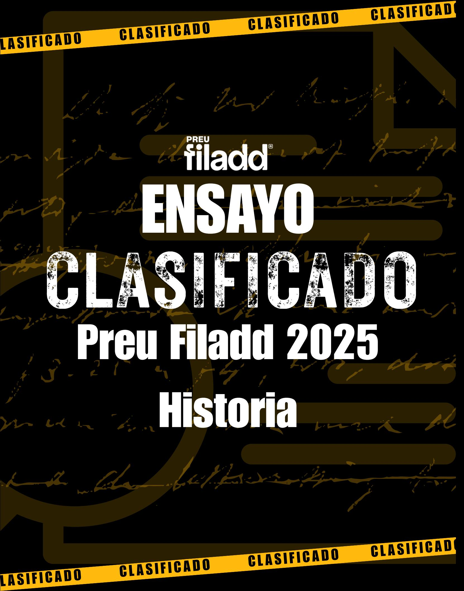

## Ingresa a la Universidad con

# **El Método Filadd**

**Apoyo en gestión de estrés y ansiedad**

**Diagnóstico y plan de estudio personalizado**

**Cápsulas Grabadas**

**Coaching Académico y Vocacional**

**Clases en vivo complementarias**

**Asistente virtual con IA**

**Consultas Ilimitadas**

**Guías y Ensayos**

**[filadd.cl](https://filadd.cl/?utm_source=pdf&utm_medium=pdf&utm_campaign=ensayos_clasificados&utm_term=m_d&utm_content=landing) [FILADD.CL](https://filadd.cl/?utm_source=pdf&utm_medium=pdf&utm_campaign=ensayos_clasificados&utm_term=m_d&utm_content=landing)**

- 1.A lo largo del siglo XIX, las ideas liberales y republicanas comenzaron a desafiar los sistemas monárquicos tradicionales en Europa, influyendo en la transformación de los sistemas políticos de varios países. ¿Cuál fue el impacto más significativo de las ideas liberales y republicanas en la constitución y organización política de los países europeos durante el siglo XIX?
  - A) La consolidación del absolutismo presidencialista, con el fortalecimiento del poder del ejecutivo y el control de las instancias participativas.
  - B) La creación de constituciones que limitaban el poder absoluto de los monarcas y promovían la soberanía popular.
  - C) La instauración de un sistema de gobierno comunista en los países europeos, basado en la propiedad colectiva de los medios de producción.
  - D) La centralización del poder en las manos de la nobleza, con el propósito de preservar las jerarquías sociales.
- 2.En América Latina, durante la primera mitad del siglo XIX, la difusión de las ideas del liberalismo proporcionó a las elites algunas herramientas políticas e intelectuales para liderar los procesos de formación de los Estados. En este contexto, ¿qué objetivo perseguía la elite chilena con la aplicación de dichas ideas en la sociedad?

- A) Implementar el parlamentarismo europeo.
- B) Obtener mayores derechos político-civiles.
- C) Unificar el continente mediante el Panamericanismo.
- D) Defender la supremacía política de la Iglesia Católica.
- 3. Desde mediados del siglo XVIII, la burguesía encontró respaldo intelectual en figuras como el economista escocés Adam Smith, cuya obra más famosa "La Riqueza de las Naciones" abogaba por una mayor libertad económica, restringiendo la intervención estatal. Según el liberalismo económico, ¿por qué se debe limitar al máximo la intervención del Estado en la economía?
  - A) Porque a partir de los sindicatos fuertes se pueden negociar directamente los términos de producción y precios con las empresas.
  - B) Para fomentar un mercado eficiente y competitivo, donde la ley de oferta y demanda regule naturalmente los precios y la calidad
  - C) Para fomentar políticas gubernamentales que establezcan precios fijos para todos los bienes y servicios esenciales.
  - D) Porque permite un sistema de cupos y licencias que limita la cantidad de empresas en cada sector para garantizar la estabilidad.

### – ENSAYO CLASIFICADO | HISTORIA | 2025 –

- 4. Durante la primera mitad del siglo XIX, Chile experimentó significativos cambios políticos que contribuyeron a la formación de la república. ¿Cuál de los siguientes aspectos fue clave en este proceso?
  - A) La implementación de un sistema monárquico hereditario.
  - B) La redacción y promulgación de diversas constituciones.
  - C) La alianza política con el imperio británico.
  - D) La continuación del sistema de gobierno colonial español.
- 5.A mediados del siglo XIX la agricultura chilena vivió una importante revitalización económica. ¿Cuál fue una de las situaciones del contexto histórico del periodo que favoreció dicha revitalización?

#### EJERCICIO DEMRE

- A) La demanda de productos alimenticios en los mercados de California y Australia.
- B) La mayor conectividad entre las regiones exportadoras y los mercados asiáticos.
- C) La aplicación de un plan de reforma agraria basado en el modelo latinoamericano.
- D) La llegada masiva de trabajadores extranjeros que colonizaron las provincias de la Zona Central.
- 6. Hacia la segunda mitad del siglo XIX, las potencias del Atlántico experimentaron un proceso de expansión económica gracias a un importante desarrollo industrial. Por su parte, Chile fue incapaz de alcanzar ese nivel de desarrollo. Al respecto, ¿cuál es un elemento de continuidad histórica que permite explicar este retraso de la economía chilena?

- A) La predominancia de la propiedad minera estatal.
- B) La mantención del monopolio comercial con Europa.
- C) La permanencia de una estructura financiera pública.
- D) La persistencia de una matriz productiva extractivista.

7.A lo largo del siglo XIX, Chile experimentó un importante crecimiento económico como consecuencia de su progresiva inserción en la economía internacional y un conjunto de medidas que operaron como factores internos que favorecieron este crecimiento. En este sentido, ¿cuál fue una de las medidas que favoreció la inserción de la economía chilena en los mercados internacionales durante el siglo XIX?

#### EJERCICIO DEMRE

- A) La implementación de una política de industrialización.
- B) La puesta en marcha de un proceso de reforma agraria.
- C) La inversión en distintas infraestructuras de transportes.
- D) La estatización de las instituciones del sector financiero.
- 8. Desde finales del siglo XIX y comienzos del XX la sociedad chilena experimentó diversas transformaciones provocadas por la incipiente industrialización, lo que trajo como consecuencia una profundización de las desigualdades sociales. En este contexto, ¿cuál fue una de las respuestas dadas para enfrentar esta situación?

- A) La oligarquía financió un sistema de seguridad social.
- B) La Iglesia Católica diseñó un conjunto de leyes sociales.
- C) El Estado garantizó el acceso universal a la vivienda social.
- D) El proletariado fortaleció su capacidad de organización social.
- 9.A principios del siglo XX, el aumento de escuelas públicas en Chile, de 486 en 1860 a 1547 en 1900, sugiere un esfuerzo significativo por mejorar la educación. ¿Cuál fue el impacto de esta expansión educativa en la sociedad chilena de la época?
  - A) Contribuyó principalmente al fortalecimiento de la oligarquía, manteniendo el statu quo.
  - B) Redujo la movilidad social al concentrar recursos educativos en áreas urbanas ya privilegiadas.
  - C) Generó un descontento generalizado por la falta de oportunidades de empleo para los educados.
  - D) Facilitó un ascenso social más amplio, fortaleciendo a los emergentes sectores medios y fomentando nuevas ideologías.

10. Lee el siguiente texto acerca de las condiciones de vida en el norte salitrero:

«La gran masa de mineros del salitre tenía que satisfacer sus apetitos en las pulperías, almacenes pertenecientes a las compañías salitreras que solían vender productos de mala calidad a precios excesivos. Aislados en los campamentos y pagados con fichas, los mineros se veían obligados a tratar con ellos. Sin embargo, a pesar del trabajo peligroso y las condiciones de vida por lo general miserables, los hombres seguían llegando por miles al norte. Por muy sórdida que fuera la vida en las salitreras, era menos letal que vivir en los conventillos».

Collier, S. y Sater, W. (1998). Historia de Chile 1808-1994.

A finales del siglo XIX y principios del siglo XX se manifestó en Chile el fenómeno de la Cuestión Social. En este sentido, y considerando lo expresado en la cita, ¿cuál fue uno de los rasgos de la Cuestión Social?

- A) Tuvo un impacto que perjudicó a la economía nacional.
- B) Correspondía a un fenómeno de carácter multidimensional.
- C) Generó una rápida respuesta de las autoridades por su magnitud.
- D) Fue una problemática cuya manifestación era acotada localmente.
- 11. Durante la transición entre el siglo XIX y el XX en Chile, la Cuestión Social emergió como un conjunto de problemáticas asociadas a la modernización y urbanización aceleradas. Dado el panorama anterior, ¿Cuál de las siguientes opciones representa mejor una consecuencia de la Cuestión Social que afectó directamente a los desafíos enfrentados por la clase trabajadora?
  - A) El aumento de la industrialización y la urbanización en Chile llevó a la creación de empleos de alta remuneración que mejoraron significativamente el nivel de vida de la mayoría de los trabajadores urbanos.
  - B) La expansión de la infraestructura urbana, impulsada por la inversión pública, resolvió en gran medida los problemas de vivienda y servicios básicos para la clase trabajadora.
  - C) La rápida urbanización, sin una planificación adecuada, generó un aumento en la demanda de viviendas que no pudo ser satisfecha adecuadamente, llevando a condiciones precarias de vivienda y proliferación de tugurios.
  - D) La clase trabajadora, al migrar de zonas urbanas a rurales, pudo acceder fácilmente a educación y servicios de salud, reduciendo así las disparidades socioeconómicas.

12. Durante el periodo de Entreguerras, en Europa se produjeron diversos movimientos políticos que adhirieron a fórmulas ideológicas totalitarias. Al respecto, ¿cuál es uno de los factores explicativos del retroceso de los valores democráticos en las formas de gobierno europeas en la primera mitad del siglo XX?

- A) La ausencia de un organismo internacional que regulara los conflictos entre las naciones.
- B) La inexistencia de políticas económicas para enfrentar los efectos de la depresión iniciada en 1929.
- C) La rápida expansión de regímenes comunistas en el continente por la influencia de la Unión Soviética.
- D) El desarrollo de visiones políticas irreconciliables respecto a la resolución de los problemas que enfrentaban los países.
- 13. Durante las décadas de 1930 y 1940, varios países latinoamericanos enfrentaron las consecuencias de la crisis económica mundial, lo que debilitó los modelos tradicionales de desarrollo y representación política. En este contexto, surgieron nuevas formas de liderazgo político que ofrecían respuestas directas al malestar social. ¿Cuál de las siguientes afirmaciones explica correctamente el surgimiento del populismo en América Latina en ese periodo?
  - A) El colapso del sistema colonial provocó un vacío de poder que fue ocupado por líderes militares carismáticos.
  - B) La influencia del fascismo europeo promovió la adopción de gobiernos autoritarios con énfasis nacionalista en la región.
  - C) La aparición de liderazgos con discursos nacionalistas y control estatal sobre la economía movilizaron amplios sectores populares.
  - D) El avance del socialismo en Europa del Este incentivó la creación de sistemas autoritarios en América Latina.

- 14. Durante la Gran Depresión, el New Deal introdujo varias políticas para enfrentar la crisis económica en Estados Unidos. ¿Cómo se relaciona el concepto del Estado de bienestar con las políticas implementadas bajo el New Deal en Estados Unidos?
  - A) El Estado de bienestar promovió la no intervención estatal en la economía y la reducción significativa de los servicios públicos disponibles.
  - B) El Estado de bienestar garantizó servicios básicos y derechos sociales, como la seguridad social y el derecho de huelga, complementando así las medidas económicas del New Deal.
  - C) El Estado de bienestar consistió en la eliminación de todas las regulaciones laborales existentes y en la reducción considerable de los impuestos para las empresas.
  - D) El Estado de bienestar se centró principalmente en aumentar la dependencia de importaciones extranjeras y en reducir significativamente la producción nacional.
- 15. Luego de finalizada la Segunda Guerra Mundial, diversos Estados del mundo reconocieron la necesidad de buscar soluciones a nivel global a las atrocidades vividas durante la guerra y a los grandes impactos sociales y económicos provocados por este conflicto en distintos países. Considerando estos antecedentes, ¿cuál fue una de las medidas que se adoptó a nivel mundial para mejorar las condiciones de vida de la población?

- A) El incentivo al desarrollo de movimientos sociales.
- B) La erradicación de los conflictos bélicos bilaterales.
- C) La creación de organismos internacionales multilaterales.
- D) El establecimiento de una moneda única para el comercio.
- 16. Durante la Guerra Fría, el mundo quedó dividido en dos grandes bloques liderados por Estados Unidos y la Unión Soviética. Esta división tuvo consecuencias políticas, económicas y militares en varios países. ¿Cuál de las siguientes afirmaciones refleja una característica de esta división bipolar del mundo?
  - A) La formación de un sistema económico global dirigido por organismos internacionales.
  - B) El aislamiento político y económico de las grandes potencias en sus territorios nacionales.
  - C) La creación de alianzas militares rivales como la OTAN y el Pacto de Varsovia.
  - D) El establecimiento de un sistema único de defensa internacional controlado por la ONU.

17. Durante la segunda mitad del siglo XX, el escenario político internacional se vio remecido por el proceso de descolonización que se estaba produciendo en los dominios europeos de África y Asia. ¿Cuál es uno de los antecedentes político-económicos que explica el desarrollo de dicho proceso?

#### EJERCICIO DEMRE

- A) La gran inversión realizada por los gobiernos metropolitanos en armamento nuclear, en desmedro del presupuesto colonial.
- B) La superioridad militar y técnica alcanzada por los movimientos de liberación nacional en las colonias.
- C) El nuevo orden surgido tras la Segunda Guerra Mundial y el desgaste que esta ocasionó a las potencias europeas.
- D) El agotamiento de los recursos naturales cuya explotación constituía el sustento de la administración europea en los territorios ocupados.
- 18.En Chile, a mediados del siglo XX la población urbana superó a la rural, producto de la masiva migración campo-ciudad lo que provocó cambios en la fisonomía de las ciudades. ¿Qué cambio se produjo en las ciudades producto de este proceso?

- A) El surgimiento de núcleos de vivienda precaria de autoconstrucción.
- B) El rescate patrimonial de los barrios tradicionales del centro urbano.
- C) El acceso igualitario para los habitantes de la infraestructura urbana.
- D) El desarrollo de un plan estatal que provocó un superávit habitacional.

19. Lee el siguiente relato del escritor Pedro Lemebel en el que describe su infancia en una población callampa a mediados del siglo XX:

«Y tal vez alguien nos dijo que existía el Zanjón y para no quedarnos a la intemperie llegamos a esas playas inmundas donde los niños corrían junto a los perros persiguiendo guarenes. Y la cosa fue tan simple, tan rápida que por unos pocos pesos nos vendieron una muralla, ni siquiera un metro de terreno, solo era un muro de adobes que mi abuela compró en ese lugar».

Lemebel, P. (2015). Zanjón de la Aguada

Considerando este contexto histórico, ¿cuál fue uno de los factores que originó este tipo de asentamientos?

- A) La implementación de un subsidio para acceder a viviendas baratas.
- B) El ocaso del mercado irregular que impidió habitar entornos adecuados.
- C) La demanda de vivienda superaba la oferta de habitaciones disponibles.
- D) El exceso de población produjo el abandono de diversos centros urbanos.
- 20. Debido a las condiciones de vida que estaba llevando gran parte de la población en las ciudades de Chile a mediados del siglo pasado, el Estado buscó medidas para entregar soluciones habitacionales. ¿Por qué a pesar de los intentos gubernamentales este problema no pudo solucionarse rápidamente?
  - A) Porque las necesidades habitacionales aumentaron en un ritmo mayor al de la entrega de viviendas.
  - B) Porque los fondos destinados a la construcción de viviendas fueron desviados a proyectos bélicos.
  - C) Porque la migración del campo a la ciudad disminuyó significativamente, reduciendo la demanda de viviendas.
  - D) Porque la calidad de las viviendas entregadas era tan alta que no se consideraron necesarias más construcciones.

21. Lee el siguiente texto que presenta una interpretación del clima político que desembocó en el Golpe de Estado de 1973 en Chile:

«El fracaso de las negociaciones, el consecuente deterioro del rol de las instituciones y procedimientos mediadores tradicionales, la política de movilización social y el deterioro de la autoridad del liderazgo político sobre sus militantes, llevaron a la incorporación de los que Juan Linz denomina poderes "neutrales" al juego político. La Contraloría, los tribunales, el Tribunal Constitucional y, finalmente, las Fuerzas Armadas se vieron involucrados poco a poco en agudas controversias, que claramente pertenecían a la arena política y legislativa».

Valenzuela, A. (1989). El quiebre de la democracia en Chile

Considerando el contexto histórico de la época, ¿a qué factor explicativo del quiebre de la democracia en Chile se refiere el texto?

#### EJERCICIO DEMRE

- A) El desinterés de las organizaciones comunitarias por el bienestar social.
- B) La indiferencia de la clase política ante la pobreza que sufría la población.
- C) La apatía de la sociedad civil frente a la crisis de representatividad política.
- D) El menoscabo de la misión de los organismos públicos por la contingencia.
- 22.A partir del Golpe de Estado de 1973, los jerarcas del régimen controlaron el Ejecutivo, a la vez que asumieron las funciones del Legislativo, suspendiendo el funcionamiento del Congreso Nacional. También establecieron conexiones y presionaron a los tribunales de justicia para evitar el desarrollo de juicios en contra de sus acciones. Respecto de esta situación, ¿cuál es una evidencia de la supresión del Estado de derecho durante la Dictadura Militar?

- A) La pérdida de independencia entre los poderes públicos.
- B) La suspensión de las actividades de la administración pública.
- C) La participación de civiles en la gestión de los asuntos públicos.
- D) La inexistencia de un marco legal de protección de las personas.

- 23.El concepto de sistematización aplicado al contexto de dictadura militar (1973-1990) permite reconstruir cómo ocurrió la violación a los derechos humanos de manera repetida, estructurada y planificada por parte del Estado. ¿Cuál de las siguientes acciones representa una forma de violación sistemática a los derechos humanos cometida por la dictadura militar en Chile?
  - A) La nacionalización de empresas estratégicas.
  - B) La implementación de reformas educativas.
  - C) La detención y desaparición forzada de opositores políticos.
  - D) La promoción del crecimiento económico mediante exportaciones.
- 24.El modelo neoliberal implementado en Chile a partir de la dictadura de Pinochet luego de 1973, promovió una serie de reformas económicas que cambiaron la estructura que tenía el país a inicios de la década de los 70'. ¿Qué medida era necesaria para reducir el rol del Estado en la sociedad?
  - A) El aumento de la intervención del Estado en la macroeconomía.
  - B) Reducción del gasto público y promoción de la privatización.
  - C) Fomento de la producción nacional a través de subsidios.
  - D) Nacionalización de las empresas privadas.

### 25. Lee el siguiente texto:

«Toda la gente salí a la calle a tocar las ollas. Todo el mundo estaba contento, parecía carnaval […] ¡es una de las cuestiones más encachadas que me ha tocado vivir! Pero con un día de recreo no se gana nada. Saltando en la calle no vamos a echar a este gobierno y, por lo tanto, hubo que empezar a darle mayor conducción a la cosa y comprometerla más con el derrocamiento de la dictadura […] los viejos se asustaron y dejaron de salir a la calle […] se dieron cuenta de que las condiciones de la pelea cambiaron y no se sienten capaces de asumirla […]. Ahora, los que salen son los cabros que saben que si seguimos saltando, riéndonos y tocando guitarra, no le vamos a ganar a nadie y el gobierno va a seguir mandando».

Politzer, P. (1988). La ira de Pedro y los otros. Editorial Planeta

El testimonio anterior, corresponde a un poblador y está referida a un periodo de la historia reciente de Chile. En dicho párrafo, se manifiesta de manera central

#### EJERCICIO DEMRE

- A) el descontento de diferentes sectores sociales frente a las condiciones del retorno a la democracia.
- B) el entusiasmo generado por el triunfo de la Unidad Popular debido a su llegada al gobierno.
- C) las celebraciones de los partidarios de la opción NO tras el triunfo en el Plebiscito.
- D) el inicio y radicalización de las protestas nacionales contra la Dictadura Militar.
- 26. Uno de los fundamentos sobre los que se sustenta el funcionamiento de las democracias contemporáneas es el de la soberanía popular. En este sentido, ¿en cuál de las siguientes situaciones se evidencia este fundamento de la democracia?

- A) En la libertad de expresar las propias ideas.
- B) En la designación de los ministros de Estado.
- C) En el ejercicio del voto en elecciones periódicas.
- D) En la militancia en un partido político tradicional.

27.En las sociedades actuales los medios de comunicación representan ventajas, pero también riesgos que deterioran la calidad de la democracia. Considerando las características de las sociedades democráticas, ¿cuál de las siguientes situaciones evidencia uno de estos riesgos?

#### EJERCICIO DEMRE

- A) La elevada diversidad de los tipos de soportes utilizados.
- B) El aumento de la cantidad de anuncios publicitarios pagados.
- C) El incremento del espacio destinado a acoger debates políticos.
- D) La alta concentración de la propiedad de las empresas del rubro.
- 28. Lee el texto que se refiere a la incorporación de la interpelación parlamentaria en la Constitución chilena:

«La interpelación parlamentaria es una de las atribuciones exclusivas que ostenta la Cámara de Diputados, a partir de la reforma constitucional que introduce diversas modificaciones durante el gobierno del entonces presidente Ricardo Lagos Escobar el año 2005, en el cual se otorgaron herramientas de fiscalización a dicha Corporación, respecto de los actos del gobierno».

Observatorio del Congreso (s.f.). Interpelaciones parlamentarias desde 2006 a la fecha. ¿Qué es una interpelación parlamentaria? Recuperado el 6 de noviembre de 2023.

Considerando el texto citado, ¿de qué forma la incorporación de este mecanismo contribuye al funcionamiento de la democracia?

- A) Garantiza la actuación autónoma de los poderes políticos que componen el Estado.
- B) Permite a los representantes de la ciudadanía supervisar la gestión del Ejecutivo.
- C) Verifica el cumplimiento de las promesas de campaña del Presidente de la República.
- D) Favorece la participación de la mayoría de la población en los procesos eleccionarios.

29.El Servicio Electoral (SERVEL) es un organismo estatal chileno que vela por el correcto funcionamiento de las elecciones y el cumplimiento de las normativas relacionadas con la actividad política. Considerando lo anterior, ¿cuál de las siguientes funciones ejerce el SERVEL?

#### EJERCICIO DEMRE

- A) El desarrollo de encuestas de opinión durante el periodo de campaña.
- B) La evaluación del cumplimiento de las metas programáticas propuestas.
- C) La fiscalización del financiamiento de las campañas de las candidaturas.
- D) El diseño de los estatutos que regulan el funcionamiento de los partidos.
- 30.En el funcionamiento de la democracia chilena la plena vigencia del Estado de derecho se constituye en una garantía de los derechos fundamentales. En este sentido, ¿qué situación es esencial para prevenir el deterioro del Estado de derecho?

#### EJERCICIO DEMRE

- A) La centralización de la administración judicial.
- B) La concentración de atribuciones en el presidente.
- C) La limitación al ejercicio del poder a través de la ley.
- D) La independencia ideológica de la administración pública.
- 31. La institucionalidad del Estado de Chile reconoce la participación de la ciudadanía en instancias en las que puede ejercer control sobre la administración pública. Al respecto, ¿en cuál de las siguientes situaciones se evidencia esta participación?

- A) Una solicitud para formar un nuevo partido político fue aceptada por el Servicio Electoral.
- B) Una candidatura independiente ha recibido la mayoría de los votos emitidos en las elecciones.
- C) Una persona recibió los datos que solicitó al Ministerio de Vivienda mediante ley de transparencia.
- D) Una agrupación de defensores del medio ambiente realizó una manifestación frente al palacio de La Moneda.

32.En Chile cuando se evade el pago de impuestos se infringe la normativa tributaria y, al mismo tiempo, implica el incumplimiento de un deber ciudadano. ¿Qué impacto sociopolítico tiene esta situación?

#### EJERCICIO DEMRE

- A) Debilita la injerencia del Poder Legislativo en materia fiscal.
- B) Disminuye la capacidad del Estado para realizar inversiones.
- C) Aumenta los casos de corrupción en la administración pública.
- D) Afecta la transparencia en la difusión de la información pública.
- 33. Durante las últimas décadas, en Chile se han puesto en evidencia diversas formas de corrupción en las instituciones de la administración del Estado. Al respecto, ¿cuál ha sido una iniciativa orientada a combatir la corrupción política en Chile?

#### EJERCICIO DEMRE

- A) El aumento de las atribuciones del Poder Ejecutivo para sancionar este tipo de situaciones.
- B) El establecimiento de leyes para garantizar el acceso ciudadano a la información pública.
- C) La rotación permanente de las funciones de los empleados públicos para asegurar la probidad.
- D) La destitución de las autoridades del gobierno mediante plebiscito para erradicar el tráfico de influencias.
- 34. Uno de los rasgos fundamentales de las sociedades democráticas es la realización de elecciones periódicas. ¿Por qué la participación de la ciudadanía en estas instancias fortalece la democracia?

- A) Porque asegura la eficiencia en el aparato burocrático.
- B) Porque garantiza la diversidad ideológica en la población.
- C) Porque otorga representatividad a las autoridades electas.
- D) Porque extiende las atribuciones de los poderes del Estado.

35.En un trabajo de clases, un grupo de estudiantes debe elaborar varios afiches relativos a los atributos de la democracia. Para el caso de la libertad de asociación, ¿cuál es un título adecuado para la elaboración de su afiche?

#### EJERCICIO DEMRE

- A) "La sindicalización nos hace más fuertes".
- B) "Si todos votamos fortalecemos la nación".
- C) "Tendrás un juicio justo sin importar tu origen".
- D) "La censura no podrá callar la voz del pueblo".
- 36.El poder judicial en Chile se ordena de forma jerárquica, esto quiere decir que existen estructuras que exigen pasos a seguir a la hora de ser utilizado por la sociedad. ¿En qué situación se evidencia este principio?

- A) Las cortes de Apelaciones reciben recursos de apelación de las resoluciones de los tribunales de primera instancia.
- B) Existe una única corte de Apelación por significar la última instancia a la que los civiles pueden optar.
- C) Los juzgados civiles deben recibir sólo los casos que reciben desde la corte de Apelaciones.
- D) El juzgado de familia abordará únicamente una situación cuando la orden la emite el Tribunal Constitucional.

37. Dentro de los valores que sustentan el poder judicial se encuentra la imparcialidad, la independencia y la probidad. ¿En cuál de las siguientes alternativas se resalta la importancia de la probidad para el ejercicio público en el poder judicial?

#### EJERCICIO DEMRE

- A) Es relevante tener una conducta intachable y honesta para transmitir confianza a la sociedad sobre el funcionamiento y la aplicación de la justicia.
- B) Es importante que las personas que participen del poder judicial actúen considerando a todos los grupos de la sociedad para transmitir la igualdad.
- C) Es relevante que el sistema judicial actúe libre de injerencias internas y externas para asegurar su independencia.
- D) Es relevante actuar con objetividad e imparcialidad al aplicar las leyes para asegurar que la justicia sea aplicada de forma honesta.
- 38.El Ministerio Público o Fiscalía de Chile es una organización de carácter autónomo que cumple la función de investigar los delitos, llevar a los imputados a los tribunales y dar protección a víctimas y testigos. ¿Cuál es una característica de esta institución que permite asegurar su autonomía?

- A) No pertenece a ninguno de los tres poderes del Estado.
- B) Está conformado por jueces que resuelven los casos penales.
- C) Depende directamente del Congreso Nacional para su funcionamiento.
- D) Sólo actúa cuando el Presidente de la República lo solicita.

39.En Chile existe una democracia de carácter representativo donde la población elige a sus autoridades mediante elecciones periódicas. Pero también, existen algunas instancias donde la población puede ejercer una participación directa en la toma de decisiones políticas. ¿Cuál es una de estas instancias a nivel local?

#### EJERCICIO DEMRE

- A) Las consultas ciudadanas de carácter vinculante.
- B) La aprobación de los proyectos de impacto ambiental.
- C) La asistencia a la rendición de cuenta anual del Ejecutivo.
- D) La solicitud de información pública en plataformas digitales.
- 40. Lee el siguiente texto que alude al impacto de la difusión de noticias falsas:

«Las cuentas automáticas de robots, además, siguen siendo una táctica muy utilizada. Las cuentas falsas y los opinadores online acostumbran a difundir mensajes a favor de partidos determinados y también son usados para compartir contenido de manera estratégica o publicar palabras claves para alterar los algoritmos y generar tendencia».

Ruiz, D. (2018). La manipulación en las redes sociales no para de crecer a escala mundial. La Vanguardia.

¿Qué efecto político tiene la situación descrita en el texto para el funcionamiento de un sistema democrático?

- A) La alteración de las normas sobre la elección de autoridades políticas.
- B) La erradicación de las formas convencionales de participación política.
- C) La distorsión del debate político sobre asuntos de connotación pública.
- D) La invisibilización de posturas políticas opositoras al gobierno de turno.

41.En una economía de libre mercado, la iniciativa privada tiene un rol protagónico en el comportamiento de la oferta de bienes y servicios en el mercado. No obstante, los Estados también tienen una participación relevante en estos sistemas económicos. Al respecto, ¿cuál de las siguientes opciones corresponde a uno de los roles del Estado en este tipo de economía?

#### EJERCICIO DEMRE

- A) Establecer las normas que regulan la actividad productiva.
- B) Definir cuotas de venta en artículos de primera necesidad.
- C) Fijar las técnicas de explotación de los recursos naturales.
- D) Determinar una banda de precios en productos suntuarios.
- 42. Un oligopolio es una situación de mercado donde un grupo reducido de actores controla la oferta de bienes y servicios. En un sistema de libre mercado, ¿por qué un oligopolio representa una amenaza para la competencia?

#### EJERCICIO DEMRE

- A) Porque reduce las atribuciones fiscalizadoras del Estado.
- B) Porque provoca la sobreproducción de artículos innovadores.
- C) Porque dificulta el ingreso de empresas interesadas en invertir.
- D) Porque genera alzas permanentes en el precio de los productos.
- 43. La inflación es un fenómeno económico que altera la relación existente entre la oferta y la demanda, afectando de diversas maneras a los agentes económicos. Considerando el funcionamiento del mercado, ¿de qué manera se evidencian los efectos de la inflación en la economía de una familia?

- A) Reduciendo el monto de los ingresos que reciben.
- B) Aumentando progresivamente el poder adquisitivo.
- C) Incrementando la cantidad de necesidades básicas.
- D) Disminuyendo la capacidad que tienen para ahorrar.

44. Uno de los objetivos del Banco Central de Chile es velar por la estabilidad de la moneda nacional, manteniendo baja y estable la tasa de inflación, entre otros aspectos. Cuando este organismo decide aumentar la tasa de interés, ¿qué reacción busca que se produzca en el mercado nacional?

#### EJERCICIO DEMRE

- A) Desincentivar el consumo.
- B) Fomentar la sobreproducción.
- C) Estimular un aumento de la oferta.
- D) Restringir la importación de bienes.
- 45.En una reunión de la junta directiva, el gerente comercial de una tienda, comunica que la empresa ha decidido expandir su negocio a dos ciudades ubicadas en diferentes regiones del país. En esta situación, ¿cuál de las siguientes proposiciones del gerente vulnera las condiciones de libre mercado?

- A) "Iniciaremos una fuerte campaña publicitaria para captar a los consumidores que prefieren otros productos".
- B) "Estudiaremos las preferencias de los consumidores para ser la empresa más competitiva con nuestros productos".
- C) "Nos aseguraremos de controlar la oferta para ser los únicos distribuidores de los productos que vendemos en estas zonas".
- D) "Realizaremos un estudio de las ventajas comparativas para ofrecer los productos más adecuados a los nuevos mercados".

### 46. Lee el siguiente texto de difusión educativa del Ministerio de Energía de Chile:

«Tenemos la radiación solar más alta del mundo, fuertes vientos de norte a sur para desarrollar energía eólica, un tremendo potencial de energía marina en nuestras costas, gran capacidad para desarrollar biogás y un recurso geotérmico a lo largo de nuestra cordillera».

Ministerio de Energía (s.f.). ¿Qué son las energías renovables?

Considerando la información proporcionada, ¿cómo beneficia a la sociedad chilena el uso de las energías propuestas en el texto?

- A) Permite mejorar la utilización de los combustibles fósiles.
- B) Favorece el acceso masivo de la población a los bienes tecnológicos.
- C) Promueve una mayor responsabilidad en el cuidado medioambiental.
- D) Transfiere a las empresas el impacto ecológico de la producción de bienes.

47. Lee el siguiente texto acerca de distintas acciones de intervención ambiental llevadas a cabo en Chile:

«Ejemplos de situaciones de injusticia ambiental en Chile abundan. Tales son, por nombrar algunos, la construcción de autopistas urbanas en Santiago, la localización de vertederos y plantas de tratamientos de aguas servidas en la Novena Región de La Araucanía, la ubicación de las plantas de la industria salmonera en la Décima Región de Los Lagos, o la zona de la Quinta Región correspondiente al complejo industrial de Ventanas y Puchuncaví. Todos estos casos reflejan […] la ausencia de reconocimiento de la identidad de ciertas comunidades, la falta de acceso de las mismas comunidades a instancias públicas de participación […] y una marcada falta de valorización de la integridad de los ecosistemas».

Espejo, D. (2010). Noción y elementos de la justicia ambiental: directrices para su aplicación en la planificación territorial y en la evaluación ambiental estratégica.

¿Por qué la situación descrita en el texto constituye una contradicción a los fundamentos del modelo de desarrollo sostenible?

- A) Porque restringe la priorización de las actividades productivas con innovación ambiental.
- B) Porque dificulta la conciliación de la protección ambiental con el crecimiento económico.
- C) Porque limita el financiamiento de las áreas de conservación ambiental con fondos fiscales.
- D) Porque desincentiva el diseño de políticas públicas orientadas al cuidado medioambiental.

48. Lee el siguiente texto sobre la situación económica de finales del siglo XIX en Sudáfrica:

«Ya en 1880, las minas de Sudáfrica dominaban la oferta mundial de diamantes. Sin embargo, había muchas compañías mineras y todas competían entre sí. Durante la década de 1880, Rhodes compró la mayor parte de esas minas y creo una única compañía, De Beers, que en 1889 controlaba casi toda la producción mundial de diamantes».

Krugman, P. et al. (2013). Fundamentos de economía.

Considerando la teoría económica respecto del funcionamiento del mercado, ¿cuál fue un impacto de la situación descrita en el texto anterior?

- A) La limitación de la libre competencia.
- B) El aumento de los costos de producción.
- C) El control de la oferta de bienes sustitutos.
- D) La reducción de la demanda a escala global.
- 49.En el marco de los derechos laborales y las normativas internacionales, el principio de "trabajo decente" promovido por la Organización Internacional del Trabajo (OIT) busca garantizar condiciones laborales dignas, seguras y equitativas para todos los trabajadores. Considerando esto, ¿cuál de las siguientes situaciones vulnera este principio en el contexto chileno actual?
  - A) Una empresa que exige turnos rotativos con descanso semanal y salario acorde al mínimo legal.
  - B) Un empleador que mantiene contratos informales y no permite a sus trabajadores acceder a la seguridad social.
  - C) Un sindicato que exige mejoras laborales mediante diálogo directo con la empresa.
  - D) Una compañía que promueve la igualdad salarial entre hombres y mujeres en puestos similares.

### – ENSAYO CLASIFICADO | HISTORIA | 2025 –

- 50.Según la ley actual de sindicatos en Chile, nadie puede ser obligado a afiliarse a un sindicato, es decir, es un acto voluntario. De la misma manera tampoco se puede obligar o impedir desafiliarse de la organización. ¿Qué objetivos se buscan con esta ley?
  - A) Promover la creación masiva de sindicatos en todos los lugares de trabajo del país.
  - B) Garantizar la libertad de asociación y el respeto a la autonomía individual de los trabajadores.
  - C) Evitar que los sindicatos crezcan en número y se vuelvan políticamente influyentes.
  - D) Permitir que los empleadores elijan a los representantes sindicales sin conflictos internos.

## Ingresa a la **carrera y universidad** de tus sueños junto a **Preu Filadd**

## **PACK HUMANISTA**

Si quieres estudiar una carrera del **área de las Humanidades.**

### **Incluye:**

- Todo el Método Filadd
- Matemática M1 y M2
- Competencia Lectora
- Historia y Cs Sociales

## **PACK COMPLETO**

Prepárate para rendir **todas las pruebas PAES.**

### **Incluye:**

- Todo el Método Filadd
- Matemática M1 y M2
- Competencia Lectora
- Biología, Física y Química
- Historia y Cs Sociales

**[filadd.cl](https://filadd.cl/?utm_source=pdf&utm_medium=pdf&utm_campaign=ensayos_clasificados&utm_term=m_d&utm_content=landing) [FILADD.CL](https://filadd.cl/?utm_source=pdf&utm_medium=pdf&utm_campaign=ensayos_clasificados&utm_term=m_d&utm_content=landing)**

## **Resolución de ejercicios Explicados en video** \*

**Escanea o presiona el QR para ver resolución de ejercicios:**

# CLAVES ENSAYO HISTORIA

| <b>1.</b> B | 11. C | 21. D | 31. C | 41. A        |
|-------------|-------|-------|-------|--------------|
| 2. B        | 12. D | 22. A | 32. B | 42. C        |
| 3. B        | 13. C | 23. C | 33. B | 43. D        |
| 4. B        | 14. B | 24. B | 34. C | 44. A        |
| 5. A        | 15. C | 25. D | 35. A | 45. C        |
| 6. D        | 16. C | 26. C | 36. A | 46. C        |
| 7. C        | 17. C | 27. D | 37. A | <b>47.</b> B |
| 8. D        | 18. A | 28. B | 38. A | 48. A        |
| 9. D        | 19. C | 29. C | 39. A | 49. B        |
| 10. B       | 20. A | 30. C | 40. C | 50. B        |

## **Tabla de transformación de puntajes** \*

| Buenas | Puntaje |
|--------|---------|
| 1      | 100     |
| 2      | 118     |
| 3      | 136     |
| 4      | 155     |
| 5      | 173     |
| 6      | 191     |
| 7      | 210     |
| 8      | 228     |
| 9      | 247     |
| 10     | 265     |
| 11     | 283     |
| 12     | 302     |
| 13     | 320     |
| 14     | 338     |
| 15     | 357     |
| 16     | 375     |
| 17     | 393     |
| 18     | 412     |
| 19     | 430     |
| 20     | 449     |
| 21     | 467     |
| 22     | 485     |
| 23     | 504     |
| 24     | 522     |
| 25     | 540     |

| Buenas | Puntaje |
|--------|---------|
| 26     | 559     |
| 27     | 577     |
| 28     | 596     |
| 29     | 614     |
| 30     | 632     |
| 31     | 651     |
| 32     | 669     |
| 33     | 687     |
| 34     | 706     |
| 35     | 724     |
| 36     | 742     |
| 37     | 761     |
| 38     | 779     |
| 39     | 798     |
| 40     | 816     |
| 41     | 834     |
| 42     | 853     |
| 43     | 871     |
| 44     | 889     |
| 45     | 908     |
| 46     | 926     |
| 47     | 945     |
| 48     | 963     |
| 49     | 982     |
| 50     | 1000    |

