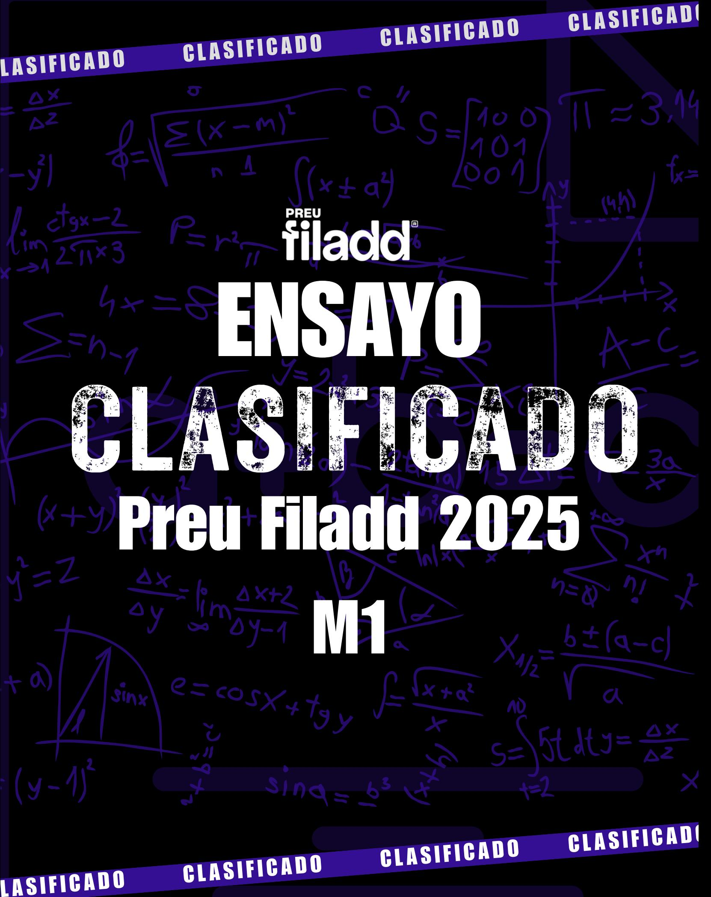

# Ingresa a la Universidad con

# **El Método Filadd**

**Apoyo en gestión de estrés y ansiedad**

**Diagnóstico y plan de estudio personalizado**

**Cápsulas Grabadas**

**Coaching Académico y Vocacional**

**Clases en vivo complementarias**

**Asistente virtual con IA**

**Consultas Ilimitadas**

**Guías y Ensayos**

**[filadd.cl](https://filadd.cl/?utm_source=pdf&utm_medium=pdf&utm_campaign=ensayos_clasificados&utm_term=m_d&utm_content=landing) [FILADD.CL](https://filadd.cl/?utm_source=pdf&utm_medium=pdf&utm_campaign=ensayos_clasificados&utm_term=m_d&utm_content=landing)**

| 1. El resultado de la expresión | -4 - (-5) | $\cdot2$ es igual a: |
|---------------------------------|-----------|----------------------|
|---------------------------------|-----------|----------------------|

- A) -14
- B) 2
- C) 6
- D) 14
- 2. Un jarro de jugo nos permite llenar 4 vasos de  $250\,\mathrm{ml}$  cada uno. ¿Cuántos vasos de  $200\,\mathrm{ml}$  se necesitarán para llenar 3 jarros de igual capacidad que el anterior?
  - A) 4
  - B) 5
  - C) 12
  - D) 15
- ${\bf 3.}$  Si  $a=1,\overline{\bf 3}.$  Entonces el resultado de  $a^2$  es:
  - A) 1, 4
  - B)  $1,\overline{6}$
  - C)  $1, \overline{7}$
  - D) 1, 9
- 4. Un estudiante dedica  $\frac{3}{8}$  del día para dormir,  $\frac{1}{6}$  del día para ir al colegio,  $\frac{1}{8}$  del día para comer y el resto del día lo dedica al tiempo libre, ¿qué fracción del día la dedica a dicho tiempo libre?
  - A)  $\frac{1}{3}$
  - $\mathsf{B)}\;\frac{2}{3}$
  - C)  $\frac{2}{8}$

D) 
$$\frac{3}{8}$$

- 5.En un monedero hay monedas de y de . Estas monedas representan dos quintos del total del dinero que hay en su interior, ¿cuánto dinero hay en el monedero? 21 \$10 8 \$50 29
  - A) \$ 244
  - B) \$488
  - C) \$610
  - D) \$ 1525
- 6.El del de es igual a: 40 % 10 % 3750
  - A) 150
  - B) 375
  - C) 1500
  - D) 1875
- 7.Por recomendación médica, un niño debe aumentar su masa corporal en un . Si su peso actual es de 15 kg, ¿cuál deberá ser su nueva masa corporal, en kilogramos, para cumplir con la recomendación médica? 20 %
  - A) 16
  - B) 17
  - C) 18
  - D) 19

## 8.En la página web de un supermercado, se publica la siguiente imagen:

Con respecto a la información dada en la imagen, ¿cuál es el porcentaje de descuento que ofrece el supermercado en la compra de forros para cuadernos universitarios?

- A) 1, 3ˉ %
- B) 10 %
- C) 25 %
- D) 33, 3ˉ %

## 9. En la siguiente expresión:

$$x \cdot 1, 30 \cdot 1, 30 \cdot 0, 25$$

¿qué pueden representar dichas multiplicaciones respecto al valor de x?

- A) Dos aumentos de  $0,30\,\mathrm{y}$  una disminución de  $0,25.\,\mathrm{m}$
- B) Dos aumentos de  $0,30\,\mathrm{y}$  una disminución de  $0,75.\,\mathrm{m}$
- C) Dos aumentos del 30~% y luego, una disminución del 75~%.
- D) Dos aumentos del  $30\,\%$  y luego, una disminución del  $25\,\%$ .

## 10. Observa la siguiente cuadrícula y los cuadrados ennegrecidos en ella:

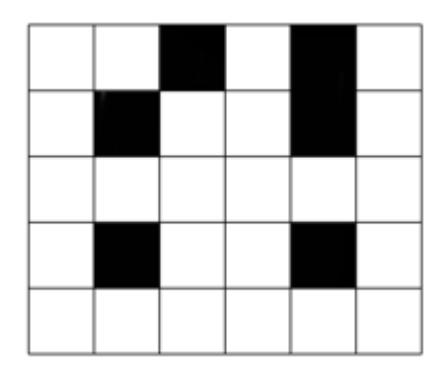

¿Cuántos cuadrados blancos hay que ennegrecer para que la porción de cuadrados negros aumente al  $50\,\%?$ 

- A) 6
- B) 9
- C) 12
- D) 15

$$11.$$
 ¿Cuál es el resultado de  $\left(\frac{1}{4}+\frac{1}{6}\right)^{-2}$ ?

- A)  $\frac{25}{144}$
- $B) \; \frac{144}{25}$
- C)  $\frac{5}{12}$
- D)  $\frac{12}{5}$
- 12. La medida del largo de un rectángulo es igual al quíntuplo de la medida de su ancho. Si su ancho mide  $5^a \, \mathrm{cm}$ , con a un número entero positivo, entonces ¿cuál de las siguientes expresiones representa el área del rectángulo en  $\mathrm{cm}^2$ ?
  - A)  $5^{\mathrm{a}+1}$
  - B)  $5^{2a+1}$
  - C)  $25^{a+1}$
  - D)  $25^{\mathrm{a}}+1$
- 13. ¿Cuál de las siguientes expresiones representa a  $\sqrt{2}\cdot\sqrt[3]{3}\cdot\sqrt[4]{4}$ ?
  - A)  $2\cdot\sqrt[3]{3}$
  - B)  $\sqrt[6]{12}$
  - C)  $\sqrt[4]{24}$
  - D)  $\sqrt[12]{24}$
- 14. ¿Cuál de los siguientes valores corresponde a  $\left(\frac{\sqrt{3}-2\sqrt{2}}{\sqrt{8}-\sqrt{3}}\right)$ ?
  - A) 0
  - B)  $\sqrt{2}$

- C) − 2
- D) −1
- 15.En un laboratorio se observa que una bacteria se triplica cada minutos. Si inicialmente se tienen bacterias, la cantidad de bacterias que se obtienen en horas corresponde a: 15 1000 2
  - A) 300 2
  - B) 3 ⋅ 10 3
  - C) 3 ⋅ 1000 2
  - D) 3 ⋅ 10 8 3
- 16. Francisca quiere comprar un scooter eléctrico y ha ahorrado una cierta cantidad de dinero. Su hermana le presta el doble de lo que tiene ahorrado, pero aún le faltan para cumplir su objetivo. \$15 000
  - ¿Cuál de las siguientes expresiones representa el valor del scooter eléctrico que desea Francisca?
  - A) 2x + 15 000
  - B) 2x − 15 000
  - C) 3x + 15 000
  - D) 3x − 15 000
- 17. Considere un rectángulo de largo y ancho . Si se aumenta el largo al doble y el ancho en , ¿cuál es la relación correcta entre el área original del rectángulo y la nueva área del cuadrilátero que se obtiene? 2a (a + 2) (3a + 6) A A′
  - A) A′ = 8A
  - B) A′ = 4A
  - C) A′ : 16 = A
  - D) A′ : 2 = A

18. ¿Cuál de las siguientes ecuaciones representa el siguiente enunciado: "El triple de un número, disminuido en 12 es igual al doble del mismo número aumentado en 4"?

A) 
$$3x + 12 = 2x + 4$$

B) 
$$3x - 12 = 2x + 4$$

C) 
$$3(x-12) = 2(x+4)$$

D) 
$$3x - 12 = 2(x + 4)$$

19.El siguiente gráfico representa la relación entre el precio (en pesos) que cuesta una determinada cantidad de kilogramos de papas. y x

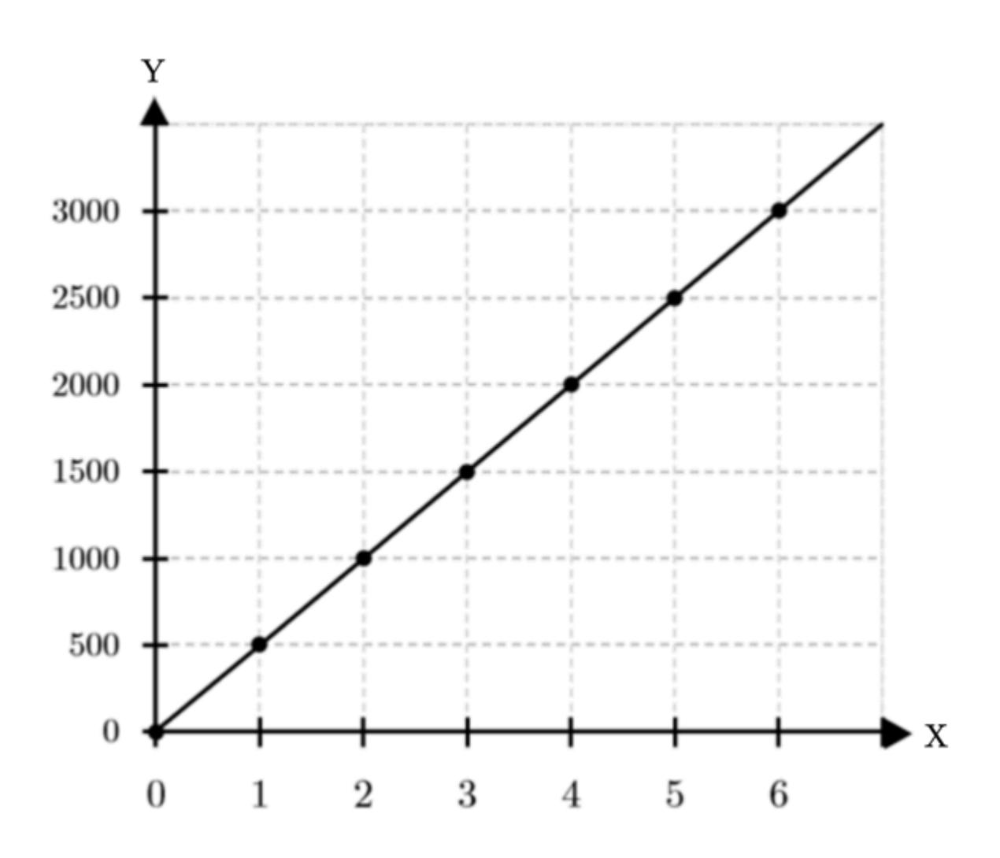

¿Cuántos kilogramos compró Verónica si pagó ? \$6850

- A) 13, 7 kg
- B) 13, 3 kg
- C) 12, 4 kg
- D) 6, 85 kg

- 20.En una obra de construcción, trabajadores pueden completar una tarea en días. Si se reduce el número de trabajadores a , ¿cuántos días se necesitarán para completar la misma tarea, suponiendo que todos los trabajadores tienen la misma eficiencia? 12 15 9
  - A) días 18
  - B) días 20
  - C) días 22
  - D) días 25
- 21.En la actualidad, Fernando tiene el doble de la edad que tuvo su hermana hace años. Si en un año más la suma de sus edades será igual a décadas, ¿cuáles serán las edades de Fernando y su hermana, respectivamente, dentro de años? 3 5 3
  - A) y 30 18
  - B) y 30 20
  - C) y 31 17
  - D) y 33 21
- 22. Una asignatura tiene tres pruebas. Las notas de un estudiante en las dos primeras fueron y . ¿Cuál de las siguientes opciones permiten determinar las notas que puede sacar el estudiante en la tercera prueba para asegurar que aprobará la asignatura con nota mayor o igual a ? 3, 2 4, 2 4, 0

A) 
$$\frac{3,2+4,2+x}{3} \geq 4,0$$

B) 
$$3,2+4,2+x \geq 4,0$$

C) 
$$\frac{3,2+4,2+x}{3} > 4,0$$

D) 
$$3,2+4,2+x<4,0$$

23. Jacinta revisó en su alcancía y notó que podía comprar exactamente golosinas por un valor de cada una, pero que le faltaba dinero si quería comprar chocolates de cada uno. ¿Cuál de las siguientes expresiones permitirá determinar el menor monto de dinero que Jacinta deberá conseguir para poder comprar los chocolates que ella quiere? 4 \$P n \$320 \$D

A) 
$$\frac{4P}{320 \cdot n}$$

B) 
$$n \cdot 320 - 4P$$

C) 
$$(P - 320)(4 - n)$$

- D) 4P − 320 ⋅ n
- 24.En una prueba de Física de preguntas y puntos en total, Coni contesta sólo preguntas y obtiene puntos. 70 280 60 180

Si cada respuesta incorrecta resta puntos, cada respuesta correcta equivale a puntos y las omitidas no restan puntos, ¿cuántas preguntas incorrectas respondió Coni? 2 4

- A) 10
- B) 15
- C) 17
- D) 30
- 25.El triple de un número, aumentado en unidades, resulta igual al cuádruple de otro número disminuido en unidades. Si la suma de estos números es igual a , ¿cuáles son ambos números? 21 5 12
  - A) y 5 7
  - B) y 2 10
  - C) y −3 15
  - D) y 1 11

- 26.Sean dos números tales que, si se aumenta el primero de ellos en el triple del segundo, se obtiene , y si se aumenta el segundo en el triple del primero, se obtiene , ¿cuál de las siguientes afirmaciones es verdadera? 39 93
  - A) Uno de los números es el del otro. 30 %
  - B) El producto entre los números es igual a . 93
  - C) La diferencia positiva entre los números es igual a . 33
  - D) El cociente entre el mayor de ellos y el menor es igual a . 10
- 27. Joaquín contrató un plan para su teléfono celular por el que cancela un cargo fijo mensual y un valor por cada minuto utilizado. La cuenta del primer mes de contrato fue de , en los que utilizó minutos de su plan móvil. El mes siguiente, el valor a pagar por su plan fue de , habiendo usado minutos de su plan. ¿Cuál de las siguientes funciones modela el costo del plan para su teléfono celular? \$10 750 15 \$11 000 20 c (x)

A) 
$$c(x) = x + 10000$$

B) 
$$c(x) = 50x - 10000$$

C) 
$$c(x) = 50x + 10000$$

D) 
$$c(x) = 500x - 10000$$

28.En un recital de música urbana, Jason tiene que escoger entre dos posibilidades para comprar las entradas. Una de las opciones es adherirse a una promoción en la que debe pagar por un producto y por cada una de las entradas, mientras que al pagar las entradas en la boletería del recital, deberá cancelar por cada una de ellas. ¿Cuál de las siguientes expresiones permitirá encontrar la cantidad de entradas que Jason debe comprar, para que ninguna de las ofertas sea más conveniente que la otra? \$18 000 \$7000 \$10 000 n

A) 
$$(18\,000-10\,000)$$
n =  $7000$ 

B) 
$$18\,000 + 10\,000 n = 7000 n$$

C) 
$$7000n + 18000 = 10000n$$

D) 
$$(18\,000 - 7000)$$
n =  $10\,000$ n

- 29. El costo fijo en una boleta del gas es de \$2700 mensuales, más \$2500 por metro cúbico de consumo. Si una persona paga por el consumo del mes \$52700, ¿cuántos metros cúbicos de gas consumió ese mes?
  - A) 10
  - B) 15
  - c) 17
  - D) 20
- 30. Un negocio ha desarrollado la siguiente fórmula para conocer el nivel del gasto mensual G que tiene confeccionar x unidades de un artículo:

$$G(x) = 10x^2 - 40\,000$$

¿Cuántos artículos se deben confeccionar en un mes para que el gasto de la empresa sea  $\$60\,000$  ?

- A) 50
- B) 80
- C) 100
- D) 200
- **31.** Considera la función f cuyo dominio es el conjunto de los números reales, definida por  $f(x)=ax^2+bx+c$ , con a>0, ¿cuál de las siguientes afirmaciones es verdadera?
  - A) El recorrido de la función son todos los reales positivos.
  - B) La gráfica de la función f no intersecta al eje X.
  - C) El eje de simetría de la función f recorre el cuadrante I y IV .
  - D) El mínimo de la función se produce en la ordenada del vértice.
- $\textbf{32.} \ \text{Considera la función } f \text{, definida por } f(x) = \frac{x^2}{k} + 2x 7 \text{ , cuyo dominio es el conjunto de los números reales, con } k \text{ un número real distinto de cero.}$

¿Qué condición debe cumplir k para que la abscisa del vértice sea mayor que 1?

- A) k<-1
- B) k>1
- C) k < 1
- D)  $\mathrm{k}>-1$
- $\bf 33.$  En un fábrica de frascos de vidrio se realizan dos tipos de tapas metálicas circulares: las del tipo  $\bf 1,$  de área  $\bf A$  y radio  $\bf r;$  y las del tipo  $\bf 2,$  cuya área es un  $\bf 25\,\%$  más grande que el área de la tapa tipo  $\bf 1.$

¿Cuál es el radio de las tapas tipo 2 expresado en términos de  $r\ ?$ 

- A)  $\frac{5}{2}$ r
- B)  $\frac{\sqrt{5}}{2}$ r
- C)  $\frac{\sqrt{2}}{5}$ r
- D)  $\frac{2}{5}$ r

34. La circunferencia de la figura tiene centro en y su perímetro es igual . O 12π cm

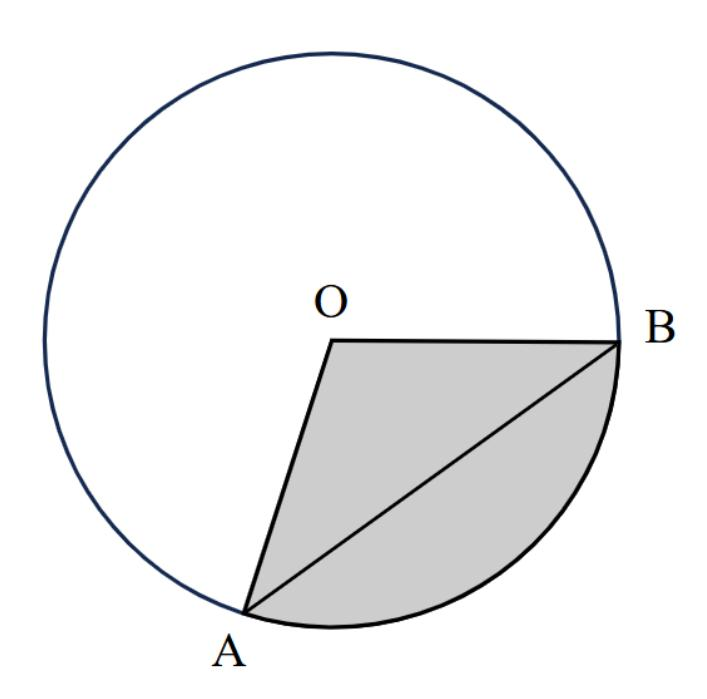

Si se sabe que y pertenecen a la circunferencia y que el triángulo es rectángulo en , ¿cuál es la altura de este triángulo respecto a , medida en ? A B OAB O O cm

- A) 3 2
- B) 6 2
- C) 18
- D) 36

35.El triángulo es obtusángulo en . El segmento mide veces la longitud del segmento . Además, es hipotenusa del triángulo . ABC A AC 1, 5 AD BC BCD

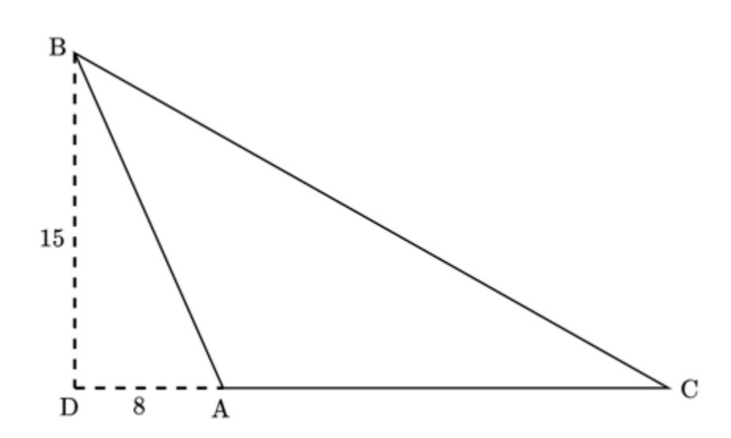

- ¿Qué valor tiene el perímetro del triángulo ? ABC
- A) unidades. 40
- B) unidades. 48
- C) unidades. 54
- D) unidades. 60

36.Para la construcción de una maqueta, se usarán cajas cúbicas del mismo tamaño, como la que se presenta en la siguiente imagen: 5

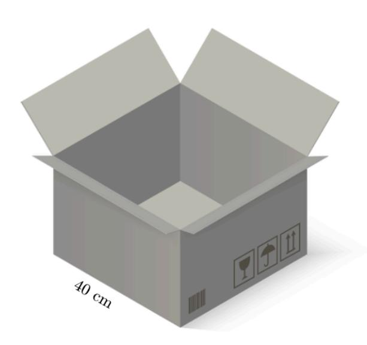

Estas cajas se apilarán una encima de otra, formando una torre. Si se necesita forrar toda la superficie externa de la torre con papel decorativo, de manera de simular un edificio en la maqueta, ¿cuántos centímetros cuadrados de papel se necesitan?

- A) 30 400
- B) 31 600
- C) 33 600
- D) 35 200

37. Una caja con forma de paralelepípedo recto tiene una base rectangular, donde su largo mide y el ancho mide . En su interior se colocan, sin dejar espacio libre, varios bloques idénticos entre sí de forma cúbica, de de arista, tal como se muestra en la siguiente imagen: 40 cm 25 cm 5 cm

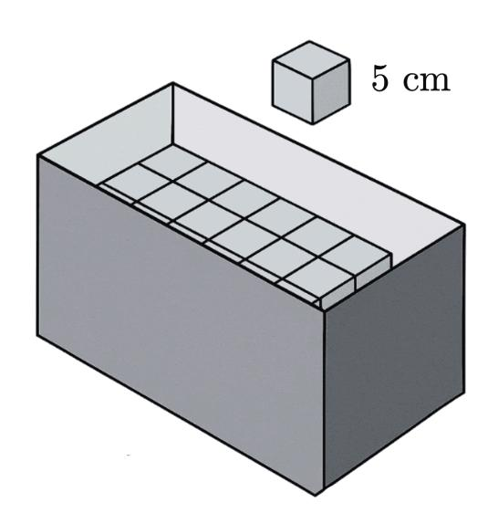

Si la altura de la caja mide el doble del ancho, ¿cuál es el número máximo de bloques cúbicos que caben dentro de la caja?

- A) 320
- B) 400
- C) 640
- D) 800

## 38. Observa la siguiente figura formada por cubos unitarios:

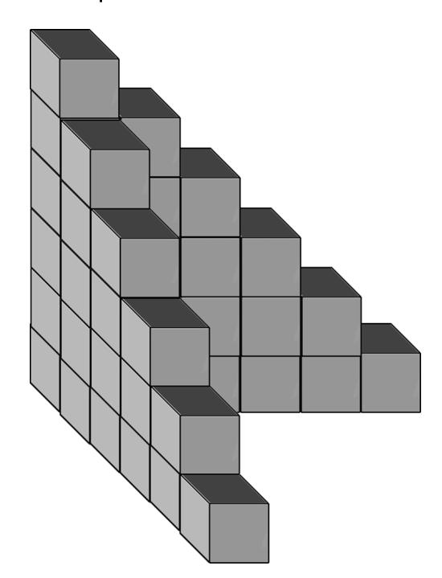

¿Cuántos cubos unitarios, idénticos a los de la figura, se deben agregar para que la figura resultante sea un cubo que conserve las dimensiones de la figura dada, pero que sea hueco en su interior?

- A) 90
- B) 116
- C) 140
- D) 180

39. ¿Cuál es el punto simétrico del punto respecto al eje ? R x = t

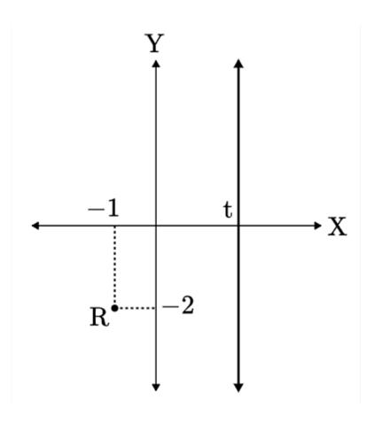

- A) (2t + 1,−2)
- B) (t + 1,−2)
- C) (2t + 1, 2)
- D) (t,−2)

40.En la figura se muestran dos circunferencias de igual radio y . ¿Cuál es el vector traslación que permite trasladar la circunferencia a la misma posición de la circunferencia ? A B A B

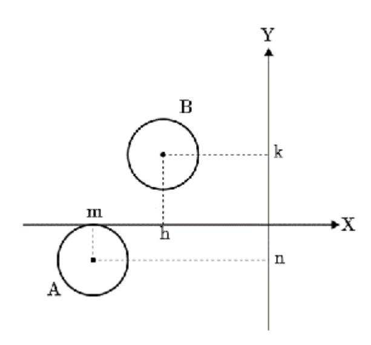

- ¿Cuál es el vector traslación que permite trasladar la circunferencia a la misma posición de la circunferencia ? A B
- A) (h − m, k − n)
- B) (k − n, h − m)
- C) (n − k, m − h)
- D) (m − h, n − k)

## 41. ¿Cuál de las siguientes afirmaciones es verdadera con respecto al hexágono regular?

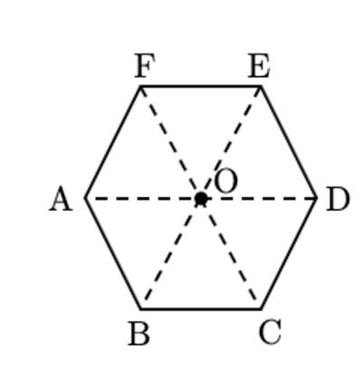

- A) Al aplicar la rotación , el vértice coincide con la posición que ocupaba el vértice . R(0, 240°) A C
- B) Al aplicar la rotación , el vértice coincide con la posición que ocupaba el vértice . R(0,−180°) B D
- C) Al aplicar dos rotaciones, y a continuación , los vértices coinciden con sus posiciones originales. R(0, 240°) R(0, 120°)
- D) Al aplicar dos rotaciones, y a continuación , los vértices coinciden con las posiciones obtenidas al aplicar . R(0, 270°) R(0, 120°) R(0, 60°)

42. Sean m,n números reales no nulos tales que  $m\neq n.$  Considere que al punto  $S_1=(m-n,n)$  se le aplica una traslación según vector  $\vec{w}=(n,m-n)$ , luego una simetría con respecto al eje de las ordenadas, y finalmente una rotación de  $90^\circ$  en sentido antihorario, respecto al origen. Como resultado de estas transformaciones resulta el punto  $S_2=(h,k).$ 

Pamela desarrollo paso a paso el problema anterior para poder determinar los valores de h y k en función de m y n, cometiendo un error en uno de los siguientes pasos:

Paso 1: Aplicar la traslación según el vector  $\vec{w}$  al punto  $S_1$ ::

$$\begin{aligned} \mathrm{S}_1 + \vec{\mathrm{w}} &= (\mathrm{m} - \mathrm{n}, \mathrm{n}) - (\mathrm{n}, \mathrm{m} - \mathrm{n}) \ &= ((\mathrm{m} - \mathrm{n}) - \mathrm{n}, \mathrm{n} - (\mathrm{m} - \mathrm{n})) \ &= (\mathrm{m} - 2 \mathrm{n}, 2 \mathrm{n} - \mathrm{m}) \end{aligned}$$

Paso 2: Aplicar la simetría axial al punto obtenido en el paso anterior, respecto al eje Y:

$$(\mathrm{m}-2\mathrm{n},2\mathrm{n}-\mathrm{m})\to(2\mathrm{n}-\mathrm{m},2\mathrm{n}-\mathrm{m})$$

**Paso 3:** Aplicar la rotación respecto al origen en  $90^\circ$  al punto obtenido en el paso anterior:

$$(2\mathrm{n}-\mathrm{m},2\mathrm{n}-\mathrm{m})\to(\mathrm{m}-2\mathrm{n},2\mathrm{n}-\mathrm{m})$$

Paso 4: Reconocer las coordenadas finales

$$h=m-2n\,y\,k=2n-m$$

¿En cuál de los pasos anteriores se cometió el error?

- A) Paso 1
- B) Paso 2
- C) Paso 3
- D) Paso 4

43. En la tabla adjunta se muestra el registro de los tiempos que tardó un grupo de 300 estudiantes en completar un desafío.

| Tiempo (minutos) | Frecuencia porcentual acumulada |
|------------------|---------------------------------|
| [0 - 2[          | 25 %                            |
| [2 - 4[          | 55 %                            |
| [4 - 6[          | 90 %                            |
| [6 - 8]          | 100 %                           |

¿Cuál es la frecuencia del intervalo  $[4,\, 6[$ ?

- A) 270
- B) 195
- C) 105
- D) 30

44.El gráfico de la figura adjunta muestra la evolución de las utilidades de una ISAPRE desde el año al año : 2011 2016

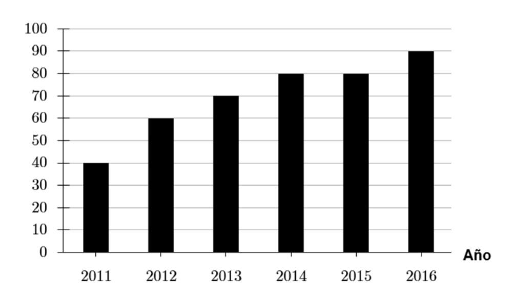

- ¿Cuál es la media aritmética en esos años, en miles de millones? 6
- A) \$60
- B) \$65
- C) \$70
- D) \$75

### – ENSAYO CLASIFICADO | M1 | 2025 –

45. Una profesora registró los puntajes obtenidos de sus estudiantes en una prueba, ordenados de menor a mayor: 20

55, 59, 60, 61, 62, 63, 65, 66, 68, 69, 70, 71, 73, 74, 75, 76, 78, 80, 85, 90

Una colega de la profesora afirma lo siguiente: "El primer cuartil de este conjunto de datos corresponde al valor " 63

Respecto de esta afirmación, ¿cuál de las siguientes alternativas es la correcta?

- A) Es correcta, porque el primer cuartil siempre corresponde al valor en la posición si hay datos, ya que se dividen en partes iguales. 5 20 4
- B) Es incorrecta, porque el primer cuartil no es necesariamente uno de los datos, sino un valor que puede estimarse entre dos posiciones.
- C) Es incorrecta, porque el primer cuartil es mayor o igual al de los datos. 25 %
- D) Es correcta, porque el valor es mayor al de los datos. 63 25 %

46. La siguiente tabla muestra la distribución de los puntajes obtenidos por un grupo de estudiantes en un examen que tiene una escala de a puntos. 0 200

| Puntajes    | Cantidad de personas |
|-------------|----------------------|
| [0 - 40[    | 120                  |
| [40 - 80[   | 180                  |
| [80 - 120[  | 270                  |
| [120 - 160[ | 250                  |
| [160 - 200] | 180                  |

De acuerdo con la información presentada, ¿cuál de las siguientes afirmaciones es correcta?

- A) El tercer cuartil de los puntajes se encuentra en el intervalo . [120, 160[
- B) Como máximo el de la muestra tiene un puntaje inferior a puntos. 40 % 120
- C) El percentil de los puntajes se encuentra en el intervalo . 90 [120, 160[
- D) Más del de la muestra obtuvo un puntaje inferior a puntos. 85 % 160

47.El siguiente diagrama representa la distribución de los datos correspondientes a los tiempos que demoraron en terminar una determinada tarea un grupo de estudiantes. 49

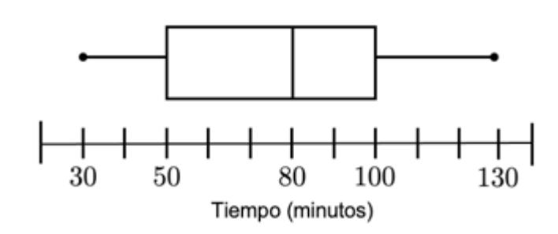

Respecto a la figura anterior, ¿cuál de las siguientes afirmaciones es siempre verdadera?

- A) El de los estudiantes demoran un tiempo que es menor que la media de los datos. 50 %
- B) Al menos un estudiante demora minutos en completar la tarea. 80
- C) Hay más estudiantes que demoran minutos que estudiantes que demoran minutos. 100 80
- D) El valor del rango intercuartil de los datos es . 100
- 48. Un experimento aleatorio tiene solo resultados posibles, , y , todos excluyentes entre sí. ¿Qué se puede afirmar correctamente siempre sobre las probabilidades de los resultados posibles de este experimento? 3 A B C

A) 
$$P(A) = P(B) = P(C)$$

B) 
$$P(A) + P(B) = 1 - P(C)$$

C) 
$$P(A) + P(B) + P(C) = 3$$

$$D) P(A) + P(B) < P(C)$$

- 49. Se tiene una moneda cargada de modo que la probabilidad de que al lanzarla se obtenga cara es igual a 0,35. Si se lanza la misma moneda 3 veces, ¿cuál es la probabilidad de que salga primero cara, luego sello y finalmente cara?
  - A)  $0,35 \cdot 0,35 \cdot 0,35$
  - B)  $0,65 \cdot 0,35 \cdot 0,35$
  - C)  $0,65 \cdot 0,65 \cdot 0,35$
  - D)  $0,65 \cdot 0,65 \cdot 0,65$
- 50. Considera una urna con 36 bolitas entre amarillas, azules y rojas, todas del mismo tipo. Al sacar una bolita al azar de la urna, la probabilidad de que esta sea amarilla o azul es  $\frac{2}{3}$ .
  - ¿Cuántas bolitas rojas hay en la urna? (Pregunta tipo DEMRE)
  - A) 1
  - B) 12
  - C) 31
  - D) 34

# Ingresa a la **carrera y universidad** de tus sueños junto a **Preu Filadd**

- Todo el Método Filadd
- Matemática M1 y M2
- Competencia Lectora
- Biología, Física y Química
- Curso de intro. a Medicina

*Si tienes en mente Medicina o una carrera del área de la salud.*

- Todo el Método Filadd
- Matemática M1 y M2
- Competencia Lectora
- Biología, Física y Química
- Historia y Cs. Sociales

*Prepárate para rendir todas las pruebas PAES.*

- Todo el Método Filadd
- Matemática M1 y M2
- Competencia Lectora
- Historia y Cs. Sociales

*Si quieres estudiar una carrera del área de las Humanidades.*

**filadd.cl [FILADD.CL](https://filadd.cl/?utm_source=pdf&utm_medium=pdf&utm_campaign=ensayos_clasificados&utm_term=m_d&utm_content=landing)**

# **Resolución de ejercicios Explicados en video** \*

**Escanea o presiona el QR para ver resolución de ejercicios:**

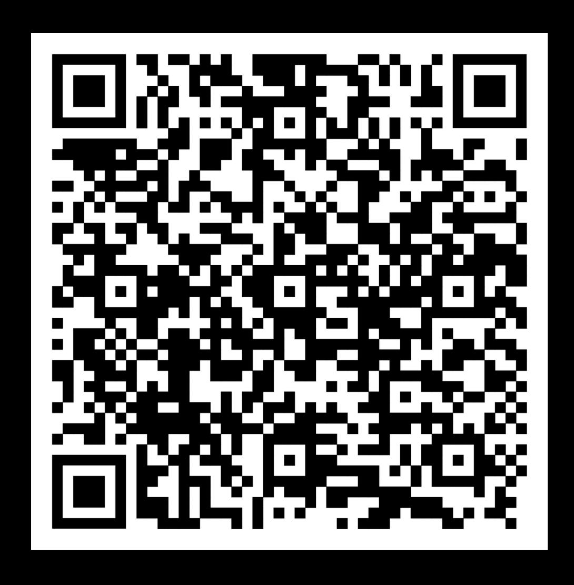

# CLAVES ENSAYO MATEMÁTICA M1

| 1. C  | <b>11.</b> B | 21. D | 31. D | 41. C |
|-------|--------------|-------|-------|-------|
| 2. D  | 12. B        | 22. A | 32. A | 42. A |
| 3. C  | 13. A        | 23. B | 33. B | 43. C |
| 4. A  | 14. D        | 24. A | 34. A | 44. C |
| 5. D  | 15. D        | 25. D | 35. C | 45. B |
| 6. A  | 16. C        | 26. D | 36. C | 46. A |
| 7. C  | 17. A        | 27. C | 37. B | 47. B |
| 8. C  | 18. D        | 28. C | 38. B | 48. B |
| 9. C  | 19. A        | 29. D | 39. A | 49. B |
| 10. B | 20. B        | 30. C | 40. A | 50. B |

## **Tabla de transformación de puntajes** \*

| Buenas | Puntaje |
|--------|---------|
| 1      | 100     |
| 2      | 118     |
| 3      | 136     |
| 4      | 155     |
| 5      | 173     |
| 6      | 191     |
| 7      | 210     |
| 8      | 228     |
| 9      | 247     |
| 10     | 265     |
| 11     | 283     |
| 12     | 302     |
| 13     | 320     |
| 14     | 338     |
| 15     | 357     |
| 16     | 375     |
| 17     | 393     |
| 18     | 412     |
| 19     | 430     |
| 20     | 449     |
| 21     | 467     |
| 22     | 485     |
| 23     | 504     |
| 24     | 522     |
| 25     | 540     |

| Buenas | Puntaje |
|--------|---------|
| 26     | 559     |
| 27     | 577     |
| 28     | 596     |
| 29     | 614     |
| 30     | 632     |
| 31     | 651     |
| 32     | 669     |
| 33     | 687     |
| 34     | 706     |
| 35     | 724     |
| 36     | 742     |
| 37     | 761     |
| 38     | 779     |
| 39     | 798     |
| 40     | 816     |
| 41     | 834     |
| 42     | 853     |
| 43     | 871     |
| 44     | 889     |
| 45     | 908     |
| 46     | 926     |
| 47     | 945     |
| 48     | 963     |
| 49     | 982     |
| 50     | 1000    |

