CLASIFICADO L A S IFI C A D O C L A S IFI C A D O C L A S IFI C A D O C L A S IFI C A D O L A S IFI C A D O C L A S IFI C A D O C L A S IFI C A D O C L A S IFI C A D O ENSAYO Preu Filadd 2025 M2

## Ingresa a la Universidad con

## **El Método Filadd**

**Apoyo en gestión de estrés y ansiedad**

**Diagnóstico y plan de estudio personalizado**

**Cápsulas Grabadas**

**Coaching Académico y Vocacional**

**Clases en vivo complementarias**

**Asistente virtual con IA**

**Consultas Ilimitadas**

**Guías y Ensayos**

**[filadd.cl](https://filadd.cl/?utm_source=pdf&utm_medium=pdf&utm_campaign=ensayos_clasificados&utm_term=m_d&utm_content=landing) [FILADD.CL](https://filadd.cl/?utm_source=pdf&utm_medium=pdf&utm_campaign=ensayos_clasificados&utm_term=m_d&utm_content=landing)**

 $\hbox{\bf 1.} \ \hbox{Considera que $a$ y $b$ son n\'umeros irracionales distintos, tal que $a$ es menor que cero y $b$ es mayor que cero.}$ 

¿Cuál de los siguientes enunciados es siempre correcto?

- A)  $-(\mathbf{a}\cdot\mathbf{b})$  es un número irracional positivo.
- B)  $(a \cdot b)$  es un número irracional positivo.
- C)  $(a \cdot b)$  es un número real positivo.
- D)  $-(\mathbf{a}\cdot\mathbf{b})$  es un número real positivo.
- 2. Si z es un número racional distinto de cero, ¿cuál de las siguientes expresiones representa siempre a  $z^{-2y}$ ?
  - A)  $z^{-y} + z^{-y}$
  - B)  $\frac{\left(\mathbf{z}^{-\mathrm{y}}\right)^4}{\left(\mathbf{z}^{\mathrm{y}}\right)^{-2}}$
  - C)  $\frac{\mathbf{z}^{-(2y-1)}}{\mathbf{z}^{(1-2y)}}$
  - D)  $\mathbf{z}^{-2} \cdot \mathbf{z}^{-\mathbf{y}}$
- $\bf 3.$  Ernesto, Cecilia y Javiera se repartieron  $\bf \$246\,600$  de tal forma que Ernesto recibió  $\frac{4}{9}$  del total, Cecilia  $\frac{2}{5}$  del dinero sobrante y Javiera el resto.

Si Ernesto y Javiera deciden donar el dinero que les corresponde para una fundación, ¿cuánto tienen en total?

- A) \$148 200
- B) \$165 000
- c) \$189 200
- D) \$191 800

- 4.Si y , ¿cuál de las siguientes expresiones representa un número irracional? a = 2 b = 8
  - A) ab
  - B) 8b
  - C) a b
  - D) 18ab 2
- 5. Hace dos años, Laura depositó un monto inicial en una cuenta de ahorros con un interés compuesto mensual del . Si al cabo de este tiempo su capital alcanzó pesos, ¿cuál fue su inversión inicial? 2 %M
  - A) M ⋅ (1 + 0, 02) 24
  - B) (1 + 0, 02) 2 M
  - C) (1 + 0, 02) 24 M
  - D) M ⋅ (1 + 0, 02) 2
- 6. Maximiliano necesita solicitar un préstamo de y evalúa dos entidades bancarias: \$ 2 000 000

Banco Luna: Ofrece interés simple del anual a años. 10 % 4

Banco Sol: Ofrece interés compuesto del anual a años. 8 % 3

¿Cuál de las siguientes afirmaciones es correcta al comparar ambos préstamos?

- A) Es preferible el Banco Luna, ya que su tasa de interés es mayor que el Banco Sol.
- B) El monto total a pagar en el Banco Sol es mayor debido a la capitalización de intereses.
- C) Las cuotas mensuales en el Banco Luna serían inferiores a las del Banco Sol.
- D) Si el plazo de ambos bancos fuese años, el monto final a pagar sería el mismo. 3

 $7.\,\rm En$  una entrevista laboral, un postulante recibe una oferta de trabajo con un contrato a plazo fijo, un sueldo base de  $800~000\,$  y una gratificación del 25~% del sueldo base.

Si se considera que los descuentos legales para este contrato son  $13\,\%$  de AFP,  $7\,\%$  de FONASA y  $0,6\,\%$  de seguro de cesantía, ¿cuál de las siguientes afirmaciones es correcta?

- A) La persona recibiría un sueldo bruto de \$950~000.
- B) La persona recibiría un sueldo líquido de \$794~000.
- C) A la persona se le descontaría un total de \$103~000 por concepto de ahorro previsional.
- D) A la persona se le descontarían en total \$75~000 por concepto de salud.
- **8.** ¿Cuál de las siguientes opciones es equivalente a  $\log \frac{\sqrt{6}+3}{\sqrt{2}+\sqrt{3}}$ ?
  - A)  $\log 9$
  - B)  $\log 3$
  - C)  $\frac{1}{2}\log 3$
  - D)  $3 \log 6$
  - E)  $\frac{1}{3}\log 2$
- 9. Si  $\log \sqrt{a} = p$  y  $\log \left(\frac{a}{b}\right) = q$ , entonces  $\log \sqrt[4]{ab}$  es:
  - A) p q
  - B)  $\frac{p}{4} + \frac{q}{4}$
  - C)  $\frac{p}{2} + \frac{q}{2}$
  - D)  $p-\frac{q}{4}$

 $10.\,\mathrm{Si}\ a$  y b son números reales positivos, ambos distintos de 1, se puede determinar el valor de  $\log_b a$  si se sabe que:

$$(1)\sqrt[5]{a} = b$$

$$(2)\log b = \frac{1}{5} \cdot \log a$$

- A) (1) por sí sola.
- B) (2) por sí sola.
- C) Ambas juntas, (1) y (2).
- D) Cada una por sí sola, (1) ó (2).
- E) Se requiere información adicional.
- $11.\,\text{Si}\ p$  es un número real mayor que uno, entonces  $\log_p\left(\frac{\sqrt[3]{p^2}}{\sqrt{p}}\right)$  es:
  - A) 6
  - $\mathsf{B)}\;\frac{7}{6}$
  - C)  $\frac{1}{2}$
  - D)  $\frac{1}{6}$

12. Considerando el siguiente sistema de ecuaciones:

$$ax + 2y = 5$$
  
 $4x + (a + 2)y = 10$ 

¿Cuál debe ser el valor de para que el sistema tenga infinitas soluciones? a

- A) −4
- B) −2
- C) 2
- D) 4
- 13. ¿Qué valor debe tener en el siguiente sistema de ecuaciones para que sus ecuaciones lineales se representen como dos rectas paralelas entre sí? k

$$2x - y = -4$$
 $-kx + 3y = 10$ 

- A) k = 0
- B) k = 2
- C) k = 2
- D) k = 6

 ${\bf 14.}\,{\sf El}$  siguiente sistema tiene infinitas soluciones, entonces p+q es igual a:

$$(\mathrm{p}-1)\mathrm{x} + 2\mathrm{y} = 6 \ 2\mathrm{x} + (\mathrm{q}-2)\mathrm{y} = 12$$

- A) -8
- B) -2
- C) 6
- D) 8

15. El siguiente sistema tiene solución única si se sabe que:

$$3\mathrm{x}-2\mathrm{y}=\mathrm{a}$$
  $4\mathrm{x}+(\mathrm{k}-1)\mathrm{y}=\mathrm{b}$ 

- (1)  $k \neq 1$ , con  $a, b \in R$
- (2)  $\mathrm{k} \neq -\frac{5}{3}$
- A) (1) por sí sola.
- B) (2) por sí sola.
- C) Ambas juntas, (1) y (2).
- D) Cada una por sí sola, (1) ó (2).
- E) Se requiere información adicional.

- $\textbf{16.} \mbox{ Considere la función } f(x) = \log_3(2x) 3 \mbox{ con dominio en los números reales positivos.} \\ \mbox{ ¿Cuál es el valor de } f(4,5)?$ 
  - A) 9
  - B) 2
  - C) -1
  - D) -3
- 17. Considere la función  $f(x)=\left(\frac{1}{3}\right)^x+2$  con dominio los números reales. ¿Cuál de las siguientes afirmaciones es correcta?
  - A) El recorrido de esta función es el conjunto de números reales positivos.
  - B) Si n es un número natural entonces f(n) < f(n+1).
  - C) La gráfica de la función corta al eje Y en el punto  $(0,\,2)$ .
  - D) La asíntota horizontal de la gráfica de la función es la recta y=2.
- 18. Un programa de compresión de archivos genera archivos con tamaños que se modelan por la función:  $T\left(n\right)=\log_2\left(n+1\right)$ , donde T(n) representa el tamaño comprimido, en megabytes, de un archivo que originalmente contiene n páginas de texto.
  - ¿Cuántas páginas de texto puede tener un archivo si, al comprimirse, su tamaño resultante es de  $4\ \rm megabytes?$
  - A)  $2^4-1$
  - B)  $4^2 + 1$
  - C)  $2^{4+1}$
  - D)  $2^4$

 ${\bf 19.}$  El siguiente gráfico muestra una función de la forma f(x) = Log(x-h) + k :

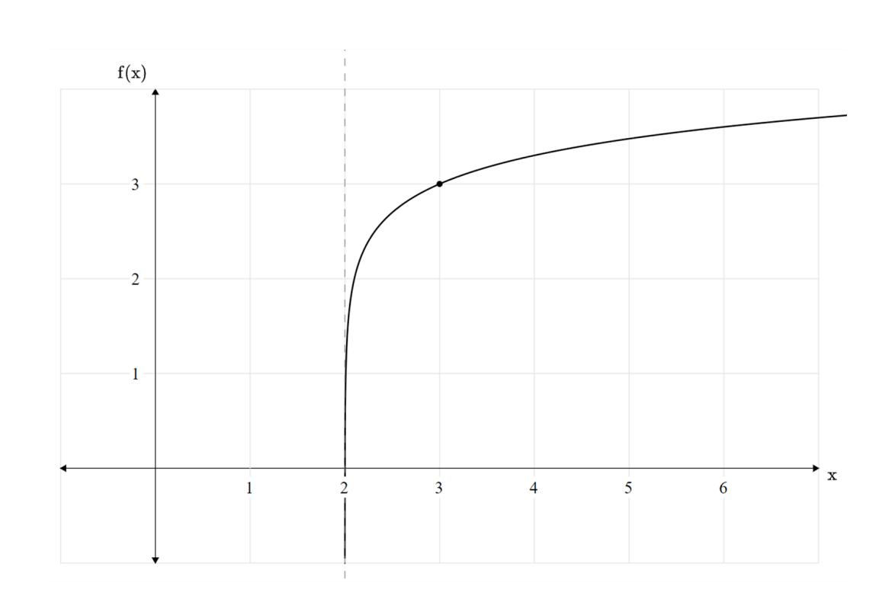

¿Cuál de las siguientes expresiones corresponde a la función que se muestra en el gráfico?

A) 
$$f(x) = Log(x-2) - 2$$

B) 
$$f(x) = Log(x-2) + 3$$

C) 
$$f(x) = Log(x+2) - 1$$

$$\mathsf{D)}\ \mathrm{f}(\mathrm{x}) = \mathrm{Log}(\mathrm{x}+3) + 2$$

$$\mathsf{E)}\, \mathrm{f}(\mathrm{x}) = \mathrm{Log}(\mathrm{x}+3) - 2$$

 $20. \text{A partir de la función } f(x) = 2 \cdot \cos \left(x - \frac{3\pi}{2}\right) + 1 \text{ , ¿cuál de los siguientes gráficos representa a la función } f(x)?$ 

#### – ENSAYO CLASIFICADO | M2 | 2025 –

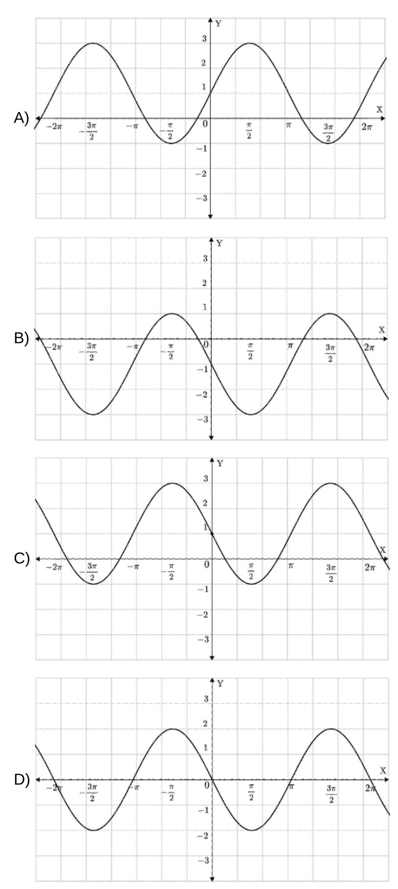

- 21. Dada la función , ¿cuál es el valor de ? f(x) = sen (x − 2π) f(−3π)
  - A) 0
  - B) 1
  - C) −1
  - D) −5
- 22.El siguiente gráfico corresponde al perfil de una onda electromagnética que se propaga en el espacio a lo largo del tiempo.

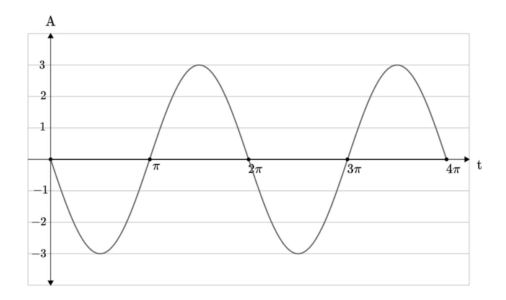

¿Cuál de las siguientes funciones representa el comportamiento de la onda electromagnética en el tiempo?

A) 
$$f(t) = 3 \cdot \cos(t)$$

B) 
$$f(t) = -3 \cdot \cos(t)$$

C) 
$$f(t) = 3 \cdot sen(t)$$

D) 
$$f(t) = -3 \cdot sen(t)$$

23. La corriente alterna es un tipo de corriente eléctrica en la que el voltaje varía de forma periódica a lo largo del tiempo, alternando entre valores positivos y negativos.

El voltaje es la energía que impulsa la corriente en un circuito, se mide en Volt  $\left(V\right)$  y se puede modelar mediante funciones trigonométricas.

En cierto circuito eléctrico, el voltaje en función del tiempo, en segundos, se representa mediante la siguiente función:

$$V(t) = 220 \cdot \cos(100\pi t)$$

¿Cuál de las siguientes afirmaciones es correcta respecto a esta función?

- A) Su amplitud es  $220\,\mathrm{V}$  y parte en su valor máximo positivo, comenzando a disminuir.
- B) Su amplitud es  $220\,\mathrm{V}$  y parte en cero, comenzando a aumentar.
- C) Su amplitud es  $220\,\mathrm{V}$  y parte en su valor mínimo, comenzando a aumentar.
- D) Su amplitud es  $220\,\mathrm{V}$  y parte en su valor máximo positivo, comenzando a aumentar.
- **24.** Si al triángulo de vértices A(-1,2); B(4,2) y C(2,3), se le aplica una homotecia con centro en (0,3) y razón de homotecia igual a -1,5; ¿cuál es la imagen de B?
  - A) (-3,3)
  - B) (4,5)
  - C) (-2,4)
  - D)  $\left(-6, \frac{9}{2}\right)$
  - E)  $\left(\frac{3}{2}, -6\right)$

- **25.** A un triángulo equilátero de lado c se le aplica una homotecia de razón 4:3. ¿Cuál es la medida del lado c, si el perímetro del triángulo homotético es 120~cm?
  - A) 30 cm
  - B) 60 cm
  - C) 90 cm
  - D) 120 cm
- 26. Considere la homotecia con centro en el origen O aplicada al triángulo  $\triangle RST$  cuya figura resultante es el triángulo  $\triangle R'S'T'$ .

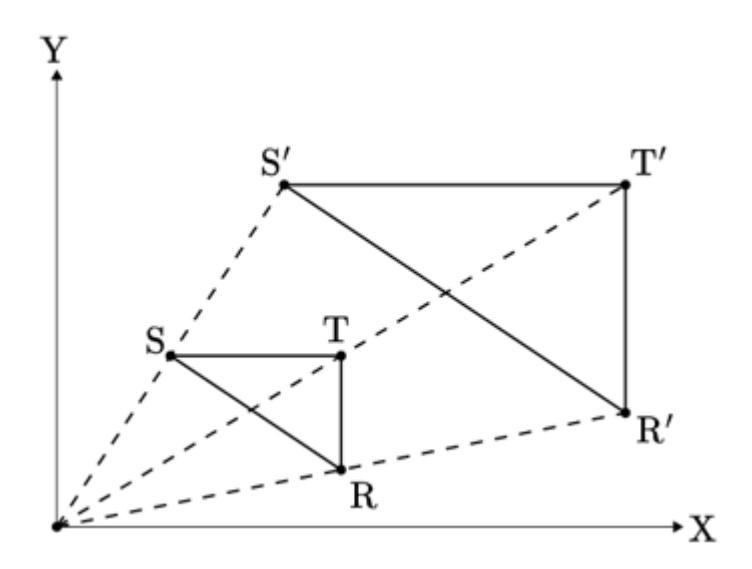

Considerando la información representada en la figura, ¿cuál de las siguientes afirmaciones es **siempre** correcta?

- A)  $\overline{\mathrm{RT}} \parallel \overline{\mathrm{R'T'}}$
- B) Los triángulos  $\triangle RST$  y  $\triangle R'S'T'$  son congruentes.
- C) Los triángulos  $\triangle RST$  y  $\triangle R'S'T'$  son equivalentes.
- D) El área del triángulo  $\triangle RST$  es igual a la mitad del área del triángulo  $\triangle R'S'T'$ .

 ${\bf 27.}\, {\tt Observa}\, {\tt la}\, {\tt siguiente}\, {\tt homotecia}\, {\tt aplicada}\, {\tt sobre}\, {\tt el}\, {\tt pentágono}\, {\tt ABCDE} :$ 

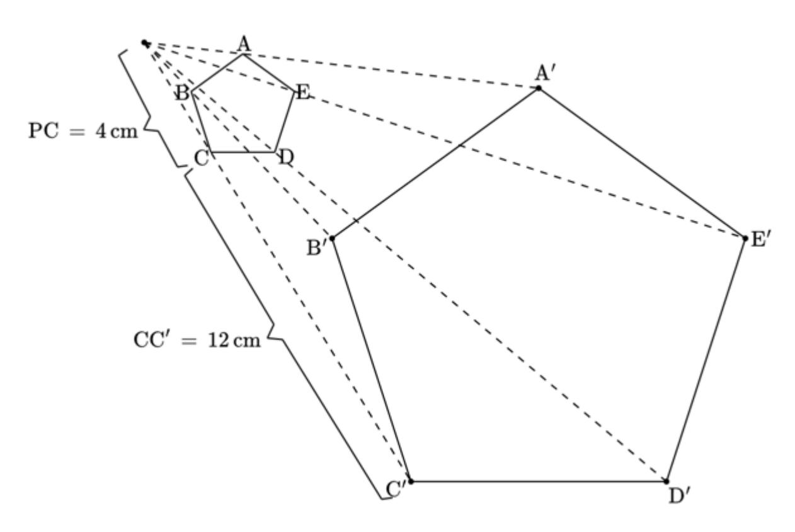

¿Cuál es el factor de la homotecia aplicada sobre el pentágono anterior?

- A) 3
- B) 4
- C) 8
- D) 12

28. En el siguiente triángulo,  $\tan(\gamma)=\frac{4}{3}$ , ¿cuál es la medida de x?

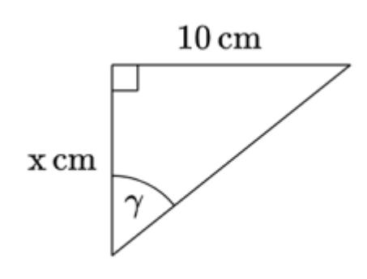

- A)  $\frac{4}{30}$  cm.
- B)  $\frac{40}{3}$  cm.
- C)  $\frac{34}{3}$  cm.
- D)  $\frac{30}{4}$  cm.
- 29. Camilo está recostado en el patio de su casa, observando desde el suelo la cúspide de un edificio de 81 metros de altura, con un ángulo de elevación de  $60^{\circ}$ , ¿cuál es la distancia más corta a la que se encuentra Camilo del edificio?
  - A) 27 metros.
  - B)  $27\sqrt{3}$  metros.
  - C)  $81\sqrt{3}$  metros.
  - D) 162 metros.
- 30. Un árbol proyecta una sombra de 10 metros en el suelo. Si el ángulo de elevación desde donde termina la sombra respecto de la parte más alta del árbol es tal que su tangente es 0,7, ¿cuál es la altura del árbol?
  - A) 7 metros.
  - B) 10 metros.
  - C) 12 metros.
  - D) 17 metros.

#### 31. Considere el triángulo de la figura: ΔMNP

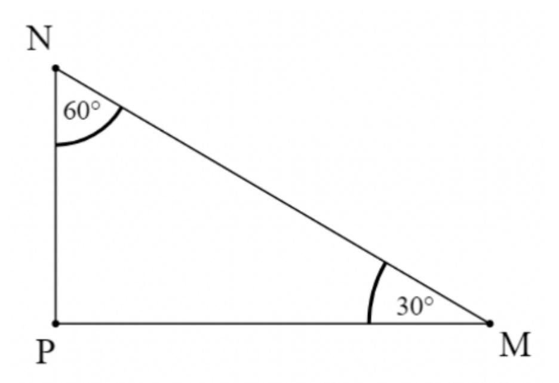

¿Cuál es el doble de si ? MN NP = 8 cm

- A) cm 2 1
- B) 4 2 cm
- C) 8 2 cm
- D) 2 10 cm

#### 32. Considera el siguiente triángulo de la figura: ABC

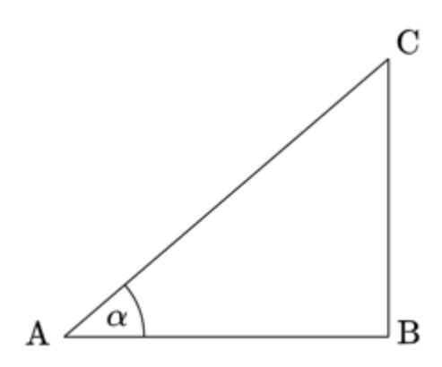

Se puede determinar el valor del área del triángulo si se conoce:

- El valor del ángulo . (1) α
- El valor del lado . (2) BC
- A) por sí sola. (1)
- B) por sí sola. (2)
- C) Ambas juntas, y . (1) (2)
- D) Cada una por sí sola, ó . (1) (2)
- E) Se requiere información adicional.

33.En la figura, y . PB = 9 cm AB = 7 cm

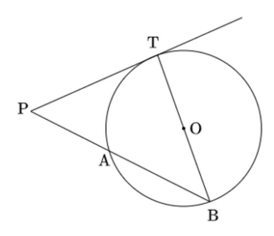

Si es tangente, ¿cuál es su longitud, en ? PT cm

- A) 3 2
- B) 4, 5
- C) 63
- D) 18

34.En la circunferencia de centro , es diámetro, es el punto medio de y es recto: O AB M AO ∠DMA

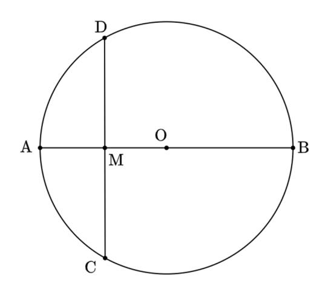

- Si , ¿Cuál es la medida del radio de la circunferencia? CD = 18 cm
- A) cm 6 3
- B) cm 9
- C) cm 13, 5
- D) cm 9 2

35.En la circunferencia de la figura, y son cuerdas que se intersectan en . AB CD P

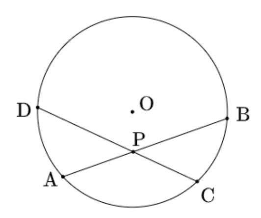

Si , y , ¿cuál es el valor de ? AP = 9 cmPB = 12 cm CP = 18 cm CD

- A) 6 cm
- B) 15 cm
- C) 20 cm
- D) 24 cm
- E) 30 cm

36.En la circunferencia de la figura, y son secantes. PS PR

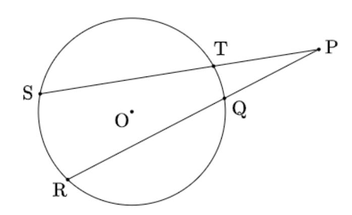

Si , y , ¿cuál es la longitud de ? PQ = 3 cmQR = 7 cm PS = 15 cmPT

- A) 1, 4 cm
- B) 2 cm
- C) 3, 4 cm
- D) 4, 2 cm

#### – ENSAYO CLASIFICADO | M2 | 2025 –

37. Desde un punto , exterior a una circunferencia de centro , se trazan las secantes y , intersectando a la circunferencia en los puntos y , respectivamente, tal como se muestra en la siguiente imagen: E O AE BE D C

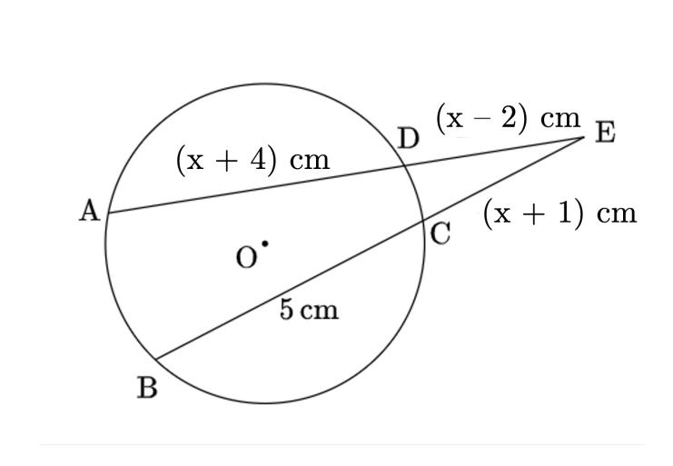

A partir de la información entregada en el enunciado y la imagen, ¿cuánto mide, en centímetros, la secante de mayor longitud?

- A) 5
- B) 10
- C) 16
- D) 22
- E) 26

38.En la figura, es el centro de la circunferencia, y : O α = 45° β = 35°

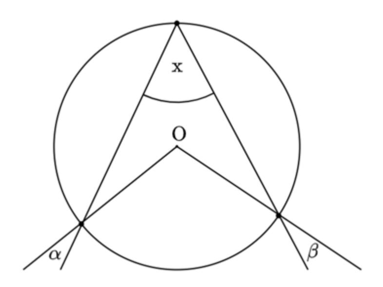

¿Cuál es la medida del ángulo inscrito ? x

- A) 20°
- B) 40°
- C) 70°
- D) 80°

39.Se tiene un triángulo equilátero , inscrito en una circunferencia de centro , como se muestra en la figura a continuación: ABC O

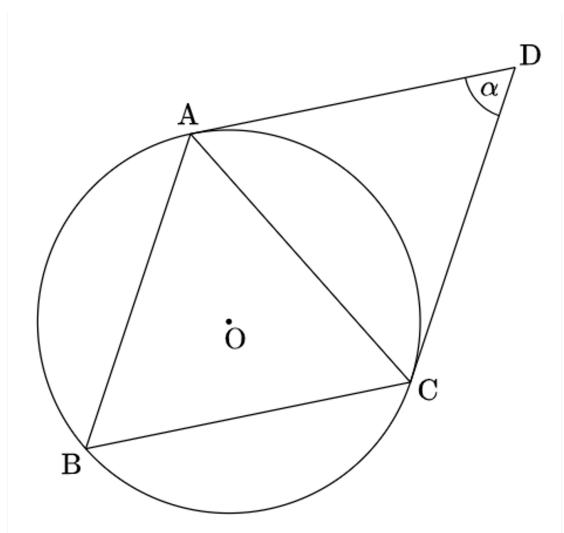

Si el segmento es tangente a la circunferencia en el punto , y el segmento es tangente a la circunferencia en el punto , ¿cuánto mide el ángulo ? DC C DA A α

- A) 30°
- B) 45°
- C) 60°
- D) 90°
- E) 120°

#### 40. Considera la siguiente circunferencia de centro que pasa por los puntos , y . O A B C

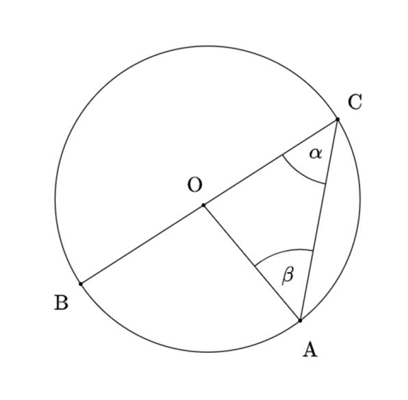

¿Cuál de las siguientes afirmaciones es verdadera?

- A) Si mide el triángulo tiene un ángulo que mide . ∠AOB 60° AOC 100°
- B) Si mide el triángulo es isósceles rectángulo. ∠AOB 90° AOC
- C) Si mide el ángulo mide . ∠AOB 100° α 80°
- D) Si mide el ángulo mide . ∠AOB 120° β 30°

41. Considera la información de la siguiente figura, que muestra una circunferencia de centro que pasa por los puntos y . O A, B, C,D E

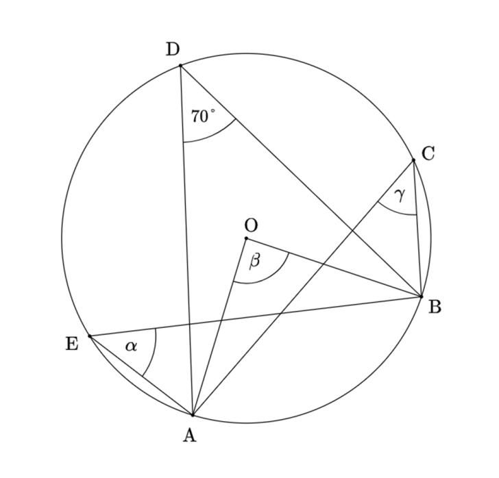

¿Cuánto mide ? α + β + γ

- A) 35°
- B) 105°
- C) 140°
- D) 175°
- E) 280°

42.En la circunferencia de centro , y son cuerdas que se intersectan en el punto . O AB CD E

Se puede conocer si se sabe que: ∡BAC

$$(1) \angle AED = 83^{\circ}$$

(2) 
$$\angle DEB = 97^{\circ}$$

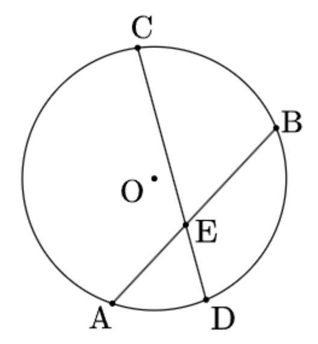

- A) por sí sola. (1)
- B) por sí sola. (2)
- C) Ambas juntas, y . (1) (2)
- D) Cada una por sí sola, o . (1) (2)
- E) Se requiere información adicional.

43. Se lanza 16 veces un dado de seis caras y se define la variable aleatoria X como el número de veces que se obtiene una cara que es múltiplo de 2, ¿cuál es la probabilidad de obtener exactamente 8 caras que son múltiplos de 2?

A) 
$$\begin{pmatrix} 16 \\ 8 \end{pmatrix} \cdot \left(\frac{1}{3}\right)^{16} \cdot \left(\frac{1}{3}\right)^{8}$$
.

$$\mathsf{B}) \left(\begin{array}{c} 8 \\ 2 \end{array}\right) \cdot \left(\frac{1}{2}\right)^2 \cdot \left(\frac{1}{2}\right)^6.$$

C) 
$$\begin{pmatrix} 16 \\ 8 \end{pmatrix} \cdot \left(\frac{1}{3}\right)^2 \cdot \left(\frac{1}{3}\right)^6$$
.

D) 
$$\begin{pmatrix} 16 \\ 8 \end{pmatrix} \cdot \left(\frac{1}{2}\right)^{16}$$
.

**44.** La probabilidad de que un estudiante responda correctamente una pregunta de un cuestionario es  $\frac{1}{4}$ . Si el cuestionario consta de 8 preguntas, ¿cuál es la probabilidad de que el estudiante responda incorrectamente exactamente 5 veces?

A) 
$$\begin{pmatrix} 8 \\ 5 \end{pmatrix} \cdot \left(\frac{3}{4}\right)^5 \cdot \left(\frac{1}{4}\right)^3$$

B) 
$$\begin{pmatrix} 8 \\ 5 \end{pmatrix} \cdot \left(\frac{3}{4}\right)^3 \cdot \left(\frac{1}{4}\right)^5$$

C) 
$$\begin{pmatrix} 8 \\ 3 \end{pmatrix} \cdot \left(\frac{3}{4}\right)^5 \cdot \left(\frac{1}{4}\right)^3$$

D) 
$$\begin{pmatrix} 8 \\ 5 \end{pmatrix} \cdot \left(\frac{1}{4}\right)^5 \cdot \left(\frac{3}{4}\right)^3$$

E) 
$$\begin{pmatrix} 8 \\ 5 \end{pmatrix} \cdot \left(\frac{3}{4}\right)^4 \cdot \left(\frac{1}{4}\right)^4$$

- **45.** Carmelo está preocupado por el rendimiento que tiene en el equipo de básquetbol de su colegio. Su entrenador le ha dicho que, de acuerdo a su trayectoria en partidos anteriores, la probabilidad de que enceste al lanzar al aro es del  $40\,\%$ . Debido a esto Carmelo calcula la probabilidad de que al practicar 4 tiros enceste exactamente el  $75\,\%$  de ellos, para ello realiza el cálculo en cuatro pasos, cometiendo un error en uno de ellos:
  - **Paso 1:** Identifica que la probabilidad de éxito es  $0,4\,\mathrm{y}$  la de fracaso es de  $0,6.\,\mathrm{m}$
  - **Paso 2:** Aplica la fórmula de la distribución binomial  $\binom{4}{3} \cdot 0, 4^3 \cdot 0, 6^1.$
  - **Paso 3:** Desarrolla la expresión anterior obteniendo  $1\cdot 0, 4^3\cdot 0, 6^1.$
  - **Paso 4:** Obtiene que la probabilidad corresponde al 3,84~%.
  - ¿En qué paso Carmelo comete el error?
  - A) Paso 1
  - B) Paso 2
  - C) Paso 3
  - D) Paso 4

- 46.En la final de una competencia de lanzamiento de bala, cada deportista tiene lanzamientos. Se puede determinar la probabilidad de que un competidor, escogido al azar, tenga lanzamientos válidos, si se sabe que: 6 4
  - (1) La probabilidad de que un deportista tenga un lanzamiento válido es del 75 %
  - (2) Hay deportistas participantes en la final. 26
  - A) (1) por sí sola
  - B) (2) por sí sola
  - C) Ambas juntas, (1) y (2)
  - D) Cada una por sí sola, (1) ó (2)
  - E) Se requiere información adicional
- 47.El puntaje en una evaluación de matemática de un primero medio, definido por la variable , tiene distribución normal de promedio puntos y desviación estándar de puntos. X 45 10
  - Si es una variable que distribuye normal tipificada, ¿cuál de las siguientes relaciones permite expresar en términos de ? Z Z X

A) 
$$Z=\frac{X-45}{10}$$

B) 
$$Z=\frac{X-10}{45}$$

C) 
$$Z = \frac{X \cdot 45}{10}$$

D) 
$$Z=\frac{X+45}{10}$$

- 48. En una universidad, la duración del examen final de física (en minutos) sigue una distribución normal con media  $\mu=90\,\mathrm{min}$  y desviación estándar  $\sigma=12\,\mathrm{min}$ . ¿Cuál es el porcentaje de estudiantes que termina la prueba en menos de  $102\,\mathrm{minutos}$ ?
  - A)  $34,135\,\%$
  - B)  $50,000\,\%$
  - C)  $68,270\,\%$
  - D)  $84,135\,\%$
  - E)  $95,450\,\%$
- 49. Considere una variable aleatoria Z con distribución normal estándar, es decir,  $Z\sim N(0,1).$  Si P(Z<-a)=0,112 . ¿Cuál es el valor de P(Z< a)?
  - A) 0,500
  - B) 0,556
  - C) 0,888
  - D) 1,000
- $\bf 50.$  Sea X una variable aleatoria que distribuye de manera normal tipificada. Si  $P(X \le c) = \frac{4}{5}$ , ¿cuál es el valor de  $P(-c \le X \le 0)$ ?
  - A)  $\frac{7}{10}$
  - $\mathsf{B)}\;\frac{7}{10}$
  - C)  $\frac{3}{10}$
  - D)  $\frac{1}{5}$

## Ingresa a la **carrera y universidad** de tus sueños junto a **Preu Filadd**

## **PACK MEDICINA**

Si tienes en mente **Medicina** o una **carrera del área de la salud**

- Todo el Método Filadd
- Matemática M1 y M2
- Competencia Lectora
- Biología, Física y Química
- Curso de intro. a Medicina

**PACK COMPLETO**

Prepárate para rendir **todas las pruebas PAES.**

### **Incluye:**

- Todo el Método Filadd
- Matemática M1 y M2
- Competencia Lectora
- Biología, Física y Química
- Historia y Cs Sociales

**[filadd.cl](https://filadd.cl/?utm_source=pdf&utm_medium=pdf&utm_campaign=ensayos_clasificados&utm_term=m_d&utm_content=landing) [FILADD.CL](https://filadd.cl/?utm_source=pdf&utm_medium=pdf&utm_campaign=ensayos_clasificados&utm_term=m_d&utm_content=landing)**

## **Resolución de ejercicios Explicados en video** \*

**Escanea o presiona el QR para ver resolución de ejercicios:**

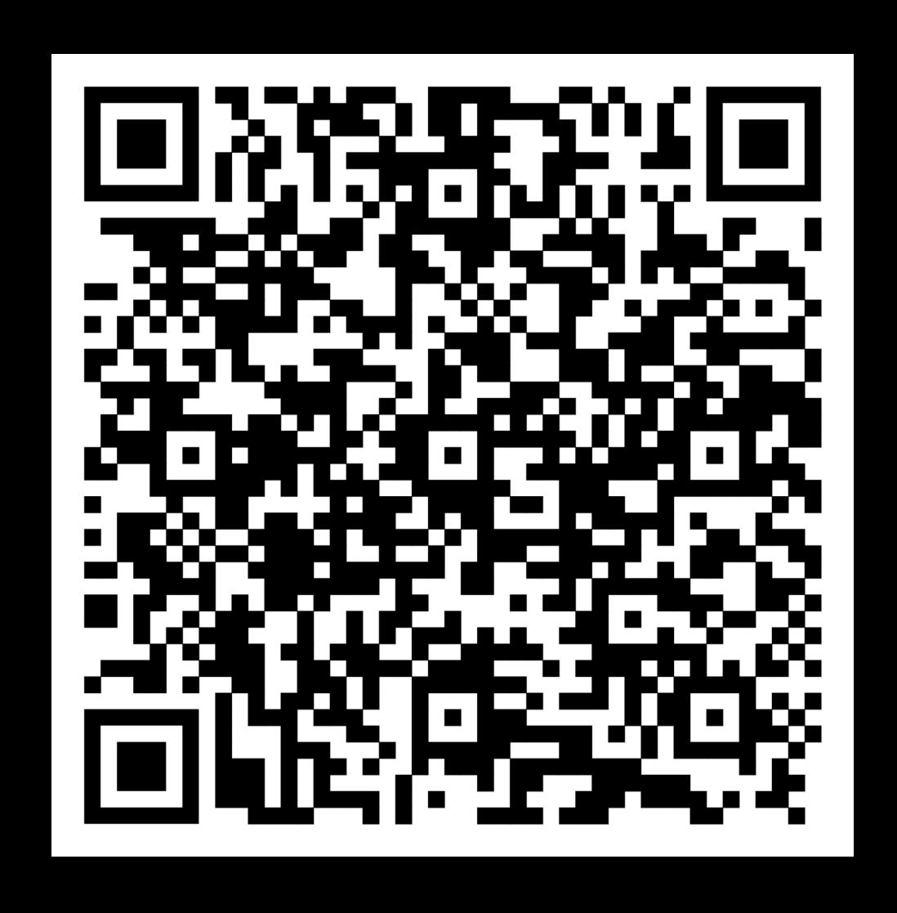

# CLAVES ENSAYO MATEMÁTICA M2

| 1. D  | <b>11.</b> D | 21. A        | 31. C | 41. E |
|-------|--------------|--------------|-------|-------|
| 2. B  | 12. C        | 22. D        | 32. E | 42. E |
| 3. D  | 13. D        | 23. A        | 33. A | 43. D |
| 4. C  | 14. D        | 24. D        | 34. A | 44. A |
| 5. C  | 15. B        | 25. A        | 35. D | 45. C |
| 6. C  | 16. C        | 26. A        | 36. B | 46. A |
| 7. B  | <b>17.</b> D | <b>27.</b> B | 37. D | 47. A |
| 8. C  | 18. A        | 28. D        | 38. D | 48. D |
| 9. D  | 19. B        | 29. B        | 39. C | 49. C |
| 10. D | 20. C        | 30. A        | 40. B | 50. C |

## **Tabla de transformación de puntajes** \*

| Buenas | Puntaje |
|--------|---------|
| 1      | 100     |
| 2      | 118     |
| 3      | 136     |
| 4      | 155     |
| 5      | 173     |
| 6      | 191     |
| 7      | 210     |
| 8      | 228     |
| 9      | 247     |
| 10     | 265     |
| 11     | 283     |
| 12     | 302     |
| 13     | 320     |
| 14     | 338     |
| 15     | 357     |
| 16     | 375     |
| 17     | 393     |
| 18     | 412     |
| 19     | 430     |
| 20     | 449     |
| 21     | 467     |
| 22     | 485     |
| 23     | 504     |
| 24     | 522     |
| 25     | 540     |

| Buenas | Puntaje |
|--------|---------|
| 26     | 559     |
| 27     | 577     |
| 28     | 596     |
| 29     | 614     |
| 30     | 632     |
| 31     | 651     |
| 32     | 669     |
| 33     | 687     |
| 34     | 706     |
| 35     | 724     |
| 36     | 742     |
| 37     | 761     |
| 38     | 779     |
| 39     | 798     |
| 40     | 816     |
| 41     | 834     |
| 42     | 853     |
| 43     | 871     |
| 44     | 889     |
| 45     | 908     |
| 46     | 926     |
| 47     | 945     |
| 48     | 963     |
| 49     | 982     |
| 50     | 1000    |

