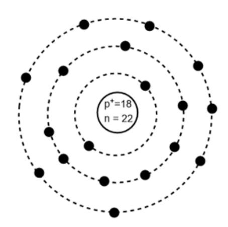
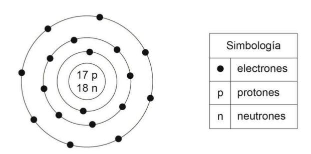
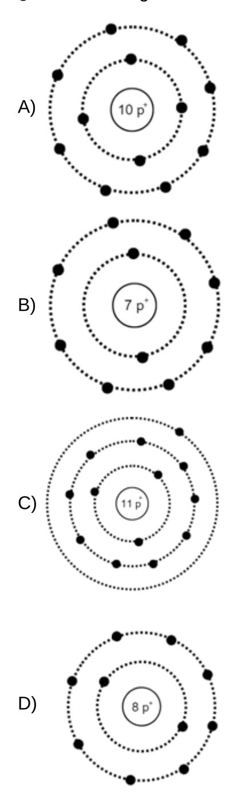
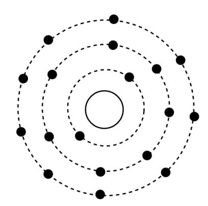
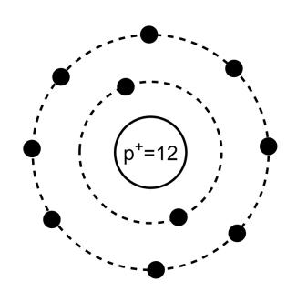
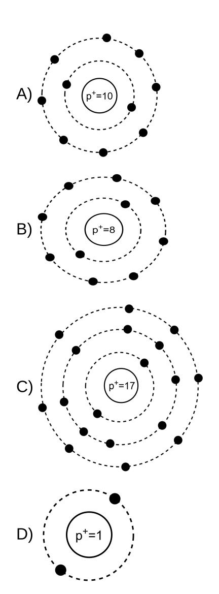
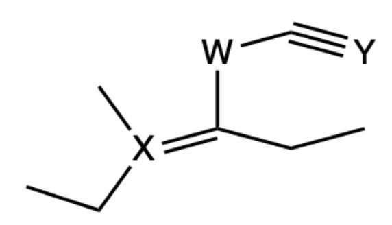
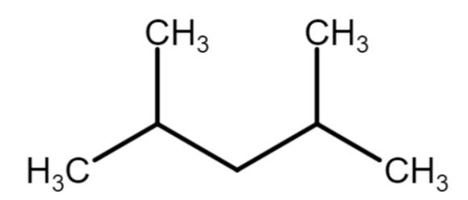
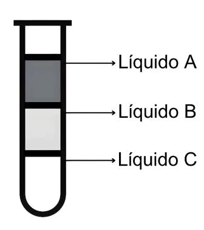

LA S IFI C A D O C L A S IFI C A D O C L A S IFI C A D O C L A S IFI C A D O

# ENSAYO

# CLASIFICADO Preu Filadd 2025 CIENCIAS QUÍMICA

A S IFI C A D O C L A S IFI C A D O C L A S IFI C A D O C L A S IFI C A D O

### Ingresa a la Universidad con

# **El Método Filadd**

**Apoyo en gestión de estrés y ansiedad**

**Diagnóstico y plan de estudio personalizado**

**Cápsulas Grabadas**

**Coaching Académico y Vocacional**

**Clases en vivo complementarias**

**Asistente virtual con IA**

**Consultas Ilimitadas**

**Guías y Ensayos**

**[filadd.cl](https://filadd.cl/?utm_source=pdf&utm_medium=pdf&utm_campaign=ensayos_clasificados&utm_term=m_d&utm_content=landing) [FILADD.CL](https://filadd.cl/?utm_source=pdf&utm_medium=pdf&utm_campaign=ensayos_clasificados&utm_term=m_d&utm_content=landing)**

- 1. Diversos científicos a lo largo del tiempo propusieron teorías y modelos atómicos para describir la estructura y comportamiento de los átomos. Estos fueron basados en observaciones experimentales y razonamiento teórico, jugando un papel fundamental en el desarrollo de la química moderna. ¿Cuál de las siguientes afirmaciones refleja la trascendencia de los modelos atómicos en el progreso de la comprensión del átomo?
  - A) Los modelos atómicos permitieron entender la estructura interna de los átomos y explicar fenómenos como la formación de enlaces químicos y propiedades de diferentes elementos.
  - B) Los modelos atómicos proporcionaron las bases para la clasificación periódica de los elementos, facilitando la predicción de las propiedades químicas de los elementos desconocidos.
  - C) Los modelos atómicos condujeron al descubrimiento de la estructura del núcleo atómico y la identificación de partículas subatómicas como los protones y los neutrones.
  - D) Los modelos atómicos permitieron explicar fenómenos macroscópicos que tienen que ver con la conductividad eléctrica de los metales y propiedades de enlaces químicos.
- 2."Demócrito, al dividir una roca en pedazos cada vez más pequeños, se dió cuenta que estos conservaban las mismas propiedades de la roca original", propuso la existencia de partículas indivisibles a las que llamó átomos. ¿A qué etapa del método científico corresponde la frase entre comillas?
  - A) Formulación de una hipótesis.
  - B) Observación.
  - C) Análisis de resultados.
  - D) Experimentación.
  - E) Conclusión.
- 3. Durante una clase sobre la historia del concepto atómico, un grupo de estudiantes analizan los pensamientos de Demócrito y Aristóteles sobre la naturaleza de la materia. Para profundizar en sus ideas, el profesor les propone diseñar preguntas de investigación que permitan comparar sus teorías a la luz de la ciencia moderna. Se centran en cómo podrían demostrar experimentalmente la existencia de partículas indivisibles (átomos) o la naturaleza continua de la materia, utilizando métodos y herramientas actuales. ¿Cuál de las siguientes opciones es la pregunta de investigación más adecuada para comparar las ideas de Demócrito y Aristóteles sobre la estructura de la materia?
  - A) ¿Qué elementos forman la tabla periódica moderna, y cómo se clasifican?
  - B) ¿Es posible dividir la materia en partículas más pequeñas hasta llegar a una unidad fundamental indivisible?
  - C) ¿Cuántos átomos hay en una muestra de un compuesto químico?
  - D) ¿Qué efectos tienen los cambios de temperatura en la densidad de la materia?
  - E) ¿Cuáles son las diferencias entre los estados sólido, líquido y gaseoso?

4.Se le pide a un grupo de estudiantes que realice una presentación acerca de los modelos atómicos de Thomson, Rutherford y Bohr para sus compañeros de clase. Los estudiantes al final de su presentación muestran la siguiente tabla resumiendo los modelos atómicos:

| Modelo     | Descripción                                                                                                                                                         |
|------------|---------------------------------------------------------------------------------------------------------------------------------------------------------------------|
| Thomson    | Experimentos con rayos catódicos, proponía que el átomo era una esfera de carga positiva con electrones incrustados, conocido como el "modelo del pudín con pasas". |
| Rutherford | A partir del experimento de la lámina de oro, concluyó que el átomo tenía un núcleo pequeño, denso y positivo, rodeado por electrones en un espacio vacío.          |
| Bohr       | Estudios de espectros atómicos, propuso que los electrones se mueven en órbitas específicas con niveles de energía cuantizados.                                     |

Al final de la presentación la docente le pregunta a los demás estudiantes cuál sería la principal diferencia entre los 3 modelos atómicos presentados por sus compañeros. De acuerdo con la tabla resumen, ¿cuál de los estudiantes está en lo correcto respecto a la principal diferencia entre los 3 modelos atómicos?

- A) Samuel: "El modelo de Thomson asumió que los electrones estaban distribuidos de forma uniforme dentro de una esfera positiva, mientras que Rutherford y Bohr demostraron y reforzaron la existencia de un núcleo".
- B) Victoria: "Rutherford introdujo niveles de energía cuantizados para explicar el movimiento de los electrones, algo que fue descartado por Bohr".
- C) Jamie: "Bohr perfeccionó el modelo de Rutherford al incorporar niveles de energía cuantizados para explicar los espectros de emisión".
- D) Mario: "Tanto el modelo de Thomson como el de Bohr asumen que los electrones estaban incrustados en una esfera positiva, mientras que Rutherford descartó esta idea".

- 5. Las civilizaciones más antiguas siempre intentaron comprender la composición de la materia. Con el paso del tiempo Demócrito fue el primer filósofo en plantear la teoría de que la materia estaba compuesta por átomos. Años más tarde surgieron los primeros modelos atómicos en donde uno de los más relevantes ha sido el modelo estacionario de Niels Bohr quien propuso que los electrones giran alrededor del núcleo en órbitas cuantizadas de energía. De acuerdo a la información entregada, ¿Cuál de las siguientes afirmaciones es correcta respecto al modelo de Bohr?
  - A) Fue el primer modelo atómico en incluir la existencia del núcleo.
  - B) Plantea que los protones y neutrones se encuentran distribuidos en capas.
  - C) Propone que los electrones se ubican de manera dispersa alrededor del núcleo.
  - D) Los electrones se encuentran en niveles de energía específicos alrededor del núcleo.
- 6.Se descubre un nuevo elemento en un laboratorio de investigación con las siguientes propiedades en su neutralidad: tiene 12 neutrones en su núcleo y 8 electrones internos. Durante un experimento de espectroscopia de masas, se determina que su isóbaro más abundante tiene una masa atómica de 22 uma.

Al respecto, ¿cuál es el número atómico y la cantidad de electrones totales de este nuevo elemento?

A) Z = 8; e- = 8.

B) Z = 10; e- = 12.

C) Z = 20; e- = 12.

D) Z = 10; e- = 10.

E) Z = 12; e- = 8.

- 7.Se descubre un nuevo elemento hipotético en un experimento de laboratorio. Los científicos determinan que, en su neutralidad este elemento tiene 3 electrones en su último nivel de energía y su número atómico es 13. Al respecto, ¿Cuántos electrones se encuentran en las capas internas de este elemento cuando presenta una carga +2?
  - A) 6 electrones.
  - B) 8 electrones.
  - C) 10 electrones.
  - D) 12 electrones.
  - E) 14 electrones.

- 8.A un grupo de estudiantes de química, se les hace entrega de un elemento "X" y se les pide determinar su número atómico (Z) y su número másico (A). Para ello realizan distintos experimentos y obtienen los siguiente resultados:
  - El elemento "X" es neutro.
  - Cuando X tiene carga +2 posee 15 electrones.
  - X tiene 20 neutrones.

De acuerdo a los datos obtenidos durante los experimentos, ¿cuál es el número atómico y número másico del elemento X?

A) 
$$Z = 13$$
,  $A = 20$ .

B) 
$$Z = 13$$
,  $A = 35$ .

C) 
$$Z = 15$$
,  $A = 35$ .

D) Z = 17, A = 20.

E) Z = 17, A = 37.

9. Un profesor entrega la siguiente forma estandarizada para dos átomos hipotéticos:

$$^{32}_{16}X^{-2}$$
  $^{40}_{20}Y^{+2}$ 

El profesor pregunta: "¿Qué podrían tener en común los átomos presentados?", a lo cual los estudiantes dan diferentes respuestas. ¿Cuál de las siguientes opciones es correcta?

- A) X tiene la misma cantidad de neutrones que Y.
- B) X tiene la misma cantidad de protones que Y.
- C) La cantidad de neutrones en X es mayor que Y.
- D) La cantidad de electrones en ambas especies es la misma.
- E) El número atómico (Z) es igual en ambos casos.

$$10$$
. El isótopo  $\frac{89}{38}$   $Sr$  está constituido por

#### \*ejercicio tipo DEMRE\*

- A) 89 protones, 89 electrones y 38 neutrones.
- B) 38 protones, 38 electrones y 51 neutrones.
- C) 51 protones, 51 electrones y 38 neutrones.
- D) 38 protones, 38 electrones y 89 neutrones.
- E) 89 protones, 51 electrones y 51 neutrones.
- 11.En un taller de ciencias, los estudiantes analizan la reactividad de distintos elementos usando el modelo de Bohr. Se les presenta el siguiente modelo de un átomo neutro:

El profesor pregunta cuál es la razón por la cual este elemento es químicamente poco reactivo. Según la estructura y el modelo de Bohr, ¿por qué este átomo tiende a no reaccionar fácilmente?

- A) Porque sus niveles internos están vacíos y no puede perder electrones.
- B) Porque su último nivel de energía está completamente lleno, lo que lo hace muy estable.
- C) Porque tiene una cantidad alta de neutrones, lo que evita que capte energía.
- D) Porque tiene más protones que electrones, lo que impide formar enlaces.

#### 12. Una docente representa el siguiente modelo atómico en la pizarra:

Posteriormente, solicita a sus estudiantes: Anaís, Isaac, Tamara y Felipe, que escriban una conclusión correcta en relación al modelo atómico presentado. Al respecto, ¿cuál de los estudiantes presenta una conclusión correcta?

#### \*ejercicio tipo DEMRE\*

- A) Anaís: el número atómico del átomo representado es 18, pues presenta 18 neutrones.
- B) Isaac: el átomo representado tiene un número másico igual a 36, porque corresponde a la suma de electrones y neutrones.
- C) Tamara: el átomo representado corresponde a un anión, debido a que presenta 18 electrones.
- D) Felipe: el átomo representado es erróneo, pues presenta diferente cantidad de protones y electrones.

13. ¿Cuál de los siguientes modelos se presenta correctamente con una carga neta de -2?

14. Un profesor representa a un átomo de carga +1 con 18 electrones, a través del modelo de Bohr:

Con ello, consulta a sus estudiantes por posibles errores en la representación , a lo que algunos/as responden. ¿Cuál de las respuestas dadas por estudiantes de la clase es correcta?

- A) El modelo presenta una distribución electrónica incorrecta.
- B) La representación debe de mostrar la cantidad de neutrones.
- C) La cantidad total de electrones presentada es incorrecta.
- D) No se indica la naturaleza o elemento al cual corresponde el átomo.

15.Para el ión representado a continuación mediante el modelo de Bohr:

¿Cuál de los siguientes átomos podría anular y neutralizar la carga de la especie anterior?

#### 16. En una clase de química orgánica un docente dibuja la siguiente molécula

Si los átomos X, Y y W fueran átomos de carbono, el docente solicita a los estudiantes indicar cuál es la hibridación de cada átomo respectivamente:

- A)  $sp^2$ ,  $sp^3$  y sp.
- B) sp,  $sp^2 y sp^3$ .
- C)  $sp^2$ ,  $sp y <math>sp^3$ .
- D)  $sp^3$ ,  $sp^2$  y sp.

#### 17. Para la siguiente estructura:

Es correcto afirmar que:

- A) Su fórmula  $C_{11}H_9N_3O_4$ .
- B) La estructura tiene 10 hidrógenos en total.
- C) El compuesto presenta 2 carbonos primarios.
- D) La molécula presenta solamente carbonos de hibridación sp2.

#### 18.A partir de la siguiente molécula:

La fórmula molecular del compuesto anterior es:

- A) C14H16O2
- B) C14H18O2
- C) C15H16O2
- D) C14H20O2

#### 19.Se tiene el siguiente compuesto orgánico:

¿Cuántos carbonos primarios existen?

- A) 1
- B) 2
- C) 3
- D) 4

#### 20. Para la siguiente molécula:

¿Cuántos enlaces sigma carbono-hidrógeno presenta?

- A) 12
- B) 14
- C) 16
- D) 18
- 21. Un ingeniero químico está diseñando nuevos lubricantes automotrices en base a hidrocarburos ramificados. Durante su investigación y al realizar un análisis estructural se encuentra la siguiente estructura:

#### $CH_3-C(CH_3)_2-CH_2=CH_2$

Según la estructura y las reglas IUPAC, ¿cuál es el nombre correcto para la estructura encontrada por el ingeniero químico?

- A) 2,3-dimetilbuteno.
- B) 3,3-dimetilbuteno.
- C) 2,3-dimetilpenteno.
- D) 3,3-dimetilpenteno.

#### 22.Para la siguiente estructura:

$$H_3C$$
 $CH_2$ 
 $CH_3$ 

¿Cuál será la nomenclatura correcta para el compuesto presentado anteriormente?

- A) 3-metilpentano
- B) 2-metilbuteno
- C) 3-metilbuteno
- D) 2-etilbuteno
- 23. Un profesor indica que ha combinado con éxito dos compuestos, el primero de ellos es un radical "propilo" que a través del carbono secundario se conecta con el primer carbono de un compuesto llamado "2,2-dimetilbutano". En base a lo anterior, el nombre según la IUPAC del compuesto combinado es:
  - A) 3,3-dimetil-heptano.
  - B) 2,2,5-trimetil-hexano.
  - C) 2,6,6-trimetil-octano.
  - D) 2,4,4-trimetil-hexano.

#### 24. La siguiente molécula trata de un hidrocarburo alifático y ramificado:

Los radicales o ramificaciones presentes en la molécula anterior:

- A) Metil y Etil.
- B) Metil, Etil y Terc-Butil.
- C) Metil, Etil y Isopropil.
- D) Metil, Etil y Propil.

#### 25. La siguiente estructura cíclica presenta ramificaciones

El nombre que recibe, según la IUPAC es:

- A) 1-etil-3-isopropil-5-metil ciclohexano.
- B) 1-etil-3-isopropil-5-metil ciclohexeno.
- C) 3-etil-1-isopropil-5-metil ciclohexano.
- D) 5-etil-3-isopropil-1-metil ciclohexano.

26. La dihidroxiacetona (también conocida como DHA) es un carbohidrato sencillo utilizado como ingrediente en productos cosméticos para el bronceado. Suele obtenerse a partir de plantas tales como la remolacha o la caña de azúcar, por fermentación de la glicerina. Su estructura es la siguiente:

En el relación a su estructura, ¿cuántos grupos funcionales de alcohol podemos encontrar en ella?

- A) Un grupo alcohol.
- B) Dos grupos alcoholes.
- C) Tres grupos alcoholes.
- D) Cuatro grupos alcoholes.

27. Un profesor dibuja 4 compuestos orgánicos en una pizarra, luego solicita a los estudiantes que identifiquen a la estructura que contenga la función aldehído como grupo principal. De acuerdo con lo anterior, ¿cuál de las siguientes moléculas eligió correctamente el curso?

A)

B) 
$$O \longrightarrow NH_2$$

C)

D)

#### 28. Un grupo de estudiantes se encuentran en un libro el siguiente compuesto:

Con ello, identificaron los grupos funcionales presentes y determinaron la nomenclatura correspondiente. Al respecto, ¿que opción representa el nombre que asignó el grupo a la estructura?

- A) Ácido 4-ol-5-cetona-hexanoico
- B) Ácido 4-hidroxi-5-oxo-hexanoico
- C) Ácido 4-hidroxi-5-oxo-pentanoico
- D) Ácido 5-oxo-4-hidroxi-hexanoico

#### 29. ¿Cuál es la fórmula molecular del ácido 2-etil-3-hidroxibutanoico?

\*ejercicio tipo DEMRE\*

- A) C4H12O2 .
- B) C4H12O3 .
- C) C5H12O2 .
- D) C6H10O2 .
- E) C6H12O3 .

- 30.En un laboratorio de investigación, un grupo de científicos está investigando una molécula desconocida que contiene carbono. Después de realizar diversas pruebas, obtuvieron los siguientes resultados:
  - 1. La molécula tiene una fórmula molecular de C8H8O2
  - 2. Presencia de un anillo bencénico en la estructura de la molécula.
  - 3. Presencia de un grupo carbonilo seguido de oxígeno.
  - 4. La masa molecular es de 136 u.
  - 5. Presencia de un grupo funcional éster.

En base a los resultados anteriores, ¿cuál de los siguientes compuestos representados podría ser estudiado?

A)

B)

C)

D)

31.En relación a las mezclas de arena con agua, arena con gravilla y etanol con agua, ¿qué opción presenta la técnica más adecuada para separar los componentes de cada una de estas mezclas?

#### \*ejercicio tipo DEMRE\*

| A) |  |  |
|----|--|--|
|    |  |  |
|    |  |  |
| B) |  |  |
|    |  |  |
| C) |  |  |
|    |  |  |
| D) |  |  |
|    |  |  |

32.Se desea separar 3 mezclas distintas utilizando diferentes métodos de separación, las mezclas se detallan en la siguiente tabla, donde la sustancia A es la que se encuentra en menor cantidad y la sustancia B en mayor cantidad

| Mezcla | Sustancia A | Sustancia B       |
|--------|-------------|-------------------|
| 1      | Alcohol     | Agua              |
| 2      | Tierra      | Arena             |
| 3      | Café molido | Café (bebestible) |

¿Cuáles métodos de separación deben ser utilizados para separar las mezclas respectivamente?

- A) Filtración, tamizado y destilación.
- B) Destilación, tamizado y filtración.
- C) Tamizado, filtración y centrifugado.
- D) Destilación, decantación y centrifugado

33. Un grupo de estudiantes de química realizó un experimento para separar una mezcla de tres componentes (A, B y C) utilizando varios métodos de separación. Registraron los datos obtenidos al final de cada método en la siguiente tabla:

| Método de separación | Componente A (g) | Componente B (g) | Componente C (g) |
|-------------------------|------------------|------------------|------------------|
| Decantación             | 15               | 20               | 25               |
| Filtración              | 15               | 20               | 25               |
| Tamizado                | 15               | 20               | 25               |
| Destilación             | 0                | 0                | 25               |

Considerando los datos obtenidos en el experimento, ¿cuál de los siguientes enunciados describe correctamente la separación de la mezcla?

- A) El componente C se separó completamente en el proceso de destilación.
- B) El componente B se separó completamente en el proceso de decantación.
- C) El componente C se separó completamente en el proceso de tamizado.
- D) El componente A se separó completamente en el proceso de destilación.

34.En un laboratorio de análisis de agua llega una muestra de la cual necesitan separar cada uno de los componentes. La muestra se pasa a un tubo, en el cual se pueden identificar 3 líquidos, tal y como se muestra en la imagen:

De acuerdo con la imagen, ¿cuál de los siguientes investigadores está en lo correcto respecto al método para separar los líquidos?

- A) Carolina: Debemos utilizar la filtración, ya que el líquido más denso quedará en el papel filtro.
- B) Germán: Usemos la destilación, así obtendremos los líquidos por su diferencia en los puntos de ebullición.
- C) Matías: Hay que utilizar la decantación para poder separar los líquidos según su densidad.
- D) Camilo:Primero debemos utilizar la filtración para separar el líquido A del resto y finalmente utilizar la decantación para separar B de C.

35.Se tiene una mezcla de tres líquidos inmiscibles entre ellos (X, Y y Z) con diferentes densidades. La mezcla se introduce en un embudo de decantación para separarlos. Las densidades de los líquidos son las siguientes:

| Líquido | Densidad (g/cm³) |
|---------|------------------|
| Х       | 0,8              |
| Y       | 1,2              |
| Z       | 1,0              |

- ¿Cuál será el orden en que se recuperarán los líquidos del embudo de decantación?
- A) X, Z, Y
- B) Y, Z, X
- C) Z, X, Y
- D) Y, X, Z
- 36.En un laboratorio de química, los estudiantes están realizando experimentos para determinar la cantidad de moléculas presentes en 54 ml de agua (MM=18 g/mol), el cual el docente indica que a través de la densidad se les proporciona la siguiente información:
  - Muestra: 54 gramos de agua (H2O)
  - ¿Cuántas moléculas de agua hay en la muestra de 54 gramos?
  - A) 9.033×10 23 moléculas de H2O
  - B) 1.204×10 23 moléculas de H2O
  - C) 1.806×10 24 moléculas de H2O
  - D) 3.011×10 24 moléculas de H2O

| 37.Se tienen 100 g de una mezcla gaseosa de SO2 y SO3 en la cual el 20 % corresponde a SO2 |
|--------------------------------------------------------------------------------------------------------------------------------------------------------|
| ¿Cuál es el porcentaje total de oxígeno en la mezcla?                                                                       |

\*ejercicio tipo DEMRE\*

- A) 10 %
- B) 25 %
- C) 48 %
- D) 50 %
- E) 58 %
- 38.En un experimento se combinan completamente 150 g de As (masa molar = 75 g/mol) con 96 g de S (masa molar = 32 g/mol). ¿Cuál es la fórmula empírica del compuesto formado?

\*ejercicio tipo DEMRE\*

- A) As3S3
- B) AsS2
- C) As3S2
- D) As2S2
- E) As2S3
- 39. ¿Cuántas moléculas hay en 432 g de C5H12?
  - A) 1 x 6,02 x 10 23 moléculas.
  - B) 3 x 6,02 x 10 23 moléculas.
  - C) 6 x 6,02 x 10 23 moléculas.
  - D) 12 x 6,02 x 10 23 moléculas.
  - E) 24 x 6,02 x 10 23 moléculas.

40. Un compuesto XY presenta la siguiente relación de masas:

$$\frac{mX}{mY} = 3$$

Al descomponer completamente 300 g de XY en sus elementos constituyentes, es correcto afirmar que

\*ejercicio tipo DEMRE\*

- A) la masa de X e Y son 300 g y 100 g, respectivamente.
- B) la composición porcentual de Y es 75 %.
- C) el porcentaje en masa de X corresponde al 30 %.
- D) la composición porcentual de X es 25 %.
- E) la masa total de Y es 75 g.

41. La ecuación química desbalanceada de la formación del ácido fosfórico (H₃PO₄) es:

$$\mathrm{aP_4O_{10}} + \mathrm{bH_2O} \rightarrow \mathrm{cH_3PO_4}$$

Al respecto, los coeficientes estequimétricos que permiten balancear la ecuación son:

A) 
$$a=2$$
,  $b=3$  y  $c=4$ 

B) 
$$a=2$$
,  $b=6$  y  $c=4$ 

C) 
$$a=1$$
,  $b=6$  y  $c=4$ 

D) a=3, b = 2 y c = 2

42.El butano ( ) se encuentra mezclado con propano , en donde se utiliza esta mezcla en cada cilindro, de forma que la mezcla gaseosa se vende licuada. Para la reacción de combustión del propano : C4H10 (C3H8) (C3H8)

$$C_3H_8 + O_2 \longrightarrow CO_2 + H_2O_3$$

¿Cuántos mol de agua se obtendrán al hacer reaccionar 10 mol de propano?

- A) 2 mol
- B) 4 mol
- C) 10 mol
- D) 20 mol
- E) 40 mol

43. Un grupo de artesanos recibe como regalo una sal de plata (AgNO3 ), y desean saber cómo obtener el metal. Para ello, acuden a un químico para que les apoye en la obtención de este metal. El químico sugiere la siguiente reacción química:

Cu (s) + 
$$2 \text{ AgNO}_3$$
 (ac)  $\longrightarrow$  2 Ag (s) + Cu(NO3)2 (ac)

Basándose en la reacción anterior, si los artesanos cuentan con 640 g de cobre (masa molar = 64 g/mol) y con 1690 g de AgNO3 (masa molar = 169 g/mol). ¿Qué masa de Ag (masa molar = 107 g/mol), obtendrán a partir de las masas de reactantes con las que cuentan?

\*ejercicio tipo DEMRE\*

- A) 640 g
- B) 1070 g
- C) 1690 g
- D) 2140 g

- 44.En un laboratorio, se llevó a cabo la reacción entre dos elementos X2 (masa molar: 28 g/mol) y Y2 (masa molar: 2 g/mol), mezclando 28 gramos y 6 gramos de cada uno respectivamente formando un producto desconocido XY3 . De acuerdo a lo anterior, ¿cuál de las siguientes afirmaciones es correcta?
  - A) El reactivo límite será el elemento Y2 .
  - B) El reactivo en exceso será el elemento X2 .
  - C) Se formarán 17 gramos del producto desconocido.
  - D) Se producirán 34 gramos del compuesto desconocido.
- 45.Si 1 mol del elemento X reacciona completamente con hidrógeno, se producen 34,0 g de producto, de acuerdo a la siguiente ecuación no balanceada:

$$X_2 + H_2 \longrightarrow XH_3$$

¿Cuál es la masa molar, en g/mol, del elemento X?

\*ejercicio tipo DEMRE\*

- A) 31,0 g
- B) 17,0 g
- C) 16,0 g
- D) 15,5 g
- E) 14,0 g
- 46. La masa molar del ácido nítrico (HNO3 ) es 63 g/mol. ¿Cuál será la molaridad de una disolución acuosa que contiene 189 g de ácido nítrico en 250 mL?
  - A) 0,3 mol/L
  - B) 3,0 mol/L
  - C) 7,0 mol/L
  - D) 12,0 mol/L
  - E) 15,0 mol/L

- 47.En un proyecto de análisis de aguas residuales, un grupo de estudiantes desea preparar una solución de 300 mL de ácido clorhídrico (HCl) con una concentración del 20% (m/v). En base a esto, necesitan calcular la cantidad en gramos de HCl para lograr esta concentración, ¿cuál sería la cantidad en gramos correcta de HCl para lograr las condiciones requeridas?
  - A) 20 gramos de HCl.
  - B) 30 gramos de HCl.
  - C) 40 gramos de HCl.
  - D) 60 gramos de HCl.
- 48. La siguiente tabla presenta la solubilidad de 2 sales disueltas hipotéticas en 100 g de agua a distintas temperaturas:

| Sal  | Solubilidad a 20°C          | Solubilidad a 50°C          |  |
|------|-----------------------------|-----------------------------|--|
|      | (g de sol en 100 g de agua) | (g de sol en 100 g de agua) |  |
| NaCl | 35                          | 37                          |  |
| KCI  | 34                          | 43                          |  |

Al respecto, ¿cuál de las siguientes soluciones es sobresaturada a la temperatura dada?

- A) Solución 1: 10 g de NaCl en 50 g de agua, a 50°C.
- B) Solución 2: 65 g de NaCl en 200 g de agua, a 20°C.
- C) Solución 3: 125 g de KCl en 350 g de agua, a 20°C.
- D) Solución 4: 160 g de KCl en 400 g de agua, a 50°C.

49.Algunos productos utilizados por los estilistas en el alisado del cabello incluyen NaOH (masa molar = 40 g/mol) en su composición. Un requisito de estos productos es que la concentración máxima de NaOH no debe superar los 0,5 mol/L, con el fin de evitar riesgos para la salud. Considerando volúmenes aditivos, ¿qué volumen de agua se debe agregar a 50 mL de una solución al 4 %m/v de NaOH para obtener una solución cuya concentración corresponda al máximo permitido en los productos?

|       | *ejercicio tipo DEMRE*                   |                                           |
|-------|------------------------------------------------|-------------------------------------------|
|       | A) 50 mL                                 |                                           |
|       | B) 40 mL                                 |                                           |
|       | C) 25 mL                                 |                                           |
|       | D) 10 mL                                 |                                           |
|       |                                                |                                           |
| 50.Se | mezclan las siguientes disoluciones   | acuosas de HCl:                     |
|       |                                                |                                           |
|       |                                                | 10,0 mL de HCl 1,00 mol/L. |
|       |                                                | 20,0 mL de HCl 0,50 mol/L. |
|       |                                                | 50,0 mL de HCl 0,20 mol/L. |
|       |                                                |                                           |
|       | ¿Cuál es la concentración de la | disolución resultante?                 |
|       |                                                |                                           |
|       | *ejercicio tipo DEMRE*                   |                                           |
|       | A) 0,250 mol/L                           |                                           |
|       | B) 0,300 mol/L                           |                                           |
|       | C) 0,375 mol/L                           |                                           |
|       | D) 1,700 mol/L                           |                                           |
|       | E) 2,670 mol/L                           |                                           |
|       |                                                |                                           |

## Ingresa a la **carrera y universidad** de tus sueños junto a **Preu Filadd**

## **PACK MEDICINA**

Si tienes en mente **Medicina** o una **carrera del área de la salud**

- Todo el Método Filadd
- Matemática M1 y M2
- Competencia Lectora
- Biología, Física y Química
- Curso de intro. a Medicina

**PACK COMPLETO**

Prepárate para rendir **todas las pruebas PAES.**

#### **Incluye:**

- Todo el Método Filadd
- Matemática M1 y M2
- Competencia Lectora
- Biología, Física y Química
- Historia y Cs Sociales

**[filadd.cl](https://filadd.cl/?utm_source=pdf&utm_medium=pdf&utm_campaign=ensayos_clasificados&utm_term=m_d&utm_content=landing) [FILADD.CL](https://filadd.cl/?utm_source=pdf&utm_medium=pdf&utm_campaign=ensayos_clasificados&utm_term=m_d&utm_content=landing)**

#### **Resolución de ejercicios Explicados en video** \*

**Escanea o presiona el QR para ver resolución de ejercicios:**

# CLAVES ENSAYO QUÍMICA

| 1. A  | <b>11.</b> B | 21. B | 31. B | 41. C |
|-------|--------------|-------|-------|-------|
| 2. B  | 12. C        | 22. D | 32. B | 42. E |
| 3. B  | 13. D        | 23. D | 33. A | 43. B |
| 4. A  | 14. A        | 24. D | 34. C | 44. D |
| 5. D  | <b>15.</b> B | 25. A | 35. B | 45. A |
| 6. D  | 16. C        | 26. B | 36. C | 46. D |
| 7. C  | 17. A        | 27. B | 37. E | 47. D |
| 8. E  | 18. A        | 28. B | 38. E | 48. C |
| 9. D  | 19. D        | 29. E | 39. C | 49. A |
| 10. B | 20. C        | 30. D | 40. E | 50. C |

#### **Tabla de transformación de puntajes** \*

| Buenas | Puntaje |
|--------|---------|
| 1      | 100     |
| 2      | 118     |
| 3      | 136     |
| 4      | 155     |
| 5      | 173     |
| 6      | 191     |
| 7      | 210     |
| 8      | 228     |
| 9      | 247     |
| 10     | 265     |
| 11     | 283     |
| 12     | 302     |
| 13     | 320     |
| 14     | 338     |
| 15     | 357     |
| 16     | 375     |
| 17     | 393     |
| 18     | 412     |
| 19     | 430     |
| 20     | 449     |
| 21     | 467     |
| 22     | 485     |
| 23     | 504     |
| 24     | 522     |
| 25     | 540     |

| Buenas | Puntaje |
|--------|---------|
| 26     | 559     |
| 27     | 577     |
| 28     | 596     |
| 29     | 614     |
| 30     | 632     |
| 31     | 651     |
| 32     | 669     |
| 33     | 687     |
| 34     | 706     |
| 35     | 724     |
| 36     | 742     |
| 37     | 761     |
| 38     | 779     |
| 39     | 798     |
| 40     | 816     |
| 41     | 834     |
| 42     | 853     |
| 43     | 871     |
| 44     | 889     |
| 45     | 908     |
| 46     | 926     |
| 47     | 945     |
| 48     | 963     |
| 49     | 982     |
| 50     | 1000    |

